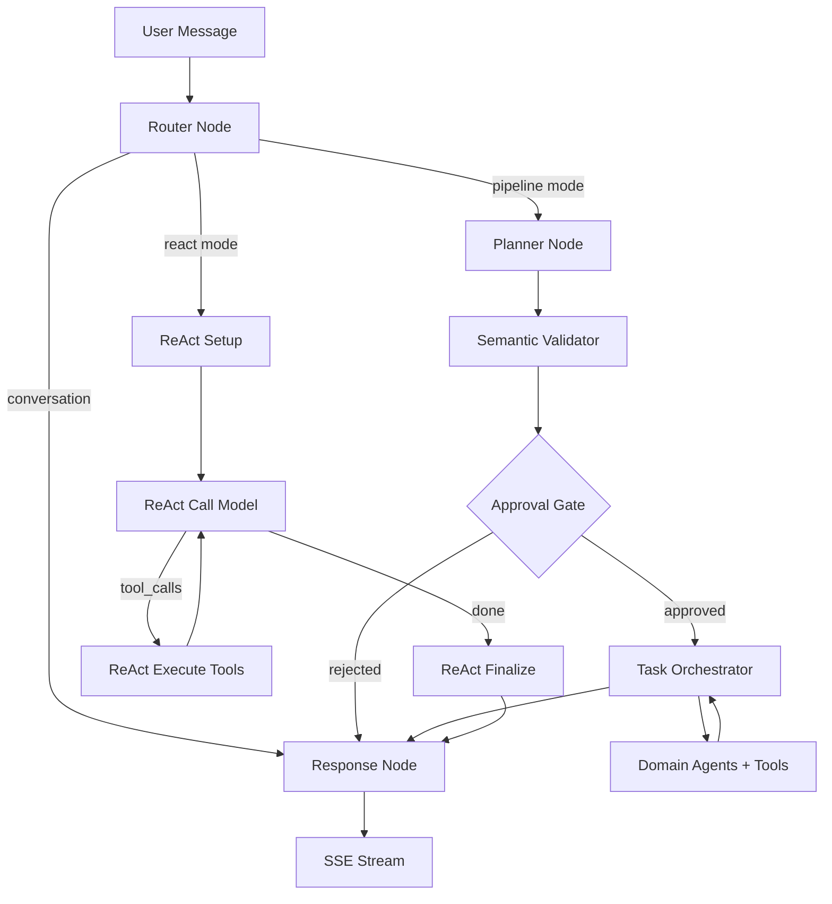

# LIA — Vollständiger technischer Leitfaden

> Architektur, Patterns und Engineering-Entscheidungen eines KI-Multi-Agent-Assistenten der nächsten Generation.
>
> Technische Präsentationsdokumentation für Architekten, Ingenieure und technische Experten.

**Version**: 4.5
**Datum**: 2026-08-20
**Application**: LIA v1.30.14
**Lizenz**: AGPL-3.0 (Open Source)

---

## Inhaltsverzeichnis

1. [Kontext und grundlegende Entscheidungen](#1-kontext-und-grundlegende-entscheidungen)
2. [Technologie-Stack](#2-technologie-stack)
3. [Backend-Architektur: Domain-Driven Design](#3-backend-architektur-domain-driven-design)
4. [LangGraph: Multi-Agent-Orchestrierung](#4-langgraph-multi-agent-orchestrierung)
5. [Die konversationelle Ausführungspipeline](#5-die-konversationelle-ausführungspipeline)
6. [Das Planungssystem (ExecutionPlan DSL)](#6-das-planungssystem-executionplan-dsl)
7. [Smart Services: intelligente Optimierung](#7-smart-services-intelligente-optimierung)
8. [Semantisches Routing und KI-gestützte Embeddings](#8-semantisches-routing-und-ki-gestützte-embeddings)
9. [Human-in-the-Loop: 6-Schichten-Architektur](#9-human-in-the-loop-6-schichten-architektur)
10. [State-Management und Message Windowing](#10-state-management-und-message-windowing)
11. [Gedächtnissystem und psychologisches Profil](#11-gedächtnissystem-und-psychologisches-profil)
12. [Multi-Provider-LLM-Infrastruktur](#12-multi-provider-llm-infrastruktur)
13. [Konnektoren: Multi-Provider-Abstraktion](#13-konnektoren-multi-provider-abstraktion)
14. [MCP: Model Context Protocol](#14-mcp-model-context-protocol)
15. [Sprachsystem (STT/TTS)](#15-sprachsystem-stttts)
16. [Proaktivität: Heartbeat und geplante Aktionen](#16-proaktivität-heartbeat-und-geplante-aktionen)
17. [RAG Spaces und hybride Suche](#17-rag-spaces-und-hybride-suche)
18. [Browser Control und Web Fetch](#18-browser-control-und-web-fetch)
19. [Sicherheit: Defence in Depth](#19-sicherheit-defence-in-depth)
20. [Observability und Monitoring](#20-observability-und-monitoring)
21. [Performance: Optimierungen und Metriken](#21-performance-optimierungen-und-metriken)
22. [CI/CD und Qualität](#22-cicd-und-qualität)
23. [Übergreifende Engineering-Patterns](#23-übergreifende-engineering-patterns)
24. [Architekturentscheidungen (ADR)](#24-architekturentscheidungen-adr)
25. [Evolutionspotenzial und Erweiterbarkeit](#25-evolutionspotenzial-und-erweiterbarkeit)
26. [Psyche Engine: Dynamische emotionale Intelligenz](#26-psyche-engine-dynamische-emotionale-intelligenz)
27. [Deterministisches Gewohnheitslernen](#27-deterministisches-gewohnheitslernen)
28. [Eine Instanz regieren: Ausgaben, Fähigkeiten, Installation](#28-eine-instanz-regieren-ausgaben-fähigkeiten-installation)
29. [Per Datei verwalten: Die Arbeitsmappe ist das Formular](#29-per-datei-verwalten-die-arbeitsmappe-ist-das-formular)

30. [Das Evolutionsprogramm: sichtbare Arbeit, gesteuertes Lernen](#30-das-evolutionsprogramm-sichtbare-arbeit-gesteuertes-lernen)
---

## 1. Kontext und grundlegende Entscheidungen

### 1.1. Warum diese Entscheidungen?

Jede technische Entscheidung in LIA antwortet auf eine konkrete Anforderung. Das Projekt zielt auf einen Multi-Agent-KI-Assistenten, der **auf bescheidener Hardware selbst gehostet werden kann** (Raspberry Pi 5, ARM64), mit vollständiger Transparenz, Datensouveränität und Multi-Provider-LLM-Unterstützung. Diese Anforderungen haben den gesamten Stack bestimmt.

| Anforderung | Architektonische Konsequenz |
|------------|--------------------------|
| Self-Hosting ARM64 | Docker Multi-Arch, semantische Embeddings (mehrsprachig), Playwright Chromium Cross-Platform |
| Datensouveränität | Lokales PostgreSQL (kein SaaS-DB), Fernet-Verschlüsselung im Ruhezustand, lokale Redis-Sessions |
| Multi-Provider-LLM | Factory Pattern mit 7 Adaptern, Konfiguration pro Knoten, keine enge Kopplung an einen Provider |
| Vollständige Transparenz | 473 Prometheus-Metriken, eingebettetes Debug-Panel, Token-für-Token-Tracking |
| Produktionszuverlässigkeit | 238 ADRs, ~19.844 von pytest gesammelte Tests in 1.119 Dateien, native Observability, HITL auf 6 Ebenen |
| Kontrollierte Kosten | Smart Services (89 % Token-Einsparung), semantische Embeddings, Prompt Caching, Katalogfilterung |

### 1.2. Architekturprinzipien

| Prinzip | Implementierung |
|----------|----------------|
| **Domain-Driven Design** | Bounded Contexts in `src/domains/`, explizite Aggregate, Schichten Router/Service/Repository/Model |
| **Hexagonale Architektur** | Ports (Python-Protokolle) und Adapter (konkrete Google/Microsoft/Apple-Clients) |
| **Event-Driven** | SSE-Streaming, ContextVar-Propagation, Fire-and-Forget-Hintergrundaufgaben |
| **Defence in Depth** | 5 Schichten für Usage Limits, 6 HITL-Ebenen, 3 Anti-Halluzinations-Schichten |
| **Feature Flags** | Jedes Subsystem aktivierbar/deaktivierbar (`{FEATURE}_ENABLED`) |
| **Configuration as Code** | Pydantic BaseSettings zusammengesetzt via MRO, Prioritätskette APPLICATION > .ENV > CONSTANT |

### 1.3. Codebase-Metriken

| Metrik | Wert |
|----------|--------|
| Tests | ~19.844 von pytest gesammelt (von pytest über 1.119 Testdateien gesammelt) + 5.815 vitest-Tests im Frontend (Abdeckungsschwellen fixiert, ADR-116) |
| Wiederverwendbare Fixtures | 170+ |
| Dokumentationsdokumente | 490+ |
| ADRs (Architecture Decision Records) | 229 |
| Prometheus-Metriken | 473 Definitionen |
| Grafana-Dashboards | 26 |
| Unterstützte Sprachen (i18n) | 6 (fr, en, de, es, it, zh) |

---

## 2. Technologie-Stack

### 2.1. Backend

| Technologie | Version | Rolle | Warum diese Wahl |
|-------------|---------|------|-------------------|
| Python | 3.12+ | Runtime | Reichstes ML/KI-Ökosystem, natives Async, vollständiges Typing |
| FastAPI | 0.136.3 | REST-API + SSE | Automatische Pydantic-Validierung, OpenAPI-Docs, Async-First, Performance |
| LangGraph | 1.2.11 | Multi-Agent-Orchestrierung | Einziges Framework mit nativer State-Persistenz + Zyklen + Interrupts (HITL) |
| LangChain Core | 1.5.5 | LLM/Tools-Abstraktionen | `@tool`-Decorator, Nachrichtenformate, standardisierte Callbacks |
| SQLAlchemy | 2.0.50 | Async ORM | `Mapped[Type]` + `mapped_column()`, Async Sessions, `selectinload()` |
| PostgreSQL | 16 + pgvector | Datenbank + Vektorsuche | Native LangGraph-Checkpoints, semantische HNSW-Suche, Reife |
| Redis | 7.4 | Cache, Sessions, Rate Limiting | O(1)-Operationen, atomisches Sliding Window (Lua), SETNX Leader Election |
| Pydantic | 2.13.4 | Validierung + Serialisierung | `ConfigDict`, `field_validator`, Settings-Komposition via MRO |
| structlog | latest | Strukturiertes Logging | JSON-Ausgabe mit automatischer PII-Filterung, snake_case Events |
| Gemini Embeddings | gemini-embedding-001 | Semantische Embeddings | Mehrsprachige Gemini-Embeddings (Gedächtnis, Routing, Interessen, Journale) — ADR-069 |
| Playwright | latest | Browser-Automatisierung | Chromium Headless, CDP Accessibility Tree, Cross-Platform |
| APScheduler | 3.x | Hintergrund-Jobs | Cron/Interval-Trigger, kompatibel mit Redis Leader Election |

### 2.2. Frontend

| Technologie | Version | Rolle |
|-------------|---------|------|
| Next.js | 16.2.10 | App Router, SSR, ISR |
| React | 19.2.7 | UI mit Server Components |
| TypeScript | 6.0.2 | Striktes Typing |
| TailwindCSS | 4.3.2 | Utility-First CSS |
| TanStack Query | 5.101 | Server State Management, Cache, Mutations |
| Radix UI | v2 | Barrierefreie UI-Primitives |
| react-i18next | 17.0 | i18n (6 Sprachen), Namespace-basiert |
| Zod | 4.x | Runtime-Validierung der Debug-Schemata |

### 2.3. Unterstützte LLM-Provider

| Provider | Modelle | Besonderheiten |
|----------|---------|-------------|
| OpenAI | GPT-5.4, GPT-5.4-mini, GPT-5.2, GPT-5.1, GPT-5 (+ mini/nano), GPT-4.1, GPT-4o, o3/o4-mini | Natives Prompt Caching, Responses API, reasoning_effort |
| Anthropic | Claude Opus 4.6/4.5, Claude Sonnet 4.6, Claude Haiku 4.5 | Extended Thinking, Prompt Caching |
| Google | Gemini 3.1/3 Pro, Gemini 3.1/3 Flash, Gemini 2.5 Pro/Flash | Multimodal, Dual-Vector-Embeddings |
| DeepSeek | deepseek-v4-flash, deepseek-v4-pro (V4), deepseek-chat (V3), deepseek-reasoner (R1) | Reduzierte Kosten, natives Reasoning |
| Perplexity | Sonar, Sonar Pro | Search-Augmented Generation |
| Qwen | qwen3.5-plus, qwen3.5-flash, qwen3-max | Thinking Mode, Tools + Vision (Alibaba Cloud) |
| Ollama | Jedes lokale Modell (dynamische Erkennung) | Null API-Kosten, Self-Hosted |

**Warum 7 Provider?** Die Auswahl ist kein Selbstzweck. Es ist eine Resilienzstrategie: Jeder Knoten der Pipeline kann einem anderen Provider zugewiesen werden. Wenn OpenAI die Preise erhöht, wechselt der Router auf DeepSeek. Wenn Anthropic einen Ausfall hat, wird die Antwort auf Gemini umgeleitet. Die LLM-Abstraktion (`src/infrastructure/llm/factory.py`) verwendet das Factory Pattern mit `init_chat_model()`, überschrieben durch spezifische Adapter (`ResponsesLLM` für die OpenAI Responses API, Eligibility per Regex `^(gpt-4\.1|gpt-5|o[1-9])`).

---

## 3. Backend-Architektur: Domain-Driven Design

### 3.1. Domänenstruktur

```
apps/api/src/
├── core/                         # Übergreifender technischer Kern
│   ├── config/                   # 9 Pydantic BaseSettings-Module zusammengesetzt via MRO
│   │   ├── __init__.py           # Settings-Klasse (finale MRO)
│   │   ├── agents.py, database.py, llm.py, mcp.py, voice.py, usage_limits.py, ...
│   ├── constants.py              # 1 000+ zentralisierte Konstanten
│   ├── exceptions.py             # Zentralisierte Exceptions (raise_user_not_found, etc.)
│   └── i18n.py                   # i18n-Bridge → Settings
│
├── domains/                      # Bounded Contexts (DDD)
│   ├── agents/                   # HAUPTDOMÄNE — LangGraph-Orchestrierung
│   │   ├── nodes/                # 7+ Graphknoten
│   │   ├── services/             # Smart Services, HITL, Context Resolution
│   │   ├── tools/                # Werkzeuge nach Domäne (@tool + ToolResponse)
│   │   ├── orchestration/        # ExecutionPlan, Parallel Executor, Validators
│   │   ├── registry/             # AgentRegistry, domain_taxonomy, Catalogue
│   │   ├── semantic/             # Semantic Router, Expansion Service
│   │   ├── middleware/           # Memory Injection, Personality Injection
│   │   ├── prompts/v1/           # 86 versionierte .txt-Prompt-Dateien
│   │   ├── graphs/               # 15 Agent-Builder (einer pro Domäne)
│   │   ├── context/              # Context Store (Data Registry), Decorators
│   │   └── models.py             # MessagesState (TypedDict + Custom Reducer)
│   ├── auth/                     # OAuth 2.1, BFF-Sessions, RBAC
│   ├── connectors/               # Multi-Provider-Abstraktion (Google/Apple/Microsoft)
│   ├── rag_spaces/               # Upload, Chunking, Embedding, hybrides Retrieval
│   ├── journals/                 # Introspektive Tagebücher
│   ├── interests/                # Erlernen von Interessensgebieten
│   ├── heartbeat/                # LLM-gesteuerte proaktive Benachrichtigungen
│   ├── channels/                 # Multi-Kanal (Telegram)
│   ├── voice/                    # TTS Factory, STT Sherpa, Wake Word
│   ├── skills/                   # Standard agentskills.io
│   ├── sub_agents/               # Spezialisierte persistente Agenten
│   ├── peers/                    # Verbindungen zwischen Nutzern (Assistent-zu-Assistent-Relais)
│   ├── relations/                # Persönliches CRM (Aggregation + Favoriten)
│   ├── usage_limits/             # Kontingente pro Benutzer (5-Layer Defence)
│   └── ...                       # conversations, reminders, scheduled_actions, users, user_mcp
│
└── infrastructure/               # Übergreifende Schicht
    ├── llm/                      # Factory, Providers, Adapter, Embeddings, Tracking
    ├── cache/                    # Redis Sessions, LLM Cache, JSON Helpers
    ├── mcp/                      # MCP Client Pool, Auth, SSRF, Tool Adapter, Excalidraw
    ├── browser/                  # Playwright Session Pool, CDP, Anti-Erkennung
    ├── rate_limiting/            # Verteiltes Redis Sliding Window
    ├── scheduler/                # APScheduler, Leader Election, Locks
    └── observability/            # 23 Prometheus-Metrik-Dateien, OTel-Tracing
```

### 3.2. Konfigurationsprioritätskette

Eine fundamentale Invariante durchzieht das gesamte Backend. Sie wurde in v1.9.4 systematisch durchgesetzt, mit ~291 Korrekturen in ~80 Dateien, da Abweichungen zwischen Konstanten und tatsächlicher Produktionskonfiguration stille Fehler verursachten:

```
APPLICATION (Admin UI / DB) > .ENV (settings) > CONSTANT (fallback)
```

**Warum diese Kette?** Die Konstanten (`src/core/constants.py`) dienen ausschließlich als Fallback für Pydantic-`Field(default=...)`- und SQLAlchemy-`server_default=`-Werte. Ein Administrator, der ein LLM-Modell über die Oberfläche ändert, muss diese Änderung sofort wirksam sehen, ohne erneutes Deployment. Zur Laufzeit liest jeglicher Code `settings.field_name`, niemals direkt eine Konstante.

### 3.3. Schichten-Patterns

| Schicht | Verantwortlichkeit | Schlüssel-Pattern |
|--------|---------------|-------------|
| **Router** | HTTP-Validierung, Auth, Serialisierung | `Depends(get_current_active_session)`, `check_resource_ownership()` |
| **Service** | Geschäftslogik, Orchestrierung | Konstruktor erhält `AsyncSession`, erstellt Repositories, zentralisierte Exceptions |
| **Repository** | Datenzugriff | Erbt von `BaseRepository[T]`, Paginierung `tuple[list[T], int]` |
| **Model** | DB-Schema | `Mapped[Type]` + `mapped_column()`, `UUIDMixin`, `TimestampMixin` |
| **Schema** | I/O-Validierung | Pydantic v2, `Field()` mit Beschreibung, getrennte Request/Response |

---

## 4. LangGraph: Multi-Agent-Orchestrierung

### 4.1. Warum LangGraph? (ADR-001)

Die Wahl von LangGraph anstelle von LangChain allein, CrewAI oder AutoGen basiert auf drei nicht verhandelbaren Anforderungen:

1. **State Persistence**: `TypedDict` mit Custom Reducers, persistiert über PostgreSQL-Checkpoints — ermöglicht die Wiederaufnahme einer Konversation nach HITL-Unterbrechung
2. **Zyklen und Interrupts**: Native Unterstützung von Schleifen (HITL-Ablehnung → Neuplanung) und des `interrupt()`-Patterns — ohne das der HITL mit 6 Schichten unmöglich wäre
3. **SSE-Streaming**: Native Integration mit Callback Handlers — entscheidend für die Echtzeit-UX

CrewAI und AutoGen waren einfacher in der Einarbeitung, aber keines von beiden unterstützte das Interrupt/Resume-Pattern, das für HITL auf Plan-Ebene erforderlich ist. Diese Entscheidung hat ihren Preis: Die Lernkurve ist steiler (Graph-Konzepte, bedingte Kanten, State-Schemata).

### 4.2. Der Hauptgraph

LIA bietet zwei Ausführungsmodi (pro Benutzer über einen Toggle in der Chat-Header umschaltbar): **Pipeline** (Standard, deterministisch und token-effizient) und **ReAct** (autonom und iterativ). Der Router klassifiziert die Anfrage zuerst (direktes Gespräch oder umsetzbar) und leitet sie dann an den aktiven Modus weiter.



### 4.3. Graphknoten

| Knoten | Datei | Rolle | Windowing |
|------|---------|------|-----------|
| Router v3 | `router_node_v3.py` | Binäre Klassifikation conversation/actionable | 5 Turns |
| QueryAnalyzer | `query_analyzer_service.py` | Domänenerkennung, Intent-Extraktion | — |
| Planner v3 | `planner_node_v3.py` | ExecutionPlan-DSL-Generierung | 10 Turns |
| Semantic Validator | `semantic_validator.py` | Validierung von Abhängigkeiten und Kohärenz | — |
| Approval Gate | `hitl_dispatch_node.py` | HITL interrupt(), 6 Genehmigungsebenen | — |
| Task Orchestrator | `task_orchestrator_node.py` | Parallele Ausführung, Kontextweitergabe | — |
| Response | `response_node.py` | Anti-Halluzinations-Synthese, 3 Schutzschichten | 20 Turns |

### 4.4. AgentRegistry und Domain Taxonomy

Die `AgentRegistry` zentralisiert die Registrierung von Agenten (`registry.register_agent()` in `main.py`), den `ToolManifest`-Katalog und die `domain_taxonomy.py`, die jede Domäne mit ihrem `result_key` und ihren Aliasen definiert.

**Warum ein zentralisiertes Register?** Ohne dieses erforderte das Hinzufügen eines Agenten die Änderung von 5+ Dateien. Mit dem Register deklariert sich ein neuer Agent an einem einzigen Punkt und ist automatisch für Routing, Planung und Ausführung verfügbar.

### 4.5. Domain Taxonomy

Jede Domain ist eine deklarative `DomainConfig`: Name, Agents, `result_key` (kanonischer Schlüssel für `$steps`-Referenzen), `related_domains`, Priorität und Routingfähigkeit. Die `DOMAIN_REGISTRY` ist die einzige Wahrheitsquelle, die von drei Subsystemen konsumiert wird: SmartCatalogue (Filterung), semantische Expansion (benachbarte Domains) und Initiative-Phase (struktureller Vorfilter).

### 4.6. Tool Manifests

Jedes Tool deklariert ein `ToolManifest` über einen fluenten `ToolManifestBuilder`: Parameter, Outputs, Kostenprofil, Berechtigungen und mehrsprachige `semantic_keywords` für das Routing. Manifeste werden vom Planner (Katalog-Injektion), dem semantischen Router (Keyword-Matching) und dem Agent-Builder (Tool-Verdrahtung) konsumiert. Siehe Abschnitt 23 für die vollständige Tool-Architektur.

---

## 5. Die konversationelle Ausführungspipeline

### 5.1. Detaillierter Ablauf einer aktionsfähigen Anfrage

1. **Empfang**: Benutzernachricht → SSE-Endpunkt `/api/v1/chat/stream`
2. **Kontext**: `request_tool_manifests_ctx` ContextVar wird einmalig aufgebaut (ADR-061: 3-Layer Defence)
3. **Router**: Binäre Klassifikation mit Konfidenz-Scoring (high > 0.85, medium > 0.65)
4. **QueryAnalyzer**: Identifiziert Domänen via LLM + Post-Expansion-Validierung (Gate-Keeper, der deaktivierte Domänen filtert)
5. **SmartPlanner**: Generiert einen `ExecutionPlan` (strukturiertes JSON-DSL)
   - Pattern Learning: Konsultiert den bayesschen Cache (Bypass bei Konfidenz > 90 %)
   - Skill Detection: Deterministische Skills werden über `_has_potential_skill_match()` geschützt
6. **Semantic Validator**: Überprüft die Kohärenz der Abhängigkeiten zwischen Schritten
7. **HITL Dispatch**: Klassifiziert die Genehmigungsebene, `interrupt()` bei Bedarf
8. **Task Orchestrator**: Führt Schritte in parallelen Wellen via `asyncio.gather()` aus
   - Filtert übersprungene Schritte VOR dem Gather (ADR-005 — behebt einen Bug der doppelten Ausführung Plan+Fallback)
   - Kontextweitergabe über Data Registry (InMemoryStore)
   - FOR_EACH-Pattern für Masseniterationen
9. **Response Node**: Synthetisiert die Ergebnisse, Injection von Gedächtnis + Journalen + RAG
10. **SSE Stream**: Token für Token zum Frontend
11. **Hintergrundaufgaben** (Fire-and-Forget): Gedächtnisextraktion, Journalextraktion, Interessenerkennung

### 5.2. ContextVar: implizite Zustandspropagation

Ein kritischer Mechanismus ist die Verwendung von Python-`ContextVar` zur Zustandspropagation ohne Parameter-Threading:

| ContextVar | Rolle | Warum |
|------------|------|----------|
| `current_tracker` | TrackingContext für LLM-Token-Tracking | Vermeidet die Weitergabe eines Trackers durch 15 Funktionsschichten |
| `request_tool_manifests_ctx` | Pro Anfrage gefilterte Tool-Manifeste | Einmal aufgebaut, von 7+ Verbrauchern gelesen (eliminiert Duplikation ADR-061) |

Dieser Ansatz gewährleistet eine Isolation pro Anfrage in einem asyncio-Kontext, ohne Funktionssignaturen zu verunreinigen.

### 5.3. ReAct-Ausführungsmodus (ADR-070)

LIA bietet einen zweiten Ausführungsmodus: **ReAct** (Reasoning + Acting). Anstatt vorab zu planen, ruft das LLM iterativ Tools auf, beobachtet die Ergebnisse und entscheidet autonom den nächsten Schritt.

**Architektur**: 4 eigene Knoten im übergeordneten LangGraph-Graphen (kein Subgraph):

```
Router → react_setup → react_call_model ↔ react_execute_tools → react_finalize → Response
```

**Pipeline vs ReAct — Engineering-Abwägungen**:

| Aspekt | Pipeline (Standard) | ReAct (⚡) |
|--------|-------------------|-----------|
| **Token-Kosten** | **4–8× niedriger** — 1 Planner- + 1 Antwort-Aufruf | 1 LLM-Aufruf pro Iteration (2–15 Iterationen typisch) |
| **Planung** | Vorab ExecutionPlan mit semantischer Validierung | Keine — LLM entscheidet Schritt für Schritt |
| **Parallelausführung** | Ja — `asyncio.gather()` Wellen | Nein — sequenzielle Tool-Aufrufe |
| **Anpassungsfähigkeit** | Folgt dem Plan starr | Passt sich bei jedem Tool-Ergebnis an |
| **Kontrolle** | Voll — Planner-DSL, HITL-Gates, Validatoren | Minimal — promptgesteuertes Verhalten |
| **Kostenvorhersehbarkeit** | Hoch — begrenzt durch Planschritte | Niedrig — abhängig vom LLM-Reasoning |
| **Ideal für** | Strukturierte Multi-Domain-Anfragen | Explorative Recherche, mehrdeutige Fragen |

Der Pipeline-Modus ist eine echte Ingenieursleistung: SmartPlanner, Semantic Validator, Bayesianischer Pattern-Cache und paralleler Executor liefern zusammen die gleiche funktionale Leistung wie ReAct bei einem Bruchteil der Token-Kosten. Der Kompromiss liegt bei der Anpassungsfähigkeit — wenn die optimale Tool-Reihenfolge nicht vorab vorhersagbar ist, glänzt ReActs iteratives Reasoning.

Beide Modi teilen sich dasselbe Tool-Register, HITL-System, den Response-Knoten und die Observability-Infrastruktur. Benutzer wechseln über einen Schalter im Chat-Header zwischen den Modi.

### 5.4. Entkoppelte Ausführungen: Die Generierung überlebt die Verbindung (ADR-117)

Klassisches SSE-Streaming hat einen strukturellen Makel: Die Generierung lebt *im* HTTP-Response-Generator. Tab schließen, wegnavigieren oder Netzwerkverlust tötet die Verbindung — und mit ihr den gesamten Konversationszug. LIA entkoppelt beides: Ein **entkoppelter Producer** (eine von der Anfrage unabhängige asyncio-Task) führt den Graphen aus und publiziert jeden Chunk in einen **Redis Stream pro Run**; der SSE-Endpunkt wird zum bloßen **Subscriber**, der diesen Stream weiterreicht.

- **Verbindungsabbruch ≠ Abbruch** — die Seite zu schließen beendet das Abonnement, nie die Generierung. Die Benutzernachricht wird *vor* Ausführungsbeginn archiviert, die Antwort wird serverseitig fertiggestellt und wartet in der Konversation.
- **Live-Wiederaufnahme** — bei der Rückkehr (Seiten-Mount, Tab-Sichtbarkeit) erkennt das Frontend den aktiven Run, spielt alle bereits emittierten Chunks ab (ohne Pacing) und wechselt dann auf den Live-Strom; die Grenze ist ein SSE-Transportkommentar (`: replay-end`), der Chunk-Vertrag bleibt unberührt. Während des Replays werden Seiteneffekte (Toasts, Audio) unterdrückt, während der Reducer die laufende Antwortblase rekonstruiert.
- **Stille-Erkennung auf Client-Seite** — die Wiederaufnahme setzt weiterhin voraus, dass der Client weiß, dass er wieder aufnehmen muss. Ein vom Betriebssystem eingefrorener Tab erhält weder Ende noch Fehler: Der Lesevorgang bleibt hängen, die Oberfläche glaubt weiter zu empfangen, und der Schutz für einen lebenden Stream blockiert genau die Wiederaufnahme. Ein am Herzschlag-Rhythmus des Servers ausgerichtetes Stille-Budget entscheidet: Danach wird die tote Verbindung verworfen, der Zustand kehrt in den Ruhezustand zurück und das oben beschriebene Wiederanklinken übernimmt. Browser-Timer frieren mit dem Tab ein, die Frist läuft also beim Aufwachen ab — genau dann, wenn sie nützt.
- **Ein Run pro Konversation** — ein Redis-Lock (`SET NX EX` + Producer-Heartbeat + zombie-sichere konditionale Lua-Freigabe) lässt einen konkurrierenden Sendeversuch mit HTTP 409 antworten, den das Frontend in ein stilles Wiederanhängen verwandelt.
- **Worker-übergreifender Abbruch** — der Sende-Button verwandelt sich in einen Stop-Button; das Abbruchsignal läuft über Redis und wird producerseitig gepollt (~1 s), auch wenn der Producer in einem anderen Worker lebt als die HTTP-Anfrage. Die Teilantwort bleibt erhalten und wird als „unterbrochen“ markiert; bereits verbrauchte Tokens bleiben abgerechnet — die Abrechnung wird auf jedem Ausstiegspfad eingehalten, Kills eingeschlossen.
- **Stimme nur, wenn jemand zuhört** — die Subscriber-Präsenz (ein Redis-Zähler mit periodisch neu gespannter TTL) steuert die Sprachsynthese: kein TTS für einen Run, dem niemand zuhört, und ein Zuhörer, der mittendrin dazustößt, bekommt die Stimme für den Rest.
- **Sauberes Herunterfahren** — beim Shutdown entleert der Lifespan laufende Producer, bevor er die Kontrolle abgibt; ein getöteter Run archiviert sein Teilergebnis mit dem Flag `interrupted`, und eine Reparatur zu Beginn des nächsten Zugs räumt verwaiste `tool_calls` auf, die ein unterbrochener Checkpoint hinterlassen würde (strikte Provider lehnen sie beim nächsten Zug ab).

Das Ganze wird über ein Feature-Flag und ein Dutzend env-konfigurierbarer Einstellungen (TTLs, Heartbeat, Drain, Polling) gesteuert, die beim Boot validiert werden — eine mit der Lock-TTL unvereinbare Heartbeat-Periode verweigert den Start.

---

**Verankerung an jüngsten Entitäten.** Bei einem Zug ohne Werkzeugaufruf ist das Register des laufenden Zuges konstruktionsbedingt leer (Schutz vor Kontamination), und der Gesprächsverlauf schließt Werkzeugmeldungen bewusst aus: Das Antwortmodell hat dann *keinerlei* maßgebliche strukturierte Daten und kann frühere Prosa nur umformulieren. Die jüngsten Entitäten aus dem State werden deshalb über einen eigenen Prompt-Abschnitt erneut eingespeist — nach Aktualität ausgewählt, altersbegrenzt, ohne Speicherzugriff und ausdrücklich nachrangig gegenüber den Daten des laufenden Zuges. Eine Autoritätsregel ergänzt das: Das Erfinden eines Entitätsattributs ist untersagt, und ein angefragter, aber nie erhaltener Wert muss als fehlend benannt werden.

### 5.5. Generierte Artefakte: von der Anfrage zur herunterladbaren Datei (ADR-226)

Seit v1.30.9 kann die Pipeline mit einer Datei enden statt nur mit Prosa. Das Werkzeug `generate_document` folgt derselben Architektur wie die Bildgenerierung — ein virtueller Agent im Katalog, kein eigener Graphknoten — aber sein „Generator" ist ein dedizierter LLM-Slot (`document_generation`, administrierbar wie jeder andere), aufgerufen mit **strukturierter Ausgabe, typisiert je Formatfamilie**: tabellarischer Inhalt für CSV/Excel, ein Abschnittsbaum für Word/PDF/Markdown/Text, eine Folienliste für PowerPoint. Das Schema wird *vor* dem Aufruf gewählt, jede Antwort ist also strikt schema-validiert; dann baut ein **reiner lokaler Renderer** die exakten Bytes — openpyxl, python-docx, python-pptx, PyMuPDF: die bereits für die RAG-Extraktion mitgelieferten Bibliotheken, die nun schreiben statt lesen, ohne jeden Dokumentdienst von Dritten.

Drei Designentscheidungen tragen das Feature. Erstens die Ehrlichkeit des Artefakts: Tabellenzellen werden gegen Formel-Injektion neutralisiert (eine Probe bewies, dass openpyxl `=1+2` als lebendige Formel speichert), während legitime negative Zahlen unberührt bleiben, und ein Fehler nach dem bezahlten LLM-Aufruf liefert einen expliziten Fehler — nie eine Phantomkarte. Zweitens die Verkettung: Der Planer kann die Ergebnisse eines Web-Recherche-Schritts in den Dokumentschritt einspeisen (`source_data`), sodass „recherchieren, dann als CSV formalisieren" eine einzige Anfrage ist. Drittens der Lebenszyklus: Die Datei landet im bestehenden Attachment-Store mit derselben TTL-Bereinigung wie generierte Bilder, und ihre Karte — live über den SSE-Done-Chunk geliefert und über einen gemeinsamen Serialisierer in den Nachrichten-Metadaten persistiert — zeigt das exakte Ablaufdatum.

## 6. Das Planungssystem (ExecutionPlan DSL)

### 6.1. Planstruktur

```python
ExecutionPlan(
    steps=[
        ExecutionStep(
            step_id="get_meetings",
            tool_name="get_events",
            parameters={"date": "tomorrow"},
            dependencies=[]
        ),
        ExecutionStep(
            step_id="send_reminders",
            tool_name="send_email",
            parameters={"subject": "Rappel réunion"},
            dependencies=["get_meetings"],
            for_each="$steps.get_meetings.events",
            for_each_max=10
        )
    ]
)
```

### 6.2. FOR_EACH-Pattern

**Warum ein dediziertes Pattern?** Massenoperationen (eine E-Mail an 12 Kontakte senden) können nicht als 12 statische Schritte geplant werden — die Anzahl der Elemente ist vor der Ausführung des vorherigen Schritts unbekannt. FOR_EACH löst dieses Problem mit Schutzmaßnahmen:
- HITL-Schwelle: Jede Mutation >= 1 Element löst eine obligatorische Genehmigung aus
- Konfigurierbares Limit: `for_each_max` verhindert unbegrenzte Ausführungen
- Dynamische Referenz: `$steps.{step_id}.{field}` für Ergebnisse vorheriger Schritte

Die Identität eines korrelierten Ergebnisses schließt sein Elternobjekt ein. Werkzeuge leiten ihre Id allein aus dem Inhalt ab — Wetter aus `Ort + Tag`, eine Route aus `Start + Ziel` — sodass zwei Iterationen über Elternobjekte mit denselben Attributen dieselbe Id erzeugten und der Akkumulator, ein schlichtes `dict.update()`, das erste still überschrieb. Die Id wird nun je Elternobjekt über einen deterministischen Fingerabdruck gebildet, was Identitäten auch bei einer Wiederholung oder Fortsetzung nach Unterbrechung stabil hält.

### 6.3. Parallele Ausführung in Wellen

Der `parallel_executor.py` organisiert die Schritte in Wellen (DAG):
1. Identifiziert Schritte ohne unaufgelöste Abhängigkeiten → nächste Welle
2. Filtert übersprungene Schritte (nicht erfüllte Bedingungen, Fallback-Zweige) — **vor** `asyncio.gather()`, nicht danach (ADR-005: behebt einen Bug, der 2x API-Aufrufe und 2x Kosten verursachte)
3. Führt die Welle mit Fehlerisolation pro Schritt aus
4. Speist die Data Registry mit den Ergebnissen
5. Wiederholt bis zur vollständigen Planabarbeitung

### 6.4. Semantischer Validator

Vor der HITL-Genehmigung prüft ein dediziertes LLM (vom Planner getrennt, um Selbstvalidierungs-Bias zu vermeiden) den Plan anhand von 14 Problemtypen in vier Kategorien: **Kritisch** (halluzinierte Fähigkeit, Geistabhängigkeit, logischer Zyklus), **Semantisch** (Kardinalitäts-Mismatch, Scope-Overflow/-Underflow, falsche Parameter), **Sicherheit** (gefährliche Mehrdeutigkeit, implizite Annahme) und **FOR_EACH** (fehlende Kardinalität, ungültige Referenz). Short-Circuit für triviale Pläne (1 Schritt), optimistisches 1-s-Timeout.


Ergänzend erkennt ein **selbstanreicherndes Anti-Halluzinations-Register** (`hallucinated_tools.json`) vom LLM erfundene Tools über persistente Regex-Muster. Jede neue Halluzination wird automatisch zum Register hinzugefügt. Halluzinierte Schritte werden entfernt und der Planner wird gezwungen, mit echten Katalog-Tools neu zu planen.

Ein Urteil klassifiziert, es verurteilt nicht — und eine **Diagnose ist keine Frage**. Wenn ein *schreibender* Plan seine automatischen Replans ausgeschöpft hat, verweigert der Validator die Ausführung und übergibt an eine HITL-Rückfrage: Falsche Daten zu schreiben kostet mehr, als zu fragen. Was der Nutzerin dann gestellt wird, ist eine Frage **in ihrer Sprache**, aus einer Tabelle von fünfzehn Einträgen, deren Vollständigkeit beim Start **in beide Richtungen** geprüft wird — ein Problem, das der Code auslösen kann, ohne dass eine Frage dafür geschrieben ist, verhindert den Start der Anwendung, und eine Frage, die kein Code auslösen kann, ebenso. Die interne Fehlerbeschreibung bleibt in der Ablaufspur, wo sie hingehört. Dasselbe Prinzip gilt für die Werte: Ein in einer früheren Runde angegebener Parameter wird **aus dem vorherigen Plan übernommen** statt neu erfunden, denn die Reparatur erkennt eine Dokumentationsadresse und überschreibt nie einen echten Wert — eine Meinungsänderung wird immer respektiert (ADR-195).

Die Ehrlichkeit des Urteils reicht bis in die Ausführung. Jedes Werkzeug liefert ein typisiertes Urteil — Erfolg oder Ablehnung, mit Ursache — und der Plan-Executor reicht es **unverändert** weiter: Eine Ablehnung wird nie als erledigte Aktion dargestellt, ein fehlgeschlagener Schritt zählt nicht als „ausgeführt“ (die Schicht, die Blockaden benennt, behält damit ihre Wahrheit), und ein Fehlschlag wird nie als Gesprächskontext gespeichert. Ist die verletzte Beschränkung nicht reparierbar — der Inhalt des Nutzers überschreitet eine im Katalog veröffentlichte Grenze —, wird sie zur **ersten gestellten Frage**, mit den exakten Zahlen und in der Sprache des Nutzers, statt einer generischen Rückfrage. Und was eine Massenoperation bestätigt, ist die nach der Vorausführung **gemessene** Anzahl, nie eine theoretische Obergrenze.

### 6.5. Die Wahrheit einer Referenz (ADR-194)

Eine schrittübergreifende Referenz (`$steps.get_meetings.events[0].title`) wird vom Planer geschrieben, **bevor** der Schritt gelaufen ist. Der Pfad muss deshalb auf Anhieb stimmen, sonst scheitert der Plan nach kostenpflichtigen API-Aufrufen und der Wartezeit der Nutzerin.

Was ihn stimmen lässt, ist ein **Vertrag**: Jedes Werkzeug-Manifest veröffentlicht die Pfade, die seine Ausgabe trägt, und die Continuous Integration beweist diesen Vertrag vor jedem Zusammenführen von Code. Die Prüfung steuert das reale Werkzeug an — seinen echten Builder, den echten Referenz-Resolver, den rekonstruierten Merge — und vergleicht, was das Manifest veröffentlicht, mit dem, was die Ausführung liefert: den Pfad selbst, seine **Form** (Datensatz, Liste, Liste von Datensätzen) und seinen **Typ** (Zeichenkette, Zahl, Objekt). Der Planer liest diesen Typ, um zu entscheiden, worin er einen Wert verketten kann: Ein falscher Typ zerbricht einen Plan genauso sicher wie ein falscher Pfad.

Der Vertrag ist bewusst **asymmetrisch**: Alles Veröffentlichte muss produziert werden, nie umgekehrt. Ein Manifest listet *Beispiele*, keine vollständige Aufzählung — `events[0].summary` ist real, ob jemand daran gedacht hat, es aufzuschreiben, oder nicht; die Umkehrung zu verlangen würde legitime Pfade ablehnen.

Die Abdeckung wird genannt statt angenommen: Bei der Annotationskampagne deckten 36 der damals 59 pfadveröffentlichenden Werkzeuge sie ab. Was sich aufgrund der Bauform eines Werkzeugs schwer ansteuern lässt, wird in einer Schuldenakte beziffert und datiert, statt implizit zu bleiben. Zur Laufzeit ist das Netz `ReferenceResolver`, der einen expliziten Fehler wirft, statt ins Leere aufzulösen.

### 6.6. Adaptiver Re-Planner (Panic Mode)

Bei Ausführungsfehlern klassifiziert ein regelbasierter Analysator (kein LLM) das Fehlermuster (leere Ergebnisse, Teilausfall, Timeout, Referenzfehler) und wählt eine Recovery-Strategie: identischer Retry, Replan mit erweitertem Scope, Eskalation an den Benutzer oder Abbruch. Diese Entscheidung ist **derzeit beratend**: sie wird bei jedem Fehler protokolliert und gezählt, wodurch die Fehlermodi messbar werden, aber der Orchestrator wendet sie noch nicht automatisch an — Teilergebnisse werden ausgegeben statt verworfen. Im **Panic Mode** erweitert der SmartCatalogue alle Tools für einen einzigen Retry — für Fälle, in denen die Domain-Filterung zu aggressiv war.

---

### 6.7. Aufgerufene Fähigkeit: wenn die Anfrage kein Satz ist

Ein Plan entsteht aus Text. Kommt die Anfrage jedoch von einem **Knopf** — eine benannte Karte, angehakte Kästchen —, besitzt das System diese Gewissheit, **bevor** irgendein Modell befragt wird. Sie in Prosa zu verwandeln und dann drei stochastische Stufen (Analysator, Planer, Validierer) für ihre Rückgewinnung aufzuwenden, zerstört Information und bezahlt dafür, sie wiederzufinden. Gemessen: das erwartete Werkzeug erreichte **0,853**, den besten Wert des Katalogs, und der Plan rief ein allgemeines auf.

Die Anfrage trägt daher neben dem angezeigten Satz die **aufgerufene Fähigkeit**: ein Paar `{capability, subject}`. `capability` ist ein **geschlossenes** `Literal`, das Pydantic an der HTTP-Grenze zurückweist — der Browser benennt eine Fähigkeit, **nie** ein Werkzeug, und der Server entscheidet, welches nur lesende Werkzeug sie umsetzt. Diese Tür führt zu keinem verändernden Werkzeug. Der Transport zum Planer ist eine anfragebezogene `ContextVar`, an derselben Stelle und mit derselben Disziplin gesetzt wie die Skill-Einstellungen.

Angewendet wird sie **vor der Validierung**, genau wie das Zurückholen von Werten in ihre Grenzen: was mechanisch reparierbar ist, wird repariert und nie als Mangel gemeldet. Der Plan wird **bereichert, nicht ersetzt** — alles, was der Planer vorgesehen hat und das etwas beiträgt, bleibt; was er vorgesehen hat und die Fähigkeit ohnehin abdeckt, entfällt, denn eine unpassende Antwort neben einer benannten Lücke widerspricht ihr. Zwei Sicherungen: ein Schritt, den ein anderer noch liest — über eine erklärte Abhängigkeit **oder** eine `$steps`-Referenz —, bleibt erhalten, und ein Plan ohne Schritte (offene Rückfrage, an einen Skill delegierte Ausführung) wird nie in eine Ausführung verwandelt. Eine Garantie, die eine Frage überschreibt, ist keine Garantie.

---

## 7. Smart Services: intelligente Optimierung

### 7.1. Das gelöste Problem

Ohne Optimierung ließen die Skalierung auf 10+ Domänen die Kosten explodieren: Der Übergang von 3 Tools (Kontakte) auf 30+ Tools (10 Domänen) verzehnfachte die Prompt-Größe und damit die Kosten pro Anfrage (ADR-003). Die Smart Services wurden entwickelt, um diese Kosten auf das Niveau eines Einzeldomänensystems zurückzubringen.

| Service | Rolle | Mechanismus | Gemessener Gewinn |
|---------|------|-----------|-------------|
| `QueryAnalyzerService` | Routing-Entscheidung | LRU-Cache (TTL 5 Min.) | ~35 % Cache Hit |
| `SmartPlannerService` | Plangenerierung | Bayessches Pattern Learning | Bypass > 90 % Konfidenz |
| `SmartCatalogueService` | Tool-Filterung | Filterung nach Domäne | 96 % Token-Reduktion |
| `PlanPatternLearner` | Lernen | Bayessches Scoring Beta(2,1) | ~2 300 eingesparte Tokens pro Replan |

### 7.2. PlanPatternLearner

**Funktionsweise**: Wenn ein Plan validiert und erfolgreich ausgeführt wird, wird seine Tool-Sequenz in Redis gespeichert (Hash `plan:patterns:{tool→tool}`, TTL 30 Tage). Für zukünftige Anfragen wird ein bayesscher Score berechnet: `Konfidenz = (α + Erfolge) / (α + β + Erfolge + Misserfolge)`. Über 90 % wird der Plan direkt ohne LLM-Aufruf wiederverwendet.

**Schutzmaßnahmen**: K-Anonymität (mindestens 3 Beobachtungen für Vorschlag, 10 für Bypass), exaktes Domänen-Matching, maximal 3 injizierte Patterns (~45 Token Overhead), striktes Timeout von 5 ms.

**Bootstrapping**: 50+ vordefinierte Golden Patterns beim Start, jeweils mit 20 simulierten Erfolgen (= 95,7 % anfängliche Konfidenz).

### 7.3. QueryIntelligence

Der QueryAnalyzer liefert weit mehr als Domain-Erkennung — er erzeugt eine tiefe `QueryIntelligence`-Struktur: unmittelbare Absicht vs. Endziel (`UserGoal`: FIND_INFORMATION, TAKE_ACTION, COMMUNICATE...), implizite Absichten (z.B. „Kontakt finden“ bedeutet wahrscheinlich „etwas senden“), antizipierte Fallback-Strategien, FOR_EACH-Kardinalitätshinweise und softmax-kalibrierte Domain-Konfidenzwerte. Dies gibt dem Planner ein reicheres Bild als einfache Keyword-Extraktion.

### 7.4. Semantischer Pivot

Anfragen in jeder Sprache werden automatisch ins Englische übersetzt, bevor Embedding-Vergleiche stattfinden, was die sprachübergreifende Genauigkeit verbessert. Redis-gecacht (TTL 5 Min, ~5 ms bei Hit vs ~500 ms bei Miss), über ein schnelles LLM.

### 7.5. Katalog-Abschluss

Die semantische Filterung bewertet Werkzeuge anhand einer **englischen Umschreibung der Anfrage, die ein Modell bei jeder Runde neu erzeugt**: Dieselbe Frage kann also zwei verschiedene Kataloge ergeben. Verlangen die ausgewählten Werkzeuge einen Wert, den keines von ihnen liefern kann – die ID einer Nachricht, um darauf zu antworten –, ist der Raum gültiger Pläne leer, **bevor** das Modell überhaupt beginnt. Es kann dann nur noch einen Werkzeugnamen erfinden.

Der Abschluss wendet eine Regel an, die die Anfrage nie ansieht: *Jede Art von Wert, die ein Werkzeug im Katalog benötigt, muss von einem anderen Werkzeug im Katalog erzeugt werden.* Das ist ein Linker, der offene Referenzen auflöst, keine Suche, die rät. Zwei Bedingungen machen die Regel korrekt statt bloß plausibel: Ein Werkzeug erfüllt nie seine eigene Anforderung („auf eine E-Mail antworten“ erzeugt ebenfalls eine Nachrichten-ID – die der gerade gesendeten), und nur ein **lesendes** Werkzeug gilt als Quelle (man löst keinen Versand aus, um eine Kennung zu erfahren). Gemessenes Katalogwachstum: **+1 Werkzeug**.

---

### 7.6. Domänenübergreifende Erreichbarkeit

Das Schließen des Katalogs klärt, was ein Plan **verketten** darf. Davor steht eine andere Frage: welche Werkzeuge überhaupt **hineinkommen**. Die Filterung verwirft jedes Werkzeug, dessen Domäne nicht zu den erkannten gehört — **bevor** irgendein semantischer Wert gelesen wird. Ein wirklich domänenübergreifendes Werkzeug ist damit für jede anders eingeordnete Anfrage unsichtbar, so gut es auch bewertet sein mag.

Gemessen: das Werkzeug für den 360°-Überblick zu einer Person lebt in der Domäne `contact`, während die Anweisung des Analysators jede Frage zu einem verbundenen Nutzer in die Domäne `peer` schickt. Bewertung **0,853** — die beste des gesamten Katalogs, gegenüber allgemeinen Werkzeugen bei 0,000 — und nie dem Planer vorgelegt. Wenn es funktionierte, dann weil das Modell von seiner Anweisung abgewichen war: ein stochastischer Ausweg, kein regulärer Pfad.

Ein Manifest erklärt nun die **zusätzlichen** Domänen, aus denen es erreichbar ist, und eine **einzige Implementierung** beantwortet „ist dieses Werkzeug im Geltungsbereich?“ für beide Filterstrategien, die dieselbe Frage bisher jede für sich stellten. Jeder Wert wird bei der Registrierung gegen das Domänenregister geprüft: eine unbekannte Domäne verweigert den Start, statt das Werkzeug still unauffindbar zu machen. Sparsam zu deklarieren — jede zusätzliche Domäne erweitert die Auswahl für **alle** Anfragen dieser Domäne. Das ist nicht dasselbe wie zwei Domänen zu verknüpfen: Verknüpfen zieht ihre gesamten Werkzeugkästen ineinander, was bereits einen Produktionsvorfall verursacht hat. Hier bewegt sich ein Werkzeug, keine Domäne.
### 7.7. Der Katalog einer Domäne ist ein Angebot an Fähigkeiten

Die Filterung nach Domäne hat eine Folge, die erst die Messung sichtbar machte: **Was der Katalog einer Domäne enthält, bestimmt, was der Planer wollen kann**. In der Produktion erzeugte die Frage nach dem letzten Anruf einen zweistufigen Plan — den Kontakt suchen und dann **dort anrufen, um es zu erfragen**. Nur eine fehlgeschlagene Referenz stoppte ihn.

Das war keine Laune des Modells, sondern die einzige Art zu gehorchen. Der Prompt nennt `Primary domain: telephony`, eine Regel prüft, ob der Plan diese Domäne abdeckt, und der Katalog von `telephony` enthielt **genau eine Fähigkeit: einen Anruf tätigen**. Die eigene Primärdomäne abzudecken hieß also zu handeln.

Drei Lesefähigkeiten kamen hinzu, **jede in der Domäne, der sie fehlte** — Anrufe, offene Zusagen, weitergeleitete Nachrichten. Die Alternative über die zusätzlichen Domänen aus dem vorigen Abschnitt wurde gemessen und verworfen: Diese drei von `contact` aus erreichbar zu machen verdrängte **sechs schreibende Werkzeuge** aus den vollsten Katalogen, da die Obergrenze fest ist. Eine Lesefähigkeit darf keine Schreibfähigkeit kosten.

Eine **deterministische** Regel vervollständigt das Ganze, vor jedem Modellaufruf: nicht-mutierende Absicht erkannt + Plan ruft ein schreibendes Werkzeug auf → Plan ungültig. Sie läuft mit den übrigen Pre-LLM-Regeln und ist damit außer Reichweite jener Ausnahme, die jeden gut verketteten, mit einer Mutation endenden Plan von der Prüfung befreite — also genau die fehlerhafte Form. Je besser der Plan geformt war, desto weniger wurde er geprüft.

Beide Katalog-Obergrenzen (normal und Panikmodus) wurden zu Einstellungen, mit einer Prüfung beim Start: **die Rückfall-Obergrenze liegt nie unter der normalen**, sonst böte das Sicherheitsnetz weniger als der Weg, der gerade gescheitert ist.

---


## 8. Semantisches Routing und KI-gestützte Embeddings

### 8.1. Warum semantische Embeddings? (ADR-049)

Das rein LLM-basierte Routing hatte zwei Probleme: Kosten (jede Anfrage = ein LLM-Aufruf) und Genauigkeit (das LLM lag bei ~20 % der Multi-Domänen-Fälle falsch). Semantische Embeddings lösen beide Probleme:

| Eigenschaft | Wert |
|-----------|--------|
| Anbieter | Google Gemini (`gemini-embedding-001`) |
| Sprachen | 100+ |
| Genauigkeitsgewinn | +48 % bei Q/A-Matching vs. LLM-Routing allein |

### 8.2. Semantic Tool Router (ADR-048)

Jedes `ToolManifest` besitzt mehrsprachige `semantic_keywords`. Die Anfrage wird in ein Embedding transformiert und dann per Kosinusähnlichkeit mit **Max-Pooling** verglichen (Score = MAX pro Tool, nicht Durchschnitt — vermeidet semantische Verwässerung). Doppelschwelle: >= 0.70 = hohe Konfidenz, 0.60-0.70 = Unsicherheit.

### 8.3. Semantische Expansion

Der `expansion_service.py` fügt dem Planner-Katalog die Domänen hinzu, die eine fehlende Information liefern können. Der Auslöser ist **evidenzgesteuert**: Die Erkennung von Personenreferenzen ist die Vereinigung dreier Quellen — die Mappings des Memory-Resolvers (per Konstruktion Personenreferenzen), extrahierte relationale Referenzen selbst wenn die Auflösung keinen Fakt findet, und die typisierten Referenzen des Analyse-LLM. Eine referenzierte Entität (Person → `Contact`, Termin → `CalendarEvent`, Ort → `Place`, E-Mail → `EmailMessage`) bringt die Domänen ein, deren Ontologie-`properties` einen von den ausgewählten Tools benötigten Typ liefern — eine Verankerung, die jede blinde Expansion verhindert, mit konfigurierbarer Obergrenze und Vollständigkeitsprüfung des Mappings beim Start (ADR-120).

Gespeist wird die Schicht von **tiefgehend annotierten** Manifesten (`semantic_type` auf Parametern und Outputs: Termin-Teilnehmer, E-Mail-Absender, Routenziel — ADR-121), die auch die domänenübergreifenden Jinja2-Verknüpfungsvorschläge und eine **Ausführungs-Schutzvorrichtung** antreiben: Ein Personenname kann niemals einen adress-/e-mail-typisierten Parameter erreichen — der Aufruf schlägt vor jeder API-Ausgabe mit einem behebbaren Fehler fehl, in beiden Ausführungsmodi. Die Post-Expansion-Validierung (ADR-061, Layer 1) filtert weiterhin vom Administrator deaktivierte Domänen.

---

## 9. Human-in-the-Loop: 6-Schichten-Architektur

### 9.1. Warum auf Plan-Ebene? (Phase 7 → Phase 8)

Der ursprüngliche Ansatz (Phase 7) unterbrach die Ausführung **während** der Tool-Aufrufe — jedes sensible Tool erzeugte eine Unterbrechung. Die UX war unzureichend (unerwartete Pausen) und die Kosten hoch (Overhead pro Tool).

Phase 8 (aktuell) legt den **vollständigen Plan** dem Benutzer **vor** jeder Ausführung vor. Eine einzige Unterbrechung, ein Gesamtüberblick, die Möglichkeit, Parameter zu bearbeiten. Der Kompromiss: Man muss darauf vertrauen, dass der Planner einen getreuen Plan erstellt.

### 9.2. Die 6 Genehmigungstypen

| Typ | Auslöser | Mechanismus |
|------|-------------|-----------|
| `PLAN_APPROVAL` | Destruktive Aktionen | `interrupt()` mit PlanSummary |
| `CLARIFICATION` | Erkannte Mehrdeutigkeit | `interrupt()` mit LLM-Frage |
| `DRAFT_CRITIQUE` | E-Mail-/Event-/Kontakt-Entwurf | `interrupt()` mit serialisiertem Entwurf + Markdown-Template |
| `DESTRUCTIVE_CONFIRM` | Löschung >= 3 Elemente | `interrupt()` mit Irreversibilitätswarnung |
| `FOR_EACH_CONFIRM` | Massenmutationen | `interrupt()` mit Operationszählung |
| `MODIFIER_REVIEW` | Von KI vorgeschlagene Änderungen | `interrupt()` mit Vorher/Nachher-Vergleich |

### 9.3. Erweitertes Draft Critique

Für Entwürfe generiert ein dedizierter Prompt eine strukturierte Kritik mit Markdown-Templates pro Domäne, Feld-Emojis, Vorher/Nachher-Vergleich mit Durchstreichen für Aktualisierungen und Irreversibilitätswarnungen. Die Post-HITL-Ergebnisse zeigen i18n-Labels und anklickbare Links an.

### 9.4. Antwortklassifikation

Wenn der Benutzer auf einen Genehmigungsprompt antwortet, kategorisiert ein Full-LLM-Klassifikator (kein Regex) die Antwort in 5 Entscheidungen: **APPROVE**, **REJECT**, **EDIT** (gleiche Aktion, andere Parameter), **REPLAN** (völlig andere Aktion) oder **AMBIGUOUS**. Eine Degradierungslogik verhindert False Positives: ein EDIT mit fehlenden Parametern wird zu AMBIGUOUS herabgestuft, was eine Klärungsnachfrage auslöst.

### 9.5. Replay-sichere Überarbeitungsschleifen (ADR-092)

Die Resume-Semantik von LangGraph führt den unterbrochenen Node **vollständig** neu aus: Vergangene `interrupt()`-Aufrufe liefern ihre gespeicherten Werte, alles andere läuft erneut live. Jede Schleife um `interrupt()` innerhalb eines Nodes wiederholt daher ihre Seiteneffekte (LLM- und API-Aufrufe) bei jeder Benutzerentscheidung. Beide Überarbeitungsschleifen — iterative Entwurfsbearbeitung und Bulk-Bestätigung (dedizierter `for_each_confirm`-Node) — folgen einem normativen Muster: **ein `interrupt()` pro Node-Ausführung**, der Schleifenzustand fließt durch den checkpointed Graph-State, die Iteration erfolgt über eine bedingte Self-Loop-Kante. Durch kompilierte Replay-Harnische bewiesene Garantie: Jede LLM-Änderung läuft genau einmal und der bestätigte Inhalt ist exakt der zuletzt angezeigte.

### 9.6. Compaction Safety

4 Bedingungen verhindern die LLM-Komprimierung (Zusammenfassung alter Nachrichten) während aktiver Genehmigungsflüsse. Ohne diesen Schutz könnte eine Zusammenfassung den kritischen Kontext einer laufenden Unterbrechung löschen.

---

## 10. State-Management und Message Windowing

### 10.1. MessagesState und Custom Reducer

Der LangGraph-State ist ein `TypedDict` mit einem Reducer `add_messages_with_truncate`, der tokenbasierte Trunkierung, Validierung von OpenAI-Nachrichtensequenzen und Deduplizierung von Tool-Nachrichten verwaltet.

Seit v1.30.12 wird der State durch einen **typisierten Ausführungskontext** ergänzt (`LiaRuntimeContext`, ADR-231): eine eingefrorene Dataclass, die als `context_schema` des Graphen deklariert ist und Identität, Einstellungen und lebende Abhängigkeiten des Runs trägt (SSE-Queue, Werkzeug-Container). Anders als der State wird dieser Kontext nie gecheckpointet noch kopiert — die Objektidentität bleibt vom Knoten über den Subgraphen bis zum Werkzeug erhalten — und ein Assert am Eingang des Graphen weist jeden Run ohne Kontext ab, auch beim Fortsetzen eines HITL-Interrupts, wo das Fehlen zuvor stumm degradierte.

### 10.2. Warum Windowing pro Knoten? (ADR-007)

**Das Problem**: Eine Konversation mit 50+ Nachrichten erzeugte 100k+ Token Kontext, mit einer Latenz > 10 s für den Router und explodierenden Kosten.

**Die Lösung**: Jeder Knoten operiert auf einem anderen Fenster, kalibriert auf seinen tatsächlichen Bedarf:

| Knoten | Turns | Begründung |
|------|-------|---------------|
| Router | 5 | Schnelle Entscheidung, minimaler Kontext genügt |
| Planner | 10 | Kontextbedarf für die Planung, aber nicht die gesamte Historie |
| Response | 20 | Reicher Kontext für natürliche Synthese |

**Gemessene Auswirkung**: E2E-Latenz -50 % (10 s → 5 s), Kosten -77 % bei langen Konversationen, Qualität erhalten dank Data Registry, die Tool-Ergebnisse unabhängig von Nachrichten speichert.

### 10.3. Context Compaction

Wenn die Token-Anzahl einen dynamischen Schwellenwert überschreitet (Verhältnis zum Context Window des Antwortmodells), wird eine LLM-Zusammenfassung generiert. Kritische Identifikatoren (UUIDs, URLs, E-Mails) werden beibehalten. Einsparverhältnis: ~60 % pro Komprimierung. Befehl `/resume` für manuelles Auslösen.

**Betriebliche Resilienz**: Jeder LLM-Aufruf wird in ein `asyncio.wait_for` pro Chunk (Standard 35 s) und ein globales Budget von 120 s eingebettet. Bei vorübergehenden Fehlern wiederholt `tenacity.AsyncRetrying` bis zu 3-mal mit exponentiellem Backoff. Wenn die Zusammenfassung weiterhin nicht abgeschlossen werden kann, kürzt ein expliziter Fallback (`_truncation_fallback`) den älteren Verlauf sauber mit einer lesbaren `SystemMessage`, die Identifikatoren bewahrt — kein stiller Stub. Frühere `compaction #N`-Zusammenfassungen werden im Merge konsolidiert, statt Turn für Turn angehäuft.

**SSE-Custom-Mode-Signal**: Der Knoten emittiert `compaction_start` / `compaction_done` über `langgraph.config.get_stream_writer()` durch einen `stream_mode="custom"` (LangGraph 1.x). Der Streaming-Service übersetzt diese Payloads in `ChatStreamChunk(type="execution_step")`. Im Frontend bleibt ein auf einer stabilen ID (`COMPACTION_TOAST_ID`) gemorphter sonner-Toast während der gesamten Komprimierung sichtbar, das Eingabefeld ist über `status="compacting"` gesperrt, und eine `ContextUsagePill` zeigt fortlaufend das Tokens/Schwellen-Verhältnis. Das gleichzeitige SSE-Keepalive (`iter_with_keepalive`) pulst alle 15 s `: heartbeat` während stiller Awaits, um Cloudflare-Idle-Cuts zu neutralisieren. Fünf Prometheus-Metriken (`compaction_chunk_timeouts_total`, `compaction_global_timeouts_total`, `compaction_total_duration_seconds`, `compaction_writer_unavailable_total`, `compaction_executions_total{strategy}`) speisen ein dediziertes Grafana-Dashboard.

### 10.4. PostgreSQL-Checkpointing

Vollständiger State wird nach jedem Knoten checkpointet. P95 Save < 50 ms, P95 Load < 100 ms, durchschnittliche Größe ~15 KB/Konversation. Checkpointer und Store laufen jeweils auf einem dedizierten PostgreSQL-Verbindungspool pro Worker (Größen per Umgebung einstellbar): parallele Unterhaltungen serialisieren nicht mehr über eine einzige Verbindung, und eine abgebrochene Verbindung wird beim Checkout erkannt und automatisch ersetzt (ADR-111).

### 10.5. Die System-Blöcke eines ReAct-Zuges sind Zustand (ADR-169/170)

`get_windowed_messages(include_system=True)` **zieht jede `SystemMessage` nach vorn**, ohne Fensterbegrenzung. Die System-Blöcke des Zuges in den Verlauf zu stapeln bedeutete daher, bei jedem Aufruf alle bisherigen Kopien erneut zu senden: `react_agent_prompt.txt` wiegt **840 Tokens**, drei Züge also 2.520 duplizierte Tokens — pro LLM-Aufruf jeder Iteration. Da das Präfix mit jedem Zug wuchs, konnte kein Anbieter-Präfix-Cache je greifen, und Anthropic wies die Sequenz ab dem zweiten Zug zurück: Eine `SystemMessage` darf nicht mitten in einem Verlauf stehen.

Die Blöcke leben jetzt in einem eigenen Zustandsschlüssel und werden bei jedem Aufruf führend neu zusammengesetzt — das Präfix ist wieder stabil. Das Zustandsschema wechselt auf **1.4**, mit einer additiven, idempotenten Migration. Das Windowing entfernt geerbte `SystemMessage`s aus dem Verlauf, **außer der Compaction-Zusammenfassung**: Eine erste Fassung des Fixes stellte die Kontiguität her, indem sie diese Zusammenfassung zerstörte — die Review genau dieses Fixes hat die richtige Lösung hervorgebracht.

**Die Frist der Schleife misst die Rechenzeit, nicht die Wanduhr.** `interrupt()` wirft: Der Knoten kehrt nie zurück, keine Zustandsänderung wird persistiert, kein Zeitstempel erneuert, und die Wiederaufnahme betritt erneut den unterbrochenen Knoten, ohne den Router zu wiederholen, in dem das Zurücksetzen lebte — **2,01 s Wanduhr für 0,0102 s Rechenzeit**, an einem realen Graphen gemessen. Nach Ablauf des Budgets wurde der wiederaufgenommene Zug bei der nächsten Routing-Entscheidung abgeschnitten und die Antwort durch einen zweiten LLM-Aufruf neu erzeugt, die mehrstufige Arbeit verloren. Eine Stagnationssperre vervollständigt das Ganze: Beim vierten identischen Werkzeugaufruf wird das Modell zum Kurswechsel aufgefordert, beim fünften endet der Zug. Der Fingerabdruck ist ein HMAC auf den Anwendungsschlüssel — er übersteht eine Wiederaufnahme auf einem anderen Worker — und nur Fingerabdruck und Zähler erreichen den Checkpoint, nie der Werkzeugname oder seine Argumente.

---

## 11. Gedächtnissystem und psychologisches Profil

### 11.1. Architektur

```
AsyncPostgresStore + Semantic Index (pgvector)
├── Namespace: (user_id, "memories")        → Psychologisches Profil
├── Namespace: (user_id, "documents", src)  → Dokumenten-RAG
└── Namespace: (user_id, "context", domain) → Tool-Kontext (Data Registry)
```

### 11.2. Erweitertes Gedächtnisschema

Jede Erinnerung ist ein strukturiertes Dokument mit:
- `content`, `category` (Präferenz, Fakt, Persönlichkeit, Beziehung, Sensibilität...)
- `importance` (1-10), `emotional_weight` (-10 bis +10)
- `usage_nuance`: Wie diese Information auf einfühlsame Weise verwendet werden soll
- Embedding `gemini-embedding-001` (1536d) via pgvector HNSW

**Warum ein emotionales Gewicht?** Ein Assistent, der weiß, dass deine Mutter krank ist, diese Tatsache aber wie jede andere Information behandelt, ist bestenfalls unbeholfen, schlimmstenfalls verletzend. Das emotionale Gewicht ermöglicht die Aktivierung der `DANGER_DIRECTIVE` (Verbot zu scherzen, zu minimieren, zu vergleichen, zu bagatellisieren), wenn ein sensibles Thema berührt wird.

### 11.3. Extraktion und Injection

**Extraktion**: Nach jeder Konversation analysiert ein Hintergrundprozess die letzte Benutzernachricht, angepasst an die aktive Persönlichkeit. Kosten werden über `TrackingContext` verfolgt.

**Injection**: Die Middleware `memory_injection.py` sucht semantisch ähnliche Erinnerungen, baut das injizierbare psychologische Profil auf und aktiviert bei Bedarf die `DANGER_DIRECTIVE`. Injection in den System-Prompt des Response Node.

**Welche Züge das Gedächtnis speisen.** Eine Nachricht, die eine Aktion auslöst, zählt genauso wie ein Gespräch: Das Fortsetzen eines Entwurfs fügt keine Nachricht ein, sodass die ursprüngliche Anfrage zum Zeitpunkt der Extraktion weiterhin die letzte Äußerung des Nutzers ist. Umgekehrt werden **vom System erzeugte** Nachrichten — das bei einer HITL-Ablehnung eingefügte Gerüst — in ihren Metadaten markiert und sowohl als Ziel wie als Kontext ausgeschlossen: niemals an ihrem Text erkannt, denn es existiert in sechs Sprachen. Schließlich gilt die Heuristik, die Bestätigungen verwirft, nur für das, was der Nutzer tatsächlich getippt hat — auf einen Personennamen angewandt, ließ sie die Erinnerungen an Kontakte verschwinden, deren Nachname „gut“ oder „cool“ ähnelt. Jede Entscheidung wird pro Teilsystem und Ausgang gezählt (`post_response_extraction_scheduled_total`), wo es zuvor nur Debug-Logs gab.

### 11.4. Gedächtnissuche über zwei Vektoren

Jede Erinnerung trägt **zwei Embeddings**: eines über ihren Inhalt, eines über die auslösenden Schlüsselwörter. Die Anfrage wird mit beiden verglichen, der bessere Treffer gewinnt (`LEAST(dist_content, dist_keyword)`, Rückfall auf den Inhalt, wenn der Schlüsselwortvektor leer ist).

Eine **hybride BM25-+-pgvector-Maschinerie** lebte hier bis v1.14.0, als das Langzeitgedächtnis auf ein eigenes PostgreSQL-Modell migrierte. Der Suchpfad folgte, der hybride Pfad nicht: Am 2026-07-27 hatte er **überhaupt keinen Aufrufer mehr**, 21 % Abdeckung, 100 von 127 Zeilen nie erreicht — und das Debug-Panel bewarb die Option dennoch beim Nutzer. Modul, Einstellungen, Metriken und Anzeige wurden gemeinsam entfernt ([ADR-168](https://github.com/jgouviergmail/LIA-Assistant/blob/main/docs/architecture/ADR-168-Removal-Of-Dead-Hybrid-Memory-Search.md)). Die hybride Suche lebt weiter, aber dort, wo sie tatsächlich verwendet wird: RAG Spaces (Abschnitt 17).

### 11.5. Stratifizierte Tagebücher (Journals)

Der Assistent führt introspektive Reflexionen, organisiert nach vier Themen (Selbstreflexion, Benutzerbeobachtungen, Ideen/Analysen, Erkenntnisse) UND vier Abstraktionsebenen (`L0` Rohbeobachtung, `L1` Direktive `WENN→TUE WEIL`, `L2` übergreifendes Muster, `L3` Porträt-Facette — siehe [ADR-079](https://github.com/jgouviergmail/LIA/blob/main/docs/architecture/ADR-079-Stratified-Journal-Consciousness.md)). Jeder Eintrag trägt einen epistemischen Status (`confidence` ∈ {low, medium, high}) und zwei Zähler (`evidence_count`, `contradiction_count`).

**Doppelauslöser**: Post-Konversations-Extraktion (fire-and-forget, häufig, leichtgewichtig) + periodische Konsolidierung (4–12 h pro Benutzer, komplex).

**Gemini Dual-Vector-Embeddings** (`gemini-embedding-001`, 1536d, ADR-069): ein Vektor auf `title + content`, einer auf `search_hints`. Die Suche verwendet `LEAST(dist_content, dist_keyword)` pro Zeile, um das introspektive Vokabular des Assistenten und das Vokabular des Benutzers zu überbrücken.

**Verzögerte Selbstauswertung T → T+1**: `MessagesState.injected_journal_ids` (symmetrisch zu `injected_memories`) trägt die IDs zwischen Runden. Der `response_node` liest die IDs der vorherigen Runde am Anfang, übergibt sie an den Post-Konversations-Extraktor und schreibt die IDs der aktuellen Runde am Ende. Der Extraktor sieht die angewandten Direktiven + die Reaktion des Benutzers im selben Prompt und signalisiert `evidence_outcome="evidence" | "contradiction"` bei Update-Aktionen — der Service erhöht die Zähler atomar (Anti-Halluzinations-Schicht 4: der LLM signalisiert nur ein Ergebnis, der Service besitzt die Ganzzahlen). **Null zusätzliche LLM-Kosten** (gleicher Extraktionsaufruf, angereicherter Prompt).

**Ambiente Diffusion des Nutzer-Porträts**: Die Konsolidierung produziert im **gleichen LLM-Aufruf** (kein zusätzlicher Aufruf) ein `portrait_full` (~200 Tokens, Konversation/Planer) und ein `portrait_brief` (~60 Tokens, sekundäre Flüsse), die in der `users`-Tabelle persistiert werden. Der Builder `build_journal_user_model_block(user_id, format, flow)` (`src/domains/journals/portrait_builder.py`, Spiegel von `build_psyche_prompt_block`) gibt einen `<UserModelContext>...</UserModelContext>`-Block mit graceful degradation zurück. Verbreitet über **8 Flüsse**: 2 primäre im Vollformat (`response_node`, `planner_node_v3`) und 6 sekundäre im Kurzformat (`react_setup_node`, `interests/proactive_task`, `scheduler/reminder_notification`, `voice/service`, `heartbeat/prompts`, `agents/services/fallback_response` sync + async).

**Drei Nutzer-Korrekturhebel** auf das Porträt (niemals direkt editierbar): (1) CRUD-Bearbeitungen der L3-Quelleinträge, (2) `POST /journals/portrait/feedback` (Freitext → L0-Eintrag mit `source=user_correction` + synchrone Re-Konsolidierung, die L3-Einträge neu gewichtet), (3) `POST /journals/consolidate` (manuelle Konsolidierung, umgeht Cooldown).

**Dedup-Disziplin**: kein Write-Time-Guard (in v1.14.0 entfernt). Bei der Konsolidierung führt `STEP 1` einen expliziten Paar-Scan durch, der semantische Duplikate fusioniert, und `STEP 5` clustert konvergente L1 aktiv zu L2-Mustern.

**4 Anti-Halluzinations-Schichten**: Pydantic `field_validator` auf UUIDs, ID-Referenztabelle im Prompt, Filterung der Aktionen durch bekannte IDs bei Extraktion und Konsolidierung, und atomare Zähler-Inkremente (der LLM signalisiert nur `evidence_outcome`).

**Dedizierte Observability**: 11 Prometheus-Metriken in `src/infrastructure/observability/metrics_journals.py` — `journal_entries_total{action,theme,source}`, `journal_evidence_total{outcome}`, `journal_consolidation_promotions_total{from_level,to_level}`, `journal_level_distribution{level}`, `journal_portrait_present_total{flow,format}`, `journal_portrait_age_hours`, `journal_portrait_feedback_total{outcome}` usw.

### 11.6. Interessensystem

Erkennung durch Analyse der Anfragen mit bayesscher Gewichtsentwicklung (konfigurierbarer Decay). Interessen werden per Batch-LLM-Clustering zu **Themen** gruppiert (abgeleitete, selbstheilende Daten), und die Benachrichtigungsauswahl zieht mit **zweistufiger Seltenheit** (Themen-Cooldown + Priorität für die am wenigsten bedienten Themen und Interessen) — eine Leidenschaft monopolisiert nie die Benachrichtigungen. Multi-Source-Inhalte (Perplexity, Brave, Wikipedia, LLM-Reflexion) mit deterministisch angehängten **klickbaren Quellenlinks**. Benutzerfeedback (Daumen hoch/runter/blockieren) passt die Gewichtungen an; nächtliche Fusion von Quasi-Duplikaten.

---

**Die Selbstbewertungsschleife des Journals und die adaptive Schwelle.** In eine Antwort injizierte Direktiven werden im nächsten Zug im Licht der Nutzerreaktion neu bewertet: Das LLM signalisiert nur `evidence` oder `contradiction`, das System besitzt die Zähler, und eine serverseitige Klammer verbietet „hohes“ Vertrauen für eine operative Direktive ohne Beleg — L2/L3 bleiben frei, ihr Beleg ist die Konvergenz zwischen Einträgen. Die Konsolidierungs-Eignung ist delta-gesteuert (Arbeit existiert: nie konsolidiert, oder ein Eintrag seit dem letzten Lauf berührt), nie ein absoluter Zählwert. Schließlich ist die Ähnlichkeitsschwelle für eine Injektion nicht mehr global: Ein begrenzter (0,55–0,70), hysteretischer (ein 0,01-Schritt pro 24 h), abschaltbarer Regler lernt sie pro Nutzer aus der realen Verteilung seiner Scores — der Zustand ist beratend (Redis, gleitende TTL), ein fehlgeschlagenes Lesen fällt auf den statischen Standard zurück.

## 12. Multi-Provider-LLM-Infrastruktur

### 12.1. Factory Pattern

```python
llm = get_llm(provider="openai", model="gpt-5.4", temperature=0.7, streaming=True)
```

`get_llm()` löst die effektive Konfiguration über `get_llm_config_for_agent(settings, agent_type)` auf (Code-Defaults → DB-Admin-Overrides), instanziiert das Modell und wendet die spezifischen Adapter an.

### 12.2. 56 LLM-Konfigurationstypen

Jeder Knoten der Pipeline ist über die Admin-UI unabhängig konfigurierbar — ohne erneutes Deployment:

| Kategorie | Konfigurierbare Typen |
|-----------|-------------------|
| Pipeline | router, query_analyzer, planner, semantic_validator, context_resolver |
| Antwort | response, hitl_question_generator |
| Hintergrund | memory_extraction, interest_extraction, journal_extraction, journal_consolidation |
| Agenten | contacts_agent, emails_agent, calendar_agent, browser_agent, etc. |

### 12.3. Token Tracking

Der `TrackingContext` verfolgt jeden LLM-Aufruf mit `call_type` ("chat"/"embedding"), `sequence` (monotoner Zähler), `duration_ms`, Tokens (Input/Output/Cache) und aus den DB-Tarifen berechnetem Preis. Tracker teilen eine `run_id` für die Aggregation. Das Debug-Panel zeigt alle Aufrufe (Pipeline + Hintergrundaufgaben) in einer einheitlichen chronologischen Ansicht an.

Die Zählung selbst ist **vertraglich, nicht zufällig**: Ein OpenAI-kompatibler Anbieter sendet das `usage`-Objekt bei einer Streaming-Antwort nur, wenn die Anfrage es verlangt. Jeder Chat-Anbieter deklariert daher seinen Abrechnungsmodus in einem Register — explizite `stream_usage`-Anforderung, native SDK-Zählung oder bewusste Ausnahme (kostenlose lokale Modelle, Schlüssel des Endnutzers) — dessen Vollständigkeit beim Start geprüft wird: Die Anwendung verweigert den Start bei einem nicht deklarierten Anbieter (ADR-220, ADR-085-Doktrin). Ein bezahlter Aufruf, der ohne Zählung endet, erhöht einen eigenen Zähler, protokolliert eine Warnung und löst einen Alarm mit Schwellwert null aus: Die gesamte Klasse stiller Abrechnungslücken wird zum Signal. Dieselbe Doktrin gilt für Timeouts: Das administrierbare `timeout_seconds` pro Einsatzort wird als Transport-Grenze pro Versuch an den Client jedes Anbieters übergeben — die `asyncio.wait_for`-Barrieren der Knoten bleiben die Grenze der Nutzererfahrung — und kein Standardwert wurde ohne Abgleich mit realen Produktionslatenzen angewendet (ADR-221).

Die Preisgestaltung selbst folgt der Uhr des Anbieters: Manche Anbieter berechnen ihre Textmodelle nach UTC-Tageszeit, mit Spitzenfenstern zu einem Vielfachen des Nebenzeit-Tarifs. Jede Preiszeile kann daher optionale, überlappungsfreie UTC-Zeitfenster tragen — Mitternachtsübergang eingeschlossen —, die die Stückpreise während ihres Fensters ersetzen, während die Basisspalten der Standardtarif bleiben. Eine einzige Implementierung löst das aktive Fenster für beide Kostenpfade auf: Jeder Aufruf wird zu seinem eigenen Zeitpunkt bewertet — dem, den der Anbieter in Rechnung stellt — und eine historisch neu berechnete Nachricht behält den Tarif ihrer ursprünglichen Stunde. Die Fenster wandern mit den zeitlich versionierten Preiszeilen, werden im LLM-Tarifdialog verwaltet, und die Referenzdaten enthalten DeepSeeks offiziellen Zeitfenster-Tarif (ADR-223).

### 12.4. DB-source-of-truth Admin-Katalog

Die Tabelle `llm_models` trägt den vollständigen Katalog: Provider, klassische funktionale Fähigkeiten (`supports_tools`, `supports_structured_output`, `supports_strict_mode`, `supports_streaming`, `supports_vision`) und — strukturierende Ergänzungen — die **modellspezifische Sampling-Matrix** (`supports_temperature`, `supports_top_p`, `supports_frequency_penalty`, `supports_presence_penalty`) sowie die **Reasoning-Form** (`reasoning_widget` ∈ {`none`, `enum`, `budget_int`, `toggle_budget`}, `reasoning_enum_values` JSONB-Liste, `reasoning_budget_range` JSONB `{min, max, off_sentinel, dynamic_sentinel}`, `reasoning_doc_i18n_key`). Diese pro-Modell-Deklaration ersetzt den früheren Frontend-Regex, der erraten musste, welche Slider auszublenden sind: Der Konfigurations-LLM-Dialog liest die DB-Flags direkt und zeigt nur die Parameter, die die API des Modells tatsächlich akzeptiert.

Das Tarifierungs-LLM-Admin-Formular bietet einen **DB-abgeleiteten dynamischen Template-Mechanismus**: Der Dienst `LLMModelService.list_templates()` gruppiert aktive Zeilen nach ihrem 4-Feld-Reasoning-Fingerprint und gibt einen deterministischen Repräsentanten pro Gruppe zurück (~15 eindeutige Formen heute). Ein neues Reasoning-Modell hinzuzufügen läuft darauf hinaus, „Form von einem solchen vorhandenen Modell kopieren“ zu wählen; die 4 Form-Felder werden zum Erstellungszeitpunkt als Snapshot kopiert. **Custom**-Modus für Disruptionen verfügbar; jedes Custom-Modell mit neuartigem Fingerprint wird automatisch zum Template für nachfolgende Einträge. `kind` (chat / image / audio / …), die vier Sampling-Caps und der Tooltip-i18n-Schlüssel werden pro Modell gespeichert, unabhängig vom Template. Siehe `docs/technical/LLM_PRICING_TEMPLATES.md`.

### 12.5. Provider-agnostisches Prompt-Caching

Jeder Provider berechnet weniger (und antwortet schneller), wenn der Anfang eines Prompts über Anfragen hinweg byte-identisch ist — aber jeder mit eigenem Mechanismus: Anthropics `cache_control`-Blöcke, OpenAIs `prompt_cache_key`-Routing, implizite Präfix-Caches bei DeepSeek/Qwen/Gemini. LIA trennt die Verantwortlichkeiten: Jeder versionierte System-Prompt stellt seinen statischen Inhalt (Rolle, Regeln, Beispiele, Ausgabeformat) an den Anfang, dann einen kanonischen Marker `--- DYNAMIC CONTEXT ---`, dann alle anfragespezifischen Inhalte (Datum, Anfrage, Kontext, Tool-Katalog). Die Templates bleiben modellneutral; die Infrastrukturschicht übersetzt den Marker in den Dialekt jedes Providers — den `cache_control`-Split für Anthropic, den Cache-Routing-Schlüssel für OpenAI, gar nichts für die impliziten Caches, die vom stabilen Präfix direkt profitieren. Der Planner-Prompt — der teuerste der Pipeline — bietet so ein zu ~77 % byte-stabiles, cachebares Präfix zwischen zwei beliebigen Anfragen. Shrink-only-CI-Guards verriegeln die Konvention: Jeder dynamische Prompt muss den Marker tragen, kein Platzhalter darf ihm ohne begründete Ausnahme vorausgehen, und die Byte-Stabilität des Planner-Präfixes wird bei jedem Build geprüft.

---

## 13. Konnektoren: Multi-Provider-Abstraktion

### 13.1. Architektur über Protokolle

```
ConnectorTool (base.py) → ClientRegistry → resolve_client(type) → Protocol
     ├── GoogleGmailClient       implements EmailClientProtocol
     ├── MicrosoftOutlookClient  implements EmailClientProtocol
     ├── AppleEmailClient        implements EmailClientProtocol
     └── PhilipsHueClient        implements SmartHomeClientProtocol
```

**Warum Python-Protokolle?** Das strukturelle Duck Typing ermöglicht das Hinzufügen eines neuen Providers, ohne den aufrufenden Code zu ändern. Der `ProviderResolver` garantiert, dass nur ein Anbieter pro funktionaler Kategorie aktiv ist.

### 13.2. Normalizer

Jeder Provider gibt Daten in seinem eigenen Format zurück. Dedizierte Normalizer (`calendar_normalizer`, `contacts_normalizer`, `email_normalizer`, `tasks_normalizer`) konvertieren providerspezifische Antworten in einheitliche Domain-Modelle. Ein neuer Provider erfordert nur die Implementierung des Protokolls und seines Normalizers — der aufrufende Code bleibt unverändert.

### 13.3. Wiederverwendbare Patterns

`BaseOAuthClient` (Template Method mit 3 Hooks), `BaseGoogleClient` (Paginierung via pageToken), `BaseMicrosoftClient` (OData). Circuit Breaker, verteiltes Redis Rate Limiting, Refresh Token mit Double-Check-Pattern und Redis Locking gegen den Thundering-Herd-Effekt.

### 13.4. Agentische Telefonie (ADR-127)

LIA kann im Namen des Nutzers einen ausgehenden Anruf tätigen, ein zielorientiertes Gespräch führen und anschließend eine schriftliche Zusammenfassung in den Chat zurückspielen. Anders als die obigen Lese-/Schreib-Connectoren steuert der Telefonie-Connector einen **Drittanbieter-Sprachagenten** (ElevenLabs Agents) über das Telefonnetz, pro Nutzer konfiguriert (eigene Zugangsdaten) — LIA nimmt keine eigene Abrechnung vor.

**Datenschutz durch Fähigkeiten, nicht durch Prompts.** Der Anruf-Agent verfügt über ein einziges schreibgeschütztes Verfügbarkeitstool, das nur Frei/Gebucht-Zeitfenster auflöst; er kann nie Titel, Teilnehmer, Orte oder Inhalte von Ereignissen lesen. Die Garantie ist strukturell — das Tool stellt diese Daten schlicht nicht bereit — und keine Prompt-Anweisung, von der sich das Modell abbringen ließe.

**Rückweg.** Der Anruf wird nie aufgezeichnet und das Transkript nie gespeichert. Am Ende des Anrufs löst ein pro Nutzer HMAC-signierter Webhook eine werkzeuglose LLM-Synthese aus, die eine kurze, ablaufende Zusammenfassung erzeugt, asynchron in das Gespräch zurückgespielt (derselbe Kanal für abgekoppelte Ausführungen wie ADR-117) mit einem optionalen Ein-Tipp-Folgeentwurf. Jeder Anruf erfordert vor dem Wählen eine HITL-Bestätigung, und das gesamte Subsystem steht hinter einem Feature-Flag.

---

## 14. MCP: Model Context Protocol

### 14.1. Architektur

Der `MCPClientManager` verwaltet den Lifecycle der Verbindungen (Exit Stacks), die Tool-Erkennung (`session.list_tools()`) und die automatische LLM-gestützte Generierung von Domänenbeschreibungen. Der `ToolAdapter` normalisiert MCP-Tools auf das LangChain-`@tool`-Format mit strukturiertem Parsing der JSON-Antworten in einzelne Items.

Seit v1.30.6 ist der Client **dual-era** (MCP SDK v2, ADR-224): Er spricht die zustandslose Protokollrevision 2026-07-28 und fällt für ältere Server automatisch auf den bisherigen `initialize`-Handshake zurück — jeder bereits konfigurierte Server arbeitet unverändert weiter, während Server der neuen Generation erreichbar werden. LIA identifiziert sich im Handshake (`clientInfo`), und ein Server, der jede von LIA gesprochene Revision ablehnt, erzeugt eine handlungsleitende Diagnose statt eines rohen Transportfehlers in verschachtelten `ExceptionGroup`s.

Dieselbe Offenheit erstreckt sich nun vom Übertragungsprotokoll auf das **Paketformat**. LIA ist ein konformer Client des offenen Standards Agent Plugins v1.0.0 (agent-plugins.org): Ein Plugin ist ein schlichtes Verzeichnis — ein `plugin.json`-Manifest mit geschlossenem Schema, agentskills.io-Skills unter `skills/`, MCP-Server in `mcp.json` — und dasselbe Paket installiert sich unverändert in ChatGPT, Codex, Cursor, GitHub Copilot, Kiro, VS Code und LIA. Das Design stützt sich vollständig auf bereits vorhandene Schichten: Die Erkennung leitet ein Plugin-Archiv in eine Staging-Pipeline, die die Härtung des Skill-Importers wiederverwendet (begrenzte Extraktion, Zip-Slip-Schutz, atomare Installation pro Skill mit Rollback), `mcp.json`-Einträge werden auf Benutzer-MCP-Server abgebildet, und Quoten werden global vor dem ersten Schreibvorgang geprüft — eine Installation bleibt nie halbfertig liegen. Zwei Prinzipien bestimmen den Lebenszyklus. Erstens Resilienz pro Komponente mit völliger Ehrlichkeit: Eine Komponente, die nicht installiert werden kann — ein stdio-Server, den LIA bewusst nie startet, eine Namenskollision, ein ungültiger Skill — wird *übersprungen und gesagt*, mit übersetztem Grund in einem vollständigen Bericht pro Komponente; nichts wird je als installiert vorgetäuscht. Zweitens Herkunft als Invariante: Jede Komponente trägt das Plugin, das sie mitbrachte, Namenskollisionen werden nur innerhalb derselben Herkunft aufgelöst (ein Plugin kann nie einen von Hand erstellten Skill übernehmen, und umgekehrt), Updates sind Re-Importe, die konfigurierte Zugangsdaten bewahren, und Entfernen geschieht nur als Gruppen-Deinstallation — ein Plugin kann nie stillschweigend amputiert enden.


### 14.2. MCP-Sicherheit

Obligatorisches HTTPS, SSRF-Prävention (DNS-Auflösung + IP-Blocklist), Fernet-Verschlüsselung der Credentials, OAuth 2.1 (DCR + PKCE S256), Redis Rate Limiting pro Server/Tool, API Guard 403 auf Proxy-Endpunkte für deaktivierte Server (ADR-061 Layer 3).

Der OAuth-Fluss wendet die Autorisierungsanforderungen von 2026-07-28 an: Der `iss`-Parameter (RFC 9207) wird vor dem Einlösen des Autorisierungscodes gegen den aufgezeichneten Issuer validiert, Client-Credentials sind an den ausstellenden Autorisierungsserver gebunden (eine erkannte Änderung verwirft sie und registriert neu, statt Geheimnisse an die falsche Stelle zu senden), und die Dynamic Client Registration deklariert ihren `application_type`. Jede Regel trägt eine explizite Toleranz für bestehende Registrierungen, und das Ablehnen des Zustimmungsbildschirms führt den Benutzer mit einer eigenen Informationsmeldung zu seinen Einstellungen zurück statt zu einem nackten 422.

### 14.3. MCP Iterative Mode (ReAct)

MCP-Server mit `iterative_mode: true` verwenden einen dedizierten ReAct-Agenten (Observe/Think/Act-Schleife) anstelle des statischen Planners. Der Agent liest zunächst die Serverdokumentation, versteht das erwartete Format und ruft dann die Tools mit den richtigen Parametern auf. Besonders effektiv für Server mit komplexer API (z. B. Excalidraw). Pro Server in der Admin- oder Benutzerkonfiguration aktivierbar. Angetrieben vom generischen `ReactSubAgentRunner` (geteilt mit dem Browser Agent).

---

## 15. Sprachsystem (STT/TTS)

### 15.1. STT

Wake Word ("OK Guy") über Sherpa-onnx WASM im Browser (kein externer Versand). Whisper-Small-Transkription (99+ Sprachen, offline) im Backend via ThreadPoolExecutor. Per-User STT Language mit thread-sicherem `OfflineRecognizer`-Cache pro Sprache.

**Latenzoptimierungen**: Wiederverwendung des KWS-Mikrofonstreams → Aufnahme (~200-800 ms eingespart), WebSocket-Vorverbindung, `getUserMedia` + WS parallelisiert via `Promise.allSettled`, AudioWorklet-Cache.

### 15.2. TTS

**Catalogue-driven** Factory (ADR-081): `factory.get_tts_client()` liest den aktiven `voice_tts`-Override (Provider + Modell + Stimme + Tuning, gespeichert in `llm_config_overrides.voice_tts.provider_config` JSONB) und instanziiert den passenden Client. Drei ausgelieferte Provider: Edge (kostenlos, Standard), OpenAI (`tts-1` / `tts-1-hd`) und ElevenLabs (`eleven_multilingual_v2`, `eleven_turbo_v2_5`, `eleven_flash_v2_5`). Fehlt der API-Key eines kostenpflichtigen Providers, fällt die Factory transparent auf Edge zurück (Warnung geloggt). Progressives Streaming Satz für Satz via `ProgressiveSentenceStreamer` (ADR-082) zur Latenzminimierung — der erste Satz wird synthetisiert, während das LLM noch weitere generiert. Ein Trennzeichen beendet einen Satz nur am Ende der Eingabe oder wenn ein Leerzeichen folgt (ADR-154): auf dem progressiven Weg wächst der Puffer Token für Token, sodass `"3."` ein völlig normaler Übergangszustand ist — Dezimalzahlen, Preise, Versionsnummern und URLs bleiben am Stück, und beide Zerleger (`_extract_sentences` und der Streamer) sind durch eine gemeinsame Falltabelle sowie einen Test fixiert, der ihre Übereinstimmung verlangt.

---

## 16. Proaktivität: Heartbeat und geplante Aktionen

### 16.1. Heartbeat: 2-Phasen-Architektur

**Phase 1 — Entscheidung** (kosteneffektiv, gpt-4.1-mini):
1. `EligibilityChecker`: Opt-in, Zeitfenster, Cooldown (1h global, 30 Min. pro Typ), kürzliche Aktivität — optionale `notification_filter`/`cross_type_filters` trennen das Eligibility-Budget jedes Kanals vom gemeinsamen Ledger
2. `ContextAggregator`: 12 Quellen parallel (`asyncio.gather`): Calendar, Weather (Änderungserkennung), Tasks, Emails, Interests, Aktivität, jüngste Heartbeat-/Interessen-Benachrichtigungen, weitere proaktive Oberflächen (ausgelöste Erinnerungen, Automatisierungsergebnisse, Anrufberichte — das erweiterte Anti-Redundanz-Fenster), Health, anstehende Geburtstage und Offene Schleifen (das Verpflichtungsregister, ADR-139). Ein **zweiter Durchlauf** leitet dann eine dynamische semantische Anfrage aus dem aggregierten Kontext ab, um Journale und Erinnerungen auszuwählen (ADR-135-Symmetrie), und berechnet die verkehrsbewusste Abfahrtsempfehlung (Routes-ETA, per Flag). Interessen kommen als **abwechslungsreiche Auswahl** (`pick_varied_sample`: ein Interesse pro Thema, am längsten nicht bediente Themen zuerst) — das Modell kann nur nennen, was es sieht, die Rotation ist also mechanisch

   **Verbunden zu sein und unterbrochen zu werden sind zwei Entscheidungen** (ADR-197). Elf dieser Quellen tragen einen eigenen Schalter, der **vor** dem Abruf greift: eine abgelehnte Quelle speist die Entscheidung nicht mehr *und* kostet keinen API-Aufruf mehr, ohne den Dienst zu trennen — also ohne das Werkzeug zu verlieren, mit dem man fragt. Gespeichert wird die **Ablehnung**, nie die Erlaubnis: `NULL` bedeutet „nie geäußert“, sodass ein bestehendes Konto sein Verhalten behält und eine später ergänzte Quelle aktiv ist, bis jemand sie ablehnt. Was keine Quelle ist — Aktivität, die Anti-Redundanz-Fenster — bleibt konstruktionsbedingt außerhalb des Registers: sie abzuschalten würde den Assistenten wiederholen lassen, nicht seltener unterbrechen. Und eine Abhängigkeit wird **deklariert und veröffentlicht**: der Aufbruchshinweis liest den Kalender des ersten Durchlaufs, eine Ablehnung des Kalenders würde ihn also verstummen lassen; das Panel sagt es, statt einen wirkungslosen Schalter stehen zu lassen.
3. LLM Structured Output: `skip` | `notify` plus `interest_topic` (wortwörtlich aus der Auswahl kopiert, Fail-open-Laufzeitprüfung) und per `Literal` beschränkte Quellenlabels. Zweistufige Anti-Redundanz: Quelle und **Inhalt** — die letzten 10 Benachrichtigungen über 7 Tage werden mit Auszügen injiziert, was das erneute Vorschlagen eines Themas auch aus anderer Quelle verbietet

**Phase 1b — Anreicherung** (wenn `interest_topic` gesetzt): `InterestContentGenerator` (Perplexity → Brave → Wikipedia) unter hartem Timeout, dedupliziert gegen die Embeddings kürzlicher Benachrichtigungen. Vollständig fail-open: Flag aus, Fehler oder leeres Ergebnis → die Nachricht geht ohne Fakten raus.

**Phase 2 — Generierung** (bei Notify): LLM schreibt mit Persönlichkeit + Benutzersprache um. Wurden Fakten abgerufen, verlangt ein VERIFIED-FACTS-Block das Nennen von 1-2 konkreten Elementen ohne jede Erfindung, und Quellenlinks werden deterministisch angehängt. Multi-Kanal-Dispatch. Eine Interessen-Erwähnung wird ins gemeinsame Ledger geschrieben (`InterestNotification(source='heartbeat')`): das Thema pausiert dann für beide proaktiven Kanäle.

Jede Quelle ist durch ein Zeitbudget begrenzt und fällt unabhängig aus. Dieses Budget umfasst einen Anteil an einer mit den übrigen Fetchern geteilten Event-Loop — es ist kein Datenbank-Timeout: Die Gesundheitssignale überschritten es im Normalbetrieb, weil ihr Lesevorgang Zehntausende Rohzeilen holte, um wenige Dutzend Zahlen zu erzeugen, und den Worker während der Dekodierung blockierte. Der Lesevorgang stützt sich nun auf eine in der Datenbank berechnete Tagesaggregation, und ein Ausfall wird gezählt und zeitlich erfasst statt stillschweigend übergangen — eine Quelle, die durch Verschwinden scheitert, hinterlässt in der Benachrichtigung selbst keine Spur.

**Der Aktivitätswächter ist eine injizierte Sonde, die Auswahl ist fair.** Die Regel „einen aktiven Nutzer nicht unterbrechen“ wird über einen Port (`ActivityProbe`) durchgesetzt, den jeder Planer mit der realen Aktivitätsquelle verdrahtet — die letzte menschliche Nachricht, automatisierte Zeilen ausgeschlossen, begrenzt auf den Cooldown-Horizont. Der generische Prüfer kennt kein Domänenmodell: Er erhält die Sonde, und ein Lesefehler fließt in die Fehlerzählung des Runners ein, statt sich in eine Erlaubnis aufzulösen. Vorgelagert schiebt die Kandidatenauswahl das Aktivierungs-Flag in SQL und randomisiert die Reihenfolge (`ORDER BY random()`): Jenseits der Batchgröße kann kein Konto systematisch zuletzt bedient werden. Der SQL-Zeitfenster-Vorfilter wurde geprüft und verworfen — eine einzige korrupte Zeitzone ließe den ganzen Batch scheitern, für einen Gewinn im Mikrosekundenbereich.

### 16.2. Agent Initiative (ADR-062)

LangGraph-Node nach der Ausführung: Nach jedem aktionsfähigen Turn analysiert die Initiative die Ergebnisse und überprüft proaktiv domänenübergreifende Informationen (schreibgeschützt). Beispiele: Regenvorhersage → Kalender auf Outdoor-Aktivitäten prüfen, E-Mail mit Terminerwähnung → Verfügbarkeit prüfen, Aufgabe mit Deadline → Kontext in Erinnerung rufen. 100 % prompt-gesteuert (keine hardcodierte Logik), struktureller Vorfilter (benachbarte Domänen), Injection von Gedächtnis + Interessensgebieten, Vorschlagsfeld für Write-Aktionen. Konfigurierbar über `INITIATIVE_ENABLED`, `INITIATIVE_MAX_ITERATIONS`, `INITIATIVE_MAX_ACTIONS`.

Derselbe Node emittiert außerdem bis zu 3 **Folge-Chips** — kurze Anfragen, die der Nutzer wahrscheinlich als Nächstes senden wird, in seiner Sprache formuliert und in den sichtbaren Ergebnissen verankert. Serverseitige Sanitisierung (Clamp, case-insensitives Dedupe, hartes Limit) und ein Pop-once-Handoff pro Run tragen sie sowohl in den SSE-`done`-Chunk als auch in die archivierten Nachrichten-Metadaten: Die Chips erscheinen live und überleben ein Neuladen; Antippen füllt nur das Eingabefeld vor.

### 16.3. Geplante Aktionen

APScheduler mit Redis Leader Election (SETNX, TTL 120s, Recheck 5s). `FOR UPDATE SKIP LOCKED` für Isolation. Auto-Approve der Pläne (`plan_approved=True` in den State injiziert). Auto-Disable nach 5 aufeinanderfolgenden Fehlern. Retry bei transienten Fehlern.

---

## 17. RAG Spaces und hybride Suche

### 17.1. Pipeline

Upload → Chunking → Embedding (gemini-embedding-001, 1536d) → pgvector HNSW → Hybride Suche (Cosine + BM25 mit Alpha-Fusion) → Kontextinjection in den **Response Node**.

Hinweis: Die RAG-Injection erfolgt im Antwortknoten, nicht im Planner. Der Planner erhält stattdessen die Injection der persönlichen Journale über `build_journal_context()`.

### 17.2. System RAG Spaces (ADR-058)

Integrierte FAQ (250 Q/A, 24 Abschnitte), indexiert aus `docs/knowledge/`. Erkennung `is_app_help_query` durch QueryAnalyzer, Rule 0 Override im RoutingDecider, App Identity Prompt (~200 Token, Lazy Loading). Die Aktualität wird an einem SHA-256 über die Quelldateien **und** am gespeicherten Korpus selbst beurteilt (ein Chunk pro geparster Eintrag, genau ein Dokument): eine passende Signatur über der falschen Zeilenzahl ist eine Reparatur, kein No-op. Die Auto-Indexierung läuft in jedem uvicorn-Worker, daher wird die Zeile des Raums mit `FOR UPDATE SKIP LOCKED` beansprucht — ein Schreiber, die übrigen überspringen ohne Warteschlange — und jeder Vektor entsteht **vor** der ersten löschenden Anweisung: eine Ablehnung des Anbieters löscht nichts, und der vorherige Korpus bedient weiter (ADR-162).

---

## 18. Browser Control und Web Fetch

### 18.1. Web Fetch

URL → SSRF-Validierung (DNS + IP-Blocklist + Post-Redirect-Recheck) → Readability-Extraktion (Fallback Full Page) → HTML-Bereinigung → Markdown → `<external_content>`-Wrapping (Prompt-Injection-Prävention). Redis-Cache 10 Min.

### 18.2. Browser Control (ADR-059)

Autonomer ReAct-Agent (Playwright Chromium Headless). Redis-gesicherter Session Pool mit Cross-Worker-Recovery. CDP Accessibility Tree für elementbasierte Interaktion. Anti-Erkennung (Chrome UA, Webdriver-Flag-Entfernung, dynamische Locale/Timezone). Automatisches Cookie-Banner-Dismiss (20+ mehrsprachige Selektoren). Separates Read/Write Rate Limiting (je 40 pro Session).

---

## 19. Sicherheit: Defence in Depth

### 19.1. BFF-Authentifizierung (ADR-002)

**Warum BFF statt JWT?** JWT in localStorage = XSS-anfällig, 90 % Overhead in der Größe, Widerruf unmöglich. Das BFF-Pattern mit HTTP-only Cookies + Redis-Sessions eliminiert alle drei Probleme. Migration v0.3.0: Speicher -90 % (1.2 MB → 120 KB), Session Lookup P95 < 5 ms, OWASP-Score B+ → A.

**Starke Authentifizierung (ADR-143/144).** Über Passwort und Google-OAuth hinaus kann das Konto durch **WebAuthn-Passkeys** (discoverable Credentials, Conditional UI im E-Mail-Feld, Einmal-Redis-Challenges, Klon-Erkennung über Signaturzähler, keine Enumeration auf dem anonymen Pfad) und einen **TOTP-Zweitfaktor** (zweistufiger Login über ein kurzlebiges Pending-Token, explizites Matched-Timestep-Anti-Replay, 10 gehashte Einmal-Backup-Codes) geschützt werden. Sensible Aktionen — Credential-Verwaltung, Export, Geräte-Widerruf, Passwort-Deaktivierung — laufen über eine **Step-up-Reauthentifizierung**: ein 5-Minuten-Fenster, das durch jede vollständige Anmeldung geöffnet wird (Sudo-Semantik), mit einem **typisierten 403**-Vertrag (`step_up_required`, nie ein einfacher 401, der zu /login umleiten würde). **Meine Geräte** listet jede BFF-Sitzung unter einer opaken `display_id` mit bewusst begrenzten Metadaten (UA/OS-Familien, auf /24 gekürzte IP), widerruft ein Gerät oder alle anderen und trennt den SSE-Stream einer widerrufenen Sitzung binnen eines Keepalive-Ticks; eine Push-Benachrichtigung meldet jede Anmeldung von einem Gerät, das nicht durch ein gültiges FCM-Token bestätigt ist.

### 19.2. Usage Limits: 5-Layer Defence in Depth

| Schicht | Abfangpunkt | Warum diese Schicht |
|--------|---------------------|-----------------------|
| Layer 0 | Chat Router (HTTP 429) | Blockieren, bevor der SSE-Stream überhaupt beginnt |
| Layer 1 | Agent Service (SSE Error) | Abdeckung geplanter Aktionen, die den Router umgehen |
| Layer 2 | `invoke_with_instrumentation()` | Zentraler Guard für alle Hintergrunddienste |
| Layer 3 | Proactive Runner | Überspringen für blockierte Benutzer |
| Layer 4 | Direkte Migration `.ainvoke()` | Abdeckung nicht zentralisierter Aufrufe |

**Fail-Open**-Design: Infrastrukturausfälle blockieren keine Benutzer.

### 19.3. Angriffsprävention

| Vektor | Schutz |
|---------|------------|
| XSS (LLM-Rendering) | `rehype-sanitize`-Grenze in der Chat-Markdown-Pipeline (`rehypeRaw → rehypeSanitize → rehypeMathInText → rehypeKatex`, auditiertes Schema — `script`/`iframe`/`form`/Handler entfernt), HTTP-only Cookies, Backend-CSP; MCP/Skill Apps laufen nie durch Markdown (Sentinel → sandboxed iframe-Widget) |
| CSRF | SameSite=Lax |
| SQL Injection | SQLAlchemy ORM (parametrisierte Abfragen) |
| SSRF | DNS-Auflösung + IP-Blockliste (Web Fetch, MCP, Browser); die Skill-Installation per URL nutzt denselben Validator mit strikteren Regeln: nur https, Weiterleitungen verweigert, gestreamtes Größenlimit, TOTALE Transfer-Deadline, Rate-Limit pro Nutzer Der Browser geht weiter: **jede Anfrage einer Seite** — Weiterleitung, Unterressource, iframe, XHR — löst ihr eigenes Ziel hinter einem begrenzten Verdikt-Cache auf, und ein Fehler bricht ab, statt durchzureichen. |
| Prompt Injection | Herkunft von den Daten getragen: 24 klassifizierte Typen (fail-closed, Assert beim Start), Markierung auf den drei Flächen, die das LLM erreichen, 7 Musterfamilien in 6 Sprachen erkannt, ohne den Inhalt je umzuschreiben (ADR-167); `<external_content>`-Marker werkzeugseitig beibehalten |
| Rate Limiting / IP-Spoofing | Verteiltes Redis Sliding Window (atomisches Lua); vertrauenswürdige Proxy-Kette — API-Ports loopback-gebunden (cloudflared = einziger Eingang), uvicorn `--proxy-headers`, `request.client.host` validiert als einzige IP-Quelle (kein geteilter globaler Bucket mehr, rohes XFF nie gelesen) Eine globale Obergrenze steht als echte ASGI-Middleware auf demselben geteilten Limiter vor jeder Route, sodass ein einzelner Client nicht die gesamte API verbrauchen kann; Health-Probes bleiben ausgenommen, damit die Überwachung nie gedrosselt wird. |
| Supply Chain | SHA-gepinnte GitHub Actions, Dependabot wöchentlich |

### 19.4. Dauerhaftigkeit der Daten: automatisierte Backups (ADR-109)

**Ein Backup ist erst dann real, wenn die Wiederherstellung bewiesen wurde.** Ein `postgres-backup`-Sidecar sichert die gesamte Datenbank per Cron-Zeitplan mit dreistufiger Rotation (täglich / wöchentlich / monatlich); jeder Parameter — Zeitplan, Aufbewahrung, Zielverzeichnis, pg_dump-Optionen — wird über `.env` gesteuert. Die Dumps tragen `--clean --if-exists`: Die Wiederherstellung ist ein einziger Befehl, in die Live-Datenbank oder einen Wegwerf-Container. Auch die Übung selbst ist versioniert: `task backup:verify` stellt den letzten Dump in einem ephemeren pgvector-Container wieder her und vergleicht die Alembic-Schemarevision und Referenz-Zeilenzahlen mit der Live-Quelle. RPO: ≤ 24 h (einstellbar). Die akzeptierten Grenzen (Off-Site-Kopie, Attachments-Volume) sind in ADR-109 dokumentiert statt implizit gelassen.

### 19.5. Isolieren, was ausgeführt wird

Drei Flächen führen etwas im Auftrag der Nutzerin aus, und jede wird konstruktiv als feindlich behandelt.

**Skill-Skripte laufen in einem Wegwerf-Container.** Kein Docker-Socket, kein Netzwerk, ein schreibgeschütztes Root-Dateisystem mit kleinem beschreibbarem tmpfs, eine unprivilegierte uid, alle Capabilities entzogen sowie Obergrenzen für Speicher, Prozesse, CPU und Dateigröße. Entscheidend ist, was ein Kindprozess *erbt*: In der Produktion gehört die API zur `docker`-Gruppe, und eine Gruppe wird vererbt — ein bloßer uid-Wechsel ließe den Socket erreichbar. Der QUELLTEXT des Skripts wird als Argument übergeben statt gemountet, denn die API ist selbst ein Container und ein Bind würde gegen den Host aufgelöst; das hält zugleich stdin für die JSON-Nutzlast frei, auf der der Vertrag beruht. Ist kein Daemon erreichbar, wird die Ausführung verweigert statt herabgestuft — eine Sandbox, die sich selbst abschaltet, schützt nichts.

**Infrastrukturaufgaben werden bestätigt, nicht unterstellt.** Eine Aufgabe auf einem entfernten Server wird vorbereitet, nicht gestartet: Die Bestätigung zeigt den Zielserver, den vollständigen Aufgabentext und die Anweisungen, die das Modell selbst in den entfernten Prompt geschrieben hat — genau das Feld, das eine Injection nutzen würde, darf nicht verborgen bleiben. Das Privileg wird bei der Ausführung erneut geprüft, denn Rechte, die beim Formulieren galten, gelten bei der Freigabe womöglich nicht mehr.

**Anfragekörper werden begrenzt, bevor sie gelesen werden.** Die Obergrenze greift vor dem Handler — auf der deklarierten Länge, wo es sie gibt, und auf gezählten Bytes, wo nicht —, sodass der Speicherspitzenwert von uns bestimmt wird und nicht vom Aufrufer; bei Webhooks geschieht das vor der Authentifizierung. Ihre Konsistenz mit den Upload-Grenzen je Endpunkt wird beim Start geprüft: Ein Widerspruch verweigert den Start, statt als entfernte Ablehnung aufzutauchen, die kein Log erklärt.

### 19.6. Die Herkunft des Inhalts wird von den Daten getragen (ADR-167)

**Ein Text, den LIA liest, ist kein Text, den LIA ausführt.** Der Text einer E-Mail, die von ihrem Organisator verfasste Beschreibung einer Einladung, eine Webseite, die redaktionelle Zusammenfassung eines Ortes, das Ergebnis eines MCP-Servers: Sie alle landen im Prompt, und jeder kann darin eine Anweisung hinterlegen.

Die werkzeugweise Markierung wurde durch die vollständige Suche nach ihren Aufrufern widerlegt. **Sie vergisst**: `perplexity_tools`, `brave_tools`, `mcp_react_tools` und `emails_tools` waren nicht abgedeckt — Letzteres kündigt in seinem eigenen Docstring an, dass es *„FULL email content (body, headers, attachments)“* zurückgibt. **Und sie trifft nicht die richtige Fläche**: Inhalt erreicht das Modell über zwei Wege, von denen keiner ein Werkzeug ist, darunter `generate_data_for_filtering`, das den Block `{data_for_filtering}` des Antwort-Prompts bei **jedem** datenerzeugenden Zug aufbaut, in **beiden** Ausführungsmodi.

Herkunft ist daher eine Eigenschaft der **Daten**: Die 24 Registry-Typen werden einmal klassifiziert, ein unbekannter oder leerer Typ gilt als *extern* (fail-closed), und ein Vollständigkeits-Assert beim Start verweigert den Boot bei einem nicht klassifizierten Typ — dieselbe Doktrin wie ADR-085. Fünfzehn der vierundzwanzig Typen stammen von Dritten.

**Erkennen, niemals bereinigen.** Sieben Musterfamilien werden in den sechs Sprachen erkannt — Rollenübernahme, Anweisungsentführung, Persona-Wechsel, Exfiltration, ein in Fremdtext genanntes LIA-Werkzeug, unsichtbares Unicode, eine in einem HTML-Kommentar versteckte Direktive — und der Inhalt geht **unverändert** an das Modell, begleitet von einem Hinweis, der die Familie benennt. Bereinigen hieße, eine E-Mail umzuschreiben, die der Nutzer womöglich unverändert lesen will, im Tausch gegen eine Garantie, die die nächste Umgehung widerlegen würde. Die Erkennung ist auf die ersten 20 000 Zeichen begrenzt und **protokolliert den Text nie**: Er ist konstruktionsbedingt vom Angreifer kontrolliert und enthält regelmäßig die Daten des Nutzers.

---

## 20. Observability und Monitoring

### 20.1. Stack

| Technologie | Rolle |
|-------------|------|
| Prometheus | 473 benutzerdefinierte Metriken (RED Pattern) |
| Grafana | 26 produktionsreife Dashboards |
| Loki | Aggregierte strukturierte JSON-Logs |
| Tempo | Verteiltes Cross-Service-Tracing (OTLP gRPC) |
| Langfuse | LLM-spezifisches Tracing (Prompt-Versionen, Token-Nutzung) |
| Alertmanager | Kern aus 14 vitalen Alerts per E-Mail (verknüpfte Runbooks, Schwellenwerte je Umgebung) |
| structlog | Strukturiertes Logging mit PII-Filterung |

### 20.2. Eingebettetes Debug-Panel

Das Debug-Panel in der Chat-Oberfläche bietet Echtzeit-Introspektion pro Konversation: Intent-Analyse, Ausführungspipeline, LLM-Pipeline (chronologische Zusammenführung aller LLM- + Embedding-Aufrufe), Kontext/Gedächtnis, Intelligenz (Cache Hits, Pattern Learning), Journale (Injection + Hintergrund-Extraktion), Lifecycle-Timing.

Die Debug-Metriken werden in `sessionStorage` persistiert (maximal 50 Einträge).

**Warum ein Debug-Panel in der UI?** In einem Ökosystem, in dem KI-Agenten notorisch schwer zu debuggen sind (nicht-deterministisches Verhalten, undurchsichtige Aufrufketten), eliminiert die direkte Zugänglichkeit der Metriken in der Oberfläche die Reibung, Grafana öffnen oder Logs lesen zu müssen. Der Operator sieht sofort, warum eine Anfrage teuer war oder warum der Router eine bestimmte Domäne gewählt hat.

---

### 20.3. DevOps Claude CLI (nur Admin)

Administratoren können über die LIA-Konversation direkt mit Claude Code CLI interagieren, um Serverprobleme in natürlicher Sprache zu diagnostizieren. Claude CLI ist im API-Docker-Container installiert und wird lokal via Subprocess ausgeführt, mit Docker-Socket-Zugriff auf alle Container. Berechtigungen sind pro Umgebung konfigurierbar und der Zugriff ist auf Superuser beschränkt.
### 20.4. Ein Label ist ein Stream-Multiplikator, kein Suchfeld

Eine Aggregations-Pipeline lädt dazu ein, alles zum indizierten Label zu machen,
wonach man filtern könnte: den Ereignisnamen, das sendende Modul, die Trace-ID.
Die Intuition ist falsch und teuer. In Loki ist ein **Stream** eine eindeutige
Kombination von Labelwerten, und die Menge der im Speicher gehaltenen Streams ist
das **kartesische Produkt** dieser Werte. Ein Feld mit offener Wertemenge zu
promoten — ein freier Ereignisname, schlimmer noch eine ID pro Anfrage — macht
nichts besser durchsuchbar; es plant einen Speicherüberlauf ein.

Die Regel ist daher positionell statt funktional: **nur ein Feld mit kleiner,
geschlossener Wertemenge wird ein Label** (der Schweregrad, vier Werte). Alles
andere wird beim Lesen gefiltert, wo die Kosten pro Abfrage anfallen statt
dauerhaft und geteilt zu sein:

```
{container="lia-api-prod"} |= "chat_run_started" | json | event="chat_run_started"
```

Der Zeilenfilter steht bewusst vor dem JSON-Parsing: So kann die Engine ganze
Blöcke überspringen, ohne sie zu dekodieren.

Zwei Wächter begleiten die Regel, weil sie lautlos gebrochen wird. Der erste
verbietet, dass ein Feld mit offener Kardinalität wieder Label wird. Der zweite
**leitet** die verbotene Menge aus der Pipeline-Konfiguration ab und prüft, dass
kein Dashboard einen Stream über eines davon auswählt — ein Selektor auf einem
Nicht-Label schlägt nicht fehl, er trifft schlicht keinen Stream, und das Panel
bleibt leer, während es völlig gesund aussieht.

Dasselbe Prinzip gilt für den Transport: Eine Pipeline schreibt die Nutzlast, die
sie befördert, nicht um. Eine Stufe, die die Zeile durch den Inhalt eines
einzelnen Feldes ersetzte, wurde entfernt — sie nahm der Auswertung genau das
strukturierte JSON, das die Anwendung ausgegeben hatte.

---

## 21. Performance: Optimierungen und Metriken

### 21.1. Schlüsselmetriken (P95)

| Metrik | Wert | SLO |
|----------|--------|-----|
| API-Latenz | 450 ms | < 500 ms |
| Erstes SSE-Ereignis (Anfrage bestätigt) | 380 ms | < 500 ms |
| Router-Latenz | 800 ms | < 2 s |
| Planner-Latenz | 2.5 s | < 5 s |
| Semantisches Embedding | ~100 ms | < 200 ms |
| Checkpoint Save | < 50 ms | P95 |
| Redis Session Lookup | < 5 ms | P95 |

> Diese Latenzen messen die Infrastruktur. Die vollständige wahrgenommene Antwortzeit hängt von der LLM-Aufrufkaskade ab (von wenigen Sekunden bis zu mehreren Dutzend, je nach Komplexität der Anfrage und Hardware) — das ist die wichtigste laufende Optimierungsbaustelle, in Produktion gemessen und in der Roadmap verfolgt.

### 21.2. Implementierte Optimierungen

| Optimierung | Gemessener Gewinn | Kompromiss |
|-------------|-------------|-----------|
| Message Windowing | -50 % Latenz, -77 % Kosten | Verlust von altem Kontext (kompensiert durch Data Registry) |
| Smart Catalogue | 96 % Token-Reduktion | Panic Mode erforderlich bei zu aggressiver Filterung |
| Pattern Learning | 89 % LLM-Einsparungen | Bootstrapping erforderlich (Golden Patterns) |
| Prompt Caching | 90 % Rabatt | Abhängig von Provider-Unterstützung |
| Semantische Embeddings | Hochpräzises mehrsprachiges Routing | Abhängig von API-Anbieterverfügbarkeit |
| Parallele Ausführung | Latenz = max(Schritte) | Komplexität der Abhängigkeitsverwaltung |
| Context Compaction | ~60 % pro Komprimierung | Informationsverlust (abgemildert durch ID-Beibehaltung) |

---

## 22. CI/CD und Qualität

### 22.1. Pipeline

```
Pre-commit (lokal)                GitHub Actions CI
========================          =========================
.bak files check                  Lint Backend (Ruff + Black + MyPy strict)
Secrets grep                      Lint Frontend (ESLint + TypeScript)
Ruff + Black + MyPy               Unit Tests + Coverage (62 %)
                                  Integration tests (PostgreSQL + Redis)
Schnelle Unit Tests               Code Hygiene (i18n, Alembic, Lockfiles)
Erkennung kritischer Patterns     Docker Build Smoke Test
Sync i18n-Schlüssel               Secret Scan (Gitleaks)
Alembic-Migrationskonflikte       ─────────────────────────
.env.example-Vollständigkeit      Security Workflow (wöchentlich)
ESLint + TypeScript Check           CodeQL (Python + JS)
                                    pip-audit + pnpm audit
                                    Trivy Filesystem Scan
                                    SBOM-Generierung
```

### 22.2. Standards

| Aspekt | Tool | Konfiguration |
|--------|-------|---------------|
| Python-Formatierung | Black | line-length=100 |
| Python-Linting | Ruff | E, W, F, I, B, C4, UP |
| Typprüfung | MyPy | Strict Mode |
| Commits | Conventional Commits | `feat(scope):`, `fix(scope):` |
| Tests | pytest | `asyncio_mode = "auto"` |
| Coverage | Minimum 62 % (Ratchet, nie gesenkt) | In CI erzwungen |

### 22.3. Reproduzierbare Dependency-Builds

Die Backend-Abhängigkeiten sind durchgängig verriegelt. Die requirements-Dateien
sind Absichts-Manifeste; was jede Umgebung tatsächlich installiert —
Produktions-Image, Dev-Container, CI, lokales venv — sind committete universelle
Lockfiles, kompiliert mit `uv pip compile --universal`: eine einzige Datei für
linux/amd64, linux/arm64 und Windows, die die ~200 tatsächlich ausgelieferten
Pakete mit SHA256-Hashes jeder veröffentlichten Datei festschreibt. Vanilla-pip
installiert sie mit `--require-hashes` — derselbe Commit erzeugt also immer
dasselbe Image, Byte für Byte verifizierbar. Ein CI-Guard lässt jede
Manifest-Änderung ohne Lock-Regenerierung fehlschlagen, und `pip-audit` sowie
die Release-SBOM lesen das Lockfile — der vollständige transitive Baum wird
auditiert und inventarisiert, nicht nur die deklarierten Pakete.

---

### 22.4. Das Audit ist öffentlich — und reproduzierbar

Das in diesem Guide beschriebene Qualitätsniveau ist nicht selbst deklariert: ein vollständiges technisches 360°-Audit — **8,3/10 über 24 normalisierte Bereiche** des ISO/IEC-25010-Rasters, offene Befunde inklusive — ist im Repository veröffentlicht ([vollständiger Bericht](https://github.com/jgouviergmail/LIA-Assistant/blob/main/docs/audit/README.md)), zusammen mit dem [Audit-Protokoll](https://github.com/jgouviergmail/LIA-Assistant/blob/main/docs/audit/AUDIT_PROTOCOL.md), das jeden Zyklus reproduzierbar macht: gepinnter Commit, Nachweisanforderungen pro Bereich, verankerte Bewertung und ein versioniertes Skript, das Größe in logischen SLOC misst. Der Bericht endet mit den exakten Befehlen, um die Messungen selbst zu reproduzieren.

### 22.5. Eine Wache taugt nur so viel wie das, was sie misst

`html { overflow-x: hidden }` beschneidet einen horizontalen Überlauf, statt
einen Scroll zu erzeugen. Jede Wache auf Basis von `scrollWidth - clientWidth`
ist damit **strukturell blind** für ein Bedienelement, das aus dem Bild
geschoben wurde: über 108 Messpunkte meldete sie bei jeder Breite null, während
die Abmelde-Schaltfläche auf Deutsch 235 px jenseits des rechten Randes lag. Die
Wache vergleicht nun die Box jedes interaktiven Elements mit dem Ansichtsfenster
— Breite für Breite **und Sprache für Sprache**: Deutsch und Italienisch tragen
die längsten Beschriftungen und brechen zuerst.

Dieselbe Logik gilt für die Höhe: `100vh` bezeichnet das *große* Ansichtsfenster,
also jenes bei eingefahrener Adressleiste — nicht den Zustand, in dem eine Seite
auf dem Telefon lädt. Ein Test verbietet jede Höhenbeschränkung allein in `vh`,
mit schriftlicher Ausnahmeliste und einem Selbsttest, der belegt, dass der
Detektor noch erkennt.

Und was das mobile Layout weglassen darf, steht in einer Tabelle statt im
Ermessen: Jede breitenabhängige Fläche erklärt, ob sie blockierend, ersetzt oder
nur für den Desktop ist — mit Begründung. Tests halten diese Tabelle gegen den
Code: Der Ort muss existieren, die Tailwind-Variante der angegebenen Schwelle
tragen, und eine Fläche, die Daten holt oder tickt, muss **bedingt gemountet**
werden statt nur versteckt: `display:none` mountet die Komponente trotzdem, die
weiter Netz und Akku für etwas verbraucht, das niemand sehen wird.

### 22.6. Ein Deployment stört den laufenden Stack nicht

Das Deployment-Verzeichnis **an Ort und Stelle** neu aufzubauen wirkt harmlos:
löschen, kopieren, Container neu erstellen. Diese Überlegung übergeht, wie ein
Bind Mount funktioniert. Docker löst ihn beim Erstellen des Containers zu einem
**Inode** auf, nicht zu einem Pfad, der bei jedem Lesen neu ausgewertet wird. Den
Verzeichnisinhalt zu löschen ersetzt also nicht, was ein laufender Container
sieht — es zerstört die Inodes unter ihm. Während des gesamten Builds, rund zehn
Minuten, sieht die Anwendung, die noch antwortet, ihre eingehängten Verzeichnisse
als **leer**.

Der Entwurf verschiebt das Problem, statt seine Dauer zu verkürzen. Das Bundle
wird in einem separaten Wartebereich abgelegt, den kein Container einhängt; der
Build läuft vollständig dort. Der abschließende Wechsel ist ein **Umbenennen**,
und daran hängt alles: Umbenennen erhält den Inode, also lesen noch lebende
Container weiterhin genau das, was sie eingehängt haben, bis sie Sekunden später
bewusst neu erstellt werden. Die Shell, die das Deployment-Skript ausführt,
behält aus demselben Grund ihren offenen Deskriptor.

Zwei vorherige Generationen bleiben auf der Platte, wodurch ein Rollback Sekunden
statt eines Neuaufbaus kostet. Die Folgerung steht im Skript:
**Datenbanksicherungen liegen außerhalb des ausgelieferten Baums**. Ein Dump, den
ein Deployment erreichen kann, ist kein Dump, und die einzig verlässliche Garantie
ist die Position — kein Versprechen, ihn in Ruhe zu lassen.

## 23. Übergreifende Engineering-Patterns

### 23.1. Tool-System: 5-Schichten-Architektur

Das Tool-System ist in fünf komponierbaren Schichten aufgebaut und reduziert den Boilerplate pro Tool von ~150 Zeilen auf ~8 Zeilen (94 % Reduktion):

| Schicht | Komponente | Rolle |
|---------|-----------|------|
| 1 | `ConnectorTool[ClientType]` | Generische Basis: OAuth Auto-Refresh, Client-Caching, Dependency Injection |
| 2 | `@connector_tool` | Meta-Dekorator: `@tool` + Metriken + Rate Limiting + Kontextspeicherung |
| 3 | Formatter | `ContactFormatter`, `EmailFormatter`... — domänenspezifische Ergebnisnormalisierung |
| 4 | `ToolManifest` + Builder | Deklarative Deklaration: Parameter, Outputs, Kosten, Berechtigungen, semantische Keywords |
| 5 | Catalogue Loader | Dynamische Introspektion, Manifest-Generierung, Domain-Gruppierung |

Rate Limits sind kategoriebasiert: Read (20/Min), Write (5/Min), Expensive (2/5 Min). Tools können entweder einen String (Legacy) oder ein strukturiertes `UnifiedToolOutput` (Data-Registry-Modus) erzeugen.

### 23.2. Data Registry

Die Data Registry (`InMemoryStore`) entkoppelt Tool-Ergebnisse von der Nachrichtenhistorie. Ergebnisse werden per Request über `@auto_save_context` gespeichert und überleben das Message-Windowing — das macht aggressives knotenweises Windowing (5/10/20 Turns) ohne Verlust des Tool-Output-Kontexts möglich. Schrittübergreifende Referenzen (`$steps.X.field`) lösen gegen die Registry auf, nicht gegen Nachrichten.

### 23.3. Fehlerarchitektur

Alle Tools geben `ToolResponse` (Erfolg) oder `ToolErrorModel` (Fehler) mit einem `ToolErrorCode`-Enum (18+ Typen: INVALID_INPUT, RATE_LIMIT_EXCEEDED, TEMPLATE_EVALUATION_FAILED...) und einem `recoverability`-Flag zurück. Auf API-Seite ersetzen zentralisierte Exception-Raiser (`raise_user_not_found`, `raise_permission_denied`...) überall rohe HTTPExceptions — null rohe `raise HTTPException` im Code, abgesichert durch einen CI-Guard und ein Vertragstest-Netz, das byte-identische Antworten nachweist — für konsistente, auf jedem Fehlerpfad protokollierte und gemessene (Prometheus) Fehlerverträge.

### 23.4. Prompt-System

86 versionierte `.txt`-Dateien in `src/domains/agents/prompts/v1/`, geladen über `load_prompt()` mit LRU-Cache (32 Einträge). Versionen konfigurierbar über Umgebungsvariablen.

### 23.5. Zentralisierte Komponentenaktivierung (ADR-061)

3-Schichten-System zur Lösung eines Duplikationsproblems: Vor ADR-061 war die Filterung aktivierter/deaktivierter Komponenten über 7+ Stellen verstreut. Jetzt:

| Schicht | Mechanismus |
|---------|-----------|
| Schicht 1 | Domain-Gatekeeper: validiert LLM-Domains gegen `available_domains` |
| Schicht 2 | `request_tool_manifests_ctx`: ContextVar einmalig pro Request erstellt |
| Schicht 3 | API-Guard 403 auf MCP-Proxy-Endpoints |

### 23.6. Feature Flags

Jedes optionale Subsystem wird durch ein `{FEATURE}_ENABLED`-Flag gesteuert, geprüft beim Start (Scheduler-Registrierung), bei der Routen-Verdrahtung und beim Knoteneintritt (sofortiger Short-Circuit). Dies ermöglicht das Deployment der vollständigen Codebasis bei schrittweiser Subsystem-Aktivierung.

### 23.7. Angereicherte Skills: HTML-Frames und Bilder

Skills (Standard agentskills.io) können zusätzlich zu Text auch **interaktive HTML-Frames** und **Bilder** über einen typisierten JSON-Vertrag `SkillScriptOutput` zurückgeben. Das Python-Skript schreibt auf stdout:

```json
{ "text": "required", "frame": { "html" | "url", "title", "aspect_ratio" }, "image": { "url", "alt" } }
```

Die drei Kanäle sind unabhängig und kombinierbar (nur Text, Text+Frame, Text+Bild oder alle drei). Die vollständige Pipeline nutzt die bestehende Data-Registry-Infrastruktur wieder:

```
run_skill_script → parse_skill_stdout() → SkillScriptOutput
                 → build_skill_app_output() → RegistryItem(type=SKILL_APP)
                 → ReactToolWrapper._accumulated_registry
                 → response_node → SkillAppSentinel.render() → <div class="lia-skill-app">
                 → SSE registry_update + sentinel HTML
                 → MarkdownContent.tsx → SkillAppWidget (iframe sandbox + image card)
```

**Mehrschichtige Sicherheit**: iframe sandbox `allow-scripts allow-popups` (niemals `allow-same-origin`), strikte CSP automatisch injiziert in `frame.html` für benutzerimportierte Skills (`connect-src 'none'`, `frame-src 'none'`), Limit `SKILLS_FRAME_MAX_HTML_BYTES = 200 KB`, minimalistische `postMessage`-Bridge ohne `tools/call` oder `resources/read`.

**Galerie-Vorschauen.** Die Detailansicht einer Fähigkeit liefert `assets/preview.png` aus und fällt auf ein Symbol zurück, wenn die Datei fehlt — ein Rückfall, der von einem schlicht leeren Vorschaubild nicht zu unterscheiden ist. Die Vorschauen der System-Fähigkeiten werden deshalb **generiert**: Ein versioniertes Skript hält eine Zeichnung je Fähigkeit vor, in reiner Geometrie ohne Schriftart-Abhängigkeit, wodurch die Ausgabe auf allen Maschinen identisch ist. Eine Prüfung schlägt fehl, wenn einer Fähigkeit die Zeichnung fehlt oder das ausgelieferte Bild nicht mehr dem entspricht, was ihr Generator erzeugt.

**Runtime-Konventionen**: `_lang` und `_tz` werden automatisch in `parameters` injiziert (da POSIX-Locales im Container nicht installiert sind, nutzen die Skripte Inline-Übersetzungstabellen statt `strftime`+`setlocale`). Theme und Locale werden live über `postMessage` + `MutationObserver` auf `<html class>` und `<html lang>` synchronisiert. Iframe-Auto-Resize via `getBoundingClientRect().bottom` (iframe-resizer-Pattern). Client-seitige Interaktivität ausschließlich über `addEventListener` (kein Inline-`onclick` unter CSP) und `crypto.getRandomValues` für Zufallswerte.

**Primacy-Effekt**: `skills_context` wird als dedizierte zweite System-Message mit dem Präfix `"SKILL INSTRUCTIONS CONTRACT (PRIORITY: HIGHEST)"` injiziert, was sicherstellt, dass die `references/*.md` eines aktiven Skills Vorrang vor den generischen `<ResponseGuidelines>` haben.

**Konditionales Rendering**: `INTERACTIVE_WIDGET_TYPES = {SKILL_APP, MCP_APP, DRAFT}` — diese Widgets werden unabhängig vom `user_display_mode` (Rich HTML / Markdown / Cards) als HTML injiziert, während die übrigen RegistryItems weiterhin vom Cards-Modus abhängig bleiben.

Eine Bibliothek eingebauter Skills demonstriert den Vertrag: `interactive-map`, `weather-dashboard`, `calendar-month`, `qr-code`, `pomodoro-timer`, `unit-converter`, `dice-roller` — jeder veranschaulicht eine unterschiedliche Kombination der drei Kanäle.

**Skill-Lebenszyklus**: Jeder Skill durchläuft eine einzige gehärtete Import-Pipeline (`SkillImportService`) — strikte agentskills.io-Namensvalidierung vor jedem Dateisystemzugriff (Path-Traversal-Schutz), Zip-Expansionslimits, Staging + Swap mit automatischer Wiederherstellung der vorherigen Version bei Fehlern und Ablehnung scope-übergreifender Namenskonflikte (DB + Cache als doppelte Autorität). Der integrierte Skill-Generator nutzt dieselbe Pipeline über das Tool `import_user_skill`: Ein im Chat erstellter Skill wird in derselben Runde validiert, installiert und beim Namen genannt — ohne manuellen Upload. Skills, deren Workflow sich über mehrere Runden erstreckt, deklarieren `dialogue: true` im Frontmatter, was der Chat-Override des QueryAnalyzers respektiert (ihre Erkennung überlebt konversationelle Folgeantworten), während der Skill-ReAct-Runner den gefensterten Gesprächsverlauf erhält, um den Dialog fortzusetzen statt ihn neu zu starten.

Die Skills-Oberfläche ist eine **Galerie**: Karten öffnen ein Detailblatt mit lokalisierter Beschreibung, den deklarierten **Ausgabekanälen** (der Loader liest endlich das `outputs:`-Frontmatter-Feld, das der Generator schon immer validierte — Parität CI-gepinnt), einem mitgelieferten `assets/preview.png` über einen dedizierten Endpoint (Traversal-Guard per Namensmuster, Größenlimit, undifferenziertes 404 für admin-deaktivierte Skills) und einem Herkunftshinweis auf jeder Nicht-System-Skill. Die Installation akzeptiert neben dem Datei-Upload eine zweite Quelle: eine https-URL, gehärtet wie in §19.3 beschrieben, die exakt dieselbe Import-Pipeline speist (`skill_url_imports_total{outcome}` zählt jeden Pfad).

**Eine Fähigkeit ändern.** Die Schreib-Engine existierte bereits — das erneute Importieren der eigenen Fähigkeit ist ein atomares Upsert (ADR-118) —, doch drei Sperren machten sie unerreichbar: Das Manifest war nicht lesbar (die Aktivierung entfernt das Frontmatter), ein Ersetzen löschte das Vorschaubild, das der Chat nicht transportieren kann, und der Prompt des Generators befahl bei Konflikt eine Umbenennung. Eine Änderung ist nun eine **vollständige Neuerzeugung** unter demselben Namen, der das Lesen des aktuellen Pakets vorausgeht. Die Bestätigung lebt **im Werkzeug**, nicht im HITL: Eine Fähigkeit mit einem `scripts/`-Verzeichnis läuft in einem ReAct-Unteragenten auf isoliertem Thread, dessen Entwürfe den Hauptgraphen nie erreichen. Sie stützt sich auf ein aus dem Inhalt abgeleitetes Token — ein einfaches Flag wäre eine Konvention, die das Modell überspringen kann, während ein Digest nur empfangen worden sein kann und die Zustimmung an genau das Paket bindet, das geschrieben wird (ADR-165).

### 23.8. Konversations-Verlauf, Suche und reiches Chat-Rendering

Sechs bereichsübergreifende Funktionen teilen dieselbe Produktphilosophie: **sofortiges Feedback, keine Server-Kosten, wenn nicht nötig**.

- **Lese-Invariante & reifes Eingabefeld** — eine streamende Antwort reißt einen nach oben gescrollten Leser nie mehr weg: Die Follow-Entscheidung misst die Geometrie live im Entscheidungsmoment (wachstumskompensiert), ein expliziter Sende-Tick ersetzt Daten-Diff-Heuristiken (zwei davon feuerten am echten Engine falsch), und ein schwebender Button mit Badge der Offscreen-Antworten bringt den Leser zurück. Das Eingabefeld trägt einen persistenten Entwurf pro Nutzer (debounced, beim Logout gelöscht), ein ↑/↓-Blättern über die letzten 10 Sendungen, `/`-Slash-Befehle (WAI-ARIA-Combobox auf der nativen Textarea, akzent-insensitives lokalisiertes Filtern) und eine In-Flow-Aktionszeile unter jeder Antwort (Kopieren, Feedback, Ausführungs-Trace).
- **Konversations-Verlaufssuche** — Query-Parameter `?search=` auf `GET /conversations/me/messages`. Die Filterung nutzt PostgreSQL `ILIKE` (case-insensitive, akzent-sensitiv — Vertrag per Test gesperrt). Das Frontend verwendet ein `useMemo` auf `messages`, um geladene Nachrichten sofort zu filtern; der Backend-Endpoint bleibt als latente Fähigkeit für eine zukünftige Deep-Search-UI verfügbar.
- **Scroll-up-Paginierung** — derselbe Endpoint, Keyset-Cursor `?before=<created_at>` mit Rückgabe von `has_more` und `next_cursor`. Die Chat-UI bindet einen `IntersectionObserver` an einen 1-px-Sentinel oberhalb der ersten Nachricht; ältere Seiten werden mit ID-basierter Deduplizierung vorangestellt, und ein gemeinsam genutztes `wasPrependRef` lässt den Auto-Scroll-zum-Boden-`useEffect` diesen Zyklus überspringen, sodass die Ansicht genau dort verankert bleibt, wo der Leser war. Der bestehende zusammengesetzte Index `(conversation_id, created_at DESC)` macht jede Seite zu einem Index-only-Seek, unabhängig von der Konversationslänge. Die Seitenbegrenzungen (Standard 50, harte Obergrenze 200) sind via `CONVERSATION_HISTORY_DEFAULT_LIMIT` / `CONVERSATION_HISTORY_MAX_LIMIT` env-konfigurierbar.
- **LaTeX-Rendering** — Die mathematischen und wissenschaftlichen Formeln, die LIA schreibt (`$inline$` / `$$block$$`), werden über KaTeX in `MarkdownContent.tsx` gerendert. Da der Assistent seine gesamte Antwort als HTML ausgibt, erkennt ein `rehypeMathInText`-Plugin die `$`/`$$`-Trennzeichen auf hast-Ebene — nachdem `rehypeRaw` das HTML expandiert hat — und wandelt sie in die Marker um, die `rehype-katex` rendert; `remark-math`, auf Markdown beschränkt, sieht in HTML eingebettetes Math nie. Reihenfolge: `rehypeRaw → rehypeSanitize → rehypeMathInText → rehypeKatex`; die Math-Schritte lesen nur bereits sanitisierten Text und erzeugen Spans mit festen Klassen, also keine neue Angriffsfläche.
- **Syntax-Highlighting** — `react-syntax-highlighter` (PrismAsyncLight) lazy-loaded. 25 Sprachen bei Bedarf registriert über `SyntaxHighlighter.registerLanguage(...)`, um das initiale Bundle klein zu halten (Sprachen werden beim ersten Code-Block nachgeladen). Theme wechselt automatisch `one-dark` / `one-light`, gesteuert durch `next-themes`.

- **Rich-HTML-Modus: ein Komponenten-Vokabular** — wählt der Nutzer den Rich-HTML-Anzeigemodus, stellt die Prompt-Direktive sieben vom Design-System gestylte Komponenten bereit (Hinweisboxen mit Titel, Icon-Chips, native `details`-Bereiche, Schlüssel-Wert-Listen, responsive Spalten, nummerierte Schritte, Kennzahlen-Kacheln) plus die Inline-Akzente `mark`/`kbd`/`abbr`, unter einer expliziten Sparsamkeitsregel — die Prosa führt, Komponenten unterstützen. Die Anreicherung ist rein deklarativ (Prompt + CSS + Sanitize-Allowlist: sechs inerte Tags ergänzt, Plugin-Reihenfolge unverändert), und ein CI-Guard schlägt fehl, wenn die Direktive eine Klasse ankündigt, die das Stylesheet nicht abdeckt. Kopieren, Teilen und `.md`-Export flachen das HTML zu lesbarem Text ab (Zwischenablage mit zwei Formaten `text/html` + `text/plain`), ein Client-Spiegel der `html_to_text`-Semantik des Backends; Icon-Ligaturen sind von der Suchhervorhebung ausgenommen.

### 23.9. Persistenz des proaktiven Feedbacks

Nutzerfeedback auf proaktive Benachrichtigungen (👍/👎/🚫 auf Interessen, Heartbeat) wird direkt in `conversation_messages.message_metadata` JSONB persistiert, über `jsonb_set(jsonb_set(coalesce(metadata, '{}'::jsonb), '{feedback_submitted}', 'true'), '{feedback_value}', '"thumbs_up"')`. Das Update ist **per `user_id` gescoped** über eine Subquery auf `conversations.user_id`, um Cross-Tenant-Leaks zu verhindern.

Das Frontend liest den initialen Zustand aus `message.metadata?.feedback_submitted` (Buttons bleiben beim Reload für bereits bewertete Nachrichten ausgeblendet) und wendet das Feedback **optimistisch** an (Buttons ausgeblendet + proaktiver Toast vor der Netzwerkmutation). Die Metadata-Keys sind in `src/core/field_names.py` zentralisiert (`FIELD_TARGET_ID`, `FIELD_FEEDBACK_ENABLED`, `FIELD_FEEDBACK_SUBMITTED`, `FIELD_FEEDBACK_VALUE`).

### 23.10. i18n-fähige Tools: thread-sicheres Pattern

Die i18n der Tools beruht auf einem klaren Vertrag zwischen asynchronem Aufruf (`execute_api_call`) und synchronem Formatieren des Ergebnisses (`format_registry_response`). Da Tool-Instanzen **nebenläufige Singletons** sind, die über alle Requests geteilt werden, kann der Sprachzustand nicht auf der Instanz leben.

`ConnectorTool` stellt daher zwei Helfer bereit: `_fetch_language()` (async, liest die Nutzer-Locale aus dem Kontext) und `_language_from_result(result)` (sync, liest die Sprache aus dem Ergebnis selbst), verbunden durch eine Konstante `_LANGUAGE_RESULT_KEY = "_language"`, die als interner Vertrag dient. Keine Instanz-Mutation, keine ContextVar erforderlich für diesen Fluss, und jedes Ergebnis trägt die Sprache, mit der es formatiert wurde. `.po`/`.mo`-Dateien werden in das Docker-Image kompiliert.

Die vollständige Anwendung auf Wetter (`gettext.gettext(text, language)` explizit über alle 6 Call-Sites propagiert) und auf die 6 Hue-Tools (`list_lights`, `control_light`, `list_rooms`, `control_room`, `list_scenes`, `activate_scene`) garantiert, dass die Ausgaben in der Sprache des Nutzers gerendert werden — niemals im Service-Default.

### 23.11. Observability-Architektur

Observability ruht auf drei Säulen: **defensive Emission** auf dem kritischen Pfad, vorverdrahtete **Grafana-Dashboards** (26 Dashboards / 637 Panels, die App, Infra und jedes Business-Subsystem abdecken) und **DB-gestützte Gauges**, die durch einen periodischen Updater gepflegt werden.

Ein 26. Dashboard macht aus dieser Telemetrie ein Produkt-Cockpit (ADR-178): Ergebnisse werden E1 validiert (explizite Bestätigung des Nutzers) oder E2 (eine über ein volles Verhaltensfenster unkorrigiert gebliebene Aktion), die exakte deduplizierte Zählung lebt in PostgreSQL — veränderliche Zustände lassen sich nie aus Prometheus-Zählern ableiten — und Grafana liest sie über eine Nur-Lese-Rolle, die auf Aggregat-Views mit fixiertem Statement-Timeout beschränkt ist.

Die Prometheus-Instrumentierung ist systematisch in `try/except Exception: pass` mit Lazy-Imports (`from ... import foo` innerhalb des try) gekapselt, damit kein Metrik-Problem je auf den Ausführungspfad propagiert. Drei dedizierte Postgres-Indizes (`ix_conversations_updated_at` für DAU/WAU, `ix_conversations_created_at` für das Conversations-Histogramm, `ix_connectors_status` für die Aktivierungsrate) bringen die Updater-Queries auf einer bevölkerten DB von ~500 ms auf <50 ms.

Auf Validierungsseite zählt ein FastAPI-Handler `RequestValidationError` die 422er per `field` + `error_type` auf `validation_errors_total`, mit Cap auf 10 Fehler/Request und Truncation auf 40 Zeichen, um die Kardinalität zu begrenzen. Der 422-Vertrag (Standard-FastAPI-Antwort mit `detail`) bleibt strikt erhalten.

Um die tatsächliche Aktivierungsdauer der Connectors ohne Eingriff in den Servicecode zu messen, erfassen **SQLAlchemy Event Listeners** `before_insert` / `after_insert` auf `Connector` das Intervall SQL-Flush → Completion. Doppelte Metrik: `oauth_connector_activation_total` (Counter) + `oauth_connector_activation_duration_seconds` (Histogram).

**DB-gestützte Gauges**, alle 30 s aktualisiert: DAU (`user_active_daily_gauge`), WAU (`user_active_weekly_gauge`), Redis-Pool (`redis_connection_pool_size_current`, `redis_connection_pool_available_current`), `checkpoints_table_size_bytes`, `connector_activation_rate{connector_type}`.

Um die **Prometheus-Kardinalitätsexplosion** auf `connector_api_*{operation}` zu verhindern, werden API-Pfade vor der Emission Segment für Segment sanitisiert: UUID/id/hex_id/token werden durch Platzhalter `{uuid}`, `{id}`, `{hex_id}`, `{token}` ersetzt. Ohne diesen Schutz würde jede Google-/Apple-/Microsoft-API-Anfrage mit einer Ressourcen-ID eine neue Prometheus-Serie erzeugen.

### 23.12. Externes Event-Ingest über gescopte Tokens

LIA akzeptiert externe Event-Ingestionen (iPhone-Apple-Health-Messwerte, Drittanbieter-Payloads, künftige IoT-Kanäle) über ein einheitliches Pattern: REST-Endpoints, authentifiziert durch ein **gescoptes Bearer-Token**, unabhängig vom Session-Cookie-System. Das ist der Mechanismus, auf dem die Domäne [`health_metrics`](../docs/architecture/ADR-076-Health-Metrics-Ingestion.md) beruht (Herzfrequenz + Schritte, gepusht durch eine iOS-Shortcuts-Automatisierung), und er dient als Vorlage für jeden zukünftigen eingehenden Connector.

**Warum ein Token und nicht die User-ID**: Ein Nutzer-Identifier leakt naturgemäß (URLs, JWT-Payload, Logs, Screenshots, Exporte). Ein Token ist ein **rotierbares, widerrufbares Secret**, gescoped auf einen einzigen Endpoint. Das Präfix (`hm_` für Health Metrics) typisiert den Scope.

**Persistenz**: Die Token-Tabelle speichert **ausschließlich den SHA-256-Digest** des Rohwerts. Der Klartextwert (Präfix + ~32 Zeichen `secrets.token_urlsafe`) wird genau einmal bei der Erzeugung preisgegeben. Ein 8-Zeichen-Anzeigepräfix bleibt zur Identifikation sichtbar. Mehrere aktive Tokens können parallel existieren, mit individueller Widerrufsmöglichkeit.

**Idempotentes Batch-Upsert**: Jeder Request enthält eine Liste selbst-gezeitstempelter Samples (`date_start` / `date_end` ISO 8601 mit Offset). Der Server normalisiert auf UTC, kürzt auf die Sekunde, und wendet ein PostgreSQL-UPSERT `ON CONFLICT (user_id, kind, date_start, date_end) DO UPDATE ... RETURNING (xmax = 0)` an, um Inserts und Updates in einem einzigen Roundtrip zu unterscheiden. Praktische Konsequenz: Der iOS-Client kann den gesamten Tag bei jedem Entsperren erneut pushen ohne Duplikat-Risiko — vorhandene Zeilen werden einfach überschrieben.

**Flexibler Parser**: iOS-Kurzbefehle emittieren Payloads in vier Formen je nach Autor (kanonisches JSON-Array, NDJSON, `{"data":[…]}`-Envelope, oder „Dictionnaire“-Wrapping `{"<ndjson_blob>":{}}`, bei dem das NDJSON als einziger Schlüssel eines äußeren Dicts mit leerem Wert codiert ist). Ein Parser vor dem Service flacht alle vier Formen auf eine standard `list[dict]` vor der Validierung ab — keine Einschränkung darauf, wie der Kurzbefehl nutzerseitig autoriert ist.

**Intra-Batch-Dedupe mit kind-spezifischem Arbitrage**: PostgreSQL verweigert einem `ON CONFLICT DO UPDATE`, dieselbe Zielzeile zweimal zu berühren (`CardinalityViolationError`). iOS emittiert jedoch legitim überlappende Samples (Apple Watch + iPhone, die dasselbe Intervall melden). Ein Helper fusioniert Duplikate **vor** dem UPSERT mit einer pro-Kind gewählten Strategie: **MAX** für Schritte (Watch und iPhone zählen komplementäre Teilmengen der Bewegung — MAX nähert die tatsächliche Wahrheit besser an als SUM-Doppelzählung oder AVG-Unterzählung), **AVG** (gerundet) für die Herzfrequenz (Fusion zweier Sensoren, die auf dasselbe Signal zielen). Collapsierte Duplikate werden in der Response als `updated` zurückgemeldet und über `health_samples_batch_duplicates_total{kind}` verfolgt.

**Gemischte Validierung pro Sample**: Jedes Sample wird individuell akzeptiert oder abgelehnt mit seinem 0-basierten Index und einem begrenzten Grund (`out_of_range | malformed | missing_field | invalid_date`). Gültige Nachbarn im selben Batch werden persistiert — ein punktueller Sensor-Glitch lässt nicht den ganzen Tag verloren gehen. Rohwerte werden niemals geloggt (DSGVO-konform), nur Zähler je Grund.

**Sicherheit**: Per-Token-Redis-Sliding-Window-Rate-Limit (60 Req/h Standard, konfigurierbar), Header `WWW-Authenticate: Bearer` (RFC 7235) auf 401, `Retry-After` auf 429, Sample-Obergrenze pro Request mit `HTTP 413` darüber hinaus. Die Konto-Löschung übernimmt der Kontolöschdienst, der jede Gesundheitstabelle explizit bereinigt (das Soft-Delete-Kontomodell behält die `users`-Zeile, sodass die FK-Kaskade nie ausgelöst wird); das Gerät eines gelöschten Kontos kann nicht mehr einliefern.

**Visualisierung**: Ein polymorpher Python-Aggregator durchläuft die nach `date_start` sortierten Samples in einem Fenster und emittiert einen Punkt pro Bucket (Stunde/Tag/Woche/Monat/Jahr), mit `AVG/MIN/MAX` auf den `heart_rate`-Samples und `SUM` auf den `steps`-Samples. Leere Buckets werden mit `has_data=False` emittiert, damit das Frontend (`recharts`, `connectNulls={false}`) ehrliche Lücken statt einer Interpolation anzeigt. Die Settings-Komponente nutzt das Pattern `SettingsSection` + Accordion (4 Untersektionen: API + Tokens, Diagramme, Statistiken, Datenverwaltung) wieder und zeigt das **tatsächliche Aggregationsfenster** an, um die Verwirrung „die Stats bewegen sich nicht, wenn ich die Periode ändere“ zu entschärfen (HF ist invariant, wenn alle Daten in das kleinste Fenster passen).

**Anbindung an die zentralen Schleifen**: Ein **einziger Benutzer-Opt-in-Toggle** steuert vier Konsumenten auf einen Schlag — Konversation (Assistent-Tools), Heartbeat (Quelle `health_signals`), Memory-Extraktion (Prompt-Platzhalter `{health_context}` + optionales `context_biometric`-JSONB-Blob auf Memories mit hoher emotionaler Gewichtung) und Journal (Extraktion + Konsolidierung). Alle vier erhalten dieselbe **sachliche, nicht-rohe Projektion**: Deltas gegenüber der Baseline, Richtungstrends, strukturelle Ereignisse (Inaktivitäts-Streaks usw.) — niemals Rohwerte. Die rollierende 28-Tage-Baseline wählt automatisch `bootstrap` (einfacher Median solange weniger als 7 Tage Historie verfügbar sind — dem LLM weitergegeben, damit es seine Aussagen qualifiziert) und wechselt dann zu `rolling`. Die DSGVO-Löschung hat ein einziges Ziel: die Tabelle `health_samples`.

### 23.13. Installierbare Anwendung (PWA)

Sechs lokalisierte Manifeste (`/manifest-{lng}.json` — lokalisiertes `lang`, `start_url`, drei Shortcuts, getrennte `any`/`maskable`-Icon-Einträge; die strukturelle Parität der 6 Dateien ist test-gepinnt) werden pro Seite via `generateMetadata` verlinkt, mit echten PNG-Icons und einem `apple-touch-icon` (iOS ignoriert SVG-Touch-Icons stillschweigend). Das **Share-Target** des OS (`GET /{lng}/share`) komponiert geteilte Titel/Text/URL in einen begrenzten Chat-Entwurf über die bestehende `?draft=`-Schiene — nie automatisch gesendet. Ein dezenter Installationshinweis erscheint ab dem dritten Besuch (nie im Standalone-Display-Mode, dauerhaft ablehnbar); Chromium erhält einen echten Install-Prompt via `beforeinstallprompt`, iOS die Anleitung Teilen → Zum Home-Bildschirm.

**Die Position überlebt den mobilen Lebenszyklus** (ADR-219). Eine vom OS eingefrorene PWA baut ihren Zustand nie neu auf: die Position lief stillschweigend ab, und jede Anfrage fiel auf die Heimatadresse zurück. Jede Positionsauflösung läuft nun durch eine einzige Kaskade — lebendige Browser-Position, sonst zuletzt gespeicherte Position (Opt-in, verschlüsselt, frisch unter 24 h), sonst Heimatadresse —, die geplante Aktionen ohne Browser ohne eigenen Code erben. Zwei Ehrlichkeitsregeln begrenzen sie: eine gespeicherte Position reist mit ihrem Alter, und das Modell nennt es („basierend auf deiner letzten bekannten Position um 9:30“), nie als aktuelle Position; und „zu Hause“ wird nie aus einer unterwegs erfassten Position aufgelöst. Bei Rückkehr in den Vordergrund wird die Berechtigung neu geprüft: noch erteilt, aktualisiert sich die Position stillschweigend; zurückgefallen — iOS tut das nach Inaktivität — liefert ein Banner direkt beim Öffnen des Chats die Nutzergeste, die das native Berechtigungsblatt verlangt.

### 23.14. Navigationsindex: eine Tabelle, zwei entgegengesetzt blickende Wächter

Die Einstellungsseite stapelt rund dreißig eingeklappte Bereiche über mehrere Tabs. Sie zu erreichen verlangt eine Tabelle, die ein URL-Token einem Tab und einem Akkordeon-Wert zuordnet. Eine solche Tabelle verfällt nie lautstark: Sie hört eines Tages einfach auf, die Seite zu beschreiben.

Zwei Wächter halten sie, und sie blicken in entgegengesetzte Richtungen. Der erste läuft von der Tabelle zum Code: Jeder Eintrag muss eine existierende Datei benennen, dort den beanspruchten Wert deklarieren und in dem angekündigten Tab liegen — wobei der Tab aus der Seite gelesen und nicht ein zweites Mal deklariert wird. Der zweite läuft vom Code zur Tabelle: **jede** in einem Tab-Panel gerenderte Komponente muss indexiert, strukturell oder mit schriftlicher Begründung ausdrücklich ausgenommen sein. Ein vierter Ausgang existiert nicht, sodass ein morgen hinzugefügter Bereich eine Entscheidung genau dann erzwingt, wenn er hinzugefügt wird, statt still zu verschwinden.

Der darauf aufgebaute Suchindex ist **typseitig** vollständig: Seine Metadaten sind ein `Record`, dessen Schlüssel die Vereinigung der Token bilden — eine Destination hinzuzufügen, ohne zu sagen, wie sie heißt, kompiliert nicht. Der Abgleich stützt sich auf den Normalisierer, den alle Suchoberflächen des Produkts teilen: Groß- und Kleinschreibung, Diakritika, typografische Apostrophe und geschützte Leerzeichen werden auf die Form gefaltet, die eine Tastatur erzeugt. Diese Faltung gehorcht einer harten Bedingung — ein Codepunkt für einen Codepunkt, sonst verschieben sich die Highlighter, die Offsets auf den Originaltext zurückrechnen, um genau denselben Betrag.

Eine Destination kann dennoch berechtigterweise fehlen: Mehrere Bereiche rendern nur, wenn die Funktion aktiv oder die Daten vorhanden sind, und das inaktive Tab-Panel ist nicht eingehängt — nichts kann es im Voraus beobachten. Die Entscheidung lautet, diese Destinationen im Index zu behalten und bei der Ankunft die Beobachtung auszusprechen, statt eine sichtbare Sackgasse gegen einen unsichtbaren falschen Negativbefund zu tauschen.

---

### 23.15. Begrenzte Herkunft: ein Verweis, niemals eine Kopie

Eine Schlussfolgerung, die das System bildet — eine Erinnerung, ein Journaleintrag, ein Interesse — muss die eine Frage beantworten können, die sie korrigierbar macht: Woher kommt sie? Zwei naive Antworten stehen bereit, und beide sind falsch. Die Ursprungsnachricht in die Schlussfolgerung zu kopieren macht sie zu einem dauerhaften Archiv: Das Löschen der Unterhaltung löscht nichts mehr, da ihr Inhalt anderswo überlebt. Die Erklärung vom Modell neu erzeugen zu lassen liefert eine plausible Rekonstruktion, also eine Erfindung.

Die Tabelle `provenance_references` speichert nur einen **Zeiger und einen Zeitstempel**: die Subjekt-ID, die Unterhaltungs- und Nachrichten-ID sowie ein `outcome` aus `origin`, `evidence`, `contradiction`. Die Asymmetrie der Fremdschlüssel trägt die gesamte Doktrin:

| Verknüpfung | Regel | Grund |
|-------------|-------|-------|
| zum Subjekt (Erinnerung, Journal, Interesse) | `CASCADE` | ein Verweis auf eine gelöschte Schlussfolgerung hat kein Subjekt mehr |
| zu Unterhaltung und Nachricht | `SET NULL` | das Löschen einer Unterhaltung **leert den Verweis und lässt die Zeile stehen**, mit Datum: das ist der Grabstein |

`CASCADE` auf der Quellseite hätte selbst den Hinweis getilgt, dass eine Quelle existierte — was sich genau wie „das System hat das erfunden“ liest. Die Spur ist auf fünf Verweise je Subjekt begrenzt, beim Schreiben gekappt, und diese Grenze wird in der Antwort **veröffentlicht**: Was das System durchsetzt, sagt es auch. Eine `CHECK`-Bedingung erzwingt genau ein Subjekt je Zeile, denn ein polymorphes Paar `(kind, id)` kann kein Fremdschlüssel sein — und ohne Fremdschlüssel wäre der Grabstein durch gar nichts garantiert.

Der Schreibvorgang ist **best-effort und in einem Sicherungspunkt isoliert**. Best-effort allein genügt nicht: Ein fehlgeschlagenes `flush` hinterlässt die Sitzung in einem Fehlerzustand, sodass das Verschlucken der Ausnahme den Tod des Aufrufers nur auf dessen nächste Anweisung verschiebt. Der Sicherungspunkt macht das Verschlucken ehrlich — Herkunft erklärt eine Schlussfolgerung, sie bedingt sie nie.

### 23.16. Fähigkeitenkarte: ein Durchgang, drei Zustände, keine Punktzahl

Zu wissen, was der Assistent für ein Konto leisten kann, wurde bisher clientseitig abgefragt, ein Hook je Subsystem: ein Dutzend Anfragen beim Mounten und ebenso viele Gelegenheiten, dass zwei Antworten derselben Tatsache widersprechen. Die Auflösung geschieht nun in **einem serverseitigen Durchgang**, einem `asyncio.gather` unabhängiger Sonden, **jede auf eigener Sitzung** — eine `AsyncSession` ist bei nebenläufiger Nutzung nicht sicher. Eine fehlschlagende Sonde fällt auf „nicht bereit“ zurück: Eine Karte, die sich nicht zeichnet, weil eine Tabelle unerreichbar war, ist schlimmer als eine Karte mit einem dunklen Knoten.

Drei Zustände, und die Unterscheidung der letzten beiden trägt den Sinn: **nicht verfügbar** (die Instanz hat das Subsystem deaktiviert — der Knoten ist *abwesend*, niemals ausgegraut: ein Bedienelement, das das Produkt nicht einlösen kann, ist schlimmer als gar keines), **ruhend** (verfügbar, nichts eingerichtet — es trägt den nächsten Schritt), **aktiv** (wirklich nutzbar, mit der Zahl, die es belegt).

Nichts Veröffentlichtes ist ein Level, ein Fortschrittsprozentsatz oder ein Vergleich, und ein Test formuliert das als Schemabedingung. Die Darstellung folgt derselben Regel: Die Zeichnung ist dekorativ und für assistive Technologien verborgen, während alles Erreichbare ein benannter Link ist — ein `<circle>` mit `onClick` sähe identisch aus und wäre ohne Maus unbrauchbar. Die Figur verbindet die aktiven Fähigkeiten in **Winkelreihenfolge**, der einzigen Reihenfolge, die sich um einen inneren Punkt nicht selbst schneiden kann.

### 23.17. Ein Status benennt einen Ton, er schreibt seine Farben nicht selbst

Eine Statusmarkierung zu rendern — eine Priorität, eine Richtung, eine Rolle — wirkt trivial, und genau deshalb schreibt am Ende jeder Bildschirm seine eigenen Klassen. Drei Komponenten trugen so ihre eigene Zuordnungstabelle für dieselbe Aufgabe, mit drei Folgen.

**Die versprochene Unterscheidung kann fehlen.** Zwei Stufen, bei 10 % Deckkraft über Tokens gerendert, die in OKLCH 23° auseinanderliegen, sind auf dem Bildschirm dieselbe Stufe. Kein Code-Review fängt das ab: Die beiden Zeilen lesen sich im Quelltext verschieden und auf dem Schirm gleich.

**Handgeschriebene Klassen umgehen die Kontrastprüfung.** Die Prüfung des Designsystems verifiziert jedes Paar, das die Komponenten tatsächlich erzeugen, über fünf Themes in Hell und Dunkel. Was anderswo steht, ist nicht darin.

**Ein unbekannter Status fällt auf den Rückfallwert der Tabelle**, was einen Wert rot darstellen kann, den niemand je dringend genannt hat.

Ein einziges Modul liefert deshalb Funktionen, die eine **Komponentenvariante** zurückgeben, niemals eine Klasse. Daraus folgen zwei Regeln:

| Regel | Grund |
|-------|-------|
| Die Hierarchie trägt die **Dichte**, nicht der Farbton allein | Ein voller Grund gegen eine Tönung bleibt lesbar für jemanden, der die beiden Farben verwechselt, und in Graustufen |
| Ein unbekannter Wert ist **neutral** | Eine unerkannte Stufe als dringend darzustellen ist eine Behauptung, die niemand aufgestellt hat |

Formkorollar: Eine Markierung ist für ein **Wort** gemacht. Die Komponente fixiert ihre Höhe, sodass ein dreizeiliger Satz herausläuft und wie durchgestrichen wirkt. Langes wird durch typografisches Gewicht hervorgehoben, das nichts über die Länge annimmt.

### Das Designsystem als geprüfter Vertrag

Drei ADRs (206 bis 208) haben visuelle Konsistenz in einen werkzeuggestützten Vertrag verwandelt statt in eine Review-Disziplin. Ein Status wählt seine Farbe nicht mehr selbst: Er **benennt einen Ton**, und eine einzige Tabelle entscheidet (`status-tone.ts`), abgedeckt vom Kontrast-Guard über fünf Themes in Hell und Dunkel. Eine Aktion wählt ihre Form nicht mehr selbst: ihre **Flughöhe** tut es — gefüllt zum Erstellen, gefüllt rot für Massenlöschung, rot im Ruhezustand für das Löschen einer Zeile, Kontur für die echte Sekundäraktion. Und eine Listenzeile zeigt ihre Aktionen auf **genau eine Weise**, gestützt auf eine gemeinsame Komponente.

Die Einstellungsoberfläche selbst folgt nun derselben Doktrin von Struktur statt Disziplin (ADR-227). Die Seite rendert als Master-Detail-Schale — eine permanente Leiste der Bereiche neben einem Panel, das genau einen davon einhängt, eine Übersicht beschreibender Karten, wenn nichts ausgewählt ist — und listet nichts von Hand: Reihenfolge, Gruppierung und die eingehängte Komponente leiten sich aus der Deep-Link-Tabelle und zwei compiler-vollständigen Registern ab, jedes durch Tests gegen die Quelltexte der Bereiche bewiesen. Die Konsequenz ist architektonisch, nicht kosmetisch: Ein Bereich existiert auf der Seite genau dann, wenn die Tabellen ihn deklarieren, das ~330-zeilige duplizierte Layout der alten Schale entfällt, und nur der gewählte Bereich lädt — zwanzig Bereiche feuern ihre Anfragen nicht mehr beim Öffnen eines Tabs. Abwesenheit bleibt ehrlich: Ein Bereich, der legitim nichts rendert (Instanz ohne MFA, nie ein Anruf), zeigt einen expliziten leeren Zustand, der weiter nachschaut — spät antwortende Daten ersetzen die Meldung.

Dieselbe Doktrin beantwortet ein leiseres Versagen: eine Oberfläche, die unbemerkt aufhört, das Produkt zu beschreiben (ADR-229). Die Fähigkeitskarte — die Seite, die beantwortet „was kann mein Assistent für mich tun?“ — veröffentlichte dreizehn eingefrorene Knoten, während das Produkt Bildgenerierung, Dokumente, Plugins, gelernte Gewohnheiten, MCP-Server und Telefonie auslieferte: Ausgerechnet der Bildschirm, dessen ganze Aufgabe Aktualität ist, war der unaktuellste der Anwendung. Eine schriftliche Konvention war genau daran bereits gescheitert; die Korrektur ist deshalb strukturell und keine Erinnerung. Zwei deklarierte Tabellen partitionieren nun die Plattform-Fähigkeiten in „zeichnet einen Knoten“ und „bewusst nicht auf der Karte, aus diesem geschriebenen Grund“, und ein Assert läuft beim IMPORT: Eine Fähigkeit, die ohne Entscheidung hinzugefügt wird, lässt den Start scheitern, statt unsichtbar auszuliefern. Ein Begleit-Guard liest die drei Client-Oberflächen, die der Assert nicht sieht — die Plätze im Diagramm, die „nächster Schritt“-Links, die sechs Sprachen — denn ein Guard, der nur Python beobachtet, hätte die TypeScript-Hälfte der Drift übersehen. Dieselbe Aggregation speist danach die Einstellungsübersicht: Eine Anfrage sagt, was jeder Bereich gerade enthält, in genau den Worten der Fähigkeitsliste — und schweigt vollständig, solange die Antwort unterwegs ist, wenn sie fehlschlug, oder für einen Bereich, von dem sie nichts weiß.

Die wertvollste Ingenieurslektion kam von einem unsichtbaren Defekt: Die Label-Primitive blieb `inline`, und vertikale Ränder eines Inline-Elements werden **berechnet, aber nie gezeichnet**. Drei Abstands-Rekalibrierungen änderten den Code, ohne einen Pixel zu bewegen — bei nachweislich gesunder Auslieferungskette bis zum letzten Byte. Der Reflex ist jetzt Doktrin: Wenn eine visuelle Einstellung keine Wirkung zeigt, erst `display` und DOM-Geometrie im echten Browser messen, bevor man die Auslieferung verdächtigt. Der Fix ist ein Wort (`block`), die Kalibrierung wurde auf gesteuerten Screenshots entschieden, und ein Guard verbietet die Regression.

## 24. Architekturentscheidungen (ADR)

238 ADRs im MADR-Format dokumentieren die wichtigsten Architekturentscheidungen. Einige repräsentative Beispiele:

| ADR | Entscheidung | Gelöstes Problem | Gemessene Auswirkung |
|-----|----------|----------------|---------------|
| 001 | LangGraph für Orchestrierung | Bedarf an State-Persistenz + HITL-Interrupts | Checkpoints P95 < 50 ms |
| 002 | BFF-Pattern (JWT → Redis) | JWT XSS-anfällig, Widerruf unmöglich | Speicher -90 %, OWASP A |
| 003 | Dynamische Filterung nach Domäne | 10x Prompt-Größe = 10x Kosten | 73-83 % Katalogreduktion |
| 005 | Filterung VOR asyncio.gather | Plan + Fallback parallel ausgeführt = 2x Kosten | -50 % Kosten für Fallback-Pläne |
| 007 | Message Windowing pro Knoten | Lange Konversationen = 100k+ Token | -50 % Latenz, -77 % Kosten |
| 048 | Semantic Tool Router | Ungenaues LLM-Routing bei Multi-Domäne | +48 % Genauigkeit |
| 049 | Semantische Embeddings | Ungenaues reines LLM-Routing | +48 % Genauigkeit via semantische Embeddings |
| 057 | Personal Journals | Keine Reflexionskontinuität zwischen Sessions | Injection in Planner + Response |
| 061 | Centralized Component Activation | 7+ duplizierte Filterstellen | Einzelquelle, 3 Schichten |

---

## 25. Evolutionspotenzial und Erweiterbarkeit

### 25.1. Erweiterungspunkte

| Erweiterung | Schnittstelle | Dokumentation |
|-----------|-----------|---------------|
| Neuer Konnektor | `OAuthProvider` Protocol + Client Protocol | `GUIDE_CONNECTOR_IMPLEMENTATION.md` + Checkliste |
| Neuer Agent | `register_agent()` + ToolManifest | `GUIDE_AGENT_CREATION.md` |
| Neues Tool | `@tool` + ToolResponse/ToolErrorModel | `GUIDE_TOOL_CREATION.md` |
| Neuer Kanal | `BaseChannelSender` + `BaseChannelWebhookHandler` | `NEW_CHANNEL_CHECKLIST.md` |
| Neuer LLM-Provider | Adapter + Model Profiles | Erweiterbare Factory |
| Neue proaktive Aufgabe | `ProactiveTask` Protocol | `NEW_PROACTIVE_TASK_CHECKLIST.md` |

### 25.2. Skalierbarkeit

| Dimension | Aktuelle Strategie | Mögliche Weiterentwicklung |
|-----------|-------------------|-------------------|
| Horizontal | 4 Uvicorn Worker + Redis Leader Election | Kubernetes + HPA |
| Daten | PostgreSQL + pgvector | Sharding, Read Replicas |
| Cache | Redis Single Instance | Redis Cluster |
| Observability | Vollständiger eingebetteter Stack | Managed Grafana Cloud |

---

## 26. Psyche Engine: Dynamische emotionale Intelligenz

Die Psyche Engine verleiht dem Assistenten einen dynamischen psychologischen Zustand, der sich mit jeder Interaktion weiterentwickelt. 5 Schichten: Big Five Persönlichkeitsmerkmale (permanent) → PAD-Stimmungsraum mit 14 Stimmungen (Stunden) → 22 diskrete Emotionen mit Kreuzunterdrückung (Minuten) → 4-phasige Beziehungsentwicklung (Wochen) → Neugier/Engagement-Antriebe und Selbstwirksamkeit (pro Sitzung).

**Kernprinzip**: Der Assistent sagt nie „Ich bin glücklich“ — stattdessen wird sein Vokabular wärmer, die Sätze werden länger, die Vorschläge mutiger. Ein 540-Wort-Leitfaden (`psyche_usage_directive.txt`) erklärt dem LLM, wie jeder Zustand in konkretes Verhalten übersetzt wird. Kostenlose Selbstbewertung über verstecktes `<psyche_eval/>` XML-Tag. Injektion in alle Benutzer-bezogenen Generierungspunkte.

**Frontend**: Emotionaler Avatar mit farbigem Ring pro Nachricht, 4-Grafik-Dashboard (Stimmung/Emotionen/Beziehung/Antriebe), interaktiver Bildungsleitfaden mit 7 Abschnitten, anpassbare Expressivität und Stabilität.

---

## 27. Deterministisches Gewohnheitslernen

LIA lernt den Aktivitätsrhythmus (2-4h-Fenster pro Wochentags-/Wochenendklasse) und wiederkehrende Anfragen („jeden Montagmorgen die E-Mails“) ohne trainiertes Modell. Drei Gründe, jeder für sich ausreichend: Die Produktion läuft auf einem Raspberry Pi 5 (kein Trainingsbudget), die Interessen-Doktrin verlangt eine dem Nutzer publizierbare Formel, und bei Pro-Nutzer-Volumina würde ein Modell Rauschen lernen, wo kalibrierte statistische Tests Fehlalarme präzise kontrollieren.

Die statistische Einheit ist der **Tag**, nie die Nachricht — Zählung pro Nachricht wird durch Tagesschübe verfälscht (eine in Simulation gemessene Fehlalarmquote von 83-100 %). Ein Fenster wird nur beansprucht, wenn Tagespräsenz, eine Wilson-99%-Untergrenze, Split-Half-Konsistenz, Aktualität und ein Selektivitätskriterium alle halten, mit Ein-/Austritts-Hysterese gegen Flattern. Die Kalibrierung stammt aus einem Simulationsharnisch: 0-0,3 % Fehlalarme bei musterlosem Verhalten, 98-100 % Erkennung in 21-28 Tagen, Verlernen in ~9 Tagen.

Das härteste Problem war nicht der Detektor, sondern die **Daten**: Unterhaltungen sind konzeptbedingt flüchtig (jederzeit zurücksetzbar), Aktivität aggregiert daher über vier dauerhafte Quellen, per Stundenmaximum fusioniert — lebende Nachrichten, Run-Zusammenfassungen, das Audit-Journal der Zurücksetzungen (eine menschliche Geste per Konstruktion) und eine tägliche Aktivitätsbank. Jede Quelle durchläuft eine **Whitelist menschlicher Sitzungen**: Beim ersten Lauf gegen echte Produktionsdaten beanspruchte der Detektor die 07:00-Nachricht einer täglichen geplanten Aktion — den Fahrplan des Schedulers selbst — als Nutzergewohnheit. Die Whitelist versagt in Richtung langsameren Lernens (sichtbar), nie in Richtung einer erfundenen Gewohnheit (unsichtbar).

Der Konsum ist bewusst zurückhaltend: Umgebungskontext für Antworten und Briefing, höchstens ein Hinweis auf eine verpasste Routine pro Tag mit endgültigem Stopp nach zwei ignorierten Hinweisen, und ein Benachrichtigungs-Timing, das gelernte Fenster bevorzugt, ohne je die vom Nutzer gesetzten Grenzen zu erweitern — eine Anti-Aushungerungs-Regel garantiert, dass eine leere Schnittmenge nichts ändert. Jeder angewandte Schwellenwert wird im Panel publiziert: Eine angezeigte Gewohnheit ist bewiesen, oder sie existiert nicht.

## 28. Eine Instanz regieren: Ausgaben, Fähigkeiten, Installation

Drei Fragen hatten in der Codebasis keine Antwort: Wie viel darf diese Instanz ausgeben, was darf eine Betreiberin abschalten, ohne neu zu deployen, und wie bringt überhaupt jemand anderes dieses Projekt zum Laufen. Die vorhandenen Nutzungslimits beantworteten, wie viel ein Konto verbraucht — eine andere Frage: N Konten × ihr Kontingent ist unbegrenzte Ausgabe, und eine Prüfung der gesamten Codebasis fand kein globales Limit (`global`, `instance_wide`, `daily_total`: null Treffer). Das ist strukturell, kein Versehen.

Das Instanzlimit ist ein **tägliches UTC-Register**, dessen Autorität PostgreSQL ist. Die Kosten jedes Laufs gelangen über ein einziges `INSERT ... ON CONFLICT DO UPDATE` mit Spaltenarithmetik hinein, innerhalb der Transaktion, die ohnehin die Token-Zusammenfassung persistiert — beide landen gemeinsam oder gar nicht, die Prüfung sieht also nie eine unvollständige Sicht. Das Insert läuft über einen SAVEPOINT: eine fehlgeschlagene Anweisung ohne Savepoint zu schlucken vergiftet die Transaktion und reißt den Commit des Aufrufers mit — genau die Buchführung ginge verloren, die man schreiben wollte. Das Erfassen ist **nicht** daran gebunden, dass ein Limit existiert; wäre es das, gäbe es ein Fenster, in dem eine Administration ein Limit setzt, während der Zähler stumm ist, und das Limit löste nie aus — die Falle der wirkungslosen Einstellung (ADR-183). Die Prüfung selbst ist in `check_user_allowed` komponiert, dem einen Tor, das Chat-Router, SSE-Schranke, Sprach-WebSocket und alle geplanten Jobs bereits passieren: Abdeckung entsteht durch Konstruktion, statt die Kontrolle in jeden Aufrufer zu kopieren und den nächsten zu vergessen. Zwei Eigenschaften folgen daraus, beide getestet: das Instanzurteil wird **vor und außerhalb** des Nutzer-Caches berechnet (ein zwischengespeichertes Erlaubt gäbe nach der Erschöpfung die ganze TTL lang weiter aus), und es ist unabhängig vom Flag der Nutzerlimits (eine Kopplung würde eines von beiden still entschärfen). Schließlich kehrt sich die Fehlerdoktrin bewusst um: ein Nutzerlimit scheitert **offen** — schlimmstenfalls eine Nachricht zu viel; eine unbekannte Instanzausgabe scheitert **geschlossen** — schlimmstenfalls das gesamte Budget.

Administrierbare Fähigkeiten folgen demselben Modell zweier zusammengesetzter Schranken — was das Deployment erlaubt, was die Betreiberin darin wählt, die kleinere gewinnt —, doch ihre Schwierigkeit liegt woanders: **wo** eine Fähigkeit tatsächlich durchgesetzt wird. Drei Modi werden ausdrücklich deklariert, denn die falsche Wahl erzeugt einen Schalter, der nichts abschaltet. `agents` entfernt die Werkzeuge der Fähigkeit aus dem Katalog, der dem Planer angeboten wird, und leiht sich dafür den Nachfilter `exclude_tools`, der für die Subagenten-Ablehnung schon existierte — ein Mechanismus, nicht zwei. `route_enforced` lässt eine Router-Abhängigkeit mit einem stabilen Code und dem Namen der Fähigkeit ablehnen, nie mit einem Satz: das Frontend sagt in der Sprache der Lesenden, welche Funktion aus ist. `service_enforced` schneidet an einem internen Engpass: die Sprachausgabe hat **überhaupt keine Route** — sie entsteht im Chat-Stream, und eine Router-Abhängigkeit hätte dort nichts durchgesetzt. Die erste Fassung erklärte sie dennoch für routengeschützt; erst die Prüfung der echten Verdrahtung zeigte das Gegenteil. Zwei Start-Wächter berechnen die Deklaration gegen die Wirklichkeit neu — existieren die genannten Agenten im lebenden Katalog, ist die deklarierte Route noch montiert —, indem sie die Router-Objekte ablaufen statt den Text der Dateien, damit ein Verschieben der Route mitgeführt und nicht übersehen wird.

Der Installer wendet dieselbe Regel auf die Artefaktkette an: einem Etikett nie vertrauen. Standard ist ein **lokaler Build** aus der ausgecheckten Quelle; der Prebuilt-Modus akzeptiert nur `repository@sha256:...`-Referenzen aus einem Manifest, dessen Qualifikation ausdrücklich `passed` lautet, und das Hochstufen einer Version baut nichts neu — es erzeugt das semantische Tag aus bereits qualifizierten Digests. Geheimnisse kommen über stdin als ein einziges JSON-Dokument, das die Administration über die vorhandene Passwort-Autorität anlegt und die Anbieterschlüssel in derselben Transaktion verschlüsselt; nichts läuft über `argv`, und nichts landet im Wiederaufnahmezustand, der nur nicht geheime Fakten und SHA-256-Fingerabdrücke speichert und bei Abweichung vor jeder Compose-Mutation stoppt. Referenzdaten werden in einer einzigen Transaktion eingespielt, ein `psql`, `ON_ERROR_STOP=1`, gefolgt von einer blockierenden Prüfdatei und einem Marker, der in derselben Transaktion geschrieben wird. Und `/ready` ist notwendig, ohne je hinreichend zu sein: ein geheimnisfreier Verifizierer prüft den einzigen Alembic-Kopf, den exakten Marker, die Nachbedingungen der Referenzdaten, eine aktive Administration, entschlüsselbare Anbieterzeilen und die Anbieterabdeckung **auf der nach dem Seeding wirksamen Konfiguration** — jener, die die erste Nachricht benutzen wird, und nicht den Code-Standards, die das Seeding gerade überschrieben hat.

Der rote Faden dieser vier Arbeitspakete ist eine Eigenschaft der Tests selbst. Jede Schutzmaßnahme war mit eigenen Tests geliefert worden, alle grün, alle von derselben Form: sie hielten fest, was der Code am Tag der Lieferung tat. Eine handgeschriebene Liste beschreibt kein System, sie beschreibt, was ihre Autorin über das System wusste. Diese Wächter **berechnen** den Schutz aus der Quelle der Wahrheit neu — die Kostenfamilien, die die Lauf-Zusammenfassung wirklich veröffentlicht, per AST gelesen; die Routen, die die Anwendung wirklich montiert, konfrontiert mit der Auswertungsreihenfolge des Randes; der Konnektor-Router in beide Richtungen abgelaufen, damit unklassifiziert und klassifiziert-aber-abmontiert gleichermaßen rot werden. Sie fanden drei Fehler, die kein bestehender Test sehen konnte, darunter eine Sprachausgabe, die dem Betreiber berechnet und nie gegen das Limit gezählt wurde. Jeder Wächter wurde danach absichtlich in die Irre geführt, um zu prüfen, dass er rot wird.

## 29. Per Datei verwalten: Die Arbeitsmappe ist das Formular

Der LLM-Modellkatalog umfasst hundertvierundzwanzig Einträge; jeder trägt vierundzwanzig Merkmale und einen vierdimensionalen Tarif. Verwaltet wurde er mit einem Dialog je Modell — angemessen, um einen einzelnen Preis zu korrigieren, absurd, um die ganze Preistabelle aufzunehmen, die ein Anbieter zwei- oder dreimal im Jahr überarbeitet. Die Antwort war kein weiterer Bildschirm, sondern ein **deklaratives Fundament**: `WorkbookSpec` / `SheetSpec` / `ColumnSpec` beschreiben eine Arbeitsmappe, und beide Richtungen werden daraus abgeleitet — der Writer erzeugt die Datei, der Reader liest sie zurück. Das Fundament importiert keine Domäne; die Domäne liefert nur eine Spaltendeklaration und einen Applier, der über ihren eigenen Service geht. Das Verfahren auf einen anderen Verwaltungsbildschirm zu übertragen heißt, eine Deklaration zu schreiben — keinen Formatcode.

### 29.1. Drei Eigenschaften, die einen Export von einer Verwaltung trennen

**Spalten werden über den technischen Schlüssel aufgelöst, nie über die Position.** Die erste Zeile trägt die invarianten Schlüssel und bleibt ausgeblendet; die zweite trägt die übersetzten Beschriftungen, nach Blöcken eingefärbt, und die Daten beginnen in der dritten. Eine Spalte umsortieren, ausblenden, hinzufügen oder in einer Sprache exportieren und in einer anderen zurückspielen: ohne Wirkung auf das Lesen.

**Nichts wird implizit gelöscht.** Eine in der Datei fehlende Zeile löscht niemals etwas — ein in Excel aktiv gebliebener Filter kann keinen Katalog leeren. Die Entfernung läuft über eine ausdrückliche Zustandsspalte, und sie wieder auf wahr zu setzen reaktiviert — womit nebenbei eine Deaktivierung geschlossen wird, die in der Anwendung keine Umkehrung hatte.

**Die Vorschau verpflichtet.** Der Import läuft in zwei Schritten: Der erste schreibt nichts und liefert den Plan Feld für Feld; der zweite **leitet ihn erneut ab** und verweigert, wenn er von dem gelesenen abweicht. Eine optimistische Sperre **je Zeile** — ein Fingerabdruck in einer ausgeblendeten Spalte — verweigert nur die zwischenzeitlich geänderten Zeilen: Wer ein unbeteiligtes Modell anfasst, bringt nicht die ganze Datei zu Fall. Und was sich nicht geändert hat, wird nicht geschrieben: Ohne diese Regel hinterließe ein erneuter Import von hundertvierundzwanzig Zeilen hundertvierundzwanzig nutzlose Tarifversionen.

### 29.2. Die Datei sagt, was ist — nicht, was man annimmt

Drei abgeleitete, schreibgeschützte Spalten existieren, weil die Rohdaten in die Irre führen. Ein Modell ohne aktiven Tarif wird stillschweigend mit null abgerechnet: Die Datei schreibt es aus. Ein Tarif mit Zeitfenstern — die Schwachlastzeiten eines Anbieters — las sich wie ein Pauschaltarif, weil die Fenster auf einem Blatt lagen, das niemand zu öffnen Anlass hatte: Er erscheint jetzt in der Zeile, die den Preis trägt. Und der exportierte Modus ist stets der reale Zustand, nie die Anweisung „erben“, die eine Schreibvorgabe ist und kein Zustand.

Die Vollständigkeit wiederum wird **bewacht** statt erinnert. Eine frühe Fassung der Arbeitsmappe exportierte sechzehn Spalten gegen ein Schema, das erheblich mehr enthielt, und der Treuetest konnte es nicht sehen: Er verglich eine Extraktion mit sich selbst. Das Orakel ist nun das Datenbankschema — jede fachliche Spalte wird exportiert oder mit schriftlicher Begründung ausgeschlossen — und eine morgen ergänzte Spalte färbt die Continuous Integration rot. Das ist die Doktrin der Registry-Vollständigkeitszusicherungen (ADR-085), angewandt auf ein Dateiformat.

### 29.3. Was die Aufgabenstellung vor der ersten Codezeile offenlegte

Den Export zu entwerfen verlangte eine einfache Antwort: Wie lautet der Tarif eines Modells? Es gab keine. Keine Bedingung erzwang genau einen aktiven Tarif, und vier Lesepfade wählten ohne deterministische Ordnung — zwei davon konnten im selben Augenblick, auf derselben Datenbank, unterschiedliche Preise für dasselbe Modell liefern. Ein Cache, der nach Rohnamen gefüllt und nach normalisiertem Namen gelesen wurde, rechnete zudem ein datiertes Modell zum Preis seines Basismodells ab. Diese Mängel sind kein Kollateralschaden: Ohne ihre Behebung hat der Export keinen Gegenstand, denn er wüsste nicht, welche Zeile er zeigen soll.

Das Aufräumen brachte eine Regel hervor, die über diese Domäne hinausreicht: **Eine Migration erfindet niemals Fachdaten.** Die intuitive Regel — die jüngste Zeile behalten — wurde den echten abweichenden Fällen gegenübergestellt und erwies sich jedes Mal als falsch: Richtig war die ältere Zeile, und bei zwei Modellen hatte sich die Abrechnungs*einheit* selbst geändert. Die Migration führt daher nur streng identische Dubletten zusammen und hält an, indem sie die abweichenden **benennt**. Die Entscheidung bleibt beim Menschen.

### 29.4. Das Format ist kein Detail

Eine `.xlsx` ist ein Archiv: Der Zip-Bomben-Schutz ist der des Plugin-Importers, geteilt statt neu geschrieben, und gelesen wird blockweise begrenzt — eine Datei außerhalb der Vorlage wird abgewiesen, bevor sie vollständig im Speicher liegt. Der Rest hängt an einer OOXML-Eigenheit, die sich rächt: Die Booleans des Blattschutzes bedeuten „gesperrt“, wenn sie wahr sind, sodass das Schützen des Blattes zum Sperren von fünf berechneten Spalten **das Hinzufügen eines Modells verbot**; und das Attribut, das eine Auswahlliste zu aktivieren scheint, blendet sie in Wahrheit aus. Beide Verhalten sind durch Zusicherungen auf dem erzeugten XML festgenagelt, denn eine gutgläubige Korrektur an einem von beiden würde die halbe Ergonomie der Datei stillschweigend entfernen.

## Fazit

LIA ist eine Software-Engineering-Übung, die versucht, ein konkretes Problem zu lösen: einen produktionsreifen, transparenten, sicheren und erweiterbaren Multi-Agent-KI-Assistenten zu bauen, der auf einem Raspberry Pi laufen kann.

Die 238 ADRs dokumentieren nicht nur die getroffenen Entscheidungen, sondern auch die verworfenen Alternativen und die akzeptierten Kompromisse. Die ~19.844 Tests in 1.119 Dateien, die vollständige CI/CD-Pipeline und der strikte MyPy-Modus sind keine Eitelkeitsmetriken — sie sind die Mechanismen, die es ermöglichen, ein System dieser Komplexität ohne Regressionen weiterzuentwickeln.

Die Verflechtung der Subsysteme — psychologisches Gedächtnis, bayessches Lernen, semantisches Routing, systematisches HITL, LLM-gesteuerte Proaktivität, introspektive Journale — schafft ein System, in dem jede Komponente die anderen verstärkt. Das HITL speist das Pattern Learning, das die Kosten senkt, was mehr Funktionalitäten ermöglicht, die mehr Daten für das Gedächtnis generieren, das die Antworten verbessert. Dies ist ein Tugendkreis durch Design, nicht durch Zufall.

## 30. Das Evolutionsprogramm: sichtbare Arbeit, gesteuertes Lernen

Die Aktivitätsseite ist ein **reines Read-Model**: parallele Fetcher (eine Session pro Quelle — eine AsyncSession ist nicht nebenläufigkeitssicher) aggregieren sieben bestehende Audit-Tabellen, die Summen sind exakte `COUNT(*)` über das gesamte Fenster, Obergrenzen werden benannt (`truncated`), und eine ausgefallene Quelle wird aufgeführt statt still ergänzt — ehrliches Zählen (ADR-185) von Anfang bis Ende. Das Gedächtnis folgt einer **Supersessions-Spur** (ADR-235): Eine automatische Korrektur erzeugt einen Nachfolger und archiviert den alten Fakt (`superseded_by_id`), jede Lesung filtert die aktive Menge über ein zentrales Prädikat, und die Spur wird nach Ablauf der Aufbewahrung bereinigt; manuelle Änderungen behalten ihre Überschreib-Autorität. Gelernte Regeln sind eine **siebte Gedächtniskategorie**, die am Kopf des Prompts injiziert wird, unter denselben Schutzmechanismen (Anheften, Aufbewahrung, DSGVO). Die Sprachprosodie ist eine **begrenzte Modulation** (Totzone, harte Grenzen, Flag) der administrierten Einstellungen — nie ein Ersatz. Die Autonomie bleibt gedeckelt: Das ReAct-Iterationsbudget passt sich der Domänenspanne der Anfrage an, ohne je die konfigurierte Obergrenze zu überschreiten, und unbekannte Komplexität erhält die volle Obergrenze — gespart wird nur beim nachweislich Einfachen.


---

*Dokument verfasst auf Grundlage der Analyse des Quellcodes (`apps/api/src/`, `apps/web/src/`), der technischen Dokumentation (490+ Dokumente), der 238 ADRs und des Changelogs (v1.0 bis v1.30.14). Alle genannten Metriken, Versionen und Patterns sind in der Codebase verifizierbar.*
