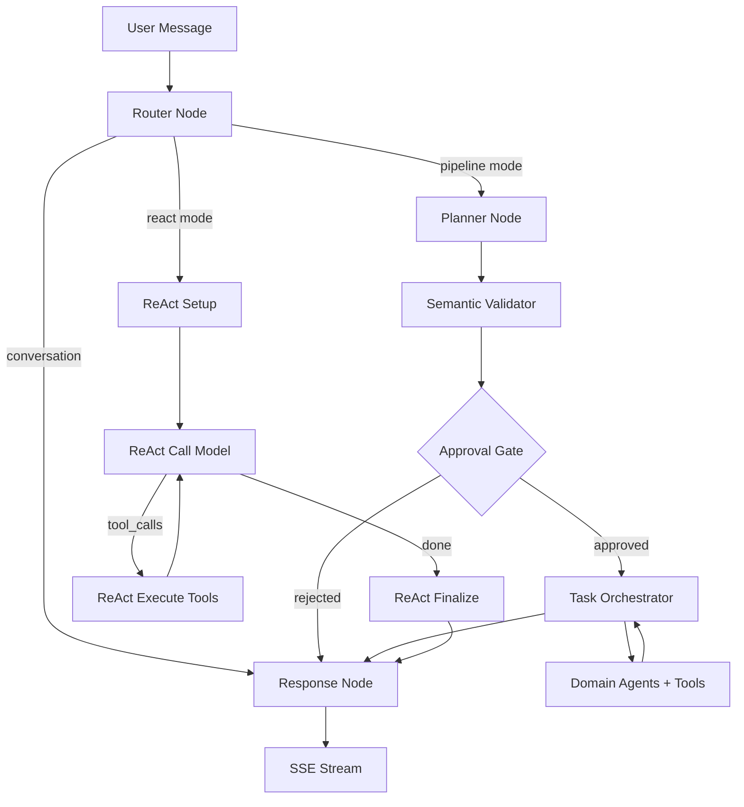

# LIA — Complete Technical Guide

> Architecture, patterns and engineering decisions of a next-generation multi-agent AI assistant.
>
> Technical presentation documentation for architects, engineers and technical experts.

**Version**: 3.5
**Date**: 2026-07-27
**Application**: LIA v1.25.28
**License**: AGPL-3.0 (Open Source)

---

## Table of Contents

1. [Context and founding choices](#1-context-and-founding-choices)
2. [Technology stack](#2-technology-stack)
3. [Backend architecture: Domain-Driven Design](#3-backend-architecture--domain-driven-design)
4. [LangGraph: multi-agent orchestration](#4-langgraph--multi-agent-orchestration)
5. [The conversational execution pipeline](#5-the-conversational-execution-pipeline)
6. [The planning system (ExecutionPlan DSL)](#6-the-planning-system-executionplan-dsl)
7. [Smart Services: intelligent optimization](#7-smart-services--intelligent-optimization)
8. [Semantic routing and AI-powered embeddings](#8-semantic-routing-and-ai-powered-embeddings)
9. [Human-in-the-Loop: 6-layer architecture](#9-human-in-the-loop--6-layer-architecture)
10. [State management and message windowing](#10-state-management-and-message-windowing)
11. [Memory system and psychological profile](#11-memory-system-and-psychological-profile)
12. [Multi-provider LLM infrastructure](#12-multi-provider-llm-infrastructure)
13. [Connectors: multi-provider abstraction](#13-connectors--multi-provider-abstraction)
14. [MCP: Model Context Protocol](#14-mcp--model-context-protocol)
15. [Voice system (STT/TTS)](#15-voice-system-stttts)
16. [Proactivity: Heartbeat and scheduled actions](#16-proactivity--heartbeat-and-scheduled-actions)
17. [RAG Spaces and hybrid search](#17-rag-spaces-and-hybrid-search)
18. [Browser Control and Web Fetch](#18-browser-control-and-web-fetch)
19. [Security: defence in depth](#19-security--defence-in-depth)
20. [Observability and monitoring](#20-observability-and-monitoring)
21. [Performance: optimizations and metrics](#21-performance--optimizations-and-metrics)
22. [CI/CD and quality](#22-cicd-and-quality)
23. [Cross-cutting engineering patterns](#23-cross-cutting-engineering-patterns)
24. [Architecture Decision Records (ADR)](#24-architecture-decision-records-adr)
25. [Evolution potential and extensibility](#25-evolution-potential-and-extensibility)

---

## 1. Context and founding choices

### 1.1. Why these choices?

Every technical decision in LIA addresses a concrete constraint. The project aims to be a multi-agent AI assistant **self-hostable on modest hardware** (Raspberry Pi 5, ARM64), with full transparency, data sovereignty, and multi-provider LLM support. These constraints have guided the entire stack.

| Constraint | Architectural consequence |
|------------|--------------------------|
| ARM64 self-hosting | Multi-arch Docker, semantic embeddings (multilingual), Playwright chromium cross-platform |
| Data sovereignty | Local PostgreSQL (no SaaS DB), Fernet encryption at rest, local Redis sessions |
| Multi-provider LLM | Factory pattern with 7 adapters, per-node configuration, no tight coupling to any provider |
| Full transparency | 438 Prometheus metrics, embedded debug panel, token-by-token tracking |
| Production reliability | 160+ ADRs, ~16,293 pytest-collected tests across 854 files, native observability, 6-level HITL |
| Cost control | Smart Services (89% token savings), semantic embeddings, prompt caching, catalogue filtering |

### 1.2. Architectural principles

| Principle | Implementation |
|-----------|----------------|
| **Domain-Driven Design** | Bounded contexts in `src/domains/`, explicit aggregates, Router/Service/Repository/Model layers |
| **Hexagonal Architecture** | Ports (Python protocols) and adapters (concrete Google/Microsoft/Apple clients) |
| **Event-Driven** | SSE streaming, ContextVar propagation, fire-and-forget background tasks |
| **Defence in Depth** | 5 layers for usage limits, 6 HITL levels, 3 anti-hallucination layers |
| **Feature Flags** | Each subsystem toggleable (`{FEATURE}_ENABLED`) |
| **Configuration as Code** | Pydantic BaseSettings composed via MRO, priority chain APPLICATION > .ENV > CONSTANT |

### 1.3. Codebase metrics

| Metric | Value |
|--------|-------|
| Tests | ~16,293 (collected by pytest across 854 test files) + 3,473 vitest frontend tests (ratcheted coverage thresholds, ADR-116) |
| Reusable fixtures | 170+ |
| Documentation documents | 400+ |
| ADRs (Architecture Decision Records) | 160+ |
| Prometheus metrics | 438 definitions |
| Grafana dashboards | 25 |
| Supported languages (i18n) | 6 (fr, en, de, es, it, zh) |

---

## 2. Technology stack

### 2.1. Backend

| Technology | Version | Role | Why this choice |
|------------|---------|------|-----------------|
| Python | 3.12+ | Runtime | Richest ML/AI ecosystem, native async, complete typing |
| FastAPI | 0.136.3 | REST API + SSE | Auto Pydantic validation, OpenAPI docs, async-first, performance |
| LangGraph | 1.2.4 | Multi-agent orchestration | Only framework offering native state persistence + cycles + interrupts (HITL) |
| LangChain Core | 1.4.6 | LLM/tools abstractions | `@tool` decorator, message formats, standardized callbacks |
| SQLAlchemy | 2.0.50 | Async ORM | `Mapped[Type]` + `mapped_column()`, async sessions, `selectinload()` |
| PostgreSQL | 16 + pgvector | Database + vector search | Native LangGraph checkpoints, HNSW semantic search, maturity |
| Redis | 7.4 | Cache, sessions, rate limiting | O(1) ops, atomic sliding window (Lua), SETNX leader election |
| Pydantic | 2.13.4 | Validation + serialization | `ConfigDict`, `field_validator`, settings composition via MRO |
| structlog | latest | Structured logging | JSON output with automatic PII filtering, snake_case events |
| Gemini Embeddings | gemini-embedding-001 | Semantic embeddings | Gemini multilingual embeddings (memory, routing, interests, journals) — ADR-069 |
| Playwright | latest | Browser automation | Headless Chromium, CDP accessibility tree, cross-platform |
| APScheduler | 3.x | Background jobs | Cron/interval triggers, compatible with Redis leader election |

### 2.2. Frontend

| Technology | Version | Role |
|------------|---------|------|
| Next.js | 16.2.10 | App Router, SSR, ISR |
| React | 19.2.7 | UI with Server Components |
| TypeScript | 6.0.2 | Strict typing |
| TailwindCSS | 4.3.2 | Utility-first CSS |
| TanStack Query | 5.101 | Server state management, cache, mutations |
| Radix UI | v2 | Accessible UI primitives |
| react-i18next | 17.0 | i18n (6 languages), namespace-based |
| Zod | 4.x | Runtime validation of debug schemas |

### 2.3. Supported LLM Providers

| Provider | Models | Specifics |
|----------|--------|-----------|
| OpenAI | GPT-5.4, GPT-5.4-mini, GPT-5.2, GPT-5.1, GPT-5 (+ mini/nano), GPT-4.1, GPT-4o, o3/o4-mini | Native prompt caching, Responses API, reasoning_effort |
| Anthropic | Claude Opus 4.6/4.5, Claude Sonnet 4.6, Claude Haiku 4.5 | Extended thinking, prompt caching |
| Google | Gemini 3.1/3 Pro, Gemini 3.1/3 Flash, Gemini 2.5 Pro/Flash | Multimodal, dual-vector embeddings |
| DeepSeek | deepseek-v4-flash, deepseek-v4-pro (V4), deepseek-chat (V3), deepseek-reasoner (R1) | Reduced cost, native reasoning |
| Perplexity | Sonar, Sonar Pro | Search-augmented generation |
| Qwen | qwen3.5-plus, qwen3.5-flash, qwen3-max | Thinking mode, tools + vision (Alibaba Cloud) |
| Ollama | Any local model (dynamic discovery) | Zero API cost, self-hosted |

**Why 7 providers?** The choice is not collection for its own sake. It is a resilience strategy: each pipeline node can be assigned to a different provider. If OpenAI raises its prices, the router switches to DeepSeek. If Anthropic has an outage, the response falls back to Gemini. The LLM abstraction (`src/infrastructure/llm/factory.py`) uses the Factory pattern with `init_chat_model()`, overridden by specific adapters (`ResponsesLLM` for the OpenAI Responses API, eligibility by regex `^(gpt-4\.1|gpt-5|o[1-9])`).

---

## 3. Backend architecture: Domain-Driven Design

### 3.1. Domain structure

```
apps/api/src/
├── core/                         # Cross-cutting technical core
│   ├── config/                   # 9 Pydantic BaseSettings modules composed via MRO
│   │   ├── __init__.py           # Settings class (final MRO)
│   │   ├── agents.py, database.py, llm.py, mcp.py, voice.py, usage_limits.py, ...
│   ├── constants.py              # 1,000+ centralized constants
│   ├── exceptions.py             # Centralized exceptions (raise_user_not_found, etc.)
│   └── i18n.py                   # i18n → settings bridge
│
├── domains/                      # Bounded Contexts (DDD)
│   ├── agents/                   # MAIN DOMAIN — LangGraph orchestration
│   │   ├── nodes/                # 7+ graph nodes
│   │   ├── services/             # Smart Services, HITL, context resolution
│   │   ├── tools/                # Tools by domain (@tool + ToolResponse)
│   │   ├── orchestration/        # ExecutionPlan, parallel executor, validators
│   │   ├── registry/             # AgentRegistry, domain_taxonomy, catalogue
│   │   ├── semantic/             # Semantic router, expansion service
│   │   ├── middleware/           # Memory injection, personality injection
│   │   ├── prompts/v1/           # 78 versioned .txt prompt files
│   │   ├── graphs/               # 15 agent builders (one per domain)
│   │   ├── context/              # Context store (Data Registry), decorators
│   │   └── models.py             # MessagesState (TypedDict + custom reducer)
│   ├── auth/                     # OAuth 2.1, BFF sessions, RBAC
│   ├── connectors/               # Multi-provider abstraction (Google/Apple/Microsoft)
│   ├── rag_spaces/               # Upload, chunking, embedding, hybrid retrieval
│   ├── journals/                 # Introspective journals
│   ├── interests/                # Interest learning
│   ├── heartbeat/                # LLM-driven proactive notifications
│   ├── channels/                 # Multi-channel (Telegram)
│   ├── voice/                    # TTS Factory, STT Sherpa, Wake Word
│   ├── skills/                   # agentskills.io standard
│   ├── sub_agents/               # Persistent specialized agents
│   ├── usage_limits/             # Per-user quotas (5-layer defence)
│   └── ...                       # conversations, reminders, scheduled_actions, users, user_mcp
│
└── infrastructure/               # Cross-cutting layer
    ├── llm/                      # Factory, providers, adapters, embeddings, tracking
    ├── cache/                    # Redis sessions, LLM cache, JSON helpers
    ├── mcp/                      # MCP client pool, auth, SSRF, tool adapters, Excalidraw
    ├── browser/                  # Playwright session pool, CDP, anti-detection
    ├── rate_limiting/            # Distributed Redis sliding window
    ├── scheduler/                # APScheduler, leader election, locks
    └── observability/            # 23 Prometheus metrics files, OTel tracing
```

### 3.2. Configuration priority chain

A fundamental invariant permeates the entire backend. It was systematically enforced in v1.9.4 with ~291 corrections across ~80 files, because divergences between constants and actual production configuration were causing silent bugs:

```
APPLICATION (Admin UI / DB) > .ENV (settings) > CONSTANT (fallback)
```

**Why this chain?** Constants (`src/core/constants.py`) serve exclusively as fallbacks for Pydantic `Field(default=...)` and SQLAlchemy `server_default=`. An administrator who changes an LLM model from the interface must see that change take effect immediately, without redeployment. At runtime, all code reads `settings.field_name`, never a constant directly.

### 3.3. Layer patterns

| Layer | Responsibility | Key pattern |
|-------|---------------|-------------|
| **Router** | HTTP validation, auth, serialization | `Depends(get_current_active_session)`, `check_resource_ownership()` |
| **Service** | Business logic, orchestration | Constructor receives `AsyncSession`, creates repositories, centralized exceptions |
| **Repository** | Data access | Inherits `BaseRepository[T]`, pagination `tuple[list[T], int]` |
| **Model** | DB schema | `Mapped[Type]` + `mapped_column()`, `UUIDMixin`, `TimestampMixin` |
| **Schema** | I/O validation | Pydantic v2, `Field()` with description, separate request/response |

---

## 4. LangGraph: multi-agent orchestration

### 4.1. Why LangGraph? (ADR-001)

The choice of LangGraph over LangChain alone, CrewAI, or AutoGen is based on three non-negotiable requirements:

1. **State persistence**: `TypedDict` with custom reducers, persisted via PostgreSQL checkpoints — allows resuming a conversation after HITL interruption
2. **Cycles and interrupts**: native support for loops (HITL rejection → re-planning) and the `interrupt()` pattern — without which the 6-layer HITL would be impossible
3. **SSE Streaming**: native integration with callback handlers — critical for real-time UX

CrewAI and AutoGen were easier to get started with, but neither supported the interrupt/resume pattern required for plan-level HITL. This choice has a cost: the learning curve is steeper (graph concepts, conditional edges, state schemas).

### 4.2. The main graph

LIA exposes two execution modes (toggleable per user via the chat header): **Pipeline** (default, deterministic and token-efficient) and **ReAct** (autonomous and iterative). The Router classifies the request first (direct conversation or actionable) then dispatches to the active mode.



### 4.3. Graph nodes

| Node | File | Role | Windowing |
|------|------|------|-----------|
| Router v3 | `router_node_v3.py` | Binary classification conversation/actionable | 5 turns |
| QueryAnalyzer | `query_analyzer_service.py` | Domain detection, intent extraction | — |
| Planner v3 | `planner_node_v3.py` | ExecutionPlan DSL generation | 10 turns |
| Semantic Validator | `semantic_validator.py` | Dependency validation and coherence | — |
| Approval Gate | `hitl_dispatch_node.py` | HITL interrupt(), 6 approval levels | — |
| Task Orchestrator | `task_orchestrator_node.py` | Parallel execution, context passing | — |
| Response | `response_node.py` | Anti-hallucination synthesis, 3 guard layers | 20 turns |

### 4.4. AgentRegistry and Domain Taxonomy

The `AgentRegistry` centralizes agent registration (`registry.register_agent()` in `main.py`), the `ToolManifest` catalogue, and the `domain_taxonomy.py` which defines each domain with its `result_key` and aliases.

**Why a centralized registry?** Without it, adding an agent required modifying 5+ files. With the registry, a new agent declares itself at a single point and is automatically available for routing, planning, and execution.

### 4.5. Domain Taxonomy

Each domain is a declarative `DomainConfig`: name, agents, `result_key` (canonical key for `$steps` references), `related_domains`, priority, and routability. The `DOMAIN_REGISTRY` is the single source of truth consumed by three subsystems: SmartCatalogue (filtering), semantic expansion (adjacent domains), and Initiative phase (structural pre-filter).

### 4.6. Tool Manifests

Each tool declares a `ToolManifest` via a fluent `ToolManifestBuilder`: parameters, outputs, cost profile, permissions, and multilingual `semantic_keywords` for routing. Manifests are consumed by the planner (catalogue injection), the semantic router (keyword matching), and the agent builder (tool wiring). See section 23 for the full tool architecture.

---

## 5. The conversational execution pipeline

### 5.1. Detailed flow of an actionable request

1. **Reception**: User message → SSE endpoint `/api/v1/chat/stream`
2. **Context**: `request_tool_manifests_ctx` ContextVar built once (ADR-061: 3-layer defence)
3. **Router**: Binary classification with confidence scoring (high > 0.85, medium > 0.65)
4. **QueryAnalyzer**: Identifies domains via LLM + post-expansion validation (gate-keeper that filters disabled domains)
5. **SmartPlanner**: Generates an `ExecutionPlan` (structured JSON DSL)
   - Pattern Learning: consults the Bayesian cache (bypass if confidence > 90%)
   - Skill detection: deterministic Skills are protected via `_has_potential_skill_match()`
6. **Semantic Validator**: Verifies inter-step dependency coherence
7. **HITL Dispatch**: Classifies the approval level, `interrupt()` if necessary
8. **Task Orchestrator**: Executes steps in parallel waves via `asyncio.gather()`
   - Filters skipped steps BEFORE gather (ADR-005 — fixes a bug causing double execution plan+fallback)
   - Context passing via Data Registry (InMemoryStore)
   - FOR_EACH pattern for bulk iterations
9. **Response Node**: Synthesizes results, memory + journals + RAG injection
10. **SSE Stream**: Token by token to the frontend
11. **Background tasks** (fire-and-forget): memory extraction, journal extraction, interest detection

### 5.2. ContextVar: implicit state propagation

A critical mechanism is the use of Python `ContextVar` to propagate state without parameter threading:

| ContextVar | Role | Why |
|------------|------|-----|
| `current_tracker` | TrackingContext for LLM token tracking | Avoids passing a tracker through 15 layers of functions |
| `request_tool_manifests_ctx` | Per-request filtered tool manifests | Built once, read by 7+ consumers (eliminates duplication ADR-061) |

This approach maintains per-request isolation in an asyncio context without polluting function signatures.

### 5.3. ReAct execution mode (ADR-070)

LIA offers a second execution mode: **ReAct** (Reasoning + Acting). Instead of planning upfront, the LLM iteratively calls tools, observes results, and decides the next step autonomously.

**Architecture**: 4 custom nodes in the parent LangGraph graph (not a subgraph):

```
Router → react_setup → react_call_model ↔ react_execute_tools → react_finalize → Response
```

**Pipeline vs ReAct — engineering trade-offs**:

| Aspect | Pipeline (default) | ReAct (⚡) |
|--------|-------------------|-----------|
| **Token cost** | **4–8× lower** — 1 planner + 1 response call | 1 LLM call per iteration (2–15 iterations typical) |
| **Planning** | Upfront ExecutionPlan with semantic validation | None — LLM decides step by step |
| **Parallel execution** | Yes — `asyncio.gather()` waves | No — sequential tool calls |
| **Adaptability** | Follows plan rigidly | Pivots on each tool result |
| **Control** | Full — planner DSL, HITL gates, validators | Minimal — prompt-driven behavior |
| **Cost predictability** | High — bounded by plan steps | Low — depends on LLM reasoning |
| **Best for** | Well-structured multi-domain requests | Exploratory research, ambiguous queries |

The Pipeline mode is a genuine engineering achievement: the SmartPlanner, Semantic Validator, Bayesian pattern cache, and parallel executor together deliver the same functional power as ReAct while consuming a fraction of the tokens. The trade-off is adaptability — when the optimal tool sequence cannot be predicted upfront, ReAct's iterative reasoning excels.

Both modes share the same tool registry, HITL system, response node, and observability infrastructure. Users switch between them via a toggle in the chat header.

### 5.4. Detached executions: generation survives the connection (ADR-117)

Classic SSE streaming has a structural flaw: generation lives *inside* the HTTP response generator. Closing the tab, navigating away or losing the network kills the connection — and, with it, the whole conversation turn. LIA decouples the two: a **detached producer** (an asyncio task independent of the request) executes the graph and publishes every chunk to a **per-run Redis Stream**; the SSE endpoint is reduced to a **subscriber** relaying that stream.

- **Disconnection ≠ cancellation** — closing the page stops the subscription, never the generation. The user message is archived *before* execution starts, the answer finishes server-side and waits in the conversation.
- **Live resume** — on return (page mount, tab visibility), the frontend detects the active run, replays every chunk already emitted (without pacing) then switches to the live tail; the boundary is an SSE transport comment (`: replay-end`), so the chunk contract stays untouched. During replay, side effects (toasts, audio) are suppressed while the reducer rebuilds the in-progress bubble.
- **Client-side silence detection** — resuming still assumes the client knows it must resume. A tab frozen by the operating system receives neither end nor error: the read stays pending, the interface believes it is still receiving, and the guard meant to protect a live stream blocks precisely the resume. A silence budget calibrated on the server's heartbeat rhythm settles it: past that, the dead connection is dropped, the state returns to idle and the reattachment above takes over. Browser timers freeze with the tab, so the deadline fires on wake-up — exactly when it is useful.
- **One run per conversation** — a Redis lock (`SET NX EX` + producer heartbeat + zombie-safe conditional Lua release) makes a concurrent send answer HTTP 409, which the frontend turns into a silent reattachment.
- **Cross-worker cancellation** — the send button morphs into a stop button; the cancel signal travels through Redis and is polled producer-side (~1 s), even when the producer lives in a different worker than the HTTP request. The partial answer is kept and badged "interrupted"; tokens already consumed stay billed — billing is honored on every exit path, kills included.
- **Voice only if someone is listening** — subscriber presence (a Redis counter with a periodically re-armed TTL) gates voice synthesis: no TTS for a run nobody is listening to, and a listener joining mid-run gets voice for the remainder.
- **Clean shutdown** — on shutdown, the lifespan drains in-flight producers before yielding; a killed run archives its partial flagged `interrupted`, and a turn-start repair cleans up the dangling `tool_calls` an interrupted checkpoint would leave behind (strict providers reject them on the next turn).

The whole system is governed by a feature flag and a dozen env-tunable settings (TTLs, heartbeat, drain, polling) validated at boot — a heartbeat period incompatible with the lock TTL refuses to start.

---

**Grounding on recent entities.** On a turn that calls no tool, the current-turn registry is empty by construction (an anti-contamination guard) and the conversational history deliberately excludes tool messages: the response model then has *no* authoritative structured data at all, and can only rephrase earlier prose. The most recent entities in state are therefore re-injected through a dedicated prompt section — selected by recency, age-bounded, with no store round-trip, and explicitly subordinate to current-turn data. An authority rule completes it: inventing an entity attribute is forbidden, and a value that was requested but never received must be announced as missing.

## 6. The planning system (ExecutionPlan DSL)

### 6.1. Plan structure

```python
ExecutionPlan(
    steps=[
        ExecutionStep(
            step_id="get_meetings",
            tool_name="get_events",
            parameters={"date": "tomorrow"},
            dependencies=[]
        ),
        ExecutionStep(
            step_id="send_reminders",
            tool_name="send_email",
            parameters={"subject": "Rappel réunion"},
            dependencies=["get_meetings"],
            for_each="$steps.get_meetings.events",
            for_each_max=10
        )
    ]
)
```

### 6.2. FOR_EACH pattern

**Why a dedicated pattern?** Bulk operations (sending an email to 12 contacts) cannot be planned as 12 static steps — the number of elements is unknown before executing the previous step. FOR_EACH solves this problem with safeguards:
- HITL threshold: any mutation >= 1 element triggers mandatory approval
- Configurable limit: `for_each_max` prevents unbounded executions
- Dynamic reference: `$steps.{step_id}.{field}` for previous step results

The identity of a correlated result includes its parent. Tools derive their id from content alone — weather from `place + day`, a route from `origin + destination` — so two iterations over parents sharing those attributes produced the same id, and the accumulator, a plain `dict.update()`, silently overwrote the first. The id is now derived per parent through a deterministic fingerprint, which also keeps identities stable across a replay or a resume after an interruption.

### 6.3. Parallel execution in waves

The `parallel_executor.py` organizes steps into waves (DAG):
1. Identifies steps with no unresolved dependencies → next wave
2. Filters skipped steps (unmet conditions, fallback branches) — **before** `asyncio.gather()`, not after (ADR-005: fixes a bug that caused 2x API calls and 2x costs)
3. Executes the wave with per-step error isolation
4. Feeds the Data Registry with results
5. Repeats until plan completion

### 6.4. Semantic Validator

Before HITL approval, a dedicated LLM (distinct from the planner, to avoid self-validation bias) inspects the plan against 14 issue types across four categories: **Critical** (hallucinated capability, ghost dependency, logical cycle), **Semantic** (cardinality mismatch, scope overflow/underflow, wrong parameters), **Safety** (dangerous ambiguity, implicit assumption), and **FOR_EACH** (missing cardinality, invalid reference). Short-circuit for trivial plans (1 step), optimistic 1 s timeout.


Additionally, a **self-enriching anti-hallucination registry** (`hallucinated_tools.json`) detects tools invented by the LLM (e.g. `resolve_reference_tool`) via persistent regex patterns. Each new hallucination is automatically added to the registry for faster detection in subsequent plans. Hallucinated steps are removed and the planner is forced to replan with real catalogue tools — eliminating an entire class of execution failures without human intervention.

### 6.5. Reference Validation

Cross-step references (`$steps.get_meetings.events[0].title`) are validated at plan time with structured error messages: invalid field, available alternatives, and corrected examples — so the planner can self-correct on retry instead of producing silent failures.

### 6.6. Adaptive Re-Planner (Panic Mode)

When execution fails, a rule-based (no LLM) analyser classifies the failure pattern (empty results, partial failure, timeout, reference error) and selects a recovery strategy: retry same, replan with broader scope, escalate to user, or abort. That decision is **advisory today**: it is logged and counted on every failure, which makes the failure modes measurable, but the orchestrator does not yet apply it automatically — partial results are surfaced rather than discarded. In **Panic Mode**, the SmartCatalogue expands to include all tools for a single retry — solving cases where domain filtering was too aggressive.

---

## 7. Smart Services: intelligent optimization

### 7.1. The problem solved

Without optimization, scaling to 10+ domains caused costs to explode: going from 3 tools (contacts) to 30+ tools (10 domains) multiplied prompt size by 10x and therefore cost per request by 10x (ADR-003). Smart Services were designed to bring this cost back to mono-domain system levels.

| Service | Role | Mechanism | Measured gain |
|---------|------|-----------|---------------|
| `QueryAnalyzerService` | Routing decision | LRU cache (TTL 5 min) | ~35% cache hit |
| `SmartPlannerService` | Plan generation | Bayesian Pattern Learning | Bypass > 90% confidence |
| `SmartCatalogueService` | Tool filtering | Domain-based filtering | 96% token reduction |
| `PlanPatternLearner` | Learning | Bayesian scoring Beta(2,1) | ~2,300 tokens saved per replan |

### 7.2. PlanPatternLearner

**How it works**: When a plan is validated and executed successfully, its tool sequence is stored in Redis (hash `plan:patterns:{tool→tool}`, TTL 30 days). For future requests, a Bayesian score is calculated: `confidence = (α + successes) / (α + β + successes + failures)`. Above 90%, the plan is reused directly without an LLM call.

**Safeguards**: K-anonymity (minimum 3 observations for suggestion, 10 for bypass), exact domain matching, maximum 3 injected patterns (~45 tokens overhead), strict 5 ms timeout.

**Bootstrapping**: 50+ predefined golden patterns at startup, each with 20 simulated successes (= 95.7% initial confidence).

### 7.3. QueryIntelligence

The QueryAnalyzer does more than detect domains — it produces a deep `QueryIntelligence` structure: immediate intent vs ultimate goal (`UserGoal`: FIND_INFORMATION, TAKE_ACTION, COMMUNICATE...), implicit intents (e.g. "find contact" probably means "send something"), anticipated fallback strategies, FOR_EACH cardinality hints, and softmax-calibrated domain confidence scores. This gives the planner a richer picture than simple keyword extraction.

### 7.4. Semantic Pivot

Queries in any language are automatically translated to English before embedding comparison, improving cross-lingual accuracy. Redis-cached (5 min TTL, ~5 ms on hit vs ~500 ms on miss), using a fast LLM.

---

## 8. Semantic routing and AI-powered embeddings

### 8.1. Why semantic embeddings? (ADR-049)

Purely LLM-based routing had two problems: cost (each request = one LLM call) and accuracy (the LLM was wrong about domains in ~20% of multi-domain cases). Semantic embeddings solve both:

| Property | Value |
|----------|-------|
| Provider | Google Gemini (`gemini-embedding-001`) |
| Languages | 100+ |
| Accuracy gain | +48% on Q/A matching vs LLM-only routing |

### 8.2. Semantic Tool Router (ADR-048)

Each `ToolManifest` has multilingual `semantic_keywords`. The query is transformed into an embedding, then compared by cosine similarity with **max-pooling** (score = MAX per tool, not average — avoids semantic dilution). Dual threshold: >= 0.70 = high confidence, 0.60-0.70 = uncertainty.

### 8.3. Semantic Expansion

The `expansion_service.py` adds to the planner catalogue the domains able to provide a missing piece of data. The trigger is **evidence-driven**: person-reference detection is the union of three sources — the memory resolver's mappings (person references by construction), relational references extracted even when resolution finds no fact, and the analysis LLM's typed references. A referenced entity (person → `Contact`, meeting → `CalendarEvent`, place → `Place`, email → `EmailMessage`) brings in the domains whose ontology-type `properties` provide a type required by the selected tools — an anchoring that prevents any blind expansion, with a configurable cap and boot-time completeness checks on the mapping (ADR-120).

The layer is fed by **deeply annotated** manifests (`semantic_type` on parameters and outputs: event attendees, email sender, route destination — ADR-121), which also power cross-domain Jinja2 linking suggestions and an **execution guard**: a person's name can never reach an address/email-typed parameter — the call fails before any API spend with a recoverable error, in both execution modes. Post-expansion validation (ADR-061, Layer 1) still filters domains disabled by the administrator.

---

## 9. Human-in-the-Loop: 6-layer architecture

### 9.1. Why at the plan level? (Phase 7 → Phase 8)

The initial approach (Phase 7) interrupted execution **during** tool calls — each sensitive tool generated an interruption. The UX was poor (unexpected pauses) and the cost was high (per-tool overhead).

Phase 8 (current) submits the **complete plan** to the user **before** any execution. A single interruption, a global view, the ability to edit parameters. The trade-off: the planner must be trusted to produce a faithful plan.

### 9.2. The 6 approval types

| Type | Trigger | Mechanism |
|------|---------|-----------|
| `PLAN_APPROVAL` | Destructive actions | `interrupt()` with PlanSummary |
| `CLARIFICATION` | Ambiguity detected | `interrupt()` with LLM question |
| `DRAFT_CRITIQUE` | Email/event/contact draft | `interrupt()` with serialized draft + markdown template |
| `DESTRUCTIVE_CONFIRM` | Deletion >= 3 elements | `interrupt()` with irreversibility warning |
| `FOR_EACH_CONFIRM` | Bulk mutations | `interrupt()` with operation count |
| `MODIFIER_REVIEW` | AI-suggested modifications | `interrupt()` with before/after comparison |

### 9.3. Enriched Draft Critique

For drafts, a dedicated prompt generates a structured critique with per-domain markdown templates, field emojis, before/after comparison with strikethrough for updates, and irreversibility warnings. Post-HITL results display i18n labels and clickable links.

### 9.4. Response Classification

When the user responds to an approval prompt, a full-LLM classifier (not regex) categorizes the answer into 5 decisions: **APPROVE**, **REJECT**, **EDIT** (same action, different parameters), **REPLAN** (different action entirely), or **AMBIGUOUS**. Demotion logic prevents false positives: an EDIT with missing parameters is demoted to AMBIGUOUS, triggering a clarification follow-up.

### 9.5. Replay-safe review loops (ADR-092)

LangGraph's resume semantics re-execute the interrupted node **in full**: past `interrupt()` calls return their cached values, but everything else runs live again. Any loop written around `interrupt()` inside a node therefore replays its side effects (LLM calls, API calls) on every user decision. Both review loops — iterative draft editing and bulk-operation confirmation (dedicated `for_each_confirm` node) — follow a normative pattern: **one `interrupt()` per node execution**, loop state flows through the checkpointed graph state, and iteration happens through a conditional self-loop edge. Guarantee proven by compiled replay harnesses: each LLM modification runs exactly once and the confirmed content is exactly the last content displayed.

### 9.6. Compaction Safety

4 conditions prevent LLM compaction (summarization of old messages) during active approval flows. Without this protection, a summary could delete the critical context of an ongoing interruption.

---

## 10. State management and message windowing

### 10.1. MessagesState and custom reducer

The LangGraph state is a `TypedDict` with an `add_messages_with_truncate` reducer that handles token-based truncation, OpenAI message sequence validation, and tool message deduplication.

### 10.2. Why per-node windowing? (ADR-007)

**The problem**: a conversation of 50+ messages generated 100k+ tokens of context, with latency > 10 s for the router and exploding costs.

**The solution**: each node operates on a different window, calibrated to its actual need:

| Node | Turns | Justification |
|------|-------|---------------|
| Router | 5 | Fast decision, minimal context suffices |
| Planner | 10 | Needs context for planning, but not the entire history |
| Response | 20 | Rich context for natural synthesis |

**Measured impact**: E2E latency -50% (10 s → 5 s), cost -77% on long conversations, quality preserved thanks to the Data Registry which stores tool results independently from messages.

### 10.3. Context Compaction

When the token count exceeds a dynamic threshold (ratio of the response model's context window), an LLM summary is generated. Critical identifiers (UUIDs, URLs, emails) are preserved. Savings ratio: ~60% per compaction. `/resume` command for manual triggering.

**Operational resilience**: every LLM call is wrapped in an `asyncio.wait_for` per chunk (35 s default) and a global 120 s budget. On transient errors, `tenacity.AsyncRetrying` retries up to 3 times with exponential backoff. If the summary still cannot complete, an explicit fallback (`_truncation_fallback`) cleanly truncates the older history with a readable `SystemMessage` that preserves identifiers — no silent stub. Prior `compaction #N` summaries are consolidated into the merge instead of stacking turn after turn.

**SSE custom-mode signal**: the node emits `compaction_start` / `compaction_done` via `langgraph.config.get_stream_writer()` through a `stream_mode="custom"` (LangGraph 1.x). The streaming service translates these payloads into `ChatStreamChunk(type="execution_step")`. On the frontend a sonner toast morphed on a stable id (`COMPACTION_TOAST_ID`) stays visible for the duration of the compaction, the input is locked via `status="compacting"`, and a `ContextUsagePill` continuously shows the tokens/threshold ratio. The concurrent SSE keepalive (`iter_with_keepalive`) pulses `: heartbeat` every 15 s during silent awaits to neutralize Cloudflare idle cuts. Five Prometheus metrics (`compaction_chunk_timeouts_total`, `compaction_global_timeouts_total`, `compaction_total_duration_seconds`, `compaction_writer_unavailable_total`, `compaction_executions_total{strategy}`) feed a dedicated Grafana dashboard.

### 10.4. PostgreSQL Checkpointing

Full state checkpointed after each node. P95 save < 50 ms, P95 load < 100 ms, average size ~15 KB/conversation. Checkpointer and store each run on a dedicated PostgreSQL connection pool per worker (sizes tunable via environment): concurrent conversations no longer serialize on a single connection, and a connection dropped while idle is detected at checkout and replaced automatically (ADR-111).

---

## 11. Memory system and psychological profile

### 11.1. Architecture

```
AsyncPostgresStore + Semantic Index (pgvector)
├── Namespace: (user_id, "memories")        → Psychological profile
├── Namespace: (user_id, "documents", src)  → Document RAG
└── Namespace: (user_id, "context", domain) → Tool context (Data Registry)
```

### 11.2. Enriched memory schema

Each memory is a structured document with:
- `content`, `category` (preference, fact, personality, relationship, sensitivity...)
- `importance` (1-10), `emotional_weight` (-10 to +10)
- `usage_nuance`: how to use this information in a caring manner
- Embedding `gemini-embedding-001` (1536d) via pgvector HNSW

**Why an emotional weight?** An assistant that knows your mother is ill but treats this fact like any other piece of data is at best clumsy, at worst hurtful. The emotional weight enables the `DANGER_DIRECTIVE` (prohibition on joking, minimizing, comparing, trivializing) when a sensitive subject is touched upon.

### 11.3. Extraction and injection

**Extraction**: after each conversation, a background process analyzes the last user message, adapted to the active personality. Cost tracked via `TrackingContext`.

**Injection**: the `memory_injection.py` middleware searches for semantically close memories, builds the injectable psychological profile, and activates the `DANGER_DIRECTIVE` if necessary. Injected into the Response Node's system prompt.

**Which turns feed memory.** A message that triggers an action counts as much as a conversation: resuming a draft injects no message, so the original request is still the user's last utterance when extraction runs. Conversely, messages **fabricated by the system** — the scaffolding injected on a HITL refusal — are flagged in their metadata and excluded both as target and as context: never recognised by their text, since they exist in six languages. Finally, the heuristic that discards acknowledgements only applies to what the user actually typed — applied to a person's name, it made the memories of contacts whose surname resembles "fine" or "cool" disappear. Every decision is counted per subsystem and per outcome (`post_response_extraction_scheduled_total`), where only debug logs existed.

### 11.4. Hybrid search BM25 + semantic

Combination with configurable alpha (default 0.6 semantic / 0.4 BM25). 10% boost when both signals are strong (> 0.5). Graceful fallback to semantic only if BM25 fails. Performance: 40-90 ms with cache.

### 11.5. Stratified journals

The assistant maintains introspective reflections organized along four themes (self-reflection, user observations, ideas/analyses, learnings) AND four abstraction levels (`L0` raw observation, `L1` `WHEN→DO BECAUSE` directive, `L2` transversal pattern, `L3` portrait facet — see [ADR-079](https://github.com/jgouviergmail/LIA/blob/main/docs/architecture/ADR-079-Stratified-Journal-Consciousness.md)). Each entry carries an epistemic status (`confidence` ∈ {low, medium, high}) and two counters (`evidence_count`, `contradiction_count`).

**Dual trigger**: post-conversation extraction (fire-and-forget, frequent, lightweight) + periodic consolidation (4–12 h per user, complex).

**Gemini dual-vector embeddings** (`gemini-embedding-001`, 1536d, ADR-069): one vector on `title + content`, one on `search_hints`. Search uses `LEAST(dist_content, dist_keyword)` per row to bridge the assistant's introspective vocabulary and the user's vocabulary.

**Deferred self-evaluation T → T+1**: `MessagesState.injected_journal_ids` (symmetric to `injected_memories`) carries the IDs across turns. The `response_node` reads the previous turn's IDs at start, passes them to the post-conversation extractor, then writes the current turn's IDs at the end. The extractor sees the applied directives + the user's reaction in the same prompt and signals `evidence_outcome="evidence" | "contradiction"` on update actions — the service atomically increments the counters (anti-hallucination layer 4: the LLM only signals an outcome, the service owns the integers). **Zero added LLM cost** (same extraction call, enriched prompt).

**Ambient diffusion of the user-model portrait**: consolidation produces, in the **same LLM call** (zero added call), a `portrait_full` (~200 tokens, conversation/planner) and a `portrait_brief` (~60 tokens, secondary flows) persisted on the `users` table. The builder `build_journal_user_model_block(user_id, format, flow)` (`src/domains/journals/portrait_builder.py`, mirror of `build_psyche_prompt_block`) returns a `<UserModelContext>...</UserModelContext>` block with graceful degradation. Diffused across **8 flows**: 2 primary in full format (`response_node`, `planner_node_v3`) and 6 secondary in brief format (`react_setup_node`, `interests/proactive_task`, `scheduler/reminder_notification`, `voice/service`, `heartbeat/prompts`, `agents/services/fallback_response` sync + async).

**Three user correction levers** on the portrait (never directly editable): (1) CRUD edits on the L3 source entries, (2) `POST /journals/portrait/feedback` (free text → L0 entry with `source=user_correction` + synchronous re-consolidation that re-weights L3 entries), (3) `POST /journals/consolidate` (manual consolidation, bypasses cooldown).

**Dedup discipline**: no write-time guard (retired in v1.14.0). At consolidation, `STEP 1` performs an explicit pairwise scan that merges semantic duplicates, and `STEP 5` actively clusters convergent L1s into L2 patterns.

**4-layer anti-hallucination**: Pydantic `field_validator` on UUIDs, reference ID table in the prompt, filtering of actions by known IDs at extraction and consolidation, and atomic counter increments (the LLM only signals `evidence_outcome`).

**Dedicated observability**: 11 Prometheus metrics in `src/infrastructure/observability/metrics_journals.py` — `journal_entries_total{action,theme,source}`, `journal_evidence_total{outcome}`, `journal_consolidation_promotions_total{from_level,to_level}`, `journal_level_distribution{level}`, `journal_portrait_present_total{flow,format}`, `journal_portrait_age_hours`, `journal_portrait_feedback_total{outcome}`, etc.

### 11.6. Interest system

Detection through query analysis with Bayesian weight evolution (configurable decay). Interests are grouped into **subjects** by batch LLM clustering (derived, self-healing data), and notification selection draws with **two-level rarity** (per-subject cooldown + priority to the least-served subjects and interests) — one passion never monopolizes notifications. Multi-source content (Perplexity, Brave, Wikipedia, LLM reflection) with deterministically appended **clickable source links**. User feedback (thumbs up/down/block) adjusts weights; nightly merge of near-duplicates.

---

## 12. Multi-provider LLM infrastructure

### 12.1. Factory Pattern

```python
llm = get_llm(provider="openai", model="gpt-5.4", temperature=0.7, streaming=True)
```

`get_llm()` resolves the effective configuration via `get_llm_config_for_agent(settings, agent_type)` (code defaults → DB admin overrides), instantiates the model, and applies specific adapters.

### 12.2. 56 LLM configuration types

Each pipeline node is independently configurable via the Admin UI — without redeployment:

| Category | Configurable types |
|----------|-------------------|
| Pipeline | router, query_analyzer, planner, semantic_validator, context_resolver |
| Response | response, hitl_question_generator |
| Background | memory_extraction, interest_extraction, journal_extraction, journal_consolidation |
| Agents | contacts_agent, emails_agent, calendar_agent, browser_agent, etc. |

### 12.3. Token Tracking

The `TrackingContext` tracks each LLM call with `call_type` ("chat"/"embedding"), `sequence` (monotonic counter), `duration_ms`, tokens (input/output/cache), and cost calculated from DB pricing. Trackers share a `run_id` for aggregation. The debug panel displays all invocations (pipeline + background tasks) in a unified chronological view.

### 12.4. DB-source-of-truth admin catalogue

The `llm_models` table carries the full catalogue: provider, classic functional capabilities (`supports_tools`, `supports_structured_output`, `supports_strict_mode`, `supports_streaming`, `supports_vision`), and — structuring additions — the **per-model sampling matrix** (`supports_temperature`, `supports_top_p`, `supports_frequency_penalty`, `supports_presence_penalty`) plus the **reasoning shape** (`reasoning_widget` ∈ {`none`, `enum`, `budget_int`, `toggle_budget`}, `reasoning_enum_values` JSONB list, `reasoning_budget_range` JSONB `{min, max, off_sentinel, dynamic_sentinel}`, `reasoning_doc_i18n_key`). This per-model declaration replaces the legacy frontend regex that used to guess which sliders to hide: the Configuration LLM dialog reads the DB flags directly and exposes only the parameters the model's API actually accepts.

The Pricing LLM admin form exposes a **DB-derived dynamic templates mechanism**: the `LLMModelService.list_templates()` service groups active rows by their 4-field reasoning fingerprint and returns one deterministic representative per group (~15 unique shapes today). Adding a new reasoning model boils down to picking "copy shape from such existing model"; the 4 shape fields are snapshot-copied at creation time. **Custom** mode is available for disruptions; any Custom model with a novel fingerprint automatically becomes a template for subsequent additions. `kind` (chat / image / audio / …), the four sampling caps and the tooltip i18n key remain saved per model, independent of the template. See `docs/technical/LLM_PRICING_TEMPLATES.md`.

### 12.5. Provider-agnostic prompt caching

Every provider bills less (and answers faster) when the beginning of a prompt is byte-identical across requests — but each with its own mechanism: Anthropic's `cache_control` blocks, OpenAI's `prompt_cache_key` routing, implicit prefix caches on DeepSeek/Qwen/Gemini. LIA separates the concerns: every versioned system prompt places its static content (role, rules, examples, output format) first, then a canonical `--- DYNAMIC CONTEXT ---` marker, then all per-request content (datetime, query, context, tool catalogue). Templates stay model-neutral; the infrastructure layer translates the marker into each provider's dialect — the `cache_control` split for Anthropic, the cache-routing key for OpenAI, nothing at all for the implicit caches, which benefit from the stable prefix as-is. The planner prompt — the pipeline's most expensive — exposes a ~77% byte-stable cacheable prefix across any two requests. Shrink-only CI guards lock the convention: every dynamic prompt must carry the marker, no placeholder may precede it without a justified exception, and the planner prefix's byte stability is asserted on every build.

---

## 13. Connectors: multi-provider abstraction

### 13.1. Protocol-based architecture

```
ConnectorTool (base.py) → ClientRegistry → resolve_client(type) → Protocol
     ├── GoogleGmailClient       implements EmailClientProtocol
     ├── MicrosoftOutlookClient  implements EmailClientProtocol
     ├── AppleEmailClient        implements EmailClientProtocol
     └── PhilipsHueClient        implements SmartHomeClientProtocol
```

**Why Python protocols?** Structural duck typing allows adding a new provider without modifying calling code. The `ProviderResolver` guarantees that only one provider is active per functional category.

### 13.2. Normalizers

Each provider returns data in its own format. Dedicated normalizers (`calendar_normalizer`, `contacts_normalizer`, `email_normalizer`, `tasks_normalizer`) convert provider-specific responses into unified domain models. Adding a new provider requires only implementing the protocol and its normalizer — calling code remains unchanged.

### 13.3. Reusable patterns

`BaseOAuthClient` (template method with 3 hooks), `BaseGoogleClient` (pagination via pageToken), `BaseMicrosoftClient` (OData). Circuit breaker, distributed Redis rate limiting, refresh token with double-check pattern and Redis locking against thundering herd.

### 13.4. Agentic telephony (ADR-127)

LIA can place an outbound phone call on the user's behalf, hold a goal-directed conversation, and reinject a written summary back into the chat. Unlike the read/write connectors above, the telephony connector drives a **third-party voice agent** (ElevenLabs Agents) over the phone network, configured per user (bring-your-own credentials) — LIA performs no cost metering of its own.

**Data protection by capability, not by prompt.** The call agent is provisioned with a single read-only availability tool that resolves free/busy slots only; it can never read event titles, attendees, locations or content. The guarantee is structural — the tool simply does not expose that data — rather than a prompt instruction the model could be talked out of.

**Return path.** The call is never recorded and the transcript is never persisted. When the call ends, a per-user HMAC-signed webhook triggers a tool-less LLM synthesis that produces a short, expiring summary, reinjected asynchronously into the conversation (the same detached-run channel as ADR-117) with an optional one-tap follow-up draft. Every call is gated by a HITL confirmation before dialing, and the whole subsystem sits behind a feature flag.

---

## 14. MCP: Model Context Protocol

### 14.1. Architecture

The `MCPClientManager` manages connection lifecycle (exit stacks), tool discovery (`session.list_tools()`), and automatic LLM-based domain description generation. The `ToolAdapter` normalizes MCP tools to the LangChain `@tool` format, with structured parsing of JSON responses into individual items.

### 14.2. MCP Security

Mandatory HTTPS, SSRF prevention (DNS resolution + IP blocklist), Fernet credential encryption, OAuth 2.1 (DCR + PKCE S256), Redis rate limiting per server/tool, API guard 403 on proxy endpoints for disabled servers (ADR-061 Layer 3).

### 14.3. MCP Iterative Mode (ReAct)

MCP servers with `iterative_mode: true` use a dedicated ReAct agent (observe/think/act loop) instead of the static planner. The agent first reads the server documentation, understands the expected format, then calls tools with the correct parameters. Particularly effective for servers with complex APIs (e.g., Excalidraw). Togglable per server in admin or user configuration. Powered by the generic `ReactSubAgentRunner` (shared with the browser agent).

---

## 15. Voice system (STT/TTS)

### 15.1. STT

Wake word ("OK Guy") via Sherpa-onnx WASM in the browser (zero external transmission). Whisper Small transcription (99+ languages, offline) server-side via ThreadPoolExecutor. Per-user STT language with thread-safe `OfflineRecognizer` cache per language.

**Latency optimizations**: KWS → recording microphone stream reuse (~200-800 ms saved), WebSocket pre-connection, `getUserMedia` + WS parallelized via `Promise.allSettled`, AudioWorklet Worklet cache.

### 15.2. TTS

**Catalogue-driven** factory (ADR-081): `factory.get_tts_client()` reads the active `voice_tts` override (provider + model + voice + tuning, stored in `llm_config_overrides.voice_tts.provider_config` JSONB) and instantiates the matching client. Three providers shipped: Edge (free, default), OpenAI (`tts-1` / `tts-1-hd`), and ElevenLabs (`eleven_multilingual_v2`, `eleven_turbo_v2_5`, `eleven_flash_v2_5`). When a paid provider's API key is missing, the factory falls back to Edge transparently (logged warning). Progressive sentence-by-sentence streaming via `ProgressiveSentenceStreamer` (ADR-082) to minimize latency — the first sentence is synthesized while the LLM still generates the rest. A delimiter closes a sentence only at end of input or when followed by a space (ADR-154): on the progressive path the buffer grows token by token, so `"3."` is a perfectly normal transient state — decimals, prices, version numbers and URLs stay in one piece, and both splitters (`_extract_sentences` and the streamer) are pinned by a shared case table plus a test that requires them to agree.

---

## 16. Proactivity: Heartbeat and scheduled actions

### 16.1. Heartbeat: 2-phase architecture

**Phase 1 — Decision** (cost-effective, gpt-4.1-mini):
1. `EligibilityChecker`: opt-in, time window, cooldown (1h global, 30 min per type), recent activity — optional `notification_filter`/`cross_type_filters` keep each flow's eligibility budget separate from the shared ledger
2. `ContextAggregator`: 12 sources in parallel (`asyncio.gather`): Calendar, Weather (change detection), Tasks, Emails, Interests, Activity, recent heartbeat/interest notifications, other proactive surfaces (fired reminders, automation results, call reports — the extended anti-redundancy window), Health, upcoming Birthdays and Open loops (the commitments ledger, ADR-139). A **second pass** then derives a dynamic semantic query from the aggregated context to select Journals and Memories (ADR-135 symmetry) and computes the traffic-aware departure advice (Routes ETA, flag-gated). Interests arrive as a **varied sample** (`pick_varied_sample`: one interest per subject, least recently served subjects first) — the model can only mention what it is shown, so the rotation is mechanical
3. LLM structured output: `skip` | `notify` plus `interest_topic` (copied verbatim from the sample, fail-open runtime guard) and source labels constrained by a `Literal`. Two-level anti-redundancy: source, and **content** — the last 10 notifications over 7 days are injected with their excerpts, which forbids re-proposing a theme even when it came from a different source

**Phase 1b — Enrichment** (when `interest_topic` is set): `InterestContentGenerator` (Perplexity → Brave → Wikipedia) under a hard timeout, deduplicated against recent notification embeddings. Fully fail-open: flag off, failure or empty result → the message ships without facts.

**Phase 2 — Generation** (if notify): LLM rewrites with personality + user language. When facts were fetched, a VERIFIED FACTS block requires naming 1-2 concrete items without ever inventing, and source links are appended deterministically. Multi-channel dispatch. An interest mention is written to the shared ledger (`InterestNotification(source='heartbeat')`): the subject then rests for both proactive flows.

Every source is bounded by a time budget and fails independently. That budget covers a share of an event loop shared with the other fetchers — it is not a database timeout: health signals were blowing it under nominal conditions because their read pulled tens of thousands of raw rows to produce a few dozen numbers, freezing the worker for the duration of the decode. The read now relies on a per-day aggregation computed in the database, and a source that drops out is counted and timed rather than silently missing — a source that fails by disappearing leaves no trace in the notification itself.

### 16.2. Agent Initiative (ADR-062)

Post-execution LangGraph node: after each actionable turn, the initiative analyzes results and proactively checks cross-domain information (read-only). Examples: rain weather → check calendar for outdoor activities, email mentioning a meeting → check availability, task deadline → recall context. 100% prompt-driven (no hardcoded logic), structural pre-filter (adjacent domains), memory + interest injection, suggestion field for proposing write actions. Configurable via `INITIATIVE_ENABLED`, `INITIATIVE_MAX_ITERATIONS`, `INITIATIVE_MAX_ACTIONS`.

The same node also emits up to 3 **follow-up chips** — short requests the user is likely to send next, phrased in their language and grounded in the visible results. Server-side sanitization (clamp, case-insensitive dedupe, hard cap) and a pop-once per-run handoff carry them into both the SSE `done` chunk and the archived message metadata, so the chips render live and survive a reload; tapping one only pre-fills the input.

### 16.3. Scheduled actions

APScheduler with Redis leader election (SETNX, TTL 120s, recheck 5s). `FOR UPDATE SKIP LOCKED` for isolation. Auto-approve of plans (`plan_approved=True` injected into state). Auto-disable after 5 consecutive failures. Retry on transient errors.

---

## 17. RAG Spaces and hybrid search

### 17.1. Pipeline

Upload → Chunking → Embedding (gemini-embedding-001, 1536d) → pgvector HNSW → Hybrid search (cosine + BM25 with alpha fusion) → Context injection in the **Response Node**.

Note: RAG injection is done in the response node, not in the planner. The planner however receives personal journal injection via `build_journal_context()`.

### 17.2. System RAG Spaces (ADR-058)

Built-in FAQ (200+ Q/A, 24 sections) indexed from `docs/knowledge/`. `is_app_help_query` detection by QueryAnalyzer, Rule 0 override in RoutingDecider, App Identity Prompt (~200 tokens, lazy loading). Staleness is judged on a SHA-256 over the source files **and** on the stored corpus itself (one chunk per parsed entry, exactly one document): a matching hash over the wrong number of rows is a repair, not a no-op. Auto-indexation runs in every uvicorn worker, so the space row is claimed with `FOR UPDATE SKIP LOCKED` — one writer, the others skip without queueing — and every vector is computed **before** the first destructive statement, so a provider rejection deletes nothing and the previous corpus keeps serving (ADR-162).

---

## 18. Browser Control and Web Fetch

### 18.1. Web Fetch

URL → SSRF validation (DNS + IP blocklist + post-redirect recheck) → readability extraction (fallback full page) → HTML cleaning → Markdown → `<external_content>` wrapping (prompt injection prevention). Redis cache 10 min.

### 18.2. Browser Control (ADR-059)

Autonomous ReAct agent (headless Playwright Chromium). Redis-backed session pool with cross-worker recovery. CDP accessibility tree for element-based interaction. Anti-detection (Chrome UA, webdriver flag removal, dynamic locale/timezone). Cookie banner auto-dismiss (20+ multilingual selectors). Separate read/write rate limiting (40 each per session).

---

## 19. Security: defence in depth

### 19.1. BFF Authentication (ADR-002)

**Why BFF instead of JWT?** JWT in localStorage = XSS vulnerable, 90% size overhead, revocation impossible. The BFF pattern with HTTP-only cookies + Redis sessions eliminates all three problems. v0.3.0 migration: memory -90% (1.2 MB → 120 KB), session lookup P95 < 5 ms, OWASP score B+ → A.

**Strong authentication (ADR-143/144).** Beyond password and Google OAuth, the account can be protected by **WebAuthn passkeys** (discoverable credentials, conditional UI on the email field, single-use Redis challenges, clone detection via signature counters, zero enumeration on the anonymous path) and a **TOTP second factor** (two-step login via an ephemeral pending token, explicit matched-timestep anti-replay, 10 single-use hashed backup codes). Sensitive actions — credential management, export, device revocation, password disabling — go through a **step-up re-authentication**: a 5-minute window opened by any full sign-in (sudo semantics), with a **typed 403** contract (`step_up_required`, never a plain 401 that would redirect to /login). **My devices** lists every BFF session under an opaque `display_id` with deliberately bounded metadata (UA/OS families, /24-truncated IP), revokes one device or all others, and cuts a revoked session's SSE stream within one keepalive tick; a push notification flags any sign-in from a device not attested by a valid FCM token.

### 19.2. Usage Limits: 5-layer defence in depth

| Layer | Interception point | Why this layer |
|-------|-------------------|----------------|
| Layer 0 | Chat router (HTTP 429) | Block before even starting the SSE stream |
| Layer 1 | Agent service (SSE error) | Cover scheduled actions that bypass the router |
| Layer 2 | `invoke_with_instrumentation()` | Centralized guard covering all background services |
| Layer 3 | Proactive runner | Skip for blocked users |
| Layer 4 | Direct `.ainvoke()` migration | Coverage for non-centralized calls |

**Fail-open** design: infrastructure failures do not block users.

### 19.3. Attack prevention

| Vector | Protection |
|--------|------------|
| XSS (LLM rendering) | `rehype-sanitize` boundary on the chat markdown pipeline (`rehypeRaw → rehypeSanitize → rehypeMathInText → rehypeKatex`, audited schema — `script`/`iframe`/`form`/handlers dropped), HTTP-only cookies, backend CSP; MCP/Skill Apps never go through markdown (sentinel → sandboxed iframe widget) |
| CSRF | SameSite=Lax |
| SQL Injection | SQLAlchemy ORM (parameterized queries) |
| SSRF | DNS resolution + IP blocklist (Web Fetch, MCP, Browser); skill install-from-URL reuses the same validator with stricter terms: https only, redirects refused, streamed size cap, TOTAL transfer deadline, per-user rate limit The browser goes further: **every request a page makes** — redirect, sub-resource, iframe, XHR — resolves its own destination behind a bounded verdict cache, and a failure aborts instead of forwarding. |
| Prompt Injection | `<external_content>` safety markers |
| Rate Limiting / IP spoofing | Distributed Redis sliding window (atomic Lua); trusted proxy chain — API ports loopback-bound (cloudflared = single entry), uvicorn `--proxy-headers`, `request.client.host` validated as the single IP source (no more shared global bucket, raw XFF never read) A global ceiling sits in front of every route as real ASGI middleware on that same shared limiter, so one client cannot consume the whole API; probes stay exempt so supervision is never throttled. |
| Supply Chain | SHA-pinned GitHub Actions, Dependabot weekly |

### 19.4. Data durability: automated backups (ADR-109)

**A backup is only real once a restore has been proven.** A `postgres-backup` sidecar snapshots the full database on a cron schedule with three-tier rotation (daily / weekly / monthly); every parameter — schedule, retention, target directory, pg_dump options — is `.env`-driven. Dumps carry `--clean --if-exists`, so a restore is a single command into the live database or a throwaway container. The drill itself is versioned: `task backup:verify` restores the latest dump into an ephemeral pgvector container and compares the Alembic schema revision and reference row counts against the live source. RPO: ≤ 24 h (tunable). The accepted limits (off-site copy, attachments volume) are tracked in ADR-109 rather than left implicit.

### 19.5. Isolating what executes

Three surfaces execute something on the user's behalf, and each is treated as hostile by construction.

**Skill scripts run in a throwaway container.** No Docker socket, no network, a read-only root filesystem with a small writable tmpfs, an unprivileged uid, every capability dropped, and memory / process / CPU / file-size ceilings. The point is what a child process *inherits*: the API belongs to the `docker` group in production, and a group is inherited — dropping the uid alone would leave the socket reachable. The script SOURCE is handed over as an argument rather than mounted, because the API is itself a container and a bind would resolve against the host; that choice also leaves stdin free for the JSON payload the contract is built on. When no daemon is reachable the execution is refused rather than downgraded — a sandbox that disables itself protects nothing.

**Infrastructure tasks are confirmed, never assumed.** A remote server task is prepared, not run: the confirmation shows the target server, the full task text and the instructions the model itself wrote into the remote prompt — the field an injection would use is exactly the one that must not be hidden. The privilege is verified again at execution, because rights granted when a request was phrased may no longer hold when it is approved.

**Request bodies are bounded before they are read.** The ceiling is enforced ahead of the handler, on the declared length when there is one and on the counted bytes when there is not, so peak memory is set by us rather than by the caller — on webhooks that happens before authentication. Its consistency with the per-endpoint upload limits is asserted at startup: a contradiction refuses to boot instead of surfacing as a remote-only rejection that no log explains.

---

## 20. Observability and monitoring

### 20.1. Stack

| Technology | Role |
|------------|------|
| Prometheus | 438 custom metrics (RED pattern) |
| Grafana | 25 production-ready dashboards |
| Loki | Aggregated structured JSON logs |
| Tempo | Cross-service distributed traces (OTLP gRPC) |
| Langfuse | LLM-specific tracing (prompt versions, token usage) |
| Alertmanager | 14-alert vital core delivered by email (linked runbooks, per-environment thresholds) |
| structlog | Structured logging with PII filtering |

### 20.2. Embedded Debug Panel

The debug panel in the chat interface provides real-time per-conversation introspection: intent analysis, execution pipeline, LLM pipeline (chronological reconciliation of all LLM + embedding calls), context/memory, intelligence (cache hits, pattern learning), journals (injection + background extraction), lifecycle timing.

Debug metrics persist in `sessionStorage` (50 entries max).

**Why a debug panel in the UI?** In an ecosystem where AI agents are notoriously difficult to debug (non-deterministic behavior, opaque call chains), making metrics accessible directly in the interface eliminates the friction of having to open Grafana or read logs. The operator immediately sees why a request was expensive or why the router chose a particular domain.

---

### 20.3. DevOps Claude CLI (admin only)

Administrators can interact with Claude Code CLI directly from the LIA conversation to diagnose server issues in natural language: *"Check the logs to see if everything is working"*, *"Check disk space"*, *"Which container uses the most RAM?"*. Claude CLI is installed inside the API Docker container and executed locally via subprocess, with Docker socket access to inspect all containers. Permissions are configurable per environment (`--allowedTools`/`--disallowedTools`) and access is restricted to superusers via a direct DB check. Sessions are persistent for multi-turn investigations.
## 21. Performance: optimizations and metrics

### 21.1. Key metrics (P95)

| Metric | Value | SLO |
|--------|-------|-----|
| API Latency | 450 ms | < 500 ms |
| First SSE event (request acknowledged) | 380 ms | < 500 ms |
| Router Latency | 800 ms | < 2 s |
| Planner Latency | 2.5 s | < 5 s |
| Semantic Embedding | ~100 ms | < 200 ms |
| Checkpoint save | < 50 ms | P95 |
| Redis session lookup | < 5 ms | P95 |

> These latencies measure the infrastructure. The full perceived response time depends on the LLM call cascade (from a few seconds to several dozen depending on request complexity and hardware) — this is the main optimization effort in progress, measured in production and tracked in the roadmap.

### 21.2. Implemented optimizations

| Optimization | Measured gain | Trade-off |
|-------------|---------------|-----------|
| Message Windowing | -50% latency, -77% cost | Loss of old context (compensated by Data Registry) |
| Smart Catalogue | 96% token reduction | Panic mode needed if filtering too aggressive |
| Pattern Learning | 89% LLM savings | Bootstrapping required (golden patterns) |
| Prompt Caching | 90% discount | Depends on provider support |
| Semantic Embeddings | High precision multilingual routing | Depends on API provider availability |
| Parallel Execution | Latency = max(steps) | Dependency management complexity |
| Context Compaction | ~60% per compaction | Information loss (mitigated by ID preservation) |

---

## 22. CI/CD and quality

### 22.1. Pipeline

```
Pre-commit (local)                GitHub Actions CI
========================          =========================
.bak files check                  Lint Backend (Ruff + Black + MyPy strict)
Secrets grep                      Lint Frontend (ESLint + TypeScript)
Ruff + Black + MyPy               Unit tests + coverage (62%)
                                  Integration tests (PostgreSQL + Redis)
Fast unit tests                   Code Hygiene (i18n, Alembic, lockfiles)
Critical pattern detection        Docker build smoke test
i18n key sync                     Secret scan (Gitleaks)
Alembic migration conflicts       ─────────────────────────
.env.example completeness         Security workflow (weekly)
ESLint + TypeScript check           CodeQL (Python + JS)
                                    pip-audit + pnpm audit
                                    Trivy filesystem scan
                                    SBOM generation
```

### 22.2. Standards

| Aspect | Tool | Configuration |
|--------|------|---------------|
| Python formatting | Black | line-length=100 |
| Python linting | Ruff | E, W, F, I, B, C4, UP |
| Type checking | MyPy | strict mode |
| Commits | Conventional Commits | `feat(scope):`, `fix(scope):` |
| Tests | pytest | `asyncio_mode = "auto"` |
| Coverage | 62% minimum (ratchet, never lowered) | Enforced in CI |

### 22.3. Reproducible dependency builds

Backend dependencies are locked end to end. The requirements files are intent
manifests; what every environment actually installs — production image, dev
container, CI, local venv — are committed universal lockfiles compiled by
`uv pip compile --universal`: a single file covering linux/amd64, linux/arm64 and
Windows, pinning the ~200 packages actually shipped with SHA256 hashes for every
published file. Vanilla pip installs them with `--require-hashes`, so the same
commit always builds the same image, byte-for-byte verifiable. A CI guard fails
any manifest edit that skips lock regeneration, and `pip-audit` plus the release
SBOM read the lockfile — the full transitive tree is audited and inventoried,
not just the declared packages.

---

### 22.4. The audit is public — and reproducible

The quality bar described in this guide is not self-declared: a complete 360° technical audit — **8.3/10 across 24 normalized areas** on the ISO/IEC 25010 grid, open findings included — is published in the repository ([full report](https://github.com/jgouviergmail/LIA-Assistant/blob/main/docs/audit/README.md)), together with the [audit protocol](https://github.com/jgouviergmail/LIA-Assistant/blob/main/docs/audit/AUDIT_PROTOCOL.md) that makes every cycle reproducible: pinned commit, per-area evidence requirements, anchored scoring, and a committed script measuring size in logical SLOC. The report ends with the exact commands to reproduce the measurements yourself.

### 22.5. A guard is only worth what it measures

`html { overflow-x: hidden }` clips a horizontal overflow instead of producing a
scroll. Any guard built on `scrollWidth - clientWidth` is therefore
**structurally blind** to a control pushed off-screen: measured across 108
samples, it reported zero at every width while the logout button sat 235 px past
the right edge in German. The guard now compares each interactive control's box
against the viewport, width by width **and locale by locale** — German and
Italian carry the longest labels and break first.

The same reasoning applies to height: `100vh` is the *large* viewport, the one
you would have with the browser's address bar retracted — which is not the state
a page loads in on a phone. A test forbids any height constraint expressed in
`vh` alone, with a written exemption list and a self-test proving the detector
still detects.

Finally, what the mobile layout is allowed to drop is written in a table rather
than left to judgement: every width-gated surface declares whether it is
blocking, substituted or desktop-only, with its reason. Tests hold that table
against the code — the location must exist, carry the Tailwind variant of its
declared threshold, and a surface that fetches or ticks must be **conditionally
mounted**, not merely hidden: `display:none` still mounts the component, which
keeps spending network and battery on something nobody will see.

## 23. Cross-cutting engineering patterns

### 23.1. Tool System: 5-layer architecture

The tool system is built in five composable layers, reducing per-tool boilerplate from ~150 lines to ~8 lines (94% reduction):

| Layer | Component | Role |
|-------|-----------|------|
| 1 | `ConnectorTool[ClientType]` | Generic base: OAuth auto-refresh, client caching, dependency injection |
| 2 | `@connector_tool` | Meta-decorator composing `@tool` + metrics + rate limiting + context save |
| 3 | Formatters | `ContactFormatter`, `EmailFormatter`... — normalize results per domain |
| 4 | `ToolManifest` + Builder | Declarative declaration: params, outputs, cost, permissions, semantic keywords |
| 5 | Catalogue Loader | Dynamic introspection, manifest generation, domain grouping |

Rate limits are category-based: Read (20/min), Write (5/min), Expensive (2/5 min). Tools can produce either a string (legacy) or a structured `UnifiedToolOutput` (Data Registry mode).

### 23.2. Data Registry

The Data Registry (`InMemoryStore`) decouples tool results from message history. Results are stored per-request via `@auto_save_context` and survive message windowing — this is what makes aggressive per-node windowing (5/10/20 turns) viable without losing tool output context. Cross-step references (`$steps.X.field`) resolve against the registry, not messages.

### 23.3. Error Architecture

All tools return `ToolResponse` (success) or `ToolErrorModel` (failure) with a `ToolErrorCode` enum (18+ types: INVALID_INPUT, RATE_LIMIT_EXCEEDED, TEMPLATE_EVALUATION_FAILED...) and a `recoverability` flag. On the API side, centralized exception raisers (`raise_user_not_found`, `raise_permission_denied`...) replace raw HTTPException everywhere — zero raw `raise HTTPException` in the codebase, held by a CI guard and a contract-test net proving byte-identical responses — ensuring consistent error contracts, logged and measured (Prometheus) on every error path.

### 23.4. Prompt System

78 versioned `.txt` files in `src/domains/agents/prompts/v1/`, loaded via `load_prompt()` with LRU cache (32 entries). Versions configurable via environment variables.

### 23.5. Centralized Component Activation (ADR-061)

3-layer system solving a duplication problem: before ADR-061, filtering of enabled/disabled components was scattered across 7+ sites. Now:

| Layer | Mechanism |
|-------|-----------|
| Layer 1 | Domain gate-keeper: validates LLM-output domains against `available_domains` |
| Layer 2 | `request_tool_manifests_ctx`: ContextVar built once per request |
| Layer 3 | API guard 403 on MCP proxy endpoints |

### 23.6. Feature Flags

Every optional subsystem is controlled by a `{FEATURE}_ENABLED` flag, checked at startup (scheduler registration), route wiring, and node entry (instant short-circuit). This allows deploying the full codebase while activating subsystems incrementally.

### 23.7. Rich skill outputs: HTML frames and images

Skills (agentskills.io standard) can return, in addition to text, **interactive HTML frames** and **images** through a typed JSON contract `SkillScriptOutput`. The Python script writes on stdout:

```json
{ "text": "required", "frame": { "html" | "url", "title", "aspect_ratio" }, "image": { "url", "alt" } }
```

The three channels are independent and combinable (text alone, text+frame, text+image, or all three). The full pipeline reuses the existing Data Registry infrastructure:

```
run_skill_script → parse_skill_stdout() → SkillScriptOutput
                 → build_skill_app_output() → RegistryItem(type=SKILL_APP)
                 → ReactToolWrapper._accumulated_registry
                 → response_node → SkillAppSentinel.render() → <div class="lia-skill-app">
                 → SSE registry_update + sentinel HTML
                 → MarkdownContent.tsx → SkillAppWidget (sandboxed iframe + image card)
```

**Defence in depth**: iframe sandbox `allow-scripts allow-popups` (never `allow-same-origin`), strict CSP auto-injected into `frame.html` for user-imported skills (`connect-src 'none'`, `frame-src 'none'`), `SKILLS_FRAME_MAX_HTML_BYTES = 200 KB` limit, minimal `postMessage` bridge without `tools/call` or `resources/read`.

**Gallery previews.** A skill's detail panel serves `assets/preview.png` and falls back to an icon when the file is missing — a fallback indistinguishable from a merely empty thumbnail. System-skill previews are therefore **generated**: a versioned script holds one drawing per skill, in pure geometry with no font dependency, which makes the output identical across machines. A guard fails when a skill has no drawing, or when the shipped image no longer matches what its generator produces.

**Runtime conventions**: `_lang` and `_tz` auto-injected into `parameters` (POSIX locales aren't installed in the container, so scripts rely on inline translation tables rather than `strftime`+`setlocale`). Theme and locale synced live via `postMessage` + `MutationObserver` on `<html class>` and `<html lang>`. Iframe auto-resize via `getBoundingClientRect().bottom` (iframe-resizer pattern). Client-side interactivity uses `addEventListener` only (no inline `onclick` under CSP) and `crypto.getRandomValues` for randomness.

**Primacy effect**: `skills_context` is injected as a dedicated 2nd system message prefixed with `"SKILL INSTRUCTIONS CONTRACT (PRIORITY: HIGHEST)"`, ensuring an active skill's `references/*.md` dominate over the generic `<ResponseGuidelines>`.

**Conditional rendering**: `INTERACTIVE_WIDGET_TYPES = {SKILL_APP, MCP_APP, DRAFT}` — these widgets are injected as HTML regardless of `user_display_mode` (Rich HTML / Markdown / Cards), while other RegistryItems remain conditional on Cards mode.

A library of built-in skills demonstrates the contract: `interactive-map`, `weather-dashboard`, `calendar-month`, `qr-code`, `pomodoro-timer`, `unit-converter`, `dice-roller` — each illustrating a different combination of the three channels.

**Skill lifecycle**: every skill enters through a single hardened import pipeline (`SkillImportService`) — strict agentskills.io name validation before any filesystem write (path-traversal guard), zip expansion caps, staging + swap with automatic restore of the previous version on failure, and cross-scope name-conflict rejection (DB + cache as dual authority). The built-in skill-generator uses the same pipeline through the `import_user_skill` tool: a skill created in chat is validated, installed and announced by name in one turn — no manual upload. Skills whose workflow spans several turns declare `dialogue: true` in their frontmatter, which the QueryAnalyzer's chat override respects (their detection survives conversational follow-up answers) while the skill ReAct runner receives the windowed conversation history to resume the dialogue instead of restarting it.

The skills surface is a **gallery**: cards open a detail sheet with the localized description, the declared **output channels** (the loader finally reads the `outputs:` frontmatter field the generator had always validated — parity is CI-pinned), a bundled `assets/preview.png` served by a dedicated endpoint (name-pattern traversal guard, size cap, undifferentiated 404 for admin-disabled skills), and a provenance warning on every non-system skill. Installation accepts a second source besides file upload: an https URL, hardened as described in §19.3, feeding the exact same import pipeline (`skill_url_imports_total{outcome}` counts every path).

**Editing a skill.** The write engine already existed — re-importing one's own skill is an atomic upsert (ADR-118) — but three locks made it unreachable: the manifest was unreadable (activation strips the frontmatter), a replacement erased the thumbnail chat cannot carry, and the generator's prompt ordered a rename on conflict. A modification is now a **full regeneration** under the same name, preceded by reading the current package. Confirmation lives **in the tool**, not in HITL: a skill shipping a `scripts/` directory runs inside an isolated-thread ReAct sub-agent whose drafts never reach the main graph. It rests on a content-derived token — a plain flag would be a convention the model may skip, whereas a digest can only have been received, and it binds the agreement to the exact package that will be written (ADR-165).

### 23.8. Conversation history, search and rich chat rendering

Five cross-cutting capabilities share the same product philosophy: **instant feedback, zero server cost when unnecessary**.

- **Reading invariant & input maturity** — a streaming answer never yanks a reader who scrolled up: the follow decision measures live geometry at decision time (growth-compensated), an explicit own-send tick replaces data-diff heuristics (two of them false-fired against the real engine), and a floating button with an off-screen-responses badge brings the reader back. The input carries a per-user persistent draft (debounced, purged at logout), an ↑/↓ walk over the last 10 sends, `/` slash commands (WAI-ARIA combobox on the native textarea, diacritic-insensitive localized filtering) and an in-flow action row under every answer (copy, feedback, execution trace).
- **Conversation history search** — `?search=` query param on `GET /conversations/me/messages`. Filtering uses PostgreSQL `ILIKE` (case-insensitive, accent-sensitive — contract locked by test). The frontend uses a `useMemo` over `messages` to filter loaded messages instantly; the backend endpoint remains a latent capability for a future deep-search UI.
- **Scroll-up pagination** — same endpoint, `?before=<created_at>` keyset cursor returning `has_more` and `next_cursor`. The chat UI binds an `IntersectionObserver` on a 1-px sentinel above the first message; older pages prepend with id-based dedup, and a shared `wasPrependRef` makes the auto-scroll-to-bottom `useEffect` skip itself for that cycle so the viewport stays anchored exactly where the reader was. The existing composite index `(conversation_id, created_at DESC)` makes each page an index-only seek regardless of conversation length. Page bounds (default 50, hard cap 200) are env-tunable via `CONVERSATION_HISTORY_DEFAULT_LIMIT` / `CONVERSATION_HISTORY_MAX_LIMIT`.
- **LaTeX rendering** — The mathematical and scientific formulas LIA writes (`$inline$` / `$$block$$`) render via KaTeX in `MarkdownContent.tsx`. Since the assistant emits its whole answer as HTML, a `rehypeMathInText` plugin detects the `$`/`$$` delimiters at the hast level — after `rehypeRaw` has expanded the HTML — and turns them into the markers `rehype-katex` renders; `remark-math`, confined to markdown, never sees math buried in HTML. Order: `rehypeRaw → rehypeSanitize → rehypeMathInText → rehypeKatex`; the math steps read only already-sanitised text and emit fixed-class spans, so no new attack surface.
- **Syntax highlighting** — `react-syntax-highlighter` (PrismAsyncLight) lazy-loaded. 25 languages registered on-demand via `SyntaxHighlighter.registerLanguage(...)` to keep the initial bundle small (languages fetched at first code block). Theme auto-switches `one-dark` / `one-light` driven by `next-themes`.

### 23.9. Proactive feedback persistence

User feedback on proactive notifications (👍/👎/🚫 on interests, heartbeat) is persisted directly into `conversation_messages.message_metadata` JSONB via `jsonb_set(jsonb_set(coalesce(metadata, '{}'::jsonb), '{feedback_submitted}', 'true'), '{feedback_value}', '"thumbs_up"')`. The update is **scoped by `user_id`** via a subquery on `conversations.user_id` to prevent cross-tenant leaks.

The frontend reads initial state from `message.metadata?.feedback_submitted` (buttons stay hidden on reload for already-voted messages) and applies feedback **optimistically** (buttons hidden + proactive toast before the network mutation). Metadata keys are centralised in `src/core/field_names.py` (`FIELD_TARGET_ID`, `FIELD_FEEDBACK_ENABLED`, `FIELD_FEEDBACK_SUBMITTED`, `FIELD_FEEDBACK_VALUE`).

### 23.10. i18n-ready tools: thread-safe pattern

Tool i18n relies on a clear contract between async invocation (`execute_api_call`) and sync result formatting (`format_registry_response`). Since tool instances are **concurrent singletons** shared across all requests, language state cannot live on the instance.

`ConnectorTool` therefore exposes two helpers: `_fetch_language()` (async, reads the user's locale from context) and `_language_from_result(result)` (sync, reads the language from the result itself), tied together by a `_LANGUAGE_RESULT_KEY = "_language"` constant that acts as an internal contract. No instance mutation, no ContextVar required for this flow, and every result carries the language used to format it. `.po`/`.mo` files are compiled into the Docker image.

The full application to weather (`gettext.gettext(text, language)` propagated explicitly on all 6 call-sites) and to the 6 Hue tools (`list_lights`, `control_light`, `list_rooms`, `control_room`, `list_scenes`, `activate_scene`) guarantees that outputs render in the user's language, never the service default.

### 23.11. Observability architecture

Observability rests on three pillars: **defensive emission** on the critical path, pre-wired **Grafana dashboards** (25 dashboards / 595 panels covering app, infra and every business sub-system), and **DB-backed gauges** maintained by a periodic updater.

Prometheus instrumentation is systematically wrapped in `try/except Exception: pass` with lazy imports (`from ... import foo` inside the try) so no metric issue ever propagates onto the execution path. Three dedicated Postgres indexes (`ix_conversations_updated_at` for DAU/WAU, `ix_conversations_created_at` for the conversations histogram, `ix_connectors_status` for the activation rate) bring the updater queries from ~500 ms to <50 ms on a populated DB.

On validation, a FastAPI `RequestValidationError` handler counts 422s by `field` + `error_type` on `validation_errors_total`, with a 10-errors-per-request cap and 40-char truncation to bound cardinality. The 422 contract (FastAPI standard response with `detail`) is strictly preserved.

To measure true connector activation duration without intruding on service code, **SQLAlchemy event listeners** `before_insert` / `after_insert` on `Connector` capture the SQL flush → completion interval. Dual metric: `oauth_connector_activation_total` (counter) + `oauth_connector_activation_duration_seconds` (histogram).

**DB-backed gauges** refreshed every 30 s: DAU (`user_active_daily_gauge`), WAU (`user_active_weekly_gauge`), Redis pool (`redis_connection_pool_size_current`, `redis_connection_pool_available_current`), `checkpoints_table_size_bytes`, `connector_activation_rate{connector_type}`.

To prevent the **Prometheus cardinality bomb** on `connector_api_*{operation}`, API paths are sanitised segment-by-segment before emission: UUID/id/hex_id/token are replaced with placeholders `{uuid}`, `{id}`, `{hex_id}`, `{token}`. Without this protection, every Google/Apple/Microsoft API request carrying a resource ID would spawn a new Prometheus series.

### 23.12. External event ingestion via scoped tokens

LIA accepts external event ingestions (iPhone Apple Health samples, third-party payloads, future IoT channels) through a unified pattern: REST endpoints authenticated by a **scoped Bearer token**, independent of the session cookie system. This is the mechanism powering the [`health_metrics`](../docs/architecture/ADR-076-Health-Metrics-Ingestion.md) domain (heart rate + steps pushed by an iOS Shortcuts automation), and it serves as the template for any future inbound connector.

**Why a token rather than the user ID**: a user identifier naturally leaks (URLs, JWT payloads, logs, screenshots, exports). A token is a **rotatable, revocable secret** scoped to a single endpoint. The prefix (`hm_` for health metrics) types the scope.

**Persistence**: the token table stores **only the SHA-256 digest** of the raw value. The plaintext value (prefix + ~32 chars `secrets.token_urlsafe`) is revealed exactly once at creation. An 8-char display prefix remains visible for identification. Multiple active tokens may coexist, with individual revocation.

**Idempotent batch upsert**: each request carries a list of self-timestamped samples (`date_start` / `date_end` ISO 8601 with offset). The server UTC-normalizes and second-truncates, then applies a PostgreSQL UPSERT `ON CONFLICT (user_id, kind, date_start, date_end) DO UPDATE ... RETURNING (xmax = 0)` to split insert vs update counts in a single round-trip. Practical consequence: the iOS client can re-push the whole day at every unlock without risk of duplicates — existing rows are simply overwritten.

**Flexible parser**: iOS Shortcuts emits payloads in four shapes depending on the author (canonical JSON array, NDJSON, `{"data":[…]}` envelope, or "Dictionnaire" wrapping `{"<ndjson_blob>":{}}` where the NDJSON is encoded as the sole key of an outer dict with an empty value). A parser upstream of the service flattens all four shapes to a standard `list[dict]` before validation — no constraint on how the Shortcut is authored.

**Intra-batch dedupe with per-kind arbitrage**: PostgreSQL refuses to let an `ON CONFLICT DO UPDATE` touch the same target row twice (`CardinalityViolationError`). Yet iOS legitimately emits overlapping samples (Apple Watch + iPhone reporting the same interval). A helper merges duplicates **before** the UPSERT with a per-kind strategy: **MAX** for steps (Watch and iPhone count complementary subsets of movement — MAX approximates ground truth better than SUM double-count or AVG under-count), **AVG** (rounded) for heart rate (fusion of two sensors aimed at the same signal). Collapsed duplicates are reported as `updated` in the response and tracked via `health_samples_batch_duplicates_total{kind}`.

**Mixed per-sample validation**: each sample is individually accepted or rejected with its 0-based index and a bounded reason (`out_of_range | malformed | missing_field | invalid_date`). Valid siblings in the same batch persist — a transient sensor glitch does not kill the day. Raw values are never logged (GDPR-compliant), only counters per reason.

**Security**: per-token Redis sliding-window rate limit (60 req/h default, configurable), `WWW-Authenticate: Bearer` header (RFC 7235) on 401, `Retry-After` on 429, per-request sample cap with `HTTP 413` beyond. Account erasure is handled by the account-deletion service, which explicitly purges every health table (the soft-deleted account model keeps the `users` row, so the FK cascade never fires); a deleted owner's device can no longer ingest.

**Visualization**: a polymorphic Python aggregator walks samples ordered by `date_start` in a window and emits one point per bucket (hour/day/week/month/year), with `AVG/MIN/MAX` over `heart_rate` samples and `SUM` over `steps` samples. Empty buckets are emitted with `has_data=False` so the frontend (`recharts`, `connectNulls={false}`) shows honest gaps rather than interpolation. The Settings component reuses the `SettingsSection` + Accordion pattern (4 sub-sections: API + tokens, Charts, Statistics, Data management) and displays the **actual aggregation window** to defuse the "stats don't move when I change period" confusion (HR is invariant when all data fits in the smallest window).

**Exposure to the central loops**: a **single per-user opt-in toggle** governs four consumers at once — conversation (assistant tools), Heartbeat (a `health_signals` source), memory extraction (a `{health_context}` prompt placeholder + an optional `context_biometric` JSONB blob attached to high-emotional-weight memories), and journal (extraction + consolidation). All four receive the same **factual non-raw projection**: deltas vs baseline, directional trends, structural events (inactivity streaks, etc.) — never raw values. The rolling 28-day baseline auto-selects `bootstrap` (simple median while less than 7 days of history are available — surfaced to the LLM so it qualifies its claims) then flips to `rolling`. GDPR erasure has a single target: the `health_samples` table.

### 23.13. Installable application (PWA)

Six localized manifests (`/manifest-{lng}.json` — localized `lang`, `start_url`, three shortcuts, separate `any`/`maskable` icon entries; structural parity across the 6 files is test-pinned) are linked per page via `generateMetadata`, with real PNG icons and an `apple-touch-icon` (iOS silently ignores SVG touch icons). The OS **share target** (`GET /{lng}/share`) composes shared title/text/url into a clamped chat draft riding the existing `?draft=` rail — never auto-sent. A discreet install hint appears from the third visit (never in standalone display-mode, dismissible forever); Chromium gets a real install prompt via `beforeinstallprompt`, iOS the Share → Add to Home Screen instruction.

---

## 24. Architecture Decision Records (ADR)

160+ ADRs in MADR format document the major architectural decisions. Some representative examples:

| ADR | Decision | Problem solved | Measured impact |
|-----|----------|----------------|-----------------|
| 001 | LangGraph for orchestration | Need for state persistence + HITL interrupts | Checkpoints P95 < 50 ms |
| 002 | BFF Pattern (JWT → Redis) | JWT XSS vulnerable, revocation impossible | Memory -90%, OWASP A |
| 003 | Dynamic filtering by domain | 10x prompt size = 10x cost | 73-83% catalogue reduction |
| 005 | Filtering BEFORE asyncio.gather | Plan + fallback executed in parallel = 2x cost | -50% fallback plan cost |
| 007 | Per-node Message Windowing | Long conversations = 100k+ tokens | -50% latency, -77% cost |
| 048 | Semantic Tool Router | Imprecise LLM routing on multi-domain | +48% accuracy |
| 049 | Semantic Embeddings | Inaccurate LLM-only routing | +48% precision via semantic embeddings |
| 057 | Personal Journals | No continuity of reflection between sessions | Planner + response injection |
| 061 | Centralized Component Activation | 7+ duplicated filtering sites | Single source, 3 layers |

---

## 25. Evolution potential and extensibility

### 25.1. Extension points

| Extension | Interface | Documentation |
|-----------|-----------|---------------|
| New connector | `OAuthProvider` Protocol + Client Protocol | `GUIDE_CONNECTOR_IMPLEMENTATION.md` + checklist |
| New agent | `register_agent()` + ToolManifest | `GUIDE_AGENT_CREATION.md` |
| New tool | `@tool` + ToolResponse/ToolErrorModel | `GUIDE_TOOL_CREATION.md` |
| New channel | `BaseChannelSender` + `BaseChannelWebhookHandler` | `NEW_CHANNEL_CHECKLIST.md` |
| New LLM provider | Adapter + model profiles | Extensible Factory |
| New proactive task | `ProactiveTask` Protocol | `NEW_PROACTIVE_TASK_CHECKLIST.md` |

### 25.2. Scalability

| Dimension | Current strategy | Possible evolution |
|-----------|-----------------|-------------------|
| Horizontal | 4 uvicorn workers + Redis leader election | Kubernetes + HPA |
| Data | PostgreSQL + pgvector | Sharding, read replicas |
| Cache | Redis single instance | Redis Cluster |
| Observability | Full embedded stack | Managed Grafana Cloud |

---

## 26. Psyche Engine: Dynamic Emotional Intelligence

### 26.1. 5-Layer Architecture

The Psyche Engine gives the assistant a dynamic psychological state that evolves with every interaction, inspired by the ALMA model (A Layered Model of Affect, Gebhard 2005) and Mehrabian's PAD space.

| Layer | Timescale | Content |
|-------|-----------|---------|
| 1 — Personality | Permanent | Big Five (O/C/E/A/N) inherited from the chosen personality. Modulate emotional reactivity, empathy, recovery speed. |
| 2 — Mood | Hours | Position in PAD space (Pleasure/Arousal/Dominance) → 14 distinct moods. Decays toward personality baseline. |
| 3 — Emotions | Minutes | 22 discrete emotions (max 4 simultaneous) with intensity [0-100%]. Push mood via their PAD vector. Cross-suppression ±30%. |
| 4 — Relationship | Weeks | 4 stages (Orientation → Exploratory → Affective → Stable). One-way progression. Depth, warmth, trust. |
| 5 — Drives | Per session | Curiosity (exchange energy) and engagement (quality). Bayesian self-efficacy per domain. |

### 26.2. Core Principle: "Show, Don't Tell"

The assistant never says "I'm happy" — instead, its vocabulary warms up, sentences lengthen, suggestions become bolder. The user perceives a living personality without explicit emotional statements.

### 26.3. Directive Injection

Each message generates a `<PsycheDirectives>` block (~100-120 tokens) with mood, emotions, relationship, drives, confidence, and evolution data. A 540-word incarnation guide (`psyche_usage_directive.txt`) teaches the LLM how to translate each state into concrete behavior — mood by mood, intensities, transitions, social distance per relationship stage.

### 26.4. Zero-Cost Self-Evaluation

After each response, the LLM self-evaluates via a hidden `<psyche_eval/>` XML tag: user valence, triggered emotion, intensity, exchange quality. The tag is stripped before sending to the user. No additional LLM call.

### 26.5. Global Injection

Psyche context is injected into **all** user-facing generation points: main response (rich format), proactive notifications, reminders, emails, voice, sub-agents, initiative, fallback (compact format with mood-specific directives).

### 26.6. Frontend

- **Emotional avatar**: mood emoji with colored ring on each message, persisted per-message in metadata.
- **4-chart dashboard**: Mood (PAD), Emotions (dynamic per-emotion), Relationship, Drives — recharts with 24h to 90d time selector.
- **Interactive education guide**: 7 sections ordered Layer 1→5 with descriptive tables for 14 moods and 22 emotions.
- **Settings**: expressiveness, stability, mood refresh, full reset with explicit descriptions of what is preserved/reset.

---

## Conclusion

LIA is a software engineering exercise that attempts to solve a concrete problem: building a production-quality, transparent, secure, and extensible multi-agent AI assistant capable of running on a Raspberry Pi.

The 160+ ADRs document not only the decisions made but also the rejected alternatives and accepted trade-offs. The ~16,293 tests across 854 files, complete CI/CD, and strict MyPy are not vanity metrics — they are the mechanisms that allow evolving a system of this complexity without regression.

The interweaving of subsystems — psychological memory, Bayesian learning, semantic routing, systematic HITL, LLM-driven proactivity, introspective journals — creates a system where each component reinforces the others. HITL feeds pattern learning, which reduces costs, which enables more features, which generate more data for memory, which improves responses. This is a virtuous circle by design, not by accident.

---

*Document written based on analysis of the source code (`apps/api/src/`, `apps/web/src/`), technical documentation (400+ documents), 160+ ADRs, and the changelog (v1.0 to v1.25.28). All metrics, versions, and patterns cited are verifiable in the codebase.*
