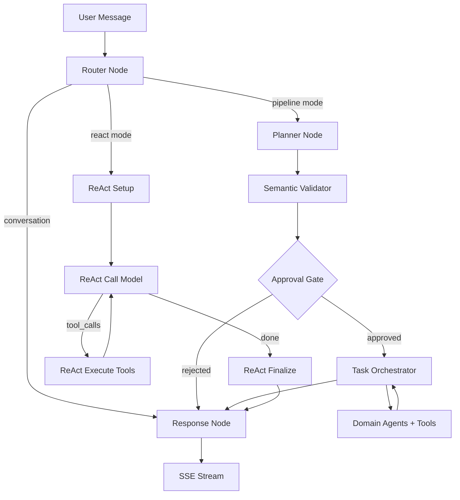

# LIA — Guía Técnica Completa

> Arquitectura, patrones y decisiones de ingeniería de un asistente IA multi-agente de nueva generación.
>
> Documentación de presentación técnica destinada a arquitectos, ingenieros y expertos técnicos.

**Versión**: 3.8
**Fecha**: 2026-08-04
**Aplicación**: LIA v1.27.10
**Licencia**: AGPL-3.0 (Open Source)

---

## Tabla de contenidos

1. [Contexto y decisiones fundacionales](#1-contexto-y-decisiones-fundacionales)
2. [Stack tecnológico](#2-stack-tecnológico)
3. [Arquitectura backend: Domain-Driven Design](#3-arquitectura-backend--domain-driven-design)
4. [LangGraph: orquestación multi-agente](#4-langgraph--orquestación-multi-agente)
5. [El pipeline de ejecución conversacional](#5-el-pipeline-de-ejecución-conversacional)
6. [El sistema de planificación (ExecutionPlan DSL)](#6-el-sistema-de-planificación-executionplan-dsl)
7. [Smart Services: optimización inteligente](#7-smart-services--optimización-inteligente)
8. [Enrutamiento semántico y embeddings semánticos](#8-enrutamiento-semántico-y-embeddings-semánticos)
9. [Human-in-the-Loop: arquitectura de 6 capas](#9-human-in-the-loop--arquitectura-de-6-capas)
10. [Gestión del state y message windowing](#10-gestión-del-state-y-message-windowing)
11. [Sistema de memoria y perfil psicológico](#11-sistema-de-memoria-y-perfil-psicológico)
12. [Infraestructura LLM multi-provider](#12-infraestructura-llm-multi-provider)
13. [Conectores: abstracción multi-proveedor](#13-conectores--abstracción-multi-proveedor)
14. [MCP: Model Context Protocol](#14-mcp--model-context-protocol)
15. [Sistema de voz (STT/TTS)](#15-sistema-de-voz-stttts)
16. [Proactividad: Heartbeat y acciones planificadas](#16-proactividad--heartbeat-y-acciones-planificadas)
17. [RAG Spaces y búsqueda híbrida](#17-rag-spaces-y-búsqueda-híbrida)
18. [Browser Control y Web Fetch](#18-browser-control-y-web-fetch)
19. [Seguridad: defence in depth](#19-seguridad--defence-in-depth)
20. [Observabilidad y monitoreo](#20-observabilidad-y-monitoreo)
21. [Rendimiento: optimizaciones y métricas](#21-rendimiento--optimizaciones-y-métricas)
22. [CI/CD y calidad](#22-cicd-y-calidad)
23. [Patrones de ingeniería transversales](#23-patrones-de-ingeniería-transversales)
24. [Arquitectura de decisiones (ADR)](#24-arquitectura-de-decisiones-adr)
25. [Potencial de evolución y extensibilidad](#25-potencial-de-evolución-y-extensibilidad)
26. [Psyche Engine: Inteligencia emocional dinámica](#26-psyche-engine-inteligencia-emocional-dinámica)

---

## 1. Contexto y decisiones fundacionales

### 1.1. ¿Por qué estas decisiones?

Cada decisión técnica de LIA responde a una restricción concreta. El proyecto apunta a un asistente IA multi-agente **auto-hospedable en hardware modesto** (Raspberry Pi 5, ARM64), con transparencia total, soberanía de datos y soporte multi-proveedor LLM. Estas restricciones han guiado la totalidad del stack.

| Restricción | Consecuencia arquitectural |
|------------|--------------------------|
| Auto-hospedaje ARM64 | Docker multi-arch, embeddings semánticos (multilingües), Playwright chromium cross-platform |
| Soberanía de datos | PostgreSQL local (sin SaaS DB), cifrado Fernet en reposo, sesiones Redis locales |
| Multi-proveedor LLM | Factory pattern con 7 adaptadores, configuración por nodo, sin acoplamiento fuerte a un provider |
| Transparencia total | 447 métricas Prometheus, debug panel integrado, seguimiento token por token |
| Fiabilidad en producción | 204 ADRs, ~18.016 tests recogidos por pytest en 983 archivos, observabilidad nativa, HITL de 6 niveles |
| Costes controlados | Smart Services (89 % de ahorro en tokens), embeddings semánticos, prompt caching, filtrado de catálogo |

### 1.2. Principios arquitecturales

| Principio | Implementación |
|----------|----------------|
| **Domain-Driven Design** | Bounded contexts en `src/domains/`, agregados explícitos, capas Router/Service/Repository/Model |
| **Hexagonal Architecture** | Ports (protocols Python) y adaptadores (clientes concretos Google/Microsoft/Apple) |
| **Event-Driven** | SSE streaming, ContextVar propagation, fire-and-forget background tasks |
| **Defence in Depth** | 5 capas para los usage limits, 6 niveles HITL, 3 capas anti-alucinación |
| **Feature Flags** | Cada subsistema activable/desactivable (`{FEATURE}_ENABLED`) |
| **Configuration as Code** | Pydantic BaseSettings compuesto via MRO, cadena de prioridad APPLICATION > .ENV > CONSTANT |

### 1.3. Métricas del codebase

| Métrica | Valor |
|----------|--------|
| Tests | ~18.016 (recopilados por pytest en 983 archivos de prueba) + 4.830 tests vitest en el frontend (umbrales de cobertura bloqueados, ADR-116) |
| Fixtures reutilizables | 170+ |
| Documentos de documentación | 400+ |
| ADRs (Architecture Decision Records) | 204 |
| Métricas Prometheus | 447 definiciones |
| Dashboards Grafana | 26 |
| Idiomas soportados (i18n) | 6 (fr, en, de, es, it, zh) |

---

## 2. Stack tecnológico

### 2.1. Backend

| Tecnología | Versión | Rol | ¿Por qué esta elección? |
|-------------|---------|------|-------------------|
| Python | 3.12+ | Runtime | Ecosistema ML/IA más rico, async nativo, typing completo |
| FastAPI | 0.136.3 | API REST + SSE | Validación automática Pydantic, docs OpenAPI, async-first, rendimiento |
| LangGraph | 1.2.4 | Orquestación multi-agente | Único framework que ofrece state persistence + ciclos + interrupts (HITL) nativos |
| LangChain Core | 1.4.6 | Abstracciones LLM/tools | Decorador `@tool`, formatos de mensajes, callbacks estandarizados |
| SQLAlchemy | 2.0.50 | ORM async | `Mapped[Type]` + `mapped_column()`, async sessions, `selectinload()` |
| PostgreSQL | 16 + pgvector | Database + vector search | Checkpoints LangGraph nativos, búsqueda semántica HNSW, madurez |
| Redis | 7.4 | Cache, sesiones, rate limiting | O(1) ops, sliding window atómico (Lua), SETNX leader election |
| Pydantic | 2.13.4 | Validación + serialización | `ConfigDict`, `field_validator`, composición de settings via MRO |
| structlog | latest | Logging estructurado | JSON output con filtrado PII automático, snake_case events |
| Gemini Embeddings | gemini-embedding-001 | Embeddings semánticos | Embeddings multilingües Gemini (memoria, enrutamiento, intereses, diarios) — ADR-069 |
| Playwright | latest | Browser automation | Chromium headless, CDP accessibility tree, cross-platform |
| APScheduler | 3.x | Background jobs | Cron/interval triggers, compatible con leader election Redis |

### 2.2. Frontend

| Tecnología | Versión | Rol |
|-------------|---------|------|
| Next.js | 16.2.10 | App Router, SSR, ISR |
| React | 19.2.7 | UI con Server Components |
| TypeScript | 6.0.2 | Tipado estricto |
| TailwindCSS | 4.3.2 | Utility-first CSS |
| TanStack Query | 5.101 | Server state management, cache, mutations |
| Radix UI | v2 | Primitivas UI accesibles |
| react-i18next | 17.0 | i18n (6 idiomas), namespace-based |
| Zod | 4.x | Validación runtime de esquemas debug |

### 2.3. LLM Providers soportados

| Provider | Modelos | Especificidades |
|----------|---------|-------------|
| OpenAI | GPT-5.4, GPT-5.4-mini, GPT-5.2, GPT-5.1, GPT-5 (+ mini/nano), GPT-4.1, GPT-4o, o3/o4-mini | Prompt caching nativo, Responses API, reasoning_effort |
| Anthropic | Claude Opus 4.6/4.5, Claude Sonnet 4.6, Claude Haiku 4.5 | Extended thinking, prompt caching |
| Google | Gemini 3.1/3 Pro, Gemini 3.1/3 Flash, Gemini 2.5 Pro/Flash | Multimodal, embeddings duales |
| DeepSeek | deepseek-v4-flash, deepseek-v4-pro (V4), deepseek-chat (V3), deepseek-reasoner (R1) | Coste reducido, reasoning nativo |
| Perplexity | Sonar, Sonar Pro | Search-augmented generation |
| Qwen | qwen3.5-plus, qwen3.5-flash, qwen3-max | Thinking mode, tools + vision (Alibaba Cloud) |
| Ollama | Cualquier modelo local (descubrimiento dinámico) | Coste API cero, auto-hospedado |

**¿Por qué 7 providers?** La elección no es la colección por sí misma. Es una estrategia de resiliencia: cada nodo del pipeline puede asignarse a un provider diferente. Si OpenAI aumenta sus tarifas, el router pasa a DeepSeek. Si Anthropic tiene una caída, la respuesta se redirige a Gemini. La abstracción LLM (`src/infrastructure/llm/factory.py`) utiliza el pattern Factory con `init_chat_model()`, sobrecargado por adaptadores específicos (`ResponsesLLM` para la API Responses de OpenAI, elegibilidad por regex `^(gpt-4\.1|gpt-5|o[1-9])`).

---

## 3. Arquitectura backend: Domain-Driven Design

### 3.1. Estructura de los dominios

```
apps/api/src/
├── core/                         # Núcleo técnico transversal
│   ├── config/                   # 9 módulos Pydantic BaseSettings compuestos via MRO
│   │   ├── __init__.py           # Clase Settings (MRO final)
│   │   ├── agents.py, database.py, llm.py, mcp.py, voice.py, usage_limits.py, ...
│   ├── constants.py              # 1 000+ constantes centralizadas
│   ├── exceptions.py             # Excepciones centralizadas (raise_user_not_found, etc.)
│   └── i18n.py                   # Bridge i18n → settings
│
├── domains/                      # Bounded Contexts (DDD)
│   ├── agents/                   # DOMINIO PRINCIPAL — orquestación LangGraph
│   │   ├── nodes/                # 7+ nodos del grafo
│   │   ├── services/             # Smart Services, HITL, context resolution
│   │   ├── tools/                # Herramientas por dominio (@tool + ToolResponse)
│   │   ├── orchestration/        # ExecutionPlan, parallel executor, validators
│   │   ├── registry/             # AgentRegistry, domain_taxonomy, catalogue
│   │   ├── semantic/             # Semantic router, expansion service
│   │   ├── middleware/           # Memory injection, personality injection
│   │   ├── prompts/v1/           # 86 archivos .txt de prompts versionados
│   │   ├── graphs/               # 15 builders de agentes (uno por dominio)
│   │   ├── context/              # Context store (Data Registry), decorators
│   │   └── models.py             # MessagesState (TypedDict + custom reducer)
│   ├── auth/                     # OAuth 2.1, sesiones BFF, RBAC
│   ├── connectors/               # Abstracción multi-provider (Google/Apple/Microsoft)
│   ├── rag_spaces/               # Upload, chunking, embedding, retrieval híbrido
│   ├── journals/                 # Cuadernos de bitácora introspectivos
│   ├── interests/                # Aprendizaje de centros de interés
│   ├── heartbeat/                # Notificaciones proactivas LLM-driven
│   ├── channels/                 # Multi-canal (Telegram)
│   ├── voice/                    # TTS Factory, STT Sherpa, Wake Word
│   ├── skills/                   # Estándar agentskills.io
│   ├── sub_agents/               # Agentes especializados persistentes
│   ├── peers/                    # Conexiones entre usuarios (relevo asistente a asistente)
│   ├── relations/                # CRM personal (agregación + favoritos)
│   ├── usage_limits/             # Cuotas por usuario (5-layer defence)
│   └── ...                       # conversations, reminders, scheduled_actions, users, user_mcp
│
└── infrastructure/               # Capa transversal
    ├── llm/                      # Factory, providers, adapters, embeddings, tracking
    ├── cache/                    # Redis sessions, LLM cache, JSON helpers
    ├── mcp/                      # MCP client pool, auth, SSRF, tool adapters, Excalidraw
    ├── browser/                  # Playwright session pool, CDP, anti-detección
    ├── rate_limiting/            # Redis sliding window distribuido
    ├── scheduler/                # APScheduler, leader election, locks
    └── observability/            # 23 archivos de métricas Prometheus, tracing OTel
```

### 3.2. Cadena de prioridad de configuración

Un invariante fundamental atraviesa todo el backend. Fue sistemáticamente aplicado en v1.9.4 con ~291 correcciones en ~80 archivos, porque las divergencias entre constantes y la configuración real de producción causaban bugs silenciosos:

```
APPLICATION (Admin UI / DB) > .ENV (settings) > CONSTANT (fallback)
```

**¿Por qué esta cadena?** Las constantes (`src/core/constants.py`) sirven exclusivamente como fallback para los `Field(default=...)` Pydantic y los `server_default=` SQLAlchemy. Un administrador que cambia un modelo LLM desde la interfaz debe ver ese cambio aplicado inmediatamente, sin redespliegue. En runtime, todo el código lee `settings.field_name`, nunca directamente una constante.

### 3.3. Patrones de capas

| Capa | Responsabilidad | Patrón clave |
|--------|---------------|-------------|
| **Router** | Validación HTTP, auth, serialización | `Depends(get_current_active_session)`, `check_resource_ownership()` |
| **Service** | Lógica de negocio, orquestación | Constructor recibe `AsyncSession`, crea repositories, excepciones centralizadas |
| **Repository** | Acceso a datos | Hereda de `BaseRepository[T]`, paginación `tuple[list[T], int]` |
| **Model** | Esquema DB | `Mapped[Type]` + `mapped_column()`, `UUIDMixin`, `TimestampMixin` |
| **Schema** | Validación I/O | Pydantic v2, `Field()` con description, request/response separados |

---

## 4. LangGraph: orquestación multi-agente

### 4.1. ¿Por qué LangGraph? (ADR-001)

La elección de LangGraph en lugar de LangChain solo, CrewAI o AutoGen se basa en tres necesidades innegociables:

1. **State persistence**: `TypedDict` con reducers custom, persistido via PostgreSQL checkpoints — permite reanudar una conversación tras una interrupción HITL
2. **Ciclos e interrupts**: soporte nativo de bucles (rechazo HITL → re-planificación) y del pattern `interrupt()` — sin el cual el HITL de 6 capas sería imposible
3. **Streaming SSE**: integración nativa con callback handlers — crítico para la UX en tiempo real

CrewAI y AutoGen eran más simples de adoptar, pero ninguno de los dos soportaba el pattern interrupt/resume necesario para el HITL a nivel de plan. Esta elección tiene un coste: la curva de aprendizaje es más pronunciada (conceptos de grafos, edges condicionales, state schemas).

### 4.2. El grafo principal

LIA ofrece dos modos de ejecución (conmutables por usuario mediante un toggle en el encabezado del chat): **Pipeline** (por defecto, determinista y económico en tokens) y **ReAct** (autónomo e iterativo). El Router clasifica primero la petición (conversación directa o accionable) y luego la despacha al modo activo.



### 4.3. Nodos del grafo

| Nodo | Archivo | Rol | Windowing |
|------|---------|------|-----------|
| Router v3 | `router_node_v3.py` | Clasificación binaria conversation/actionable | 5 turns |
| QueryAnalyzer | `query_analyzer_service.py` | Detección de dominios, extracción de intent | — |
| Planner v3 | `planner_node_v3.py` | Generación ExecutionPlan DSL | 10 turns |
| Semantic Validator | `semantic_validator.py` | Validación de dependencias y coherencia | — |
| Approval Gate | `hitl_dispatch_node.py` | HITL interrupt(), 6 niveles de aprobación | — |
| Task Orchestrator | `task_orchestrator_node.py` | Ejecución paralela, paso de contexto | — |
| Response | `response_node.py` | Síntesis anti-alucinación, 3 capas de guardia | 20 turns |

### 4.4. AgentRegistry y Domain Taxonomy

El `AgentRegistry` centraliza el registro de agentes (`registry.register_agent()` en `main.py`), el catálogo de `ToolManifest`, y la `domain_taxonomy.py` que define cada dominio con su `result_key` y sus alias.

**¿Por qué un registro centralizado?** Sin él, la adición de un agente requería modificar 5+ archivos. Con el registro, un nuevo agente se declara en un solo punto y queda automáticamente disponible para el enrutamiento, la planificación y la ejecución.

### 4.5. Domain Taxonomy

Cada dominio es un `DomainConfig` declarativo: nombre, agentes, `result_key` (clave canónica para referencias `$steps`), `related_domains`, prioridad y enrutabilidad. El `DOMAIN_REGISTRY` es la fuente única de verdad consumida por tres subsistemas: SmartCatalogue (filtrado), expansión semántica (dominios adyacentes) y fase Initiative (prefiltro estructural).

### 4.6. Tool Manifests

Cada tool declara un `ToolManifest` a través de un `ToolManifestBuilder` fluido: parámetros, salidas, perfil de coste, permisos y `semantic_keywords` multilingües para enrutamiento. Los manifiestos son consumidos por el planner (inyección de catálogo), el router semántico (matching por palabras clave) y el builder de agentes (cableado de tools). Ver sección 23 para la arquitectura completa de tools.

---

## 5. El pipeline de ejecución conversacional

### 5.1. Flujo detallado de una petición accionable

1. **Recepción**: Mensaje del usuario → endpoint SSE `/api/v1/chat/stream`
2. **Contexto**: `request_tool_manifests_ctx` ContextVar construido una vez (ADR-061: 3-layer defence)
3. **Router**: Clasificación binaria con scoring de confianza (high > 0.85, medium > 0.65)
4. **QueryAnalyzer**: Identifica los dominios via LLM + validación post-expansión (gate-keeper que filtra los dominios desactivados)
5. **SmartPlanner**: Genera un `ExecutionPlan` (DSL JSON estructurado)
   - Pattern Learning: consulta la caché bayesiana (bypass si confianza > 90 %)
   - Skill detection: los Skills deterministas están protegidos via `_has_potential_skill_match()`
6. **Semantic Validator**: Verifica la coherencia de las dependencias inter-etapas
7. **HITL Dispatch**: Clasifica el nivel de aprobación, `interrupt()` si es necesario
8. **Task Orchestrator**: Ejecuta las etapas en oleadas paralelas via `asyncio.gather()`
   - Filtra las etapas skipped ANTES del gather (ADR-005 — corrige un bug de doble ejecución plan+fallback)
   - Paso de contexto via Data Registry (InMemoryStore)
   - Pattern FOR_EACH para iteraciones en masa
9. **Response Node**: Sintetiza los resultados, inyección de memoria + diarios + RAG
10. **SSE Stream**: Token por token hacia el frontend
11. **Background tasks** (fire-and-forget): extracción de memoria, extracción de diario, detección de intereses

### 5.2. ContextVar: propagación implícita del estado

Un mecanismo crítico es el uso de los `ContextVar` Python para propagar el estado sin parameter threading:

| ContextVar | Rol | ¿Por qué? |
|------------|------|----------|
| `current_tracker` | TrackingContext para el seguimiento de tokens LLM | Evita pasar un tracker a través de 15 capas de funciones |
| `request_tool_manifests_ctx` | Manifiestos de herramientas filtrados por petición | Construido una vez, leído por 7+ consumidores (elimina duplicación ADR-061) |

Este enfoque mantiene un aislamiento por petición en un contexto asyncio sin contaminar las firmas de funciones.

### 5.3. Modo de ejecución ReAct (ADR-070)

LIA ofrece un segundo modo de ejecución: **ReAct** (Reasoning + Acting). En lugar de planificar por adelantado, el LLM llama herramientas iterativamente, observa los resultados y decide el siguiente paso de forma autónoma.

**Arquitectura**: 4 nodos propios en el grafo LangGraph principal (no un subgrafo):

```
Router → react_setup → react_call_model ↔ react_execute_tools → react_finalize → Response
```

**Pipeline vs ReAct — compromisos de ingeniería**:

| Aspecto | Pipeline (por defecto) | ReAct (⚡) |
|--------|-------------------|-----------|
| **Coste en tokens** | **4–8× menor** — 1 llamada al planner + 1 de respuesta | 1 llamada LLM por iteración (2–15 iteraciones típicas) |
| **Planificación** | ExecutionPlan previo con validación semántica | Ninguna — el LLM decide paso a paso |
| **Ejecución paralela** | Sí — oleadas con `asyncio.gather()` | No — llamadas secuenciales a herramientas |
| **Adaptabilidad** | Sigue el plan de forma rígida | Se adapta en cada resultado de herramienta |
| **Control** | Total — DSL del planner, gates HITL, validadores | Mínimo — comportamiento guiado por prompt |
| **Previsibilidad de costes** | Alta — acotada por los pasos del plan | Baja — depende del razonamiento del LLM |
| **Ideal para** | Solicitudes multi-dominio estructuradas | Investigación exploratoria, consultas ambiguas |

El modo Pipeline es un verdadero logro de ingeniería: el SmartPlanner, el Semantic Validator, la caché bayesiana de patrones y el ejecutor paralelo entregan juntos la misma potencia funcional que ReAct consumiendo una fracción de los tokens. La contrapartida es la adaptabilidad — cuando la secuencia óptima de herramientas no puede predecirse de antemano, el razonamiento iterativo de ReAct destaca.

Ambos modos comparten el mismo registro de herramientas, sistema HITL, nodo de respuesta e infraestructura de observabilidad. Los usuarios alternan entre ellos mediante un interruptor en la cabecera del chat.

### 5.4. Ejecuciones desacopladas: la generación sobrevive a la conexión (ADR-117)

El streaming SSE clásico tiene un defecto estructural: la generación vive *dentro* del generador de la respuesta HTTP. Cerrar la pestaña, navegar a otra página o perder la red mata la conexión — y, con ella, el turno de conversación entero. LIA desacopla ambas cosas: un **productor desacoplado** (una tarea asyncio independiente de la petición) ejecuta el grafo y publica cada chunk en un **Redis Stream por run**; el endpoint SSE queda reducido a un **suscriptor** que retransmite ese stream.

- **Desconexión ≠ cancelación** — cerrar la página detiene la suscripción, nunca la generación. El mensaje del usuario se archiva *antes* de iniciar la ejecución, la respuesta termina en el servidor y espera en la conversación.
- **Reanudación en vivo** — al volver (montaje de la página, visibilidad de la pestaña), el frontend detecta el run activo, reproduce todos los chunks ya emitidos (sin pacing) y luego conmuta al flujo en vivo; la frontera es un comentario de transporte SSE (`: replay-end`), el contrato de los chunks queda intacto. Durante el replay, los efectos secundarios (toasts, audio) se suprimen mientras el reducer reconstruye la burbuja en curso.
- **Detección del silencio en el cliente** — la reanudación sigue suponiendo que el cliente sabe que debe reanudar. Una pestaña congelada por el sistema operativo no recibe ni fin ni error: la lectura queda suspendida, la interfaz cree seguir recibiendo, y la protección pensada para un flujo vivo bloquea justamente la reanudación. Un presupuesto de silencio calibrado según el ritmo de los latidos del servidor lo resuelve: superado ese margen, se abandona la conexión muerta, el estado vuelve al reposo y el reenganche anterior toma el relevo. Los temporizadores del navegador se congelan con la pestaña, así que el plazo vence al despertar — exactamente cuando sirve.
- **Un solo run por conversación** — un lock Redis (`SET NX EX` + heartbeat del productor + liberación condicional Lua a prueba de zombis) hace que un envío concurrente responda HTTP 409, que el frontend convierte en una reconexión silenciosa.
- **Cancelación entre workers** — el botón de envío se transforma en botón de stop; la señal de cancelación viaja por Redis y el productor la sondea (~1 s), incluso cuando el productor vive en un worker distinto al de la petición HTTP. La respuesta parcial se conserva y se marca como «interrumpida»; los tokens ya consumidos siguen facturados — la facturación se respeta en todos los caminos de salida, kills incluidos.
- **Voz solo si alguien escucha** — la presencia de suscriptores (un contador Redis con TTL rearmado periódicamente) condiciona la síntesis de voz: nada de TTS para un run que nadie escucha, y un oyente que se incorpora a mitad de camino obtiene la voz para el resto.
- **Apagado limpio** — al apagarse, el lifespan drena los productores en curso antes de ceder el control; un run matado archiva su parcial marcado `interrupted`, y una reparación al inicio del turno siguiente limpia los `tool_calls` huérfanos que un checkpoint interrumpido dejaría (los providers estrictos los rechazan en el turno siguiente).

El conjunto se gobierna con un feature flag y una docena de ajustes configurables por env (TTLs, heartbeat, drain, polling) validados en el arranque — un período de heartbeat incompatible con el TTL del lock se niega a arrancar.

---

**Anclaje en las entidades recientes.** En un turno que no llama a ninguna herramienta, el registro del turno actual está vacío por construcción (protección anticontaminación) y el historial conversacional excluye deliberadamente los mensajes de herramienta: el modelo de respuesta no dispone entonces de *ningún* dato estructurado con autoridad, y solo puede reformular prosa anterior. Por eso las entidades más recientes del estado se reinyectan mediante una sección de prompt dedicada — seleccionadas por recencia, acotadas por antigüedad, sin ida y vuelta al almacenamiento y explícitamente subordinadas a los datos del turno actual. Una regla de autoridad lo completa: está prohibido inventar un atributo de entidad, y un valor solicitado pero nunca recibido debe anunciarse como ausente.

## 6. El sistema de planificación (ExecutionPlan DSL)

### 6.1. Estructura del plan

```python
ExecutionPlan(
    steps=[
        ExecutionStep(
            step_id="get_meetings",
            tool_name="get_events",
            parameters={"date": "tomorrow"},
            dependencies=[]
        ),
        ExecutionStep(
            step_id="send_reminders",
            tool_name="send_email",
            parameters={"subject": "Rappel réunion"},
            dependencies=["get_meetings"],
            for_each="$steps.get_meetings.events",
            for_each_max=10
        )
    ]
)
```

### 6.2. Pattern FOR_EACH

**¿Por qué un pattern dedicado?** Las operaciones en masa (enviar un email a 12 contactos) no pueden planificarse como 12 etapas estáticas — el número de elementos es desconocido antes de la ejecución de la etapa anterior. El FOR_EACH resuelve este problema con salvaguardas:
- Umbral HITL: cualquier mutación >= 1 elemento desencadena una aprobación obligatoria
- Límite configurable: `for_each_max` previene las ejecuciones no acotadas
- Referencia dinámica: `$steps.{step_id}.{field}` para los resultados de etapas anteriores

La identidad de un resultado correlacionado incluye a su padre. Las herramientas derivan su id solo del contenido — el tiempo de `lugar + día`, una ruta de `origen + destino` — de modo que dos iteraciones sobre padres que comparten esos atributos producían el mismo id, y el acumulador, un simple `dict.update()`, sobrescribía en silencio el primero. El id se deriva ahora por padre mediante una huella determinista, lo que además mantiene estables las identidades ante una repetición o una reanudación tras una interrupción.

### 6.3. Ejecución paralela en oleadas

El `parallel_executor.py` organiza las etapas en oleadas (DAG):
1. Identifica las etapas sin dependencias no resueltas → oleada siguiente
2. Filtra las etapas skipped (condiciones no cumplidas, ramas fallback) — **antes** de `asyncio.gather()`, no después (ADR-005: corrige un bug que causaba 2x llamadas API y 2x costes)
3. Ejecuta la oleada con aislamiento de error por etapa
4. Alimenta el Data Registry con los resultados
5. Repite hasta la completación del plan

### 6.4. Validador Semántico

Antes de la aprobación HITL, un LLM dedicado (distinto del planner, para evitar el sesgo de autovalidación) inspecciona el plan según 14 tipos de anomalías en cuatro categorías: **Crítico** (capacidad alucinada, dependencia fantasma, ciclo lógico), **Semántico** (desajuste de cardinalidad, desbordamiento/subcubrimiento de alcance, parámetros incorrectos), **Seguridad** (ambigüedad peligrosa, suposición implícita) y **FOR_EACH** (cardinalidad faltante, referencia inválida). Cortocircuito para planes triviales (1 paso), timeout optimista de 1 s.


Además, un **registro anti-alucinación auto-enriquecido** (`hallucinated_tools.json`) detecta herramientas inventadas por el LLM mediante patrones regex persistentes. Cada nueva alucinación se añade automáticamente al registro. Los pasos alucinados se eliminan y el planificador se ve forzado a replanificar con las herramientas reales del catálogo.

Un veredicto clasifica, no condena — y un **diagnóstico no es una pregunta**. Cuando un plan de *escritura* agota sus replanificaciones automáticas, el validador se niega a ejecutarlo y pasa a una aclaración HITL: escribir un dato falso cuesta más que preguntar. Lo que entonces se pregunta al usuario es una pregunta **en su idioma**, tomada de una tabla de quince entradas cuya completitud se verifica al arranque **en ambos sentidos**: un problema que el código puede lanzar sin pregunta escrita impide arrancar la aplicación, y una pregunta que ningún código lanza, también. La descripción interna del problema se queda en la traza, que es su sitio. El mismo principio cubre los valores: un parámetro facilitado en un turno anterior se **recupera del plan previo** en lugar de reinventarse, porque la reparación reconoce una dirección de documentación y nunca sobrescribe un valor real — un cambio de opinión siempre se respeta (ADR-195).

### 6.5. La verdad de una referencia (ADR-194)

Una referencia entre pasos (`$steps.get_meetings.events[0].title`) la escribe el planificador **antes** de que el paso se haya ejecutado. La ruta debe ser correcta a la primera, o el plan fracasa tras haber gastado llamadas de API de pago y la espera del usuario.

Lo que la hace correcta es un **contrato**: cada manifiesto de herramienta publica las rutas que lleva su salida, y la integración continua demuestra ese contrato antes de fusionar cualquier código. La comprobación pilota la herramienta real — su builder auténtico, el resolutor de referencias real, la fusión reconstruida — y compara lo que el manifiesto publica con lo que la ejecución produce: la ruta en sí, su **forma** (registro, lista, lista de registros) y su **tipo** (cadena, número, objeto). El planificador lee ese tipo para decidir en qué puede encadenar un valor: un tipo equivocado rompe un plan tan seguramente como una ruta equivocada.

El contrato es deliberadamente **asimétrico**: todo lo publicado debe producirse, nunca al revés. Un manifiesto enumera *ejemplos*, no una enumeración exhaustiva — `events[0].summary` es real haya pensado alguien o no en escribirlo, y exigir lo contrario rechazaría rutas legítimas.

La cobertura se declara en lugar de suponerse: 36 de las 59 herramientas que publican rutas. Lo que la forma de una herramienta hace difícil de pilotar se cifra y se fecha en un expediente de deuda, en vez de quedar implícito. En ejecución, la red es `ReferenceResolver`, que lanza un error explícito en lugar de resolver al vacío.

### 6.6. Re-Planner Adaptativo (Panic Mode)

Cuando la ejecución falla, un analizador basado en reglas (sin LLM) clasifica el patrón de fallo (resultados vacíos, fallo parcial, timeout, error de referencia) y selecciona una estrategia de recuperación: retry idéntico, replanificación con alcance ampliado, escalación al usuario o abandono. Esa decisión es **consultiva por ahora**: se registra y se cuenta en cada fallo, lo que hace medibles los modos de fallo, pero el orquestador aún no la aplica automáticamente — los resultados parciales se muestran en vez de descartarse. En **Panic Mode**, el SmartCatalogue se expande para incluir todas las herramientas en un único retry — resolviendo casos donde el filtrado por dominio era demasiado agresivo.

---

### 6.7. Capacidad invocada: cuando la petición no es una frase

Un plan nace de un texto. Pero cuando la petición viene de un **botón** — una ficha con nombre, casillas marcadas —, el sistema posee esa certeza **antes** de consultar a ningún modelo. Convertirla en prosa y gastar luego tres etapas estocásticas (analizador, planificador, validador) en reconstruirla destruye información y paga por recuperarla. Medido: la herramienta esperada obtuvo **0,853**, la mejor puntuación del catálogo, y el plan llamó a una genérica.

La petición lleva por tanto, junto a la frase mostrada, la **capacidad invocada**: un par `{capability, subject}`. `capability` es un `Literal` **cerrado**, rechazado por Pydantic en la frontera HTTP — el navegador nombra una capacidad, **nunca** una herramienta, y el servidor decide qué herramienta de solo lectura la implementa. Esta puerta no lleva a ninguna herramienta de mutación. El transporte hasta el planificador es una `ContextVar` de petición, colocada en el mismo sitio y con la misma disciplina que las preferencias de skills.

Se aplica **antes de la validación**, igual que el ajuste de parámetros fuera de rango: lo que es mecánicamente reparable se repara, nunca se informa como defecto. El plan se **enriquece, no se sustituye** — todo lo que el planificador previó y que aporta algo permanece; lo que previó y que la capacidad ya cubre se retira, porque una respuesta sin relación colocada junto a una carencia declarada la contradice. Dos salvaguardas: un paso que otro sigue leyendo — por dependencia declarada **o** por referencia `$steps` — se conserva, y un plan sin pasos (aclaración pendiente, ejecución delegada a un skill) nunca se convierte en una ejecución. Una garantía que atropella una pregunta no es una garantía.

---

## 7. Smart Services: optimización inteligente

### 7.1. El problema resuelto

Sin optimización, el escalado a 10+ dominios hacía explotar los costes: pasar de 3 herramientas (contactos) a 30+ herramientas (10 dominios) multiplicaba por 10 el tamaño del prompt y, por tanto, el coste por petición (ADR-003). Los Smart Services fueron diseñados para llevar este coste al nivel de un sistema mono-dominio.

| Servicio | Rol | Mecanismo | Ganancia medida |
|---------|------|-----------|-------------|
| `QueryAnalyzerService` | Decisión de enrutamiento | Caché LRU (TTL 5 min) | ~35 % cache hit |
| `SmartPlannerService` | Generación de planes | Pattern Learning bayesiano | Bypass > 90 % confianza |
| `SmartCatalogueService` | Filtrado de herramientas | Filtrado por dominio | 96 % reducción tokens |
| `PlanPatternLearner` | Aprendizaje | Scoring bayesiano Beta(2,1) | ~2 300 tokens evitados por replan |

### 7.2. PlanPatternLearner

**Funcionamiento**: Cuando un plan es validado y ejecutado con éxito, su secuencia de herramientas se registra en Redis (hash `plan:patterns:{tool→tool}`, TTL 30 días). Para futuras peticiones, se calcula un score bayesiano: `confianza = (α + éxitos) / (α + β + éxitos + fallos)`. Por encima del 90 %, el plan se reutiliza directamente sin llamada LLM.

**Salvaguardas**: K-anonimidad (mínimo 3 observaciones para sugerencia, 10 para bypass), matching exacto de dominios, máximo 3 patterns inyectados (~45 tokens de overhead), timeout estricto de 5 ms.

**Inicialización**: 50+ golden patterns predefinidos al arranque, cada uno con 20 éxitos simulados (= 95,7 % de confianza inicial).

### 7.3. QueryIntelligence

El QueryAnalyzer produce mucho más que detección de dominios — genera una estructura `QueryIntelligence` profunda: intención inmediata vs objetivo final (`UserGoal`: FIND_INFORMATION, TAKE_ACTION, COMMUNICATE...), intenciones implícitas (ej: "buscar contacto" probablemente significa "enviar algo"), estrategias de fallback anticipadas, indicios de cardinalidad FOR_EACH y puntuaciones de confianza por dominio calibradas por softmax. Esto da al planner una visión más rica que una simple extracción de palabras clave.

### 7.4. Pivote Semántico

Las consultas en cualquier idioma se traducen automáticamente al inglés antes de la comparación de embeddings, mejorando la precisión interlingüística. Caché Redis (TTL 5 min, ~5 ms en hit vs ~500 ms en miss), mediante un LLM rápido.

### 7.5. Cierre del catálogo

El filtrado semántico puntúa las herramientas contra una **paráfrasis inglesa de la petición, regenerada en cada turno por un modelo**: la misma pregunta puede producir dos catálogos distintos. Si las herramientas seleccionadas exigen un dato que ninguna de ellas sabe producir — el identificador de un mensaje para poder responderlo —, el espacio de planes válidos está vacío **antes** de que el modelo empiece siquiera. Entonces solo puede inventar un nombre de herramienta.

El cierre aplica una regla que nunca mira la petición: *cada tipo de dato exigido por una herramienta del catálogo debe ser producido por otra herramienta del catálogo*. Es un enlazador que resuelve referencias pendientes, no una búsqueda que adivina. Dos condiciones lo hacen correcto y no solo plausible: una herramienta nunca se satisface a sí misma («responder a un correo» también produce un identificador de mensaje — el del que acaba de enviar), y solo una herramienta de **lectura** cuenta como fuente (no se dispara un envío para descubrir un identificador). Crecimiento medido del catálogo: **+1 herramienta**.

---

### 7.6. Alcanzabilidad entre dominios

Cerrar el catálogo resuelve lo que un plan puede **encadenar**. Antes hay otra pregunta: qué herramientas **entran** siquiera. El filtrado descarta toda herramienta cuyo dominio no figura entre los detectados — **antes** de consultar ninguna puntuación semántica. Una herramienta realmente transversal resulta pues invisible para cualquier consulta clasificada en otro sitio, por bien que puntúe.

Medido: la herramienta de resumen 360° de una persona vive en el dominio `contact`, mientras que la instrucción del analizador envía cualquier pregunta sobre un usuario conectado al dominio `peer`. Puntuación **0,853** — la mejor de todo el catálogo, frente a herramientas genéricas en 0,000 — y jamás presentada al planificador. Cuando funcionaba, era porque el modelo se había salido de su instrucción: un escape estocástico, no el camino nominal.

Un manifiesto declara ahora los dominios **adicionales** desde los que es alcanzable, y una **única implementación** responde a «¿está esta herramienta dentro del alcance?» para las dos estrategias de filtrado, que antes formulaban la misma pregunta cada una por su lado. Todo valor se valida al registrarse contra el registro de dominios: un dominio desconocido impide el arranque en lugar de volver la herramienta silenciosamente inencontrable. A declarar con parsimonia — cada dominio añadido amplía el abanico ofrecido para **todas** las consultas de ese dominio. No es relacionar dos dominios entre sí: relacionar arrastra sus cajas de herramientas enteras la una hacia la otra, lo que ya provocó un incidente en producción. Aquí se desplaza una herramienta, no un dominio.
### 7.7. El catálogo de un dominio es una oferta de capacidades

El filtrado por dominio tiene un corolario que la medición hizo visible: **lo que contiene el catálogo de un dominio dicta lo que el planificador puede querer**. En producción, preguntar cuándo fue la última llamada produjo un plan de dos pasos — buscar el contacto y luego **llamarle para preguntárselo**. Solo el fallo de una referencia lo detuvo.

No era un capricho del modelo, sino la única forma de obedecer. El prompt anuncia `Primary domain: telephony`, una regla comprueba que el plan cubra ese dominio, y el catálogo de `telephony` contenía **exactamente una capacidad: realizar una llamada**. Cubrir su dominio primario significaba, pues, actuar.

Se añadieron tres capacidades de lectura, **cada una en el dominio que carecía de ella** — llamadas, compromisos abiertos, mensajes retransmitidos. La alternativa, mediante los dominios adicionales de la sección anterior, se midió y se descartó: hacerlas accesibles desde `contact` expulsaba **seis herramientas de mutación** de los catálogos más cargados, al ser fijo el límite. Una capacidad de lectura no debe costar una de escritura.

Una regla **determinista** completa el dispositivo, antes de cualquier llamada al modelo: intención no mutante detectada + plan que llama a una herramienta de mutación → plan inválido. Se ejecuta junto a las demás reglas previas al LLM, fuera del alcance de la exención que eximía de revisión a todo plan bien encadenado que terminase en una mutación — es decir, exactamente la forma defectuosa. Cuanto mejor formado estaba el plan, menos se verificaba.

Ambos límites del catálogo (normal y modo pánico) pasaron a ser ajustes, con una comprobación al arranque: **el límite de reserva nunca es inferior al normal**, o la red de seguridad ofrecería menos que el camino que acaba de fallar.

---


## 8. Enrutamiento semántico y embeddings semánticos

### 8.1. ¿Por qué embeddings semánticos? (ADR-049)

El enrutamiento puramente LLM tenía dos problemas: coste (cada petición = una llamada LLM) y precisión (el LLM se equivocaba en los dominios en ~20 % de los casos multi-dominio). Los embeddings semánticos resuelven ambos:

| Propiedad | Valor |
|-----------|--------|
| Proveedor | Google Gemini (`gemini-embedding-001`) |
| Idiomas | 100+ |
| Ganancia de precisión | +48 % en Q/A matching vs enrutamiento LLM solo |

### 8.2. Semantic Tool Router (ADR-048)

Cada `ToolManifest` posee `semantic_keywords` multilingües. La petición se transforma en embedding, luego se compara por similaridad coseno con **max-pooling** (score = MAX por herramienta, no promedio — evita la dilución semántica). Doble umbral: >= 0.70 = alta confianza, 0.60-0.70 = incertidumbre.

### 8.3. Semantic Expansion

El `expansion_service.py` añade al catálogo del planner los dominios capaces de proporcionar un dato que falta. El disparador está **guiado por la evidencia**: la detección de referencias personales es la unión de tres fuentes — los mappings del resolutor de memoria (referencias personales por construcción), las referencias relacionales extraídas incluso cuando la resolución no encuentra ningún hecho, y las referencias tipadas por el LLM de análisis. Una entidad referenciada (persona → `Contact`, cita → `CalendarEvent`, lugar → `Place`, correo → `EmailMessage`) aporta los dominios cuyas `properties` de su tipo ontológico proporcionan un tipo requerido por las herramientas seleccionadas — un anclaje que impide toda expansión ciega, con tope configurable y verificación de completitud del mapping al arranque (ADR-120).

La capa se alimenta de manifiestos **profundamente anotados** (`semantic_type` en parámetros y outputs: participantes de un evento, remitente de un correo, destino de una ruta — ADR-121), que también nutren las sugerencias de enlace Jinja2 entre dominios y una **salvaguarda de ejecución**: un nombre de persona nunca puede llegar a un parámetro tipado dirección/correo — la llamada falla antes de cualquier gasto de API con un error recuperable, en ambos modos de ejecución. La validación post-expansión (ADR-061, Layer 1) sigue filtrando los dominios desactivados por el administrador.

---

## 9. Human-in-the-Loop: arquitectura de 6 capas

### 9.1. ¿Por qué a nivel de plan? (Fase 7 → Fase 8)

El enfoque inicial (Fase 7) interrumpía la ejecución **durante** las llamadas de herramientas — cada herramienta sensible generaba una interrupción. La UX era mediocre (pausas inesperadas) y el coste elevado (overhead por herramienta).

La Fase 8 (actual) somete el **plan completo** al usuario **antes** de cualquier ejecución. Una sola interrupción, una visión global, la posibilidad de editar los parámetros. El compromiso: hay que confiar en el planificador para producir un plan fiel.

### 9.2. Los 6 tipos de aprobación

| Tipo | Desencadenante | Mecanismo |
|------|-------------|-----------|
| `PLAN_APPROVAL` | Acciones destructivas | `interrupt()` con PlanSummary |
| `CLARIFICATION` | Ambigüedad detectada | `interrupt()` con pregunta LLM |
| `DRAFT_CRITIQUE` | Borrador de email/event/contact | `interrupt()` con borrador serializado + template markdown |
| `DESTRUCTIVE_CONFIRM` | Eliminación >= 3 elementos | `interrupt()` con advertencia de irreversibilidad |
| `FOR_EACH_CONFIRM` | Mutaciones en masa | `interrupt()` con recuento de operaciones |
| `MODIFIER_REVIEW` | Modificaciones IA sugeridas | `interrupt()` con comparación before/after |

### 9.3. Draft Critique enriquecido

Para los borradores, un prompt dedicado genera una crítica estructurada con templates markdown por dominio, emojis de campos, comparación before/after con strikethrough para las actualizaciones, y advertencias de irreversibilidad. Los resultados post-HITL muestran labels i18n y enlaces clicables.

### 9.4. Clasificación de Respuestas

Cuando el usuario responde a un prompt de aprobación, un clasificador full-LLM (sin regex) categoriza la respuesta en 5 decisiones: **APPROVE**, **REJECT**, **EDIT** (misma acción, parámetros diferentes), **REPLAN** (acción completamente diferente) o **AMBIGUOUS**. Una lógica de degradación previene falsos positivos: un EDIT con parámetros faltantes se degrada a AMBIGUOUS, activando una clarificación.

### 9.5. Bucles de revisión replay-safe (ADR-092)

La semántica de reanudación de LangGraph re-ejecuta el nodo interrumpido **por completo**: los `interrupt()` pasados devuelven sus valores memorizados, pero todo lo demás vuelve a ejecutarse en vivo. Cualquier bucle escrito alrededor de `interrupt()` dentro de un nodo repite por tanto sus efectos secundarios (llamadas LLM, API) en cada decisión del usuario. Los dos bucles de revisión — edición iterativa de borradores y confirmación de operaciones masivas (nodo dedicado `for_each_confirm`) — siguen un patrón normativo: **un solo `interrupt()` por ejecución de nodo**, el estado del bucle fluye por el state checkpointed, y la iteración pasa por un self-loop condicional. Garantía probada con arneses de replay compilados: cada modificación LLM se ejecuta exactamente una vez y el contenido confirmado es exactamente el último mostrado.

### 9.6. Compaction Safety

4 condiciones impiden la compactación LLM (resumen de los mensajes antiguos) durante los flujos de aprobación activos. Sin esta protección, un resumen podría eliminar el contexto crítico de una interrupción en curso.

---

## 10. Gestión del state y message windowing

### 10.1. MessagesState y reducer custom

El state LangGraph es un `TypedDict` con un reducer `add_messages_with_truncate` que gestiona el truncation basado en tokens, la validación de las secuencias de mensajes OpenAI, y la deduplicación de los mensajes tool.

### 10.2. ¿Por qué el windowing por nodo? (ADR-007)

**El problema**: una conversación de 50+ mensajes generaba 100k+ tokens de contexto, con una latencia > 10 s para el router y una explosión de los costes.

**La solución**: cada nodo opera sobre una ventana diferente, calibrada según su necesidad real:

| Nodo | Turns | Justificación |
|------|-------|---------------|
| Router | 5 | Decisión rápida, contexto mínimo suficiente |
| Planner | 10 | Necesidad de contexto para planificar, pero no de todo el historial |
| Response | 20 | Contexto rico para síntesis natural |

**Impacto medido**: latencia E2E -50 % (10 s → 5 s), coste -77 % en las conversaciones largas, calidad preservada gracias al Data Registry que almacena los resultados de herramientas independientemente de los mensajes.

### 10.3. Context Compaction

Cuando el número de tokens supera un umbral dinámico (ratio de la context window del modelo de respuesta), se genera un resumen LLM. Los identificadores críticos (UUIDs, URLs, emails) se preservan. Ratio de ahorro: ~60 % por compactación. Comando `/resume` para activación manual.

**Resiliencia operativa**: cada llamada al LLM se envuelve en un `asyncio.wait_for` por chunk (35 s por defecto) y un presupuesto global de 120 s. En errores transitorios, `tenacity.AsyncRetrying` reintenta hasta 3 veces con backoff exponencial. Si el resumen aún no puede completarse, un repliegue explícito (`_truncation_fallback`) trunca limpiamente el historial antiguo con un `SystemMessage` legible que preserva los identificadores — sin stub silencioso. Los resúmenes anteriores `compaction #N` se consolidan en el merge en lugar de apilarse turno tras turno.

**Señal SSE custom mode**: el nodo emite `compaction_start` / `compaction_done` mediante `langgraph.config.get_stream_writer()` a través de un `stream_mode="custom"` (LangGraph 1.x). El streaming service traduce estos payloads en `ChatStreamChunk(type="execution_step")`. En el frontend, un toast sonner morfeado sobre un id estable (`COMPACTION_TOAST_ID`) permanece visible durante toda la compactación, la entrada queda bloqueada vía `status="compacting"`, y un `ContextUsagePill` muestra de forma continua el ratio tokens/umbral. El keepalive SSE concurrente (`iter_with_keepalive`) emite `: heartbeat` cada 15 s durante los awaits silenciosos para neutralizar los cortes por inactividad de Cloudflare. Cinco métricas Prometheus (`compaction_chunk_timeouts_total`, `compaction_global_timeouts_total`, `compaction_total_duration_seconds`, `compaction_writer_unavailable_total`, `compaction_executions_total{strategy}`) alimentan un panel de Grafana dedicado.

### 10.4. Checkpointing PostgreSQL

State completo checkpointeado después de cada nodo. P95 save < 50 ms, P95 load < 100 ms, tamaño medio ~15 KB/conversación. El checkpointer y el store se apoyan cada uno en un pool de conexiones PostgreSQL dedicado por worker (tamaños ajustables por entorno): las conversaciones concurrentes ya no se serializan sobre una conexión única, y una conexión caída se detecta en el checkout y se reemplaza automáticamente (ADR-111).

### 10.5. Los bloques de sistema de un turno ReAct son estado (ADR-169/170)

`get_windowed_messages(include_system=True)` **eleva todos los `SystemMessage` al principio**, sin límite de ventana. Apilar los bloques de sistema del turno en el historial equivalía por tanto a reenviar todas las copias pasadas en cada llamada: `react_agent_prompt.txt` pesa **840 tokens**, o sea 2.520 tokens duplicados tras tres turnos — en cada llamada LLM de cada iteración. Como el prefijo crecía en cada turno, ninguna caché de prefijo del proveedor podía acertar, y Anthropic rechazaba la secuencia desde el segundo turno: un `SystemMessage` no puede aparecer en medio de un historial.

Los bloques viven ahora en una clave de estado dedicada y se recomponen al frente en cada llamada — el prefijo vuelve a ser estable. El esquema de estado pasa a **1.4**, con una migración aditiva e idempotente. La ventana descarta los `SystemMessage` heredados del historial **salvo el resumen de compactación**: una primera versión del arreglo restablecía la contigüidad destruyendo ese resumen, y fue la revisión de ese arreglo la que produjo la buena solución.

**El plazo del bucle se mide sobre el cálculo, no sobre el reloj de pared.** `interrupt()` lanza: el nodo nunca retorna, no se persiste ninguna actualización de estado, no se refresca ninguna marca de tiempo, y la reanudación vuelve a entrar en el nodo interrumpido sin repetir el enrutador donde vivía la puesta a cero — **2,01 s de reloj para 0,0102 s de cálculo**, medidos sobre un grafo real. Pasado el presupuesto, el turno reanudado se cortaba en la siguiente decisión de enrutado y la respuesta se re-sintetizaba con una segunda llamada LLM, perdiendo el trabajo multietapa. Una guarda de ausencia de progreso completa el conjunto: a la cuarta llamada de herramienta idéntica se invita al modelo a cambiar de enfoque, a la quinta el turno concluye. La huella es un HMAC anclado en la clave de la aplicación — sobrevive a una reanudación en otro worker — y solo la huella y un contador llegan al checkpoint, nunca el nombre de la herramienta ni sus argumentos.

---

## 11. Sistema de memoria y perfil psicológico

### 11.1. Arquitectura

```
AsyncPostgresStore + Semantic Index (pgvector)
├── Namespace: (user_id, "memories")        → Perfil psicológico
├── Namespace: (user_id, "documents", src)  → RAG documental
└── Namespace: (user_id, "context", domain) → Contexto herramientas (Data Registry)
```

### 11.2. Esquema de memoria enriquecido

Cada recuerdo es un documento estructurado con:
- `content`, `category` (preferencia, hecho, personalidad, relación, sensibilidad...)
- `importance` (1-10), `emotional_weight` (-10 a +10)
- `usage_nuance`: cómo utilizar esta información de manera benevolente
- Embedding `gemini-embedding-001` (1536d) via pgvector HNSW

**¿Por qué un peso emocional?** Un asistente que sabe que su madre está enferma pero trata ese hecho como cualquier otro dato es, en el mejor de los casos, torpe y, en el peor, hiriente. El peso emocional permite activar la `DANGER_DIRECTIVE` (prohibición de bromear, minimizar, comparar, banalizar) cuando se toca un tema sensible.

### 11.3. Extracción e inyección

**Extracción**: después de cada conversación, un proceso en background analiza el último mensaje del usuario, adaptado a la personalidad activa. Coste seguido via `TrackingContext`.

**Inyección**: el middleware `memory_injection.py` busca las memorias semánticamente cercanas, construye el perfil psicológico inyectable y activa la `DANGER_DIRECTIVE` si es necesario. Inyección en el prompt del sistema del Response Node.

**Qué turnos alimentan la memoria.** Un mensaje que desencadena una acción cuenta tanto como una conversación: reanudar un borrador no inyecta ningún mensaje, de modo que la petición original sigue siendo la última palabra del usuario en el momento de la extracción. A la inversa, los mensajes **fabricados por el sistema** — el andamiaje inyectado en un rechazo HITL — se marcan en sus metadatos y se excluyen tanto como objetivo como contexto: nunca se reconocen por su texto, ya que existen en seis idiomas. Por último, la heurística que descarta los asentimientos solo se aplica a lo que el usuario ha escrito realmente — aplicada a un nombre de persona, hacía desaparecer los recuerdos de los contactos cuyo apellido se parece a «bien» o «cool». Cada decisión se cuenta por subsistema y por resultado (`post_response_extraction_scheduled_total`), donde solo existían registros de depuración.

### 11.4. Búsqueda en memoria de doble vector

Cada recuerdo lleva **dos embeddings**: uno sobre su contenido, otro sobre las palabras clave que lo desencadenan. La consulta se compara con ambos y gana la mejor coincidencia (`LEAST(dist_content, dist_keyword)`, con repliegue al contenido cuando el vector de palabras clave es nulo).

Un motor **híbrido BM25 + pgvector** vivió aquí hasta la v1.14.0, cuando la memoria a largo plazo migró a su propio modelo PostgreSQL. El camino de búsqueda siguió; el camino híbrido no. A fecha de 2026-07-27 no tenía **ningún llamador**, 21 % de cobertura, 100 de 127 líneas jamás alcanzadas — y el panel de depuración seguía anunciando la opción al usuario. Módulo, ajustes, métricas y visualización se eliminaron juntos ([ADR-168](https://github.com/jgouviergmail/LIA-Assistant/blob/main/docs/architecture/ADR-168-Removal-Of-Dead-Hybrid-Memory-Search.md)). La búsqueda híbrida sigue muy viva, pero donde realmente se usa: RAG Spaces (sección 17).

### 11.5. Cuadernos de bitácora estratificados (Journals)

El asistente mantiene reflexiones introspectivas organizadas en cuatro temas (auto-reflexión, observaciones del usuario, ideas/análisis, aprendizajes) Y cuatro niveles de abstracción (`L0` observación bruta, `L1` directiva `CUANDO→HACE PORQUE`, `L2` patrón transversal, `L3` faceta de retrato — ver [ADR-079](https://github.com/jgouviergmail/LIA/blob/main/docs/architecture/ADR-079-Stratified-Journal-Consciousness.md)). Cada entrada lleva un estado epistémico (`confidence` ∈ {low, medium, high}) y dos contadores (`evidence_count`, `contradiction_count`).

**Doble desencadenante**: extracción post-conversación (fire-and-forget, frecuente, ligera) + consolidación periódica (4–12 h por usuario, compleja).

**Embeddings dual-vector Gemini** (`gemini-embedding-001`, 1536d, ADR-069): un vector sobre `title + content`, otro sobre `search_hints`. La búsqueda usa `LEAST(dist_content, dist_keyword)` por fila para conectar el vocabulario introspectivo del asistente y el vocabulario del usuario.

**Auto-evaluación diferida T → T+1**: `MessagesState.injected_journal_ids` (simétrico a `injected_memories`) transporta los IDs entre turnos. El `response_node` lee los IDs del turno anterior al inicio, los pasa al extractor post-conversación y escribe los IDs del turno actual al final. El extractor ve las directivas aplicadas + la reacción del usuario en el mismo prompt y señala `evidence_outcome="evidence" | "contradiction"` en acciones update — el servicio incrementa atómicamente los contadores (anti-alucinación capa 4: el LLM solo señala un resultado, el servicio posee los enteros). **Coste LLM adicional cero** (misma llamada de extracción, prompt enriquecido).

**Difusión ambiental del retrato de usuario**: la consolidación produce, en la **misma llamada LLM** (sin llamada adicional), un `portrait_full` (~200 tokens, conversación/planificador) y un `portrait_brief` (~60 tokens, flujos secundarios) persistidos en la tabla `users`. El builder `build_journal_user_model_block(user_id, format, flow)` (`src/domains/journals/portrait_builder.py`, espejo de `build_psyche_prompt_block`) devuelve un bloque `<UserModelContext>...</UserModelContext>` con degradación elegante. Difundido en **8 flujos**: 2 primarios en formato completo (`response_node`, `planner_node_v3`) y 6 secundarios en formato breve (`react_setup_node`, `interests/proactive_task`, `scheduler/reminder_notification`, `voice/service`, `heartbeat/prompts`, `agents/services/fallback_response` sync + async).

**Tres palancas de corrección de usuario** sobre el retrato (nunca directamente editable): (1) ediciones CRUD de las entradas L3 origen, (2) `POST /journals/portrait/feedback` (texto libre → entrada L0 con `source=user_correction` + re-consolidación síncrona que repondera las L3), (3) `POST /journals/consolidate` (consolidación manual, omite cooldown).

**Disciplina de dedup**: sin guardia write-time (retirada en v1.14.0). En la consolidación, `STEP 1` realiza un escaneo por pares explícito que fusiona los duplicados semánticos, y `STEP 5` agrupa activamente las L1 convergentes en patrones L2.

**Anti-alucinación de 4 capas**: `field_validator` Pydantic en UUIDs, tabla de referencia de IDs en el prompt, filtrado de acciones por IDs conocidos en extracción y consolidación, e incrementos atómicos de contadores (el LLM solo señala `evidence_outcome`).

**Observabilidad dedicada**: 11 métricas Prometheus en `src/infrastructure/observability/metrics_journals.py` — `journal_entries_total{action,theme,source}`, `journal_evidence_total{outcome}`, `journal_consolidation_promotions_total{from_level,to_level}`, `journal_level_distribution{level}`, `journal_portrait_present_total{flow,format}`, `journal_portrait_age_hours`, `journal_portrait_feedback_total{outcome}`, etc.

### 11.6. Sistema de intereses

Detección por análisis de las peticiones con evolución bayesiana de los pesos (decay configurable). Los intereses se agrupan en **temas** mediante clustering LLM por lotes (dato derivado, auto-reparable), y la selección de notificaciones sortea con **rareza a dos niveles** (cooldown por tema + prioridad a los temas e intereses menos servidos) — una pasión nunca monopoliza las notificaciones. Contenido multi-fuente (Perplexity, Brave, Wikipedia, reflexión LLM) con **enlaces a las fuentes clicables** añadidos de forma determinista. El feedback del usuario (thumbs up/down/block) ajusta los pesos; fusión nocturna de casi-duplicados.

---

## 12. Infraestructura LLM multi-provider

### 12.1. Factory Pattern

```python
llm = get_llm(provider="openai", model="gpt-5.4", temperature=0.7, streaming=True)
```

El `get_llm()` resuelve la configuración efectiva via `get_llm_config_for_agent(settings, agent_type)` (code defaults → DB admin overrides), instancia el modelo y aplica los adaptadores específicos.

### 12.2. 56 tipos de configuración LLM

Cada nodo del pipeline es configurable independientemente via la Admin UI — sin redespliegue:

| Categoría | Tipos configurables |
|-----------|-------------------|
| Pipeline | router, query_analyzer, planner, semantic_validator, context_resolver |
| Respuesta | response, hitl_question_generator |
| Background | memory_extraction, interest_extraction, journal_extraction, journal_consolidation |
| Agentes | contacts_agent, emails_agent, calendar_agent, browser_agent, etc. |

### 12.3. Token Tracking

El `TrackingContext` sigue cada llamada LLM con `call_type` ("chat"/"embedding"), `sequence` (contador monótono), `duration_ms`, tokens (input/output/cache), y coste calculado desde las tarifas DB. Los trackers comparten un `run_id` para la agregación. El debug panel muestra todas las invocaciones (pipeline + background tasks) en una vista unificada cronológica.

### 12.4. Catálogo admin DB-source-of-truth

La tabla `llm_models` lleva el catálogo completo: provider, capacidades funcionales clásicas (`supports_tools`, `supports_structured_output`, `supports_strict_mode`, `supports_streaming`, `supports_vision`), y — añadidos estructurantes — la **matriz sampling por modelo** (`supports_temperature`, `supports_top_p`, `supports_frequency_penalty`, `supports_presence_penalty`) así como la **forma reasoning** (`reasoning_widget` ∈ {`none`, `enum`, `budget_int`, `toggle_budget`}, `reasoning_enum_values` lista JSONB, `reasoning_budget_range` JSONB `{min, max, off_sentinel, dynamic_sentinel}`, `reasoning_doc_i18n_key`). Esta declaración por modelo reemplaza la regex frontend que adivinaba antes qué deslizadores ocultar: el diálogo Configuración LLM lee directamente los flags DB y solo expone los parámetros que la API del modelo realmente acepta.

El formulario admin Tarification LLM Texte expone un **mecanismo de templates dinámicos derivados de la DB**: el servicio `LLMModelService.list_templates()` agrupa las filas activas por su huella reasoning de 4 campos y devuelve un representante determinista por grupo (~15 formas únicas hoy). Añadir un nuevo modelo reasoning se reduce a elegir «copiar la forma desde tal modelo existente»; los 4 campos de forma se copian (snapshot) en el momento de la creación. Modo **Custom** disponible para disrupciones; cualquier modelo Custom con huella inédita queda automáticamente como template para las siguientes adiciones. `kind` (chat / image / audio / …), las cuatro caps sampling y la clave i18n del tooltip se guardan por modelo, independientes del template. Ver `docs/technical/LLM_PRICING_TEMPLATES.md`.

### 12.5. Prompt caching agnóstico del proveedor

Todos los proveedores facturan menos (y responden más rápido) cuando el inicio del prompt es byte-idéntico entre peticiones — pero cada uno con su propio mecanismo: los bloques `cache_control` de Anthropic, el enrutado `prompt_cache_key` de OpenAI, las cachés implícitas de prefijo en DeepSeek/Qwen/Gemini. LIA separa las responsabilidades: cada prompt de sistema versionado coloca su contenido estático (rol, reglas, ejemplos, formato de salida) al principio, luego un marcador canónico `--- DYNAMIC CONTEXT ---`, y después todo el contenido por petición (fecha, consulta, contexto, catálogo de herramientas). Las plantillas permanecen neutrales respecto al modelo; la capa de infraestructura traduce el marcador al dialecto de cada proveedor — el split `cache_control` para Anthropic, la clave de enrutado de caché para OpenAI, nada para las cachés implícitas, que aprovechan el prefijo estable tal cual. El prompt del planner — el más costoso del pipeline — expone así un prefijo cacheable byte-estable de ~77 % entre dos peticiones cualesquiera. Guardas CI shrink-only bloquean la convención: todo prompt dinámico debe llevar el marcador, ningún placeholder puede precederlo sin una excepción justificada, y la estabilidad byte del prefijo del planner se verifica en cada build.

---

## 13. Conectores: abstracción multi-proveedor

### 13.1. Arquitectura por protocolos

```
ConnectorTool (base.py) → ClientRegistry → resolve_client(type) → Protocol
     ├── GoogleGmailClient       implements EmailClientProtocol
     ├── MicrosoftOutlookClient  implements EmailClientProtocol
     ├── AppleEmailClient        implements EmailClientProtocol
     └── PhilipsHueClient        implements SmartHomeClientProtocol
```

**¿Por qué protocolos Python?** El duck typing estructural permite agregar un nuevo provider sin modificar el código invocante. El `ProviderResolver` garantiza que un solo proveedor esté activo por categoría funcional.

### 13.2. Normalizers

Cada provider devuelve datos en su propio formato. Normalizers dedicados (`calendar_normalizer`, `contacts_normalizer`, `email_normalizer`, `tasks_normalizer`) convierten las respuestas específicas de cada provider en modelos de dominio unificados. Agregar un nuevo provider solo requiere implementar el protocolo y su normalizer — el código de llamada permanece sin cambios.

### 13.3. Patrones reutilizables

`BaseOAuthClient` (template method con 3 hooks), `BaseGoogleClient` (paginación via pageToken), `BaseMicrosoftClient` (OData). Circuit breaker, rate limiting Redis distribuido, refresh token con double-check pattern y Redis locking contra el thundering herd.

### 13.4. Telefonía agéntica (ADR-127)

LIA puede realizar una llamada saliente en nombre del usuario, mantener una conversación orientada a objetivos y reinyectar un resumen escrito en el chat. A diferencia de los conectores de lectura/escritura anteriores, el conector de telefonía impulsa un **agente de voz de terceros** (ElevenLabs Agents) a través de la red telefónica, configurado por usuario (credenciales propias) — LIA no realiza medición de costes por su cuenta.

**Protección de datos por capacidad, no por prompt.** El agente de llamada dispone de una única herramienta de disponibilidad de solo lectura que resuelve únicamente franjas libre/ocupado; nunca puede leer títulos, asistentes, lugares ni contenido de los eventos. La garantía es estructural — la herramienta simplemente no expone esos datos — y no una instrucción de prompt de la que se pudiera convencer al modelo.

**Vía de retorno.** La llamada nunca se graba y la transcripción nunca se conserva. Al terminar la llamada, un webhook firmado con HMAC propio de cada usuario lanza una síntesis LLM sin herramientas que produce un resumen breve y efímero, reinyectado de forma asíncrona en la conversación (el mismo canal de ejecución desacoplada que el ADR-117) con un borrador de seguimiento opcional en un toque. Cada llamada requiere una confirmación HITL antes de marcar, y todo el subsistema está protegido por un feature flag.

---

## 14. MCP: Model Context Protocol

### 14.1. Arquitectura

El `MCPClientManager` gestiona el lifecycle de las conexiones (exit stacks), el descubrimiento de herramientas (`session.list_tools()`), y la generación automática de descripción de dominio por LLM. El `ToolAdapter` normaliza las herramientas MCP hacia el formato LangChain `@tool`, con parsing estructurado de las respuestas JSON en items individuales.

### 14.2. Seguridad MCP

HTTPS obligatorio, prevención SSRF (resolución DNS + blocklist IP), cifrado Fernet de credentials, OAuth 2.1 (DCR + PKCE S256), rate limiting Redis por servidor/herramienta, API guard 403 en endpoints proxy para servidores desactivados (ADR-061 Layer 3).

### 14.3. MCP Iterative Mode (ReAct)

Los servidores MCP con `iterative_mode: true` utilizan un agente ReAct dedicado (bucle observe/think/act) en lugar del planner estático. El agente lee primero la documentación del servidor, comprende el formato esperado y luego llama a las herramientas con los parámetros correctos. Particularmente eficaz para servidores con API compleja (ej.: Excalidraw). Activable por servidor en la configuración admin o de usuario. Alimentado por el `ReactSubAgentRunner` genérico (compartido con el browser agent).

---

## 15. Sistema de voz (STT/TTS)

### 15.1. STT

Wake word ("OK Guy") via Sherpa-onnx WASM en el navegador (cero envío externo). Transcripción Whisper Small (99+ idiomas, offline) en el backend via ThreadPoolExecutor. Per-user STT language con caché thread-safe de `OfflineRecognizer` por idioma.

**Optimizaciones de latencia**: reutilización del flujo micro KWS → grabación (~200-800 ms ahorrados), pre-conexión WebSocket, `getUserMedia` + WS paralelizados via `Promise.allSettled`, caché Worklet AudioWorklet.

### 15.2. TTS

Factory **catalogue-driven** (ADR-081): `factory.get_tts_client()` lee el override activo `voice_tts` (provider + modelo + voz + tuning, almacenado en `llm_config_overrides.voice_tts.provider_config` JSONB) e instancia el cliente correspondiente. Tres providers entregados: Edge (gratuito, por defecto), OpenAI (`tts-1` / `tts-1-hd`) y ElevenLabs (`eleven_multilingual_v2`, `eleven_turbo_v2_5`, `eleven_flash_v2_5`). Si falta la clave de un provider de pago, la factory recae automáticamente sobre Edge (warning loggeado). Streaming progresivo frase por frase mediante `ProgressiveSentenceStreamer` (ADR-082) para minimizar la latencia — la primera frase se sintetiza mientras el LLM aún genera las siguientes. Un delimitador solo cierra una frase al final de la entrada o si va seguido de un espacio (ADR-154): en la vía progresiva el búfer crece token a token, de modo que `"3."` es un estado transitorio perfectamente normal — decimales, precios, números de versión y URL permanecen de una pieza, y los dos divisores (`_extract_sentences` y el streamer) están fijados por una tabla de casos común junto a una prueba que exige su acuerdo.

---

## 16. Proactividad: Heartbeat y acciones planificadas

### 16.1. Heartbeat: arquitectura en 2 fases

**Fase 1 — Decisión** (coste-efectiva, gpt-4.1-mini):
1. `EligibilityChecker`: opt-in, ventana horaria, cooldown (1h global, 30 min por tipo), actividad reciente — los filtros opcionales `notification_filter`/`cross_type_filters` separan el presupuesto de elegibilidad de cada flujo del libro de cuentas compartido
2. `ContextAggregator`: 12 fuentes en paralelo (`asyncio.gather`): Calendar, Weather (detección de cambios), Tasks, Emails, Interests, Actividad, notificaciones heartbeat/intereses recientes, otras superficies proactivas (recordatorios disparados, resultados de automatizaciones, informes de llamadas — la ventana anti-redundancia extendida), Health, Cumpleaños próximos y Bucles abiertos (el registro de compromisos, ADR-139). Una **segunda pasada** deriva luego una consulta semántica dinámica del contexto agregado para seleccionar Diarios y Memorias (simetría ADR-135) y calcula el consejo de salida según el tráfico (ETA de Routes, tras flag). Los intereses llegan como **muestra variada** (`pick_varied_sample`: un interés por tema, los temas menos servidos recientemente primero) — el modelo solo puede mencionar lo que se le muestra, así que la rotación es mecánica

   **Estar conectado y ser interrumpido son dos decisiones** (ADR-197). Once de estas fuentes llevan su propio interruptor, aplicado **antes** de la recuperación: una fuente rechazada deja de alimentar la decisión *y* deja de costar una llamada de API, sin desconectar el servicio — así que sin perder la herramienta con la que preguntas. El almacenamiento guarda el **rechazo**, nunca el permiso: `NULL` significa «nunca expresado», de modo que una cuenta existente conserva su comportamiento y una fuente añadida más tarde está activa hasta que alguien la rechace. Lo que no es una fuente — la actividad, las ventanas anti-redundancia — queda fuera del registro por construcción: cortarlas haría que el asistente se repitiera, no que interrumpiera menos. Y una dependencia se **declara y luego se publica**: el aviso de salida lee el calendario de la primera pasada, así que rechazar el calendario lo silenciaría; el panel lo dice en vez de dejar un interruptor encendido sin efecto.
3. LLM structured output: `skip` | `notify` más `interest_topic` (copiado literalmente de la muestra, guardia de ejecución fail-open) y etiquetas de fuente restringidas por un `Literal`. Anti-redundancia de dos niveles: fuente y **contenido** — las últimas 10 notificaciones en 7 días se inyectan con sus extractos, lo que prohíbe volver a proponer un tema aunque provenga de otra fuente

**Fase 1b — Enriquecimiento** (si `interest_topic`): `InterestContentGenerator` (Perplexity → Brave → Wikipedia) bajo timeout estricto, deduplicado contra los embeddings de notificaciones recientes. Totalmente fail-open: flag apagado, fallo o resultado vacío → el mensaje sale sin hechos.

**Fase 2 — Generación** (si notify): LLM reescribe con personalidad + idioma del usuario. Cuando se han recuperado hechos, un bloque VERIFIED FACTS exige nombrar 1-2 elementos concretos sin inventar nunca, y los enlaces a las fuentes se añaden de forma determinista. Dispatch multi-canal. Una mención de interés se inscribe en el libro compartido (`InterestNotification(source='heartbeat')`): el tema descansa entonces para ambos flujos proactivos.

Cada fuente está acotada por un presupuesto de tiempo y falla de forma independiente. Ese presupuesto cubre una parte de un bucle de eventos compartido con los demás recolectores — no es un tiempo de espera de base de datos: las señales de salud lo superaban en régimen nominal porque su lectura traía decenas de miles de filas en bruto para producir unas pocas decenas de números, congelando al worker durante la descodificación. La lectura se apoya ahora en una agregación diaria calculada en la base de datos, y toda pérdida de fuente se cuenta y cronometra en vez de pasar en silencio — una fuente que falla desapareciendo no deja rastro en la propia notificación.

### 16.2. Agent Initiative (ADR-062)

Nodo LangGraph post-ejecución: después de cada turno accionable, la iniciativa analiza los resultados y verifica proactivamente la información cross-domain (read-only). Ejemplos: clima lluvia → verificar calendario para actividades al aire libre, email mencionando una cita → verificar disponibilidad, tarea con deadline → recordar el contexto. 100% prompt-driven (sin lógica hardcoded), pre-filtro estructural (dominios adyacentes), inyección de memoria + centros de interés, campo sugerencia para proponer acciones write. Configurable via `INITIATIVE_ENABLED`, `INITIATIVE_MAX_ITERATIONS`, `INITIATIVE_MAX_ACTIONS`.

El mismo nodo emite además hasta 3 **chips de seguimiento** — peticiones cortas que el usuario probablemente enviará a continuación, formuladas en su idioma y ancladas en los resultados visibles. Una sanitización en el servidor (recorte, deduplicación sin distinción de mayúsculas, tope duro) y un handoff pop-once por ejecución las llevan tanto al chunk SSE `done` como a los metadatos del mensaje archivado: los chips se muestran en vivo y sobreviven a una recarga; tocar uno solo rellena el campo.

### 16.3. Acciones planificadas

APScheduler con leader election Redis (SETNX, TTL 120s, recheck 5s). `FOR UPDATE SKIP LOCKED` para aislamiento. Auto-approve de planes (`plan_approved=True` inyectado en el state). Auto-disable después de 5 fallos consecutivos. Retry en errores transitorios.

---

## 17. RAG Spaces y búsqueda híbrida

### 17.1. Pipeline

Upload → Chunking → Embedding (gemini-embedding-001, 1536d) → pgvector HNSW → Búsqueda híbrida (cosine + BM25 con alpha fusion) → Inyección de contexto en el **Response Node**.

Nota: la inyección RAG se realiza en el nodo de respuesta, no en el planificador. El planner recibe en cambio la inyección de los diarios personales via `build_journal_context()`.

### 17.2. System RAG Spaces (ADR-058)

FAQ integrada (250 Q/A, 24 secciones) indexada desde `docs/knowledge/`. Detección `is_app_help_query` por QueryAnalyzer, Rule 0 override en RoutingDecider, App Identity Prompt (~200 tokens, lazy loading). La obsolescencia se juzga con un SHA-256 de los archivos fuente **y** con el propio corpus almacenado (un fragmento por entrada analizada, exactamente un documento): una huella coincidente sobre un número de filas erróneo es una reparación, no un no-op. La auto-indexación se ejecuta en cada worker de uvicorn, así que la fila del espacio se reclama con `FOR UPDATE SKIP LOCKED` — un solo escritor, los demás pasan sin esperar — y cada vector se calcula **antes** de la primera instrucción destructiva: un rechazo del proveedor no borra nada y el corpus anterior sigue sirviendo (ADR-162).

---

## 18. Browser Control y Web Fetch

### 18.1. Web Fetch

URL → validación SSRF (DNS + IP blocklist + post-redirect recheck) → readability extraction (fallback full page) → HTML cleaning → Markdown → wrapping `<external_content>` (prevención prompt injection). Caché Redis 10 min.

### 18.2. Browser Control (ADR-059)

Agente ReAct autónomo (Playwright Chromium headless). Session pool Redis-backed con recovery cross-worker. CDP accessibility tree para interacción por elementos. Anti-detección (Chrome UA, webdriver flag remove, locale/timezone dinámicos). Cookie banner auto-dismiss (20+ selectores multilingües). Rate limiting separado read/write (40 cada uno por sesión).

---

## 19. Seguridad: defence in depth

### 19.1. Autenticación BFF (ADR-002)

**¿Por qué BFF en lugar de JWT?** JWT en localStorage = vulnerable a XSS, tamaño 90 % de overhead, revocación imposible. El pattern BFF con HTTP-only cookies + sesiones Redis elimina estos tres problemas. Migración v0.3.0: memoria -90 % (1.2 MB → 120 KB), session lookup P95 < 5 ms, score OWASP B+ → A.

**Autenticación reforzada (ADR-143/144).** Más allá de la contraseña y de OAuth de Google, la cuenta puede protegerse con **passkeys WebAuthn** (credenciales discoverable, conditional UI en el campo de e-mail, desafíos Redis de un solo uso, detección de clonado mediante contadores de firma, cero enumeración en el camino anónimo) y un **segundo factor TOTP** (inicio de sesión en dos pasos mediante un token efímero, anti-repetición por timestep explícito, 10 códigos de respaldo de un solo uso con hash). Las acciones sensibles — gestión de credenciales, exportación, revocación de dispositivos, desactivación de la contraseña — pasan por una **reautenticación step-up**: una ventana de 5 minutos abierta por cualquier inicio de sesión completo (semántica sudo), con un contrato **403 tipado** (`step_up_required`, nunca un 401 simple que redirigiría a /login). **Mis dispositivos** lista cada sesión BFF bajo un `display_id` opaco con metadatos deliberadamente acotados (familias UA/SO, IP truncada a /24), revoca un dispositivo o todos los demás, y corta el flujo SSE de una sesión revocada en un tick de keepalive; una notificación push señala cualquier inicio de sesión desde un dispositivo no atestiguado por un token FCM válido.

### 19.2. Usage Limits: 5-layer defence in depth

| Capa | Punto de intercepción | ¿Por qué esta capa? |
|--------|---------------------|-----------------------|
| Layer 0 | Chat router (HTTP 429) | Bloquear antes incluso del stream SSE |
| Layer 1 | Agent service (SSE error) | Cubrir las scheduled actions que evitan el router |
| Layer 2 | `invoke_with_instrumentation()` | Guard centralizado que cubre todos los servicios background |
| Layer 3 | Proactive runner | Skip para usuarios bloqueados |
| Layer 4 | Migración `.ainvoke()` directa | Cobertura de las llamadas no centralizadas |

Diseño **fail-open**: los fallos de infraestructura no bloquean a los usuarios.

### 19.3. Prevención de ataques

| Vector | Protección |
|---------|------------|
| XSS (renderizado LLM) | Frontera `rehype-sanitize` en el pipeline markdown del chat (`rehypeRaw → rehypeSanitize → rehypeMathInText → rehypeKatex`, esquema auditado — `script`/`iframe`/`form`/handlers eliminados), cookies HTTP-only, CSP backend; las MCP/Skill Apps nunca pasan por markdown (centinela → widget iframe en sandbox) |
| CSRF | SameSite=Lax |
| SQL Injection | SQLAlchemy ORM (consultas parametrizadas) |
| SSRF | Resolución DNS + lista de bloqueo de IP (Web Fetch, MCP, Browser); la instalación de skills por URL reutiliza el mismo validador con términos más estrictos: solo https, redirecciones rechazadas, tope de tamaño en streaming, deadline TOTAL de transferencia, rate limit por usuario El navegador va más lejos: **cada petición que emite una página** — redirección, subrecurso, iframe, XHR — resuelve su propio destino tras una caché de veredictos acotada, y un fallo aborta en lugar de dejar pasar. |
| Prompt Injection | Procedencia llevada por el dato: 24 tipos clasificados (fallo cerrado, assert al arranque), marcado en las tres superficies que alcanzan el LLM, 7 familias de patrones detectadas en 6 idiomas sin reescribir jamás el contenido (ADR-167); marcadores `<external_content>` conservados del lado de las herramientas |
| Rate Limiting / spoofing IP | Redis sliding window distribuido (Lua atómico); cadena proxy de confianza — puertos API vinculados a loopback (cloudflared = única entrada), uvicorn `--proxy-headers`, `request.client.host` validado como única fuente de IP (fin del bucket global compartido, XFF bruto nunca leído) Un techo global precede a cada ruta como verdadero middleware ASGI sobre ese mismo limitador compartido, de modo que un solo cliente no puede consumir toda la API; las sondas quedan exentas para no estrangular nunca la supervisión. |
| Supply Chain | SHA-pinned GitHub Actions, Dependabot weekly |

### 19.4. Durabilidad de los datos: copias de seguridad automatizadas (ADR-109)

**Una copia de seguridad solo es real cuando la restauración ha sido probada.** Un sidecar `postgres-backup` toma instantáneas de la base completa según una planificación cron con rotación de tres niveles (diaria / semanal / mensual); cada parámetro — planificación, retención, directorio de destino, opciones de pg_dump — se controla por `.env`. Los dumps llevan `--clean --if-exists`: la restauración es un solo comando, hacia la base viva o un contenedor desechable. El simulacro también está versionado: `task backup:verify` restaura el último dump en un contenedor pgvector efímero y compara la revisión de esquema de Alembic y recuentos de filas de referencia con la fuente viva. RPO: ≤ 24 h (configurable). Los límites asumidos (copia off-site, volumen de adjuntos) están registrados en el ADR-109 en lugar de quedar implícitos.

### 19.5. Aislar lo que se ejecuta

Tres superficies ejecutan algo por cuenta del usuario, y cada una se trata como hostil por construcción.

**Los scripts de skills se ejecutan en un contenedor desechable.** Sin socket Docker, sin red, con un sistema de archivos raíz de solo lectura y un pequeño tmpfs escribible, un uid sin privilegios, todas las capacidades retiradas y techos de memoria, procesos, CPU y tamaño de archivo. Lo decisivo es lo que un proceso hijo *hereda*: en producción la API pertenece al grupo `docker`, y un grupo se hereda — cambiar solo de uid dejaría el socket accesible. El CÓDIGO FUENTE del script se pasa como argumento en lugar de montarse, porque la API es ella misma un contenedor y un bind se resolvería contra el host; esa elección también deja stdin libre para la carga JSON sobre la que se apoya el contrato. Sin demonio accesible, la ejecución se rechaza en vez de degradarse — un sandbox que se desactiva solo no protege nada.

**Las tareas de infraestructura se confirman, no se presumen.** Una tarea en un servidor remoto se prepara, no se lanza: la confirmación muestra el servidor destino, el texto completo de la tarea y las instrucciones que el propio modelo escribió en el prompt remoto — el campo que usaría una inyección es precisamente el que no debe ocultarse. El privilegio se vuelve a verificar en la ejecución, porque unos derechos concedidos al formular una petición pueden ya no valer al aprobarla.

**El cuerpo de una petición se acota antes de leerse.** El techo se aplica antes del handler, sobre la longitud declarada cuando existe y sobre los bytes contados cuando no, de modo que el pico de memoria lo fijamos nosotros y no quien llama — en los webhooks eso ocurre antes de la autenticación. Su coherencia con los límites de subida por endpoint se comprueba al arrancar: una contradicción impide el arranque en lugar de aparecer como un rechazo remoto que ningún registro explica.

### 19.6. La procedencia del contenido la lleva el dato (ADR-167)

**Un texto que LIA lee no es un texto que LIA ejecuta.** El cuerpo de un correo, la descripción de una invitación redactada por su organizador, una página web, el resumen editorial de un lugar, el resultado de un servidor MCP: todos llegan al prompt, y cualquiera puede depositar allí una consigna.

El marcado herramienta por herramienta quedó invalidado por la búsqueda exhaustiva de sus llamadores. **Olvida**: `perplexity_tools`, `brave_tools`, `mcp_react_tools` y `emails_tools` no estaban cubiertos — este último anunciando en su propio docstring que devuelve *«FULL email content (body, headers, attachments)»*. **Y no cubre la superficie correcta**: el contenido alcanza el modelo por dos caminos, ninguno de los cuales es una herramienta, uno de ellos `generate_data_for_filtering`, que construye el bloque `{data_for_filtering}` del prompt de respuesta en **todos** los turnos que producen datos, en **ambos** modos de ejecución.

La procedencia es por tanto una propiedad del **dato**: los 24 tipos del registro se clasifican una vez, un tipo desconocido o nulo vale *externo* (fallo cerrado), y un assert de completitud al arranque se niega a iniciar ante un tipo sin clasificar — la misma doctrina que ADR-085. Quince de los veinticuatro tipos están redactados por terceros.

**Detectar, nunca sanear.** Siete familias de patrones se reconocen en los seis idiomas — rol usurpado, secuestro de instrucción, cambio de persona, exfiltración, una herramienta LIA nombrada dentro de texto ajeno, Unicode invisible, una directiva escondida en un comentario HTML — y el contenido llega al modelo **sin cambios**, acompañado de una nota que nombra la familia. Sanear equivaldría a reescribir un correo que el usuario puede querer leer tal cual, a cambio de una garantía que el siguiente rodeo desmentiría. La detección se limita a los primeros 20 000 caracteres y **nunca registra el texto**: está controlado por el atacante por construcción y contiene habitualmente los datos del usuario.

---

## 20. Observabilidad y monitoreo

### 20.1. Stack

| Tecnología | Rol |
|-------------|------|
| Prometheus | 447 métricas custom (RED pattern) |
| Grafana | 26 dashboards production-ready |
| Loki | Logs estructurados JSON agregados |
| Tempo | Trazas distribuidas cross-service (OTLP gRPC) |
| Langfuse | LLM-specific tracing (prompt versions, token usage) |
| Alertmanager | Núcleo de 14 alertas vitales notificadas por correo (runbooks enlazados, umbrales por entorno) |
| structlog | Logging estructurado con PII filtering |

### 20.2. Debug Panel integrado

El debug panel en la interfaz de chat proporciona una introspección en tiempo real por conversación: intent analysis, execution pipeline, LLM pipeline (reconciliación cronológica de todas las llamadas LLM + embedding), contexto/memoria, intelligence (cache hits, pattern learning), diarios (inyección + extracción background), lifecycle timing.

Las métricas debug persisten en `sessionStorage` (50 entradas máx.).

**¿Por qué un debug panel en la UI?** En un ecosistema donde los agentes IA son notoriamente difíciles de depurar (comportamiento no determinista, cadenas de llamadas opacas), hacer las métricas accesibles directamente en la interfaz elimina la fricción de tener que abrir Grafana o leer logs. El operador ve inmediatamente por qué una petición costó caro o por qué el router eligió tal dominio.

---

### 20.3. DevOps Claude CLI (solo admin)

Los administradores pueden interactuar con Claude Code CLI directamente desde la conversación de LIA para diagnosticar problemas del servidor en lenguaje natural. Claude CLI está instalado dentro del contenedor Docker de la API y se ejecuta localmente via subprocess, con acceso al Docker socket para inspeccionar todos los contenedores. Los permisos son configurables por entorno y el acceso está restringido a superusuarios.
## 21. Rendimiento: optimizaciones y métricas

### 21.1. Métricas clave (P95)

| Métrica | Valor | SLO |
|----------|--------|-----|
| API Latency | 450 ms | < 500 ms |
| Primer evento SSE (petición confirmada) | 380 ms | < 500 ms |
| Router Latency | 800 ms | < 2 s |
| Planner Latency | 2.5 s | < 5 s |
| Embedding semántico | ~100 ms | < 200 ms |
| Checkpoint save | < 50 ms | P95 |
| Redis session lookup | < 5 ms | P95 |

> Estas latencias miden la infraestructura. El tiempo de respuesta completo percibido depende de la cascada de llamadas LLM (de unos segundos a varias decenas según la complejidad de la petición y el hardware) — es el principal frente de optimización en curso, medido en producción y seguido en la roadmap.

### 21.2. Optimizaciones implementadas

| Optimización | Ganancia medida | Compromiso |
|-------------|-------------|-----------|
| Message Windowing | -50 % latencia, -77 % coste | Pérdida de contexto antiguo (compensado por Data Registry) |
| Smart Catalogue | 96 % reducción tokens | Panic mode necesario si filtrado demasiado agresivo |
| Pattern Learning | 89 % ahorros LLM | Inicialización requerida (golden patterns) |
| Prompt Caching | 90 % descuento | Depende del soporte del provider |
| Embeddings semánticos | Enrutamiento multilingüe de alta precisión | Depende de la disponibilidad del proveedor API |
| Parallel Execution | Latencia = max(etapas) | Complejidad de gestión de dependencias |
| Context Compaction | ~60 % por compactación | Pérdida de información (atenuada por preservación de IDs) |

---

## 22. CI/CD y calidad

### 22.1. Pipeline

```
Pre-commit (local)                GitHub Actions CI
========================          =========================
.bak files check                  Lint Backend (Ruff + Black + MyPy strict)
Secrets grep                      Lint Frontend (ESLint + TypeScript)
Ruff + Black + MyPy               Unit tests + coverage (62 %)
                                  Integration tests (PostgreSQL + Redis)
Unit tests rápidos                Code Hygiene (i18n, Alembic, lockfiles)
Detección patterns críticos       Docker build smoke test
Sync claves i18n                  Secret scan (Gitleaks)
Conflictos migración Alembic      ─────────────────────────
Completitud .env.example          Security workflow (semanal)
ESLint + TypeScript check           CodeQL (Python + JS)
                                    pip-audit + pnpm audit
                                    Trivy filesystem scan
                                    SBOM generation
```

### 22.2. Estándares

| Aspecto | Herramienta | Configuración |
|--------|-------|---------------|
| Formateo Python | Black | line-length=100 |
| Linting Python | Ruff | E, W, F, I, B, C4, UP |
| Type checking | MyPy | strict mode |
| Commits | Conventional Commits | `feat(scope):`, `fix(scope):` |
| Tests | pytest | `asyncio_mode = "auto"` |
| Coverage | 62 % mínimo (ratchet, nunca rebajado) | Aplicado en CI |

### 22.3. Builds de dependencias reproducibles

Las dependencias del backend están bloqueadas de extremo a extremo. Los archivos
requirements son manifiestos de intención; lo que cada entorno instala realmente
— imagen de producción, contenedor de dev, CI, venv local — son lockfiles
universales committeados, compilados con `uv pip compile --universal`: un único
archivo que cubre linux/amd64, linux/arm64 y Windows, y fija los ~200 paquetes
realmente incluidos con los hashes SHA256 de cada archivo publicado. pip vanilla
los instala con `--require-hashes`: el mismo commit produce siempre la misma
imagen, verificable byte a byte. Un guard de CI hace fallar cualquier edición
del manifiesto que omita regenerar el lock, y `pip-audit` junto con el SBOM de
release leen el lockfile — se audita e inventaría el árbol transitivo completo,
no solo los paquetes declarados.

---

### 22.4. La auditoría es pública — y reproducible

El nivel de exigencia descrito en esta guía no es autodeclarado: una auditoría técnica 360° completa — **8,3/10 sobre 24 perímetros normalizados** de la matriz ISO/IEC 25010, hallazgos abiertos incluidos — está publicada en el repositorio ([informe completo](https://github.com/jgouviergmail/LIA-Assistant/blob/main/docs/audit/README.md)), junto con el [protocolo de auditoría](https://github.com/jgouviergmail/LIA-Assistant/blob/main/docs/audit/AUDIT_PROTOCOL.md) que hace reproducible cada ciclo: commit fijado, requisitos de evidencia por perímetro, calificación anclada y un script versionado que mide el tamaño en SLOC lógicas. El informe termina con los comandos exactos para reproducir las mediciones tú mismo.

### 22.5. Una garantía vale lo que mide

`html { overflow-x: hidden }` recorta un desbordamiento horizontal en lugar de
producir un desplazamiento. Cualquier garantía construida sobre
`scrollWidth - clientWidth` es por tanto **estructuralmente ciega** a un control
empujado fuera de pantalla: medida sobre 108 muestras, devolvía cero en todos
los anchos mientras el botón de cerrar sesión estaba 235 px más allá del borde
derecho en alemán. Ahora compara la caja de cada control interactivo con la
ventana, ancho por ancho **e idioma por idioma** — el alemán y el italiano
llevan las etiquetas más largas y ceden primero.

La misma lógica para la altura: `100vh` designa la ventana *grande*, la que
habría con la barra de direcciones retraída — que no es el estado en el que una
página carga en un teléfono. Un test prohíbe cualquier restricción de altura
expresada solo en `vh`, con una lista de exenciones escrita y un auto-test que
demuestra que el detector sigue detectando.

Por último, lo que la maquetación móvil puede abandonar está escrito en una
tabla en lugar de quedar al criterio de cada cual: cada superficie condicionada
al ancho declara si es bloqueante, sustituida o exclusiva de escritorio, con su
razón. Los tests sostienen esa tabla contra el código — la ubicación debe
existir, llevar la variante Tailwind del umbral declarado, y una superficie que
consulta o temporiza debe estar **montada condicionalmente**, no solo oculta:
`display:none` monta igualmente el componente, que sigue gastando red y batería
en algo que nadie verá.

## 23. Patrones de ingeniería transversales

### 23.1. Sistema de Tools: arquitectura de 5 capas

El sistema de tools está construido en cinco capas componibles, reduciendo el boilerplate por tool de ~150 líneas a ~8 líneas (reducción del 94 %):

| Capa | Componente | Rol |
|------|-----------|-----|
| 1 | `ConnectorTool[ClientType]` | Base genérica: OAuth auto-refresh, caché de cliente, inyección de dependencias |
| 2 | `@connector_tool` | Meta-decorador componiendo `@tool` + métricas + rate limiting + guardado de contexto |
| 3 | Formatters | `ContactFormatter`, `EmailFormatter`... — normalización de resultados por dominio |
| 4 | `ToolManifest` + Builder | Declaración declarativa: params, salidas, coste, permisos, keywords semánticas |
| 5 | Catalogue Loader | Introspección dinámica, generación de manifiestos, agrupación por dominio |

Los límites de frecuencia son por categoría: Read (20/min), Write (5/min), Expensive (2/5 min). Los tools pueden producir un string (legacy) o un `UnifiedToolOutput` estructurado (modo Data Registry).

### 23.2. Data Registry

El Data Registry (`InMemoryStore`) desacopla los resultados de los tools del historial de mensajes. Los resultados se almacenan por solicitud vía `@auto_save_context` y sobreviven al windowing de mensajes — esto es lo que hace viable el windowing agresivo por nodo (5/10/20 turnos) sin perder el contexto de las salidas de tools. Las referencias entre pasos (`$steps.X.field`) resuelven contra el registry, no contra los mensajes.

### 23.3. Arquitectura de Errores

Todos los tools devuelven `ToolResponse` (éxito) o `ToolErrorModel` (fallo) con un enum `ToolErrorCode` (18+ tipos: INVALID_INPUT, RATE_LIMIT_EXCEEDED, TEMPLATE_EVALUATION_FAILED...) y un flag `recoverability`. En el lado API, raisers de excepciones centralizados (`raise_user_not_found`, `raise_permission_denied`...) reemplazan las HTTPException crudas en todas partes — cero `raise HTTPException` en el código, sostenido por una guardia de CI y una red de tests de contrato que prueba respuestas byte-idénticas — asegurando contratos de error consistentes, registrados y medidos (Prometheus) en cada ruta de error.

### 23.4. Sistema de Prompts

86 archivos `.txt` versionados en `src/domains/agents/prompts/v1/`, cargados vía `load_prompt()` con caché LRU (32 entradas). Versiones configurables por variables de entorno.

### 23.5. Activación Centralizada de Componentes (ADR-061)

Sistema de 3 capas que resuelve un problema de duplicación: antes del ADR-061, el filtrado de componentes activados/desactivados estaba disperso en 7+ sitios. Ahora:

| Capa | Mecanismo |
|------|-----------|
| Capa 1 | Gate-keeper de dominio: valida dominios LLM contra `available_domains` |
| Capa 2 | `request_tool_manifests_ctx`: ContextVar construido una vez por solicitud |
| Capa 3 | Guard API 403 en endpoints proxy MCP |

### 23.6. Feature Flags

Cada subsistema opcional está controlado por un flag `{FEATURE}_ENABLED`, verificado al inicio (registro del scheduler), al cableado de rutas y a la entrada de nodos (cortocircuito instantáneo). Esto permite desplegar el codebase completo mientras se activan los subsistemas progresivamente.

### 23.7. Skills enriquecidos: frames HTML e imágenes

Los Skills (estándar agentskills.io) pueden devolver, además de texto, **frames HTML interactivos** e **imágenes** mediante un contrato JSON tipado `SkillScriptOutput`. El script Python escribe en stdout:

```json
{ "text": "required", "frame": { "html" | "url", "title", "aspect_ratio" }, "image": { "url", "alt" } }
```

Los tres canales son independientes y combinables (text solo, text+frame, text+image, o los tres). La pipeline completa reutiliza la infraestructura Data Registry existente:

```
run_skill_script → parse_skill_stdout() → SkillScriptOutput
                 → build_skill_app_output() → RegistryItem(type=SKILL_APP)
                 → ReactToolWrapper._accumulated_registry
                 → response_node → SkillAppSentinel.render() → <div class="lia-skill-app">
                 → SSE registry_update + sentinel HTML
                 → MarkdownContent.tsx → SkillAppWidget (iframe sandbox + image card)
```

**Seguridad en profundidad**: iframe sandbox `allow-scripts allow-popups` (nunca `allow-same-origin`), CSP estricta auto-inyectada en `frame.html` para los skills importados por el usuario (`connect-src 'none'`, `frame-src 'none'`), límite `SKILLS_FRAME_MAX_HTML_BYTES = 200 KB`, bridge `postMessage` minimalista sin `tools/call` ni `resources/read`.

**Vistas previas de la galería.** La ficha de una habilidad sirve `assets/preview.png` y recurre a un icono cuando falta el archivo — un recurso indistinguible de una miniatura simplemente vacía. Por eso las vistas previas de las habilidades del sistema se **generan**: un script versionado mantiene un dibujo por habilidad, en geometría pura y sin dependencia de fuentes, lo que hace que la salida sea idéntica en cualquier máquina. Una comprobación falla si una habilidad no tiene dibujo, o si la imagen entregada ya no coincide con lo que produce su generador.

**Convenciones en runtime**: `_lang` y `_tz` auto-inyectados en `parameters` (los locales POSIX no están instalados en el contenedor, por lo que los scripts recurren a tablas de traducción inline en lugar de `strftime`+`setlocale`). Tema y locale sincronizados en vivo vía `postMessage` + `MutationObserver` sobre `<html class>` y `<html lang>`. Auto-resize del iframe vía `getBoundingClientRect().bottom` (patrón iframe-resizer). Interactividad client-side únicamente vía `addEventListener` (nada de `onclick` inline bajo CSP) y `crypto.getRandomValues` para el azar.

**Primacy effect**: `skills_context` se inyecta como un 2º mensaje de sistema dedicado, prefijado con `"SKILL INSTRUCTIONS CONTRACT (PRIORITY: HIGHEST)"`, lo que garantiza que los `references/*.md` de un skill activo prevalezcan sobre las `<ResponseGuidelines>` genéricas.

**Renderizado condicional**: `INTERACTIVE_WIDGET_TYPES = {SKILL_APP, MCP_APP, DRAFT}` — estos widgets se inyectan como HTML independientemente del `user_display_mode` (Rich HTML / Markdown / Cards), mientras que los demás RegistryItems permanecen condicionados al modo Cards.

Una biblioteca de skills integrados demuestra el contrato: `interactive-map`, `weather-dashboard`, `calendar-month`, `qr-code`, `pomodoro-timer`, `unit-converter`, `dice-roller` — cada uno ilustrando una combinación distinta de los tres canales.

**Ciclo de vida de las skills**: toda skill entra por un único pipeline de importación reforzado (`SkillImportService`) — validación estricta del nombre agentskills.io antes de cualquier escritura en disco (guarda anti path-traversal), límites de expansión de zips, staging + swap con restauración automática de la versión anterior en caso de fallo, y rechazo de conflictos de nombres entre ámbitos (DB + caché como doble autoridad). El generador de skills integrado usa el mismo pipeline mediante la herramienta `import_user_skill`: una skill creada en el chat se valida, se instala y se anuncia por su nombre en el mismo turno — sin subida manual. Las skills cuyo flujo abarca varios turnos declaran `dialogue: true` en su frontmatter, que el chat override del QueryAnalyzer respeta (su detección sobrevive a las respuestas conversacionales de seguimiento), mientras el runner ReAct de skills recibe el historial de conversación ventaneado para retomar el diálogo en lugar de reiniciarlo.

La superficie de skills es una **galería**: las tarjetas abren una ficha de detalle con la descripción localizada, los **canales de salida** declarados (el loader por fin lee el campo frontmatter `outputs:` que el generador siempre validó — paridad fijada en CI), una `assets/preview.png` incluida servida por un endpoint dedicado (guarda de traversal por patrón de nombre, tope de tamaño, 404 indiferenciado para skills desactivadas por el admin) y un aviso de procedencia en toda skill no-sistema. La instalación acepta una segunda fuente además de la subida de archivo: una URL https, endurecida como se describe en §19.3, alimentando exactamente el mismo pipeline de importación (`skill_url_imports_total{outcome}` cuenta cada camino).

**Modificar una habilidad.** El motor de escritura ya existía — reimportar la propia habilidad es un upsert atómico (ADR-118) — pero tres cerrojos lo hacían inalcanzable: el manifiesto era ilegible (la activación retira el frontmatter), un reemplazo borraba la miniatura que el chat no puede transportar, y el prompt del generador ordenaba renombrar en caso de conflicto. Una modificación es ahora una **regeneración íntegra** bajo el mismo nombre, precedida por la lectura del paquete actual. La confirmación vive **en la herramienta**, no en el HITL: una habilidad que incluye un directorio `scripts/` se ejecuta en un subagente ReAct de hilo aislado, cuyos borradores nunca llegan al grafo principal. Se apoya en un token derivado del contenido — un simple indicador sería una convención que el modelo puede omitir, mientras que un resumen criptográfico solo puede haber sido recibido, y vincula la conformidad al paquete exacto que se escribirá (ADR-165).

### 23.8. Historial de conversaciones, búsqueda y renderizado enriquecido del chat

Seis capacidades transversales comparten la misma filosofía de producto: **feedback inmediato, cero coste servidor cuando no es necesario**.

- **Invariante de lectura y madurez del campo** — una respuesta en streaming ya no arranca al lector que subió en el hilo: la decisión de seguimiento mide la geometría en vivo en el momento de decidir (compensada por el crecimiento), un tick de envío explícito sustituye las heurísticas por diff de datos (dos de ellas dispararon en falso contra el motor real), y un botón flotante con badge de respuestas fuera de pantalla devuelve al lector. El campo lleva un borrador persistente por usuario (con debounce, purgado al cerrar sesión), un recorrido ↑/↓ de los últimos 10 envíos, comandos slash `/` (combobox WAI-ARIA sobre el textarea nativo, filtrado localizado insensible a acentos) y una fila de acciones in-flow bajo cada respuesta (copiar, feedback, traza de ejecución).
- **Búsqueda en el historial de conversaciones** — query parameter `?search=` sobre `GET /conversations/me/messages`. El filtrado se apoya en PostgreSQL `ILIKE` (case-insensitive, accent-sensitive — contrato bloqueado por test). El frontend usa un `useMemo` sobre `messages` para filtrar instantáneamente los mensajes cargados; el endpoint backend queda como capacidad latente para una futura UI de búsqueda profunda.
- **Paginación scroll-up** — el mismo endpoint, cursor keyset `?before=<created_at>` que devuelve `has_more` y `next_cursor`. La UI del chat enlaza un `IntersectionObserver` a una sentinela de 1 px sobre el primer mensaje; las páginas más antiguas se anteponen con deduplicación por id, y un `wasPrependRef` compartido hace que el `useEffect` de auto-scroll-al-fondo se omita en ese ciclo, de modo que la vista queda anclada exactamente donde el lector estaba leyendo. El índice compuesto existente `(conversation_id, created_at DESC)` convierte cada página en un seek index-only, independientemente del largo de la conversación. Los límites de página (por defecto 50, tope duro 200) son configurables vía las variables de entorno `CONVERSATION_HISTORY_DEFAULT_LIMIT` / `CONVERSATION_HISTORY_MAX_LIMIT`.
- **Renderizado LaTeX** — Las fórmulas matemáticas y científicas que LIA escribe (`$inline$` / `$$block$$`) se renderizan con KaTeX en `MarkdownContent.tsx`. Como el asistente emite toda su respuesta en HTML, un plugin `rehypeMathInText` detecta los delimitadores `$`/`$$` a nivel hast — después de que `rehypeRaw` haya expandido el HTML — y los convierte en los marcadores que `rehype-katex` renderiza; `remark-math`, limitado al markdown, nunca ve las fórmulas incrustadas en HTML. Orden: `rehypeRaw → rehypeSanitize → rehypeMathInText → rehypeKatex`; los pasos de math solo leen texto ya sanitizado y emiten spans de clase fija, sin nueva superficie de ataque.
- **Resaltado de sintaxis** — `react-syntax-highlighter` (PrismAsyncLight) lazy-loaded. 25 lenguajes registrados bajo demanda vía `SyntaxHighlighter.registerLanguage(...)` para mantener el bundle inicial ligero (los lenguajes se cargan en el primer code block). Tema automático `one-dark` / `one-light` pilotado por `next-themes`.

- **Modo HTML enriquecido: un vocabulario de componentes** — cuando el usuario elige el modo de visualización HTML enriquecido, la directiva de prompt expone siete componentes estilizados por el design system (avisos con título, chips con iconos, secciones `details` nativas, listas clave-valor, columnas responsivas, pasos numerados, fichas de cifras) más los acentos inline `mark`/`kbd`/`abbr`, bajo una regla de sobriedad explícita — la prosa lidera, los componentes apoyan. El enriquecimiento es puramente declarativo (prompt + CSS + allowlist de sanitización: seis etiquetas inertes añadidas, orden de plugins sin cambios) y un guard de CI falla si la directiva anuncia una clase que la hoja de estilos no cubre. Copiar, compartir y exportar `.md` aplanan el HTML a texto legible (portapapeles de doble formato `text/html` + `text/plain`), espejo cliente de la semántica `html_to_text` del backend; las ligaduras de iconos quedan excluidas del resaltado de búsqueda.

### 23.9. Persistencia del feedback proactivo

El feedback del usuario sobre las notificaciones proactivas (👍/👎/🚫 sobre intereses, heartbeat) se persiste directamente en `conversation_messages.message_metadata` JSONB vía `jsonb_set(jsonb_set(coalesce(metadata, '{}'::jsonb), '{feedback_submitted}', 'true'), '{feedback_value}', '"thumbs_up"')`. El update está **scoped por `user_id`** mediante subquery sobre `conversations.user_id` para prevenir cualquier fuga cross-tenant.

El frontend lee el estado inicial desde `message.metadata?.feedback_submitted` (los botones permanecen ocultos al recargar para los mensajes ya votados) y aplica el feedback **de forma optimista** (botones ocultos + toast proactivo antes de la mutación de red). Las claves de metadata están centralizadas en `src/core/field_names.py` (`FIELD_TARGET_ID`, `FIELD_FEEDBACK_ENABLED`, `FIELD_FEEDBACK_SUBMITTED`, `FIELD_FEEDBACK_VALUE`).

### 23.10. Tools listos para i18n: patrón thread-safe

La i18n de los tools se apoya en un contrato claro entre la invocación asíncrona (`execute_api_call`) y el formateo síncrono del resultado (`format_registry_response`). Como las instancias de tool son **singletons concurrentes** compartidos entre todas las peticiones, el estado de idioma no puede vivir en la instancia.

`ConnectorTool` expone por tanto dos helpers: `_fetch_language()` (async, lee la locale del usuario desde el contexto) y `_language_from_result(result)` (sync, lee la lengua desde el propio resultado), ligados por una constante `_LANGUAGE_RESULT_KEY = "_language"` que actúa como contrato interno. Ninguna mutación de instancia, ningún ContextVar necesario para este flujo, y cada resultado transporta la lengua utilizada para formatearlo. Los archivos `.po`/`.mo` se compilan en la imagen Docker.

La aplicación completa al tiempo (`gettext.gettext(text, language)` propagado explícitamente en los 6 call-sites) y a los 6 tools Hue (`list_lights`, `control_light`, `list_rooms`, `control_room`, `list_scenes`, `activate_scene`) garantiza que las salidas se rendericen en el idioma del usuario, nunca en el idioma por defecto del servicio.

### 23.11. Arquitectura de observabilidad

La observabilidad descansa en tres pilares: **emisión defensiva** en la ruta crítica, **dashboards Grafana** pre-cableados (26 dashboards / 637 paneles cubriendo aplicación, infra y cada subsistema de negocio), y **gauges DB-backed** mantenidos por un updater periódico.

Un 26.º dashboard convierte esta telemetría en un cockpit de producto (ADR-178): los resultados se validan E1 (confirmación explícita del usuario) o E2 (una acción sin corregir durante una ventana conductual completa), el conteo exacto y deduplicado vive en PostgreSQL — los estados mutables nunca se derivan de contadores Prometheus — y Grafana lo lee mediante un rol de solo lectura restringido a vistas agregadas con un statement timeout fijado.

La instrumentación Prometheus se envuelve sistemáticamente en `try/except Exception: pass` con imports lazy (`from ... import foo` dentro del try) para que ningún problema de métrica propague en la cadena de ejecución. Tres índices Postgres dedicados (`ix_conversations_updated_at` para DAU/WAU, `ix_conversations_created_at` para el histograma de conversaciones, `ix_connectors_status` para la tasa de activación) reducen las queries del updater de ~500 ms a <50 ms en una BD poblada.

En validación, un handler FastAPI `RequestValidationError` contabiliza los 422 por `field` + `error_type` en `validation_errors_total`, con tope de 10 errores por petición y truncado a 40 caracteres para acotar la cardinalidad. El contrato 422 (respuesta FastAPI estándar con `detail`) se preserva estrictamente.

Para medir la duración real de activación de los conectores sin intrusión en el código de servicio, **SQLAlchemy event listeners** `before_insert` / `after_insert` sobre `Connector` capturan el intervalo flush SQL → completion. Doble métrica: `oauth_connector_activation_total` (counter) + `oauth_connector_activation_duration_seconds` (histogram).

**Gauges DB-backed** refrescadas cada 30 s: DAU (`user_active_daily_gauge`), WAU (`user_active_weekly_gauge`), pool Redis (`redis_connection_pool_size_current`, `redis_connection_pool_available_current`), `checkpoints_table_size_bytes`, `connector_activation_rate{connector_type}`.

Para prevenir la **bomba de cardinalidad Prometheus** sobre `connector_api_*{operation}`, los paths de API se sanitizan segmento a segmento antes de la emisión: UUID/id/hex_id/token se reemplazan por placeholders `{uuid}`, `{id}`, `{hex_id}`, `{token}`. Sin esta protección, cada petición API de Google/Apple/Microsoft que llevase un ID de recurso generaría una nueva serie Prometheus.

### 23.12. Ingesta de eventos externos mediante tokens con alcance

LIA acepta ingestas de eventos externos (mediciones iPhone Apple Health, payloads de terceros, futuros canales IoT) mediante un patrón unificado: endpoints REST autenticados por un **token Bearer con alcance**, independientes del sistema de session cookie. Este es el mecanismo que alimenta el dominio [`health_metrics`](../docs/architecture/ADR-076-Health-Metrics-Ingestion.md) (frecuencia cardíaca + pasos enviados por una automatización Atajos de iOS), y sirve de plantilla para cualquier futuro conector entrante.

**Por qué un token y no el ID de usuario**: un identificador de usuario se filtra de forma natural (URLs, payloads JWT, logs, capturas de pantalla, exportaciones). Un token es un **secreto rotable y revocable** con alcance a un único endpoint. El prefijo (`hm_` para health metrics) tipa el alcance.

**Persistencia**: la tabla de tokens almacena **únicamente el digest SHA-256** del valor bruto. El valor en claro (prefijo + ~32 chars `secrets.token_urlsafe`) se revela una sola vez en la creación. Un prefijo de visualización de 8 caracteres permanece visible para identificación. Pueden coexistir varios tokens activos, con revocación individual.

**Upsert idempotente por lotes**: cada solicitud lleva una lista de muestras auto-timestampadas (`date_start` / `date_end` en ISO 8601 con offset). El servidor normaliza a UTC, trunca al segundo, y aplica un UPSERT PostgreSQL `ON CONFLICT (user_id, kind, date_start, date_end) DO UPDATE ... RETURNING (xmax = 0)` para separar los contadores de insert y update en una sola ida y vuelta. Consecuencia práctica: el cliente iOS puede volver a enviar el día entero en cada desbloqueo sin riesgo de duplicados — las filas existentes simplemente se sobrescriben.

**Parser flexible**: los Atajos de iOS emiten payloads en cuatro formas según el autor (array JSON canónico, NDJSON, envoltorio `{"data":[…]}`, o wrapping «Diccionario» `{"<ndjson_blob>":{}}` donde el NDJSON está codificado como única clave de un dict externo con valor vacío). Un parser aguas arriba del servicio aplana las cuatro formas a una `list[dict]` estándar antes de la validación — sin restricciones sobre cómo se haya autorizado el Atajo por parte del usuario.

**Dedupe intra-lote con arbitraje por kind**: PostgreSQL rechaza que un `ON CONFLICT DO UPDATE` toque la misma fila objetivo dos veces (`CardinalityViolationError`). Sin embargo, iOS emite legítimamente muestras solapadas (Apple Watch + iPhone reportando el mismo intervalo). Un helper fusiona los duplicados **antes** del UPSERT con una estrategia elegida por kind: **MAX** para pasos (el Watch y el iPhone cuentan subconjuntos complementarios del movimiento — MAX aproxima la verdad de campo mejor que SUM doble-conteo o AVG subconteo), **AVG** redondeado para la frecuencia cardíaca (fusión de dos sensores que apuntan a la misma señal). Los duplicados colapsados se contabilizan como `updated` en la respuesta y se rastrean mediante `health_samples_batch_duplicates_total{kind}`.

**Validación mixta por muestra**: cada muestra se acepta o rechaza individualmente con su índice 0-based y una razón acotada (`out_of_range | malformed | missing_field | invalid_date`). Los vecinos válidos del mismo lote se persisten — un fallo puntual de sensor no hace perder el día. Los valores brutos nunca se loguean (compatible con RGPD), solo contadores por razón.

**Seguridad**: rate limit Redis sliding-window por token (60 req/h por defecto, configurable), header `WWW-Authenticate: Bearer` (RFC 7235) en los 401, `Retry-After` en los 429, tope de muestras por solicitud con `HTTP 413` por encima. El borrado de cuenta lo gestiona el servicio de eliminación de cuentas, que purga explícitamente cada tabla de salud (el modelo de cuenta con soft-delete conserva la fila `users`, por lo que la cascada de la FK nunca se activa); el dispositivo de una cuenta eliminada ya no puede ingerir.

**Visualización**: un aggregator polimórfico Python recorre las muestras ordenadas por `date_start` en una ventana y emite un punto por bucket (hora/día/semana/mes/año), con `AVG/MIN/MAX` sobre las muestras `heart_rate` y `SUM` sobre las muestras `steps`. Los buckets sin datos se emiten con `has_data=False` para que el frontend (`recharts`, `connectNulls={false}`) muestre huecos honestos en lugar de interpolación. El componente Settings reutiliza el patrón `SettingsSection` + Accordion (4 sub-secciones: API + tokens, Gráficos, Estadísticas, Gestión de datos) y muestra la **ventana de agregación real** para deshacer la confusión «las estadísticas no se mueven cuando cambio de período» (la FC es invariante cuando todos los datos caben en la ventana más pequeña).

**Exposición a los bucles centrales**: un **único toggle opt-in de usuario** gobierna cuatro consumidores de una sola vez — conversación (tools del asistente), Heartbeat (fuente `health_signals`), extracción de memoria (placeholder `{health_context}` + blob opcional `context_biometric` JSONB en memorias con alta carga emocional) y diario (extracción + consolidación). Los cuatro reciben la misma **proyección factual no bruta**: deltas vs baseline, tendencias direccionales, eventos estructurales (rachas de inactividad, etc.) — nunca valores brutos. La baseline móvil de 28 días selecciona automáticamente `bootstrap` (mediana simple mientras haya menos de 7 días de historial — transmitido al LLM para que cualifique sus afirmaciones) y luego cambia a `rolling`. La erasure RGPD tiene un único objetivo: la tabla `health_samples`.

### 23.13. Aplicación instalable (PWA)

Seis manifiestos localizados (`/manifest-{lng}.json` — `lang`, `start_url`, tres atajos, entradas de iconos `any`/`maskable` separadas; la paridad estructural de los 6 archivos está fijada por test) se enlazan por página vía `generateMetadata`, con iconos PNG reales y un `apple-touch-icon` (iOS ignora silenciosamente los iconos SVG). El **share target** del SO (`GET /{lng}/share`) compone título/texto/url compartidos en un borrador de chat acotado que usa el raíl `?draft=` existente — nunca auto-enviado. Una sugerencia de instalación discreta aparece a partir de la tercera visita (nunca en display-mode standalone, descartable para siempre); Chromium recibe un prompt de instalación real vía `beforeinstallprompt`, iOS la instrucción Compartir → Añadir a pantalla de inicio.

### 23.14. Índice de navegación: una tabla, dos guardas en sentidos opuestos

La página de ajustes apila una treintena de secciones plegadas en varias pestañas. Alcanzarlas exige una tabla que asocie un token de URL a una pestaña y a un valor de acordeón. Una tabla así nunca caduca ruidosamente: un día, sencillamente, deja de describir la página.

Dos guardas la sostienen, y miran en direcciones opuestas. La primera va de la tabla al código: cada entrada debe designar un archivo que exista, declarar allí el valor que reivindica y vivir en la pestaña que anuncia — leyéndose la pestaña desde la página en lugar de declararse una segunda vez. La segunda va del código a la tabla: **todo** componente renderizado dentro de un panel de pestañas debe estar indexado, ser estructural, o quedar apartado explícitamente con una razón escrita. No existe una cuarta salida, de modo que una sección añadida mañana obliga a decidir en el momento en que se añade, en vez de desaparecer en silencio.

El índice de búsqueda construido encima es exhaustivo **por el tipo**: sus metadatos forman un `Record` indexado por la unión de los tokens, así que añadir un destino sin decir cómo se llama no compila. La coincidencia se apoya en el normalizador que comparten todas las superficies de búsqueda del producto: mayúsculas, diacríticos, apóstrofos tipográficos y espacios duros se pliegan a la forma que produce un teclado. Ese plegado obedece a una restricción dura — un punto de código por un punto de código — sin la cual los resaltadores que reconstruyen las posiciones originales se desplazan otro tanto.

Con todo, un destino puede legítimamente no existir: varias secciones solo se renderizan si la función está activa o si el dato existe, y el panel de la pestaña inactiva no está montado, por lo que nada puede observarlo de antemano. La opción elegida es conservar esos destinos en el índice y enunciar la observación al llegar, en lugar de cambiar un callejón sin salida visible por un falso negativo invisible.

---

### 23.15. Procedencia acotada: una referencia, nunca una copia

Una conclusión que el sistema forma — un recuerdo, una entrada de diario, un interés — debe poder responder a la única pregunta que la hace corregible: ¿de dónde viene? Hay dos respuestas ingenuas y ambas son malas. Copiar el mensaje de origen dentro de la conclusión la convierte en un archivo permanente: borrar la conversación ya no borra nada, puesto que su contenido sobrevive en otro sitio. Regenerar la explicación con el modelo produce una reconstrucción plausible, es decir, una invención.

La tabla `provenance_references` almacena solo un **puntero y una marca de tiempo**: el identificador del sujeto, los de la conversación y del mensaje, y un `outcome` entre `origin`, `evidence`, `contradiction`. La asimetría de las claves foráneas lleva toda la doctrina:

| Vínculo | Política | Razón |
|---------|----------|-------|
| hacia el sujeto (recuerdo, diario, interés) | `CASCADE` | una referencia a una conclusión borrada ya no tiene sujeto |
| hacia la conversación y el mensaje | `SET NULL` | borrar una conversación **vacía la referencia y deja la fila**, fechada: esa es la lápida |

`CASCADE` del lado del origen habría borrado incluso la mención de que una fuente existió, lo que se lee exactamente como «el sistema se lo inventó». El rastro está acotado a cinco referencias por sujeto, podadas al escribir, y ese límite se **publica** en la respuesta: lo que el sistema impone, lo declara. Una restricción `CHECK` impone exactamente un sujeto por fila, porque un par polimórfico `(kind, id)` no puede ser una clave foránea — y sin clave foránea, la lápida no estaría garantizada por nada.

La escritura es **best-effort y está aislada en un punto de guardado**. El best-effort por sí solo no basta: un `flush` fallido deja la sesión en estado de error, de modo que tragarse la excepción solo traslada la muerte del llamante a su instrucción siguiente. El punto de guardado es lo que hace honesto ese silencio — la procedencia explica una conclusión, nunca la condiciona.

### 23.16. Mapa de capacidades: una pasada, tres estados, ninguna puntuación

Saber qué sabe hacer el asistente por una cuenta se sondeaba del lado del cliente, con un hook por subsistema: una docena de peticiones al montar y otras tantas ocasiones para que dos respuestas se contradigan sobre el mismo hecho. La resolución ocurre ahora en **una sola pasada del servidor**, un `asyncio.gather` de sondas independientes, **cada una en su propia sesión** — una `AsyncSession` no es segura en uso concurrente. Una sonda que falla degrada a «no lista»: un mapa que se niega a dibujarse porque una tabla era inalcanzable es peor que un mapa con un nodo apagado.

Tres estados, y la distinción entre los dos últimos lleva todo el sentido: **no disponible** (la instancia desactivó el subsistema — el nodo está *ausente*, nunca atenuado: un control que el producto no puede honrar es peor que uno ausente), **latente** (disponible, sin configurar — lleva el paso siguiente), **activa** (realmente utilizable, con el recuento que lo prueba).

Nada de lo publicado es un nivel, un porcentaje de avance o una comparación, y un test lo enuncia como restricción de esquema. La representación sigue la misma regla: el dibujo es decorativo y está oculto a las tecnologías de asistencia, mientras que todo lo alcanzable es un enlace con nombre — un `<circle>` con un `onClick` se vería idéntico y sería inutilizable sin ratón. La figura une las capacidades activas en **orden angular**, el único orden que no puede auto-intersecarse alrededor de un punto interior.

### 23.17. Un estado nombra un tono, no escribe sus colores

Representar una etiqueta de estado — una prioridad, un sentido, un papel — parece trivial, y precisamente por eso cada pantalla acaba escribiendo sus propias clases. Tres componentes llevaban así su propia tabla de correspondencias para el mismo trabajo, con tres consecuencias.

**La distinción prometida puede no existir.** Dos niveles representados al 10 % de opacidad sobre tokens separados 23° de tono en OKLCH son, en pantalla, el mismo nivel. Ninguna revisión de código lo detecta: las dos líneas se leen distintas en el código e idénticas en la pantalla.

**Las clases escritas a mano eluden el control de contraste.** La guarda del sistema de diseño verifica cada par que los componentes producen realmente, en cinco temas en claro y oscuro. Lo que se escribe en otro sitio no figura en ella.

**Un estado desconocido cae en el valor por defecto de la tabla**, lo que puede mostrar en rojo un valor que nadie ha llamado urgente.

Por eso un único módulo expone funciones que devuelven una **variante de componente**, nunca una clase. De ahí dos reglas:

| Regla | Razón |
|-------|-------|
| La jerarquía la lleva la **densidad**, no el tono solo | Un fondo lleno frente a un matiz sigue siendo legible para quien confunde los dos colores, y en escala de grises |
| Un valor desconocido es **neutro** | Mostrar un nivel no reconocido como urgente es una afirmación que nadie ha hecho |

Corolario de forma: una etiqueta está hecha para una **palabra**. El componente fija su altura, de modo que una frase de tres líneas se desborda y se lee como tachada. Lo largo se destaca con el peso tipográfico, que no supone nada sobre la longitud.

## 24. Arquitectura de decisiones (ADR)

204 ADRs en formato MADR documentan las decisiones arquitecturales mayores. Algunos ejemplos representativos:

| ADR | Decisión | Problema resuelto | Impacto medido |
|-----|----------|----------------|---------------|
| 001 | LangGraph para orquestación | Necesidad de state persistence + interrupts HITL | Checkpoints P95 < 50 ms |
| 002 | BFF Pattern (JWT → Redis) | JWT vulnerable a XSS, revocación imposible | Memoria -90 %, OWASP A |
| 003 | Filtrado dinámico por dominio | 10x prompt size = 10x coste | 73-83 % reducción catálogo |
| 005 | Filtrado ANTES de asyncio.gather | Plan + fallback ejecutados en paralelo = 2x coste | -50 % coste planes fallback |
| 007 | Message Windowing por nodo | Conversaciones largas = 100k+ tokens | -50 % latencia, -77 % coste |
| 048 | Semantic Tool Router | Enrutamiento LLM impreciso en multi-dominio | +48 % precisión |
| 049 | Embeddings semánticos | Enrutamiento LLM solo impreciso | +48 % de precisión via embeddings semánticos |
| 057 | Personal Journals | Sin continuidad de reflexión entre sesiones | Inyección planner + response |
| 061 | Centralized Component Activation | 7+ sitios de filtrado duplicados | Fuente única, 3 capas |

---

## 25. Potencial de evolución y extensibilidad

### 25.1. Puntos de extensión

| Extensión | Interfaz | Documentación |
|-----------|-----------|---------------|
| Nuevo conector | `OAuthProvider` Protocol + Client Protocol | `GUIDE_CONNECTOR_IMPLEMENTATION.md` + checklist |
| Nuevo agente | `register_agent()` + ToolManifest | `GUIDE_AGENT_CREATION.md` |
| Nueva herramienta | `@tool` + ToolResponse/ToolErrorModel | `GUIDE_TOOL_CREATION.md` |
| Nuevo canal | `BaseChannelSender` + `BaseChannelWebhookHandler` | `NEW_CHANNEL_CHECKLIST.md` |
| Nuevo provider LLM | Adaptador + model profiles | Factory extensible |
| Nueva tarea proactiva | `ProactiveTask` Protocol | `NEW_PROACTIVE_TASK_CHECKLIST.md` |

### 25.2. Escalabilidad

| Dimensión | Estrategia actual | Evolución posible |
|-----------|-------------------|-------------------|
| Horizontal | 4 uvicorn workers + leader election Redis | Kubernetes + HPA |
| Datos | PostgreSQL + pgvector | Sharding, read replicas |
| Caché | Redis single instance | Redis Cluster |
| Observabilidad | Stack completo integrado | Managed Grafana Cloud |

---

## 26. Psyche Engine: Inteligencia emocional dinámica

El Psyche Engine dota al asistente de un estado psicológico dinámico que evoluciona con cada interacción. 5 capas: rasgos Big Five (permanente) → espacio PAD con 14 ánimos (horas) → 22 emociones discretas con supresión cruzada (minutos) → relación de 4 etapas (semanas) → motivaciones de curiosidad/engagement y autoeficacia (por sesión).

**Principio central**: El asistente nunca dice «estoy contento» — en cambio, su vocabulario se vuelve más cálido, las frases se alargan, las sugerencias se vuelven más audaces. Una guía de 540 palabras (`psyche_usage_directive.txt`) explica al LLM cómo traducir cada estado en comportamiento concreto. Autoevaluación gratuita vía tag XML oculto `<psyche_eval/>`. Inyección en todos los puntos de generación orientados al usuario.

**Frontend**: Avatar emocional con anillo colorido por mensaje, dashboard de 4 gráficos (ánimo/emociones/relación/motivaciones), guía educativa interactiva con 7 secciones, expresividad y estabilidad personalizables.

---

## Conclusión

LIA es un ejercicio de ingeniería de software que intenta resolver un problema concreto: construir un asistente IA multi-agente de calidad producción, transparente, seguro y extensible, capaz de funcionar en un Raspberry Pi.

Los 204 ADRs documentan no solo las decisiones tomadas sino también las alternativas rechazadas y los compromisos aceptados. Los ~18.016 tests en 983 archivos, el CI/CD completo y el MyPy strict no son métricas de vanidad — son los mecanismos que permiten hacer evolucionar un sistema de esta complejidad sin regresión.

La imbricación de los subsistemas — memoria psicológica, aprendizaje bayesiano, enrutamiento semántico, HITL sistemático, proactividad LLM-driven, diarios introspectivos — crea un sistema donde cada componente refuerza a los demás. El HITL alimenta el pattern learning, que reduce los costes, que permiten más funcionalidades, que generan más datos para la memoria, que mejora las respuestas. Es un círculo virtuoso por diseño, no por accidente.

---

*Documento redactado sobre la base del análisis del código fuente (`apps/api/src/`, `apps/web/src/`), de la documentación técnica (400+ documentos), de los 204 ADRs y del changelog (v1.0 a v1.27.10). Todas las métricas, versiones y patrones citados son verificables en el codebase.*
