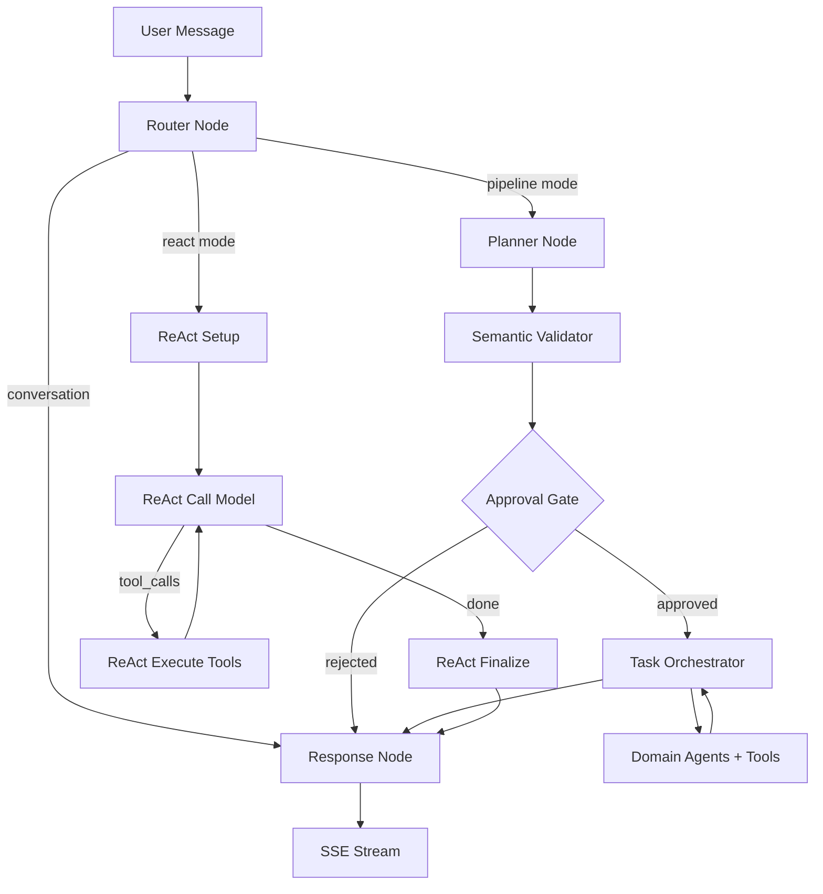

# LIA — Guide Technique Complet

> Architecture, patterns et décisions d'ingénierie d'un assistant IA multi-agent de nouvelle génération.
>
> Documentation de présentation technique destinée aux architectes, ingénieurs et experts techniques.

**Version** : 4.6
**Date** : 2026-08-23
**Application** : LIA v1.38.2
**Licence** : AGPL-3.0 (Open Source)

---

## Table des matières

1. [Contexte et choix fondateurs](#1-contexte-et-choix-fondateurs)
2. [Stack technologique](#2-stack-technologique)
3. [Architecture backend : Domain-Driven Design](#3-architecture-backend--domain-driven-design)
4. [LangGraph : orchestration multi-agent](#4-langgraph--orchestration-multi-agent)
5. [Le pipeline d'exécution conversationnel](#5-le-pipeline-dexécution-conversationnel)
6. [Le système de planification (ExecutionPlan DSL)](#6-le-système-de-planification-executionplan-dsl)
7. [Smart Services : optimisation intelligente](#7-smart-services--optimisation-intelligente)
8. [Routage sémantique et embeddings IA](#8-routage-sémantique-et-embeddings-ia)
9. [Human-in-the-Loop : architecture à 6 couches](#9-human-in-the-loop--architecture-à-6-couches)
10. [Gestion du state et message windowing](#10-gestion-du-state-et-message-windowing)
11. [Système de mémoire et profil psychologique](#11-système-de-mémoire-et-profil-psychologique)
12. [Infrastructure LLM multi-provider](#12-infrastructure-llm-multi-provider)
13. [Connecteurs : abstraction multi-fournisseur](#13-connecteurs--abstraction-multi-fournisseur)
14. [MCP : Model Context Protocol](#14-mcp--model-context-protocol)
15. [Système de voix (STT/TTS)](#15-système-de-voix-stttts)
16. [Proactivité : Heartbeat et actions planifiées](#16-proactivité--heartbeat-et-actions-planifiées)
17. [RAG Spaces et recherche hybride](#17-rag-spaces-et-recherche-hybride)
18. [Browser Control et Web Fetch](#18-browser-control-et-web-fetch)
19. [Sécurité : defence in depth](#19-sécurité--defence-in-depth)
20. [Observabilité et monitoring](#20-observabilité-et-monitoring)
21. [Performance : optimisations et métriques](#21-performance--optimisations-et-métriques)
22. [CI/CD et qualité](#22-cicd-et-qualité)
23. [Patterns d'ingénierie transversaux](#23-patterns-dingénierie-transversaux)
24. [Architecture des décisions (ADR)](#24-architecture-des-décisions-adr)
25. [Potentiel d'évolution et extensibilité](#25-potentiel-dévolution-et-extensibilité)
26. [Psyche Engine : intelligence émotionnelle dynamique](#26-psyche-engine--intelligence-émotionnelle-dynamique)
27. [Apprentissage déterministe des habitudes](#27-apprentissage-déterministe-des-habitudes)
28. [Gouverner une instance : dépense, capacités, installation](#28-gouverner-une-instance--dépense-capacités-installation)
29. [Administrer par le fichier : le classeur est le formulaire](#29-administrer-par-le-fichier--le-classeur-est-le-formulaire)

30. [Le programme évolution : travail visible, apprentissage gouverné](#30-le-programme-évolution--travail-visible-apprentissage-gouverné)
31. [Des yeux expressifs : un personnage piloté par les signaux](#31-des-yeux-expressifs--un-personnage-piloté-par-les-signaux)
32. [Les applications natives : une coque, votre serveur](#32-les-applications-natives--une-coque-votre-serveur)
33. [Auto-diagnostic : un assistant qui lit sa propre télémétrie](#33-auto-diagnostic--un-assistant-qui-lit-sa-propre-télémétrie)
34. [Calculer au lieu de deviner : un script éphémère dans le bac à sable qui existait déjà](#34-calculer-au-lieu-de-deviner-un-script-éphémère-dans-le-bac-à-sable-qui-existait-déjà)
35. [Mesurer une couleur avant de la livrer : la palette des réglages](#35-mesurer-une-couleur-avant-de-la-livrer-la-palette-des-réglages)
36. [Un trait n'est pas une réaction : le registre déclaré par la réponse](#36-un-trait-nest-pas-une-réaction--le-registre-déclaré-par-la-réponse)
---

## 1. Contexte et choix fondateurs

### 1.1. Pourquoi ces choix ?

Chaque décision technique de LIA répond à une contrainte concrète. Le projet vise un assistant IA multi-agent **auto-hébergeable sur hardware modeste** (Raspberry Pi 5, ARM64), avec une transparence totale, une souveraineté des données, et un support multi-fournisseur LLM. Ces contraintes ont guidé l'intégralité de la stack.

| Contrainte | Conséquence architecturale |
|------------|--------------------------|
| Auto-hébergement ARM64 | Docker multi-arch, embeddings sémantiques (multilingues), Playwright chromium cross-platform |
| Souveraineté des données | PostgreSQL local (pas de SaaS DB), chiffrement Fernet au repos, sessions Redis locales |
| Multi-fournisseur LLM | Factory pattern avec 7 adaptateurs, configuration par nœud, pas de couplage fort à un provider |
| Transparence totale | 490 métriques Prometheus, debug panel embarqué, suivi token par token |
| Fiabilité en production | 252 ADRs, ~21 584 tests collectés par pytest sur 1 296 fichiers, observabilité native, HITL à 6 niveaux |
| Coûts maîtrisés | Smart Services (89 % d'économie tokens), embeddings sémantiques, prompt caching, filtrage de catalogue |

### 1.2. Principes architecturaux

| Principe | Implémentation |
|----------|----------------|
| **Domain-Driven Design** | Bounded contexts dans `src/domains/`, agrégats explicites, couches Router/Service/Repository/Model |
| **Hexagonal Architecture** | Ports (protocols Python) et adaptateurs (clients concrets Google/Microsoft/Apple) |
| **Event-Driven** | SSE streaming, ContextVar propagation, fire-and-forget background tasks |
| **Defence in Depth** | 5 couches pour les usage limits, 6 niveaux HITL, 3 couches anti-hallucination |
| **Feature Flags** | Chaque sous-système activable/désactivable (`{FEATURE}_ENABLED`) |
| **Configuration as Code** | Pydantic BaseSettings composé via MRO, chaîne de priorité APPLICATION > .ENV > CONSTANT |

### 1.3. Métriques du codebase

| Métrique | Valeur |
|----------|--------|
| Tests | 21 584 collectés par pytest sur 1 296 fichiers de test + 6 662 tests vitest côté frontend (seuils de couverture verrouillés, ADR-116) |
| Fixtures pytest | 755, dont 32 partagées via conftest |
| Documents de documentation | 549 |
| ADRs (Architecture Decision Records) | 252 |
| Métriques Prometheus | 486 définitions |
| Dashboards Grafana | 26 |
| Langues supportées (i18n) | 6 (fr, en, de, es, it, zh) |

---

## 2. Stack technologique

### 2.1. Backend

| Technologie | Version | Rôle | Pourquoi ce choix |
|-------------|---------|------|-------------------|
| Python | 3.12+ | Runtime | Écosystème ML/IA le plus riche, async natif, typing complet |
| FastAPI | 0.136.3 | API REST + SSE | Validation auto Pydantic, docs OpenAPI, async-first, performances |
| LangGraph | 1.2.11 | Orchestration multi-agent | Seul framework offrant state persistence + cycles + interrupts (HITL) natifs |
| LangChain Core | 1.5.5 | Abstractions LLM/tools | Décorateur `@tool`, formats de messages, callbacks standardisés |
| SQLAlchemy | 2.0.50 | ORM async | `Mapped[Type]` + `mapped_column()`, async sessions, `selectinload()` |
| PostgreSQL | 16 + pgvector | Database + vector search | Checkpoints LangGraph natifs, recherche sémantique HNSW, maturité |
| Redis | 7.4 | Cache, sessions, rate limiting | O(1) ops, sliding window atomique (Lua), SETNX leader election |
| Pydantic | 2.13.4 | Validation + sérialisation | `ConfigDict`, `field_validator`, composition de settings via MRO |
| structlog | latest | Logging structuré | JSON output avec filtrage PII automatique, snake_case events |
| Gemini Embeddings | gemini-embedding-001 | Embeddings sémantiques | Embeddings multilingues Gemini (mémoire, routage, intérêts, journaux) — ADR-069 |
| Playwright | latest | Browser automation | Chromium headless, CDP accessibility tree, cross-platform |
| APScheduler | 3.x | Background jobs | Cron/interval triggers, compatible leader election Redis |

### 2.2. Frontend

| Technologie | Version | Rôle |
|-------------|---------|------|
| Next.js | 16.2.10 | App Router, SSR, ISR |
| React | 19.2.7 | UI avec Server Components |
| TypeScript | 6.0.2 | Typage strict |
| TailwindCSS | 4.3.2 | Utility-first CSS |
| TanStack Query | 5.101 | Server state management, cache, mutations |
| Radix UI | v2 | Primitives UI accessibles |
| react-i18next | 17.0 | i18n (6 langues), namespace-based |
| Zod | 4.x | Validation runtime des schémas debug |

### 2.3. LLM Providers supportés

| Provider | Modèles | Spécificités |
|----------|---------|-------------|
| OpenAI | GPT-5.4, GPT-5.4-mini, GPT-5.2, GPT-5.1, GPT-5 (+ mini/nano), GPT-4.1, GPT-4o, o3/o4-mini | Prompt caching natif, Responses API, reasoning_effort |
| Anthropic | Claude Opus 4.6/4.5, Claude Sonnet 4.6, Claude Haiku 4.5 | Extended thinking, prompt caching |
| Google | Gemini 3.1/3 Pro, Gemini 3.1/3 Flash, Gemini 2.5 Pro/Flash | Multimodal, embeddings duaux |
| DeepSeek | deepseek-v4-flash, deepseek-v4-pro (V4), deepseek-chat (V3), deepseek-reasoner (R1) | Coût réduit, reasoning natif |
| Perplexity | Sonar, Sonar Pro | Search-augmented generation |
| Qwen | qwen3.5-plus, qwen3.5-flash, qwen3-max | Thinking mode, tools + vision (Alibaba Cloud) |
| Ollama | Tout modèle local (découverte dynamique) | Zéro coût API, auto-hébergé |

**Pourquoi 7 providers ?** Le choix n'est pas la collection pour elle-même. C'est une stratégie de résilience : chaque nœud du pipeline peut être assigné à un provider différent. Si OpenAI augmente ses tarifs, le routeur passe sur DeepSeek. Si Anthropic a une panne, la réponse bascule sur Gemini. L'abstraction LLM (`src/infrastructure/llm/factory.py`) utilise le pattern Factory avec `init_chat_model()`, surchargé par des adaptateurs spécifiques (`ResponsesLLM` pour l'API Responses d'OpenAI, éligibilité par regex `^(gpt-4\.1|gpt-5|o[1-9])`).

---

## 3. Architecture backend : Domain-Driven Design

### 3.1. Structure des domaines

```
apps/api/src/
├── core/                         # Noyau technique transversal
│   ├── config/                   # 9 modules Pydantic BaseSettings composés via MRO
│   │   ├── __init__.py           # Classe Settings (MRO finale)
│   │   ├── agents.py, database.py, llm.py, mcp.py, voice.py, usage_limits.py, ...
│   ├── constants.py              # 1 000+ constantes centralisées
│   ├── exceptions.py             # Exceptions centralisées (raise_user_not_found, etc.)
│   └── i18n.py                   # Bridge i18n → settings
│
├── domains/                      # Bounded Contexts (DDD)
│   ├── agents/                   # DOMAINE PRINCIPAL — orchestration LangGraph
│   │   ├── nodes/                # 7+ nœuds du graphe
│   │   ├── services/             # Smart Services, HITL, context resolution
│   │   ├── tools/                # Outils par domaine (@tool + ToolResponse)
│   │   ├── orchestration/        # ExecutionPlan, parallel executor, validators
│   │   ├── registry/             # AgentRegistry, domain_taxonomy, catalogue
│   │   ├── semantic/             # Semantic router, expansion service
│   │   ├── middleware/           # Memory injection, personality injection
│   │   ├── prompts/v1/           # 86 fichiers .txt de prompts versionnés
│   │   ├── graphs/               # 15 builders d'agents (un par domaine)
│   │   ├── context/              # Context store (Data Registry), decorators
│   │   └── models.py             # MessagesState (TypedDict + custom reducer)
│   ├── auth/                     # OAuth 2.1, sessions BFF, RBAC
│   ├── connectors/               # Abstraction multi-provider (Google/Apple/Microsoft)
│   ├── rag_spaces/               # Upload, chunking, embedding, retrieval hybride
│   ├── journals/                 # Carnets de bord introspectifs
│   ├── interests/                # Apprentissage des centres d'intérêt
│   ├── heartbeat/                # Notifications proactives LLM-driven
│   ├── channels/                 # Multi-canal (Telegram)
│   ├── voice/                    # TTS Factory, STT Sherpa, Wake Word
│   ├── skills/                   # Standard agentskills.io
│   ├── sub_agents/               # Agents spécialisés persistants
│   ├── peers/                    # Connexions entre utilisateurs (relais assistant-à-assistant)
│   ├── relations/                # CRM personnel (agrégation + favoris)
│   ├── usage_limits/             # Quotas par utilisateur (5-layer defence)
│   └── ...                       # conversations, reminders, scheduled_actions, users, user_mcp
│
└── infrastructure/               # Couche transversale
    ├── llm/                      # Factory, providers, adapters, embeddings, tracking
    ├── cache/                    # Redis sessions, LLM cache, JSON helpers
    ├── mcp/                      # MCP client pool, auth, SSRF, tool adapters, Excalidraw
    ├── browser/                  # Playwright session pool, CDP, anti-détection
    ├── rate_limiting/            # Redis sliding window distribué
    ├── scheduler/                # APScheduler, leader election, locks
    └── observability/            # 23 fichiers de métriques Prometheus, tracing OTel
```

### 3.2. Chaîne de priorité de configuration

Un invariant fondamental traverse tout le backend. Il a été systématiquement enforci en v1.9.4 avec ~291 corrections sur ~80 fichiers, parce que des divergences entre constantes et configuration réelle de production causaient des bugs silencieux :

```
APPLICATION (Admin UI / DB) > .ENV (settings) > CONSTANT (fallback)
```

**Pourquoi cette chaîne ?** Les constantes (`src/core/constants.py`) servent exclusivement de fallback pour les `Field(default=...)` Pydantic et les `server_default=` SQLAlchemy. Un administrateur qui change un modèle LLM depuis l'interface doit voir ce changement pris en compte immédiatement, sans redéploiement. En runtime, tout code lit `settings.field_name`, jamais directement une constante.

### 3.3. Patterns de couches

| Couche | Responsabilité | Pattern clé |
|--------|---------------|-------------|
| **Router** | Validation HTTP, auth, sérialisation | `Depends(get_current_active_session)`, `check_resource_ownership()` |
| **Service** | Logique métier, orchestration | Constructeur reçoit `AsyncSession`, crée repositories, exceptions centralisées |
| **Repository** | Accès données | Hérite `BaseRepository[T]`, pagination `tuple[list[T], int]` |
| **Model** | Schéma DB | `Mapped[Type]` + `mapped_column()`, `UUIDMixin`, `TimestampMixin` |
| **Schema** | Validation I/O | Pydantic v2, `Field()` avec description, request/response séparés |

---

## 4. LangGraph : orchestration multi-agent

### 4.1. Pourquoi LangGraph ? (ADR-001)

Le choix de LangGraph plutôt que LangChain seul, CrewAI, ou AutoGen repose sur trois besoins non négociables :

1. **State persistence** : `TypedDict` avec reducers custom, persisté via PostgreSQL checkpoints — permet de reprendre une conversation après interruption HITL
2. **Cycles et interrupts** : support natif des boucles (rejet HITL → re-planification) et du pattern `interrupt()` — sans lequel le HITL à 6 couches serait impossible
3. **Streaming SSE** : intégration native avec callback handlers — critique pour l'UX temps réel

CrewAI et AutoGen étaient plus simples à prendre en main, mais ni l'un ni l'autre ne supportait le pattern interrupt/resume nécessaire au HITL plan-level. Ce choix a un coût : la courbe d'apprentissage est plus raide (concepts de graphes, edges conditionnels, state schemas).

### 4.2. Le graphe principal

LIA expose deux modes d'exécution (basculables par utilisateur via un toggle dans l'en-tête du chat) : **Pipeline** (par défaut, déterministe et économe en tokens) et **ReAct** (autonome et itératif). Le Router classifie d'abord la requête (conversation directe ou actionable) puis dispatche vers le mode actif.



### 4.3. Nœuds du graphe

| Nœud | Fichier | Rôle | Windowing |
|------|---------|------|-----------|
| Router v3 | `router_node_v3.py` | Classification binaire conversation/actionable | 5 turns |
| QueryAnalyzer | `query_analyzer_service.py` | Détection de domaines, extraction d'intent | — |
| Planner v3 | `planner_node_v3.py` | Génération ExecutionPlan DSL | 10 turns |
| Semantic Validator | `semantic_validator.py` | Validation des dépendances et cohérence | — |
| Approval Gate | `hitl_dispatch_node.py` | HITL interrupt(), 6 niveaux d'approbation | — |
| Task Orchestrator | `task_orchestrator_node.py` | Exécution parallèle, passage de contexte | — |
| Response | `response_node.py` | Synthèse anti-hallucination, 3 couches de garde | 20 turns |

### 4.4. AgentRegistry et Domain Taxonomy

Le `AgentRegistry` centralise l'enregistrement des agents (`registry.register_agent()` dans `main.py`), le catalogue de `ToolManifest`, et la `domain_taxonomy.py` qui définit chaque domaine avec son `result_key` et ses alias.

**Pourquoi un registre centralisé ?** Sans lui, l'ajout d'un agent nécessitait de modifier 5+ fichiers. Avec le registre, un nouvel agent se déclare en un seul point et est automatiquement disponible pour le routage, la planification et l'exécution.

### 4.5. Domain Taxonomy

Chaque domaine est un `DomainConfig` déclaratif : nom, agents, `result_key` (clé canonique pour les références `$steps`), `related_domains`, priorité et routabilité. Le `DOMAIN_REGISTRY` est la source de vérité unique consommée par trois sous-systèmes : SmartCatalogue (filtrage), expansion sémantique (domaines adjacents) et phase Initiative (pré-filtre structurel).

### 4.6. Tool Manifests

Chaque tool déclare un `ToolManifest` via un `ToolManifestBuilder` fluide : paramètres, sorties, profil de coût, permissions et `semantic_keywords` multilingues pour le routage. Les manifestes sont consommés par le planner (injection de catalogue), le routeur sémantique (matching par mots-clés) et le builder d'agents (câblage des tools). Voir section 23 pour l'architecture complète des tools.

---

## 5. Le pipeline d'exécution conversationnel

### 5.1. Flux détaillé d'une requête actionnable

1. **Réception** : Message utilisateur → endpoint SSE `/api/v1/chat/stream`
2. **Contexte** : `request_tool_manifests_ctx` ContextVar construit une fois (ADR-061 : 3-layer defence)
3. **Router** : Classification binaire avec scoring de confiance (high > 0.85, medium > 0.65)
4. **QueryAnalyzer** : Identifie les domaines via LLM + validation post-expansion (gate-keeper qui filtre les domaines désactivés)
5. **SmartPlanner** : Génère un `ExecutionPlan` (DSL JSON structuré)
   - Pattern Learning : consulte le cache bayésien (bypass si confiance > 90 %)
   - Skill detection : les Skills déterministes sont protégés via `_has_potential_skill_match()`
6. **Semantic Validator** : Vérifie la cohérence des dépendances inter-étapes
7. **HITL Dispatch** : Classifie le niveau d'approbation, `interrupt()` si nécessaire
8. **Task Orchestrator** : Exécute les étapes en vagues parallèles via `asyncio.gather()`
   - Filtre les étapes skipped AVANT gather (ADR-005 — corrige un bug de double exécution plan+fallback)
   - Passage de contexte via Data Registry (InMemoryStore)
   - Pattern FOR_EACH pour itérations en masse
9. **Response Node** : Synthétise les résultats, injection mémoire + journaux + RAG
10. **SSE Stream** : Token par token vers le frontend
11. **Background tasks** (fire-and-forget) : extraction mémoire, extraction journal, détection d'intérêts

### 5.2. ContextVar : propagation implicite de l'état

Un mécanisme critique est l'utilisation des `ContextVar` Python pour propager l'état sans parameter threading :

| ContextVar | Rôle | Pourquoi |
|------------|------|----------|
| `current_tracker` | TrackingContext pour le suivi tokens LLM | Évite de passer un tracker à travers 15 couches de fonctions |
| `request_tool_manifests_ctx` | Manifestes d'outils filtrés par requête | Construit une fois, lu par 7+ consommateurs (élimine duplication ADR-061) |

Cette approche maintient une isolation par requête dans un contexte asyncio sans polluer les signatures de fonctions.

### 5.3. Mode d'exécution ReAct (ADR-070)

LIA propose un second mode d'exécution : **ReAct** (Reasoning + Acting). Au lieu de planifier à l'avance, le LLM appelle itérativement les outils, observe les résultats et décide de la prochaine étape de manière autonome.

**Architecture** : 4 nodes custom dans le graph LangGraph parent (pas un sous-graphe) :

```
Router → react_setup → react_call_model ↔ react_execute_tools → react_finalize → Response
```

**Pipeline vs ReAct — compromis d'ingénierie** :

| Aspect | Pipeline (défaut) | ReAct (⚡) |
|--------|-------------------|-----------|
| **Coût en tokens** | **4–8× inférieur** — 1 appel planner + 1 appel response | 1 appel LLM par itération (2–15 itérations typiques) |
| **Planification** | ExecutionPlan anticipé avec validation sémantique | Aucune — le LLM décide étape par étape |
| **Exécution parallèle** | Oui — vagues `asyncio.gather()` | Non — appels séquentiels |
| **Adaptabilité** | Suit le plan rigidement | S'adapte à chaque résultat |
| **Contrôle** | Total — DSL planner, HITL, validateurs | Minimal — comportement guidé par le prompt |
| **Prévisibilité des coûts** | Élevée — borné par les steps du plan | Faible — dépend du raisonnement LLM |
| **Idéal pour** | Requêtes structurées multi-domaines | Recherche exploratoire, questions ambiguës |

Le mode Pipeline est un véritable travail d'ingénierie : le SmartPlanner, le Semantic Validator, le cache bayésien de patterns et l'exécuteur parallèle offrent ensemble la même puissance fonctionnelle que le ReAct tout en consommant une fraction des tokens. Le compromis est l'adaptabilité — quand la séquence optimale d'outils ne peut pas être prédite à l'avance, le raisonnement itératif du ReAct excelle.

Les deux modes partagent le même registre d'outils, le système HITL, le response node et l'infrastructure d'observabilité. L'utilisateur bascule entre les deux via un toggle dans l'en-tête du chat.

### 5.4. Exécutions détachées : la génération survit à la connexion (ADR-117)

Le streaming SSE classique a un défaut structurel : la génération vit *dans* le générateur de la réponse HTTP. Fermer l'onglet, naviguer ou perdre le réseau tue la connexion — et, avec elle, le tour de conversation entier. LIA découple les deux : un **producteur détaché** (tâche asyncio indépendante de la requête) exécute le graphe et publie chaque chunk dans un **Redis Stream par run** ; l'endpoint SSE n'est plus qu'un **abonné** qui relaie ce stream.

- **Déconnexion ≠ annulation** — fermer la page arrête l'abonnement, jamais la génération. Le message utilisateur est archivé *avant* l'exécution, la réponse se termine côté serveur et attend dans la conversation.
- **Reprise live** — au retour (montage de la page, retour d'onglet), le frontend détecte le run actif, rejoue l'intégralité des chunks déjà émis (sans pacing) puis bascule sur le flux live ; la frontière est un commentaire transport SSE (`: replay-end`), le contrat des chunks reste intact. Pendant le replay, les effets de bord (toasts, audio) sont neutralisés pendant que le reducer reconstruit la bulle en cours.
- **Silence détecté côté client** — la reprise suppose encore que le client sache qu'il doit reprendre. Un onglet gelé par le système d'exploitation ne reçoit ni fin ni erreur : la lecture reste suspendue, l'interface se croit toujours en train de recevoir, et le garde censé protéger un flux vivant bloque précisément la reprise. Un budget de silence calibré sur le rythme des battements de cœur du serveur tranche : au-delà, la connexion morte est abandonnée, l'état revient au repos et le rattachement ci-dessus prend le relais. Les minuteurs du navigateur gelant avec l'onglet, l'échéance tombe au réveil — exactement le moment où elle sert.
- **Un seul run par conversation** — un verrou Redis (`SET NX EX` + heartbeat producteur + libération conditionnelle Lua insensible aux zombies) fait répondre HTTP 409 à un envoi concurrent, que le frontend transforme en réattachement silencieux.
- **Annulation cross-worker** — le bouton d'envoi se mue en bouton stop ; le signal d'annulation transite par Redis et est sondé côté producteur (~1 s), y compris quand le producteur vit dans un autre worker que la requête HTTP. La réponse partielle est conservée et badgée « interrompue » ; les tokens déjà consommés restent comptabilisés — la facturation est honorée sur tous les chemins de sortie, kills compris.
- **Voix seulement si quelqu'un écoute** — la présence des abonnés (compteur Redis à TTL ré-armé périodiquement) conditionne la synthèse vocale : aucun TTS pour un run que personne n'écoute, et un auditeur qui arrive en cours de route obtient la voix pour la suite.
- **Arrêt propre** — au shutdown, le lifespan draine les producteurs en cours avant de rendre la main ; un run tué archive son partiel flaggé `interrupted`, et une réparation en début de tour nettoie les `tool_calls` orphelins qu'un checkpoint interrompu laisserait (les providers stricts les rejettent au tour suivant).

L'ensemble est gouverné par un feature flag et une dizaine de réglages env (TTL, heartbeat, drain, polling) validés au boot — une période de heartbeat incompatible avec le TTL du verrou refuse de démarrer.

---

**Ancrage sur les entités récentes.** Sur un tour qui n’appelle aucun outil, le registre du tour courant est vide par construction (garde anti-contamination) et l’historique conversationnel exclut délibérément les messages d’outil : le modèle de réponse n’a alors *aucune* donnée structurée faisant autorité, et ne peut que reformuler de la prose antérieure. Les entités les plus récentes du state sont donc réinjectées dans une section de prompt dédiée — sélectionnées par récence, bornées en âge, sans aucun aller-retour de stockage, et explicitement non prioritaires sur les données du tour courant. Une règle d’autorité complète le dispositif : interdiction d’inventer un attribut d’entité, et obligation d’annoncer comme manquante une donnée demandée mais jamais reçue.

### 5.5. Artefacts générés : de la requête au fichier téléchargeable (ADR-226)

Depuis la v1.30.9, le pipeline peut se conclure par un fichier et non plus seulement par de la prose. L'outil `generate_document` suit la même architecture que la génération d'images — un agent virtuel au catalogue, aucun nœud de graphe dédié — mais son « générateur » est un slot LLM dédié (`document_generation`, administrable comme tous les autres) appelé en **sortie structurée typée par famille de format** : contenu tabulaire pour CSV/Excel, arbre de sections pour Word/PDF/Markdown/texte, liste de diapositives pour PowerPoint. Le schéma est choisi *avant* l'appel, chaque réponse est donc validée en schéma strict, puis un **moteur de rendu local pur** construit les octets exacts — openpyxl, python-docx, python-pptx, PyMuPDF : les bibliothèques déjà embarquées pour l'extraction RAG, qui écrivent désormais au lieu de lire, sans aucun service documentaire tiers.

Trois décisions de conception portent la fonctionnalité. D'abord l'honnêteté de l'artefact : les cellules de tableur sont neutralisées contre l'injection de formule (une sonde a prouvé qu'openpyxl stocke `=1+2` comme formule vivante) tandis que les nombres négatifs légitimes restent intacts, et un échec après l'appel LLM payé retourne une erreur explicite — jamais de carte fantôme. Ensuite le chaînage : le planificateur peut injecter les résultats d'une étape de recherche web dans l'étape document (`source_data`), si bien que « recherche puis formalise en CSV » tient en une requête. Enfin le cycle de vie : le fichier atterrit dans le store d'attachments existant avec la même purge TTL que les images générées, et sa carte — livrée en direct par le done chunk SSE et persistée dans les métadonnées de message par un sérialiseur unique partagé — affiche l'échéance exacte d'expiration.

## 6. Le système de planification (ExecutionPlan DSL)

### 6.1. Structure du plan

```python
ExecutionPlan(
    steps=[
        ExecutionStep(
            step_id="get_meetings",
            tool_name="get_events",
            parameters={"date": "tomorrow"},
            dependencies=[]
        ),
        ExecutionStep(
            step_id="send_reminders",
            tool_name="send_email",
            parameters={"subject": "Rappel réunion"},
            dependencies=["get_meetings"],
            for_each="$steps.get_meetings.events",
            for_each_max=10
        )
    ]
)
```

### 6.2. Pattern FOR_EACH

**Pourquoi un pattern dédié ?** Les opérations en masse (envoyer un email à 12 contacts) ne peuvent pas être planifiées comme 12 étapes statiques — le nombre d'éléments est inconnu avant l'exécution de l'étape précédente. Le FOR_EACH résout ce problème avec des garde-fous :
- Seuil HITL : toute mutation >= 1 élément déclenche une approbation obligatoire
- Limite configurable : `for_each_max` prévient les exécutions non bornées
- Référence dynamique : `$steps.{step_id}.{field}` pour les résultats d'étapes précédentes

L’identité d’un résultat corrélé inclut son parent. Les outils dérivent leur identifiant du contenu seul — la météo de `lieu + jour`, un trajet de `origine + destination` — si bien que deux itérations portant sur des parents partageant ces attributs produisaient le même identifiant, et l’accumulateur, un simple `dict.update()`, écrasait silencieusement le premier. L’identifiant est désormais dérivé par parent au moyen d’une empreinte déterministe, ce qui préserve aussi la stabilité de l’identité lors d’un rejeu ou d’une reprise après interruption.

### 6.3. Exécution parallèle en vagues

Le `parallel_executor.py` organise les étapes en vagues (DAG) :
1. Identifie les étapes sans dépendances non résolues → vague suivante
2. Filtre les étapes skipped (conditions non remplies, branches fallback) — **avant** `asyncio.gather()`, pas après (ADR-005 : corrige un bug qui causait 2x appels API et 2x coûts)
3. Exécute la vague avec isolation d'erreur par étape
4. Alimente le Data Registry avec les résultats
5. Répète jusqu'à complétion du plan

### 6.4. Validateur Sémantique

Avant l'approbation HITL, un LLM dédié (distinct du planner, pour éviter le biais d'auto-validation) inspecte le plan selon 14 types d'anomalies répartis en quatre catégories : **Critique** (capacité hallucinée, dépendance fantôme, cycle logique), **Sémantique** (incohérence de cardinalité, débordement/sous-couverture de périmètre, paramètres incorrects), **Sécurité** (ambiguïté dangereuse, hypothèse implicite) et **FOR_EACH** (cardinalité manquante, référence invalide). Court-circuit pour les plans triviaux (1 étape), timeout optimiste de 1 s.

En complément, un **registre anti-hallucination auto-enrichissant** (`hallucinated_tools.json`) détecte les outils inventés par le LLM (ex : `resolve_reference_tool`) via des patterns regex persistants. Chaque nouvelle hallucination est automatiquement ajoutée au registre pour une détection plus rapide lors des plans suivants. Les étapes hallucinées sont supprimées du plan et le planner est forcé à replanifier avec les outils réels du catalogue — éliminant une classe entière d'échecs d'exécution sans intervention humaine.

Un verdict classe, il ne condamne pas — et un **diagnostic n'est pas une question**. Quand un plan de *mutation* épuise ses replans automatiques, le validateur refuse de l'exécuter et bascule vers une clarification HITL : écrire une donnée fausse coûte plus cher que demander. Ce qui est alors demandé à l'utilisateur est une question **dans sa langue**, puisée dans une table de quinze entrées dont la complétude est vérifiée au démarrage **dans les deux sens** — une issue que le code sait lever sans question rédigée refuse de démarrer l'application, et une question qu'aucun code ne lève aussi. La description interne de l'issue reste dans la trace, où elle a sa place. Le même principe couvre les valeurs : un paramètre fourni à un tour précédent est **repris du plan antérieur** au lieu d'être réinventé, car la réparation reconnaît une adresse de documentation et n'écrase jamais une valeur réelle — un changement d'avis est toujours respecté (ADR-195).

L'honnêteté du verdict s'étend jusqu'à l'exécution. Chaque outil rend un verdict typé — succès ou refus, avec sa cause — et l'exécuteur de plans le propage **tel quel** : un refus n'est jamais présenté comme une action accomplie, une étape échouée n'est pas comptée « exécutée » (la couche qui énonce les blocages garde ainsi sa vérité), et un échec ne s'enregistre jamais comme contexte conversationnel. Quand la contrainte violée est irréparable — le contenu de l'utilisateur dépasse une borne publiée au catalogue — elle devient la **première question posée**, avec les chiffres exacts et dans la langue de l'utilisateur, plutôt qu'une question générique. Et ce que confirme une opération en masse est le compte **mesuré** après pré-exécution, jamais un plafond théorique.

### 6.5. La vérité d'une référence (ADR-194)

Une référence inter-étapes (`$steps.get_meetings.events[0].title`) est écrite par le planificateur **avant** que l'étape n'ait tourné. Le chemin doit donc être juste du premier coup, sans quoi le plan échoue après avoir engagé des appels API payants et l'attente de l'utilisateur.

Ce qui le rend juste est un **contrat** : chaque manifeste d'outil publie les chemins que sa sortie porte, et l'intégration continue prouve ce contrat avant toute fusion de code. La vérification pilote l'outil réel — son vrai builder, le vrai résolveur de références, la fusion reconstruite — et compare ce que le manifeste publie à ce que l'exécution produit : le chemin lui-même, sa **forme** (enregistrement, liste, liste d'enregistrements) et son **type** (chaîne, nombre, objet). Le planificateur lit ce type pour décider dans quoi il peut chaîner une valeur : un mauvais type casse un plan aussi sûrement qu'un mauvais chemin.

Le contrat est délibérément **asymétrique** : tout ce qui est publié doit être produit, jamais l'inverse. Un manifeste liste des *exemples*, pas une énumération exhaustive — `events[0].summary` est réel que quelqu'un ait pensé ou non à l'écrire, et exiger la réciproque reviendrait à refuser des chemins légitimes.

La couverture est annoncée plutôt que supposée : lors de la campagne d'annotation, 36 des 59 outils publiant alors des chemins la portaient. Ce que la forme d'un outil rend difficile à piloter est chiffré et daté dans un dossier de dette, plutôt que laissé implicite. À l'exécution, le filet est `ReferenceResolver`, qui lève une erreur explicite au lieu de résoudre vers le vide.

### 6.6. Re-Planner Adaptatif (Panic Mode)

En cas d'échec d'exécution, un analyseur rule-based (sans LLM) classifie le pattern d'échec (résultats vides, échec partiel, timeout, erreur de référence) et sélectionne une stratégie de recovery : retry identique, replan avec périmètre élargi, escalade utilisateur ou abandon. Cette décision est **consultative à ce jour** : elle est journalisée et comptée à chaque échec, ce qui rend les modes de défaillance mesurables, mais l'orchestrateur ne l'applique pas encore automatiquement — les résultats partiels sont restitués plutôt qu'écartés. En **Panic Mode**, le SmartCatalogue s'élargit pour inclure tous les outils lors d'un unique retry — résolvant les cas où le filtrage par domaine était trop agressif.

---

### 6.7. Capacité invoquée : quand la demande n'est pas une phrase

Un plan naît d'un texte. Mais lorsque la demande vient d'un **bouton** — une fiche nommée, des cases cochées —, le système détient cette certitude **avant** qu'aucun modèle ne soit consulté. La sérialiser en prose, puis dépenser trois étapes stochastiques (analyseur, planificateur, validateur) à la reconstituer, c'est détruire une information puis payer pour la retrouver. Mesuré : l'outil attendu obtenait **0,853**, le meilleur score du catalogue, et le plan appelait un outil générique.

La demande porte donc, à côté de la phrase affichée, la **capacité invoquée** : un couple `{capability, subject}`. `capability` est un `Literal` **fermé**, rejeté par Pydantic à la frontière HTTP — le navigateur nomme une capacité, **jamais** un outil, et le serveur choisit quel outil en lecture seule l'implémente. Cette porte ne mène pas à un outil de mutation. Le transport jusqu'au planificateur est un `ContextVar` de requête, posé au même endroit et avec la même discipline que les préférences de skills.

L'application se fait **avant la validation**, au même titre que le clamp des paramètres hors bornes : ce qui est mécaniquement réparable est réparé, jamais rapporté comme un défaut. Le plan est **enrichi, pas remplacé** — ce que le planificateur a prévu et qui apporte quelque chose demeure ; ce qu'il a prévu et que la capacité recouvre déjà s'en va, parce qu'une réponse sans rapport posée à côté d'un manque annoncé le contredit. Deux garde-fous : une étape qu'une autre lit encore — par dépendance déclarée **ou** par référence `$steps` — est conservée, et un plan sans étape (clarification en attente, exécution déléguée à un skill) n'est jamais transformé en exécution. Une garantie qui écrase une question n'est pas une garantie.

---

## 7. Smart Services : optimisation intelligente

### 7.1. Le problème résolu

Sans optimisation, le scaling à 10+ domaines faisait exploser les coûts : passer de 3 outils (contacts) à 30+ outils (10 domaines) multipliait par 10 la taille du prompt et donc le coût par requête (ADR-003). Les Smart Services ont été conçus pour ramener ce coût au niveau d'un système mono-domaine.

| Service | Rôle | Mécanisme | Gain mesuré |
|---------|------|-----------|-------------|
| `QueryAnalyzerService` | Décision de routage | Cache LRU (TTL 5 min) | ~35 % cache hit |
| `SmartPlannerService` | Génération de plans | Pattern Learning bayésien | Bypass > 90 % confiance |
| `SmartCatalogueService` | Filtrage d'outils | Filtrage par domaine | 96 % réduction tokens |
| `PlanPatternLearner` | Apprentissage | Scoring bayésien Beta(2,1) | ~2 300 tokens évités par replan |

### 7.2. PlanPatternLearner

**Fonctionnement** : Quand un plan est validé et exécuté avec succès, sa séquence d'outils est enregistrée dans Redis (hash `plan:patterns:{tool→tool}`, TTL 30 jours). Pour les futures requêtes, un score bayésien est calculé : `confiance = (α + succès) / (α + β + succès + échecs)`. Au-dessus de 90 %, le plan est réutilisé directement sans appel LLM.

**Garde-fous** : K-anonymité (minimum 3 observations pour suggestion, 10 pour bypass), matching exact de domaines, maximum 3 patterns injectés (~45 tokens overhead), timeout strict de 5 ms.

**Amorçage** : 50+ golden patterns prédéfinis au démarrage, chacun avec 20 succès simulés (= 95,7 % de confiance initiale).

### 7.3. QueryIntelligence

Le QueryAnalyzer produit bien plus qu'une détection de domaines — il génère une structure `QueryIntelligence` profonde : intent immédiat vs objectif final (`UserGoal` : FIND_INFORMATION, TAKE_ACTION, COMMUNICATE...), intents implicites (ex : « trouver un contact » signifie probablement « envoyer quelque chose »), stratégies de fallback anticipées, indices de cardinalité FOR_EACH et scores de confiance par domaine calibrés par softmax. Cela donne au planner une vision plus riche qu'une simple extraction de mots-clés.

### 7.4. Pivot Sémantique

Les requêtes en toute langue sont automatiquement traduites en anglais avant la comparaison d'embeddings, améliorant la précision cross-lingue. Cache Redis (TTL 5 min, ~5 ms en hit vs ~500 ms en miss), via un LLM rapide.

### 7.5. Clôture du catalogue

Le filtrage sémantique note les outils contre une **paraphrase anglaise de la demande, régénérée à chaque tour par un modèle** : la même question peut donc produire deux catalogues différents. Si les outils retenus exigent une donnée qu'aucun d'eux ne sait produire — l'identifiant d'un message pour pouvoir y répondre —, l'espace des plans valides est vide **avant même** que le modèle ne commence. Il ne peut alors qu'inventer un nom d'outil.

La clôture applique une règle qui ne regarde jamais la demande : *chaque type de donnée exigé par un outil du catalogue doit être produit par un autre outil du catalogue*. C'est un éditeur de liens qui résout des références manquantes, pas une recherche qui devine. Deux conditions la rendent correcte plutôt que seulement plausible : un outil ne se satisfait jamais lui-même (« répondre à un mail » produit aussi un identifiant de message — celui qu'il vient d'envoyer), et seul un outil de **lecture** fait une source (on ne déclenche pas un envoi pour découvrir un identifiant). Croissance mesurée du catalogue : **+1 outil**.

---

### 7.6. Joignabilité inter-domaines

Fermer le catalogue règle ce qu'un plan peut **enchaîner**. Une question précède celle-là : quels outils y **entrent**. Le filtrage écarte tout outil dont le domaine n'est pas parmi ceux détectés — **avant** de consulter le moindre score sémantique. Un outil réellement transverse est donc invisible à toute requête classée ailleurs, aussi bien qu'il note.

Mesuré : l'outil de synthèse 360° d'une personne vit dans le domaine `contact`, tandis que la consigne de l'analyseur envoie toute question sur un utilisateur connecté vers le domaine `peer`. Score obtenu **0,853** — le meilleur du catalogue, face à des outils génériques à 0,000 — et jamais présenté au planificateur. Quand cela fonctionnait, c'est que le modèle était sorti de la consigne : une bascule stochastique, pas un chemin nominal.

Un manifeste déclare désormais les domaines **additionnels** depuis lesquels il est joignable, et une **implémentation unique** répond à « cet outil est-il dans la portée ? » pour les deux stratégies de filtrage, qui posaient la même question chacune de son côté. Toute valeur est validée à l'enregistrement contre le registre des domaines : un domaine inconnu refuse le démarrage plutôt que de rendre l'outil silencieusement introuvable. À déclarer avec parcimonie — chaque domaine ajouté élargit l'éventail proposé pour **toutes** les requêtes de ce domaine. Ce n'est pas relier deux domaines entre eux : relier tire l'intégralité de leurs boîtes à outils l'une dans l'autre, ce qui a déjà provoqué un incident de production. Ici un seul outil se déplace, pas un domaine.
### 7.7. Le catalogue d'un domaine est une offre de capacités

Le filtrage par domaine a un corollaire que la mesure a rendu visible : **le contenu du catalogue d'un domaine dicte ce que le planificateur peut vouloir**. En production, « de quand date mon dernier appel à ma femme ? » a produit un plan en deux étapes — chercher le contact, puis **lui téléphoner pour le lui demander**. Seul l'échec d'une référence l'a arrêté.

Ce n'était pas un caprice du modèle mais la seule façon d'obéir. Le prompt annonce `Primary domain: telephony`, une règle vérifie que le plan couvre bien ce domaine, et le catalogue de `telephony` ne contenait **qu'une capacité : passer un appel**. Couvrir son domaine primaire voulait donc dire agir.

Trois capacités de lecture ont été ajoutées, **chacune dans le domaine qui en manquait** — appels, engagements ouverts, messages relayés. Le rattachement alternatif, via les domaines additionnels de la section précédente, a été mesuré puis écarté : rendre ces trois outils joignables depuis `contact` évinçait **six outils de mutation** des catalogues les plus chargés, le plafond étant fixe. Une capacité de lecture ne doit pas coûter une capacité d'écriture.

Une règle **déterministe** complète le dispositif, avant tout appel de modèle : intention non mutative détectée + plan appelant un outil de mutation → plan invalide. Elle s'exécute avec les autres règles pré-LLM, donc hors de portée de l'exemption qui dispensait de vérification tout plan bien chaîné se terminant par une mutation — c'est-à-dire exactement la forme fautive. Plus le plan était bien formé, moins il était vérifié.

Les deux plafonds du catalogue (nominal et mode panique) sont devenus des réglages, avec une garde au démarrage : **le plafond de secours n'est jamais inférieur au plafond nominal**, sans quoi le filet offrirait moins que le chemin qui vient d'échouer.

---


## 8. Routage sémantique et embeddings IA

### 8.1. Pourquoi des embeddings sémantiques ? (ADR-049)

Le routage purement LLM avait deux problèmes : coût (chaque requête = un appel LLM) et précision (le LLM se trompait sur les domaines dans ~20 % des cas multi-domaines). Les embeddings sémantiques résolvent les deux :

| Propriété | Valeur |
|-----------|--------|
| Fournisseur | Google Gemini (`gemini-embedding-001`) |
| Langues | 100+ |
| Gain précision | +48 % sur Q/A matching vs routage LLM seul |

### 8.2. Semantic Tool Router (ADR-048)

Chaque `ToolManifest` possède des `semantic_keywords` multilingues. La requête est transformée en embedding, puis comparée par similarité cosinus avec **max-pooling** (score = MAX par outil, pas moyenne — évite la dilution sémantique). Double seuil : >= 0.70 = haute confiance, 0.60-0.70 = incertitude.

### 8.3. Semantic Expansion

Le `expansion_service.py` ajoute au catalogue du planner les domaines capables de fournir une donnée manquante. Le déclencheur est **piloté par l'évidence** : la détection d'une référence personnelle est l'union de trois sources — les mappings du résolveur mémoire (références personnelles par construction), les références relationnelles extraites même quand la résolution ne trouve aucun fait, et les références typées par le LLM d'analyse. Une entité référencée (personne → `Contact`, rendez-vous → `CalendarEvent`, lieu → `Place`, e-mail → `EmailMessage`) apporte les domaines dont les `properties` de son type ontologique fournissent un type requis par les outils sélectionnés — ancrage qui empêche toute expansion aveugle, avec plafond configurable et complétude du mapping vérifiée au démarrage (ADR-120).

La couche est alimentée par des manifests **profondément annotés** (`semantic_type` sur paramètres et outputs : participants d'un événement, expéditeur d'un e-mail, destination d'un trajet — ADR-121), qui nourrissent aussi les suggestions de liaison Jinja2 inter-domaines et un **garde d'exécution** : un nom de personne ne peut jamais atteindre un paramètre typé adresse/e-mail — l'appel échoue avant toute dépense API avec une erreur récupérable, dans les deux modes d'exécution. La validation post-expansion (ADR-061, Layer 1) filtre toujours les domaines désactivés par l'administrateur.

---

## 9. Human-in-the-Loop : architecture à 6 couches

### 9.1. Pourquoi au niveau du plan ? (Phase 7 → Phase 8)

L'approche initiale (Phase 7) interrompait l'exécution **pendant** les appels d'outils — chaque outil sensible générait une interruption. L'UX était médiocre (pauses inattendues) et le coût élevé (overhead par outil).

La Phase 8 (actuelle) soumet le **plan complet** à l'utilisateur **avant** toute exécution. Une seule interruption, une vision globale, la possibilité d'éditer les paramètres. Le compromis : il faut faire confiance au planificateur pour produire un plan fidèle.

### 9.2. Les 6 types d'approbation

| Type | Déclencheur | Mécanisme |
|------|-------------|-----------|
| `PLAN_APPROVAL` | Actions destructrices | `interrupt()` avec PlanSummary |
| `CLARIFICATION` | Ambiguïté détectée | `interrupt()` avec question LLM |
| `DRAFT_CRITIQUE` | Email/event/contact draft | `interrupt()` avec brouillon sérialisé + template markdown |
| `DESTRUCTIVE_CONFIRM` | Suppression >= 3 éléments | `interrupt()` avec avertissement irréversibilité |
| `FOR_EACH_CONFIRM` | Mutations en masse | `interrupt()` avec décompte opérations |
| `MODIFIER_REVIEW` | Modifications IA suggérées | `interrupt()` avec comparaison before/after |

### 9.3. Draft Critique enrichi

Pour les brouillons, un prompt dédié génère une critique structurée avec templates markdown par domaine, emojis de champs, comparaison before/after avec strikethrough pour les mises à jour, et avertissements d'irréversibilité. Les résultats post-HITL affichent labels i18n et liens cliquables.

### 9.4. Classification des Réponses

Lorsque l'utilisateur répond à un prompt d'approbation, un classifieur full-LLM (pas de regex) catégorise la réponse en 5 décisions : **APPROVE**, **REJECT**, **EDIT** (même action, paramètres différents), **REPLAN** (action entièrement différente) ou **AMBIGUOUS**. Une logique de démotion prévient les faux positifs : un EDIT avec paramètres manquants est rétrogradé en AMBIGUOUS, déclenchant une clarification.

### 9.5. Boucles de révision replay-safe (ADR-092)

La sémantique de reprise de LangGraph ré-exécute le nœud interrompu **en entier** : les `interrupt()` passés rendent leurs valeurs mémorisées, mais tout le reste re-tourne en live. Une boucle écrite autour de `interrupt()` à l'intérieur d'un nœud rejoue donc ses effets de bord (appels LLM, API) à chaque décision utilisateur. Les deux boucles de révision — édition itérative de brouillon et confirmation d'opérations bulk (nœud dédié `for_each_confirm`) — suivent un pattern normatif : **un seul `interrupt()` par exécution de nœud**, l'état de boucle transite par le state checkpointé, et l'itération passe par un self-loop conditionnel. Garantie prouvée par harnais de replay compilés : chaque modification LLM ne s'exécute qu'une fois et le contenu confirmé est exactement le dernier contenu affiché.

### 9.6. Compaction Safety

4 conditions empêchent la compaction LLM (résumé des anciens messages) pendant les flux d'approbation actifs. Sans cette protection, un résumé pourrait supprimer le contexte critique d'une interruption en cours.

---

## 10. Gestion du state et message windowing

### 10.1. MessagesState et reducer custom

Le state LangGraph est un `TypedDict` avec un reducer `add_messages_with_truncate` qui gère le truncation basé sur les tokens, la validation des séquences de messages OpenAI, et la déduplication des messages tool.

Depuis la v1.30.12, le state est complété par un **contexte d'exécution typé** (`LiaRuntimeContext`, ADR-231) : une dataclass gelée déclarée comme `context_schema` du graphe, qui porte l'identité, les préférences et les dépendances vivantes du run (file SSE, conteneur d'outils). Contrairement au state, ce contexte n'est jamais checkpointé ni copié — l'identité des objets est préservée du nœud au sous-graphe et à l'outil — et un assert à l'entrée du graphe refuse tout run dont le contexte manque, y compris à la reprise d'une interruption HITL, où l'absence dégradait auparavant en silence.

### 10.2. Pourquoi le windowing par nœud ? (ADR-007)

**Le problème** : une conversation de 50+ messages générait 100k+ tokens de contexte, avec une latence > 10 s pour le routeur et une explosion des coûts.

**La solution** : chaque nœud opère sur une fenêtre différente, calibrée sur son besoin réel :

| Nœud | Turns | Justification |
|------|-------|---------------|
| Router | 5 | Décision rapide, contexte minimal suffit |
| Planner | 10 | Besoin de contexte pour planifier, mais pas de tout l'historique |
| Response | 20 | Contexte riche pour synthèse naturelle |

**Impact mesuré** : latence E2E -50 % (10 s → 5 s), coût -77 % sur les conversations longues, qualité préservée grâce au Data Registry qui stocke les résultats d'outils indépendamment des messages.

### 10.3. Context Compaction

Quand le nombre de tokens dépasse un seuil dynamique (ratio du context window du modèle de réponse), un résumé LLM est généré. Les identifiants critiques (UUIDs, URLs, emails) sont préservés. Ratio d'économie : ~60 % par compaction. Commande `/resume` pour déclenchement manuel.

**Résilience opérationnelle** : chaque appel LLM est encadré par un `asyncio.wait_for` par chunk (35 s par défaut) et un budget global de 120 s. Sur erreur transitoire, `tenacity.AsyncRetrying` rejoue jusqu'à 3 tentatives avec backoff exponentiel. Si le résumé n'aboutit toujours pas, un fallback explicite (`_truncation_fallback`) tronque proprement l'historique ancien avec un `SystemMessage` lisible préservant les identifiants — pas de stub silencieux. Les anciens résumés `compaction #N` sont consolidés dans le merge plutôt que d'être accumulés tour après tour.

**Signal SSE custom mode** : le nœud émet `compaction_start` / `compaction_done` via `langgraph.config.get_stream_writer()` à travers un `stream_mode="custom"` (LangGraph 1.x). Le streaming service les traduit en `ChatStreamChunk(type="execution_step")`. Côté frontend, un toast sonner morphé sur un id stable (`COMPACTION_TOAST_ID`) reste visible pendant toute la compaction, l'input est verrouillé via `status="compacting"`, et une pastille « ContextUsagePill » affiche en continu le ratio tokens/seuil. Le keepalive SSE concurrent (`iter_with_keepalive`) pulse `: heartbeat` toutes les 15 s pendant les awaits silencieux pour neutraliser les coupures Cloudflare. Cinq métriques Prometheus (`compaction_chunk_timeouts_total`, `compaction_global_timeouts_total`, `compaction_total_duration_seconds`, `compaction_writer_unavailable_total`, `compaction_executions_total{strategy}`) alimentent un dashboard Grafana dédié.

### 10.4. Checkpointing PostgreSQL

State complet checkpointé après chaque nœud. P95 save < 50 ms, P95 load < 100 ms, taille moyenne ~15 KB/conversation. Le checkpointer et le store s'appuient chacun sur un pool de connexions PostgreSQL dédié par worker (tailles réglables par environnement) : les conversations concurrentes ne se sérialisent plus sur une connexion unique, et une connexion tombée est détectée au checkout et remplacée automatiquement (ADR-111).

### 10.5. Les blocs système d'un tour ReAct sont de l'état (ADR-169/170)

`get_windowed_messages(include_system=True)` **hisse tous les `SystemMessage` en tête**, sans limite de fenêtre. Empiler les blocs système du tour dans l'historique revenait donc à renvoyer toutes les copies passées à chaque appel : `react_agent_prompt.txt` pèse **840 tokens**, soit 2 520 tokens dupliqués après trois tours — à chaque appel LLM de chaque itération. Le préfixe grossissant à chaque tour, aucun cache de préfixe fournisseur ne pouvait faire mouche, et Anthropic rejetait la séquence dès le deuxième tour : un `SystemMessage` ne peut pas apparaître au milieu d'un historique.

Les blocs vivent désormais dans une clé d'état dédiée et sont recomposés en tête à chaque appel — le préfixe redevient stable. Le schéma d'état passe en **1.4**, avec une migration additive et idempotente. Le fenêtrage écarte les `SystemMessage` hérités de l'historique **sauf le résumé de compaction** : une première version du correctif rétablissait la contiguïté en détruisant ce résumé, et c'est la revue de ce correctif-là qui a produit la bonne solution.

**Le délai de la boucle se mesure sur le calcul, pas sur l'horloge murale.** `interrupt()` lève : le nœud ne retourne jamais, aucune mise à jour d'état n'est persistée, aucun horodatage n'est rafraîchi, et la reprise ré-entre au nœud interrompu sans rejouer le routeur où vivait la remise à zéro — **2,01 s d'horloge pour 0,0102 s de calcul**, mesurées sur un graphe réel. Passé le budget, le tour repris était coupé au routage suivant et la réponse re-synthétisée par un second appel LLM, le travail multi-étapes perdu. Une garde d'absence de progrès complète l'ensemble : au quatrième appel d'outil identique le modèle est invité à changer d'approche, au cinquième le tour se conclut. L'empreinte est un HMAC calé sur la clé de l'application — elle survit à une reprise sur un autre worker — et seuls l'empreinte et un compteur atteignent le checkpoint, jamais le nom de l'outil ni ses arguments.

---

## 11. Système de mémoire et profil psychologique

### 11.1. Architecture

```
AsyncPostgresStore + Semantic Index (pgvector)
├── Namespace: (user_id, "memories")        → Profil psychologique
├── Namespace: (user_id, "documents", src)  → RAG documentaire
└── Namespace: (user_id, "context", domain) → Contexte outils (Data Registry)
```

### 11.2. Schéma de mémoire enrichi

Chaque souvenir est un document structuré avec :
- `content`, `category` (préférence, fait, personnalité, relation, sensibilité...)
- `importance` (1-10), `emotional_weight` (-10 à +10)
- `usage_nuance` : comment utiliser cette information de manière bienveillante
- Embedding `gemini-embedding-001` (1536d) via pgvector HNSW

**Pourquoi un poids émotionnel ?** Un assistant qui sait que ta mère est malade mais traite ce fait comme n'importe quelle donnée est au mieux maladroit, au pire blessant. Le poids émotionnel permet d'activer la `DANGER_DIRECTIVE` (interdiction de plaisanter, minimiser, comparer, banaliser) quand un sujet sensible est touché.

### 11.3. Extraction et injection

**Extraction** : après chaque conversation, un processus background analyse le dernier message utilisateur, adapté à la personnalité active. Coût suivi via `TrackingContext`.

**Injection** : le middleware `memory_injection.py` recherche les mémoires sémantiquement proches, construit le profil psychologique injectable, et active la `DANGER_DIRECTIVE` si nécessaire. Injection dans le prompt système du Response Node.

**Quels tours alimentent la mémoire.** Un message qui déclenche une action compte autant qu'une conversation : la reprise d'un brouillon n'injecte aucun message, si bien que la demande d'origine reste la dernière parole de l'utilisateur au moment de l'extraction. À l'inverse, les messages **fabriqués par le système** — l'échafaudage injecté lors d'un refus HITL — sont marqués dans leurs métadonnées et écartés à la fois comme cible et comme contexte : jamais reconnus à leur texte, puisqu'ils existent en six langues. Enfin, l'heuristique qui écarte les acquiescements ne s'applique qu'à ce que l'utilisateur a réellement tapé — appliquée à un nom de personne, elle faisait disparaître les souvenirs des contacts dont le patronyme ressemble à « bien » ou « cool ». Chaque décision est comptée par sous-système et par issue (`post_response_extraction_scheduled_total`), là où seuls des journaux de débogage existaient.

### 11.4. Recherche mémoire à deux vecteurs

Chaque souvenir porte **deux embeddings** : un sur son contenu, un sur les mots-clés qui le déclenchent. La requête est comparée aux deux et le meilleur des deux l'emporte (`LEAST(dist_content, dist_keyword)`, repli sur le contenu quand le vecteur de mots-clés est nul).

Un moteur **hybride BM25 + pgvector** a existé ici jusqu'en v1.14.0, quand la mémoire long terme a migré vers son propre modèle PostgreSQL. Le chemin de recherche a suivi, le chemin hybride non : au 2026-07-27 il n'avait plus **aucun appelant**, 21 % de couverture, 100 lignes sur 127 jamais atteintes — et le panneau de débogage annonçait pourtant l'option à l'utilisateur. Module, réglages, métriques et affichage ont été supprimés ensemble ([ADR-168](https://github.com/jgouviergmail/LIA-Assistant/blob/main/docs/architecture/ADR-168-Removal-Of-Dead-Hybrid-Memory-Search.md)). La recherche hybride reste bien vivante, mais là où elle est réellement utilisée : les RAG Spaces (section 17).

### 11.5. Carnets de bord stratifiés (Journals)

L'assistant tient des réflexions introspectives organisées sur quatre thèmes (auto-réflexion, observations utilisateur, idées/analyses, apprentissages) ET quatre niveaux d'abstraction (`L0` observation brute, `L1` directive `WHEN→DO BECAUSE`, `L2` pattern transversal, `L3` facette de portrait — voir [ADR-079](https://github.com/jgouviergmail/LIA/blob/main/docs/architecture/ADR-079-Stratified-Journal-Consciousness.md)). Chaque entrée porte un statut épistémique (`confidence` ∈ {low, medium, high}) et deux compteurs (`evidence_count`, `contradiction_count`).

**Double déclencheur** : extraction post-conversation (fire-and-forget, fréquente, lightweight) + consolidation périodique (4-12 h par utilisateur, complexe).

**Embeddings dual-vector Gemini** (`gemini-embedding-001`, 1536d, ADR-069) : un vecteur sur `title + content`, un sur les `search_hints`. La recherche prend `LEAST(dist_content, dist_keyword)` par ligne pour ponter le vocabulaire introspectif et le vocabulaire utilisateur.

**Auto-évaluation différée T → T+1** : `MessagesState.injected_journal_ids` (symétrique de `injected_memories`) transporte les IDs entre tours. Le `response_node` lit les IDs du tour précédent au début, les passe à l'extracteur post-conversation, puis écrit les IDs du tour courant à la fin. L'extracteur voit les directives appliquées + la réaction utilisateur dans le même prompt et signale `evidence_outcome="evidence" | "contradiction"` sur des actions update — le service incrémente atomiquement les compteurs (anti-hallucination niveau 4 : le LLM ne fait que signaler, le service possède les entiers). Coût LLM additionnel **zéro** (même appel d'extraction, prompt enrichi).

**Diffusion ambiante du portrait utilisateur** : la consolidation produit dans le **même appel LLM** (zéro appel additionnel) un `portrait_full` (~200 tokens, conversation/planner) et un `portrait_brief` (~60 tokens, flux secondaires) persistés sur la table `users`. Le builder `build_journal_user_model_block(user_id, format, flow)` (`src/domains/journals/portrait_builder.py`, symétrique de `build_psyche_prompt_block`) retourne un bloc `<UserModelContext>...</UserModelContext>` avec dégradation gracieuse. Diffusé dans **8 flux** : 2 primaires en format full (`response_node`, `planner_node_v3`) et 6 secondaires en format brief (`react_setup_node`, `interests/proactive_task`, `scheduler/reminder_notification`, `voice/service`, `heartbeat/prompts`, `agents/services/fallback_response` sync + async).

**Trois leviers de correction utilisateur** sur le portrait (jamais directement éditable) : (1) édition CRUD des entrées L3 sources, (2) `POST /journals/portrait/feedback` (texte libre → entrée L0 `source=user_correction` + consolidation synchrone qui repondère les L3), (3) `POST /journals/consolidate` (consolidation manuelle, bypass cooldown).

**Discipline de dédoublonnage** : pas de garde-fou write-time (retiré v1.14.0). À la consolidation, `STEP 1` impose un scan pairwise explicite qui fusionne les doublons sémantiques, et `STEP 5` regroupe activement les L1 convergentes en patterns L2.

**Anti-hallucination en 4 couches** : `field_validator` Pydantic sur les UUIDs, table de référence d'IDs dans le prompt, filtrage des actions par IDs connus à l'extraction et à la consolidation, et incréments atomiques des compteurs (le LLM ne signale que `evidence_outcome`).

**Observabilité dédiée** : 11 métriques Prometheus dans `src/infrastructure/observability/metrics_journals.py` — `journal_entries_total{action,theme,source}`, `journal_evidence_total{outcome}`, `journal_consolidation_promotions_total{from_level,to_level}`, `journal_level_distribution{level}`, `journal_portrait_present_total{flow,format}`, `journal_portrait_age_hours`, `journal_portrait_feedback_total{outcome}`, etc.

### 11.6. Système d'intérêts

Détection par analyse des requêtes avec évolution bayésienne des poids (decay configurable). Les intérêts sont regroupés en **sujets** par clustering LLM batch (donnée dérivée, auto-réparante), et la sélection des notifications tire par **rareté à deux niveaux** (cooldown par sujet + priorité aux sujets et intérêts les moins servis) — une passion ne monopolise jamais les notifications. Contenu multi-source (Perplexity, Brave, Wikipedia, réflexion LLM) avec **liens sources cliquables** ajoutés de manière déterministe. Feedback utilisateur (thumbs up/down/block) ajuste les poids ; fusion nocturne des quasi-doublons.

---

**La boucle d'auto-évaluation du journal et le seuil adaptatif.** Les directives injectées dans une réponse sont réévaluées au tour suivant à la lumière de la réaction de l'utilisateur : le LLM ne fait que signaler `evidence` ou `contradiction`, le système possède les compteurs, et un clamp serveur interdit la confiance « haute » à une directive opérationnelle sans preuve — L2/L3 restent libres, leur preuve étant la convergence inter-entrées. L'éligibilité de la consolidation est pilotée par delta (du travail existe : jamais consolidé, ou une entrée touchée depuis le dernier passage), jamais par un décompte absolu. Enfin, le seuil de similarité qui décide d'une injection n'est plus global : un contrôleur borné (0,55–0,70), hystérétique (un pas de 0,01 par 24 h) et débrayable l'apprend par utilisateur à partir de la distribution réelle de ses scores — l'état est consultatif (Redis, TTL glissant), une lecture en échec retombe sur le défaut statique.

## 12. Infrastructure LLM multi-provider

### 12.1. Factory Pattern

```python
llm = get_llm(provider="openai", model="gpt-5.4", temperature=0.7, streaming=True)
```

Le `get_llm()` résout la configuration effective via `get_llm_config_for_agent(settings, agent_type)` (code defaults → DB admin overrides), instancie le modèle, et applique les adaptateurs spécifiques.

### 12.2. 56 types de configuration LLM

Chaque nœud du pipeline est configurable indépendamment via l'Admin UI — sans redéploiement :

| Catégorie | Types configurables |
|-----------|-------------------|
| Pipeline | router, query_analyzer, planner, semantic_validator, context_resolver |
| Réponse | response, hitl_question_generator |
| Background | memory_extraction, interest_extraction, journal_extraction, journal_consolidation |
| Agents | contacts_agent, emails_agent, calendar_agent, browser_agent, etc. |

### 12.3. Token Tracking

Le `TrackingContext` suit chaque appel LLM avec `call_type` ("chat"/"embedding"), `sequence` (compteur monotone), `duration_ms`, tokens (input/output/cache), et coût calculé depuis les tarifs DB. Les trackers partagent un `run_id` pour l'agrégation. Le debug panel affiche toutes les invocations (pipeline + background tasks) dans une vue unifiée chronologique.

Le comptage lui-même est **contractuel, pas subi** : un fournisseur OpenAI-compatible n'émet l'objet `usage` sur une réponse diffusée que si la requête le demande. Chaque provider de chat déclare donc son mode de comptabilité dans un registre — demande explicite `stream_usage`, comptage natif du SDK, ou exclusion délibérée (modèles locaux gratuits, clés appartenant à l'utilisateur final) — dont la complétude est vérifiée au démarrage : l'application refuse de booter sur un provider non déclaré (ADR-220, doctrine ADR-085). Un appel payant qui se termine sans usage incrémente un compteur dédié, journalise en avertissement et déclenche une alerte à seuil zéro : la classe entière des trous de facturation silencieux devient un signal. Même doctrine pour les délais d'attente : le `timeout_seconds` par emplacement, administrable, est transmis au client de chaque provider comme borne transport par tentative — les barrières `asyncio.wait_for` des nœuds restent la borne d'expérience utilisateur — et aucun défaut n'a été appliqué sans confrontation aux latences réelles de production (ADR-221).

La tarification elle-même suit l'horloge du fournisseur : certains fournisseurs facturent leurs modèles texte selon l'heure UTC, avec des fenêtres pleines à un multiple du tarif creux. Chaque ligne de tarif peut donc porter des plages horaires UTC optionnelles et sans chevauchement — minuit enjambable — qui remplacent les prix unitaires pendant leur fenêtre, les colonnes de base restant le tarif par défaut. Une implémentation unique résout la fenêtre active pour les deux points de valorisation : chaque appel est valorisé à son propre instant, celui que le fournisseur facture, et un message historique recalculé conserve le tarif de son heure d'origine. Les fenêtres voyagent avec les lignes de tarif versionnées temporellement, s'administrent dans le dialogue des tarifs LLM, et les données de référence embarquent le tarif fenêtré officiel de DeepSeek (ADR-223).

### 12.4. Catalogue admin DB-source-of-truth

La table `llm_models` porte le catalogue complet : provider, capacités fonctionnelles classiques (`supports_tools`, `supports_structured_output`, `supports_strict_mode`, `supports_streaming`, `supports_vision`), et — ajouts structurants — la **matrice sampling par modèle** (`supports_temperature`, `supports_top_p`, `supports_frequency_penalty`, `supports_presence_penalty`) ainsi que l'**échelle de raisonnement acceptée** (`reasoning_enum_values`, liste JSONB) et la clé i18n de son aide (`reasoning_doc_i18n_key`). Cette déclaration par-modèle remplace la regex côté frontend qui devinait jadis quels sliders cacher : la fenêtre Configuration LLM lit directement les flags DB et n'expose que les paramètres réellement acceptés par l'API du modèle. Depuis la v1.32.0 cette échelle ne **déclare** plus ce qu'un modèle accepte, elle le **restreint** : ce qu'il accepte est dérivé de son couple (fournisseur, modèle), et les deux colonnes qui décrivaient jadis la *forme* du raisonnement sont supprimées — il n'y a plus qu'une forme.

L'écran Tarification LLM Texte écrit cette échelle **directement** : il affiche les profondeurs que la famille du modèle propose — résolues en direct par `GET /admin/llm/reasoning-family`, avec la même fonction que le traducteur et le validateur — et l'on **décoche** celles que ce modèle précis refuse. Tout coché ne stocke rien : l'échelle de la famille s'applique telle quelle. Le classeur Excel (ADR-228) porte les deux mêmes colonnes, et son import refuse une profondeur hors famille **en nommant celles qui auraient été acceptées** : une feuille de calcul ne sait pas afficher de cases, la garantie se déplace donc à l'import. Un mécanisme de gabarits — « copier la forme de tel modèle existant » — occupait cette place ; il regroupait les modèles par leur échelle *stockée* et non par famille, si bien qu'en copier un d'une autre famille retirait des profondeurs en silence. Voir `docs/technical/LLM_REASONING_IDENTITY.md`.

### 12.5. Prompt caching provider-agnostique

Tous les providers facturent moins cher (et répondent plus vite) quand le début du prompt est identique octet pour octet d'une requête à l'autre — mais chacun avec son mécanisme : les blocs `cache_control` d'Anthropic, le routage `prompt_cache_key` d'OpenAI, les caches implicites de préfixe chez DeepSeek/Qwen/Gemini. LIA sépare les responsabilités : chaque prompt système versionné place son contenu statique (rôle, règles, exemples, format de sortie) en tête, puis un marqueur canonique `--- DYNAMIC CONTEXT ---`, puis tout le contenu par-requête (date, requête, contexte, catalogue d'outils). Les templates restent neutres vis-à-vis du modèle ; la couche infrastructure traduit le marqueur dans le dialecte de chaque provider — le split `cache_control` pour Anthropic, la clé de routage de cache pour OpenAI, rien du tout pour les caches implicites qui profitent du préfixe stable tel quel. Le prompt du planner — le plus coûteux du pipeline — expose ainsi un préfixe cacheable byte-stable d'environ 77 % entre deux requêtes quelconques. Des gardes CI shrink-only verrouillent la convention : tout prompt dynamique doit porter le marqueur, aucun placeholder ne peut le précéder sans exception justifiée, et la stabilité byte du préfixe du planner est vérifiée à chaque build.

---

## 13. Connecteurs : abstraction multi-fournisseur

### 13.1. Architecture par protocoles

```
ConnectorTool (base.py) → ClientRegistry → resolve_client(type) → Protocol
     ├── GoogleGmailClient       implements EmailClientProtocol
     ├── MicrosoftOutlookClient  implements EmailClientProtocol
     ├── AppleEmailClient        implements EmailClientProtocol
     └── PhilipsHueClient        implements SmartHomeClientProtocol
```

**Pourquoi des protocoles Python ?** Le duck typing structurel permet d'ajouter un nouveau provider sans modifier le code appelant. Le `ProviderResolver` garantit qu'un seul fournisseur est actif par catégorie fonctionnelle.

### 13.2. Normalizers

Chaque provider retourne des données dans son propre format. Des normalizers dédiés (`calendar_normalizer`, `contacts_normalizer`, `email_normalizer`, `tasks_normalizer`) convertissent les réponses spécifiques à chaque provider en modèles de domaine unifiés. Ajouter un nouveau provider nécessite uniquement d'implémenter le protocole et son normalizer — le code appelant reste inchangé.

### 13.3. Patterns réutilisables

`BaseOAuthClient` (template method avec 3 hooks), `BaseGoogleClient` (pagination via pageToken), `BaseMicrosoftClient` (OData). Circuit breaker, rate limiting Redis distribué, refresh token avec double-check pattern et Redis locking contre le thundering herd.

### 13.4. Deux chemins d'authentification

Tous les connecteurs ne demandent pas un compte. Un **connecteur OAuth** détient les identifiants personnels de l'utilisateur : Gmail, Agenda, Contacts, Drive. Un **service à clé de plateforme** n'a aucune donnée par utilisateur — l'utilisateur se contente de l'activer, et la clé appartient à l'installation : Itinéraires, Lieux, Météo, Environnement. `ConnectorType.uses_global_api_key` porte cette distinction, et la base des outils choisit le chemin d'identifiants d'après le type **résolu**. Une même catégorie fonctionnelle peut donc mélanger les deux : la météo accepte un fournisseur à clé personnelle comme un service de plateforme, sans que l'appelant sache lequel répond.

Un troisième cas existe : un client qui **emprunte le jeton d'un connecteur voisin**. Les tableurs et les documents lisent et écrivent avec le jeton de Drive ; les paramètres Gmail avec celui de Gmail. Aucun connecteur supplémentaire n'apparaît dans les réglages, et c'est voulu — l'utilisateur a autorisé un espace, pas une API. La conséquence a été mesurée : le cache de clients était indexé sur l'utilisateur et le type de connecteur, si bien que deux classes partageant un jeton se servaient l'une l'autre. La clé porte désormais aussi le nom de la classe.

### 13.5. Téléphonie agentique (ADR-127)

LIA peut passer un appel sortant à la place de l'utilisateur, mener une conversation orientée objectif, puis réinjecter un résumé écrit dans le chat. Contrairement aux connecteurs lecture/écriture ci-dessus, le connecteur de téléphonie pilote un **agent vocal tiers** (ElevenLabs Agents) sur le réseau téléphonique, configuré par utilisateur (identifiants personnels) — LIA n'effectue aucune facturation de son côté.

**Protection des données par capacité, pas par prompt.** L'agent d'appel ne dispose que d'un unique outil de disponibilité en lecture seule renvoyant les créneaux libre/occupé ; il ne peut jamais lire les titres, participants, lieux ou contenus des événements. La garantie est structurelle — l'outil n'expose tout simplement pas ces données — et non une instruction de prompt dont le modèle pourrait être détourné.

**Chemin de retour.** L'appel n'est jamais enregistré et la transcription n'est jamais conservée. À la fin de l'appel, un webhook signé HMAC propre à chaque utilisateur déclenche une synthèse LLM sans outils produisant un résumé court et éphémère, réinjecté de façon asynchrone dans la conversation (le même canal d'exécution détachée que l'ADR-117) avec un brouillon de suivi optionnel en un geste. Chaque appel est soumis à une confirmation HITL avant la composition, et l'ensemble du sous-système est protégé par un feature flag.

---

## 14. MCP : Model Context Protocol

### 14.1. Architecture

Le `MCPClientManager` gère le lifecycle des connexions (exit stacks), la découverte d'outils (`session.list_tools()`), et la génération automatique de descriptions de domaine par LLM. Le `ToolAdapter` normalise les outils MCP vers le format LangChain `@tool`, avec parsing structuré des réponses JSON en items individuels.

Depuis la v1.30.6, le client est **dual-era** (SDK MCP v2, ADR-224) : il parle la révision sans état 2026-07-28 du protocole et retombe automatiquement sur l'ancien handshake `initialize` pour les serveurs antérieurs — chaque serveur déjà configuré continue de fonctionner à l'identique pendant que les serveurs de nouvelle génération deviennent accessibles. LIA s'identifie dans le handshake (`clientInfo`), et un serveur qui rejette toutes les révisions parlées par LIA produit un diagnostic actionnable au lieu d'une erreur de transport brute enfouie dans des `ExceptionGroup` imbriqués.

La même ouverture s'étend désormais du protocole de communication au **format de paquet**. LIA est un client conforme du standard ouvert Agent Plugins v1.0.0 (agent-plugins.org) : un plugin est un simple répertoire — un manifeste `plugin.json` à schéma fermé, des skills agentskills.io sous `skills/`, des serveurs MCP déclarés dans `mcp.json` — et le même paquet s'installe tel quel dans ChatGPT, Codex, Cursor, GitHub Copilot, Kiro, VS Code et LIA. La conception s'appuie entièrement sur des couches qui existaient déjà : la détection route une archive de plugin vers un pipeline de transit qui réutilise le durcissement de l'importeur de skills (extraction bornée, gardes anti-traversée, installation atomique par skill avec retour arrière), les entrées de `mcp.json` se projettent sur les serveurs MCP par utilisateur, et les quotas sont pré-vérifiés globalement avant la première écriture — une installation n'est jamais laissée à moitié faite. Deux principes gouvernent le cycle de vie. D'abord, la résilience par composant avec une honnêteté totale : un composant qui ne peut pas être installé — un serveur stdio que LIA ne lance volontairement jamais, une collision de nom, un skill invalide — est *ignoré et dit*, avec une raison traduite dans un rapport exhaustif par composant ; rien n'est jamais prétendu installé. Ensuite, la provenance comme invariant : chaque composant porte le plugin qui l'a apporté, les collisions de noms ne se résolvent qu'au sein d'une même provenance (un plugin ne peut jamais capturer un skill créé à la main, ni l'inverse), la mise à jour est un réimport qui préserve les identifiants configurés, et le retrait ne passe que par la désinstallation groupée — un plugin ne peut jamais finir amputé en silence.


### 14.2. Sécurité MCP

HTTPS obligatoire, prévention SSRF (résolution DNS + blocklist IP), chiffrement Fernet des credentials, OAuth 2.1 (DCR + PKCE S256), rate limiting Redis par serveur/outil, API guard 403 sur endpoints proxy pour serveurs désactivés (ADR-061 Layer 3).

Le flux OAuth applique les exigences d'autorisation 2026-07-28 : le paramètre `iss` (RFC 9207) est validé contre l'issuer enregistré avant l'échange du code d'autorisation, les identifiants client sont liés au serveur d'autorisation émetteur (un changement détecté les écarte et ré-enregistre au lieu d'envoyer des secrets au mauvais interlocuteur), et l'enregistrement dynamique déclare son `application_type`. Chaque règle porte une tolérance explicite pour les enregistrements existants, et refuser l'écran de consentement ramène l'utilisateur à ses réglages avec un message d'information dédié au lieu d'un 422 brut.

### 14.3. MCP Iterative Mode (ReAct)

Les serveurs MCP avec `iterative_mode: true` utilisent un agent ReAct dédié (boucle observe/think/act) au lieu du planner statique. L'agent lit d'abord la documentation du serveur, comprend le format attendu, puis appelle les outils avec les bons paramètres. Particulièrement efficace pour les serveurs à API complexe (ex : Excalidraw). Activable par serveur dans la configuration admin ou utilisateur. Alimenté par le `ReactSubAgentRunner` générique (partagé avec le browser agent).

---

## 15. Système de voix (STT/TTS)

### 15.1. STT

Wake word ("OK Guy") via Sherpa-onnx WASM dans le navigateur (zéro envoi externe). Transcription Whisper Small (99+ langues, offline) côté backend via ThreadPoolExecutor. Per-user STT language avec cache thread-safe de `OfflineRecognizer` par langue.

**Optimisations latence** : réutilisation du flux micro KWS → enregistrement (~200-800 ms économisé), pré-connexion WebSocket, `getUserMedia` + WS parallélisés via `Promise.allSettled`, cache Worklet AudioWorklet.

### 15.2. TTS

Factory **catalogue-driven** (ADR-081) : `factory.get_tts_client()` lit l'override actif `voice_tts` (provider + model + voice + tuning, stockés dans `llm_config_overrides.voice_tts.provider_config` JSONB) et instancie le client correspondant. Trois providers livrés : Edge (gratuit, défaut), OpenAI (`tts-1` / `tts-1-hd`) et ElevenLabs (`eleven_multilingual_v2`, `eleven_turbo_v2_5`, `eleven_flash_v2_5`). Si la clé d'un provider payant manque, repli automatique sur Edge (warning loggé). Streaming progressif phrase-par-phrase via `ProgressiveSentenceStreamer` (ADR-082) pour minimiser la latence — la première phrase est synthétisée pendant que le LLM en génère encore d'autres. Un délimiteur ne ferme une phrase qu'en fin d'entrée ou suivi d'une espace (ADR-154) : sur le chemin progressif le tampon grandit token par token, si bien que `"3."` est un état transitoire parfaitement normal — nombres décimaux, prix, numéros de version et URL restent d'un seul tenant, et les deux découpeurs (`_extract_sentences` et le streamer) sont épinglés par une table de cas commune assortie d'un test qui exige leur accord.

---

## 16. Proactivité : Heartbeat et actions planifiées

### 16.1. Heartbeat : architecture en 2 phases

**Phase 1 — Décision** (coût-effective, gpt-4.1-mini) :
1. `EligibilityChecker` : opt-in, fenêtre horaire, cooldown (1h global, 30 min par type), activité récente — les filtres optionnels `notification_filter`/`cross_type_filters` séparent le budget d'éligibilité de chaque flux du livre de comptes partagé
2. `ContextAggregator` : 12 sources en parallèle (`asyncio.gather`) : Calendar, Weather (détection de changements), Tasks, Emails, Interests, Activité, notifications heartbeat/intérêts récentes, autres surfaces proactives (rappels déclenchés, résultats d'automatisations, comptes rendus d'appels — la fenêtre anti-redondance étendue), Health, Anniversaires à venir et Boucles ouvertes (le registre d'engagements, ADR-139). Une **seconde passe** dérive ensuite une requête sémantique dynamique du contexte agrégé pour sélectionner Journaux et Mémoires (symétrie ADR-135) et calcule le conseil de départ tenant compte du trafic (ETA Routes, sous flag). Les intérêts arrivent sous forme d'**échantillon varié** (`pick_varied_sample` : un intérêt par sujet, sujets les moins récemment servis d'abord) — le modèle ne peut mentionner que ce qu'on lui montre, donc la rotation est mécanique

   **Être connecté et se laisser interrompre sont deux décisions** (ADR-197). Onze de ces sources portent un interrupteur propre, appliqué **avant** la récupération : une source refusée cesse d'alimenter la décision *et* cesse de coûter un appel d'API, sans qu'il faille déconnecter le service — donc sans perdre l'outil avec lequel on pose ses questions. Le stockage porte le **refus**, jamais l'autorisation : `NULL` signifie « jamais exprimé », si bien qu'un compte existant garde son comportement et qu'une source ajoutée plus tard est active tant que personne ne l'a refusée. Ce qui n'est pas une source — l'activité, les fenêtres anti-redondance — reste hors du registre par construction : les couper ferait répéter l'assistant, pas se taire. Et une dépendance est **déclarée puis publiée** : le conseil de départ lit l'agenda de la première passe, donc refuser l'agenda le rendrait muet ; le panneau l'annonce au lieu de laisser un interrupteur allumé sans effet.
3. LLM structured output : `skip` | `notify` + `interest_topic` (copié verbatim de l'échantillon, garde runtime fail-open) et labels de sources contraints par un `Literal`. Anti-redondance à deux niveaux : source, et **contenu** — les 10 dernières notifications sur 7 jours sont injectées avec leurs extraits, ce qui interdit de reproposer un thème même issu d'une autre source

**Phase 1b — Enrichissement** (si `interest_topic`) : `InterestContentGenerator` (Perplexity → Brave → Wikipedia) sous timeout dur, dédupliqué contre les embeddings des notifications récentes. Fail-open intégral : flag éteint, échec ou vide → le message part sans faits.

**Phase 2 — Génération** (si notify) : LLM réécrit avec personnalité + langue utilisateur. Quand des faits ont été récupérés, un bloc VERIFIED FACTS impose de nommer 1-2 éléments concrets sans jamais inventer, et les liens sources sont ajoutés de façon déterministe. Dispatch multi-canal. Une mention d'intérêt est inscrite au livre de comptes partagé (`InterestNotification(source='heartbeat')`) : le sujet se met alors au repos pour les deux flux proactifs.

Chaque source est bornée par un budget de temps et faillit indépendamment. Ce budget encadre une part d’event-loop partagé entre les fetchers — ce n’est pas un délai de base de données : les signaux santé le franchissaient en régime nominal parce que leur lecture rapatriait des dizaines de milliers de lignes brutes pour produire quelques dizaines de nombres, figeant le worker le temps du décodage. La lecture s’appuie désormais sur une agrégation journalière calculée en base, et tout abandon de source est compté puis chronométré plutôt que silencieux — une source qui échoue en s’effaçant ne laisse aucune trace dans la notification.

**Le garde d'activité est une sonde injectée, la sélection est équitable.** La règle « ne pas interrompre un utilisateur actif » est appliquée par un port (`ActivityProbe`) que chaque planificateur câble vers la source d'activité réelle — le dernier message humain, lignes automatisées exclues, borné à l'horizon du cooldown. Le vérificateur générique ne connaît aucun modèle de domaine : il reçoit la sonde, et un échec de lecture se propage au comptage d'échecs du runner au lieu de se dissoudre en autorisation. En amont, la sélection des comptes candidats pousse le drapeau d'activation en SQL et tire au sort l'ordre (`ORDER BY random()`) : au-delà de la taille de lot, aucun compte ne peut être systématiquement servi dernier. Le pré-filtre horaire en SQL a été évalué puis refusé — une seule timezone corrompue ferait échouer le lot entier, pour un gain de l'ordre de la microseconde.

### 16.2. Agent Initiative (ADR-062)

Node LangGraph post-exécution : après chaque tour actionnable, l'initiative analyse les résultats et vérifie proactivement les informations cross-domain (read-only). Exemples : météo pluie → vérifier calendrier pour activités outdoor, email mentionnant un rdv → vérifier disponibilité, tâche deadline → rappeler le contexte. 100% prompt-driven (pas de logique hardcodée), pré-filtre structurel (domaines adjacents), injection mémoire + centres d'intérêt, champ suggestion pour proposer des actions write. Configurable via `INITIATIVE_ENABLED`, `INITIATIVE_MAX_ITERATIONS`, `INITIATIVE_MAX_ACTIONS`.

Le même nœud émet aussi jusqu'à 3 **puces de suivi** — de courtes demandes que l'utilisateur enverra probablement ensuite, formulées dans sa langue et ancrées dans les résultats visibles. Une sanitisation côté serveur (clamp, dédoublonnage insensible à la casse, plafond dur) et un handoff pop-once par run les portent à la fois dans le chunk SSE `done` et dans les métadonnées du message archivé : les puces s'affichent en direct et survivent à un rechargement ; en taper une ne fait que préremplir la saisie.

### 16.3. Actions planifiées

APScheduler avec leader election Redis (SETNX, TTL 120s, recheck 5s). `FOR UPDATE SKIP LOCKED` pour isolation. Auto-approve des plans (`plan_approved=True` injecté dans le state). Auto-disable après 5 échecs consécutifs. Retry sur erreurs transitoires.

---

## 17. RAG Spaces et recherche hybride

### 17.1. Pipeline

Upload → Chunking → Embedding (gemini-embedding-001, 1536d) → pgvector HNSW → Recherche hybride (cosine + BM25 avec alpha fusion) → Injection contexte dans le **Response Node**.

Note : l'injection RAG se fait dans le nœud de réponse, pas dans le planificateur. Le planner reçoit en revanche l'injection des journaux personnels via `build_journal_context()`.

### 17.2. System RAG Spaces (ADR-058)

FAQ intégrée (250 Q/A, 24 sections) indexée depuis `docs/knowledge/`. Détection `is_app_help_query` par QueryAnalyzer, Rule 0 override dans RoutingDecider, App Identity Prompt (~200 tokens, lazy loading). La péremption se juge sur un SHA-256 des fichiers source **et** sur le corpus stocké lui-même (un chunk par entrée parsée, exactement un document) : une empreinte concordante sur un nombre de lignes erroné est une réparation, pas un no-op. L'auto-indexation tourne dans chaque worker uvicorn, donc la ligne de l'espace est revendiquée par `FOR UPDATE SKIP LOCKED` — un seul écrivain, les autres passent sans attendre — et chaque vecteur est calculé **avant** la première instruction destructrice : un refus du fournisseur ne supprime rien et le corpus précédent continue de servir (ADR-162).

---

## 18. Browser Control et Web Fetch

### 18.1. Web Fetch

URL → validation SSRF (DNS + IP blocklist + post-redirect recheck) → readability extraction (fallback full page) → HTML cleaning → Markdown → wrapping `<external_content>` (prévention prompt injection). Cache Redis 10 min.

### 18.2. Browser Control (ADR-059)

Agent ReAct autonome (Playwright Chromium headless). Session pool Redis-backed avec recovery cross-worker. CDP accessibility tree pour interaction par éléments. Anti-détection (Chrome UA, webdriver flag remove, locale/timezone dynamiques). Cookie banner auto-dismiss (20+ sélecteurs multilingues). Rate limiting séparé read/write (40 chacun par session).

---

## 19. Sécurité : defence in depth

### 19.1. Authentification BFF (ADR-002)

**Pourquoi BFF plutôt que JWT ?** JWT dans localStorage = vulnérable XSS, taille 90 % overhead, révocation impossible. Le pattern BFF avec HTTP-only cookies + sessions Redis élimine ces trois problèmes. Migration v0.3.0 : mémoire -90 % (1.2 MB → 120 KB), session lookup P95 < 5 ms, score OWASP B+ → A.

**Authentification forte (ADR-143/144).** Au-delà du mot de passe et d'OAuth Google, le compte peut être protégé par des **passkeys WebAuthn** (credentials discoverable, conditional UI sur le champ e-mail, défis Redis à usage unique, détection de clonage par compteur de signature, zéro énumération sur le chemin anonyme) et un **second facteur TOTP** (login en deux temps via un token éphémère, anti-rejeu par timestep explicite, 10 codes de secours hachés à usage unique). Les actions sensibles — gestion des credentials, export, révocation d'appareils, désactivation du mot de passe — passent par une **re-authentification step-up** : fenêtre de 5 minutes ouverte par toute connexion complète (sémantique sudo), contrat **403 typé** (`step_up_required`, jamais un 401 qui redirigerait vers /login). « **Mes appareils** » liste chaque session BFF sous un `display_id` opaque avec des métadonnées volontairement bornées (familles UA/OS, IP tronquée en /24), révoque un appareil ou tous les autres, et coupe le flux SSE d'une session révoquée en un tick de keepalive ; une notification push signale toute connexion depuis un appareil non attesté par un token FCM valide.

### 19.2. Usage Limits : 5-layer defence in depth

| Couche | Point d'interception | Pourquoi cette couche |
|--------|---------------------|-----------------------|
| Layer 0 | Chat router (HTTP 429) | Bloquer avant même le stream SSE |
| Layer 1 | Agent service (SSE error) | Couvrir les scheduled actions qui bypasent le router |
| Layer 2 | `invoke_with_instrumentation()` | Guard centralisé couvrant tous les services background |
| Layer 3 | Proactive runner | Skip pour utilisateurs bloqués |
| Layer 4 | Migration `.ainvoke()` directe | Couverture des appels non centralisés |

Design **fail-open** : les échecs d'infrastructure ne bloquent pas les utilisateurs.

### 19.3. Prévention des attaques

| Vecteur | Protection |
|---------|------------|
| XSS (rendu LLM) | Frontière `rehype-sanitize` sur le pipeline markdown du chat (`rehypeRaw → rehypeSanitize → rehypeMathInText → rehypeKatex`, schéma audité — `script`/`iframe`/`form`/handlers supprimés), HTTP-only cookies, CSP backend ; les MCP/Skill Apps ne passent jamais par le markdown (sentinelle → widget iframe sandboxé) |
| CSRF | SameSite=Lax |
| SQL Injection | SQLAlchemy ORM (requêtes paramétrées) |
| SSRF | DNS resolution + IP blocklist (Web Fetch, MCP, Browser) ; l'installation de skills par URL réutilise le même validateur avec des termes plus stricts : https uniquement, redirections refusées, plafond streamé, deadline totale de transfert, rate limit par utilisateur Le navigateur va plus loin : **chaque requête émise par une page** — redirection, sous-ressource, iframe, XHR — résout sa propre destination derrière un cache de verdicts borné, et un échec interrompt au lieu de laisser passer. |
| Prompt Injection | Provenance portée par la donnée : 24 types classés (défaut fermé, assert au démarrage), marquage sur les trois surfaces atteignant le LLM, 7 familles de motifs détectées en 6 langues sans jamais réécrire le contenu (ADR-167) ; marqueurs `<external_content>` conservés côté outils |
| Rate Limiting / spoofing IP | Redis sliding window distribué (Lua atomique) ; chaîne proxy de confiance — ports API bindés loopback (cloudflared = seule entrée), uvicorn `--proxy-headers`, `request.client.host` validé comme unique source d'IP (fini le bucket global partagé, XFF brut jamais lu) Un plafond global précède chaque route sous forme de véritable middleware ASGI adossé à ce même limiteur partagé, de sorte qu'un client seul ne peut consommer toute l'API ; les sondes en sont exemptées pour ne jamais brider la supervision. |
| Supply Chain | SHA-pinned GitHub Actions, Dependabot weekly |

### 19.4. Durabilité des données : sauvegardes automatisées (ADR-109)

**Une sauvegarde n'existe vraiment qu'une fois la restauration prouvée.** Un sidecar `postgres-backup` snapshotte la base complète selon une planification cron avec rotation à trois niveaux (quotidien / hebdomadaire / mensuel) ; chaque paramètre — planification, rétention, répertoire cible, options pg_dump — est piloté par `.env`. Les dumps portent `--clean --if-exists` : la restauration tient en une commande, vers la base vivante ou un conteneur jetable. Le drill lui-même est versionné : `task backup:verify` restaure le dernier dump dans un conteneur pgvector éphémère et compare la révision de schéma Alembic et des comptages de référence avec la source vivante. RPO : ≤ 24 h (paramétrable). Les limites assumées (copie off-site, volume des pièces jointes) sont tracées dans l'ADR-109 plutôt que laissées implicites.

### 19.5. Isoler ce qui s'exécute

Trois surfaces exécutent quelque chose pour le compte de l'utilisateur, et chacune est traitée comme hostile par construction.

**Les scripts de skills s'exécutent dans un conteneur jetable.** Pas de socket Docker, pas de réseau, un système de fichiers racine en lecture seule avec un petit tmpfs inscriptible, un uid non privilégié, toutes les capacités larguées, et des plafonds mémoire / processus / CPU / taille de fichier. Ce qui compte, c'est ce qu'un processus fils *hérite* : en production l'API appartient au groupe `docker`, et un groupe s'hérite — se contenter de changer d'uid laisserait la socket accessible. Le SOURCE du script est passé en argument plutôt que monté, parce que l'API est elle-même un conteneur et qu'un bind se résoudrait contre l'hôte ; ce choix laisse aussi stdin libre pour la charge JSON sur laquelle repose le contrat. Sans démon joignable, l'exécution est refusée plutôt que dégradée — un bac à sable qui se désactive tout seul ne protège de rien.

**Les tâches d'infrastructure se confirment, elles ne se présument pas.** Une tâche sur un serveur distant est préparée, pas lancée : la confirmation montre le serveur visé, le texte intégral de la tâche et les consignes que le modèle a lui-même écrites dans l'invite distante — le champ qu'une injection utiliserait est précisément celui qu'il ne faut pas masquer. Le privilège est re-vérifié à l'exécution, car des droits accordés au moment où une demande est formulée peuvent ne plus valoir au moment où elle est approuvée.

**Le corps d'une requête est borné avant d'être lu.** Le plafond s'applique en amont du handler, sur la longueur déclarée quand elle existe et sur les octets comptés sinon, de sorte que le pic mémoire est fixé par nous et non par l'appelant — sur les webhooks, cela se produit avant l'authentification. Sa cohérence avec les plafonds d'upload par endpoint est assertée au démarrage : une contradiction refuse de booter au lieu d'apparaître comme un refus distant qu'aucun journal n'explique.

### 19.6. La provenance du contenu est portée par la donnée (ADR-167)

**Un texte que LIA lit n'est pas un texte que LIA exécute.** Le corps d'un e-mail, la description d'une invitation écrite par son organisateur, une page web, le résumé éditorial d'un lieu, le résultat d'un serveur MCP : tous arrivent dans le prompt, et n'importe qui peut y déposer une consigne.

Le marquage outil par outil a été invalidé par la recherche exhaustive de ses appelants. **Il oublie** : `perplexity_tools`, `brave_tools`, `mcp_react_tools` et `emails_tools` n'étaient pas couverts — ce dernier annonçant pourtant dans sa docstring qu'il renvoie *« FULL email content (body, headers, attachments) »*. **Et il ne couvre pas la bonne surface** : le contenu atteint le modèle par deux chemins dont aucun n'est un outil, dont `generate_data_for_filtering`, qui construit le bloc `{data_for_filtering}` du prompt de réponse sur **tous** les tours produisant des données, dans les **deux** modes d'exécution.

La provenance est donc une propriété de la **donnée** : les 24 types du registre sont classés une fois, un type inconnu ou nul vaut *externe* (défaut fermé), et un assert de complétude au démarrage refuse de booter sur un type non classé — même doctrine qu'ADR-085. Quinze types sur vingt-quatre sont rédigés par des tiers.

**Détecter, jamais assainir.** Sept familles de motifs sont reconnues dans les six langues — rôle usurpé, détournement d'instruction, changement de persona, exfiltration, outil LIA nommé dans du texte tiers, Unicode invisible, directive cachée en commentaire HTML — et le contenu part au modèle **inchangé**, accompagné d'une note qui nomme la famille. Assainir reviendrait à réécrire un e-mail que l'utilisateur peut vouloir lire tel quel, pour une garantie que le contournement suivant démentirait. La détection est bornée aux 20 000 premiers caractères et **ne journalise jamais le texte** : il est par construction contrôlé par l'attaquant et contient couramment les données de l'utilisateur.

---

## 20. Observabilité et monitoring

### 20.1. Stack

| Technologie | Rôle |
|-------------|------|
| Prometheus | 490 métriques custom (RED pattern) |
| Grafana | 26 dashboards production-ready |
| Loki | Logs structurés JSON agrégés |
| Tempo | Traces distribuées cross-service (OTLP gRPC) |
| Langfuse | LLM-specific tracing (prompt versions, token usage) |
| Alertmanager | Noyau de 14 alertes vitales notifiées par e-mail (runbooks liés, seuils par environnement) + webhook vers LIA : chaque alerte devient un incident dans le produit (ADR-247) |
| structlog | Logging structuré avec PII filtering |

**Une métrique qui n'atteint aucun tableau de bord est une métrique sur laquelle personne n'agit.** L'écart entre ce que le code émet et ce qu'un opérateur peut voir est mesuré, jamais supposé : `scripts/audit/measure_metric_coverage.py` analyse chaque définition de métrique (par AST et non par expression régulière — une regex lit `ZoneInfo("UTC")` comme une métrique `Info`) et confronte chaque nom à tous les panels, règles d'enregistrement et expressions d'alerte. 490 définies, 433 câblées ; les 57 qui n'atteignent rien sont listées explicitement dans une base **shrink-only**, si bien qu'une métrique nouvellement aveugle fait rougir le build et qu'une métrique devenue visible doit quitter la liste — sinon la prochaine aveugle prend sa place en silence. Le prix de ne pas l'avoir eu : une source de heartbeat tombant en panne ouverte a supprimé les signaux de santé sur 46,5 % des ticks pendant une semaine, sans aucune métrique pour s'en apercevoir (ADR-148). Deux pièges que la garde ferme par construction — un compteur à labels qui n'a jamais été incrémenté n'expose **aucune série**, donc un panel qui guette une panne rare a besoin de `or vector(0)`, faute de quoi il affiche « No data » là où l'opérateur attend un zéro vert ; et la couverture est lue dans les **expressions** de panels et de règles uniquement, car une métrique citée dans un commentaire n'est pas câblée.

### 20.2. Debug Panel embarqué

Le debug panel dans l'interface chat fournit une introspection temps réel par conversation : intent analysis, execution pipeline, LLM pipeline (réconciliation chronologique de tous les appels LLM + embedding), context/mémoire, intelligence (cache hits, pattern learning), journaux (injection + extraction background), lifecycle timing.

Les métriques debug persistent dans `sessionStorage` (50 entrées max).

**Pourquoi un debug panel dans l'UI ?** Dans un écosystème où les agents IA sont notoirement difficiles à debugger (comportement non déterministe, chaînes d'appels opaques), rendre les métriques accessibles directement dans l'interface élimine la friction de devoir ouvrir Grafana ou lire des logs. L'opérateur voit immédiatement pourquoi une requête a coûté cher ou pourquoi le routeur a choisi tel domaine.

### 20.3. DevOps Claude CLI (admin uniquement)

Les administrateurs peuvent interagir avec Claude Code CLI directement depuis la conversation LIA pour diagnostiquer les problèmes serveur en langage naturel : *"Regarde les logs pour voir si tout fonctionne"*, *"Vérifie l'espace disque"*, *"Quel container utilise le plus de RAM ?"*. Claude CLI est installé dans le container Docker API et exécuté localement via subprocess, avec accès au Docker socket pour inspecter tous les containers. Les permissions sont configurables par environnement (`--allowedTools`/`--disallowedTools`) et l'accès est restreint aux superusers via un check DB direct. Les sessions sont persistantes pour permettre des investigations multi-tours.

### 20.4. Un label est un multiplicateur de flux, pas un champ de recherche

Un pipeline d'agrégation invite naturellement à promouvoir en label indexé tout
ce qui servira à filtrer : le nom de l'événement, le module émetteur,
l'identifiant de trace. L'intuition est fausse, et elle coûte cher. Dans Loki, un
**flux** est une combinaison unique de valeurs de labels : l'ensemble des flux
conservés en mémoire est le **produit cartésien** de ces valeurs. Promouvoir un
champ dont l'ensemble de valeurs est ouvert — un nom d'événement libre, pire
encore un identifiant unique par requête — ne rend rien plus cherchable ; cela
programme une saturation mémoire.

La règle retenue est donc positionnelle et non fonctionnelle : **seul un champ
dont l'ensemble de valeurs est petit et fermé devient un label** (le niveau de
gravité, quatre valeurs). Tout le reste se filtre au moment de la lecture, où le
coût est payé par requête au lieu d'être permanent et partagé :

```
{container="lia-api-prod"} |= "chat_run_started" | json | event="chat_run_started"
```

Le filtre de ligne précède volontairement l'analyse JSON : il permet au moteur
d'écarter des blocs entiers sans les décoder.

Deux garde-fous accompagnent la règle, parce qu'elle se transgresse sans bruit.
Le premier interdit qu'un champ à cardinalité ouverte redevienne un label. Le
second **dérive** de la configuration du pipeline la liste des champs interdits
et vérifie qu'aucun tableau de bord ne sélectionne un flux sur l'un d'eux — un
sélecteur portant un non-label n'échoue pas, il ne correspond simplement à
aucun flux, et le panneau reste vide en ayant l'air parfaitement sain.

Le même principe gouverne le transport : un pipeline ne réécrit pas la charge
utile qu'il achemine. Une étape qui remplaçait la ligne par le contenu d'un seul
champ a été supprimée — elle privait l'analyse du JSON structuré que
l'application avait pourtant émis.

---

## 21. Performance : optimisations et métriques

### 21.1. Métriques clés (P95)

| Métrique | Valeur | SLO |
|----------|--------|-----|
| API Latency | 450 ms | < 500 ms |
| Premier événement SSE (accusé de réception) | 380 ms | < 500 ms |
| Router Latency | 800 ms | < 2 s |
| Planner Latency | 2.5 s | < 5 s |
| Embedding sémantique | ~100 ms | < 200 ms |
| Checkpoint save | < 50 ms | P95 |
| Redis session lookup | < 5 ms | P95 |

> Ces latences mesurent l'infrastructure. Le temps de réponse complet perçu dépend de la cascade d'appels LLM (de quelques secondes à plusieurs dizaines selon la complexité de la demande et le matériel) — c'est le principal chantier d'optimisation en cours, mesuré en production et suivi dans la roadmap.

### 21.2. Optimisations implémentées

| Optimisation | Gain mesuré | Compromis |
|-------------|-------------|-----------|
| Message Windowing | -50 % latence, -77 % coût | Perte de contexte ancien (compensé par Data Registry) |
| Smart Catalogue | 96 % réduction tokens | Panic mode nécessaire si filtrage trop agressif |
| Pattern Learning | 89 % économies LLM | Amorcage requis (golden patterns) |
| Prompt Caching | 90 % discount | Dépend du support provider |
| Embeddings sémantiques | Routage multilingue haute précision | Dépend de la disponibilité du fournisseur API |
| Parallel Execution | Latence = max(étapes) | Complexité de gestion des dépendances |
| Context Compaction | ~60 % par compaction | Perte d'information (atténuée par préservation IDs) |

---

## 22. CI/CD et qualité

### 22.1. Pipeline

```
Pre-commit (local)                GitHub Actions CI
========================          =========================
.bak files check                  Lint Backend (Ruff + Black + MyPy strict)
Secrets grep                      Lint Frontend (ESLint + TypeScript)
Ruff + Black + MyPy               Unit tests + coverage (62 %)
                                  Integration tests (PostgreSQL + Redis)
Unit tests rapides                Code Hygiene (i18n, Alembic, lockfiles)
Détection patterns critiques      Docker build smoke test
Sync clés i18n                    Secret scan (Gitleaks)
Conflits migration Alembic        ─────────────────────────
Complétude .env.example           Security workflow (hebdomadaire)
ESLint + TypeScript check           CodeQL (Python + JS)
                                    pip-audit + pnpm audit
                                    Trivy filesystem scan
                                    SBOM generation
```

### 22.2. Standards

| Aspect | Outil | Configuration |
|--------|-------|---------------|
| Formatage Python | Black | line-length=100 |
| Linting Python | Ruff | E, W, F, I, B, C4, UP |
| Type checking | MyPy | strict mode |
| Commits | Conventional Commits | `feat(scope):`, `fix(scope):` |
| Tests | pytest | `asyncio_mode = "auto"` |
| Coverage | 62 % minimum (ratchet, jamais abaissé) | Imposé en CI |

### 22.3. Builds de dépendances reproductibles

Les dépendances backend sont verrouillées de bout en bout. Les fichiers
requirements sont des manifestes d'intention ; ce que chaque environnement
installe réellement — image de production, conteneur de dev, CI, venv local —
ce sont des lockfiles universels committés, compilés par `uv pip compile
--universal` : un seul fichier couvrant linux/amd64, linux/arm64 et Windows,
qui épingle les ~200 paquets réellement embarqués avec les hashes SHA256 de
chaque fichier publié. pip vanilla les installe avec `--require-hashes` : un
même commit produit donc toujours la même image, vérifiable octet par octet.
Un garde CI fait échouer toute édition de manifeste sans régénération du lock,
et `pip-audit` ainsi que le SBOM de release lisent le lockfile — l'arbre
transitif complet est audité et inventorié, pas seulement les paquets déclarés.

---

### 22.4. L'audit est public — et reproductible

Le niveau d'exigence décrit dans ce guide n'est pas auto-déclaré : un audit technique 360° complet — **8,3/10 sur 24 périmètres normalisés** de la grille ISO/IEC 25010, constats ouverts compris — est publié dans le dépôt ([rapport complet](https://github.com/jgouviergmail/LIA-Assistant/blob/main/docs/audit/README.md)), avec le [protocole d'audit](https://github.com/jgouviergmail/LIA-Assistant/blob/main/docs/audit/AUDIT_PROTOCOL.md) qui rend chaque cycle reproductible : commit épinglé, exigences de preuve par périmètre, notation ancrée, et un script versionné qui mesure la taille en SLOC logiques. Le rapport se termine par les commandes exactes pour reproduire les mesures toi-même.

### 22.5. Une garde ne vaut que ce qu'elle mesure

`html { overflow-x: hidden }` rogne un débordement horizontal au lieu de produire
un défilement. Toute garde bâtie sur `scrollWidth - clientWidth` est donc
**structurellement aveugle** à un contrôle poussé hors de l'écran : mesurée sur
108 échantillons, elle renvoyait zéro à chaque largeur pendant que le bouton de
déconnexion se trouvait 235 px au-delà du bord droit en allemand. La garde
compare désormais la boîte de chaque contrôle interactif à la fenêtre, largeur
par largeur **et langue par langue** — l'allemand et l'italien portent les
libellés les plus longs et cèdent les premiers.

Même logique pour la hauteur : `100vh` désigne la fenêtre *large*, celle qu'on
aurait si la barre d'adresse du navigateur était rétractée — donc pas l'état
dans lequel une page se charge sur un téléphone. Un test interdit toute
contrainte de hauteur exprimée en `vh` seul, avec une liste d'exemptions écrites
et un auto-test qui prouve que le détecteur détecte encore.

Enfin, ce que la mise en page mobile a le droit d'abandonner est écrit dans une
table plutôt que laissé au jugement : chaque surface conditionnée à la largeur
déclare si elle est bloquante, substituée ou réservée au bureau, avec sa raison.
Les tests tiennent cette table contre le code — l'emplacement doit exister,
porter la variante Tailwind du seuil annoncé, et une surface qui requête ou
minute doit être **montée conditionnellement**, pas simplement masquée :
`display:none` monte quand même le composant, qui continue de consommer réseau
et batterie pour un affichage que personne ne verra.

### 22.6. Un déploiement ne dérange pas la pile qui sert

Reconstruire le répertoire de déploiement **en place** paraît anodin : on
supprime, on recopie, on recrée les conteneurs. Ce raisonnement ignore la façon
dont un montage lié fonctionne. Docker résout un bind mount vers un **inode** au
moment où le conteneur est créé, pas vers un chemin réévalué à chaque lecture.
Supprimer le contenu du répertoire ne remplace donc pas ce que voit le conteneur
en cours d'exécution : cela détruit les inodes sous ses pieds. Pendant toute la
durée du build — une dizaine de minutes — l'application qui répond encore aux
utilisateurs voit ses répertoires montés comme **vides**.

La conception retenue déplace le problème plutôt que d'en réduire la durée. Le
bundle est déposé dans un répertoire d'attente distinct, qu'aucun conteneur ne
monte ; le build s'y déroule intégralement. La bascule finale est un
**renommage**, et c'est là que tout se joue : un rename préserve l'inode, donc
les conteneurs encore vivants continuent de lire exactement ce qu'ils ont monté,
jusqu'à leur recréation délibérée quelques secondes plus tard. Le shell qui
exécute le script de déploiement conserve lui aussi son descripteur ouvert, pour
la même raison.

Deux générations précédentes restent sur disque, ce qui fait du retour arrière
une opération de quelques secondes plutôt qu'une reconstruction. Le corollaire
est écrit dans le script : **les sauvegardes de base de données vivent hors de
l'arborescence déployée**. Un dump qu'un déploiement peut atteindre n'est pas un
dump, et la seule garantie fiable est positionnelle — pas une promesse de ne pas
y toucher.

## 23. Patterns d'ingénierie transversaux

### 23.1. Système de Tools : architecture en 5 couches

Le système de tools est construit en cinq couches composables, réduisant le boilerplate par tool de ~150 lignes à ~8 lignes (réduction de 94 %) :

| Couche | Composant | Rôle |
|--------|-----------|------|
| 1 | `ConnectorTool[ClientType]` | Base générique : OAuth auto-refresh, cache client, injection de dépendances |
| 2 | `@connector_tool` | Méta-décorateur composant `@tool` + métriques + rate limiting + sauvegarde contexte |
| 3 | Formatters | `ContactFormatter`, `EmailFormatter`... — normalisation des résultats par domaine |
| 4 | `ToolManifest` + Builder | Déclaration déclarative : params, sorties, coût, permissions, mots-clés sémantiques |
| 5 | Catalogue Loader | Introspection dynamique, génération de manifestes, regroupement par domaine |

Les limites de débit sont catégorisées : Read (20/min), Write (5/min), Expensive (2/5 min). Les tools peuvent produire soit une chaîne (legacy) soit un `UnifiedToolOutput` structuré (mode Data Registry).

### 23.2. Data Registry

Le Data Registry (`InMemoryStore`) découple les résultats des tools de l'historique de messages. Les résultats sont stockés par requête via `@auto_save_context` et survivent au windowing des messages — c'est ce qui rend le windowing agressif par nœud (5/10/20 tours) viable sans perdre le contexte des sorties de tools. Les références inter-étapes (`$steps.X.field`) résolvent contre le registry, pas contre les messages.

### 23.3. Architecture d'Erreurs

Tous les tools retournent `ToolResponse` (succès) ou `ToolErrorModel` (échec) avec un enum `ToolErrorCode` (18+ types : INVALID_INPUT, RATE_LIMIT_EXCEEDED, TEMPLATE_EVALUATION_FAILED...) et un flag `recoverability`. Côté API, des raisers d'exceptions centralisés (`raise_user_not_found`, `raise_permission_denied`...) remplacent partout les HTTPException brutes — zéro `raise HTTPException` dans le code, tenu par une garde CI et un filet de tests de contrat qui prouve les réponses byte-identiques — garantissant des contrats d'erreur cohérents, journalisés et mesurés (Prometheus) sur chaque chemin d'erreur.

### 23.4. Système de Prompts

86 fichiers `.txt` versionnés dans `src/domains/agents/prompts/v1/`, chargés via `load_prompt()` avec cache LRU (32 entrées). Versions configurables par variables d'environnement.

### 23.5. Activation Centralisée des Composants (ADR-061)

Système en 3 couches résolvant un problème de duplication : avant l'ADR-061, le filtrage des composants activés/désactivés était dispersé dans 7+ endroits. Maintenant :

| Couche | Mécanisme |
|--------|-----------|
| Couche 1 | Gate-keeper de domaine : valide les domaines LLM contre `available_domains` |
| Couche 2 | `request_tool_manifests_ctx` : ContextVar construit une fois par requête |
| Couche 3 | Guard API 403 sur les endpoints proxy MCP |

### 23.6. Feature Flags

Chaque sous-système optionnel est contrôlé par un flag `{FEATURE}_ENABLED`, vérifié au démarrage (enregistrement scheduler), au câblage des routes et à l'entrée des nœuds (court-circuit instantané). Cela permet de déployer le codebase complet tout en activant les sous-systèmes progressivement.

### 23.7. Skills enrichis : frames HTML et images

Les Skills (standard agentskills.io) peuvent retourner, en plus du texte, des **frames HTML interactives** et des **images** via un contrat JSON typé `SkillScriptOutput`. Le script Python écrit sur stdout :

```json
{ "text": "required", "frame": { "html" | "url", "title", "aspect_ratio" }, "image": { "url", "alt" } }
```

Les trois canaux sont indépendants et combinables (text seul, text+frame, text+image, tous les trois). La pipeline complète réutilise l'infrastructure Data Registry existante :

```
run_skill_script → parse_skill_stdout() → SkillScriptOutput
                 → build_skill_app_output() → RegistryItem(type=SKILL_APP)
                 → ReactToolWrapper._accumulated_registry
                 → response_node → SkillAppSentinel.render() → <div class="lia-skill-app">
                 → SSE registry_update + sentinel HTML
                 → MarkdownContent.tsx → SkillAppWidget (iframe sandbox + image card)
```

**Sécurité multi-couches** : iframe sandbox `allow-scripts allow-popups` (jamais `allow-same-origin`), CSP stricte auto-injectée pour `frame.html` des skills utilisateur (`connect-src 'none'`, `frame-src 'none'`), limite `SKILLS_FRAME_MAX_HTML_BYTES = 200 KB`, bridge `postMessage` minimaliste sans `tools/call` ni `resources/read`.

**Vignettes de galerie.** La fiche d'une compétence sert `assets/preview.png` et retombe sur une icône quand le fichier manque — un repli indiscernable d'une vignette simplement vide. Les aperçus des compétences système sont donc **générés** : un script versionné tient un dessin par compétence, en géométrie pure sans dépendance de police, ce qui rend la sortie identique d'une machine à l'autre. Une garde échoue si une compétence n'a pas de dessin, ou si l'image livrée ne correspond plus à ce que son générateur produit.

**Conventions runtime** : `_lang` et `_tz` auto-injectés dans `parameters` (les locales POSIX n'étant pas installées dans le container, les scripts utilisent des tables de traduction inline plutôt que `strftime`+`setlocale`). Thème et langue synchronisés en live via `postMessage` + `MutationObserver` sur `<html class>` et `<html lang>`. Auto-resize iframe via `getBoundingClientRect().bottom` (pattern iframe-resizer). Interactivité client-side via `addEventListener` uniquement (pas de `onclick` inline sous CSP) et `crypto.getRandomValues` pour le pseudo-aléatoire.

**Primacy effect** : `skills_context` est injecté comme 2ᵉ message système dédié avec préfixe `"SKILL INSTRUCTIONS CONTRACT (PRIORITY: HIGHEST)"`, ce qui garantit que les `references/*.md` d'un skill actif l'emportent sur les `<ResponseGuidelines>` génériques.

**Rendu conditionnel** : `INTERACTIVE_WIDGET_TYPES = {SKILL_APP, MCP_APP, DRAFT}` — ces widgets sont injectés en HTML indépendamment du `user_display_mode` (Rich HTML / Markdown / Cards), alors que les autres RegistryItems restent conditionnels au mode Cards.

Une bibliothèque de skills système démontre le contrat : `interactive-map`, `weather-dashboard`, `calendar-month`, `qr-code`, `pomodoro-timer`, `unit-converter`, `dice-roller` — chacun illustrant une combinaison différente des trois canaux.

**Cycle de vie des skills** : toute skill entre par un pipeline d'import unique et durci (`SkillImportService`) — validation stricte du nom agentskills.io avant toute écriture disque (garde anti path-traversal), plafonds d'expansion des zips, staging + swap avec restauration automatique de la version précédente en cas d'échec, et rejet des conflits de noms inter-scopes (DB + cache en double autorité). Le générateur de skills intégré emprunte le même pipeline via l'outil `import_user_skill` : une skill créée dans le chat est validée, installée et annoncée par son nom dans le même tour — sans upload manuel. Les skills dont le workflow s'étend sur plusieurs tours déclarent `dialogue: true` dans leur frontmatter, que le chat override du QueryAnalyzer respecte (leur détection survit aux réponses conversationnelles de suivi) tandis que le runner ReAct des skills reçoit l'historique de conversation fenêtré pour reprendre le dialogue au lieu de le recommencer.

La surface skills est une **galerie** : les cartes ouvrent une fiche détail avec la description localisée, les **canaux de sortie** déclarés (le loader lit enfin le champ frontmatter `outputs:` que le générateur validait depuis toujours — parité verrouillée en CI), une `assets/preview.png` embarquée servie par un endpoint dédié (garde traversal par pattern de nom, plafond de taille, 404 indifférencié pour les skills désactivées par l'admin), et un avertissement de provenance sur toute skill non-système. L'installation accepte une seconde source en plus de l'upload de fichier : une URL https, durcie comme décrit en §19.3, alimentant exactement le même pipeline d'import (`skill_url_imports_total{outcome}` compte chaque chemin).

**Modifier une skill.** Le moteur d'écriture existait déjà — ré-importer sa propre skill est un upsert atomique (ADR-118) — mais trois verrous le rendaient inatteignable : le manifeste était illisible (l'activation retire le frontmatter), un remplacement effaçait la vignette que le chat ne peut pas transporter, et le prompt du générateur ordonnait de renommer en cas de conflit. Une modification est désormais une **régénération intégrale** sous le même nom, précédée de la lecture du paquet courant. La confirmation vit **dans l'outil** et non dans le HITL : une skill embarquant un `scripts/` s'exécute dans un sous-agent ReAct à fil isolé, dont les brouillons ne remontent jamais au graphe principal. Elle repose sur un jeton dérivé du contenu — un simple drapeau serait une convention que le modèle peut ignorer, alors qu'un condensé ne peut qu'avoir été reçu, et lie l'accord au paquet exact qui sera écrit (ADR-165).

### 23.8. Historique de conversation, recherche et rendu riche du chat

Six capacités transverses partagent la même philosophie produit : **feedback immédiat, zéro surcoût serveur quand ce n'est pas nécessaire**.

- **Invariant de lecture & maturité de la saisie** — une réponse en streaming n'arrache jamais un lecteur remonté dans le fil : la décision de suivi mesure la géométrie en direct au moment de décider (compensée de la croissance), un tick d'envoi explicite remplace les heuristiques par diff de données (deux d'entre elles ont produit des faux positifs contre le vrai moteur), et un bouton flottant avec badge des réponses hors écran ramène le lecteur. La saisie porte un brouillon persistant par utilisateur (débouncé, purgé à la déconnexion), un parcours ↑/↓ des 10 derniers envois, des commandes slash `/` (combobox WAI-ARIA sur le textarea natif, filtrage localisé insensible aux accents) et une rangée d'actions in-flow sous chaque réponse (copier, feedback, trace d'exécution).
- **Recherche d'historique conversation** — query parameter `?search=` sur `GET /conversations/me/messages`. Le filtrage passe par PostgreSQL `ILIKE` (case-insensitive, accent-sensitive — contrat verrouillé par test). Côté frontend, un `useMemo` sur `messages` filtre instantanément les messages chargés ; l'endpoint backend reste disponible comme capacité latente pour un futur UI de recherche profonde.
- **Pagination scroll-up** — même endpoint, curseur keyset `?before=<created_at>` retournant `has_more` et `next_cursor`. L'UI chat branche un `IntersectionObserver` sur une sentinelle de 1 px au-dessus du premier message ; les pages plus anciennes sont préfixées avec dédoublonnage par id, et un `wasPrependRef` partagé fait sauter le `useEffect` d'auto-scroll-vers-le-bas pour ce cycle, de sorte que la fenêtre reste exactement là où le lecteur en était. L'index composite existant `(conversation_id, created_at DESC)` rend chaque page un seek index-only, quelle que soit la longueur de la conversation. Les bornes de pagination (défaut 50, plafond dur 200) sont ajustables via les variables d'environnement `CONVERSATION_HISTORY_DEFAULT_LIMIT` / `CONVERSATION_HISTORY_MAX_LIMIT`.
- **Rendu LaTeX** — Les formules mathématiques et scientifiques que LIA écrit (`$inline$` / `$$block$$`) sont rendues via KaTeX dans `MarkdownContent.tsx`. Comme l'assistant émet toute sa réponse en HTML, un plugin `rehypeMathInText` détecte les délimiteurs `$`/`$$` au niveau hast — après expansion du HTML par `rehypeRaw` — et les convertit en marqueurs que `rehype-katex` rend ; `remark-math`, limité au markdown, ne voit pas le math enfoui dans le HTML. Ordre : `rehypeRaw → rehypeSanitize → rehypeMathInText → rehypeKatex` ; les étapes math ne lisent que du texte déjà sanitisé et n'émettent que des spans à classe fixe, sans surface d'attaque nouvelle.
- **Coloration syntaxique** — `react-syntax-highlighter` (PrismAsyncLight) lazy-loaded. 25 langages enregistrés à la demande via `SyntaxHighlighter.registerLanguage(...)` pour garder le bundle initial léger (langages chargés au premier code block). Thème automatique `one-dark` / `one-light` piloté par `next-themes`.

- **Mode HTML enrichi : vocabulaire de composants** — quand l'utilisateur choisit l'affichage HTML enrichi, la directive de prompt expose sept composants stylés par le design system (callouts titrés, chips à icônes, sections dépliables `details` natives, listes clé-valeur, colonnes responsives, étapes numérotées, tuiles de chiffres) plus les accents inline `mark`/`kbd`/`abbr`, sous une règle de sobriété explicite — la prose mène, les composants appuient. L'enrichissement est purement déclaratif (prompt + CSS + allowlist de sanitisation : six tags inertes ajoutés, ordre des plugins inchangé) et un garde CI échoue si la directive annonce une classe que la feuille de style ne couvre pas. Copie, partage et export `.md` aplatissent le HTML en texte lisible (presse-papiers double saveur `text/html` + `text/plain`), miroir client des sémantiques `html_to_text` du backend ; les ligatures d'icônes sont exclues du surlignage de recherche.

### 23.9. Persistance du feedback proactif

Le feedback utilisateur sur les notifications proactives (👍/👎/🚫 sur intérêts, heartbeat) est persisté directement dans `conversation_messages.message_metadata` JSONB via `jsonb_set(jsonb_set(coalesce(metadata, '{}'::jsonb), '{feedback_submitted}', 'true'), '{feedback_value}', '"thumbs_up"')`. L'update est **scoped par `user_id`** via subquery sur `conversations.user_id` pour prévenir toute fuite cross-tenant.

Côté frontend, l'état initial lit `message.metadata?.feedback_submitted` (les boutons restent cachés au reload pour les messages déjà votés) et le feedback est appliqué **de manière optimiste** (boutons cachés + toast proactif avant la mutation réseau). Les clés de metadata sont centralisées dans `src/core/field_names.py` (`FIELD_TARGET_ID`, `FIELD_FEEDBACK_ENABLED`, `FIELD_FEEDBACK_SUBMITTED`, `FIELD_FEEDBACK_VALUE`).

### 23.10. Internationalisation des tools : pattern thread-safe

L'i18n des tools utilisateur repose sur un contrat clair entre l'invocation asynchrone (`execute_api_call`) et le formatage synchrone du résultat (`format_registry_response`). Comme les instances de tools sont des **singletons concurrents** partagés entre toutes les requêtes, l'état de langue ne peut pas vivre sur l'instance.

`ConnectorTool` expose donc deux helpers : `_fetch_language()` (async, lit la locale utilisateur depuis le contexte) et `_language_from_result(result)` (sync, lit la langue depuis le résultat lui-même), reliés par une constante `_LANGUAGE_RESULT_KEY = "_language"` qui sert de contrat interne. Aucune mutation d'instance, pas de ContextVar nécessaire pour ce flux, et chaque résultat embarque la langue qui a servi à son formatage. Les fichiers `.po`/`.mo` sont compilés à l'image Docker.

L'application complète à la météo (`gettext.gettext(text, language)` avec propagation explicite sur les 6 sites concernés) et aux 6 tools Hue (`list_lights`, `control_light`, `list_rooms`, `control_room`, `list_scenes`, `activate_scene`) garantit que les sorties sont rendues dans la langue de l'utilisateur, jamais dans la langue de service par défaut.

### 23.11. Architecture observabilité

L'observabilité repose sur trois piliers : **émission défensive** sur le chemin critique, **dashboards Grafana** pré-câblés (26 dashboards / 637 panels couvrant l'application, l'infra et chaque sous-système métier), et **gauges DB-backed** entretenues par un updater périodique.

Un 26e dashboard transforme cette télémétrie en cockpit produit (ADR-178) : les résultats sont validés E1 (confirmation explicite de l'utilisateur) ou E2 (action restée non corrigée pendant une fenêtre comportementale complète), le comptage exact et dédupliqué vit dans PostgreSQL — des états mutables ne se dérivent jamais de compteurs Prometheus — et Grafana le lit via un rôle en lecture seule restreint aux vues agrégées avec un statement timeout épinglé.

L'instrumentation Prometheus est systématiquement wrappée dans `try/except Exception: pass` avec imports lazy (`from ... import foo` à l'intérieur du try) pour qu'aucun problème de métrique ne propage sur la chaîne d'exécution. Trois index Postgres dédiés (`ix_conversations_updated_at` pour DAU/WAU, `ix_conversations_created_at` pour l'histogramme conversations, `ix_connectors_status` pour le taux d'activation) ramènent les queries du updater de ~500 ms à <50 ms sur base peuplée.

Côté validation, un handler FastAPI `RequestValidationError` comptabilise les 422 par `field` + `error_type` sur `validation_errors_total`, avec cap à 10 erreurs/requête et truncation 40 chars pour borner la cardinalité. Le contrat 422 (réponse FastAPI standard avec `detail`) est strictement préservé.

Pour mesurer la durée réelle d'activation des connecteurs sans intrusion dans les services métier, des **SQLAlchemy event listeners** `before_insert` / `after_insert` sur `Connector` capturent l'intervalle flush SQL → completion. Double métrique : `oauth_connector_activation_total` (counter) + `oauth_connector_activation_duration_seconds` (histogram).

Les **gauges DB-backed** alimentées toutes les 30 s : DAU (`user_active_daily_gauge`), WAU (`user_active_weekly_gauge`), pool Redis (`redis_connection_pool_size_current`, `redis_connection_pool_available_current`), `checkpoints_table_size_bytes`, `connector_activation_rate{connector_type}`.

Pour prévenir l'**explosion de cardinalité Prometheus** sur `connector_api_*{operation}`, les paths d'API sont sanitisés segment-par-segment avant émission : UUID/id/hex_id/token sont remplacés par des placeholders `{uuid}`, `{id}`, `{hex_id}`, `{token}`. Sans cette protection, chaque requête API Google/Apple/Microsoft portant un ID de ressource créerait une nouvelle série Prometheus.

### 23.12. Ingestion d'événements externes via tokens scopés

LIA accepte les ingestions d'événements externes (mesures iPhone Apple Health, payloads de tiers, futurs canaux IoT) via un pattern unifié : des endpoints REST authentifiés par **token Bearer scopé**, indépendants du système de session cookie. C'est le mécanisme retenu pour le domaine [`health_metrics`](../docs/architecture/ADR-076-Health-Metrics-Ingestion.md) (fréquence cardiaque + pas envoyés par une automatisation Raccourcis iOS), et il sert de gabarit pour tout futur connecteur entrant.

**Pourquoi un token et non l'ID utilisateur** : un identifiant d'utilisateur fuite naturellement (URLs, payload JWT, logs, screenshots, exports). Un token est un **secret rotatif et révocable** scopé à un endpoint. Le préfixe (`hm_` pour les health metrics) permet de typer le scope.

**Persistance** : la table de tokens stocke **uniquement le digest SHA-256** de la valeur brute. La valeur en clair (préfixe + ~32 chars `secrets.token_urlsafe`) est révélée une seule fois à la création. Un préfixe d'affichage de 8 caractères reste visible pour identification dans la liste. Plusieurs tokens actifs en parallèle, révocation individuelle.

**Batch upsert idempotent** : chaque requête porte un tableau de samples auto-horodatés (`date_start`/`date_end` ISO 8601 avec offset). Le serveur normalise en UTC, tronque à la seconde, puis applique un UPSERT PostgreSQL `ON CONFLICT (user_id, kind, date_start, date_end) DO UPDATE` avec `RETURNING (xmax = 0)` pour discriminer inserts vs updates en un aller-retour. Conséquence pratique : le client iOS peut repousser la journée entière à chaque déverrouillage sans risque de doublons — les lignes existantes sont simplement écrasées.

**Parser flexible** : les Raccourcis iOS émettent les payloads sous quatre formes selon l'auteur (tableau JSON canonique, NDJSON, enveloppe `{"data":[…]}`, ou wrapping « Dictionnaire » `{"<ndjson_blob>":{}}` où le NDJSON est encodé comme unique clé d'un dict externe à valeur vide). Un parser en amont du service aplanit les quatre formes vers un `list[dict]` standard avant validation — pas de contrainte sur la forme du Raccourci côté utilisateur.

**Dedupe intra-batch avec arbitrage per-kind** : PostgreSQL refuse qu'un `ON CONFLICT DO UPDATE` touche la même ligne cible deux fois (`CardinalityViolationError`). Or iOS émet légitimement des samples qui se chevauchent (Apple Watch + iPhone reportant le même intervalle). Un helper fusionne les doublons **avant** l'UPSERT avec une stratégie choisie par kind : **MAX** pour les pas (Watch et iPhone comptent des sous-ensembles complémentaires — MAX approche mieux la vérité terrain que SUM double-compte ou AVG sous-compte), **AVG** arrondi pour la fréquence cardiaque (fusion de deux capteurs visant le même signal). Les doublons collapsés sont comptabilisés comme `updated` dans la réponse et tracés via `health_samples_batch_duplicates_total{kind}`.

**Validation mixte par sample** : chaque échantillon est accepté ou rejeté individuellement avec son index 0-based et une raison bornée (`out_of_range | malformed | missing_field | invalid_date`). Les voisins valides du même lot sont persistés — une glitch ponctuelle de capteur ne fait pas perdre la journée. Les valeurs brutes ne sont jamais loggées (RGPD compatible), seulement des compteurs par raison.

**Sécurité** : rate limit Redis sliding window scopé par token (60 req/h par défaut, paramétrable), header `WWW-Authenticate: Bearer` (RFC 7235) sur les 401, `Retry-After` sur les 429, plafond de samples par requête avec `HTTP 413` au-delà. L'effacement de compte est assuré par le service de suppression de compte, qui purge explicitement chaque table de santé (le modèle de compte en soft-delete conserve la ligne `users`, donc la cascade FK ne se déclenche jamais) ; l'appareil d'un compte supprimé ne peut plus ingérer.

**Visualisation** : un aggregator polymorphe Python parcourt les samples ordonnés par `date_start` dans une fenêtre et émet un point par bucket (heure/jour/semaine/mois/année), `AVG/MIN/MAX` sur les samples `heart_rate` et `SUM` sur les samples `steps`. Les buckets sans donnée sont émis avec `has_data=False` pour que le frontend (`recharts`, `connectNulls={false}`) affiche des trous honnêtes plutôt qu'une interpolation. Le composant Settings réutilise le pattern `SettingsSection` + Accordion (5 sous-sections : API + tokens, Assistant, Graphiques, Statistiques, Gestion) et affiche la **fenêtre temporelle réellement agrégée** pour lever l'ambiguïté « les stats bougent pas quand je change de période » (HR invariant si toutes les données tiennent dans la plus petite fenêtre).

**Registre central + extensibilité** : un registre `HEALTH_KINDS: dict[str, HealthKindSpec]` (`src/domains/health_metrics/kinds.py`) porte pour chaque kind ses bornes physiologiques, sa stratégie de merge intra-batch (`MAX`/`AVG_ROUNDED`/…), sa méthode d'agrégation bucket (`SUM`/`AVG_MIN_MAX`/…), son type de baseline (`daily_sum`/`daily_avg`/`resting`), son agent associé, sa clé i18n d'affichage, et ses legacy fields backward-compat. Ingestion/repository/aggregator/baseline/heartbeat/memory/journal itèrent ce registre — ajouter un kind (sleep, SpO2, calories…) = une entrée dans `kinds.py` + un pack de tools, zéro modification des pipelines.

**Baseline adaptive + signaux factuels** : `baseline.compute_baseline()` choisit automatiquement entre `bootstrap` (médiane de toutes les données, exposée tant qu'on a moins de 7 jours) et `rolling` (médiane mobile 28 j) ; le mode est remonté au LLM pour qu'il qualifie ses affirmations. `signals.detect_recent_variations()` + `detect_notable_events()` produisent des **faits** (streaks directionnels ≥ 3 j au-dessus de 10 % delta quotidien, événements structurels comme les streaks d'inactivité) — jamais de diagnostic.

**Exposition aux boucles centrales** : un **toggle utilisateur unique** (opt-in) gouverne d'un seul coup quatre consommateurs — conversation (tools assistant), Heartbeat (source `health_signals`), extraction de mémoire (placeholder `{health_context}` + blob `context_biometric` JSONB en contexte d'émotion forte), et journal (extraction + consolidation). Tous reçoivent la même projection **factuelle et non-brute** : deltas vs baseline, tendances, événements structurels (streaks d'inactivité…) — jamais les valeurs brutes. La baseline mobile 28 j sélectionne automatiquement `bootstrap` (médiane simple tant qu'on a moins de 7 j d'historique, remonté au LLM pour qu'il qualifie ses affirmations) puis bascule en `rolling`. L'erasure RGPD n'a qu'une cible : la table `health_samples`.

### 23.13. Application installable (PWA)

Six manifests localisés (`/manifest-{lng}.json` — `lang`, `start_url`, trois raccourcis, entrées d'icônes `any`/`maskable` séparées ; la parité structurelle des 6 fichiers est verrouillée par test) sont liés par page via `generateMetadata`, avec de vraies icônes PNG et une `apple-touch-icon` (iOS ignore silencieusement les icônes SVG). Le **share target** de l'OS (`GET /{lng}/share`) compose titre/texte/url partagés en un brouillon de chat plafonné empruntant le rail `?draft=` existant — jamais auto-envoyé. Une suggestion d'installation discrète apparaît à partir de la troisième visite (jamais en display-mode standalone, refusable pour toujours) ; Chromium reçoit un vrai prompt d'installation via `beforeinstallprompt`, iOS l'instruction Partager → Sur l'écran d'accueil.

**La position survit au cycle de vie mobile** (ADR-219). Une PWA gelée par l'OS ne remonte jamais son état : la position expirait en silence et chaque requête repartait avec l'adresse du domicile. Toute résolution de position passe désormais par une cascade unique — position vivante du navigateur, sinon dernière position mémorisée (opt-in, chiffrée, fraîche sous 24 h), sinon domicile — que les actions planifiées, sans navigateur, héritent sans code dédié. Deux règles d'honnêteté la bordent : une position mémorisée voyage avec son âge et le modèle l'énonce (« d'après ta dernière position connue à 9 h 30 »), jamais comme position courante ; et « chez moi » n'est jamais résolu par une position captée en route. Au retour au premier plan, la permission est re-vérifiée : encore accordée, la position se rafraîchit silencieusement ; retombée — iOS le fait après inactivité — une bannière fournit dès l'ouverture du chat le geste que la feuille de permission native exige.

### 23.14. Index de navigation : une table, deux gardes en sens opposés

La page des réglages empile une trentaine de sections repliées sur plusieurs onglets. Les atteindre suppose une table qui associe un jeton d'URL à un onglet et à une valeur d'accordéon. Une table de ce genre ne se périme jamais bruyamment : elle se contente, un jour, de ne plus décrire la page.

Deux gardes la tiennent, et elles regardent dans des directions opposées. La première va de la table vers le code : chaque entrée doit désigner un fichier qui existe, y déclarer la valeur qu'elle revendique, et vivre dans l'onglet annoncé — l'onglet étant lu depuis la page plutôt que déclaré une seconde fois. La seconde va du code vers la table : **tout** composant rendu dans un panneau d'onglets doit être indexé, structurel, ou explicitement écarté avec une raison écrite. Il n'existe pas de quatrième issue, si bien qu'une section ajoutée demain impose une décision au moment où elle est ajoutée, au lieu de disparaître en silence.

L'index de recherche bâti par-dessus est exhaustif **par le type** : ses métadonnées forment un `Record` indexé par l'union des jetons, donc ajouter une destination sans dire comment on la nomme ne compile pas. Le rapprochement s'appuie sur le normaliseur que partagent toutes les surfaces de recherche du produit — casse, diacritiques, apostrophes typographiques et espaces insécables sont repliés vers la forme que produit un clavier. Ce repli obéit à une contrainte dure : un point de code pour un point de code, sans quoi les surligneurs qui reconstituent les positions d'origine se décalent d'autant.

Reste qu'une destination peut légitimement ne pas exister : plusieurs sections ne se rendent que si la fonctionnalité est active ou si la donnée existe, et le panneau d'onglet inactif n'est pas monté — rien ne peut donc l'observer à l'avance. Le parti retenu est de garder ces destinations dans l'index et d'énoncer l'observation à l'arrivée, plutôt que d'échanger un cul-de-sac visible contre un faux négatif invisible.

---

### 23.15. Provenance bornée : une référence, jamais une copie

Une conclusion que le système forme — un souvenir, une entrée de journal, un centre d'intérêt — doit pouvoir répondre à la question qui la rend corrigeable : d'où vient-elle ? Deux réponses naïves sont disponibles et toutes deux sont mauvaises. Recopier le message d'origine dans la conclusion en fait une archive permanente : supprimer la conversation ne supprime plus rien, puisque son contenu survit ailleurs. Régénérer l'explication par le modèle produit une reconstruction plausible, c'est-à-dire une invention.

La table `provenance_references` ne stocke qu'un **pointeur et un horodatage** : identifiant du sujet, identifiant de la conversation et du message, et un `outcome` parmi `origin`, `evidence`, `contradiction`. L'asymétrie des clés étrangères porte toute la doctrine :

| Lien | Politique | Raison |
|------|-----------|--------|
| vers le sujet (souvenir, journal, intérêt) | `CASCADE` | une référence à une conclusion supprimée n'a plus d'objet |
| vers la conversation et le message | `SET NULL` | supprimer une conversation **vide la référence et laisse la ligne**, datée : c'est la pierre tombale |

`CASCADE` côté source aurait fait disparaître jusqu'à la mention qu'une source ait existé — ce qui se lit exactement comme « le système a inventé cela ». La trace est bornée à cinq références par sujet, élaguées à l'écriture, et cette borne est **publiée** dans la réponse : ce que le système applique, il le dit. Une contrainte `CHECK` impose exactement un sujet par ligne, car une provenance polymorphe `(kind, id)` ne peut pas être une clé étrangère — et sans clé étrangère, la pierre tombale ne serait garantie par rien.

L'écriture est **best-effort et isolée dans un savepoint**. Best-effort seul ne suffit pas : un `flush` en échec laisse la session dans un état d'erreur, si bien qu'avaler l'exception ne fait que déplacer la mort de l'appelant à son instruction suivante. Le savepoint est ce qui rend l'avalement honnête — la provenance explique une conclusion, elle ne la conditionne jamais.

### 23.16. Carte des capacités : une passe, trois états, aucun score

Savoir ce que l'assistant sait faire pour un compte se sondait côté client, à raison d'un hook par sous-système : une douzaine de requêtes au montage et autant d'occasions pour deux réponses de se contredire sur le même fait. La résolution se fait désormais **en une passe côté serveur**, par `asyncio.gather` de sondes indépendantes, **chacune sur sa propre session** — une `AsyncSession` n'étant pas sûre en usage concurrent. Une sonde qui échoue dégrade en « pas prête » : une carte qui refuse de se dessiner parce qu'une table était injoignable est pire qu'une carte avec un nœud éteint.

Trois états, et la distinction entre les deux derniers porte tout le sens : **indisponible** (l'instance a désactivé le sous-système — le nœud est *absent*, jamais grisé : un contrôle que le produit ne peut pas honorer est pire qu'un contrôle absent), **dormant** (disponible, rien de configuré — il porte l'action suivante), **actif** (réellement utilisable, avec le décompte qui le prouve).

Rien de ce qui est publié n'est un niveau, un pourcentage d'avancement ou une comparaison, et un test l'énonce comme contrainte de schéma. Le rendu suit la même règle : le dessin est décoratif et masqué aux technologies d'assistance, tandis que chaque élément atteignable est un lien nommé — un `<circle>` porteur d'un `onClick` aurait le même rendu et serait inutilisable sans souris. La figure joint les capacités actives **en ordre angulaire**, seul ordre qui ne peut pas s'auto-intersecter autour d'un point intérieur.

### 23.17. Un statut nomme un ton, il n'écrit pas ses couleurs

Rendre une étiquette d'état — une priorité, un sens de circulation, un rôle — semble trivial, et c'est précisément pour cela que chaque écran finit par écrire ses propres classes. Trois composants portaient ainsi leur propre table de correspondances pour le même travail, avec trois conséquences.

**La distinction promise peut ne pas exister.** Deux niveaux rendus à 10 % d'opacité sur des jetons séparés de 23° de teinte en OKLCH sont, à l'écran, le même niveau. Aucune revue de code ne l'attrape : les deux lignes se lisent différemment dans le source et identiquement sur l'écran.

**Des classes écrites à la main échappent au contrôle de contraste.** La garde du design system vérifie chaque paire réellement produite par les composants, sur cinq thèmes en clair, en sombre et en noir absolu. Ce qui est écrit ailleurs n'y figure pas.

**Un statut inconnu tombe sur ce que le repli du dictionnaire donne**, ce qui peut afficher en rouge une valeur dont personne n'a dit qu'elle était urgente.

Un module unique expose donc des fonctions qui renvoient un **variant de composant**, jamais une classe. Deux règles en découlent :

| Règle | Raison |
|-------|--------|
| La hiérarchie est portée par la **densité**, pas par la teinte seule | Un fond plein contre une teinte reste lisible pour qui confond les deux couleurs, et en niveaux de gris |
| Une valeur inconnue est **neutre** | Afficher un niveau non reconnu comme urgent est une affirmation que personne n'a faite |

Corollaire de forme : une étiquette est faite pour un **mot**. Le composant fixe sa hauteur, si bien qu'une phrase de trois lignes en déborde et se lit comme du texte barré. Ce qui est long se met en valeur par le poids typographique, qui ne suppose rien de la longueur.

### Le design system comme contrat vérifié

Trois ADR (206 à 208) ont transformé la cohérence visuelle en contrat outillé plutôt qu’en discipline de relecture. Un statut ne choisit plus sa couleur : il **nomme un ton** et une table unique décide (`status-tone.ts`), couverte par le contrôle de contraste sur cinq thèmes en clair, en sombre et en noir absolu. Une action ne choisit plus sa forme : son **altitude** la choisit — plein pour créer, plein rouge pour détruire en masse, rouge au repos pour supprimer une ligne, contour pour la vraie secondaire. Et une rangée de liste expose ses actions **d’une seule façon**, composant partagé à l’appui.

Le mode noir absolu (ADR-243) prolonge ce contrat plutôt que de l'élargir. Il aurait été naturel d'en faire un troisième thème ; ce choix aurait retiré la classe `dark` de la page, et avec elle basculé neuf comparaisons internes vers leur branche claire — coloration syntaxique claire sur fond noir, diagrammes blancs — puis renvoyé tout le site public à sa variante claire. Le noir absolu est donc un **raffinement** du sombre, porté par un attribut distinct dont le sélecteur l'emporte sur les cinq accents quel que soit l'ordre du fichier. Six teintes neutres bougent, aucune couleur d'accent : les bordures conservent même leur valeur sombre, qui se détache mieux sur du noir que sur le gris d'origine. Les surfaces sont calibrées contre le mode sombre existant, non contre zéro, de sorte que rien ne se distingue moins qu'avant.

La surface des réglages elle-même suit désormais la même doctrine de structure plutôt que de discipline (ADR-227). La page se rend en coquille master-détail — un rail permanent de sections à côté d’un panneau qui n’en monte qu’une, une vue d’ensemble de cartes descriptives quand rien n’est sélectionné — et ne liste rien à la main : l’ordre du rail, les groupes et le composant monté dérivent de la table des liens profonds et de deux registres à complétude vérifiée par le compilateur, chacun prouvé contre la source des sections par des tests. La conséquence est architecturale plus que cosmétique : une section existe sur la page si et seulement si les tables la déclarent, les ~330 lignes de layout dupliqué de l’ancienne coquille disparaissent, et seule la section choisie interroge le réseau — vingt sections ne tirent plus leurs requêtes au chargement d’un onglet. L’absence reste honnête : une section qui ne rend légitimement rien (instance sans MFA, aucun appel passé) produit un état vide explicite qui continue de sonder, si bien qu’une donnée tardive remplace le message.

La même doctrine répond à une défaillance plus discrète : une surface qui cesse silencieusement de décrire le produit (ADR-229). La carte des capacités — la page qui répond « qu’est-ce que mon assistant sait faire pour moi ? » — publiait treize nœuds figés pendant que le produit livrait la génération d’images, les documents, les plugins, les habitudes apprises, les serveurs MCP utilisateur et la téléphonie : le seul écran dont le métier entier est d’être à jour était devenu le moins à jour de l’application. Une consigne écrite avait déjà échoué exactement là ; le correctif est donc structurel plutôt qu’un rappel. Deux tables déclarées partitionnent désormais l’énumération des capacités de plateforme entre « dessine un nœud » et « délibérément hors carte, pour cette raison écrite », et un assert s’exécute à l’IMPORT : une capacité ajoutée sans décider de son sort fait échouer le démarrage au lieu de partir invisible. Un garde jumeau lit les trois surfaces clientes que l’assert ne voit pas — les emplacements du graphique, les liens « pas suivant », les six locales — car un garde limité à Python aurait laissé passer la moitié de la dérive, celle qui vit en TypeScript. La même agrégation nourrit ensuite la vue d’ensemble des réglages : une requête énonce ce que chaque section contient, dans les mots mêmes de la liste des capacités, et ne dit rien du tout tant que la réponse est en vol, quand elle a échoué, ou pour une section dont elle ne sait rien.

La leçon d’ingénierie la plus précieuse est venue d’un défaut invisible : la primitive d’étiquette restait `inline`, et les marges verticales d’un élément inline sont **calculées mais jamais rendues**. Trois recalibrages d’espacement ont modifié le code sans déplacer un pixel — chaîne de livraison prouvée saine jusqu’à l’octet servi. Le réflexe est désormais consigné : quand un réglage visuel n’a aucun effet, mesurer le `display` et la géométrie DOM dans un vrai navigateur avant de soupçonner la livraison. Le correctif tient en un mot (`block`), le calibrage a été arbitré sur captures pilotées, et une garde interdit la régression.

## 24. Architecture des décisions (ADR)

252 ADRs au format MADR documentent les décisions architecturales majeures. Quelques exemples représentatifs :

| ADR | Décision | Problème résolu | Impact mesuré |
|-----|----------|----------------|---------------|
| 001 | LangGraph pour orchestration | Besoin de state persistence + interrupts HITL | Checkpoints P95 < 50 ms |
| 002 | BFF Pattern (JWT → Redis) | JWT vulnérable XSS, révocation impossible | Mémoire -90 %, OWASP A |
| 003 | Filtrage dynamique par domaine | 10x prompt size = 10x coût | 73-83 % réduction catalogue |
| 005 | Filtrage AVANT asyncio.gather | Plan + fallback exécutés en parallèle = 2x coût | -50 % coût plans fallback |
| 007 | Message Windowing par nœud | Conversations longues = 100k+ tokens | -50 % latence, -77 % coût |
| 048 | Semantic Tool Router | Routage LLM imprécis sur multi-domaine | +48 % précision |
| 049 | Embeddings sémantiques | Routage LLM seul imprécis | +48 % de précision via embeddings sémantiques |
| 057 | Personal Journals | Pas de continuité de réflexion entre sessions | Injection planner + response |
| 061 | Centralized Component Activation | 7+ sites de filtrage dupliqués | Source unique, 3 couches |

---

## 25. Potentiel d'évolution et extensibilité

### 25.1. Points d'extension

| Extension | Interface | Documentation |
|-----------|-----------|---------------|
| Nouveau connecteur | `OAuthProvider` Protocol + Client Protocol | `GUIDE_CONNECTOR_IMPLEMENTATION.md` + checklist |
| Nouvel agent | `register_agent()` + ToolManifest | `GUIDE_AGENT_CREATION.md` |
| Nouvel outil | `@tool` + ToolResponse/ToolErrorModel | `GUIDE_TOOL_CREATION.md` |
| Nouveau canal | `BaseChannelSender` + `BaseChannelWebhookHandler` | `NEW_CHANNEL_CHECKLIST.md` |
| Nouveau provider LLM | Adaptateur + model profiles | Factory extensible |
| Nouvelle tâche proactive | `ProactiveTask` Protocol | `NEW_PROACTIVE_TASK_CHECKLIST.md` |

### 25.2. Scalabilité

| Dimension | Stratégie actuelle | Évolution possible |
|-----------|-------------------|-------------------|
| Horizontal | 4 uvicorn workers + leader election Redis | Kubernetes + HPA |
| Données | PostgreSQL + pgvector | Sharding, read replicas |
| Cache | Redis single instance | Redis Cluster |
| Observabilité | Stack complète embarquée | Managed Grafana Cloud |

---

## 26. Psyche Engine : intelligence émotionnelle dynamique

### 26.1. Architecture à 5 couches

Le Psyche Engine donne à l'assistant un état psychologique dynamique qui évolue à chaque interaction, inspiré du modèle ALMA (A Layered Model of Affect, Gebhard 2005) et de l'espace PAD de Mehrabian.

| Couche | Échelle de temps | Contenu |
|--------|-----------------|---------|
| 1 — Personnalité | Permanent | Big Five (O/C/E/A/N) hérités de la personnalité choisie. Modulent la réactivité émotionnelle, l'empathie, la vitesse de récupération. |
| 2 — Humeur | Heures | Position dans l'espace PAD (Plaisir/Activation/Dominance) → 14 humeurs distinctes. Décroît vers la baseline de personnalité. |
| 3 — Émotions | Minutes | 22 émotions discrètes (max 4 simultanées) avec intensité [0-100%]. Poussent l'humeur via leur vecteur PAD. Suppression croisée ±30%. |
| 4 — Relation | Semaines | 4 stades (Orientation → Exploratoire → Affective → Stable). Progression unidirectionnelle. Profondeur, chaleur, confiance. |
| 5 — Motivations | Par session | Curiosité (énergie de l'échange) et engagement (qualité). Auto-efficacité bayésienne par domaine. |

### 26.2. Principe fondamental : « Show, Don't Tell »

L'assistant ne dit jamais « je suis content » — à la place, son vocabulaire se réchauffe, ses phrases s'allongent, ses suggestions deviennent plus audacieuses. L'utilisateur perçoit une personnalité vivante sans déclarations émotionnelles explicites.

### 26.3. Injection de directives

Chaque message génère un bloc `<PsycheDirectives>` (~100-120 tokens) avec :
- **MOOD** : label + intensité + directive comportementale concrète (ex: « Respond with calm assurance. Use measured, flowing sentences. »)
- **EMOTIONS** : top 3 émotions avec directives (ex: « empathy (72%): Mirror the user's emotional tone. »)
- **RELATIONSHIP** : stade + directive relationnelle
- **DRIVES** : curiosité/engagement avec seuils d'activation
- **EVOLUTION** : shift de mood/émotion depuis le dernier message

Un guide d'incarnation de 540 mots (`psyche_usage_directive.txt`) explique au LLM comment traduire chaque état en comportement concret — humeur par humeur, intensités, transitions, distances sociales par stade relationnel.

### 26.4. Auto-évaluation à coût zéro

Après chaque réponse, le LLM s'auto-évalue via un tag XML caché `<psyche_eval/>` : valence utilisateur, émotion déclenchée, intensité, qualité de l'échange. Ce tag est strippé avant l'envoi à l'utilisateur. Aucun appel LLM supplémentaire — l'évaluation fait partie de la génération de réponse.

### 26.5. Injection globale

Le contexte psyché est injecté dans **tous** les points de génération utilisateur : réponse principale (format riche), notifications proactives, rappels, emails, voix, sous-agents, initiative, fallback (format compact avec directives spécifiques à l'humeur courante).

### 26.6. Frontend

- **Avatar émotionnel** : emoji d'humeur avec anneau coloré sur chaque message, persisté par message dans la metadata.
- **Dashboard 4 graphiques** : Humeur (PAD), Émotions (dynamique par émotion), Relation, Motivations — recharts avec sélecteur de période 24h à 90j.
- **Guide éducatif interactif** : 7 sections ordonnées couche 1→5 avec tableaux descriptifs des 14 humeurs et 22 émotions.
- **Réglages** : expressivité, stabilité, rafraîchissement d'humeur, réinitialisation complète avec descriptions explicites de ce qui est conservé/réinitialisé.

### 26.7. Le cadre de repos, recentré sur mesure

La projection de Mehrabian reposait **les 14** personnalités du catalogue à D > 0 (étendue +0,063 à +0,349). L'amortissement est une homothétie et ne peut pas corriger cela : les cinq centroïdes d'humeur exigeant une dominance négative restaient donc hors d'atteinte au repos. Deux réglages ont été livrés **inertes** en v1.25.14 — une translation appliquée après amortissement, et une porte sur l'impulsion de joie liée à la qualité soutenue — précisément pour que leur activation soit une décision mesurée et non une intuition.

La mesure a été prise en production en août 2026 (769 instantanés, 3 utilisateurs, 90 jours), et le diagnostic tenait plus fortement que la simulation ne l'avait prévu : part de dominance négative **0,0 %**, moyenne du catalogue vivant +0,234, et l'impulsion couronnant la joie émotion dominante sur **31 %** des tours (45,5 % sur les 30 derniers jours) quelle que soit l'évaluation réellement rapportée. Les deux réglages sont désormais les défauts du code : à 0,20 le catalogue encadre zéro — 7/14 se reposent en dessous, l'ordre des personnalités exactement préservé, P et A intacts — et l'évaluation rapportée retrouve la main sur le canal émotionnel. Ce que la même mesure a **réfuté** est consigné aussi : l'activation est verrouillée elle aussi, mais par un flux d'évaluation qui ne rapporte jamais d'émotion à faible activation, non par la géométrie des points de repos — ce changement ne la corrige donc pas, et ne doit pas être lu comme s'il le faisait.

---

## 27. Apprentissage déterministe des habitudes

LIA apprend le rythme d'activité de l'utilisateur (fenêtres de 2-4 h par classe semaine/week-end) et ses demandes récurrentes (« chaque lundi matin, les e-mails ») sans aucun modèle entraîné. Trois raisons, chacune suffisante : la production tourne sur un Raspberry Pi 5 (aucun budget d'entraînement), la doctrine des intérêts exige une formule publiable à l'utilisateur, et aux volumes par utilisateur un modèle apprendrait le bruit là où des tests statistiques calibrés contrôlent précisément les faux positifs.

L'unité statistique est le **jour**, jamais le message — le comptage par message est corrompu par les rafales intra-journée (une fabrique de faux positifs mesurée à 83-100 % en simulation). Une fenêtre n'est revendiquée que si la présence par jour, une borne inférieure de Wilson à 99 %, la cohérence split-half, la récence et un critère de sélectivité tiennent tous, avec une hystérésis d'entrée/sortie contre le clignotement. La calibration vient d'un harnais de simulation : 0-0,3 % de faux positifs sur un usage sans motif, détection à 98-100 % en 21-28 jours, désapprentissage en ~9 jours.

Le problème le plus dur n'était pas le détecteur mais les **données** : la conversation est éphémère par conception (réinitialisable à volonté), l'activité s'agrège donc sur quatre sources durables fusionnées par maximum horaire — messages vivants, résumés par run, journal d'audit des réinitialisations (un geste humain par construction) et banque quotidienne d'activité. Chaque source passe une **liste blanche de sessions humaines** : à sa première exécution sur les données réelles de production, le détecteur a revendiqué le message de 07:00 d'une action programmée quotidienne — le propre planning du planificateur — comme habitude d'un utilisateur. La liste blanche échoue vers un apprentissage plus lent (visible), jamais vers une habitude fabriquée (invisible).

La consommation est volontairement retenue : contexte ambiant pour les réponses et le briefing, au plus une offre de routine manquée par jour avec arrêt définitif après deux offres ignorées, et un scoring du minutage des notifications qui préfère les fenêtres apprises sans jamais élargir les bornes configurées par l'utilisateur — une règle anti-famine garantit qu'une intersection vide ne change rien. Chaque seuil appliqué par les détecteurs est publié dans le panneau : une habitude affichée est prouvée, ou elle n'existe pas.

## 28. Gouverner une instance : dépense, capacités, installation

Trois questions n'avaient aucune réponse dans la base de code : combien cette instance peut-elle dépenser, qu'un exploitant peut-il couper sans redéployer, et comment quelqu'un d'autre fait-il tourner ce projet. Les limites d'usage existantes répondaient à « combien ce compte consomme », ce qui est une question différente : N comptes × leur quota est une dépense non bornée, et une vérification sur toute la base de code n'a trouvé aucun plafond global (`global`, `instance_wide`, `daily_total` : zéro occurrence). C'est structurel, pas un oubli.

Le plafond d'instance est un **registre journalier UTC** dont l'autorité est PostgreSQL. Le coût de chaque run y entre par un `INSERT ... ON CONFLICT DO UPDATE` à arithmétique de colonne, dans la transaction qui persiste déjà le résumé de tokens — les deux atterrissent ensemble ou pas du tout, donc la vérification ne voit jamais une vue partielle. L'insertion passe par un SAVEPOINT : avaler une instruction en échec sans savepoint empoisonne la transaction et emporte le commit de l'appelant, perdant la comptabilité qu'on venait précisément écrire. L'enregistrement n'est **pas** conditionné à l'existence d'un plafond ; le conditionner laisserait une fenêtre où un administrateur pose un plafond alors que le compteur est muet, et le plafond ne se déclencherait jamais — le piège du réglage inerte (ADR-183). La vérification, elle, est composée dans `check_user_allowed`, la porte unique que franchissent déjà le routeur de chat, la barrière SSE, le WebSocket vocal et tous les jobs planifiés : la couverture est obtenue par construction, plutôt qu'en recopiant le contrôle chez chaque appelant et en oubliant le suivant. Deux propriétés en découlent, toutes deux testées : le verdict d'instance est calculé **avant et en dehors** du cache par utilisateur (un « autorisé » en cache continuerait de dépenser pendant tout le TTL après l'épuisement), et il est indépendant du drapeau des limites par utilisateur (les coupler désarmerait silencieusement l'une des deux). Enfin, la doctrine d'échec s'inverse délibérément : une limite par utilisateur échoue **ouverte** — au pire un message de trop ; une dépense d'instance inconnue échoue **fermée** — au pire, tout le budget.

Les capacités administrables suivent le même modèle à deux bornes composées — ce que le déploiement autorise, ce que l'opérateur choisit à l'intérieur, la plus petite gagnant — mais leur difficulté est ailleurs : **où** une capacité est réellement appliquée. Trois modes sont déclarés explicitement, parce que le mauvais choix produit un interrupteur qui ne coupe rien. `agents` retire les outils de la capacité du catalogue offert au planificateur, en empruntant le post-filtre `exclude_tools` déjà écrit pour le refus de sous-agent — un mécanisme, pas deux. `route_enforced` fait refuser une dépendance de routeur avec un code stable et le nom de la capacité, jamais une phrase : le frontend dit quelle fonctionnalité est coupée, dans la langue du lecteur. `service_enforced` coupe à un point d'étranglement interne : la synthèse vocale n'a **aucune route** — elle est produite dans le flux de chat, et une dépendance de routeur n'y aurait rien appliqué. La première rédaction la déclarait pourtant « appliquée par la route » ; seule la vérification du câblage réel l'a montré. Deux gardes de démarrage recalculent la déclaration contre la réalité — les agents nommés existent-ils dans le catalogue vivant, la route déclarée est-elle encore montée — en parcourant les objets routeur plutôt que le texte des fichiers, pour qu'un déplacement de route soit suivi au lieu d'être manqué.

L'installateur applique la même règle à la chaîne d'artefacts : ne jamais faire confiance à une étiquette. Le défaut est une **construction locale** depuis la source clonée ; le mode prébâti n'accepte que des références `repository@sha256:...` issues d'un manifeste dont la qualification est explicitement `passed`, et la promotion d'une version ne rebâtit rien — elle crée l'étiquette sémantique depuis des digests déjà qualifiés. Les secrets entrent par stdin en un document JSON unique qui crée l'administrateur à travers l'autorité de mot de passe existante et chiffre les clés fournisseur dans la même transaction ; rien ne passe par `argv`, et rien n'atterrit dans l'état de reprise, qui ne stocke que des faits non secrets et des empreintes SHA-256, et s'arrête avant toute mutation Compose en cas de divergence. Les données de référence s'appliquent en une transaction unique, un seul `psql`, `ON_ERROR_STOP=1`, suivie d'un fichier de vérification bloquant et d'un marqueur écrit dans cette même transaction. Et `/ready` est nécessaire sans jamais être suffisant : un vérificateur sans secret contrôle la tête Alembic unique, le marqueur exact, les postconditions des données de référence, l'administrateur actif, les clés déchiffrables et la couverture fournisseur **sur la configuration effective après seeds** — celle que le premier message utilisera, et non les défauts du code que le seed a précisément remplacés.

Le fil commun de ces quatre lots est une propriété des tests eux-mêmes. Chaque protection avait été livrée avec les siens, tous verts, et tous de la même forme : ils épinglaient ce que le code faisait le jour de la livraison. Une liste écrite à la main ne décrit pas un système, elle décrit ce que son auteur en savait. Ces gardes **recalculent** la protection depuis la source de vérité — les familles de coût que le résumé de run publie réellement, lues par AST ; les routes que l'application monte réellement, confrontées à l'ordre d'évaluation du bord ; le routeur des connecteurs parcouru dans les deux sens, pour que non classé et classé-mais-démonté rougissent également. Elles ont trouvé trois failles qu'aucun test existant ne pouvait voir, dont une synthèse vocale facturée au propriétaire et jamais comptée contre le plafond. Chacune a ensuite été mise en défaut volontairement, pour vérifier qu'elle rougissait.

## 29. Administrer par le fichier : le classeur est le formulaire

Le catalogue des modèles LLM compte cent vingt-quatre entrées ; chacune porte vingt-quatre caractéristiques et un tarif à quatre dimensions. Il s'administrait à raison d'une boîte de dialogue par modèle — une ergonomie juste pour corriger un prix, absurde pour recevoir la grille entière qu'un fournisseur révise deux ou trois fois par an. La réponse n'a pas été un écran de plus, mais un **socle déclaratif** : `WorkbookSpec` / `SheetSpec` / `ColumnSpec` décrivent un classeur, et les deux sens en sont dérivés — le rédacteur produit le fichier, le lecteur le relit. Le socle n'importe aucun domaine ; le domaine ne fournit qu'une déclaration de colonnes et un applicateur qui passe par son propre service. Décliner le mécanisme à un autre écran d'administration, c'est écrire une déclaration, pas du code de format.

### 29.1. Trois propriétés qui séparent un export d'une administration

**Les colonnes sont résolues par clé technique, jamais par position.** La première ligne du classeur porte les clés invariantes et reste masquée ; la deuxième porte les libellés traduits, colorés par bloc, et les données commencent à la troisième. Réordonner une colonne, en masquer une, en ajouter une, ou exporter dans une langue pour réimporter dans une autre : sans effet sur la lecture.

**Rien n'est supprimé implicitement.** Une ligne absente du fichier ne supprime jamais rien — un filtre Excel resté actif ne peut pas vider un catalogue. Le retrait passe par une colonne d'état explicite, et la remettre à vrai réactive, ce qui comble au passage une désactivation qui n'avait aucun inverse dans l'application.

**L'aperçu engage.** L'import est en deux temps : le premier n'écrit rien et renvoie le plan champ par champ ; le second **re-dérive** ce plan et refuse s'il diffère de celui qui a été relu. Un verrou optimiste **par ligne** — une empreinte transportée dans une colonne masquée — ne refuse que les lignes modifiées entre-temps : un collègue touchant un modèle sans rapport ne fait pas rejeter le fichier entier. Et ce qui n'a pas changé n'est pas écrit : sans cette règle, réimporter cent vingt-quatre lignes laisserait derrière soi cent vingt-quatre versions de tarif inutiles.

### 29.2. Le fichier dit ce qui est, pas ce qu'on suppose

Trois colonnes dérivées, en lecture seule, existent parce que la donnée brute induit en erreur. Un modèle sans tarif actif est facturé zéro en silence : le fichier l'énonce en toutes lettres. Un tarif à fenêtres horaires — les heures creuses d'un fournisseur — se lisait comme un tarif plat, les fenêtres vivant sur un onglet que personne n'avait de raison d'ouvrir : il apparaît désormais sur la ligne qui porte le prix. Et le mode exporté vaut toujours l'état réel, jamais l'instruction « hériter », qui est une consigne d'écriture et non un état.

La complétude, elle, est **gardée** plutôt que mémorisée. Une première version du classeur exportait seize colonnes contre un schéma qui en comptait bien davantage, et le test de fidélité ne pouvait pas le voir : il comparait une extraction à elle-même. L'oracle est désormais le schéma de la base — toute colonne métier est exportée, ou exclue avec une raison écrite — et une colonne ajoutée demain rougit l'intégration continue. C'est la doctrine des assertions de complétude de registre (ADR-085), appliquée à un format de fichier.

### 29.3. Ce que l'instruction a révélé avant la première ligne de code

Concevoir l'export a demandé de répondre à une question simple : quel est le tarif d'un modèle ? Il n'y avait pas de réponse. Aucune contrainte n'imposait un tarif actif unique, et quatre chemins de lecture sélectionnaient sans ordre déterministe — deux d'entre eux pouvaient rendre des prix différents pour le même modèle, au même instant, sur la même base. Un cache rempli par nom brut et lu par nom normalisé faisait par ailleurs facturer un modèle daté au prix de son modèle de base. Ces défauts ne sont pas des dommages collatéraux : sans eux, l'export n'a pas d'objet, puisqu'il ne saurait pas quelle ligne montrer.

La remise en ordre a produit une règle qui vaut au-delà de ce domaine : **une migration n'invente jamais une donnée métier.** La règle intuitive — garder la ligne la plus récente — a été confrontée aux cas divergents réels et s'est révélée fausse à chaque fois : la ligne correcte était l'ancienne, et sur deux modèles c'est l'unité de facturation elle-même qui avait changé. La migration fusionne donc uniquement les doublons strictement identiques, et s'arrête en **nommant** les divergents. L'arbitrage reste humain.

### 29.4. Le format n'est pas un détail

Un `.xlsx` est une archive : la garde anti-bombe zip est celle de l'importeur de plugins, partagée plutôt que réécrite, et la lecture est bornée par blocs — un fichier hors gabarit est refusé avant d'être tenu en mémoire. Le reste tient à une particularité d'OOXML qui se venge : les booléens de la protection de feuille signifient « bloqué » quand ils valent vrai, si bien que protéger la feuille pour verrouiller cinq colonnes calculées **interdisait d'ajouter un modèle** ; et l'attribut qui semble activer une liste déroulante la masque en réalité. Ces deux comportements sont épinglés par des assertions sur le XML produit, parce qu'un correctif de bonne foi sur l'un ou l'autre supprimerait silencieusement la moitié de l'ergonomie du fichier.

## Conclusion

LIA est un exercice d'ingénierie logicielle qui tente de résoudre un problème concret : construire un assistant IA multi-agent de qualité production, transparent, sécurisé et extensible, capable de tourner sur un Raspberry Pi.

Les 252 ADRs documentent non seulement les décisions prises mais aussi les alternatives rejetées et les compromis acceptés. Les ~21 584 tests sur 1 296 fichiers, le CI/CD complet, et le MyPy strict ne sont pas des métriques de vanité — ce sont les mécanismes qui permettent de faire évoluer un système de cette complexité sans régression.

L'intrication des sous-systèmes — mémoire psychologique, apprentissage bayésien, routage sémantique, HITL systématique, proactivité LLM-driven, journaux introspectifs — crée un système où chaque composant renforce les autres. Le HITL alimente le pattern learning, qui réduit les coûts, qui permettent plus de fonctionnalités, qui génèrent plus de données pour la mémoire, qui améliore les réponses. C'est un cercle vertueux par conception, pas par accident.

## 30. Le programme évolution : travail visible, apprentissage gouverné

La page Activité est un **read-model pur** : des fetchers parallèles (une session par source, l'AsyncSession n'étant pas concurrente) agrègent sept tables d'audit existantes, les totaux sont des `COUNT(*)` exacts sur toute la fenêtre, les caps sont déclarés (`truncated`) et une source en panne est listée plutôt que complétée en silence — le comptage honnête (ADR-185) appliqué de bout en bout. La mémoire suit une **piste de supersession** (ADR-235) : une correction automatique crée un successeur et archive l'ancien fait (`superseded_by_id`), chaque lecture filtre le set actif via un prédicat central, et la piste se purge après rétention ; l'édition manuelle, elle, garde son autorité d'écrasement. Les règles apprises sont une **7ᵉ catégorie de mémoire** injectée en tête de prompt, sous les mêmes protections (épinglage, rétention, RGPD). La prosodie vocale est une **modulation bornée** (bande morte, bornes dures, flag) des réglages administrés — jamais un remplacement. Enfin, l'autonomie reste plafonnée : le budget d'itérations ReAct s'adapte à l'étendue en domaines de la requête sans jamais dépasser le plafond configuré, et une complexité inconnue reçoit le plafond entier — l'économie ne s'applique qu'au prouvé-simple.


## 31. Des yeux expressifs : un personnage piloté par les signaux

Le widget d'yeux du chat (ADR-240) repose sur un principe unique : **aucun signal nouveau, aucun coût nouveau**. Un moteur pur — tables de décision à RNG et horloges injectés — dérive l'une de vingt expressions d'une chaîne de priorités (erreur > question HITL > voix > interaction > réaction du tour > notification > frappe > inactivité > humeur × heure) alimentée exclusivement par la machinerie existante : machine à états du chat, étapes d'exécution SSE (réflexion vs recherche d'outil), carte HITL, machine vocale et moteur psychologique. La réaction à chaque réponse lit le self-report émotionnel que le modèle attache déjà à son propre tour, avec un repli heuristique strictement neutre en langue (ponctuation, émojis, structure — pleine chasse chinoise incluse). Le rendu est déclaratif — un attribut d'expression, des variables CSS, et une feuille d'animation où les paupières sont des **morphs géométriques purs** (compression verticale à ancre variable, rotation par œil, modelage des rayons) : aucun clipping nulle part, chaque état intermédiaire reste une courbe lisse. La vie entre les événements — clignements, saccades du regard, gestes pondérés par humeur, mini-scènes de rêverie, rares facéties — vit dans des ordonnanceurs à timers possédés, en pause quand l'onglet est caché ou le widget réduit, figés sous `prefers-reduced-motion`. Les six regards sélectionnables partagent ce squelette unique : un registre générique où ajouter un regard coûte un id, un bloc CSS scopé et six entrées de locale — la complétude est un test, pas une convention.

---


## 32. Les applications natives : une coque, votre serveur

Les apps Android et iOS (ADR-246) sont des **coques WebView** publiées une seule fois par store, clientes de n'importe quel serveur auto-hébergé : la WebView charge l'**origine distante** du serveur dont l'utilisateur saisit l'URL au premier lancement. L'interface n'est jamais dupliquée — le contrat de session par cookie httpOnly, qui rend la PWA sûre, est exactement ce qui rend les coques possibles — et chaque affirmation de plateforme est **mesurée, pas supposée** (`scripts/mobile-probe/`).

**La connexion suit la seule voie que Google autorise** : le flux OAuth part vers le navigateur système et revient par un lien `lia://auth-callback`, échangé contre la session via un code à usage unique lié à un vérifieur que seule la WebView détient — un lien intercepté ne vaut rien, ce qui rend le schéma custom acceptable (les App Links figent les domaines au build, impossible quand une app sert tous les serveurs). Câbler ce chemin a fermé un contournement préexistant du TOTP sur la connexion fédérée.

**Le push est natif et volontairement asymétrique.** Android initialise Firebase **au runtime** avec les options que le serveur publie : les notifications d'un auto-hébergeur ne quittent jamais son propre projet. iOS ne le peut pas — APNs n'obéit qu'à l'équipe Apple propriétaire du bundle id — donc l'app publiée est réveillée par un **relais sans état** : la poignée *est* le jeton d'appareil scellé (Fernet, clé dédiée), la notification est une phrase fixe en six langues, et le relais n'apprend jamais qui est réveillé ni pourquoi. Le doute n'efface jamais un appareil : seuls « poignée illisible » et « appareil disparu » jettent un jeton.

**Les douze départs OAuth reviennent dans l'app** — la décision « partir vers le navigateur système » est prise une seule fois, au point de passage que tous les flux partageaient déjà, et le retour lit la surface d'origine dans l'état OAuth, écrit par la seule fonction du dépôt qui en construise un. Un **banc dédié** pilote l'app debug réelle sur émulateur via le socket devtools — dix scènes sans aucun serveur, l'échec de navigation vers une origine `.invalid` servant d'oracle — et a trouvé trois défauts vivants avant son premier passage vert.

## 33. Auto-diagnostic : un assistant qui lit sa propre télémétrie

Jusqu'à l'ADR-247, LIA émettait toute cette observabilité et n'en lisait rien : instrumentée de partout, aveugle sur elle-même. Le sous-système d'auto-diagnostic ferme la boucle avec une règle de conception par pilier.

**La lecture ne lève jamais.** Les clients Prometheus/Loki/Alertmanager (`infrastructure/telemetry/`) convertissent chaque mode d'échec — timeout, 5xx, JSON malformé, disjoncteur ouvert, source désactivée — en résultat typé `unavailable`. Une installation sans stack d'observabilité fonctionne inchangée : une URL vide désactive la source.

**Aucun langage de requête libre ne part d'un LLM.** Un catalogue de requêtes nommées (assert de complétude au boot) est le seul producteur de PromQL, un constructeur contraint le seul producteur de LogQL — enum de services fermé, motif d'event strict, plages et volumes plafonnés en constantes. L'injection est impossible à épeler, et Loki (historique d'OOM sur le Pi) est protégé par construction.

**L'auto-contrôle fonctionne même aveugle.** La boucle leader évalue les signaux dorés via Prometheus *et* des sondes in-process (PostgreSQL, Redis, disjoncteurs, sa propre vivacité) : Prometheus mort, les contrôles concernés passent `unknown` mais la boucle continue — et `unknown` plafonne le verdict global à `degraded`, car être aveugle n'est pas être sain, et la cécité n'est pas une panne.

**Une panne, un incident.** Le webhook Alertmanager (Bearer, fragments commités, matrice rejouée en CI) et les verdicts critiques convergent vers un incident unique par clé de corrélation — index unique partiel, upsert atomique sous la concurrence webhook-contre-leader. Le diagnostic LLM est ancré sur le runbook de l'alerte, plafonné par un budget quotidien atomique, et ses recommandations restent des propositions : rien ne s'exécute depuis du texte de modèle.

**La connaissance de la panne façonne la réponse.** Un advisor à coût nul sur plateforme saine injecte les capacités dégradées dans la planification (« Brave coupé → Perplexity »), et la synthèse reçoit les échecs du run sous forme typée — code et tête de message, jamais un log brut — avec une directive d'honnêteté : dire ce qui a réussi, ce qui a échoué et pourquoi, sans jamais inventer un diagnostic.

## 34. Calculer au lieu de deviner : un script éphémère dans le bac à sable qui existait déjà

Demandez à un modèle de langage la durée totale d'une série d'escales, quels noms figurent dans deux listes à la fois, ou ce que donne une colonne de chiffres une fois les fuseaux pris en compte : il répond — de façon plausible, fluide, et rien dans sa réponse ne vous montre qu'elle est fausse. Ce n'est pas un défaut de prompt : prédire le token suivant n'est pas faire de l'arithmétique. Cinq lignes de Python, si.

**Aucun nouveau bac à sable n'a été construit.** Celui des skills (SEC-001) existait déjà et était déjà durci : conteneur jetable, pas de socket Docker, `--network none`, racine en lecture seule, uid 65534, toutes les capacités abandonnées. `execute_source` lui passe simplement une source au lieu d'un chemin de fichier, et les deux chemins partagent un cœur d'exécution unique — un seul jeu de drapeaux d'isolation, donc impossible d'en durcir un et d'oublier l'autre.

**La décision a suivi une mesure, pas une intuition.** Sur le Raspberry Pi de production : 279 ms de démarrage à froid, 357 ms pour la bibliothèque standard, 459 ms avec numpy — moins de 2 % du budget de 30 secondes. L'image de l'API pèse 3,76 Go, donc ajouter pandas coûte environ 1,5 %, et toutes ses dépendances dures étaient déjà installées. L'intuition de départ — « pandas alourdirait tout » — était fausse d'un ordre de grandeur, et c'est la mesure qui l'a dit.

**Le mode autonome seulement, et appliqué deux fois.** Le manifeste de l'outil déclare `execution_modes={"react"}` et *tout* lecteur du catalogue applique le filtre, si bien que le planificateur déterministe ne voit jamais l'outil : un planificateur qui le verrait programmerait une étape que l'exécution refuse ensuite, c'est-à-dire une impasse inventée pour l'utilisateur. L'outil revérifie ensuite le mode dans le contexte d'exécution typé au moment de l'appel. Une seule application aurait été un piège ; deux font un contrat.

**Tout ce qui est imposé est publié.** Le manifeste annonce l'absence de réseau, de base de données et de tout système de fichiers inscriptible hors `/tmp`, la liste exacte des bibliothèques, les budgets de taille et de temps — et dit explicitement quand *ne pas* recourir à l'outil. Sans cette dernière phrase, un outil capable devient un marteau ; sans la première, le modèle brûle une itération à découvrir une limite en s'y cognant.

**Les données passent par stdin, et le budget vit dans l'état du graphe.** Recopier les lignes du tour dans la source paierait ces tokens deux fois et tronquerait exactement les gros cas qui justifient la fonctionnalité. Et le budget par tour ne vit délibérément pas dans une variable de contexte : une valeur posée dans une tâche asyncio est invisible depuis une tâche sœur, et un exécuteur de graphe est libre de lancer chaque nœud dans la sienne — l'état est le seul endroit où un budget survit à une itération.

**La sortie n'est pas fiable, le code est auditable.** Ce qu'un script imprime est du code écrit par un modèle s'exécutant sur des données de tiers : c'est donc marqué comme contenu non fiable, exactement comme le corps d'un email. Le code lui-même, avec son intention déclarée et sa sortie, est visible des administrateurs dans le panneau de débogage : le cacher n'achèterait aucune sécurité — le modèle l'a écrit, il est déjà dans son contexte — et coûterait toute la vérifiabilité.

## 35. Mesurer une couleur avant de la livrer : la palette des réglages

La page des réglages liste cinquante-trois sections. Elles dessinaient toutes la même icône, dans la même couleur, sur la même pastille — et seize d'entre elles empruntaient en plus le dessin d'une autre. L'œil n'avait donc, pour s'orienter, qu'une forme répétée.

**La couleur ne répare pas une forme répétée.** Deux prises restent deux prises, même en deux couleurs : ce sont deux défauts distincts et ils ont été corrigés séparément — un dessin propre par section, puis une teinte par **groupe**. Par groupe et jamais par item : douze couleurs sont une carte que l'œil apprend, cinquante-trois seraient un bruit qu'il déchiffre.

**Des tokens, pas des classes utilitaires.** La palette est fixe, hors du thème choisi par l'utilisateur — c'est la deuxième dérogation du produit, après le badge cyan des skills. Écrite en classes littérales, elle serait sortie du champ de la garde de contraste, qui lit des paires de tokens ; écrite en `--color-settings-*`, elle y entre par construction. Une contrainte qu'on impose doit être lisible par ce qui la vérifie.

**Le gamut sRVB n'est pas un cylindre.** Première intuition : douze teintes espacées régulièrement, un chroma unique, une clarté par mode. La mesure a répondu non : à clarté 55 %, un violet porte 0,25 de chroma là où un sarcelle plafonne à 0,09, et six des vingt-quatre teintes tombaient hors du gamut — écrêtées en silence par le navigateur, qui ne rendait alors ni la teinte ni le chroma écrits. Chaque teinte porte désormais son propre maximum, moins une marge.

**Un espacement régulier n'est pas un espacement perçu.** Une fois le chroma soumis au gamut, deux couples se retrouvaient à 0,116 l'un de l'autre, sous le plancher de distinction que la garde impose elle-même. Les douze angles sont donc **cherchés**, et sur le pire des deux modes : les deux clartés découpent des tranches différentes du gamut, et un jeu optimisé sur le seul thème clair laissait encore une paire à 0,113 en sombre. La paire la plus proche vaut maintenant 0,199.

**La couleur ne dit jamais un état.** La section ouverte se distingue par son fond, sa graisse et la couleur d'accent — pas en devenant une treizième teinte — et qu'une capacité soit active reste signalé par une pastille pleine ou creuse. C'est la règle WCAG 1.4.1 prise au sérieux : qui ne perçoit pas ces douze teintes ne perd aucune information. Le glyphe étant un objet graphique non textuel, son plancher est de 3:1, mesuré sur les deux fonds qu'il occupe réellement — la pastille des cartes et le rail nu, survol compris.

**Une seule règle pour les deux listes.** La carte de la vue d'ensemble et la ligne du rail lisent la même fonction : elles ne peuvent pas diverger sur une section, et un appelant hors table retombe sur l'accent plutôt que sur rien.

## 36. Un trait n'est pas une réaction : le registre déclaré par la réponse

Le visage du compagnon choisissait son expression de fin de tour dans l'émotion dominante de la psyché. La mesure a tranché : sur quatorze tours consécutifs, cette émotion était la même sur treize d'entre eux, avec une amplitude de 0,02.

**Ce n'est pas un défaut de la psyché, c'est sa définition.** Une psyché modélise une vie intérieure : elle est un **trait**, elle bouge lentement, et c'est exactement ce qu'on lui demande. Le défaut était de lui faire répondre d'un **événement ponctuel** — un `argmax` sur un vecteur quasi constant est une constante.

**Le seul qui connaisse le registre d'une réponse est le modèle qui l'a écrite.** Toute autre source n'en lit que la surface. La réponse déclare donc elle-même son registre, dans un vocabulaire qui appartient à l'animation et à rien d'autre : douze registres, choisis sous une contrainte unique — *deux registres que le visage jouerait à l'identique sont un seul registre portant deux noms.* C'est la raison pour laquelle la liste n'est pas plus longue.

**En bande, parce que deux exigences se croisent.** Le signal doit venir du modèle qui a écrit la réponse, **et** arriver à l'instant où la réponse arrive — le visage réagit à la complétion, et une passe d'arrière-plan court après cet instant. Un marqueur posé en fin de génération satisfait les deux : aucun appel de modèle supplémentaire, et il arrive avec le dernier jeton. Le motif n'a pas été inventé pour l'occasion — c'est celui de l'auto-évaluation de la psyché, éprouvé en production. Les fragments sont filtrés du flux pour que rien ne clignote à l'écran, et le marqueur complet est retiré du texte conservé.

**L'intensité est une indication de jeu, pas une confiance.** Le rendu la **surjoue** plutôt que de la reproduire : une caricature qui joue un 0,8 à 0,8 ressemble à un appel visio. Et c'est le **registre qui plafonne** ce que l'intensité peut acheter — une réponse factuelle déclarée au maximum reste un visage neutre livré avec conviction, jamais une célébration. L'intensité dit avec quelle force le registre est passé ; elle ne dit jamais lequel c'était.

**Ce qui est appliqué doit être publié.** Un registre que l'instruction propose mais que le code refuse produit un tour sans visage, en silence ; un registre que le code accepte mais que l'instruction tait est un visage qui n'arrivera jamais. Les deux listes sont tenues ensemble par un test, et la copie côté navigateur est tenue sur la copie côté serveur.

**Le marqueur n'arrive pas à tous les tours, et le repli en tient compte.** Première mesure en conditions réelles : le marqueur de ton et celui de la psyché ont été émis sur exactement les mêmes deux tours sur seize — un taux qui est une propriété du modèle de réponse, pas de la fonctionnalité. Un visage qui ne réagit qu'un tour sur huit étant un visage cassé, le repli ne peut plus ne rien renvoyer : il lit la **forme** de la réponse — longueur, blocs de code, densité de ponctuation, emoji, jamais les mots, donc six locales identiques — et parle **le même vocabulaire** que le marqueur. Une seule table de registres, une seule courbe d'amplitude, une seule route.

**Et la psyché garde ce qu'elle fait bien** : la famille d'humeur au repos — respiration, cadence de clignement, poids des gestes d'inactivité. Un trait doit colorer un comportement de repos, jamais une réaction.

*Document rédigé sur la base de l'analyse du code source (`apps/api/src/`, `apps/web/src/`), de la documentation technique (490+ documents), des 252 ADRs, et du changelog (v1.0 à v1.38.2). Toutes les métriques, versions et patterns cités sont vérifiables dans le codebase.*
