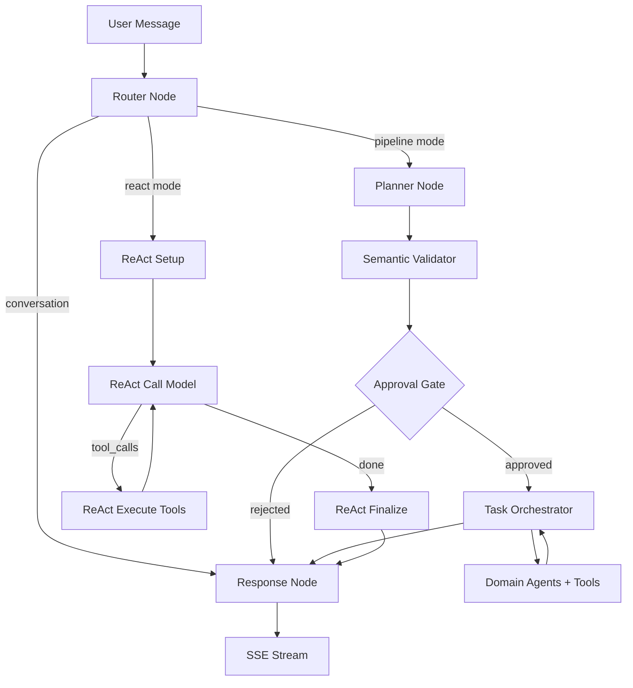

# LIA — 完整技术指南

> 新一代多智能体 AI 助手的架构、模式与工程决策。
>
> 面向架构师、工程师和技术专家的技术展示文档。

**版本**：4.3
**日期**：2026-08-17
**应用**：LIA v1.30.7
**许可证**：AGPL-3.0（开源）

---

## 目录

1. [背景与基础选型](#1-背景与基础选型)
2. [技术栈](#2-技术栈)
3. [后端架构：Domain-Driven Design](#3-后端架构domain-driven-design)
4. [LangGraph：多智能体编排](#4-langgraph多智能体编排)
5. [会话执行管道](#5-会话执行管道)
6. [规划系统（ExecutionPlan DSL）](#6-规划系统executionplan-dsl)
7. [Smart Services：智能优化](#7-smart-services智能优化)
8. [语义路由与语义嵌入](#8-语义路由与语义嵌入)
9. [Human-in-the-Loop：6层架构](#9-human-in-the-loop6层架构)
10. [状态管理与消息窗口化](#10-状态管理与消息窗口化)
11. [记忆系统与心理画像](#11-记忆系统与心理画像)
12. [多提供商 LLM 基础设施](#12-多提供商-llm-基础设施)
13. [连接器：多供应商抽象](#13-连接器多供应商抽象)
14. [MCP：Model Context Protocol](#14-mcpmodel-context-protocol)
15. [语音系统（STT/TTS）](#15-语音系统stttts)
16. [主动性：Heartbeat 与计划任务](#16-主动性heartbeat-与计划任务)
17. [RAG Spaces 与混合搜索](#17-rag-spaces-与混合搜索)
18. [Browser Control 与 Web Fetch](#18-browser-control-与-web-fetch)
19. [安全性：纵深防御](#19-安全性纵深防御)
20. [可观测性与监控](#20-可观测性与监控)
21. [性能：优化与指标](#21-性能优化与指标)
22. [CI/CD 与质量](#22-cicd-与质量)
23. [横切工程模式](#23-横切工程模式)
24. [架构决策记录（ADR）](#24-架构决策记录adr)
25. [演进潜力与可扩展性](#25-演进潜力与可扩展性)
26. [心理引擎：动态情感智能](#26-心理引擎动态情感智能)
27. [确定性习惯学习](#27-确定性习惯学习)
28. [治理一个实例：支出、能力、安装](#28-治理一个实例支出能力安装)

---

## 1. 背景与基础选型

### 1.1. 为什么做出这些选择？

LIA 的每一项技术决策都源于具体的约束条件。该项目旨在打造一个**可在普通硬件上自托管**（Raspberry Pi 5、ARM64）的多智能体 AI 助手，具备完全透明性、数据主权和多 LLM 供应商支持。这些约束决定了整个技术栈。

| 约束 | 架构影响 |
|------|---------|
| ARM64 自托管 | Docker 多架构、语义嵌入（多语言）、Playwright chromium 跨平台 |
| 数据主权 | 本地 PostgreSQL（非 SaaS 数据库）、Fernet 静态加密、本地 Redis 会话 |
| 多 LLM 供应商 | Factory 模式搭配 8 个适配器，按节点配置，不与特定供应商强耦合 |
| 完全透明 | 466 Prometheus 指标、内嵌调试面板、逐 token 追踪 |
| 生产可靠性 | 224 篇 ADR、由 pytest 在 1 087 个文件中收集的 ~19 322 个测试、原生可观测性、6 层 HITL |
| 成本可控 | Smart Services（节省 89% token）、语义嵌入、prompt 缓存、目录过滤 |

### 1.2. 架构原则

| 原则 | 实现方式 |
|------|---------|
| **Domain-Driven Design** | `src/domains/` 中的限界上下文、显式聚合、Router/Service/Repository/Model 分层 |
| **六边形架构** | 端口（Python 协议）和适配器（Google/Microsoft/Apple 具体客户端） |
| **事件驱动** | SSE 流式传输、ContextVar 传播、fire-and-forget 后台任务 |
| **纵深防御** | 使用限制 5 层防御、6 级 HITL、3 层反幻觉 |
| **功能开关** | 每个子系统可独立启用/禁用（`{FEATURE}_ENABLED`） |
| **配置即代码** | Pydantic BaseSettings 通过 MRO 组合，优先级链 APPLICATION > .ENV > CONSTANT |

### 1.3. 代码库指标

| 指标 | 数值 |
|------|------|
| 测试 | ~19 322 个（由 pytest 在 1 087 个测试文件中收集）+ 前端 5,522 个 vitest 测试（覆盖率阈值已锁定，ADR-116） |
| 可复用 Fixtures | 170+ |
| 文档 | 490+ |
| ADR（架构决策记录） | 224 篇 |
| Prometheus 指标 | 466 定义 |
| Grafana 仪表板 | 26 |
| 支持语言（i18n） | 6（fr、en、de、es、it、zh） |

---

## 2. 技术栈

### 2.1. 后端

| 技术 | 版本 | 角色 | 选型原因 |
|------|------|------|---------|
| Python | 3.12+ | 运行时 | 最丰富的 ML/AI 生态系统、原生异步、完整类型标注 |
| FastAPI | 0.136.3 | REST API + SSE | Pydantic 自动验证、OpenAPI 文档、async-first、高性能 |
| LangGraph | 1.2.11 | 多智能体编排 | 唯一原生支持状态持久化 + 循环 + 中断（HITL）的框架 |
| LangChain Core | 1.5.5 | LLM/工具抽象 | `@tool` 装饰器、消息格式、标准化回调 |
| SQLAlchemy | 2.0.50 | 异步 ORM | `Mapped[Type]` + `mapped_column()`、异步会话、`selectinload()` |
| PostgreSQL | 16 + pgvector | 数据库 + 向量搜索 | 原生 LangGraph 检查点、HNSW 语义搜索、成熟度 |
| Redis | 7.4 | 缓存、会话、限流 | O(1) 操作、原子滑动窗口（Lua）、SETNX 领导者选举 |
| Pydantic | 2.13.4 | 验证 + 序列化 | `ConfigDict`、`field_validator`、通过 MRO 组合设置 |
| structlog | latest | 结构化日志 | JSON 输出、自动 PII 过滤、snake_case 事件 |
| Gemini Embeddings | gemini-embedding-001 | 语义嵌入 | Gemini多语言嵌入（记忆、路由、兴趣、日志）— ADR-069 |
| Playwright | latest | 浏览器自动化 | Chromium 无头模式、CDP 无障碍树、跨平台 |
| APScheduler | 3.x | 后台任务 | Cron/间隔触发器、兼容 Redis 领导者选举 |

### 2.2. 前端

| 技术 | 版本 | 角色 |
|------|------|------|
| Next.js | 16.2.10 | App Router、SSR、ISR |
| React | 19.2.7 | UI（含 Server Components） |
| TypeScript | 6.0.2 | 严格类型 |
| TailwindCSS | 4.3.2 | 实用优先 CSS |
| TanStack Query | 5.101 | 服务端状态管理、缓存、变更 |
| Radix UI | v2 | 无障碍 UI 基元 |
| react-i18next | 17.0 | i18n（6 种语言），基于命名空间 |
| Zod | 4.x | 调试模式的运行时验证 |

### 2.3. 支持的 LLM 提供商

| 提供商 | 模型 | 特性 |
|--------|------|------|
| OpenAI | GPT-5.4、GPT-5.4-mini、GPT-5.2、GPT-5.1、GPT-5（+ mini/nano）、GPT-4.1、GPT-4o、o3/o4-mini | 原生 prompt 缓存、Responses API、reasoning_effort |
| Anthropic | Claude Opus 4.6/4.5、Claude Sonnet 4.6、Claude Haiku 4.5 | Extended thinking、prompt 缓存 |
| Google | Gemini 3.1/3 Pro、Gemini 3.1/3 Flash、Gemini 2.5 Pro/Flash | 多模态、双向量嵌入 |
| DeepSeek | deepseek-v4-flash、deepseek-v4-pro（V4）、deepseek-chat（V3）、deepseek-reasoner（R1） | 低成本、原生推理 |
| Perplexity | Sonar、Sonar Pro | 搜索增强生成 |
| Qwen | qwen3.5-plus、qwen3.5-flash、qwen3-max | 思考模式、工具 + 视觉（阿里云） |
| Ollama | 所有本地模型（动态发现） | 零 API 成本、自托管 |

**为什么要 7 个提供商？** 这并非为了收藏而收藏，而是一种弹性策略：管道中的每个节点可以分配不同的提供商。如果 OpenAI 提价，路由器切换到 DeepSeek。如果 Anthropic 宕机，响应切换到 Gemini。LLM 抽象层（`src/infrastructure/llm/factory.py`）使用 Factory 模式配合 `init_chat_model()`，并通过特定适配器覆盖（`ResponsesLLM` 用于 OpenAI 的 Responses API，通过正则表达式 `^(gpt-4\.1|gpt-5|o[1-9])` 判断适用性）。

---

## 3. 后端架构：Domain-Driven Design

### 3.1. 领域结构

```
apps/api/src/
├── core/                         # 横切技术核心
│   ├── config/                   # 9 个 Pydantic BaseSettings 模块通过 MRO 组合
│   │   ├── __init__.py           # Settings 类（最终 MRO）
│   │   ├── agents.py, database.py, llm.py, mcp.py, voice.py, usage_limits.py, ...
│   ├── constants.py              # 1,000+ 集中常量
│   ├── exceptions.py             # 集中异常（raise_user_not_found 等）
│   └── i18n.py                   # i18n → settings 桥接
│
├── domains/                      # 限界上下文（DDD）
│   ├── agents/                   # 主领域 — LangGraph 编排
│   │   ├── nodes/                # 7+ 图节点
│   │   ├── services/             # Smart Services、HITL、上下文解析
│   │   ├── tools/                # 按领域分组的工具（@tool + ToolResponse）
│   │   ├── orchestration/        # ExecutionPlan、并行执行器、验证器
│   │   ├── registry/             # AgentRegistry、domain_taxonomy、catalogue
│   │   ├── semantic/             # 语义路由器、扩展服务
│   │   ├── middleware/           # 记忆注入、人格注入
│   │   ├── prompts/v1/           # 86 个版本化 .txt 提示文件
│   │   ├── graphs/               # 15 个智能体构建器（每个领域一个）
│   │   ├── context/              # Context store（Data Registry）、装饰器
│   │   └── models.py             # MessagesState（TypedDict + 自定义 reducer）
│   ├── auth/                     # OAuth 2.1、BFF 会话、RBAC
│   ├── connectors/               # 多供应商抽象（Google/Apple/Microsoft）
│   ├── rag_spaces/               # 上传、分块、嵌入、混合检索
│   ├── journals/                 # 内省日志
│   ├── interests/                # 兴趣点学习
│   ├── heartbeat/                # LLM 驱动的主动通知
│   ├── channels/                 # 多渠道（Telegram）
│   ├── voice/                    # TTS Factory、STT Sherpa、唤醒词
│   ├── skills/                   # agentskills.io 标准
│   ├── sub_agents/               # 持久化专用智能体
│   ├── peers/                    # 用户之间的连接（助手对助手转达）
│   ├── relations/                # 个人 CRM（聚合 + 收藏）
│   ├── usage_limits/             # 按用户配额（5 层防御）
│   └── ...                       # conversations、reminders、scheduled_actions、users、user_mcp
│
└── infrastructure/               # 横切层
    ├── llm/                      # Factory、providers、adapters、embeddings、tracking
    ├── cache/                    # Redis 会话、LLM 缓存、JSON 辅助工具
    ├── mcp/                      # MCP 客户端池、认证、SSRF、工具适配器、Excalidraw
    ├── browser/                  # Playwright 会话池、CDP、反检测
    ├── rate_limiting/            # Redis 分布式滑动窗口
    ├── scheduler/                # APScheduler、领导者选举、锁
    └── observability/            # 23 Prometheus 指标文件、OTel 追踪
```

### 3.2. 配置优先级链

一个基本不变量贯穿整个后端。在 v1.9.4 中通过对约 80 个文件进行约 291 处修正来系统性地强制执行，因为常量与实际生产配置之间的偏差导致了静默 bug：

```
APPLICATION (Admin UI / DB) > .ENV (settings) > CONSTANT (fallback)
```

**为什么是这个优先级链？** 常量（`src/core/constants.py`）仅作为 Pydantic `Field(default=...)` 和 SQLAlchemy `server_default=` 的回退值。管理员通过界面更改 LLM 模型后，该变更必须立即生效，无需重新部署。在运行时，所有代码读取 `settings.field_name`，绝不直接读取常量。

### 3.3. 分层模式

| 层 | 职责 | 关键模式 |
|----|------|---------|
| **Router** | HTTP 验证、认证、序列化 | `Depends(get_current_active_session)`、`check_resource_ownership()` |
| **Service** | 业务逻辑、编排 | 构造函数接收 `AsyncSession`，创建仓储，集中异常处理 |
| **Repository** | 数据访问 | 继承 `BaseRepository[T]`，分页 `tuple[list[T], int]` |
| **Model** | 数据库模式 | `Mapped[Type]` + `mapped_column()`、`UUIDMixin`、`TimestampMixin` |
| **Schema** | I/O 验证 | Pydantic v2、`Field()` 带描述、请求/响应分离 |

---

## 4. LangGraph：多智能体编排

### 4.1. 为什么选择 LangGraph？（ADR-001）

选择 LangGraph 而非单独的 LangChain、CrewAI 或 AutoGen，基于三个不可妥协的需求：

1. **状态持久化**：带自定义 reducer 的 `TypedDict`，通过 PostgreSQL 检查点持久化 — 允许在 HITL 中断后恢复对话
2. **循环与中断**：原生支持循环（HITL 拒绝 → 重新规划）和 `interrupt()` 模式 — 没有它，6 层 HITL 将无法实现
3. **SSE 流式传输**：与回调处理器的原生集成 — 对实时 UX 至关重要

CrewAI 和 AutoGen 更容易上手，但两者都不支持计划级 HITL 所需的中断/恢复模式。这个选择有其代价：学习曲线更陡峭（图概念、条件边、状态模式）。

### 4.2. 主图

LIA 提供两种执行模式（每个用户可通过聊天标题中的开关进行切换）：**Pipeline**（默认，确定性且 token 高效）和 **ReAct**（自主迭代）。Router 首先对请求进行分类（直接对话或可执行操作），然后将其分派到激活的模式。



### 4.3. 图节点

| 节点 | 文件 | 角色 | 窗口化 |
|------|------|------|--------|
| Router v3 | `router_node_v3.py` | 二元分类 conversation/actionable | 5 轮 |
| QueryAnalyzer | `query_analyzer_service.py` | 领域检测、意图提取 | — |
| Planner v3 | `planner_node_v3.py` | 生成 ExecutionPlan DSL | 10 轮 |
| Semantic Validator | `semantic_validator.py` | 依赖关系和一致性验证 | — |
| Approval Gate | `hitl_dispatch_node.py` | HITL interrupt()，6 级审批 | — |
| Task Orchestrator | `task_orchestrator_node.py` | 并行执行、上下文传递 | — |
| Response | `response_node.py` | 反幻觉合成，3 层防护 | 20 轮 |

### 4.4. AgentRegistry 与 Domain Taxonomy

`AgentRegistry` 集中管理智能体注册（`main.py` 中的 `registry.register_agent()`）、`ToolManifest` 目录和 `domain_taxonomy.py`（定义每个领域及其 `result_key` 和别名）。

**为什么要集中注册？** 没有它，添加一个智能体需要修改 5+ 个文件。有了注册中心，新智能体只需在一个地方声明，即可自动用于路由、规划和执行。

### 4.5. Domain Taxonomy

每个领域都是声明式的 `DomainConfig`：名称、代理、`result_key`（`$steps` 引用的规范键）、`related_domains`、优先级和可路由性。`DOMAIN_REGISTRY` 是三个子系统消费的唯一事实来源：SmartCatalogue（过滤）、语义扩展（相邻领域）和 Initiative 阶段（结构预过滤）。

### 4.6. Tool Manifests

每个工具通过流畅的 `ToolManifestBuilder` 声明一个 `ToolManifest`：参数、输出、成本配置、权限和多语言 `semantic_keywords` 用于路由。清单被规划器（目录注入）、语义路由器（关键词匹配）和代理构建器（工具连接）消费。完整工具架构见第 23 节。

---

## 5. 会话执行管道

### 5.1. 可执行请求的详细流程

1. **接收**：用户消息 → SSE 端点 `/api/v1/chat/stream`
2. **上下文**：`request_tool_manifests_ctx` ContextVar 构建一次（ADR-061：3 层防御）
3. **路由**：带置信度评分的二元分类（high > 0.85、medium > 0.65）
4. **QueryAnalyzer**：通过 LLM + 后扩展验证识别领域（门控过滤器过滤已禁用领域）
5. **SmartPlanner**：生成 `ExecutionPlan`（结构化 JSON DSL）
   - 模式学习：查询贝叶斯缓存（置信度 > 90% 时旁路）
   - 技能检测：确定性 Skills 通过 `_has_potential_skill_match()` 保护
6. **Semantic Validator**：验证步骤间依赖的一致性
7. **HITL Dispatch**：分类审批级别，必要时 `interrupt()`
8. **Task Orchestrator**：通过 `asyncio.gather()` 以并行波次执行步骤
   - 在 gather **之前**过滤已跳过的步骤（ADR-005 — 修复了计划+回退双重执行的 bug）
   - 通过 Data Registry（InMemoryStore）传递上下文
   - FOR_EACH 模式用于批量迭代
9. **Response Node**：合成结果，注入记忆 + 日志 + RAG
10. **SSE 流**：逐 token 发送到前端
11. **后台任务**（fire-and-forget）：记忆提取、日志提取、兴趣检测

### 5.2. ContextVar：隐式状态传播

一个关键机制是使用 Python `ContextVar` 在不进行参数透传的情况下传播状态：

| ContextVar | 角色 | 原因 |
|------------|------|------|
| `current_tracker` | LLM token 追踪的 TrackingContext | 避免在 15 层函数中传递 tracker |
| `request_tool_manifests_ctx` | 按请求过滤的工具清单 | 构建一次，由 7+ 消费者读取（消除 ADR-061 中的重复） |

该方法在 asyncio 上下文中维护每请求的隔离性，而不污染函数签名。

### 5.3. ReAct 执行模式（ADR-070）

LIA 提供第二种执行模式：**ReAct**（Reasoning + Acting）。与预先规划不同，LLM 迭代调用工具、观察结果并自主决定下一步。

**架构**：父级 LangGraph 图中的 4 个自定义节点（非子图）：

```
Router → react_setup → react_call_model ↔ react_execute_tools → react_finalize → Response
```

**Pipeline vs ReAct — 工程权衡**：

| 方面 | Pipeline（默认） | ReAct（⚡） |
|--------|-------------------|-----------|
| **Token 成本** | **低 4–8 倍** — 1 次规划器 + 1 次响应调用 | 每次迭代 1 次 LLM 调用（通常 2–15 次迭代） |
| **规划** | 预先生成 ExecutionPlan 并进行语义验证 | 无 — LLM 逐步决策 |
| **并行执行** | 是 — `asyncio.gather()` 波次执行 | 否 — 顺序工具调用 |
| **适应性** | 严格执行计划 | 根据每个工具结果动态调整 |
| **控制力** | 完全 — 规划器 DSL、HITL 门控、验证器 | 最小 — 提示驱动行为 |
| **成本可预测性** | 高 — 受计划步骤约束 | 低 — 取决于 LLM 推理 |
| **适用场景** | 结构化多域请求 | 探索性研究、模糊查询 |

Pipeline 模式是真正的工程成就：SmartPlanner、语义验证器、贝叶斯模式缓存和并行执行器共同提供与 ReAct 相同的功能能力，同时仅消耗其一小部分 token。权衡在于适应性——当最优工具序列无法预先预测时，ReAct 的迭代推理更具优势。

两种模式共享相同的工具注册表、HITL 系统、响应节点和可观测性基础设施。用户可通过聊天头部的切换开关在两种模式间自由切换。

### 5.4. 解耦执行：生成过程不依赖连接存活（ADR-117）

经典 SSE 流式传输存在一个结构性缺陷：生成过程存活于 HTTP 响应生成器*内部*。关闭标签页、切换页面或网络中断会杀死连接——连同整个对话轮次一起丢失。LIA 将两者解耦：一个**独立生产者**（与请求无关的 asyncio 任务）执行图并将每个 chunk 发布到**按 run 划分的 Redis Stream**；SSE 端点则退化为仅仅转发该流的**订阅者**。

- **断连 ≠ 取消** — 关闭页面只终止订阅，绝不终止生成。用户消息在执行开始*之前*即已归档，回答在服务端完成并在对话中等待。
- **实时续接** — 用户返回时（页面挂载、标签页恢复可见），前端检测到活跃 run，重放所有已发出的 chunk（无节流），随后切换到实时流；边界是一条 SSE 传输注释（`: replay-end`），chunk 契约完全不变。重放期间，副作用（toast、音频）被抑制，reducer 同时重建进行中的气泡。
- **客户端静默检测** —— 恢复的前提，仍然是客户端知道自己需要恢复。被操作系统冻结的标签页既收不到结束也收不到错误：读取一直挂起，界面以为仍在接收，而本用于保护活跃流的防护，恰恰挡住了恢复。一个按服务器心跳节奏校准的静默预算给出裁决：超过之后便丢弃这条已死的连接，状态回到空闲，由上文的重新接入接手。浏览器计时器会随标签页一同冻结，因此这个期限在唤醒时才到期 —— 正是它起作用的时刻。
- **每个对话仅一个 run** — Redis 锁（`SET NX EX` + 生产者心跳 + 防僵尸的条件式 Lua 释放）使并发发送收到 HTTP 409，前端将其转化为静默重连。
- **跨 worker 取消** — 发送按钮变形为停止按钮；取消信号经由 Redis 传递并由生产者侧轮询（约 1 秒），即使生产者与 HTTP 请求位于不同 worker 也有效。部分回答被保留并标记为「已中断」；已消耗的 token 照常计费——所有退出路径上的计费都得到保证，包括强制终止。
- **有人听才有声音** — 订阅者在场状态（带周期性重置 TTL 的 Redis 计数器）控制语音合成：无人收听的 run 不生成 TTS，中途加入的听众可获得后续部分的语音。
- **优雅关停** — 关停时，lifespan 先排空进行中的生产者再交出控制权；被杀死的 run 将其部分内容归档并标记 `interrupted`，下一轮开始时的修复机制会清理中断的 checkpoint 可能遗留的孤儿 `tool_calls`（严格的 provider 会在下一轮拒绝它们）。

整套机制由一个 feature flag 和十余个可通过 env 配置的参数（TTL、心跳、排空、轮询）治理，并在启动时校验——与锁 TTL 不兼容的心跳周期将拒绝启动。

---

**基于近期实体的锚定。** 在未调用任何工具的一轮中，当前轮次的注册表按设计为空（防串扰保护），且会话历史刻意排除工具消息：此时回答模型没有*任何*权威的结构化数据，只能复述此前的文字。因此，state 中最近的实体会通过专门的提示词区块重新注入——按时间就近选取、设有时效上限、不产生任何存储往返，并明确低于当前轮次数据的优先级。一条权威性规则与之配套：禁止臆造实体属性，且对于请求过却从未获得的数据，必须声明其缺失。

## 6. 规划系统（ExecutionPlan DSL）

### 6.1. 计划结构

```python
ExecutionPlan(
    steps=[
        ExecutionStep(
            step_id="get_meetings",
            tool_name="get_events",
            parameters={"date": "tomorrow"},
            dependencies=[]
        ),
        ExecutionStep(
            step_id="send_reminders",
            tool_name="send_email",
            parameters={"subject": "Rappel réunion"},
            dependencies=["get_meetings"],
            for_each="$steps.get_meetings.events",
            for_each_max=10
        )
    ]
)
```

### 6.2. FOR_EACH 模式

**为什么需要专用模式？** 批量操作（例如向 12 个联系人发送邮件）无法规划为 12 个静态步骤 — 元素数量在前一步执行前是未知的。FOR_EACH 通过以下防护机制解决此问题：
- HITL 阈值：任何 >= 1 个元素的变更操作都触发强制审批
- 可配置限制：`for_each_max` 防止无界执行
- 动态引用：`$steps.{step_id}.{field}` 引用前序步骤的结果

相关结果的标识包含其父项。工具仅根据内容生成 id——天气取自`地点 + 日期`，路线取自`起点 + 终点`——因此当两个迭代的父项共享这些属性时会产生相同的 id，而累加器只是一个 `dict.update()`，会静默覆盖前一个。现在 id 通过确定性指纹按父项派生，这也使得在重放或中断后恢复时标识保持稳定。

### 6.3. 波次并行执行

`parallel_executor.py` 将步骤组织为波次（DAG）：
1. 识别无未解析依赖的步骤 → 下一波次
2. 过滤已跳过的步骤（条件未满足、回退分支）— 在 `asyncio.gather()` **之前**，而非之后（ADR-005：修复了导致 2 倍 API 调用和 2 倍成本的 bug）
3. 以每步错误隔离的方式执行波次
4. 将结果写入 Data Registry
5. 重复直到计划完成

### 6.4. 语义验证器

在 HITL 批准之前，一个专用 LLM（与规划器不同，以避免自我验证偏差）根据四个类别的 14 种问题类型检查计划：**关键**（幻觉能力、幽灵依赖、逻辑循环）、**语义**（基数不匹配、范围溢出/不足、错误参数）、**安全**（危险歧义、隐含假设）和 **FOR_EACH**（缺失基数、无效引用）。简单计划（1 步）短路，乐观 1 秒超时。


此外，一个**自增强反幻觉注册表**（`hallucinated_tools.json`）通过持久化的正则模式检测LLM发明的工具。每次新的幻觉都会自动添加到注册表中。幻觉步骤被移除，规划器被强制使用真实目录工具重新规划。

判定只做分类，不做定罪 —— 而**诊断也不等于提问**。当一个*写入型*计划用尽了自动重规划次数，校验器会拒绝执行它并转交给 HITL 澄清：写入错误数据的代价，比多问一句要大得多。此时向用户提出的，是一个**用其母语写成**的问题，取自一张十五条的对照表，其完整性在启动时被**双向**校验 —— 代码能抛出却没有对应问题的情形会阻止应用启动，没有任何代码会抛出的问题同样如此。内部的问题描述留在追踪日志里，那才是它该待的地方。同一条原则也适用于取值：上一轮已提供过的参数会**从此前的计划中沿用**，而不是被重新编造，因为这项修复识别的是文档示例地址，绝不会覆盖一个真实的值 —— 用户的改变主意始终会被尊重（ADR-195）。

裁定的诚实一直延伸到执行阶段。每个工具都会返回带类型的裁定——成功或拒绝，并附带原因——计划执行器将其**原样**传递：拒绝绝不会被呈现为已完成的操作，失败的步骤不会被计为「已执行」（负责说明阻塞的层因此保持真实），失败也绝不会被保存为会话上下文。当被违反的约束无法修复——用户自己的内容超出了目录中公布的上限——它会成为**第一个被提出的问题**，带着确切的数字、用用户的语言表达，而不是一个笼统的提问。批量操作所确认的，是预执行后**实测**的数量，绝不是理论上限。

### 6.5. 引用的真实性（ADR-194）

跨步骤引用（`$steps.get_meetings.events[0].title`）是规划器在该步骤**尚未执行之前**写下的。因此路径必须一次写对，否则计划会在付费 API 调用已经发出、用户也已经等过之后才失败。

让它一次写对的，是一份**契约**：每份工具清单都会公布其输出所携带的路径，而持续集成会在任何代码合并之前证明这份契约。检查会驱动真正的工具 —— 它真实的 builder、真实的引用解析器、重建的合并结果 —— 并把清单所公布的内容与执行实际产出的内容作比对：路径本身、它的**结构**（记录、列表、记录列表）以及它的**类型**（字符串、数字、对象）。规划器正是读取这个类型来决定可以把值串接到哪里：类型写错，与路径写错一样会让计划失败。

这份契约刻意是**不对称**的：凡是公布的都必须被产出，反之则不要求。清单列出的是*示例*，而非穷举 —— 无论是否有人想到把它写下来，`events[0].summary` 都真实存在；若反过来强求，就会拒绝掉合法的路径。

覆盖率是被明确声明的，而不是想当然：在注释活动进行时，当时公布路径的 59 个工具中已覆盖 36 个。因工具形态而难以驱动的部分，会被量化并标注日期写入一份债务清单，而不是含糊带过。在运行时，兜底是 `ReferenceResolver`：它会抛出明确的错误，而不是解析成空。

### 6.6. 自适应重新规划器（Panic Mode）

执行失败时，基于规则的分析器（无 LLM）对失败模式进行分类（空结果、部分失败、超时、引用错误）并选择恢复策略：相同重试、扩大范围重新规划、上报用户或中止。该决策**目前仅供参考**：每次失败都会被记录和计数，使失败模式可度量，但编排器尚未自动执行它——部分结果会被呈现而非丢弃。在 **Panic Mode** 下，SmartCatalogue 扩展为包含所有工具进行一次重试——解决领域过滤过于激进的情况。

---

### 6.7. 被调用的能力：当请求不是一句话

计划源自文本。但当请求来自一个**按钮** — 一张具名的卡片、若干勾选框 — 系统在任何模型被咨询**之前**就已掌握这份确定性。把它转成散文，再花三个随机阶段（分析器、规划器、验证器）去还原，等于先销毁信息、再为找回它付费。实测：应当被选中的工具得分 **0.853**，为目录最高，而计划调用的却是通用工具。

因此请求会在用户所读的句子之外，携带**被调用的能力**：一个 `{capability, subject}` 对。`capability` 是**封闭**的 `Literal`，在 HTTP 边界即被 Pydantic 拒绝 — 浏览器命名的是能力，**绝不是**工具，由服务器决定由哪个只读工具来实现。这道门不会通向任何写操作工具。传递到规划器的载体是请求级 `ContextVar`，其设置位置与纪律和技能偏好完全一致。

它在**验证之前**生效，与把越界参数拉回边界一视同仁：凡可机械修复者即修复，绝不上报为缺陷。计划是**被丰富，而非被替换** — 规划器安排的、确有增益的一切都保留；它安排的、而该能力本已覆盖的部分则移除，因为在已声明的缺口旁放上无关的答案只会与之矛盾。两道护栏：仍被其他步骤读取的步骤 — 无论通过声明的依赖**还是** `$steps` 引用 — 一律保留；没有任何步骤的计划（等待澄清、已委派给技能执行）绝不会被变成一次执行。压过提问的保证，不是保证。

---

## 7. Smart Services：智能优化

### 7.1. 解决的问题

未经优化时，扩展到 10+ 领域会导致成本爆炸：从 3 个工具（联系人）增长到 30+ 工具（10 个领域），prompt 大小增长 10 倍，从而每次请求成本增长 10 倍（ADR-003）。Smart Services 旨在将成本降回到单领域系统的水平。

| 服务 | 角色 | 机制 | 实测收益 |
|------|------|------|---------|
| `QueryAnalyzerService` | 路由决策 | LRU 缓存（TTL 5 分钟） | 约 35% 缓存命中 |
| `SmartPlannerService` | 计划生成 | 贝叶斯模式学习 | 置信度 > 90% 时旁路 |
| `SmartCatalogueService` | 工具过滤 | 按领域过滤 | 96% token 缩减 |
| `PlanPatternLearner` | 学习 | 贝叶斯评分 Beta(2,1) | 每次重规划节省约 2,300 token |

### 7.2. PlanPatternLearner

**工作原理**：当计划被验证并成功执行后，其工具序列被记录到 Redis 中（哈希 `plan:patterns:{tool→tool}`，TTL 30 天）。对于后续请求，计算贝叶斯评分：`置信度 = (α + 成功) / (α + β + 成功 + 失败)`。超过 90% 时，直接复用计划而不调用 LLM。

**防护机制**：K-匿名性（最少 3 次观测才建议，10 次才旁路）、领域精确匹配、最多注入 3 个模式（约 45 token 开销）、严格 5 ms 超时。

**冷启动**：启动时预定义 50+ 黄金模式，每个带 20 次模拟成功（= 初始置信度 95.7%）。

### 7.3. QueryIntelligence

QueryAnalyzer 产生的远不止领域检测——它生成深度 `QueryIntelligence` 结构：即时意图与最终目标（`UserGoal`：FIND_INFORMATION、TAKE_ACTION、COMMUNICATE...）、隐含意图（如"查找联系人"可能意味着"发送某物"）、预期回退策略、FOR_EACH 基数提示和 softmax 校准的领域置信度分数。这为规划器提供了比简单关键词提取更丰富的视角。

### 7.4. 语义转换

任何语言的查询在嵌入比较之前自动翻译为英语，提高跨语言准确性。Redis 缓存（TTL 5 分钟，命中 ~5 毫秒 vs 未命中 ~500 毫秒），通过快速 LLM。

### 7.5. 工具清单的闭合

语义筛选是拿工具去比对**一段由模型在每一轮重新生成的英文改写**——同一个问题因此可能得到两份不同的工具清单。如果被选中的工具需要一个它们谁都无法产出的值（比如要回复邮件就得先有该邮件的标识符），那么在模型动笔**之前**，有效计划的空间就已经是空的。它此时只能凭空捏造一个工具名称。

闭合规则从不看用户的请求：*清单中任一工具所需的每一类数据，都必须由清单中的另一个工具产出*。这是解析未定义引用的链接器，而不是靠猜测的检索。两个条件让它真正成立而非看似合理：工具永远不能自我满足（「回复邮件」同样会产出一个消息标识符——它刚发出的那封），并且只有**读取类**工具才算作来源（不能为了得到一个标识符而先触发一次发送）。实测清单增长：**+1 个工具**。

---

### 7.6. 跨领域可达性

关闭目录解决的是一个计划可以**串联**什么。在此之前还有一个问题：哪些工具能**进入**目录。过滤会丢弃所有领域不在已识别范围内的工具 — 且发生在读取任何语义分数**之前**。因此，一个真正跨领域的工具，对于被归类到别处的每一个请求都是不可见的，无论它的分数多高。

实测：某个人的 360° 概览工具位于 `contact` 领域，而分析器的指令会把关于已连接用户的所有问题送往 `peer` 领域。它得分 **0.853** — 整个目录中最高，而通用工具为 0.000 — 却从未送达规划器。它偶尔奏效，只是因为模型偏离了自己的指令：一次随机的逃逸，而非正常路径。

现在，清单可以声明它还能从哪些**额外领域**被触及，并由**唯一一处实现**回答「该工具是否在范围内」，供两种过滤策略共用 — 此前它们各自分别提出同一个问题。所有取值在注册时都会对照领域注册表校验：未知领域会拒绝启动，而不是让工具悄无声息地无法触及。应谨慎声明 — 每增加一个领域，都会扩大该领域**所有**请求的候选范围。这与把两个领域相互关联不同：关联会把它们的整个工具箱彼此拉入，那已经造成过一次生产事故。这里移动的是一个工具，不是一个领域。
### 7.7. 一个领域的目录，就是它所提供的能力

按领域过滤有一个推论，是测量之后才看清的：**一个领域的目录里有什么，决定了规划器能想要什么**。在生产环境中，「我上次给妻子打电话是什么时候？」生成了一个两步计划——先找到联系人，然后**打电话去问她**。只有一次引用失败才让它停了下来。

这不是模型的任性，而是它唯一能服从的方式。提示词声明 `Primary domain: telephony`，一条规则会检查计划是否覆盖了该领域，而 `telephony` 的目录里**只有一项能力：拨打电话**。于是，覆盖自身的主领域就等于去执行动作。

因此新增了三项读取能力，**每一项都放在原本缺少它的领域里**——通话、进行中的约定、转达的消息。上一节所述的「附加领域」这一替代方案经过测量后被否决：让这三个工具可从 `contact` 到达，会把**六个写入工具**挤出最拥挤的目录，因为上限是固定的。读取能力不应以牺牲写入能力为代价。

还有一条**确定性**规则作为补充，且在任何模型调用之前执行：检测到非变更意图 + 计划调用了变更类工具 → 计划无效。它与其他 LLM 前置规则一同运行，因而不受那条豁免的影响——那条豁免会跳过对任何衔接良好、以变更结尾的计划的审查，而这恰恰就是出问题的形态。计划构造得越工整，受到的检查反而越少。

目录的两个上限（常规与应急模式）也变成了配置项，并在启动时校验：**应急上限绝不低于常规上限**，否则这张安全网提供的，会比刚刚失败的那条路径还要少。

---


## 8. 语义路由与语义嵌入

### 8.1. 为什么使用语义嵌入？（ADR-049）

纯 LLM 路由有两个问题：成本（每个请求 = 一次 LLM 调用）和精度（LLM 在约 20% 的多领域场景中判断错误）。语义嵌入同时解决了这两个问题：

| 属性 | 值 |
|------|------|
| 供应商 | Google Gemini (`gemini-embedding-001`) |
| 语言 | 100+ |
| 精度提升 | 相比纯 LLM 路由，Q/A 匹配提升 +48% |

### 8.2. Semantic Tool Router（ADR-048）

每个 `ToolManifest` 拥有多语言 `semantic_keywords`。请求被转换为嵌入，然后通过余弦相似度与 **max-pooling** 比较（分数 = 每个工具取 MAX，而非平均值 — 避免语义稀释）。双阈值：>= 0.70 = 高置信度，0.60-0.70 = 不确定。

### 8.3. 语义扩展

`expansion_service.py` 会把能够提供缺失数据的领域加入 planner 目录。触发机制是**证据驱动**的：人称引用的检测是三个来源的并集 — 记忆解析器的映射（按构造即为人称引用）、即使解析未找到事实也会保留的关系引用提取结果、以及分析 LLM 的类型化引用。被引用的实体（人 → `Contact`、会议 → `CalendarEvent`、地点 → `Place`、邮件 → `EmailMessage`）会带入其本体类型 `properties` 能提供所选工具所需类型的领域 — 这种锚定防止任何盲目扩展，并有可配置上限和启动时的映射完整性校验（ADR-120）。

该层由**深度注解**的工具清单驱动（参数与输出上的 `semantic_type`：会议参与者、邮件发件人、路线目的地 — ADR-121），同时支撑跨领域的 Jinja2 关联建议和一道**执行防护栏**：人名永远无法进入地址/邮箱类型的参数 — 调用会在任何 API 花费之前以可恢复错误失败，两种执行模式下均如此。后扩展验证（ADR-061，Layer 1）仍会过滤管理员已禁用的领域。

---

## 9. Human-in-the-Loop：6 层架构

### 9.1. 为什么在计划层面？（Phase 7 → Phase 8）

最初的方法（Phase 7）在工具调用**期间**中断执行 — 每个敏感工具都生成一次中断。UX 很差（意外暂停），成本很高（每个工具的开销）。

Phase 8（当前方案）在任何执行**之前**将**完整计划**提交给用户。一次中断，全局视图，可编辑参数。权衡：需要信任规划器能生成忠实的计划。

### 9.2. 6 种审批类型

| 类型 | 触发条件 | 机制 |
|------|---------|------|
| `PLAN_APPROVAL` | 破坏性操作 | `interrupt()` 带 PlanSummary |
| `CLARIFICATION` | 检测到歧义 | `interrupt()` 带 LLM 提问 |
| `DRAFT_CRITIQUE` | 邮件/事件/联系人草稿 | `interrupt()` 带序列化草稿 + markdown 模板 |
| `DESTRUCTIVE_CONFIRM` | 删除 >= 3 个元素 | `interrupt()` 带不可逆警告 |
| `FOR_EACH_CONFIRM` | 批量变更 | `interrupt()` 带操作计数 |
| `MODIFIER_REVIEW` | AI 建议的修改 | `interrupt()` 带前后对比 |

### 9.3. 增强型草稿评审

对于草稿，专用提示生成结构化评审，包含按领域的 markdown 模板、字段表情符号、更新时带删除线的前后对比、以及不可逆性警告。HITL 后结果显示 i18n 标签和可点击链接。

### 9.4. 响应分类

当用户回复审批提示时，全 LLM 分类器（非正则表达式）将响应分为 5 种决策：**APPROVE**、**REJECT**、**EDIT**（相同操作，不同参数）、**REPLAN**（完全不同的操作）或 **AMBIGUOUS**。降级逻辑防止误报：缺少参数的 EDIT 被降级为 AMBIGUOUS，触发澄清追问。

### 9.5. Replay-safe 审阅循环（ADR-092）

LangGraph 的恢复语义会**完整**重新执行被中断的节点：过去的 `interrupt()` 调用返回其缓存值，但其余一切都会重新实时运行。因此，任何写在节点内部、围绕 `interrupt()` 的循环都会在每次用户决策时重放其副作用（LLM 调用、API 调用）。两个审阅循环——草稿的迭代编辑与批量操作确认（专用 `for_each_confirm` 节点）——遵循一个规范模式：**每次节点执行仅一个 `interrupt()`**，循环状态通过 checkpointed 图状态传递，迭代通过条件自环边完成。由编译的 replay 测试框架证明的保证：每次 LLM 修改只执行一次，确认的内容就是最后显示的内容。

### 9.6. 压缩安全

4 个条件阻止在活跃审批流程期间进行 LLM 压缩（旧消息摘要）。没有此保护，摘要可能删除正在进行的中断的关键上下文。

---

## 10. 状态管理与消息窗口化

### 10.1. MessagesState 与自定义 reducer

LangGraph 状态是一个 `TypedDict`，配合 `add_messages_with_truncate` reducer，管理基于 token 的截断、OpenAI 消息序列验证和工具消息去重。

### 10.2. 为什么按节点窗口化？（ADR-007）

**问题**：50+ 条消息的对话产生 100k+ token 上下文，路由器延迟 > 10 秒，成本爆炸。

**解决方案**：每个节点在不同的窗口上操作，根据实际需要校准：

| 节点 | 轮次 | 理由 |
|------|------|------|
| Router | 5 | 快速决策，最小上下文足够 |
| Planner | 10 | 规划需要上下文，但不需要全部历史 |
| Response | 20 | 丰富上下文用于自然合成 |

**实测影响**：端到端延迟 -50%（10 秒 → 5 秒），长对话成本 -77%，质量得以保持，因为 Data Registry 独立于消息存储工具结果。

### 10.3. 上下文压缩

当 token 数超过动态阈值（响应模型上下文窗口的比率）时，生成 LLM 摘要。关键标识符（UUID、URL、邮箱）被保留。节省比率：每次压缩约 60%。`/resume` 命令用于手动触发。

**运行时韧性**：每次 LLM 调用都用每个分块的 `asyncio.wait_for`（默认 35 秒）和全局 120 秒预算包裹。对于瞬时错误，`tenacity.AsyncRetrying` 以指数退避最多重试 3 次。如果摘要仍无法完成,显式回退（`_truncation_fallback`）会用一个可读且保留标识符的 `SystemMessage` 干净地截断较旧的历史 — 不再有静默的占位符。先前的 `compaction #N` 摘要会被整合进 merge,而不是一轮一轮堆叠。

**SSE custom mode 信号**：节点通过 `langgraph.config.get_stream_writer()` 经由一个 `stream_mode="custom"`（LangGraph 1.x）发出 `compaction_start` / `compaction_done`。streaming service 将这些 payload 转换为 `ChatStreamChunk(type="execution_step")`。前端中,基于稳定 id (`COMPACTION_TOAST_ID`) 变形的 sonner toast 在整个压缩期间保持可见,输入通过 `status="compacting"` 被锁定,并且一颗 `ContextUsagePill` 持续显示 token/阈值比率。并发 SSE keepalive (`iter_with_keepalive`) 在静默 await 期间每 15 秒发出 `: heartbeat`,以抵消 Cloudflare 的空闲切断。五个 Prometheus 指标（`compaction_chunk_timeouts_total`、`compaction_global_timeouts_total`、`compaction_total_duration_seconds`、`compaction_writer_unavailable_total`、`compaction_executions_total{strategy}`）供养一个专用 Grafana 仪表盘。

### 10.4. PostgreSQL 检查点

每个节点后完整检查点状态。P95 保存 < 50 ms，P95 加载 < 100 ms，平均大小约 15 KB/对话。检查点器和存储各自运行在每个 worker 专属的 PostgreSQL 连接池上（大小可通过环境变量调整）：并发对话不再在单一连接上排队串行，闲置时断开的连接会在取用时被检测并自动替换（ADR-111）。

### 10.5. ReAct 回合的系统块属于状态，而非消息（ADR-169/170）

`get_windowed_messages(include_system=True)` 会把**所有 `SystemMessage` 提到最前面**，且不受窗口限制。因此，把本回合的系统块堆进历史记录，等于在每次调用时把过去的全部副本重新发送一遍：`react_agent_prompt.txt` 重达 **840 个 token**，三个回合就是 2 520 个重复 token —— 而且是在每个回合每次迭代的每一次 LLM 调用中。由于前缀逐回合增长，任何供应商的前缀缓存都不可能命中；Anthropic 更是从第二个回合起就拒绝该序列：`SystemMessage` 不能出现在历史记录的中间。

这些块如今存放在专用的状态键中，并在每次调用时重新组合到最前 —— 前缀重新保持稳定。状态模式升至 **1.4**，迁移是增量且幂等的。窗口化会剔除历史中遗留的 `SystemMessage`，**唯独保留压缩摘要**：修复的第一版通过销毁该摘要来恢复连续性，正是对那一版的复审催生了正确的方案。

**循环的时限以计算时间衡量，而非挂钟时间。** `interrupt()` 会抛出：节点永不返回，没有任何状态更新被持久化，没有任何时间戳被刷新，恢复时会重新进入被中断的节点，而不会重放存放重置逻辑的路由器 —— 在真实图上测得**挂钟 2,01 秒对应计算 0,0102 秒**。一旦超出预算，恢复后的回合会在下一次路由决策处被切断，回答由第二次 LLM 调用重新合成，多步工作就此丢失。一道停滞防护补齐了整体：第四次相同的工具调用会请模型更换思路，第五次则结束该回合。指纹是以应用密钥为键的 HMAC —— 它能在另一个 worker 上的恢复中存活 —— 并且只有指纹和计数器进入检查点，工具名称及其参数从不进入。

---

## 11. 记忆系统与心理画像

### 11.1. 架构

```
AsyncPostgresStore + Semantic Index (pgvector)
├── Namespace: (user_id, "memories")        → Profil psychologique
├── Namespace: (user_id, "documents", src)  → RAG documentaire
└── Namespace: (user_id, "context", domain) → Contexte outils (Data Registry)
```

### 11.2. 增强记忆模式

每条记忆是一个结构化文档，包含：
- `content`、`category`（偏好、事实、个性、关系、敏感性……）
- `importance`（1-10）、`emotional_weight`（-10 到 +10）
- `usage_nuance`：如何善意地使用此信息
- 嵌入 `gemini-embedding-001`（1536d）通过 pgvector HNSW

**为什么需要情感权重？** 一个知道你母亲生病却把这个事实当作普通数据处理的助手，往好了说是笨拙，往坏了说是伤人的。情感权重允许在涉及敏感话题时激活 `DANGER_DIRECTIVE`（禁止开玩笑、轻描淡写、比较、淡化）。

### 11.3. 提取与注入

**提取**：每次对话后，后台进程分析用户最后一条消息，根据活跃人格进行调整。成本通过 `TrackingContext` 追踪。

**注入**：`memory_injection.py` 中间件搜索语义相近的记忆，构建可注入的心理画像，并在必要时激活 `DANGER_DIRECTIVE`。注入到 Response Node 的系统提示中。

**哪些轮次会写入记忆。** 触发操作的消息与普通对话同等重要：恢复草稿时不会注入任何消息，因此在提取时，用户最初的请求仍是他的最后一句话。反过来，**由系统生成**的消息 — HITL 拒绝时注入的脚手架文本 — 会在其元数据中被标记，并同时从提取目标与上下文中排除：绝不通过文本内容识别，因为这类文本存在六种语言版本。最后，用于剔除附和语的启发式规则只作用于用户真正输入的内容 — 一旦作用于人名，姓氏近似「好」或「酷」的联系人，其相关记忆便会消失。每一次决策都按子系统与结果计数（`post_response_extraction_scheduled_total`），而此前只有调试日志。

### 11.4. 双向量记忆检索

每条记忆携带**两个嵌入向量**：一个针对其内容，一个针对触发它的关键词。查询会与两者分别比对，取更贴近的一路（`LEAST(dist_content, dist_keyword)`，当关键词向量为空时回退到内容）。

一套 **BM25 + pgvector 混合**引擎曾存在于此，直到 v1.14.0 长期记忆迁移到自己的 PostgreSQL 模型。检索路径随之迁移，混合路径却没有：截至 2026-07-27，它**已经没有任何调用方**，覆盖率 21 %，127 行中有 100 行从未被执行 —— 而调试面板却仍在向用户宣传这个选项。模块、配置、指标与界面显示已被一并移除（[ADR-168](https://github.com/jgouviergmail/LIA-Assistant/blob/main/docs/architecture/ADR-168-Removal-Of-Dead-Hybrid-Memory-Search.md)）。混合检索依然真实存在，只是在它真正被使用的地方：RAG Spaces（第 17 节）。

### 11.5. 分层日志（Journals）

助手撰写内省反思，按四个主题（自我反思、用户观察、想法/分析、学习）和四个抽象层级（`L0` 原始观察、`L1` `WHEN→DO BECAUSE` 指令、`L2` 横向模式、`L3` 肖像维度——见 [ADR-079](https://github.com/jgouviergmail/LIA/blob/main/docs/architecture/ADR-079-Stratified-Journal-Consciousness.md)）组织。每个条目都带有认识论状态（`confidence` ∈ {low, medium, high}）和两个计数器（`evidence_count`、`contradiction_count`）。

**双触发器**：对话后提取（fire-and-forget，频繁，轻量）+ 定期巩固（每用户 4–12 小时，复杂）。

**Gemini 双向量嵌入**（`gemini-embedding-001`，1536d，ADR-069）：一个向量在 `title + content` 上，一个在 `search_hints` 上。搜索按行使用 `LEAST(dist_content, dist_keyword)` 来桥接助手的内省词汇和用户词汇。

**延迟自评估 T → T+1**：`MessagesState.injected_journal_ids`（与 `injected_memories` 对称）跨轮次携带 ID。`response_node` 在开始时读取上一轮的 ID，将它们传递给对话后提取器，然后在结束时写入当前轮次的 ID。提取器在同一个提示词中看到应用的指令 + 用户的反应，并在 update 操作上信号 `evidence_outcome="evidence" | "contradiction"` — 服务原子地递增计数器（反幻觉第 4 层：LLM 仅信号结果，服务拥有整数）。**零额外 LLM 成本**（同一次提取调用，丰富的提示词）。

**用户模型肖像的环境扩散**：巩固在**同一次 LLM 调用**中产生（无额外调用）一个 `portrait_full`（约 200 个 token，对话/规划器）和一个 `portrait_brief`（约 60 个 token，次要流），持久化到 `users` 表。构建器 `build_journal_user_model_block(user_id, format, flow)`（`src/domains/journals/portrait_builder.py`，`build_psyche_prompt_block` 的镜像）返回一个 `<UserModelContext>...</UserModelContext>` 块，带优雅降级。扩散到 **8 个流**：2 个主要流以完整格式（`response_node`、`planner_node_v3`），6 个次要流以简要格式（`react_setup_node`、`interests/proactive_task`、`scheduler/reminder_notification`、`voice/service`、`heartbeat/prompts`、`agents/services/fallback_response` sync + async）。

**肖像上的三个用户修正杠杆**（从不直接编辑）：（1）L3 源条目的 CRUD 编辑，（2）`POST /journals/portrait/feedback`（自由文本 → L0 条目 `source=user_correction` + 同步重新巩固，重新加权 L3 条目），（3）`POST /journals/consolidate`（手动巩固，绕过冷却）。

**去重纪律**：无写入时守卫（在 v1.14.0 中移除）。在巩固时，`STEP 1` 执行明确的成对扫描以融合语义重复，`STEP 5` 主动将收敛的 L1 聚类成 L2 模式。

**4 层反幻觉**：UUID 上的 Pydantic `field_validator`、提示词中的 ID 参考表、在提取和巩固时按已知 ID 筛选操作，以及计数器的原子递增（LLM 仅信号 `evidence_outcome`）。

**专用可观察性**：`src/infrastructure/observability/metrics_journals.py` 中的 11 个 Prometheus 指标——`journal_entries_total{action,theme,source}`、`journal_evidence_total{outcome}`、`journal_consolidation_promotions_total{from_level,to_level}`、`journal_level_distribution{level}`、`journal_portrait_present_total{flow,format}`、`journal_portrait_age_hours`、`journal_portrait_feedback_total{outcome}` 等。

### 11.6. 兴趣系统

通过分析请求进行检测，权重通过贝叶斯演化（衰减可配置）。兴趣通过批量 LLM 聚类归入**主题**（派生数据，自我修复），通知选择采用**两级稀有度抽取**（按主题冷却 + 优先服务最少被推送的主题和兴趣）——单一爱好绝不会垄断通知。多源内容（Perplexity、Brave、Wikipedia、LLM 反思），并以确定性方式附加**可点击的来源链接**。用户反馈（点赞/点踩/屏蔽）调整权重；夜间合并近似重复项。

---

## 12. 多提供商 LLM 基础设施

### 12.1. Factory 模式

```python
llm = get_llm(provider="openai", model="gpt-5.4", temperature=0.7, streaming=True)
```

`get_llm()` 通过 `get_llm_config_for_agent(settings, agent_type)` 解析有效配置（代码默认值 → 数据库管理员覆盖），实例化模型，并应用特定适配器。

### 12.2. 56 种 LLM 配置类型

管道中的每个节点都可通过 Admin UI 独立配置 — 无需重新部署：

| 类别 | 可配置类型 |
|------|-----------|
| 管道 | router、query_analyzer、planner、semantic_validator、context_resolver |
| 响应 | response、hitl_question_generator |
| 后台 | memory_extraction、interest_extraction、journal_extraction、journal_consolidation |
| 智能体 | contacts_agent、emails_agent、calendar_agent、browser_agent 等 |

### 12.3. Token 追踪

`TrackingContext` 追踪每次 LLM 调用，包含 `call_type`（"chat"/"embedding"）、`sequence`（单调递增计数器）、`duration_ms`、token（输入/输出/缓存）、以及从数据库费率计算的成本。追踪器共享 `run_id` 用于聚合。调试面板以统一的时间线视图显示所有调用（管道 + 后台任务）。

计数本身是**契约化的，而非偶然的**：OpenAI 兼容的提供商只有在请求中明确要求时，才会在流式回答中发送 `usage` 对象。因此每个聊天提供商都在注册表中声明其计数方式 — 显式的 `stream_usage` 请求、SDK 原生计数，或有意排除（免费的本地模型、归最终用户所有的密钥）— 注册表的完整性在启动时校验：未声明的提供商会使应用拒绝启动（ADR-220，ADR-085 学说）。付费调用若在无计数的情况下结束，会递增专用计数器、记录警告并触发零阈值告警：整类沉默的计费漏洞变成了信号。超时也遵循同一学说：按用途配置、可管理的 `timeout_seconds` 会作为每次尝试的传输上限传递给每个提供商的客户端 — 节点的 `asyncio.wait_for` 屏障仍是用户体验的上限 — 且没有任何默认值在未与生产环境真实延迟对照的情况下被应用（ADR-221）。

计价本身也跟随提供商的时钟：一些提供商按 UTC 时段对文本模型计费，高峰时段的价格是低谷时段的数倍。因此每条价格记录都可以携带可选、互不重叠的 UTC 时段（支持跨越午夜）——时段生效期间覆盖单价，基础列则作为默认费率。一个唯一的实现为两个成本汇聚点解析当前时段：每次调用按其自身时刻计价——即提供商开具账单的时刻——历史消息重算时保留其原始时段的费率。时段随时间版本化的价格记录一起流转，在 LLM 价格对话框中管理，参考数据内置 DeepSeek 官方的分时费率（ADR-223）。

### 12.4. 数据库为唯一真实来源的管理员目录

`llm_models` 表承载完整目录：provider、经典功能能力（`supports_tools`、`supports_structured_output`、`supports_strict_mode`、`supports_streaming`、`supports_vision`），以及结构性新增 — **每模型采样矩阵**（`supports_temperature`、`supports_top_p`、`supports_frequency_penalty`、`supports_presence_penalty`）以及**推理形态**（`reasoning_widget` ∈ {`none`、`enum`、`budget_int`、`toggle_budget`}、`reasoning_enum_values` JSONB 列表、`reasoning_budget_range` JSONB `{min, max, off_sentinel, dynamic_sentinel}`、`reasoning_doc_i18n_key`）。这种按模型声明取代了以前用前端正则表达式猜测要隐藏哪些滑块：LLM 配置对话框直接读取数据库标志，仅暴露模型 API 实际接受的参数。

LLM 定价管理员表单暴露**从数据库派生的动态模板机制**：`LLMModelService.list_templates()` 服务按其 4 字段推理指纹分组活动行，并为每组返回一个确定性代表（今天约 15 种唯一形态）。添加新的推理模型归结为选择"从某个现有模型复制形态"；4 个形态字段在创建时被快照复制。**Custom** 模式可用于颠覆性场景；任何具有新颖指纹的 Custom 模型自动成为后续添加的模板。`kind`（chat / image / audio / …）、四个采样限制和工具提示 i18n 键按模型保存，独立于模板。请参阅 `docs/technical/LLM_PRICING_TEMPLATES.md`。

### 12.5. 与供应商无关的提示词缓存

当提示词开头在多次请求间逐字节一致时，所有供应商都会降低计费（并加快响应）——但各家机制不同：Anthropic 的 `cache_control` 块、OpenAI 的 `prompt_cache_key` 路由、DeepSeek/Qwen/Gemini 的隐式前缀缓存。LIA 将职责分离：每个版本化系统提示词先放静态内容（角色、规则、示例、输出格式），随后是规范标记 `--- DYNAMIC CONTEXT ---`，之后才是所有按请求变化的内容（日期、查询、上下文、工具目录）。模板保持模型中立；基础设施层把该标记翻译成各供应商的方言——为 Anthropic 做 `cache_control` 切分，为 OpenAI 生成缓存路由键，隐式缓存则直接受益于稳定前缀，无需任何代码。作为流水线中最昂贵的提示词，planner 在任意两次请求之间暴露约 77% 逐字节稳定的可缓存前缀。只减不增的 CI 守卫锁定这一约定：所有动态提示词必须携带该标记，任何占位符不得在无充分理由的情况下出现在标记之前，planner 前缀的字节稳定性在每次构建时都会被断言。

---

## 13. 连接器：多供应商抽象

### 13.1. 基于协议的架构

```
ConnectorTool (base.py) → ClientRegistry → resolve_client(type) → Protocol
     ├── GoogleGmailClient       implements EmailClientProtocol
     ├── MicrosoftOutlookClient  implements EmailClientProtocol
     ├── AppleEmailClient        implements EmailClientProtocol
     └── PhilipsHueClient        implements SmartHomeClientProtocol
```

**为什么使用 Python 协议？** 结构化鸭子类型允许在不修改调用方代码的情况下添加新的提供商。`ProviderResolver` 保证每个功能类别只有一个活跃的供应商。

### 13.2. 规范化器

每个提供商以自己的格式返回数据。专用规范化器（`calendar_normalizer`、`contacts_normalizer`、`email_normalizer`、`tasks_normalizer`）将特定于提供商的响应转换为统一的领域模型。添加新提供商只需实现协议和规范化器——调用代码保持不变。

### 13.3. 可复用模式

`BaseOAuthClient`（模板方法，3 个钩子）、`BaseGoogleClient`（通过 pageToken 分页）、`BaseMicrosoftClient`（OData）。断路器、Redis 分布式限流、refresh token 双重检查模式配合 Redis 锁防止惊群效应。

### 13.4. 智能体电话（ADR-127）

LIA 可以代表用户拨打外呼电话、进行目标导向的对话，然后将一份书面小结回注到聊天中。与上述读/写连接器不同，电话连接器通过电话网络驱动一个**第三方语音智能体**（ElevenLabs Agents），按用户配置（自带凭证）—— LIA 不进行自己的费用计量。

**数据保护由能力限制而非提示词保障。** 通话智能体仅配备一个只读的可用性工具，只解析空闲/忙碌时段；它绝不能读取事件的标题、参与者、地点或内容。这一保证是结构性的 —— 该工具根本不暴露这些数据 —— 而非一条模型可能被绕过的提示词指令。

**回传路径。** 通话从不录音，转写从不留存。通话结束时，一个每个用户专属的 HMAC 签名 Webhook 触发一次无工具的 LLM 归纳，生成一份简短、会过期的小结，异步回注到对话中（与 ADR-117 相同的分离执行通道），并附带可选的一键后续草稿。每通电话在拨号前都需经过 HITL 确认，整个子系统受特性开关保护。

---

## 14. MCP：Model Context Protocol

### 14.1. 架构

`MCPClientManager` 管理连接生命周期（exit stacks）、工具发现（`session.list_tools()`）以及通过 LLM 自动生成领域描述。`ToolAdapter` 将 MCP 工具标准化为 LangChain `@tool` 格式，并对 JSON 响应进行结构化解析为独立项。

自 v1.30.6 起，客户端是**双代兼容的**（MCP SDK v2，ADR-224）：它既支持 2026-07-28 无状态协议修订版，又能对更早的服务器自动回退到旧的 `initialize` 握手——每台已配置的服务器都原样继续工作，同时新一代服务器变得可以接入。LIA 在握手中标识自己（`clientInfo`）；当某台服务器拒绝 LIA 支持的所有修订版时，用户会得到可操作的诊断信息，而不是埋在嵌套 `ExceptionGroup` 里的原始传输错误。

同样的开放性如今从通信协议延伸到了**软件包格式**。LIA 是开放标准 Agent Plugins v1.0.0（agent-plugins.org）的合规客户端：插件就是一个普通目录——封闭模式的 `plugin.json` 清单、`skills/` 下的 agentskills.io 技能、`mcp.json` 中声明的 MCP 服务器——同一个包无需修改即可安装到 ChatGPT、Codex、Cursor、GitHub Copilot、Kiro、VS Code 和 LIA。设计完全依托既有的层：检测将插件归档送入复用技能导入器加固措施的暂存管线（受限解压、防路径穿越、按技能原子安装并可回滚），`mcp.json` 条目映射到按用户的 MCP 服务器，配额在首次写入前全局预校验——安装绝不会半途而废。生命周期由两条原则支配。其一，按组件的韧性与彻底的诚实：无法安装的组件——LIA 有意从不启动的 stdio 服务器、名称冲突、无效技能——会被*跳过并明说*，在按组件的详尽报告中附上翻译后的原因；绝不假装安装成功。其二，来源作为不变量：每个组件都携带引入它的插件，名称冲突只在同一来源内解决（插件永远无法夺取手工创建的技能，反之亦然），更新即重新导入并保留已配置的凭据，移除只能整体卸载——插件永远不会被悄悄拆散。


### 14.2. MCP 安全性

强制 HTTPS、SSRF 防护（DNS 解析 + IP 黑名单）、Fernet 凭证加密、OAuth 2.1（DCR + PKCE S256）、Redis 按服务器/工具限流、已禁用服务器端点的 API guard 403（ADR-061 Layer 3）。

OAuth 流程执行 2026-07-28 的授权要求：在兑换授权码之前，`iss` 参数（RFC 9207）会与记录的 issuer 进行比对校验；客户端凭据与签发它们的授权服务器绑定（检测到变更时会丢弃凭据并重新注册，而不是把密钥发给错误的一方）；动态客户端注册声明其 `application_type`。每条规则都为既有注册配有明确的容错，在同意页面上选择拒绝会将用户带回设置页并显示专门的提示信息，而不是一个裸露的 422 错误。

### 14.3. MCP 迭代模式（ReAct）

`iterative_mode: true` 的 MCP 服务器使用专用 ReAct 智能体（观察/思考/行动循环）代替静态规划器。智能体先读取服务器文档，理解预期格式，然后用正确的参数调用工具。对复杂 API 的服务器（如 Excalidraw）特别有效。可在管理员或用户配置中按服务器启用。由通用 `ReactSubAgentRunner` 驱动（与浏览器智能体共享）。

---

## 15. 语音系统（STT/TTS）

### 15.1. STT

唤醒词（"OK Guy"）通过浏览器中的 Sherpa-onnx WASM 实现（零外部传输）。后端通过 ThreadPoolExecutor 使用 Whisper Small 转录（99+ 语言，离线）。按用户 STT 语言配合线程安全的 `OfflineRecognizer` 按语言缓存。

**延迟优化**：复用 KWS 麦克风流 → 录音（节省约 200-800 ms）、WebSocket 预连接、`getUserMedia` + WS 通过 `Promise.allSettled` 并行化、AudioWorklet 缓存。

### 15.2. TTS

**目录驱动**的 Factory（ADR-081）：`factory.get_tts_client()` 读取激活的 `voice_tts` 覆盖（提供商 + 模型 + 声音 + 调优，存储于 `llm_config_overrides.voice_tts.provider_config` JSONB 字段）并实例化对应的客户端。已交付三家提供商：Edge（免费、默认）、OpenAI（`tts-1` / `tts-1-hd`）和 ElevenLabs（`eleven_multilingual_v2`、`eleven_turbo_v2_5`、`eleven_flash_v2_5`）。当付费提供商的 API 密钥缺失时，Factory 会透明地回退到 Edge（记录警告）。通过 `ProgressiveSentenceStreamer`（ADR-082）实现按句逐步流式合成以最小化延迟——首句在 LLM 生成后续句子的同时即被合成。 只有位于输入末尾或后面跟着空格时，分隔符才会结束一句话（ADR-154）：在逐句流式路径上，缓冲区是逐个 token 增长的，因此 `"3."` 是一个完全正常的中间状态——小数、价格、版本号和网址都会保持完整，两个切分器（`_extract_sentences` 与流式切分器）由一张共享用例表以及一个要求二者一致的测试共同钉住。

---

## 16. 主动性：Heartbeat 与计划任务

### 16.1. Heartbeat：2 阶段架构

**阶段 1 — 决策**（高性价比，gpt-4.1-mini）：
1. `EligibilityChecker`：用户 opt-in、时间窗口、冷却期（全局 1 小时、每类型 30 分钟）、近期活跃——可选的 `notification_filter`/`cross_type_filters` 将各渠道的配额预算与共享账本分离
2. `ContextAggregator`：通过 `asyncio.gather` 并行获取 12 个源：Calendar、Weather（变化检测）、Tasks、Emails、Interests、活动记录、近期 heartbeat/兴趣通知、其他主动表面（已触发的提醒、自动化结果、通话报告——扩展的防冗余窗口）、Health、即将到来的生日以及开放事项（承诺登记簿，ADR-139）。随后**第二遍**从聚合上下文推导动态语义查询来挑选日志与记忆（ADR-135 对称性），并计算考虑实时路况的出发建议（Routes ETA，受开关控制）。兴趣以**多样化样本**形式进入（`pick_varied_sample`：每个主题一个兴趣，最久未服务的主题优先）——模型只能提及展示给它的内容，因此轮换是机械保证的

   **连接与被打断是两个决定**（ADR-197）。其中十一个来源各自带有开关，并在**获取之前**生效：被拒绝的来源不再参与决策，*同时*不再消耗一次 API 调用，而无需断开服务连接 — 因此不会失去提问所用的工具。存储保存的是**拒绝**，而非许可：`NULL` 表示「从未表态」，因此既有账户保持原有行为，后续新增的来源在无人拒绝前保持开启。不属于来源的内容 — 活动记录、防冗余窗口 — 按设计不在注册表中：关闭它们只会让助手重复自己，而不是减少打断。依赖关系则被**声明并公开**：出发建议读取第一遍获取的日历，拒绝日历会让它沉默；面板会明确说明，而不是留下一个亮着却无效的开关。
3. LLM 结构化输出：`skip` | `notify`，外加 `interest_topic`（从样本逐字复制，带 fail-open 运行时校验）以及由 `Literal` 约束的来源标签。两级防重复：来源级与**内容级**——注入最近 7 天内 10 条通知及其内容摘录，从而禁止再次推荐同一主题，即使它来自其他来源

**阶段 1b — 内容增强**（当设置了 `interest_topic`）：`InterestContentGenerator`（Perplexity → Brave → Wikipedia）在硬超时下运行，并针对近期通知的向量做去重。完全 fail-open：开关关闭、失败或结果为空 → 消息不带事实照常发出。

**阶段 2 — 生成**（若 notify）：LLM 以用户人格 + 语言重写。当已获取事实时，VERIFIED FACTS 区块要求点名 1-2 个具体元素且绝不臆造，来源链接以确定性方式追加。多渠道分发。兴趣提及会写入共享账本（`InterestNotification(source='heartbeat')`）：该主题随后对两个主动渠道都进入休息期。

每个来源都受时间预算限制并独立失败。该预算覆盖的是与其他采集器共享的事件循环份额——它不是数据库超时：健康信号在正常状态下就会突破它，因为其读取要拉取数万行原始数据才得出几十个数字，解码期间使 worker 冻结。现在读取依赖在数据库中计算的按日聚合，任何来源的缺失都会被计数并记录耗时，而不是无声消失——一个以消失方式失败的来源，不会在通知里留下任何痕迹。

### 16.2. Agent Initiative（ADR-062）

后执行 LangGraph 节点：每轮可执行操作后，initiative 分析结果并主动验证跨领域信息（只读）。示例：天气下雨 → 检查日历中的户外活动，邮件提及约会 → 检查可用性，任务截止日期 → 提醒上下文。100% prompt 驱动（无硬编码逻辑），结构化预过滤（相邻领域），注入记忆 + 兴趣点，suggestion 字段用于建议写操作。可通过 `INITIATIVE_ENABLED`、`INITIATIVE_MAX_ITERATIONS`、`INITIATIVE_MAX_ACTIONS` 配置。

同一节点还会生成最多 3 个**后续建议芯片** — 用户接下来可能发送的简短请求，以用户语言撰写并基于可见结果。服务器端净化（截断、大小写不敏感去重、硬上限）加上按运行一次性取出的交接机制，将其同时写入 SSE `done` 块和归档消息元数据：芯片实时显示并在刷新后保留；点击仅预填输入框。

### 16.3. 计划任务

APScheduler 配合 Redis 领导者选举（SETNX、TTL 120s、5s 重检）。`FOR UPDATE SKIP LOCKED` 实现隔离。自动批准计划（`plan_approved=True` 注入状态）。连续 5 次失败后自动禁用。瞬时错误重试。

---

## 17. RAG Spaces 与混合搜索

### 17.1. 管道

上传 → 分块 → 嵌入（gemini-embedding-001，1536d） → pgvector HNSW → 混合搜索（余弦 + BM25，alpha 融合） → 注入上下文到 **Response Node**。

注意：RAG 注入在响应节点中进行，而非规划器。规划器则通过 `build_journal_context()` 接收个人日志的注入。

### 17.2. System RAG Spaces（ADR-058）

内置 FAQ（250 条 Q/A、24 个分区），从 `docs/knowledge/` 索引。QueryAnalyzer 的 `is_app_help_query` 检测，RoutingDecider 中的 Rule 0 覆盖，App Identity Prompt（约 200 token，懒加载）。过期判定同时依据源文件的 SHA-256 **与**已入库语料库本身（每条解析条目一个 chunk、恰好一个文档）：签名相符但行数不对，意味着需要修复，而不是无需处理。自动索引在每个 uvicorn worker 中都会执行，因此空间所在行以 `FOR UPDATE SKIP LOCKED` 方式被占用 —— 只有一个写入者，其余直接跳过而不排队 —— 并且每个向量都在第一条删除语句**之前**算好：供应商的拒绝不会删除任何内容，此前的语料库继续提供服务（ADR-162）。

---

## 18. Browser Control 与 Web Fetch

### 18.1. Web Fetch

URL → SSRF 验证（DNS + IP 黑名单 + 重定向后重检） → 可读性提取（降级为全页面） → HTML 清理 → Markdown → `<external_content>` 包装（防止 prompt 注入）。Redis 缓存 10 分钟。

### 18.2. Browser Control（ADR-059）

自主 ReAct 智能体（Playwright Chromium 无头模式）。Redis 支持的会话池，带跨 worker 恢复。CDP 无障碍树用于按元素交互。反检测（Chrome UA、移除 webdriver 标志、动态区域/时区）。Cookie 横幅自动关闭（20+ 多语言选择器）。读/写分离限流（每个会话各 40 次）。

---

## 19. 安全性：纵深防御

### 19.1. BFF 认证（ADR-002）

**为什么选 BFF 而非 JWT？** localStorage 中的 JWT = XSS 脆弱、90% 大小开销、无法撤销。BFF 模式配合 HTTP-only cookies + Redis 会话消除了这三个问题。v0.3.0 迁移：内存 -90%（1.2 MB → 120 KB），会话查找 P95 < 5 ms，OWASP 评分 B+ → A。

**强身份验证（ADR-143/144）。** 除密码和 Google OAuth 外，账户还可由 **WebAuthn 通行密钥**（discoverable 凭据、邮箱字段的 conditional UI、一次性 Redis 质询、基于签名计数器的克隆检测、匿名路径零枚举）和 **TOTP 第二因素**（通过临时待验令牌的两步登录、显式匹配时间步的抗重放、10 个哈希存储的一次性备用码）保护。敏感操作 — 凭据管理、导出、设备撤销、停用密码 — 都经过 **step-up 重新验证**：任何完整登录都会打开 5 分钟窗口（sudo 语义），采用**类型化的 403** 契约（`step_up_required`，绝不使用会重定向到 /login 的普通 401）。**我的设备**在不透明的 `display_id` 下列出每个 BFF 会话，附带刻意限定的元数据（UA/OS 类别、截断至 /24 的 IP），可撤销单个设备或其他所有设备，并在一个 keepalive 周期内切断被撤销会话的 SSE 流；当登录来自未由有效 FCM 令牌证明的设备时，推送通知会发出提醒。

### 19.2. Usage Limits：5 层纵深防御

| 层 | 拦截点 | 为什么需要这一层 |
|----|--------|----------------|
| Layer 0 | Chat 路由器（HTTP 429） | 在 SSE 流之前就阻止 |
| Layer 1 | Agent 服务（SSE 错误） | 覆盖绕过路由器的计划任务 |
| Layer 2 | `invoke_with_instrumentation()` | 覆盖所有后台服务的集中防护 |
| Layer 3 | 主动运行器 | 为被阻止的用户跳过 |
| Layer 4 | 迁移 `.ainvoke()` 直接调用 | 覆盖非集中化的调用 |

**故障开放**设计：基础设施故障不会阻止用户。

### 19.3. 攻击防护

| 攻击向量 | 防护措施 |
|---------|---------|
| XSS（LLM 渲染） | 聊天 markdown 管线上的 `rehype-sanitize` 边界（`rehypeRaw → rehypeSanitize → rehypeMathInText → rehypeKatex`，经审计的 schema——移除 `script`/`iframe`/`form`/事件处理器）、HTTP-only cookies、后端 CSP；MCP/Skill 应用从不经过 markdown（哨兵 → 沙箱化 iframe 小组件） |
| CSRF | SameSite=Lax |
| SQL 注入 | SQLAlchemy ORM（参数化查询） |
| SSRF | DNS 解析 + IP 黑名单（Web Fetch、MCP、Browser）；通过 URL 安装技能复用同一校验器并采用更严格的条款：仅 https、拒绝重定向、流式大小上限、总传输时限、按用户限流 浏览器更进一步：**页面发出的每个请求**——重定向、子资源、iframe、XHR——都会在有界判定缓存后解析自身目标，失败时中止而非放行。 |
| Prompt 注入 | 来源由数据承载：24 种类型完成分类（失败即关闭、启动时断言），在抵达 LLM 的三个面上标注，七类模式在六种语言中被识别且从不改写内容（ADR-167）；工具侧仍保留 `<external_content>` 标记 |
| 限流 / IP 伪造 | Redis 分布式滑动窗口（Lua 原子操作）；可信代理链——API 端口绑定 loopback（cloudflared = 唯一入口）、uvicorn `--proxy-headers`、`request.client.host` 作为唯一 IP 来源经过校验（不再有共享的全局桶，从不读取原始 XFF） 一道全局上限以真正的 ASGI 中间件形式置于每条路由之前，构建在同一共享限流器之上，因此单个客户端无法吃掉整个 API；健康探针不受限制，监控永远不会被节流。 |
| 供应链 | SHA 固定的 GitHub Actions、每周 Dependabot |

### 19.4. 数据持久性：自动化备份（ADR-109）

**只有恢复被证明可行，备份才算真正存在。** `postgres-backup` 边车按 cron 计划对整个数据库做快照，三级轮换保留（每日 / 每周 / 每月）；每个参数——计划、保留策略、目标目录、pg_dump 选项——均由 `.env` 驱动。转储携带 `--clean --if-exists`：无论恢复到线上数据库还是一次性容器，都只需一条命令。演练本身也已版本化：`task backup:verify` 将最新转储恢复到临时 pgvector 容器，并将 Alembic 模式修订与参考行数与线上源进行比对。RPO：≤ 24 小时（可调）。已接受的限制（异地副本、附件卷）记录在 ADR-109 中，而非留作隐含假设。

### 19.5. 隔离一切被执行的东西

三类面向会代表用户执行某些操作，每一类在设计上都被视为敌对。

**技能脚本运行在一次性容器中。** 没有 Docker 套接字、没有网络、只读根文件系统外加一小块可写 tmpfs、非特权 uid、丢弃全部 capability，并对内存、进程数、CPU 和文件大小设限。关键在于子进程*继承*了什么：生产环境中 API 属于 `docker` 组，而组是会被继承的——仅仅切换 uid 仍会让套接字可达。脚本的**源码**以参数形式传入而非挂载，因为 API 本身就是一个容器，挂载会解析到宿主机；这一选择同时让 stdin 保持空闲，用于承载契约所依赖的 JSON 负载。当守护进程不可达时，执行会被拒绝而不是降级——一个会自我关闭的沙箱什么也保护不了。

**基础设施任务需要确认，而非默认放行。** 远程服务器任务只被准备，不被启动：确认卡片会展示目标服务器、完整的任务文本，以及模型自己写入远程提示词的附加说明——注入会利用的那个字段，恰恰是绝不能隐藏的字段。执行时会重新校验权限，因为提出请求时授予的权利，在批准时可能已不再成立。

**请求体在被读取之前就受到限制。** 上限在 handler 之前生效：有声明长度时基于声明长度，没有时基于实际计数的字节，因此内存峰值由我们决定而不是由调用方决定——在 webhook 上这发生在鉴权之前。它与各端点上传上限的一致性在启动时被断言：矛盾会导致拒绝启动，而不是表现为一次没有任何日志能解释的远程拒绝。

### 19.6. 内容的来源由数据本身承载（ADR-167）

**LIA 读到的文本，不等于 LIA 要执行的文本。** 邮件正文、由组织者撰写的邀请说明、网页、地点的编辑摘要、MCP 服务器的返回结果：它们都会进入提示词，而任何人都能在其中放入一条指令。

逐工具标记这一策略，已被对其调用方的穷尽式搜索否定。**它会遗漏**：`perplexity_tools`、`brave_tools`、`mcp_react_tools` 与 `emails_tools` 都未被覆盖 —— 而最后这一个在自己的 docstring 里明明写着它返回 *「FULL email content (body, headers, attachments)」*。**而且它盯错了面**：内容通过两条路径抵达模型，而这两条都不是工具，其中之一是 `generate_data_for_filtering`，它在**所有**产生数据的回合、在**两种**执行模式下，都会构建回答提示词的 `{data_for_filtering}` 块。

因此，来源是**数据**的属性：注册表的 24 种类型一次性完成分类，未知或为空的类型一律判定为*外部*（失败即关闭），启动时的完整性断言会拒绝在存在未分类类型时启动 —— 与 ADR-085 同一套原则。二十四种类型中有十五种由第三方撰写。

**只检测，绝不净化。** 七类模式在六种语言中被识别 —— 角色冒用、指令劫持、身份切换、数据外泄、在第三方文本中点名 LIA 的工具、不可见 Unicode、藏在 HTML 注释里的指令 —— 内容仍**原封不动**发往模型，只附上一条指明所属类别的提示。净化意味着改写一封用户可能想原样阅读的邮件，换来的却是下一次绕过就会推翻的保证。检测限定在前 20 000 个字符内，并且**从不记录文本**：这段文本按其性质由攻击者掌控，且通常包含用户自己的数据。

---

## 20. 可观测性与监控

### 20.1. 技术栈

| 技术 | 角色 |
|------|------|
| Prometheus | 466 自定义指标（RED 模式） |
| Grafana | 26 个生产就绪仪表板 |
| Loki | JSON 结构化日志聚合 |
| Tempo | 跨服务分布式追踪（OTLP gRPC） |
| Langfuse | LLM 专用追踪（prompt 版本、token 用量） |
| Alertmanager | 14 项关键告警核心，邮件通知（附带处置指南，按环境设置阈值） |
| structlog | 结构化日志，带 PII 过滤 |

### 20.2. 内嵌调试面板

聊天界面中的调试面板提供按对话的实时内省：意图分析、执行管道、LLM 管道（所有 LLM + embedding 调用的时间线整合）、上下文/记忆、智能（缓存命中、模式学习）、日志（注入 + 后台提取）、生命周期计时。

调试指标持久化在 `sessionStorage` 中（最多 50 条）。

**为什么在 UI 中放调试面板？** 在 AI 智能体以难以调试著称的生态系统中（非确定性行为、不透明的调用链），直接在界面中展示指标消除了打开 Grafana 或阅读日志的摩擦。运维人员可以立即看到为什么某个请求成本很高，或者为什么路由器选择了某个领域。

---

### 20.3. DevOps Claude CLI (仅管理员)

管理员可以直接从LIA对话中与Claude Code CLI交互，使用自然语言诊断服务器问题。Claude CLI安装在API Docker容器内，通过subprocess本地执行，可通过Docker socket检查所有容器。权限可按环境配置，访问仅限超级用户。
### 20.4. 标签是流的乘数，不是搜索字段

聚合管道很自然地诱使人把任何可能用于过滤的内容都提升为索引标签：事件名、发出日志的模块、追踪
标识。这个直觉是错的，而且代价高昂。在 Loki 中，一个**流**是标签值的唯一组合，内存中保留的流
集合是这些值的**笛卡尔积**。把取值集合开放的字段提升为标签——自由格式的事件名，更糟的是每个
请求一个的标识——并不会让任何东西更好搜索，它只是预约了一次内存耗尽。

因此规则是位置性的而非功能性的：**只有取值集合小且封闭的字段才成为标签**（严重级别，四个取值）。
其余一切都在读取时过滤，此时代价按查询支付，而不是永久且共享地承担：

```
{container="lia-api-prod"} |= "chat_run_started" | json | event="chat_run_started"
```

行过滤刻意放在 JSON 解析之前：这让引擎可以跳过整块数据而不必解码。

两道守卫伴随这条规则，因为它会被无声地违反。第一道禁止取值开放的字段重新变成标签。第二道从管道
配置中**推导**出禁止集合，并检查没有任何仪表板按其中之一选择流——以非标签作为选择器不会报错，
它只是匹配不到任何流，面板会保持空白却看起来完全正常。

同样的原则支配着传输：管道不改写它所承载的负载。一个把整行替换为单个字段内容的阶段已被移除——
它剥夺了分析所需的结构化 JSON，而那正是应用本已输出的内容。

---

## 21. 性能：优化与指标

### 21.1. 关键指标（P95）

| 指标 | 值 | SLO |
|------|------|-----|
| API 延迟 | 450 ms | < 500 ms |
| 首个SSE事件（请求已确认） | 380 ms | < 500 ms |
| 路由器延迟 | 800 ms | < 2 s |
| 规划器延迟 | 2.5 s | < 5 s |
| 语义嵌入 | 约 100 ms | < 200 ms |
| 检查点保存 | < 50 ms | P95 |
| Redis 会话查找 | < 5 ms | P95 |

> 这些延迟衡量的是基础设施。完整的感知响应时间取决于LLM调用链（从几秒到几十秒不等，视请求复杂度和硬件而定）——这是当前主要的优化方向，已在生产环境中度量并纳入路线图。

### 21.2. 已实施的优化

| 优化 | 实测收益 | 权衡 |
|------|---------|------|
| 消息窗口化 | 延迟 -50%，成本 -77% | 丧失旧上下文（由 Data Registry 补偿） |
| Smart Catalogue | 96% token 缩减 | 过度过滤时需要 Panic 模式 |
| 模式学习 | 89% LLM 成本节省 | 需要冷启动（黄金模式） |
| Prompt 缓存 | 90% 折扣 | 取决于供应商支持 |
| 语义嵌入 | 高精度多语言路由 | 依赖 API 供应商可用性 |
| 并行执行 | 延迟 = max(步骤) | 依赖管理复杂度 |
| 上下文压缩 | 每次压缩约 60% | 信息丢失（通过保留 ID 缓解） |

---

## 22. CI/CD 与质量

### 22.1. 管道

```
Pre-commit (local)                GitHub Actions CI
========================          =========================
.bak files check                  Lint Backend (Ruff + Black + MyPy strict)
Secrets grep                      Lint Frontend (ESLint + TypeScript)
Ruff + Black + MyPy               Unit tests + coverage (62 %)
                                  Integration tests (PostgreSQL + Redis)
快速单元测试                      Code Hygiene (i18n, Alembic, lockfiles)
关键模式检测                      Docker build smoke test
i18n 键同步                       Secret scan (Gitleaks)
Alembic 迁移冲突                  ─────────────────────────
.env.example 完整性               Security workflow (每周)
ESLint + TypeScript check           CodeQL (Python + JS)
                                    pip-audit + pnpm audit
                                    Trivy filesystem scan
                                    SBOM generation
```

### 22.2. 标准

| 方面 | 工具 | 配置 |
|------|------|------|
| Python 格式化 | Black | line-length=100 |
| Python 检查 | Ruff | E、W、F、I、B、C4、UP |
| 类型检查 | MyPy | strict 模式 |
| 提交 | Conventional Commits | `feat(scope):`、`fix(scope):` |
| 测试 | pytest | `asyncio_mode = "auto"` |
| 覆盖率 | 62% 最低（棘轮，只升不降） | CI 中强制执行 |

### 22.3. 可复现的依赖构建

后端依赖已实现端到端锁定。requirements 文件是意图清单；每个环境实际安装的
——生产镜像、开发容器、CI、本地 venv——是提交到仓库的通用 lockfile，由
`uv pip compile --universal` 编译：单个文件同时覆盖 linux/amd64、linux/arm64
和 Windows，将实际交付的约 200 个包连同每个发布文件的 SHA256 哈希一并锁定。
原生 pip 通过 `--require-hashes` 安装：同一个 commit 始终构建出相同的镜像，
可逐字节验证。CI 守卫会让任何跳过 lockfile 再生成的清单修改失败；`pip-audit`
与发布 SBOM 均读取 lockfile——完整的传递依赖树都会被审计和纳入清单，而不仅
仅是声明的包。

---

### 22.4. 审计公开且可复现

本指南所描述的质量水准并非自我宣称：一份完整的360°技术审计——ISO/IEC 25010框架下**24个规范化领域8.3/10**，包含未决事项——已发布在代码仓库中（[完整报告](https://github.com/jgouviergmail/LIA-Assistant/blob/main/docs/audit/README.md)），并附带使每个审计周期可复现的[审计协议](https://github.com/jgouviergmail/LIA-Assistant/blob/main/docs/audit/AUDIT_PROTOCOL.md)：锚定提交、按领域的证据要求、有基准的评分，以及以逻辑SLOC度量规模的版本化脚本。报告最后给出可自行复现测量的确切命令。

### 22.5. 一道防线的价值，取决于它究竟测量了什么

`html { overflow-x: hidden }` 会裁掉水平溢出，而不是产生滚动条。因此任何基于
`scrollWidth - clientWidth` 的防线，对被挤出屏幕的控件都是**结构性失明**的：在
108 次采样中，它在每一种宽度下都报告为零，而德语界面的退出按钮却位于右边缘之外
235 px 处。现在这道防线会逐一比较每个可交互控件的盒模型与视口，逐宽度**且逐语言**
——德语和意大利语的标签最长，最先撑破。

高度同理：`100vh` 指的是*大*视口，即浏览器地址栏收起时的高度——而这并不是页面在手机上
加载时所处的状态。一项测试禁止任何仅用 `vh` 表达的高度约束，配有书面的豁免清单，以及
一个自检用例来证明探测器仍然有效。

最后，移动端布局可以舍弃什么，写在一张表里，而不是交给临场判断：每一个随宽度变化的
界面都声明自己是阻断性的、有替代的，还是仅限桌面的，并附上理由。测试会拿这张表去核对
代码——位置必须存在、必须带有所声明阈值对应的 Tailwind 变体，而会发起请求或计时的界面
必须**按条件挂载**，而不能只是隐藏：`display:none` 仍然会挂载组件，它会继续为无人可见
的内容消耗流量和电量。

### 22.6. 部署不打扰正在提供服务的运行栈

**原地**重建部署目录看似无害：删除、复制、重建容器。这个推理忽略了绑定挂载的工作方式。Docker
在创建容器时把绑定挂载解析为一个 **inode**，而不是每次读取都重新求值的路径。因此删除目录内容
并不会替换运行中容器所看到的内容，而是抽走了它脚下的 inode。在整个构建期间（约十分钟），仍在
响应用户的应用会把自己挂载的目录看成**空的**。

设计上的做法是移走问题，而不是缩短它的持续时间。构建包被放到一个没有任何容器挂载的独立暂存目录，
构建全程在那里进行。最终切换是一次**重命名**，关键正在于此：重命名保留 inode，因此仍然存活的
容器会继续读取它们当初挂载的内容，直到几秒后被有意重建。执行部署脚本的 shell 出于同样的原因保留
着自己已打开的文件描述符。

磁盘上保留前两代目录，使得回滚变成几秒钟的操作，而不是一次重新构建。推论写在脚本里：**数据库备份
存放在部署目录之外**。部署能够触及的转储不算转储，唯一可靠的保证来自位置，而不是「不去动它」的
承诺。

## 23. 横切工程模式

### 23.1. 工具系统：5 层架构

工具系统由五个可组合层构建，将每个工具的样板代码从 ~150 行减少到 ~8 行（94% 减少）：

| 层 | 组件 | 角色 |
|----|------|------|
| 1 | `ConnectorTool[ClientType]` | 通用基础：OAuth 自动刷新、客户端缓存、依赖注入 |
| 2 | `@connector_tool` | 元装饰器组合 `@tool` + 指标 + 速率限制 + 上下文保存 |
| 3 | Formatters | `ContactFormatter`、`EmailFormatter`... — 按领域规范化结果 |
| 4 | `ToolManifest` + Builder | 声明式定义：参数、输出、成本、权限、语义关键词 |
| 5 | Catalogue Loader | 动态内省、清单生成、领域分组 |

速率限制按类别划分：Read（20/分钟）、Write（5/分钟）、Expensive（2/5 分钟）。工具可以产生字符串（旧模式）或结构化的 `UnifiedToolOutput`（Data Registry 模式）。

### 23.2. Data Registry

Data Registry（`InMemoryStore`）将工具结果与消息历史解耦。结果通过 `@auto_save_context` 按请求存储，并在消息窗口化后存活——这是使按节点激进窗口化（5/10/20 轮）在不丢失工具输出上下文的情况下可行的关键。跨步骤引用（`$steps.X.field`）从 registry 解析，而非从消息中。

### 23.3. 错误架构

所有工具返回 `ToolResponse`（成功）或 `ToolErrorModel`（失败），带有 `ToolErrorCode` 枚举（18+ 种类型：INVALID_INPUT、RATE_LIMIT_EXCEEDED、TEMPLATE_EVALUATION_FAILED...）和 `recoverability` 标志。在 API 端，集中的异常引发器（`raise_user_not_found`、`raise_permission_denied`...）在所有地方替代原始 HTTPException——代码中零原始 `raise HTTPException`，由 CI 守卫和证明响应逐字节一致的契约测试网共同保障——确保错误契约一致，且每条错误路径都被记录和度量（Prometheus）。

### 23.4. 提示系统

`src/domains/agents/prompts/v1/` 中有 86 个版本化的 `.txt` 文件，通过 `load_prompt()` 加载，带 LRU 缓存（32 条目）。版本可通过环境变量配置。

### 23.5. 集中组件激活（ADR-061）

3 层系统解决重复问题：ADR-061 之前，启用/禁用组件的过滤分散在 7+ 个位置。现在：

| 层 | 机制 |
|----|------|
| 层 1 | 领域守门员：验证 LLM 输出的领域是否在 `available_domains` 中 |
| 层 2 | `request_tool_manifests_ctx`：每请求构建一次的 ContextVar |
| 层 3 | MCP 代理端点的 API 守卫 403 |

### 23.6. Feature Flags

每个可选子系统由 `{FEATURE}_ENABLED` 标志控制，在启动（调度器注册）、路由连接和节点入口（即时短路）时检查。这允许部署完整代码库，同时逐步激活子系统。

### 23.7. 富技能输出：HTML 框架与图片

技能（agentskills.io 标准）除文本外，还可通过类型化 JSON 契约 `SkillScriptOutput` 返回**交互式 HTML 框架**和**图片**。Python 脚本在 stdout 输出：

```json
{ "text": "required", "frame": { "html" | "url", "title", "aspect_ratio" }, "image": { "url", "alt" } }
```

三个通道相互独立且可组合（仅文本、文本+框架、文本+图片，或三者同时）。完整管道复用已有的 Data Registry 基础设施：

```
run_skill_script → parse_skill_stdout() → SkillScriptOutput
                 → build_skill_app_output() → RegistryItem(type=SKILL_APP)
                 → ReactToolWrapper._accumulated_registry
                 → response_node → SkillAppSentinel.render() → <div class="lia-skill-app">
                 → SSE registry_update + sentinel HTML
                 → MarkdownContent.tsx → SkillAppWidget (sandboxed iframe + image card)
```

**纵深防御**：iframe sandbox `allow-scripts allow-popups`（绝不使用 `allow-same-origin`），用户导入的技能自动注入严格 CSP 到 `frame.html`（`connect-src 'none'`、`frame-src 'none'`），`SKILLS_FRAME_MAX_HTML_BYTES = 200 KB` 上限，最小化 `postMessage` 桥接，不暴露 `tools/call` 或 `resources/read`。

**图库预览图。** 技能的详情面板会提供 `assets/preview.png`，文件缺失时则回退为一个图标 —— 这种回退与一张单纯空白的缩略图无法区分。因此系统技能的预览图是**生成**的：一个纳入版本管理的脚本为每个技能保存一幅图，采用纯几何绘制、不依赖字体，从而使各台机器上的产出完全一致。若某个技能没有对应的图，或交付的图片已与其生成器的产出不符，守护测试便会失败。

**运行时约定**：`_lang` 和 `_tz` 自动注入到 `parameters`（容器中未安装 POSIX locale，因此脚本依赖内联翻译表而非 `strftime`+`setlocale`）。主题和语言通过 `postMessage` + 针对 `<html class>` 与 `<html lang>` 的 `MutationObserver` 实时同步。iframe 通过 `getBoundingClientRect().bottom` 自动调整大小（iframe-resizer 模式）。客户端交互仅使用 `addEventListener`（CSP 下禁止内联 `onclick`），随机性使用 `crypto.getRandomValues`。

**首因效应**：`skills_context` 作为专用的第 2 条 system message 注入，前缀为 `"SKILL INSTRUCTIONS CONTRACT (PRIORITY: HIGHEST)"`，确保活跃技能的 `references/*.md` 优先于通用 `<ResponseGuidelines>`。

**条件渲染**：`INTERACTIVE_WIDGET_TYPES = {SKILL_APP, MCP_APP, DRAFT}` — 这些小组件无论 `user_display_mode`（Rich HTML / Markdown / Cards）如何都作为 HTML 注入，其他 RegistryItem 仅在 Cards 模式下显示。

内置技能库展示了该契约：`interactive-map`、`weather-dashboard`、`calendar-month`、`qr-code`、`pomodoro-timer`、`unit-converter`、`dice-roller` — 每个都演示了三通道的不同组合。

**技能生命周期**：每个技能都通过单一的加固导入管道（`SkillImportService`）进入 — 在任何磁盘写入之前进行严格的 agentskills.io 名称验证（路径遍历防护）、zip 解压限制、staging + swap 并在失败时自动恢复先前版本，以及跨作用域名称冲突拒绝（DB + 缓存双重权威）。内置技能生成器通过 `import_user_skill` 工具走同一管道：在聊天中创建的技能会在同一轮次内完成验证、安装并以名称宣布 — 无需手动上传。工作流跨越多个轮次的技能在 frontmatter 中声明 `dialogue: true`，QueryAnalyzer 的 chat override 会尊重该声明（其检测在对话式后续回答中得以保留），同时技能 ReAct runner 会接收窗口化的对话历史，以便继续对话而不是重新开始。

技能界面是一个**技能库**：卡片打开详情页，展示本地化描述、声明的**输出通道**（加载器终于读取生成器一直在校验的 `outputs:` frontmatter 字段 — 一致性由 CI 钉定）、由专用端点提供的自带 `assets/preview.png`（名称模式防目录穿越、大小上限、对管理员禁用的技能返回无差别 404），以及所有非系统技能上的来源警告。除文件上传外，安装新增第二来源：https URL，按 §19.3 所述强化，走完全相同的导入管线（`skill_url_imports_total{outcome}` 统计每条路径）。

**修改技能。** 写入引擎本就存在 — 重新导入自己的技能是一次原子 upsert（ADR-118）— 但三道锁让它无法触及：清单不可读（激活会剥离 frontmatter）、替换会抹掉聊天无法传输的预览图，而生成器的提示词在名称冲突时命令改名。如今修改即为同名下的**整体重新生成**，并以读取当前技能包为前提。确认机制存在于**工具内部**而非 HITL：包含 `scripts/` 目录的技能运行在线程隔离的 ReAct 子代理中，其草稿永远不会回到主图。它依赖一个由内容派生的令牌 — 单纯的布尔标志只是模型可以跳过的约定，而摘要只可能是被接收到的，并且把同意绑定到将要写入的确切技能包上（ADR-165）。

### 23.8. 对话历史、搜索与富聊天渲染

六个横切能力共享同一产品理念：**即时反馈，不必要时零服务器成本**。

- **阅读不变量与成熟的输入框** — 流式回复不再拖拽已向上滚动的读者：跟随决策在决策时刻实时测量几何（增长补偿），显式发送 tick 取代数据 diff 启发式（其中两个在真实引擎上误触发），悬浮按钮带屏外回复计数徽标把读者带回。输入框拥有按用户持久化的草稿（防抖，登出清除）、最近 10 条发送的 ↑/↓ 翻阅、`/` 斜杠命令（原生 textarea 上的 WAI-ARIA 组合框、不区分变音符的本地化筛选）以及每条回复下的行内操作行（复制、反馈、执行轨迹）。
- **对话历史搜索** — `GET /conversations/me/messages` 的 `?search=` 查询参数。过滤使用 PostgreSQL `ILIKE`（不区分大小写、区分重音 — 契约已由测试锁定）。前端使用 `useMemo` 对 `messages` 进行即时过滤；后端端点作为潜在能力保留，供未来深度搜索 UI 使用。
- **向上滚动分页** — 同一个端点，键集游标 `?before=<created_at>` 返回 `has_more` 和 `next_cursor`。聊天 UI 在第一条消息上方绑定一个 1 px 的哨兵元素并使用 `IntersectionObserver`；更早的页面会按 id 去重后前置插入，并通过共享的 `wasPrependRef` 让自动滚动到底部的 `useEffect` 在该轮跳过，从而让视图精确停留在用户正在阅读的位置。已有的复合索引 `(conversation_id, created_at DESC)` 让每一页都成为索引-only 的 seek，与对话长度无关。分页上下限（默认 50、硬上限 200）可通过环境变量 `CONVERSATION_HISTORY_DEFAULT_LIMIT` / `CONVERSATION_HISTORY_MAX_LIMIT` 调整。
- **LaTeX 渲染** — LIA 写出的数学与科学公式（`$inline$` / `$$block$$`）通过 KaTeX 在 `MarkdownContent.tsx` 中渲染。由于助手将整个回答以 HTML 输出，`rehypeMathInText` 插件在 hast 层（`rehypeRaw` 展开 HTML 之后）检测 `$`/`$$` 分隔符，并转换为 `rehype-katex` 可渲染的标记；仅作用于 markdown 的 `remark-math` 看不到嵌入 HTML 中的公式。顺序：`rehypeRaw → rehypeSanitize → rehypeMathInText → rehypeKatex`；math 步骤只读取已消毒的文本并生成固定类名的 span，不新增攻击面。
- **语法高亮** — `react-syntax-highlighter`（PrismAsyncLight）懒加载。25 种语言按需通过 `SyntaxHighlighter.registerLanguage(...)` 注册以保持初始 bundle 较小（语言在首次出现代码块时才拉取）。主题由 `next-themes` 驱动自动切换 `one-dark` / `one-light`。

- **富HTML模式：组件词汇表** — 当用户选择富HTML显示模式时，提示词指令会提供七种由设计系统样式化的组件（带标题的提示框、带图标的徽章、原生 `details` 折叠区、键值列表、响应式分栏、编号步骤、关键数字卡片），以及行内强调 `mark`/`kbd`/`abbr`，并遵循明确的克制规则——散文为主，组件为辅。这一增强纯属声明式（提示词 + CSS + 净化白名单：新增六个惰性标签，插件顺序不变），且当指令宣告的类未被样式表覆盖时，CI 守卫会失败。复制、分享和 `.md` 导出会将 HTML 压平为可读文本（双格式剪贴板 `text/html` + `text/plain`），即后端 `html_to_text` 语义的客户端镜像；图标连字被排除在搜索高亮之外。

### 23.9. 主动反馈持久化

用户对主动通知的反馈（兴趣、heartbeat 上的 👍/👎/🚫）通过 `jsonb_set(jsonb_set(coalesce(metadata, '{}'::jsonb), '{feedback_submitted}', 'true'), '{feedback_value}', '"thumbs_up"')` 直接持久化到 `conversation_messages.message_metadata` JSONB。更新通过对 `conversations.user_id` 的子查询**按 `user_id` 作用域化**，防止跨租户泄露。

前端从 `message.metadata?.feedback_submitted` 读取初始状态（已投票消息在重载后按钮保持隐藏），并**乐观地**应用反馈（按钮隐藏 + 主动 toast 先于网络请求）。元数据键集中在 `src/core/field_names.py`（`FIELD_TARGET_ID`、`FIELD_FEEDBACK_ENABLED`、`FIELD_FEEDBACK_SUBMITTED`、`FIELD_FEEDBACK_VALUE`）。

### 23.10. i18n-ready 工具：线程安全模式

工具 i18n 依赖于异步调用（`execute_api_call`）与同步结果格式化（`format_registry_response`）之间的清晰契约。由于工具实例是**跨所有请求共享的并发单例**，语言状态不能存放在实例上。

因此 `ConnectorTool` 暴露两个辅助方法：`_fetch_language()`（异步，从上下文读取用户语言）和 `_language_from_result(result)`（同步，从结果自身读取语言），两者通过常量 `_LANGUAGE_RESULT_KEY = "_language"` 作为内部契约绑定。无实例变更，此流程无需 ContextVar，且每个结果都携带其格式化所用的语言。`.po`/`.mo` 文件在构建时编译进 Docker 镜像。

完整应用于 weather（`gettext.gettext(text, language)` 在全部 6 个调用点显式传播）以及 6 个 Hue 工具（`list_lights`、`control_light`、`list_rooms`、`control_room`、`list_scenes`、`activate_scene`），保证输出以用户语言呈现，而不是服务默认语言。

### 23.11. 可观测性架构

可观测性建立在三大支柱上：关键路径上的**防御性发射**、预连线的 **Grafana 仪表盘**（26 个仪表盘 / 637 面板，覆盖应用、基础设施及每个业务子系统），以及由定期更新器维护的 **DB-backed gauges**。

第 26 个仪表盘把这些遥测变成产品驾驶舱（ADR-178）：结果按 E1（用户明确确认）或 E2（在完整行为窗口内未被更正的操作）验证，精确去重的计数存放在 PostgreSQL 中 — 可变状态绝不能从 Prometheus 计数器推导 — Grafana 通过仅限聚合视图、固定 statement timeout 的只读角色读取。

Prometheus 埋点统一包裹在 `try/except Exception: pass` 中，并采用惰性导入（`from ... import foo` 放在 try 内），确保任何指标问题都不会传播到执行路径。三个专用的 Postgres 索引（`ix_conversations_updated_at` 用于 DAU/WAU，`ix_conversations_created_at` 用于对话直方图，`ix_connectors_status` 用于激活率）将更新器查询在填充数据的 DB 上从 ~500 ms 降至 <50 ms。

在校验层面，FastAPI `RequestValidationError` 处理器按 `field` + `error_type` 计数 422 到 `validation_errors_total`，以每请求 10 个错误上限和 40 字符截断来限制基数。422 契约（FastAPI 标准响应，包含 `detail`）严格保留。

为了在不侵入服务代码的情况下测量真实的连接器激活耗时，在 `Connector` 上使用 **SQLAlchemy event listeners** `before_insert` / `after_insert` 捕获 SQL flush → 完成的间隔。双指标：`oauth_connector_activation_total`（counter）+ `oauth_connector_activation_duration_seconds`（histogram）。

**DB-backed gauges** 每 30 秒刷新：DAU（`user_active_daily_gauge`）、WAU（`user_active_weekly_gauge`）、Redis 连接池（`redis_connection_pool_size_current`、`redis_connection_pool_available_current`）、`checkpoints_table_size_bytes`、`connector_activation_rate{connector_type}`。

为避免 `connector_api_*{operation}` 上的 **Prometheus 基数炸弹**，API 路径在发射前逐段清理：UUID/id/hex_id/token 被替换为占位符 `{uuid}`、`{id}`、`{hex_id}`、`{token}`。若无此保护，每次携带资源 ID 的 Google/Apple/Microsoft API 请求都会催生一条新的 Prometheus 时序。

### 23.12. 通过作用域化 token 的外部事件摄入

LIA 通过统一模式接受外部事件摄入（iPhone Apple Health 样本、第三方负载、未来的 IoT 通道）：由**作用域化 Bearer token** 鉴权的 REST 端点，独立于 session cookie 系统。这就是驱动 [`health_metrics`](../docs/architecture/ADR-076-Health-Metrics-Ingestion.md) 领域（由 iOS 快捷指令自动化推送心率 + 步数）的机制，并作为任何未来入站连接器的模板。

**为什么用 token 而非用户 ID**：用户标识自然会泄漏（URL、JWT payload、日志、截图、导出）。token 是**可轮换、可撤销、作用域化到单一端点**的机密。前缀（health metrics 用 `hm_`）对作用域进行类型标注。

**持久化**：token 表仅存储原始值的 **SHA-256 摘要**。明文值（前缀 + 约 32 字符 `secrets.token_urlsafe`）在创建时仅显示一次。8 字符的显示前缀保留可见以便识别。多个活跃 token 可共存，可分别撤销。

**幂等批量 upsert**：每个请求携带一组自带时间戳的样本（`date_start` / `date_end` 带偏移的 ISO 8601）。服务器将其归一化为 UTC 并截断到秒，然后执行 PostgreSQL `ON CONFLICT (user_id, kind, date_start, date_end) DO UPDATE ... RETURNING (xmax = 0)`，在单次往返中区分 insert 与 update 的数量。实际后果：iOS 客户端可以在每次解锁时重新推送整天的数据而不会产生重复 — 已存在的行只是被覆盖。

**灵活解析器**：iOS 快捷指令根据作者的不同会以四种形式发出 payload（规范 JSON 数组、NDJSON、`{"data":[…]}` 外壳，或「字典」包装 `{"<ndjson_blob>":{}}`，其中 NDJSON 被编码为外层字典中值为空的唯一键）。服务之前的解析器将这四种形式都展平为标准 `list[dict]` 再交付给验证 — 对用户创建快捷指令的方式不设任何约束。

**按 kind 仲裁的批内去重**：PostgreSQL 拒绝 `ON CONFLICT DO UPDATE` 两次触及同一目标行（`CardinalityViolationError`）。而 iOS 合理地会发出重叠样本（Apple Watch + iPhone 报告相同时间段）。一个辅助函数在 UPSERT **之前**按每种 kind 选择策略融合重复项：步数取 **MAX**（Watch 与 iPhone 分别统计互补的运动子集 — MAX 比 SUM 的双计数或 AVG 的欠计数更接近实地真相），心率取四舍五入的 **AVG**（融合两个面向同一信号的传感器）。被折叠的重复项在响应中计入 `updated`，并通过 `health_samples_batch_duplicates_total{kind}` 追踪。

**按样本混合校验**：每个样本单独被接受或拒绝，带其 0-based 索引和受约束的理由（`out_of_range | malformed | missing_field | invalid_date`）。同一批次中有效的邻居样本会被持久化 — 传感器的临时毛刺不会导致整天丢失。原始值绝不记录日志（符合 GDPR），仅按理由计数。

**安全**：按 token 的 Redis 滑动窗口限流（默认 60 req/h，可配置），401 上带 `WWW-Authenticate: Bearer` 头（RFC 7235），429 上带 `Retry-After`，每请求样本数上限，超过则返回 `HTTP 413`。账户擦除由账户删除服务负责，该服务会显式清除每个健康数据表（软删除的账户模型会保留 `users` 行，因此外键级联永远不会触发）；已删除账户的设备无法再进行数据采集。

**可视化**：多态 Python 聚合器在一个窗口内按 `date_start` 升序遍历样本，每个 bucket（小时/日/周/月/年）输出一个点，对 `heart_rate` 样本计算 `AVG/MIN/MAX`，对 `steps` 样本计算 `SUM`。无数据的 bucket 以 `has_data=False` 发射，以便前端（`recharts`、`connectNulls={false}`）展示真实空档而非插值。Settings 组件复用 `SettingsSection` + Accordion 模式（4 个子区段：API + tokens、图表、统计、数据管理），并显示**实际的聚合窗口**，以消除「我切换周期时统计不动」的困惑（当所有数据都在最小窗口内时，心率是不变的）。

**接入核心循环**：单一的**用户选择启用开关**同时管理四个消费者——对话（助理工具）、Heartbeat（`health_signals` 源）、记忆提取（`{health_context}` prompt 占位符 + 高情感权重记忆上可选的 `context_biometric` JSONB blob）以及日志（提取 + 整合）。四者接收相同的**事实型非原始投影**：相对基线的 delta、方向趋势、结构性事件（无活动连续天数等）——绝不传递原始值。28 天滚动基线自动选择 `bootstrap`（当历史不足 7 天时采用简单中位数——告知 LLM 以便其限定表述），然后切换到 `rolling`。GDPR 擦除只有一个目标：`health_samples` 表。

### 23.13. 可安装应用（PWA）

六个本地化 manifest（`/manifest-{lng}.json` — 本地化的 `lang`、`start_url`、三个快捷方式、分离的 `any`/`maskable` 图标条目；6 个文件的结构一致性由测试钉定）通过 `generateMetadata` 按页面链接，配以真实 PNG 图标和 `apple-touch-icon`（iOS 会静默忽略 SVG 触摸图标）。操作系统的**分享目标**（`GET /{lng}/share`）把分享的标题/文本/链接组合成受限的聊天草稿，走现有的 `?draft=` 轨道 — 绝不自动发送。低调的安装提示从第三次访问起出现（standalone 显示模式下绝不出现，可永久关闭）；Chromium 通过 `beforeinstallprompt` 获得真实安装提示，iOS 则显示「分享 → 添加到主屏幕」指引。

**位置在移动生命周期中存活**（ADR-219）。被操作系统冻结的 PWA 从不重建状态：位置悄然过期，每个请求都回退到家庭地址。现在所有位置解析都经过唯一的级联——浏览器实时位置，否则最近记忆的位置（opt-in、加密、24 小时内新鲜），否则家庭地址——没有浏览器的计划操作无需专门代码即可继承。两条诚实规则约束它：记忆的位置始终携带其时间，模型会说明（「根据你 9:30 的最近已知位置」），绝不当作当前位置；「在家」也绝不由途中捕获的位置解析。回到前台时权限会重新检查：仍被授予，位置静默刷新；已失效——iOS 在不活动后会这样——一条横幅在打开聊天时立即提供原生权限弹窗所需的用户手势。

### 23.14. 导航索引：一张表，两个方向相反的守卫

设置页在多个标签页中堆叠了约三十个折叠区块。要定位到它们，需要一张把 URL 令牌映射到标签页与折叠项取值的表。这类表从不会大声地过期：它只是在某一天，不再描述这个页面而已。

两个守卫看护着它，而且方向相反。第一个从表走向代码：每一条目必须指向一个真实存在的文件，在其中声明它所宣称的取值，并处在它所声明的标签页中——标签页是从页面读取的，而不是被第二次声明。第二个从代码走向表：标签面板内渲染的**每一个**组件，都必须要么被索引，要么属于结构件，要么带着书面理由被明确排除。不存在第四种出路，因此明天新增的区块会在新增的那一刻就迫使人做出决定，而不是悄无声息地消失。

在其之上构建的搜索索引是**由类型保证**完备的：其元数据是一个以令牌联合类型为键的 `Record`，因此新增一个目的地却不说明它叫什么，是无法通过编译的。匹配依赖产品所有搜索界面共用的规范化器——大小写、变音符号、排印撇号与不换行空格都会折叠为键盘所产生的形式。该折叠遵守一条硬性约束：一个码位对应一个码位，否则那些把偏移量还原到原文的高亮器就会同等程度地错位。

即便如此，某个目的地仍可能合理地不存在：若干区块只有在功能启用或数据存在时才会渲染，而未激活的标签面板并未挂载——因此没有任何东西能提前观察到它。既定取舍是把这些目的地保留在索引中，并在抵达时如实陈述观察结果，而不是用一个可见的死胡同去换一个不可见的漏报。

---

### 23.15. 有界来源：是指向，绝非副本

系统形成的结论——一条记忆、一篇日志、一个兴趣——必须能回答那个使其可被纠正的问题：它从何而来？有两种朴素的答案，且都是错的。把原始消息复制进结论，会使其成为永久档案：删除对话便不再删除任何东西，因为内容在别处存活。让模型重新生成解释，则产出一个貌似合理的重建，也就是一次编造。

`provenance_references` 表只存储**指针与时间戳**：主体标识、对话与消息标识，以及取自 `origin`、`evidence`、`contradiction` 的 `outcome`。外键的不对称承载了全部原则：

| 关联 | 策略 | 理由 |
|------|------|------|
| 指向主体（记忆、日志、兴趣） | `CASCADE` | 指向已删除结论的引用不再有主体 |
| 指向对话与消息 | `SET NULL` | 删除对话会**清空引用并保留该行**，带日期：这就是墓碑 |

在来源一侧使用 `CASCADE` 会连「曾有来源存在」这一事实都抹去——读起来恰如「系统凭空编造」。每个主体的轨迹上限为五条引用，写入时裁剪，且该上限会在响应中**公开**：系统所强制的，它就明说。`CHECK` 约束强制每行恰好一个主体，因为多态的 `(kind, id)` 组合无法成为外键——没有外键，墓碑将毫无保障。

写入是 **best-effort 且被隔离在保存点中**。仅有 best-effort 并不够：失败的 `flush` 会让会话进入错误状态，于是吞掉异常只是把调用方的死亡推迟到它的下一条语句。保存点才使这种沉默诚实——来源解释结论，从不制约结论。

### 23.16. 能力星图：一次解析、三种状态、没有分数

了解助手能为某个账户做什么，此前在客户端探测，每个子系统一个 hook：挂载时十余次请求，也就有十余次机会让两个答案在同一事实上互相矛盾。现在解析在**服务端一次完成**，由 `asyncio.gather` 汇集互相独立的探针，**每个探针使用各自的会话**——`AsyncSession` 并不支持并发使用。失败的探针降级为「未就绪」：因为一张表不可达就拒绝绘制的星图，比留一个暗淡节点的星图更糟。

三种状态，而后两者的区分承载了全部含义：**不可用**（实例停用了该子系统——节点*不出现*，绝不置灰：产品无法兑现的控件比缺席的控件更糟）、**待启用**（可用但尚未配置——它承载下一步动作）、**已启用**（真正可用，并附上能证明它的计数）。

所发布的一切都不是等级、完成百分比或比较，且有测试将其表述为模式约束。渲染遵循同样的规则：图形是装饰性的并对辅助技术隐藏，而所有可达之物都是带名称的链接——带 `onClick` 的 `<circle>` 外观完全相同，却无法脱离鼠标使用。连线按**角度顺序**连接已启用的能力，这是围绕内部点唯一不会自相交的顺序。

### 23.17. 状态命名色调，而不自行书写颜色

渲染一个状态标记——优先级、方向、角色——看似微不足道，正因如此每个界面最终都会写下自己的一套类名。三个组件因此各自维护同一件事的对应表，带来三个后果。

**所承诺的区分可能并不存在。** 两个层级以 10% 不透明度渲染在 OKLCH 色相仅相差 23° 的令牌上，在屏幕上就是同一个层级。任何代码评审都抓不住它：两行代码在源码中读起来不同，在屏幕上却完全一样。

**手写的类名会绕过对比度校验。** 设计系统的校验会验证组件实际产生的每一对配色，覆盖五套主题的明暗两态。写在别处的东西不在其中。

**未知状态会落到表的兜底值上**，可能把一个从未有人称之为紧急的值显示为红色。

因此由单一模块提供返回**组件变体**（而非类名）的函数。由此得出两条规则：

| 规则 | 理由 |
|------|------|
| 层级由**密度**承载，而非仅靠色相 | 实心底与浅色调的对比，对分不清这两种颜色的人依然可读，在灰度下亦然 |
| 未知值取**中性** | 把无法识别的层级显示为紧急，是一种无人作出的断言 |

关于形态的推论：标记是为**一个词**而设计的。组件固定了它的高度，因此三行长的句子会溢出，看起来像被划掉。较长的内容用字重来强调，因为字重不对长度作任何假设。

### 作为可验证契约的设计系统

三份 ADR（206 至 208）把视觉一致性从评审纪律变成了有工具保障的契约。状态不再自选颜色：它**命名一个色调**，由唯一的表格裁决（`status-tone.ts`），并被对比度守卫覆盖五套主题的明暗两态。操作不再自选形态：由它的**高度**决定 — 创建用实心、批量删除用实心红、行内删除静止即红、真正的次要操作用描边。列表行只以**一种方式**暴露操作，由共享组件支撑。

最有价值的工程教训来自一个不可见的缺陷：标签原语保持 `inline`，而内联元素的垂直外边距**被计算却从不绘制**。三次间距重校改了代码却没有移动一个像素 — 而交付链一直被证明健康到所服务的字节。这一反射如今写入了教义：当视觉调整毫无效果时，先在真实浏览器中测量元素的 `display` 与 DOM 几何，再怀疑交付。修复只有一个词（`block`），校准在受控截图上仲裁完成，并有守卫禁止回归。

## 24. 架构决策记录（ADR）

224 篇 MADR 格式的 ADR 记录了主要的架构决策。以下是一些代表性示例：

| ADR | 决策 | 解决的问题 | 实测影响 |
|-----|------|-----------|---------|
| 001 | LangGraph 编排 | 需要状态持久化 + HITL 中断 | 检查点 P95 < 50 ms |
| 002 | BFF 模式（JWT → Redis） | JWT XSS 脆弱、无法撤销 | 内存 -90%、OWASP A |
| 003 | 按领域动态过滤 | 10 倍 prompt 大小 = 10 倍成本 | 73-83% 目录缩减 |
| 005 | asyncio.gather 前过滤 | 计划 + 回退并行执行 = 2 倍成本 | 回退计划成本 -50% |
| 007 | 按节点消息窗口化 | 长对话 = 100k+ token | 延迟 -50%、成本 -77% |
| 048 | Semantic Tool Router | 多领域 LLM 路由不精确 | 精度 +48% |
| 049 | 语义嵌入 | 纯 LLM 路由不精确 | 通过语义嵌入精度提升 +48% |
| 057 | 个人日志 | 会话间缺乏反思连续性 | 注入 planner + response |
| 061 | 集中组件激活 | 7+ 个重复过滤位置 | 单一来源、3 层 |

---

## 25. 演进潜力与可扩展性

### 25.1. 扩展点

| 扩展 | 接口 | 文档 |
|------|------|------|
| 新连接器 | `OAuthProvider` Protocol + Client Protocol | `GUIDE_CONNECTOR_IMPLEMENTATION.md` + 检查清单 |
| 新智能体 | `register_agent()` + ToolManifest | `GUIDE_AGENT_CREATION.md` |
| 新工具 | `@tool` + ToolResponse/ToolErrorModel | `GUIDE_TOOL_CREATION.md` |
| 新渠道 | `BaseChannelSender` + `BaseChannelWebhookHandler` | `NEW_CHANNEL_CHECKLIST.md` |
| 新 LLM 提供商 | 适配器 + 模型配置 | 可扩展 Factory |
| 新主动任务 | `ProactiveTask` Protocol | `NEW_PROACTIVE_TASK_CHECKLIST.md` |

### 25.2. 可伸缩性

| 维度 | 当前策略 | 可能的演进 |
|------|---------|-----------|
| 水平扩展 | 4 个 uvicorn worker + Redis 领导者选举 | Kubernetes + HPA |
| 数据 | PostgreSQL + pgvector | 分片、只读副本 |
| 缓存 | Redis 单实例 | Redis Cluster |
| 可观测性 | 完整内嵌技术栈 | 托管 Grafana Cloud |

---

## 26. 心理引擎：动态情感智能

心理引擎赋予助手一个动态的心理状态，随每次互动而演变。5层架构：大五人格特质（永久）→ PAD情绪空间14种情绪（小时）→ 22种离散情感带交叉抑制（分钟）→ 4阶段关系进展（周）→ 好奇心/参与度驱动和自我效能（每次会话）。

**核心原则**：助手从不说"我很高兴"——相反，它的词汇变得更温暖，句子变长，建议变得更大胆。540字的指南（`psyche_usage_directive.txt`）教导LLM如何将每种状态转化为具体行为。通过隐藏的`<psyche_eval/>`XML标签进行零成本自我评估。注入所有面向用户的生成点。

**前端**：每条消息带彩色环的情感头像，4图表仪表板（情绪/情感/关系/动机），7节互动教育指南，可自定义表现力和稳定性。

---

## 27. 确定性习惯学习

LIA 学习用户的活动节奏（工作日/周末各自的 2-4 小时时间窗）和重复请求（「每周一早上看邮件」），不使用任何训练模型。三个理由，每个都足够充分：生产环境运行在 Raspberry Pi 5 上（没有训练预算）；兴趣学习的原则要求公式可以向用户公开；在单用户数据量下，模型学到的只会是噪声，而校准过的统计检验能精确控制误报。

统计单位是**天**，绝不是消息——按消息计数会被同一天内的密集对话污染（模拟测得 83-100% 的误报率）。只有当按天出勤率、99% Wilson 下界、split-half 一致性、近期性和选择性判据全部成立时，才会认定一个时间窗，并配有防抖动的进出滞回。校准来自模拟测试台：无规律使用下误报率 0-0.3%，21-28 天内检出率 98-100%，约 9 天完成遗忘。

最难的不是检测器，而是**数据**：对话在设计上是短暂的（可随时重置），因此活动数据聚合自四个持久来源，按小时取最大值合并——实时消息、每次运行的摘要、重置审计日志（从构造上就是人类的动作）和每日活动银行。每个来源都经过**人类会话白名单**：检测器第一次在真实生产数据上运行时，把一个每日计划任务在 07:00 写入的消息——调度器自己的时刻表——认定成了用户习惯。白名单的失败方向是学习变慢（可见的），而不是捏造习惯（不可见的）。

使用端刻意克制：为回复和简报提供环境上下文；每天最多一次错过例行安排的提醒，被忽略两次后永久停止；通知时机的评分会优先选择学到的时间窗，但绝不超出用户设定的边界——一条防饥饿规则保证交集为空时行为完全不变。检测器应用的每个阈值都公开在面板中：显示的习惯必然经过证明，否则就不存在。

## 28. 治理一个实例：支出、能力、安装

有三个问题在代码库里没有答案：这个实例能花多少钱、运维者能在不重新部署的情况下关掉什么，以及别人到底怎样把这个项目跑起来。已有的用量限制回答的是「这个账户消耗了多少」，那是另一个问题：N 个账户 × 各自的配额，就是没有上界的支出，而对整个代码库的排查没有找到任何全局上限（`global`、`instance_wide`、`daily_total`：零次出现）。这是结构性的，不是疏忽。

实例上限是一份**按 UTC 日计的账本**，其权威在 PostgreSQL。每次运行的成本通过一条带列运算的 `INSERT ... ON CONFLICT DO UPDATE` 写入，并且就在那条已经持久化 token 汇总的事务里——两者要么一起落地，要么都不落地，因此检查永远不会看到残缺的视图。写入经由 SAVEPOINT：不带 savepoint 而吞掉一条失败语句会毒化事务，并把调用方的提交一起带走，恰好丢掉了此行要写的那份账。记录**不**以「存在上限」为条件；一旦加上这个条件，就会留下一个窗口：管理员设好了上限而计数器还哑着，于是上限永远不会触发——这正是「设置了却没人读」的陷阱（ADR-183）。检查本身composed 在 `check_user_allowed` 里，也就是聊天路由、SSE 关卡、语音 WebSocket 和所有计划任务早已经过的那道唯一的门：覆盖由构造得来，而不是把控制逻辑抄进每个调用方、再漏掉下一个。由此得到两条性质，都有测试：实例裁决在按用户缓存**之前且之外**计算（一个被缓存的「允许」会在额度耗尽后继续花整个 TTL），并且它独立于按用户限制的开关（把两者耦合会悄悄解除其中之一的武装）。最后，失败的取向被刻意反转：按用户的限制**开放失败**——最坏是多发一条消息；未知的实例支出**关闭失败**——最坏是整个预算。

可管理的能力沿用同一个双上界模型——部署允许什么、运维者在其中选什么，取较小者——但它们的难点在别处：一项能力**究竟在哪里**被真正执行。三种模式被显式声明，因为选错就会产生一个什么也切不掉的开关。`agents` 把该能力的工具从提供给规划器的目录中移除，复用了早已为子代理拒绝写好的后置过滤 `exclude_tools`——一套机制，而不是两套。`route_enforced` 让一个路由依赖以稳定的代码和能力名拒绝，绝不返回一句话：由前端用读者的语言说明哪项功能被关闭。`service_enforced` 在内部的收窄点切断：语音合成**根本没有路由**——它诞生于聊天流之中，路由依赖在那里什么也执行不了。然而第一版声明却把它写成「由路由执行」；只有核对真实接线才发现这一点。两个启动守卫会把声明对着现实重新计算——被点名的智能体是否存在于活的目录中、被声明的路由是否仍然挂载——它们遍历的是路由对象而非文件文本，这样路由被搬动时能被跟上，而不是被漏掉。

安装器把同一条规则用在制品链上：永远不要相信一个标签。默认是从克隆的源码进行**本地构建**；预构建模式只接受来自「资格明确为 `passed`」的清单中的 `repository@sha256:...` 引用，而版本晋级不重建任何东西——它从已经合格的 digest 上创建语义标签。密钥经 stdin 以单个 JSON 文档进入，该文档通过既有的口令权威创建管理员，并在同一事务中加密各提供商密钥；没有任何东西经过 `argv`，也没有任何东西落进续装状态——后者只保存非机密事实与 SHA-256 指纹，一旦不匹配就在任何 Compose 变更之前停下。参考数据在单个事务、单个 `psql`、`ON_ERROR_STOP=1` 下写入，随后是一份阻断式校验文件和一个写在同一事务里的标记。而 `/ready` 是必要的，却从来不充分：一个不接触密钥的校验器会检查唯一的 Alembic 头、精确的标记、参考数据的后置条件、处于活跃状态的管理员、可解密的提供商记录，以及**在写入种子之后实际生效的配置**上的提供商覆盖——那才是第一条消息将要使用的配置，而不是被种子刚刚覆盖掉的代码默认值。

这四个批次的共同线索，是测试自身的一种性质。每一项防护都带着自己的测试交付，全绿，而且形状都一样：它们钉住的是交付当天代码的行为。一份手写的清单描述的不是系统，而是作者对系统的了解。这些守卫会从事实来源**重新计算**防护——运行汇总真正发布的成本族，用 AST 读出；应用真正挂载的路由，对照边缘的求值顺序；连接器路由在两个方向上被完整清点，使「未分类」和「已分类但已卸载」同样变红。它们找到了三个既有测试看不见的缺陷，其中包括一项向所有者计费、却从未计入上限的语音合成。随后每一个守卫都被故意破坏过，以核实它确实会变红。

## 结论

LIA 是一项软件工程实践，尝试解决一个具体问题：构建一个生产级的多智能体 AI 助手，透明、安全、可扩展，并且能在 Raspberry Pi 上运行。

224 篇 ADR 不仅记录了做出的决策，还记录了被否决的替代方案和接受的权衡。1 087 个文件里的 ~19 322 个测试、完整的 CI/CD 和严格的 MyPy 并非虚荣指标 — 它们是让这种复杂度的系统能够无回归演进的机制。

子系统之间的交织 — 心理记忆、贝叶斯学习、语义路由、系统化 HITL、LLM 驱动的主动性、内省日志 — 创造了一个各组件相互增强的系统。HITL 为模式学习提供数据，模式学习降低成本，降低的成本支撑更多功能，更多功能为记忆产生更多数据，记忆改善响应质量。这是一个设计中的良性循环，而非偶然。

---

*本文档基于源代码（`apps/api/src/`、`apps/web/src/`）、技术文档（490+ 份文档）、224 篇 ADR 及变更日志（v1.0 至 v1.30.7）的分析编写。文中引用的所有指标、版本和模式均可在代码库中验证。*
