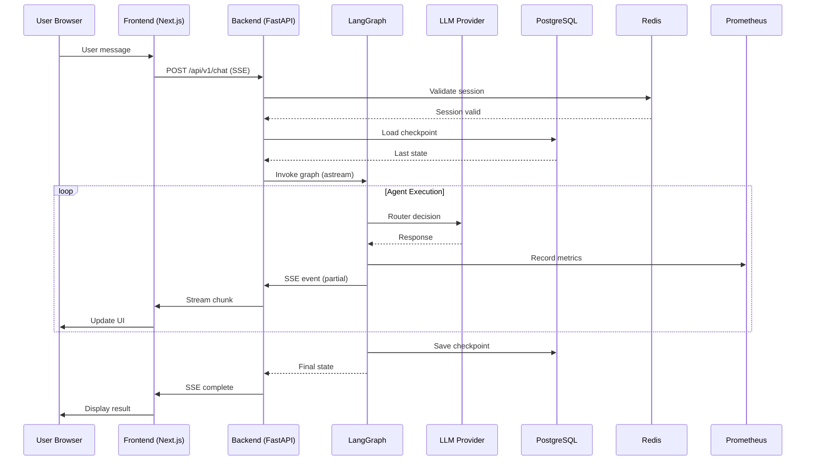

# Architecture LIA

> Architecture complète du système multi-agents avec LangGraph, observabilité enterprise et sécurité GDPR
> **Version**: 6.2 (Architecture v3.3 + evolution Features: Web Fetch, MCP Per-User, MCP Admin Per-Server, Multi-Channel Telegram, Heartbeat Autonome) - 2026-03-04

## 📋 Table des Matières

- [Vue d'Ensemble](#vue-densemble)
- [Principes Architecturaux](#principes-architecturaux)
- [Architecture Globale](#architecture-globale)
- [Architecture Backend](#architecture-backend)
- [Architecture Frontend](#architecture-frontend)
- [Architecture Multi-Agents](#architecture-multi-agents)
- [INTELLIPLANNER](#intelliplanner---orchestration-avancée)
- [Gestion de l'État](#gestion-de-létat)
- [Sécurité & Authentification](#sécurité--authentification)
- [Observabilité](#observabilité)
- [Patterns & Best Practices](#patterns--best-practices)
- [Scalabilité & Performance](#scalabilité--performance)
- [Infrastructure Avancée](#-infrastructure-avancée)
  - [Background Jobs & Scheduler](#background-jobs--scheduler-apscheduler)
  - [Reminder Notifications](#reminder-notification-job-adr-051)
- [Fonctionnalités v6.0](#-fonctionnalités-v60)
  - [Skills System](#skills-system)
  - [Voice Mode](#voice-mode)
  - [Interest Learning](#interest-learning-system)
  - [OAuth Health Check](#oauth-health-check)
  - [Hybrid Memory Search](#hybrid-memory-search)
- [Fonctionnalités v6.1](#-fonctionnalités-v61)
  - [Google API Tracking](#google-api-tracking)
  - [Consumption Exports](#consumption-exports)
- [Fonctionnalités v6.2 (evolution)](#-fonctionnalités-v62-evolution)
  - [Web Fetch Tool](#web-fetch-tool-evolution-f1)
  - [MCP Per-User](#mcp-per-user-evolution-f2)
  - [Admin MCP Per-Server Routing](#admin-mcp-per-server-routing-evolution-f25)
  - [Multi-Channel Telegram](#multi-channel-telegram-evolution-f3)
  - [Heartbeat Autonome](#heartbeat-autonome-evolution-f5)
- [Références](#références)

---

## 🎯 Vue d'Ensemble

LIA est une **plateforme d'assistant conversationnel entreprise** construite sur une architecture micro-services modulaire avec orchestration multi-agents via LangGraph.

### Caractéristiques Principales

- **Monorepo** : Backend Python + Frontend Next.js avec workspaces PNPM
- **Domain-Driven Design (DDD)** : 10 bounded contexts isolés
- **Architecture Async-First** : FastAPI async, SQLAlchemy async, asyncio natif
- **Stateless Backend** : State centralisé (PostgreSQL checkpoints + Redis sessions)
- **Event-Driven** : SSE streaming pour communication temps-réel
- **Multi-Provider LLM** : Abstraction via Factory pattern (6 providers supportés)
- **Enterprise-Grade Observability** : Prometheus, Grafana, Loki, Tempo, Langfuse

### Métriques Projet

| Métrique | Valeur |
|----------|--------|
| **Lignes de Code** | 150,000+ |
| **Fichiers** | 1,500+ |
| **Modules Python** | 300+ |
| **Tests** | 2,300+ |
| **Métriques Prometheus** | 500+ |
| **Dashboards Grafana** | 15 |
| **API Endpoints** | 80+ |
| **LLM Providers** | 6 |
| **Agents** | 10 |
| **Tools** | 50+ |
| **Fichiers Prompts** | 45 |
| **Langues i18n** | 6 |

---

## 🏛️ Principes Architecturaux

### 1. Domain-Driven Design (DDD)

Chaque domaine est un **bounded context** isolé avec :
- Ses propres modèles (SQLAlchemy)
- Son repository (CRUD)
- Son service layer (business logic)
- Ses schemas Pydantic (API contracts)

**16 Domaines** :
1. **agents** - Orchestration multi-agents, 10 agents actifs, 50+ tools (cœur du système)
2. **auth** - Authentification et autorisation
3. **users** - Gestion utilisateurs
4. **connectors** - Intégrations externes (Google, Apple iCloud, Microsoft 365)
5. **conversations** - Persistence conversations (checkpoints)
6. **chat** - Routing messages et SSE streaming
7. **llm** - Pricing et cost tracking LLM
8. **google_api** - Google Maps Platform tracking et pricing (v6.1)
9. **personalities** - Personnalités assistant (ton, style réponses)
10. **voice** - Synthèse vocale TTS (Edge/OpenAI) et STT (Whisper)
11. **memories** - Mémoire long-terme sémantique (pgvector + BM25)
12. **interests** - Interest Learning System (extraction automatique)
13. **system_settings** - Configuration système et préférences globales
14. **scheduled_actions** - Actions planifiées récurrentes (APScheduler CronTrigger)
15. **user_mcp** - Serveurs MCP utilisateur (CRUD per-user, Model Context Protocol, auto-génération de description LLM)
16. **channels** - Canaux de messagerie externes (Telegram) avec OTP linking, HITL inline keyboards, voice STT

### 2. Async-First

**Tout est asynchrone** pour maximiser la concurrence :
```python
# FastAPI routes
@router.post("/chat")
async def process_message(...):
    async with uow:  # Async context manager
        result = await service.process_message(...)
    return result

# SQLAlchemy queries
async with AsyncSession() as session:
    users = await session.execute(select(User))

# LangGraph nodes
async def router_node(state: MessagesState) -> dict:
    response = await llm.ainvoke(messages)
    return {"routing_history": [response]}
```

### 3. Separation of Concerns

**Layered Architecture** :
```
Presentation Layer (API Routes)
    ↓
Service Layer (Business Logic)
    ↓
Repository Layer (Data Access)
    ↓
Infrastructure Layer (Database, Cache, LLM)
```

### 4. Immutability & Functional Patterns

- State updates via **reducers** (LangGraph)
- No in-place mutations
- Pure functions où possible
- Type hints exhaustifs (Pydantic models)

### 5. Observability as Code

- Métriques Prometheus embarquées dans le code
- Logs structurés (structlog) avec contexte
- Distributed tracing avec trace_id propagation
- PII filtering automatique

---

## 🏗️ Architecture Globale

### Diagramme de Déploiement

```
┌────────────────────────────────────────────────────────────────────┐
│                          USERS (Browsers)                           │
└────────────────────────────┬───────────────────────────────────────┘
                             │ HTTPS
                             │
┌────────────────────────────┴───────────────────────────────────────┐
│                      CDN / Load Balancer                            │
│                     (Cloudflare / AWS ALB)                          │
└────────────────────┬───────────────────────┬───────────────────────┘
                     │                       │
        ┌────────────┴──────────┐   ┌───────┴────────────┐
        │  Frontend (Next.js)   │   │  Backend (FastAPI) │
        │  - SSR Pages          │   │  - REST API        │
        │  - Static Assets      │   │  - SSE Streaming   │
        │  - Client State       │   │  - WebSocket (fut) │
        └───────────────────────┘   └──────┬─────────────┘
                                           │
        ┌──────────────────────────────────┼──────────────┐
        │                                  │              │
┌───────┴─────────┐  ┌──────────────┴─────┴───┐  ┌──────┴────────┐
│  PostgreSQL 16  │  │      Redis 7            │  │ External APIs │
│  - User data    │  │  - Sessions (BFF)       │  │ - OpenAI      │
│  - Conversations│  │  - Cache (tools)        │  │ - Anthropic   │
│  - Checkpoints  │  │  - Locks (OAuth)        │  │ - Google APIs │
│  - LLM Pricing  │  │  - Rate limiting        │  │ - Langfuse    │
└─────────────────┘  └────────────────────────┘  └───────────────┘
        │                                                │
        │                                                │
┌───────┴────────────────────────────────────────────────┴──────────┐
│                  Observability Stack                               │
│  ┌──────────────┐  ┌──────────┐  ┌──────┐  ┌────────────────┐   │
│  │  Prometheus  │  │ Grafana  │  │ Loki │  │ Tempo (Traces) │   │
│  │  (Metrics)   │  │(Dashboards│  │(Logs)│  │  (Distributed) │   │
│  └──────────────┘  └──────────┘  └──────┘  └────────────────┘   │
└──────────────────────────────────────────────────────────────────┘
```

### Flow de Requête Typique



---

## 🔧 Architecture Backend

### Structure Projet

```
apps/api/src/
├── main.py                      # Application entry point (FastAPI app)
├── api/                         # HTTP layer
│   └── v1/
│       ├── routes.py            # Main router with all sub-routers
│       └── dependencies.py      # FastAPI dependencies
│
├── core/                        # Core infrastructure
│   ├── config/                  # ⭐ Modular configuration (ADR-009)
│   │   ├── __init__.py          #    Settings (multiple inheritance composition)
│   │   ├── security.py          #    SecuritySettings (OAuth, JWT, cookies)
│   │   ├── database.py          #    DatabaseSettings (PostgreSQL, Redis)
│   │   ├── observability.py     #    ObservabilitySettings (OTEL, Prometheus)
│   │   ├── llm.py               #    LLMSettings (6 providers configs)
│   │   ├── agents.py            #    AgentsSettings (SSE, HITL, Router)
│   │   ├── connectors.py        #    ConnectorsSettings (Google APIs, rate limiting)
│   │   └── advanced.py          #    AdvancedSettings (pricing, i18n, features)
│   ├── bootstrap.py             # Initialization functions (testable)
│   ├── constants.py             # Application constants
│   ├── exceptions.py            # Custom exceptions
│   ├── repository.py            # BaseRepository[T] generic
│   ├── unit_of_work.py          # UnitOfWork pattern
│   └── oauth/                   # OAuth 2.1 implementation
│       ├── flow_handler.py      # PKCE flow
│       ├── providers/
│       │   ├── google.py        # Google OAuth provider
│       │   └── microsoft.py     # Microsoft Entra ID OAuth provider
│       └── exceptions.py
│
├── domains/                     # Domain layer (DDD)
│   ├── agents/                  # ⭐ Multi-agent system (primary domain)
│   │   ├── models.py            # SQLAlchemy models (if any)
│   │   ├── domain_schemas.py   # Domain-specific schemas
│   │   ├── api/                 # API layer for agents
│   │   │   ├── router.py
│   │   │   ├── schemas.py       # Request/Response DTOs
│   │   │   └── service.py       # Service layer
│   │   ├── graph.py             # LangGraph StateGraph builder
│   │   ├── nodes/               # LangGraph node functions (Architecture v3)
│   │   │   ├── router_node_v3.py   # Query analysis + routing
│   │   │   ├── planner_node_v3.py  # Smart planning with filtered catalogue
│   │   │   ├── approval_gate_node.py
│   │   │   ├── task_orchestrator_node.py
│   │   │   ├── response_node.py
│   │   │   ├── semantic_validator_node.py
│   │   │   └── decorators.py    # @node_with_metrics
│   │   ├── orchestration/       # Plan execution (v2.0)
│   │   │   ├── parallel_executor.py  # Main: asyncio.gather execution
│   │   │   ├── plan_schemas.py       # ExecutionPlan, ExecutionStep
│   │   │   ├── dependency_graph.py   # Wave calculation
│   │   │   ├── validator.py          # Plan validation
│   │   │   ├── plan_editor.py        # HITL plan modifications
│   │   │   ├── condition_evaluator.py
│   │   │   ├── adaptive_replanner.py
│   │   │   └── query_engine/         # Query execution
│   │   ├── registry/            # Agent & Tool registry
│   │   │   ├── agent_registry.py
│   │   │   ├── catalogue.py
│   │   │   ├── catalogue_loader.py
│   │   │   ├── manifest_builder.py
│   │   │   └── domain_taxonomy.py
│   │   ├── context/             # Tool context management
│   │   │   ├── manager.py       # ToolContextManager
│   │   │   ├── resolver.py      # Reference resolver
│   │   │   └── catalogue_manifests.py
│   │   ├── services/            # Domain services
│   │   │   ├── hitl/            # Human-in-the-Loop
│   │   │   │   ├── question_generator.py
│   │   │   │   ├── validator.py
│   │   │   │   └── resumption_strategies.py
│   │   │   ├── approval/        # Approval strategies
│   │   │   │   ├── evaluator.py
│   │   │   │   └── strategies.py
│   │   │   ├── streaming/
│   │   │   │   └── service.py
│   │   │   └── orchestration/
│   │   │       └── service.py
│   │   ├── tools/               # LangChain tools
│   │   │   ├── base.py          # ConnectorTool abstract
│   │   │   ├── decorators.py    # @connector_tool
│   │   │   ├── google_contacts_tools.py
│   │   │   └── schemas.py
│   │   ├── prompts/             # Versioned prompts (consolidated to v1)
│   │   │   ├── prompt_loader.py # LRU cached loader
│   │   │   └── v1/              # 26 prompts (consolidated)
│   │   │       └── fewshot/     # Dynamic few-shot examples (16 files)
│   │   └── utils/               # Domain utilities
│   │       ├── hitl_store.py
│   │       ├── message_windowing.py
│   │       ├── message_filters.py
│   │       ├── token_utils.py
│   │       └── state_cleanup.py
│   │
│   ├── auth/                    # Authentication domain
│   │   ├── models.py            # User model
│   │   ├── repository.py
│   │   ├── service.py
│   │   ├── router.py
│   │   └── schemas.py
│   │
│   ├── users/                   # User management
│   ├── connectors/              # OAuth connectors (Google, Apple, Microsoft 365)
│   ├── conversations/           # Conversation persistence
│   ├── chat/                    # Chat routing
│   ├── llm/                     # LLM pricing
│   ├── attachments/             # File attachments & vision analysis (evolution F4)
│   ├── skills/                  # Skills system (agentskills.io) — SKILL.md files, cache, LLM activation
│   └── user_mcp/                # Per-user MCP server management (CRUD, DDD, LLM description)
│
└── infrastructure/              # Cross-cutting infrastructure
    ├── cache/                   # Redis abstractions
    │   ├── redis.py             # Redis client
    │   └── session_store.py     # SessionStore (BFF)
    ├── rate_limiting/           # ⭐ Distributed rate limiting (Phase 2.4)
    │   └── redis_limiter.py     #    RedisRateLimiter (sliding window, Lua scripts)
    ├── llm/                     # LLM infrastructure
    │   ├── factory.py           # LLM factory with multi-provider
    │   ├── providers/
    │   │   └── adapter.py       # ProviderAdapter (temperature filtering)
    │   ├── instrumentation.py   # Langfuse callbacks
    │   ├── invoke_helpers.py    # Node metadata enrichment
    │   └── structured_output.py # Multi-provider structured output
    ├── observability/           # Observability
    │   ├── callbacks.py         # MetricsCallbackHandler
    │   ├── metrics_agents.py    # Prometheus metrics
    │   ├── pii_filter.py        # GDPR PII filtering
    │   └── token_extractor.py   # Token extraction
    ├── external/                # External API clients
    │   └── currency_api.py
    ├── scheduler/               # Background jobs (APScheduler)
    │   ├── currency_sync.py      # Currency rates sync (daily)
    │   ├── reminder_notification.py # Reminder processing (@every 1min)
    │   └── scheduled_action_executor.py # Scheduled actions (@every 60s)
    └── mcp/                     # MCP (Model Context Protocol) integration
        ├── client_manager.py    # Admin + per-user MCP client lifecycle
        ├── auth.py              # MCP server authentication
        ├── oauth_flow.py        # OAuth 2.1 flow for MCP servers
        ├── tool_adapter.py      # MCP tool → LangChain tool adaptation
        ├── user_tool_adapter.py # Per-user MCP tool binding
        ├── user_pool.py         # Connection pool (per-user sessions)
        ├── user_context.py      # ContextVar[UserMCPToolsContext]
        ├── security.py          # MCP transport security
        ├── registration.py      # Server discovery & registration
        └── schemas.py           # MCP-specific Pydantic schemas
```

### Patterns Clés

#### 1. Repository Pattern

```python
# apps/api/src/core/repository.py
class BaseRepository(Generic[ModelType]):
    """Generic repository for type-safe CRUD operations."""

    def __init__(self, model: Type[ModelType], session: AsyncSession):
        self.model = model
        self.session = session

    async def get_by_id(self, id: UUID) -> ModelType | None:
        result = await self.session.execute(
            select(self.model).where(self.model.id == id)
        )
        return result.scalars().first()

    async def create(self, obj: ModelType) -> ModelType:
        self.session.add(obj)
        await self.session.flush()
        await self.session.refresh(obj)
        return obj

# Usage in domain
class UserRepository(BaseRepository[User]):
    async def get_by_email(self, email: str) -> User | None:
        result = await self.session.execute(
            select(User).where(User.email == email)
        )
        return result.scalars().first()
```

#### 2. Unit of Work Pattern

```python
# apps/api/src/core/unit_of_work.py
class UnitOfWork:
    """Transaction boundary for repositories."""

    def __init__(self, session_factory: async_sessionmaker):
        self.session_factory = session_factory

    async def __aenter__(self):
        self.session = self.session_factory()

        # Initialize all repositories
        self.users = UserRepository(User, self.session)
        self.connectors = ConnectorRepository(Connector, self.session)
        # ...

        return self

    async def __aexit__(self, exc_type, exc_val, exc_tb):
        if exc_type:
            await self.session.rollback()
        else:
            await self.session.commit()
        await self.session.close()

# Usage
async with UnitOfWork(session_factory) as uow:
    user = await uow.users.get_by_id(user_id)
    user.name = "Updated"
    # Auto-commit on exit
```

#### 3. Service Layer Pattern

```python
# Domain service encapsulates business logic
class AgentService:
    def __init__(
        self,
        uow: UnitOfWork,
        graph: CompiledStateGraph,
        checkpointer: AsyncPostgresSaver,
    ):
        self.uow = uow
        self.graph = graph
        self.checkpointer = checkpointer

    async def process_message(
        self,
        conversation_id: UUID,
        user_message: str,
        user_id: UUID,
    ) -> AsyncGenerator[ServerSentEvent, None]:
        """
        Business logic for processing a user message.
        Orchestrates: graph invocation, checkpoint loading, streaming.
        """
        # Load conversation
        async with self.uow:
            conversation = await self.uow.conversations.get_by_id(conversation_id)

        # Create config with thread_id for checkpoint loading
        config = RunnableConfig(
            configurable={"thread_id": str(conversation_id)}
        )

        # Stream graph execution
        async for event in self.graph.astream(input_state, config=config):
            yield ServerSentEvent(data=json.dumps(event))
```

---

## ⚙️ Configuration & Infrastructure

### Configuration Modulaire (ADR-009)

**Problème résolu** : Le fichier monolithique `config.py` (1782 lignes) était devenu difficile à maintenir, tester et naviguer.

**Solution** : Split en **9 modules thématiques** via multiple inheritance pattern.

#### Structure

```
src/core/config/
├── __init__.py           # Settings class (composition via multiple inheritance)
├── security.py           # SecuritySettings (OAuth, JWT, session cookies)
├── database.py           # DatabaseSettings (PostgreSQL, Redis, pool config)
├── observability.py      # ObservabilitySettings (OTEL, Prometheus, Langfuse)
├── llm.py                # LLMSettings (6 LLM providers configs)
├── agents.py             # AgentsSettings (SSE, HITL, Router, Planner, Memory)
├── connectors.py         # ConnectorsSettings (Google APIs, rate limiting)
├── voice.py              # VoiceSettings (Edge TTS, voice comments)
└── advanced.py           # AdvancedSettings (pricing, i18n, feature flags)
```

#### Multiple Inheritance Composition

```python
# src/core/config/__init__.py
from .security import SecuritySettings
from .database import DatabaseSettings
# ... autres imports

class Settings(
    SecuritySettings,
    DatabaseSettings,
    ObservabilitySettings,
    LLMSettings,
    AgentsSettings,
    ConnectorsSettings,
    VoiceSettings,
    AdvancedSettings,
    BaseSettings  # Pydantic base (MUST be last for MRO)
):
    """
    Unified settings via multiple inheritance.
    Each mixin provides domain-specific configuration.
    """
    model_config = SettingsConfigDict(
        env_file=".env",
        env_file_encoding="utf-8",
        case_sensitive=False
    )
```

**Usage (rétrocompatible 100%)** :

```python
# Import inchangé
from src.core.config import settings

# Accès direct à tous les fields (identique)
settings.openai_api_key
settings.postgres_url
settings.redis_url
settings.router_confidence_high
```

**Bénéfices** :
- ✅ **Maintenabilité** : 9×~200 lignes vs 1782 lignes
- ✅ **Testabilité** : Tests unitaires par module
- ✅ **Performance IDE** : Autocomplétion 3× plus rapide
- ✅ **SRP respecté** : 1 module = 1 préoccupation
- ✅ **Rétrocompatibilité** : 0 breaking change

**Voir** : [ADR-009](./architecture/ADR-009-Config-Module-Split.md)

---

### Rate Limiting Distribué (Phase 2.4)

**Implémentation** : Redis-based rate limiter avec sliding window algorithm.

#### Architecture

```python
# src/infrastructure/rate_limiting/redis_limiter.py
class RedisRateLimiter:
    """
    Distributed rate limiter using Redis + Lua scripts.

    Features:
    - Sliding window algorithm (precise rate limiting)
    - Atomic operations (Lua scripts, no race conditions)
    - Horizontal scaling (works across multiple instances)
    - Configurable limits per key
    """

    async def acquire(
        self,
        key: str,
        max_calls: int,
        window_seconds: int
    ) -> bool:
        """
        Acquire rate limit token.
        Returns True if allowed, False if rate limit exceeded.
        """
        lua_script = """
        local key = KEYS[1]
        local now = tonumber(ARGV[1])
        local window = tonumber(ARGV[2])
        local max_calls = tonumber(ARGV[3])

        -- Remove expired entries
        redis.call('ZREMRANGEBYSCORE', key, 0, now - window)

        -- Check current count
        local current = redis.call('ZCARD', key)

        if current < max_calls then
            -- Add new entry
            redis.call('ZADD', key, now, now)
            redis.call('EXPIRE', key, window)
            return 1  -- Allowed
        else
            return 0  -- Rate limited
        end
        """

        result = await self.redis.eval(
            lua_script,
            keys=[f"rate_limit:{key}"],
            args=[time.time(), window_seconds, max_calls]
        )
        return bool(result)
```

#### Configuration

```python
# src/core/config/security.py
class SecuritySettings(BaseSettings):
    rate_limit_per_minute: int = Field(60, description="API calls per minute")
    rate_limit_burst: int = Field(100, description="Burst allowance")
```

**Intégration** :

```python
# src/domains/connectors/clients/base_google_client.py
class BaseGoogleClient:
    def __init__(self, rate_limiter: RedisRateLimiter):
        self.rate_limiter = rate_limiter

    async def _make_request(self, url: str):
        # Check rate limit before API call
        allowed = await self.rate_limiter.acquire(
            key=f"google_api:{self.user_id}",
            max_calls=60,
            window_seconds=60
        )

        if not allowed:
            raise RateLimitExceeded("API rate limit exceeded")

        # Make request
        response = await self.session.get(url)
        return response
```

**Bénéfices** :
- ✅ **Distributed** : Works across multiple backend instances
- ✅ **Atomic** : Lua scripts prevent race conditions
- ✅ **Scalable** : Redis O(log N) operations
- ✅ **Configurable** : Per-endpoint, per-user limits

**Tests** : 35 tests (unit + integration + multi-process)

**Voir** : [RATE_LIMITING.md](./technical/RATE_LIMITING.md)

---

### Local E5 Embeddings (ADR-049)

**Problème résolu** : Remplacer OpenAI text-embedding-3-small ($0.02/1M tokens, 100-300ms latency) par embeddings 100% locaux.

**Solution** : `intfloat/multilingual-e5-small` via sentence-transformers.

#### Architecture

```python
# src/infrastructure/llm/local_embeddings.py
class LocalE5Embeddings:
    """
    LangChain-compatible local embeddings.

    Features:
    - Zero API cost
    - 100+ langues supportées
    - ~50ms latency (vs 100-300ms API)
    - ARM64 native (Raspberry Pi 5)
    """

    def __init__(self, model_name="intfloat/multilingual-e5-small"):
        self.model = SentenceTransformer(model_name, device="cpu")

    def embed_query(self, text: str) -> list[float]:
        return self.model.encode(text, normalize_embeddings=True).tolist()
```

#### Performance

| Métrique | OpenAI API | Local E5 |
|----------|------------|----------|
| Cost | $0.02/1M tokens | **$0** |
| Latency | 100-300ms | **~50ms** |
| Q/A Accuracy | 0.61 | **0.90 (+48%)** |
| Languages | 100+ | 100+ |
| Offline | Non | **Oui** |

**Usages** :
- Semantic Memory Store (mémoire long-terme)
- Semantic Tool Router (sélection tools)
- pgvector semantic search

**Voir** : [LOCAL_EMBEDDINGS.md](./technical/LOCAL_EMBEDDINGS.md) | [ADR-049](./architecture/ADR-049-local-e5-embeddings.md)

---

### Semantic Tool Router (ADR-048)

**Problème résolu** : Le routing par mots-clés nécessitait maintenance i18n par langue et produisait des scores faibles (~0.60) par dilution sémantique.

**Solution** : Architecture à deux niveaux avec `SemanticDomainSelector` + `SemanticToolSelector`.

#### Architecture Deux Niveaux

```
┌─────────────────────────────────────────────────────────────────────┐
│                    SEMANTIC ROUTER PIPELINE                          │
├─────────────────────────────────────────────────────────────────────┤
│                                                                      │
│  Query → E5 Embeddings (384D)                                       │
│                  │                                                   │
│                  ▼                                                   │
│  ┌──────────────────────────────────────────────────────────────┐   │
│  │ NIVEAU 1: SemanticDomainSelector                              │   │
│  │ 11 domaines → Filtrage → 1-3 domaines pertinents             │   │
│  │ Seuils: PRIMARY=0.75, SECONDARY=0.65                         │   │
│  └──────────────────────────────────────────────────────────────┘   │
│                  │                                                   │
│                  ▼                                                   │
│  ┌──────────────────────────────────────────────────────────────┐   │
│  │ NIVEAU 2: SemanticToolSelector                                │   │
│  │ N tools (du domaine) → Filtrage → K tools pertinents         │   │
│  │ Seuils: PRIMARY=0.70, SECONDARY=0.60                         │   │
│  └──────────────────────────────────────────────────────────────┘   │
│                  │                                                   │
│                  ▼                                                   │
│  RÉSULTAT: 45+ tools → 3-8 tools (réduction 80-90%)                 │
│                                                                      │
└─────────────────────────────────────────────────────────────────────┘
```

#### Stratégie Max-Pooling

```python
# Pour chaque domaine/tool, calcule MAX(sim(query, keyword_i))
# Évite la dilution par moyenne des keywords peu pertinents

score = max(
    cosine_similarity(query_emb, kw_emb)
    for kw_emb in keyword_embeddings
)
```

#### Double Threshold Strategy

| Score | Niveau | Action |
|-------|--------|--------|
| ≥ 0.75/0.70 | PRIMARY | Sélection haute confiance |
| ≥ 0.65/0.60 | SECONDARY | Fallback si aucun PRIMARY |
| < 0.65/0.60 | - | Non sélectionné |

#### Domain Taxonomy (11 domaines)

```python
# src/domains/agents/domain_taxonomy.py
DOMAINS = [
    "weather",      # Météo et prévisions
    "calendar",     # Événements et rendez-vous
    "reminders",    # Rappels et notifications
    "tasks",        # Tâches et to-do
    "contacts",     # Contacts et communications
    "notes",        # Notes et mémos
    "search",       # Recherche d'informations
    "memory",       # Mémoire conversationnelle
    "preferences",  # Préférences utilisateur
    "location",     # Localisation et géographie
    "general",      # Conversations générales (fallback)
]
```

**Bénéfices** :
- ✅ **80-90% réduction tokens** : De 15K à 1.5-3K tokens/requête
- ✅ **Zero i18n maintenance** : Embeddings multilingues natifs (E5)
- ✅ **+48% accuracy** : 0.90 vs 0.61 baseline
- ✅ **Zero API cost** : Inférence locale (<50ms)

**Voir** : [SEMANTIC_ROUTER.md](./technical/SEMANTIC_ROUTER.md) | [ADR-048](./architecture/ADR-048-Semantic-Tool-Router.md)

---

### Connecteurs Google (OAuth 2.1 + APIs)

**Architecture multi-domaine** : 6 clients Google, 3 clients Apple iCloud, 4 clients Microsoft 365 avec clients séparés par API.

#### Clients Implémentés

```
src/domains/connectors/clients/
├── base_google_client.py         # Base abstraite commune
│   ├── OAuth 2.1 token refresh automatique
│   ├── Rate limiting distribué Redis
│   ├── HTTP client avec connection pooling
│   ├── Circuit breaker (Sprint 16)
│   └── Retry logic avec exponential backoff
│
├── google_people_client.py       # Google People API v1 (Contacts)
│   ├── search_contacts()         # Recherche fuzzy
│   ├── list_contacts()           # Liste paginée (max 1000)
│   ├── get_contact()             # Détails complets
│   ├── create/update/delete      # CRUD complet (LOT 5.4 HITL)
│   └── Redis cache (list: 5min, search: 3min)
│
├── google_gmail_client.py        # Gmail API v1 (Emails)
│   ├── search_emails()           # Syntaxe Gmail complète
│   ├── get_message()             # Détails + MIME parsing
│   ├── send_email()              # Envoi text/html + CC/BCC
│   ├── reply/forward             # Réponses et transferts
│   └── Redis cache (search: 5min, details: 3min)
│
├── google_calendar_client.py     # Google Calendar API v3
│   ├── list_calendars()          # Liste calendriers utilisateur
│   ├── list_events()             # Recherche événements
│   ├── get_event()               # Détails événement
│   ├── create/update/delete      # CRUD événements (LOT 9 HITL)
│   └── Redis cache (list: 60s, details: 120s)
│
├── google_tasks_client.py        # Google Tasks API v1
│   ├── list_task_lists()         # Liste des listes
│   ├── list_tasks()              # Tâches d'une liste
│   ├── create/update/complete    # Gestion tâches
│   └── Redis cache (list: 60s, details: 120s)
│
├── google_drive_client.py        # Google Drive API v3
│   ├── search_files()            # Recherche fichiers
│   ├── list_files()              # Liste avec folder navigation
│   ├── get_file()                # Métadonnées
│   ├── download_content()        # Téléchargement
│   └── Redis cache (list: 60s, details: 300s)
│
├── google_places_client.py       # Google Places API (New)
│   ├── text_search()             # Recherche textuelle
│   ├── nearby_search()           # Recherche proximité
│   ├── get_place_details()       # Détails lieu
│   ├── autocomplete()            # Auto-complétion
│   └── Redis cache (search: 5min, details: 10min)
│
├── base_microsoft_client.py      # Microsoft Graph base (3 hook overrides + OData pagination)
│
├── microsoft_outlook_client.py  # Microsoft Graph /me/messages (Outlook)
│   ├── search_emails()          # $search KQL
│   ├── send/reply/forward       # Graph API actions
│   └── Normalizers → Gmail format
│
├── microsoft_calendar_client.py # Microsoft Graph /me/calendarView
│   ├── list_events()            # calendarView (expand recurrences)
│   ├── create/update/delete     # PATCH semantics
│   └── Normalizers → Google Calendar format
│
├── microsoft_contacts_client.py # Microsoft Graph /me/contacts
│   ├── search/list/CRUD         # OData pagination
│   └── Normalizers → Google People format
│
├── microsoft_tasks_client.py    # Microsoft Graph /me/todo/lists
│   ├── list/create/complete     # @default → first list
│   └── Normalizers → Google Tasks format
│
└── src/domains/voice/
    ├── client.py                 # EdgeTTSClient (Microsoft Neural voices - GRATUIT)
    │   ├── synthesize()          # Génération audio MP3
    │   ├── Streaming support     # Audio streaming chunks
    │   └── Multilingual Neural   # FR: Remy (M), Vivienne (F)
    ├── service.py                # VoiceCommentService
    │   └── generate_voice_comment()  # Génération commentaire vocal
    └── schemas.py                # VoiceRequest, VoiceResponse
```

#### BaseGoogleClient (Pattern Template Method)

**Responsabilités communes** :

```python
class BaseGoogleClient(ABC):
    """
    Base abstraite pour tous les clients Google APIs.

    Features:
    - OAuth 2.1 token refresh automatique avec Redis lock
    - Rate limiting (configurable, default 10 req/s)
    - HTTP client persistent (httpx AsyncClient)
    - Retry logic avec exponential backoff (3 retries max)
    - Error handling standardisé
    """

    # Subclasses MUST define
    connector_type: ConnectorType  # GOOGLE_CONTACTS, GOOGLE_GMAIL
    api_base_url: str              # https://people.googleapis.com/v1

    async def _make_request(
        self,
        method: str,
        endpoint: str,
        **kwargs
    ) -> dict[str, Any]:
        """
        Template method - implémente le flow complet:
        1. Check access token expiry
        2. Auto-refresh si nécessaire (avec Redis lock)
        3. Apply rate limiting
        4. Execute HTTP request
        5. Handle errors (401 → refresh, 429 → backoff)
        6. Return parsed JSON
        """
```

**Bénéfices** :
- ✅ **DRY** : -300 lignes de code dupliqué
- ✅ **Consistency** : OAuth refresh identique pour tous clients
- ✅ **Extensibility** : Nouveau client = override 2 properties
- ✅ **Testability** : Base class testée indépendamment

#### GooglePeopleClient (Contacts API v1)

**Fonctionnalités** :

```python
# Recherche fuzzy multi-critères
results = await client.search_contacts(
    query="John Doe",
    max_results=25,
    fields=["names", "emailAddresses", "phoneNumbers"]  # Field projection
)

# Liste complète avec pagination
all_contacts = await client.list_contacts(
    page_size=100,
    max_results=1000  # API limit
)

# Détails complets d'un contact
contact = await client.get_contact(
    resource_name="people/c1234567890",
    fields=["names", "emailAddresses", "phoneNumbers", "organizations", "photos"]
)
```

**Cache Strategy** :
- List operations : TTL 5min (données stables)
- Search operations : TTL 3min (moins prévisible)
- Cache key : includes `user_id` + `query` + `fields` (prevent collisions)

**Pydantic Models** : 14+ types structurés
- `ContactName`, `ContactEmail`, `ContactPhone`, `ContactAddress`
- `ContactBasic` (minimal), `ContactDetailed` (complet)
- `SearchContactsOutput`, `ListContactsOutput`, `GetContactDetailsOutput`

**Tools LangChain** : 3 outils exposés
- `search_contacts_tool` : Recherche intelligente
- `list_contacts_tool` : Liste complète
- `get_contact_details_tool` : Détails contact

#### GoogleGmailClient (Gmail API v1)

**Fonctionnalités** :

```python
# Recherche avec syntaxe Gmail complète
emails = await client.search_emails(
    query="from:john@example.com subject:invoice is:unread after:2025/01/01",
    max_results=50
)

# Détails email + MIME parsing
message = await client.get_message(
    message_id="18a4f2b3c5d6e7f8",
    format="full",  # minimal, metadata, full, raw
    include_body=True
)

# Envoi email (MIME encoding automatique)
result = await client.send_email(
    to="recipient@example.com",
    subject="Meeting Confirmation",
    body="Hi John,\n\nConfirming meeting tomorrow.",
    cc="manager@example.com",
    is_html=False
)
```

**HTML → Text Conversion** :

```python
class HTMLToTextConverter(HTMLParser):
    """
    Convert HTML to readable plain text (for LLM consumption).

    Preserves structure:
    - Paragraphs: Double newlines
    - Links: [lien](url) markdown format
    - Lists: Bullet points
    - Headers: Newlines before/after

    Ignores: <style>, <script>, non-content tags
    """
```

**Defense in Depth (Session 39 fix)** :

```python
# Layer 1 (Prevention): Planner prompts instruct LLM to add "in:anywhere" by default
# Layer 2 (Fallback): Code enforces new default if LLM forgot

if "label:" not in query and "in:" not in query:
    if user_requested_inbox_only:  # Semantic keywords detection
        query = f"{query} label:inbox"
    else:
        query = f"{query} in:anywhere"  # NEW DEFAULT (all emails, not just inbox)
```

**Semantic Label Mapping** :

| User Query (FR/EN) | Gmail Query |
|--------------------|-------------|
| "boîte de réception" / "inbox" | `label:INBOX` |
| "envoyés" / "sent" | `label:SENT` |
| "brouillons" / "drafts" | `label:DRAFT` |
| "corbeille" / "trash" | `label:TRASH` |
| "spam" / "indésirables" | `label:SPAM` |
| "importants" / "starred" | `label:STARRED` |
| "non lus" / "unread" | `is:unread` |

**Tools LangChain** : 3 outils exposés
- `search_emails_tool` : Recherche intelligente
- `get_email_details_tool` : Détails email + body parsing
- `send_email_tool` : Envoi email (HITL approval obligatoire)

#### OAuth Flow & Token Management

```python
# OAuth 2.1 avec PKCE flow
# 1. User clicks "Connect Google"
authorization_url = await oauth_handler.get_authorization_url(
    scopes=[
        "https://www.googleapis.com/auth/contacts.readonly",
        "https://www.googleapis.com/auth/gmail.readonly",
        "https://www.googleapis.com/auth/gmail.send"
    ],
    state_token="<random>",  # CSRF protection
    code_verifier="<random>",  # PKCE verifier
    code_challenge="<sha256(verifier)>",  # PKCE challenge
)

# 2. User approves on Google
# 3. Google redirects to callback with code
tokens = await oauth_handler.exchange_code_for_tokens(
    code="<authorization_code>",
    code_verifier="<saved_verifier>"
)

# 4. Store encrypted credentials in DB
await connector_repository.create(
    user_id=user.id,
    connector_type=ConnectorType.GOOGLE_GMAIL,
    credentials={
        "access_token": encrypt(tokens.access_token),
        "refresh_token": encrypt(tokens.refresh_token),
        "expires_at": tokens.expires_at
    }
)

# 5. Auto-refresh via BaseGoogleClient (transparent)
# When access_token expired:
if datetime.now(UTC) >= credentials.expires_at - timedelta(minutes=5):
    # Acquire Redis lock (prevent concurrent refreshes)
    async with redis_lock(f"oauth_refresh:{user_id}"):
        new_tokens = await oauth_handler.refresh_access_token(
            refresh_token=credentials.refresh_token
        )
        await connector_repository.update_credentials(...)
```

**Security** :
- ✅ PKCE obligatoire (S256)
- ✅ State token single-use (CSRF protection)
- ✅ Credentials encryption (Fernet)
- ✅ Redis lock on refresh (prevent race conditions)
- ✅ Scopes validation (prevent scope creep)

**Voir** :
- [ADR-010: Email Domain Renaming](./architecture/ADR-010-Email-Domain-Renaming.md) - Architecture multi-provider
- [EMAIL_FORMATTER.md](./technical/EMAIL_FORMATTER.md) - Formatage emails
- [OAUTH.md](./technical/OAUTH.md) - OAuth 2.1 flow complet

---

### Orchestration Multi-Domaines

> **IMPORTANT**: Cette section décrit l'architecture v1.0 **obsolète**. L'architecture actuelle (v2.0)
> utilise `parallel_executor.py` avec `asyncio.gather()`. Voir [MULTI_DOMAIN_ARCHITECTURE.md](technical/MULTI_DOMAIN_ARCHITECTURE.md).
>
> **Composants supprimés en v2.0**:
> - `domain_handler.py`, `domain_registry.py`, `multi_domain_composer.py`, `relation_engine.py`, `plan_executor.py`
>
> **Composants actuels (v2.0)**:
> - `parallel_executor.py` - Exécution parallèle native asyncio
> - `task_orchestrator_node.py` - Dispatch des plans
> - `dependency_graph.py` - Calcul des vagues de dépendances

**Fonctionnalité clé** : Recherches complexes combinant plusieurs domaines (contacts + emails, emails + calendar, etc.).

#### Architecture v1.0 (Obsolète - pour référence historique)

```python
# [OBSOLETE] src/core/multi_domain_composer.py - Ce fichier n'existe plus
class MultiDomainComposer:
    """
    Orchestrates multi-domain query execution with:
    - Domain detection (confidence scoring)
    - Parallel execution (asyncio.gather)
    - Relation resolution (contacts ↔ emails)
    - Partial error handling (graceful degradation)
    """

    async def compose(
        self,
        agent_results: dict[str, Any],
        current_turn_id: int
    ) -> ComposedResult:
        """
        Compose results from multiple domains.

        Flow:
        1. Detect domains présents (DomainDetector per domain)
        2. Normalize to typed models (Pydantic)
        3. Resolve cross-domain relations
        4. Format for LLM consumption
        """
```

#### Cas d'Usage Typique

**Query** : "Trouve les emails de mes contacts qui travaillent dans une startup"

```python
# 1. Router détecte multi-domain query
router_output = {
    "intention": "actionable",
    "domains": ["contacts", "emails"],  # 2 domaines détectés
    "confidence": 0.92
}

# 2. Planner génère ExecutionPlan multi-step
plan = {
    "steps": [
        {
            "id": "step_1",
            "tool": "search_contacts",
            "args": {"query": "startup", "fields": ["names", "emailAddresses"]},
            "domain": "contacts"
        },
        {
            "id": "step_2",
            "tool": "search_emails",
            "args": {"query": "from:{contact_emails}"},  # Dynamic reference
            "domain": "emails",
            "depends_on": ["step_1"]  # Dependency
        }
    ]
}

# 3. TaskOrchestrator exécute en parallèle (quand dépendances OK)
results = await orchestrator.execute_plan(plan)
# Parallélisation automatique : step_1 puis step_2 (avec filter dynamique)

# 4. MultiDomainComposer compose les résultats
composed = await composer.compose(results)
# Output: {
#   "contacts": [12 contacts],
#   "emails": [47 emails],
#   "relations": [
#       {"contact_id": "c123", "email_ids": ["e456", "e789"]},
#       ...
#   ]
# }

# 5. RelationEngine resolve contacts ↔ emails
enriched = relation_engine.resolve(composed)
# Enrichit emails avec metadata contact (nom, organisation)
```

#### Composants

**1. DomainRegistry** (singleton, thread-safe)
```python
registry = DomainRegistry()
registry.register(ContactsDomainHandler())
registry.register(EmailsDomainHandler())

# Auto-detect domains in agent results
detected = registry.detect_domains(agent_results)
# Returns: [("contacts", 0.95), ("emails", 0.88)]
```

**2. DomainDetector** (per domain)
```python
class ContactsDomainDetector:
    def detect(self, data: dict) -> tuple[bool, float]:
        """
        Détecte si data contient des contacts.
        Returns: (is_present, confidence_score)
        """
        if "connections" in data or "resourceName" in data:
            return (True, 0.95)
        return (False, 0.0)
```

**3. RelationEngine** (cross-domain linking)
```python
class ContactsEmailsResolver:
    def resolve(self, contacts: list, emails: list) -> list[Relation]:
        """
        Link emails to contacts via email addresses.

        Algorithm:
        1. Extract email addresses from contacts
        2. Match email.from_email with contact emails
        3. Create bidirectional relations
        """
        relations = []
        contact_email_map = {
            email: contact
            for contact in contacts
            for email in contact.email_addresses
        }

        for email in emails:
            if email.from_email in contact_email_map:
                relations.append(Relation(
                    type="contact_sent_email",
                    source_domain="contacts",
                    source_id=contact.id,
                    target_domain="emails",
                    target_id=email.id
                ))

        return relations
```

**4. Partial Error Handling**
```python
# Si 1 domaine échoue, les autres continuent
try:
    contacts = await contacts_agent.execute()
except Exception as e:
    logger.warning("contacts_domain_failed", error=str(e))
    contacts = []  # Continue avec emails uniquement

try:
    emails = await emails_agent.execute()
except Exception:
    emails = []

# Compose avec données partielles
composed = composer.compose({
    "contacts": contacts,
    "emails": emails
})
# LLM reçoit : "J'ai trouvé 47 emails, mais je n'ai pas pu accéder aux contacts."
```

#### Bénéfices

- ✅ **Queries complexes** : "emails + contacts" en 1 requête
- ✅ **Parallel execution** : 2+ domaines simultanés (latence réduite)
- ✅ **Relation resolution** : Linking automatique cross-domain
- ✅ **Graceful degradation** : Partial success si 1 domaine échoue
- ✅ **Type safety** : Pydantic models pour chaque domaine

#### Performance

| Métrique | Single Domain | Multi-Domain (2) | Gain |
|----------|---------------|------------------|------|
| Latency | 1.8s | 2.1s (+0.3s) | Acceptable (parallel exec) |
| Tokens | 2,000 | 3,100 (+55%) | Raisonnable (2 domaines) |
| API Calls | 1 | 2 | Nécessaire |
| User Value | Limité | **Élevé** | Queries impossibles avant |

**Voir** : [MULTI_DOMAIN_ARCHITECTURE.md](./technical/MULTI_DOMAIN_ARCHITECTURE.md) - Documentation complète

---

## 🎨 Architecture Frontend

### Structure Next.js 16

```
apps/web/
├── src/
│   ├── app/                     # App Router (Next.js 16)
│   │   ├── [lng]/               # i18n locale wrapper
│   │   │   ├── layout.tsx       # Root layout
│   │   │   ├── page.tsx         # Homepage
│   │   │   ├── chat/
│   │   │   │   └── page.tsx     # Chat interface
│   │   │   ├── dashboard/
│   │   │   │   ├── page.tsx
│   │   │   │   └── settings/
│   │   │   │       └── page.tsx
│   │   │   └── auth/
│   │   │       ├── login/
│   │   │       └── register/
│   │   └── api/                 # API routes (BFF proxies)
│   │       └── auth/
│   │           └── [...nextauth]/
│   │
│   ├── components/              # React components
│   │   ├── chat/
│   │   │   ├── ChatMessage.tsx
│   │   │   ├── ChatMessageList.tsx
│   │   │   ├── ChatInput.tsx
│   │   │   └── MarkdownContent.tsx
│   │   ├── settings/
│   │   │   ├── LanguageSettings.tsx
│   │   │   ├── TimezoneSelector.tsx
│   │   │   └── UserConnectorsSection.tsx
│   │   └── ui/                  # shadcn/ui components
│   │       ├── button.tsx
│   │       ├── avatar.tsx
│   │       └── image-lightbox.tsx
│   │
│   ├── hooks/                   # Custom React hooks
│   │   ├── useChat.ts           # SSE streaming hook
│   │   ├── useAuth.ts
│   │   └── useSettings.ts
│   │
│   ├── reducers/                # State management
│   │   ├── chat-reducer.ts      # Chat state reducer
│   │   └── chat-reducer-errors.ts
│   │
│   ├── types/                   # TypeScript types
│   │   ├── chat.ts
│   │   ├── user.ts
│   │   └── api.ts
│   │
│   ├── lib/                     # Utilities
│   │   ├── api-client.ts        # Fetch wrapper
│   │   └── utils.ts
│   │
│   └── styles/
│       └── globals.css          # TailwindCSS globals
│
├── public/                      # Static assets
├── messages/                    # i18n translations
│   ├── fr.json
│   ├── en.json
│   └── es.json
├── tailwind.config.ts
├── next.config.mjs
└── package.json
```

### State Management

**Chat State** (Reducer Pattern) :
```typescript
// src/reducers/chat-reducer.ts
type ChatState = {
  messages: Message[];
  isStreaming: boolean;
  streamingMessageId: string | null;
  error: string | null;
};

type ChatAction =
  | { type: 'ADD_USER_MESSAGE'; payload: { content: string } }
  | { type: 'START_STREAMING'; payload: { messageId: string } }
  | { type: 'APPEND_STREAMING_CONTENT'; payload: { content: string } }
  | { type: 'COMPLETE_STREAMING' }
  | { type: 'ERROR'; payload: { error: string } };

function chatReducer(state: ChatState, action: ChatAction): ChatState {
  switch (action.type) {
    case 'ADD_USER_MESSAGE':
      return {
        ...state,
        messages: [...state.messages, {
          id: generateId(),
          role: 'user',
          content: action.payload.content,
          timestamp: new Date(),
        }],
      };

    case 'START_STREAMING':
      return {
        ...state,
        isStreaming: true,
        streamingMessageId: action.payload.messageId,
        messages: [...state.messages, {
          id: action.payload.messageId,
          role: 'assistant',
          content: '',
          timestamp: new Date(),
        }],
      };

    case 'APPEND_STREAMING_CONTENT':
      return {
        ...state,
        messages: state.messages.map(msg =>
          msg.id === state.streamingMessageId
            ? { ...msg, content: msg.content + action.payload.content }
            : msg
        ),
      };

    case 'COMPLETE_STREAMING':
      return {
        ...state,
        isStreaming: false,
        streamingMessageId: null,
      };

    default:
      return state;
  }
}
```

### SSE Streaming Hook

```typescript
// src/hooks/useChat.ts
export function useChat(conversationId: string) {
  const [state, dispatch] = useReducer(chatReducer, initialState);

  const sendMessage = useCallback(async (content: string) => {
    // Add user message
    dispatch({ type: 'ADD_USER_MESSAGE', payload: { content } });

    const messageId = generateId();
    dispatch({ type: 'START_STREAMING', payload: { messageId } });

    try {
      // Open SSE connection
      const response = await fetch('/api/v1/chat', {
        method: 'POST',
        headers: { 'Content-Type': 'application/json' },
        body: JSON.stringify({ message: content, conversation_id: conversationId }),
      });

      const reader = response.body!.getReader();
      const decoder = new TextDecoder();

      while (true) {
        const { done, value } = await reader.read();
        if (done) break;

        const chunk = decoder.decode(value);
        const lines = chunk.split('\n');

        for (const line of lines) {
          if (line.startsWith('data: ')) {
            const data = JSON.parse(line.slice(6));

            if (data.type === 'token') {
              dispatch({
                type: 'APPEND_STREAMING_CONTENT',
                payload: { content: data.content },
              });
            }
          }
        }
      }

      dispatch({ type: 'COMPLETE_STREAMING' });
    } catch (error) {
      dispatch({ type: 'ERROR', payload: { error: error.message } });
    }
  }, [conversationId]);

  return { state, sendMessage };
}
```

---

## 🤖 Architecture Multi-Agents

### LangGraph StateGraph

```python
# apps/api/src/domains/agents/graph.py
def build_graph() -> CompiledStateGraph:
    graph = StateGraph(MessagesState)

    # Add nodes
    graph.add_node(NODE_ROUTER, router_node)
    graph.add_node(NODE_PLANNER, planner_node)
    graph.add_node(NODE_APPROVAL_GATE, approval_gate_node)
    graph.add_node(NODE_TASK_ORCHESTRATOR, task_orchestrator_node)
    graph.add_node(AGENT_CONTACTS, contacts_agent_node)
    graph.add_node(NODE_RESPONSE, response_node)

    # Entry point
    graph.set_entry_point(NODE_ROUTER)

    # Conditional edges
    graph.add_conditional_edges(
        NODE_ROUTER,
        route_from_router,  # Function: state -> next_node
        {NODE_PLANNER: NODE_PLANNER, NODE_RESPONSE: NODE_RESPONSE},
    )

    graph.add_conditional_edges(
        NODE_APPROVAL_GATE,
        route_from_approval_gate,
        {NODE_TASK_ORCHESTRATOR: NODE_TASK_ORCHESTRATOR, NODE_RESPONSE: NODE_RESPONSE},
    )

    # Edges
    graph.add_edge(NODE_PLANNER, NODE_APPROVAL_GATE)
    graph.add_edge(NODE_TASK_ORCHESTRATOR, NODE_RESPONSE)
    graph.add_edge(AGENT_CONTACTS, NODE_RESPONSE)
    graph.add_edge(NODE_RESPONSE, END)

    # Compile with checkpointer & store
    return graph.compile(checkpointer=checkpointer, store=store)
```

### Flow Détaillé

```
┌──────────────────────────────────────────────────────────────┐
│                     User Message Received                     │
└────────────────────────┬─────────────────────────────────────┘
                         │
                         ▼
┌────────────────────────────────────────────────────────────────┐
│  1. ROUTER NODE (v1)                                           │
│  - Binary classification: conversation | actionable            │
│  - Confidence scoring (0-1)                                    │
│  - Domain detection (contacts, email, calendar)                │
│  - Context label (general, contact, email)                     │
│  - Decision: response (direct) or planner (multi-step)         │
└────────────────────┬────────────────────┬──────────────────────┘
                     │                    │
        conversation │                    │ actionable
                     ▼                    ▼
┌─────────────────────────────┐  ┌────────────────────────────────┐
│  6. RESPONSE NODE (direct)  │  │  2. PLANNER NODE (v5)          │
│  - Synthesize answer        │  │  - Generate ExecutionPlan JSON │
│  - Markdown formatting      │  │  - Multi-step with dependencies│
│  - Stream to user           │  │  - Cost estimation             │
└─────────────────────────────┘  └──────────────┬─────────────────┘
                                                 │
                                                 ▼
                                ┌────────────────────────────────────┐
                                │  3. PLAN VALIDATOR                 │
                                │  - Schema validation               │
                                │  - Dependency graph check          │
                                │  - Permission validation           │
                                │  - Budget check (max_cost_usd)     │
                                └──────────────┬─────────────────────┘
                                               │
                                               ▼
                                ┌────────────────────────────────────┐
                                │  4. APPROVAL GATE (HITL)           │
                                │  - Evaluate approval strategies    │
                                │  - Generate LLM question           │
                                │  - Interrupt user                  │
                                │  - Wait for decision:              │
                                │    • APPROVE → continue            │
                                │    • REJECT → explain + response   │
                                │    • EDIT → modify plan            │
                                └────────────┬───────────────────────┘
                                             │ approved
                                             ▼
                                ┌────────────────────────────────────┐
                                │  5. TASK ORCHESTRATOR              │
                                │  - Build dependency graph          │
                                │  - Execute steps in waves          │
                                │  - Parallel execution (asyncio)    │
                                │  - Collect results per turn_id     │
                                │  - MCP tools via ContextVar        │
                                │    (UserMCPToolsContext) merged     │
                                │    alongside AgentRegistry tools   │
                                └──────────────┬─────────────────────┘
                                               │
                                               ▼
                                ┌────────────────────────────────────┐
                                │  5a. CONTACTS AGENT (ReAct)        │
                                │  - Invoke tools (search, get, etc) │
                                │  - LLM reasoning loop              │
                                │  - Return structured results       │
                                └──────────────┬─────────────────────┘
                                               │
                                               ▼
                                ┌────────────────────────────────────┐
                                │  6. RESPONSE NODE (synthesis)      │
                                │  - Aggregate agent results         │
                                │  - Creative synthesis              │
                                │  - Anti-hallucination patterns     │
                                │  - Stream to user                  │
                                └────────────────────────────────────┘
```

Pour les détails complets, voir [GRAPH_AND_AGENTS_ARCHITECTURE.md](./GRAPH_AND_AGENTS_ARCHITECTURE.md)

---

## 🧠 INTELLIPLANNER - Orchestration Avancée

**Version**: 1.1 (2025-12-06) | **Status**: Phase B+ ✅ Production Ready | Phase E ⚠️ Partiellement Implémenté

INTELLIPLANNER est une amélioration architecturale majeure du système d'orchestration multi-agents qui résout deux problèmes critiques :

> **Note**: La Phase E (AdaptiveRePlanner) est partiellement implémentée. Les décisions `RETRY_SAME`, `REPLAN_MODIFIED` et `REPLAN_NEW` nécessitent une restructuration du graphe (voir détails ci-dessous).

### Composants

```
┌─────────────────────────────────────────────────────────────────────────────┐
│                          INTELLIPLANNER ARCHITECTURE                         │
├─────────────────────────────────────────────────────────────────────────────┤
│                                                                              │
│  Phase B+: Flux de Données Structurées                                       │
│  ─────────────────────────────────────                                       │
│                                                                              │
│  StandardToolOutput ──► StepResult ──► completed_steps ──► Jinja2 Template  │
│  structured_data        structured_data   {"calendars": [...]}    {{ steps.X }}│
│                                                                              │
│  ✅ Résout: Templates Jinja2 échouaient car seul summary_for_llm était stocké│
│                                                                              │
├─────────────────────────────────────────────────────────────────────────────┤
│                                                                              │
│  Phase E: Re-Planning Adaptatif                                              │
│  ─────────────────────────────────                                           │
│                                                                              │
│  ExecutionComplete ──► Analyze ──► Trigger? ──► Decision ──► Recovery       │
│        ↓                  ↓           ↓            ↓            ↓            │
│   Results              Stats     EMPTY_RESULTS  REPLAN    BROADEN_SEARCH     │
│                                  PARTIAL_FAIL   RETRY     ALT_SOURCE         │
│                                  REF_ERROR      ABORT     ESCALATE           │
│                                                                              │
│  ✅ Résout: Échecs silencieux (empty results, partial failures) sans recovery│
│                                                                              │
└─────────────────────────────────────────────────────────────────────────────┘
```

### Phase B+: Données Structurées pour Templates

**Problème**: Les templates Jinja2 `{{ steps.list_calendars.calendars[0].id }}` échouaient car `completed_steps` stockait uniquement `summary_for_llm` (texte).

**Solution**: Nouveau champ `structured_data` dans `StandardToolOutput` propagé à travers toute la chaîne d'exécution.

```python
# Avant (non fonctionnel)
return StandardToolOutput(summary_for_llm="Found 3 calendars")
# → completed_steps["list"] = "Found 3 calendars"  # String!

# Après (INTELLIPLANNER B+)
return StandardToolOutput(
    summary_for_llm="Found 3 calendars",
    structured_data={"calendars": [...], "count": 3}
)
# → completed_steps["list"] = {"calendars": [...], "count": 3}  # Dict!
```

### Phase E: AdaptiveRePlanner

**Problème**: Échecs silencieux sans recovery (empty results, partial failures).

**Solution**: Service `AdaptiveRePlanner` analyse les résultats et décide de la stratégie.

| Trigger | Decision | Strategy |
|---------|----------|----------|
| `EMPTY_RESULTS` | `REPLAN_MODIFIED` | `BROADEN_SEARCH` |
| `PARTIAL_EMPTY` | `REPLAN_MODIFIED` | `REDUCE_SCOPE` |
| `PARTIAL_FAILURE` | `RETRY_SAME` | Réexécuter |
| `SEMANTIC_MISMATCH` | `ESCALATE_USER` | Clarifier l'intention |
| `REFERENCE_ERROR` | `ESCALATE_USER` | Demander clarification |
| `DEPENDENCY_ERROR` | `REPLAN_NEW` | Nouvelle stratégie |
| `TIMEOUT` | `RETRY_SAME` | Réessayer |
| Multiple échecs | `ABORT` | Expliquer et abandonner |

### Configuration

```env
# apps/api/.env

# Phase E - Re-planning adaptatif
ADAPTIVE_REPLANNING_MAX_ATTEMPTS=3        # Max tentatives (1-5)
ADAPTIVE_REPLANNING_EMPTY_THRESHOLD=0.8   # 80% empty → trigger

# Phase B+ - Templates Jinja2
JINJA_MAX_RECURSION_DEPTH=10              # Profondeur max évaluation (5-50)
```

### Métriques Prometheus

```prometheus
# Triggers détectés
adaptive_replanner_triggers_total{trigger="empty_results|partial_empty|semantic_mismatch|..."}

# Décisions prises
adaptive_replanner_decisions_total{decision="proceed|retry_same|replan_modified|replan_new|escalate_user|abort"}

# Tentatives de re-planning
adaptive_replanner_attempts_total{attempt_number="1|2|3"}

# Recovery success rate
adaptive_replanner_recovery_success_total{strategy="broaden_search|alternative_source|reduce_scope|..."}
```

### Fichiers Clés

| Module | Fichier | Description |
|--------|---------|-------------|
| **Phase B+** | `tools/output.py` | `StandardToolOutput.structured_data` + `get_step_output()` + `REGISTRY_TYPE_TO_KEY` |
| | `orchestration/parallel_executor.py` | `StepResult.structured_data` + `_merge_single_step_result()` |
| | `orchestration/schemas.py` | `StepResult` export pour orchestration |
| | `orchestration/jinja_evaluator.py` | `JinjaEvaluator` pour templates sécurisés |
| **Phase E** | `orchestration/adaptive_replanner.py` | Service complet (~900 lignes) |
| | `orchestration/__init__.py` | Exports publics (enums, fonctions) |
| | `nodes/task_orchestrator_node.py` | Point d'intégration post-exécution |
| **Config** | `core/config/agents.py` | `adaptive_replanning_*` settings |
| | `core/config/advanced.py` | `jinja_max_recursion_depth` setting |

### Status d'Implémentation Phase E

| Décision | Status | Notes |
|----------|--------|-------|
| `PROCEED` | ✅ | Continue vers `response_node` |
| `ESCALATE_USER` | ✅ | Message affiché à l'utilisateur |
| `ABORT` | ✅ | Abandonne avec message explicatif |
| `RETRY_SAME` | ⏳ | Requiert restructuration du graphe |
| `REPLAN_MODIFIED` | ⏳ | Requiert appel au `planner_node` |
| `REPLAN_NEW` | ⏳ | Stratégie complète nouvelle |

Pour les détails complets, voir:
- [ARCHITECTURE_LANGRAPH.md - Section 13](./ARCHITECTURE_LANGRAPH.md#13-intelliplanner---orchestration-avancée)
- [ARCHITECTURE_AGENT.md - Section 22](./ARCHITECTURE_AGENT.md#22-intelliplanner---orchestration-avancée)
- [docs/INTELLIPLANNER/](./INTELLIPLANNER/)

---

## 📦 Gestion de l'État

### Layers de Persistance

```
┌─────────────────────────────────────────────────────────────┐
│ Layer 1: Browser (Frontend)                                 │
│ - React state (useReducer)                                  │
│ - LocalStorage (user preferences)                           │
│ - Session cookie (HTTP-only, SameSite=Lax)                 │
└────────────────────────┬────────────────────────────────────┘
                         │ HTTP
┌────────────────────────┴────────────────────────────────────┐
│ Layer 2: Redis (Sessions & Cache)                           │
│ - session:{session_id} → {user_id, remember_me}            │
│ - user:{user_id}:sessions → SET {session_ids}              │
│ - Tool context cache (5-10 min TTL)                        │
│ - OAuth locks (SETNX pattern)                              │
└────────────────────────┬────────────────────────────────────┘
                         │
┌────────────────────────┴────────────────────────────────────┐
│ Layer 3: LangGraph State (In-Memory + Checkpoints)          │
│ - MessagesState with 4 reducers                            │
│ - Turn-based agent_results isolation                       │
│ - Message windowing (5/10/20 turns)                        │
│ - Routing history & orchestration plans                    │
└────────────────────────┬────────────────────────────────────┘
                         │
┌────────────────────────┴────────────────────────────────────┐
│ Layer 4: PostgreSQL (Long-term Persistence)                 │
│ - checkpoints table (per thread_id + checkpoint_id)        │
│ - conversations table (metadata)                            │
│ - users, connectors, plan_approvals                        │
└─────────────────────────────────────────────────────────────┘
```

### MessagesState Structure

```python
class MessagesState(TypedDict):
    """
    Central state for LangGraph.
    Updated via reducers (immutable pattern).
    """
    # Message management (with truncation)
    messages: Annotated[list[BaseMessage], add_messages_with_truncate]

    # Routing & orchestration
    routing_history: list[RouterOutput]
    orchestration_plan: OrchestratorPlan | None
    execution_plan: ExecutionPlan | None
    completed_steps: dict[str, Any]  # step_id → result

    # Turn-based result isolation
    current_turn_id: int  # Increments per user message
    agent_results: dict[str, Any]  # "turn_id:agent_name" → result

    # User context
    user_timezone: str  # "Europe/Paris"
    user_language: str  # "fr"
    oauth_scopes: list[str]

    # HITL Phase 8
    validation_result: ValidationResult | None
    approval_evaluation: ApprovalEvaluation | None
    plan_approved: bool | None
    plan_rejection_reason: str | None

    # Metadata
    metadata: dict[str, Any]
    _schema_version: str  # "1.0" for migrations
```

Pour les détails complets, voir [STATE_AND_CHECKPOINT.md](./STATE_AND_CHECKPOINT.md)

---

## 🔐 Sécurité & Authentification

### OAuth 2.1 avec PKCE

```
User clicks "Connect Google"
         │
         ▼
┌─────────────────────────────────────────────────────┐
│ 1. INITIATE FLOW                                    │
│  - Generate state token (32 bytes hex)             │
│  - Generate code_verifier (43-128 chars)           │
│  - Compute code_challenge = SHA-256(verifier)      │
│  - Store in Redis: state → {verifier, metadata}    │
│  - Redirect to Google with challenge               │
└────────────────────┬────────────────────────────────┘
                     │
                     ▼ Google Authorization
┌─────────────────────────────────────────────────────┐
│ 2. USER AUTHORIZES                                  │
│  - User logs into Google                           │
│  - Grants permissions                              │
│  - Google validates code_challenge                 │
│  - Redirects with: code + state                    │
└────────────────────┬────────────────────────────────┘
                     │
                     ▼
┌─────────────────────────────────────────────────────┐
│ 3. HANDLE CALLBACK                                  │
│  - Validate state (exists, not expired, matches)   │
│  - Retrieve code_verifier from Redis               │
│  - Exchange: POST /token {code, verifier}          │
│  - Google validates: SHA-256(verifier) == challenge│
│  - Returns: {access_token, refresh_token}          │
│  - Encrypt with Fernet                             │
│  - Store in DB                                     │
│  - Delete state from Redis (single-use)            │
└─────────────────────────────────────────────────────┘
```

### BFF Pattern (Backend for Frontend)

**Problem avec JWT en LocalStorage** :
- XSS vulnerable (JavaScript peut lire localStorage)
- Refresh token exposure
- No automatic expiration

**Solution BFF** :
```
Frontend                    Backend                 Redis
   │                           │                       │
   │ POST /auth/login          │                       │
   ├──────────────────────────>│                       │
   │                           │ Validate credentials  │
   │                           │ Create session        │
   │                           ├──────────────────────>│
   │                           │  session:{id} → data  │
   │                           │<──────────────────────┤
   │ Set-Cookie: session_id    │                       │
   │   HttpOnly=true           │                       │
   │   Secure=true             │                       │
   │   SameSite=Lax            │                       │
   │<──────────────────────────┤                       │
   │                           │                       │
   │ GET /api/v1/chat          │                       │
   │ Cookie: session_id=abc    │                       │
   ├──────────────────────────>│                       │
   │                           │ Validate session      │
   │                           ├──────────────────────>│
   │                           │  GET session:abc      │
   │                           │<──────────────────────┤
   │                           │ user_id=123           │
   │                           │ Proceed with request  │
   │<──────────────────────────┤                       │
```

**Benefits** :
- XSS immune (JavaScript cannot access HttpOnly cookies)
- CSRF protected (SameSite=Lax)
- Automatic expiration (TTL in Redis)
- Revocable (delete from Redis)

Pour les détails complets, voir [OAUTH.md](./OAUTH.md) et [AUTHENTICATION.md](./AUTHENTICATION.md)

---

## 📊 Observabilité

### Stack Complet

```
Application Code
       ↓
┌──────────────────────────────────────────────────┐
│ Instrumentation Layer                            │
│ - structlog (JSON logs with context)            │
│ - Prometheus client (metrics)                   │
│ - OpenTelemetry (traces)                        │
│ - Langfuse (LLM-specific)                       │
└─────────┬────────────────────────────────────────┘
          │
          ├─────────────> Prometheus (scrape :8000/metrics)
          │                    ↓
          │               Recording Rules (80+ rules)
          │                    ↓
          │               Grafana Dashboards (9)
          │
          ├─────────────> Loki (push logs)
          │                    ↓
          │               Log aggregation & search
          │
          ├─────────────> Tempo (push traces)
          │                    ↓
          │               Distributed tracing
          │
          └─────────────> Langfuse Cloud
                               ↓
                          LLM observability & analytics
```

### Métriques Clés (500+)

**Categories** :
- **HTTP/API** (10) : Request rate, latency (P50/P95/P99), error rate
- **LLM** (15) : Token consumption, API calls, latency, cost, cache hit rate
- **Agents** (50+) : Node executions, SSE streaming, TTFT, context size
- **HITL** (20+) : Classification, approvals, decisions, user behavior
- **Router** (7) : Decision rate, confidence, fallbacks, data presumption
- **Planner** (15) : Plans created, errors, retries, domain filtering
- **Tools** (30+) : Google Contacts API calls, cache hits, results count
- **Database** (10) : Query latency, connection pool, errors
- **Redis** (5) : Cache operations, hit/miss ratio
- **OAuth** (8) : Callbacks, PKCE validation, token exchange
- **Business** (20+) : Conversations, user engagement, token efficiency

Pour les détails complets, voir [OBSERVABILITY_AGENTS.md](./OBSERVABILITY_AGENTS.md)

---

## 🎓 Patterns & Best Practices

### 1. Async Context Managers

```python
async with UnitOfWork(session_factory) as uow:
    user = await uow.users.get_by_id(user_id)
    # Auto-commit on success, auto-rollback on error
```

### 2. Dependency Injection (FastAPI)

```python
async def get_uow() -> AsyncGenerator[UnitOfWork, None]:
    async with UnitOfWork(session_factory) as uow:
        yield uow

@router.post("/users")
async def create_user(
    data: UserCreate,
    uow: UnitOfWork = Depends(get_uow),  # Injected
):
    user = await uow.users.create(User(**data.dict()))
    return user
```

### 3. Reducer Pattern (Immutable State)

```python
def add_messages_with_truncate(
    left: list[BaseMessage],
    right: list[BaseMessage]
) -> list[BaseMessage]:
    """
    Reducer: Never mutate left, always return new list.
    """
    merged = add_messages(left, right)  # LangGraph built-in
    truncated = trim_messages(merged, max_tokens=100_000)
    validated = remove_orphan_tool_messages(truncated)
    return validated
```

### 4. Factory Pattern (Multi-Provider LLM)

```python
def create_llm(llm_type: str, provider: str) -> BaseChatModel:
    """
    Factory creates appropriate LLM instance based on provider.
    Abstracts away provider-specific configuration.
    """
    if provider == "openai":
        return ChatOpenAI(model=model, temperature=temp)
    elif provider == "anthropic":
        return ChatAnthropic(model=model, temperature=temp)
    elif provider == "deepseek":
        return ChatDeepSeek(model=model, temperature=temp)
    # ...
```

### 5. Decorator Pattern (Metrics)

```python
@node_with_metrics(node_name="router")
async def router_node(state: MessagesState) -> dict:
    """
    Decorator automatically:
    - Records execution time
    - Tracks success/error
    - Increments counter
    - Logs structured event
    """
    # Node logic
    return {"routing_history": [output]}
```

### 6. Strategy Pattern (Approval Strategies)

```python
class ApprovalStrategy(Protocol):
    def evaluate(self, plan: ExecutionPlan) -> ApprovalEvaluation:
        ...

class ManifestBasedStrategy(ApprovalStrategy):
    def evaluate(self, plan):
        # Check manifest.permissions.hitl_required
        ...

class CostThresholdStrategy(ApprovalStrategy):
    def evaluate(self, plan):
        # Check plan.estimated_cost_usd > threshold
        ...

# Compose strategies
evaluator = ApprovalEvaluator(strategies=[
    ManifestBasedStrategy(),
    CostThresholdStrategy(),
])
```

---

## ⚡ Scalabilité & Performance

### Performance Actuelle (P95)

| Métrique | Valeur | Target |
|----------|--------|--------|
| API Latency | 450ms | < 500ms |
| TTFT | 380ms | < 500ms |
| Router Latency | 800ms | < 2s |
| Planner Latency | 2.5s | < 5s |
| Checkpoint Save | 15ms | < 50ms |
| Token Reduction | 93% | > 80% |

### Optimisations Implémentées

**1. Message Windowing**
- Router: 5 turns (68% latency reduction)
- Planner: 10 turns (42% latency reduction)
- Response: 20 turns (52% TTFT improvement)

**2. Prompt Caching**
- OpenAI: >1024 tokens system message → 90% discount
- Anthropic: Automatic caching for repeated prefixes

**3. Parallel Execution**
- asyncio.gather() for independent tools
- Dependency graph prevents unnecessary sequencing
- Wave-based execution (all ready steps in parallel)

**4. Connection Pooling**
- httpx: 100 max connections, 20 keepalive
- PostgreSQL: SQLAlchemy pool_size=20
- Redis: connection pool reused

**5. Caching Strategies**
- Tool context: 5-10 min TTL
- LLM pricing: 1 hour TTL (LRU)
- Prompts: LRU cache (maxsize=32)
- User sessions: 7-30 days TTL

### Scaling Strategy

**Horizontal Scaling** :
```
Load Balancer (AWS ALB / Cloudflare)
       ↓
┌──────────────────────────────────────┐
│ Frontend (Next.js)                   │
│ - Stateless (no server-side sessions)│
│ - CDN-cached static assets          │
│ - Scale: Auto-scaling group          │
└──────────────────────────────────────┘
       ↓
┌──────────────────────────────────────┐
│ Backend (FastAPI)                    │
│ - Stateless (state in DB/Redis)     │
│ - No in-memory sessions              │
│ - Scale: Kubernetes HPA (CPU/Memory) │
└──────────────────────────────────────┘
       ↓
┌──────────────────────────────────────┐
│ PostgreSQL (RDS Multi-AZ)            │
│ - Read replicas for queries          │
│ - Master for writes                  │
└──────────────────────────────────────┘
       ↓
┌──────────────────────────────────────┐
│ Redis (ElastiCache Cluster)          │
│ - Cluster mode for sharding          │
│ - Automatic failover                 │
└──────────────────────────────────────┘
```

**Bottleneck Analysis** :
1. **LLM API Calls** (dominant) : 80% du temps total
   - Solution : Prompt optimization, caching, parallel calls
2. **Database Queries** : 10% du temps
   - Solution : Connection pooling, read replicas, indexes
3. **Redis Operations** : <5% du temps
   - Solution : Pipelining, clustering

---

## 🔧 Infrastructure Avancée

### Administration & RGPD Compliance

#### Admin Endpoints (Superuser Only)

**LLM Pricing Management** (`/admin/llm/pricing`) :

```python
# List all active pricing (with pagination)
GET /admin/llm/pricing?search=gpt&page=1&page_size=10&sort_by=model_name&sort_order=asc
Response: LLMPricingListResponse {
    total: 42,
    page: 1,
    page_size: 10,
    total_pages: 5,
    models: [
        {
            id: UUID,
            model_name: "gpt-4-turbo",
            input_price_per_1m_tokens: Decimal("10.00"),
            cached_input_price_per_1m_tokens: Decimal("1.00"),  # 90% discount
            output_price_per_1m_tokens: Decimal("30.00"),
            is_active: true,
            created_at: datetime,
            updated_at: datetime
        },
        ...
    ]
}

# Create new pricing
POST /admin/llm/pricing
Body: {
    model_name: "gpt-5",
    input_price_per_1m_tokens: 15.00,
    cached_input_price_per_1m_tokens: 1.50,
    output_price_per_1m_tokens: 45.00
}
# Audit log created automatically (AdminAuditLog)

# Update pricing (versioned - deactivates old, creates new)
PUT /admin/llm/pricing/{model_name}
# Maintains pricing history (all versions in DB)

# Deactivate pricing (soft delete)
DELETE /admin/llm/pricing/{pricing_id}
# is_active = False (history preserved)
```

**Currency Exchange Rates** (`/admin/llm/currencies`) :

```python
# List active rates
GET /admin/llm/currencies
Response: {
    total: 2,
    rates: [
        { from_currency: "USD", to_currency: "EUR", rate: 0.92, is_active: true },
        { from_currency: "EUR", to_currency: "USD", rate: 1.09, is_active: true }
    ]
}

# Create/update rate (auto-deactivates old rate for pair)
POST /admin/llm/currencies
Body: { from_currency: "USD", to_currency: "EUR", rate: 0.93 }
```

**User Management** (`/admin/users`) :

```python
# Search users (advanced filters + pagination)
GET /admin/search?q=john&is_active=true&is_verified=true&page=1&page_size=10&sort_by=created_at&sort_order=desc
Response: UserListResponse {
    total: 156,
    page: 1,
    page_size: 10,
    total_pages: 16,
    users: [...]
}
# Optimization: Window function (single query count+data) → 40% faster

# Activate/deactivate user
PATCH /admin/{user_id}/activation
Body: {
    is_active: false,
    reason: "Violation terms of service"  # Required if deactivating
}
# Actions:
# 1. Update user.is_active
# 2. Invalidate all sessions (Redis bulk delete)
# 3. Send email notification (i18n support)
# 4. Create audit log entry

# RGPD deletion (CASCADE complete)
DELETE /admin/{user_id}/gdpr
# Cascade deletes:
# - User account (users table)
# - All connectors (connectors table)
# - All sessions (Redis)
# - Future: conversations, documents, etc.
# Cannot delete superuser accounts (safety check)
```

**Audit Trail** :

```python
# Model: AdminAuditLog
{
    id: UUID,
    admin_user_id: UUID,  # Who performed action
    action: str,  # "llm_pricing_created", "user_deactivated", "connector_disabled", etc.
    resource_type: str,  # "llm_model_pricing", "user", "connector", etc.
    resource_id: UUID,  # Target resource ID
    details: JSON,  # Action-specific metadata
    ip_address: str,  # Request IP
    user_agent: str,  # Browser/client info
    created_at: datetime
}

# Examples:
AdminAuditLog(
    action="llm_pricing_updated",
    details={
        "model_name": "gpt-4-turbo",
        "old_pricing_id": "...",
        "new_pricing_id": "...",
        "old_input_price": 10.00,
        "new_input_price": 12.00
    }
)
```

#### Email Notification Service

**Architecture** :

```python
# src/infrastructure/email/email_service.py
class EmailService:
    """
    SMTP email service for user notifications.

    Configuration: Unified ALERTMANAGER_SMTP_* variables
    - ALERTMANAGER_SMTP_SMARTHOST → smtp_host:smtp_port (auto-extracted)
    - ALERTMANAGER_SMTP_AUTH_USERNAME → smtp_user
    - ALERTMANAGER_SMTP_AUTH_PASSWORD → smtp_password
    - APPLICATION_SMTP_FROM → smtp_from
    """

    async def send_user_deactivated_notification(
        self,
        user_email: str,
        user_name: str | None,
        reason: str,
        user_language: str = "fr"  # i18n support
    ) -> bool:
        """Send notification when admin deactivates user account."""
        # Internationalized email (6 languages: fr, en, es, de, it, zh-CN)
        subject = _("Your LIA account has been deactivated", user_language)

        html_body = f"""
        <html>
        <body>
            <h2>{_("Account deactivated", user_language)}</h2>
            <p>{_("Hello", user_language)} {user_name},</p>
            <p>{_("We inform you that your LIA account has been deactivated...", user_language)}</p>
            <p><strong>{_("Reason", user_language)}:</strong> {reason}</p>
            ...
        </body>
        </html>
        """

        return await self.send_email(user_email, subject, html_body, text_body)

    async def send_user_activated_notification(...):
        """Send notification when admin reactivates user account."""
        # Includes login button link

    async def send_connector_disabled_notification(...):
        """Send notification when connector type disabled globally."""
```

**Email Templates** :
- **Deactivation** : Red theme, reason required, no action button
- **Activation** : Green theme, login button with `frontend_url/login`
- **Connector Disabled** : Orange theme, connector label mapping

### Context Resolution Avancé

#### Service Architecture

```python
# src/domains/agents/services/context_resolution_service.py
class ContextResolutionService:
    """
    Multi-turn conversation context resolution.

    Resolves references like:
    - Ordinals: "le deuxième", "le 3ème", "the second"
    - Demonstratives: "celui-ci", "celle-là", "this one", "that one"

    Strategy (3 levels):
    1. Explicit references → resolve to last_action_turn items
    2. Active context → default to last action turn
    3. Turn-based fallback → classify turn type
    """

    async def resolve_context(
        self,
        query: str,
        state: MessagesState,
        config: RunnableConfig,
        run_id: str
    ) -> tuple[ResolvedContext, str]:
        """
        Resolve context for user query.

        Returns:
            (ResolvedContext, turn_type)
            turn_type: "action" | "reference" | "conversational"
        """
        # 1. Extract references from query
        references = self.reference_resolver.extract_references(query)

        if references.has_explicit():
            # Resolve ordinals/demonstratives
            result = await self._resolve_explicit_references(references, state, run_id)
            turn_type = "reference"
        else:
            # No references → action turn
            result = ResolvedContext(items=[], confidence=1.0, method="none")
            turn_type = "action"

        # Instrumentation
        context_resolution_attempts_total.labels(turn_type=turn_type).inc()
        context_resolution_confidence_score.labels(turn_type=turn_type).observe(result.confidence)

        return result, turn_type

    # =======================================================================
    # Domain Detection Strategies (Updated 2025-12-25)
    # =======================================================================
    # Items extracted from registry_updates are enriched with metadata:
    # - _item_type: Registry type (e.g., "PLACE", "CONTACT")
    # - _registry_id: Item ID from registry (e.g., "place_abc123")
    #
    # Domain detection uses multi-strategy approach:
    # 1. _detect_domain_from_agent_results() - Analyze data keys, tool_name
    # 2. Fallback to _item_type using TYPE_TO_DOMAIN_MAP
    #
    # See ADR-030 for full documentation.
```

#### Domain Mapping Centralization (type_domain_mapping.py)

`src/domains/agents/utils/type_domain_mapping.py` is the **single source of truth** for all domain-related mappings:

| Constant | Purpose | Consumers |
|----------|---------|-----------|
| `TYPE_TO_DOMAIN_MAP` | RegistryItemType → (domain, items_key) | response_node, SSE, formatters, context resolution |
| `ALL_RESULT_KEYS` | Auto-derived frozenset of all items_key values | adaptive_replanner (empty result detection) |
| `SKIP_FILTER_RESULT_KEYS` | Domains where LLM filtering is skipped | response_node (intelligent filtering) |
| `SKIP_ENRICHMENT_DOMAINS` | Domains where Brave enrichment is skipped | response_node (knowledge enrichment) |
| `TOOL_PATTERN_TO_DOMAIN_MAP` | Tool name substring → domain | task_orchestrator, context resolution |
| `ITEMS_KEY_TO_REGISTRY_CONFIG` | items_key → (type, unique_field) | FOR_EACH HITL filtering, entity resolution |

**When adding a new domain**: add to `TYPE_TO_DOMAIN_MAP` + update skip sets if needed → all consumers pick it up automatically.

#### Reference Resolver (Linguistic Patterns)

```python
# src/domains/agents/services/reference_resolver.py
class ReferenceResolver:
    """
    Extract and resolve linguistic references in French/English.

    Patterns:
    - Ordinals FR: "premier", "deuxième", "troisième", ..., "dernier"
    - Ordinals EN: "first", "second", "third", "fourth", "fifth", "last"
    - Demonstratives FR: "celui-ci", "celle-là", "ceux-ci", "celles-là"
    - Demonstratives EN: "this one", "that one", "these ones", "those ones"
    """

    ORDINAL_PATTERNS_FR = {
        r'\b(?:le |la |l\')?premier\b': 1,
        r'\b(?:le |la |l\')?deuxième\b': 2,
        r'\b(?:le |la |l\')?2ème\b': 2,
        r'\b(?:le |la |l\')?troisième\b': 3,
        r'\b(?:le |la |l\')?3ème\b': 3,
        r'\b(?:le |la |l\')?dernier\b': -1,
    }

    ORDINAL_PATTERNS_EN = {
        r'\bfirst\b': 1,
        r'\bsecond\b': 2,
        r'\bthird\b': 3,
        r'\blast\b': -1,
    }

    def extract_references(self, query: str) -> ExtractedReferences:
        """Extract all references from query."""
        references = []

        # Extract ordinals
        for pattern, index in {**self.ORDINAL_PATTERNS_FR, **self.ORDINAL_PATTERNS_EN}.items():
            if re.search(pattern, query, re.IGNORECASE):
                references.append(Reference(type="ordinal", index=index, text=pattern))

        # Extract demonstratives
        demonstrative_patterns = [
            r'\bcelui-ci\b', r'\bcelle-là\b',  # FR
            r'\bthis one\b', r'\bthat one\b',  # EN
        ]
        for pattern in demonstrative_patterns:
            if re.search(pattern, query, re.IGNORECASE):
                references.append(Reference(type="demonstrative", index=0, text=pattern))

        return ExtractedReferences(references=references)
```

#### State Tracking & Metrics

```python
# Conversation state keys
STATE_KEY_LAST_ACTION_TURN_ID = "last_action_turn_id"  # Last turn with actionable result
STATE_KEY_AGENT_RESULTS = "agent_results"  # Dict[str, Any] keyed by "turn_id:agent_name"

# Metrics (Prometheus)
context_resolution_attempts_total = Counter(
    "context_resolution_attempts_total",
    "Total context resolution attempts",
    ["turn_type"]  # action, reference, conversational, disabled, error
)

context_resolution_confidence_score = Histogram(
    "context_resolution_confidence_score",
    "Confidence score distribution for resolved context",
    ["turn_type"],
    buckets=[0.0, 0.25, 0.5, 0.75, 0.85, 0.95, 1.0]
)

context_resolution_duration_seconds = Histogram(
    "context_resolution_duration_seconds",
    "Duration of context resolution operation",
    ["turn_type"],
    buckets=[0.01, 0.025, 0.05, 0.1, 0.25, 0.5]  # <50ms avg target
)
```

### Smart Planner (Architecture v3 - Token Efficient)

#### Problematique & Solution

**Probleme** : L'ancienne architecture 3-stage (HierarchicalPlannerService) provoquait ~14,100 tokens par requete multi-domaine.

**Solution** : Architecture v3 avec Smart Services :

```python
# src/domains/agents/services/smart_planner_service.py
class SmartPlannerService:
    """
    Architecture v3 - Single LLM call with filtered catalogue.

    Token efficiency:
    - Legacy: Stage1 (1600) + Stage2 (12000) + Stage3 (500) = 14,100 tokens
    - Smart: Single call with filtered catalogue = ~1,500 tokens
    - Savings: 89%

    PANIC MODE: If planning fails with filtered catalogue,
    retry ONCE with expanded catalogue.
    """

    async def plan(
        self,
        intelligence: QueryIntelligence,
        config: RunnableConfig,
        validation_feedback: str | None = None,
    ) -> PlanningResult:
        """Generate execution plan based on query intelligence."""

        # Step 0: FAST PATH - Bypass LLM for resolved references
        if self._can_use_reference_bypass(intelligence):
            return await self._plan_from_resolved_reference(intelligence, config)

        # Step 1: Filter catalogue based on intelligence
        filtered = self.catalogue_service.filter_for_intelligence(intelligence)
        # ~200-500 tokens instead of ~5,500

        # Step 2: Generate plan with filtered tools
        result = await self._plan_with_catalogue(
            intelligence, filtered, config, validation_feedback
        )

        # Step 3: PANIC MODE if planning failed
        if not result.success and not self._panic_mode_attempted:
            return await self._retry_with_panic_mode(intelligence, config, result.error)

        return result
```

#### Smart Services Ecosystem

```python
# QueryAnalyzerService - Unified intelligence
analyzer = get_query_analyzer_service()
intelligence = await analyzer.analyze_full(query, messages, state, config)
# Returns: QueryIntelligence with intent, domains, resolved_context, route_to

# SmartCatalogueService - Token-efficient filtering
catalogue = get_smart_catalogue_service()
filtered = catalogue.filter_for_intelligence(intelligence)
# Returns: FilteredCatalogue with ~200 tokens (vs ~5,500 full)

# SmartPlannerService - Single LLM call planning
planner = get_smart_planner_service()
result = await planner.plan(intelligence, config)
# Returns: PlanningResult with plan, tokens_saved, used_panic_mode
```

#### PANIC MODE (Resilience)

```python
# Normal flow: Filtered catalogue (~200 tokens/domain)
# If planning fails → PANIC MODE: Expanded catalogue (all tools)
# ONE-TIME ONLY per request (prevents infinite loops)

if not result.success and not self._panic_mode_attempted:
    self._panic_mode_attempted = True
    panic_catalogue = self.catalogue_service.filter_for_intelligence(
        intelligence, panic_mode=True  # All tools for domain
    )
    result = await self._plan_with_catalogue(intelligence, panic_catalogue, config)
    result.used_panic_mode = True
```

#### Reference Bypass (Zero-Token Planning)

```python
# For "detail du premier" with resolved context:
# - turn_type == REFERENCE_PURE
# - intent == "search"
# - resolved_context has valid item IDs
# → Direct plan generation WITHOUT LLM

step = ExecutionStep(
    tool_name="get_contacts_tool",  # Based on source_domain
    parameters={"resource_name": "people/123456"},  # From resolved item
)
# tokens_used = 0, tokens_saved = ~500
```

#### Plan Pattern Learning (Token Optimization)

```python
# src/domains/agents/services/plan_pattern_learner.py
# Systeme d'apprentissage automatique des patterns de planification

# 1. Recording (fire-and-forget, <1ms impact)
record_plan_success(plan, intelligence)  # semantic_validator_node
record_plan_failure(plan, intelligence)  # response_node

# 2. Suggestion injection (~45 tokens for 3 patterns)
patterns = await get_learned_patterns_prompt(domains, is_mutation)
# "VALIDATED PATTERNS: 1. get_contacts→send_email (92% success)"

# 3. Validation bypass (si 90%+ confiance, ≥10 observations)
if await can_skip_validation(plan):
    return ValidationResult(is_valid=True)  # Skip LLM validation
```

**Modele Bayesien Beta(2,1)** : Confiance initiale 67%, montee rapide
- **Suggerable** : ≥3 observations + ≥75% confiance
- **Bypass** : ≥10 observations + ≥90% confiance

**Training** : `task patterns:train:all` execute des requetes via API pour entrainer les patterns

> Voir [PLAN_PATTERN_LEARNER.md](./technical/PLAN_PATTERN_LEARNER.md) et [PATTERN_LEARNER_TRAINING.md](./technical/PATTERN_LEARNER_TRAINING.md)

> **Documentation complete** : Voir [SMART_SERVICES.md](./technical/SMART_SERVICES.md)

### API Key Connectors Architecture

#### BaseAPIKeyClient (Abstract Base)

```python
# src/domains/connectors/clients/base_api_key_client.py
class BaseAPIKeyClient(ABC):
    """
    Abstract base for API Key-based clients (vs OAuth BaseGoogleClient).

    Subclasses must define:
    - connector_type: ConnectorType enum
    - api_base_url: str

    Optional overrides:
    - auth_header_name: str = "Authorization"
    - auth_header_prefix: str = "Bearer"
    - auth_method: "header" | "query" = "header"
    - auth_query_param: str = "api_key"
    """

    # Required class attributes
    connector_type: ConnectorType
    api_base_url: str

    # Optional class attributes (defaults)
    auth_header_name: str = "Authorization"
    auth_header_prefix: str = "Bearer"
    auth_method: str = "header"  # "header" or "query"
    auth_query_param: str = "api_key"

    def __init__(
        self,
        user_id: UUID,
        credentials: APIKeyCredentials,
        rate_limit_per_second: int = 10
    ):
        self.user_id = user_id
        self.credentials = credentials
        self._rate_limit_per_second = rate_limit_per_second
        self._rate_limit_interval = 1.0 / rate_limit_per_second
        self._last_request_time = 0.0
        self._http_client: httpx.AsyncClient | None = None

    async def _make_request(
        self,
        method: str,
        endpoint: str,
        params: dict | None = None,
        json_data: dict | None = None,
        max_retries: int = 3
    ) -> dict[str, Any]:
        """
        Make HTTP request with API key auth and retry logic.

        Features:
        - Rate limiting (time-based throttling)
        - HTTP client connection pooling (max 100 connections)
        - Retry logic with exponential backoff (max 3 retries)
        - Error handling (429 → wait Retry-After, 5xx → retry, 401/403 → fail fast)
        - API key masking for logs (sk-a...xyz)
        """
        # Apply rate limiting
        await self._rate_limit()

        # Build URL and auth
        url = f"{self.api_base_url.rstrip('/')}/{endpoint.lstrip('/')}"
        headers = self._build_auth_headers()  # Authorization: Bearer {key}
        auth_params = self._build_auth_params()  # ?api_key={key}

        # Retry loop with exponential backoff
        for attempt in range(max_retries):
            try:
                response = await client.request(method, url, headers=headers, ...)

                if response.status_code == 429:  # Rate limited
                    wait_time = int(response.headers.get("Retry-After", 2**attempt))
                    await asyncio.sleep(wait_time)
                    continue

                if response.status_code >= 500:  # Server error
                    await asyncio.sleep(2**attempt)
                    continue

                if response.status_code in (401, 403):  # Auth error → fail fast
                    raise HTTPException(401, "Invalid or expired API key")

                return response.json()

            except httpx.RequestError as e:
                if attempt == max_retries - 1:
                    raise HTTPException(503, "API unavailable")
                await asyncio.sleep(2**attempt)

    def _mask_api_key(self, key: str) -> str:
        """Mask API key for safe logging: sk-a...xyz"""
        if len(key) <= 8:
            return "***"
        return f"{key[:4]}...{key[-4:]}"
```

#### Example Subclass

```python
class OpenAIClient(BaseAPIKeyClient):
    """OpenAI API client."""
    connector_type = ConnectorType.OPENAI
    api_base_url = "https://api.openai.com/v1"
    auth_header_name = "Authorization"
    auth_header_prefix = "Bearer"

    async def list_models(self) -> list[str]:
        """List available models."""
        response = await self._make_request("GET", "/models")
        return [model["id"] for model in response["data"]]
```

### Middleware Stack (Observability)

#### Middleware Architecture

```python
# src/core/middleware.py
def setup_middleware(app: FastAPI) -> None:
    """
    Configure middleware stack for FastAPI application.

    Order matters (applied in REVERSE):
    1. RequestIDMiddleware (first - generates request_id)
    2. LoggingMiddleware (second - logs with request_id)
    3. ErrorHandlerMiddleware (last - catches all exceptions)
    4. CORSMiddleware (built-in FastAPI)
    """
    app.add_middleware(CORSMiddleware, allow_origins=settings.cors_origins, ...)
    app.add_middleware(ErrorHandlerMiddleware)
    app.add_middleware(LoggingMiddleware)
    app.add_middleware(RequestIDMiddleware)
```

#### RequestIDMiddleware

```python
class RequestIDMiddleware(BaseHTTPMiddleware):
    """
    Add unique request ID to each request.

    Features:
    - Generate UUID or extract from X-Request-ID header
    - Bind to structlog context (all logs include request_id)
    - Add to request.state for route access
    - Add to response headers (client correlation)
    """
    async def dispatch(self, request: Request, call_next: Callable) -> Response:
        # Generate or extract request ID
        request_id = request.headers.get("X-Request-ID") or str(uuid.uuid4())

        # Bind to structlog context (all subsequent logs include request_id)
        structlog.contextvars.clear_contextvars()
        structlog.contextvars.bind_contextvars(
            request_id=request_id,
            path=request.url.path,
            method=request.method
        )

        # Add to request state (routes can access via request.state.request_id)
        request.state.request_id = request_id

        # Process request
        response = await call_next(request)

        # Add to response headers (client can correlate)
        response.headers["X-Request-ID"] = request_id

        return response
```

#### LoggingMiddleware

```python
class LoggingMiddleware(BaseHTTPMiddleware):
    """
    Log HTTP requests/responses with configurable level.

    Configuration:
    - HTTP_LOG_LEVEL: DEBUG/INFO/WARNING (default: DEBUG)
    - http_log_exclude_paths: ["/health", "/metrics", ...] (exclude from logging)

    Features:
    - Timing (duration_ms for each request)
    - Conditional logging (skip excluded paths)
    - Error logging (always ERROR level, even if path excluded)
    """
    async def dispatch(self, request: Request, call_next: Callable) -> Response:
        start_time = time.time()
        path = request.url.path

        # Check exclusion list
        should_log = path not in settings.http_log_exclude_paths
        log_level = settings.http_log_level.upper()  # "DEBUG" | "INFO" | "WARNING"

        # Log request (if not excluded)
        if should_log:
            log_method = getattr(logger, log_level.lower(), logger.debug)
            log_method("request_started", path=path, method=request.method, ...)

        try:
            response = await call_next(request)
            duration_ms = (time.time() - start_time) * 1000

            # Log response (if not excluded)
            if should_log:
                log_method("request_completed", status_code=response.status_code, duration_ms=duration_ms)

            return response

        except Exception as exc:
            duration_ms = (time.time() - start_time) * 1000

            # Always log errors at ERROR level (regardless of exclusion)
            logger.error("request_failed", path=path, duration_ms=duration_ms, error=str(exc), exc_info=True)
            raise
```

#### ErrorHandlerMiddleware

```python
class ErrorHandlerMiddleware(BaseHTTPMiddleware):
    """
    Global error handler for unhandled exceptions.

    Features:
    - Structured error responses (JSON format)
    - Debug mode toggle (stack traces only in DEBUG)
    - Exception logging (exc_info=True for Sentry integration)
    - Request ID propagation
    """
    async def dispatch(self, request: Request, call_next: Callable) -> Response:
        try:
            response = await call_next(request)
            return response
        except Exception as exc:
            logger.exception("unhandled_exception", error=str(exc), path=request.url.path, method=request.method)

            return JSONResponse(
                status_code=500,
                content={
                    "error": "Internal server error",
                    "detail": str(exc) if settings.debug else "An unexpected error occurred",  # Stack trace only in DEBUG
                    "request_id": getattr(request.state, "request_id", None)
                }
            )
```

### Background Jobs & Scheduler (APScheduler)

Le système utilise **APScheduler** (AsyncIOScheduler) pour les tâches planifiées en arrière-plan.

#### Architecture

```
┌─────────────────────────────────────────────────────────────────────┐
│                    APSCHEDULER INFRASTRUCTURE                        │
├─────────────────────────────────────────────────────────────────────┤
│                                                                      │
│  FastAPI Lifespan                                                   │
│       │                                                              │
│       ▼                                                              │
│  ┌────────────────────────────────────────────────────────────────┐ │
│  │              AsyncIOScheduler (ContextVar)                      │ │
│  │                                                                  │ │
│  │  Jobs:                                                          │ │
│  │  ┌─────────────────────────────────────────────────────────────┐│ │
│  │  │ reminder_notification    │ @every 1 min  │ process_due_reminders ││ │
│  │  ├─────────────────────────────────────────────────────────────┤│ │
│  │  │ currency_sync            │ @daily 3:00   │ sync_exchange_rates   ││ │
│  │  ├─────────────────────────────────────────────────────────────┤│ │
│  │  │ lifetime_metrics_updater │ @every 30s    │ update_lifetime_metrics││ │
│  │  ├─────────────────────────────────────────────────────────────┤│ │
│  │  │ scheduled_action_executor│ @every 60s   │ process_scheduled_actions││ │
│  │  └─────────────────────────────────────────────────────────────┘│ │
│  └────────────────────────────────────────────────────────────────┘ │
│                                                                      │
└─────────────────────────────────────────────────────────────────────┘
```

#### Reminder Notification Job (ADR-051)

```python
# src/infrastructure/scheduler/reminder_notification.py

async def process_due_reminders() -> None:
    """
    Traite les rappels en attente et envoie les notifications.

    Exécution: @every 1 minute via APScheduler

    Features:
    - Sélection atomique: FOR UPDATE SKIP LOCKED (concurrency-safe)
    - Timezone handling: Comparaison en UTC avec timezone utilisateur
    - Personnalisation LLM: Message adapté (personality + memories)
    - Multi-canal: FCM Push (Android/iOS/Web) + SSE temps-réel
    - Token tracking: Tokens LLM comptés et persistés
    - One-shot behavior: DELETE après notification réussie
    - Retry logic: MAX_RETRIES=3 avec incrémentation échecs
    """

    async with session_factory() as session:
        # 1. Sélection concurrency-safe
        due_reminders = await session.execute(
            select(Reminder)
            .where(
                Reminder.reminder_datetime <= datetime.utcnow(),
                Reminder.status == ReminderStatus.PENDING,
                Reminder.failed_attempts < MAX_RETRIES
            )
            .with_for_update(skip_locked=True)  # Critical: évite race conditions
            .limit(100)
        )

        for reminder in due_reminders.scalars():
            try:
                # 2. Génération message personnalisé via LLM
                message = await generate_personalized_message(reminder)

                # 3. Envoi notification push (FCM)
                await send_fcm_notification(
                    user_id=reminder.user_id,
                    title=reminder.title,
                    body=message,
                    data={"reminder_id": str(reminder.id)}
                )

                # 4. Publication SSE temps-réel
                await publish_sse_event(
                    user_id=reminder.user_id,
                    event_type="reminder_triggered",
                    data=reminder.to_dict()
                )

                # 5. Suppression (one-shot)
                await session.delete(reminder)

            except Exception as e:
                # Retry logic
                reminder.failed_attempts += 1
                reminder.last_error = str(e)
                logger.error("reminder_notification_failed", reminder_id=reminder.id, error=str(e))

        await session.commit()
```

**Bénéfices** :
- ✅ **FOR UPDATE SKIP LOCKED** : Pas de conflits multi-process
- ✅ **LLM Personalization** : Messages engageants (personality + memories)
- ✅ **Multi-canal** : FCM + SSE simultanés
- ✅ **Robuste** : Retry avec backoff

**Voir** : [NOTIFICATIONS_FLOW.md](./technical/NOTIFICATIONS_FLOW.md) | [ADR-051](./architecture/ADR-051-Reminder-Notification-System.md)

---

### Lifetime Metrics (DB-Backed Gauges)

#### Problématique & Architecture

**Problem** : Prometheus in-memory counters reset on API restart → underreporting (~20% discrepancy)

```
Token Usage Event → DB Persistence (authoritative source)
                 ↓
              Counter++ (real-time, volatile)
                 ↓
    Background Task (30s interval)
        ↓ Query DB (aggregation)
        ↓ Update Gauges (lifetime totals, restart-safe)
                 ↓
          Prometheus Scrape
                 ↓
         Grafana Dashboards
```

**Solution Hybride** :
- **Counters** : Real-time increments (traditional Prometheus) → monitoring/alerting
- **Gauges** : Lifetime totals depuis DB (restart-safe) → billing/reports

#### Implementation

```python
# src/infrastructure/observability/lifetime_metrics.py

# Prometheus Gauges (Lifetime Totals - Restart-Safe)
llm_tokens_consumed_lifetime = Gauge(
    "llm_tokens_consumed_lifetime",
    "Lifetime LLM token consumption from database (restart-safe)",
    ["model", "node_name", "token_type"]  # prompt_tokens | completion_tokens | cached_tokens
)

llm_cost_lifetime = Gauge(
    "llm_cost_lifetime",
    "Lifetime LLM cost from database (restart-safe)",
    ["model", "node_name", "currency"]  # EUR default
)

# Updater observability metrics
lifetime_metrics_update_duration_seconds = Gauge(
    "lifetime_metrics_update_duration_seconds",
    "Duration of lifetime metrics update operation"
)

lifetime_metrics_last_update_timestamp = Gauge(
    "lifetime_metrics_last_update_timestamp",
    "Unix timestamp of last successful update"
)

async def update_lifetime_metrics() -> None:
    """
    Background task: Sync lifetime metrics DB → Prometheus gauges.

    Runs continuously with 30s interval (configurable).

    Optimizations:
    1. In-memory cache (skip gauge update if values unchanged)
    2. Indexed query (<50ms with ix_token_usage_logs_lifetime_aggregation)
    3. Batch processing (GROUP BY reduces row scans)
    4. Error isolation (failure doesn't break application)

    Performance SLOs:
    - Query time: <50ms (with indexes)
    - Update interval: 30s
    - Memory overhead: <1KB per model/node combo
    - Error rate: <0.1%
    """
    update_interval = getattr(settings, "lifetime_metrics_update_interval", 30)

    while True:
        try:
            start_time = datetime.utcnow()

            async with get_db_context() as db:
                # Optimized aggregation query (uses index)
                stmt = select(
                    TokenUsageLog.model_name,
                    TokenUsageLog.node_name,
                    func.sum(TokenUsageLog.prompt_tokens).label("total_input"),
                    func.sum(TokenUsageLog.completion_tokens).label("total_output"),
                    func.sum(TokenUsageLog.cached_tokens).label("total_cached"),
                    func.sum(TokenUsageLog.cost_eur).label("total_cost")
                ).group_by(TokenUsageLog.model_name, TokenUsageLog.node_name)

                result = await db.execute(stmt)
                rows = result.all()

                updated_count = 0
                for row in rows:
                    cache_key = (row.model_name, row.node_name)
                    current_values = (row.total_input, row.total_output, row.total_cached, row.total_cost)

                    # Skip if unchanged (optimization)
                    if cache_key in _lifetime_cache and _lifetime_cache[cache_key] == current_values:
                        continue

                    # Update gauges
                    llm_tokens_consumed_lifetime.labels(model=row.model_name, node_name=row.node_name, token_type="prompt_tokens").set(row.total_input)
                    llm_tokens_consumed_lifetime.labels(model=row.model_name, node_name=row.node_name, token_type="completion_tokens").set(row.total_output)
                    llm_tokens_consumed_lifetime.labels(model=row.model_name, node_name=row.node_name, token_type="cached_tokens").set(row.total_cached)
                    llm_cost_lifetime.labels(model=row.model_name, node_name=row.node_name, currency="EUR").set(float(row.total_cost))

                    _lifetime_cache[cache_key] = current_values
                    updated_count += 1

                duration = (datetime.utcnow() - start_time).total_seconds()
                lifetime_metrics_update_duration_seconds.set(duration)
                lifetime_metrics_last_update_timestamp.set(datetime.utcnow().timestamp())

            await asyncio.sleep(update_interval)

        except asyncio.CancelledError:
            break
        except Exception as e:
            logger.error("lifetime_metrics_update_failed", error=str(e), exc_info=True)
            await asyncio.sleep(min(update_interval * 2, 300))  # Exponential backoff
```

#### Grafana Usage

```promql
# Use Gauges for billing/reports (restart-safe)
sum(llm_tokens_consumed_lifetime{model="gpt-4-turbo"}) by (node_name)

# Use Counters for real-time monitoring/alerting (volatile but accurate for current period)
rate(llm_tokens_consumed_total{model="gpt-4-turbo"}[5m])
```

### Bootstrap & Event Loop Configuration

#### UTF-8 Patch (Windows Compatibility)

```python
# src/core/bootstrap.py
def patch_starlette_utf8() -> None:
    """
    Monkey patch Starlette Config to read .env files with UTF-8 encoding.

    Problem:
        .env file contains Unicode characters (→, ✅) which are valid UTF-8
        but cannot be decoded with Windows cp1252 encoding.

        Error: UnicodeDecodeError: 'charmap' codec can't decode byte 0x90 in position 4597

    Solution:
        Patch Starlette Config._read_file to force UTF-8 encoding.

    Critical:
        This MUST be called BEFORE any Starlette/FastAPI imports that trigger
        Config instantiation (e.g., slowapi Limiter).
    """
    from starlette.config import Config as StarletteConfig

    def _read_file_utf8(self: StarletteConfig, filename: str | None = None) -> dict[str, Any]:
        """Patched version forcing UTF-8 encoding."""
        if filename is None:
            return {}

        try:
            # Force UTF-8 encoding (instead of system default cp1252 on Windows)
            with open(filename, encoding="utf-8") as input_file:
                content = input_file.read()

            # Parse .env content
            file_values: dict[str, str] = {}
            for line in content.splitlines():
                line = line.strip()
                if not line or line.startswith("#"):
                    continue
                if "=" in line:
                    key, _, value = line.partition("=")
                    key = key.strip()
                    value = value.strip().strip("\"'")
                    file_values[key] = value

            return file_values
        except FileNotFoundError:
            return {}

    # Apply monkey patch
    StarletteConfig._read_file = _read_file_utf8
    logger.debug("starlette_utf8_patch_applied")

# In main.py (BEFORE any imports):
patch_starlette_utf8()  # CRITICAL - must be first
from slowapi import Limiter  # Now safe - Config reads .env with UTF-8
```

#### LLM Configuration Validation

```python
def validate_llm_configuration() -> None:
    """
    Validate all required LLM configurations are present.

    Implements fail-fast strategy: better to fail at startup with clear
    error message than to fail during runtime with cryptic error.

    Checks:
    - 6 LLM types: router, response, planner, contacts_agent, hitl_classifier, hitl_question_generator
    - For each type: provider AND model must be configured

    Raises:
        ValueError: If any required LLM configuration is missing
    """
    required_llm_types = [
        "router", "response", "planner",
        "contacts_agent", "hitl_classifier", "hitl_question_generator"
    ]

    missing_configs = []

    for llm_type in required_llm_types:
        # Check provider
        provider_attr = f"{llm_type}_llm_provider"
        provider = getattr(settings, provider_attr, None)
        if not provider:
            missing_configs.append(f"{llm_type.upper()}_LLM_PROVIDER")

        # Check model
        model_attr = f"{llm_type}_llm_model"
        model = getattr(settings, model_attr, None)
        if not model:
            missing_configs.append(f"{llm_type.upper()}_LLM_MODEL")

    if missing_configs:
        raise ValueError(
            f"Missing required LLM configuration variables: {', '.join(missing_configs)}. "
            f"Please set these in your .env file. See .env.example for reference."
        )

    logger.info("llm_configuration_validated",
        router_model=settings.router_llm_model,
        response_model=settings.response_llm_model,
        planner_model=settings.planner_llm_model,
        ...
    )
```

#### Event Loop Configuration (Windows/psycopg Compatibility)

```python
def log_event_loop_configuration() -> None:
    """
    Log event loop configuration details.

    Important for Windows compatibility:
    - psycopg v3 requires SelectorEventLoop (not ProactorEventLoop)
    - ProactorEventLoop is default on Windows but incompatible with psycopg
    - Must use SelectorEventLoop explicitly on Windows

    Logs:
    - Platform (win32, linux, darwin)
    - Loop type (SelectorEventLoop, ProactorEventLoop, etc.)
    - Policy type (WindowsSelectorEventLoopPolicy, DefaultEventLoopPolicy, etc.)
    - psycopg_compatible flag (True if SelectorEventLoop on Windows)
    """
    import asyncio
    import sys

    policy = asyncio.get_event_loop_policy()

    try:
        loop = asyncio.get_running_loop()
        loop_type = type(loop).__name__
    except RuntimeError:
        # No running loop (expected during startup before async context)
        loop_type = "NotRunning"

    logger.info("event_loop_configured",
        platform=sys.platform,
        loop_type=loop_type,
        policy_type=type(policy).__name__,
        is_windows=sys.platform == "win32",
        psycopg_compatible=(
            "Selector" in loop_type if sys.platform == "win32" and loop_type != "NotRunning" else True
        )
    )

# In main.py (Windows-specific configuration):
if sys.platform == "win32":
    # Force SelectorEventLoop on Windows (required for psycopg v3)
    asyncio.set_event_loop_policy(asyncio.WindowsSelectorEventLoopPolicy())
```

---

## 🚀 Fonctionnalités v6.0

### Skills System

**Architecture [agentskills.io](https://agentskills.io/)** : Implémentation du standard ouvert agentskills.io pour les skills — instructions spécialisées qui étendent les capacités de l'assistant. Skills stockés sous forme de fichiers `SKILL.md` sur disque (YAML frontmatter + corps markdown), chargés dans un cache en mémoire au démarrage. Pas de base de données requise.

**Feature flag** : `SKILLS_ENABLED=true` (défaut : `false`)

```
data/skills/
├── system/                    # Skills admin (git-tracked, livrés avec l'app)
│   ├── briefing-quotidien/
│   │   └── SKILL.md
│   ├── redaction-professionnelle/
│   │   └── SKILL.md
│   └── ...                    # 5 skills système inclus
└── users/{user_id}/           # Skills importés par l'utilisateur
    └── my-skill/
        ├── SKILL.md
        ├── scripts/           # Optionnel : scripts Python exécutables
        ├── references/        # Optionnel : documentation chargée à la demande
        └── assets/            # Optionnel : templates, icônes
```

**Format SKILL.md** : Frontmatter YAML (champs requis : `name`, `description`) + corps markdown contenant les instructions. Extensions LIA : `category`, `priority`, `always_loaded`, `plan_template` (plan déterministe).

**Progressive Disclosure (3 niveaux)** :

| Niveau | Chargement | Coût tokens | Contenu |
|--------|-----------|-------------|---------|
| L1 Catalogue | Démarrage session | ~50-100/skill | name + description + location |
| L2 Instructions | Skill activé | <5000 tokens | Corps SKILL.md + listing ressources |
| L3 Resources | À la demande | Variable | scripts/, references/, assets/ |

**Activation** : Modèle hybride avec 3 stratégies :

1. **Planner pre-activation** (primaire) : Le LLM planner voit le catalogue L1 → inclut `"skill_name"` dans sa sortie JSON → `response_node` charge les instructions L2
2. **Tool dédié** (fallback) : `activate_skill_tool(name)` disponible pour le LLM response pour activation à la demande
3. **Bypass déterministe** (optimisation) : Skills avec `plan_template.deterministic: true` contournent le planner LLM via `SkillBypassStrategy`

**Per-user toggle** : Champ `disabled_skills` sur le modèle User, configurable dans Settings > Features.

**Fichiers clés** :

| Fichier | Rôle |
|---------|------|
| `domains/skills/loader.py` | Parse SKILL.md, scan des répertoires |
| `domains/skills/cache.py` | `SkillsCache` singleton en mémoire |
| `domains/skills/injection.py` | Constructeur du catalogue L1 (XML) |
| `domains/skills/activation.py` | Wrapping structuré L2 |
| `domains/skills/executor.py` | Exécution scripts en subprocess sandboxé |
| `domains/skills/tools.py` | Outils LangChain (`activate_skill`, `run_skill_script`, `read_skill_resource`) |
| `domains/skills/catalogue_manifests.py` | Manifestes pour le catalogue sémantique |
| `domains/skills/router.py` | Endpoints API (list, import, delete, toggle, reload) |
| `core/config/skills.py` | `SkillsSettings` |

> Voir [SKILLS_INTEGRATION.md](technical/SKILLS_INTEGRATION.md) pour le guide complet d'intégration.

### Voice Mode

**Architecture WebSocket + WASM** : Saisie vocale avec détection wake word et transcription temps-réel.

```
┌─────────────────────────────────────────────────────────────────────┐
│                     VOICE MODE ARCHITECTURE                          │
├─────────────────────────────────────────────────────────────────────┤
│                                                                      │
│  Browser (WebRTC)                                                   │
│       │                                                              │
│       ▼                                                              │
│  ┌──────────────────────────────────────────────────────────────┐   │
│  │ MediaRecorder → AudioWorklet → SharedArrayBuffer             │   │
│  └──────────────────────────────────────────────────────────────┘   │
│       │                    │                    │                    │
│       ▼                    ▼                    ▼                    │
│  ┌──────────┐      ┌──────────────┐      ┌──────────────┐          │
│  │ KWS WASM │      │   VAD WASM   │      │   STT API    │          │
│  │ Sherpa   │      │   Silero     │      │  Whisper     │          │
│  │ "OK"     │      │   0.5 seuil  │      │  Small       │          │
│  └──────────┘      └──────────────┘      └──────────────┘          │
│       │                    │                    │                    │
│       ▼                    ▼                    ▼                    │
│  Wake Word         Voice Activity        Transcription              │
│  Detected          End of Speech         Complete                   │
│       └────────────────────┴──────────────────┘                     │
│                            │                                         │
│                            ▼                                         │
│                    TTS Response                                     │
│                    ├─ Standard (Edge TTS - Gratuit)                │
│                    └─ HD (OpenAI TTS - Payant)                     │
│                                                                      │
└─────────────────────────────────────────────────────────────────────┘
```

**Composants Backend** :

```
apps/api/src/domains/voice/
├── router.py                 # WebSocket /ws/voice
├── stt/
│   ├── service.py           # STT orchestration
│   └── whisper_provider.py  # OpenAI Whisper integration
└── tts/
    ├── factory.py           # TTS provider factory
    ├── edge_provider.py     # Edge TTS (gratuit)
    └── openai_provider.py   # OpenAI TTS (HD)
```

**Configuration** :

```bash
# TTS Mode
VOICE_TTS_DEFAULT_MODE=standard  # standard (Edge) | hd (OpenAI)
VOICE_TTS_HD_VOICE=nova          # alloy, echo, fable, onyx, nova, shimmer

# Wake Word
VOICE_WAKE_WORD_ENABLED=true
VOICE_VAD_THRESHOLD=0.5
```

> Voir [VOICE_MODE.md](./technical/VOICE_MODE.md) pour la documentation complète.

### Interest Learning System

**Architecture Bayesian Learning** : Extraction automatique des centres d'intérêt via analyse LLM des conversations.

```python
# Modèle Bayesian Beta(2,1) - Confiance initiale 67%
class InterestScore:
    alpha: float = 2  # Succès initiaux
    beta: float = 1   # Échecs initiaux

    @property
    def confidence(self) -> float:
        return self.alpha / (self.alpha + self.beta)

    def update_positive(self):
        self.alpha += 1  # Renforcement

    def decay(self, factor: float = 0.95):
        # Decay pour intérêts non utilisés
        self.alpha = max(1, self.alpha * factor)
```

**Pipeline d'Extraction** :

```
User Message → LLM Analysis → Interest Candidates → Confidence Filter → DB Storage
                   │                                        │
                   ▼                                        ▼
             Extract topics                         min_confidence=0.6
             sentiment analysis                     decay_factor=0.95
```

**Composants** :

```
apps/api/src/domains/interests/
├── models.py         # Interest, UserInterest SQLAlchemy
├── repository.py     # CRUD operations
├── service.py        # Extraction logic + LLM
├── router.py         # REST API endpoints
└── schemas.py        # Pydantic DTOs
```

**API Endpoints** :

| Endpoint | Method | Description |
|----------|--------|-------------|
| `/interests` | GET | Liste des intérêts utilisateur |
| `/interests/{id}` | DELETE | Suppression intérêt |
| `/interests/sync` | POST | Synchronisation manuelle |

> Voir [INTERESTS.md](./technical/INTERESTS.md) pour la documentation complète.

### Scheduled Actions (Actions Planifiees)

**Systeme d'actions recurrentes** : L'utilisateur configure des taches executees automatiquement par l'assistant selon un calendrier (jours + heure). Le resultat est archive dans la conversation et notifie via FCM + SSE.

**Composants** :

```
apps/api/src/domains/scheduled_actions/
├── models.py           # ScheduledAction SQLAlchemy + ScheduledActionStatus enum
├── repository.py       # CRUD + get_and_lock_due_actions (FOR UPDATE SKIP LOCKED)
├── service.py          # CRUD, toggle, timezone recalculation
├── router.py           # 6 REST API endpoints
├── schemas.py          # Pydantic Create/Update/Response/ListResponse
└── schedule_helpers.py # APScheduler CronTrigger integration (compute_next_trigger_utc)

apps/api/src/infrastructure/scheduler/
└── scheduled_action_executor.py  # Job scheduler (60s) + execute_single_action
```

**API Endpoints** :

| Endpoint | Method | Description |
|----------|--------|-------------|
| `/scheduled-actions` | GET | Liste actions de l'utilisateur |
| `/scheduled-actions` | POST | Creer (verifie limite par user) |
| `/scheduled-actions/{id}` | PATCH | Modifier |
| `/scheduled-actions/{id}` | DELETE | Supprimer |
| `/scheduled-actions/{id}/toggle` | PATCH | Toggle is_enabled |
| `/scheduled-actions/{id}/execute` | POST | Tester maintenant (fire-and-forget) |

> Voir [SCHEDULED_ACTIONS.md](./technical/SCHEDULED_ACTIONS.md) pour la documentation complète.

### OAuth Health Check

**Architecture Proactive Monitoring** : Surveillance périodique des connecteurs OAuth avec notifications FCM.

```
┌─────────────────────────────────────────────────────────────────────┐
│                   OAUTH HEALTH CHECK FLOW                            │
├─────────────────────────────────────────────────────────────────────┤
│                                                                      │
│  APScheduler (@every 5min)                                          │
│       │                                                              │
│       ▼                                                              │
│  ┌──────────────────────────────────────────────────────────────┐   │
│  │ For each connector with status != ERROR:                     │   │
│  │   1. Attempt token refresh                                   │   │
│  │   2. Validate access_token with lightweight API call         │   │
│  │   3. Update connector.health_status                          │   │
│  └──────────────────────────────────────────────────────────────┘   │
│       │                                                              │
│       ├─── SUCCESS ──→ connector.health_status = HEALTHY           │
│       │                                                              │
│       └─── FAILURE ──→ connector.health_status = ERROR             │
│                            │                                         │
│                            ▼                                         │
│                    ┌──────────────────┐                             │
│                    │ FCM Notification │                             │
│                    │ "Reconnexion     │                             │
│                    │  requise"        │                             │
│                    └──────────────────┘                             │
│                            │                                         │
│                            ▼                                         │
│                    Frontend Modal                                   │
│                    "Reconnecter Google"                             │
│                                                                      │
└─────────────────────────────────────────────────────────────────────┘
```

**Configuration** :

```bash
OAUTH_HEALTH_CHECK_ENABLED=true
OAUTH_HEALTH_CHECK_INTERVAL_MINUTES=5
FCM_NOTIFICATIONS_ENABLED=true
```

**Métriques Prometheus** :

```prometheus
# Health check results
oauth_health_check_total{connector_type="GOOGLE_GMAIL", status="healthy|error"}

# Check duration
oauth_health_check_duration_seconds{connector_type}
```

> Voir [OAUTH_HEALTH_CHECK.md](./technical/OAUTH_HEALTH_CHECK.md) pour la documentation complète.

### Hybrid Memory Search

**Architecture BM25 + Sémantique** : Recherche combinée pour améliorer le recall des mémoires long-terme.

```
Query → ┬─── BM25 Index (lexical) ────────────────┐
        │    Elasticsearch-like term matching      │
        │                                          │
        └─── E5 Embeddings (semantic) ────────────┤
             384D vector similarity                │
                                                   ▼
                                          Reciprocal Rank Fusion
                                          α=0.6 (semantic bias)
                                                   │
                                                   ▼
                                          Merged Results
                                          (deduplicated, ranked)
```

**Composants** :

```python
# src/infrastructure/store/bm25_index.py
class BM25Index:
    """
    In-memory BM25 index with LRU cache per user.

    Features:
    - Incremental updates (add/remove documents)
    - Token stemming (French snowball)
    - Cache TTL: 30min (configurable)
    """

    def search(self, query: str, k: int = 10) -> list[ScoredDocument]:
        tokens = self._tokenize(query)
        scores = self._compute_bm25_scores(tokens)
        return self._top_k(scores, k)

# src/domains/memories/search/hybrid_search.py
class HybridMemorySearch:
    """
    Combine BM25 + semantic search with RRF fusion.
    """

    async def search(
        self,
        query: str,
        user_id: UUID,
        k: int = 10,
        alpha: float = 0.6  # Semantic weight
    ) -> list[Memory]:
        # Parallel execution
        bm25_results, semantic_results = await asyncio.gather(
            self.bm25_index.search(query, k * 2),
            self.semantic_store.similarity_search(query, k * 2)
        )

        # Reciprocal Rank Fusion
        return self._rrf_merge(bm25_results, semantic_results, alpha, k)
```

**Performance** :

| Métrique | BM25 Only | Semantic Only | Hybrid (α=0.6) |
|----------|-----------|---------------|----------------|
| Recall@10 | 0.72 | 0.81 | **0.89** |
| Latency | 5ms | 45ms | 50ms |
| Memory | 10MB/user | 50MB/user | 60MB/user |

> Voir [HYBRID_SEARCH.md](./technical/HYBRID_SEARCH.md) pour la documentation complète.

---

## 🆕 Fonctionnalités v6.1

### Google API Tracking

**Système de suivi des coûts Google Maps Platform** avec tracking implicite via ContextVar.

```python
# Pattern ContextVar pour tracking implicite
from contextvars import ContextVar
from src.core.context import current_tracker

# TrackingContext propage automatiquement le tracker
async with TrackingContext(user_id, run_id) as tracker:
    # Tout appel Google API est automatiquement tracké
    places = await google_places_client.search_text(query)
    # track_google_api_call() appelé implicitement via ContextVar
```

**Tables** :

| Table | Description |
|-------|-------------|
| `google_api_pricing` | Tarification par endpoint (USD/1000 req) |
| `google_api_usage_logs` | Audit trail immutable des appels API |

**Colonnes ajoutées à `user_statistics`** :

- `total_google_api_requests` / `cycle_google_api_requests`
- `total_google_api_cost_eur` / `cycle_google_api_cost_eur`

> Voir [GOOGLE_API_TRACKING.md](./technical/GOOGLE_API_TRACKING.md) pour la documentation complète.

### Consumption Exports

**Exports CSV pour facturation** (Admin only) :

| Endpoint | Description |
|----------|-------------|
| `/admin/google-api/export/token-usage` | Export détaillé LLM tokens |
| `/admin/google-api/export/google-api-usage` | Export détaillé Google API |
| `/admin/google-api/export/consumption-summary` | Agrégation par user |

**Composants Frontend** :

- `AdminConsumptionExportSection` : Interface exports avec presets de dates
- `AdminGoogleApiPricingSection` : CRUD pricing avec rechargement cache

> Voir [LLM_PRICING_MANAGEMENT.md](./technical/LLM_PRICING_MANAGEMENT.md) pour la documentation complète.

---

## 🆕 Fonctionnalités v6.2 (evolution)

> Features issues de l'analyse et intégration du projet evolution. Voir [evolution_INTEGRATION_ROADMAP.md](./technical/evolution_INTEGRATION_ROADMAP.md) pour la roadmap complète.

### Web Fetch Tool (evolution F1)

**Extraction de contenu web** : outil `web_fetch` permettant aux agents de récupérer et analyser le contenu de pages web.

- Extraction Markdown via `readability` + `markdownify`
- SSRF prevention (DNS resolution + IP blocklist RFC 1918/6598)
- Rate limiting per-user Redis
- Limite de taille configurable (`WEB_FETCH_MAX_CONTENT_LENGTH`)

> Voir [WEB_FETCH.md](./technical/WEB_FETCH.md) pour la documentation complète.

### MCP Per-User (evolution F2)

**Model Context Protocol** : chaque utilisateur connecte ses propres serveurs MCP exposant des outils tiers via le protocole `streamable_http`.

- Authentification flexible : None, API Key, Bearer, OAuth 2.1 (DCR + PKCE S256)
- Credentials Fernet-encrypted, jamais exposées en API
- Tool discovery avec cache embeddings E5 pour le routing sémantique
- `UserMCPToolAdapter` : wrapper BaseTool avec structured JSON parsing en N RegistryItems
- `UserMCPClientPool` : connections éphémères (fresh HTTP par tool call)
- SSRF prevention, rate limiting per-server, HITL configurable per-server

### Admin MCP Per-Server Routing (evolution F2.5)

**Admin MCP per-server** : les serveurs MCP configurés par l'admin (`.env`) obtiennent chacun un agent dédié avec domain routing ciblé.

- **Per-server agents** : chaque serveur admin MCP crée un agent `mcp_{slug}_agent` (ex: `mcp_google_flights_agent`) au lieu d'un agent `mcp_agent` générique
- **Domain routing unifié** : `collect_all_mcp_domains()` fusionne admin + user MCP en un seul path pour le query analyzer — DRY
- **Auto-description** : `auto_generate_server_description()` génère une description de domaine depuis les descriptions d'outils si non fournie en config. Auto-génération persistée au `test_connection()` + endpoint `POST /mcp/servers/{id}/generate-description` pour forcer la régénération
- **Per-user toggle** : colonne JSONB `admin_mcp_disabled_servers` sur User, API `PATCH /mcp/admin-servers/{key}/toggle`, ContextVar `admin_mcp_disabled_ctx`
- **Docker-internal SSRF bypass** : champ `internal: true` sur `MCPServerConfig` pour les services Docker internes (skip validation HTTPS + IPs privées)
- **Suffix hallucination recovery** : `strip_hallucinated_mcp_suffix()` partagé entre admin et user MCP — le planner ajoute parfois `_tool` aux noms MCP

> Voir [MCP_INTEGRATION.md](./technical/MCP_INTEGRATION.md) pour la documentation complète.

### Multi-Channel Telegram (evolution F3)

**Canaux de messagerie externes** : les utilisateurs interagissent avec LIA via Telegram en plus de l'interface web.

**Architecture** :

| Couche | Composant | Rôle |
|--------|-----------|------|
| Domain | `domains/channels/` | Service, Repository, Schemas, OTP linking |
| Infrastructure | `infrastructure/channels/telegram/` | Sender, WebhookHandler, Formatter, Voice STT |
| Observabilité | `metrics_channels.py` | 12 métriques Prometheus RED |

**Fonctionnalités** :

- **Chat bidirectionnel** : texte + voix (OGG → PCM 16kHz → Sherpa Whisper STT)
- **OTP Linking** : code 6 digits, single-use, TTL 5min, anti-brute-force Redis
- **HITL Inline Keyboards** : 3 types de boutons × 6 langues localisées
- **Notifications proactives** : rappels et alertes d'intérêts via `NotificationDispatcher` Step 4
- **Abstraction extensible** : `BaseChannelSender` / `BaseChannelWebhookHandler` pour futurs canaux

**Table** : `user_channel_bindings` avec 2 contraintes UNIQUE + 1 partial index (webhook hot path).

> Voir [CHANNELS_INTEGRATION.md](./technical/CHANNELS_INTEGRATION.md) pour la documentation complète.

### File Attachments & Vision Analysis (evolution F4)

**Pièces jointes (images, PDF)** : les utilisateurs joignent des fichiers dans le chat pour analyse par un LLM vision.

**Architecture "Reference + Late Resolution"** :

| Couche | Composant | Rôle |
|--------|-----------|------|
| Domain | `domains/attachments/` | Service, Repository, Schemas, Router (upload/download/delete) |
| LLM | `domains/attachments/llm_content.py` | Construction HumanMessage multimodal (base64 images, texte PDF) |
| Pipeline | `response_node.py` | Switch `get_llm("vision_analysis")` + substitution éphémère |
| Observabilité | `metrics_attachments.py` | 7 métriques Prometheus (upload RED + vision LLM + cleanup) |

**Fonctionnalités** :

- **Upload 2 étapes** : `POST /attachments/upload` → `attachment_id`, référencé dans `ChatRequest.attachment_ids[]`
- **Compression client-side** : Canvas API 1600px max, JPEG 0.82 (photos 8MB → ~300KB)
- **Vision LLM configurable** : type `vision_analysis` (35ème type LLM), modifiable via Admin UI
- **Sécurité stricte** : isolation par `user_id`, MIME par magic bytes, anti-traversal UUID
- **Cleanup dual** : reset conversation + scheduler TTL 24h (filet de sécurité orphelins)

**Table** : `attachments` avec index `(user_id, created_at)` et `(expires_at)`.

> Voir [ATTACHMENTS_INTEGRATION.md](./technical/ATTACHMENTS_INTEGRATION.md) pour la documentation complète.

### Heartbeat Autonome (evolution F5)

**Notifications proactives LLM-driven** : LIA prend l'initiative de contacter l'utilisateur avec des informations pertinentes, sans attendre de requête.

**Architecture 2-phase LLM** :

| Phase | Modèle | Rôle |
|-------|--------|------|
| Decision | gpt-4.1-mini (T=0.3) | Structured output → skip \| notify |
| Message | gpt-4.1-mini (T=0.7) | Réécriture personnalité + langue |

**Context Aggregator** (fetch parallèle `asyncio.gather`) :

| Source | Dépendance | Fallback |
|--------|------------|----------|
| Calendar | Google Calendar connector | None |
| Weather + Changes | OpenWeatherMap + home_location | None |
| Tasks | Google Tasks connector | None |
| Interests | Au moins 1 intérêt ACTIVE | None |
| Memories | LangGraph Store | None |
| Activity | Dernière interaction | None |
| Recent heartbeats | `heartbeat_notifications` table | [] |
| Recent interest notifications | `interest_notifications` JOIN | [] |

**Fonctionnalités** :

- **Détection changements météo** : début/fin pluie, chute température, alerte vent (seuils configurables)
- **Anti-redondance** : historique récent + cross-type dedup heartbeat ↔ intérêts
- **Push conditionnel** : `heartbeat_push_enabled` contrôle FCM/Telegram (archive + SSE toujours)
- **Plages horaires dédiées** : `heartbeat_notify_start_hour` / `heartbeat_notify_end_hour` (indépendantes des intérêts)
- **Early-exit** : skip si utilisateur inactif > N jours (économie tokens)
- **Continuité conversationnelle** : résumé stocké dans LangGraph Store (write-only v1)

**Infrastructure réutilisée** : `ProactiveTask` Protocol, `EligibilityChecker`, `ProactiveTaskRunner`, `NotificationDispatcher`, `SchedulerLock`, `get_structured_output()`, `PersonalityService`.

**Table** : `heartbeat_notifications` (audit trail immuable) + 5 colonnes User (heartbeat_enabled, heartbeat_max_per_day, heartbeat_push_enabled, heartbeat_notify_start_hour, heartbeat_notify_end_hour).

> Voir [HEARTBEAT_AUTONOME.md](./technical/HEARTBEAT_AUTONOME.md) pour la documentation complète.

---

## 📚 Références

### Documentation Interne

**Architecture Core** :
- [GRAPH_AND_AGENTS_ARCHITECTURE.md](./technical/GRAPH_AND_AGENTS_ARCHITECTURE.md)
- [STATE_AND_CHECKPOINT.md](./technical/STATE_AND_CHECKPOINT.md)
- [SMART_SERVICES.md](./technical/SMART_SERVICES.md)
- [PLANNER.md](./technical/PLANNER.md)

**Sécurité & Auth** :
- [OAUTH.md](./technical/OAUTH.md)
- [SECURITY.md](./technical/SECURITY.md)
- [AUTHENTICATION.md](./technical/AUTHENTICATION.md)

**Observabilité** :
- [OBSERVABILITY_AGENTS.md](./technical/OBSERVABILITY_AGENTS.md)
- [LLM_PRICING_MANAGEMENT.md](./technical/LLM_PRICING_MANAGEMENT.md)

**HITL & Tools** :
- [HITL.md](./technical/HITL.md)
- [TOOLS.md](./technical/TOOLS.md)
- [PROMPTS.md](./technical/PROMPTS.md)

**Fonctionnalités v6.0** :
- [VOICE_MODE.md](./technical/VOICE_MODE.md)
- [INTERESTS.md](./technical/INTERESTS.md)
- [OAUTH_HEALTH_CHECK.md](./technical/OAUTH_HEALTH_CHECK.md)
- [HYBRID_SEARCH.md](./technical/HYBRID_SEARCH.md)

**Fonctionnalités v6.1** :
- [GOOGLE_API_TRACKING.md](./technical/GOOGLE_API_TRACKING.md)
- [LLM_PRICING_MANAGEMENT.md](./technical/LLM_PRICING_MANAGEMENT.md)

**Fonctionnalités v6.2 (evolution)** :
- [WEB_FETCH.md](./technical/WEB_FETCH.md) — Web Fetch Tool (evolution F1)
- [MCP_INTEGRATION.md](./technical/MCP_INTEGRATION.md) — MCP Per-User (evolution F2/F2.1) + Admin Per-Server Routing (F2.5)
- [CHANNELS_INTEGRATION.md](./technical/CHANNELS_INTEGRATION.md) — Multi-Channel Telegram (evolution F3)
- [HEARTBEAT_AUTONOME.md](./technical/HEARTBEAT_AUTONOME.md) — Heartbeat Autonome (evolution F5)

### Documentation Externe

- **LangGraph** : https://langchain-ai.github.io/langgraph/
- **FastAPI** : https://fastapi.tiangolo.com/
- **SQLAlchemy Async** : https://docs.sqlalchemy.org/en/20/orm/extensions/asyncio.html
- **Pydantic** : https://docs.pydantic.dev/
- **Prometheus** : https://prometheus.io/docs/
- **Next.js 16** : https://nextjs.org/docs

---

---

**LIA Architecture** - Version 6.2 - Mars 2026
