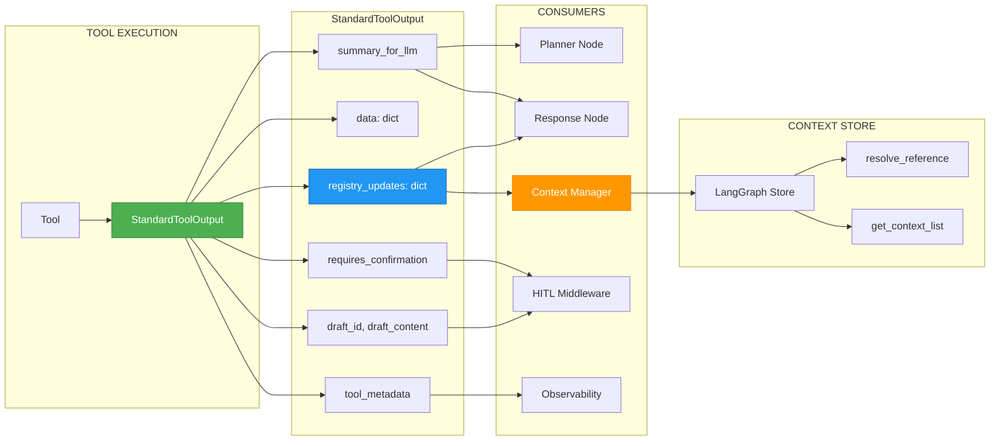

# ADR-012: Data Registry & StandardToolOutput Pattern

**Status**: ✅ IMPLEMENTED (2025-12-21)
**Deciders**: Équipe architecture LIA
**Technical Story**: LOT 4 - Data Registry pour contexte structuré
**Related Issues**: INTELLIA Phase 4 - Structured Context Management

---

## Context and Problem Statement

Les tools retournaient initialement des **strings JSON brutes** au LLM, créant plusieurs problèmes :

1. **Contexte perdu** : Les données retournées n'étaient pas persistées pour références ultérieures
2. **Parsing incohérent** : Chaque tool formatait différemment ses résultats
3. **Pas de métadonnées** : Impossible de distinguer données utilisateur vs métadonnées techniques
4. **HITL difficile** : Pas de structure pour drafts et confirmations
5. **Response Node aveugle** : Pas d'accès aux items structurés pour synthèse

**Question** : Comment structurer la sortie des tools pour permettre contexte, HITL et synthèse cohérente ?

---

## Decision Drivers

### Must-Have (Non-Negotiable):

1. **Rétrocompatibilité** : Les tools existants doivent continuer à fonctionner
2. **Contexte persistant** : Les items retournés doivent être accessibles pour références futures
3. **HITL support** : Structure pour drafts et confirmations utilisateur
4. **Type safety** : Validation Pydantic des outputs

### Nice-to-Have:

- Métadonnées pour analytics et debugging
- Format unifié pour tous les domaines
- Support batch operations

---

## Decision Outcome

**Chosen option**: "**StandardToolOutput + Data Registry Pattern**"

### Architecture Overview



### StandardToolOutput Schema

```python
# apps/api/src/domains/agents/tools/output.py

class StandardToolOutput(BaseModel):
    """
    Unified output format for all tools.

    Dual-purpose:
    1. summary_for_llm: Concise text for LLM processing (planner, response)
    2. registry_updates: Structured items for context persistence and UI
    """

    # === LLM CONSUMPTION ===
    summary_for_llm: str = Field(
        ...,
        description="Résumé concis pour le LLM (1-3 phrases). "
                    "Utilisé par Planner et Response Node."
    )

    # === STRUCTURED DATA ===
    data: dict[str, Any] = Field(
        default_factory=dict,
        description="Données structurées complètes (pour référence step-to-step)"
    )

    # === DATA REGISTRY ===
    registry_updates: dict[str, RegistryItem | dict] = Field(
        default_factory=dict,
        description="Items à ajouter au Data Registry. "
                    "Format: {item_id: RegistryItem}. "
                    "Persistés dans Store pour context_tools."
    )

    # === HITL SUPPORT ===
    requires_confirmation: bool = Field(
        default=False,
        description="Si True, déclenche HITL avant exécution finale"
    )

    draft_id: str | None = Field(
        default=None,
        description="ID unique du draft (pour HITL edit/approve)"
    )

    draft_type: str | None = Field(
        default=None,
        description="Type de draft: email_draft, event_draft, etc."
    )

    draft_content: dict[str, Any] | None = Field(
        default=None,
        description="Contenu du draft pour affichage/édition HITL"
    )

    draft_summary: str | None = Field(
        default=None,
        description="Résumé du draft pour affichage utilisateur"
    )

    # === METADATA ===
    tool_metadata: dict[str, Any] = Field(
        default_factory=dict,
        description="Métadonnées techniques (timing, cache, counts)"
    )
```

### RegistryItem Schema

```python
# apps/api/src/domains/agents/data_registry/models.py

class RegistryItemType(str, Enum):
    """Types of items in the data registry."""
    CONTACT = "contact"
    EMAIL = "email"
    EVENT = "event"
    TASK = "task"
    FILE = "file"
    PLACE = "place"
    WEATHER = "weather"
    UNKNOWN = "unknown"

class RegistryItem(BaseModel):
    """
    Single item in the Data Registry.

    Represents any entity (contact, email, event) with:
    - Unique ID for reference
    - Type for filtering
    - Payload with full data
    - Display info for UI
    """

    id: str = Field(..., description="Unique identifier (resourceName, messageId, etc.)")
    type: RegistryItemType = Field(..., description="Item type for filtering")
    payload: dict[str, Any] = Field(..., description="Full item data")
    display_label: str = Field(..., description="Human-readable label for UI")
    source_step: str | None = Field(None, description="Step ID that created this item")
    timestamp: datetime = Field(default_factory=datetime.utcnow)
```

### Implementation in Tools

**Pattern avec ToolOutputMixin** :

```python
# apps/api/src/domains/agents/tools/google_contacts_tools.py

class SearchContactsTool(ToolOutputMixin, ConnectorTool[GooglePeopleClient]):
    """Search contacts with Data Registry support."""

    connector_type = ConnectorType.GOOGLE_CONTACTS
    client_class = GooglePeopleClient
    registry_enabled = True  # Active Data Registry mode

    async def execute_api_call(self, client, user_id, **kwargs):
        query = kwargs["query"]
        return await client.search_contacts(query)

    def format_registry_response(self, result: dict) -> StandardToolOutput:
        """Convert API result to StandardToolOutput with registry items."""
        contacts = result.get("connections", [])

        # Build registry items
        registry_updates = {}
        for i, contact in enumerate(contacts):
            resource_name = contact.get("resourceName")
            name = self._extract_name(contact)

            registry_updates[resource_name] = RegistryItem(
                id=resource_name,
                type=RegistryItemType.CONTACT,
                payload=contact,
                display_label=name,
            )

        return StandardToolOutput(
            summary_for_llm=f"Trouvé {len(contacts)} contact(s) pour '{query}'",
            data={"contacts": contacts, "query": query},
            registry_updates=registry_updates,
        )
```

**Pattern pour HITL (drafts)** :

```python
# apps/api/src/domains/agents/tools/calendar_tools.py

class CreateEventDraftTool(ToolOutputMixin, ConnectorTool):
    """Create calendar event draft with HITL confirmation."""

    async def execute_api_call(self, client, user_id, **kwargs):
        # Build draft without creating event
        draft = {
            "summary": kwargs["summary"],
            "start": kwargs["start"],
            "end": kwargs["end"],
            "attendees": kwargs.get("attendees", []),
        }
        return {"draft": draft, "action": "create_event"}

    def format_registry_response(self, result: dict) -> StandardToolOutput:
        draft = result["draft"]
        draft_id = f"event_draft_{uuid.uuid4().hex[:8]}"

        return StandardToolOutput(
            summary_for_llm=f"Draft événement créé: {draft['summary']}",
            data=result,
            registry_updates={},
            requires_confirmation=True,  # HITL required
            draft_id=draft_id,
            draft_type="event_draft",
            draft_content=draft,
            draft_summary=f"Créer événement '{draft['summary']}' le {draft['start']}",
        )
```

### Context Integration

**Sauvegarde automatique via Context Manager** :

```python
# apps/api/src/domains/agents/context/manager.py

class ToolContextManager:
    """Manages tool context in LangGraph Store."""

    async def save_from_tool_output(
        self,
        output: StandardToolOutput,
        user_id: str,
        session_id: str,
        domain: str,
        store: BaseStore,
    ) -> None:
        """Save registry items to Store for future reference."""

        if not output.registry_updates:
            return

        # Convert to ContextList format
        items = []
        for item_id, registry_item in output.registry_updates.items():
            if isinstance(registry_item, RegistryItem):
                items.append(registry_item.payload)
            else:
                items.append(registry_item)

        # Save to Store with domain namespace
        await self.save_list(
            user_id=user_id,
            session_id=session_id,
            domain=domain,
            items=items,
            store=store,
        )
```

**Récupération via context_tools** :

```python
# User: "affiche le 2ème contact"
result = await resolve_reference(reference="2", domain="contacts", runtime=runtime)
# → Retourne le 2ème contact de la liste précédente
```

### Consequences

**Positive**:
- ✅ **Contexte persistant** : Items disponibles pour références futures
- ✅ **HITL structuré** : Drafts avec confirmation utilisateur
- ✅ **Format unifié** : Tous les tools utilisent StandardToolOutput
- ✅ **Response Node enrichi** : Accès aux items structurés
- ✅ **Type safety** : Validation Pydantic complète
- ✅ **Rétrocompatible** : `registry_enabled=False` retourne string JSON

**Negative**:
- ⚠️ Overhead mémoire (items dupliqués dans registry)
- ⚠️ Migration nécessaire pour anciens tools

---

## Validation

**Acceptance Criteria**:
- [x] ✅ StandardToolOutput défini avec tous les champs
- [x] ✅ RegistryItem schema pour typage
- [x] ✅ ToolOutputMixin pour helpers
- [x] ✅ Context Manager sauvegarde automatique
- [x] ✅ HITL drafts fonctionnels
- [x] ✅ resolve_reference accède aux items

---

## Related Decisions

- [ADR-008: HITL Plan-Level Approval](ADR_INDEX.md#adr-008-hitl-plan-level-approval-phase-8) - Utilise draft_id/requires_confirmation
- [ADR-011: Utility Tools vs Connector Tools](ADR-011-Utility-Tools-vs-Connector-Tools.md) - context_tools consomme registry

---

## References

### Source Code
- **StandardToolOutput**: `apps/api/src/domains/agents/tools/output.py`
- **RegistryItem**: `apps/api/src/domains/agents/data_registry/models.py`
- **ToolOutputMixin**: `apps/api/src/domains/agents/tools/mixins.py`
- **Context Manager**: `apps/api/src/domains/agents/context/manager.py`

---

**Fin de ADR-012** - Data Registry & StandardToolOutput Pattern Decision Record.
