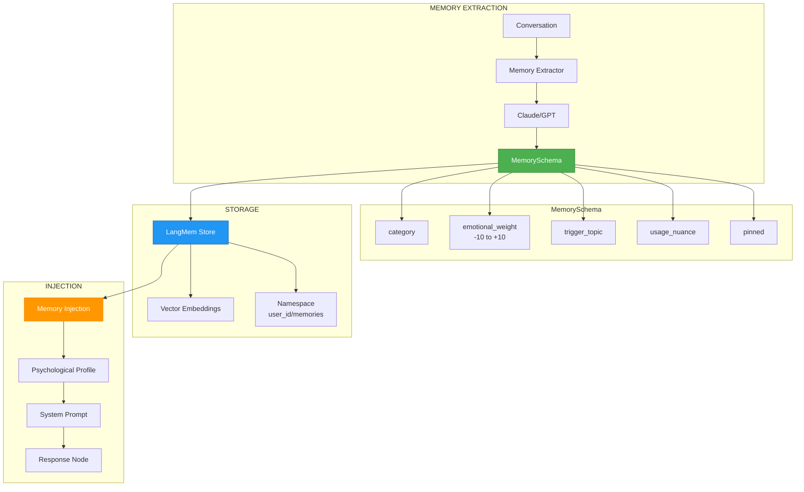

# ADR-013: LangMem Long-Term Memory Architecture

**Status**: ✅ IMPLEMENTED (2025-12-21)
**Deciders**: Équipe architecture LIA
**Technical Story**: Long-Term Memory pour profil psychologique utilisateur
**Related Documentation**: `docs/technical/LONG_TERM_MEMORY.md`

---

## Context and Problem Statement

L'assistant conversationnel perdait le contexte entre les sessions :

1. **Amnésie inter-sessions** : Aucune persistance des préférences utilisateur
2. **Répétitions** : L'utilisateur devait re-expliquer ses goûts/contraintes
3. **Personnalisation limitée** : Pas d'adaptation au profil psychologique
4. **Mémoires sensibles** : Pas de gestion des sujets délicats (deuil, conflits, etc.)

**Question** : Comment implémenter une mémoire long-terme intelligente qui construit un profil psychologique de l'utilisateur ?

---

## Decision Drivers

### Must-Have (Non-Negotiable):

1. **Persistance cross-session** : Mémoires survivent aux redémarrages
2. **Isolation utilisateur** : Chaque user a ses propres mémoires
3. **Recherche sémantique** : Retrouver mémoires pertinentes par contexte
4. **Profil psychologique** : Catégorisation et poids émotionnel

### Nice-to-Have:

- Purge automatique des mémoires obsolètes
- Protection des mémoires critiques (pinned)
- Extraction automatique depuis conversations

---

## Decision Outcome

**Chosen option**: "**LangMem avec MemorySchema psychologique**"

### Architecture Overview



### MemorySchema (Profil Psychologique)

```python
# apps/api/src/domains/agents/tools/memory_tools.py

MemoryCategoryType = Literal[
    "preference",   # Goûts, préférences (café, musique, etc.)
    "personal",     # Identité (travail, famille, lieu de vie)
    "relationship", # Personnes mentionnées et relations
    "event",        # Événements significatifs (anniversaires, etc.)
    "pattern",      # Comportements récurrents
    "sensitivity",  # Sujets sensibles (trauma, conflits)
]

class MemorySchema(BaseModel):
    """
    Schema for structured user memory with psychological profiling.

    Each memory captures:
    - WHAT: The factual content
    - HOW IMPORTANT: Emotional weight
    - WHEN TO USE: Trigger topics
    - HOW TO USE: Usage nuances for personality
    """

    content: str = Field(
        ...,
        description="Le fait ou l'information en une phrase concise",
        min_length=3,
        max_length=500,
    )

    category: MemoryCategoryType = Field(
        ...,
        description="Catégorie de la mémoire"
    )

    emotional_weight: int = Field(
        default=0,
        ge=-10,
        le=10,
        description=(
            "Poids émotionnel de -10 (trauma/douleur) à +10 (joie/fierté). "
            "0 = neutre. Calibre la sensibilité du sujet."
        ),
    )

    trigger_topic: str = Field(
        default="",
        description="Sujet/mot-clé qui active ce souvenir (ex: 'voiture', 'père')",
    )

    usage_nuance: str = Field(
        default="",
        description=(
            "Comment utiliser cette info selon la personnalité. "
            "Ex: 'Sujet sensible, pas de blague', 'Fierté évidente, peut être complimenté'"
        ),
    )

    importance: float = Field(
        default=0.7,
        ge=0.0,
        le=1.0,
        description="Score d'importance pour prioritisation (0.9+ = explicite, 0.5 = anecdotique)",
    )

    # === PURGE AUTOMATIQUE ===
    usage_count: int = Field(
        default=0,
        description="Nombre de récupérations pertinentes (auto-incrémenté)"
    )

    last_accessed_at: datetime | None = Field(
        default=None,
        description="Dernière date d'accès pertinent"
    )

    pinned: bool = Field(
        default=False,
        description="Si True, jamais supprimé par purge automatique"
    )
```

### Memory Tools (LangMem Integration)

```python
# apps/api/src/domains/agents/tools/memory_tools.py

def create_memory_tools(personality_context: str | None = None) -> MemoryTools:
    """
    Factory for LangMem memory management tools.

    Creates:
    - memorize: Store new memories with psychological profiling
    - recall: Semantic search through stored memories
    """
    from langmem import create_manage_memory_tool, create_search_memory_tool

    # Namespace with runtime placeholder for user isolation
    namespace = ("{langgraph_user_id}", "memories")

    # Load instructions from external prompt file
    instructions = load_prompt("memory_manage_instructions")
    if personality_context:
        instructions += f"\n\n## PERSONNALITÉ ACTIVE\n{personality_context}"

    memorize_tool = create_manage_memory_tool(
        namespace=namespace,
        schema=MemorySchema,
        instructions=instructions,
        name="memorize",
    )

    recall_tool = create_search_memory_tool(
        namespace=namespace,
        name="recall",
    )

    return MemoryTools(memorize=memorize_tool, recall=recall_tool)
```

### Memory Injection (Psychological Profile)

```python
# apps/api/src/domains/agents/middleware/memory_injection.py

async def build_psychological_profile(
    user_id: str,
    current_message: str,
    store: BaseStore,
    config: dict,
) -> str:
    """
    Build psychological profile from relevant memories.

    Returns formatted string for system prompt injection.
    """
    # 1. Semantic search for relevant memories
    memories = await recall_memories(
        query=current_message,
        user_id=user_id,
        store=store,
        limit=10,
    )

    if not memories:
        return ""

    # 2. Group by category with emotional indicators
    profile_sections = []

    # Sensitivity section (priority)
    sensitivities = [m for m in memories if m.category == "sensitivity"]
    if sensitivities:
        lines = []
        for m in sensitivities:
            emoji = _get_emotional_emoji(m.emotional_weight)
            lines.append(f"  {emoji} {m.content}")
            if m.usage_nuance:
                lines.append(f"     → {m.usage_nuance}")
        profile_sections.append("🔴 ZONES SENSIBLES:\n" + "\n".join(lines))

    # Relationships section
    relationships = [m for m in memories if m.category == "relationship"]
    if relationships:
        lines = [f"  • {m.content}" for m in relationships]
        profile_sections.append("👥 RELATIONS:\n" + "\n".join(lines))

    # Preferences section
    preferences = [m for m in memories if m.category == "preference"]
    if preferences:
        lines = [f"  • {m.content}" for m in preferences]
        profile_sections.append("💚 PRÉFÉRENCES:\n" + "\n".join(lines))

    # 3. Build final profile
    if profile_sections:
        return (
            "\n\n## PROFIL PSYCHOLOGIQUE UTILISATEUR\n"
            "⚠️ PRIORITAIRE: Utilise ces informations pour personnaliser tes réponses.\n\n"
            + "\n\n".join(profile_sections)
        )

    return ""


def _get_emotional_emoji(weight: int) -> str:
    """Map emotional weight to emoji indicator."""
    if weight <= -7:
        return "🔴"  # Trauma/douleur profonde
    elif weight <= -3:
        return "🟠"  # Négatif modéré
    elif weight <= 3:
        return "⚪"  # Neutre
    elif weight <= 7:
        return "🟢"  # Positif
    else:
        return "💚"  # Joie/fierté intense
```

### Memory Extraction (Automatic)

```python
# apps/api/src/domains/agents/services/memory_extractor.py

class MemoryExtractor:
    """
    Extracts memories from conversation using LLM.

    Runs as background task after response generation.
    """

    async def extract_from_conversation(
        self,
        messages: list[BaseMessage],
        user_id: str,
        store: BaseStore,
    ) -> list[MemorySchema]:
        """
        Extract memorable facts from recent conversation.

        Uses LLM to identify:
        - Explicit preferences ("J'adore le café")
        - Personal info ("Je travaille chez X")
        - Relationships ("Mon frère s'appelle Jean")
        - Emotional context ("Mon père est décédé l'an dernier")
        """
        # Load extraction prompt
        prompt = load_prompt("memory_extraction_prompt")

        # Get last N messages
        recent = messages[-10:]

        # Call LLM for extraction
        result = await self.llm.ainvoke([
            SystemMessage(content=prompt),
            HumanMessage(content=self._format_messages(recent)),
        ])

        # Parse and validate memories
        memories = self._parse_memories(result.content)

        # Store via LangMem
        for memory in memories:
            await self._store_memory(memory, user_id, store)

        return memories
```

### Purge Automatique

```python
# apps/api/src/infrastructure/scheduler/memory_cleanup.py

class MemoryCleanupJob:
    """
    Scheduled job to purge stale memories.

    Criteria for deletion:
    - usage_count == 0 AND age > 30 days
    - usage_count < 3 AND age > 90 days
    - NOT pinned
    """

    async def run(self):
        threshold_30d = datetime.utcnow() - timedelta(days=30)
        threshold_90d = datetime.utcnow() - timedelta(days=90)

        # Find stale memories
        stale = await self.store.search(
            namespace=("*", "memories"),
            filter={
                "$or": [
                    {"usage_count": 0, "created_at": {"$lt": threshold_30d}},
                    {"usage_count": {"$lt": 3}, "created_at": {"$lt": threshold_90d}},
                ],
                "pinned": False,
            }
        )

        # Delete stale memories
        for memory in stale:
            await self.store.delete(memory.key)
            logger.info("memory_purged", key=memory.key, reason="stale")
```

### Consequences

**Positive**:
- ✅ **Personnalisation profonde** : Profil psychologique complet
- ✅ **Sensibilité émotionnelle** : Gestion des sujets délicats
- ✅ **Persistance cross-session** : Mémoires survivent aux sessions
- ✅ **Recherche sémantique** : Retrouve mémoires par contexte
- ✅ **Auto-purge** : Évite accumulation mémoires obsolètes
- ✅ **Protection pinned** : Mémoires critiques jamais supprimées

**Negative**:
- ⚠️ Latence injection (+100-200ms par requête)
- ⚠️ Coût LLM extraction (background, amortissable)
- ⚠️ Stockage vectoriel requis

---

## Validation

**Acceptance Criteria**:
- [x] ✅ MemorySchema avec profil psychologique
- [x] ✅ LangMem integration (memorize/recall)
- [x] ✅ Memory injection dans system prompt
- [x] ✅ Extraction automatique background
- [x] ✅ Purge scheduler implémenté
- [x] ✅ Namespace isolation par user

---

## Related Decisions

- [ADR-011: Utility Tools](ADR-011-Utility-Tools-vs-Connector-Tools.md) - memory_tools sont des utility tools
- [ADR-012: StandardToolOutput](ADR-012-Data-Registry-StandardToolOutput-Pattern.md) - Format de sortie

---

## References

### External Documentation
- **LangMem**: https://langchain-ai.github.io/langmem/
- **Memory Tools API**: https://langchain-ai.github.io/langmem/reference/tools/

### Source Code
- **Memory Tools**: `apps/api/src/domains/agents/tools/memory_tools.py`
- **Memory Injection**: `apps/api/src/domains/agents/middleware/memory_injection.py`
- **Memory Extractor**: `apps/api/src/domains/agents/services/memory_extractor.py`
- **Cleanup Scheduler**: `apps/api/src/infrastructure/scheduler/memory_cleanup.py`
- **Prompts**: `apps/api/src/domains/agents/prompts/v1/memory_*.txt`

---

**Fin de ADR-013** - LangMem Long-Term Memory Architecture Decision Record.
