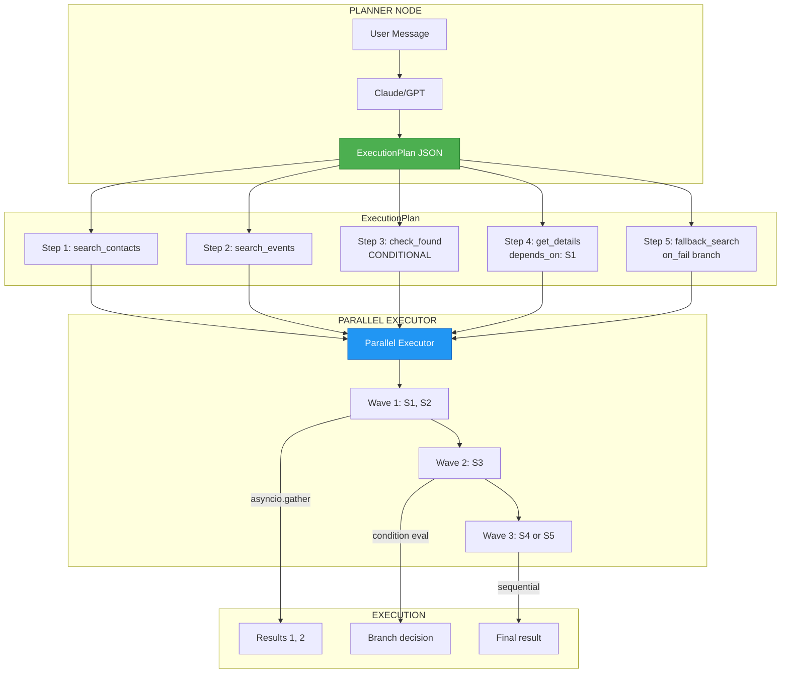

# ADR-014: ExecutionPlan & Parallel Executor Pattern

**Status**: ✅ IMPLEMENTED (2025-12-21) - Enhanced by Architecture v3
**Deciders**: Équipe architecture LIA
**Technical Story**: Phase 5 - LLM-Based Planner avec exécution parallèle
**Related Issues**: INTELLIA Phase 5 - ExecutionPlan Architecture

> **Note Architecture v3 (2026-01)**: Les references a `planner_node.py` dans cet ADR concernent le fichier v3 (`planner_node_v3.py`).
> Le planning est maintenant gere par `SmartPlannerService` avec generation single-call.
> Voir [SMART_SERVICES.md](../technical/SMART_SERVICES.md) pour la documentation actuelle.

---

## Context and Problem Statement

L'exécution séquentielle des tools créait plusieurs limitations :

1. **Latence élevée** : 5 tools × 500ms = 2.5s minimum
2. **Pas de dépendances** : Impossible d'exprimer "tool B dépend du résultat de tool A"
3. **Pas de fallbacks** : Échec = arrêt complet
4. **Pas de conditions** : Impossible de brancher selon résultats

**Question** : Comment permettre l'exécution parallèle avec dépendances, conditions et fallbacks ?

---

## Decision Drivers

### Must-Have (Non-Negotiable):

1. **Parallélisme** : Exécuter tools indépendants simultanément
2. **Dépendances** : Attendre résultats avant steps dépendants
3. **Références inter-steps** : Accéder aux résultats via `$steps.step_id.field`
4. **Conditions** : Brancher selon résultats (`on_success`/`on_fail`)
5. **Fallbacks** : Plans de secours si step échoue

### Nice-to-Have:

- Visualisation du plan pour HITL
- Métriques par step
- Retry automatique

---

## Decision Outcome

**Chosen option**: "**ExecutionPlan avec DAG et Parallel Executor**"

### Architecture Overview



### ExecutionPlan Schema

```python
# apps/api/src/domains/agents/orchestration/models.py

class StepType(str, Enum):
    """Type of execution step."""
    TOOL = "TOOL"           # Execute a tool
    CONDITIONAL = "CONDITIONAL"  # Branch based on condition
    PARALLEL = "PARALLEL"   # Group of parallel steps
    RESPONSE = "RESPONSE"   # Generate response

class ExecutionStep(BaseModel):
    """
    Single step in an execution plan.

    Supports:
    - Tool execution with parameters
    - Conditional branching (on_success/on_fail)
    - Dependencies (depends_on)
    - Parameter references ($steps.X.field)
    """

    step_id: str = Field(..., description="Unique step identifier")
    step_type: StepType = Field(..., description="Type of step")

    # Tool execution
    agent_name: str | None = Field(None, description="Agent to execute")
    tool_name: str | None = Field(None, description="Tool to call")
    parameters: dict[str, Any] = Field(default_factory=dict)

    # Dependencies
    depends_on: list[str] = Field(
        default_factory=list,
        description="Step IDs that must complete before this step"
    )

    # Conditional branching
    condition: str | None = Field(
        None,
        description="Jinja2 condition expression (e.g., 'len(steps.S1.contacts) > 0')"
    )
    on_success: str | None = Field(None, description="Step ID to execute if condition True")
    on_fail: str | None = Field(None, description="Step ID to execute if condition False")

    # Metadata
    description: str | None = Field(None, description="Human-readable description")
    expected_output: str | None = Field(None, description="Expected output type")

class ExecutionPlan(BaseModel):
    """
    Complete execution plan generated by Planner.

    Represents a DAG (Directed Acyclic Graph) of steps.
    """

    plan_id: str = Field(default_factory=lambda: f"plan_{uuid.uuid4().hex[:8]}")
    steps: list[ExecutionStep] = Field(..., description="Ordered list of steps")
    metadata: dict[str, Any] = Field(default_factory=dict)

    # Validation
    requires_approval: bool = Field(
        default=False,
        description="If True, requires HITL approval before execution"
    )
    estimated_cost_usd: float = Field(default=0.0)

    def get_step(self, step_id: str) -> ExecutionStep | None:
        """Get step by ID."""
        return next((s for s in self.steps if s.step_id == step_id), None)

    def get_dependencies(self, step_id: str) -> list[str]:
        """Get all dependencies for a step (transitive)."""
        step = self.get_step(step_id)
        if not step:
            return []
        return step.depends_on
```

### Parallel Executor

```python
# apps/api/src/domains/agents/orchestration/parallel_executor.py

class ParallelExecutor:
    """
    Executes ExecutionPlan with parallel step execution.

    Algorithm:
    1. Build execution waves from DAG
    2. Execute each wave with asyncio.gather
    3. Resolve parameter references between waves
    4. Handle conditionals and fallbacks
    """

    async def execute(
        self,
        plan: ExecutionPlan,
        runtime: ToolRuntime,
        initial_context: dict[str, Any] = None,
    ) -> ExecutionResult:
        """Execute plan and return aggregated results."""

        completed_steps: dict[str, StepResult] = {}
        skipped_steps: set[str] = set()

        # Build execution waves (topological sort)
        waves = self._build_execution_waves(plan)

        for wave_index, wave in enumerate(waves):
            logger.info(
                "executing_wave",
                wave_index=wave_index,
                steps=list(wave),
            )

            # Filter out skipped steps
            active_steps = wave - skipped_steps

            # Execute wave in parallel
            tasks = [
                self._execute_step(
                    step=plan.get_step(step_id),
                    runtime=runtime,
                    completed_steps=completed_steps,
                )
                for step_id in active_steps
            ]

            results = await asyncio.gather(*tasks, return_exceptions=True)

            # Process results
            for step_id, result in zip(active_steps, results):
                step = plan.get_step(step_id)

                if isinstance(result, Exception):
                    completed_steps[step_id] = StepResult(
                        step_id=step_id,
                        status="error",
                        error=str(result),
                    )
                else:
                    completed_steps[step_id] = result

                # Handle conditionals
                if step.step_type == StepType.CONDITIONAL:
                    branch = self._evaluate_condition(step, completed_steps)
                    if branch == "success" and step.on_success:
                        # on_fail branch should be skipped
                        if step.on_fail:
                            skipped_steps.add(step.on_fail)
                    elif branch == "fail" and step.on_fail:
                        # on_success branch should be skipped
                        if step.on_success:
                            skipped_steps.add(step.on_success)

        return ExecutionResult(
            plan_id=plan.plan_id,
            steps=completed_steps,
            skipped=skipped_steps,
        )

    def _build_execution_waves(self, plan: ExecutionPlan) -> list[set[str]]:
        """
        Build execution waves using topological sort.

        Wave N contains steps whose dependencies are all in waves < N.
        """
        waves = []
        remaining = {s.step_id for s in plan.steps}
        completed = set()

        while remaining:
            # Find steps with all dependencies completed
            wave = {
                step_id for step_id in remaining
                if all(
                    dep in completed
                    for dep in plan.get_dependencies(step_id)
                )
            }

            if not wave:
                raise ValueError("Circular dependency detected in plan")

            waves.append(wave)
            completed.update(wave)
            remaining -= wave

        return waves

    async def _execute_step(
        self,
        step: ExecutionStep,
        runtime: ToolRuntime,
        completed_steps: dict[str, StepResult],
    ) -> StepResult:
        """Execute single step with parameter resolution."""

        # Resolve parameter references ($steps.X.field)
        resolved_params = self._resolve_parameters(
            step.parameters,
            completed_steps,
        )

        # Get tool from registry
        tool = self.tool_registry.get_tool(step.tool_name)

        # Execute tool
        start_time = time.time()
        result = await tool.ainvoke(resolved_params, config=runtime.config)
        duration_ms = (time.time() - start_time) * 1000

        return StepResult(
            step_id=step.step_id,
            status="success",
            output=result,
            duration_ms=duration_ms,
        )

    def _resolve_parameters(
        self,
        params: dict[str, Any],
        completed_steps: dict[str, StepResult],
    ) -> dict[str, Any]:
        """
        Resolve $steps.X.field references in parameters.

        Examples:
        - "$steps.search.contacts[0].resourceName" → actual value
        - "$steps.resolve.item.email" → actual value
        """
        resolved = {}

        for key, value in params.items():
            if isinstance(value, str) and value.startswith("$steps."):
                # Parse reference: $steps.step_id.field.path
                resolved[key] = self._extract_reference(value, completed_steps)
            elif isinstance(value, dict):
                resolved[key] = self._resolve_parameters(value, completed_steps)
            elif isinstance(value, list):
                resolved[key] = [
                    self._resolve_parameters({"v": v}, completed_steps)["v"]
                    if isinstance(v, (dict, str)) else v
                    for v in value
                ]
            else:
                resolved[key] = value

        return resolved

    def _extract_reference(
        self,
        reference: str,
        completed_steps: dict[str, StepResult],
    ) -> Any:
        """Extract value from $steps.X.field reference."""
        # Parse: $steps.step_id.field[index].subfield
        parts = reference[7:].split(".")  # Remove "$steps."
        step_id = parts[0]
        path = parts[1:]

        if step_id not in completed_steps:
            raise ValueError(f"Step {step_id} not yet completed")

        result = completed_steps[step_id]
        value = result.structured_data or result.output

        # Navigate path
        for part in path:
            # Handle array indexing: field[0]
            if "[" in part:
                field, index_str = part.split("[")
                index = int(index_str.rstrip("]"))
                value = value[field][index]
            else:
                value = value[part] if isinstance(value, dict) else getattr(value, part)

        return value
```

### Example ExecutionPlan

```json
{
  "plan_id": "plan_abc123",
  "steps": [
    {
      "step_id": "search",
      "step_type": "TOOL",
      "agent_name": "contacts_agent",
      "tool_name": "search_contacts_tool",
      "parameters": {"query": "Jean"},
      "description": "Rechercher contacts nommés Jean"
    },
    {
      "step_id": "check_found",
      "step_type": "CONDITIONAL",
      "condition": "len(steps.search.contacts) > 0",
      "on_success": "get_details",
      "on_fail": "no_results",
      "depends_on": ["search"]
    },
    {
      "step_id": "get_details",
      "step_type": "TOOL",
      "agent_name": "contacts_agent",
      "tool_name": "get_contact_details_tool",
      "parameters": {
        "resource_name": "$steps.search.contacts[0].resourceName"
      },
      "depends_on": ["search"],
      "description": "Récupérer détails du premier contact"
    },
    {
      "step_id": "no_results",
      "step_type": "RESPONSE",
      "parameters": {
        "message": "Aucun contact trouvé pour 'Jean'"
      },
      "description": "Fallback si aucun résultat"
    }
  ]
}
```

### Execution Flow

```
Wave 1: [search]
  ↓ asyncio.gather
  → Result: {contacts: [{name: "Jean Dupont", resourceName: "people/c123"}]}

Wave 2: [check_found]
  ↓ Evaluate: len(steps.search.contacts) > 0 = True
  → Branch: on_success → get_details
  → Skip: no_results

Wave 3: [get_details]
  ↓ Resolve: $steps.search.contacts[0].resourceName → "people/c123"
  ↓ Execute: get_contact_details_tool(resource_name="people/c123")
  → Result: {contact: {name: "Jean Dupont", email: "jean@example.com", ...}}

Final: ExecutionResult with all step results
```

### Consequences

**Positive**:
- ✅ **Parallélisme** : Tools indépendants exécutés simultanément
- ✅ **Dépendances DAG** : Gestion propre des dépendances
- ✅ **Références inter-steps** : `$steps.X.field` résolu automatiquement
- ✅ **Conditions/Fallbacks** : Branching dynamique
- ✅ **Métriques par step** : Timing et status individuels
- ✅ **HITL ready** : Plan visualisable avant exécution

**Negative**:
- ⚠️ Complexité du Planner (génération JSON valide)
- ⚠️ Overhead parsing/validation (~10ms)

---

## Validation

**Acceptance Criteria**:
- [x] ✅ ExecutionPlan schema avec steps, dépendances, conditions
- [x] ✅ Parallel Executor avec waves
- [x] ✅ Résolution `$steps.X.field` références
- [x] ✅ Conditional branching (on_success/on_fail)
- [x] ✅ Fallback steps
- [x] ✅ Métriques par step

---

## Related Decisions

- [ADR-005: Sequential Fallback Execution](ADR_INDEX.md#adr-005-sequential-fallback-execution) - Skip logic
- [ADR-008: HITL Plan-Level Approval](ADR_INDEX.md#adr-008-hitl-plan-level-approval-phase-8) - Plan approval
- [ADR-012: StandardToolOutput](ADR-012-Data-Registry-StandardToolOutput-Pattern.md) - Output format

---

## References

### Source Code
- **ExecutionPlan Models**: `apps/api/src/domains/agents/orchestration/models.py`
- **Parallel Executor**: `apps/api/src/domains/agents/orchestration/parallel_executor.py`
- **Planner Node**: `apps/api/src/domains/agents/nodes/planner_node.py`
- **Tool Registry**: `apps/api/src/domains/agents/orchestration/parallel_executor.py` (ToolRegistry class)

---

**Fin de ADR-014** - ExecutionPlan & Parallel Executor Pattern Decision Record.
