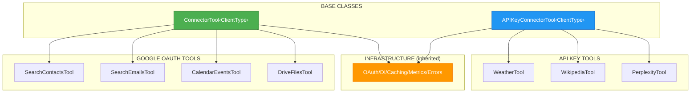

# ADR-015: ConnectorTool Base Class Pattern

**Status**: ✅ IMPLEMENTED (2025-12-21)
**Deciders**: Équipe architecture LIA
**Technical Story**: Refactoring tools pour éliminer duplication
**Related Documentation**: `docs/technical/CONNECTORS_PATTERNS.md`

---

## Context and Problem Statement

Chaque tool de connecteur (contacts, emails, calendar, etc.) répétait le même boilerplate :

1. **150+ lignes par tool** : Validation, DI, OAuth, error handling, caching
2. **Code dupliqué** : Même logique copiée dans 25+ tools
3. **Incohérences** : Variations dans l'error handling entre tools
4. **Maintenance difficile** : Changement = modifier 25 fichiers

**Question** : Comment factoriser le code commun tout en gardant flexibilité pour chaque tool ?

---

## Decision Drivers

### Must-Have (Non-Negotiable):

1. **DRY** : Éliminer la duplication (Don't Repeat Yourself)
2. **Type Safety** : Générique avec TypeVar pour client typing
3. **Extensibilité** : Facile d'ajouter nouveaux connecteurs
4. **Rétrocompatibilité** : Migration progressive possible

### Nice-to-Have:

- Dual-mode output (legacy string / StandardToolOutput)
- Métriques automatiques
- Client caching transparent

---

## Decision Outcome

**Chosen option**: "**ConnectorTool[ClientType] Generic Base Class**"

### Architecture Overview



### ConnectorTool Base Class

```python
# apps/api/src/domains/agents/tools/base.py

class ConnectorTool[ClientType](ABC):
    """
    Abstract base class for connector-based tools.

    Provides common infrastructure:
    - Dependency injection (ToolDependencies pattern)
    - OAuth credentials retrieval
    - API client caching and reuse
    - Error handling and metrics tracking
    - User ID extraction and validation
    - Dual-mode output (str for legacy, StandardToolOutput for registry)

    Subclasses must implement:
    - connector_type: ConnectorType enum value
    - client_class: Type of API client to use
    - execute_api_call(): Business logic for API interaction
    """

    # Subclasses MUST define these
    connector_type: ConnectorType
    client_class: type[ClientType]

    # Data Registry mode flag
    registry_enabled: bool = False

    def __init__(self, tool_name: str, operation: str) -> None:
        self.tool_name = tool_name
        self.operation = operation
        self.logger = logger.bind(tool=tool_name, operation=operation)

    async def execute(
        self,
        runtime: ToolRuntime,
        **kwargs: Any,
    ) -> str | StandardToolOutput:
        """
        Main execution entrypoint called by LangChain.

        Orchestrates:
        1. Validate runtime config and extract user_id
        2. Get dependencies (injected or fallback)
        3. Retrieve connector credentials
        4. Get or create cached API client
        5. Execute API call (delegated to subclass)
        6. Format response (registry mode or legacy)
        7. Handle errors with standardized messages
        """
        try:
            # Step 1: Validate runtime config
            config = validate_runtime_config(runtime, self.tool_name)
            if isinstance(config, ToolResponse):
                return config.model_dump_json()

            user_uuid = self._parse_user_id(config.user_id)

            # Step 2: Get dependencies
            using_injected_deps, deps = self._get_deps_or_fallback(runtime)

            if using_injected_deps and deps is not None:
                # Step 3: Get connector credentials
                connector_service = await deps.get_connector_service()
                credentials = await connector_service.get_connector_credentials(
                    user_uuid, self.connector_type
                )

                if credentials is None:
                    return self._format_connector_not_activated_error()

                # Step 4: Get or create cached API client
                client_factory = self.create_client_factory(
                    user_uuid, credentials, connector_service
                )
                client = await deps.get_or_create_client(
                    self.client_class,
                    cache_key=(user_uuid, self.connector_type),
                    factory=client_factory,
                )

                # Step 5: Execute API call (subclass-specific)
                result = await self.execute_api_call(client, user_uuid, **kwargs)

                # Step 6: Format response
                if self.registry_enabled:
                    return self.format_registry_response(result)
                else:
                    return self.format_response(result)

        except Exception as e:
            return self.handle_error(e, config.user_id, kwargs)

    @abstractmethod
    async def execute_api_call(
        self,
        client: ClientType,
        user_id: UUID,
        **kwargs: Any,
    ) -> dict[str, Any]:
        """
        Execute the actual API call.

        This is the ONLY method subclasses MUST implement.
        Contains only business logic specific to the tool.
        """
        pass

    def format_response(self, result: dict[str, Any]) -> str:
        """Format as JSON string (legacy mode)."""
        return json.dumps(result, ensure_ascii=False)

    def format_registry_response(self, result: dict[str, Any]) -> StandardToolOutput:
        """Format as StandardToolOutput (Data Registry mode)."""
        raise NotImplementedError("Override this method when registry_enabled=True")
```

### Subclass Implementation (Minimal)

**Avant** (150+ lignes) :

```python
# ❌ ANCIEN PATTERN - 150+ lignes de boilerplate
@tool
async def search_contacts_tool(
    query: str,
    max_results: int = 10,
    runtime: Annotated[ToolRuntime, InjectedToolArg],
) -> str:
    # 20 lignes: validation user_id
    # 15 lignes: get dependencies
    # 20 lignes: get credentials
    # 15 lignes: create client
    # 10 lignes: execute API call
    # 30 lignes: format response
    # 40 lignes: error handling
    pass
```

**Après** (30 lignes) :

```python
# ✅ NOUVEAU PATTERN - 30 lignes seulement
class SearchContactsTool(ToolOutputMixin, ConnectorTool[GooglePeopleClient]):
    """Search contacts with Data Registry support."""

    connector_type = ConnectorType.GOOGLE_CONTACTS
    client_class = GooglePeopleClient
    registry_enabled = True

    async def execute_api_call(
        self,
        client: GooglePeopleClient,
        user_id: UUID,
        **kwargs: Any,
    ) -> dict[str, Any]:
        """ONLY business logic - everything else is inherited."""
        query = kwargs["query"]
        max_results = kwargs.get("max_results", 10)
        return await client.search_contacts(query, max_results)

    def format_registry_response(self, result: dict) -> StandardToolOutput:
        """Convert to StandardToolOutput with registry items."""
        return self.build_contacts_output(
            contacts=result.get("connections", []),
            query=result.get("query"),
        )
```

### APIKeyConnectorTool (Variation)

```python
class APIKeyConnectorTool[ClientType](ABC):
    """
    Base class for API key-based connector tools.

    Similar to ConnectorTool but for connectors using API keys
    instead of OAuth (OpenWeatherMap, Perplexity, Wikipedia).
    """

    connector_type: ConnectorType
    client_class: type[ClientType]

    async def execute(self, runtime: ToolRuntime, **kwargs) -> str | StandardToolOutput:
        # Similar flow but:
        # - Uses get_api_key_credentials() instead of OAuth
        # - Creates client with API key instead of OAuth tokens
        pass

    @abstractmethod
    def create_client(self, credentials: APIKeyCredentials, user_id: UUID) -> ClientType:
        """Create API client from API key credentials."""
        pass
```

### ToolOutputMixin (Helper Methods)

```python
# apps/api/src/domains/agents/tools/mixins.py

class ToolOutputMixin:
    """
    Mixin providing helper methods for StandardToolOutput creation.

    Use with ConnectorTool for consistent output formatting.
    """

    def build_contacts_output(
        self,
        contacts: list[dict],
        query: str | None = None,
    ) -> StandardToolOutput:
        """Build StandardToolOutput for contacts."""
        registry_updates = {}
        for contact in contacts:
            resource_name = contact.get("resourceName")
            registry_updates[resource_name] = RegistryItem(
                id=resource_name,
                type=RegistryItemType.CONTACT,
                payload=contact,
                display_label=self._extract_name(contact),
            )

        return StandardToolOutput(
            summary_for_llm=f"Trouvé {len(contacts)} contact(s)",
            data={"contacts": contacts, "query": query},
            registry_updates=registry_updates,
        )

    def build_emails_output(self, emails: list[dict], ...) -> StandardToolOutput:
        """Build StandardToolOutput for emails."""
        # Similar pattern
        pass

    def build_events_output(self, events: list[dict], ...) -> StandardToolOutput:
        """Build StandardToolOutput for calendar events."""
        pass
```

### Réduction de Code Mesurée

| Aspect | Avant | Après | Réduction |
|--------|-------|-------|-----------|
| **Lignes par tool** | 150+ | 30 | **80%** |
| **Code DI** | 240 lignes (dupliqué) | 0 (hérité) | **100%** |
| **Error handling** | 40 lignes/tool | 0 (hérité) | **100%** |
| **Validation** | 20 lignes/tool | 0 (hérité) | **100%** |
| **Total 25 tools** | ~3750 lignes | ~750 lignes | **80%** |

### Consequences

**Positive**:
- ✅ **DRY** : Code commun factorisé dans base class
- ✅ **Consistance** : Même comportement tous les tools
- ✅ **Type Safety** : Generic typing avec TypeVar
- ✅ **Extensibilité** : Nouveau tool = hériter + 1 méthode
- ✅ **Dual-mode** : Legacy (str) et Registry (StandardToolOutput)
- ✅ **Maintenabilité** : 1 changement = tous les tools

**Negative**:
- ⚠️ Courbe d'apprentissage (comprendre héritage)
- ⚠️ Debugging plus abstrait

---

## Validation

**Acceptance Criteria**:
- [x] ✅ ConnectorTool base class avec générique
- [x] ✅ APIKeyConnectorTool pour API keys
- [x] ✅ ToolOutputMixin helpers
- [x] ✅ Migration 25+ tools
- [x] ✅ Tests unitaires base class
- [x] ✅ 80% réduction code mesuré

---

## Related Decisions

- [ADR-011: Utility Tools vs Connector Tools](ADR-011-Utility-Tools-vs-Connector-Tools.md) - Distinction patterns
- [ADR-012: StandardToolOutput](ADR-012-Data-Registry-StandardToolOutput-Pattern.md) - Output format

---

## References

### Source Code
- **Base Classes**: `apps/api/src/domains/agents/tools/base.py`
- **Mixins**: `apps/api/src/domains/agents/tools/mixins.py`
- **Example Implementation**: `apps/api/src/domains/agents/tools/google_contacts_tools.py`

### Documentation
- **Connector Patterns**: `docs/technical/CONNECTORS_PATTERNS.md`
- **Tool Creation Guide**: `docs/guides/GUIDE_TOOL_CREATION.md`

---

**Fin de ADR-015** - ConnectorTool Base Class Pattern Decision Record.
