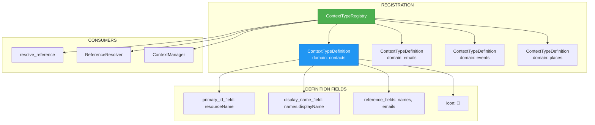

# ADR-016: ContextTypeRegistry Pattern

**Status**: ✅ IMPLEMENTED (2025-12-21)
**Deciders**: Équipe architecture LIA
**Technical Story**: LOT 4 - Extensibilité domaines contexte
**Related Documentation**: `docs/technical/CONTEXT_RESOLUTION.md`

---

## Context and Problem Statement

Le système de résolution de références (`resolve_reference`) devait supporter plusieurs domaines (contacts, emails, events, etc.) avec des caractéristiques différentes :

1. **Champs ID différents** : `resourceName` (contacts), `id` (emails), `eventId` (events)
2. **Champs d'affichage différents** : `names[0].displayName` (contacts), `subject` (emails)
3. **Stratégies de matching différentes** : Fuzzy sur nom, exact sur email
4. **Hardcoding** : Chaque domaine nécessitait du code spécifique

**Question** : Comment rendre le système de contexte générique et extensible à tout nouveau domaine ?

---

## Decision Drivers

### Must-Have (Non-Negotiable):

1. **Généricité** : `resolve_reference` fonctionne pour tous les domaines
2. **Extensibilité** : Ajouter un domaine = 1 registration, pas de code
3. **Type Safety** : Validation Pydantic des définitions
4. **Auto-discovery** : Lister les domaines disponibles

### Nice-to-Have:

- Icônes pour UI
- Stratégies de matching configurables
- Validation schema des items

---

## Decision Outcome

**Chosen option**: "**ContextTypeRegistry avec ContextTypeDefinition**"

### Architecture Overview



### ContextTypeDefinition Schema

```python
# apps/api/src/domains/agents/context/registry.py

class ContextTypeDefinition(BaseModel):
    """
    Definition of a context type for the registry.

    Describes how to handle items of a specific domain:
    - How to identify them (primary_id_field)
    - How to display them (display_name_field)
    - How to match references (reference_fields)
    """

    domain: str = Field(
        ...,
        description="Unique domain identifier (e.g., 'contacts', 'emails')"
    )

    agent_name: str = Field(
        ...,
        description="Agent that handles this domain"
    )

    item_schema: type[BaseModel] | None = Field(
        default=None,
        description="Pydantic schema for item validation (optional)"
    )

    primary_id_field: str = Field(
        ...,
        description="Field path for unique identifier (e.g., 'resourceName', 'id')"
    )

    display_name_field: str = Field(
        ...,
        description="Field path for display name (e.g., 'names[0].displayName', 'subject')"
    )

    reference_fields: list[str] = Field(
        default_factory=list,
        description="Fields to search for fuzzy matching (e.g., ['names', 'emailAddresses'])"
    )

    icon: str = Field(
        default="📄",
        description="Emoji icon for UI display"
    )

    # Advanced matching configuration
    fuzzy_threshold: float = Field(
        default=0.7,
        ge=0.0,
        le=1.0,
        description="Minimum similarity score for fuzzy matching"
    )

    case_sensitive: bool = Field(
        default=False,
        description="Whether reference matching is case-sensitive"
    )
```

### ContextTypeRegistry (Singleton)

```python
# apps/api/src/domains/agents/context/registry.py

class ContextTypeRegistry:
    """
    Central registry for context type definitions.

    Singleton pattern ensures consistent access across the application.
    Allows dynamic registration of new context types.
    """

    _definitions: ClassVar[dict[str, ContextTypeDefinition]] = {}
    _lock: ClassVar[threading.Lock] = threading.Lock()

    @classmethod
    def register(cls, definition: ContextTypeDefinition) -> None:
        """
        Register a new context type definition.

        Args:
            definition: ContextTypeDefinition to register

        Raises:
            ValueError: If domain already registered
        """
        with cls._lock:
            if definition.domain in cls._definitions:
                raise ValueError(f"Domain '{definition.domain}' already registered")

            cls._definitions[definition.domain] = definition
            logger.info(
                "context_type_registered",
                domain=definition.domain,
                agent=definition.agent_name,
                primary_id=definition.primary_id_field,
            )

    @classmethod
    def get_definition(cls, domain: str) -> ContextTypeDefinition:
        """
        Get definition for a domain.

        Args:
            domain: Domain identifier

        Returns:
            ContextTypeDefinition for the domain

        Raises:
            ValueError: If domain not registered
        """
        if domain not in cls._definitions:
            available = list(cls._definitions.keys())
            raise ValueError(
                f"Domain '{domain}' not registered. "
                f"Available: {available}"
            )
        return cls._definitions[domain]

    @classmethod
    def list_all(cls) -> list[str]:
        """List all registered domain names."""
        return list(cls._definitions.keys())

    @classmethod
    def has_domain(cls, domain: str) -> bool:
        """Check if a domain is registered."""
        return domain in cls._definitions
```

### Domain Registrations

```python
# apps/api/src/domains/agents/tools/google_contacts_tools.py

# Register contacts context type
ContextTypeRegistry.register(
    ContextTypeDefinition(
        domain="contacts",
        agent_name="contacts_agent",
        primary_id_field="resourceName",
        display_name_field="names[0].displayName",
        reference_fields=["names", "emailAddresses", "phoneNumbers"],
        icon="👤",
        fuzzy_threshold=0.7,
    )
)

# apps/api/src/domains/agents/tools/emails_tools.py

ContextTypeRegistry.register(
    ContextTypeDefinition(
        domain="emails",
        agent_name="emails_agent",
        primary_id_field="id",
        display_name_field="subject",
        reference_fields=["subject", "from", "snippet"],
        icon="📧",
        fuzzy_threshold=0.6,
    )
)

# apps/api/src/domains/agents/tools/calendar_tools.py

ContextTypeRegistry.register(
    ContextTypeDefinition(
        domain="events",
        agent_name="calendar_agent",
        primary_id_field="id",
        display_name_field="summary",
        reference_fields=["summary", "description", "location"],
        icon="📅",
        fuzzy_threshold=0.7,
    )
)

# apps/api/src/domains/agents/tools/places_tools.py

ContextTypeRegistry.register(
    ContextTypeDefinition(
        domain="places",
        agent_name="places_agent",
        primary_id_field="id",
        display_name_field="displayName.text",
        reference_fields=["displayName.text", "formattedAddress"],
        icon="📍",
        fuzzy_threshold=0.8,
    )
)
```

### ReferenceResolver (Generic)

```python
# apps/api/src/domains/agents/context/resolver.py

class ReferenceResolver:
    """
    Generic reference resolver using ContextTypeDefinition.

    Supports multiple resolution strategies:
    1. Numeric index: "2", "2ème", "deuxième"
    2. Keywords: "premier", "dernier", "last"
    3. Fuzzy match: "Jean" → "Jean Dupont"
    """

    def __init__(self, definition: ContextTypeDefinition):
        self.definition = definition

    def resolve(
        self,
        reference: str,
        items: list[dict[str, Any]],
    ) -> ResolutionResult:
        """
        Resolve a reference to an item in the list.

        Args:
            reference: User reference ("2", "Jean", "dernier")
            items: List of items to search

        Returns:
            ResolutionResult with success/error and matched item
        """
        # Strategy 1: Numeric index
        index_result = self._try_numeric_index(reference, items)
        if index_result.success:
            return index_result

        # Strategy 2: Keywords
        keyword_result = self._try_keyword(reference, items)
        if keyword_result.success:
            return keyword_result

        # Strategy 3: Fuzzy match on reference_fields
        fuzzy_result = self._try_fuzzy_match(reference, items)
        return fuzzy_result

    def _try_fuzzy_match(
        self,
        reference: str,
        items: list[dict],
    ) -> ResolutionResult:
        """Fuzzy match using definition.reference_fields."""
        candidates = []

        for idx, item in enumerate(items):
            for field_path in self.definition.reference_fields:
                field_value = self._extract_field(item, field_path)
                if field_value:
                    similarity = self._calculate_similarity(reference, str(field_value))
                    if similarity >= self.definition.fuzzy_threshold:
                        candidates.append({
                            "index": idx,
                            "item": item,
                            "confidence": similarity,
                            "matched_field": field_path,
                        })

        if len(candidates) == 1:
            return ResolutionResult(
                success=True,
                item=candidates[0]["item"],
                confidence=candidates[0]["confidence"],
                match_type="fuzzy",
            )
        elif len(candidates) > 1:
            return ResolutionResult(
                success=False,
                error="ambiguous",
                candidates=candidates,
            )
        else:
            return ResolutionResult(
                success=False,
                error="not_found",
            )

    def _extract_field(self, item: dict, field_path: str) -> Any:
        """Extract nested field value using dot notation."""
        # Supports: "names[0].displayName", "subject", "from.email"
        parts = field_path.replace("[", ".").replace("]", "").split(".")
        value = item
        for part in parts:
            if isinstance(value, dict):
                value = value.get(part)
            elif isinstance(value, list) and part.isdigit():
                idx = int(part)
                value = value[idx] if idx < len(value) else None
            else:
                return None
            if value is None:
                return None
        return value
```

### Usage in resolve_reference

```python
# apps/api/src/domains/agents/tools/context_tools.py

@tool
async def resolve_reference(
    reference: str,
    runtime: Annotated[ToolRuntime, InjectedToolArg],
    domain: str | None = None,
) -> str:
    """Resolve a contextual reference to an item."""

    # Get definition from registry (generic!)
    definition = ContextTypeRegistry.get_definition(domain)

    # Get items from Store
    context_list = await manager.get_list(user_id, session_id, domain, store)

    # Resolve using generic resolver
    resolver = ReferenceResolver(definition)
    result = resolver.resolve(reference, context_list.items)

    return json.dumps(result.model_dump())
```

### Extensibility Example

**Ajouter un nouveau domaine (ex: Tasks)** :

```python
# apps/api/src/domains/agents/tools/tasks_tools.py

# 1 registration = domaine complet supporté
ContextTypeRegistry.register(
    ContextTypeDefinition(
        domain="tasks",
        agent_name="tasks_agent",
        primary_id_field="id",
        display_name_field="title",
        reference_fields=["title", "notes"],
        icon="✅",
        fuzzy_threshold=0.7,
    )
)

# resolve_reference("ma tâche importante") fonctionne automatiquement!
```

### Consequences

**Positive**:
- ✅ **Généricité** : resolve_reference fonctionne pour tous les domaines
- ✅ **Extensibilité** : 1 registration = support complet
- ✅ **Zero code** : Nouveau domaine sans modifier resolve_reference
- ✅ **Type Safety** : ContextTypeDefinition validé par Pydantic
- ✅ **Auto-discovery** : `list_all()` pour UI/debugging
- ✅ **Configurable** : Thresholds, fields, icons par domaine

**Negative**:
- ⚠️ Registration obligatoire (erreur si oublié)
- ⚠️ Field paths doivent être corrects

---

## Validation

**Acceptance Criteria**:
- [x] ✅ ContextTypeDefinition schema complet
- [x] ✅ ContextTypeRegistry singleton thread-safe
- [x] ✅ ReferenceResolver générique
- [x] ✅ 6+ domaines enregistrés (contacts, emails, events, places, tasks, files)
- [x] ✅ resolve_reference générique

---

## Related Decisions

- [ADR-011: Utility Tools](ADR-011-Utility-Tools-vs-Connector-Tools.md) - context_tools utilise registry
- [ADR-012: StandardToolOutput](ADR-012-Data-Registry-StandardToolOutput-Pattern.md) - RegistryItem types

---

## References

### Source Code
- **Registry**: `apps/api/src/domains/agents/context/registry.py`
- **Resolver**: `apps/api/src/domains/agents/context/resolver.py`
- **Context Tools**: `apps/api/src/domains/agents/tools/context_tools.py`

### Registrations
- **Contacts**: `apps/api/src/domains/agents/tools/google_contacts_tools.py`
- **Emails**: `apps/api/src/domains/agents/tools/emails_tools.py`
- **Calendar**: `apps/api/src/domains/agents/tools/calendar_tools.py`
- **Places**: `apps/api/src/domains/agents/tools/places_tools.py`

---

**Fin de ADR-016** - ContextTypeRegistry Pattern Decision Record.
