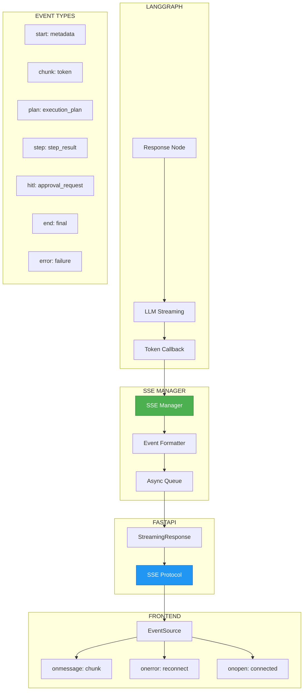

# ADR-018: SSE Streaming Pattern

**Status**: ✅ IMPLEMENTED (2025-12-21)
**Deciders**: Équipe architecture LIA
**Technical Story**: Real-time response streaming
**Related Documentation**: `docs/technical/SSE_STREAMING.md`

---

## Context and Problem Statement

L'assistant doit streamer les réponses en temps réel vers le frontend :

1. **Latence perçue** : Attendre 5-10s pour une réponse complète = mauvaise UX
2. **Feedback progressif** : Afficher tokens au fur et à mesure
3. **HITL interrupts** : Notifier le frontend des demandes d'approbation
4. **Metadata** : Envoyer plan, étapes exécutées, erreurs en temps réel

**Question** : Comment implémenter le streaming bidirectionnel entre LangGraph et le frontend ?

---

## Decision Drivers

### Must-Have (Non-Negotiable):

1. **Token streaming** : Afficher chaque token dès qu'il est généré
2. **Event types** : Distinguer start, chunk, end, error, hitl
3. **Metadata** : Envoyer plan et progress
4. **Reconnection** : Gérer les déconnexions réseau

### Nice-to-Have:

- Backpressure handling
- Event ID pour replay
- Heartbeat keep-alive

---

## Decision Outcome

**Chosen option**: "**Server-Sent Events (SSE) avec Event Types**"

### Architecture Overview



### SSE Event Types

```python
# apps/api/src/domains/agents/streaming/events.py

class SSEEventType(str, Enum):
    """Server-Sent Event types."""

    # Lifecycle events
    START = "start"           # Stream started, contains metadata
    END = "end"               # Stream completed successfully
    ERROR = "error"           # Stream failed with error

    # Content events
    CHUNK = "chunk"           # Token chunk from LLM
    PLAN = "plan"             # ExecutionPlan generated
    STEP = "step"             # Step execution result
    METADATA = "metadata"     # Additional metadata

    # HITL events
    HITL_REQUIRED = "hitl_required"     # Approval needed
    HITL_RESPONSE = "hitl_response"     # User responded

    # Debug events (actual implementation uses ChatStreamChunk.type literals)
    # debug_metrics          — Full debug metrics from QueryIntelligence (emitted at each values chunk)
    # debug_metrics_update   — Supplementary metrics from background tasks (v1.8.1, emitted once after await_run_id_tasks)


@dataclass
class SSEEvent:
    """Server-Sent Event structure."""

    event: SSEEventType
    data: dict[str, Any]
    id: str | None = None
    retry: int | None = None

    def format(self) -> str:
        """Format as SSE protocol string."""
        lines = []
        if self.id:
            lines.append(f"id: {self.id}")
        if self.retry:
            lines.append(f"retry: {self.retry}")
        lines.append(f"event: {self.event.value}")
        lines.append(f"data: {json.dumps(self.data, ensure_ascii=False)}")
        lines.append("")  # Empty line terminates event
        return "\n".join(lines) + "\n"
```

### SSE Manager

```python
# apps/api/src/domains/agents/streaming/manager.py

class SSEManager:
    """
    Manages Server-Sent Events streaming for a conversation.

    Handles:
    - Token streaming from LLM
    - Plan/step metadata events
    - HITL interrupt events
    - Error handling
    - Graceful shutdown
    """

    def __init__(self, conversation_id: str):
        self.conversation_id = conversation_id
        self.queue: asyncio.Queue[SSEEvent] = asyncio.Queue()
        self.is_closed: bool = False
        self._event_counter: int = 0

    async def send_start(self, metadata: dict[str, Any]) -> None:
        """Send stream start event with metadata."""
        await self._enqueue(SSEEvent(
            event=SSEEventType.START,
            data={
                "conversation_id": self.conversation_id,
                "timestamp": datetime.utcnow().isoformat(),
                **metadata,
            },
            id=self._next_id(),
        ))

    async def send_chunk(self, token: str) -> None:
        """Send token chunk event."""
        if not token:
            return
        await self._enqueue(SSEEvent(
            event=SSEEventType.CHUNK,
            data={"token": token},
        ))

    async def send_plan(self, plan: ExecutionPlan) -> None:
        """Send execution plan event."""
        await self._enqueue(SSEEvent(
            event=SSEEventType.PLAN,
            data={
                "plan_id": plan.plan_id,
                "steps": [s.model_dump() for s in plan.steps],
                "requires_approval": plan.requires_approval,
            },
            id=self._next_id(),
        ))

    async def send_step_result(self, step_id: str, result: StepResult) -> None:
        """Send step execution result event."""
        await self._enqueue(SSEEvent(
            event=SSEEventType.STEP,
            data={
                "step_id": step_id,
                "status": result.status,
                "duration_ms": result.duration_ms,
                "summary": result.summary_for_llm[:200] if result.summary_for_llm else None,
            },
            id=self._next_id(),
        ))

    async def send_hitl_required(self, request: HITLRequest) -> None:
        """Send HITL approval request event."""
        await self._enqueue(SSEEvent(
            event=SSEEventType.HITL_REQUIRED,
            data={
                "request_id": request.id,
                "action_type": request.action_type,
                "description": request.description,
                "draft": request.draft_content,
                "options": request.options,
            },
            id=self._next_id(),
        ))

    async def send_end(self, final_response: str | None = None) -> None:
        """Send stream end event."""
        await self._enqueue(SSEEvent(
            event=SSEEventType.END,
            data={
                "final_response": final_response,
                "timestamp": datetime.utcnow().isoformat(),
            },
            id=self._next_id(),
        ))
        self.is_closed = True

    async def send_error(self, error: str, error_type: str = "unknown") -> None:
        """Send error event."""
        await self._enqueue(SSEEvent(
            event=SSEEventType.ERROR,
            data={
                "error": error,
                "error_type": error_type,
                "timestamp": datetime.utcnow().isoformat(),
            },
            id=self._next_id(),
        ))
        self.is_closed = True

    async def _enqueue(self, event: SSEEvent) -> None:
        """Add event to queue."""
        if not self.is_closed:
            await self.queue.put(event)

    def _next_id(self) -> str:
        """Generate next event ID."""
        self._event_counter += 1
        return f"{self.conversation_id}:{self._event_counter}"

    async def __aiter__(self):
        """Async iterator for SSE events."""
        while not self.is_closed or not self.queue.empty():
            try:
                event = await asyncio.wait_for(
                    self.queue.get(),
                    timeout=30.0,  # Heartbeat timeout
                )
                yield event.format()
            except asyncio.TimeoutError:
                # Send heartbeat to keep connection alive
                yield ": heartbeat\n\n"
```

### FastAPI Streaming Endpoint

```python
# apps/api/src/api/v1/routes.py

@router.post("/conversations/{conversation_id}/messages/stream")
async def stream_message(
    conversation_id: str,
    request: MessageRequest,
    user: User = Depends(get_current_user),
) -> StreamingResponse:
    """
    Stream assistant response via Server-Sent Events.

    Event types:
    - start: Stream started with metadata
    - chunk: Token from LLM response
    - plan: ExecutionPlan generated
    - step: Step execution result
    - hitl_required: HITL approval needed
    - end: Stream completed
    - error: Stream failed
    """
    sse_manager = SSEManager(conversation_id)

    async def event_generator():
        try:
            # Send start event
            await sse_manager.send_start({
                "user_id": str(user.id),
                "message": request.message[:100],
            })

            # Create streaming callback
            callback = SSEStreamingCallback(sse_manager)

            # Run LangGraph with streaming
            async for event in graph.astream_events(
                input={"messages": [HumanMessage(content=request.message)]},
                config={
                    "configurable": {
                        "user_id": str(user.id),
                        "thread_id": conversation_id,
                    },
                    "callbacks": [callback],
                },
            ):
                # Process LangGraph events
                if event["event"] == "on_chat_model_stream":
                    chunk = event["data"]["chunk"]
                    if chunk.content:
                        await sse_manager.send_chunk(chunk.content)

                elif event["event"] == "on_tool_end":
                    # Step completed
                    pass

            # Send end event
            await sse_manager.send_end()

        except Exception as e:
            logger.error("stream_error", error=str(e), exc_info=True)
            # v1.8.0: SSEErrorMessages.generic_error() detects LLM provider errors
            # (OverloadedError, RateLimitError) and returns user-friendly i18n messages
            # instead of raw exception type names
            await sse_manager.send_error(str(e), type(e).__name__)

        # Yield all queued events
        async for formatted_event in sse_manager:
            yield formatted_event

    return StreamingResponse(
        event_generator(),
        media_type="text/event-stream",
        headers={
            "Cache-Control": "no-cache",
            "Connection": "keep-alive",
            "X-Accel-Buffering": "no",  # Disable nginx buffering
        },
    )
```

### LangGraph Streaming Callback

```python
# apps/api/src/domains/agents/streaming/callbacks.py

class SSEStreamingCallback(BaseCallbackHandler):
    """
    LangChain callback handler for SSE streaming.

    Captures LLM tokens and tool events for real-time streaming.
    """

    def __init__(self, sse_manager: SSEManager):
        self.sse_manager = sse_manager

    async def on_llm_new_token(self, token: str, **kwargs) -> None:
        """Called when LLM generates a new token."""
        await self.sse_manager.send_chunk(token)

    async def on_tool_start(
        self,
        serialized: dict[str, Any],
        input_str: str,
        **kwargs,
    ) -> None:
        """Called when a tool starts execution."""
        tool_name = serialized.get("name", "unknown")
        logger.debug("tool_started", tool=tool_name)

    async def on_tool_end(self, output: str, **kwargs) -> None:
        """Called when a tool finishes execution."""
        # Step result sent via SSEManager.send_step_result()
        pass

    async def on_llm_error(self, error: Exception, **kwargs) -> None:
        """Called when LLM encounters an error."""
        await self.sse_manager.send_error(str(error), "llm_error")
```

### Frontend EventSource Handler

```typescript
// apps/web/src/hooks/useSSE.ts

export function useConversationStream(conversationId: string) {
  const [tokens, setTokens] = useState<string>("");
  const [plan, setPlan] = useState<ExecutionPlan | null>(null);
  const [hitlRequest, setHitlRequest] = useState<HITLRequest | null>(null);
  const [isStreaming, setIsStreaming] = useState(false);
  const [error, setError] = useState<string | null>(null);

  const startStream = useCallback(async (message: string) => {
    setIsStreaming(true);
    setTokens("");
    setError(null);

    const eventSource = new EventSource(
      `/api/v1/conversations/${conversationId}/messages/stream`,
      { withCredentials: true }
    );

    eventSource.addEventListener("start", (e) => {
      const data = JSON.parse(e.data);
      console.log("Stream started:", data);
    });

    eventSource.addEventListener("chunk", (e) => {
      const data = JSON.parse(e.data);
      setTokens((prev) => prev + data.token);
    });

    eventSource.addEventListener("plan", (e) => {
      const data = JSON.parse(e.data);
      setPlan(data);
    });

    eventSource.addEventListener("hitl_required", (e) => {
      const data = JSON.parse(e.data);
      setHitlRequest(data);
      // Pause streaming, wait for user response
    });

    eventSource.addEventListener("end", (e) => {
      setIsStreaming(false);
      eventSource.close();
    });

    eventSource.addEventListener("error", (e) => {
      if (e.data) {
        const data = JSON.parse(e.data);
        setError(data.error);
      }
      setIsStreaming(false);
      eventSource.close();
    });

    eventSource.onerror = () => {
      // Connection error, attempt reconnect
      if (eventSource.readyState === EventSource.CLOSED) {
        setIsStreaming(false);
      }
    };

    return () => eventSource.close();
  }, [conversationId]);

  return { tokens, plan, hitlRequest, isStreaming, error, startStream };
}
```

### Consequences

**Positive**:
- ✅ **Real-time** : Tokens affichés dès génération
- ✅ **Event types** : Structure claire pour différents événements
- ✅ **HITL ready** : Interruptions propres pour approbation
- ✅ **Reconnection** : EventSource gère reconnexion automatique
- ✅ **Event IDs** : Replay possible après déconnexion
- ✅ **Heartbeat** : Keep-alive pour connexions longues

**Negative**:
- ⚠️ Unidirectionnel (server → client seulement)
- ⚠️ Pas de compression native
- ⚠️ Limite connexions par domaine (6 par browser)

---

## Validation

**Acceptance Criteria**:
- [x] ✅ SSEManager avec queue async
- [x] ✅ 7 event types (start, chunk, plan, step, hitl, end, error)
- [x] ✅ FastAPI StreamingResponse
- [x] ✅ LangChain callback handler
- [x] ✅ Frontend EventSource hook
- [x] ✅ Heartbeat keep-alive

---

## Related Decisions

- [ADR-014: ExecutionPlan](ADR-014-ExecutionPlan-Parallel-Executor.md) - Plan streamed via SSE
- [ADR-008: HITL Plan-Level Approval](ADR_INDEX.md#adr-008) - HITL events via SSE

---

## References

### Source Code
- **SSE Manager**: `apps/api/src/domains/agents/streaming/manager.py`
- **Events**: `apps/api/src/domains/agents/streaming/events.py`
- **Callbacks**: `apps/api/src/domains/agents/streaming/callbacks.py`
- **Route**: `apps/api/src/api/v1/routes.py`
- **Frontend Hook**: `apps/web/src/hooks/useSSE.ts`

### External References
- **SSE Spec**: https://html.spec.whatwg.org/multipage/server-sent-events.html
- **EventSource API**: https://developer.mozilla.org/en-US/docs/Web/API/EventSource

---

**Fin de ADR-018** - SSE Streaming Pattern Decision Record.
