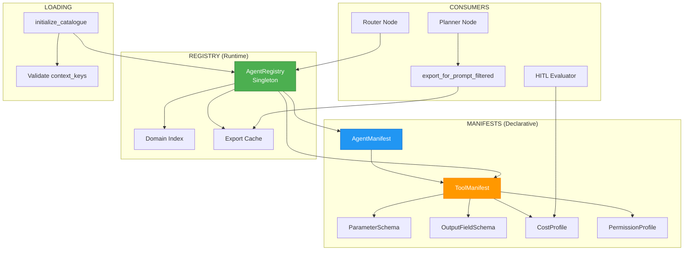

# ADR-019: Agent Manifest & Catalogue System

**Status**: ✅ IMPLEMENTED (2025-12-21)
**Deciders**: Équipe architecture LIA
**Technical Story**: Phase 5 - Dynamic Agent Registry & Domain Filtering
**Related Documentation**: `docs/technical/CATALOGUE_SYSTEM.md`

---

## Context and Problem Statement

L'orchestration multi-agents nécessitait un système de gestion des agents et tools :

1. **Découverte dynamique** : Quels agents/tools sont disponibles ?
2. **Métadonnées riches** : Coûts, permissions, scopes OAuth, HITL requirements
3. **Filtrage par domaine** : Réduire tokens en chargeant uniquement les tools pertinents
4. **Documentation auto** : Générer catalogue pour LLM Planner

**Question** : Comment implémenter un registre centralisé avec manifestes déclaratifs ?

---

## Decision Drivers

### Must-Have (Non-Negotiable):

1. **Single Source of Truth** : Manifestes = documentation + runtime config
2. **Type Safety** : Validation Pydantic des manifestes
3. **Domain Filtering** : Export filtré pour Planner (token optimization)
4. **Cost Tracking** : Estimation coûts par tool pour HITL decisions

### Nice-to-Have:

- Cache des exports (TTL-based)
- Validation fail-fast au démarrage
- Display metadata pour UI

---

## Decision Outcome

**Chosen option**: "**AgentManifest + ToolManifest + AgentRegistry Pattern**"

### Architecture Overview



### AgentManifest Schema

```python
# apps/api/src/domains/agents/registry/catalogue.py

@dataclass
class AgentManifest:
    """Manifeste d'un agent - Déclaration complète des capacités."""

    # Identity
    name: str                        # e.g., "contacts_agent"
    description: str                 # Capabilities description for LLM
    tools: list[str]                 # Tool names available to this agent

    # Execution constraints
    max_parallel_runs: int = 1       # Concurrent instance limit
    default_timeout_ms: int = 30000  # Default execution timeout

    # Prompt version
    prompt_version: str = "v1"       # Agent prompt system version

    # Ownership
    owner_team: str = "Team AI"

    # Versioning
    version: str = "1.0.0"           # Semver versioning
    updated_at: datetime             # Last modification timestamp

    # Display metadata (optional)
    display: DisplayMetadata | None  # UI rendering (emoji, i18n_key, category)
```

### ToolManifest Schema

```python
@dataclass
class ToolManifest:
    """Manifeste complet d'un tool - Source unique de vérité."""

    # Identity
    name: str                        # e.g., "search_contacts_tool"
    agent: str                       # e.g., "contacts_agent" (ownership)
    description: str                 # Complete description for LLM

    # Contract
    parameters: list[ParameterSchema]    # Input parameters with validation
    outputs: list[OutputFieldSchema]     # Output documentation

    # Cost & Performance
    cost: CostProfile                # Token estimates, latency, USD cost

    # Security
    permissions: PermissionProfile   # Required scopes, roles, data classification, HITL

    # Behavior
    max_iterations: int = 1          # Max iterations (for iterative tools)
    supports_dry_run: bool = False
    reference_fields: list[str]      # Fields usable as context references
    context_key: str | None          # Auto-save to Store (e.g., "contacts")
    field_mappings: dict[str, str] | None  # User-friendly → API field names

    # Documentation
    examples: list[dict[str, Any]]
    examples_in_prompt: bool = True
    reference_examples: list[str]    # Valid $steps references

    # Versioning
    version: str = "1.0.0"
    updated_at: datetime
    maintainer: str = "Team AI"

    # Display
    display: DisplayMetadata | None
```

### Supporting Data Classes

```python
@dataclass(frozen=True)
class ParameterSchema:
    """Input parameter validation schema."""
    name: str
    type: str  # "string", "integer", "boolean", "array", "object"
    required: bool
    description: str
    constraints: list[ParameterConstraint]  # min_length, max_length, pattern, enum
    schema: dict[str, Any] | None  # Full JSON Schema for complex types

@dataclass(frozen=True)
class CostProfile:
    """Resource estimation for HITL cost-based decisions."""
    est_tokens_in: int = 0       # Input token estimate
    est_tokens_out: int = 0      # Output token estimate
    est_cost_usd: float = 0.0    # Estimated USD cost
    est_latency_ms: int = 0      # Expected latency

@dataclass(frozen=True)
class PermissionProfile:
    """Security requirements for tool execution."""
    required_scopes: list[str] = field(default_factory=list)
    allowed_roles: list[str] = field(default_factory=list)
    data_classification: Literal[
        "PUBLIC", "INTERNAL", "CONFIDENTIAL", "SENSITIVE", "RESTRICTED"
    ] = "CONFIDENTIAL"
    hitl_required: bool = False  # Human-in-the-Loop approval needed?
```

### AgentRegistry (Singleton)

```python
# apps/api/src/domains/agents/registry/agent_registry.py

class AgentRegistry:
    """
    Central registry for all agents and tools.

    Responsibilities:
    - Store AgentManifest and ToolManifest
    - Build domain index for filtering
    - Export catalogue for Planner LLM
    - Cache exports with TTL
    """

    def __init__(self):
        self._agent_manifests: dict[str, AgentManifest] = {}
        self._tool_manifests: dict[str, ToolManifest] = {}
        self._domain_to_agents: dict[str, list[str]] = {}
        self._domain_to_tools: dict[str, list[str]] = {}
        self._prompt_export_cache: dict[str, Any] | None = None
        self._filtered_cache: dict[str, dict[str, Any]] = {}

    def register_agent_manifest(self, manifest: AgentManifest) -> None:
        """Register agent and invalidate caches."""
        self._agent_manifests[manifest.name] = manifest
        self._invalidate_prompt_cache()

    def register_tool_manifest(self, manifest: ToolManifest) -> None:
        """Register tool and validate agent exists."""
        if manifest.agent not in self._agent_manifests:
            logger.warning(f"Tool '{manifest.name}' orphan: agent '{manifest.agent}' not found")
        self._tool_manifests[manifest.name] = manifest
        self._invalidate_prompt_cache()

    def _build_domain_index(self) -> None:
        """Build domain → agents → tools mapping for fast filtered lookups."""
        for domain_key, config in DOMAIN_REGISTRY.items():
            self._domain_to_agents[domain_key] = config.agent_names
            self._domain_to_tools[domain_key] = [
                tool.name for tool in self._tool_manifests.values()
                if tool.agent in config.agent_names
            ]
```

### Domain Filtering Export

```python
def export_for_prompt_filtered(
    self,
    domains: list[str] | None = None,
    max_tools_per_domain: int = 10,
    include_context_utilities: bool = True,
    tool_strategy: str = "full",
) -> dict[str, Any]:
    """
    Export catalogue optimized for LLM with domain filtering.

    Architecture: Hybrid (Registry Metadata + LLM Reasoning)
    - Router detects relevant domains (lightweight LLM call)
    - Planner loads ONLY tools from detected domains
    - Token reduction: 80-90% for single-domain queries (40K → 4K tokens)

    Tool Strategies (Phase C Token Optimization):
    - "full": All tools for domain (~6 tools/domain)
    - "essential": search/list + details + CRUD tools (~3-4 tools)
    - "minimal": search/list + read-only tools (~2 tools, 70% savings)
    """
    # Auto-include cross-domain utilities
    if include_context_utilities:
        if "context" not in domains:
            domains.append("context")

    # Filter tools by domain
    filtered_tools = []
    for domain in domains:
        domain_tools = self._domain_to_tools.get(domain, [])
        filtered_tools.extend(domain_tools[:max_tools_per_domain])

    # Build export structure for Planner
    return {
        "reference_guide": {...},  # Valid $steps references
        "agents": [
            {
                "agent": agent_name,
                "description": manifest.description,
                "tools": [self._format_tool(t) for t in tools],
            }
            for agent_name, manifest, tools in self._group_by_agent(filtered_tools)
        ]
    }
```

### Catalogue Initialization

```python
# apps/api/src/domains/agents/registry/catalogue_loader.py

def initialize_catalogue(registry: AgentRegistry) -> None:
    """
    Initialises le catalogue avec les manifestes Phase 5 + LOT 9/10.

    - Imports manifests from domain-specific modules
    - Registers 10 agent manifests
    - Registers 29+ tool manifests
    - Builds domain index for dynamic filtering
    - Validates context_key registrations (fail-fast)
    """
    # Phase 1: Import domain manifests
    from src.domains.agents.google_contacts.catalogue_manifests import (
        search_contacts_catalogue_manifest,
        list_contacts_catalogue_manifest,
        # ...
    )

    # Phase 2: Register agents
    registry.register_agent_manifest(CONTACTS_AGENT_MANIFEST)
    registry.register_agent_manifest(EMAILS_AGENT_MANIFEST)
    # ... 10 agents total

    # Phase 3: Register tools
    registry.register_tool_manifest(search_contacts_catalogue_manifest)
    # ... 29+ tools total

    # Phase 4: Build domain index
    registry._build_domain_index()

    # Phase 5: Validate context_key registrations (fail-fast)
    _validate_context_key_registrations(registry, logger)
```

### Domain Registry (Declarative)

```python
# apps/api/src/domains/agents/registry/domain_taxonomy.py

DOMAIN_REGISTRY: dict[str, DomainConfig] = {
    "contacts": DomainConfig(
        name="contacts",
        display_name="Google Contacts",
        description="Search, list, and retrieve Google Contacts",
        keywords=["contact", "person", "phone", "email", "address"],
        agent_names=["contacts_agent"],
        related_domains=["email"],  # Smart expansion
        priority=8,  # 1-10 scale
        is_routable=True,
        metadata={"provider": "google", "requires_oauth": True},
    ),
    "context": DomainConfig(
        # NOT ROUTABLE: Internal utilities always auto-loaded
        is_routable=False,
        agent_names=["context_agent"],
        metadata={"cross_domain": True},
    ),
    # ... 10 domains total
}
```

### Consequences

**Positive**:
- ✅ **Single Source of Truth** : Manifestes = documentation + runtime
- ✅ **Token Optimization** : 80-90% reduction via domain filtering
- ✅ **Cost Tracking** : CostProfile enables HITL cost-based decisions
- ✅ **Security** : PermissionProfile + HITL flags
- ✅ **Fail-Fast** : context_key validation at startup
- ✅ **Caching** : Export cache with TTL (1h full, 5min filtered)

**Negative**:
- ⚠️ Duplication potentielle (manifest vs tool implementation)
- ⚠️ Overhead mémoire (tous manifestes en RAM)

---

## Validation

**Acceptance Criteria**:
- [x] ✅ AgentManifest schema avec tous les champs
- [x] ✅ ToolManifest schema avec CostProfile, PermissionProfile
- [x] ✅ AgentRegistry singleton avec domain index
- [x] ✅ export_for_prompt_filtered avec tool strategies
- [x] ✅ 10 agents + 29+ tools registered
- [x] ✅ Domain taxonomy avec routing flags

---

## Related Decisions

- [ADR-003: Multi-Domain Dynamic Filtering](ADR-003-Multi-Domain-Dynamic-Filtering.md) - Uses catalogue for filtering
- [ADR-008: HITL Plan-Level Approval](ADR_INDEX.md#adr-008) - Uses CostProfile for decisions
- [ADR-014: ExecutionPlan](ADR-014-ExecutionPlan-Parallel-Executor.md) - Planner consumes catalogue

---

## References

### Source Code
- **AgentManifest/ToolManifest**: `apps/api/src/domains/agents/registry/catalogue.py`
- **AgentRegistry**: `apps/api/src/domains/agents/registry/agent_registry.py`
- **Catalogue Loader**: `apps/api/src/domains/agents/registry/catalogue_loader.py`
- **Domain Taxonomy**: `apps/api/src/domains/agents/registry/domain_taxonomy.py`
- **Domain Manifests**: `apps/api/src/domains/agents/{domain}/catalogue_manifests.py`

---

**Fin de ADR-019** - Agent Manifest & Catalogue System Decision Record.
