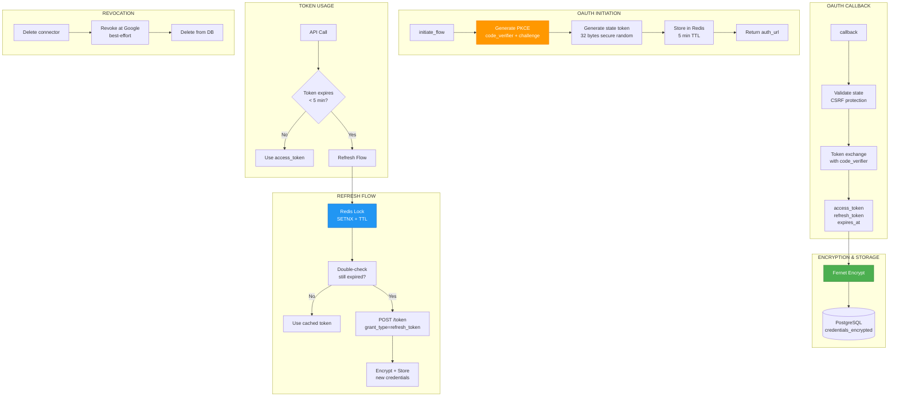

# ADR-021: OAuth Token Lifecycle Management

**Status**: ✅ IMPLEMENTED (2025-12-21)
**Deciders**: Équipe architecture LIA
**Technical Story**: Secure OAuth integration with Google APIs
**Related Documentation**: `docs/technical/OAUTH_SECURITY.md`

---

## Context and Problem Statement

L'intégration Google APIs (Gmail, Calendar, Contacts, Drive) nécessitait une gestion sécurisée des tokens OAuth :

1. **Stockage sécurisé** : Tokens ne doivent pas être lisibles en DB
2. **Refresh automatique** : Éviter expiration mid-request
3. **Race conditions** : Multiples instances refreshant en parallèle
4. **Revocation** : Nettoyage propre lors de déconnexion

**Question** : Comment implémenter un cycle de vie OAuth complet et sécurisé ?

---

## Decision Drivers

### Must-Have (Non-Negotiable):

1. **Encryption at Rest** : Tokens chiffrés en base de données
2. **Automatic Refresh** : Proactive refresh avant expiration
3. **Distributed Lock** : Éviter refreshs concurrents
4. **PKCE** : Protection contre interception de code

### Nice-to-Have:

- Token rotation handling (Google peut changer refresh_token)
- Circuit breaker pour APIs externes
- Retry avec exponential backoff

---

## Decision Outcome

**Chosen option**: "**Fernet Encryption + Redis Lock + Proactive Refresh**"

### Architecture Overview



### Fernet Encryption

```python
# apps/api/src/core/security/utils.py

from cryptography.fernet import Fernet

# Initialized with FERNET_KEY from environment
cipher_suite = Fernet(settings.fernet_key.encode())

def encrypt_data(data: str) -> str:
    """Encrypt sensitive data using Fernet symmetric encryption.
    Used for storing OAuth tokens, API keys, etc."""
    return cipher_suite.encrypt(data.encode()).decode()

def decrypt_data(encrypted_data: str) -> str:
    """Decrypt sensitive data using Fernet symmetric encryption."""
    try:
        return cipher_suite.decrypt(encrypted_data.encode()).decode()
    except Exception as exc:
        raise ValueError(f"Failed to decrypt data: {exc!s}") from exc
```

### Connector Model

```python
# apps/api/src/domains/connectors/models.py

class Connector(BaseModel):
    """Connector model for user external service connections."""

    __tablename__ = "connectors"

    user_id: Mapped[uuid.UUID] = mapped_column(
        ForeignKey("users.id", ondelete="CASCADE"),
        nullable=False,
        index=True,
    )
    connector_type: Mapped[ConnectorType] = mapped_column(
        Enum(ConnectorType, native_enum=False),
        nullable=False,
        index=True,
    )
    status: Mapped[ConnectorStatus] = mapped_column(
        Enum(ConnectorStatus, native_enum=False),
        nullable=False,
        default=ConnectorStatus.ACTIVE,
    )

    # OAuth scopes granted by user
    scopes: Mapped[list[str]] = mapped_column(JSONB, nullable=False, default=list)

    # Encrypted credentials (access_token, refresh_token, etc.)
    credentials_encrypted: Mapped[str] = mapped_column(Text, nullable=False)

    # Additional connector-specific metadata
    connector_metadata: Mapped[dict[str, Any] | None] = mapped_column(
        "metadata", JSONB, nullable=True
    )


class ConnectorCredentials(BaseModel):
    """Internal schema for decrypted connector credentials."""

    access_token: str
    refresh_token: str | None = None
    token_type: str = "Bearer"
    expires_at: datetime | None = None
```

### PKCE Flow (OAuth 2.1)

```python
# apps/api/src/core/oauth/flow_handler.py

async def initiate_flow(
    self,
    additional_params: dict[str, str] | None = None,
    metadata: dict[str, str] | None = None,
) -> tuple[str, str]:
    """Initiate OAuth authorization flow with PKCE."""

    # Generate cryptographically secure tokens
    state = generate_state_token()  # 32 bytes hex
    code_verifier = generate_code_verifier()  # 43-128 chars
    code_challenge = generate_code_challenge(code_verifier)  # SHA-256

    # Store state in Redis with short TTL
    await self.session_service.store_oauth_state(
        state,
        {
            "code_verifier": code_verifier,
            "connector_type": self.provider.provider_name,
            **(metadata or {}),
        },
        expire_minutes=5,  # Short-lived for security
    )

    # Build authorization URL with PKCE
    params = {
        "client_id": self.provider.client_id,
        "redirect_uri": self.provider.redirect_uri,
        "response_type": "code",
        "scope": " ".join(self.provider.scopes),
        "state": state,
        "code_challenge": code_challenge,
        "code_challenge_method": "S256",  # SHA-256 (most secure)
        **(additional_params or {}),
    }

    auth_url = f"{self.provider.authorization_endpoint}?{urlencode(params)}"
    return auth_url, state
```

### Proactive Token Refresh

```python
# apps/api/src/domains/connectors/clients/base_oauth_client.py

OAUTH_TOKEN_REFRESH_MARGIN_SECONDS = 300  # 5 minutes buffer

def _is_token_expired_or_expiring_soon(self) -> bool:
    """Check if token is expired or will expire within the safety margin."""
    if not self.credentials.expires_at:
        return False

    refresh_threshold = datetime.now(UTC) + timedelta(
        seconds=OAUTH_TOKEN_REFRESH_MARGIN_SECONDS
    )
    return self.credentials.expires_at < refresh_threshold


async def _ensure_valid_token(self) -> str:
    """Ensure we have a valid access token, refreshing if needed."""
    if self._is_token_expired_or_expiring_soon():
        logger.info(
            "oauth_token_refresh_needed",
            user_id=str(self.user_id),
            expires_at=self.credentials.expires_at.isoformat(),
        )
        return await self._refresh_access_token()

    return self.credentials.access_token
```

### Distributed Lock for Refresh

```python
# apps/api/src/infrastructure/locks/oauth_lock.py

class OAuthLock:
    """
    Distributed lock for OAuth token refresh operations.

    Uses Redis SETNX to ensure only one refresh at a time per user/connector.
    """

    def __init__(
        self,
        redis_client: aioredis.Redis,
        user_id: UUID,
        connector_type: ConnectorType,
        timeout_seconds: int = 10,
    ) -> None:
        self.redis = redis_client
        self.lock_key = f"oauth_lock:{user_id}:{connector_type.value}"
        self.timeout_seconds = timeout_seconds

    async def __aenter__(self) -> "OAuthLock":
        """Acquire lock with exponential backoff retry."""
        acquired = await self.redis.set(
            self.lock_key,
            "locked",
            nx=True,  # Only set if key doesn't exist
            ex=self.timeout_seconds,  # Auto-expire after timeout
        )
        if not acquired:
            # Retry with backoff...
            pass
        return self

    async def __aexit__(self, *args) -> None:
        """Release lock."""
        await self.redis.delete(self.lock_key)
```

### Token Refresh with Double-Check

```python
# apps/api/src/domains/connectors/clients/base_google_client.py

async def _refresh_access_token(self) -> str:
    """Refresh Google OAuth token using Redis lock."""

    redis_session = await get_redis_session()
    async with OAuthLock(redis_session, self.user_id, self.connector_type):
        # Double-check: another process may have refreshed
        fresh_credentials = await self.connector_service.get_connector_credentials(
            self.user_id, self.connector_type
        )

        if fresh_credentials and fresh_credentials.expires_at:
            fresh_threshold = datetime.now(UTC) + timedelta(
                seconds=OAUTH_TOKEN_REFRESH_MARGIN_SECONDS
            )
            if fresh_credentials.expires_at > fresh_threshold:
                # Another process already refreshed - use those credentials
                self.credentials = fresh_credentials
                return str(fresh_credentials.access_token)

        # Actual token refresh via connector service
        refreshed_credentials = await self.connector_service._refresh_oauth_token(
            connector, fresh_credentials
        )
        self.credentials = refreshed_credentials
        return self.credentials.access_token
```

### Token Refresh Service

```python
# apps/api/src/domains/connectors/service.py

@retry(
    retry=retry_if_exception_type((httpx.RequestError, httpx.HTTPStatusError)),
    stop=stop_after_attempt(3),
    wait=wait_exponential(multiplier=1, min=2, max=10),
    reraise=True,
)
async def _refresh_oauth_token(
    self, connector: Connector, credentials: ConnectorCredentials
) -> ConnectorCredentials:
    """Refresh OAuth access token with retry logic."""

    async with httpx.AsyncClient() as client:
        response = await client.post(
            "https://oauth2.googleapis.com/token",
            data={
                "refresh_token": credentials.refresh_token,
                "client_id": settings.google_client_id,
                "client_secret": settings.google_client_secret,
                "grant_type": "refresh_token",
            },
        )

    if response.status_code != 200:
        # Mark connector as ERROR status
        await self.repository.update(connector, {"status": ConnectorStatus.ERROR})
        await self.db.commit()
        raise_invalid_input("OAuth token refresh failed")

    token_data = response.json()
    new_access_token = token_data["access_token"]
    expires_in = token_data.get("expires_in", 3599)
    expires_at = datetime.now(UTC) + timedelta(seconds=expires_in)

    # Handle token rotation (Google may return new refresh_token)
    new_refresh_token = token_data.get("refresh_token")
    refresh_token_to_use = new_refresh_token or credentials.refresh_token

    new_credentials = ConnectorCredentials(
        access_token=new_access_token,
        refresh_token=refresh_token_to_use,
        token_type="Bearer",
        expires_at=expires_at,
    )

    # Encrypt and store
    encrypted_credentials = encrypt_data(new_credentials.model_dump_json())
    await self.repository.update_credentials(connector, encrypted_credentials)
    await self.db.commit()

    return new_credentials
```

### Token Revocation

```python
async def _revoke_oauth_token(self, connector: Connector) -> None:
    """Revoke OAuth token at provider (best effort)."""
    try:
        decrypted_json = decrypt_data(connector.credentials_encrypted)
        credentials = ConnectorCredentials.model_validate_json(decrypted_json)

        async with httpx.AsyncClient() as client:
            await client.post(
                "https://oauth2.googleapis.com/revoke",
                params={"token": credentials.access_token},
            )

        logger.info("oauth_token_revoked", connector_id=str(connector.id))

    except Exception as e:
        # Best effort - continue with deletion
        logger.warning("oauth_token_revoke_failed", error=str(e))
```

### Security Measures

| Measure | Implementation |
|---------|----------------|
| **PKCE (RFC 7636)** | code_challenge/verifier prevents code interception |
| **State Token** | CSRF protection, single-use, 5-min TTL |
| **Fernet Encryption** | Authenticated encryption for stored credentials |
| **Redis Lock** | Prevents concurrent token refresh race conditions |
| **Refresh Margin** | 5-min buffer before actual expiry (clock skew safety) |
| **Token Rotation** | Handles Google's refresh_token rotation |
| **Retry Logic** | 3 attempts with exponential backoff (2-10s) |

### OAuth Health Check System (2026-01)

Complement au proactive refresh pour notifier les utilisateurs quand une reconnexion manuelle est requise.

**Principe** : Seul `status=ERROR` declenche des notifications (refresh echoue definitivement).

```
Proactive Refresh (toutes 15 min)
    │
    ├── Succes → Token rafraichi, status=ACTIVE
    │
    └── Echec (3 retries) → status=ERROR
                              │
                              ▼
                    OAuth Health Check (toutes 5 min)
                              │
                    ┌─────────▼─────────┐
                    │ Notification user │
                    │ - Push FCM (offline)
                    │ - Modal (online)   │
                    └───────────────────┘
```

**Implementation** :
- Backend Job : `infrastructure/scheduler/oauth_health.py`
- Frontend Hook : `hooks/useConnectorHealth.ts`
- Modal : `components/connectors/ConnectorHealthAlert.tsx`

> Details : `docs/technical/OAUTH_HEALTH_CHECK.md`

### Consequences

**Positive**:
- ✅ **Encryption at Rest** : Tokens never readable in DB
- ✅ **Proactive Refresh** : No mid-request token expiration
- ✅ **Race-Safe** : Redis lock prevents concurrent refreshes
- ✅ **PKCE Compliant** : OAuth 2.1 security standard
- ✅ **Token Rotation** : Handles Google's security features
- ✅ **Health Notifications** : Users notified when reconnection needed

**Negative**:
- ⚠️ Redis dependency for locks
- ⚠️ Fernet key management (rotation strategy needed)

---

## Validation

**Acceptance Criteria**:
- [x] ✅ Fernet encryption/decryption functions
- [x] ✅ PKCE flow with code_verifier/challenge
- [x] ✅ State token avec 5-min TTL
- [x] ✅ Proactive refresh avec 5-min margin
- [x] ✅ Redis distributed lock
- [x] ✅ Token rotation handling
- [x] ✅ Best-effort revocation
- [x] ✅ Health check job pour status=ERROR
- [x] ✅ Push notifications pour users offline
- [x] ✅ Modal frontend pour reconnexion

---

## References

### Source Code
- **Encryption**: `apps/api/src/core/security/utils.py`
- **Connector Model**: `apps/api/src/domains/connectors/models.py`
- **OAuth Flow**: `apps/api/src/core/oauth/flow_handler.py`
- **Base OAuth Client**: `apps/api/src/domains/connectors/clients/base_oauth_client.py`
- **Google Client**: `apps/api/src/domains/connectors/clients/base_google_client.py`
- **OAuth Lock**: `apps/api/src/infrastructure/locks/oauth_lock.py`
- **Connector Service**: `apps/api/src/domains/connectors/service.py`
- **Health Check Job**: `apps/api/src/infrastructure/scheduler/oauth_health.py`
- **Health Check Hook**: `apps/web/src/hooks/useConnectorHealth.ts`
- **Health Alert Component**: `apps/web/src/components/connectors/ConnectorHealthAlert.tsx`

### Related Documentation
- `docs/technical/OAUTH.md` - OAuth 2.1 flow details
- `docs/technical/OAUTH_HEALTH_CHECK.md` - Health check system details

---

**Fin de ADR-021** - OAuth Token Lifecycle Management Decision Record.
