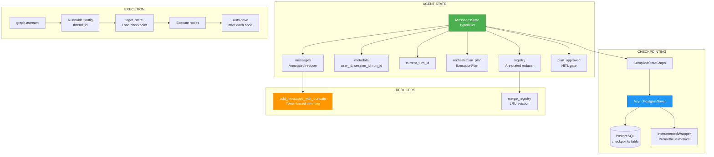

# ADR-022: LangGraph State & Checkpointing

**Status**: ✅ IMPLEMENTED (2025-12-21)
**Deciders**: Équipe architecture LIA
**Technical Story**: Stateful multi-turn conversations with persistence
**Related Documentation**: `docs/technical/LANGGRAPH_ARCHITECTURE.md`

---

## Context and Problem Statement

L'assistant conversationnel nécessitait une gestion d'état complexe :

1. **Multi-turn** : Conversations avec contexte persistant
2. **HITL Interrupts** : Pause/resume pour approbation utilisateur
3. **Fault Tolerance** : Recovery après crash ou redémarrage
4. **Scalability** : Multiple instances partageant le même état

**Question** : Comment implémenter un state management robuste avec checkpointing ?

---

## Decision Drivers

### Must-Have (Non-Negotiable):

1. **Persistence** : État survit aux redémarrages
2. **Thread Isolation** : Conversations séparées par thread_id
3. **Interrupt Support** : HITL pause/resume
4. **Reducers** : Merge intelligente des états

### Nice-to-Have:

- Métriques de performance checkpointing
- Token-based message truncation
- Schema versioning pour migrations

---

## Decision Outcome

**Chosen option**: "**PostgreSQL AsyncSaver + MessagesState + Custom Reducers**"

### Architecture Overview



### MessagesState Schema

```python
# apps/api/src/domains/agents/models.py

class MessagesState(TypedDict):
    """LangGraph state for conversational agents."""

    # Core messaging
    messages: Annotated[list[BaseMessage], add_messages_with_truncate]

    # Conversation metadata
    metadata: dict[str, Any]  # Contains user_id, session_id, run_id
    current_turn_id: int  # Conversation turn counter
    session_id: str  # Context isolation
    user_timezone: str  # IANA timezone (e.g., "Europe/Paris")
    user_language: str  # Language code (e.g., "fr", "en")
    _schema_version: str  # For backward compatibility (v1.0)

    # Routing & orchestration
    routing_history: list[Any]  # RouterOutput objects
    agent_results: dict[str, Any]  # Keys: "turn_id:agent_name"
    orchestration_plan: Any | None  # ExecutionPlan from planner
    execution_plan: Any | None  # Phase 5 planner execution
    completed_steps: dict[str, dict[str, Any]]  # asyncio.gather() results

    # Planning & validation
    planner_metadata: dict[str, Any] | None
    planner_error: dict[str, Any] | None
    validation_result: Any | None  # SemanticValidationResult
    semantic_validation: Any | None

    # HITL (Human-in-the-Loop)
    plan_approved: bool | None  # Approval gate decision
    plan_rejection_reason: str | None
    approval_evaluation: Any | None
    clarification_response: str | None
    needs_replan: bool  # Flag for clarification feedback loop
    planner_iteration: int  # Iteration counter (max: PLANNER_MAX_REPLANS)

    # Context resolution (follow-up questions)
    last_action_turn_id: int | None
    turn_type: str | None  # "action" | "reference" | "conversational"
    resolved_context: dict[str, Any] | None

    # Data Registry (frontend rendering)
    registry: Annotated[dict[str, RegistryItem], merge_registry]

    # Post-processing
    content_final_replacement: str | None
    pending_draft_critique: dict[str, Any] | None  # HITL draft confirmation
    draft_action_result: dict[str, Any] | None  # User decision

    # OAuth scopes
    oauth_scopes: list[str]
    personality_instruction: str | None
```

### PostgreSQL Checkpointer

```python
# apps/api/src/domains/agents/checkpointer.py

async def get_checkpointer() -> InstrumentedAsyncPostgresSaver:
    """
    Get or create global InstrumentedAsyncPostgresSaver instance.

    Single instance with persistent connection pool shared across all executions.
    """
    global _checkpointer

    if _checkpointer is None:
        # Convert asyncpg URL to psycopg3 format
        database_url_str = str(settings.database_url)
        psycopg_url = database_url_str.replace("postgresql+asyncpg://", "postgresql://")

        # Create persistent connection
        _connection = await AsyncConnection.connect(
            psycopg_url,
            autocommit=True,
            prepare_threshold=0,
            row_factory=dict_row,
        )

        # Wrap with instrumentation (adds Prometheus metrics)
        _checkpointer = InstrumentedAsyncPostgresSaver(conn=_connection)

        # Setup checkpoint tables (idempotent)
        await _checkpointer.setup()

    return _checkpointer
```

### Instrumented Checkpointer

```python
# apps/api/src/domains/agents/instrumented_checkpointer.py

class InstrumentedAsyncPostgresSaver(AsyncPostgresSaver):
    """Wrapper adding Prometheus metrics to checkpoint operations."""

    async def aput(
        self,
        config: RunnableConfig,
        checkpoint: Checkpoint,
        metadata: CheckpointMetadata,
        new_versions: ChannelVersions,
    ) -> RunnableConfig:
        """Save checkpoint with metrics tracking."""
        node_name = metadata.get("source", "unknown") if metadata else "unknown"
        start_time = time.perf_counter()

        try:
            result = await super().aput(config, checkpoint, metadata, new_versions)
            duration = time.perf_counter() - start_time

            # Track metrics
            checkpoint_save_duration_seconds.labels(node_name=node_name).observe(duration)
            checkpoint_operations_total.labels(operation="save", status="success").inc()
            checkpoint_size_bytes.labels(node_name=node_name).observe(size_bytes)

            return result

        except Exception as e:
            error_type = self._categorize_error(str(e))
            checkpoint_errors_total.labels(error_type=error_type, operation="save").inc()
            raise

    async def aget(self, config: RunnableConfig) -> CheckpointTuple | None:
        """Load checkpoint with metrics tracking."""
        start_time = time.perf_counter()

        try:
            result = await super().aget(config)
            duration = time.perf_counter() - start_time

            checkpoint_load_duration_seconds.labels(node_name="load").observe(duration)
            checkpoint_operations_total.labels(operation="load", status="success").inc()

            return result

        except Exception as e:
            error_type = self._categorize_error(str(e))
            checkpoint_errors_total.labels(error_type=error_type, operation="load").inc()
            raise
```

### Message Reducer with Token Truncation

```python
# apps/api/src/domains/agents/models.py

def add_messages_with_truncate(
    left: list[BaseMessage],
    right: list[BaseMessage],
) -> list[BaseMessage]:
    """
    Reducer for messages with token-based truncation.

    Strategy:
    1. Use add_messages() for RemoveMessage handling (LangGraph v1.0)
    2. Truncate by tokens (MAX_TOKENS_HISTORY using o200k_base)
    3. Fallback: Limit by count (MAX_MESSAGES_HISTORY)
    4. Always preserve SystemMessage
    5. Validate OpenAI message sequence
    """
    # Handle RemoveMessage operations
    all_messages = add_messages(left, right)

    # Token-based truncation
    encoding = tiktoken.get_encoding("o200k_base")
    trimmed = trim_messages(
        all_messages,
        max_tokens=settings.max_tokens_history,
        strategy="last",  # Keep recent
        token_counter=lambda msgs: sum(
            len(encoding.encode(m.content)) for m in msgs
        ),
        include_system=True,  # Preserve SystemMessage
    )

    # Fallback: count-based limit
    if len(trimmed) > settings.max_messages_history:
        system_msgs = [m for m in trimmed if isinstance(m, SystemMessage)]
        recent_msgs = trimmed[-settings.max_messages_history:]
        final = system_msgs + [m for m in recent_msgs if m not in system_msgs]
    else:
        final = trimmed

    # Validate OpenAI sequence (remove orphan ToolMessages)
    validated = remove_orphan_tool_messages(final)
    return validated
```

### Registry Reducer with LRU Eviction

```python
def merge_registry(
    current: dict[str, RegistryItem] | None,
    updates: dict[str, RegistryItem] | None,
) -> dict[str, RegistryItem]:
    """
    Merge registry updates with LRU eviction.

    Strategy:
    1. Merge updates into current (new items overwrite)
    2. Evict oldest items by timestamp if exceeding REGISTRY_MAX_ITEMS
    3. No side effects (pure function for LangGraph v1.0)
    """
    if current is None:
        current = {}
    if updates is None:
        return current

    # Last-write-wins merge
    merged = {**current, **updates}

    # LRU eviction
    if len(merged) > registry_max_items:
        sorted_items = sorted(
            merged.items(),
            key=lambda x: x[1].meta.timestamp,
            reverse=True,  # Most recent first
        )
        merged = dict(sorted_items[:registry_max_items])

    return merged
```

### State Loading & Hydration

```python
# apps/api/src/domains/agents/services/orchestration/service.py

async def load_or_create_state(
    self,
    graph: Any,
    conversation_id: uuid.UUID,
    user_message: str,
    user_id: str,
    session_id: str,
    # ... other params
) -> MessagesState:
    """
    Load existing state from checkpoints or create initial state.

    Handles:
    - Checkpoint restoration via thread_id
    - Legacy migration (old agent_results format)
    - State consistency validation
    - User preferences update (timezone, language, oauth_scopes)
    """
    # Critical: Load from PostgreSQL checkpoint using thread_id
    runnable_config = RunnableConfig(
        configurable={"thread_id": str(conversation_id)}
    )

    # Restore from checkpoint if exists
    current_state = await graph.aget_state(runnable_config)

    if current_state and current_state.values and current_state.values.get("messages"):
        # Load existing state
        state = current_state.values

        # Detect pending interrupts
        if current_state.tasks:
            for task in current_state.tasks:
                if hasattr(task, "interrupts") and task.interrupts:
                    is_interrupted = True

        # Migration: Normalize old agent_results keys
        agent_results = state.get("agent_results", {})
        has_old_keys = any(":" not in key for key in agent_results.keys())
        if has_old_keys:
            state["agent_results"] = {}

        # Update user preferences (may have changed)
        state["user_timezone"] = user_timezone
        state["user_language"] = user_language
        state["oauth_scopes"] = oauth_scopes

    else:
        # First message: create initial state
        state = create_initial_state(
            user_id,
            session_id,
            run_id,
            user_timezone=user_timezone,
            user_language=user_language,
            oauth_scopes=oauth_scopes,
        )

    # Add user message and increment turn
    state["messages"].append(HumanMessage(content=user_message))
    state["current_turn_id"] = state.get("current_turn_id", 0) + 1

    return state
```

### Graph Compilation with Checkpointer

```python
# apps/api/src/domains/agents/graph.py

async def build_graph(
    config: Settings | None = None,
    checkpointer: Any = None,
) -> tuple[CompiledStateGraph, Any]:
    """Build LangGraph with checkpointer for persistence."""

    # Initialize StateGraph
    graph = StateGraph(MessagesState)

    # Add all nodes
    graph.add_node(NODE_ROUTER, router_node)
    graph.add_node(NODE_PLANNER, planner_node)
    graph.add_node(NODE_EXECUTOR, executor_node)
    graph.add_node(NODE_RESPONSE, response_node)
    # ... more nodes

    # Add edges and conditional routing
    graph.add_conditional_edges(NODE_ROUTER, route_after_router, {...})
    # ...

    # Get checkpointer from registry if not provided
    if checkpointer is None:
        registry = get_global_registry()
        checkpointer = registry._checkpointer

    # Compile with checkpointer and store
    compiled_graph = graph.compile(
        checkpointer=checkpointer,  # Enables persistence
        store=store,  # Tool context injection
    )

    return compiled_graph, store
```

### Consequences

**Positive**:
- ✅ **Persistence** : Conversations survive restarts
- ✅ **Multi-turn** : Turn-based isolation with current_turn_id
- ✅ **HITL Ready** : Interrupt detection and resume
- ✅ **Token Control** : Automatic truncation prevents overflow
- ✅ **Metrics** : Checkpoint performance tracked
- ✅ **Schema Versioning** : Migration path for state evolution

**Negative**:
- ⚠️ PostgreSQL dependency for persistence
- ⚠️ Checkpoint size growth over time

---

## Validation

**Acceptance Criteria**:
- [x] ✅ MessagesState TypedDict avec tous les champs
- [x] ✅ PostgreSQL AsyncSaver avec setup automatique
- [x] ✅ InstrumentedWrapper avec métriques
- [x] ✅ add_messages_with_truncate reducer
- [x] ✅ merge_registry avec LRU eviction
- [x] ✅ load_or_create_state avec migration
- [x] ✅ Thread-based isolation via thread_id

---

## References

### Source Code
- **MessagesState**: `apps/api/src/domains/agents/models.py`
- **Checkpointer**: `apps/api/src/domains/agents/checkpointer.py`
- **Instrumented Wrapper**: `apps/api/src/domains/agents/instrumented_checkpointer.py`
- **Orchestration Service**: `apps/api/src/domains/agents/services/orchestration/service.py`
- **Graph Builder**: `apps/api/src/domains/agents/graph.py`

### External References
- **LangGraph Persistence**: https://langchain-ai.github.io/langgraph/concepts/persistence/
- **PostgreSQL Saver**: https://langchain-ai.github.io/langgraph/reference/checkpoints/#asyncpostgressaver

---

**Fin de ADR-022** - LangGraph State & Checkpointing Decision Record.
