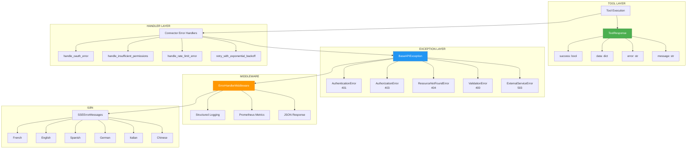

# ADR-023: Error Handling Strategy

**Status**: ✅ IMPLEMENTED (2025-12-21)
**Deciders**: Équipe architecture LIA
**Technical Story**: Production-grade error handling with i18n
**Related Documentation**: `docs/technical/ERROR_HANDLING.md`

---

## Context and Problem Statement

L'application nécessitait une stratégie d'erreur complète :

1. **Consistency** : Format uniforme pour toutes les erreurs
2. **Observability** : Logging structuré + métriques automatiques
3. **User-Friendly** : Messages traduits en 6 langues
4. **Resilience** : Retry, circuit breaker, graceful degradation

**Question** : Comment implémenter un système d'erreur robuste et unifié ?

---

## Decision Drivers

### Must-Have (Non-Negotiable):

1. **ToolResponse Pattern** : Format standard pour tools
2. **Exception Hierarchy** : Classes typées avec logging automatique
3. **i18n Support** : Messages multilingues
4. **Metrics Tracking** : Compteurs par type d'erreur

### Nice-to-Have:

- Recovery suggestions
- Partial error handling pour multi-domain
- Circuit breaker pattern

---

## Decision Outcome

**Chosen option**: "**BaseAPIException + ToolResponse + Error Handlers Pattern**"

### Architecture Overview



### ToolResponse Pattern

```python
# apps/api/src/domains/agents/tools/schemas.py

class ToolResponse(BaseModel):
    """Standard response format for all LangChain tools."""

    success: bool = Field(description="Whether tool execution succeeded")
    data: dict[str, Any] | None = Field(
        default=None, description="Tool result data (required if success=True)"
    )
    error: str | None = Field(
        default=None, description="Error code (required if success=False)"
    )
    message: str | None = Field(
        default=None, description="Human-readable message"
    )
    metadata: dict[str, Any] | None = Field(
        default=None, description="Optional metadata"
    )

    @classmethod
    def success_response(
        cls,
        data: dict[str, Any],
        message: str | None = None,
        metadata: dict[str, Any] | None = None,
    ) -> "ToolResponse":
        return cls(success=True, data=data, message=message, metadata=metadata)

    @classmethod
    def error_response(
        cls,
        error: str,
        message: str,
        metadata: dict[str, Any] | None = None,
    ) -> "ToolResponse":
        return cls(success=False, error=error, message=message, metadata=metadata)


# Typed variants for strict usage
class ToolResponseSuccess(ToolResponse):
    """Success-only variant (enforces success=True, requires data)."""
    success: Literal[True] = Field(default=True)
    data: dict[str, Any] = Field(description="Tool result data (required)")


class ToolResponseError(ToolResponse):
    """Error-only variant (enforces success=False, requires error)."""
    success: Literal[False] = Field(default=False)
    error: str = Field(description="Error code (required)")
```

### BaseAPIException Hierarchy

```python
# apps/api/src/core/exceptions.py

class BaseAPIException(HTTPException):
    """
    Base exception for all API exceptions.

    Provides:
    - Automatic structured logging (integrates with structlog)
    - HTTP status code mapping
    - Prometheus metrics tracking (error categorization)
    - i18n support for error messages
    """

    def __init__(
        self,
        status_code: int,
        detail: str,
        log_level: str = "warning",
        log_event: str | None = None,
        **log_context: Any,
    ) -> None:
        super().__init__(status_code=status_code, detail=detail)

        # Automatic structured logging
        log_method = getattr(logger, log_level, logger.warning)
        log_method(log_event or detail.lower().replace(" ", "_"), **log_context)

        # Automatic Prometheus metrics
        http_errors_total.labels(
            status_code=str(status_code),
            exception_type=self.__class__.__name__,
            endpoint=log_context.get("endpoint", "unknown"),
        ).inc()


class AuthenticationError(BaseAPIException):
    """401 Unauthorized - invalid credentials or token."""
    def __init__(self, detail: str = "Invalid credentials", **log_context):
        super().__init__(
            status_code=status.HTTP_401_UNAUTHORIZED,
            detail=detail,
            log_level="warning",
            log_event="authentication_failed",
            **log_context,
        )


class AuthorizationError(BaseAPIException):
    """403 Forbidden - insufficient permissions."""


class ResourceNotFoundError(BaseAPIException):
    """404 Not Found."""
    def __init__(
        self,
        resource_type: str,
        resource_id: str | UUID | None = None,
        **log_context,
    ):
        detail = f"{resource_type.capitalize()} not found"
        super().__init__(
            status_code=status.HTTP_404_NOT_FOUND,
            detail=detail,
            log_event="resource_not_found",
            resource_type=resource_type,
            resource_id=str(resource_id) if resource_id else None,
            **log_context,
        )


class ValidationError(BaseAPIException):
    """400 Bad Request - invalid input."""


class ExternalServiceError(BaseAPIException):
    """503 Service Unavailable - OAuth, API failures."""
    def __init__(self, service_name: str, detail: str | None = None, **log_context):
        external_service_errors_total.labels(
            service_name=service_name,
            error_type=log_context.get("error_type", "unknown"),
        ).inc()
        super().__init__(
            status_code=status.HTTP_503_SERVICE_UNAVAILABLE,
            detail=detail or f"External service '{service_name}' unavailable",
            log_event="external_service_error",
            service_name=service_name,
            **log_context,
        )
```

### Connector Error Handlers

```python
# apps/api/src/domains/connectors/error_handlers.py

async def handle_oauth_error(
    user_id: str,
    connector_type: ConnectorType,
    session: AsyncSession,
    error_detail: str | None = None,
) -> dict[str, Any]:
    """
    Handles: Invalid credentials, expired tokens (401)
    Action: Invalidates connector, prompts user to reconnect
    """
    # Marks connector.status = ConnectorStatus.ERROR
    return {
        "error": "oauth_authentication_failed",
        "message": "OAuth authentication failed. Please reconnect.",
        "requires_reconnect": True,
        "connector_type": connector_type.value,
    }


def handle_insufficient_permissions(
    connector_type: ConnectorType,
    required_scopes: list[str],
    operation: str | None = None,
) -> dict[str, Any]:
    """
    Handles: Missing OAuth scopes (403)
    Action: Notifies user of missing permissions
    """
    return {
        "error": "insufficient_permissions",
        "message": f"Missing required permissions for {connector_type.value}",
        "required_scopes": required_scopes,
        "requires_reauth": True,
    }


def handle_rate_limit_error(
    connector_type: ConnectorType,
    retry_after_seconds: int | None = None,
) -> dict[str, Any]:
    """
    Handles: API quota exceeded (429, 403 Rate Limit)
    Action: Advises user to retry after delay
    """
    return {
        "error": "rate_limit_exceeded",
        "message": f"Too many requests to {connector_type.value}. Please wait.",
        "retry_after_seconds": retry_after_seconds or 60,
        "retryable": True,
    }


def retry_with_exponential_backoff(
    max_attempts: int = 3,
    min_wait_seconds: float = 1.0,
    max_wait_seconds: float = 10.0,
    retry_on: tuple[type[Exception], ...] = (httpx.HTTPStatusError,),
    operation_name: str = "api_call",
) -> Decorator:
    """
    Decorator for automatic retry with exponential backoff.

    Schedule:
    - Attempt 1: Immediate
    - Attempt 2: Wait 1-2s (2^1)
    - Attempt 3: Wait 2-4s (2^2)
    - Max: 10s
    """
    # Uses tenacity.AsyncRetrying for reliable async retry logic
```

### Error Classification

```python
# apps/api/src/core/partial_error_handler.py

class ErrorCategory(str, Enum):
    AUTHENTICATION = "authentication"  # OAuth token expired
    RATE_LIMIT = "rate_limit"          # API quota exceeded
    NETWORK = "network"                 # Connection timeout, DNS failure
    VALIDATION = "validation"           # Invalid parameters
    NOT_FOUND = "not_found"            # Resource doesn't exist
    PERMISSION = "permission"           # Access denied
    INTERNAL = "internal"               # Unexpected internal error
    TIMEOUT = "timeout"                 # Operation timeout
    UNKNOWN = "unknown"                 # Unclassified error


class ErrorSeverity(str, Enum):
    LOW = "low"           # Non-critical, informational
    MEDIUM = "medium"     # Degraded experience but usable
    HIGH = "high"         # Significant impact on results
    CRITICAL = "critical" # Cannot provide meaningful results


class RecoveryAction(str, Enum):
    RETRY = "retry"                     # Retry the operation
    REAUTHENTICATE = "reauthenticate"   # Re-authenticate connector
    WAIT = "wait"                       # Wait before retrying
    MODIFY_QUERY = "modify_query"       # Change search parameters
    CONTACT_ADMIN = "contact_admin"     # Escalate to administrator
    NONE = "none"                       # No action possible
```

### Global Error Middleware

```python
# apps/api/src/core/middleware.py

class ErrorHandlerMiddleware(BaseHTTPMiddleware):
    """
    Global error handler middleware.
    Catches unhandled exceptions and returns structured JSON responses.
    """

    async def dispatch(self, request: Request, call_next):
        try:
            response = await call_next(request)
            return response
        except Exception as exc:
            logger.error(
                "unhandled_exception",
                exception_type=type(exc).__name__,
                error=str(exc),
                path=request.url.path,
                exc_info=True,
            )
            return JSONResponse(
                status_code=500,
                content={
                    "error": "internal_server_error",
                    "message": "An unexpected error occurred",
                    "request_id": request.state.request_id,
                },
            )
```

### i18n Error Messages

```python
# apps/api/src/domains/agents/api/error_messages.py

class SSEErrorMessages:
    """Centralized i18n error messages for SSE streaming."""

    MESSAGES = {
        "generic_error": {
            "fr": "Une erreur s'est produite. Veuillez réessayer.",
            "en": "An error occurred. Please try again.",
            "es": "Se produjo un error. Por favor, inténtelo de nuevo.",
            "de": "Ein Fehler ist aufgetreten. Bitte versuchen Sie es erneut.",
            "it": "Si è verificato un errore. Per favore riprova.",
            "zh": "发生错误。请重试。",
        },
        "rate_limit_exceeded": {
            "fr": "Limite de requêtes atteinte. Veuillez patienter.",
            "en": "Rate limit exceeded. Please wait.",
            # ... other languages
        },
        # ... more error types
    }

    # v1.8.0: SSEErrorMessages also detects LLM provider errors
    # (OverloadedError, RateLimitError) by inspecting exception type names
    # and returns user-friendly i18n messages instead of raw error types.
    # See generic_error() which checks for known LLM provider error patterns.

    @staticmethod
    def generic_error(exception: Exception, language: str = "fr") -> str:
        return SSEErrorMessages.MESSAGES["generic_error"].get(
            language, SSEErrorMessages.MESSAGES["generic_error"]["fr"]
        )
```

### Helper Functions

```python
# apps/api/src/core/exceptions.py

# Authentication/Authorization Helpers
def raise_invalid_credentials(email: str | None = None) -> NoReturn: ...
def raise_token_invalid(token_type: str = "token") -> NoReturn: ...
def raise_permission_denied(action: str, resource_type: str, user_id: UUID) -> NoReturn: ...

# Resource Not Found Helpers
def raise_user_not_found(user_id: UUID | str) -> NoReturn: ...
def raise_connector_not_found(connector_id: UUID) -> NoReturn: ...
def raise_conversation_not_found(conversation_id: UUID) -> NoReturn: ...

# OWASP Enumeration Prevention
def raise_not_found_or_unauthorized(
    resource_type: str,
    resource_id: UUID | None = None,
) -> NoReturn:
    """
    Returns 404 for BOTH "not found" AND "not authorized" cases.

    Prevents attackers from enumerating resources by observing
    different error codes for "does not exist" vs "forbidden".
    """
```

### Circuit Breaker Pattern

```python
# apps/api/src/infrastructure/resilience/circuit_breaker.py

class CircuitBreakerError(Exception):
    """Exception raised when circuit breaker is OPEN."""
    def __init__(
        self,
        service: str,
        state: CircuitState,
        retry_after: float | None = None,
    ):
        self.service = service
        self.state = state
        self.retry_after = retry_after
        super().__init__(
            f"Circuit breaker for '{service}' is {state.value}. "
            f"Service unavailable, please try again later."
        )

# States: CLOSED (normal) → OPEN (failing) → HALF_OPEN (testing recovery)
```

### Consequences

**Positive**:
- ✅ **Unified Format** : ToolResponse + BaseAPIException
- ✅ **Automatic Observability** : Logging + Prometheus via exceptions
- ✅ **i18n Ready** : 6 languages for user-facing messages
- ✅ **Recovery Guidance** : ErrorCategory + RecoveryAction
- ✅ **OWASP Compliant** : Enumeration prevention
- ✅ **Resilient** : Retry + circuit breaker patterns

**Negative**:
- ⚠️ Multiple error handling paths (tools vs routes)
- ⚠️ i18n maintenance across 6 languages

---

## Validation

**Acceptance Criteria**:
- [x] ✅ ToolResponse avec success/error variants
- [x] ✅ BaseAPIException hierarchy avec auto-logging
- [x] ✅ Connector error handlers (OAuth, permissions, rate limit)
- [x] ✅ retry_with_exponential_backoff decorator
- [x] ✅ ErrorCategory/Severity/RecoveryAction enums
- [x] ✅ SSEErrorMessages avec 6 langues + LLM provider error detection (OverloadedError, RateLimitError)
- [x] ✅ raise_not_found_or_unauthorized (OWASP)

---

## References

### Source Code
- **ToolResponse**: `apps/api/src/domains/agents/tools/schemas.py`
- **BaseAPIException**: `apps/api/src/core/exceptions.py`
- **Connector Handlers**: `apps/api/src/domains/connectors/error_handlers.py`
- **Partial Handler**: `apps/api/src/core/partial_error_handler.py`
- **SSE Messages**: `apps/api/src/domains/agents/api/error_messages.py`
- **Circuit Breaker**: `apps/api/src/infrastructure/resilience/circuit_breaker.py`

---

## Amendments

### Amendment 2026-04-08: Centralized Error Classification & Security Hardening

**Changes:**

1. **`SSEErrorMessages._classify_error()`** — New centralized classifier that categorizes exceptions into user-facing categories: `transient` (overload, rate limit, server errors), `content_filter` (provider safety/moderation blocks), `timeout` (request/connection timeout), `unknown` (everything else).

2. **New error categories** — `content_filter` with localized messages across 6 languages ("The AI model provider could not generate a response..."). `timeout` with recovery guidance ("The request took too long...").

3. **Security hardening** — All SSE error messages no longer expose `type(exception).__name__` or `str(exception)` to end users. Error type metadata in stream chunks replaced with generic `"stream_error"`. Applies to: `generic_error()`, `stream_error()`, `hitl_resumption_error()`, `graph_execution_error()`, `resumption_error()`.

4. **DRY refactoring** — Duplicated transient error detection logic (previously inlined in 5 methods) consolidated into single `_classify_error()` method.

**Files changed:** `api/error_messages.py`, `api/router.py`, `api/service.py`, `nodes/response_node.py`, `services/hitl/resumption_strategies.py`.

---

**Fin de ADR-023** - Error Handling Strategy Decision Record.
