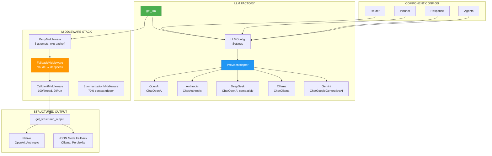

# ADR-026: LLM Model Selection Strategy

**Status**: ✅ IMPLEMENTED (2025-12-21)
**Deciders**: Équipe architecture LIA
**Technical Story**: Multi-provider LLM architecture with cost optimization
**Related Documentation**: `docs/technical/LLM_PROVIDERS.md`

---

## Context and Problem Statement

L'application nécessitait une stratégie de sélection LLM flexible :

1. **Multi-Provider** : OpenAI, Anthropic, DeepSeek, Ollama, Gemini
2. **Cost Optimization** : Modèles différents selon le use case
3. **Fallback Strategy** : Résilience si provider indisponible
4. **Structured Output** : Support natif ou JSON mode fallback

**Question** : Comment sélectionner le modèle optimal pour chaque composant ?

---

## Decision Drivers

### Must-Have (Non-Negotiable):

1. **Per-Component Configuration** : Router vs Planner vs Response
2. **Provider Abstraction** : Changement provider sans code change
3. **Fallback Chain** : Automatic failover
4. **Structured Output** : Garantie schema conformance

### Nice-to-Have:

- Reasoning models support (o-series, GPT-5)
- Token window optimization
- Cost tracking per call

---

## Decision Outcome

**Chosen option**: "**Factory Pattern + Provider Adapter + Middleware Stack**"

### Architecture Overview



### Model Selection by Component

| Component | Default Model | Temperature | Purpose |
|-----------|---------------|-------------|---------|
| **Router** | `gpt-4.1-nano` | 0.1 | Deterministic intent classification |
| **Planner** | Configurable | 0.0 | Deterministic plan generation |
| **Response** | `gpt-4.1-mini` | 0.5 | Creative user-facing responses |
| **Contacts Agent** | `gpt-4.1-nano` | 0.5 | Tool usage |
| **Emails Agent** | `gpt-4.1-nano` | 0.5 | Tool usage |
| **HITL Classifier** | `gpt-4.1-nano` | 0.1 | Deterministic classification |
| **Semantic Validator** | `gpt-4.1-mini` | 0.1 | Plan validation |

### LLM Factory Pattern

```python
# apps/api/src/infrastructure/llm/factory.py

LLMType = Literal[
    "router",
    "response",
    "planner",
    "contacts_agent",
    "emails_agent",
    "calendar_agent",
    "hitl_classifier",
    "semantic_validator",
    # ... more
]

def get_llm(
    llm_type: LLMType,
    config_override: LLMAgentConfig | None = None,
) -> BaseChatModel:
    """
    Multi-provider LLM factory with centralized configuration.

    Provider selection per LLM type via environment:
    - ROUTER_LLM_PROVIDER=openai
    - RESPONSE_LLM_PROVIDER=anthropic
    """
    # Get centralized config from settings
    config = get_llm_config_for_agent(llm_type)

    # Apply overrides if provided
    if config_override:
        config = merge_configs(config, config_override)

    # Create LLM via provider adapter
    llm = ProviderAdapter.create_llm(
        provider=config["provider"],
        model=config["model"],
        temperature=config["temperature"],
        max_tokens=config["max_tokens"],
        streaming=config.get("streaming", False),
        reasoning_effort=config.get("reasoning_effort"),  # For o-series
    )

    return llm
```

### Provider Adapter

```python
# apps/api/src/infrastructure/llm/factory.py

class ProviderAdapter:
    @staticmethod
    def create_llm(
        provider: str,
        model: str,
        temperature: float,
        max_tokens: int,
        **kwargs,
    ) -> BaseChatModel:
        if provider == "openai":
            return ChatOpenAI(
                model=model,
                temperature=temperature,
                max_tokens=max_tokens,
                **kwargs,
            )
        elif provider == "anthropic":
            return ChatAnthropic(
                model=model,
                temperature=temperature,
                max_tokens=max_tokens,
            )
        elif provider == "deepseek":
            return ChatOpenAI(
                model=model,
                base_url="https://api.deepseek.com/v1",
                temperature=temperature,
                max_tokens=max_tokens,
            )
        elif provider == "ollama":
            return ChatOllama(
                model=model,
                temperature=temperature,
            )
        # ... gemini, perplexity
```

### Configuration Settings

```python
# apps/api/src/core/config/llm.py

class LLMSettings(BaseSettings):
    # Model Context Windows
    MODEL_CONTEXT_WINDOWS: dict[str, int] = {
        "gpt-4.1": 128_000,
        "gpt-4.1-mini": 128_000,
        "gpt-4.1-nano": 128_000,
        "gpt-4.1": 128_000,
        "claude-3-5-sonnet-20241022": 200_000,
        "claude-sonnet-4-5": 200_000,
        "gemini-2.5-pro": 1_000_000,
        "deepseek-chat": 64_000,
    }

    # Provider Structured Output Support
    @property
    def provider_supports_structured_output(self) -> dict[str, bool]:
        return {
            "openai": True,      # Native /parse endpoint
            "anthropic": True,   # Native structured output
            "deepseek": True,    # Pydantic schemas
            "ollama": False,     # JSON mode fallback
            "perplexity": False, # JSON mode fallback
            "gemini": True,      # Native
        }

    # Router LLM
    router_llm_provider: str = "openai"
    router_llm_model: str = "gpt-4.1-nano"
    router_llm_temperature: float = 0.1
    router_llm_max_tokens: int = 5000

    # Response LLM
    response_llm_provider: str = "openai"
    response_llm_model: str = "gpt-4.1-mini"
    response_llm_temperature: float = 0.5
    response_llm_top_p: float = 0.95
    response_llm_frequency_penalty: float = 0.5
    response_llm_presence_penalty: float = 0.3
```

### Fallback Middleware

```python
# apps/api/src/core/config/agents.py

enable_fallback_middleware: bool = Field(
    default=True,
    description="Enable automatic provider failover",
)
fallback_models: str = Field(
    default="claude-sonnet-4-5,deepseek-chat",
    description="Fallback models in priority order",
)

# Retry Middleware
enable_retry_middleware: bool = Field(default=True)
retry_max_attempts: int = Field(default=3)
retry_backoff_factor: float = Field(default=2.0)  # 2s, 4s, 8s
```

### Structured Output

```python
# apps/api/src/infrastructure/llm/structured_output.py

async def get_structured_output(
    llm: BaseChatModel,
    messages: list[BaseMessage],
    schema: type[T],
    provider: str,
    node_name: str | None = None,
) -> T:
    """
    Provider-agnostic structured output.

    Native: OpenAI, Anthropic, DeepSeek (.with_structured_output())
    Fallback: Ollama, Perplexity (JSON mode + prompt augmentation)
    """
    if provider in NATIVE_STRUCTURED_OUTPUT_PROVIDERS:
        structured_llm = llm.with_structured_output(
            schema,
            method="json_schema",
            strict=True,  # OpenAI strict mode
        )
        return await structured_llm.ainvoke(messages)
    else:
        # JSON mode fallback with schema in prompt
        augmented = _augment_messages_with_json_instructions(
            messages, schema.__name__, schema.model_json_schema()
        )
        response = await llm.ainvoke(augmented)
        return schema.model_validate_json(response.content)
```

### Cost & Loop Protection

```python
# apps/api/src/core/config/agents.py

enable_call_limit_middleware: bool = Field(
    default=True,
    description="Prevent infinite loops and cost explosion",
)
model_call_thread_limit: int = Field(
    default=100,
    description="Maximum LLM calls per conversation thread",
)
model_call_run_limit: int = Field(
    default=20,
    description="Maximum LLM calls per single agent run",
)
```

### Message Windowing

```python
# apps/api/src/core/constants.py

ROUTER_MESSAGE_WINDOW_SIZE_DEFAULT = 5   # Fast routing (minimal context)
PLANNER_MESSAGE_WINDOW_SIZE_DEFAULT = 4  # Optimized 2025-12-19
RESPONSE_MESSAGE_WINDOW_SIZE_DEFAULT = 20  # Rich context for synthesis
```

### Consequences

**Positive**:
- ✅ **Multi-Provider** : Seamless switching OpenAI/Anthropic/DeepSeek
- ✅ **Cost Optimization** : nano for routing, mini for response
- ✅ **Resilient** : Automatic fallback on provider failure
- ✅ **Future-Ready** : Reasoning models (o-series) support
- ✅ **Deterministic** : Temperature 0.0 for planning

**Negative**:
- ⚠️ Triple configuration (provider per component)
- ⚠️ JSON mode fallback less reliable than native

---

## Validation

**Acceptance Criteria**:
- [x] ✅ Factory pattern avec LLMType
- [x] ✅ ProviderAdapter multi-provider
- [x] ✅ Retry middleware (3 attempts)
- [x] ✅ Fallback middleware (claude → deepseek)
- [x] ✅ Call limit protection
- [x] ✅ Structured output (native + fallback)
- [x] ✅ Message windowing per node

---

## References

### Source Code
- **LLM Factory**: `apps/api/src/infrastructure/llm/factory.py`
- **Structured Output**: `apps/api/src/infrastructure/llm/structured_output.py`
- **LLM Config**: `apps/api/src/core/config/llm.py`
- **Agents Config**: `apps/api/src/core/config/agents.py`
- **Middleware Config**: `apps/api/src/infrastructure/llm/middleware_config.py`

---

**Fin de ADR-026** - LLM Model Selection Strategy Decision Record.
