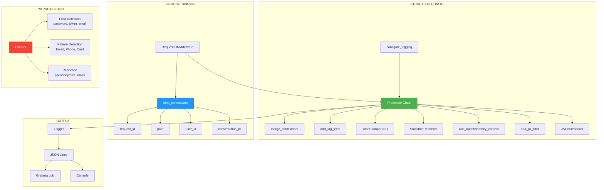

# ADR-027: Structured Logging (structlog)

**Status**: ✅ IMPLEMENTED (2025-12-21)
**Deciders**: Équipe architecture LIA
**Technical Story**: Production-grade observability with GDPR compliance
**Related Documentation**: `docs/technical/LOGGING.md`

---

## Context and Problem Statement

L'application nécessitait un logging structuré pour production :

1. **JSON Output** : Parsable par Loki/Promtail
2. **Context Propagation** : request_id, user_id, conversation_id
3. **PII Filtering** : GDPR compliance
4. **OTEL Integration** : Correlation logs-traces

**Question** : Comment implémenter un logging structuré avec protection PII ?

---

## Decision Drivers

### Must-Have (Non-Negotiable):

1. **JSON Format** : All environments (including dev)
2. **Context Variables** : Per-request binding
3. **PII Filtering** : Redaction avant rendering
4. **OTEL Trace Context** : trace_id, span_id injection

### Nice-to-Have:

- Rotating file handlers for debug logs
- Per-library log level control
- HTTP request/response logging with exclusions

---

## Decision Outcome

**Chosen option**: "**structlog + stdlib Integration + PII Processor**"

### Architecture Overview



### structlog Configuration

```python
# apps/api/src/infrastructure/observability/logging.py

def configure_logging() -> None:
    """Configure structlog for production JSON output."""

    shared_processors = [
        # Context merging
        structlog.contextvars.merge_contextvars,

        # Log level and metadata
        structlog.stdlib.add_log_level,
        structlog.stdlib.add_logger_name,
        structlog.stdlib.PositionalArgumentsFormatter(),

        # Timestamps
        structlog.processors.TimeStamper(fmt="iso"),

        # Exception handling
        structlog.processors.StackInfoRenderer(),
        structlog.processors.format_exc_info,

        # Unicode handling
        structlog.processors.UnicodeDecoder(),

        # Custom processors
        add_opentelemetry_context,  # Inject trace_id, span_id
        add_pii_filter,             # GDPR: Filter PII before rendering

        # Output formatting
        structlog.processors.dict_tracebacks,
        structlog.processors.JSONRenderer(),  # Always JSON
    ]

    structlog.configure(
        processors=shared_processors,
        wrapper_class=structlog.stdlib.BoundLogger,
        context_class=dict,
        logger_factory=structlog.stdlib.LoggerFactory(),
        cache_logger_on_first_use=True,
    )
```

### Context Binding Middleware

```python
# apps/api/src/core/middleware.py

class RequestIDMiddleware(BaseHTTPMiddleware):
    async def dispatch(self, request: Request, call_next: Callable) -> Response:
        request_id = request.headers.get("X-Request-ID") or str(uuid.uuid4())

        # Clear previous context and bind new
        structlog.contextvars.clear_contextvars()
        structlog.contextvars.bind_contextvars(
            request_id=request_id,
            path=request.url.path,
            method=request.method,
        )

        response = await call_next(request)
        response.headers["X-Request-ID"] = request_id
        return response
```

### PII Filter Processor

```python
# apps/api/src/infrastructure/observability/pii_filter.py

# Sensitive field names (field-based detection)
SENSITIVE_FIELD_NAMES = {
    "password", "secret", "api_key", "token", "access_token",
    "refresh_token", "bearer", "cookie", "session", "csrf",
    "private_key", "credit_card", "cvv", "ssn"
}

PII_FIELD_NAMES = {"email", "email_address", "user_email"}
PHONE_FIELD_NAMES = {"phone", "phone_number", "mobile", "telephone"}

# Pattern-based detection (fallback)
EMAIL_PATTERN = re.compile(r"\b[A-Za-z0-9._%+-]+@[A-Za-z0-9.-]+\.[A-Z|a-z]{2,}\b")
PHONE_PATTERN = re.compile(r"\+\d{1,3}[\s.-]?\d{1,4}[\s.-]?\d{1,4}[\s.-]?\d{1,4}")
CREDIT_CARD_PATTERN = re.compile(r"\b(?:\d{4}[-\s]?){3}\d{4}\b")

def pseudonymize_email(email: str) -> str:
    """Returns: 'email_hash_a1b2c3d4e5f6g7h8' (SHA-256 first 16 chars)"""
    email_hash = hashlib.sha256(email.encode("utf-8")).hexdigest()[:16]
    return f"email_hash_{email_hash}"

def mask_phone(phone: str) -> str:
    """Returns: '***-***-4567' (last 4 digits only)"""
    digits = re.sub(r"\D", "", phone)
    return f"***-***-{digits[-4:]}" if len(digits) >= 4 else "***-***-****"

def add_pii_filter(logger, method_name, event_dict):
    """Processor that sanitizes PII before JSON rendering."""
    return sanitize_dict(event_dict)
```

### OpenTelemetry Context Injection

```python
# apps/api/src/infrastructure/observability/logging.py

def add_opentelemetry_context(logger, method_name, event_dict):
    """Inject OTEL trace context for logs-traces correlation."""
    span = trace.get_current_span()

    if span:
        span_context = span.get_span_context()
        if span_context.is_valid:
            event_dict["trace_id"] = format(span_context.trace_id, "032x")
            event_dict["span_id"] = format(span_context.span_id, "016x")
            event_dict["trace_flags"] = format(span_context.trace_flags, "02x")

    return event_dict
```

### Log Levels Configuration

```python
# apps/api/src/core/config/security.py

# Environment Variables
LOG_LEVEL=DEBUG                    # Application logs
HTTP_LOG_LEVEL=DEBUG               # HTTP request/response
HTTP_LOG_EXCLUDE_PATHS=/metrics,/health

# Third-party library logs
LOG_LEVEL_HTTPX=WARNING            # OpenAI API calls
LOG_LEVEL_SQLALCHEMY=WARNING       # Database queries
LOG_LEVEL_UVICORN=WARNING          # Server logs
LOG_LEVEL_UVICORN_ACCESS=WARNING   # HTTP access logs
```

### Usage Patterns

```python
import structlog
logger = structlog.get_logger(__name__)

# Structured logging with context
logger.info(
    "graph_execution_started",
    thread_id=thread_id,
    messages_count=len(messages),
)

# Error logging with structured data
logger.error(
    "graph_execution_error",
    error=str(e),
    error_type=type(e).__name__,
)

# Debug with additional context
logger.debug(
    "hitl_cache_hit",
    conversation_id=conversation_id,
    age_seconds=cache_age,
)
```

### Example JSON Output

```json
{
    "event": "graph_execution_started",
    "thread_id": "conv_12345",
    "messages_count": 5,
    "log_level": "info",
    "logger_name": "src.domains.agents.services.orchestration.service",
    "timestamp": "2025-12-21T10:30:45.123456+00:00",
    "request_id": "550e8400-e29b-41d4-a716-446655440000",
    "path": "/api/v1/agents/chat",
    "method": "POST",
    "user_id": "user_uuid",
    "trace_id": "135a20fdc30eaf9a5711c54d34d9db2b",
    "span_id": "5711c54d34d9db2b"
}
```

### Consequences

**Positive**:
- ✅ **JSON Always** : Consistent format for Loki/Promtail
- ✅ **Context Propagation** : Per-request binding
- ✅ **GDPR Compliant** : PII redaction before output
- ✅ **OTEL Correlation** : trace_id/span_id in logs
- ✅ **Configurable** : Per-library log levels

**Negative**:
- ⚠️ No dev console format (JSON only)
- ⚠️ Hybrid PII detection (field + pattern)

---

## Validation

**Acceptance Criteria**:
- [x] ✅ structlog configuration avec processors
- [x] ✅ Context binding via middleware
- [x] ✅ PII filter processor (field + pattern)
- [x] ✅ OTEL context injection
- [x] ✅ JSON output (all environments)
- [x] ✅ Per-library log level config
- [x] ✅ HTTP log exclusions (/metrics, /health)

---

## References

### Source Code
- **Logging Config**: `apps/api/src/infrastructure/observability/logging.py`
- **PII Filter**: `apps/api/src/infrastructure/observability/pii_filter.py`
- **Middleware**: `apps/api/src/core/middleware.py`
- **Settings**: `apps/api/src/core/config/security.py`

---

**Fin de ADR-027** - Structured Logging Decision Record.
