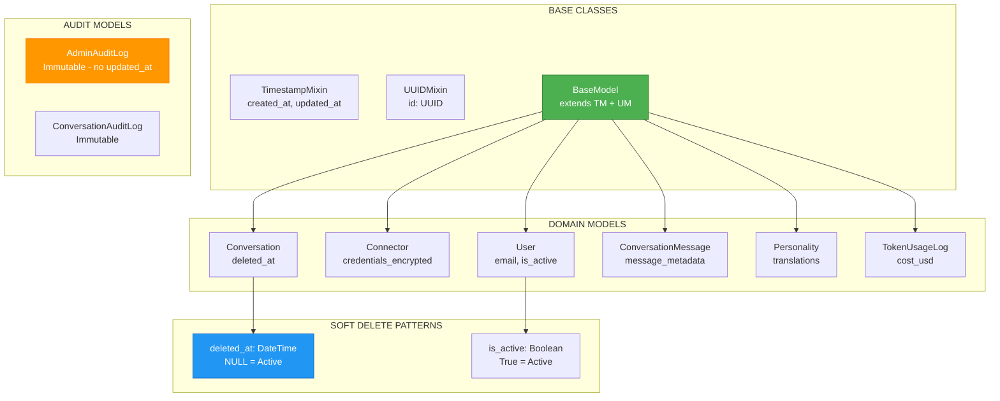

# ADR-028: Database Schema Design

**Status**: ✅ IMPLEMENTED (2025-12-21)
**Deciders**: Équipe architecture LIA
**Technical Story**: Production-grade PostgreSQL schema with soft deletes
**Related Documentation**: `docs/technical/DATABASE.md`

---

## Context and Problem Statement

L'application multi-tenant SaaS nécessitait un schéma de base de données robuste :

1. **Primary Keys** : Choix entre UUID vs auto-increment
2. **Soft Deletes** : Conservation des données pour audit/compliance
3. **Flexible Metadata** : Stockage de données structurées variables
4. **Audit Trail** : Traçabilité des modifications

**Question** : Comment concevoir un schéma PostgreSQL maintenable et évolutif ?

---

## Decision Drivers

### Must-Have (Non-Negotiable):

1. **UUID Primary Keys** : Distributed systems support
2. **Timezone-Aware Timestamps** : ISO 8601 compliance
3. **Soft Delete Pattern** : Data recovery & compliance
4. **JSONB Metadata** : Schema flexibility

### Nice-to-Have:

- Composite indexes for common query patterns
- GIN indexes for full-text search
- Immutable audit logs

---

## Decision Outcome

**Chosen option**: "**Mixin-Based Models + UUID + Soft Deletes + JSONB**"

### Architecture Overview



### Base Model Classes

```python
# apps/api/src/infrastructure/database/models.py

class TimestampMixin:
    """Mixin to add created_at and updated_at timestamps to models."""

    created_at: Mapped[datetime] = mapped_column(
        DateTime(timezone=True),
        default=lambda: datetime.now(UTC),
        nullable=False,
    )

    updated_at: Mapped[datetime] = mapped_column(
        DateTime(timezone=True),
        default=lambda: datetime.now(UTC),
        onupdate=lambda: datetime.now(UTC),  # Auto-update on modification
        nullable=False,
    )


class UUIDMixin:
    """Mixin to add UUID primary key to models."""

    id: Mapped[uuid.UUID] = mapped_column(
        UUID(as_uuid=True),
        primary_key=True,
        default=uuid.uuid4,  # Client-side generation
        nullable=False,
    )


class BaseModel(Base, UUIDMixin, TimestampMixin):
    """Base model class with UUID primary key and timestamps."""

    __abstract__ = True

    def dict(self) -> dict[str, Any]:
        """Convert model to dictionary."""
        return {c.name: getattr(self, c.name) for c in self.__table__.columns}
```

### Primary Domain Models

#### User Model

```python
# apps/api/src/domains/auth/models.py

class User(BaseModel):
    """User model for authentication and profile."""

    __tablename__ = "users"

    # Core fields
    email: Mapped[str] = mapped_column(
        String(255), unique=True, nullable=False, index=True
    )
    hashed_password: Mapped[str | None] = mapped_column(String(255), nullable=True)
    full_name: Mapped[str | None] = mapped_column(String(255), nullable=True)

    # SOFT DELETE via is_active boolean
    is_active: Mapped[bool] = mapped_column(default=False, nullable=False)
    is_verified: Mapped[bool] = mapped_column(default=False, nullable=False)
    is_superuser: Mapped[bool] = mapped_column(default=False, nullable=False)

    # OAuth fields
    oauth_provider: Mapped[str | None] = mapped_column(String(50), nullable=True)
    oauth_provider_id: Mapped[str | None] = mapped_column(String(255), nullable=True)

    # User preferences
    timezone: Mapped[str] = mapped_column(
        String(50), nullable=False, server_default="Europe/Paris"
    )
    language: Mapped[str] = mapped_column(
        String(10), nullable=False, server_default="fr"
    )

    # Foreign key with SET NULL on delete
    personality_id: Mapped[uuid.UUID | None] = mapped_column(
        UUID(as_uuid=True),
        ForeignKey("personalities.id", ondelete="SET NULL"),
        nullable=True,
    )

    # Encrypted sensitive data
    home_location_encrypted: Mapped[str | None] = mapped_column(Text, nullable=True)

    # Relationships with cascade
    connectors: Mapped[list["Connector"]] = relationship(
        back_populates="user", cascade="all, delete-orphan"
    )
    conversations: Mapped[list["Conversation"]] = relationship(
        back_populates="user", cascade="all, delete-orphan"
    )
```

#### Conversation Model (Soft Delete: deleted_at)

```python
# apps/api/src/domains/conversations/models.py

class Conversation(BaseModel):
    """User conversation container for LangGraph checkpoints."""

    __tablename__ = "conversations"

    # Unique constraint: one conversation per user
    user_id: Mapped[UUID] = mapped_column(
        ForeignKey("users.id", ondelete="CASCADE"),
        unique=True,
        nullable=False,
        index=True,
    )

    title: Mapped[str | None] = mapped_column(String(500), nullable=True)
    message_count: Mapped[int] = mapped_column(Integer, default=0, nullable=False)
    total_tokens: Mapped[int] = mapped_column(BigInteger, default=0, nullable=False)

    # SOFT DELETE: NULL = active, timestamp = deleted
    deleted_at: Mapped[datetime | None] = mapped_column(
        DateTime(timezone=True), nullable=True, index=True
    )

    # Relationships
    user: Mapped["User"] = relationship(back_populates="conversations")
    messages: Mapped[list["ConversationMessage"]] = relationship(
        back_populates="conversation",
        cascade="all, delete-orphan",
        order_by="ConversationMessage.created_at.desc()",
    )

    # Composite index for pagination queries
    __table_args__ = (
        Index("ix_conversations_user_created", "user_id", "created_at"),
    )
```

#### Connector Model (JSONB Metadata)

```python
# apps/api/src/domains/connectors/models.py

class Connector(BaseModel):
    """External service connections with encrypted credentials."""

    __tablename__ = "connectors"

    user_id: Mapped[uuid.UUID] = mapped_column(
        ForeignKey("users.id", ondelete="CASCADE"),
        nullable=False,
        index=True,
    )

    connector_type: Mapped[ConnectorType] = mapped_column(
        Enum(ConnectorType, native_enum=False),
        nullable=False,
        index=True,
    )

    status: Mapped[ConnectorStatus] = mapped_column(
        Enum(ConnectorStatus, native_enum=False),
        nullable=False,
        default=ConnectorStatus.ACTIVE,
    )

    # OAuth scopes as JSONB array
    scopes: Mapped[list[str]] = mapped_column(JSONB, nullable=False, default=list)

    # Encrypted credentials (Fernet)
    credentials_encrypted: Mapped[str] = mapped_column(Text, nullable=False)

    # JSONB for flexible connector-specific data
    connector_metadata: Mapped[dict[str, Any] | None] = mapped_column(
        "metadata", JSONB, nullable=True, default=dict
    )
```

### Soft Delete Patterns

| Pattern | Column | Active Query | Deleted Query |
|---------|--------|--------------|---------------|
| **Timestamp** | `deleted_at: DateTime?` | `WHERE deleted_at IS NULL` | `WHERE deleted_at IS NOT NULL` |
| **Boolean** | `is_active: bool` | `WHERE is_active = True` | `WHERE is_active = False` |

**Repository Implementation**:

```python
# Conversation with deleted_at pattern
async def get_for_user(self, user_id: UUID) -> Conversation | None:
    query = select(Conversation).where(
        Conversation.user_id == user_id,
        Conversation.deleted_at.is_(None)  # Only active
    )

# User with is_active pattern
query = select(User).where(User.id == user_id).where(User.is_active)
```

### Index Strategy

| Type | Example | Purpose |
|------|---------|---------|
| **Single Column** | `email: index=True` | Fast filtering |
| **Composite** | `(user_id, created_at)` | Pagination queries |
| **Descending** | `created_at DESC` | Time-series queries |
| **Unique Constraint** | `(model_name, effective_from)` | Business rules |

```python
# Composite index for pagination
__table_args__ = (
    Index("ix_conversations_user_created", "user_id", "created_at"),
)

# Descending index for recent-first queries
Index(
    "ix_conversation_messages_conv_created",
    "conversation_id",
    "created_at",
    postgresql_ops={"created_at": "DESC"},
)
```

### JSONB Usage

| Column | Type | Example |
|--------|------|---------|
| `scopes` | `list[str]` | `["contacts.readonly", "calendar.readonly"]` |
| `connector_metadata` | `dict[str, Any]` | `{"calendar_names": [...]}` |
| `message_metadata` | `dict[str, Any]` | `{"run_id": "...", "intention": "..."}` |
| `audit_metadata` | `dict[str, Any]` | `{"before": {...}, "after": {...}}` |

### Audit Log Pattern (Immutable)

```python
# apps/api/src/domains/users/models.py

class AdminAuditLog(Base, UUIDMixin):
    """
    Immutable audit log for admin actions.

    Intentionally does NOT include TimestampMixin (no updated_at).
    """

    __tablename__ = "admin_audit_log"

    admin_user_id: Mapped[uuid.UUID] = mapped_column(
        ForeignKey("users.id", ondelete="CASCADE"),
        nullable=False,
        index=True,
    )
    action: Mapped[str] = mapped_column(String(100), nullable=False, index=True)
    resource_type: Mapped[str] = mapped_column(String(50), nullable=False, index=True)
    resource_id: Mapped[uuid.UUID | None] = mapped_column(nullable=True)
    details: Mapped[dict[str, Any] | None] = mapped_column(JSONB, nullable=True)
    ip_address: Mapped[str | None] = mapped_column(String(45), nullable=True)

    # Only created_at - NO updated_at (immutable)
    created_at: Mapped[datetime] = mapped_column(
        DateTime(timezone=True),
        default=lambda: datetime.now(UTC),
        nullable=False,
        index=True,
    )
```

### Session Management

```python
# apps/api/src/infrastructure/database/session.py

# Async engine with connection pooling
engine = create_async_engine(
    str(settings.database_url),
    pool_size=settings.database_pool_size,
    max_overflow=settings.database_max_overflow,
    pool_pre_ping=True,  # Connection health checks
)

# Async session factory
AsyncSessionLocal = async_sessionmaker(
    engine,
    class_=AsyncSession,
    expire_on_commit=False,
    autocommit=False,
    autoflush=False,
)

# FastAPI dependency
async def get_db_session() -> AsyncGenerator[AsyncSession, None]:
    async with AsyncSessionLocal() as session:
        try:
            yield session
            await session.commit()
        except Exception:
            await session.rollback()
            raise
        finally:
            await session.close()
```

### Alembic Migrations

```python
# apps/api/alembic/env.py

# All domain models imported for autogenerate
from src.domains.auth.models import User
from src.domains.connectors.models import Connector
from src.domains.conversations.models import Conversation, ConversationMessage
# ... all models

context.configure(
    target_metadata=target_metadata,
    compare_type=True,           # Detect type changes
    compare_server_default=True, # Detect default changes
)
```

### Consequences

**Positive**:
- ✅ **UUID Primary Keys** : Distributed systems ready
- ✅ **Timezone-Aware** : No timestamp ambiguity
- ✅ **Soft Deletes** : Data recovery + GDPR compliance
- ✅ **JSONB Flexibility** : Schema evolution without migrations
- ✅ **Immutable Audits** : Tamper-evident logs

**Negative**:
- ⚠️ Mixed soft delete patterns (deleted_at vs is_active)
- ⚠️ JSONB querying less efficient than normalized columns

---

## Validation

**Acceptance Criteria**:
- [x] ✅ BaseModel with UUID + Timestamps
- [x] ✅ Soft delete patterns implemented
- [x] ✅ JSONB metadata columns
- [x] ✅ Composite indexes for pagination
- [x] ✅ Immutable audit log models
- [x] ✅ Async session management
- [x] ✅ Alembic migrations configured

---

## References

### Source Code
- **Base Models**: `apps/api/src/infrastructure/database/models.py`
- **Session Management**: `apps/api/src/infrastructure/database/session.py`
- **User Model**: `apps/api/src/domains/auth/models.py`
- **Conversation Models**: `apps/api/src/domains/conversations/models.py`
- **Connector Models**: `apps/api/src/domains/connectors/models.py`
- **Alembic Config**: `apps/api/alembic/env.py`

---

**Fin de ADR-028** - Database Schema Design Decision Record.
