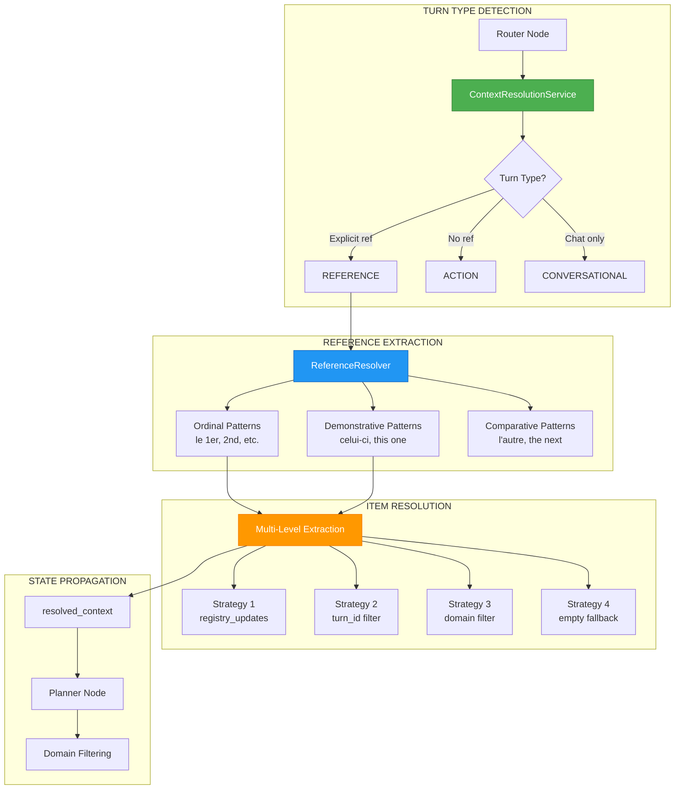

# ADR-030: Context Resolution & Follow-up Handling

**Status**: ✅ IMPLEMENTED (2025-12-21) - Updated 2025-12-25 - SUPERSEDED by Architecture v3
**Deciders**: Équipe architecture LIA
**Technical Story**: Multi-turn conversation with reference resolution
**Related Documentation**: `docs/technical/CONTEXT_RESOLUTION.md`

> **Note Architecture v3 (2026-01)**: Les references a `router_node.py` et `planner_node.py` dans cet ADR concernent les fichiers v3 (`router_node_v3.py`, `planner_node_v3.py`).
> La resolution de contexte est maintenant integree dans `QueryAnalyzerService.analyze_full()`.
> Voir [SMART_SERVICES.md](../technical/SMART_SERVICES.md) pour la documentation actuelle.

---

## Context and Problem Statement

L'assistant conversationnel devait gérer les références contextuelles :

1. **Ordinal References** : "le deuxième", "the first", "il terzo"
2. **Demonstrative References** : "celui-ci", "this one", "celui-là"
3. **Follow-up Questions** : "envoie-lui un email" (après recherche contact)
4. **Cross-Domain Prevention** : Ne pas confondre contacts et emails

**Question** : Comment résoudre les références implicites vers des résultats précédents ?

---

## Decision Drivers

### Must-Have (Non-Negotiable):

1. **Turn Type Detection** : action vs reference vs conversational
2. **Multi-Language Support** : FR, EN, ES, DE, IT, ZH patterns
3. **Domain Isolation** : Pas de cross-contamination
4. **Fallback Strategy** : Plusieurs méthodes d'extraction

### Nice-to-Have:

- Confidence scoring for resolutions
- Index-based direct access
- Fuzzy matching on names

---

## Decision Outcome

**Chosen option**: "**Turn-Based Resolution + Regex Patterns + Multi-Level Extraction**"

### Architecture Overview



### Turn Type Detection

```python
# apps/api/src/domains/agents/constants.py

TURN_TYPE_ACTION = "action"              # Turn with agent execution
TURN_TYPE_REFERENCE = "reference"        # Follow-up referencing previous results
TURN_TYPE_CONVERSATIONAL = "conversational"  # Pure conversation
```

```python
# apps/api/src/domains/agents/services/context_resolution_service.py

async def resolve_context(
    self,
    query: str,
    state: MessagesState,
    config: RunnableConfig,
    run_id: str,
) -> tuple[ResolvedContext, str]:
    """
    Determine turn type and resolve references.

    Returns: (resolved_context, turn_type)
    """
    # Extract references from query
    extracted = self.reference_resolver.extract_references(query)

    if extracted.has_explicit_references:
        # REFERENCE turn: resolve items from previous results
        resolved = await self._resolve_from_last_action(
            extracted, state, run_id
        )
        return resolved, TURN_TYPE_REFERENCE

    # ACTION or CONVERSATIONAL turn
    return ResolvedContext.empty(), TURN_TYPE_ACTION
```

### Ordinal Pattern Detection (6 Languages)

```python
# apps/api/src/domains/agents/services/reference_resolver.py

ORDINAL_PATTERNS: dict[str, list[tuple[str, int | None]]] = {
    "fr": [
        (r"(?:le|la|l'|du|de la|au|à la)\s*(?:1er|premier|première)\b", 0),
        (r"(?:le|la|l'|du|de la|au|à la)\s*(?:2[eè]me|deuxième|second|seconde)\b", 1),
        (r"(?:le|la|l'|du|de la|au|à la)\s*(?:3[eè]me|troisième)\b", 2),
        (r"(?:le|la|l'|du|de la|au|à la)\s*(?:4[eè]me|quatrième)\b", 3),
        (r"(?:le|la|l'|du|de la|au|à la)\s*(?:5[eè]me|cinquième)\b", 4),
        (r"(?:le|la|du|au)\s*(\d+)[eè]?(?:me)?\b", None),  # Dynamic: "le 7ème"
        (r"(?:le|la|l'|du|de la|au|à la)\s*(?:dernier|dernière)\b", -1),  # Last
    ],
    "en": [
        (r"the\s*(?:1st|first)\b", 0),
        (r"the\s*(?:2nd|second)\b", 1),
        (r"the\s*(?:3rd|third)\b", 2),
        (r"the\s*(?:last)\b", -1),
    ],
    "es": [
        (r"(?:el|la)\s*(?:primer[oa]?)\b", 0),
        (r"(?:el|la)\s*(?:segund[oa])\b", 1),
        (r"(?:el|la)\s*(?:últim[oa])\b", -1),
    ],
    "de": [
        (r"(?:der|die|das)\s*(?:erste[rn]?)\b", 0),
        (r"(?:der|die|das)\s*(?:zweite[rn]?)\b", 1),
        (r"(?:der|die|das)\s*(?:letzte[rn]?)\b", -1),
    ],
    "it": [
        (r"(?:il|la|lo)\s*(?:primo|prima)\b", 0),
        (r"(?:il|la|lo)\s*(?:secondo|seconda)\b", 1),
        (r"(?:il|la|lo)\s*(?:ultimo|ultima)\b", -1),
    ],
    "zh": [
        (r"第一个", 0),
        (r"第二个", 1),
        (r"最后一个", -1),
    ],
}
```

### Demonstrative Pattern Detection

```python
# apps/api/src/domains/agents/services/reference_resolver.py

DEMONSTRATIVE_PATTERNS: list[tuple[str, int]] = [
    # French
    (r"\bcelui-ci\b", 0),
    (r"\bcelle-ci\b", 0),
    (r"\bcelui-là\b", 0),
    (r"\bcelle-là\b", 0),
    # English
    (r"\bthis one\b", 0),
    (r"\bthat one\b", 0),
    # German
    (r"\bdiese[rsmn]?\b", 0),
    # Italian
    (r"\bquest[oa]\b", 0),
    # Spanish
    (r"\best[ea]\b", 0),
]
```

### Reference Resolution Data Flow

```python
@dataclass
class ExtractedReference:
    type: str              # "ordinal", "demonstrative", "comparative"
    text: str              # Original matched text ("le deuxième")
    index: int | None      # 0-based index, or -1 for last
    pattern: str           # Regex pattern that matched

@dataclass
class ResolvedContext:
    items: list[Any]              # Resolved items from previous results
    confidence: float             # Resolution confidence (0.0-1.0)
    method: str                   # "explicit", "lifecycle", "none", "error"
    source_turn_id: int | None    # Turn ID from which items were resolved
```

### Multi-Level Extraction Strategy

```python
# apps/api/src/domains/agents/services/context_resolution_service.py

def _extract_all_items(
    self,
    agent_results: dict[str, Any],
    run_id: str,
) -> list[dict]:
    """
    Extract all items from agent_results with metadata enrichment.

    CRITICAL: Items are enriched with _item_type and _registry_id metadata
    to enable robust domain detection in subsequent processing.

    Extraction sources (priority order):
    1. registry_updates in agent_results (RegistryItem objects)
    2. Data keys in agent_results (contacts, emails, events, places, etc.)
    """
    all_items = []

    for result_key, result in agent_results.items():
        if not isinstance(result, dict):
            continue

        # Strategy 1: Extract from registry_updates (most reliable)
        registry_updates = result.get("registry_updates", {})
        if registry_updates and isinstance(registry_updates, dict):
            for item_id, reg_item in registry_updates.items():
                if isinstance(reg_item, RegistryItem):
                    # Enrich with metadata for domain detection
                    payload = dict(reg_item.payload)
                    payload["_registry_id"] = item_id
                    payload["_item_type"] = reg_item.type.value  # e.g., "PLACE", "CONTACT"
                    all_items.append(payload)
                elif isinstance(reg_item, dict):
                    raw_payload = reg_item.get("payload", reg_item)
                    if isinstance(raw_payload, dict):
                        payload = dict(raw_payload)
                        payload["_registry_id"] = item_id
                        if "type" in reg_item:
                            payload["_item_type"] = reg_item["type"]
                        all_items.append(payload)

        # Strategy 2: Extract from data keys (contacts, emails, etc.)
        # ... (fallback for legacy format)

    return all_items
```

### Domain Detection Strategy (Updated 2025-12-25)

The domain detection logic uses a **multi-strategy approach** to reliably determine
the source domain from resolved items:

```python
# apps/api/src/domains/agents/services/context_resolution_service.py

async def _resolve_from_last_action(
    self,
    extracted: ExtractedReference,
    state: MessagesState,
    run_id: str,
) -> ResolvedContext:
    """
    Resolve ordinal references from the last action turn.

    Domain detection uses two strategies:
    1. Detect from agent_results structure (data keys, tool_name)
    2. Fallback to _item_type from enriched items
    """
    # ... resolve items by index ...

    # Strategy 1: Detect domain from agent_results structure
    source_domain = None
    if last_action_turn is not None:
        source_domain = self._detect_domain_from_agent_results(
            agent_results, last_action_turn, run_id
        )
        if source_domain:
            logger.debug(
                "source_domain_from_agent_results",
                run_id=run_id,
                source_domain=source_domain,
                turn_id=last_action_turn,
            )

    # Strategy 2: Fallback - Infer from resolved items' _item_type
    if source_domain is None and resolved_items:
        first_item = resolved_items[0]
        item_type = first_item.get("_item_type")  # e.g., "PLACE", "CONTACT"
        if item_type:
            source_domain = self._derive_domain_from_type(item_type)
            if source_domain:
                logger.debug(
                    "source_domain_from_item_type",
                    run_id=run_id,
                    source_domain=source_domain,
                    item_type=item_type,
                )

    return ResolvedContext(
        items=resolved_items,
        confidence=0.9,
        method="explicit",
        source_turn_id=last_action_turn,
        source_domain=source_domain,  # Used by planner for domain filtering
    )
```

### Type to Domain Mapping

The `_derive_domain_from_type()` method uses the centralized `TYPE_TO_DOMAIN_MAP`:

```python
# apps/api/src/domains/agents/utils/type_domain_mapping.py

TYPE_TO_DOMAIN_MAP: dict[str, tuple[str, str]] = {
    "CONTACT": ("contacts", "contacts"),
    "EMAIL": ("emails", "emails"),
    "EVENT": ("calendar", "events"),
    "TASK": ("tasks", "tasks"),
    "FILE": ("drive", "files"),
    "PLACE": ("places", "places"),
    "LOCATION": ("places", "location"),
    "WEATHER": ("weather", "forecasts"),
    "WIKIPEDIA_ARTICLE": ("wikipedia", "articles"),
    "SEARCH_RESULT": ("perplexity", "results"),
}

def get_domain_name_from_type(type_name: str) -> str | None:
    """Get domain name from registry type (e.g., 'PLACE' -> 'places')."""
    domain_info = TYPE_TO_DOMAIN_MAP.get(type_name.upper())
    return domain_info[0] if domain_info else None
```

### State Management

```python
# apps/api/src/domains/agents/models.py

class MessagesState(TypedDict):
    # Context resolution fields
    last_action_turn_id: int | None       # Last turn with agent execution
    turn_type: str | None                 # "action" | "reference" | "conversational"
    resolved_context: dict[str, Any] | None  # Resolved items for reference turns

    # Supporting state
    current_turn_id: int                  # Conversation turn counter
    agent_results: dict[str, Any]         # Results keyed by "turn_id:agent_name"
    registry: Annotated[dict[str, RegistryItem], merge_registry]  # Data registry
```

### Router Node Integration

```python
# apps/api/src/domains/agents/nodes/router_node.py

async def route(state: MessagesState, config: RunnableConfig) -> dict:
    run_id = config["configurable"].get("run_id", "unknown")

    # Resolve context and determine turn type
    context_service = get_context_resolution_service()
    resolved_context, turn_type = await context_service.resolve_context(
        query=state[STATE_KEY_MESSAGES][-1].content,
        state=state,
        config=config,
        run_id=run_id,
    )

    # Update last_action_turn_id for ACTION turns
    last_action_turn_id = state.get(STATE_KEY_LAST_ACTION_TURN_ID)
    if turn_type == TURN_TYPE_ACTION and router_output.next_node != "response":
        last_action_turn_id = state["current_turn_id"]

    # Prepare resolved_context dict for state
    resolved_context_dict = None
    if resolved_context.items:
        resolved_context_dict = {
            "items": resolved_context.items,
            "confidence": resolved_context.confidence,
            "method": resolved_context.method,
            "source_turn_id": resolved_context.source_turn_id,
        }

    return {
        STATE_KEY_TURN_TYPE: turn_type,
        STATE_KEY_RESOLVED_CONTEXT: resolved_context_dict,
        STATE_KEY_LAST_ACTION_TURN_ID: last_action_turn_id,
    }
```

### Domain Filtering in Planner

```python
# apps/api/src/domains/agents/nodes/planner_node.py

def _extract_domain_from_resolved_items(
    resolved_context: dict | None,
    run_id: str,
) -> str | None:
    """
    Extract actual domain from resolved items to prevent cross-domain errors.

    Methods:
    1. registry_id prefix: "email_xxxxx" → "emails"
    2. Item structure heuristics: resource_name → "contacts"
    """
    if not resolved_context or not resolved_context.get("items"):
        return None

    items = resolved_context["items"]

    # Method 1: Check _registry_id prefix
    for item in items:
        if "_registry_id" in item:
            registry_id = item["_registry_id"]
            if registry_id.startswith("email_"):
                return "emails"
            if registry_id.startswith("contact_"):
                return "contacts"

    # Method 2: Structure heuristics
    first_item = items[0]
    if "resource_name" in first_item:
        return "contacts"
    if "threadId" in first_item or "labelIds" in first_item:
        return "emails"

    return None
```

### Context Tools for Explicit Resolution

```python
# apps/api/src/domains/agents/tools/context_tools.py

@tool
async def resolve_reference(
    reference: str,
    domain: str | None = None,
    runtime: ToolRuntime = {},
) -> str:
    """
    Resolve a user reference to a specific item in context.

    Supports:
    - Index: "1", "2", "dernier"
    - Name: "Jean Dupont"
    - Keywords: "celui avec l'email @google"
    """
    config = validate_runtime_config(runtime, "resolve_reference")
    store = runtime.get("store")

    # Auto-detect domain if not provided
    if not domain:
        domain = _detect_domain_from_store(store)

    # Get definition from registry
    definition = ContextTypeRegistry.get_definition(domain)

    # Get items from context store
    items = await store.get_context_list(domain)

    # Use ReferenceResolver for resolution
    resolver = ReferenceResolver(definition)
    result = resolver.resolve(reference, items)

    return StandardToolOutput(
        status="success",
        data=result.item,
        message=f"Resolved '{reference}' with {result.confidence:.0%} confidence",
    ).model_dump_json()
```

### Composite Key Format

```python
# apps/api/src/domains/agents/constants.py

# Agent results key format: "turn_id:agent_name"
# Example: "3:contacts_agent"

def make_agent_result_key(turn_id: int, agent_name: str) -> str:
    return f"{turn_id}:{agent_name}"

def parse_agent_result_key(key: str) -> tuple[int, str]:
    parts = key.split(":", 1)
    return int(parts[0]), parts[1]
```

### Consequences

**Positive**:
- ✅ **Multi-Language** : 6 languages supported via regex patterns
- ✅ **Turn Isolation** : Results keyed by turn_id prevent stale refs
- ✅ **Domain Safety** : Multi-level fallback never crosses domains
- ✅ **Confidence Scoring** : Explicit confidence for UI feedback
- ✅ **Fallback Strategy** : 4-level extraction prevents failures
- ✅ **Robust Domain Detection** : Multi-strategy approach (agent_results + _item_type) (2025-12-25)
- ✅ **Metadata Enrichment** : Items enriched with `_item_type` and `_registry_id` for traceability (2025-12-25)
- ✅ **Centralized Type Mapping** : `TYPE_TO_DOMAIN_MAP` single source of truth (2025-12-25)

**Negative**:
- ⚠️ Regex patterns require maintenance per language
- ⚠️ Complex state management across nodes

---

## Validation

**Acceptance Criteria**:
- [x] ✅ Turn type detection (action/reference/conversational)
- [x] ✅ Ordinal patterns for 6 languages
- [x] ✅ Demonstrative pattern detection
- [x] ✅ Multi-level extraction fallback
- [x] ✅ Domain filtering in planner
- [x] ✅ State propagation via resolved_context
- [x] ✅ Composite key format for agent_results
- [x] ✅ Items enriched with `_item_type` and `_registry_id` metadata (2025-12-25)
- [x] ✅ Multi-strategy domain detection: agent_results + _item_type fallback (2025-12-25)
- [x] ✅ Centralized TYPE_TO_DOMAIN_MAP for type-to-domain mapping (2025-12-25)
- [x] ✅ Places domain ordinal references work correctly (e.g., "détails du premier") (2025-12-25)
- [x] ✅ TURN_TYPE_REFERENCE_PURE handled by planner_node for resolved context injection (2025-12-25)

---

## References

### Source Code
- **Context Resolution Service**: `apps/api/src/domains/agents/services/context_resolution_service.py`
- **Reference Resolver**: `apps/api/src/domains/agents/services/reference_resolver.py`
- **Router Node**: `apps/api/src/domains/agents/nodes/router_node.py`
- **Planner Node**: `apps/api/src/domains/agents/nodes/planner_node.py`
- **Context Tools**: `apps/api/src/domains/agents/tools/context_tools.py`
- **Context Registry**: `apps/api/src/domains/agents/context/registry.py`
- **MessagesState**: `apps/api/src/domains/agents/models.py`
- **Constants**: `apps/api/src/domains/agents/constants.py`
- **Type-Domain Mapping**: `apps/api/src/domains/agents/utils/type_domain_mapping.py` (2025-12-25)
- **Registry Models**: `apps/api/src/domains/agents/data_registry/models.py` (RegistryItem, RegistryItemType)

---

## Changelog

### 2025-12-25 - Domain Detection Robustification

**Problem**: Ordinal reference resolution for Places domain (e.g., "détails du premier restaurant")
was returning wrong domain due to broken domain detection logic.

**Root Causes Identified**:
1. `_extract_all_items()` extracted items WITHOUT `_item_type` metadata
2. Domain detection looked for `*_agent` keys but found `plan_executor` instead
3. Fallback to `routing_history` used alphabetical sort, returning "calendar" instead of "places"

**Solution Implemented**:
1. **Metadata Enrichment**: Items extracted from `registry_updates` are now enriched with:
   - `_item_type`: Registry type (e.g., "PLACE", "CONTACT") from `RegistryItem.type.value`
   - `_registry_id`: Item ID from registry (e.g., "place_abc123")

2. **Multi-Strategy Domain Detection**:
   - Strategy 1: `_detect_domain_from_agent_results()` - Analyze data keys and tool_name
   - Strategy 2: Fallback to `_item_type` - Use `TYPE_TO_DOMAIN_MAP` for conversion

3. **Centralized Type Mapping**: All type-to-domain conversions use `TYPE_TO_DOMAIN_MAP`
   from `utils/type_domain_mapping.py` (single source of truth).

**Files Modified**:
- `services/context_resolution_service.py` - Enrichment + domain detection
- `utils/type_domain_mapping.py` - TYPE_TO_DOMAIN_MAP reference

### 2025-12-25 - TURN_TYPE_REFERENCE_PURE Fix (Planner Node)

**Problem**: "détail du premier/deuxième" queries for places domain were intermittently generating
incomplete plans (1 step: resolve_reference only, missing get_place_details_tool).

**Root Cause**: The `router_node` correctly set `turn_type = "reference_pure"` for pure detail queries,
but `planner_node` only checked for `TURN_TYPE_REFERENCE` ("reference") in 3 critical conditions:
1. `has_active_context` determination (line ~844)
2. Resolved context template injection (line ~911)
3. Domain extraction from resolved items (line ~1774)

Since `TURN_TYPE_REFERENCE_PURE` was not included in these checks, the resolved context template
(containing `place_id` and instruction to use `get_place_details_tool`) was never injected.

**Solution**: Modified all 3 conditions in `planner_node.py` to check for BOTH turn types:
```python
# Before (BUG)
if turn_type == TURN_TYPE_REFERENCE and resolved_context:

# After (FIX)
if turn_type in (TURN_TYPE_REFERENCE, TURN_TYPE_REFERENCE_PURE) and resolved_context:
```

**Turn Types Distinction**:
| Turn Type | Constant | Example | Usage |
|-----------|----------|---------|-------|
| `reference` | `TURN_TYPE_REFERENCE` | "envoie-lui un email" | Follow-up with action |
| `reference_pure` | `TURN_TYPE_REFERENCE_PURE` | "détail du premier" | Pure detail request |

**Files Modified**:
- `nodes/planner_node.py` - 3 condition modifications + import

**Validation**: After fix, "détail du deuxième" for places consistently generates 1 step with
`get_place_details_tool(place_id="...")` as expected.

---

**Fin de ADR-030** - Context Resolution & Follow-up Decision Record.
