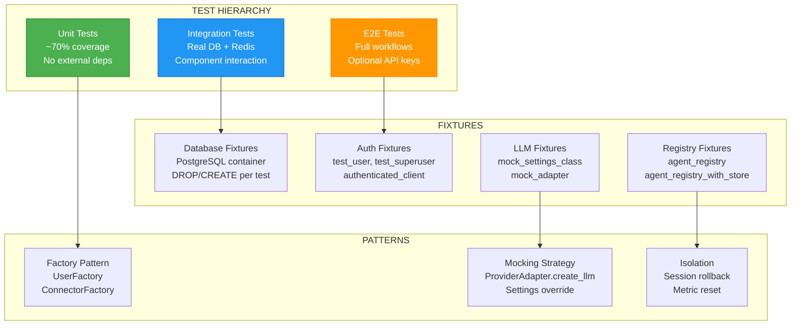

# ADR-031: Testing Strategy for LLM Applications

**Status**: ✅ IMPLEMENTED (2025-12-21)
**Deciders**: Équipe architecture LIA
**Technical Story**: Production-grade testing for AI/LLM applications
**Related Documentation**: `docs/technical/TESTING.md`

---

## Context and Problem Statement

L'application LLM-based nécessitait une stratégie de test robuste :

1. **LLM Mocking** : Comment tester sans appels API réels
2. **Async Testing** : pytest-asyncio pour code asynchrone
3. **Database Isolation** : Tests sans pollution inter-tests
4. **Multi-Tier Testing** : Unit, Integration, E2E appropriés

**Question** : Comment tester efficacement une application basée sur des LLMs ?

---

## Decision Drivers

### Must-Have (Non-Negotiable):

1. **LLM Mocking** : Mock ProviderAdapter, pas les appels individuels
2. **Database Isolation** : Fresh state per test (DROP/CREATE pattern)
3. **Async Support** : pytest-asyncio avec function-scoped loops
4. **Coverage Reporting** : HTML + terminal reports

### Nice-to-Have:

- Test factories for domain objects
- Marker-based test categorization
- Graceful external service handling

---

## Decision Outcome

**Chosen option**: "**Multi-Tier Testing + LLM Mocking + Factory Pattern**"

### Architecture Overview



### Directory Structure

```
apps/api/tests/
├── conftest.py                    # Root fixtures (730+ lines)
├── fixtures/
│   └── factories.py               # UserFactory, ConnectorFactory
├── helpers/
│   └── llm_helpers.py             # LLM pricing test utilities
├── unit/                          # Isolated component tests
│   ├── connectors/
│   ├── domains/
│   │   ├── agents/
│   │   │   ├── context/
│   │   │   ├── services/
│   │   │   └── models/
│   │   └── personalities/
│   └── infrastructure/
├── integration/                   # Real database/Redis tests
│   ├── test_redis_limiter_integration.py
│   ├── test_llm_config_integration.py
│   └── test_auth.py
├── e2e/                           # End-to-end workflows
│   └── test_hitl_flows_e2e.py
└── infrastructure/
    └── llm/
        ├── conftest.py            # LLM-specific fixtures
        └── test_factory.py        # 809 lines of LLM tests
```

### pytest Configuration

```toml
# apps/api/pyproject.toml

[tool.pytest.ini_options]
minversion = "8.0"
addopts = "-ra -q --strict-markers --cov=src --cov-report=term-missing --cov-report=html"
testpaths = ["tests"]
asyncio_mode = "auto"
asyncio_default_fixture_loop_scope = "function"
pythonpath = ["."]
markers = [
    "e2e: End-to-end integration tests",
    "integration: Integration tests requiring external services",
    "multiprocess: Multi-process tests for horizontal scaling",
    "benchmark: Performance benchmark tests",
]
log_cli = true
log_cli_level = "INFO"
```

### LLM Mocking Strategy

```python
# apps/api/tests/infrastructure/llm/conftest.py

@pytest.fixture
def mock_settings_class():
    """Mock settings with all provider credentials."""
    class MockSettings:
        openai_api_key = "sk-test-openai-key"
        anthropic_api_key = "sk-test-anthropic-key"
        deepseek_api_key = "sk-test-deepseek-key"
        router_llm_provider = "openai"
        response_llm_provider = "anthropic"
        # ... per-component configuration
    return MockSettings()

# Usage in tests
@patch("src.infrastructure.llm.factory.ProviderAdapter")
@patch("src.infrastructure.llm.factory.settings")
def test_get_llm_router(mock_settings_module, mock_adapter, mock_settings_class):
    # Configure patched settings
    for attr in dir(mock_settings_class):
        if not attr.startswith("_"):
            setattr(mock_settings_module, attr, getattr(mock_settings_class, attr))

    mock_adapter.create_llm.return_value = mock_llm

    llm = get_llm("router")

    # Verify ProviderAdapter called correctly
    mock_adapter.create_llm.assert_called_once_with(
        provider="openai",
        model="gpt-4.1-mini-mini",
        temperature=0.1,
        # ...
    )
```

### Database Fixtures

```python
# apps/api/tests/conftest.py

@pytest.fixture(scope="session")
def postgres_container() -> Generator[PostgresContainer | None, None, None]:
    """Create PostgreSQL test container (pgvector:pg16)."""
    # Uses testcontainers, auto-skip if Docker unavailable

@pytest_asyncio.fixture(scope="function")
async def async_engine(test_database_url: str):
    """Create async SQLAlchemy engine with fresh schema."""
    engine = create_async_engine(test_database_url)
    async with engine.begin() as conn:
        await conn.run_sync(Base.metadata.drop_all)
        await conn.run_sync(Base.metadata.create_all)
    yield engine
    await engine.dispose()

@pytest_asyncio.fixture(scope="function")
async def async_session(async_engine) -> AsyncGenerator[AsyncSession, None]:
    """Async session with automatic rollback cleanup."""
    async_session_maker = async_sessionmaker(async_engine, expire_on_commit=False)
    async with async_session_maker() as session:
        yield session
        await session.rollback()
```

### Authentication Fixtures

```python
# apps/api/tests/conftest.py

@pytest_asyncio.fixture
async def test_user(async_session: AsyncSession) -> User:
    """Standard test user (test@example.com)."""
    user = UserFactory.create(email="test@example.com", password="testpass123")
    async_session.add(user)
    await async_session.commit()
    return user

@pytest_asyncio.fixture
async def authenticated_client(async_client, test_user):
    """BFF Pattern: Pre-logged-in async client with session cookie."""
    # Login and set session cookie
    response = await async_client.post("/auth/login", json={...})
    return async_client, test_user

# Cookie assertion helper
def assert_cookie_set(response, cookie_name, httponly=None, samesite=None):
    """Assert cookie attributes (HttpOnly, SameSite, Max-Age)."""
```

### Test Factories

```python
# apps/api/tests/fixtures/factories.py

class UserFactory:
    @staticmethod
    def create(
        email: str | None = None,
        password: str | None = None,
        is_active: bool = True,
        is_superuser: bool = False,
        oauth_provider: str | None = None,
    ) -> User:
        """Create User with sensible defaults."""
        if email is None:
            email = f"test-{uuid4()}@example.com"
        hashed_password = get_password_hash(password) if password else None
        return User(
            email=email,
            hashed_password=hashed_password,
            is_active=is_active,
            is_superuser=is_superuser,
            timezone="Europe/Paris",
            language="fr",
        )

    @staticmethod
    def create_superuser(...) -> User:
        """Create admin user."""

    @staticmethod
    def create_oauth_user(provider="google", ...) -> User:
        """Create OAuth user (no password)."""

class ConnectorFactory:
    @staticmethod
    def create_gmail_connector(...) -> Connector:
        """Create Gmail connector with encrypted credentials."""
```

### Agent Registry Fixtures

```python
# apps/api/tests/conftest.py

@pytest.fixture(scope="function")
def agent_registry():
    """
    REQUIRED for tests using build_graph(), AgentService.

    Creates fresh registry, initializes catalogue, registers builders.
    """
    from src.domains.agents.registry import reset_global_registry

    reset_global_registry()
    registry = get_global_registry()
    registry.initialize_catalogue()
    registry.register_all_builders()
    yield registry
    reset_global_registry()

@pytest_asyncio.fixture(scope="function")
async def agent_registry_with_store(async_session: AsyncSession):
    """For integration tests needing persistent state (HITL, checkpointing)."""
    mock_store = AsyncMock()
    mock_store.aget = AsyncMock(return_value=None)
    mock_store.aput = AsyncMock()
    registry = AgentRegistry(checkpointer=None, store=mock_store)
    yield registry
```

### Metrics Reset Pattern

```python
@pytest.fixture(autouse=True)
def reset_metrics():
    """Reset Prometheus metrics before each test."""
    for collector in list(REGISTRY._collector_to_names.keys()):
        try:
            if hasattr(collector, "_metrics"):
                collector._metrics.clear()
        except Exception:
            pass
    yield
```

### Test Markers & Categories

```python
# Unit test
def test_password_hashing():
    """Pure unit test - no dependencies."""
    assert verify_password("test", get_password_hash("test"))

# Integration test
@pytest.mark.integration
@pytest.mark.asyncio
async def test_redis_rate_limiting(redis_client):
    """Integration test with real Redis."""

# E2E test
@pytest.mark.e2e
@pytest.mark.skipif(not os.getenv("OPENAI_API_KEY"), reason="Requires API key")
async def test_hitl_complete_flow():
    """End-to-end workflow test."""

# Running by category
# pytest -m "not slow"
# pytest -m "integration"
# pytest tests/unit/
```

### Coverage Configuration

```bash
# Default coverage with HTML report
pytest --cov=src --cov-report=term-missing --cov-report=html

# Output: htmlcov/index.html
```

### Consequences

**Positive**:
- ✅ **4,000+ tests** : Comprehensive coverage
- ✅ **LLM Mocking** : No expensive API calls in tests
- ✅ **Database Isolation** : Clean state per test
- ✅ **Async Support** : Full pytest-asyncio integration
- ✅ **Factory Pattern** : DRY test data creation
- ✅ **Marker System** : Selective test execution

**Negative**:
- ⚠️ Testcontainers requires Docker
- ⚠️ Some E2E tests require real API keys

---

## Validation

**Acceptance Criteria**:
- [x] ✅ pytest-asyncio with auto mode
- [x] ✅ LLM mocking via ProviderAdapter
- [x] ✅ Database isolation (DROP/CREATE)
- [x] ✅ Factory pattern for test data
- [x] ✅ Coverage reporting (HTML + terminal)
- [x] ✅ Marker-based categorization
- [x] ✅ Agent registry fixtures

---

## References

### Source Code
- **Root conftest**: `apps/api/tests/conftest.py`
- **LLM conftest**: `apps/api/tests/infrastructure/llm/conftest.py`
- **Factories**: `apps/api/tests/fixtures/factories.py`
- **LLM Helpers**: `apps/api/tests/helpers/llm_helpers.py`
- **pytest Config**: `apps/api/pyproject.toml`

---

**Fin de ADR-031** - Testing Strategy for LLM Applications Decision Record.
