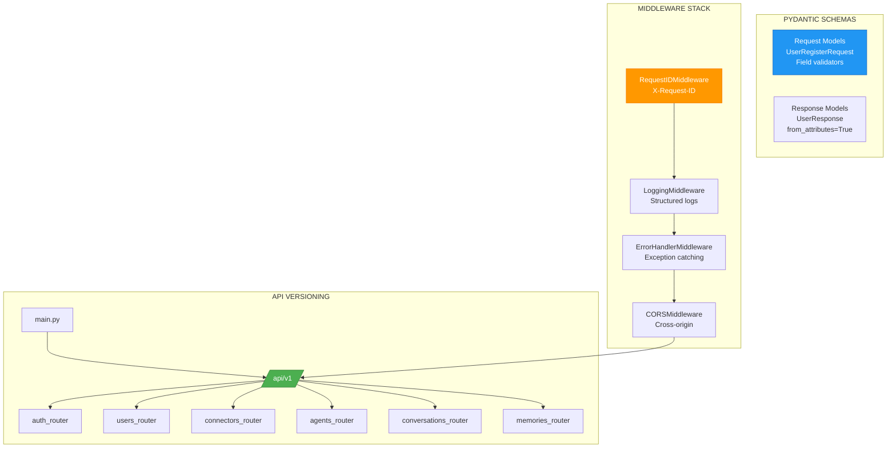

# ADR-032: API Design & Versioning

**Status**: ✅ IMPLEMENTED (2025-12-21)
**Deciders**: Équipe architecture LIA
**Technical Story**: Production-grade FastAPI REST API architecture
**Related Documentation**: `docs/technical/API.md`

---

## Context and Problem Statement

L'API REST nécessitait une architecture cohérente et évolutive :

1. **Versioning** : Strategy pour évolutions non-breaking
2. **Schema Validation** : Type-safe request/response
3. **Error Handling** : Format unifié des erreurs
4. **Documentation** : OpenAPI auto-générée

**Question** : Comment concevoir une API maintenable et évolutive ?

---

## Decision Drivers

### Must-Have (Non-Negotiable):

1. **URL Versioning** : `/api/v1/` prefix
2. **Pydantic Schemas** : Validation automatique
3. **Domain-Driven Routers** : Organisation par domaine métier
4. **Unified Error Format** : BaseAPIException hierarchy

### Nice-to-Have:

- OpenAPI documentation
- Rate limiting per endpoint
- Pagination patterns

---

## Decision Outcome

**Chosen option**: "**Domain Routers + Pydantic Schemas + BFF Authentication**"

### Architecture Overview



### Router Composition

```python
# apps/api/src/api/v1/routes.py

api_router = APIRouter()

# Domain routers with automatic prefixing
api_router.include_router(auth_router)           # /auth/*
api_router.include_router(users_router)          # /users/*
api_router.include_router(connectors_router)     # /connectors/*
api_router.include_router(agents_router)         # /agents/*
api_router.include_router(conversations_router)  # /conversations/*
api_router.include_router(memories_router)       # /memories/*
```

```python
# apps/api/src/main.py

app = FastAPI(
    title="LIA API",
    version=API_VERSION,
    docs_url="/docs" if not settings.is_production else None,
)

app.include_router(api_router, prefix=settings.api_prefix)  # /api/v1
```

### Pydantic Request Schemas

```python
# apps/api/src/domains/auth/schemas.py

class UserRegisterRequest(BaseModel):
    email: EmailStr = Field(..., description="User email address")
    password: str = Field(
        ...,
        min_length=PASSWORD_MIN_LENGTH,
        max_length=PASSWORD_MAX_LENGTH,
    )
    full_name: str | None = Field(None, description="User full name")
    timezone: str | None = Field(None)
    remember_me: bool = Field(default=False)

    @field_validator("timezone")
    @classmethod
    def validate_timezone_field(cls, v: str | None) -> str | None:
        if v is not None and not validate_timezone(v):
            raise ValueError(f"Invalid timezone: {v}")
        return v
```

### Pydantic Response Schemas

```python
# apps/api/src/domains/auth/schemas.py

class UserResponse(BaseModel):
    id: UUID = Field(..., description="User ID")
    email: EmailStr
    full_name: str | None
    timezone: str = Field(default="Europe/Paris")
    is_active: bool
    is_verified: bool
    created_at: datetime
    updated_at: datetime

    model_config = {"from_attributes": True}  # ORM integration

class AuthResponseBFF(BaseModel):
    """BFF Pattern: No tokens exposed."""
    user: UserResponse
    message: str = Field(default="Authentication successful")
```

### Endpoint Deprecation Pattern

```python
# apps/api/src/domains/auth/router.py

@router.post(
    "/refresh",
    status_code=410,  # HTTP 410 Gone
    deprecated=True,
    responses={
        410: {
            "description": "Endpoint permanently removed",
            "content": {
                "application/json": {
                    "example": {
                        "detail": {
                            "error": "endpoint_permanently_removed",
                            "message": "Token refresh removed with BFF Pattern",
                            "migration_guide": "/docs#bff-authentication",
                            "alternative": "/auth/login",
                            "deprecated_since": "v0.2.0",
                            "removed_in": "v0.3.0",
                        }
                    }
                }
            },
        }
    },
)
async def refresh_token(data: TokenRefreshRequest) -> None:
    raise HTTPException(status_code=410, detail={...})
```

### Error Response Format

```python
# apps/api/src/core/exceptions.py

class BaseAPIException(HTTPException):
    """Base with automatic logging and metrics."""

    def __init__(self, status_code: int, detail: str, **log_context):
        super().__init__(status_code=status_code, detail=detail)
        logger.warning(detail.lower().replace(" ", "_"), **log_context)
        http_errors_total.labels(status_code=str(status_code)).inc()

# Helpers
def raise_invalid_credentials() -> NoReturn:
    """OWASP: Same message for invalid email or password."""

def raise_not_found_or_unauthorized(resource_type: str) -> NoReturn:
    """OWASP: Prevents user enumeration."""
```

### Rate Limiting

```python
# apps/api/src/core/rate_limit_config.py

endpoint_limits = {
    "auth_login": 10,      # 10/min (brute force)
    "auth_register": 5,    # 5/min (spam)
    "sse": 120,            # 120/min (streaming)
    "default": 60,         # 60/min (standard)
}

# Custom error handler
def custom_rate_limit_handler(request, exc):
    return JSONResponse(
        status_code=429,
        content={"error": "rate_limit_exceeded", "retry_after": 60},
        headers={"Retry-After": "60"},
    )
```

### Pagination Pattern

```python
# apps/api/src/domains/conversations/router.py

@router.get("/me/messages", response_model=ConversationMessagesResponse)
async def get_conversation_messages(
    limit: int = Query(50, ge=1, le=200, description="Max messages"),
    current_user: User = Depends(get_current_active_session),
) -> ConversationMessagesResponse:
    messages = await service.get_messages(current_user.id, limit)
    return ConversationMessagesResponse(
        messages=messages,
        total_count=len(messages),
    )
```

### Middleware Stack

```python
# apps/api/src/core/middleware.py

class RequestIDMiddleware(BaseHTTPMiddleware):
    async def dispatch(self, request, call_next):
        request_id = request.headers.get("X-Request-ID") or str(uuid.uuid4())
        structlog.contextvars.bind_contextvars(request_id=request_id)
        response = await call_next(request)
        response.headers["X-Request-ID"] = request_id
        return response

# Order: RequestID → Logging → ErrorHandler → CORS
```

### Consequences

**Positive**:
- ✅ **URL Versioning** : `/api/v1/` prefix
- ✅ **Domain Routers** : Clean separation by business domain
- ✅ **Type-Safe** : Pydantic validation
- ✅ **Auto-Documentation** : OpenAPI/Swagger
- ✅ **Unified Errors** : BaseAPIException hierarchy
- ✅ **Rate Limiting** : Per-endpoint configuration

**Negative**:
- ⚠️ Documentation disabled in production
- ⚠️ Wildcards for CORS methods/headers

---

## Validation

**Acceptance Criteria**:
- [x] ✅ URL versioning (/api/v1/)
- [x] ✅ Domain-driven routers
- [x] ✅ Pydantic request/response schemas
- [x] ✅ OpenAPI auto-documentation
- [x] ✅ Unified exception hierarchy
- [x] ✅ Rate limiting with custom handler
- [x] ✅ Pagination with validation

---

## References

### Source Code
- **Main App**: `apps/api/src/main.py`
- **Routes**: `apps/api/src/api/v1/routes.py`
- **Middleware**: `apps/api/src/core/middleware.py`
- **Exceptions**: `apps/api/src/core/exceptions.py`
- **Rate Limits**: `apps/api/src/core/rate_limit_config.py`

---

**Fin de ADR-032** - API Design & Versioning Decision Record.
