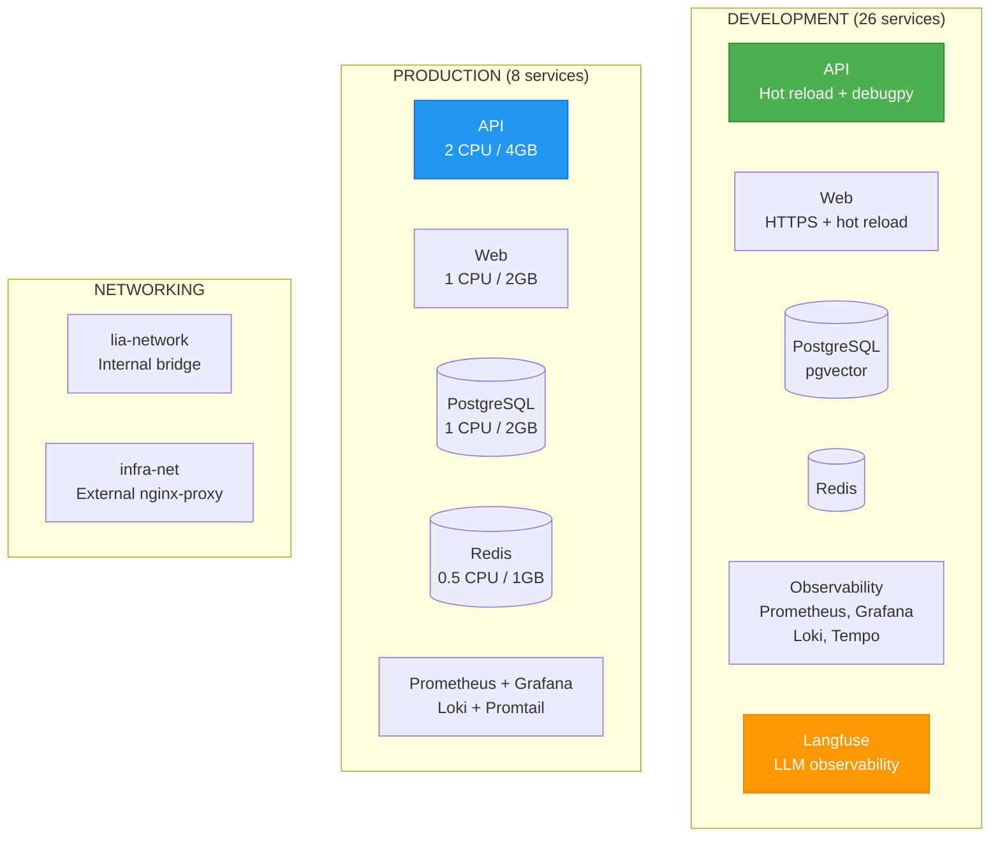

# ADR-033: Deployment Architecture

**Status**: ✅ IMPLEMENTED (2025-12-21)
**Deciders**: Équipe architecture LIA
**Technical Story**: Multi-environment Docker Compose deployment
**Related Documentation**: `docs/technical/DEPLOYMENT.md`

---

## Context and Problem Statement

L'application multi-services nécessitait une architecture de déploiement flexible :

1. **Multi-Environment** : Dev (full stack) vs Prod (lean stack)
2. **Service Orchestration** : 15+ services avec dépendances
3. **Resource Constraints** : Raspberry Pi 5 (4 CPU, 16GB RAM)
4. **Observability** : Prometheus, Grafana, Loki, Langfuse

**Question** : Comment orchestrer les services pour dev et production ?

---

## Decision Drivers

### Must-Have (Non-Negotiable):

1. **Docker Compose** : Orchestration multi-container
2. **Health Checks** : Dependency-based startup order
3. **Resource Limits** : Production constraints
4. **Volume Persistence** : Data survival across restarts

### Nice-to-Have:

- Multi-platform builds (amd64/arm64)
- Self-signed SSL for development
- CI/CD automation

---

## Decision Outcome

**Chosen option**: "**Multi-Environment Docker Compose + Multi-Stage Builds**"

### Architecture Overview



### Dockerfile Patterns

**Backend API (Multi-Stage Production)**:

```dockerfile
# apps/api/Dockerfile.prod

# Stage 1: Builder
FROM python:3.12-slim AS builder
RUN pip install --no-cache-dir -r requirements.txt

# Stage 2: Runtime
FROM python:3.12-slim AS runtime
RUN useradd -m -u 1000 appuser  # Non-root
COPY --from=builder /usr/local/lib/python3.12/site-packages /usr/local/lib/python3.12/site-packages
USER appuser
EXPOSE 8000
HEALTHCHECK --interval=30s --timeout=10s \
    CMD curl -f http://localhost:8000/health || exit 1
CMD ["uvicorn", "src.main:app", "--host", "0.0.0.0"]
```

**Frontend Web (Multi-Stage Next.js)**:

```dockerfile
# apps/web/Dockerfile.prod

# Stage 1: Dependencies
FROM node:20-alpine AS deps
RUN npm install -g pnpm && pnpm install

# Stage 2: Builder
FROM node:20-alpine AS builder
COPY --from=deps /monorepo/node_modules ./node_modules
RUN pnpm build  # Next.js standalone output

# Stage 3: Runner
FROM node:20-alpine AS runner
RUN adduser -u 1001 -D nextjs  # Non-root
COPY --from=builder /monorepo/apps/web/.next/standalone ./
USER nextjs
EXPOSE 3000
HEALTHCHECK --interval=30s --timeout=10s \
    CMD wget --spider http://127.0.0.1:3000/ || exit 1
```

### Docker Compose (Development)

```yaml
# docker-compose.dev.yml

services:
  ssl-init:
    image: alpine/openssl
    command: /generate-certs.sh
    volumes:
      - ssl_certs:/certs
      - ./infrastructure/ssl/generate-certs.sh:/generate-certs.sh:ro

  postgres:
    image: pgvector/pgvector:pg16
    healthcheck:
      test: ["CMD", "pg_isready", "-U", "${POSTGRES_USER}"]
      interval: 5s
      timeout: 5s
      retries: 5
    volumes:
      - postgres_data:/var/lib/postgresql/data

  redis:
    image: redis:7.4-alpine
    command: redis-server --requirepass ${REDIS_PASSWORD} --appendonly yes
    healthcheck:
      test: ["CMD", "redis-cli", "-a", "${REDIS_PASSWORD}", "ping"]

  api:
    build:
      context: .
      dockerfile: apps/api/Dockerfile.dev
    depends_on:
      postgres: {condition: service_healthy}
      redis: {condition: service_healthy}
      ssl-init: {condition: service_completed_successfully}
    ports:
      - "8000:8000"
      - "5678:5678"  # Debugpy
    volumes:
      - ./apps/api:/app
      - ssl_certs:/certs:ro
    environment:
      - UVICORN_SSL_CERTFILE=/certs/server.crt
      - UVICORN_SSL_KEYFILE=/certs/server.key

  web:
    build:
      context: .
      dockerfile: apps/web/Dockerfile.dev
    depends_on:
      api: {condition: service_healthy}
    ports:
      - "3000:3000"
    environment:
      - NODE_TLS_REJECT_UNAUTHORIZED=0  # Dev only

  # Observability stack
  prometheus:
    image: prom/prometheus:v2.54.1
    volumes:
      - ./infrastructure/observability/prometheus.yml:/etc/prometheus/prometheus.yml:ro
      - prometheus_data:/prometheus

  grafana:
    image: grafana/grafana:11.2.0
    ports:
      - "3001:3000"
    volumes:
      - grafana_data:/var/lib/grafana

  langfuse-web:
    image: langfuse/langfuse:3
    depends_on:
      langfuse-db: {condition: service_healthy}
      langfuse-clickhouse: {condition: service_healthy}
    ports:
      - "3002:3000"

volumes:
  postgres_data:
  redis_data:
  prometheus_data:
  grafana_data:
  ssl_certs:

networks:
  default:
    name: lia-network
```

### Docker Compose (Production)

```yaml
# docker-compose.prod.yml

services:
  postgres:
    image: pgvector/pgvector:pg16
    deploy:
      resources:
        limits: {cpus: "1", memory: 2G}
        reservations: {cpus: "0.25", memory: 512M}
    healthcheck:
      interval: 10s
      retries: 5

  redis:
    image: redis:7-alpine
    deploy:
      resources:
        limits: {cpus: "0.5", memory: 1G}
        reservations: {cpus: "0.1", memory: 256M}

  api:
    image: ghcr.io/jgouviergmail/lia-api:latest
    deploy:
      resources:
        limits: {cpus: "2", memory: 4G}
        reservations: {cpus: "0.5", memory: 1G}
    tmpfs:
      - /tmp:size=100M,mode=1777  # tiktoken libs
    restart: unless-stopped

  web:
    image: ghcr.io/jgouviergmail/lia-web:latest
    deploy:
      resources:
        limits: {cpus: "1", memory: 2G}
        reservations: {cpus: "0.25", memory: 512M}
    restart: unless-stopped

  prometheus:
    command:
      - '--storage.tsdb.retention.time=7d'
      - '--storage.tsdb.retention.size=2GB'
    deploy:
      resources:
        limits: {cpus: "0.5", memory: 1G}

networks:
  default:
    name: lia-network
  infra-net:
    external: true  # nginx-proxy-manager
```

### Health Check Strategy

| Service | Command | Interval | Timeout | Retries |
|---------|---------|----------|---------|---------|
| PostgreSQL | `pg_isready` | 10s | 5s | 5 |
| Redis | `redis-cli ping` | 10s | 3s | 5 |
| API | `curl /health` | 30s | 10s | 3 |
| Web | `wget --spider /` | 30s | 10s | 3 |

### CI/CD Pipeline

```yaml
# .github/workflows/ci.yml

jobs:
  build:
    steps:
      - name: Build and push images
        uses: docker/build-push-action@v5
        with:
          platforms: linux/amd64,linux/arm64
          push: true
          tags: ghcr.io/jgouviergmail/lia-api:latest

  deploy:
    needs: build
    steps:
      - name: Deploy to production
        uses: appleboy/ssh-action@v1
        with:
          script: |
            docker compose -f docker-compose.prod.yml pull
            docker compose -f docker-compose.prod.yml up -d
```

### Resource Allocation (Raspberry Pi 5)

| Service | CPU Limit | Memory Limit | CPU Reserved | Memory Reserved |
|---------|-----------|--------------|--------------|-----------------|
| API | 2 | 4GB | 0.5 | 1GB |
| PostgreSQL | 1 | 2GB | 0.25 | 512MB |
| Web | 1 | 2GB | 0.25 | 512MB |
| Redis | 0.5 | 1GB | 0.1 | 256MB |
| Prometheus | 0.5 | 1GB | 0.1 | 256MB |

### Consequences

**Positive**:
- ✅ **Multi-Environment** : Dev (26 services) vs Prod (8 services)
- ✅ **Resource Control** : CPU/memory limits
- ✅ **Health Checks** : Dependency-based startup
- ✅ **Multi-Platform** : amd64 + arm64 builds
- ✅ **Non-Root** : Security hardening
- ✅ **Self-Signed SSL** : HTTPS in dev

**Negative**:
- ⚠️ Docker dependency required
- ⚠️ No HA/failover on single Raspberry Pi

---

## Validation

**Acceptance Criteria**:
- [x] ✅ Multi-stage Dockerfiles
- [x] ✅ Docker Compose dev vs prod
- [x] ✅ Health checks with dependencies
- [x] ✅ Resource limits for production
- [x] ✅ Volume persistence
- [x] ✅ CI/CD pipeline
- [x] ✅ Multi-platform builds

---

## References

### Source Code
- **API Dockerfile**: `apps/api/Dockerfile.prod`
- **Web Dockerfile**: `apps/web/Dockerfile.prod`
- **Dev Compose**: `docker-compose.dev.yml`
- **Prod Compose**: `docker-compose.prod.yml`
- **CI/CD**: `.github/workflows/ci.yml`

---

**Fin de ADR-033** - Deployment Architecture Decision Record.
