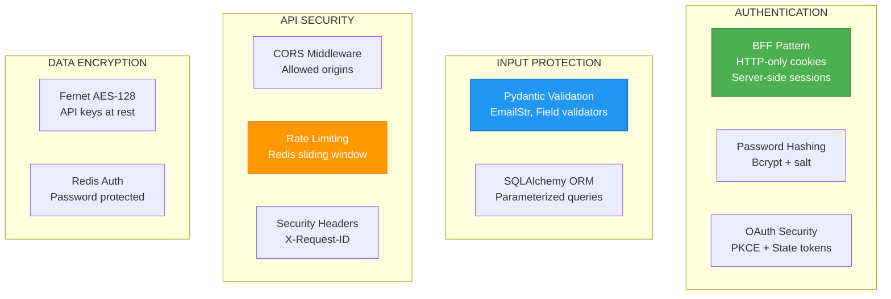

# ADR-034: Security Hardening

**Status**: ✅ IMPLEMENTED (2026-01-13 - Updated)
**Deciders**: Équipe architecture LIA
**Technical Story**: Production-grade security measures
**Related Documentation**: `docs/technical/SECURITY.md`

---

## Context and Problem Statement

L'application nécessitait des mesures de sécurité robustes :

1. **Authentication** : Protection sessions et tokens
2. **Input Validation** : Prévention injections
3. **API Protection** : Rate limiting, CORS
4. **Data Security** : Chiffrement at-rest

**Question** : Comment sécuriser l'application selon les standards OWASP ?

---

## Decision Drivers

### Must-Have (Non-Negotiable):

1. **BFF Pattern** : HTTP-only cookies (XSS protection)
2. **SQL Injection** : SQLAlchemy ORM (parameterized queries)
3. **CSRF Protection** : SameSite=Lax + OAuth state tokens
4. **Password Hashing** : Bcrypt with automatic salt

### Nice-to-Have:

- Rate limiting distribué
- Fernet encryption for API keys
- PKCE for OAuth

---

## Decision Outcome

**Chosen option**: "**BFF + Bcrypt + Fernet + Redis Rate Limiting**"

### Architecture Overview



### BFF Pattern (XSS Protection)

```python
# apps/api/src/core/config/security.py

session_cookie_httponly: bool = Field(
    default=True,
    description="HTTP-only flag (prevents XSS access)",
)
session_cookie_samesite: str = Field(
    default="lax",
    description="SameSite policy (CSRF protection)",
)
session_cookie_secure: bool = Field(
    default=True,
    description="Secure flag (HTTPS only in production)",
)
```

```python
# apps/api/src/core/session_helpers.py

response.set_cookie(
    key=settings.session_cookie_name,
    value=session.session_id,
    max_age=session_ttl,
    secure=settings.session_cookie_secure,
    httponly=settings.session_cookie_httponly,  # JS cannot access
    samesite=settings.session_cookie_samesite,  # CSRF protection
)
```

### Session Rotation (PROD only)

Rotation de session après login pour prévenir les attaques de fixation de session :

```python
# apps/api/src/core/session_helpers.py

async def create_authenticated_session_with_cookie(
    response: Response,
    user_id: str,
    remember_me: bool = False,
    old_session_id: str | None = None,  # Session rotation
) -> UserSession:
    # Session rotation (PROD only)
    if old_session_id and settings.is_production:
        await session_store.delete_session(old_session_id)
        logger.info("session_rotated", old_session_id=old_session_id, user_id=user_id)
    # ... create new session
```

### JTI Single-Use Tokens (PROD only)

Tokens de vérification d'email et password reset à usage unique via Redis blacklist :

```python
# apps/api/src/core/security/utils.py

async def verify_single_use_token(token: str, expected_type: str) -> tuple[dict, str | None]:
    """Verify token + check JTI not already used (PROD only)."""
    payload = verify_token(token)
    jti = payload.get("jti")
    if jti and await is_token_used(jti):
        raise_token_already_used(expected_type)
    return payload, jti

# Constants in src/core/constants.py
JTI_BLACKLIST_REDIS_PREFIX = "jti:used:"
JTI_BLACKLIST_TTL_SECONDS = 25 * 60 * 60  # 25 hours
```

### Password Hashing (Bcrypt)

```python
# apps/api/src/core/security/utils.py

import bcrypt

def get_password_hash(password: str) -> str:
    """Hash password using bcrypt with automatic salt."""
    if not password or not password.strip():
        raise ValueError("Password cannot be empty")
    salt = bcrypt.gensalt()
    return bcrypt.hashpw(password.encode("utf-8"), salt).decode("utf-8")

def verify_password(plain_password: str, hashed_password: str) -> bool:
    """Verify password against hash."""
    return bcrypt.checkpw(
        plain_password.encode("utf-8"),
        hashed_password.encode("utf-8")
    )
```

### SQL Injection Prevention

```python
# apps/api/src/domains/auth/repository.py

# Always use ORM parameterized queries
result = await self.db.execute(
    select(User).where(
        User.oauth_provider == provider,  # Column object
        User.oauth_provider_id == provider_id,  # Not string concat
    )
)
```

### CSRF Protection (OAuth)

```python
# apps/api/src/core/security/utils.py

import secrets

def generate_state_token() -> str:
    """Generate OAuth state token for CSRF protection."""
    return secrets.token_urlsafe(32)

def generate_code_verifier() -> str:
    """Generate PKCE code verifier (RFC 7636)."""
    return secrets.token_urlsafe(43)

def generate_code_challenge(code_verifier: str) -> str:
    """Generate SHA-256 code challenge for PKCE."""
    digest = hashlib.sha256(code_verifier.encode()).digest()
    return base64.urlsafe_b64encode(digest).decode().rstrip("=")
```

### Input Validation (Pydantic)

```python
# apps/api/src/domains/auth/schemas.py

class UserRegisterRequest(BaseModel):
    email: EmailStr = Field(...)  # RFC 5322 validation
    password: str = Field(
        ...,
        min_length=8,   # PASSWORD_MIN_LENGTH
        max_length=128, # PASSWORD_MAX_LENGTH
    )

    @field_validator("timezone")
    @classmethod
    def validate_timezone_field(cls, v: str | None) -> str | None:
        if v and not validate_timezone(v):
            raise ValueError(f"Invalid timezone: {v}")
        return v
```

### Rate Limiting (Redis Sliding Window)

```python
# apps/api/src/infrastructure/rate_limiting/redis_limiter.py

SLIDING_WINDOW_SCRIPT = """
local key = KEYS[1]
local max_calls = tonumber(ARGV[1])
local window_seconds = tonumber(ARGV[2])
local current_time = tonumber(ARGV[3])

redis.call('ZREMRANGEBYSCORE', key, '-inf', current_time - window_seconds)
local current_count = redis.call('ZCARD', key)

if current_count < max_calls then
    redis.call('ZADD', key, current_time, ARGV[4])
    return 1  -- Allowed
else
    return 0  -- Denied
end
"""
```

```python
# Endpoint-specific limits
RATE_LIMIT_AUTH_LOGIN_PER_MINUTE = 10      # Brute force protection
RATE_LIMIT_AUTH_REGISTER_PER_MINUTE = 5    # Spam prevention
RATE_LIMIT_SSE_MAX_PER_MINUTE = 120        # Streaming limit
```

### API Key Encryption (Fernet)

```python
# apps/api/src/core/security/utils.py

from cryptography.fernet import Fernet

cipher_suite = Fernet(settings.fernet_key.encode())

def encrypt_data(data: str) -> str:
    """Encrypt with Fernet (AES-128)."""
    return cipher_suite.encrypt(data.encode()).decode()

def decrypt_data(encrypted_data: str) -> str:
    """Decrypt Fernet-encrypted data."""
    return cipher_suite.decrypt(encrypted_data.encode()).decode()
```

### CORS Configuration

```python
# apps/api/src/core/middleware.py

app.add_middleware(
    CORSMiddleware,
    allow_origins=settings.cors_origins,
    allow_credentials=True,  # Required for session cookies
    allow_methods=["*"],
    allow_headers=["*"],
    expose_headers=["X-Request-ID"],
)
```

### OWASP Enumeration Prevention

```python
# apps/api/src/core/exceptions.py

def raise_invalid_credentials() -> NoReturn:
    """Same message for invalid email OR password."""
    raise AuthenticationError("Invalid credentials")

def raise_not_found_or_unauthorized(resource_type: str) -> NoReturn:
    """Same error for not found AND not authorized."""
    raise ResourceNotFoundError(f"{resource_type} not found")
```

### Security Summary

| Component | Implementation | Status |
|-----------|----------------|--------|
| **XSS** | HTTP-only cookies | ✅ |
| **CSRF** | SameSite=Lax + OAuth state | ✅ |
| **SQL Injection** | SQLAlchemy ORM | ✅ |
| **Password** | Bcrypt with salt | ✅ |
| **Rate Limiting** | Redis sliding window | ✅ |
| **API Keys** | Fernet AES-128 | ✅ |
| **OAuth** | PKCE + state tokens | ✅ |
| **CORS** | Configurable origins | ✅ |
| **Session Fixation** | Session rotation (PROD) | ✅ |
| **Token Replay** | JTI single-use (PROD) | ✅ |
| **CSP Headers** | Not implemented | ⚠️ |

### Consequences

**Positive**:
- ✅ **BFF Pattern** : XSS protection via HTTP-only cookies
- ✅ **Session Rotation** : Session fixation prevention (PROD only)
- ✅ **JTI Single-Use** : Token replay prevention (PROD only)
- ✅ **Bcrypt** : Industry-standard password hashing
- ✅ **Fernet** : AES-128 encryption at rest
- ✅ **PKCE** : OAuth 2.1 security
- ✅ **Rate Limiting** : Distributed Redis protection
- ✅ **OWASP Compliance** : Enumeration prevention

**Negative**:
- ⚠️ CSP headers not implemented
- ⚠️ X-Frame-Options not set

---

## Validation

**Acceptance Criteria**:
- [x] ✅ HTTP-only session cookies
- [x] ✅ Session rotation after login (PROD only)
- [x] ✅ JTI single-use tokens for email verification & password reset (PROD only)
- [x] ✅ Bcrypt password hashing
- [x] ✅ SQLAlchemy parameterized queries
- [x] ✅ OAuth PKCE + state tokens
- [x] ✅ Redis rate limiting
- [x] ✅ Fernet encryption for API keys
- [x] ✅ OWASP enumeration prevention

---

## References

### Source Code
- **Security Utils**: `apps/api/src/core/security/utils.py`
- **Security Config**: `apps/api/src/core/config/security.py`
- **Rate Limiter**: `apps/api/src/infrastructure/rate_limiting/redis_limiter.py`
- **Middleware**: `apps/api/src/core/middleware.py`
- **Exceptions**: `apps/api/src/core/exceptions.py`

---

**Fin de ADR-034** - Security Hardening Decision Record.
