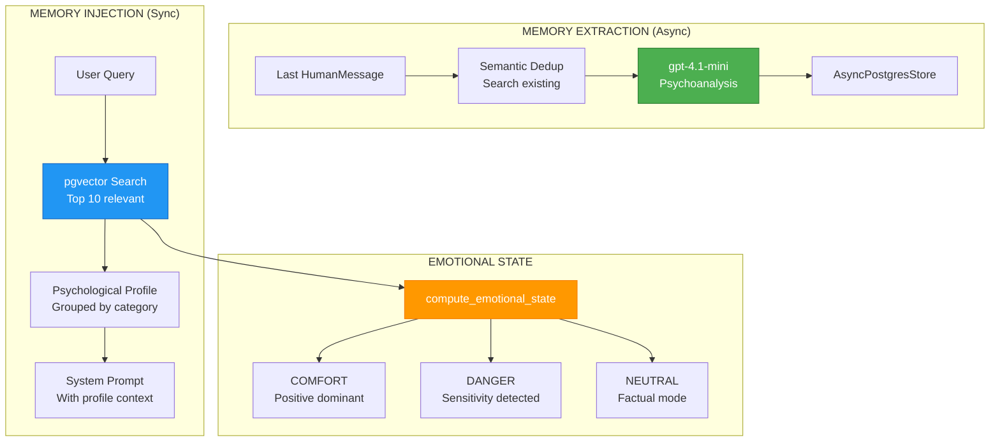

# ADR-037: Semantic Memory Store

**Status**: ✅ IMPLEMENTED (2025-12-21) | **Updated**: 2026-02-02 (Hybrid Search BM25 + Semantic)
**Deciders**: Équipe architecture LIA
**Technical Story**: Long-term psychological memory for personalized interactions
**Related Documentation**: `docs/technical/LONG_TERM_MEMORY.md`

> **Update v1.14.1**: Embedding model migrated from OpenAI text-embedding-3-small to Google gemini-embedding-001 with RETRIEVAL task types and dual-vector search. See [ADR-069](ADR-069-Gemini-Embedding-Migration.md).

---

## Context and Problem Statement

L'assistant nécessitait une mémoire long-terme pour personnaliser les interactions :

1. **Psychological Profiling** : Comprendre préférences et sensibilités
2. **Background Extraction** : Analyser conversations sans bloquer
3. **Semantic Injection** : Injecter contexte pertinent dans prompts
4. **Emotional Calibration** : Adapter ton selon état émotionnel

**Question** : Comment construire une mémoire psychologique persistante ?

---

## Decision Drivers

### Must-Have (Non-Negotiable):

1. **pgvector Search** : Recherche sémantique sur embeddings
2. **Background Extraction** : Non-blocking via fire-and-forget
3. **Emotional State** : COMFORT / DANGER / NEUTRAL
4. **GDPR Compliance** : Export et suppression des données

### Nice-to-Have:

- Auto-purge intelligent
- Pinned memories protection
- Usage tracking

---

## Decision Outcome

**Chosen option**: "**LangGraph Store + pgvector + Background Extraction + Emotional State**"

### Architecture Overview



### Memory Schema

```python
# apps/api/src/domains/agents/tools/memory_tools.py

class MemorySchema(BaseModel):
    content: str                    # Fact in one sentence
    category: MemoryCategoryType    # preference, personal, relationship, event, pattern, sensitivity
    emotional_weight: int           # -10 (trauma) to +10 (joy)
    trigger_topic: str              # Activation keywords
    usage_nuance: str               # How to leverage info
    importance: float               # 0.0-1.0 priority
    usage_count: int                # Retrieval count
    last_accessed_at: datetime      # Last access time
    pinned: bool                    # Protected from purge
```

### Categories

| Category | Description | Example |
|----------|-------------|---------|
| `preference` | Tastes and preferences | "Aime la voile" |
| `personal` | Identity info | "Travaille chez Google" |
| `relationship` | People connections | "Ami Paul depuis 10 ans" |
| `event` | Milestones | "Mariage en juin 2023" |
| `pattern` | Behavioral patterns | "Préfère réunions le matin" |
| `sensitivity` | Delicate topics | "Père décédé en 2020" |

### Semantic Store

```python
# apps/api/src/infrastructure/store/semantic_store.py

class StoreNamespace:
    """Namespace factory for user data isolation."""

    def __init__(self, user_id: str, category: str = "memories"):
        self.user_id = user_id
        self.category = category

    def to_tuple(self) -> tuple[str, str]:
        return (self.user_id, self.category)

async def search_semantic(
    store: BaseStore,
    namespace: tuple,
    query: str,
    limit: int = 10,
    min_score: float = 0.6,
) -> list[Item]:
    """Unified semantic search via pgvector."""
    results = await store.asearch(namespace, query=query, limit=limit)
    return [r for r in results if r.score >= min_score]
```

### Hybrid Search (BM25 + Semantic) - Added 2026-02-02

```python
# apps/api/src/infrastructure/store/semantic_store.py

async def search_hybrid(
    store: BaseStore,
    namespace: StoreNamespace,
    query: str,
    limit: int = 10,
    min_score: float = 0.5,   # Combined score threshold
    alpha: float = 0.6,       # Semantic weight (0.6 = 60% semantic, 40% BM25)
) -> list[SearchItem]:
    """
    Hybrid search combining BM25 (keyword) + semantic (pgvector).

    Formula: final_score = α × semantic + (1-α) × bm25_normalized
    Boost: +10% if both signals > threshold
    """
```

**BM25 Index Manager** (`bm25_index.py`):
- Cache LRU per user (max 100 users)
- French-aware tokenization (Unicode, accents)
- Content hash for cache invalidation

**Configuration**:
```bash
MEMORY_HYBRID_ENABLED=true
MEMORY_HYBRID_ALPHA=0.6        # 60% semantic, 40% BM25
MEMORY_HYBRID_MIN_SCORE=0.5
MEMORY_BM25_CACHE_MAX_USERS=100
```

> Details: `docs/technical/HYBRID_SEARCH.md`

### Emotional State Computation

```python
# apps/api/src/infrastructure/store/semantic_store.py

class EmotionalState(Enum):
    COMFORT = "comfort"   # Positive memories dominant
    DANGER = "danger"     # Sensitive/trauma detected
    NEUTRAL = "neutral"   # Factual mode

def compute_emotional_state(memories: list[Item]) -> EmotionalState:
    """
    Algorithm:
    1. If ANY memory.emotional_weight <= -5 → DANGER
    2. If MAJORITY (>50%) have weight >= 3 → COMFORT
    3. Otherwise → NEUTRAL
    """
    if any(m.value.get("emotional_weight", 0) <= -5 for m in memories):
        return EmotionalState.DANGER

    positive_count = sum(1 for m in memories if m.value.get("emotional_weight", 0) >= 3)
    if positive_count > len(memories) / 2:
        return EmotionalState.COMFORT

    return EmotionalState.NEUTRAL
```

### Memory Injection (Synchronous)

```python
# apps/api/src/domains/agents/middleware/memory_injection.py

async def build_psychological_profile(
    store: BaseStore,
    user_id: str,
    query: str,
    limit: int = 10,
) -> tuple[str | None, EmotionalState]:
    """
    Build profile for system prompt injection.

    Returns: (profile_text, emotional_state)
    """
    results = await search_semantic(
        store,
        MemoryNamespace(user_id).to_tuple(),
        query,
        limit,
    )

    if not results:
        return None, EmotionalState.NEUTRAL

    # Group by category with priority
    profile = format_profile_by_category(results)
    emotional_state = compute_emotional_state(results)

    return profile, emotional_state
```

**Profile Template**:
```
## PROFIL PSYCHOLOGIQUE ACTIF

### ZONES SENSIBLES (Attention requise)
- 🔴 Son père Jacky est décédé en 2020 → Sujet très sensible

### RELATIONS CONNUES
- 💚 Ami Paul depuis 10 ans → Source de joie

### PRÉFÉRENCES & GOÛTS
- 🟢 Aime la voile → Source de plaisir

---
## DIRECTIVE PRIORITAIRE
Ces informations sont le "sous-texte", pas le sujet principal.
```

### Memory Extraction (Asynchronous)

```python
# apps/api/src/domains/agents/services/memory_extractor.py

async def extract_memories_background(
    store: BaseStore,
    user_id: str,
    messages: list[BaseMessage],
    personality_instruction: str | None = None,
) -> int:
    """
    OPTIMIZED extraction:
    1. Analyze ONLY last user message (not entire conversation)
    2. Semantic dedup (search existing, score >= 0.5)
    3. LLM extraction (gpt-4.1-mini, temperature 0.3)
    4. Store with validation
    """
    # Find last HumanMessage
    last_human_idx = find_last_human_message_index(messages)

    # Context window: messages[idx-3:idx+1]
    context_messages = messages[max(0, last_human_idx-3):last_human_idx+1]

    # Semantic deduplication
    existing = await store.asearch(
        MemoryNamespace(user_id).to_tuple(),
        query=context_messages[-1].content[:500],
        limit=10,
    )

    # LLM extraction with personality context
    prompt = load_prompt("memory_extraction_prompt")
    if personality_instruction:
        prompt += load_prompt("memory_extraction_personality_addon")

    response = await llm.ainvoke([
        SystemMessage(content=prompt),
        HumanMessage(content=format_messages(context_messages)),
    ])

    # Parse and store
    memories = parse_extraction_result(response.content)
    return await store_memories(store, user_id, memories)
```

### API Endpoints

```python
# apps/api/src/domains/memories/router.py

@router.get("")
async def list_memories(user: User, category: str | None = None):
    """List user memories with optional category filter."""

@router.get("/{id}")
async def get_memory(user: User, id: str):
    """Get specific memory."""

@router.post("")
async def create_memory(user: User, data: MemoryCreate):
    """Create memory manually."""

@router.patch("/{id}")
async def update_memory(user: User, id: str, data: MemoryUpdate):
    """Update memory (partial)."""

@router.patch("/{id}/pin")
async def toggle_pin(user: User, id: str):
    """Toggle pin state (auto-purge protection)."""

@router.delete("/{id}")
async def delete_memory(user: User, id: str):
    """Delete specific memory."""

@router.delete("")
async def delete_all(user: User, preserve_pinned: bool = True):
    """Delete all (GDPR erasure)."""

@router.get("/export")
async def export_memories(user: User):
    """Export all memories (GDPR portability)."""
```

### Memory Cleanup (Phase 6)

```python
# apps/api/src/infrastructure/scheduler/memory_cleanup.py

def calculate_retention_score(memory: dict) -> float:
    """
    Retention score formula:
    score = weight_importance * importance + weight_recency * recency_factor

    usage_count is intentionally NOT a positive signal (semantic-retrieval
    eligibility != actual use in a response). It is applied only as a
    negative penalty for never-activated memories past a grace period.
    """
    importance_boost = memory["importance"]
    recency_factor = max(0.0, 1.0 - age_days / RECENCY_DECAY_DAYS)

    score = 0.7 * importance_boost + 0.3 * recency_factor

    # Negative penalty: never-activated memories past grace period
    if age_days > USAGE_PENALTY_AGE_DAYS and memory["usage_count"] == 0:
        score *= USAGE_PENALTY_FACTOR

    return score

# Protection rules (never purged):
# - pinned = True (user-locked)
# - age_days < MIN_AGE_FOR_CLEANUP_DAYS (grace period)
```

### Configuration

```python
# apps/api/src/core/config/agents.py

memory_enabled: bool = True
memory_extraction_enabled: bool = True
memory_injection_enabled: bool = True
memory_max_results: int = 10
memory_min_search_score: float = 0.6
memory_extraction_llm_model: str = "gpt-4.1-mini"

# OpenAI Embeddings (updated v1.14.0)
# Migrated back from local E5 to OpenAI text-embedding-3-small for operational simplicity
memory_embedding_model: str = "text-embedding-3-small"
memory_embedding_dimensions: int = 1536

memory_min_age_for_cleanup_days: int = 7
memory_recency_decay_days: int = 45
memory_usage_penalty_age_days: int = 30
memory_usage_penalty_factor: float = 0.5
memory_retention_weight_importance: float = 0.7
memory_retention_weight_recency: float = 0.3
memory_purge_threshold: float = 0.5
memory_cleanup_hour: int = 4  # 4 AM UTC
```

### Embedding Model (Updated v1.14.0)

```python
# apps/api/src/infrastructure/llm/memory_embeddings.py

# OpenAI text-embedding-3-small for semantic search
# Migrated from local E5 for operational simplicity (no 470MB model, no 9s startup)

from src.infrastructure.llm.memory_embeddings import get_memory_embeddings

embeddings = get_memory_embeddings()  # Singleton
vector = await embeddings.aembed_query("search query")
```

| Model | Dimensions | Cost | Notes |
|-------|------------|------|-------|
| **gemini-embedding-001** (current, v1.14.1) | 3072 | $0 (free tier) | RETRIEVAL task types, dual-vector search |
| ~~text-embedding-3-small~~ (legacy, v1.14.0) | 1536 | $0.02/1M | Replaced by Gemini in v1.14.1 |
| ~~multilingual-e5-small~~ (legacy, ADR-049) | 384 | $0 | Removed in v1.14.0 |

### Consequences

**Positive**:
- ✅ **Semantic Search** : pgvector for conceptual matching
- ✅ **Hybrid Search** : BM25 + semantic for better recall (updated 2026-02-02)
- ✅ **Background Extraction** : Non-blocking response
- ✅ **Emotional Calibration** : -10 to +10 scale
- ✅ **GDPR Compliant** : Export and deletion
- ✅ **Intelligent Purge** : Retention scoring
- ✅ **Pinned Protection** : Critical memories preserved
- ✅ **Unified Embedding Model** : Google gemini-embedding-001 (updated v1.14.1, migrated from OpenAI text-embedding-3-small)

**Negative**:
- ⚠️ LLM extraction costs (gpt-4.1-mini still used)
- ⚠️ pgvector dependency
- ⚠️ Embedding API cost (Google gemini-embedding-001, free tier with rate limits)
- ⚠️ BM25 cache memory (~200-400KB per user)

---

## Validation

**Acceptance Criteria**:
- [x] ✅ pgvector semantic search
- [x] ✅ Background extraction via fire-and-forget
- [x] ✅ Emotional state computation
- [x] ✅ Profile injection in prompts
- [x] ✅ GDPR endpoints (export, delete)
- [x] ✅ Retention scoring + purge
- [x] ✅ Pinned memory protection

---

## Related Decisions

- [ADR-049: Local E5 Embeddings](ADR-049-Local-E5-Embeddings.md) - Historical: superseded by OpenAI text-embedding-3-small (v1.14.0)
- [ADR-048: Semantic Tool Router](ADR-048-Semantic-Tool-Router.md) - Uses same Gemini embeddings
- [ADR-069: Gemini Embedding Migration](ADR-069-Gemini-Embedding-Migration.md) - Migration from OpenAI to Google gemini-embedding-001 (v1.14.1)

---

## References

### Source Code
- **Semantic Store**: `apps/api/src/infrastructure/store/semantic_store.py`
- **Memory Embeddings**: `apps/api/src/infrastructure/llm/memory_embeddings.py`
- **Memory Injection**: `apps/api/src/domains/agents/middleware/memory_injection.py`
- **Memory Extraction**: `apps/api/src/domains/agents/services/memory_extractor.py`
- **Memory Router**: `apps/api/src/domains/memories/router.py`
- **Memory Cleanup**: `apps/api/src/infrastructure/scheduler/memory_cleanup.py`
- **Memory Consolidation**: `apps/api/src/infrastructure/scheduler/memory_consolidation.py` (daily merge of near-duplicates, runs at 5 AM UTC after cleanup)
- **Prompts**: `apps/api/src/domains/agents/prompts/v1/memory_*.txt`

---

**Fin de ADR-037** - Semantic Memory Store Decision Record.
