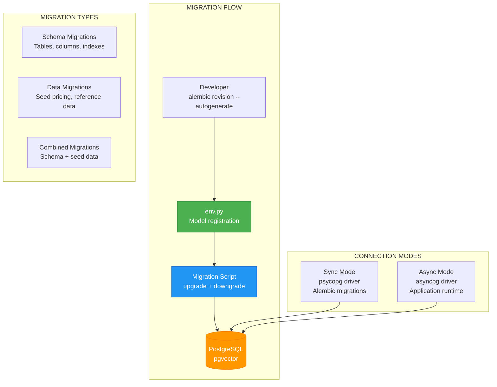

# ADR-040: Database Migration Strategy

**Status**: ✅ IMPLEMENTED (2025-12-21)
**Deciders**: Équipe architecture LIA
**Technical Story**: Alembic migrations for PostgreSQL with async SQLAlchemy
**Related Documentation**: `apps/api/alembic/README.md`

---

## Context and Problem Statement

L'application nécessitait une stratégie de migration robuste :

1. **Async SQLAlchemy** : Application async, migrations sync
2. **Version Control** : Traçabilité des changements de schéma
3. **Rollback Support** : Capacité de retour arrière
4. **Data Migrations** : Seed data avec idempotence

**Question** : Comment gérer les migrations de base de données de manière fiable et réversible ?

---

## Decision Drivers

### Must-Have (Non-Negotiable):

1. **Alembic Integration** : Standard SQLAlchemy
2. **Full Downgrade Support** : Toutes migrations réversibles
3. **Naming Convention** : Timestamps + slugs descriptifs
4. **Model Registration** : Autogenerate détecte tous les modèles

### Nice-to-Have:

- Data migrations idempotentes
- Zero-downtime patterns
- Migration testing

---

## Decision Outcome

**Chosen option**: "**Alembic + Sync Migrations + Async App + Timestamped Naming**"

### Architecture Overview



### Alembic Configuration

```ini
# apps/api/alembic.ini

[alembic]
script_location = alembic
prepend_sys_path = .

# Migration file naming: YYYY_MM_DD_HHMM-<rev>_<slug>
file_template = %%(year)d_%%(month).2d_%%(day).2d_%%(hour).2d%%(minute).2d-%%(rev)s_%%(slug)s

# Logging
[loggers]
keys = root,sqlalchemy,alembic

[logger_alembic]
level = INFO
handlers =
qualname = alembic

[logger_sqlalchemy]
level = WARN
handlers =
qualname = sqlalchemy.engine
```

### Environment Setup (env.py)

```python
# apps/api/alembic/env.py

from alembic import context
from sqlalchemy import create_engine, pool

# Import ALL domain models for autogenerate detection
from src.domains.auth.models import User as AuthUser
from src.domains.chat.models import MessageTokenSummary, TokenUsageLog, UserStatistics
from src.domains.connectors.models import Connector, ConnectorGlobalConfig
from src.domains.conversations.models import (
    Conversation,
    ConversationAuditLog,
    ConversationMessage,
)
from src.domains.llm.models import CurrencyExchangeRate, LLMModelPricing
from src.domains.users.models import AdminAuditLog, User
from src.infrastructure.database.models import Base

# Configuration
config = context.config
target_metadata = Base.metadata

def get_url() -> str:
    """Get sync database URL (asyncpg → psycopg)."""
    return settings.database_url_sync

def run_migrations_offline() -> None:
    """Run migrations in 'offline' mode (generate SQL without DB connection)."""
    context.configure(
        url=get_url(),
        target_metadata=target_metadata,
        literal_binds=True,
        compare_type=True,
        compare_server_default=True,
    )

    with context.begin_transaction():
        context.run_migrations()

def run_migrations_online() -> None:
    """Run migrations in 'online' mode (direct DB connection)."""
    connectable = create_engine(
        get_url(),
        poolclass=pool.NullPool,  # No connection pooling for migrations
    )

    with connectable.connect() as connection:
        context.configure(
            connection=connection,
            target_metadata=target_metadata,
            compare_type=True,
            compare_server_default=True,
        )

        with context.begin_transaction():
            context.run_migrations()

if context.is_offline_mode():
    run_migrations_offline()
else:
    run_migrations_online()
```

### Sync vs Async URL Conversion

```python
# apps/api/src/core/config/database.py

class DatabaseSettings(BaseSettings):
    database_url: PostgresDsn = Field(...)

    @property
    def database_url_sync(self) -> str:
        """
        Convert async URL to sync for Alembic.

        postgresql+asyncpg://... → postgresql+psycopg://...
        """
        return str(self.database_url).replace("+asyncpg", "+psycopg")
```

### Migration Template

```python
# apps/api/alembic/script.py.mako

"""${message}

Revision ID: ${up_revision}
Revises: ${down_revision | comma,n}
Create Date: ${create_date}

"""
from collections.abc import Sequence
from typing import Union

import sqlalchemy as sa
from sqlalchemy.dialects import postgresql

from alembic import op

revision: str = ${repr(up_revision)}
down_revision: str | None = ${repr(down_revision)}
branch_labels: str | Sequence[str] | None = ${repr(branch_labels)}
depends_on: str | Sequence[str] | None = ${repr(depends_on)}


def upgrade() -> None:
    ${upgrades if upgrades else "pass"}


def downgrade() -> None:
    ${downgrades if downgrades else "pass"}
```

### Schema Migration Example

```python
# apps/api/alembic/versions/2025_10_24_1949-add_conversation_persistence.py

"""Add conversation persistence tables.

Revision ID: conversation_persist_001
Revises: 62f067eda14d
Create Date: 2025-10-24 19:49:00.000000

"""
from alembic import op
import sqlalchemy as sa
from sqlalchemy.dialects import postgresql

revision = "conversation_persist_001"
down_revision = "62f067eda14d"


def upgrade() -> None:
    # Create conversations table
    op.create_table(
        "conversations",
        sa.Column("id", postgresql.UUID(as_uuid=True), primary_key=True),
        sa.Column("user_id", postgresql.UUID(as_uuid=True), nullable=False),
        sa.Column("title", sa.String(255), nullable=True),
        sa.Column("message_count", sa.Integer(), server_default="0"),
        sa.Column("total_tokens", sa.BigInteger(), server_default="0"),
        sa.Column("deleted_at", sa.DateTime(timezone=True), nullable=True),
        sa.Column("created_at", sa.DateTime(timezone=True), server_default=sa.func.now()),
        sa.Column("updated_at", sa.DateTime(timezone=True), onupdate=sa.func.now()),
        sa.ForeignKeyConstraint(["user_id"], ["users.id"], ondelete="CASCADE"),
        sa.UniqueConstraint("user_id"),  # 1:1 mapping
    )

    # Create indexes
    op.create_index("ix_conversations_user_id", "conversations", ["user_id"])
    op.create_index("ix_conversations_deleted_at", "conversations", ["deleted_at"])

    # Create conversation_messages table
    op.create_table(
        "conversation_messages",
        sa.Column("id", postgresql.UUID(as_uuid=True), primary_key=True),
        sa.Column("conversation_id", postgresql.UUID(as_uuid=True), nullable=False),
        sa.Column("role", sa.String(20), nullable=False),
        sa.Column("content", sa.Text(), nullable=False),
        sa.Column("message_metadata", postgresql.JSONB(), nullable=True),
        sa.Column("created_at", sa.DateTime(timezone=True), server_default=sa.func.now()),
        sa.ForeignKeyConstraint(
            ["conversation_id"],
            ["conversations.id"],
            ondelete="CASCADE",
        ),
    )

    op.create_index(
        "ix_conversation_messages_conv_created",
        "conversation_messages",
        ["conversation_id", sa.text("created_at DESC")],
    )


def downgrade() -> None:
    # Drop in reverse order (indexes first, then tables)
    op.drop_index("ix_conversation_messages_conv_created")
    op.drop_table("conversation_messages")
    op.drop_index("ix_conversations_deleted_at")
    op.drop_index("ix_conversations_user_id")
    op.drop_table("conversations")
```

### Data Migration Example (Idempotent)

```python
# apps/api/alembic/versions/2025_11_05_1500-seed_openai_pricing.py

"""Seed OpenAI pricing data.

Revision ID: seed_openai_pricing_001
Revises: llm_pricing_001
Create Date: 2025-11-05 15:00:00.000000

"""
from alembic import op
from sqlalchemy import text
from datetime import datetime, timezone

revision = "seed_openai_pricing_001"
down_revision = "llm_pricing_001"

OPENAI_PRICING = [
    {
        "model_name": "gpt-4.1",
        "input_price": "2.00",
        "output_price": "8.00",
        "cached_input_price": "1.00",
        "effective_from": datetime(2025, 4, 14, tzinfo=timezone.utc),
    },
    {
        "model_name": "gpt-4.1-mini",
        "input_price": "0.40",
        "output_price": "1.60",
        "cached_input_price": "0.20",
        "effective_from": datetime(2025, 7, 18, tzinfo=timezone.utc),
    },
    {
        "model_name": "gpt-4.1-nano",
        "input_price": "0.10",
        "output_price": "0.40",
        "cached_input_price": "0.05",
        "effective_from": datetime(2025, 4, 14, tzinfo=timezone.utc),
    },
    # ... more models
]


def upgrade() -> None:
    conn = op.get_bind()

    for pricing in OPENAI_PRICING:
        # Idempotent: ON CONFLICT DO NOTHING
        conn.execute(
            text("""
                INSERT INTO llm_model_pricing (
                    id,
                    model_name,
                    input_price_per_1m_tokens,
                    output_price_per_1m_tokens,
                    cached_input_price_per_1m_tokens,
                    effective_from,
                    is_active,
                    created_at
                )
                VALUES (
                    gen_random_uuid(),
                    :model_name,
                    :input_price,
                    :output_price,
                    :cached_input_price,
                    :effective_from,
                    true,
                    NOW()
                )
                ON CONFLICT (model_name, effective_from) DO NOTHING
            """),
            pricing,
        )


def downgrade() -> None:
    conn = op.get_bind()

    for pricing in OPENAI_PRICING:
        conn.execute(
            text("""
                DELETE FROM llm_model_pricing
                WHERE model_name = :model_name
                AND effective_from = :effective_from
            """),
            {"model_name": pricing["model_name"], "effective_from": pricing["effective_from"]},
        )
```

### Zero-Downtime Patterns

```python
# Pattern 1: Column addition with server_default (no table lock)
op.add_column(
    "users",
    sa.Column(
        "memory_enabled",
        sa.Boolean(),
        nullable=False,
        server_default="true",  # Existing rows get default
    ),
)

# Pattern 2: Safe type change (varchar extension)
op.alter_column(
    "users",
    "picture_url",
    existing_type=sa.VARCHAR(length=500),
    type_=sa.String(length=2048),  # Only extending, safe
)

# Pattern 3: Index creation (concurrent)
# Note: PostgreSQL 11+ supports CONCURRENTLY
op.create_index(
    "ix_conversations_user_id",
    "conversations",
    ["user_id"],
    postgresql_concurrently=True,  # Non-blocking
)

# Pattern 4: Foreign key with CASCADE
sa.ForeignKeyConstraint(
    ["user_id"],
    ["users.id"],
    ondelete="CASCADE",  # Ensures cleanup
)
```

### Migration Dependency Chain

```
initial_001
  │
  ├── 090adf8517f4 (picture_url length)
  │
  ├── cd42ca544c43 (connectors config)
  │
  ├── llm_pricing_001 (pricing tables)
  │     │
  │     └── seed_openai_pricing_001 (seed data)
  │           │
  │           └── seed_gemini_pricing_001 (more data)
  │
  ├── 62f067eda14d (token tracking)
  │     │
  │     └── 5421aa3ae914 (cost precision)
  │
  ├── conversation_persist_001 (conversations)
  │
  └── ... (21+ total migrations)
```

### Base Model Mixins

```python
# apps/api/src/infrastructure/database/models.py

class TimestampMixin:
    """Adds created_at and updated_at timestamps."""

    created_at: Mapped[datetime] = mapped_column(
        DateTime(timezone=True),
        server_default=func.now(),
        nullable=False,
    )
    updated_at: Mapped[datetime] = mapped_column(
        DateTime(timezone=True),
        server_default=func.now(),
        onupdate=func.now(),
        nullable=False,
    )


class UUIDMixin:
    """Adds UUID primary key."""

    id: Mapped[uuid.UUID] = mapped_column(
        UUID(as_uuid=True),
        primary_key=True,
        default=uuid.uuid4,
    )


class BaseModel(Base, UUIDMixin, TimestampMixin):
    """Base model with UUID + timestamps."""

    __abstract__ = True

    def dict(self) -> dict[str, Any]:
        return {c.name: getattr(self, c.name) for c in self.__table__.columns}
```

### Migration Commands

```bash
# Generate migration from model changes
alembic revision --autogenerate -m "add_user_preferences"

# Apply all pending migrations
alembic upgrade head

# Rollback last migration
alembic downgrade -1

# Rollback to specific revision
alembic downgrade conversation_persist_001

# Show current revision
alembic current

# Show migration history
alembic history

# Generate SQL without applying (offline mode)
alembic upgrade head --sql > migration.sql
```

### Consequences

**Positive**:
- ✅ **Full Downgrade Support** : Toutes migrations réversibles
- ✅ **Timestamped Naming** : Ordre chronologique clair
- ✅ **Model Registration** : Autogenerate détecte tous les modèles
- ✅ **Idempotent Data** : ON CONFLICT DO NOTHING
- ✅ **Sync/Async Separation** : Migrations sync, app async
- ✅ **Zero-Downtime Patterns** : server_default, concurrent indexes

**Negative**:
- ⚠️ No automated migration testing
- ⚠️ Manual zero-downtime coordination required

---

## Validation

**Acceptance Criteria**:
- [x] ✅ Alembic configuration with timestamped naming
- [x] ✅ Model registration in env.py
- [x] ✅ Async app + sync migrations separation
- [x] ✅ Full downgrade support (21+ migrations)
- [x] ✅ Idempotent data migrations
- [x] ✅ Zero-downtime patterns (server_default)
- [x] ✅ Base model mixins (UUID, timestamps)

---

## References

### Source Code
- **Alembic Config**: `apps/api/alembic.ini`
- **Environment**: `apps/api/alembic/env.py`
- **Migrations**: `apps/api/alembic/versions/`
- **Base Models**: `apps/api/src/infrastructure/database/models.py`
- **Database Config**: `apps/api/src/core/config/database.py`

---

**Fin de ADR-040** - Database Migration Strategy Decision Record.
