# ADR-042: Conversation Lifecycle Management

**Status**: ✅ IMPLEMENTED (2025-12-21)
**Deciders**: Équipe architecture LIA
**Technical Story**: Conversation creation, archiving, cleanup, and GDPR compliance
**Related Documentation**: `docs/technical/CONVERSATIONS.md`

---

## Context and Problem Statement

L'application nécessitait une gestion complète du cycle de vie des conversations :

1. **Lazy Creation** : Conversations créées au premier message
2. **Soft Delete** : Suppression logique avec possibilité de récupération
3. **Cleanup Automation** : Purge automatique des mémoires obsolètes
4. **GDPR Compliance** : Export et suppression des données utilisateur

**Question** : Comment gérer le cycle de vie complet des conversations de manière robuste et conforme GDPR ?

---

## Decision Drivers

### Must-Have (Non-Negotiable):

1. **Soft Delete** : `deleted_at` column pattern
2. **Audit Trail** : ConversationAuditLog immutable
3. **Cascade Delete** : Foreign keys avec ondelete CASCADE
4. **GDPR Endpoints** : Export et suppression des données

### Nice-to-Have:

- Memory cleanup scheduler
- Token usage tracking
- Message archival optimization

---

## Decision Outcome

**Chosen option**: "**Lazy Creation + Soft Delete + Audit Log + Cascade Cleanup**"

### Architecture Overview

```mermaid
graph TB
    subgraph "CONVERSATION LIFECYCLE"
        CREATE[Lazy Creation<br/>First message triggers]
        ACTIVE[Active State<br/>deleted_at IS NULL]
        SOFT[Soft Delete<br/>deleted_at timestamp]
        HARD[Hard Delete<br/>CASCADE on user deletion]
    end

    subgraph "DATA MODELS"
        CONV[Conversation<br/>1:1 user mapping]
        MSG[ConversationMessage<br/>Role, content, metadata]
        AUDIT[ConversationAuditLog<br/>Immutable trail]
        TOKEN[MessageTokenSummary<br/>Token tracking]
    end

    subgraph "CLEANUP"
        RESET[Reset Endpoint<br/>Purge all data]
        SCHEDULER[Memory Cleanup<br/>Daily at 4 AM UTC]
        GDPR[GDPR Export/Delete<br/>User data portability]
    end

    CREATE --> ACTIVE
    ACTIVE --> SOFT
    SOFT --> HARD
    CONV --> MSG
    CONV --> AUDIT
    MSG --> TOKEN
    RESET --> SCHEDULER
    SCHEDULER --> GDPR

    style CONV fill:#4CAF50,stroke:#2E7D32,color:#fff
    style AUDIT fill:#2196F3,stroke:#1565C0,color:#fff
    style GDPR fill:#FF9800,stroke:#F57C00,color:#fff
```



### Conversation Model

```python
# apps/api/src/domains/conversations/models.py

class Conversation(BaseModel):
    """
    Conversation model with 1:1 user mapping.

    Soft delete pattern: deleted_at IS NULL = active
    """
    __tablename__ = "conversations"

    # Foreign key (1:1 with user)
    user_id: Mapped[uuid.UUID] = mapped_column(
        UUID(as_uuid=True),
        ForeignKey("users.id", ondelete="CASCADE"),
        unique=True,  # Enforces 1:1 mapping
        nullable=False,
        index=True,
    )

    # Metadata
    title: Mapped[str | None] = mapped_column(String(255), nullable=True)
    message_count: Mapped[int] = mapped_column(Integer, server_default="0")
    total_tokens: Mapped[int] = mapped_column(BigInteger, server_default="0")

    # Soft delete timestamp (NULL = active)
    deleted_at: Mapped[datetime | None] = mapped_column(
        DateTime(timezone=True),
        nullable=True,
        index=True,
    )

    # Relationships (cascade delete)
    messages: Mapped[list["ConversationMessage"]] = relationship(
        back_populates="conversation",
        cascade="all, delete-orphan",
        order_by="ConversationMessage.created_at.desc()",
    )

    audit_logs: Mapped[list["ConversationAuditLog"]] = relationship(
        back_populates="conversation",
        cascade="all, delete-orphan",
    )

    user: Mapped["User"] = relationship(back_populates="conversation")


class ConversationMessage(BaseModel):
    """Message archival for fast UI pagination."""
    __tablename__ = "conversation_messages"

    conversation_id: Mapped[uuid.UUID] = mapped_column(
        UUID(as_uuid=True),
        ForeignKey("conversations.id", ondelete="CASCADE"),
        nullable=False,
    )

    role: Mapped[str] = mapped_column(String(20), nullable=False)  # user, assistant, system
    content: Mapped[str] = mapped_column(Text, nullable=False)
    message_metadata: Mapped[dict | None] = mapped_column(JSONB, nullable=True)

    # Index for pagination (conversation + created_at DESC)
    __table_args__ = (
        Index(
            "ix_conversation_messages_conv_created",
            "conversation_id",
            text("created_at DESC"),
        ),
    )


class ConversationAuditLog(Base, UUIDMixin):
    """
    Immutable audit trail (no updated_at).

    GDPR compliance: tracks all conversation actions.
    """
    __tablename__ = "conversation_audit_logs"

    conversation_id: Mapped[uuid.UUID] = mapped_column(
        UUID(as_uuid=True),
        ForeignKey("conversations.id", ondelete="CASCADE"),
        nullable=False,
    )

    action: Mapped[str] = mapped_column(
        String(50),
        nullable=False,
    )  # created, reset, deleted, reactivated

    message_count_at_action: Mapped[int] = mapped_column(Integer, nullable=False)
    audit_metadata: Mapped[dict | None] = mapped_column(JSONB, nullable=True)

    # Immutable: only created_at, no updated_at
    created_at: Mapped[datetime] = mapped_column(
        DateTime(timezone=True),
        server_default=func.now(),
        nullable=False,
    )
```

### Lazy Creation Pattern

```python
# apps/api/src/domains/conversations/service.py

class ConversationService:
    """Service with lazy creation and soft delete."""

    async def get_or_create_conversation(self, user_id: UUID) -> Conversation:
        """
        Get or create conversation for user.

        Priority:
        1. Return active conversation if exists
        2. Reactivate soft-deleted conversation (prevents unique key violation)
        3. Create new conversation
        """
        # Check for active conversation
        conversation = await self.repository.get_by_user_id(
            user_id,
            include_deleted=False,
        )
        if conversation:
            return conversation

        # Check for soft-deleted conversation (reactivate)
        deleted_conversation = await self.repository.get_by_user_id(
            user_id,
            include_deleted=True,
        )
        if deleted_conversation:
            logger.info("reactivating_conversation", conversation_id=deleted_conversation.id)
            return await self.reactivate_conversation(deleted_conversation)

        # Create new conversation with audit log
        return await self.repository.create_with_audit(
            user_id=user_id,
            action="created",
        )

    async def reactivate_conversation(self, conversation: Conversation) -> Conversation:
        """Reactivate soft-deleted conversation."""
        conversation.deleted_at = None
        conversation.message_count = 0
        conversation.total_tokens = 0

        await self.repository.add_audit_log(
            conversation_id=conversation.id,
            action="reactivated",
            message_count_at_action=0,
        )

        return conversation
```

### Soft Delete Implementation

```python
# apps/api/src/domains/conversations/repository.py

class ConversationRepository:
    """Repository with soft delete queries."""

    async def get_by_user_id(
        self,
        user_id: UUID,
        include_deleted: bool = False,
    ) -> Conversation | None:
        """Get conversation with soft delete filter."""
        query = select(Conversation).where(Conversation.user_id == user_id)

        if not include_deleted:
            query = query.where(Conversation.deleted_at.is_(None))

        result = await self.db.execute(query)
        return result.scalar_one_or_none()

    async def soft_delete(self, conversation: Conversation) -> None:
        """Mark conversation as deleted (soft delete)."""
        conversation.deleted_at = datetime.now(timezone.utc)

        await self.add_audit_log(
            conversation_id=conversation.id,
            action="deleted",
            message_count_at_action=conversation.message_count,
            metadata={"total_tokens": conversation.total_tokens},
        )

        await self.db.commit()
```

### Conversation Reset (Full Cleanup)

```python
# apps/api/src/domains/conversations/service.py

async def reset_conversation(self, conversation_id: UUID, user_id: UUID) -> int:
    """
    Reset conversation: purge all data.

    Cleanup targets:
    1. Conversation messages (cascade delete)
    2. Token summaries (via message metadata)
    3. LangGraph checkpoints
    4. Tool contexts (Store)
    5. Redis cache (user + conversation scoped)
    6. LLM cache

    Returns:
        Previous message count
    """
    conversation = await self.repository.get(conversation_id)
    if not conversation or conversation.user_id != user_id:
        raise NotFoundError("Conversation not found")

    previous_count = conversation.message_count

    # 1. Delete all messages (cascade handles token summaries)
    await self.repository.delete_all_messages(conversation_id)

    # 2. Delete LangGraph checkpoints
    thread_id = str(conversation_id)
    await self.checkpointer.adelete_thread(thread_id)

    # 3. Cleanup tool contexts
    await self.context_manager.cleanup_session_contexts(
        user_id=str(user_id),
        session_id=thread_id,
    )

    # 4. Cleanup Redis cache
    await self._cleanup_redis_cache(user_id, conversation_id)

    # 5. Reset counters
    conversation.message_count = 0
    conversation.total_tokens = 0

    # 6. Add audit log
    await self.repository.add_audit_log(
        conversation_id=conversation_id,
        action="reset",
        message_count_at_action=previous_count,
        metadata={"reset_type": "full"},
    )

    await self.db.commit()
    return previous_count

async def _cleanup_redis_cache(self, user_id: UUID, conversation_id: UUID) -> None:
    """Cleanup Redis cache patterns."""
    patterns = [
        f"*:{user_id}:*",           # User-scoped
        f"*:{conversation_id}:*",   # Conversation-scoped
        f"gmail:search:{user_id}:*",
        f"gmail:message:{user_id}:*",
        "llm_cache:*",              # Global LLM cache
    ]

    for pattern in patterns:
        keys = await self.redis.keys(pattern)
        if keys:
            await self.redis.delete(*keys)
```

### Memory Cleanup Scheduler

```python
# apps/api/src/infrastructure/scheduler/memory_cleanup.py

class MemoryCleanupJob:
    """
    Daily memory cleanup job.

    Runs at configurable hour (default 4 AM UTC).
    """

    async def run(self) -> CleanupStats:
        """
        Execute memory cleanup with retention scoring.

        Retention Score Formula:
        score = 0.7 * importance + 0.3 * recency_factor
        (usage_count applied only as negative penalty when == 0 past grace period)

        Protections (never purged):
        - pinned = True (user-locked)
        - age_days < min_age_for_cleanup_days (grace period, default 7 days)
        """
        stats = CleanupStats()

        # Get all user namespaces
        namespaces = await self._get_all_namespaces()

        for namespace in namespaces:
            # Search all memories for user
            memories = await self.store.asearch(namespace, query="*", limit=1000)

            for memory in memories:
                stats.total_checked += 1
                value = memory.value

                # Check protection rules
                if self._is_protected(value):
                    stats.protected += 1
                    stats.by_category[value.get("category", "unknown")]["protected"] += 1
                    continue

                # Calculate retention score
                score = self._calculate_retention_score(value)

                if score < settings.memory_purge_threshold:
                    # Purge low-scoring memory
                    await self.store.adelete(namespace, memory.key)
                    stats.purged += 1
                    stats.by_category[value.get("category", "unknown")]["purged"] += 1

        return stats

    def _is_protected(self, memory: dict, age_days: int) -> bool:
        """Check if memory is protected from purge.

        Only two protections remain after the v1.16+ refactor: pinned (user-locked)
        and grace period. Category- and emotional-based protections were removed
        because they overlapped with `importance` (which the LLM already sets high
        for sensitivities) and lacked empirical justification.
        """
        if memory.get("pinned", False):
            return True

        if age_days < settings.memory_min_age_for_cleanup_days:
            return True

        return False

    def _calculate_retention_score(self, memory: dict) -> float:
        """
        Calculate retention score (0-1).

        Higher score = keep longer. usage_count is intentionally NOT a positive
        signal (eligibility at retrieval threshold != actual use in response).
        It is applied only as a negative penalty for never-activated memories.
        """
        # Importance boost (70% weight, dominant signal)
        importance = memory.get("importance", 0.7)

        # Recency boost (30% weight)
        created_at = memory.get("created_at")
        if created_at:
            age_days = (datetime.utcnow() - created_at).days
            recency_factor = max(0.0, 1.0 - age_days / settings.memory_recency_decay_days)
        else:
            age_days = 0
            recency_factor = 0.5

        score = 0.7 * importance + 0.3 * recency_factor

        # Negative penalty: never-activated memories past grace period are suspect
        if age_days > settings.memory_usage_penalty_age_days and memory.get("usage_count", 0) == 0:
            score *= settings.memory_usage_penalty_factor

        return score
```

### GDPR Compliance Endpoints

```python
# apps/api/src/domains/memories/router.py

@router.get("/export")
async def export_memories(
    user: Annotated[User, Depends(get_current_user)],
    service: Annotated[MemoryService, Depends(get_memory_service)],
) -> MemoryExportResponse:
    """
    Export all user memories (GDPR data portability).

    Returns:
        JSON array of all memories with metadata
    """
    memories = await service.export_all(user.id)

    return MemoryExportResponse(
        user_id=str(user.id),
        exported_at=datetime.utcnow().isoformat(),
        memories=[
            MemoryExport(
                id=m.key,
                content=m.value.get("content"),
                category=m.value.get("category"),
                emotional_weight=m.value.get("emotional_weight"),
                importance=m.value.get("importance"),
                created_at=m.value.get("created_at"),
                last_accessed_at=m.value.get("last_accessed_at"),
                pinned=m.value.get("pinned", False),
            )
            for m in memories
        ],
    )


@router.delete("")
async def delete_all_memories(
    user: Annotated[User, Depends(get_current_user)],
    service: Annotated[MemoryService, Depends(get_memory_service)],
    preserve_pinned: bool = Query(default=True),
) -> MemoryDeleteResponse:
    """
    Delete all user memories (GDPR right to erasure).

    Args:
        preserve_pinned: If True, keep pinned memories

    Returns:
        Count of deleted and preserved memories
    """
    result = await service.delete_all(
        user_id=user.id,
        preserve_pinned=preserve_pinned,
    )

    return MemoryDeleteResponse(
        deleted_count=result.deleted,
        preserved_count=result.preserved,
        message="Memories deleted successfully",
    )


@router.delete("/{memory_id}")
async def delete_memory(
    memory_id: str,
    user: Annotated[User, Depends(get_current_user)],
    service: Annotated[MemoryService, Depends(get_memory_service)],
) -> MemoryDeleteResponse:
    """Delete specific memory."""
    await service.delete(user_id=user.id, memory_id=memory_id)

    return MemoryDeleteResponse(
        deleted_count=1,
        preserved_count=0,
        message="Memory deleted",
    )
```

### Conversation Router Endpoints

```python
# apps/api/src/domains/conversations/router.py

@router.get("/me")
async def get_current_conversation(
    user: Annotated[User, Depends(get_current_user)],
    service: Annotated[ConversationService, Depends(get_conversation_service)],
) -> ConversationResponse:
    """Get current user's active conversation."""
    conversation = await service.get_by_user_id(user.id)
    if not conversation:
        raise HTTPException(status_code=404, detail="No conversation found")
    return ConversationResponse.from_orm(conversation)


@router.get("/me/messages")
async def get_messages(
    user: Annotated[User, Depends(get_current_user)],
    service: Annotated[ConversationService, Depends(get_conversation_service)],
    limit: int = Query(default=50, ge=1, le=200),
) -> list[MessageResponse]:
    """Get conversation messages (newest first, with token usage)."""
    messages = await service.get_messages_with_token_summaries(
        user_id=user.id,
        limit=limit,
    )
    return [MessageResponse.from_orm(m) for m in messages]


@router.post("/me/reset")
async def reset_conversation(
    user: Annotated[User, Depends(get_current_user)],
    service: Annotated[ConversationService, Depends(get_conversation_service)],
) -> ResetResponse:
    """
    Reset conversation (requires frontend confirmation).

    Permanently deletes all messages, checkpoints, and cache.
    """
    conversation = await service.get_by_user_id(user.id)
    if not conversation:
        raise HTTPException(status_code=404, detail="No conversation found")

    previous_count = await service.reset_conversation(
        conversation_id=conversation.id,
        user_id=user.id,
    )

    return ResetResponse(
        success=True,
        previous_message_count=previous_count,
    )


@router.get("/me/stats")
async def get_stats(
    user: Annotated[User, Depends(get_current_user)],
    service: Annotated[ConversationService, Depends(get_conversation_service)],
) -> StatsResponse:
    """Get conversation statistics."""
    conversation = await service.get_by_user_id(user.id)
    if not conversation:
        raise HTTPException(status_code=404, detail="No conversation found")

    last_message = await service.get_last_message(conversation.id)

    return StatsResponse(
        message_count=conversation.message_count,
        total_tokens=conversation.total_tokens,
        created_at=conversation.created_at,
        last_message_at=last_message.created_at if last_message else None,
    )
```

### Thread Isolation in LangGraph

```python
# apps/api/src/domains/agents/orchestrator.py

async def execute_conversation(
    conversation: Conversation,
    message: str,
    user: User,
) -> AsyncIterator[SSEEvent]:
    """
    Execute conversation with thread isolation.

    thread_id = conversation.id ensures:
    - Checkpoint isolation per conversation
    - No cross-conversation state leakage
    - Clean reset via adelete_thread()
    """
    thread_id = str(conversation.id)

    config = RunnableConfig(
        configurable={
            "thread_id": thread_id,
            "user_id": str(user.id),
            "session_id": thread_id,
        },
        callbacks=[langfuse_callback],
    )

    # Build initial state
    input_state = build_initial_state(
        message=message,
        user=user,
        conversation=conversation,
    )

    # Execute graph with streaming
    async for event in graph.astream_events(input_state, config=config):
        yield transform_to_sse(event)
```

### Consequences

**Positive**:
- ✅ **Lazy Creation** : Conversations créées uniquement si nécessaire
- ✅ **Soft Delete** : Récupération possible, audit trail préservé
- ✅ **Cascade Delete** : Intégrité référentielle garantie
- ✅ **Memory Cleanup** : Purge automatique avec scoring intelligent
- ✅ **GDPR Compliance** : Export et suppression des données
- ✅ **Thread Isolation** : Pas de fuite d'état entre conversations

**Negative**:
- ⚠️ 1:1 user mapping limite les conversations multiples
- ⚠️ Reset est destructif et irréversible

---

## Validation

**Acceptance Criteria**:
- [x] ✅ Lazy conversation creation
- [x] ✅ Soft delete with deleted_at
- [x] ✅ ConversationAuditLog immutable trail
- [x] ✅ Cascade delete on foreign keys
- [x] ✅ Memory cleanup scheduler
- [x] ✅ GDPR export endpoint
- [x] ✅ GDPR delete endpoint
- [x] ✅ Thread isolation via conversation ID

---

## References

### Source Code
- **Models**: `apps/api/src/domains/conversations/models.py`
- **Service**: `apps/api/src/domains/conversations/service.py`
- **Repository**: `apps/api/src/domains/conversations/repository.py`
- **Router**: `apps/api/src/domains/conversations/router.py`
- **Memory Cleanup**: `apps/api/src/infrastructure/scheduler/memory_cleanup.py`
- **Memory Router**: `apps/api/src/domains/memories/router.py`

---

**Fin de ADR-042** - Conversation Lifecycle Management Decision Record.
