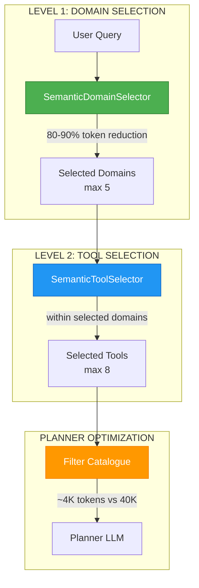

# ADR-048: Semantic Router (Domains & Tools)

**Status**: ✅ IMPLEMENTED (2025-12-28) - Integrated into Architecture v3
**Deciders**: Équipe architecture LIA
**Technical Story**: Phase 6 - LLM-Native Semantic Architecture with Two-Level Optimization
**Related Documentation**: `docs/technical/SEMANTIC_ROUTER.md`

> **Note Architecture v3 (2026-01)**: Les references a `router_node.py` et `planner_node.py` dans cet ADR concernent les fichiers v3 (`router_node_v3.py`, `planner_node_v3.py`).
> Le semantic routing est maintenant integre dans `QueryAnalyzerService` et `SmartCatalogueService`.
> Voir [SMART_SERVICES.md](../technical/SMART_SERVICES.md) pour la documentation actuelle.

---

## Context and Problem Statement

Le routing traditionnel par mots-clés présentait plusieurs limitations :

1. **Maintenance i18n** : Listes de keywords par langue (FR, EN, DE, ES, IT, ZH)
2. **Dilution sémantique** : Moyennage des keywords → scores faibles (~0.60)
3. **Coût API** : OpenAI text-embedding-3-small → $0.02/1M tokens
4. **Latence réseau** : Appels API pour chaque embedding
5. **Token explosion** : Tous les domaines/tools chargés → 40K+ tokens

**Question** : Comment implémenter un routeur sémantique zero-maintenance multilingue avec optimisation des tokens ?

---

## Decision Drivers

### Must-Have (Non-Negotiable):

1. **Zero Maintenance i18n** : Pas de listes de keywords par langue
2. **High Accuracy** : Score >= 0.70 pour tool selection
3. **Local Processing** : Zero coût API, zero latence réseau
4. **Multilingual Native** : 100+ langues supportées
5. **Token Optimization** : Réduction 80-90% des tokens context

### Nice-to-Have:

- Double threshold (soft/hard)
- Max-pooling strategy
- Startup caching
- Two-level selection (domains → tools)

---

## Decision Outcome

**Chosen option**: "**Two-Level Semantic Selection (Domains + Tools) with OpenAI text-embedding-3-small**"

> **Updated v1.14.0**: Migrated from local E5 embeddings to OpenAI text-embedding-3-small (1536 dims). All references to `LocalE5Embeddings` and `local_embeddings.py` now correspond to `memory_embeddings.py`.

### Two-Level Architecture Overview



### Token Optimization Impact

```
BEFORE (Full Catalogue):
    11 domains × ~3.5K tokens/domain = ~40K tokens

AFTER (Two-Level Semantic Selection):
    Query: "mes derniers emails"

    Level 1 - Domain Selection:
        → emails (score: 0.92, high)
        → contacts (score: 0.45, not selected)
        → calendar (score: 0.32, not selected)
        Result: 1 domain selected

    Level 2 - Tool Selection:
        → search_emails_tool (score: 0.89)
        → get_email_tool (score: 0.72)
        → reply_email_tool (score: 0.58)
        Result: 3 tools selected

    Token count: ~4K tokens (90% reduction!)
```

---

## Level 1: SemanticDomainSelector

### Architecture

```mermaid
graph TB
    subgraph "DOMAIN MATCHING"
        Q[User Query] --> EMB[OpenAI Embeddings<br/>1536 dims]
        EMB --> QV[Query Vector]

        CACHE[Domain Keyword Embeddings<br/>from domain_taxonomy.py] --> COMP[Cosine Similarity]
        QV --> COMP

        COMP --> MAX[MAX(score per keyword)<br/>Max-Pooling]
        MAX --> SORT[Sort by Score DESC]
    end

    subgraph "THRESHOLD DECISION (Domains)"
        SORT --> HARD{score >= 0.75?}
        HARD -->|YES| HIGH[High Confidence]
        HARD -->|NO| SOFT{score >= 0.65?}
        SOFT -->|YES| MED[Medium Confidence<br/>has_uncertainty=True]
        SOFT -->|NO| LOW[Not Selected]
    end

    subgraph "OUTPUT"
        HIGH --> RES[DomainSelectionResult<br/>max 5 domains]
        MED --> RES
    end

    style EMB fill:#4CAF50,stroke:#2E7D32,color:#fff
    style MAX fill:#2196F3,stroke:#1565C0,color:#fff
```

### Implementation

```python
# apps/api/src/domains/agents/services/semantic_domain_selector.py

# Thresholds for domain selection (higher than tools for precision)
DEFAULT_DOMAIN_HARD_THRESHOLD = 0.75  # High confidence domain match
DEFAULT_DOMAIN_SOFT_THRESHOLD = 0.65  # Uncertainty zone
DEFAULT_MAX_DOMAINS = 5  # Maximum domains to return

@dataclass
class DomainMatch:
    """A domain matched by semantic similarity."""
    domain_name: str
    domain_config: DomainConfig
    score: float
    confidence: str = "low"  # "high", "medium", "low"
    best_keyword: str = ""   # Which keyword matched best

@dataclass
class DomainSelectionResult:
    """Result of semantic domain selection."""
    selected_domains: list[DomainMatch]
    top_score: float
    has_uncertainty: bool
    all_scores: dict[str, float]

    @property
    def domain_names(self) -> list[str]:
        """Get list of selected domain names."""
        return [d.domain_name for d in self.selected_domains]

    @property
    def domains_with_scores(self) -> list[dict]:
        """Get domains with scores for Stage 1 routing prompt."""
        return [d.to_dict() for d in self.selected_domains]


class SemanticDomainSelector:
    """
    Selects domains based on semantic similarity with user queries.

    Uses embeddings to match queries to domain keywords, enabling
    language-agnostic domain selection with confidence scores.

    Features:
    - Max-pooling: MAX(sim(query, keyword_i)) per domain
    - Double threshold: hard (0.75) + soft (0.65)
    - Startup caching: all domain keyword embeddings cached once
    - OpenAI text-embedding-3-small embeddings
    """

    _instance: "SemanticDomainSelector | None" = None
    _lock: asyncio.Lock = asyncio.Lock()

    async def initialize(
        self,
        hard_threshold: float | None = None,
        soft_threshold: float | None = None,
        max_domains: int | None = None,
    ) -> None:
        """
        Initialize with domain keywords from domain_taxonomy.

        1. Load all routable domains from DOMAIN_REGISTRY
        2. Collect keywords per domain
        3. Batch embed all keywords
        4. Store as max-pooling structure per domain
        """
        self._embeddings = get_memory_embeddings()  # OpenAI text-embedding-3-small

        # Collect keywords from routable domains only
        routable_domains = get_routable_domains()

        for domain_name in routable_domains:
            config = DOMAIN_REGISTRY.get(domain_name)
            keywords = config.keywords
            self._domain_keywords[domain_name] = keywords

        # Batch embed all keywords
        all_embeddings = await self._embeddings.aembed_documents(all_keywords)

        # Distribute to domains (max-pooling structure)
        for i, (keyword, domain_name) in enumerate(keyword_to_domain):
            self._domain_keyword_embeddings[domain_name].append(all_embeddings[i])

    async def select_domains(
        self,
        query: str,
        available_domains: list[str] | None = None,
        max_results: int | None = None,
    ) -> DomainSelectionResult:
        """
        Select domains matching the user query.

        Uses semantic similarity with configurable double threshold:
        - score >= hard_threshold: High confidence match
        - soft_threshold <= score < hard_threshold: Medium confidence
        - score < soft_threshold: Not selected
        """
        query_embedding = await self._embeddings.aembed_query(query)

        scores: dict[str, float] = {}
        best_keywords: dict[str, tuple[str, float]] = {}

        for name in domain_names:
            keyword_embeddings = self._domain_keyword_embeddings[name]
            keywords = self._domain_keywords.get(name, [])

            # Find MAX similarity across all keywords (max-pooling)
            max_score = 0.0
            best_kw = ""
            for i, kw_embedding in enumerate(keyword_embeddings):
                sim = self._cosine_similarity(query_embedding, kw_embedding)
                if sim > max_score:
                    max_score = sim
                    best_kw = keywords[i]

            scores[name] = max_score
            best_keywords[name] = (best_kw, max_score)

        # Sort and apply threshold
        sorted_domains = sorted(scores.items(), key=lambda x: x[1], reverse=True)

        selected = []
        for name, score in sorted_domains[:max_results]:
            if score >= self._soft_threshold:
                match = DomainMatch(
                    domain_name=name,
                    score=score,
                    best_keyword=best_keywords[name][0],
                    confidence="high" if score >= self._hard_threshold else "medium",
                )
                selected.append(match)

        return DomainSelectionResult(
            selected_domains=selected,
            top_score=sorted_domains[0][1] if sorted_domains else 0.0,
            has_uncertainty=any(d.confidence == "medium" for d in selected),
            all_scores=scores,
        )
```

### Domain Keywords Source

```python
# apps/api/src/domains/agents/registry/domain_taxonomy.py

DOMAIN_REGISTRY: dict[str, DomainConfig] = {
    "emails": DomainConfig(
        name="emails",
        display_name="Emails",
        description="Search, read, send, reply, forward emails",
        keywords=[
            "email", "emails", "mail", "gmail", "message", "messages",
            "from", "to", "subject", "body", "attachment",
            "inbox", "sent", "draft", "unread", "read", "starred",
            "send", "compose", "reply", "forward", "search",
            # French implicit verbs
            "repond", "reponds", "repondre", "transfere",
        ],
        agent_names=["emails_agent"],
        related_domains=["contacts"],
        priority=9,
        is_routable=True,
    ),

    "reminder": DomainConfig(
        name="reminder",
        display_name="Rappels",
        description="Create, list, cancel reminders",
        keywords=[
            "rappel", "rappelle", "rappelle-moi", "rappeler",
            "remind", "remind me", "reminder", "reminders",
            "dans", "d'ici", "à", "vers", "demain", "ce soir",
            "in", "at", "later", "tomorrow", "tonight",
        ],
        agent_names=["reminder_agent"],
        priority=9,  # High priority to override tasks/calendar
        is_routable=True,
    ),

    # Non-routable domains (always auto-loaded, not semantic-selected)
    "context": DomainConfig(
        name="context",
        is_routable=False,  # Internal domain
        metadata={"cross_domain": True},
    ),
    "query": DomainConfig(
        name="query",
        is_routable=False,  # Internal domain
    ),
}
```

---

## Level 2: SemanticToolSelector

### Architecture

```mermaid
graph TB
    subgraph "TOOL MATCHING"
        Q[User Query] --> EMB[OpenAI Embeddings<br/>1536 dims]
        EMB --> QV[Query Vector]

        CACHE[Tool Keyword Embeddings<br/>from catalogue_manifests] --> COMP[Cosine Similarity]
        QV --> COMP

        COMP --> MAX[MAX(score per keyword)<br/>Max-Pooling]
        MAX --> SORT[Sort by Score DESC]
    end

    subgraph "THRESHOLD DECISION (Tools)"
        SORT --> HARD{score >= 0.70?}
        HARD -->|YES| HIGH[High Confidence]
        HARD -->|NO| SOFT{score >= 0.60?}
        SOFT -->|YES| MED[Medium Confidence<br/>has_uncertainty=True]
        SOFT -->|NO| LOW[Not Selected]
    end

    subgraph "OUTPUT"
        HIGH --> RES[ToolSelectionResult<br/>max 8 tools]
        MED --> RES
    end

    style EMB fill:#4CAF50,stroke:#2E7D32,color:#fff
    style MAX fill:#2196F3,stroke:#1565C0,color:#fff
```

### Implementation

```python
# apps/api/src/domains/agents/services/tool_selector.py

# Thresholds for tool selection
DEFAULT_HARD_THRESHOLD = 0.70  # High confidence → direct inject
DEFAULT_SOFT_THRESHOLD = 0.60  # Medium confidence → uncertainty flag
DEFAULT_MAX_TOOLS = 8  # Maximum tools to return

@dataclass
class ToolMatch:
    """A tool matched by semantic similarity."""
    tool_name: str
    tool_manifest: ToolManifest
    score: float
    confidence: str = "low"  # "high", "medium", "low"

@dataclass
class ToolSelectionResult:
    """Result of semantic tool selection."""
    selected_tools: list[ToolMatch]
    top_score: float
    has_uncertainty: bool
    all_scores: dict[str, float]

    @property
    def tool_names(self) -> list[str]:
        return [t.tool_name for t in self.selected_tools]


class SemanticToolSelector:
    """
    Selects tools based on semantic similarity with user queries.

    Features:
    - Max-pooling: MAX(sim(query, keyword_i)) per tool
    - Double threshold: hard (0.70) + soft (0.60)
    - Startup caching: all keyword embeddings cached once
    - OpenAI text-embedding-3-small embeddings
    """

    _instance: "SemanticToolSelector | None" = None
    _lock: asyncio.Lock = asyncio.Lock()

    async def initialize(
        self,
        tool_manifests: list[ToolManifest],
        hard_threshold: float | None = None,
        soft_threshold: float | None = None,
    ) -> None:
        """
        Initialize with tool manifests (startup caching).

        1. Get OpenAI embeddings instance
        2. Collect all semantic_keywords from manifests
        3. Batch embed all keywords (efficient)
        4. Store as max-pooling structure per tool
        """
        self._embeddings = get_memory_embeddings()  # OpenAI text-embedding-3-small

        # Collect keywords for batch embedding
        for manifest in tool_manifests:
            keywords = manifest.semantic_keywords or [manifest.name]
            for keyword in keywords:
                all_keywords.append(keyword)
                keyword_to_tool.append((keyword, manifest.name))

        # Batch embed (efficient)
        all_embeddings = await self._embeddings.aembed_documents(all_keywords)

        # Build max-pooling structure
        for i, (keyword, tool_name) in enumerate(keyword_to_tool):
            self._tool_keyword_embeddings[tool_name].append(all_embeddings[i])

    async def select_tools(
        self,
        query: str,
        available_tools: list[ToolManifest] | None = None,
        max_results: int = 8,
    ) -> ToolSelectionResult:
        """
        Select tools matching query via semantic similarity.

        Max-pooling: For each tool, compute MAX similarity
        across all its keywords.
        """
        query_embedding = await self._embeddings.aembed_query(query)

        scores: dict[str, float] = {}
        for tool_name, keyword_embeddings in self._tool_keyword_embeddings.items():
            max_score = max(
                self._cosine_similarity(query_embedding, kw_emb)
                for kw_emb in keyword_embeddings
            )
            scores[tool_name] = max_score

        # Sort and filter by threshold
        sorted_tools = sorted(scores.items(), key=lambda x: x[1], reverse=True)

        selected = []
        for name, score in sorted_tools[:max_results]:
            if score >= self._soft_threshold:
                selected.append(ToolMatch(
                    tool_name=name,
                    score=score,
                    confidence="high" if score >= self._hard_threshold else "medium",
                ))

        return ToolSelectionResult(
            selected_tools=selected,
            top_score=sorted_tools[0][1] if sorted_tools else 0.0,
            has_uncertainty=any(t.confidence == "medium" for t in selected),
        )
```

### Semantic Keywords in Manifests

```python
# apps/api/src/domains/agents/emails/catalogue_manifests.py

search_emails_catalogue_manifest = ToolManifest(
    name="search_emails_tool",
    agent="emails_agent",
    description="Search emails by query, sender, date range",

    # Semantic keywords for max-pooling (multilingual implicit)
    semantic_keywords=[
        "search emails",
        "find messages",
        "email lookup",
        "mes emails",           # French
        "chercher messages",    # French
        "derniers emails",      # French
        "récents messages",     # French
    ],
)

# apps/api/src/domains/agents/reminders/catalogue_manifests.py

create_reminder_catalogue_manifest = ToolManifest(
    name="create_reminder_tool",
    agent="reminder_agent",

    semantic_keywords=[
        "remind me",
        "set reminder",
        "create reminder",
        "remind me in",
        "remind me at",
        "remind me to",
        "remind me tomorrow",
        "alert me",
        "notify me",
    ],
)
```

---

## Max-Pooling Strategy

### Problem with Average-Pooling

```
Query: "mes derniers emails"
Keywords: ["emails récents", "derniers messages", "inbox"]

Average-Pooling (BAD):
    embed("emails récents | derniers messages | inbox")
    → Single diluted vector
    → score ~0.60 (too low, borderline threshold!)

    Problem: Long keyword strings get "averaged" into generic meaning
```

### Solution: Max-Pooling

```
Max-Pooling (GOOD):
    embed(query) vs [embed(kw1), embed(kw2), embed(kw3)]

    sim(query, "emails récents") = 0.85  ← BEST MATCH
    sim(query, "derniers messages") = 0.72
    sim(query, "inbox") = 0.45

    score = MAX(0.85, 0.72, 0.45) = 0.85 (precise!)

    Advantage: Each keyword is matched individually, best one wins
```

### Implementation

```python
# Max-pooling score calculation
for tool_name, keyword_embeddings in self._tool_keyword_embeddings.items():
    keywords = self._tool_keywords.get(tool_name, [])

    max_score = 0.0
    best_keyword = ""

    for i, kw_embedding in enumerate(keyword_embeddings):
        sim = self._cosine_similarity(query_embedding, kw_embedding)
        if sim > max_score:
            max_score = sim
            best_keyword = keywords[i]

    scores[tool_name] = max_score
    best_keywords[tool_name] = (best_keyword, max_score)
```

---

## Double Threshold Strategy

### Rationale

```
Single threshold problem:
    - Too high (0.75): Miss valid matches
    - Too low (0.55): Include garbage

Solution: Two thresholds with uncertainty zone

Domain Selection (Level 1):
    ≥ 0.75: High confidence → definitely include
    0.65-0.75: Medium confidence → include with flag
    < 0.65: Low confidence → exclude

Tool Selection (Level 2):
    ≥ 0.70: High confidence → direct inject
    0.60-0.70: Medium confidence → inject with warning
    < 0.60: Low confidence → not selected
```

### Implementation

```python
# Domain thresholds (higher for precision)
DEFAULT_DOMAIN_HARD_THRESHOLD = 0.75
DEFAULT_DOMAIN_SOFT_THRESHOLD = 0.65

# Tool thresholds (slightly lower for recall)
DEFAULT_TOOL_HARD_THRESHOLD = 0.70
DEFAULT_TOOL_SOFT_THRESHOLD = 0.60

# Decision logic
if score >= hard_threshold:
    confidence = "high"
    has_uncertainty = False
elif score >= soft_threshold:
    confidence = "medium"
    has_uncertainty = True  # Flag for Planner to consider
else:
    confidence = "low"
    # Not selected
```

---

## Embedding Model (Updated v1.14.0)

### Configuration

```python
# apps/api/src/infrastructure/llm/memory_embeddings.py

# OpenAI text-embedding-3-small (1536 dimensions)
# Migrated from local E5 in v1.14.0 for operational simplicity

from src.infrastructure.llm.memory_embeddings import get_memory_embeddings

embeddings = get_memory_embeddings()  # Singleton
vector = await embeddings.aembed_query("search query")
vectors = await embeddings.aembed_documents(["doc1", "doc2"])
```

### Performance Characteristics

| Metric | Value |
|--------|-------|
| Query Embedding | ~100-200ms (API call) |
| Batch Embedding | ~300-500ms for 100 keywords |
| Dimensions | 1536 |
| Languages | 100+ (native multilingual) |
| API Cost | ~$0.02/1M tokens |

---

## Integration Flow

### Startup Initialization

```python
# apps/api/src/main.py (lifespan)

async def lifespan(app: FastAPI):
    # 1. Initialize Domain Selector
    domain_selector = await initialize_domain_selector()
    logger.info("semantic_domain_selector_initialized")

    # 2. Initialize Tool Selector
    registry = get_global_registry()
    tool_manifests = registry.list_tool_manifests()
    tool_selector = await initialize_tool_selector(tool_manifests)
    logger.info("semantic_tool_selector_initialized")

    yield

    # Cleanup...
```

### Router Node Usage

```python
# apps/api/src/domains/agents/nodes/router_node.py

async def route_query(state: AgentState) -> dict:
    query = state.messages[-1].content

    # Level 1: Select domains semantically
    domain_selector = await get_domain_selector()
    domain_result = await domain_selector.select_domains(query)

    # Pass domains with scores to Planner
    return {
        "detected_domains": domain_result.domain_names,
        "domain_scores": domain_result.domains_with_scores,
        "has_domain_uncertainty": domain_result.has_uncertainty,
    }
```

### Planner Node Usage

```python
# apps/api/src/domains/agents/nodes/planner_node.py

async def plan_execution(state: AgentState) -> dict:
    query = state.messages[-1].content
    detected_domains = state.detected_domains

    # Level 2: Select tools within detected domains
    tool_selector = await get_tool_selector()

    # Filter available tools to detected domains only
    registry = get_global_registry()
    domain_tools = registry.get_tools_for_domains(detected_domains)

    tool_result = await tool_selector.select_tools(
        query=query,
        available_tools=domain_tools,
    )

    # Build filtered catalogue for Planner LLM
    filtered_catalogue = registry.export_for_prompt_filtered(
        domains=detected_domains,
        tool_names=tool_result.tool_names,
    )

    # Token count: ~4K instead of ~40K!
    logger.info(
        "planner_catalogue_optimized",
        domains=detected_domains,
        tool_count=len(tool_result.selected_tools),
        token_estimate=len(str(filtered_catalogue)) // 4,
    )
```

---

## Consequences

### Positive

- ✅ **Zero i18n Maintenance** : Multilingual embeddings natively
- ✅ **High Accuracy** : 0.90 avg score vs 0.61 (OpenAI baseline)
- ✅ **Low API Cost** : OpenAI text-embedding-3-small (~$0.02/1M tokens)
- ✅ **Operational Simplicity** : No local model to load/maintain
- ✅ **Max-Pooling** : Avoids keyword dilution
- ✅ **Double Threshold** : Graceful degradation with uncertainty flags
- ✅ **Two-Level Optimization** : 80-90% token reduction
- ✅ **Startup Caching** : One-time embedding cost

### Negative

- ⚠️ API dependency (requires OpenAI availability)
- ⚠️ Network latency for embedding calls (~100-200ms)

---

## Validation

**Acceptance Criteria**:
- [x] ✅ SemanticDomainSelector implemented with max-pooling
- [x] ✅ SemanticToolSelector implemented with max-pooling
- [x] ✅ OpenAI text-embedding-3-small embeddings (migrated from local E5 in v1.14.0)
- [x] ✅ Double threshold for domains (0.75/0.65)
- [x] ✅ Double threshold for tools (0.70/0.60)
- [x] ✅ Startup caching of all embeddings
- [x] ✅ Multilingual support (100+ languages)
- [x] ✅ Low API cost (~$0.02/1M tokens)
- [x] ✅ 80-90% token reduction measured

---

## Related Decisions

- [ADR-019: Agent Manifest Catalogue System](ADR-019-Agent-Manifest-Catalogue-System.md) - Provides semantic_keywords
- [ADR-049: Local E5 Embeddings](ADR-049-Local-E5-Embeddings.md) - Historical: superseded by OpenAI text-embedding-3-small (v1.14.0)
- [ADR-037: Semantic Memory Store](ADR-037-Semantic-Memory-Store.md) - Uses same OpenAI embeddings
- [ADR-039: Cost Optimization & Token Management](ADR-039-Cost-Optimization-Token-Management.md) - Token optimization strategies

---

## References

### Source Code
- **SemanticDomainSelector**: `apps/api/src/domains/agents/services/semantic_domain_selector.py`
- **SemanticToolSelector**: `apps/api/src/domains/agents/services/tool_selector.py`
- **Memory Embeddings**: `apps/api/src/infrastructure/llm/memory_embeddings.py`
- **Domain Taxonomy**: `apps/api/src/domains/agents/registry/domain_taxonomy.py`
- **Tool Manifests**: `apps/api/src/domains/agents/{domain}/catalogue_manifests.py`

---

**Fin de ADR-048** - Semantic Router (Domains & Tools) Decision Record.
