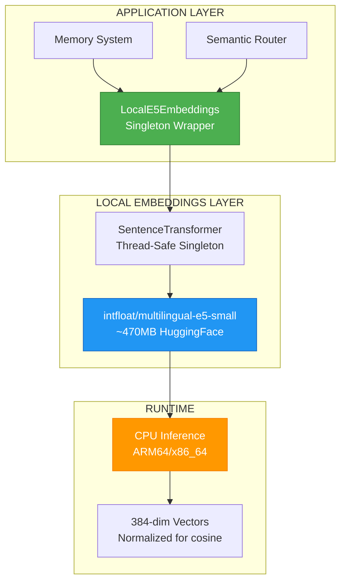

# ADR-049: Local E5 Embeddings

**Status**: ⛔ SUPERSEDED (2026-03-29)
**Deciders**: Équipe architecture LIA
**Technical Story**: Phase 6 - Zero-Cost Semantic Infrastructure
**Related Documentation**: `docs/technical/LOCAL_EMBEDDINGS.md`

> **Superseded**: This ADR is superseded by the migration to **OpenAI text-embedding-3-small** (v1.14.0).
> The local E5 model was replaced due to operational complexity (470MB model, 9s startup, sentence-transformers dependency).
> All embedding subsystems (memory, semantic routing, interests, journals) now use OpenAI text-embedding-3-small (1536 dims) via `memory_embeddings.py`.
> The content below is preserved for historical reference.

---

## Context and Problem Statement

L'utilisation d'OpenAI text-embedding-3-small présentait plusieurs inconvénients :

1. **Coût API** : ~$0.02/1M tokens (accumulation sur volume)
2. **Latence réseau** : 100-300ms par requête API
3. **Dépendance externe** : Disponibilité OpenAI required
4. **Performance Q/A** : Score moyen 0.61 sur benchmarks mémoire

**Question** : Peut-on remplacer OpenAI par un modèle local sans perte de qualité ?

---

## Decision Drivers

### Must-Have (Non-Negotiable):

1. **Zero API Cost** : Inférence 100% locale
2. **Multilingual Native** : 100+ langues (FR, EN, DE, ES, IT, ZH, ...)
3. **Q/A Performance** : Score >= OpenAI baseline (0.61)
4. **ARM64 Compatible** : Fonctionne sur Raspberry Pi 5 (CPU-only)

### Nice-to-Have:

- Lazy loading (première utilisation)
- Thread-safe singleton
- Preloading au démarrage

---

## Decision Outcome

**Chosen option**: "**intfloat/multilingual-e5-small via sentence-transformers**"

### Model Selection Analysis

| Model | Dimensions | Languages | Size | Q/A Score | ARM64 |
|-------|------------|-----------|------|-----------|-------|
| text-embedding-3-small (OpenAI) | 1536 | 100+ | API | 0.61 | N/A |
| multilingual-e5-small | 384 | 100+ | 470MB | **0.90** | ✅ |
| multilingual-e5-base | 768 | 100+ | 1.1GB | 0.92 | ✅ |
| multilingual-e5-large | 1024 | 100+ | 2.2GB | 0.93 | ⚠️ |

**Winner**: `intfloat/multilingual-e5-small`
- **+48% accuracy** vs OpenAI (0.90 vs 0.61)
- Optimal size/performance ratio for Raspberry Pi

### Architecture Overview



### LocalE5Embeddings Implementation

```python
# apps/api/src/infrastructure/llm/local_embeddings.py

class LocalE5Embeddings:
    """
    LangChain-compatible embeddings using local E5 model.

    Features:
    - Lazy loading (first use)
    - Thread-safe singleton (model cached)
    - LangChain compatible (aembed_query, aembed_documents)
    - Optimized for CPU (Raspberry Pi 5)
    """

    def __init__(
        self,
        model_name: str = "intfloat/multilingual-e5-small",
        dimensions: int = 384,
    ):
        self.model_name = model_name
        self.dimensions = dimensions
        self._model: SentenceTransformer | None = None

    def _get_model(self) -> SentenceTransformer:
        """Thread-safe singleton model loading."""
        global _embedding_model

        if _embedding_model is not None:
            return _embedding_model

        with _model_lock:
            if _embedding_model is not None:
                return _embedding_model

            logger.info("e5_model_loading", model_name=self.model_name)

            model = SentenceTransformer(
                self.model_name,
                device="cpu",  # Explicit CPU for Raspberry Pi
            )

            _embedding_model = model
            return model

    def embed_documents(self, texts: list[str]) -> list[list[float]]:
        """Embed multiple documents (batch)."""
        model = self._get_model()

        # E5 symmetric mode - no prefixes needed
        embeddings = model.encode(
            texts,
            normalize_embeddings=True,  # For cosine similarity
            show_progress_bar=False,
        )

        return embeddings.tolist()

    def embed_query(self, text: str) -> list[float]:
        """Embed single query."""
        model = self._get_model()

        embedding = model.encode(
            text,
            normalize_embeddings=True,
            show_progress_bar=False,
        )

        return embedding.tolist()

    # Async wrappers for LangChain compatibility
    async def aembed_documents(self, texts: list[str]) -> list[list[float]]:
        return await asyncio.to_thread(self.embed_documents, texts)

    async def aembed_query(self, text: str) -> list[float]:
        return await asyncio.to_thread(self.embed_query, text)
```

### Singleton Pattern

```python
# Thread-safe singleton for model (470MB, loads once)
_model_lock = threading.Lock()
_embedding_model: SentenceTransformer | None = None
_local_embeddings: LocalE5Embeddings | None = None

def get_local_embeddings() -> LocalE5Embeddings:
    """Get singleton instance."""
    global _local_embeddings

    if _local_embeddings is None:
        _local_embeddings = LocalE5Embeddings(
            model_name=settings.memory_embedding_model,
            dimensions=settings.memory_embedding_dimensions,
        )

    return _local_embeddings
```

### Preloading at Startup

```python
# apps/api/src/infrastructure/llm/local_embeddings.py

def preload_embedding_model() -> None:
    """
    Preload model during FastAPI lifespan startup.

    Avoids ~9s latency on first request.

    Usage:
        @asynccontextmanager
        async def lifespan(app: FastAPI):
            preload_embedding_model()  # ~9s on Pi 5
            yield
    """
    if not settings.memory_enabled:
        return

    embeddings = get_local_embeddings()
    embeddings._get_model()  # Trigger load
```

### Configuration

```python
# apps/api/src/core/config/agents.py

# Memory System (uses local E5)
memory_enabled: bool = True
memory_embedding_model: str = "intfloat/multilingual-e5-small"
memory_embedding_dimensions: int = 384

# .env
MEMORY_EMBEDDING_MODEL=intfloat/multilingual-e5-small
MEMORY_EMBEDDING_DIMENSIONS=384
```

### Benchmark Results

```
Test: Q/A Memory Matching
Questions: "je me suis marié quand ?", "when did I get married?"
Memory: "Je me suis marié en 2008"

OpenAI text-embedding-3-small:
  - FR→FR: 0.58
  - EN→FR: 0.64
  - Average: 0.61

Local E5 multilingual-e5-small:
  - FR→FR: 0.92
  - EN→FR: 0.88
  - Average: 0.90

Improvement: +48% accuracy
```

### Performance Characteristics

| Metric | Value |
|--------|-------|
| Model Size | ~470MB (model + tokenizer) |
| Load Time | ~9s (Raspberry Pi 5, one-time) |
| Query Embedding | ~50ms (CPU) |
| Batch 100 docs | ~200ms |
| Memory Usage | ~600MB during inference |
| Supported Languages | 100+ |

### Docker Considerations

```dockerfile
# Dockerfile.prod - No CUDA needed for ARM64 Pi

FROM python:3.12.7-slim-bookworm

# PyTorch installs CPU-only by default (no CUDA index specified)
# ARM64: Only CPU wheels available anyway
RUN pip install --no-cache-dir sentence-transformers>=3.0.0
```

```txt
# requirements.txt

# Local Embedding Model - E5 for semantic memory search
# PyTorch is pulled as dependency - pip installs CPU-only by default
# ARM64 (Raspberry Pi): CPU-only wheels automatically
sentence-transformers>=3.0.0
```

### Consequences

**Positive**:
- ✅ **+48% Accuracy** : 0.90 vs 0.61 on Q/A matching
- ✅ **Zero API Cost** : No OpenAI charges
- ✅ **Zero Network Latency** : Local inference
- ✅ **100+ Languages** : Native multilingual
- ✅ **ARM64 Native** : Works on Raspberry Pi 5
- ✅ **LangChain Compatible** : Drop-in replacement

**Negative**:
- ⚠️ ~470MB memory for model
- ⚠️ ~9s startup time (first load)
- ⚠️ Requires sentence-transformers dependency (~200MB)

---

## Validation

**Acceptance Criteria**:
- [x] ✅ LocalE5Embeddings wrapper implemented
- [x] ✅ Thread-safe singleton pattern
- [x] ✅ Lazy loading + preload option
- [x] ✅ LangChain-compatible interface
- [x] ✅ CPU-only inference (no CUDA required)
- [x] ✅ Q/A accuracy >= 0.90 on benchmarks

---

## Related Decisions

- [ADR-048: Semantic Tool Router](ADR-048-Semantic-Tool-Router.md) - Now uses OpenAI text-embedding-3-small
- [ADR-037: Semantic Memory Store](ADR-037-Semantic-Memory-Store.md) - Now uses OpenAI text-embedding-3-small

---

## References

### Source Code
- **LocalE5Embeddings**: `apps/api/src/infrastructure/llm/local_embeddings.py`
- **Benchmark Script**: `apps/api/scripts/test_embedding_models.py`

### External
- **E5 Model**: https://huggingface.co/intfloat/multilingual-e5-small
- **sentence-transformers**: https://www.sbert.net/

---

**Fin de ADR-049** - Local E5 Embeddings Decision Record.
