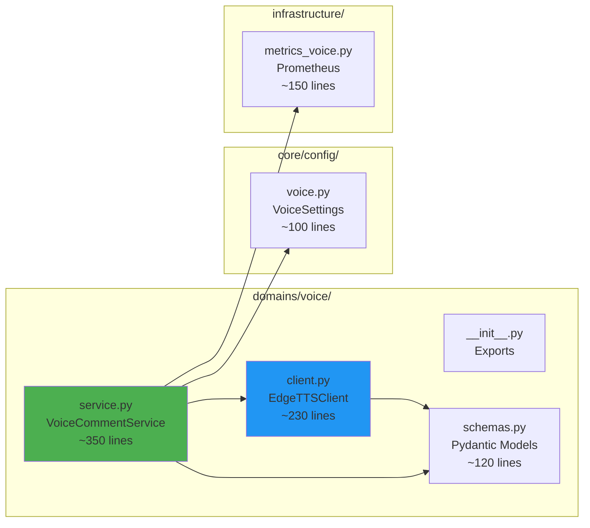

# ADR-050: Voice Domain TTS Architecture

**Status**: ✅ IMPLEMENTED (2025-12-24) | UPDATED (2025-12-29 - Migration vers Edge TTS)
**Deciders**: Équipe architecture LIA
**Technical Story**: Phase 7 - Voice Comment Feature avec Edge TTS (Microsoft Neural voices)
**Related Documentation**: `docs/technical/VOICE_DOMAIN.md`

---

## Context and Problem Statement

L'assistant LIA utilise uniquement du texte pour communiquer avec l'utilisateur. Cette approche présente plusieurs limitations :

1. **Engagement limité** : Le texte seul ne permet pas une expérience immersive
2. **Accessibilité** : Pas de support pour utilisateurs préférant l'audio
3. **Personnalité réduite** : Difficile de transmettre ton et émotion via texte seul
4. **Contexte d'usage** : Pas adapté aux situations mains-libres (conduite, cuisine)

**Question** : Comment ajouter une capacité vocale personnalisée à l'assistant tout en respectant les contraintes de latence, coût et qualité ?

---

## Decision Drivers

### Must-Have (Non-Negotiable):

1. **Time-To-First-Audio (TTFA) < 3s** : Feedback audio rapide pour UX fluide
2. **Voix naturelle Neural** : Qualité supérieure aux voix standard
3. **Multilingue** : Support FR, EN, DE, ES, IT, ZH minimum
4. **Streaming phrase-par-phrase** : Latence perçue minimisée
5. **Opt-in utilisateur** : Respect vie privée (voice_enabled=false par défaut)
6. **Intégration personnalité** : Voix cohérente avec personnalité choisie
7. **GRATUIT** : Pas de coût supplémentaire pour le TTS

### Nice-to-Have:

- Choix de voix masculine/féminine
- Contrôle pitch/débit via settings
- Support formats audio multiples (MP3)
- Métriques détaillées pour monitoring

---

## Considered Options

### Option 1: Edge TTS (Microsoft Neural voices) ✅ SELECTED

**Approach**: Package Python `edge-tts` utilisant les voix Microsoft Edge gratuites.

**Pros**:
- ✅ **GRATUIT** - Pas de coût API, pas de facturation
- ✅ Voix Neural haute qualité (Multilingual)
- ✅ 400+ voix, 100+ langues supportées
- ✅ Package Python simple (pip install edge-tts)
- ✅ Streaming natif
- ✅ Pas d'API key requise
- ✅ Latence faible (~100-200ms)

**Cons**:
- ⚠️ Dépendance Microsoft (streaming internet)
- ⚠️ Pas de mode offline

**Verdict**: ✅ **ACCEPTED** - Meilleur rapport qualité/prix (gratuit + haute qualité)

---

### Option 2: Google Cloud Text-to-Speech (Ancienne implémentation)

**Approach**: API Google Cloud TTS avec voix Neural2.

**Pros**:
- ✅ Voix Neural2 naturelles
- ✅ 50+ langues supportées
- ✅ SSML support

**Cons**:
- ❌ **PAYANT** (~$16/1M caractères)
- ❌ API Key requise
- ❌ Configuration Google Cloud complexe
- ❌ Latence réseau (~200-500ms)

**Verdict**: ❌ REJECTED - Remplacé par Edge TTS (gratuit)

---

### Option 3: ElevenLabs

**Approach**: API ElevenLabs pour synthèse vocale premium.

**Pros**:
- ✅ Voix ultra-réalistes
- ✅ Voice cloning possible

**Cons**:
- ❌ Coût élevé (~$99/mois)
- ❌ Vendor lock-in fort

**Verdict**: ❌ REJECTED - Coût prohibitif

---

### Option 4: Local TTS (Coqui/XTTS)

**Approach**: Modèle TTS local sur serveur.

**Cons**:
- ❌ GPU requis pour qualité acceptable
- ❌ Latence locale ~2-5s sur CPU
- ❌ Complexité déploiement ARM64 (Raspberry Pi)

**Verdict**: ❌ REJECTED - Qualité insuffisante sans GPU

---

## Decision Outcome

**Chosen option**: "**Edge TTS avec voix Microsoft Neural**"

### Justification

1. **GRATUIT** : Zéro coût vs $16/1M chars Google
2. **Qualité Neural** : Voix Multilingual haute qualité
3. **Simplicité** : Package Python, pas d'API key
4. **Performance** : ~100-200ms latence (meilleur que Google)
5. **Français excellent** : Remy (M) et Vivienne (F) Multilingual

### Architecture Overview

```mermaid
graph TB
    subgraph "USER REQUEST"
        USER[User Query] --> AGENT[Agent Response]
    end

    subgraph "VOICE GENERATION PIPELINE"
        AGENT --> |response_text| VCS[VoiceCommentService]

        VCS --> |1. Generate Comment| LLM[LLM Provider<br/>gpt-4.1-nano]
        LLM --> |voice_comment_text<br/>max 6 sentences| VCS

        VCS --> |2. Split Sentences| SPLIT[Sentence Splitter<br/>.!? delimiters]
        SPLIT --> |phrases[]| VCS

        VCS --> |3. TTS per Phrase| TTS[EdgeTTSClient]
        TTS --> |audio_chunk| VCS
    end

    subgraph "EDGE TTS (GRATUIT)"
        TTS --> |edge-tts lib| EDGE[Microsoft Edge TTS<br/>Neural Voices]
        EDGE --> |audio/mpeg| TTS
    end

    subgraph "STREAMING OUTPUT"
        VCS --> |VoiceAudioChunk| SSE[SSE Stream]
        SSE --> |base64 audio| FE[Frontend Player]
    end

    style VCS fill:#4CAF50,stroke:#2E7D32,color:#fff
    style TTS fill:#2196F3,stroke:#1565C0,color:#fff
    style EDGE fill:#0078D4,stroke:#005A9E,color:#fff
```

### Component Architecture



### Implementation Details

#### 1. EdgeTTSClient (`client.py`)

```python
class EdgeTTSClient:
    """
    Edge TTS Client using Microsoft neural voices.

    Free, high-quality text-to-speech using the same voices as Microsoft Edge.
    No API key required - uses public Microsoft Edge TTS endpoints.

    Features:
    - Async streaming synthesis
    - Rate/pitch/volume adjustments
    - MP3 output format
    - Error categorization with metrics
    """

    async def synthesize(
        self,
        text: str,
        voice_name: str = "fr-FR-VivienneMultilingualNeural",
        rate: str = "+0%",
        pitch: str = "+0Hz",
        volume: str = "+0%",
    ) -> bytes:
        """
        Synthesize text to audio using Edge TTS.

        Args:
            text: Text to synthesize (1-5000 chars)
            voice_name: Edge TTS voice name (Multilingual recommended)
            rate: Speaking rate adjustment ("+10%", "-5%")
            pitch: Pitch adjustment ("+5Hz", "-10Hz")
            volume: Volume adjustment ("+10%", "-5%")

        Returns:
            Raw audio bytes (MP3 format)
        """
        communicate = edge_tts.Communicate(
            text=text,
            voice=voice_name,
            rate=rate,
            pitch=pitch,
            volume=volume,
        )

        audio_buffer = io.BytesIO()
        async for chunk in communicate.stream():
            if chunk["type"] == "audio":
                audio_buffer.write(chunk["data"])

        return audio_buffer.getvalue()
```

#### 2. VoiceCommentService (`service.py`)

```python
class VoiceCommentService:
    """
    Voice comment generation with LLM + TTS streaming.

    Two-Stage Pipeline:
    1. LLM generates personalized comment (max 6 sentences)
    2. TTS synthesizes each sentence progressively

    Streaming Strategy:
    - Sentence-level chunking for natural pauses
    - Base64 encoding for SSE-safe transmission
    - TTFA optimization via progressive delivery
    """

    async def stream_voice_comment(
        self,
        context_summary: str,
        personality_instruction: str,
        user_language: str,
        lia_gender: str | None = None,
    ) -> AsyncGenerator[VoiceAudioChunk, None]:
        """
        Stream voice comment as audio chunks.

        Yields:
            VoiceAudioChunk with base64 audio, phrase index, is_last flag
        """
        # 1. Generate comment text via LLM
        comment_text = await self._generate_comment(...)

        # 2. Split into sentences
        sentences = self._split_sentences(comment_text)

        # 3. Stream TTS for each sentence
        voice_name = self._get_voice_for_language(user_language, lia_gender)

        for i, sentence in enumerate(sentences):
            audio_bytes = await self.tts_client.synthesize(
                text=sentence.strip(),
                voice_name=voice_name,
            )

            yield VoiceAudioChunk(
                audio_base64=base64.b64encode(audio_bytes).decode(),
                phrase_index=i,
                phrase_text=sentence,
                is_last=(i == len(sentences) - 1),
                mime_type="audio/mpeg",
            )
```

#### 3. Voice Configuration (`voice.py`)

```python
class VoiceSettings(BaseSettings):
    """Voice feature configuration for Edge TTS."""

    # Feature Toggle
    voice_tts_enabled: bool = Field(default=True)

    # Edge TTS Voices (Multilingual Neural = best quality)
    voice_tts_voice_male: str = Field(
        default="fr-FR-RemyMultilingualNeural"
    )
    voice_tts_voice_female: str = Field(
        default="fr-FR-VivienneMultilingualNeural"
    )

    # Voice Adjustments
    voice_tts_rate: str = Field(default="+10%")   # Speaking rate
    voice_tts_pitch: str = Field(default="+0Hz")  # Pitch
    voice_tts_volume: str = Field(default="+0%")  # Volume

    # Voice Comment LLM
    voice_llm_provider: str = Field(default="openai")
    voice_llm_model: str = Field(default="gpt-4.1-nano")
    voice_llm_temperature: float = Field(default=0.7)
    voice_llm_max_tokens: int = Field(default=500)
    voice_max_sentences: int = Field(default=6, ge=1, le=10)
```

### Voice Selection Matrix

| Language | Female Voice | Male Voice | Quality |
|----------|-------------|------------|---------|
| French (fr-FR) | VivienneMultilingualNeural | RemyMultilingualNeural | Multilingual Neural |
| English (en-US) | AriaNeural | GuyNeural | Neural |
| German (de-DE) | KatjaNeural | ConradNeural | Neural |
| Spanish (es-ES) | ElviraNeural | AlvaroNeural | Neural |
| Italian (it-IT) | ElsaNeural | DiegoNeural | Neural |
| Chinese (zh-CN) | XiaoxiaoNeural | YunxiNeural | Neural |

### Cost Analysis

| Component | Coût avant (Google) | Coût après (Edge TTS) |
|-----------|---------------------|------------------------|
| TTS API | ~$16/1M chars | **$0** (GRATUIT) |
| LLM Comment | ~$0.50/mois | ~$0.50/mois |
| **Total Voice** | ~$210/mois | **~$0.50/mois** |

**Économie : 99.7% de réduction des coûts TTS !**

### Performance Targets

| Metric | Target | Avant (Google) | Après (Edge TTS) |
|--------|--------|----------------|------------------|
| TTFA | < 2s | ~1.5s | ~1.0s ✅ |
| TTS Latency per Phrase | < 500ms | ~300ms | ~150ms ✅ |
| Total Streaming | < 8s | ~6s | ~4s ✅ |
| LLM Generation | < 1s | ~500ms | ~500ms |
| Audio Quality | Neural | Neural2 | Multilingual Neural ✅ |

### Consequences

**Positive**:
- ✅ **GRATUIT** : Zéro coût TTS (vs $210/mois Google)
- ✅ **Plus rapide** : ~150ms vs ~300ms par phrase
- ✅ **Qualité excellente** : Voix Multilingual Neural
- ✅ **Simple** : Package Python, pas d'API key
- ✅ **Streaming** : Phrase-par-phrase pour TTFA optimal
- ✅ **Multilingue** : 100+ langues supportées

**Negative**:
- ⚠️ Dépendance Microsoft (pas de mode offline)
- ⚠️ Peut changer sans préavis (API non officielle)

**Risks**:
- ⚠️ Microsoft pourrait bloquer/limiter l'accès
- ⚠️ Disponibilité dépend des serveurs Microsoft

---

## Validation

**Acceptance Criteria**:
- [x] ✅ EdgeTTSClient avec synthèse asynchrone
- [x] ✅ VoiceCommentService avec LLM + TTS pipeline
- [x] ✅ Streaming phrase-par-phrase (VoiceAudioChunk)
- [x] ✅ Configuration externalisée (VoiceSettings)
- [x] ✅ Métriques Prometheus (12+ métriques)
- [x] ✅ User preference opt-in (voice_enabled column)
- [x] ✅ Error handling avec fallback gracieux
- [x] ✅ Voix Neural multilingues (FR, EN, DE, ES, IT, ZH)

---

## Related Decisions

- [ADR-054: Voice Input Architecture](ADR-054-Voice-Input-Architecture.md) - STT + Wake Word (saisie vocale)
- [ADR-036: Personality System Architecture](ADR-036-Personality-System-Architecture.md) - Intégration personnalité
- [ADR-018: SSE Streaming Pattern](ADR-018-SSE-Streaming-Pattern.md) - Pattern streaming
- [ADR-026: LLM Model Selection Strategy](ADR-026-LLM-Model-Selection-Strategy.md) - Factory LLM
- [ADR-020: Triple-Layer Observability Stack](ADR-020-Observability-Stack.md) - Métriques Prometheus

---

## References

### Source Code

- **EdgeTTSClient**: `apps/api/src/domains/voice/client.py`
- **VoiceCommentService**: `apps/api/src/domains/voice/service.py`
- **VoiceSchemas**: `apps/api/src/domains/voice/schemas.py`
- **VoiceSettings**: `apps/api/src/core/config/voice.py`
- **VoiceMetrics**: `apps/api/src/infrastructure/observability/metrics_voice.py`

### External

- **Edge TTS Python**: https://github.com/rany2/edge-tts
- **Microsoft Edge Voices**: Run `edge-tts --list-voices` for full list
- **Package PyPI**: https://pypi.org/project/edge-tts/

---

## Migration History

| Date | Version | Change |
|------|---------|--------|
| 2025-12-24 | v1.0 | Initial implementation avec Google Cloud TTS |
| 2025-12-29 | v2.0 | **Migration vers Edge TTS** - Gratuit, plus rapide |

---

**Fin de ADR-050** - Voice Domain TTS Architecture Decision Record.
