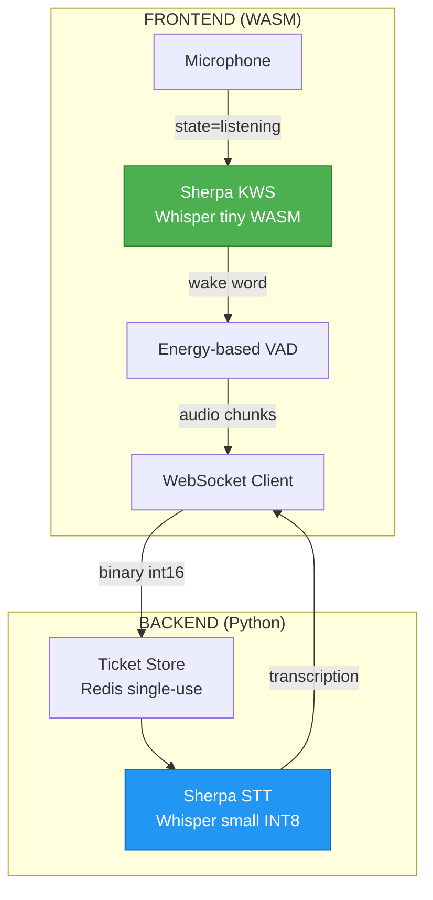
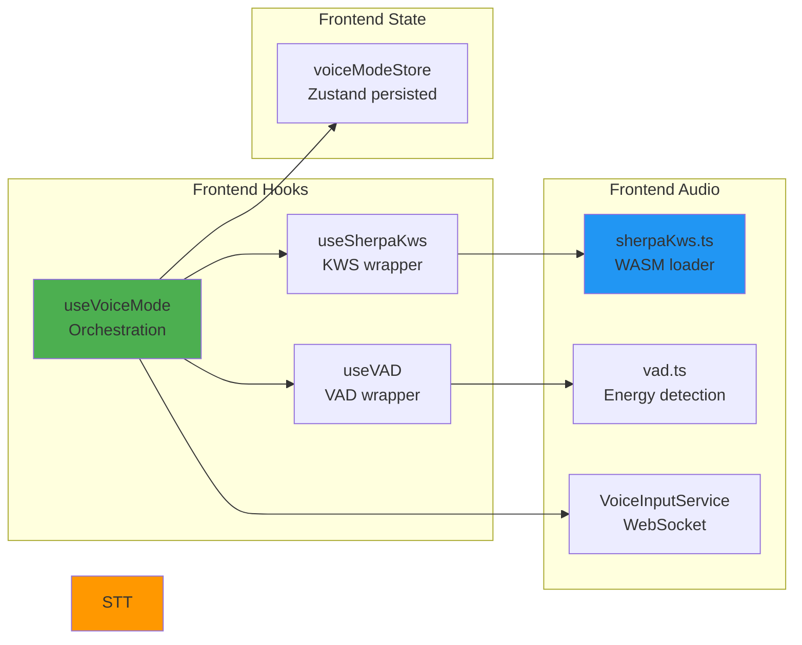

# ADR-054: Voice Input Architecture

**Status**: ✅ IMPLEMENTED (2026-02-02)
**Deciders**: Équipe architecture LIA
**Technical Story**: Saisie vocale avec Wake Word, Push-to-Talk et STT offline
**Related Documentation**: `docs/technical/VOICE_MODE.md`, `ADR-050-Voice-Domain-TTS-Architecture.md`

---

## Context and Problem Statement

L'assistant disposait de la synthèse vocale (TTS) mais pas de saisie vocale :

1. **Accessibilité** : Pas de mode mains-libres
2. **UX naturelle** : Obligation de taper sur clavier/écran
3. **Wake Word** : Impossibilité d'invoquer l'assistant par la voix
4. **Coûts API** : Services STT cloud coûteux

**Question** : Comment implémenter une saisie vocale complète avec wake word, gratuitement et offline ?

---

## Decision Drivers

### Must-Have (Non-Negotiable):

1. **Wake Word Detection** : Activation vocale "OK" / "OK Guy"
2. **Push-to-Talk** : Activation manuelle alternative
3. **VAD (Voice Activity Detection)** : Fin de parole automatique
4. **STT Multilingue** : Transcription FR/EN/DE/ES/IT/ZH
5. **Offline/Gratuit** : Pas de coût API récurrent
6. **TTFT < 2s** : Time-to-First-Token acceptable

### Nice-to-Have:

- Support navigateurs modernes (Chrome, Firefox, Safari)
- Feedback visuel temps réel
- Persistence de l'état voice mode

---

## Decision Outcome

**Chosen option**: "**Sherpa-onnx WASM (KWS) + Sherpa-onnx Python (STT) + WebSocket streaming**"

### Architecture Overview



### Component Architecture



### State Machine

```
                    ┌──────────────┐
                    │     idle     │
                    └──────┬───────┘
                           │ enable()
                           ▼
            ┌──────────────────────────┐
            │        listening         │◄─────┐
            │  (KWS mic open, waiting) │      │
            └──────────┬───────────────┘      │
                       │ wake word "OK"       │
                       │ OR tap               │
                       ▼                      │
            ┌──────────────────────────┐      │
            │        recording         │      │
            │  (Recording mic, VAD)    │      │
            └──────────┬───────────────┘      │
                       │ VAD silence 1s       │
                       ▼                      │
            ┌──────────────────────────┐      │
            │       processing         │      │
            │  (Backend transcribing)  │      │
            └──────────┬───────────────┘      │
                       │ transcription        │
                       ▼                      │
            ┌──────────────────────────┐      │
            │        speaking          │──────┘
            │  (TTS playing response)  │ onTtsComplete
            └──────────────────────────┘
```

### Implementation Details

#### 1. Wake Word Detection (Frontend WASM)

```typescript
// apps/web/src/lib/audio/sherpaKws.ts

class WakeWordDetector {
  private recognizer: OfflineRecognizer;
  private vad: Vad;

  processAudio(samples: Float32Array): WakeWordResult | null {
    // 1. Push to circular buffer
    this.buffer.push(samples);

    // 2. Feed to VAD
    while (this.buffer.size > vadWindowSize) {
      this.vad.acceptWaveform(this.buffer.pop());
    }

    // 3. Process completed speech segments
    while (!this.vad.isEmpty()) {
      const segment = this.vad.front();

      // 4. Transcribe segment with Whisper tiny
      const stream = this.recognizer.createStream();
      this.recognizer.decode(stream);
      const text = this.recognizer.getResult(stream).toLowerCase();

      // 5. Check for wake word
      if (this.isWakeWord(text)) {
        return { keyword: 'ok', text, durationSeconds: segment.duration };
      }

      this.vad.pop();
    }
    return null;
  }

  private isWakeWord(text: string): boolean {
    return ['ok guy', 'okay guy', 'ok guys', 'okay guys', 'ok', 'okay', 'guy', 'guys'].some(kw =>
      text.includes(kw)
    );
  }
}
```

**Wake Words** : `ok guy`, `ok guys`, `okay guy`, `okay guys` (configurable via `keywords.txt`)

**Modèle WASM** : Whisper tiny (~3MB bundled)

#### 2. Voice Activity Detection

```typescript
// apps/web/src/lib/audio/vad.ts

class VoiceActivityDetector {
  private readonly energyThreshold = 0.02;
  private readonly silenceMs = 1000;

  process(samples: Float32Array): void {
    const energy = this.calculateRmsEnergy(samples);
    const isSpeech = energy > this.energyThreshold;

    if (!isSpeech && this.wasSpeaking) {
      this.silenceDurationMs += chunkDuration;
      if (this.silenceDurationMs >= this.silenceMs) {
        this.onSpeechEnd?.(); // → state='processing'
      }
    }
  }
}
```

**Algorithme** : Energy-based RMS avec seuil 0.02

**Silence threshold** : 1000ms → déclenche transcription

#### 3. WebSocket BFF Pattern

```python
# apps/api/src/domains/voice/router.py

@router.post("/ticket")
async def create_websocket_ticket(user: User):
    ticket = await ticket_store.create_ticket(str(user.id))
    return {"ticket": ticket, "ttl_seconds": 60}

@router.websocket("/ws/audio")
async def websocket_audio(ws: WebSocket, ticket: str):
    # 1. Validate & consume ticket (single-use)
    user_id = await ticket_store.validate_and_consume_ticket(ticket)
    if not user_id:
        await ws.close(code=4001)  # Invalid ticket
        return

    # 2. Rate limit (10 connections/minute)
    if not await rate_limiter.acquire(f"ws:audio:{user_id}"):
        await ws.close(code=4029)
        return

    # 3. Accept and stream
    await ws.accept()
    audio_buffer = []

    while True:
        data = await asyncio.wait_for(ws.receive(), timeout=120)

        if "bytes" in data:
            audio_buffer.append(data["bytes"])

        elif data.get("text") == "END":
            # Convert int16 → float32
            audio_np = np.frombuffer(b"".join(audio_buffer), dtype=np.int16)
            audio_float = audio_np.astype(np.float32) / 32768.0

            # Transcribe
            text = await stt_service.transcribe_async(audio_float.tolist())

            await ws.send_json({
                "type": "transcription",
                "text": text,
                "duration_seconds": len(audio_float) / 16000,
            })
            audio_buffer = []
```

**Ticket** : Single-use, 60s TTL, Redis storage

**Rate limit** : 10 connections/minute per user

#### 4. STT Backend (Sherpa-onnx)

```python
# apps/api/src/domains/voice/stt/sherpa_stt.py

class SherpaSttService:
    def __init__(self, settings):
        self._recognizer = sherpa_onnx.OfflineRecognizer.from_whisper(
            encoder=str(settings.voice_stt_model_path / "encoder.onnx"),
            decoder=str(settings.voice_stt_model_path / "decoder.onnx"),
            tokens=str(settings.voice_stt_model_path / "tokens.txt"),
            num_threads=4,
            language="",  # Auto-detect
            task="transcribe",
        )

    async def transcribe_async(self, audio_samples: list[float]) -> str:
        return await asyncio.get_event_loop().run_in_executor(
            _stt_executor,
            self._transcribe_sync,
            audio_samples,
        )
```

**Modèle** : Whisper small INT8 (~375MB)

**Langues** : 99+ (auto-détection)

**Exécution** : ThreadPoolExecutor (non-bloquant)

### Configuration

```bash
# Backend
VOICE_STT_ENABLED=true
VOICE_STT_MODEL_PATH=/models/whisper-small
VOICE_STT_NUM_THREADS=4
VOICE_WS_TICKET_TTL_SECONDS=60
VOICE_WS_RATE_LIMIT_MAX_CALLS=10

# Frontend (constants.ts)
VOICE_MODE_VAD_SILENCE_MS=1000
VOICE_MODE_VAD_ENERGY_THRESHOLD=0.02
VOICE_MODE_KWS_THRESHOLD=0.25
VOICE_MODE_MAX_RECORDING_SECONDS=60
```

### Performance Targets

| Metric | Target | Actual |
|--------|--------|--------|
| Wake word detection | < 500ms | ~200-400ms |
| TTFT (Time-to-First-Token) | < 2s | ~1.5s |
| STT latency (10s audio) | < 2s | ~500ms |
| Memory (WASM) | < 100MB | ~80MB |

### Cost Analysis

| Component | Coût Cloud | Coût Sherpa (Local) |
|-----------|------------|---------------------|
| KWS (Wake Word) | ~$0.006/call | **$0** |
| STT (Transcription) | ~$0.024/minute | **$0** |
| **Total mensuel** | ~$50-200/mois | **$0** |

### Consequences

**Positive**:
- ✅ **Gratuit** : Zéro coût API STT
- ✅ **Offline capable** : Fonctionne sans internet (backend)
- ✅ **Multilingue** : 99+ langues supportées
- ✅ **Wake Word** : Activation vocale "OK"
- ✅ **VAD intelligent** : Fin de parole automatique
- ✅ **Sécurisé** : BFF pattern avec tickets single-use

**Negative**:
- ⚠️ Modèle STT lourd (~375MB sur disque)
- ⚠️ Requiert COOP/COEP headers pour WASM
- ⚠️ KWS WASM decode synchrone (~200-400ms)

**Risks**:
- ⚠️ Faux positifs wake word possibles
- ⚠️ Performance dégradée sur CPU faible

---

## Validation

**Acceptance Criteria**:
- [x] ✅ Wake word detection "OK" via WASM
- [x] ✅ Push-to-Talk activation manuelle
- [x] ✅ VAD avec silence detection 1s
- [x] ✅ STT backend multilingue offline
- [x] ✅ WebSocket BFF avec tickets single-use
- [x] ✅ Rate limiting per user
- [x] ✅ State machine complète (idle→listening→recording→processing→speaking)
- [x] ✅ Persistence état voice mode

---

## Related Decisions

- [ADR-050: Voice Domain TTS Architecture](ADR-050-Voice-Domain-TTS-Architecture.md) - TTS output
- [ADR-018: SSE Streaming Pattern](ADR-018-SSE-Streaming-Pattern.md) - Streaming pattern
- [ADR-034: Security Hardening](ADR-034-Security-Hardening.md) - BFF pattern

---

## References

### Source Code

- **Frontend Hooks**: `apps/web/src/hooks/useVoiceMode.ts`, `useSherpaKws.ts`, `useVAD.ts`
- **Frontend Audio**: `apps/web/src/lib/audio/sherpaKws.ts`, `vad.ts`
- **Frontend Service**: `apps/web/src/lib/voice-input-service.ts`
- **Frontend Store**: `apps/web/src/stores/voiceModeStore.ts`
- **Backend Router**: `apps/api/src/domains/voice/router.py`
- **Backend STT**: `apps/api/src/domains/voice/stt/sherpa_stt.py`
- **Backend Tickets**: `apps/api/src/domains/voice/ticket_store.py`

### External

- **Sherpa-onnx**: https://k2-fsa.github.io/sherpa/onnx/
- **Whisper models**: https://github.com/k2-fsa/sherpa-onnx/releases

---

**Fin de ADR-054** - Voice Input Architecture Decision Record.
