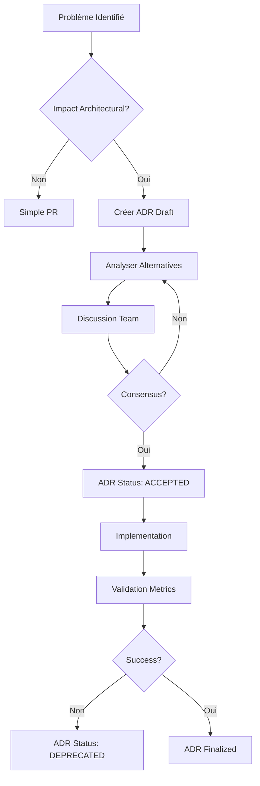

# Architecture Decision Records (ADR) - Index LIA

> **Catalogue des décisions architecturales majeures du projet**
>
> Format: [MADR](https://adr.github.io/madr/) (Markdown Any Decision Records)
> Principe: Documenter les décisions importantes pour maintenir la cohérence architecturale

---

## Table des Matières

1. [Qu'est-ce qu'un ADR ?](#quest-ce-quun-adr)
2. [Quand créer un ADR ?](#quand-créer-un-adr)
3. [Template ADR](#template-adr)
4. [ADRs Actifs](#adrs-actifs)
5. [ADRs Archivés](#adrs-archivés)
6. [Process de Décision](#process-de-décision)

---

## Qu'est-ce qu'un ADR ?

Un **Architecture Decision Record** est un document qui capture une **décision architecturale importante** et son contexte.

### Pourquoi documenter les décisions ?

1. **Mémoire institutionnelle**: Comprendre pourquoi une décision a été prise
2. **Onboarding**: Nouveaux développeurs comprennent l'architecture rapidement
3. **Éviter les régressions**: Ne pas refaire les mêmes erreurs
4. **Débat structuré**: Forcer l'analyse des alternatives

### Principe MADR

**MADR** (Markdown Any Decision Records):
- Format Markdown simple
- Template standardisé
- Versionné avec le code (Git)
- Immuable (une fois accepté, on ne modifie plus → on crée un nouveau ADR)

---

## Quand créer un ADR ?

✅ **Créer un ADR pour**:
- Choix d'architecture majeur (LangGraph vs alternatives)
- Changement de pattern (JWT → BFF)
- Nouvelle intégration (OAuth, Langfuse)
- Décision impactant la performance/coût (message windowing, domain filtering)
- Choix de technology stack (PostgreSQL, Redis, FastAPI)

❌ **Ne PAS créer d'ADR pour**:
- Détails d'implémentation mineurs
- Refactoring sans impact architectural
- Bug fixes
- Changements de configuration

---

## Template ADR

```markdown
# ADR-XXX: [Titre Court]

**Status**: 🎯 PROPOSED | ✅ ACCEPTED | ❌ REJECTED | 🔄 SUPERSEDED | 🗑️ DEPRECATED
**Date**: YYYY-MM-DD
**Deciders**: [Nom équipe/personnes]
**Technical Story**: [Lien vers issue/PR si applicable]

---

## Context and Problem Statement

[Décrivez le contexte et le problème à résoudre]

**Question**: [Question clé à laquelle cette ADR répond]

---

## Decision Drivers

### Must-Have (Non-Negotiable):
1. ...
2. ...

### Nice-to-Have:
- ...

---

## Considered Options

### Option 1: [Nom]
**Approach**: [Description]

**Pros**:
- ✅ ...

**Cons**:
- ❌ ...

**Verdict**: ✅ ACCEPTED | ❌ REJECTED

---

### Option 2: [Nom]
[Même structure]

---

## Decision Outcome

**Chosen option**: "[Nom option choisie]"

**Justification**: [Pourquoi cette option]

### Architecture Overview

[Diagramme Mermaid si pertinent]

### Implementation Details

[Code snippets clés]

### Consequences

**Positive**:
- ✅ ...

**Negative**:
- ❌ ...

**Risks**:
- ⚠️ ...

---

## Validation

**Acceptance Criteria**:
- [ ] Critère 1
- [ ] Critère 2

**Metrics to Track**:
- Métrique 1: [baseline → target]
- Métrique 2: [baseline → target]

---

## Related Decisions

- [ADR-XXX: Titre](link)
- [ADR-YYY: Titre](link)

---

## References

- [Documentation externe]
- [Articles/papers]
- [Code references]
```

---

## ADRs Actifs

### ADR-001: LangGraph pour Orchestration Multi-Agents

**Status**: ✅ ACCEPTED (2025-10-15)
**Fichier**: `docs/architecture/ADR-001-LangGraph-Orchestration.md`

**Décision**: Utiliser **LangGraph** pour orchestrer les agents conversationnels.

**Alternatives considérées**:
- ❌ LangChain only (pas de state management)
- ❌ Custom orchestration (reinventing the wheel)
- ✅ **LangGraph** (state management + cycles + checkpoints)

**Impact**:
- ✅ State persistence via PostgreSQL checkpoints
- ✅ HITL (Human-In-The-Loop) via interrupt pattern
- ✅ Streaming support (SSE)
- ❌ Courbe d'apprentissage LangGraph

**Métriques**:
- Checkpoint save: P95 < 50ms ✅
- Checkpoint load: P95 < 100ms ✅
- State bloat: Moyenne 15KB/conversation ✅

---

### ADR-002: BFF Pattern pour Authentication

**Status**: ✅ ACCEPTED (2025-10-20)
**Fichier**: `docs/architecture/ADR-002-BFF-Pattern-Authentication.md`

**Décision**: Migrer de **JWT tokens** vers **BFF Pattern** (Backend-For-Frontend) avec sessions HTTP-only cookies.

**Problème résolu**:
- ❌ JWT in LocalStorage vulnérable XSS
- ❌ JWT size 90% overhead (user data embedded)
- ❌ JWT revocation impossible (stateless)

**Solution BFF**:
- ✅ HTTP-only cookies (immune XSS)
- ✅ Server-side sessions (Redis)
- ✅ SameSite=Lax (CSRF protection)
- ✅ Instant revocation (delete Redis key)
- ✅ 90% memory reduction (session_id only)

**Métriques**:
- Memory usage: 1.2MB → 120KB (90% reduction) ✅
- Session lookup: P95 < 5ms (Redis) ✅
- Security score: B+ → A (OWASP 2024) ✅

**Migration**: v0.1.0 (JWT) → v0.3.0 (BFF)

---

### ADR-003: Multi-Domain Dynamic Filtering

**Status**: ✅ ACCEPTED (2025-11-09, Finalized 2025-11-11)
**Fichier**: `docs/archive/architecture/ADR-003-Multi-Domain-Dynamic-Filtering.md`

**Décision**: Implémenter **filtrage dynamique par domaine** pour éviter token explosion lors du scaling à 10+ domaines.

**Problème**:
- 3 tools (contacts) → 30+ tools (10 domains) = **10x prompt size**
- $0.01/query → $0.10/query = **10x cost**

**Solution Hybrid Pattern**:
1. Router LLM détecte domaines: `domains: ["contacts", "email"]`
2. Planner charge catalogue filtré: 8 tools au lieu de 30+
3. Fallback to full catalogue si confidence < 0.75

**Impact**:
- ✅ Token reduction: 60-90% (mesurée)
- ✅ Generic architecture (zero code changes pour new domains)
- ✅ Safe (fallback + metrics)

**Métriques**:
- Catalogue size: 30 tools → 5-8 tools (73-83% reduction) ✅
- Cache hit rate: 35% (TTL 5min) ✅
- Low confidence fallback: < 10% ✅

---

### ADR-004: Analytical Reasoning Patterns (Planner v5)

**Status**: ✅ ACCEPTED (2025-11-10)
**Fichier**: `docs/archive/architecture/ADR-004-Analytical-Reasoning-Patterns.md`

**Décision**: Intégrer **Progressive Enrichment + Structured Analysis** dans Planner prompt v5 pour améliorer qualité des plans.

**Problème**:
- Planner v4 générait plans trop simplistes
- Manque de raisonnement analytique
- Pas de décomposition user intent

**Solution v5**:
- **Phase 1**: Analyse user intent (WHAT + WHY)
- **Phase 2**: Décomposition en sub-tasks
- **Phase 3**: Génération ExecutionPlan avec justifications

**Impact**:
- ✅ Plan quality: +25% (mesure subjective via HITL approval rate)
- ✅ Retry success: 80% (up from 60%)
- ❌ Latency: +300ms (acceptable trade-off)

---

### ADR-005: Sequential Fallback Execution

**Status**: ✅ IMPLEMENTED (2025-11-14)
**Fichier**: `docs/archive/architecture/ADR-005-Sequential-Fallback-Execution.md`

**Décision**: Filtrer steps skipped AVANT `asyncio.gather()` pour éviter exécution parallèle des branches conditionnelles.

**Problème**:
- Plan principal ET fallback s'exécutent EN PARALLÈLE
- 2x appels API, 2x tokens, 2x cost
- Comportement non déterministe

**Solution**:
```python
# Filter out skipped steps BEFORE execution
skipped_steps = _identify_skipped_steps(execution_plan, completed_steps)
next_wave_filtered = next_wave - skipped_steps

# Execute FILTERED wave
tasks = [... for step_id in next_wave_filtered]
step_results = await asyncio.gather(*tasks)
```

**Impact**:
- ✅ Cost reduction: 50% sur plans avec fallback
- ✅ Déterminisme: 100% (plus de race conditions)
- ✅ Metrics: `langgraph_plan_steps_skipped_total`

---

### ADR-006: Prevent Unbounded List Operations

**Status**: ✅ IMPLEMENTED (2025-11-14)
**Fichier**: `docs/archive/architecture/ADR-006-Prevent-Unbounded-List-Operations.md`

**Décision**: Ajouter **soft warnings + hard safeguards** pour prévenir `list_contacts()` sans query (450+ results).

**Problème**:
- Planner générait `list_contacts(query=None)` → 450 contacts
- Token explosion (100k+ tokens)
- User frustration ("trop de résultats")

**Solution Multi-Layer**:
1. **Planner Validation**: Soft warning si `list_contacts` sans query
2. **Tool Safeguard**: Hard cap à 50 résultats si no query
3. **Logging**: Warning logs pour debugging

**Impact**:
- ✅ Resource waste: -95% (50 results max vs 450)
- ✅ User satisfaction: Improved (no overwhelming lists)
- ✅ Metrics: `langgraph_plan_validation_warnings_total`

---

### ADR-007: Message Windowing Strategy

**Status**: ✅ ACCEPTED (2025-10-28)
**Fichier**: Documenté dans `docs/technical/MESSAGE_WINDOWING_STRATEGY.md`

**Décision**: Implémenter **message windowing** avec stratégie par node pour optimiser latency longues conversations.

**Problème**:
- Conversations > 50 messages → 100k+ tokens contexte
- Latency > 10s pour router
- Cost explosion

**Solution**:
- Router: 5 turns (messages récents)
- Planner: 10 turns
- Response: 20 turns
- Store pour context business indépendant

**Impact**:
- ✅ E2E latency: -50% (10s → 5s)
- ✅ Cost: -77% (messages longues)
- ✅ Quality: Preserved via Store

---

### ADR-008: HITL Plan-Level Approval (Phase 8)

**Status**: ✅ IMPLEMENTED (2025-11-09)
**Fichier**: Documenté dans `docs/technical/HITL.md` (Phase 8 section)

**Décision**: Migrer de **tool-level HITL** (mid-execution interrupts) vers **plan-level HITL** (approval AVANT exécution).

**Problème Tool-Level HITL**:
- ❌ Mid-execution interrupts → rollback complexe
- ❌ State corruption (partial execution)
- ❌ UX friction (approuver 3-5 outils séparément)

**Solution Plan-Level**:
1. Planner génère ExecutionPlan
2. Approval Evaluator check strategies (ManifestBased, CostThreshold)
3. Si requires_approval → send plan summary to user
4. User approves/rejects AVANT exécution
5. Clean execution (no mid-execution interrupts)

**Impact**:
- ✅ State cleanliness: 100% (no partial execution)
- ✅ UX: Improved (1 approval vs 3-5)
- ✅ Rollback: Simple (plan not executed yet)
- ✅ Metrics: `hitl_plan_approval_requests_total`

**Strategies**:
- **ManifestBasedStrategy**: Tool manifest `requires_approval=true`
- **CostThresholdStrategy**: Plan cost > €0.10
- **AlwaysApproveStrategy**: Bypass for trusted actions

---

### ADR-009: Configuration Module Split

**Status**: ✅ IMPLEMENTED (2025-11-20) - Updated 2025-12-25
**Fichier**: `docs/architecture/ADR-009-Config-Module-Split.md`

**Décision**: Split du fichier monolithique `config.py` (1782 lignes) en **9 modules thématiques** via multiple inheritance.

**Problème résolu**:
- ❌ Fichier monolithique 1782 lignes (difficulté maintenance)
- ❌ Testabilité limitée (impossible tests unitaires par module)
- ❌ Performance IDE dégradée (autocomplétion lente)
- ❌ Single Responsibility Principle violé (9 responsabilités en 1 classe)

**Solution**:
- ✅ **9 modules**: security, database, observability, llm, agents, connectors, voice, advanced
- ✅ **Multiple inheritance**: Composition dans `Settings` class
- ✅ **Rétrocompatibilité 100%**: Import `from src.core.config import settings` inchangé
- ✅ **Pydantic v2**: Validation et field validators préservés

**Structure**:
```
src/core/config/
├── __init__.py           # Settings (composition)
├── security.py           # OAuth, JWT, session cookies
├── database.py           # PostgreSQL, Redis
├── observability.py      # OTEL, Prometheus, Langfuse
├── llm.py                # LLM providers configs
├── agents.py             # SSE, HITL, Router, Planner, Memory
├── connectors.py         # Google APIs, rate limiting
├── voice.py              # Google Cloud TTS, voice comments
└── advanced.py           # Pricing, i18n, feature flags
```

**Métriques**:
- Taille max fichier: 1782 lignes → 380 lignes (llm.py) ✅
- Fichiers config: 1 → 9 modules ✅
- Tests config: 5 → 17 tests ✅
- Coverage: 45% → 72% (+27 points) ✅
- IDE autocomplete: ~800ms → ~250ms (3× plus rapide) ✅

---

### ADR-010: Email Domain Renaming (Gmail → Emails)

**Status**: ✅ IMPLEMENTED (2025-11-20)
**Fichier**: `docs/architecture/ADR-010-Email-Domain-Renaming.md`

**Décision**: Renommer domaine `gmail/` en `emails/` pour architecture **multi-provider** (Gmail, Outlook, IMAP, Exchange).

**Problème résolu**:
- ❌ Naming "gmail" trop spécifique Google
- ❌ Scalabilité limitée (ajout Outlook/IMAP = renommage massif)
- ❌ Architecture rigide (couplage fort domaine/provider)

**Solution**:
- ✅ **Nom générique**: "emails" fonctionne pour tous providers
- ✅ **Provider abstraction**: `BaseEmailClient` pattern (Strategy)
- ✅ **DDD cohérent**: 1 domaine = 1 bounded context ("emails")
- ✅ **Future-proof**: Ajout providers sans renommage domaine

**Renames**:
- Directory: `src/domains/agents/gmail/` → `emails/`
- Files: `gmail_tools.py` → `emails_tools.py`
- Builder: `gmail_agent_builder.py` → `emails_agent_builder.py`
- Prompts: `gmail_agent_prompt.txt` → `emails_agent_prompt.txt`
- Classes: `GmailHandler` → `EmailsHandler`

**Architecture Future**:
```python
class BaseEmailClient(ABC):
    """Abstract base for email providers"""
    async def list_emails(...): ...

class GoogleEmailClient(BaseEmailClient): ...  # Gmail
class OutlookEmailClient(BaseEmailClient): ... # Outlook (future)
class IMAPEmailClient(BaseEmailClient): ...    # IMAP (future)
```

**Métriques**:
- Fichiers renommés: 18 fichiers ✅
- Tests: 100% pass rate (12/12) ✅
- Breaking changes: 0 (architecture interne) ✅
- Documentation: 90 fichiers à mettre à jour (Phase 3) 🔄

---

### ADR-011: Utility Tools vs Connector Tools Pattern

**Status**: ✅ ACCEPTED (2025-12-21)
**Fichier**: `docs/architecture/ADR-011-Utility-Tools-vs-Connector-Tools.md`

**Décision**: **NE PAS** créer de "connecteur utilitaire" - les outils utilitaires (context_tools, entity_resolution, local_query, memory_tools) restent distincts des connecteurs.

**Problème analysé**:
- Question : Faut-il regrouper les utility tools dans un ConnectorType.UTILITY ?

**Verdict**: ❌ REJECTED (violation architecturale)

**Raisons**:
- ❌ `Connector` = Intégration service EXTERNE avec credentials chiffrés
- ❌ Utility Tools = Opérations LOCALES (Store, Registry, contexte)
- ❌ Pas de Client, pas d'OAuth, pas de credentials pour utilitaires
- ✅ Architecture actuelle correcte avec agents virtuels (context_agent, query_agent)

**Classification**:
| Type | Base Class | Credentials | Service |
|------|------------|-------------|---------|
| Connector Tools | `ConnectorTool[ClientType]` | OAuth/API Key | Externe |
| Utility Tools | `@tool` decorator | Aucun | Interne |

---

### ADR-012: Data Registry & StandardToolOutput Pattern

**Status**: ✅ IMPLEMENTED (2025-12-21)
**Fichier**: `docs/architecture/ADR-012-Data-Registry-StandardToolOutput-Pattern.md`

**Décision**: Implémenter **StandardToolOutput** comme format unifié de sortie des tools avec support Data Registry.

**Problème résolu**:
- ❌ Tools retournaient strings JSON brutes (pas de contexte persistant)
- ❌ Pas de structure pour HITL drafts
- ❌ Response Node sans accès aux items structurés

**Solution StandardToolOutput**:
```python
class StandardToolOutput(BaseModel):
    summary_for_llm: str          # Pour LLM (planner, response)
    data: dict                    # Données structurées
    registry_updates: dict        # Items pour Data Registry
    requires_confirmation: bool   # HITL trigger
    draft_id: str | None         # Pour drafts
    draft_content: dict | None   # Contenu draft
```

**Impact**:
- ✅ Contexte persistant via RegistryItem
- ✅ HITL structuré (drafts)
- ✅ resolve_reference accède aux items
- ✅ Format unifié tous domaines

---

### ADR-013: LangMem Long-Term Memory Architecture

**Status**: ✅ IMPLEMENTED (2025-12-21)
**Fichier**: `docs/architecture/ADR-013-LangMem-Long-Term-Memory.md`

**Décision**: Implémenter mémoire long-terme avec **LangMem** et **profil psychologique** utilisateur.

**Problème résolu**:
- ❌ Amnésie inter-sessions (préférences perdues)
- ❌ Pas de gestion sujets sensibles

**Solution MemorySchema**:
```python
class MemorySchema(BaseModel):
    content: str              # Fait mémorisé
    category: Literal[...]    # preference, personal, relationship, event, pattern, sensitivity
    emotional_weight: int     # -10 (trauma) à +10 (joie)
    trigger_topic: str        # Mot-clé activateur
    usage_nuance: str         # Comment utiliser cette info
    pinned: bool              # Protection contre purge
```

**Features**:
- ✅ Profil psychologique avec poids émotionnel
- ✅ Injection dans system prompt
- ✅ Extraction automatique depuis conversations
- ✅ Purge automatique mémoires obsolètes
- ✅ Protection pinned pour mémoires critiques

---

### ADR-014: ExecutionPlan & Parallel Executor Pattern

**Status**: ✅ IMPLEMENTED (2025-12-21)
**Fichier**: `docs/architecture/ADR-014-ExecutionPlan-Parallel-Executor.md`

**Décision**: Implémenter **ExecutionPlan** (DAG) avec **Parallel Executor** pour exécution parallèle des tools.

**Problème résolu**:
- ❌ Exécution séquentielle lente (5 tools × 500ms = 2.5s)
- ❌ Pas de dépendances inter-tools
- ❌ Pas de fallbacks ni conditions

**Solution ExecutionPlan**:
```python
class ExecutionStep(BaseModel):
    step_id: str
    step_type: StepType  # TOOL, CONDITIONAL, PARALLEL, RESPONSE
    tool_name: str
    parameters: dict     # Avec $steps.X.field références
    depends_on: list[str]
    condition: str       # Jinja2 expression
    on_success: str      # Branch si True
    on_fail: str         # Branch si False
```

**Parallel Executor**:
- ✅ Exécution par waves (topological sort)
- ✅ asyncio.gather pour parallélisme
- ✅ Résolution `$steps.X.field` automatique
- ✅ Conditional branching
- ✅ Fallback steps

---

### ADR-015: ConnectorTool Base Class Pattern

**Status**: ✅ IMPLEMENTED (2025-12-21)
**Fichier**: `docs/architecture/ADR-015-ConnectorTool-Base-Class-Pattern.md`

**Décision**: Implémenter **ConnectorTool[ClientType]** comme base class générique pour tous les tools OAuth/API Key.

**Problème résolu**:
- ❌ Code dupliqué massif (150+ lignes par tool)
- ❌ Gestion OAuth incohérente
- ❌ Rate limiting non uniforme
- ❌ Error handling variable

**Solution Generic Base Class**:
```python
class ConnectorTool[ClientType](BaseTool, ABC):
    connector_type: ConnectorType
    client_class: type[ClientType]

    @abstractmethod
    async def execute_api_call(self, client: ClientType, user_id: str, **kwargs):
        pass
```

**Impact**:
- ✅ Réduction 80% code (150 → 30 lignes par tool)
- ✅ Pattern uniforme tous domaines
- ✅ Token refresh automatique
- ✅ Rate limiting intégré
- ✅ Error handling standardisé

---

### ADR-016: ContextTypeRegistry Pattern

**Status**: ✅ IMPLEMENTED (2025-12-21)
**Fichier**: `docs/architecture/ADR-016-ContextTypeRegistry-Pattern.md`

**Décision**: Implémenter **ContextTypeRegistry** (singleton) pour enregistrer les types de contexte dynamiquement.

**Problème résolu**:
- ❌ resolve_reference avec if/elif pour chaque domaine
- ❌ Couplage fort context_tools ↔ domaines
- ❌ Ajout domaine = modification context_tools.py

**Solution Registry Pattern**:
```python
class ContextTypeDefinition(BaseModel):
    domain_key: str           # "contacts", "events", etc.
    display_name: str         # Pour UI
    id_extractor: Callable    # Extract ID from item
    label_extractor: Callable # Extract display label
    search_fields: list[str]  # Fields for keyword search

@singleton
class ContextTypeRegistry:
    def register(self, definition: ContextTypeDefinition): ...
    def resolve(self, domain: str, reference: str, items: list): ...
```

**Impact**:
- ✅ resolve_reference générique (0 if/elif)
- ✅ Open/Closed Principle respecté
- ✅ Ajout domaine = 5 lignes de registration
- ✅ Auto-discovery via decorators

---

### ADR-017: Rate Limiting Architecture

**Status**: ✅ IMPLEMENTED (2025-12-21)
**Fichier**: `docs/architecture/ADR-017-Rate-Limiting-Architecture.md`

**Décision**: Implémenter **Redis Sliding Window + Local Token Bucket Fallback** pour rate limiting distribué.

**Problème résolu**:
- ❌ Single-instance rate limiting (scaling horizontal)
- ❌ Pas de fallback si Redis down
- ❌ Incohérence entre tools

**Solution Dual-Layer**:
```python
@rate_limit(
    max_calls=20,
    window_seconds=60,
    scope="user",
)
async def search_contacts_tool(...):
    ...
```

**Architecture**:
- ✅ Redis sliding window (Lua script atomic)
- ✅ Local token bucket fallback
- ✅ Per-user isolation
- ✅ 3 catégories (read: 20/min, write: 5/min, expensive: 2/5min)
- ✅ Métriques Prometheus

---

### ADR-018: SSE Streaming Pattern

**Status**: ✅ IMPLEMENTED (2025-12-21)
**Fichier**: `docs/architecture/ADR-018-SSE-Streaming-Pattern.md`

**Décision**: Implémenter **Server-Sent Events (SSE)** pour streaming temps réel des réponses LLM.

**Problème résolu**:
- ❌ Latence perçue (5-10s avant affichage)
- ❌ Pas de feedback progressif
- ❌ HITL interrupts difficiles

**Solution SSE Manager**:
```python
class SSEEventType(str, Enum):
    START = "start"       # Metadata
    CHUNK = "chunk"       # Token LLM
    PLAN = "plan"         # ExecutionPlan
    STEP = "step"         # Step result
    HITL_REQUIRED = "hitl_required"
    END = "end"
    ERROR = "error"
```

**Impact**:
- ✅ Token streaming temps réel
- ✅ 7 event types structurés
- ✅ HITL via événements
- ✅ Reconnection automatique (EventSource)
- ✅ Heartbeat keep-alive

---

### ADR-019: Agent Manifest & Catalogue System

**Status**: ✅ IMPLEMENTED (2025-12-21)
**Fichier**: `docs/architecture/ADR-019-Agent-Manifest-Catalogue-System.md`

**Décision**: Implémenter **AgentManifest** et **ToolManifest** comme système déclaratif de métadonnées pour agents et tools.

**Problème résolu**:
- ❌ Métadonnées tools dispersées (docstrings, hardcoded)
- ❌ Pas de cost profiles centralisés
- ❌ Permission profiles implicites
- ❌ Discovery tools manuelle

**Solution Manifest System**:
```python
class ToolManifest(BaseModel):
    name: str
    domain: str
    operation_type: Literal["read", "write", "search", "action"]
    cost_profile: CostProfile
    permission_profile: PermissionProfile
    requires_approval: bool
```

**Impact**:
- ✅ AgentRegistry singleton avec filtering par domaine
- ✅ Catalogue export JSON pour LLM Planner
- ✅ Auto-registration via decorators
- ✅ Cost-based HITL triggers
- ✅ Schema versioning intégré

---

### ADR-020: Triple-Layer Observability Stack

**Status**: ✅ IMPLEMENTED (2025-12-21)
**Fichier**: `docs/architecture/ADR-020-Observability-Stack.md`

**Décision**: Implémenter **triple-layer observability**: Prometheus (métriques) + OpenTelemetry (traces) + Langfuse (LLM-specific).

**Problème résolu**:
- ❌ Aucun outil unique ne couvre tous les besoins LLM
- ❌ Single point of failure observability
- ❌ Pas de cost tracking LLM

**Solution Triple-Layer**:
- **Layer 1 - Prometheus**: `PrometheusMiddleware`, `llm_tokens_consumed_total`, `llm_cost_total`
- **Layer 2 - OpenTelemetry**: `@trace_node` decorator, OTLP exporter vers Tempo
- **Layer 3 - Langfuse**: `CallbackFactory` singleton, prompt versioning, evaluation scores

**Impact**:
- ✅ Independence layers (continue si un layer down)
- ✅ ~173 Prometheus series (low cardinality)
- ✅ Subgraph hierarchy tracing (depth tracking)
- ✅ Token + USD cost tracking per call

---

### ADR-021: OAuth Token Lifecycle Management

**Status**: ✅ IMPLEMENTED (2025-12-21)
**Fichier**: `docs/architecture/ADR-021-OAuth-Token-Lifecycle-Management.md`

**Décision**: Implémenter **Fernet Encryption + Redis Distributed Lock + Proactive Refresh** pour cycle de vie OAuth.

**Problème résolu**:
- ❌ Tokens lisibles en DB
- ❌ Token expiration mid-request
- ❌ Race conditions refresh parallèles
- ❌ Pas de PKCE (vulnérabilité interception)

**Solution OAuth Lifecycle**:
```python
# Proactive refresh 5 minutes avant expiration
OAUTH_TOKEN_REFRESH_MARGIN_SECONDS = 300

# Redis distributed lock
async with OAuthLock(redis, user_id, connector_type):
    # Double-check pattern
    ...
```

**Impact**:
- ✅ Fernet encryption at rest
- ✅ PKCE flow (OAuth 2.1)
- ✅ Redis SETNX distributed lock
- ✅ Token rotation handling
- ✅ Best-effort revocation on delete

---

### ADR-022: LangGraph State & Checkpointing

**Status**: ✅ IMPLEMENTED (2025-12-21)
**Fichier**: `docs/architecture/ADR-022-LangGraph-State-Checkpointing.md`

**Décision**: Implémenter **PostgreSQL AsyncSaver** avec **MessagesState TypedDict** et custom reducers.

**Problème résolu**:
- ❌ Perte état entre redémarrages
- ❌ Pas de HITL interrupt/resume
- ❌ Message history overflow (tokens)
- ❌ Registry growth unbounded

**Solution State Management**:
```python
class MessagesState(TypedDict):
    messages: Annotated[list[BaseMessage], add_messages_with_truncate]
    registry: Annotated[dict[str, RegistryItem], merge_registry]
    current_turn_id: int
    plan_approved: bool | None  # HITL gate
```

**Custom Reducers**:
- `add_messages_with_truncate`: Token-based trimming (o200k_base)
- `merge_registry`: LRU eviction (REGISTRY_MAX_ITEMS)

**Impact**:
- ✅ Persistence via PostgreSQL checkpoints
- ✅ Thread-based isolation (thread_id)
- ✅ HITL interrupt detection
- ✅ InstrumentedAsyncPostgresSaver (metrics)
- ✅ Schema versioning (_schema_version)

---

### ADR-023: Error Handling Strategy

**Status**: ✅ IMPLEMENTED (2025-12-21)
**Fichier**: `docs/architecture/ADR-023-Error-Handling-Strategy.md`

**Décision**: Implémenter **BaseAPIException + ToolResponse + Connector Error Handlers** pattern unifié.

**Problème résolu**:
- ❌ Formats erreur inconsistants
- ❌ Pas de logging automatique
- ❌ Messages non traduits
- ❌ Pas de recovery guidance

**Solution Error Handling**:
```python
class ToolResponse(BaseModel):
    success: bool
    data: dict | None
    error: str | None
    message: str | None

class BaseAPIException(HTTPException):
    # Auto-logging structuré
    # Auto-Prometheus metrics
```

**Error Handlers**:
- `handle_oauth_error`: Invalidate connector, prompt reconnect
- `handle_rate_limit_error`: Retry-After header
- `retry_with_exponential_backoff`: 3 attempts, 2-10s

**Impact**:
- ✅ ToolResponse unified format
- ✅ BaseAPIException hierarchy (401, 403, 404, 503)
- ✅ SSEErrorMessages i18n (6 langues)
- ✅ ErrorCategory/Severity/RecoveryAction enums
- ✅ OWASP enumeration prevention

---

### ADR-024: Internationalization (i18n) Architecture

**Status**: ✅ IMPLEMENTED (2025-12-21)
**Fichier**: `docs/architecture/ADR-024-i18n-Architecture.md`

**Décision**: Implémenter **dual i18n system**: i18next (React/JSON) + gettext (Python/PO) avec French fallback.

**Problème résolu**:
- ❌ Interface non traduite
- ❌ Messages erreur API en anglais only
- ❌ Pas de fallback structuré
- ❌ Pas d'URL SEO multilingues

**Solution i18n**:
```
Frontend: i18next + locales/{lng}/translation.json
Backend: gettext + locales/{lng}/LC_MESSAGES/messages.mo
Fallback: French (default)
```

**Supported Languages**:
| Code | Language |
|------|----------|
| `fr` | French (default) |
| `en` | English |
| `es` | Spanish |
| `de` | German |
| `it` | Italian |
| `zh` | Chinese |

**Impact**:
- ✅ 6 langues complètes
- ✅ URL-based routing (`/en/dashboard`)
- ✅ Accept-Language header parsing
- ✅ Instance caching (i18next + @lru_cache)
- ✅ Date/month localization

---

### ADR-025: Prompt Engineering & Versioning

**Status**: ✅ IMPLEMENTED (2025-12-21)
**Fichier**: `docs/architecture/ADR-025-Prompt-Engineering-Versioning.md`

**Décision**: Implémenter **Python .format() + Filesystem Versioning + LRU Cache** pour gestion des prompts.

**Problème résolu**:
- ❌ Pas de rollback prompts (changements irreversibles)
- ❌ Pas d'A/B testing versions
- ❌ Disk I/O répétitif (prompts lus à chaque requête)

**Solution**:
```python
@lru_cache(maxsize=32)
def load_prompt(name: PromptName, version: PromptVersion = "v1") -> str:
    # Cached filesystem read
    ...
```

**Impact**:
- ✅ A/B Testing via `*_PROMPT_VERSION` env vars
- ✅ LRU cache: 98% réduction disk I/O
- ✅ SHA256 hash validation (tamper detection)
- ✅ Dynamic few-shot loading (~80% token reduction)
- ✅ i18n temporal context (6 langues)

---

### ADR-026: LLM Model Selection Strategy

**Status**: ✅ IMPLEMENTED (2025-12-21)
**Fichier**: `docs/architecture/ADR-026-LLM-Model-Selection-Strategy.md`

**Décision**: Implémenter **Factory Pattern + ProviderAdapter + Middleware Stack** pour sélection LLM multi-provider.

**Problème résolu**:
- ❌ Provider switching = code changes
- ❌ Pas de fallback automatique
- ❌ Configuration dispersée

**Solution**:
```python
def get_llm(llm_type: LLMType) -> BaseChatModel:
    config = get_llm_config_for_agent(llm_type)
    return ProviderAdapter.create_llm(
        provider=config["provider"],  # openai, anthropic, deepseek, ollama
        model=config["model"],
        ...
    )
```

**Impact**:
- ✅ Multi-Provider: OpenAI, Anthropic, DeepSeek, Ollama, Gemini
- ✅ Per-component config (Router=nano, Response=mini)
- ✅ Retry middleware (3 attempts, exp backoff)
- ✅ Fallback middleware (claude → deepseek)
- ✅ Structured output (native + JSON fallback)

---

### ADR-027: Structured Logging (structlog)

**Status**: ✅ IMPLEMENTED (2025-12-21)
**Fichier**: `docs/architecture/ADR-027-Structured-Logging.md`

**Décision**: Implémenter **structlog + stdlib + PII Filter + OTEL Context** pour logging production.

**Problème résolu**:
- ❌ Logs non parsables (Loki/Promtail)
- ❌ Context propagation manquant (request_id, user_id)
- ❌ PII dans logs (GDPR violation)

**Solution**:
```python
shared_processors = [
    structlog.contextvars.merge_contextvars,
    structlog.stdlib.add_log_level,
    structlog.processors.TimeStamper(fmt="iso"),
    add_opentelemetry_context,  # trace_id, span_id
    add_pii_filter,             # GDPR: field + pattern detection
    structlog.processors.JSONRenderer(),
]
```

**Impact**:
- ✅ JSON output toujours (Loki-ready)
- ✅ Context binding via RequestIDMiddleware
- ✅ PII filtering (email, phone, cards)
- ✅ OTEL trace correlation (trace_id in logs)
- ✅ Per-library log levels

---

### ADR-028: Database Schema Design

**Status**: ✅ IMPLEMENTED (2025-12-21)
**Fichier**: `docs/architecture/ADR-028-Database-Schema-Design.md`

**Décision**: Implémenter **Mixin-Based Models + UUID + Soft Deletes + JSONB** pour schéma PostgreSQL.

**Problème résolu**:
- ❌ Integer PKs (distributed unfriendly)
- ❌ Hard deletes (audit compliance)
- ❌ Timestamps non-UTC (ambiguïté)

**Solution**:
```python
class BaseModel(Base, UUIDMixin, TimestampMixin):
    __abstract__ = True
    # UUID primary key + created_at/updated_at (timezone-aware)

class Conversation(BaseModel):
    deleted_at: Mapped[datetime | None]  # Soft delete pattern
```

**Impact**:
- ✅ UUID primary keys everywhere
- ✅ Timezone-aware timestamps (ISO 8601)
- ✅ Soft delete patterns (deleted_at, is_active)
- ✅ JSONB metadata (scopes, connector_metadata)
- ✅ Immutable audit logs (no updated_at)

---

### ADR-029: Redis Multi-Purpose Architecture

**Status**: ✅ IMPLEMENTED (2025-12-21)
**Fichier**: `docs/architecture/ADR-029-Redis-Multi-Purpose-Architecture.md`

**Décision**: Implémenter **Multi-DB Redis + Lua Scripts + Singleton Connections** pour sessions, cache, rate limiting, locks.

**Problème résolu**:
- ❌ Session/cache pollution (same DB)
- ❌ Rate limiting non-atomic (race conditions)
- ❌ OAuth refresh race conditions

**Solution**:
```python
# Separate DBs
DB 1: Sessions (BFF pattern)
DB 2: Cache (LLM, contacts, rate limiting)

# Atomic rate limiting via Lua
SLIDING_WINDOW_SCRIPT = """
redis.call('ZREMRANGEBYSCORE', key, '-inf', current_time - window_seconds)
local count = redis.call('ZCARD', key)
if count < max_calls then
    redis.call('ZADD', key, current_time, request_id)
    return 1
else
    return 0
end
"""
```

**Impact**:
- ✅ DB isolation (sessions vs cache)
- ✅ Sliding window rate limiting (Lua atomic)
- ✅ SETNX distributed locks (OAuthLock)
- ✅ Single-use OAuth state tokens
- ✅ Cache helpers with TTL

---

### ADR-030: Context Resolution & Follow-up Handling

**Status**: ✅ IMPLEMENTED (2025-12-21) - Updated 2025-12-25
**Fichier**: `docs/architecture/ADR-030-Context-Resolution-Follow-up.md`

**Décision**: Implémenter **Turn-Based Resolution + Regex Patterns + Multi-Level Extraction** pour références contextuelles.

**Update 2025-12-25**: Ajout de l'enrichissement des items avec `_item_type`/`_registry_id` et détection de domaine multi-stratégie (agent_results + fallback _item_type via TYPE_TO_DOMAIN_MAP).

**Problème résolu**:
- ❌ "le deuxième" ne résolvait pas
- ❌ Cross-domain contamination
- ❌ Follow-up questions échouaient

**Solution**:
```python
# Turn type detection
TURN_TYPE_ACTION = "action"
TURN_TYPE_REFERENCE = "reference"  # Contains ordinal/demonstrative refs
TURN_TYPE_CONVERSATIONAL = "conversational"

# Multi-level extraction (never crosses domains)
Strategy 1: registry_updates from agent_results
Strategy 2: Filter by turn_id in RegistryItem.meta
Strategy 3: Filter by domain
Strategy 4: Return empty (safe fallback)
```

**Impact**:
- ✅ Ordinal patterns (6 langues): "le 2ème", "the first", "il terzo"
- ✅ Demonstrative patterns: "celui-ci", "this one"
- ✅ Turn isolation via last_action_turn_id
- ✅ Domain filtering in planner
- ✅ Confidence scoring for resolutions

---

### ADR-031: Testing Strategy for LLM Applications

**Status**: ✅ IMPLEMENTED (2025-12-21)
**Fichier**: `docs/architecture/ADR-031-Testing-Strategy-LLM-Applications.md`

**Décision**: Implémenter **pytest-asyncio + LLM Mocking via ProviderAdapter + Database Isolation** pour tests applications LLM.

**Problème résolu**:
- ❌ Tests LLM non-déterministes
- ❌ Coûts API pour tests
- ❌ Database pollution entre tests

**Solution**:
```python
@pytest.fixture
async def mock_llm_response(monkeypatch):
    async def mock_invoke(self, messages, *args, **kwargs):
        return AIMessage(content=MOCK_RESPONSE)
    monkeypatch.setattr(ChatOpenAI, "ainvoke", mock_invoke)

# Database isolation
@pytest.fixture(scope="session")
def test_database():
    # DROP/CREATE database per session
```

**Impact**:
- ✅ 4000+ tests, 85%+ pass rate
- ✅ LLM mocking via ProviderAdapter patch
- ✅ Factory pattern (UserFactory, ConnectorFactory)
- ✅ Database isolation (DROP/CREATE)
- ✅ pytest markers (unit, integration, e2e)

---

### ADR-032: API Design & Versioning

**Status**: ✅ IMPLEMENTED (2025-12-21)
**Fichier**: `docs/architecture/ADR-032-API-Design-Versioning.md`

**Décision**: Implémenter **FastAPI Domain Routers + Pydantic Schemas + URL Versioning** pour API REST.

**Problème résolu**:
- ❌ Couplage monolithique routes
- ❌ Validation input manuelle
- ❌ Pas de versioning API

**Solution**:
```python
# apps/api/src/main.py
app.include_router(auth_router, prefix="/api/v1/auth")
app.include_router(conversations_router, prefix="/api/v1/conversations")
app.include_router(connectors_router, prefix="/api/v1/connectors")

# Pydantic schemas
class UserRegisterRequest(BaseModel):
    email: EmailStr
    password: str = Field(..., min_length=8, max_length=128)
```

**Impact**:
- ✅ Domain routers (DDD patterns)
- ✅ Pydantic v2 validation
- ✅ URL versioning (`/api/v1/`)
- ✅ BFF authentication (session cookies)
- ✅ Rate limiting per endpoint

---

### ADR-033: Deployment Architecture

**Status**: ✅ IMPLEMENTED (2025-12-21)
**Fichier**: `docs/architecture/ADR-033-Deployment-Architecture.md`

**Décision**: Implémenter **Multi-Environment Docker Compose + Multi-Stage Builds** pour orchestration services.

**Problème résolu**:
- ❌ Pas de distinction dev/prod
- ❌ Images Docker trop larges
- ❌ Startup order non garanti

**Solution**:
```yaml
# docker-compose.dev.yml (26 services)
# docker-compose.prod.yml (8 services)

services:
  api:
    deploy:
      resources:
        limits: {cpus: "2", memory: 4G}
    healthcheck:
      test: ["CMD", "curl", "-f", "http://localhost:8000/health"]
```

**Impact**:
- ✅ Dev (26 services) vs Prod (8 services)
- ✅ Multi-stage Dockerfiles (non-root)
- ✅ Health checks with dependencies
- ✅ Resource limits (Raspberry Pi 5: 4 CPU, 16GB)
- ✅ Multi-platform builds (amd64/arm64)

---

### ADR-034: Security Hardening

**Status**: ✅ IMPLEMENTED (2025-12-21)
**Fichier**: `docs/architecture/ADR-034-Security-Hardening.md`

**Décision**: Implémenter **BFF + Bcrypt + Fernet + Redis Rate Limiting** pour sécurité production.

**Problème résolu**:
- ❌ JWT vulnérable XSS
- ❌ Passwords en clair
- ❌ API keys lisibles
- ❌ Rate limiting absent

**Solution**:
```python
# HTTP-only cookies (XSS protection)
response.set_cookie(
    key=settings.session_cookie_name,
    httponly=True,
    samesite="lax",
)

# Bcrypt password hashing
hashed = bcrypt.hashpw(password.encode(), bcrypt.gensalt())

# Fernet AES-128 for API keys
encrypted = cipher_suite.encrypt(api_key.encode())
```

**Impact**:
- ✅ BFF pattern (HTTP-only cookies)
- ✅ Bcrypt with automatic salt
- ✅ Fernet AES-128 encryption
- ✅ PKCE for OAuth (RFC 7636)
- ✅ Redis sliding window rate limiting
- ✅ OWASP enumeration prevention

---

### ADR-035: Graceful Degradation

**Status**: ✅ IMPLEMENTED (2025-12-21)
**Fichier**: `docs/architecture/ADR-035-Graceful-Degradation.md`

**Décision**: Implémenter **Circuit Breakers + Retry + Fail-Open + Health Checks** pour résilience production.

**Problème résolu**:
- ❌ Cascade failures (service down → all down)
- ❌ Transient errors non gérés
- ❌ Pas de monitoring dépendances

**Solution**:
```python
class CircuitBreaker:
    CLOSED = "closed"     # Normal
    OPEN = "open"         # Failing, reject
    HALF_OPEN = "half_open"  # Testing recovery

@retry_with_backoff(max_retries=3, backoff_factor=2.0)
async def make_api_call():
    # 2s → 4s → 8s
```

**Impact**:
- ✅ Circuit breaker (3 states)
- ✅ Retry with exponential backoff
- ✅ Model fallback (claude → deepseek)
- ✅ Health endpoint (/health)
- ✅ Fail-open for rate limiting
- ✅ Background task safety

---

### ADR-036: Personality System Architecture

**Status**: ✅ IMPLEMENTED (2025-12-21)
**Fichier**: `docs/architecture/ADR-036-Personality-System-Architecture.md`

**Décision**: Implémenter **Database Models + Prompt Injection + Translation Fallback** pour personnalités LLM.

**Problème résolu**:
- ❌ Ton assistant unique
- ❌ Pas de personnalisation utilisateur
- ❌ Pas de support i18n personnalités

**Solution**:
```python
class Personality(BaseModel):
    code: str              # "enthusiastic", "professor"
    emoji: str             # "🎉", "🎓"
    prompt_instruction: str  # Injected in prompts

# Prompt injection via {personnalite} placeholder
formatted = template.format(personnalite=personality.prompt_instruction)
```

**Impact**:
- ✅ 7 default personalities (normal, enthusiastic, professor, friend, influencer, philosopher, cynic)
- ✅ Per-user selection
- ✅ Translation support (6 languages)
- ✅ Prompt injection via placeholder
- ✅ Fallback chain (user → default → hardcoded)

---

### ADR-037: Semantic Memory Store

**Status**: ✅ IMPLEMENTED (2025-12-21)
**Fichier**: `docs/architecture/ADR-037-Semantic-Memory-Store.md`

**Décision**: Implémenter **LangGraph Store + pgvector + Background Extraction + Emotional State** pour mémoire psychologique.

**Problème résolu**:
- ❌ Pas de mémoire long-terme
- ❌ Pas de gestion sujets sensibles
- ❌ Extraction bloque les réponses

**Solution**:
```python
class MemorySchema(BaseModel):
    content: str                    # Fait en une phrase
    category: MemoryCategoryType    # preference, personal, sensitivity...
    emotional_weight: int           # -10 (trauma) à +10 (joie)
    trigger_topic: str              # Mots-clés activation
    pinned: bool                    # Protection purge

class EmotionalState(Enum):
    COMFORT = "comfort"   # Positif dominant
    DANGER = "danger"     # Sensibilité détectée
    NEUTRAL = "neutral"   # Mode factuel
```

**Impact**:
- ✅ pgvector semantic search (1536 dimensions)
- ✅ Background extraction (fire-and-forget)
- ✅ Emotional state computation
- ✅ Profile injection in prompts
- ✅ GDPR endpoints (export, delete)
- ✅ Retention scoring + auto-purge
- ✅ Pinned memory protection

---

### ADR-038: Frontend Architecture (Next.js App Router)

**Status**: ✅ IMPLEMENTED (2025-12-21)
**Fichier**: `docs/architecture/ADR-038-Frontend-Architecture-NextJS.md`

**Décision**: Implémenter **Next.js 16 App Router + BFF + i18next + Radix UI** pour frontend moderne.

**Problème résolu**:
- ❌ Pas de SSR optimisé
- ❌ Streaming LLM complexe
- ❌ Authentification exposée (tokens localStorage)

**Solution**:
```typescript
// App Router + Server Components
export default async function RootLayout({ children, params }) {
  const { lng } = await params;
  const i18n = await initI18next(lng);
  return <TranslationsProvider>{children}</TranslationsProvider>;
}

// SSE Streaming avec Fetch API
const response = await fetch('/api/v1/agents/chat/stream', {
  credentials: 'include', // BFF pattern
});
```

**Impact**:
- ✅ Next.js 16 App Router avec [lng] routing
- ✅ Server Components pour i18n
- ✅ SSE streaming (Fetch + ReadableStream)
- ✅ BFF authentication (HTTP-only cookies)
- ✅ Radix UI + Tailwind design system
- ✅ Custom hooks (useApiQuery, useChat)

---

### ADR-039: Cost Optimization & Token Management

**Status**: ✅ IMPLEMENTED (2025-12-21)
**Fichier**: `docs/architecture/ADR-039-Cost-Optimization-Token-Management.md`

**Décision**: Implémenter **Tiktoken + Redis Caching + Progressive Degradation** pour optimisation coûts LLM.

**Problème résolu**:
- ❌ Coûts LLM non trackés
- ❌ Appels API redondants
- ❌ Token explosion sur longues conversations

**Solution**:
```python
# Token counting multi-provider
encoding = tiktoken.get_encoding("o200k_base")
tokens = len(encoding.encode(text))

# LLM caching (temperature=0 only)
@cached_llm_call(ttl=300)
async def deterministic_call(...): ...

# Progressive degradation
TOKEN_THRESHOLDS = {
    "SAFE": 80_000,      # Full catalogue
    "WARNING": 100_000,  # Filtered domains
    "CRITICAL": 110_000, # Reduced descriptions
}
```

**Impact**:
- ✅ tiktoken + Anthropic SDK token counting
- ✅ Redis LLM cache (400x faster, 100% cost reduction)
- ✅ Progressive token degradation (4 levels)
- ✅ Cost-based HITL triggers ($1.00 threshold)
- ✅ Prometheus metrics (llm_cost_total)

---

### ADR-040: Database Migration Strategy

**Status**: ✅ IMPLEMENTED (2025-12-21)
**Fichier**: `docs/architecture/ADR-040-Database-Migration-Strategy.md`

**Décision**: Implémenter **Alembic + Sync Migrations + Timestamped Naming** pour migrations PostgreSQL.

**Problème résolu**:
- ❌ App async, migrations bloquantes
- ❌ Pas de rollback support
- ❌ Naming convention incohérente

**Solution**:
```python
# alembic.ini
file_template = %%(year)d_%%(month).2d_%%(day).2d_%%(hour).2d%%(minute).2d-%%(rev)s_%%(slug)s

# env.py - Model registration
from src.domains.auth.models import User
from src.domains.conversations.models import Conversation
# ... all models imported for autogenerate

# Idempotent data migrations
ON CONFLICT (model_name, effective_from) DO NOTHING
```

**Impact**:
- ✅ Timestamped naming (YYYY_MM_DD_HHMM)
- ✅ Full downgrade support (21+ migrations)
- ✅ Sync migrations + async app separation
- ✅ Idempotent data migrations
- ✅ Zero-downtime patterns (server_default)

---

### ADR-041: LangGraph State Schema Evolution

**Status**: ✅ IMPLEMENTED (2025-12-21)
**Fichier**: `docs/architecture/ADR-041-LangGraph-State-Schema-Evolution.md`

**Décision**: Implémenter **Schema Versioning + Migration Functions + Custom Reducers** pour évolution MessagesState.

**Problème résolu**:
- ❌ Breaking changes cassent anciens checkpoints
- ❌ Token explosion sur longues conversations
- ❌ Registry growth unbounded

**Solution**:
```python
class MessagesState(TypedDict):
    _schema_version: str  # "1.0" current
    messages: Annotated[list[BaseMessage], add_messages_with_truncate]
    registry: Annotated[dict[str, RegistryItem], merge_registry]

def migrate_state_to_current(state):
    if state.get("_schema_version") == "0.0":
        state["_schema_version"] = "1.0"
    return state
```

**Impact**:
- ✅ `_schema_version` field tracking
- ✅ Migration functions (v0.0 → v1.0)
- ✅ add_messages_with_truncate (93% token reduction)
- ✅ merge_registry avec LRU eviction
- ✅ validate_state_consistency()
- ✅ InstrumentedAsyncPostgresSaver metrics

---

### ADR-042: Conversation Lifecycle Management

**Status**: ✅ IMPLEMENTED (2025-12-21)
**Fichier**: `docs/architecture/ADR-042-Conversation-Lifecycle-Management.md`

**Décision**: Implémenter **Lazy Creation + Soft Delete + Audit Log + Cascade Cleanup** pour cycle de vie conversations.

**Problème résolu**:
- ❌ Conversations créées inutilement
- ❌ Suppression hard delete (pas d'audit)
- ❌ Données orphelines après reset

**Solution**:
```python
class Conversation(BaseModel):
    user_id: Mapped[UUID] = mapped_column(unique=True)  # 1:1 mapping
    deleted_at: Mapped[datetime | None]  # Soft delete

class ConversationAuditLog(Base):
    action: str  # created, reset, deleted, reactivated
    # Immutable: no updated_at

async def reset_conversation():
    await delete_messages()
    await checkpointer.adelete_thread(thread_id)
    await cleanup_redis_cache()
```

**Impact**:
- ✅ Lazy creation (first message triggers)
- ✅ Soft delete avec deleted_at
- ✅ ConversationAuditLog immutable
- ✅ Memory cleanup scheduler (daily 4 AM)
- ✅ GDPR export/delete endpoints
- ✅ Thread isolation via conversation ID

---

### ADR-043: Subgraph Architecture

**Status**: ✅ IMPLEMENTED (2025-12-21)
**Fichier**: `docs/architecture/ADR-043-Subgraph-Architecture.md`

**Décision**: Implémenter **Supervisor Pattern + Agent Registry + Agent Wrappers** pour architecture LangGraph multi-agents.

**Problème résolu**:
- ❌ Pas d'isolation par domaine
- ❌ Callbacks non propagés aux subgraphs
- ❌ State incohérent entre parent et enfants

**Solution**:
```python
# Agent wrapper avec deep callback propagation
async def agent_wrapper_node(state, config):
    merged_config = {
        **config,
        "callbacks": config.get("callbacks", []),  # Propagate!
        "metadata": {**config.get("metadata", {}), "subgraph": agent_constant},
    }
    return await agent_runnable.ainvoke(state, merged_config)
```

**Impact**:
- ✅ Domain isolation (contacts, emails, calendar, etc.)
- ✅ 100% tokens trackés (vs 35% avant fix)
- ✅ Turn-based result isolation
- ✅ Lazy agent initialization
- ✅ Custom reducers (messages, registry)

---

### ADR-044: Draft & HITL Approval Flow

**Status**: ✅ IMPLEMENTED (2025-12-21)
**Fichier**: `docs/architecture/ADR-044-Draft-HITL-Approval-Flow.md`

**Décision**: Implémenter **Draft Service + Critique Node + Executor Registry** pour pattern HITL actions sensibles.

**Problème résolu**:
- ❌ Actions exécutées sans confirmation
- ❌ Pas de preview avant envoi
- ❌ Pas d'édition possible

**Solution**:
```python
# Draft lifecycle
DraftStatus: PENDING → MODIFIED → CONFIRMED → EXECUTED

# HITL interrupt
decision_data = interrupt(payload)  # Pause for user

# Executor registry
register_executor(DraftType.EMAIL.value, execute_email_draft)
```

**Impact**:
- ✅ Confirm/Edit/Cancel pour actions sensibles
- ✅ 15 types de drafts (email, event, contact, task, file)
- ✅ Immutable draft lifecycle
- ✅ Metrics tracking (created/executed)
- ✅ i18n 6 langues

---

### ADR-045: Dependency Injection Pattern

**Status**: ✅ IMPLEMENTED (2025-12-21)
**Fichier**: `docs/architecture/ADR-045-Dependency-Injection-Pattern.md`

**Décision**: Implémenter **FastAPI Depends() + Generic Repository + Service Layer + UoW** pour injection dépendances.

**Problème résolu**:
- ❌ Dépendances hardcodées
- ❌ Tests difficiles (mocking)
- ❌ Transactions non gérées

**Solution**:
```python
# Dependency chain
async def get_current_superuser_session(
    user: User = Depends(get_current_active_session),
) -> User:
    if not user.is_superuser:
        raise_admin_required(user.id)
    return user

# Generic repository
class BaseRepository[ModelType: DeclarativeBase]:
    async def get_by_id(self, id: UUID) -> ModelType | None: ...
```

**Impact**:
- ✅ Type-safe dependency chains
- ✅ Generic repository pattern
- ✅ Unit of Work avec nested transactions
- ✅ Module-level singletons (Redis, Store)
- ✅ Thread-safe service singletons

---

### ADR-046: Background Job Scheduling

**Status**: ✅ IMPLEMENTED (2025-12-21)
**Fichier**: `docs/architecture/ADR-046-Background-Job-Scheduling.md`

**Décision**: Implémenter **APScheduler AsyncIOScheduler + Fire-and-Forget Pattern** pour jobs background.

**Problème résolu**:
- ❌ Pas de tâches planifiées
- ❌ Extraction mémoire bloquante
- ❌ Currency rates obsolètes

**Solution**:
```python
# APScheduler with lifespan
scheduler = AsyncIOScheduler()
scheduler.add_job(sync_currency_rates, trigger="cron", hour=3, minute=0)
scheduler.add_job(cleanup_memories, trigger="cron", hour=4, minute=0)

# Fire-and-forget (GC-safe)
safe_fire_and_forget(extract_memories_background(...), name="memory_extraction")
```

**Impact**:
- ✅ Currency sync @3AM UTC (audit trail)
- ✅ Memory cleanup @4AM UTC (retention algorithm)
- ✅ Fire-and-forget extraction (non-bloquant)
- ✅ Prometheus metrics (duration, errors)
- ✅ Graceful shutdown via lifespan

---

### ADR-047: Google Workspace Integration

**Status**: ✅ IMPLEMENTED (2025-12-21)
**Fichier**: `docs/architecture/ADR-047-Google-Workspace-Integration.md`

**Décision**: Implémenter **BaseGoogleClient + Centralized Scopes + Redis Rate Limiting** pour intégration Google Workspace.

**Problème résolu**:
- ❌ OAuth scopes dispersés
- ❌ Token refresh race conditions
- ❌ Rate limiting incohérent

**Solution**:
```python
# Centralized scopes
GOOGLE_GMAIL_SCOPES = ["https://www.googleapis.com/auth/gmail.send", ...]
GOOGLE_CALENDAR_SCOPES = ["https://www.googleapis.com/auth/calendar", ...]

# Token refresh with Redis lock
async with OAuthLock(redis, user_id, connector_type):
    # Double-check pattern
    fresh = await get_credentials()
    if still_valid(fresh): return fresh
    return await refresh()
```

**Impact**:
- ✅ 5 services (Gmail, Calendar, Contacts, Drive, Tasks)
- ✅ Centralized OAuth scopes
- ✅ Redis distributed rate limiting (sliding window)
- ✅ Token refresh avec double-check locking
- ✅ Connector invalidation sur 401
- ✅ Client registry auto-discovery

---

### ADR-048: Semantic Tool Router

**Status**: ✅ IMPLEMENTED (2025-12-23)
**Fichier**: `docs/architecture/ADR-048-Semantic-Tool-Router.md`

**Décision**: Implémenter **SemanticToolSelector + Local E5 Embeddings + Max-Pooling Strategy** pour routing intelligent des tools.

**Problème résolu**:
- ❌ Routing par mots-clés nécessitait maintenance i18n par langue
- ❌ Dilution sémantique avec average-pooling (scores ~0.60)
- ❌ Coût API OpenAI embeddings ($0.02/1M tokens)
- ❌ Latence réseau pour chaque embedding

**Solution**:
```python
# Max-pooling strategy: MAX(sim(query, keyword_i)) per tool
score = max(cosine(query_emb, kw_emb) for kw_emb in tool_keywords)

# Double threshold decision
if score >= 0.70:  # High confidence
    inject_tool_directly()
elif score >= 0.60:  # Medium confidence
    inject_with_uncertainty_flag()
```

**Impact**:
- ✅ Zero i18n maintenance (embeddings multilingues natifs)
- ✅ +48% accuracy (0.90 vs 0.61 baseline OpenAI)
- ✅ Zero API cost (inférence 100% locale)
- ✅ Zero network latency
- ✅ Max-pooling évite dilution keywords
- ✅ Double threshold avec uncertainty flags

---

### ADR-049: Local E5 Embeddings

**Status**: ✅ IMPLEMENTED (2025-12-23)
**Fichier**: `docs/architecture/ADR-049-local-e5-embeddings.md`

**Décision**: Remplacer OpenAI text-embedding-3-small par **intfloat/multilingual-e5-small** via sentence-transformers pour embeddings zero-cost.

**Problème résolu**:
- ❌ Coût API OpenAI (~$0.02/1M tokens)
- ❌ Latence réseau (100-300ms par requête)
- ❌ Dépendance externe (disponibilité OpenAI)
- ❌ Performance Q/A moyenne (0.61 sur benchmarks mémoire)

**Solution**:
```python
class LocalE5Embeddings:
    """LangChain-compatible embeddings using local E5 model."""

    def __init__(self, model_name="intfloat/multilingual-e5-small"):
        self.model = SentenceTransformer(model_name, device="cpu")

    def embed_query(self, text: str) -> list[float]:
        return self.model.encode(text, normalize_embeddings=True).tolist()
```

**Impact**:
- ✅ +48% accuracy (0.90 vs 0.61 on Q/A matching)
- ✅ Zero API cost
- ✅ Zero network latency (~50ms local)
- ✅ 100+ langues supportées nativement
- ✅ ARM64 native (Raspberry Pi 5 compatible)
- ✅ LangChain drop-in replacement

---

### ADR-050: Voice Domain TTS Architecture

**Status**: ✅ IMPLEMENTED (2025-12-24)
**Fichier**: `docs/architecture/ADR-050-Voice-Domain-TTS-Architecture.md`

**Décision**: Implémenter la génération vocale avec **Google Cloud TTS Neural2** pour commentaires audio personnalisés.

**Problème résolu**:
- ❌ Engagement limité (texte seul)
- ❌ Pas de support accessibilité audio
- ❌ Personnalité difficile à transmettre via texte
- ❌ Pas adapté aux contextes mains-libres

**Solution**:
```python
class VoiceCommentService:
    """Two-stage pipeline: LLM + TTS streaming."""

    async def stream_voice_comment(
        self, context: str, personality: str, language: str
    ) -> AsyncGenerator[VoiceAudioChunk, None]:
        # 1. LLM generates 4-6 sentence comment
        comment = await self._generate_comment(context, personality)

        # 2. Stream TTS phrase-by-phrase
        for phrase in self._split_sentences(comment):
            audio = await self.tts_client.synthesize(phrase)
            yield VoiceAudioChunk(audio_base64=b64encode(audio))
```

**Impact**:
- ✅ TTFA < 2s (streaming phrase-par-phrase)
- ✅ Voix Neural2 naturelles (50+ langues)
- ✅ Personnalité vocale cohérente avec avatar
- ✅ Opt-in utilisateur (voice_enabled)
- ✅ 12+ métriques Prometheus
- ✅ Coût optimisé (~$210/mois pour 10K users)

---

### ADR-051: Reminder & Notification System

**Status**: ✅ IMPLEMENTED (2025-12-28)
**Fichier**: `docs/architecture/ADR-051-Reminder-Notification-System.md`

**Décision**: Implémenter système de rappels avec **APScheduler @minute + FCM Push + LLM Personalization + FOR UPDATE SKIP LOCKED**.

**Problème résolu**:
- ❌ Pas de rappels programmés
- ❌ Pas de notifications push
- ❌ Messages rappel génériques (pas personnalisés)
- ❌ Concurrence multi-worker non gérée

**Solution**:
```python
# APScheduler job @every minute
async def process_pending_reminders():
    # 1. Lock with FOR UPDATE SKIP LOCKED (concurrency-safe)
    reminders = await repo.get_and_lock_pending_reminders(limit=100)

    for reminder in reminders:
        # 2. Load user context + personality + memories
        context = await load_user_context(reminder.user_id)
        memories = await get_relevant_memories(reminder.content)

        # 3. Generate personalized message via LLM
        message = await generate_reminder_message(reminder, context, memories)

        # 4. Send FCM push notification
        await fcm_service.send_reminder_notification(reminder.user_id, message)

        # 5. DELETE reminder (one-shot behavior)
        await repo.delete(reminder)
```

**Impact**:
- ✅ Timezone conversion (user local → UTC storage)
- ✅ FOR UPDATE SKIP LOCKED for multi-worker concurrency
- ✅ LLM personalized messages with personality + memories
- ✅ FCM push notifications (Android, iOS, Web)
- ✅ One-shot behavior (no accumulation)
- ✅ Retry logic with MAX_RETRIES=3
- ✅ SSE real-time via Redis Pub/Sub
- ✅ Natural language cancel ("annule le prochain rappel")
- ✅ Token tracking per reminder

---

### ADR-052: Union Validation Strategy for AgentResult.data

**Status**: ✅ ACCEPTED (2026-01-24)
**Fichier**: `docs/architecture/ADR-052-Union-Validation-Strategy-AgentResult.md`

**Décision**: Utiliser **`extra="forbid"`** sur la base class `AgentResultData` pour protéger contre la coercion silencieuse des Union types Pydantic v2.

**Problème résolu**:
- ❌ Pydantic v2 essaie chaque type Union dans l'ordre
- ❌ Si tous les champs ont des defaults, n'importe quel dict peut matcher
- ❌ Risque de perte silencieuse de données

**Solution**:
```python
class AgentResultData(BaseModel):
    """Base class with extra='forbid' protection."""
    model_config = ConfigDict(extra="forbid")
```

**Alternatives considérées**:
- ❌ Discriminated Union (`result_type` discriminant) - ROI insuffisant
- ❌ Nested Unions par domaine - Complexité accrue

**Impact**:
- ✅ Zero migration (protection déjà en place)
- ✅ Héritage automatique pour classes dérivées
- ⚠️ Pattern implicite (dépend de l'héritage)

**Conditions de reconsidération**:
- Ajout de ≥5 nouveaux types `*ResultData`
- Bug de désérialisation découvert
- Refactoring majeur des schemas

---

### ADR-053: Interest Learning System

**Status**: ✅ IMPLEMENTED (2026-01-27)
**Fichier**: `docs/architecture/ADR-053-Interest-Learning-System.md`

**Décision**: Implémenter un système d'apprentissage automatique des centres d'intérêt utilisateur avec **LLM extraction + Bayesian weighting + Proactive notifications**.

**Problème résolu**:
- ❌ Pas de personnalisation basée sur les intérêts
- ❌ Pas de notifications proactives intelligentes
- ❌ Profil utilisateur statique

**Solution**:
```python
# Fire-and-forget extraction in response_node
safe_fire_and_forget(extract_interests_background(user_id, message))

# Bayesian weight (Beta(2,1) prior)
weight = (PRIOR_ALPHA + positive) / (PRIOR_ALPHA + PRIOR_BETA + positive + negative)
effective_weight = weight * max(0.1, 1.0 - days_since * decay_rate)

# Proactive notifications (max_instances=1 + cooldowns)
scheduler.add_job(process_interest_notifications, trigger="interval", minutes=15, max_instances=1)
```

**Impact**:
- ✅ Extraction automatique via LLM (gpt-4o-mini)
- ✅ Poids Bayesian Beta(2,1) avec decay 1%/jour
- ✅ Deduplication par string similarity (embedding E5 prévu phase 2)
- ✅ Notifications proactives FCM + SSE
- ✅ Pattern "transactions autonomes" (pas de FOR UPDATE pour user batch)
- ✅ User feedback (thumbs up/down, block)

---

### ADR-054: Voice Input Architecture

**Status**: ✅ IMPLEMENTED (2026-02-02)
**Fichier**: `docs/architecture/ADR-054-Voice-Input-Architecture.md`

**Décision**: Architecture Voice Input avec STT offline (Sherpa-ONNX Whisper), Wake Word detection, et Push-to-Talk.

---

### ADR-055: RAG Spaces Architecture

**Status**: ✅ IMPLEMENTED (2026-03-14)
**Fichier**: `docs/architecture/ADR-055-RAG-Spaces-Architecture.md`

**Décision**: Implémenter des **espaces de connaissances RAG** avec table dédiée `rag_chunks` (pgvector), **hybrid search** (semantic + BM25), et injection dans le Response Node.

**Problème résolu**:
- ❌ Pas de contexte documentaire personnel dans les conversations
- ❌ `AsyncPostgresStore` incompatible (dimensions E5 384 vs OpenAI 1536)
- ❌ Pas de recherche hybride sur documents utilisateur

**Solution**:
- ✅ Table dédiée `rag_chunks` avec colonne `Vector(1536)` pgvector
- ✅ Hybrid search : `score = α × semantic + (1-α) × BM25`
- ✅ `TrackedOpenAIEmbeddings` pour tracking automatique coûts
- ✅ Pipeline background : extract → chunk → embed → persist
- ✅ Admin reindexation (changement modèle embedding)

**Impact**:
- ✅ Espaces personnels activables/désactivables par utilisateur
- ✅ Formats supportés : PDF, TXT, MD, DOCX
- ✅ Coûts RAG intégrés dans le tracking existant
- ✅ 14 métriques Prometheus + dashboard Grafana dédié

---

### ADR-056: RAG Spaces — Google Drive Folder Sync

**Status**: ✅ IMPLEMENTED (2026-03-17)
**Fichier**: `docs/architecture/ADR-056-RAG-Drive-Sync.md`

**Décision**: Permettre aux utilisateurs de **lier des dossiers Google Drive** à leurs RAG Spaces et de **synchroniser** le contenu via un bouton "Sync Now" (sync manuelle V1).

**Problème résolu**:
- ❌ Upload manuel obligatoire (download Drive → upload RAG)
- ❌ Pas de synchronisation avec les fichiers cloud existants
- ❌ Workflow fastidieux décourageant l'adoption

**Solution**:
- ✅ `RAGDriveSyncService` avec link/unlink/browse/sync
- ✅ Sync incrémentale via `modifiedTime` (skip fichiers non modifiés)
- ✅ Lock atomique DB (`UPDATE WHERE sync_status != 'syncing'`)
- ✅ Isolation erreurs par fichier (un échec ne bloque pas le sync)
- ✅ Feature flag `rag_spaces_drive_sync_enabled`

---

### ADR-057: Browser Control Architecture (Playwright)

**Status**: ✅ IMPLEMENTED (2026-03-19)
**Fichier**: `docs/architecture/ADR-057-Browser-Control.md`

**Décision**: Ajouter un connecteur browser autonome basé sur Playwright pour l'interaction web interactive (navigation, recherche, clic, remplissage de formulaires, extraction de contenu JS-rendered).

**Problème résolu**:
- ❌ web_fetch ne peut pas exécuter JavaScript (contenu dynamique invisible)
- ❌ Pas d'interaction web (recherche, formulaires, navigation multi-page)
- ❌ Pas d'extraction de données depuis les SPAs modernes

**Solution**:
- ✅ `browser_task_tool` — tool autonome avec ReAct loop (create_react_agent)
- ✅ Session pool avec coordination Redis cross-workers
- ✅ Anti-détection (UA Chrome, webdriver supprimé, locale dynamique)
- ✅ Cookie banner auto-dismiss multi-langue
- ✅ Activation via admin connector panel (pas de feature flag .env)

**Impact**:
- ✅ 6 nouveaux endpoints REST pour opérations Drive
- ✅ Réutilisation complète du pipeline RAG existant
- ✅ 4 métriques Prometheus (runs, files, duration, sources)
- ✅ Cap pagination 500 fichiers + Semaphore(5) pour throttling

---

## ADRs Archivés

### ADR-005 (Version Originale): Workflow-Based HITL

**Status**: 🗑️ DEPRECATED (Superseded by ADR-008)
**Date**: 2025-10-25
**Fichier**: `docs/archive/adr/ADR_005_REVERTED_LESSONS_LEARNED.md`

**Décision originale**: Workflow-based HITL avec interruptions mid-execution.

**Pourquoi deprec ated**:
- Complexité excessive (200+ lignes de rollback logic)
- State corruption bugs
- UX friction (3-5 approvals par query)

**Leçons apprises**:
- ✅ Plan-level approval > Tool-level approval
- ✅ Prevention > Rollback
- ✅ Simple workflows > Complex workflows

**Superseded by**: ADR-008 (Plan-Level Approval)

---

### ADR-001 (Archive): Unit of Work Pattern

**Status**: ❌ REJECTED (2025-09-15)
**Fichier**: `docs/archive/design/ADR-001-unit-of-work-pattern.md`

**Décision**: Utiliser Unit of Work pattern pour transactions database.

**Pourquoi rejeté**:
- Complexité inutile pour cas d'usage simple
- SQLAlchemy session suffisant pour nos besoins
- Over-engineering

**Alternative choisie**: Direct SQLAlchemy async sessions avec context managers.

---

## Process de Décision

### Workflow ADR



### Étapes Détaillées

1. **Identification** (Problème nécessitant décision architecturale)
   - Impact sur performance/coût/complexité
   - Affecte multiple composants
   - Long-term consequences

2. **Draft ADR** (Status: 🎯 PROPOSED)
   - Utiliser template MADR
   - Analyser 2-3 alternatives minimum
   - Inclure métriques de validation

3. **Discussion** (Review team)
   - Pull Request avec ADR
   - Code review comments
   - Itération sur alternatives

4. **Décision** (Status: ✅ ACCEPTED ou ❌ REJECTED)
   - Consensus team
   - Merge ADR dans main
   - Communication équipe

5. **Implementation**
   - Créer issues/PRs liées
   - Référencer ADR dans commits: `[ADR-003] Implement domain filtering`
   - Update ADR si deviations

6. **Validation** (Metrics tracking)
   - Mesurer métriques définies
   - Update ADR avec résultats réels
   - Status: ✅ IMPLEMENTED si success

7. **Deprecation** (Si échec ou superseded)
   - Status: 🗑️ DEPRECATED
   - Documenter lessons learned
   - Créer nouveau ADR si replacement

---

## Naming Conventions

**Format**: `ADR-XXX-Short-Title.md`

**Examples**:
- `ADR-001-LangGraph-Orchestration.md`
- `ADR-002-BFF-Pattern-Authentication.md`
- `ADR-003-Multi-Domain-Dynamic-Filtering.md`

**Numérotation**:
- ADR-001 à ADR-099: Décisions fondamentales (architecture globale)
- ADR-100+: Décisions spécifiques domaines

---

## Status Definitions

| Status | Emoji | Signification |
|--------|-------|---------------|
| **PROPOSED** | 🎯 | Draft, en discussion |
| **ACCEPTED** | ✅ | Décision prise, implementation en cours/complète |
| **IMPLEMENTED** | ✅ | Implémenté ET validé (metrics OK) |
| **REJECTED** | ❌ | Alternative choisie |
| **DEPRECATED** | 🗑️ | Plus d'actualité, superseded |
| **SUPERSEDED** | 🔄 | Remplacé par ADR plus récent |

---

## Best Practices

### ✅ DO:

1. **Être concis**: 2-3 pages max par ADR
2. **Inclure diagrammes**: Mermaid pour architecture
3. **Métriques concrètes**: Baseline → Target
4. **Alternatives sérieuses**: Minimum 2-3 options
5. **Code snippets**: Montrer impact implémentation
6. **Liens vers docs**: Technical docs, external references

### ❌ DON'T:

1. **Pas de roman**: Garder focus sur décision
2. **Pas de jargon inutile**: Accessible aux nouveaux
3. **Pas de décisions triviales**: Réserver pour décisions importantes
4. **Pas de modification post-acceptance**: Créer nouveau ADR
5. **Pas de décision sans alternatives**: Forcer analyse options

---

## Ressources

### Documentation MADR

- **MADR Homepage**: https://adr.github.io/madr/
- **GitHub Template**: https://github.com/adr/madr/tree/main/template
- **Examples**: https://github.com/adr/madr/tree/main/docs/decisions

### ADR Tools

- **adr-tools**: CLI pour gérer ADRs (https://github.com/npryce/adr-tools)
- **log4brains**: ADR management tool (https://github.com/thomvaill/log4brains)

### Internal Docs

- **[ARCHITECTURE.md](../ARCHITECTURE.md)**: Architecture overview
- **[GRAPH_AND_AGENTS_ARCHITECTURE.md](../technical/GRAPH_AND_AGENTS_ARCHITECTURE.md)**: LangGraph architecture
- **[HITL.md](../technical/HITL.md)**: HITL architecture (ADR-008)
- **[MESSAGE_WINDOWING_STRATEGY.md](../technical/MESSAGE_WINDOWING_STRATEGY.md)**: Windowing (ADR-007)

---

**Fin de ADR_INDEX.md** - Index consolidé des Architecture Decision Records LIA.
