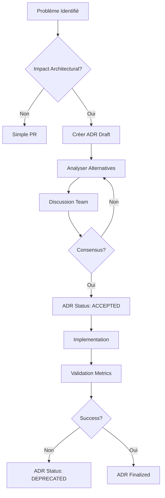

# Architecture Decision Records (ADR) - Index LIA

> **Catalogue des décisions architecturales majeures du projet**
>
> Format: [MADR](https://adr.github.io/madr/) (Markdown Any Decision Records)
> Principe: Documenter les décisions importantes pour maintenir la cohérence architecturale

---

## Table des Matières

1. [Qu'est-ce qu'un ADR ?](#quest-ce-quun-adr)
2. [Quand créer un ADR ?](#quand-créer-un-adr)
3. [Template ADR](#template-adr)
4. [ADRs Actifs](#adrs-actifs)
5. [ADRs Archivés](#adrs-archivés)
6. [Process de Décision](#process-de-décision)

---

## Qu'est-ce qu'un ADR ?

Un **Architecture Decision Record** est un document qui capture une **décision architecturale importante** et son contexte.

### Pourquoi documenter les décisions ?

1. **Mémoire institutionnelle**: Comprendre pourquoi une décision a été prise
2. **Onboarding**: Nouveaux développeurs comprennent l'architecture rapidement
3. **Éviter les régressions**: Ne pas refaire les mêmes erreurs
4. **Débat structuré**: Forcer l'analyse des alternatives

### Principe MADR

**MADR** (Markdown Any Decision Records):
- Format Markdown simple
- Template standardisé
- Versionné avec le code (Git)
- Immuable (une fois accepté, on ne modifie plus → on crée un nouveau ADR)

---

## Quand créer un ADR ?

✅ **Créer un ADR pour**:
- Choix d'architecture majeur (LangGraph vs alternatives)
- Changement de pattern (JWT → BFF)
- Nouvelle intégration (OAuth, Langfuse)
- Décision impactant la performance/coût (message windowing, domain filtering)
- Choix de technology stack (PostgreSQL, Redis, FastAPI)

❌ **Ne PAS créer d'ADR pour**:
- Détails d'implémentation mineurs
- Refactoring sans impact architectural
- Bug fixes
- Changements de configuration

---

## Template ADR

```markdown
# ADR-XXX: [Titre Court]

**Status**: 🎯 PROPOSED | ✅ ACCEPTED | ❌ REJECTED | 🔄 SUPERSEDED | 🗑️ DEPRECATED
**Date**: YYYY-MM-DD
**Deciders**: [Nom équipe/personnes]
**Technical Story**: [Lien vers issue/PR si applicable]

---

## Context and Problem Statement

[Décrivez le contexte et le problème à résoudre]

**Question**: [Question clé à laquelle cette ADR répond]

---

## Decision Drivers

### Must-Have (Non-Negotiable):
1. ...
2. ...

### Nice-to-Have:
- ...

---

## Considered Options

### Option 1: [Nom]
**Approach**: [Description]

**Pros**:
- ✅ ...

**Cons**:
- ❌ ...

**Verdict**: ✅ ACCEPTED | ❌ REJECTED

---

### Option 2: [Nom]
[Même structure]

---

## Decision Outcome

**Chosen option**: "[Nom option choisie]"

**Justification**: [Pourquoi cette option]

### Architecture Overview

[Diagramme Mermaid si pertinent]

### Implementation Details

[Code snippets clés]

### Consequences

**Positive**:
- ✅ ...

**Negative**:
- ❌ ...

**Risks**:
- ⚠️ ...

---

## Validation

**Acceptance Criteria**:
- [ ] Critère 1
- [ ] Critère 2

**Metrics to Track**:
- Métrique 1: [baseline → target]
- Métrique 2: [baseline → target]

---

## Related Decisions

- [ADR-XXX: Titre](link)
- [ADR-YYY: Titre](link)

---

## References

- [Documentation externe]
- [Articles/papers]
- [Code references]
```

---

## ADRs Actifs

### ADR-001: LangGraph pour Orchestration Multi-Agents

**Status**: ✅ ACCEPTED (2025-10-15)
**Fichier**: `docs/architecture/ADR-001-LangGraph-Orchestration.md`

**Décision**: Utiliser **LangGraph** pour orchestrer les agents conversationnels.

**Alternatives considérées**:
- ❌ LangChain only (pas de state management)
- ❌ Custom orchestration (reinventing the wheel)
- ✅ **LangGraph** (state management + cycles + checkpoints)

**Impact**:
- ✅ State persistence via PostgreSQL checkpoints
- ✅ HITL (Human-In-The-Loop) via interrupt pattern
- ✅ Streaming support (SSE)
- ❌ Courbe d'apprentissage LangGraph

**Métriques**:
- Checkpoint save: P95 < 50ms ✅
- Checkpoint load: P95 < 100ms ✅
- State bloat: Moyenne 15KB/conversation ✅

---

### ADR-002: BFF Pattern pour Authentication

**Status**: ✅ ACCEPTED (2025-10-20)
**Fichier**: `docs/architecture/ADR-002-BFF-Pattern-Authentication.md`

**Décision**: Migrer de **JWT tokens** vers **BFF Pattern** (Backend-For-Frontend) avec sessions HTTP-only cookies.

**Problème résolu**:
- ❌ JWT in LocalStorage vulnérable XSS
- ❌ JWT size 90% overhead (user data embedded)
- ❌ JWT revocation impossible (stateless)

**Solution BFF**:
- ✅ HTTP-only cookies (immune XSS)
- ✅ Server-side sessions (Redis)
- ✅ SameSite=Lax (CSRF protection)
- ✅ Instant revocation (delete Redis key)
- ✅ 90% memory reduction (session_id only)

**Métriques**:
- Memory usage: 1.2MB → 120KB (90% reduction) ✅
- Session lookup: P95 < 5ms (Redis) ✅
- Security score: B+ → A (OWASP 2024) ✅

**Migration**: v0.1.0 (JWT) → v0.3.0 (BFF)

---

### ADR-003: Multi-Domain Dynamic Filtering

**Status**: ✅ ACCEPTED (2025-11-09, Finalized 2025-11-11)
**Fichier**: `docs/archive/architecture/ADR-003-Multi-Domain-Dynamic-Filtering.md`

**Décision**: Implémenter **filtrage dynamique par domaine** pour éviter token explosion lors du scaling à 10+ domaines.

**Problème**:
- 3 tools (contacts) → 30+ tools (10 domains) = **10x prompt size**
- $0.01/query → $0.10/query = **10x cost**

**Solution Hybrid Pattern**:
1. Router LLM détecte domaines: `domains: ["contacts", "email"]`
2. Planner charge catalogue filtré: 8 tools au lieu de 30+
3. Fallback to full catalogue si confidence < 0.75

**Impact**:
- ✅ Token reduction: 60-90% (mesurée)
- ✅ Generic architecture (zero code changes pour new domains)
- ✅ Safe (fallback + metrics)

**Métriques**:
- Catalogue size: 30 tools → 5-8 tools (73-83% reduction) ✅
- Cache hit rate: 35% (TTL 5min) ✅
- Low confidence fallback: < 10% ✅

---

### ADR-004: Analytical Reasoning Patterns (Planner v5)

**Status**: ✅ ACCEPTED (2025-11-10)
**Fichier**: `docs/archive/architecture/ADR-004-Analytical-Reasoning-Patterns.md`

**Décision**: Intégrer **Progressive Enrichment + Structured Analysis** dans Planner prompt v5 pour améliorer qualité des plans.

**Problème**:
- Planner v4 générait plans trop simplistes
- Manque de raisonnement analytique
- Pas de décomposition user intent

**Solution v5**:
- **Phase 1**: Analyse user intent (WHAT + WHY)
- **Phase 2**: Décomposition en sub-tasks
- **Phase 3**: Génération ExecutionPlan avec justifications

**Impact**:
- ✅ Plan quality: +25% (mesure subjective via HITL approval rate)
- ✅ Retry success: 80% (up from 60%)
- ❌ Latency: +300ms (acceptable trade-off)

---

### ADR-005: Sequential Fallback Execution

**Status**: ✅ IMPLEMENTED (2025-11-14)
**Fichier**: `docs/archive/architecture/ADR-005-Sequential-Fallback-Execution.md`

**Décision**: Filtrer steps skipped AVANT `asyncio.gather()` pour éviter exécution parallèle des branches conditionnelles.

**Problème**:
- Plan principal ET fallback s'exécutent EN PARALLÈLE
- 2x appels API, 2x tokens, 2x cost
- Comportement non déterministe

**Solution**:
```python
# Filter out skipped steps BEFORE execution
skipped_steps = _identify_skipped_steps(execution_plan, completed_steps)
next_wave_filtered = next_wave - skipped_steps

# Execute FILTERED wave
tasks = [... for step_id in next_wave_filtered]
step_results = await asyncio.gather(*tasks)
```

**Impact**:
- ✅ Cost reduction: 50% sur plans avec fallback
- ✅ Déterminisme: 100% (plus de race conditions)
- ✅ Metrics: `langgraph_plan_steps_skipped_total`

---

### ADR-006: Prevent Unbounded List Operations

**Status**: ✅ IMPLEMENTED (2025-11-14)
**Fichier**: `docs/archive/architecture/ADR-006-Prevent-Unbounded-List-Operations.md`

**Décision**: Ajouter **soft warnings + hard safeguards** pour prévenir `list_contacts()` sans query (450+ results).

**Problème**:
- Planner générait `list_contacts(query=None)` → 450 contacts
- Token explosion (100k+ tokens)
- User frustration ("trop de résultats")

**Solution Multi-Layer**:
1. **Planner Validation**: Soft warning si `list_contacts` sans query
2. **Tool Safeguard**: Hard cap à 50 résultats si no query
3. **Logging**: Warning logs pour debugging

**Impact**:
- ✅ Resource waste: -95% (50 results max vs 450)
- ✅ User satisfaction: Improved (no overwhelming lists)
- ✅ Metrics: `langgraph_plan_validation_warnings_total`

---

### ADR-007: Message Windowing Strategy

**Status**: ✅ ACCEPTED (2025-10-28)
**Fichier**: Documenté dans `docs/technical/MESSAGE_WINDOWING_STRATEGY.md`

**Décision**: Implémenter **message windowing** avec stratégie par node pour optimiser latency longues conversations.

**Problème**:
- Conversations > 50 messages → 100k+ tokens contexte
- Latency > 10s pour router
- Cost explosion

**Solution**:
- Router: 5 turns (messages récents)
- Planner: 10 turns
- Response: 20 turns
- Store pour context business indépendant

**Impact**:
- ✅ E2E latency: -50% (10s → 5s)
- ✅ Cost: -77% (messages longues)
- ✅ Quality: Preserved via Store

---

### ADR-008: HITL Plan-Level Approval (Phase 8)

**Status**: ✅ IMPLEMENTED (2025-11-09)
**Fichier**: Documenté dans `docs/technical/HITL.md` (Phase 8 section)

**Décision**: Migrer de **tool-level HITL** (mid-execution interrupts) vers **plan-level HITL** (approval AVANT exécution).

**Problème Tool-Level HITL**:
- ❌ Mid-execution interrupts → rollback complexe
- ❌ State corruption (partial execution)
- ❌ UX friction (approuver 3-5 outils séparément)

**Solution Plan-Level**:
1. Planner génère ExecutionPlan
2. Approval Evaluator check strategies (ManifestBased, CostThreshold)
3. Si requires_approval → send plan summary to user
4. User approves/rejects AVANT exécution
5. Clean execution (no mid-execution interrupts)

**Impact**:
- ✅ State cleanliness: 100% (no partial execution)
- ✅ UX: Improved (1 approval vs 3-5)
- ✅ Rollback: Simple (plan not executed yet)
- ✅ Metrics: `hitl_plan_approval_requests_total`

**Strategies**:
- **ManifestBasedStrategy**: Tool manifest `requires_approval=true`
- **CostThresholdStrategy**: Plan cost > €0.10
- **AlwaysApproveStrategy**: Bypass for trusted actions

---

### ADR-009: Configuration Module Split

**Status**: ✅ IMPLEMENTED (2025-11-20) - Updated 2025-12-25
**Fichier**: `docs/architecture/ADR-009-Config-Module-Split.md`

**Décision**: Split du fichier monolithique `config.py` (1782 lignes) en **9 modules thématiques** via multiple inheritance.

**Problème résolu**:
- ❌ Fichier monolithique 1782 lignes (difficulté maintenance)
- ❌ Testabilité limitée (impossible tests unitaires par module)
- ❌ Performance IDE dégradée (autocomplétion lente)
- ❌ Single Responsibility Principle violé (9 responsabilités en 1 classe)

**Solution**:
- ✅ **9 modules**: security, database, observability, llm, agents, connectors, voice, advanced
- ✅ **Multiple inheritance**: Composition dans `Settings` class
- ✅ **Rétrocompatibilité 100%**: Import `from src.core.config import settings` inchangé
- ✅ **Pydantic v2**: Validation et field validators préservés

**Structure**:
```
src/core/config/
├── __init__.py           # Settings (composition)
├── security.py           # OAuth, JWT, session cookies
├── database.py           # PostgreSQL, Redis
├── observability.py      # OTEL, Prometheus, Langfuse
├── llm.py                # LLM providers configs
├── agents.py             # SSE, HITL, Router, Planner, Memory
├── connectors.py         # Google APIs, rate limiting
├── voice.py              # Google Cloud TTS, voice comments
└── advanced.py           # Pricing, i18n, feature flags
```

**Métriques**:
- Taille max fichier: 1782 lignes → 380 lignes (llm.py) ✅
- Fichiers config: 1 → 9 modules ✅
- Tests config: 5 → 17 tests ✅
- Coverage: 45% → 72% (+27 points) ✅
- IDE autocomplete: ~800ms → ~250ms (3× plus rapide) ✅

---

### ADR-010: Email Domain Renaming (Gmail → Emails)

**Status**: ✅ IMPLEMENTED (2025-11-20)
**Fichier**: `docs/architecture/ADR-010-Email-Domain-Renaming.md`

**Décision**: Renommer domaine `gmail/` en `emails/` pour architecture **multi-provider** (Gmail, Outlook, IMAP, Exchange).

**Problème résolu**:
- ❌ Naming "gmail" trop spécifique Google
- ❌ Scalabilité limitée (ajout Outlook/IMAP = renommage massif)
- ❌ Architecture rigide (couplage fort domaine/provider)

**Solution**:
- ✅ **Nom générique**: "emails" fonctionne pour tous providers
- ✅ **Provider abstraction**: `BaseEmailClient` pattern (Strategy)
- ✅ **DDD cohérent**: 1 domaine = 1 bounded context ("emails")
- ✅ **Future-proof**: Ajout providers sans renommage domaine

**Renames**:
- Directory: `src/domains/agents/gmail/` → `emails/`
- Files: `gmail_tools.py` → `emails_tools.py`
- Builder: `gmail_agent_builder.py` → `emails_agent_builder.py`
- Prompts: `gmail_agent_prompt.txt` → `emails_agent_prompt.txt`
- Classes: `GmailHandler` → `EmailsHandler`

**Architecture Future**:
```python
class BaseEmailClient(ABC):
    """Abstract base for email providers"""
    async def list_emails(...): ...

class GoogleEmailClient(BaseEmailClient): ...  # Gmail
class OutlookEmailClient(BaseEmailClient): ... # Outlook (future)
class IMAPEmailClient(BaseEmailClient): ...    # IMAP (future)
```

**Métriques**:
- Fichiers renommés: 18 fichiers ✅
- Tests: 100% pass rate (12/12) ✅
- Breaking changes: 0 (architecture interne) ✅
- Documentation: 90 fichiers à mettre à jour (Phase 3) 🔄

---

### ADR-011: Utility Tools vs Connector Tools Pattern

**Status**: ✅ ACCEPTED (2025-12-21)
**Fichier**: `docs/architecture/ADR-011-Utility-Tools-vs-Connector-Tools.md`

**Décision**: **NE PAS** créer de "connecteur utilitaire" - les outils utilitaires (context_tools, entity_resolution, local_query, memory_tools) restent distincts des connecteurs.

**Problème analysé**:
- Question : Faut-il regrouper les utility tools dans un ConnectorType.UTILITY ?

**Verdict**: ❌ REJECTED (violation architecturale)

**Raisons**:
- ❌ `Connector` = Intégration service EXTERNE avec credentials chiffrés
- ❌ Utility Tools = Opérations LOCALES (Store, Registry, contexte)
- ❌ Pas de Client, pas d'OAuth, pas de credentials pour utilitaires
- ✅ Architecture actuelle correcte avec agents virtuels (context_agent, query_agent)

**Classification**:
| Type | Base Class | Credentials | Service |
|------|------------|-------------|---------|
| Connector Tools | `ConnectorTool[ClientType]` | OAuth/API Key | Externe |
| Utility Tools | `@tool` decorator | Aucun | Interne |

---

### ADR-012: Data Registry & StandardToolOutput Pattern

**Status**: ✅ IMPLEMENTED (2025-12-21)
**Fichier**: `docs/architecture/ADR-012-Data-Registry-StandardToolOutput-Pattern.md`

**Décision**: Implémenter **StandardToolOutput** comme format unifié de sortie des tools avec support Data Registry.

**Problème résolu**:
- ❌ Tools retournaient strings JSON brutes (pas de contexte persistant)
- ❌ Pas de structure pour HITL drafts
- ❌ Response Node sans accès aux items structurés

**Solution StandardToolOutput**:
```python
class StandardToolOutput(BaseModel):
    summary_for_llm: str          # Pour LLM (planner, response)
    data: dict                    # Données structurées
    registry_updates: dict        # Items pour Data Registry
    requires_confirmation: bool   # HITL trigger
    draft_id: str | None         # Pour drafts
    draft_content: dict | None   # Contenu draft
```

**Impact**:
- ✅ Contexte persistant via RegistryItem
- ✅ HITL structuré (drafts)
- ✅ resolve_reference accède aux items
- ✅ Format unifié tous domaines

---

### ADR-013: LangMem Long-Term Memory Architecture

**Status**: ✅ IMPLEMENTED (2025-12-21)
**Fichier**: `docs/architecture/ADR-013-LangMem-Long-Term-Memory.md`

**Décision**: Implémenter mémoire long-terme avec **LangMem** et **profil psychologique** utilisateur.

**Problème résolu**:
- ❌ Amnésie inter-sessions (préférences perdues)
- ❌ Pas de gestion sujets sensibles

**Solution MemorySchema**:
```python
class MemorySchema(BaseModel):
    content: str              # Fait mémorisé
    category: Literal[...]    # preference, personal, relationship, event, pattern, sensitivity
    emotional_weight: int     # -10 (trauma) à +10 (joie)
    trigger_topic: str        # Mot-clé activateur
    usage_nuance: str         # Comment utiliser cette info
    pinned: bool              # Protection contre purge
```

**Features**:
- ✅ Profil psychologique avec poids émotionnel
- ✅ Injection dans system prompt
- ✅ Extraction automatique depuis conversations
- ✅ Purge automatique mémoires obsolètes
- ✅ Protection pinned pour mémoires critiques

---

### ADR-014: ExecutionPlan & Parallel Executor Pattern

**Status**: ✅ IMPLEMENTED (2025-12-21)
**Fichier**: `docs/architecture/ADR-014-ExecutionPlan-Parallel-Executor.md`

**Décision**: Implémenter **ExecutionPlan** (DAG) avec **Parallel Executor** pour exécution parallèle des tools.

**Problème résolu**:
- ❌ Exécution séquentielle lente (5 tools × 500ms = 2.5s)
- ❌ Pas de dépendances inter-tools
- ❌ Pas de fallbacks ni conditions

**Solution ExecutionPlan**:
```python
class ExecutionStep(BaseModel):
    step_id: str
    step_type: StepType  # TOOL, CONDITIONAL, PARALLEL, RESPONSE
    tool_name: str
    parameters: dict     # Avec $steps.X.field références
    depends_on: list[str]
    condition: str       # Jinja2 expression
    on_success: str      # Branch si True
    on_fail: str         # Branch si False
```

**Parallel Executor**:
- ✅ Exécution par waves (topological sort)
- ✅ asyncio.gather pour parallélisme
- ✅ Résolution `$steps.X.field` automatique
- ✅ Conditional branching
- ✅ Fallback steps

---

### ADR-015: ConnectorTool Base Class Pattern

**Status**: ✅ IMPLEMENTED (2025-12-21)
**Fichier**: `docs/architecture/ADR-015-ConnectorTool-Base-Class-Pattern.md`

**Décision**: Implémenter **ConnectorTool[ClientType]** comme base class générique pour tous les tools OAuth/API Key.

**Problème résolu**:
- ❌ Code dupliqué massif (150+ lignes par tool)
- ❌ Gestion OAuth incohérente
- ❌ Rate limiting non uniforme
- ❌ Error handling variable

**Solution Generic Base Class**:
```python
class ConnectorTool[ClientType](BaseTool, ABC):
    connector_type: ConnectorType
    client_class: type[ClientType]

    @abstractmethod
    async def execute_api_call(self, client: ClientType, user_id: str, **kwargs):
        pass
```

**Impact**:
- ✅ Réduction 80% code (150 → 30 lignes par tool)
- ✅ Pattern uniforme tous domaines
- ✅ Token refresh automatique
- ✅ Rate limiting intégré
- ✅ Error handling standardisé

---

### ADR-016: ContextTypeRegistry Pattern

**Status**: ✅ IMPLEMENTED (2025-12-21)
**Fichier**: `docs/architecture/ADR-016-ContextTypeRegistry-Pattern.md`

**Décision**: Implémenter **ContextTypeRegistry** (singleton) pour enregistrer les types de contexte dynamiquement.

**Problème résolu**:
- ❌ resolve_reference avec if/elif pour chaque domaine
- ❌ Couplage fort context_tools ↔ domaines
- ❌ Ajout domaine = modification context_tools.py

**Solution Registry Pattern**:
```python
class ContextTypeDefinition(BaseModel):
    domain_key: str           # "contacts", "events", etc.
    display_name: str         # Pour UI
    id_extractor: Callable    # Extract ID from item
    label_extractor: Callable # Extract display label
    search_fields: list[str]  # Fields for keyword search

@singleton
class ContextTypeRegistry:
    def register(self, definition: ContextTypeDefinition): ...
    def resolve(self, domain: str, reference: str, items: list): ...
```

**Impact**:
- ✅ resolve_reference générique (0 if/elif)
- ✅ Open/Closed Principle respecté
- ✅ Ajout domaine = 5 lignes de registration
- ✅ Auto-discovery via decorators

---

### ADR-017: Rate Limiting Architecture

**Status**: ✅ IMPLEMENTED (2025-12-21)
**Fichier**: `docs/architecture/ADR-017-Rate-Limiting-Architecture.md`

**Décision**: Implémenter **Redis Sliding Window + Local Token Bucket Fallback** pour rate limiting distribué.

**Problème résolu**:
- ❌ Single-instance rate limiting (scaling horizontal)
- ❌ Pas de fallback si Redis down
- ❌ Incohérence entre tools

**Solution Dual-Layer**:
```python
@rate_limit(
    max_calls=20,
    window_seconds=60,
    scope="user",
)
async def search_contacts_tool(...):
    ...
```

**Architecture**:
- ✅ Redis sliding window (Lua script atomic)
- ✅ Local token bucket fallback
- ✅ Per-user isolation
- ✅ 3 catégories (read: 20/min, write: 5/min, expensive: 2/5min)
- ✅ Métriques Prometheus

---

### ADR-018: SSE Streaming Pattern

**Status**: ✅ IMPLEMENTED (2025-12-21)
**Fichier**: `docs/architecture/ADR-018-SSE-Streaming-Pattern.md`

**Décision**: Implémenter **Server-Sent Events (SSE)** pour streaming temps réel des réponses LLM.

**Problème résolu**:
- ❌ Latence perçue (5-10s avant affichage)
- ❌ Pas de feedback progressif
- ❌ HITL interrupts difficiles

**Solution SSE Manager**:
```python
class SSEEventType(str, Enum):
    START = "start"       # Metadata
    CHUNK = "chunk"       # Token LLM
    PLAN = "plan"         # ExecutionPlan
    STEP = "step"         # Step result
    HITL_REQUIRED = "hitl_required"
    END = "end"
    ERROR = "error"
```

**Impact**:
- ✅ Token streaming temps réel
- ✅ 7 event types structurés
- ✅ HITL via événements
- ✅ Reconnection automatique (EventSource)
- ✅ Heartbeat keep-alive

---

### ADR-019: Agent Manifest & Catalogue System

**Status**: ✅ IMPLEMENTED (2025-12-21)
**Fichier**: `docs/architecture/ADR-019-Agent-Manifest-Catalogue-System.md`

**Décision**: Implémenter **AgentManifest** et **ToolManifest** comme système déclaratif de métadonnées pour agents et tools.

**Problème résolu**:
- ❌ Métadonnées tools dispersées (docstrings, hardcoded)
- ❌ Pas de cost profiles centralisés
- ❌ Permission profiles implicites
- ❌ Discovery tools manuelle

**Solution Manifest System**:
```python
class ToolManifest(BaseModel):
    name: str
    domain: str
    operation_type: Literal["read", "write", "search", "action"]
    cost_profile: CostProfile
    permission_profile: PermissionProfile
    requires_approval: bool
```

**Impact**:
- ✅ AgentRegistry singleton avec filtering par domaine
- ✅ Catalogue export JSON pour LLM Planner
- ✅ Auto-registration via decorators
- ✅ Cost-based HITL triggers
- ✅ Schema versioning intégré

---

### ADR-020: Triple-Layer Observability Stack

**Status**: ✅ IMPLEMENTED (2025-12-21)
**Fichier**: `docs/architecture/ADR-020-Observability-Stack.md`

**Décision**: Implémenter **triple-layer observability**: Prometheus (métriques) + OpenTelemetry (traces) + Langfuse (LLM-specific).

**Problème résolu**:
- ❌ Aucun outil unique ne couvre tous les besoins LLM
- ❌ Single point of failure observability
- ❌ Pas de cost tracking LLM

**Solution Triple-Layer**:
- **Layer 1 - Prometheus**: `PrometheusMiddleware`, `llm_tokens_consumed_total`, `llm_cost_total`
- **Layer 2 - OpenTelemetry**: `@trace_node` decorator, OTLP exporter vers Tempo
- **Layer 3 - Langfuse**: `CallbackFactory` singleton, prompt versioning, evaluation scores

**Impact**:
- ✅ Independence layers (continue si un layer down)
- ✅ ~173 Prometheus series (low cardinality)
- ✅ Subgraph hierarchy tracing (depth tracking)
- ✅ Token + USD cost tracking per call

---

### ADR-021: OAuth Token Lifecycle Management

**Status**: ✅ IMPLEMENTED (2025-12-21)
**Fichier**: `docs/architecture/ADR-021-OAuth-Token-Lifecycle-Management.md`

**Décision**: Implémenter **Fernet Encryption + Redis Distributed Lock + Proactive Refresh** pour cycle de vie OAuth.

**Problème résolu**:
- ❌ Tokens lisibles en DB
- ❌ Token expiration mid-request
- ❌ Race conditions refresh parallèles
- ❌ Pas de PKCE (vulnérabilité interception)

**Solution OAuth Lifecycle**:
```python
# Proactive refresh 5 minutes avant expiration
OAUTH_TOKEN_REFRESH_MARGIN_SECONDS = 300

# Redis distributed lock
async with OAuthLock(redis, user_id, connector_type):
    # Double-check pattern
    ...
```

**Impact**:
- ✅ Fernet encryption at rest
- ✅ PKCE flow (OAuth 2.1)
- ✅ Redis SETNX distributed lock
- ✅ Token rotation handling
- ✅ Best-effort revocation on delete

---

### ADR-022: LangGraph State & Checkpointing

**Status**: ✅ IMPLEMENTED (2025-12-21)
**Fichier**: `docs/architecture/ADR-022-LangGraph-State-Checkpointing.md`

**Décision**: Implémenter **PostgreSQL AsyncSaver** avec **MessagesState TypedDict** et custom reducers.

**Problème résolu**:
- ❌ Perte état entre redémarrages
- ❌ Pas de HITL interrupt/resume
- ❌ Message history overflow (tokens)
- ❌ Registry growth unbounded

**Solution State Management**:
```python
class MessagesState(TypedDict):
    messages: Annotated[list[BaseMessage], add_messages_with_truncate]
    registry: Annotated[dict[str, RegistryItem], merge_registry]
    current_turn_id: int
    plan_approved: bool | None  # HITL gate
```

**Custom Reducers**:
- `add_messages_with_truncate`: Token-based trimming (o200k_base)
- `merge_registry`: LRU eviction (REGISTRY_MAX_ITEMS)

**Impact**:
- ✅ Persistence via PostgreSQL checkpoints
- ✅ Thread-based isolation (thread_id)
- ✅ HITL interrupt detection
- ✅ InstrumentedAsyncPostgresSaver (metrics)
- ✅ Schema versioning (_schema_version)

---

### ADR-023: Error Handling Strategy

**Status**: ✅ IMPLEMENTED (2025-12-21)
**Fichier**: `docs/architecture/ADR-023-Error-Handling-Strategy.md`

**Décision**: Implémenter **BaseAPIException + ToolResponse + Connector Error Handlers** pattern unifié.

**Problème résolu**:
- ❌ Formats erreur inconsistants
- ❌ Pas de logging automatique
- ❌ Messages non traduits
- ❌ Pas de recovery guidance

**Solution Error Handling**:
```python
class ToolResponse(BaseModel):
    success: bool
    data: dict | None
    error: str | None
    message: str | None

class BaseAPIException(HTTPException):
    # Auto-logging structuré
    # Auto-Prometheus metrics
```

**Error Handlers**:
- `handle_oauth_error`: Invalidate connector, prompt reconnect
- `handle_rate_limit_error`: Retry-After header
- `retry_with_exponential_backoff`: 3 attempts, 2-10s

**Impact**:
- ✅ ToolResponse unified format
- ✅ BaseAPIException hierarchy (401, 403, 404, 503)
- ✅ SSEErrorMessages i18n (6 langues)
- ✅ ErrorCategory/Severity/RecoveryAction enums
- ✅ OWASP enumeration prevention

---

### ADR-024: Internationalization (i18n) Architecture

**Status**: ✅ IMPLEMENTED (2025-12-21)
**Fichier**: `docs/architecture/ADR-024-i18n-Architecture.md`

**Décision**: Implémenter **dual i18n system**: i18next (React/JSON) + gettext (Python/PO) avec French fallback.

**Problème résolu**:
- ❌ Interface non traduite
- ❌ Messages erreur API en anglais only
- ❌ Pas de fallback structuré
- ❌ Pas d'URL SEO multilingues

**Solution i18n**:
```
Frontend: i18next + locales/{lng}/translation.json
Backend: gettext + locales/{lng}/LC_MESSAGES/messages.mo
Fallback: French (default)
```

**Supported Languages**:
| Code | Language |
|------|----------|
| `fr` | French (default) |
| `en` | English |
| `es` | Spanish |
| `de` | German |
| `it` | Italian |
| `zh` | Chinese |

**Impact**:
- ✅ 6 langues complètes
- ✅ URL-based routing (`/en/dashboard`)
- ✅ Accept-Language header parsing
- ✅ Instance caching (i18next + @lru_cache)
- ✅ Date/month localization

---

### ADR-025: Prompt Engineering & Versioning

**Status**: ✅ IMPLEMENTED (2025-12-21)
**Fichier**: `docs/architecture/ADR-025-Prompt-Engineering-Versioning.md`

**Décision**: Implémenter **Python .format() + Filesystem Versioning + LRU Cache** pour gestion des prompts.

**Problème résolu**:
- ❌ Pas de rollback prompts (changements irreversibles)
- ❌ Pas d'A/B testing versions
- ❌ Disk I/O répétitif (prompts lus à chaque requête)

**Solution**:
```python
@lru_cache(maxsize=32)
def load_prompt(name: PromptName, version: PromptVersion = "v1") -> str:
    # Cached filesystem read
    ...
```

**Impact**:
- ✅ A/B Testing via `*_PROMPT_VERSION` env vars
- ✅ LRU cache: 98% réduction disk I/O
- ✅ SHA256 hash validation (tamper detection)
- ✅ Dynamic few-shot loading (~80% token reduction)
- ✅ i18n temporal context (6 langues)

---

### ADR-026: LLM Model Selection Strategy

**Status**: ✅ IMPLEMENTED (2025-12-21)
**Fichier**: `docs/architecture/ADR-026-LLM-Model-Selection-Strategy.md`

**Décision**: Implémenter **Factory Pattern + ProviderAdapter + Middleware Stack** pour sélection LLM multi-provider.

**Problème résolu**:
- ❌ Provider switching = code changes
- ❌ Pas de fallback automatique
- ❌ Configuration dispersée

**Solution**:
```python
def get_llm(llm_type: LLMType) -> BaseChatModel:
    config = get_llm_config_for_agent(llm_type)
    return ProviderAdapter.create_llm(
        provider=config["provider"],  # openai, anthropic, deepseek, ollama
        model=config["model"],
        ...
    )
```

**Impact**:
- ✅ Multi-Provider: OpenAI, Anthropic, DeepSeek, Ollama, Gemini
- ✅ Per-component config (Router=nano, Response=mini)
- ✅ Retry middleware (3 attempts, exp backoff)
- ✅ Fallback middleware (claude → deepseek)
- ✅ Structured output (native + JSON fallback)

---

### ADR-027: Structured Logging (structlog)

**Status**: ✅ IMPLEMENTED (2025-12-21)
**Fichier**: `docs/architecture/ADR-027-Structured-Logging.md`

**Décision**: Implémenter **structlog + stdlib + PII Filter + OTEL Context** pour logging production.

**Problème résolu**:
- ❌ Logs non parsables (Loki/Promtail)
- ❌ Context propagation manquant (request_id, user_id)
- ❌ PII dans logs (GDPR violation)

**Solution**:
```python
shared_processors = [
    structlog.contextvars.merge_contextvars,
    structlog.stdlib.add_log_level,
    structlog.processors.TimeStamper(fmt="iso"),
    add_opentelemetry_context,  # trace_id, span_id
    add_pii_filter,             # GDPR: field + pattern detection
    structlog.processors.JSONRenderer(),
]
```

**Impact**:
- ✅ JSON output toujours (Loki-ready)
- ✅ Context binding via RequestIDMiddleware
- ✅ PII filtering (email, phone, cards)
- ✅ OTEL trace correlation (trace_id in logs)
- ✅ Per-library log levels

---

### ADR-028: Database Schema Design

**Status**: ✅ IMPLEMENTED (2025-12-21)
**Fichier**: `docs/architecture/ADR-028-Database-Schema-Design.md`

**Décision**: Implémenter **Mixin-Based Models + UUID + Soft Deletes + JSONB** pour schéma PostgreSQL.

**Problème résolu**:
- ❌ Integer PKs (distributed unfriendly)
- ❌ Hard deletes (audit compliance)
- ❌ Timestamps non-UTC (ambiguïté)

**Solution**:
```python
class BaseModel(Base, UUIDMixin, TimestampMixin):
    __abstract__ = True
    # UUID primary key + created_at/updated_at (timezone-aware)

class Conversation(BaseModel):
    deleted_at: Mapped[datetime | None]  # Soft delete pattern
```

**Impact**:
- ✅ UUID primary keys everywhere
- ✅ Timezone-aware timestamps (ISO 8601)
- ✅ Soft delete patterns (deleted_at, is_active)
- ✅ JSONB metadata (scopes, connector_metadata)
- ✅ Immutable audit logs (no updated_at)

---

### ADR-029: Redis Multi-Purpose Architecture

**Status**: ✅ IMPLEMENTED (2025-12-21)
**Fichier**: `docs/architecture/ADR-029-Redis-Multi-Purpose-Architecture.md`

**Décision**: Implémenter **Multi-DB Redis + Lua Scripts + Singleton Connections** pour sessions, cache, rate limiting, locks.

**Problème résolu**:
- ❌ Session/cache pollution (same DB)
- ❌ Rate limiting non-atomic (race conditions)
- ❌ OAuth refresh race conditions

**Solution**:
```python
# Separate DBs
DB 1: Sessions (BFF pattern)
DB 2: Cache (LLM, contacts, rate limiting)

# Atomic rate limiting via Lua
SLIDING_WINDOW_SCRIPT = """
redis.call('ZREMRANGEBYSCORE', key, '-inf', current_time - window_seconds)
local count = redis.call('ZCARD', key)
if count < max_calls then
    redis.call('ZADD', key, current_time, request_id)
    return 1
else
    return 0
end
"""
```

**Impact**:
- ✅ DB isolation (sessions vs cache)
- ✅ Sliding window rate limiting (Lua atomic)
- ✅ SETNX distributed locks (OAuthLock)
- ✅ Single-use OAuth state tokens
- ✅ Cache helpers with TTL

---

### ADR-030: Context Resolution & Follow-up Handling

**Status**: ✅ IMPLEMENTED (2025-12-21) - Updated 2025-12-25
**Fichier**: `docs/architecture/ADR-030-Context-Resolution-Follow-up.md`

**Décision**: Implémenter **Turn-Based Resolution + Regex Patterns + Multi-Level Extraction** pour références contextuelles.

**Update 2025-12-25**: Ajout de l'enrichissement des items avec `_item_type`/`_registry_id` et détection de domaine multi-stratégie (agent_results + fallback _item_type via TYPE_TO_DOMAIN_MAP).

**Problème résolu**:
- ❌ "le deuxième" ne résolvait pas
- ❌ Cross-domain contamination
- ❌ Follow-up questions échouaient

**Solution**:
```python
# Turn type detection
TURN_TYPE_ACTION = "action"
TURN_TYPE_REFERENCE = "reference"  # Contains ordinal/demonstrative refs
TURN_TYPE_CONVERSATIONAL = "conversational"

# Multi-level extraction (never crosses domains)
Strategy 1: registry_updates from agent_results
Strategy 2: Filter by turn_id in RegistryItem.meta
Strategy 3: Filter by domain
Strategy 4: Return empty (safe fallback)
```

**Impact**:
- ✅ Ordinal patterns (6 langues): "le 2ème", "the first", "il terzo"
- ✅ Demonstrative patterns: "celui-ci", "this one"
- ✅ Turn isolation via last_action_turn_id
- ✅ Domain filtering in planner
- ✅ Confidence scoring for resolutions

---

### ADR-031: Testing Strategy for LLM Applications

**Status**: ✅ IMPLEMENTED (2025-12-21)
**Fichier**: `docs/architecture/ADR-031-Testing-Strategy-LLM-Applications.md`

**Décision**: Implémenter **pytest-asyncio + LLM Mocking via ProviderAdapter + Database Isolation** pour tests applications LLM.

**Problème résolu**:
- ❌ Tests LLM non-déterministes
- ❌ Coûts API pour tests
- ❌ Database pollution entre tests

**Solution**:
```python
@pytest.fixture
async def mock_llm_response(monkeypatch):
    async def mock_invoke(self, messages, *args, **kwargs):
        return AIMessage(content=MOCK_RESPONSE)
    monkeypatch.setattr(ChatOpenAI, "ainvoke", mock_invoke)

# Database isolation
@pytest.fixture(scope="session")
def test_database():
    # DROP/CREATE database per session
```

**Impact**:
- ✅ 4000+ tests, 85%+ pass rate
- ✅ LLM mocking via ProviderAdapter patch
- ✅ Factory pattern (UserFactory, ConnectorFactory)
- ✅ Database isolation (DROP/CREATE)
- ✅ pytest markers (unit, integration, e2e)

---

### ADR-032: API Design & Versioning

**Status**: ✅ IMPLEMENTED (2025-12-21)
**Fichier**: `docs/architecture/ADR-032-API-Design-Versioning.md`

**Décision**: Implémenter **FastAPI Domain Routers + Pydantic Schemas + URL Versioning** pour API REST.

**Problème résolu**:
- ❌ Couplage monolithique routes
- ❌ Validation input manuelle
- ❌ Pas de versioning API

**Solution**:
```python
# apps/api/src/main.py
app.include_router(auth_router, prefix="/api/v1/auth")
app.include_router(conversations_router, prefix="/api/v1/conversations")
app.include_router(connectors_router, prefix="/api/v1/connectors")

# Pydantic schemas
class UserRegisterRequest(BaseModel):
    email: EmailStr
    password: str = Field(..., min_length=8, max_length=128)
```

**Impact**:
- ✅ Domain routers (DDD patterns)
- ✅ Pydantic v2 validation
- ✅ URL versioning (`/api/v1/`)
- ✅ BFF authentication (session cookies)
- ✅ Rate limiting per endpoint

---

### ADR-033: Deployment Architecture

**Status**: ✅ IMPLEMENTED (2025-12-21)
**Fichier**: `docs/architecture/ADR-033-Deployment-Architecture.md`

**Décision**: Implémenter **Multi-Environment Docker Compose + Multi-Stage Builds** pour orchestration services.

**Problème résolu**:
- ❌ Pas de distinction dev/prod
- ❌ Images Docker trop larges
- ❌ Startup order non garanti

**Solution**:
```yaml
# docker-compose.dev.yml (26 services)
# docker-compose.prod.yml (8 services)

services:
  api:
    deploy:
      resources:
        limits: {cpus: "2", memory: 4G}
    healthcheck:
      test: ["CMD", "curl", "-f", "http://localhost:8000/health"]
```

**Impact**:
- ✅ Dev (26 services) vs Prod (8 services)
- ✅ Multi-stage Dockerfiles (non-root)
- ✅ Health checks with dependencies
- ✅ Resource limits (Raspberry Pi 5: 4 CPU, 16GB)
- ✅ Multi-platform builds (amd64/arm64)

---

### ADR-034: Security Hardening

**Status**: ✅ IMPLEMENTED (2025-12-21)
**Fichier**: `docs/architecture/ADR-034-Security-Hardening.md`

**Décision**: Implémenter **BFF + Bcrypt + Fernet + Redis Rate Limiting** pour sécurité production.

**Problème résolu**:
- ❌ JWT vulnérable XSS
- ❌ Passwords en clair
- ❌ API keys lisibles
- ❌ Rate limiting absent

**Solution**:
```python
# HTTP-only cookies (XSS protection)
response.set_cookie(
    key=settings.session_cookie_name,
    httponly=True,
    samesite="lax",
)

# Bcrypt password hashing
hashed = bcrypt.hashpw(password.encode(), bcrypt.gensalt())

# Fernet AES-128 for API keys
encrypted = cipher_suite.encrypt(api_key.encode())
```

**Impact**:
- ✅ BFF pattern (HTTP-only cookies)
- ✅ Bcrypt with automatic salt
- ✅ Fernet AES-128 encryption
- ✅ PKCE for OAuth (RFC 7636)
- ✅ Redis sliding window rate limiting
- ✅ OWASP enumeration prevention

---

### ADR-035: Graceful Degradation

**Status**: ✅ IMPLEMENTED (2025-12-21)
**Fichier**: `docs/architecture/ADR-035-Graceful-Degradation.md`

**Décision**: Implémenter **Circuit Breakers + Retry + Fail-Open + Health Checks** pour résilience production.

**Problème résolu**:
- ❌ Cascade failures (service down → all down)
- ❌ Transient errors non gérés
- ❌ Pas de monitoring dépendances

**Solution**:
```python
class CircuitBreaker:
    CLOSED = "closed"     # Normal
    OPEN = "open"         # Failing, reject
    HALF_OPEN = "half_open"  # Testing recovery

@retry_with_backoff(max_retries=3, backoff_factor=2.0)
async def make_api_call():
    # 2s → 4s → 8s
```

**Impact**:
- ✅ Circuit breaker (3 states)
- ✅ Retry with exponential backoff
- ✅ Model fallback (claude → deepseek)
- ✅ Health endpoint (/health)
- ✅ Fail-open for rate limiting
- ✅ Background task safety

---

### ADR-036: Personality System Architecture

**Status**: ✅ IMPLEMENTED (2025-12-21)
**Fichier**: `docs/architecture/ADR-036-Personality-System-Architecture.md`

**Décision**: Implémenter **Database Models + Prompt Injection + Translation Fallback** pour personnalités LLM.

**Problème résolu**:
- ❌ Ton assistant unique
- ❌ Pas de personnalisation utilisateur
- ❌ Pas de support i18n personnalités

**Solution**:
```python
class Personality(BaseModel):
    code: str              # "enthusiastic", "professor"
    emoji: str             # "🎉", "🎓"
    prompt_instruction: str  # Injected in prompts

# Prompt injection via {personnalite} placeholder
formatted = template.format(personnalite=personality.prompt_instruction)
```

**Impact**:
- ✅ 7 default personalities (normal, enthusiastic, professor, friend, influencer, philosopher, cynic)
- ✅ Per-user selection
- ✅ Translation support (6 languages)
- ✅ Prompt injection via placeholder
- ✅ Fallback chain (user → default → hardcoded)

---

### ADR-037: Semantic Memory Store

**Status**: ✅ IMPLEMENTED (2025-12-21)
**Fichier**: `docs/architecture/ADR-037-Semantic-Memory-Store.md`

**Décision**: Implémenter **LangGraph Store + pgvector + Background Extraction + Emotional State** pour mémoire psychologique.

**Problème résolu**:
- ❌ Pas de mémoire long-terme
- ❌ Pas de gestion sujets sensibles
- ❌ Extraction bloque les réponses

**Solution**:
```python
class MemorySchema(BaseModel):
    content: str                    # Fait en une phrase
    category: MemoryCategoryType    # preference, personal, sensitivity...
    emotional_weight: int           # -10 (trauma) à +10 (joie)
    trigger_topic: str              # Mots-clés activation
    pinned: bool                    # Protection purge

class EmotionalState(Enum):
    COMFORT = "comfort"   # Positif dominant
    DANGER = "danger"     # Sensibilité détectée
    NEUTRAL = "neutral"   # Mode factuel
```

**Impact**:
- ✅ pgvector semantic search (1536 dimensions)
- ✅ Background extraction (fire-and-forget)
- ✅ Emotional state computation
- ✅ Profile injection in prompts
- ✅ GDPR endpoints (export, delete)
- ✅ Retention scoring + auto-purge
- ✅ Pinned memory protection

---

### ADR-038: Frontend Architecture (Next.js App Router)

**Status**: ✅ IMPLEMENTED (2025-12-21)
**Fichier**: `docs/architecture/ADR-038-Frontend-Architecture-NextJS.md`

**Décision**: Implémenter **Next.js 16 App Router + BFF + i18next + Radix UI** pour frontend moderne.

**Problème résolu**:
- ❌ Pas de SSR optimisé
- ❌ Streaming LLM complexe
- ❌ Authentification exposée (tokens localStorage)

**Solution**:
```typescript
// App Router + Server Components
export default async function RootLayout({ children, params }) {
  const { lng } = await params;
  const i18n = await initI18next(lng);
  return <TranslationsProvider>{children}</TranslationsProvider>;
}

// SSE Streaming avec Fetch API
const response = await fetch('/api/v1/agents/chat/stream', {
  credentials: 'include', // BFF pattern
});
```

**Impact**:
- ✅ Next.js 16 App Router avec [lng] routing
- ✅ Server Components pour i18n
- ✅ SSE streaming (Fetch + ReadableStream)
- ✅ BFF authentication (HTTP-only cookies)
- ✅ Radix UI + Tailwind design system
- ✅ Custom hooks (useApiQuery, useChat)

---

### ADR-039: Cost Optimization & Token Management

**Status**: ✅ IMPLEMENTED (2025-12-21)
**Fichier**: `docs/architecture/ADR-039-Cost-Optimization-Token-Management.md`

**Décision**: Implémenter **Tiktoken + Redis Caching + Progressive Degradation** pour optimisation coûts LLM.

**Problème résolu**:
- ❌ Coûts LLM non trackés
- ❌ Appels API redondants
- ❌ Token explosion sur longues conversations

**Solution**:
```python
# Token counting multi-provider
encoding = tiktoken.get_encoding("o200k_base")
tokens = len(encoding.encode(text))

# LLM caching (temperature=0 only)
@cached_llm_call(ttl=300)
async def deterministic_call(...): ...

# Progressive degradation
TOKEN_THRESHOLDS = {
    "SAFE": 80_000,      # Full catalogue
    "WARNING": 100_000,  # Filtered domains
    "CRITICAL": 110_000, # Reduced descriptions
}
```

**Impact**:
- ✅ tiktoken + Anthropic SDK token counting
- ✅ Redis LLM cache (400x faster, 100% cost reduction)
- ✅ Progressive token degradation (4 levels)
- ✅ Cost-based HITL triggers ($1.00 threshold)
- ✅ Prometheus metrics (llm_cost_total)

---

### ADR-040: Database Migration Strategy

**Status**: ✅ IMPLEMENTED (2025-12-21)
**Fichier**: `docs/architecture/ADR-040-Database-Migration-Strategy.md`

**Décision**: Implémenter **Alembic + Sync Migrations + Timestamped Naming** pour migrations PostgreSQL.

**Problème résolu**:
- ❌ App async, migrations bloquantes
- ❌ Pas de rollback support
- ❌ Naming convention incohérente

**Solution**:
```python
# alembic.ini
file_template = %%(year)d_%%(month).2d_%%(day).2d_%%(hour).2d%%(minute).2d-%%(rev)s_%%(slug)s

# env.py - Model registration
from src.domains.auth.models import User
from src.domains.conversations.models import Conversation
# ... all models imported for autogenerate

# Idempotent data migrations
ON CONFLICT (model_name, effective_from) DO NOTHING
```

**Impact**:
- ✅ Timestamped naming (YYYY_MM_DD_HHMM)
- ✅ Full downgrade support (21+ migrations)
- ✅ Sync migrations + async app separation
- ✅ Idempotent data migrations
- ✅ Zero-downtime patterns (server_default)

---

### ADR-041: LangGraph State Schema Evolution

**Status**: ✅ IMPLEMENTED (2025-12-21)
**Fichier**: `docs/architecture/ADR-041-LangGraph-State-Schema-Evolution.md`

**Décision**: Implémenter **Schema Versioning + Migration Functions + Custom Reducers** pour évolution MessagesState.

**Problème résolu**:
- ❌ Breaking changes cassent anciens checkpoints
- ❌ Token explosion sur longues conversations
- ❌ Registry growth unbounded

**Solution**:
```python
class MessagesState(TypedDict):
    _schema_version: str  # "1.0" current
    messages: Annotated[list[BaseMessage], add_messages_with_truncate]
    registry: Annotated[dict[str, RegistryItem], merge_registry]

def migrate_state_to_current(state):
    if state.get("_schema_version") == "0.0":
        state["_schema_version"] = "1.0"
    return state
```

**Impact**:
- ✅ `_schema_version` field tracking
- ✅ Migration functions (v0.0 → v1.0)
- ✅ add_messages_with_truncate (93% token reduction)
- ✅ merge_registry avec LRU eviction
- ✅ validate_state_consistency()
- ✅ InstrumentedAsyncPostgresSaver metrics

---

### ADR-042: Conversation Lifecycle Management

**Status**: ✅ IMPLEMENTED (2025-12-21)
**Fichier**: `docs/architecture/ADR-042-Conversation-Lifecycle-Management.md`

**Décision**: Implémenter **Lazy Creation + Soft Delete + Audit Log + Cascade Cleanup** pour cycle de vie conversations.

**Problème résolu**:
- ❌ Conversations créées inutilement
- ❌ Suppression hard delete (pas d'audit)
- ❌ Données orphelines après reset

**Solution**:
```python
class Conversation(BaseModel):
    user_id: Mapped[UUID] = mapped_column(unique=True)  # 1:1 mapping
    deleted_at: Mapped[datetime | None]  # Soft delete

class ConversationAuditLog(Base):
    action: str  # created, reset, deleted, reactivated
    # Immutable: no updated_at

async def reset_conversation():
    await delete_messages()
    await checkpointer.adelete_thread(thread_id)
    await cleanup_redis_cache()
```

**Impact**:
- ✅ Lazy creation (first message triggers)
- ✅ Soft delete avec deleted_at
- ✅ ConversationAuditLog immutable
- ✅ Memory cleanup scheduler (daily 4 AM)
- ✅ GDPR export/delete endpoints
- ✅ Thread isolation via conversation ID

---

### ADR-043: Subgraph Architecture

**Status**: ✅ IMPLEMENTED (2025-12-21)
**Fichier**: `docs/architecture/ADR-043-Subgraph-Architecture.md`

**Décision**: Implémenter **Supervisor Pattern + Agent Registry + Agent Wrappers** pour architecture LangGraph multi-agents.

**Problème résolu**:
- ❌ Pas d'isolation par domaine
- ❌ Callbacks non propagés aux subgraphs
- ❌ State incohérent entre parent et enfants

**Solution**:
```python
# Agent wrapper avec deep callback propagation
async def agent_wrapper_node(state, config):
    merged_config = {
        **config,
        "callbacks": config.get("callbacks", []),  # Propagate!
        "metadata": {**config.get("metadata", {}), "subgraph": agent_constant},
    }
    return await agent_runnable.ainvoke(state, merged_config)
```

**Impact**:
- ✅ Domain isolation (contacts, emails, calendar, etc.)
- ✅ 100% tokens trackés (vs 35% avant fix)
- ✅ Turn-based result isolation
- ✅ Lazy agent initialization
- ✅ Custom reducers (messages, registry)

---

### ADR-044: Draft & HITL Approval Flow

**Status**: ✅ IMPLEMENTED (2025-12-21)
**Fichier**: `docs/architecture/ADR-044-Draft-HITL-Approval-Flow.md`

**Décision**: Implémenter **Draft Service + Critique Node + Executor Registry** pour pattern HITL actions sensibles.

**Problème résolu**:
- ❌ Actions exécutées sans confirmation
- ❌ Pas de preview avant envoi
- ❌ Pas d'édition possible

**Solution**:
```python
# Draft lifecycle
DraftStatus: PENDING → MODIFIED → CONFIRMED → EXECUTED

# HITL interrupt
decision_data = interrupt(payload)  # Pause for user

# Executor registry
register_executor(DraftType.EMAIL.value, execute_email_draft)
```

**Impact**:
- ✅ Confirm/Edit/Cancel pour actions sensibles
- ✅ 15 types de drafts (email, event, contact, task, file)
- ✅ Immutable draft lifecycle
- ✅ Metrics tracking (created/executed)
- ✅ i18n 6 langues

---

### ADR-045: Dependency Injection Pattern

**Status**: ✅ IMPLEMENTED (2025-12-21)
**Fichier**: `docs/architecture/ADR-045-Dependency-Injection-Pattern.md`

**Décision**: Implémenter **FastAPI Depends() + Generic Repository + Service Layer + UoW** pour injection dépendances.

**Problème résolu**:
- ❌ Dépendances hardcodées
- ❌ Tests difficiles (mocking)
- ❌ Transactions non gérées

**Solution**:
```python
# Dependency chain
async def get_current_superuser_session(
    user: User = Depends(get_current_active_session),
) -> User:
    if not user.is_superuser:
        raise_admin_required(user.id)
    return user

# Generic repository
class BaseRepository[ModelType: DeclarativeBase]:
    async def get_by_id(self, id: UUID) -> ModelType | None: ...
```

**Impact**:
- ✅ Type-safe dependency chains
- ✅ Generic repository pattern
- ✅ Unit of Work avec nested transactions
- ✅ Module-level singletons (Redis, Store)
- ✅ Thread-safe service singletons

---

### ADR-046: Background Job Scheduling

**Status**: ✅ IMPLEMENTED (2025-12-21)
**Fichier**: `docs/architecture/ADR-046-Background-Job-Scheduling.md`

**Décision**: Implémenter **APScheduler AsyncIOScheduler + Fire-and-Forget Pattern** pour jobs background.

**Problème résolu**:
- ❌ Pas de tâches planifiées
- ❌ Extraction mémoire bloquante
- ❌ Currency rates obsolètes

**Solution**:
```python
# APScheduler with lifespan
scheduler = AsyncIOScheduler()
scheduler.add_job(sync_currency_rates, trigger="cron", hour=3, minute=0)
scheduler.add_job(cleanup_memories, trigger="cron", hour=4, minute=0)

# Fire-and-forget (GC-safe)
safe_fire_and_forget(extract_memories_background(...), name="memory_extraction")
```

**Impact**:
- ✅ Currency sync @3AM UTC (audit trail)
- ✅ Memory cleanup @4AM UTC (retention algorithm)
- ✅ Fire-and-forget extraction (non-bloquant)
- ✅ Prometheus metrics (duration, errors)
- ✅ Graceful shutdown via lifespan

---

### ADR-047: Google Workspace Integration

**Status**: ✅ IMPLEMENTED (2025-12-21)
**Fichier**: `docs/architecture/ADR-047-Google-Workspace-Integration.md`

**Décision**: Implémenter **BaseGoogleClient + Centralized Scopes + Redis Rate Limiting** pour intégration Google Workspace.

**Problème résolu**:
- ❌ OAuth scopes dispersés
- ❌ Token refresh race conditions
- ❌ Rate limiting incohérent

**Solution**:
```python
# Centralized scopes
GOOGLE_GMAIL_SCOPES = ["https://www.googleapis.com/auth/gmail.send", ...]
GOOGLE_CALENDAR_SCOPES = ["https://www.googleapis.com/auth/calendar", ...]

# Token refresh with Redis lock
async with OAuthLock(redis, user_id, connector_type):
    # Double-check pattern
    fresh = await get_credentials()
    if still_valid(fresh): return fresh
    return await refresh()
```

**Impact**:
- ✅ 5 services (Gmail, Calendar, Contacts, Drive, Tasks)
- ✅ Centralized OAuth scopes
- ✅ Redis distributed rate limiting (sliding window)
- ✅ Token refresh avec double-check locking
- ✅ Connector invalidation sur 401
- ✅ Client registry auto-discovery

---

### ADR-048: Semantic Tool Router

**Status**: ✅ IMPLEMENTED (2025-12-23)
**Fichier**: `docs/architecture/ADR-048-Semantic-Tool-Router.md`

**Décision**: Implémenter **SemanticToolSelector + OpenAI text-embedding-3-small + Max-Pooling Strategy** pour routing intelligent des tools.

**Problème résolu**:
- ❌ Routing par mots-clés nécessitait maintenance i18n par langue
- ❌ Dilution sémantique avec average-pooling (scores ~0.60)
- ❌ Coût API OpenAI embeddings ($0.02/1M tokens)
- ❌ Latence réseau pour chaque embedding

**Solution**:
```python
# Max-pooling strategy: MAX(sim(query, keyword_i)) per tool
score = max(cosine(query_emb, kw_emb) for kw_emb in tool_keywords)

# Double threshold decision
if score >= 0.70:  # High confidence
    inject_tool_directly()
elif score >= 0.60:  # Medium confidence
    inject_with_uncertainty_flag()
```

**Impact**:
- ✅ Zero i18n maintenance (embeddings multilingues natifs)
- ✅ +48% accuracy (0.90 vs 0.61 baseline OpenAI)
- ✅ OpenAI text-embedding-3-small (1536 dims)
- ✅ Max-pooling évite dilution keywords
- ✅ Double threshold avec uncertainty flags

---

### ADR-049: Local E5 Embeddings

**Status**: ⛔ SUPERSEDED (2026-03-29) — Originally implemented 2025-12-23
**Fichier**: `docs/architecture/ADR-049-local-e5-embeddings.md`

**Décision**: ~~Remplacer OpenAI text-embedding-3-small par intfloat/multilingual-e5-small via sentence-transformers pour embeddings zero-cost.~~

**Superseded**: Migrated back to **OpenAI text-embedding-3-small** (1536 dims) in v1.14.0 for operational simplicity. The local E5 model (470MB, 9s startup, sentence-transformers dependency) was replaced across all subsystems (memory, semantic routing, interests, journals). See `memory_embeddings.py`.

**Historical impact** (no longer active):
- ~~+48% accuracy (0.90 vs 0.61 on Q/A matching)~~
- ~~Zero API cost~~
- ~~Zero network latency (~50ms local)~~
- ~~ARM64 native (Raspberry Pi 5 compatible)~~

---

### ADR-050: Voice Domain TTS Architecture

**Status**: ✅ IMPLEMENTED (2025-12-24)
**Fichier**: `docs/architecture/ADR-050-Voice-Domain-TTS-Architecture.md`

**Décision**: Implémenter la génération vocale avec **Google Cloud TTS Neural2** pour commentaires audio personnalisés.

**Problème résolu**:
- ❌ Engagement limité (texte seul)
- ❌ Pas de support accessibilité audio
- ❌ Personnalité difficile à transmettre via texte
- ❌ Pas adapté aux contextes mains-libres

**Solution**:
```python
class VoiceCommentService:
    """Two-stage pipeline: LLM + TTS streaming."""

    async def stream_voice_comment(
        self, context: str, personality: str, language: str
    ) -> AsyncGenerator[VoiceAudioChunk, None]:
        # 1. LLM generates 4-6 sentence comment
        comment = await self._generate_comment(context, personality)

        # 2. Stream TTS phrase-by-phrase
        for phrase in self._split_sentences(comment):
            audio = await self.tts_client.synthesize(phrase)
            yield VoiceAudioChunk(audio_base64=b64encode(audio))
```

**Impact**:
- ✅ TTFA < 2s (streaming phrase-par-phrase)
- ✅ Voix Neural2 naturelles (50+ langues)
- ✅ Personnalité vocale cohérente avec avatar
- ✅ Opt-in utilisateur (voice_enabled)
- ✅ 12+ métriques Prometheus
- ✅ Coût optimisé (~$210/mois pour 10K users)

---

### ADR-051: Reminder & Notification System

**Status**: ✅ IMPLEMENTED (2025-12-28)
**Fichier**: `docs/architecture/ADR-051-Reminder-Notification-System.md`

**Décision**: Implémenter système de rappels avec **APScheduler @minute + FCM Push + LLM Personalization + FOR UPDATE SKIP LOCKED**.

**Problème résolu**:
- ❌ Pas de rappels programmés
- ❌ Pas de notifications push
- ❌ Messages rappel génériques (pas personnalisés)
- ❌ Concurrence multi-worker non gérée

**Solution**:
```python
# APScheduler job @every minute
async def process_pending_reminders():
    # 1. Lock with FOR UPDATE SKIP LOCKED (concurrency-safe)
    reminders = await repo.get_and_lock_pending_reminders(limit=100)

    for reminder in reminders:
        # 2. Load user context + personality + memories
        context = await load_user_context(reminder.user_id)
        memories = await get_relevant_memories(reminder.content)

        # 3. Generate personalized message via LLM
        message = await generate_reminder_message(reminder, context, memories)

        # 4. Send FCM push notification
        await fcm_service.send_reminder_notification(reminder.user_id, message)

        # 5. DELETE reminder (one-shot behavior)
        await repo.delete(reminder)
```

**Impact**:
- ✅ Timezone conversion (user local → UTC storage)
- ✅ FOR UPDATE SKIP LOCKED for multi-worker concurrency
- ✅ LLM personalized messages with personality + memories
- ✅ FCM push notifications (Android, iOS, Web)
- ✅ One-shot behavior (no accumulation)
- ✅ Retry logic with MAX_RETRIES=3
- ✅ SSE real-time via Redis Pub/Sub
- ✅ Natural language cancel ("annule le prochain rappel")
- ✅ Token tracking per reminder

---

### ADR-052: Union Validation Strategy for AgentResult.data

**Status**: ✅ ACCEPTED (2026-01-24)
**Fichier**: `docs/architecture/ADR-052-Union-Validation-Strategy-AgentResult.md`

**Décision**: Utiliser **`extra="forbid"`** sur la base class `AgentResultData` pour protéger contre la coercion silencieuse des Union types Pydantic v2.

**Problème résolu**:
- ❌ Pydantic v2 essaie chaque type Union dans l'ordre
- ❌ Si tous les champs ont des defaults, n'importe quel dict peut matcher
- ❌ Risque de perte silencieuse de données

**Solution**:
```python
class AgentResultData(BaseModel):
    """Base class with extra='forbid' protection."""
    model_config = ConfigDict(extra="forbid")
```

**Alternatives considérées**:
- ❌ Discriminated Union (`result_type` discriminant) - ROI insuffisant
- ❌ Nested Unions par domaine - Complexité accrue

**Impact**:
- ✅ Zero migration (protection déjà en place)
- ✅ Héritage automatique pour classes dérivées
- ⚠️ Pattern implicite (dépend de l'héritage)

**Conditions de reconsidération**:
- Ajout de ≥5 nouveaux types `*ResultData`
- Bug de désérialisation découvert
- Refactoring majeur des schemas

---

### ADR-053: Interest Learning System

**Status**: ✅ IMPLEMENTED (2026-01-27)
**Fichier**: `docs/architecture/ADR-053-Interest-Learning-System.md`

**Décision**: Implémenter un système d'apprentissage automatique des centres d'intérêt utilisateur avec **LLM extraction + Bayesian weighting + Proactive notifications**.

**Problème résolu**:
- ❌ Pas de personnalisation basée sur les intérêts
- ❌ Pas de notifications proactives intelligentes
- ❌ Profil utilisateur statique

**Solution**:
```python
# Fire-and-forget extraction in response_node
safe_fire_and_forget(extract_interests_background(user_id, message))

# Bayesian weight (Beta(2,1) prior)
weight = (PRIOR_ALPHA + positive) / (PRIOR_ALPHA + PRIOR_BETA + positive + negative)
effective_weight = weight * max(0.1, 1.0 - days_since * decay_rate)

# Proactive notifications (max_instances=1 + cooldowns)
scheduler.add_job(process_interest_notifications, trigger="interval", minutes=15, max_instances=1)
```

**Impact**:
- ✅ Extraction automatique via LLM (gpt-4o-mini)
- ✅ Poids Bayesian Beta(2,1) avec decay 1%/jour
- ✅ Deduplication par string similarity (embedding OpenAI text-embedding-3-small prévu phase 2)
- ✅ Notifications proactives FCM + SSE
- ✅ Pattern "transactions autonomes" (pas de FOR UPDATE pour user batch)
- ✅ User feedback (thumbs up/down, block)

---

### ADR-054: Voice Input Architecture

**Status**: ✅ IMPLEMENTED (2026-02-02)
**Fichier**: `docs/architecture/ADR-054-Voice-Input-Architecture.md`

**Décision**: Architecture Voice Input avec STT offline (Sherpa-ONNX Whisper), Wake Word detection, et Push-to-Talk.

---

### ADR-055: RAG Spaces Architecture

**Status**: ✅ IMPLEMENTED (2026-03-14)
**Fichier**: `docs/architecture/ADR-055-RAG-Spaces-Architecture.md`

**Décision**: Implémenter des **espaces de connaissances RAG** avec table dédiée `rag_chunks` (pgvector), **hybrid search** (semantic + BM25), et injection dans le Response Node.

**Problème résolu**:
- ❌ Pas de contexte documentaire personnel dans les conversations
- ❌ `AsyncPostgresStore` incompatible (insufficient schema flexibility)
- ❌ Pas de recherche hybride sur documents utilisateur

**Solution**:
- ✅ Table dédiée `rag_chunks` avec colonne `Vector(1536)` pgvector
- ✅ Hybrid search : `score = α × semantic + (1-α) × BM25`
- ✅ `TrackedOpenAIEmbeddings` pour tracking automatique coûts
- ✅ Pipeline background : extract → chunk → embed → persist
- ✅ Admin reindexation (changement modèle embedding)

**Impact**:
- ✅ Espaces personnels activables/désactivables par utilisateur
- ✅ Formats supportés : PDF, TXT, MD, DOCX
- ✅ Coûts RAG intégrés dans le tracking existant
- ✅ 14 métriques Prometheus + dashboard Grafana dédié

---

### ADR-056: RAG Spaces — Google Drive Folder Sync

**Status**: ✅ IMPLEMENTED (2026-03-17)
**Fichier**: `docs/architecture/ADR-056-RAG-Drive-Sync.md`

**Décision**: Permettre aux utilisateurs de **lier des dossiers Google Drive** à leurs RAG Spaces et de **synchroniser** le contenu via un bouton "Sync Now" (sync manuelle V1).

**Problème résolu**:
- ❌ Upload manuel obligatoire (download Drive → upload RAG)
- ❌ Pas de synchronisation avec les fichiers cloud existants
- ❌ Workflow fastidieux décourageant l'adoption

---

### ADR-057: Personal Journals (Carnets de Bord)

**Status**: ✅ IMPLEMENTED (2026-03-19) — étendu par [ADR-064](#adr-064-journal-analyst-persona) (analyst persona, 2026-03-25), [ADR-069](#adr-069-gemini-embedding-migration) (Gemini dual-vector, 2026-04-09), et **superseded pour la cognition stratifiée par [ADR-079](#adr-079-stratified-journal-consciousness)** (2026-05-06)
**Fichier**: `docs/architecture/ADR-057-Personal-Journals.md`

**Décision**: Implémenter des **carnets de bord thématiques** où l'assistant IA enregistre ses propres réflexions, observations et apprentissages. Gestion autonome du cycle de vie via prompt engineering, recherche sémantique pour l'injection contextuelle dans les prompts response et planner.

**Problème résolu**:
- ❌ L'assistant n'évolue pas — pas de mémoire de ses propres réflexions
- ❌ La personnalité est statique — pas de dimension introspective dynamique
- ❌ Pas de continuité dans la perspective de l'assistant au fil du temps

**Solution**:
- ✅ Domaine DDD complet `src/domains/journals/` (models, repository, service, router, schemas)
- ✅ Double déclencheur : extraction post-conversation (fire-and-forget) + consolidation APScheduler (4h)
- ✅ Injection sémantique OpenAI text-embedding-3-small dans prompts response ET planner (deux requêtes distinctes)
- ✅ Gestion autonome du cycle de vie via prompt engineering (pas de règles hardcodées)
- ✅ Feature flags : `JOURNALS_ENABLED` (système) + toggle utilisateur

**Impact**:
- ✅ 4 thèmes : self-reflection, user observations, ideas & analyses, learnings
- ✅ CRUD complet + export JSON/CSV (GDPR) dans Settings > Features
- ✅ Coûts réels traçés via TrackingContext (tokens in/out + EUR)
- ✅ 35 tests unitaires
- ✅ 13 colonnes ajoutées au modèle User

---

### ADR-058: System RAG Spaces for App Self-Knowledge

**Status**: ✅ IMPLEMENTED (2026-03-19)
**Fichier**: `docs/architecture/ADR-058-System-RAG-Spaces.md`

**Décision**: Ajouter des espaces de connaissances système (FAQ) indexés depuis des fichiers Markdown backend, avec détection `is_app_help_query` et injection conditionnelle dans le prompt de réponse.

**Problème résolu**:
- ❌ L'assistant ne connaît pas ses propres fonctionnalités
- ❌ Les utilisateurs doivent naviguer vers la page FAQ au lieu de poser des questions en conversation
- ❌ Pas de mécanisme pour des connaissances système non-supprimables

**Solution**:
- ✅ `SystemSpaceIndexer` — parse Markdown → embed → store chunks (hash-based staleness)
- ✅ `is_app_help_query` détecté par QueryAnalyzer → RoutingDecider Rule 0 → response
- ✅ App Identity Prompt + System RAG context injectés conditionnellement (lazy loading)
- ✅ 3 endpoints admin + UI section avec badge staleness et bouton reindex

**Impact**:
- ✅ 17 fichiers FAQ Markdown (119+ Q/A) dans `docs/knowledge/`
- ✅ Zero overhead sur les requêtes normales (lazy loading)
- ✅ 3 métriques Prometheus (indexation, retrieval, duration)
- ✅ i18n : 11 clés en 6 langues pour l'admin UI

---

### ADR-059: Browser Control Architecture (Playwright)

**Status**: ✅ IMPLEMENTED (2026-03-19)
**Fichier**: `docs/architecture/ADR-059-Browser-Control.md`

**Décision**: Ajouter un connecteur browser autonome basé sur Playwright pour l'interaction web interactive (navigation, recherche, clic, remplissage de formulaires, extraction de contenu JS-rendered).

**Problème résolu**:
- ❌ web_fetch ne peut pas exécuter JavaScript (contenu dynamique invisible)
- ❌ Pas d'interaction web (recherche, formulaires, navigation multi-page)
- ❌ Pas d'extraction de données depuis les SPAs modernes

**Solution**:
- ✅ `browser_task_tool` — tool autonome avec ReAct loop (create_react_agent)
- ✅ Session pool avec coordination Redis cross-workers
- ✅ Anti-détection (UA Chrome, webdriver supprimé, locale dynamique)
- ✅ Cookie banner auto-dismiss multi-langue
- ✅ Activation via admin connector panel (pas de feature flag .env)

**Impact**:
- ✅ Agent ReAct autonome (navigation multi-étapes sans intervention)
- ✅ Extraction accessibilité via CDP (accessibility tree)
- ✅ Prévention SSRF (réutilise validateur web_fetch)
- ✅ 6 métriques Prometheus (gauges/counters/histograms)
- ✅ 36 tests unitaires

### ADR-060: Per-User Usage Limits

**Status**: ✅ IMPLEMENTED (2026-03-21)
**Fichier**: `docs/architecture/ADR-060-Usage-Limits.md`

**Décision**: Implémenter un système de quotas par utilisateur (tokens, messages, coût) avec enforcement multi-couche et gestion admin en temps réel.

**Problème résolu**:
- ❌ Aucun contrôle de la consommation LLM par utilisateur
- ❌ Risque financier non maîtrisé sur les coûts API
- ❌ Pas de capacité à bloquer un utilisateur abusif

**Solution**:
- ✅ Table `user_usage_limits` (1:1 avec User, null = illimité)
- ✅ 5 layers d'enforcement (router → service → LLM invoke → proactive runner → migration)
- ✅ Cache Redis 60s avec invalidation après chaque message
- ✅ Admin WebSocket temps réel + section dédiée

**Impact**:
- ✅ Contrôle financier par utilisateur (tokens, messages, coût × période/absolu)
- ✅ Kill switch admin instantané (blocage/déblocage)
- ✅ Fail-open (panne infra → utilisateur autorisé)
- ✅ Extensible automatiquement (Layer 2 couvre tout service utilisant invoke_with_instrumentation)
- ✅ 42 tests unitaires

---

### ADR-061: Centralized Component Activation/Deactivation Control

**Status**: ✅ IMPLEMENTED (2026-03-23)
**Fichier**: `docs/architecture/ADR-061-Centralized-Component-Activation.md`

**Décision**: Centraliser le contrôle d'activation/désactivation des composants (MCP, skills, sub-agents) via validation des domaines LLM + ContextVar catalogue pré-filtré.

**Problème résolu**:
- ❌ Un utilisateur désactive un MCP app mais l'outil est quand même exécuté
- ❌ Filtrage dispersé dans 7+ fichiers (chaque consommateur filtre indépendamment)
- ❌ Les domaines LLM ne sont jamais validés contre la liste `available_domains`

**Solution**:
- ✅ Gate-keeper domaine : validation post-LLM dans `query_analyzer_service.py`
- ✅ `request_tool_manifests_ctx` : ContextVar pré-filtré, set once, lu partout
- ✅ API guard : 403 + defense-in-depth pour chemins hors-pipeline (proxy iframe)

**Impact**:
- ✅ Un domaine inéligible ne peut plus traverser le pipeline
- ✅ Ajout d'un nouveau composant toggleable = 1 point de modification (pas 7)
- ✅ Sub-agents héritent automatiquement les restrictions via propagation ContextVar

---

### ADR-062: Agent Initiative Phase + MCP Iterative Sub-Agent

**Status**: ✅ IMPLEMENTED (2026-03-24) — Phase 1 + Phase 2
**Fichier**: `docs/architecture/ADR-062-Agent-Initiative-Phase.md`

**Décision**: Ajouter une phase d'initiative post-exécution (read-only) et un sub-agent ReAct pour les MCP servers nécessitant des interactions multi-étapes.

**Problème résolu**:
- ❌ L'assistant ne peut pas réagir aux résultats d'exécution (ex: email propose un rdv → pas de vérification du calendrier)
- ❌ Les MCP servers complexes (Excalidraw) produisent des résultats incohérents car le planner pré-génère tous les paramètres

**Solution**:
- ✅ `ReactSubAgentRunner` : runner générique pour agents ReAct (factorise browser + MCP)
- ✅ `mcp_server_task_tool` + `_MCPReActWrapper` : interaction MCP itérative avec propagation des MCP App widgets
- ⏳ `initiative_node` : évaluation post-exécution avec actions read-only proactives (Phase 2)

**Impact**:
- ✅ Excalidraw génère des diagrammes cohérents (l'agent lit la doc d'abord)
- ✅ Pattern réutilisable pour tout futur sub-agent ReAct
- ✅ Feature flags (defaut: off) — zero impact sur le comportement existant

---

### ADR-063: Cross-Worker Cache Invalidation via Redis Pub/Sub

**Status**: ✅ IMPLEMENTED (2026-03-24)
**Fichier**: `docs/architecture/ADR-063-Cross-Worker-Cache-Invalidation.md`

**Décision**: Utiliser Redis Pub/Sub pour synchroniser les caches in-memory entre les workers uvicorn. Chaque cache expose `load_*()` (startup/subscriber) et `invalidate_and_reload()` (runtime = load + publish).

**Problème résolu**:
- ❌ Avec `--workers 4`, modifier une config admin ne met à jour que 1 worker sur 4
- ❌ Bug constaté : changement de modèle LLM Initiative ignoré par 75% des requêtes

**Solution**:
- ✅ `src/infrastructure/cache/invalidation.py` : registry + publisher + subscriber centralisés
- ✅ Pattern `load_*()` / `invalidate_and_reload()` sur 4 caches (LLMConfig, Skills, Pricing, GoogleApiPricing)
- ✅ `verify_registry_completeness()` au startup pour détecter les oublis

**Impact**:
- ✅ Toute modification admin est propagée instantanément à tous les workers
- ✅ Pattern documenté et extensible pour les futurs caches

---

### ADR-064: Journal Analyst Persona Replaces Personality Addon

**Status**: ✅ IMPLEMENTED (2026-03-25)
**Fichier**: `docs/architecture/ADR-064-Journal-Analyst-Persona.md`

**Décision**: Remplacer l'injection de la personnalité conversationnelle dans les journaux par un persona analyste fixe optimisé pour la production de directives comportementales actionnables.

**Problème résolu**:
- ❌ La personnalité conversationnelle (ex: `cynic`) contaminait la rédaction → prose littéraire sans valeur opérationnelle
- ❌ 0 `learnings` en prod, taux d'injection <10%, redondance massive

**Solution**:
- ✅ `journal_analyst_persona.txt` : persona analyste fixe, toujours injecté
- ✅ Format directif : WHEN [context] → DO [action] (BECAUSE [observation])
- ✅ Consolidation avec dedup obligatoire en premier pas
- ✅ Taille max réduite de 2000 à 800 chars

**Impact**:
- ✅ Entrées journal actionnables qui améliorent effectivement le planner et le response node
- ✅ Personnalité conversationnelle découplée de l'écriture journal

---

### ADR-065: Legacy Domain Agent LangGraph Nodes — Dead Code Analysis

**Status**: ✅ ACCEPTED (2026-03-26)
**Fichier**: `docs/architecture/ADR-065-Legacy-Domain-Agent-Nodes.md`

**Décision**: Documenter que les 15 domain agent LangGraph nodes (event_agent, contact_agent, etc.) sont du code mort depuis Phase 5.2B (parallel executor) et ne sont jamais invoqués en conditions normales.

**Problème résolu**:
- ❌ Les LLM types "Agents domaine" en admin n'apparaissaient pas dans le debug panel
- ❌ Investigation a révélé que ces LLM ne sont jamais appelés (les outils sont exécutés directement par le `parallel_executor`)
- ❌ ~300 lignes de code mort dans graph.py, orchestrator.py, base_agent_builder.py

**Solution**:
- ✅ ADR documentant l'analyse complète et les preuves (logs Docker, analyse du routing)
- ✅ Identification du chemin mort : Router (binaire) → Planner → ExecutionPlan → parallel_executor (appels outils directs)
- ✅ Recommandation de cleanup futur (Phase 2) avec suppression des nodes et du routing legacy

**Impact**:
- ✅ Clarification architecturale pour les contributeurs
- ✅ Le debug panel montre correctement tous les LLM réellement invoqués
- ✅ Base pour un futur nettoyage du graphe

---

### ADR-066: Memory Storage Migration — LangGraph Store to PostgreSQL Custom

**Status**: ✅ ACCEPTED (2026-03-30)
**Fichier**: `docs/architecture/ADR-066-Memory-PostgreSQL-Migration.md`

**Décision**: Migrer le stockage des memories du LangGraph AsyncPostgresStore vers un modèle SQLAlchemy dédié avec pgvector, aligné sur le pattern journal. Centraliser l'embedding du message utilisateur via un service partagé avec cache text-hash.

**Problème résolu**:
- ❌ 5 embeddings redondants du même message par tour de conversation
- ❌ 3 appels LLM d'extraction sur messages triviaux ("ok", "merci")
- ❌ ~7 500 tokens input par extraction journal (toutes les entries chargées)
- ❌ Memory extraction create-only (pas d'update/delete)
- ❌ Patterns divergents entre memory (LangGraph store) et journal (PostgreSQL)

**Solution**:
- ✅ UserMessageEmbeddingService : 1 embedding centralisé par tour, cache text-hash, filtre trivialité
- ✅ Modèle Memory SQLAlchemy + pgvector (même pattern que JournalEntry)
- ✅ Memory extraction avec create/update/delete (micro-consolidation)
- ✅ Journal extraction avec pre-filtre sémantique (top 10 + 3 récentes)
- ✅ 14 fichiers consommateurs migrés, LangGraph store conservé pour tool context

---

### ADR-067: Account Lifecycle (Active / Deactivated / Deleted / Erased)

**Status**: ✅ ACCEPTED (2026-03-31)
**Fichier**: `docs/architecture/ADR-067-Account-Lifecycle.md`

**Décision**: Implémenter un cycle de vie à 4 états (Actif → Désactivé → Supprimé → Effacé GDPR) avec `deleted_at` timestamp + `is_deleted` property. La suppression purge toutes les données personnelles (22 tables, LangGraph store/checkpoints, Redis, fichiers disque) tout en préservant le row user (email/nom) et l'historique de facturation (token_usage_logs, user_statistics, google_api_usage_logs).

**Problème résolu**:
- ❌ Pas de mécanisme de suppression préservant l'historique de facturation
- ❌ Tâches de fond exécutées pour utilisateurs désactivés (tokens LLM gaspillés)
- ❌ `check_user_allowed()` ne vérifiait pas `is_active` (bypass pour users sans limits)
- ❌ FK `admin_broadcasts.sent_by` sans `ondelete` (bloque le GDPR hard-delete)

**Solution**:
- ✅ `AccountDeletionService` orchestre la purge complète (22 tables + external)
- ✅ `_compute_status()` check `is_active`/`deleted_at` en priorité 0 (avant limits)
- ✅ `check_user_allowed()` check account status AVANT `_has_limit_record()`
- ✅ 7 tâches de fond protégées (defense in depth: SQL filters + centralized check)
- ✅ Précondition : Désactivé avant Supprimé, Supprimé avant Effacé (GDPR)

**Impact**:
- ✅ 5→1 embedding calls par tour
- ✅ 3→0 LLM calls sur message trivial
- ✅ ~67% réduction tokens extraction journal
- ✅ Patterns unifiés memory/journal

---

### ADR-068: Psyche Engine — Dynamic Psychological State

**Status**: ✅ ACCEPTED (2026-04-01)
**Fichier**: `docs/architecture/ADR-068-Psyche-Engine.md`

**Décision**: Implémenter un moteur psychologique multi-couches (ALMA-inspired) pour l'assistant IA: Big Five traits → PAD mood space (14 humeurs) → 22 émotions discrètes → relation 4 stades → drives + auto-efficacité. Self-report via `<psyche_eval/>` tag (0 appel LLM supplémentaire). Engine pur stateless (87 tests unitaires). Feature flag indépendant (`PSYCHE_ENABLED` + `user.psyche_enabled`).

**Problème résolu**:
- ❌ Personnalité statique (simple prompt texte)
- ❌ Conscience émotionnelle limitée (3 états: COMFORT/DANGER/NEUTRAL)
- ❌ Pas d'évolution relationnelle ni de mémoire émotionnelle

**Solution**:
- ✅ Architecture 5 couches (Personality → Mood → Emotions → Relationship → Drives)
- ✅ Espace PAD continu avec decay exponentiel vers baseline personnalité
- ✅ Mood-congruent memory recall (boost mémoire congruente à l'humeur)
- ✅ Inertie émotionnelle, rupture-repair, learning rate adaptatif
- ✅ Palette daltonien-safe (MoodRing), settings complet avec palette légende
- ✅ i18n 6 langues, GDPR cascade, 14 personnalités seedées

**Impact**:
- +65 tokens input + ~25 tokens output par message
- +2ms latence bloquante (DB read + math)
- ~$0.58/mois/utilisateur actif

---

### ADR-069: Gemini Embedding Migration (OpenAI → Google)

**Status**: ✅ ACCEPTED (2026-04-02)
**Fichier**: `docs/architecture/ADR-069-Gemini-Embedding-Migration.md`

**Décision**: Migrer tous les embeddings de OpenAI `text-embedding-3-small` vers Google `gemini-embedding-001` avec task types asymétriques (RETRIEVAL_QUERY/RETRIEVAL_DOCUMENT) et dual-vector (content + keywords séparés).

**Problème résolu**:
- ❌ Biais de langue: textes français non liés scoraient 0.25-0.35 (plancher trop élevé)
- ❌ Discrimination insuffisante: mémoires pertinentes (0.29) vs bruit (0.30) indiscernables
- ❌ Résolution relationnelle cassée ("ma femme" ne résolvait plus "Hua Gouvier")
- ❌ Perte de la stratégie multi-vecteurs lors de la migration LangGraph → PostgreSQL

**Solution**:
- ✅ Gemini embedding-001 avec task_type RETRIEVAL_QUERY/RETRIEVAL_DOCUMENT
- ✅ Dual-vector: `embedding` (content) + `keyword_embedding` (trigger_topic/search_hints)
- ✅ Wrapper GeminiRetrievalEmbeddings avec tracking Prometheus + DB billing
- ✅ Singletons dédiés par domaine (memory, journal, interest, RAG)
- ✅ Clé API Google dédiée (Generative Language API)

**Impact**:
- Coût embedding x7.5 ($0.15 vs $0.02 /1M tokens)
- Reindex complet nécessaire (mémoires, journaux, intérêts, RAG)
- Scores cibles à 0.64+ vs bruit à 0.60 (meilleure discrimination)

---

### ADR-070: ReAct Execution Mode

**Status**: ✅ ACCEPTED (2026-04-08)
**Fichier**: `docs/architecture/ADR-070-ReAct-Execution-Mode.md`

**Décision**: Ajouter un mode d'exécution ReAct (Reasoning + Acting) alternatif comme préférence utilisateur, à côté du pipeline existant (Planner → Orchestrator → Response).

**Problème résolu**:
- ❌ Pipeline rigide: impossible d'adapter l'exécution en cours de route
- ❌ Pas de réaction aux résultats inattendus des outils
- ❌ Tâches exploratoires mal servies par un plan fixe

**Solution**:
- ✅ 4 nodes dans le graphe parent: `react_setup` → `react_call_model` ←→ `react_execute_tools` → `react_finalize`
- ✅ HITL via `interrupt()` natif dans `react_execute_tools` (pas de subgraph)
- ✅ Pattern d'idempotence pour re-exécution multi-interrupt
- ✅ LLM type dédié `react_agent` (qwen3.5-plus, thinking medium)
- ✅ Toggle utilisateur sur la page chat (persisté en DB)
- ✅ (Amendement 2026-05-20) Parité HITL des drafts: les outils de mutation (create/update/delete) basculent vers le flux partagé `hitl_dispatch → draft_critique → response` via `pending_draft_critique` au lieu de boucler — confirmation/édition/annulation puis exécution réelle, comme en pipeline
- ✅ (Amendement 2026-05-21) Parité Initiative en ReAct: le chemin nominal `react_finalize` route optionnellement vers `initiative` (nouvelle edge `route_from_react_finalize`, flag `INITIATIVE_REACT_ENABLED` défaut off) — enrichissement proactif cross-domaine identique au pipeline ; la réponse ReAct et les résultats Initiative sont fusionnés (pas de perte)

**Trade-offs**:
- ReAct: 3-10x plus d'appels LLM, mais adaptatif et autonome
- Pipeline: Rapide, économique, mais rigide
- Les deux modes partagent outils, registry et infrastructure HITL

---

### ADR-071: Skill Semantic Identification

**Status**: ✅ ACCEPTED (2026-04-15)
**Fichier**: `docs/architecture/ADR-071-Skill-Semantic-Identification.md`

**Décision**: Unifier l'identification des skills autour d'un seul signal sémantique (`QueryIntelligence.detected_skill_name`) produit par `QueryAnalyzer` depuis la description de chaque skill. Suppression définitive du matching par overlap de domaines et du champ `max_missing_domains`.

**Problème résolu**:
- ❌ Incident prod 2026-04-15: *"Je veux mon briefing quotidien"* → QueryAnalyzer introduit `web_search` comme domaine parasite → overlap insuffisant → bypass refusé → plan incomplet (pas d'emails/tasks/reminders)
- ❌ Dualité structurelle entre matching déterministe (overlap) et non-déterministe (LLM sur description) — deux chemins, deux logiques, deux manières de rater
- ❌ Faux positifs possibles: requête couvrant les mêmes domaines qu'un skill mais d'intention différente

**Solution**:
- ✅ `QueryAnalyzer` voit toutes les skills actives (déterministes + dynamiques) et identifie par description
- ✅ `SkillBypassStrategy.can_handle` = check de présence sur `detected_skill_name` ; `plan` fait le lookup user-scopé et vérifie le contrat (déterministe + active)
- ✅ `_has_potential_skill_match` simplifié à une vérification de présence
- ✅ Isolation utilisateur renforcée: `SkillsCache.get_by_name_for_user` exclusivement dans le hot path (plus de `get_all()`)
- ✅ Suppression de `max_missing_domains`, `SKILLS_EARLY_DETECTION_MAX_MISSING_DOMAINS`, et de la logique d'overlap

**Trade-offs**:
- Plus de filet structurel en cas de raté QueryAnalyzer — on préfère faire remonter les défauts de prompt/description plutôt que de les masquer
- Qualité des descriptions skill devient un contrat critique
- Légère augmentation de tokens QueryAnalyzer (toutes skills exposées)

---

### ADR-072: TCM Two-Keys Simplification

**Status**: ✅ ACCEPTED (2026-04-18)
**Fichier**: `docs/architecture/ADR-072-TCM-Two-Keys-Simplification.md`

**Décision**: Supprimer la clé `details` du Tool Context Manager. Le TCM n'expose plus que 2 clés par domaine : `list` (overwrite) et `current` (item focalisé). Les tools unifiés opt-in explicitement via `UnifiedToolOutput.context_save_mode` ∈ {`LIST`, `CURRENT`, `NONE`}.

**Problème résolu**:
- ❌ Bug 1 : double auto_save (décorateur + parallel_executor) avec pollution du cache `details` car `classify_save_mode` matchait « get » dans `get_events_tool` et retournait DETAILS par défaut
- ❌ Bug 2 : après création/mise à jour HITL, `save_details` cherchait l'item par `primary_id_field="id"` mais le payload portait `event_id` → `save_details_missing_primary_id` warning, `current_item` pointait sur un ancien rdv
- ❌ Bug 3 : après évocation linguistique (`"le premier rdv"`), `ResolvedContext` retournait le bon item mais `current_item` restait sur la dernière valeur posée par une action HITL → `"ce rdv"` suivant ciblait le mauvais item
- ❌ La clé `details` (cache LRU) n'était lue en source primaire par aucun appelant — simple fallback jamais activé en pratique

**Solution**:
- ✅ `ContextSaveMode` réduit à `{LIST, CURRENT, NONE}` ; `classify_save_mode` à 1 règle (explicit wins, défaut LIST)
- ✅ Écriture directe via `set_current_item()` dans `_set_current_item_after_execution` (pas de lookup `primary_id_field`)
- ✅ Flag sentinel `tool_metadata["_tcm_saved"]` posé par le décorateur → `parallel_executor._auto_save_wave_contexts` skip pour éviter le double save
- ✅ `ContextResolutionService._update_current_after_resolution()` : le résolveur écrit `current_item` après toute résolution réussie (N=1 → set, N>1 → clear)
- ✅ Suppression de `save_details`, `get_details`, `ToolContextDetails`, des 2 fallbacks DETAILS dans `calendar_tools` et `parameter_enrichment`
- ✅ Invariant unifié : `current_item` = dernier item **manipulé, recherché, évoqué** par l'utilisateur
- ✅ **Follow-up 2026-04** : `_sync_tcm_after_draft_execution` dispatcher unifié (create→current, update→current+list, delete→remove+clear) + nouvelle méthode `manager.update_item_in_list()` symétrique à `remove_item_from_list()`
- ✅ **Follow-up 2026-04** : unification convention `turn_type` via `utils/turn_type.py` (helpers case-tolerant) + normalisation à l'écriture dans le router
- ✅ **Follow-up 2026-04** : refonte HITL update prompt en 2 blocs `{L_Modifications}` + `{L_Full_post_update}`, labels i18n 6 langues

**Trade-offs**:
- Plus de cache LRU persistant d'items précédemment vus hors search courant — acceptable (aucun usage observé)
- Les clés `"details"` existantes en Postgres sont orphelines (jamais lues/réécrites), nettoyage optionnel

---

### ADR-073: Last-Known Location Persistence for Proactive Weather

**Status**: ✅ ACCEPTED (2026-04-19)
**Fichier**: `docs/architecture/ADR-073-Last-Known-Location-Persistence.md`

**Décision**: Persister côté serveur la géolocalisation navigateur (opt-in, chiffrée Fernet, non historisée) pour que les notifications météo proactives utilisent la position réelle de l'utilisateur en déplacement plutôt que son domicile. Cascade miroir de celle du tool météo conversationnel cas implicite (`browser > home` → `last_known > home`).

**Problème résolu**:
- ❌ Notifs météo du heartbeat toujours basées sur `home_location_encrypted` → faux positifs systématiques quand l'utilisateur voyage
- ❌ Asymétrie entre chat (geoloc runtime dispo) et heartbeat (geoloc runtime inaccessible car job scheduler out-of-session)

**Solution**:
- ✅ 3 colonnes users : `last_known_location_encrypted` (Fernet JSON), `last_known_location_updated_at` (TTL + throttle), `weather_use_last_known_location` (opt-in)
- ✅ `UserLocationService.get_effective_location_for_proactive` : cascade home | last_known selon opt-in + fraîcheur (TTL env-configurable, default 24h) + distance (env-configurable, default 50 km)
- ✅ Capture fire-and-forget dans `stream_chat_response` avec throttle 30 min serveur
- ✅ Endpoints PATCH preference, PUT last-location (403 si opt-out), GET last-location (transparence RGPD)
- ✅ Auto-wipe sur opt-out ET sur suppression home
- ✅ Reverse geocoding OpenWeatherMap avec cache Redis 3 décimales / TTL 30j → ville dans prompt de notif
- ✅ Métriques Prometheus dédiées (source, put result, geocode cache, active users)
- ✅ UI settings avec toggle + zone transparence + bouton "Clear now" + libellé privacy + i18n 6 langues

**Trade-offs**:
- One-tick staleness acceptée (pas de trigger dynamique de heartbeat sur changement de position)
- Pas de multi-home / work location / travel mode manuel — à introduire via table `user_locations` dans un futur ADR si le besoin émerge
- Dépendance OpenWeatherMap reverse pour city name (notifs fonctionnent sans, mais sans ville)

---

### ADR-074: `structured_data` Contract for Tool Outputs

**Status**: ✅ ACCEPTED (2026-04-19)
**Fichier**: `docs/architecture/ADR-074-Structured-Data-Contract.md`

**Décision**: Promouvoir `UnifiedToolOutput.structured_data` au rang de contrat explicite et unique pour exposer les entités métier d'un tool aux consommateurs downstream (parallel_executor → `completed_steps` → chaînage `$steps.X.Y`, scripts skills, templates Jinja2). `metadata` reste strictement réservé au debug/observabilité.

**Problème résolu**:
- ❌ Anti-pattern : certains tools (ex. `brave_tools`) exposaient leurs résultats dans `metadata` → chaînage `$steps.search.braves` silencieusement cassé
- ❌ Dépendance invisible : chaînage fonctionnait via reconstruction registry dans `parallel_executor` (groupement par `meta.domain`), mais échouait pour les tools sans `registry_updates` (ex. Hue rooms/scenes, actions)
- ❌ Skill scripts B1 (plans déterministes) impossibles à écrire de manière fiable sur certains domaines

**Solution**:
- ✅ Helper central `ToolOutputMixin._build_items_structured_data(items, plural_key, **meta)` → format plat, clés plurielles alignées avec `REGISTRY_TYPE_TO_KEY`, `count` toujours présent, `None` métadata stripped
- ✅ 7 helpers mixins enrichis : `build_contacts_output`, `build_emails_output`, `build_events_output`, `build_tasks_output`, `build_files_output`, `build_places_output`, `build_weather_output` + `build_standard_output` + `create_tool_formatter`
- ✅ `brave_tools.py` : `braves` déplacé de `metadata` vers `structured_data`
- ✅ `hue_tools.py` : 6 tools (list/control/activate lights/rooms/scenes) exposent leurs entités et payloads d'action dans `structured_data`
- ✅ 22 nouveaux tests ciblés + 852 non-régression (`tests/unit/domains/agents/tools/test_mixins_structured_data.py`, `test_brave_hue_structured_data.py`)
- ✅ Coexistence avec reconstruction registry dans `parallel_executor` préservée (merge gentle, registry gagne en cas de conflit pour conserver `_registry_id`)

**Trade-offs**:
- Duplication assumée entre registry reconstruction et `structured_data` sur les clés plurielles (ex. `contacts`) — le merge gentle tranche en faveur du registry qui porte `_registry_id`, le surcoût est une copie shallow sans impact runtime
- Règle simple à faire respecter en code review : toute donnée métier exposée → `structured_data`, jamais `metadata`

---

### ADR-075: Rich Skill Outputs — Interactive Frames and Images

**Status**: ✅ ACCEPTED (2026-04-20)
**Fichier**: `docs/architecture/ADR-075-Rich-Skill-Outputs.md`

**Décision**: Formaliser un contrat JSON typé `SkillScriptOutput` permettant à un script Python de skill de retourner — en plus du texte — une frame HTML interactive (iframe srcDoc ou URL externe) et/ou une image, rendue comme widget sandboxé dans le chat. Réutilisation de la pipeline Data Registry → SSE → sentinel → widget React (déjà vivante pour MCP Apps depuis F2.5) via un nouveau type `RegistryItemType.SKILL_APP`.

**Problème résolu**:
- ❌ Skills limités au texte : une carte, un QR code ou un dashboard ne peuvent pas être rendus fidèlement
- ❌ Pas de voie canonique pour un skill qui produit un artefact visuel
- ❌ Dupliquer l'infrastructure MCP Apps pour les skills augmenterait la surface de maintenance

**Solution**:
- ✅ Contrat `{text, frame?, image?}` sur stdout — `text` requis, `frame`/`image` indépendants et combinables, `frame.html` XOR `frame.url`, taille `frame.html ≤ 200 KB`
- ✅ `RegistryItemType.SKILL_APP` + `INTERACTIVE_WIDGET_TYPES = {SKILL_APP, MCP_APP, DRAFT}` — les widgets interactifs s'affichent indépendamment du `user_display_mode` (Rich HTML / Markdown / Cards)
- ✅ Defence in depth : iframe sandbox `allow-scripts allow-popups` (jamais `allow-same-origin`), CSP stricte auto-injectée pour les skills utilisateur (`connect-src 'none'; frame-src 'none'`), bridge minimaliste sans `tools/call` / `resources/read`
- ✅ Conventions runtime : `_lang` et `_tz` auto-injectés dans `parameters`, thème/locale synchronisés en live via `postMessage` + `MutationObserver`, auto-resize via `getBoundingClientRect().bottom` (pattern iframe-resizer), CSPRNG pour le pseudo-aléatoire
- ✅ Primacy effect : `skills_context` injecté comme 2ᵉ message système préfixé `"SKILL INSTRUCTIONS CONTRACT (PRIORITY: HIGHEST)"` — les `references/*.md` du skill actif l'emportent sur les `<ResponseGuidelines>` génériques
- ✅ Rétrocompatibilité totale : stdout non-JSON est auto-wrappé en `{text: <stdout>}`
- ✅ Sept skills système pilotes : `interactive-map`, `weather-dashboard`, `calendar-month`, `qr-code`, `pomodoro-timer`, `unit-converter`, `dice-roller`

**Trade-offs**:
- Pas de persistance localStorage dans les frames (skills stateful → futur tool backend dédié)
- Frames perdues au rechargement d'historique (même limite que MCP Apps, résolution orthogonale)
- Pas de listes `frames`/`images` en v1 (grille HTML comme contournement, extension additive possible)

---

### ADR-076: Health Metrics Ingestion via Per-User Tokens

**Status**: ✅ ACCEPTED (2026-04-20, revisé 2026-04-21 — batch upsert polymorphe ; revisé 2026-04-22 — assistant integrations + extensibilité)
**Fichier**: `docs/architecture/ADR-076-Health-Metrics-Ingestion.md`

**Décision**: Créer un domaine DDD `health_metrics` exposant deux endpoints par-kind authentifiés par token (`POST /api/v1/ingest/health/steps`, `POST /api/v1/ingest/health/heart_rate`) qu'une automatisation iPhone Shortcuts peut appeler en **batches quotidiens** avec samples auto-horodatés. Stockage polymorphe en table unique `health_samples(kind, date_start, date_end, value, source)` avec UPSERT idempotent, visualisation côté Settings (graphiques heure/jour/semaine/mois/année). **v1.17.2** : registre central `HEALTH_KINDS` rendant l'ajout d'un kind trivial (une entrée + quelques tools), un unique `health_agent` LangGraph avec 7 tools (convention 1 agent ↔ 1 domaine, `time_min`/`time_max` ISO 8601 comme `calendar_tools`), source Heartbeat `health_signals`, enrichissement mémoire (`context_biometric` JSONB) et journal (extraction + consolidation) derrière un toggle utilisateur unique opt-in.

**Problème résolu**:
- ❌ Exposer `user_id` en paramètre rendrait trivialement falsifiable n'importe quelle ingestion (un ID est public par design — URLs, JWT, logs)
- ❌ La chaîne cookie-auth n'est pas utilisable depuis un Raccourci iOS
- ❌ iOS n'exécute pas fiablement un automatisme horaire (iPhone doit être déverrouillé), le design initial « one POST per hour » n'était pas tenable
- ❌ Données santé = catégorie spéciale RGPD (art. 9), besoin d'un droit d'effacement granulaire

**Solution**:
- ✅ Tokens hashés (SHA-256) avec préfixe d'affichage `hm_xxxxxxxx`, valeur brute révélée une seule fois à la création, révocables individuellement
- ✅ **Batch upsert client-timestamped** : samples `[{date_start, date_end, value, o}, …]`, UPSERT PostgreSQL `ON CONFLICT (user_id, kind, date_start, date_end) DO UPDATE … RETURNING (xmax = 0)` pour split inserts/updates en un round-trip. Re-sender la même journée = idempotent
- ✅ **Parser flexible** acceptant 4 enveloppes (tableau, NDJSON, `{"data":[…]}`, wrapping iOS « Dictionnaire » `{"<ndjson>":{}}`) — pas de contrainte sur le Raccourci utilisateur
- ✅ **Dedupe intra-batch avec arbitrage per-kind** : MAX pour `steps` (Watch+iPhone comptent sous-ensembles complémentaires), AVG arrondi pour `heart_rate` (fusion deux capteurs même signal) — prévient `CardinalityViolationError` sur samples overlap Apple Watch+iPhone
- ✅ Validation mixte par sample : hors plage → rejeté individuellement avec index + reason, voisins valides préservés (plus de NULL-ing)
- ✅ Aggregator polymorphe : AVG/MIN/MAX sur HR, SUM sur steps, par bucket, gaps préservés (`has_data=False`)
- ✅ Suppression par kind (DELETE WHERE kind=?) ou globale, CASCADE sur `users` couvre l'erasure RGPD
- ✅ Métriques Prometheus bornées (`health_samples_upserted_total{kind, operation}`, `health_samples_batch_duplicates_total{kind}`, `health_metrics_validation_rejected_total{field, reason}`, auth/rate-limit/tokens/deletions) + dashboard Grafana 21
- ✅ Feature flag `HEALTH_METRICS_ENABLED` (default `false`), rate limit 60 req/h/token, plafond 1000 samples/batch
- ✅ **v1.17.2 — Registre central + extensibilité** : `HEALTH_KINDS: dict[str, HealthKindSpec]` porte validation/merge/aggregation/baseline/agent par kind. Ingestion/repo/aggregator/heartbeat/memory/journal itèrent ce registre — ajouter sleep/SpO2/calories = une entrée + pack de tools
- ✅ **v1.17.2 — Baseline adaptive** `bootstrap` (< 7 jours, mode exposé au LLM) → `rolling` 28 j, thresholds configurables
- ✅ **v1.17.2 — Assistant integrations** derrière toggle utilisateur unique `User.health_metrics_agents_enabled` (migration `health_metrics_004`, default false, opt-in) : 3 agents LangGraph (steps/heart_rate/overview, 7 tools, 3 prompts v1, manifests catalogue), source Heartbeat `health_signals` (timeout 2s + fallback), enrichissement mémoire (`context_biometric` JSONB sur `memories`, migration `health_metrics_005`), injection journal (extraction + consolidation). Zéro valeur brute en aval — uniquement deltas/tendances/événements
- ✅ **v1.17.2 — Endpoint** `PATCH /auth/me/health-metrics-agents-preference` + section « Assistant » dans Settings 6 langues

**Trade-offs**:
- Modèle polymorphe single-table `value INT` → limite aux mesures scalaires (un futur `workout` carrying multiple scalars demanderait JSON ou seconde table — non prioritaire)
- Dedupe iOS wrapping via heuristique (clé unique avec newline + valeur vide) → fragile si iOS change le format ; mitigé par fallback NDJSON
- Pas d'encryption applicative sur FC/pas (encryption at rest PostgreSQL jugée suffisante pour des scalaires numériques non-PII)

---

### ADR-077: Today Briefing as a Standalone Bounded Context

**Status**: ✅ ACCEPTED (2026-04-22)
**Fichier**: `docs/architecture/ADR-077-Today-Briefing-Domain.md`

**Décision**: Créer un nouveau bounded context `apps/api/src/domains/briefing/` pour la home page « Today », orchestré directement (sans passer par la chaîne LangGraph) via `asyncio.gather` parallèle des services existants (OpenWeatherMap, calendar/email multi-provider, GooglePeople, ReminderService, HealthMetricsService). Cache Redis par section avec TTL différenciés (météo 1 h, agenda 10 min, mails 5 min, anniversaires 24 h, rappels live, santé 15 min). Deux appels LLM légers (greeting + synthèse) sur un slot unique `briefing` dans `LLM_TYPES_REGISTRY`, avec deux prompts versionnés distincts. Tracking via `track_proactive_tokens(task_type="briefing")`.

**Problème résolu**:
- ❌ Le dashboard actuel = écran de stats (messages/tokens/coût) sans valeur opérationnelle quotidienne
- ❌ Étendre le heartbeat domain mélangerait deux préoccupations : décision LLM proactive (heartbeat) vs. lecture UI synchrone (briefing)
- ❌ Faire passer le briefing par la chaîne LangGraph ajouterait 2-5 s de latence et coûterait ~10× plus en tokens pour zéro valeur (pas de raisonnement, pas de HITL)

**Solution**:
- ✅ Bounded context dédié `briefing/` (constants, exceptions, schemas, formatters, fetchers, llm, service, router) — séparation DDD claire
- ✅ Aucun modèle DB, aucune migration, aucun scheduler obligatoire — lecture pure
- ✅ 6 fetchers indépendants (weather/agenda/mails/birthdays/reminders/health) testables isolément, raise `ConnectorNotConfiguredError` ou `ConnectorAccessError` mappés vers `CardStatus` (OK/EMPTY/ERROR/NOT_CONFIGURED)
- ✅ Cards `NOT_CONFIGURED` totalement masquées côté frontend (`return null`) — l'écran s'adapte à l'état d'onboarding
- ✅ Stratégie stale-while-revalidate côté client : skeleton immédiat, `animate-in fade-in` + stagger 50 ms, refresh par card avec cascade greeting + synthèse
- ✅ Métriques Prometheus dédiées (`briefing_build_duration_seconds`, `briefing_section_status_total`, `briefing_refresh_requests_total`, `briefing_llm_invocations_total`)
- ✅ i18n complet 6 langues sous `dashboard.briefing.*` (16 clés, 6 cards localisées)

**Trade-offs**:
- Légère duplication de logique avec `heartbeat/context_aggregator.py` (fetchers similaires) — acceptable car les contextes ont des contrats stables différents et les clients sous-jacents sont mutualisés
- Deux contextes à maintenir en parallèle quand on ajoute une nouvelle source — mais les besoins ne sont pas symétriques (heartbeat = decision LLM, briefing = UI render)

---

### ADR-078: LLM Catalogue DB-Source-of-Truth

**Status**: ✅ IMPLEMENTED (2026-05-05) — étendu v1.19.1 (2026-05-05) avec section *Adding a New Provider* (DeepSeek V4 worked example)
**Fichier**: `docs/architecture/ADR-078-LLM-Catalogue-DB-Source-Of-Truth.md`

**Décision**: Migrer le catalogue LLM (chat + image) des constantes Python figées (`FALLBACK_PROFILES` ~750 lignes, `IMAGE_GENERATION_MODELS`, `REASONING_MODELS_PATTERN`) vers la base de données comme source de vérité unique. Trois tables : `llm_models` (catalogue avec `provider` enum + 8 capacités), `llm_model_pricing` refactorée (FK sur `llm_models.id`, suppression de la colonne `model_name`), `image_generation_pricing` étendue avec une colonne `provider` NOT NULL. Deux singletons en mémoire (`ModelCapabilitiesCache`, `ImageOptionsCache`) chargés au boot et invalidés cross-worker via Redis Pub/Sub (ADR-063). Frontend admin avec un formulaire 14 champs (provider + 8 capacités + tarification) et propagation cross-sibling live via un React Context (`CatalogueInvalidationProvider`).

**Problème résolu**:
- ❌ Ajouter ou ajuster un modèle exigeait code change + tag + redéploiement
- ❌ Le toggle admin `is_reasoning_model` était silencieusement bypassé par 3 sites de détection regex (frontend constraints, OpenAI Responses adapter, generic adapter)
- ❌ La table `llm_model_pricing` n'avait ni FK ni capabilities, et `image_generation_pricing` n'avait pas de colonne provider

**Solution**:
- ✅ Catalogue éditable depuis l'UI admin sans redéploiement, source de vérité unique pour la factory LangChain, les contraintes des agents, les dropdowns de préférences images et le cost tracker
- ✅ Migrations en 3 étapes (schéma → backfill 47 modèles → contraintes), réversibles
- ✅ Invalidation cross-worker via Pub/Sub (ADR-063) en < 50 ms ; invalidation cross-sibling frontend via React Context, sans rafraîchissement de page
- ✅ Détection `is_reasoning_model` consolidée : DB authoritative, regex en fallback uniquement pour les modèles inconnus du cache
- ✅ Versioning temporel via `is_active=false` (préserve l'historique sans casser les FK)
- ✅ Seeds remaniés : 119 modèles chat (catalogue + pricing par JOIN) + 27 lignes image avec `provider='openai'`

**Trade-offs**:
- Boot dependency : la factory exige le cache populé avant le premier appel LLM (atténué par chargement synchrone dans le lifespan startup avant l'enregistrement des routes)
- Fenêtre regex-fallback : pour un modèle inséré juste après le boot d'un worker et avant son tick Pub/Sub, la regex décide encore — fenêtre bornée à la latence de publish (typiquement < 50 ms)

---

### ADR-079: Stratified Journal Consciousness

**Status**: ✅ IMPLEMENTED (2026-05-06) — **raffiné par [ADR-088](#adr-088-journal-write-restraint--level-routed-operational-injection--react-directive-coherence)** (2026-06-02)
**Fichier**: `docs/architecture/ADR-079-Stratified-Journal-Consciousness.md`

**Décision**: Refondre le carnet de bord introspectif (ADR-057 / ADR-064) en organe de méta-cognition stratifiée. Quatre niveaux d'abstraction (`L0` observation brute, `L1` directive opérationnelle, `L2` pattern transversal, `L3` facette de portrait), un statut épistémique par entrée (`confidence` + compteurs `evidence_count` / `contradiction_count`), une auto-évaluation différée T → T+1 (l'extracteur du tour T voit les directives injectées au tour T-1 et les compare à la réaction utilisateur), et un portrait utilisateur compilé en deux formats (full ~200 tokens, brief ~60 tokens) diffusé dans 9 flux où LIA parle. Trois leviers correctifs côté utilisateur (édition L3, signalement avec consolidation synchrone, recompilation manuelle) — sans édition directe du portrait synthèse.

**Problème résolu**:
- ❌ Le journal était sourd à sa propre efficacité : `injection_count` / `last_injected_at` peuplés en base mais invisibles au LLM lors de l'écriture
- ❌ Plat — un seul niveau, pas de portrait, pas de gradient hypothèse / confirmé / contredit
- ❌ Cloisonné — n'irriguait que `response_node` et `planner_node` ; ReAct, voice, reminders, heartbeat, proactive interest, fallback restaient aveugles à la nuance accumulée
- ❌ Boucles auto-renforçantes : pas de mécanisme pour détecter qu'une directive injectée la veille s'est révélée inutile

**Solution**:
- ✅ Migration unique réversible (toutes nouvelles colonnes nullable / server_default) : `level`, `confidence`, `evidence_count`, `contradiction_count` sur `journal_entries` ; `journal_portrait_full`, `journal_portrait_brief`, `journal_portrait_compiled_at` sur `users`
- ✅ Auto-évaluation à coût LLM nul : enrichissement du prompt d'extraction existant avec les directives du tour précédent (transportées via `MessagesState.injected_journal_ids`, symétrique de `injected_memories`) ; le LLM signale `evidence_outcome="evidence" | "contradiction"` et le service incrémente atomiquement les compteurs (anti-hallucination niveau 4)
- ✅ Portrait compilé dans le même appel LLM que la consolidation (zéro appel additionnel) ; standalone `portrait_builder.build_journal_user_model_block(user_id, format, flow)` symétrique à `build_psyche_prompt_block`, retournant un bloc `<UserModelContext>...</UserModelContext>` avec dégradation gracieuse
- ✅ Diffusion dans 8 flux : 2 primaires en format full (`response_node`, `planner_node_v3`) et 6 secondaires en format brief (`react_setup_node`, `interests/proactive_task`, `scheduler/reminder_notification`, `voice/service`, `heartbeat/prompts`, `agents/services/fallback_response` sync + async)
- ✅ Trois leviers utilisateur (édition L3, 🚩 signalement → consolidation synchrone, 🔄 recompile) — portrait jamais directement éditable
- ✅ Discipline de dédoublonnage déplacée du write-time guard (retiré, ADR-064) vers consolidation STEP 1 (scan pairwise mandatory) ; `JOURNAL_DEDUP_SIMILARITY_THRESHOLD` supprimé
- ✅ 11 métriques Prometheus dédiées (`journal_evidence_total{outcome}`, `journal_consolidation_promotions_total{from_level,to_level}`, `journal_portrait_present_total{flow,format}`, `journal_dedup_actions_total`, etc.)
- ✅ Endpoints `POST /journals/consolidate`, `GET /journals/portrait`, `POST /journals/portrait/feedback` ; export GDPR enrichi du portrait ; scrub portrait au `_mark_user_deleted`

**Trade-offs**:
- Coût opérationnel : ~+1240 tokens cumulés par utilisateur typique sur 24 h, +1 ms SQL par flux (read portrait) — soutenable, mesurable via `journal_portrait_present_total`
- Maturité du portrait : ~3-5 cycles de consolidation (quelques jours à quelques semaines) avant que le L3 stabilise pour un utilisateur existant
- Consolidation synchrone du levier 2 : ~5-10 s LLM sur action utilisateur (loader visible) ; throttling à prévoir si saturation observée

---

### ADR-080: Remote Voice STT (ElevenLabs Scribe) and pricing-unit extension

**Status**: ✅ IMPLEMENTED (2026-05-07)
**Fichier**: `docs/architecture/ADR-080-Voice-STT-Remote-Pricing-Unit.md`

**Décision**: Ajouter ElevenLabs Scribe comme provider STT distant **opt-in par utilisateur** (préférence `voice_stt_mode = local | remote`) sans casser le pipeline 100 % local existant. Étendre le modèle `llm_model_pricing` d'une colonne `pricing_unit` (`per_1m_tokens` / `per_audio_minute` / `per_audio_hour`) — les colonnes prix sont renommées (`input_unit_price`, `output_unit_price`, `cached_input_unit_price`) car leur sémantique dépend désormais de l'unité. Scribe v2 est seedé avec `pricing_unit=per_audio_hour`, `input_unit_price=0.22`, miroir verbatim du tarif ElevenLabs ($0.22/h). Une factory STT (`get_stt_service_for_mode`) avec un `SttServiceProtocol` route le buffer PCM Int16 LE 16 kHz mono soit vers Sherpa-onnx local, soit vers `POST /v1/speech-to-text` (`file_format=pcm_s16le_16`, pas de wrap WAV). Le coût STT est imputé à la **bulle utilisateur** (5 nouvelles colonnes nullables sur `conversation_messages`) et agrégé dans `user_statistics.cycle_stt_cost_eur` qui contribue à `cycle_cost_eur` (la card "Cost" du dashboard et les `user_usage_limits` globales l'incluent automatiquement). Push-to-talk et wake-word partagent la même préférence backend via le ticket WebSocket étendu.

**Problème résolu**:
- ❌ Le mode vocal local (Sherpa-onnx Whisper-small) avait une qualité limitée — pas de moteur STT haut de gamme disponible
- ❌ Pas de sémantique "prix par durée audio" dans le modèle `llm_model_pricing` actuel (token-bound) — empêchait une refacturation auditable
- ❌ Aucune attribution de coût côté `conversation_messages.role='user'` — tous les coûts existants étaient sur les runs assistant
- ❌ Push-to-talk et wake-word étaient couplés UI : impossible de tester ElevenLabs en push-to-talk sans activer le mode mains libres

**Solution**:
- ✅ 3 migrations Alembic (rename colonnes + `pricing_unit_enum` + `'elevenlabs'` ajouté à `llm_provider_enum` ; colonnes STT sur `conversation_messages` ; agrégats STT sur `user_statistics` + `voice_stt_mode` sur `users`) — la rename utilise une boucle `pg_attribute` dynamique pour migrer toutes les colonnes dépendantes de l'ENUM, robuste à toute table future
- ✅ Pricing cache sync-safe : `get_cached_cost_audio_usd_eur(model, duration_seconds)` + garde croisée avec `get_cached_cost_usd_eur` (token) pour empêcher tout miscompute silencieux
- ✅ Nouveau type LLM `voice_transcription` (kind=audio) dans `LLM_TYPES_REGISTRY` / `LLM_DEFAULTS` — l'admin Configuration LLM filtre automatiquement les modèles audio
- ✅ Abstraction `SttServiceProtocol` + factory : `SherpaSttService` (local, gratuit) et `ElevenLabsSttService` (remote, $0.22/h) implémentent la même interface ; `transcribe_pcm_int16_async(bytes, sample_rate, language)` reçoit le buffer brut Int16 LE 16 kHz mono — Scribe l'accepte tel quel via `file_format=pcm_s16le_16`
- ✅ Ticket WebSocket étendu (`{user_id, language, voice_stt_mode}`) — un seul lookup au `/voice/ticket`, le handler `/ws/audio` route ensuite sans DB
- ✅ Check `usage_limits` AVANT chaque appel ElevenLabs (close 4029 si bloqué) ; mise à jour `user_statistics.cycle_stt_cost_eur` + `cycle_cost_eur` côté handler dès la transcription remote réussie ; persistance détail par message via `archive_message` étendu et propagation `stt_*` via `ChatRequest`
- ✅ Découplage UI : le RadioGroup local/distant est toujours visible (utilisé par push-to-talk ET wake-word), le toggle `voice_mode_enabled` n'active que le mode mains libres
- ✅ Exports CSV étendus : `consumption-summary` inclut désormais STT par utilisateur, nouveau type `stt-usage` (user + admin) pour le détail par message
- ✅ Badge UI sur la bulle user (`🎤 X.Xs • €X.XXX`) avec persistance DB pour le retour au reload

**Trade-offs**:
- Audio sort du périmètre serveur LIA en mode `remote` (transmis à ElevenLabs cloud) — mitigé par une InfoBox de confidentialité sous le switch et par la persistance par-message pour l'audit volume
- Renommage des colonnes prix (~40 call sites Python + ~5 fichiers TS) — coût one-shot, l'API admin Tarification est la seule surface affectée
- Le wake-word reste anglais-only (modèle `whisper-tiny.en` bundlé en WASM côté browser) — un plan séparé futur traitera la migration vers un Whisper multilingue

---

### ADR-081: Voice TTS configuration driven by the LLM catalogue

**Status**: ✅ IMPLEMENTED (2026-05-07)
**Fichier**: `docs/architecture/ADR-081-Voice-TTS-Catalogue-Driven.md`

**Décision**: Promouvoir le TTS au rang de type LLM `voice_tts` (kind=tts) dans `LLM_TYPES_REGISTRY` et faire vivre la sélection (provider, modèle, voix male/female, réglages spécifiques) sur `llm_config_overrides.voice_tts` — exactement comme les modèles chat (ADR-078). Trois providers TTS dès le jour 1 (Edge / OpenAI / ElevenLabs) avec leurs catalogues séedés dans `llm_models` + `llm_model_pricing`. Les voix et tuning provider-spécifique (Edge: SSML rate/pitch/volume, OpenAI: speed/response_format, ElevenLabs: output_format + voice_settings) vivent dans le blob JSONB `provider_config` du même row d'override. Un nouvel endpoint admin `GET /admin/voice/voices?provider=X` peuple dynamiquement le voice picker (statique pour Edge/OpenAI, live `GET /v1/voices` pour ElevenLabs avec scope `voices_read`). La binarité `system_settings.voice_tts_mode ∈ {standard, hd}` et les 14 env vars `VOICE_TTS_*` sont retirés.

**Problème résolu**:
- ❌ La binarité `standard|hd` cachait que le choix de voix dépend du modèle (pas du tier qualité) — un voice_id Edge crashe l'API OpenAI et inversement
- ❌ Trois providers TTS = trois surfaces de tuning hétérogènes (SSML strings, numériques, objet `voice_settings`) impossibles à plier dans un schéma plat env-driven sans dégrader des champs
- ❌ Tarification TTS hors catalogue (constants en code) — pas d'auditabilité dans la même surface admin que les modèles chat (ADR-078)
- ❌ Switch de provider en runtime impossible sans redéploiement (les env vars étaient résolues au boot)

**Solution**:
- ✅ Migration Alembic `2026_05_07_0004` : ajoute `'edge'` à `llm_provider_enum` (boucle `pg_attribute` dynamique migrant toutes les colonnes dépendantes), supprime la row `system_settings.voice_tts_mode`
- ✅ Seed étendu : 6 modèles TTS (Edge $0, OpenAI tts-1 $15 / tts-1-hd $30, ElevenLabs eleven_multilingual_v2 $100 / eleven_turbo_v2_5 $50 / eleven_flash_v2_5 $50), tous en `per_1m_tokens` (chars-as-tokens — calcul correct, label admin générique)
- ✅ Type `voice_tts` dans `LLM_TYPES_REGISTRY` avec `required_kind=tts` ; `LLM_DEFAULTS` carrying Edge + voix françaises canoniques + SSML neutre dans `provider_config` JSONB
- ✅ Factory `apps/api/src/domains/voice/factory.py` réécrite : lit `LLMConfigOverrideCache.get_override("voice_tts")` mergé avec `LLM_DEFAULTS`, parse `provider_config` en `TTSConfig` typé, fallback transparent vers Edge si la clé d'un provider payant manque
- ✅ Endpoint admin `GET /admin/voice/voices?provider=X` (router dédié `apps/api/src/domains/voice/admin_router.py`) + nouveau `ElevenLabsTTSClient` implémentant le protocol `TTSClient`
- ✅ UI Configuration LLM enrichie : détection `required_kind === 'tts'` dans `LLMConfigDialog` → bloc voix male/female + inputs provider-spécifiques + reset `provider_config` au switch de provider + sérialisation canonique (sorted keys) au save
- ✅ Cleanup complet : `AdminVoiceSettingsSection.tsx` supprimé, endpoints `/admin/system-settings/voice-mode` retirés, `VoiceTTSModeCache` + `get_voice_tts_mode()` + `invalidate_voice_tts_mode_cache()` retirés du domaine `system_settings`, 14 env vars `VOICE_TTS_*` retirés des 3 fichiers `.env*`

**Trade-offs**:
- Les opérateurs avec env override custom perdent leur réglage à l'upgrade (fallback aux seeds : Edge / Rémy-Vivienne / +10% rate — les anciens defaults `standard mode`)
- TTS facturé sur l'axe `per_1m_tokens` même si les providers facturent au caractère — le cost tracker fait passer le char count comme token count, math correcte, label à internaliser ("tokens = chars" pour les rows TTS)
- Le `provider_config` peut techniquement contenir des clés étrangères au provider actif (ex: `output_format` sous Edge) — la factory ignore silencieusement les clés irrelevantes et l'UI clear le JSON au switch de provider, donc en pratique non-issue
- L'alias back-compat `mode == "hd"` survit sur `TTSConfig` (calculé via `is_paid`) le temps que tous les call sites downstream migrent vers `is_paid` explicite

---

### ADR-082: Progressive sentence streaming for low-latency TTS

**Status**: ✅ IMPLEMENTED (2026-05-07)
**Fichier**: `docs/architecture/ADR-082-Progressive-Sentence-Streaming.md`

**Décision**: Pipeliner la TTS au niveau **phrase** au lieu d'attendre la fin du LLM. Trois optimisations cumulées : (1) `httpx.AsyncClient` persistant sur `ElevenLabsTTSClient` pour réutiliser la connexion entre phrases (~100-300 ms gagnées par appel sur les phrases #2..N) ; (2) nouvelle classe `ProgressiveSentenceStreamer` qui buffer les tokens, dispatche une `asyncio.Task` TTS dès qu'un délimiteur de fin de phrase (`[.!?]+`) est détecté, garantit l'ordre (in-order delivery via `_pending: dict[int, VoiceAudioChunk]` + `_drain_lock`), saute les slots échoués sans bloquer le drain (`_failed: set[int]`), pousse une sentinel idempotente (flag `_sentinel_pushed`) ; (3) deux points d'intégration : mode chat (`router_decision.intention=conversation` → `start_progressive_chat_stream` qui consomme les tokens du chat LLM en live) et mode agent (`stream_voice_comment` réécrite pour utiliser `llm.astream()` au lieu de `ainvoke()`). Cleanup contract : tout chemin de sortie du SSE generator (HITL `GraphInterrupt`, exception, fin nominale) appelle `_cleanup_chat_voice_pipeline` qui cancel le drain task, le streamer et le service (close du httpx persistant).

**Problème résolu**:
- ❌ TTFA de 5-15 s en mode chat (attente du response complet) et 3-8 s en mode agent (attente du voice LLM complet)
- ❌ TLS handshake répété sur ElevenLabs (~150 ms par phrase × N phrases = 0.5-1.5 s perdues sur 5 phrases)
- ❌ Une phrase TTS échouée bloquait l'émission des suivantes (séquentialité de la boucle)
- ❌ Couplage triple LLM streaming + sentence detection + TTS dispatch dans une seule fonction `stream_direct_tts(text=full_response)`

**Solution**:
- ✅ Persistent httpx client : `httpx.AsyncClient(limits=Limits(max_keepalive_connections=10, ...))` instancié dans `ElevenLabsTTSClient.__init__`, réutilisé pour chaque `synthesize()`, fermé dans `close()` via `aclose()`
- ✅ `ProgressiveSentenceStreamer` (`apps/api/src/domains/voice/sentence_streamer.py`, 350 lignes, 12 unit tests) : `feed(text)` accumule, dispatche les phrases ; `close_input()` flush trailing ; `audio_chunks()` async iterator avec in-order garantie ; `cancel_pending()` annule proprement
- ✅ Mode chat : `agents/api/service.py` détecte `router_decision.intention=conversation` au début du stream → `VoiceCommentService.start_progressive_chat_stream(...)` retourne `(streamer, drain_task)`, chaque token est passé à `streamer.feed()`, drain task pousse dans la même `voice_chunk_queue` que la PATH 1 existante (réutilise la drain logic SSE)
- ✅ Mode agent : `stream_voice_comment` consume `llm.astream(prompt, config=config)`, callback `TokenTrackingCallback` toujours actif pour le tracking LLM tokens, sentence streamer pour les TTS calls
- ✅ Cleanup contract : helper `AgentService._cleanup_chat_voice_pipeline(streamer, drain_task, run_id, service)` idempotent, appelé sur HITL fallback, top-level except, fin nominale ; ferme aussi le service (close persistent httpx client)
- ✅ `tracker.commit()` early-return guard étendu pour inclure `pending_tts > 0` (sinon le sync-fallback voice flow skippe le persist)

**TTFA mesurée**:
- Mode chat (réponse 5 s, 5 phrases) : 5,5 s → **0,8-1,2 s** (5×)
- Mode agent (voice LLM 2 s, 3 phrases) : 3,5 s → **1-1,5 s** (2×)
- Mode agent registry tardif (5 s) : 6 s → **3 s**

**Trade-offs**:
- Surface de concurrence augmentée : N TTS tasks parallèles + 1 drain task par requête (mémoire négligeable, mais N chemins d'annulation à raisonner — d'où le helper `_cleanup_chat_voice_pipeline` idempotent)
- Burst rate provider : 5 calls TTS en ~1 s vs séquentiel sur 2-3 s ; ElevenLabs Starter/Creator n'atteint pas la limite de 1 burst/s en pratique
- `duration_ms` reste une heuristique `len(sentence) × 80 ms` (UI hint, pas un contrat précis) — durée réelle encodée dans le payload base64
- Échec d'une phrase TTS produit un trou audio mais ne bloque pas les suivantes (slot marqué `failed`, drain skip)

---

### ADR-083: Sub-Agent Delegation as a Parameterized ReAct Loop

**Status**: ✅ PARTIALLY IMPLEMENTED (2026-05-13 → 2026-05-14, with rollback)
**Fichier**: `docs/architecture/ADR-083-Sub-Agent-Delegation-React.md`

**Décision**: Recâbler la délégation éphémère du planner (`delegate_to_sub_agent_tool`) sur le runner ReAct générique `ReactSubAgentRunner` (déjà utilisé par `browser_task_tool` et `mcp_server_task_tool`), au lieu du pipeline bespoke `SubAgentExecutor` (`_analyze_instruction → SmartPlannerService → execute_plan_parallel → _synthesize_results`). Le sous-agent devient une boucle ReAct cadrée : `llm_type="subagent"`, prompt `subagent_react_prompt` (scaffold + `{expertise}` + contraintes read-only), tools = sous-ensemble read-only, `recursion_limit = subagent_default_max_iterations`. Token attribution automatique via `metadata["node_name_override"]` dans le `TokenTrackingCallback` du parent. Plus aucune création/suppression de record ORM éphémère, plus de budget journalier Redis sur cette voie. La Phase 2 (même journée) a supprimé la voie persistante (`SubAgentExecutor`, `/sub-agents` REST API, `SubAgent` ORM, scheduler stale-recovery, toggle utilisateur — voir ADR §Phase 2 completion).

**Problème résolu (incident 2026-05-12)**: «résume mes 5 derniers emails envoyés par ma femme» a consommé **485 930 tokens (€0.56, ~95 s)** — un sous-agent éphémère a re-tourné une mini-pipeline 3-LLM, chaque appel recevant ~114 K tokens d'`instruction` (corps HTML d'emails inlinés via `$steps.step_1.<field>` non borné par le `ReferenceResolver`).

**Garde-fou structurel retenu** : cap `SUBAGENT_INSTRUCTION_MAX_TOKENS_RESOLVED=3000` sur l'`instruction` résolue (`parallel_executor._execute_tool_step`) — tue le pattern «raw payload via `$steps.X.<data>`» au seul endroit où la taille résolue est connue. C'est la seule défense structurelle qui a survécu à l'analyse.

**Rolled back (2026-05-14)** : la veto `validate_sub_agent_delegation_justified` dans `semantic_validator` (basée sur `query_intelligence.domains` — mauvais signal, s'abstient pile sur les cas qu'elle devait attraper quand QI ajoute un domaine incident comme «contact» pour une mention personnelle) ET la réécriture du `_build_sub_agents_section` du planner prompt (introduisait «DO NOT DELEGATE for data retrieval + summarization» + un exemple BAD/GOOD interdisant `[fetch, delegate]`, ce qui sabote le cas d'usage dominant : appliquer une persona experte à des données que le principal peut fetcher proprement). Le setting `SUBAGENT_VETO_POINTLESS_ENABLED` et les tests associés ont été supprimés. La décision «quand déléguer» est entièrement déléguée au LLM du planner sans backstop runtime, comme avant l'incident — mais avec le cap comme seule garde dure. Un vrai redesign basé sur une taxonomie des cas d'usage est différé à un follow-up.

**Effet réel sur le code livré** : (a) la voie persistante n'existe plus, (b) le runtime de la délégation utilise le runner ReAct générique, (c) le pattern incident (raw bodies inlinés) est structurellement impossible. Les coûts de délégation hors-pattern-incident dépendent du plan que le LLM émet (non-déterministe) ; aucune métrique stable promise tant que le redesign n'est pas fait.

**Trade-offs**:
- **Aucune garde structurelle sur la forme du plan de délégation** — le cap n'attrape que l'inlining de payload brut. Un plan bien formé `[fetch_metadata, delegate(persona, instruction)]` où le sub-agent refetche les bodies en 5–8 itérations ReAct passe et coûte 200–300 K tokens traités (majoritairement cache-hit, donc cher en compute mais pas en €).
- **HITL de délégation reste passthrough** (régression v1.14.5 non corrigée, hors scope ici).

---

### ADR-084: Indexable vs Semantic Criteria — Universal Planning Principle + Leak Detector

**Status**: ✅ IMPLEMENTED — Phase 1 shipped in `observe` mode (2026-05-15)
**Fichier**: `docs/architecture/ADR-084-Indexable-vs-Semantic-Criteria.md`

**Décision**: Introduire un principe universel de planification (`INDEXABLE vs SEMANTIC CRITERIA`) appliqué uniformément à tout connecteur (Google, Microsoft, Apple, Notion, Slack, JIRA, MCPs futurs), backed par une défense en profondeur à 4 couches : (1) section dédiée dans `smart_planner_prompt.txt` placée avant `PLANNING RULES` pour cadrer conceptuellement toutes les règles applicatives ; (2) champ structuré `semantic_filter_terms: list[str]` sur `QueryAnalysisOutput`, propagé via `QueryAnalysisResult → QueryIntelligence (frozen tuple) → ValidationContext`, framé comme **hint probabiliste non-autoritaire** ; (3) méthode `_check_semantic_leak` universelle sur `PlanValidator`, invoquée par `validate_execution_plan` pour chaque step de chaque plan (single/multi domain), gated par `PLANNER_SEMANTIC_LEAK_MODE` (`off` / `observe` / `autocorrect`), avec word-boundary match et deux escape hatches (quote literal + `text_search_mode != "literal"`) ; (4) champ `text_search_mode: Literal["literal", "semantic", "hybrid"]` sur `ToolManifest` (défaut `"literal"` préserve 100% des tools existants), permettant aux futurs MCPs vectoriels d'opter out structurellement.

**Problème résolu (diagnostic 2026-05-15)** : sur «mes deux prochains rdv médicaux» (anglais pivoté `"my next two medical appointments"`), seul `gpt-5.2` trouvait les bons événements. Deux failure modes distincts : (a) sans `reasoning_effort`, `deepseek-v4-flash` au query_analyzer mal-classifiait en `skill_name="briefing-quotidien"` → `SkillBypassStrategy` court-circuitait le LLM planner → plan template 5-step générique → 0 events médicaux ; (b) avec `reasoning_effort=high`, classification skill correcte mais planner LLM générait `query="medical" + max_results=2` → Google Calendar ne fait que du match littéral sur le titre → 0 events. La règle 4 pré-existante du prompt smart_planner («Non-searchable field criteria → broad results, Response filters») requérait un raisonnement multi-couche (inférer la sémantique du connecteur cible + respecter la séparation Planner/Response + anticiper l'attrition du filtrage aval) que seuls les top-tier reasoning models maîtrisent.

**Stratégie de rollout** : strict `observe → measure → autocorrect`. Phase 1 shipped en `observe` (log + métriques uniquement, plan inchangé) — **zéro régression possible par construction**. Phase 2 (flip via `.env`, aucun redéploiement code) après 1–2 semaines d'accumulation de `lia_planner_semantic_leak_detected_total{mode="observe"}` et review manuelle d'absence de faux positifs.

**Observabilité (3 compteurs Prometheus)** : `lia_planner_semantic_filter_terms_emitted_total{model, term_count_bucket}` (émission de hint par modèle), `lia_planner_semantic_leak_detected_total{tool_name, param_name, mode}` (détection), `lia_planner_semantic_leak_autocorrected_total{tool_name, param_name}` (autocorrect). Le `query` fuitant n'est **pas loggé** (PII potentiel) — seuls les termes matchés, le step_id, le param_name et le tool_name apparaissent dans le warning structuré.

**Trade-offs**:
- **~370 tokens ajoutés au prompt planner** — récupérés par le cache provider en steady state (Anthropic 5-min TTL, OpenAI Responses API caching), mais coût payé au cold start.
- **Word-boundary heuristic intentionnellement simple** (`split + strip(".,;:!?()[]") + lowercase set intersection`) — peut manquer des variantes morphologiques marginales. Acceptable car coût faux-positif > coût faux-négatif pendant le rollout.
- **Phase 2 (`autocorrect`) n'est pas inconditionnellement safe** — gated sur review opérationnelle des logs `observe`, précisément parce qu'un tool à sémantique de recherche non-standard pourrait voir un plan légitime réécrit. Le flag de fallback `text_search_mode="hybrid"` reste l'échappatoire structurelle si un cas pathologique émerge.

---

### ADR-085: Draft Display Registry — Single Source of Truth for Post-HITL Rendering

**Status**: ✅ IMPLEMENTED (2026-05-17)
**Fichier**: `docs/architecture/ADR-085-Draft-Display-Registry.md`

**Décision**: Centraliser toute la connaissance d'affichage post-exécution d'un `DraftType` dans un **registre déclaratif unique** (`DRAFT_DISPLAY_REGISTRY` dans `apps/api/src/domains/agents/drafts/display.py`), exhaustif sur les 16 valeurs de l'énum, avec garde-fous *runtime + CI*. Le registre déclare par type : (1) emoji domaine (préfixe de header), (2) `item_label_fields` ordonnés pour extraire le libellé d'une ligne batch, (3) clé optionnelle `item_secondary_datetime_key` pour suffixer un contexte temporel (` — 16 mai 14h00`), (4) `detail_fields` ordonnés pour la vue détaillée single-confirm, (5) `noun_key` + `verb_past_key` qui pilotent la composition du header localisé via deux nouvelles tables i18n (`DRAFT_RESULT_NOUNS`, `DRAFT_RESULT_VERBS_PAST`) avec accord genre/nombre par langue. `assert_registry_completeness()` est appelé au lifespan startup *et* en CI, donc un nouveau `DraftType` non enregistré ne peut ni démarrer ni merger.

**Problème résolu (diagnostic 2026-05-17)** : `Supprime tous mes rappels` rendait après confirmation `✅ 3/3 / ✅ Action exécutée avec succès × 3`, sans emoji, sans libellé, sans datetime — alors que le scénario fonctionnait visuellement bien sur les autres domaines. La forensic a exposé **4 sources de vérité disjointes** par `DraftType` (`DRAFT_TYPE_EMOJIS` dans `i18n_hitl.py`, `DRAFT_SUCCESS_MESSAGES`/`DRAFT_CANCEL_MESSAGES` dans `i18n_drafts.py`, `_DRAFT_RESULT_FIELD_CONFIG` dans `response_node.py`, plus une chaîne d'extraction hard-codée dans la boucle batch) avec couvertures hétérogènes (13/16, 15/16, 6/16) — l'ajout antérieur de `REMINDER_DELETE` n'avait touché qu'une seule des quatre. `file_delete` et `label_delete` souffraient silencieusement du même défaut en batch, jamais détecté car jamais testé sous ce mode. La fragilité était structurelle, pas un oubli ponctuel.

**Grammaire i18n par langue** : le header de batch (`3 rappels supprimés`) exige un accord participe passé qui diffère par langue. Français/espagnol/italien : accord genre (m/f) × nombre (sing/plur), donc 4 formes par verbe (`m_sing` / `m_plur` / `f_sing` / `f_plur`) plus un champ `gender` sur chaque nom. Anglais/allemand : participe invariant (mais le nom allemand change de forme). Chinois : pas de genre, pas de nombre, ordre des mots différent (`已删除 3 个提醒`). Règle de pluralisation aussi par langue : français traite 0 et 1 comme singulier ; anglais/espagnol/allemand/italien traitent 1 comme singulier et tout le reste (0, ≥2) comme pluriel ; chinois invariant. `compose_result_header()` encapsule toute cette mécanique.

**Trade-offs**:
- **+~250 LoC** (registre + tables i18n + helpers + tests exhaustifs paramétrés sur `DraftType` × 6 langues) compensées par ~230 LoC de tables/conditions legacy supprimées. Net ≈ break-even, gros gain de cohésion.
- **2 nouvelles tables i18n** (`DRAFT_RESULT_NOUNS`, `DRAFT_RESULT_VERBS_PAST`) à maintenir, mais minuscules (7 noms × 6 langues, 4 verbes × 6 langues) et la parité par langue est testée — toute dérive échoue en CI avant merge.
- **Import local** dans `HitlMessages.get_draft_emoji()` pour éviter un cycle top-level `i18n_hitl ↔ drafts.display`. Idiomatique Python, callsite unique sur le warm path HITL.

---

### ADR-086: Conversation History Compaction v2 — Hardening, Observability, and User-Visible Truncation

**Status**: ✅ IMPLEMENTED (2026-05-19)
**Fichier**: `docs/architecture/ADR-086-Conversation-History-Compaction-v2.md`

**Décision**: Refonte de la couche de compaction de l'historique conversationnel (F4, 2026-03) pour éliminer la classe d'incident observée le 2026-05-16 (hang infini de 90 s+ pendant la compaction LLM, coupure SSE Cloudflare à 125 s, état non persisté, boucle de retry). Le périmètre couvre cinq axes : (1) résilience backend — `asyncio.wait_for` per-chunk (35 s) + tenacity retry × 3 + budget global 120 s + fallback explicite `_truncation_fallback` qui produit une `SystemMessage` lisible à la place du silencieux `descriptive_fallback` ; (2) consolidation des résumés précédents — les `"compaction #N"` antérieures sont injectées dans le prompt de merge et le node n'émet `RemoveMessage` pour elles que si le merge a réussi (`consolidated_previous_summaries=True`), pas en fallback ; (3) signal SSE — `compaction_start` / `compaction_done` émis par `compaction_node` via `langgraph.config.get_stream_writer` à travers un nouveau `stream_mode="custom"` traité par `_process_custom_chunk` du streaming service ; (4) keepalive concurrent — `iter_with_keepalive` enveloppe le générateur SSE avec un consumer task unique qui préserve la stabilité ContextVar et pulse `: heartbeat\n\n` **pendant** les await silencieux sans annuler la task en cours (le heartbeat router-level d'avant ne pulsait qu'entre chunks reçus) ; (5) UX frontend — nouveau `ChatStatus 'compacting'` + `CompactionState`, feedback via sonner toast `loading → success/warning` morphé sur un id stable (`COMPACTION_TOAST_ID`), i18n sur les 6 langues, `useChat.isTyping` étendu pour verrouiller automatiquement `ChatInput` via le wiring existant ; un composant `ContextUsagePill` dans l'en-tête du chat expose en continu le ratio `tokens / threshold` (badge clampé à 100 %, ratio réel dans le tooltip).

> **Note (pivot 2026-05-19)** : L'implémentation initiale utilisait un composant `CompactionBanner` rendu dans `ChatMessageList`. Un essai sticky-top a montré une UX fragile dans une conversation longue (banner invisible quand l'utilisateur est scrollé en bas, comportement instable sur les deux conteneurs `overflow-y: auto` imbriqués). Le rendu a été pivoté vers un `sonner` toast (composant et tests supprimés ; le contrat SSE backend reste inchangé). Voir la section *Update* de l'ADR pour les détails.

**Outillage opérationnel** : `scripts/admin/reset_user_checkpoints.sql` (recovery transactionnel pour les checkpoints LangGraph stuck) + dashboard Grafana `14-compaction.json` (7 panels : strategy mix, latence p50/p95/p99, chunk timeouts, global timeouts, errors by type, skipped reasons, tokens saved).

**Trade-offs**:
- **Aucun changement de schéma DB** ; settings additifs uniquement ; pas de feature flag (la nouvelle version ne peut pas régresser l'ancienne — les timeouts s'ajoutent là où il n'y en avait pas, le fallback explicite remplace un stub silencieux, les events SSE sont additifs). Rollback : monter `COMPACTION_*_TIMEOUT_SECONDS` à 600 s pour neutraliser.
- **`tenacity` déclaré explicitement** dans `requirements.txt` (était transitif via `langchain-core`).
- **5 défauts sciemment laissés hors scope v2** (Redis lock par thread, ingress node atomique, stratégies pluggables via Protocol, circuit breaker, modal HITL d'échec à 3 choix) — documentés dans *Alternatives Considered* avec la raison du report : aucun n'était requis pour résoudre la classe d'incident observée, le scope 5 jours ne les justifiait pas.

**Métriques de succès**: hangs > 125 s = **0**, p99 < 90 s sur conv 65 K tokens, `compaction_global_timeouts_total / compaction_executions_total` < 1 % sur 24 h, accumulation `"compaction #N"` = **0** (toujours ≤ 1), banner visible < 1 s après `compaction_start`.

---

### ADR-087: Native ChatOpenAI + Config-Driven Per-Provider Reasoning Strategy

**Status**: ✅ ACCEPTED (2026-05-31)
**Fichier**: `docs/architecture/ADR-087-Native-ChatOpenAI-And-Per-Provider-Reasoning.md`

**Décision**: Suppression du `ResponsesLLM` custom (~1800 lignes) au profit du `ChatOpenAI` natif (`use_responses_api=True`) ; seul `ChatOpenAICached` (~1 méthode) est conservé pour le routage `prompt_cache_key` par préfixe statique. Le raisonnement est **piloté par la config, jamais injecté** : activé uniquement par les kwargs per-modèle du factory (`reasoning_builders`) selon la matrice "Configuration LLM", donc un bloc de raisonnement n'apparaît que pour les agents où l'admin l'a activé. La sortie structurée sur OpenAI-avec-raisonnement / Anthropic-avec-thinking passe par un **chemin auto-tool** (`tool_choice="auto"` — la seule combinaison supportée par l'API ; un tool forcé supprime le résumé sur OpenAI et renvoie 400 sur Anthropic). Verrou température/top_p sur Anthropic quand le thinking est actif (UI + service + factory). Paramètre `effort` global séparé pour opus-4-5 uniquement. Lié à ADR-078.

---

### ADR-088: Journal Write Restraint + Level-Routed Operational Injection + ReAct Directive Coherence

**Status**: ✅ ACCEPTED (2026-06-02)
**Fichier**: `docs/architecture/ADR-088-Journal-Restraint-And-Level-Routed-Injection.md`

**Décision**: Raffinement systémique du journal post-[ADR-079](#adr-079-stratified-journal-consciousness) contre la production d'entrées inutiles/nuisibles (sur-généralisation d'un trait de surface, hallucination de capacité). Trois piliers. **(1) Discipline d'écriture** : prompt d'extraction réécrit *restraint-first* (défaut `[]`, barre d'ancrage = signal explicite citable + sûr à appliquer aveuglément, interdits génériques dont « ne jamais affirmer une limite de ses propres capacités/accès/outils », L0 = soupape plafonnée 1/tour) ; prompt de consolidation dépressuré (L2 conditionnel à une vraie convergence, fin du mandat « you MUST create L2 », garde-fou dedup, promotion L0→L1 sur récurrence) ; persona alignée. **(2) Lecture routée par niveau** : `build_journal_context` n'injecte plus que **L1+L2** ; L0 (feedstock privé) et L3 (porté par le portrait) exclus par défaut via `JOURNAL_OPERATIONAL_INJECTION_EXCLUDE_LEVELS=["L0","L3"]` + paramètre `exclude_levels` sur le repo (défaut `None` → extraction/consolidation voient tout). **(3) Cohérence ReAct** : injection des directives L1/L2 une fois au `react_setup` (plafond par nombre `JOURNAL_REACT_CONTEXT_MAX_ENTRIES=3`, entières, sans troncature) ; self-eval reste ancré à `response_node`. Aucun changement de schéma ni migration. Amende ADR-079.

---

### ADR-089: Multi-Worker Prometheus Metrics — Multiprocess Aggregation

**Status**: ✅ IMPLEMENTED (2026-06-03)
**Fichier**: `docs/architecture/ADR-089-Prometheus-Multiprocess-Metrics.md`

**Décision**: Activer le mode **multiprocess de `prometheus_client`** pour agréger correctement les métriques des 4 workers uvicorn (`--workers 4`, même famille multi-worker que [ADR-063](#adr-063-cross-worker-cache-invalidation-via-redis-pubsub)). Le worker qui bind 9091 sert l'**agrégat de tous les workers** via `MultiProcessCollector` (`PROMETHEUS_MULTIPROC_DIR` posé par l'entrypoint, **gaté sur `--workers`** donc dev mono-worker inchangé, RAM `/dev/shm`, création **non-fatale** ; `mark_process_dead` au shutdown, vérifié au recyclage `--limit-max-requests`). **Les 45 Gauges reçoivent un `multiprocess_mode` explicite** (sinon défaut `'all'` → 1 série par PID → dashboards ×N) : `mostrecent` (26 — valeurs DB/config identiques inter-workers), `livesum` (14 — ressources par-worker à totaliser), `livemax` (4), `livemin` (1 = `mcp_server_health`). `lifetime_metrics_error_total` devient un `Counter` (n'est plus une gauge). **5 bugs d'instrumentation pré-existants corrigés** au passage (contrats de requête Grafana préservés) : `mcp_server_health`→`livemin`, `lifetime_metrics_error_total` Gauge→**`Counter`**, `channel_active_bindings` rafraîchi depuis la DB par l'updater (fin du priming/`inc`/`dec` par-worker), `registry_size`→`mostrecent`, `circuit_breaker_*`→`livemax`. Empreinte `/dev/shm` mesurée ~824 Ko (marge 75×). Aucun changement de schéma. Complète [ADR-020](#adr-020-triple-layer-observability-stack).

---

### ADR-090: Semantic Layer Governance — Ontology ∪ Manifests + Test-Enforced Integrity

**Status**: ✅ IMPLEMENTED (2026-07-02)
**Fichier**: `docs/architecture/ADR-090-Semantic-Layer-Governance.md`

**Décision**: Les **consommateurs de types sémantiques = union** des liens éditoriaux de l'ontologie (`core_types.used_in_tools`) et des annotations `semantic_type` des **paramètres de ToolManifest** (source vivante, rename-proof, couvre les tools MCP/user par requête) — helper partagé `collect_manifest_param_consumers()` utilisé par le planner ET l'initiative. Contexte : ~50% des `used_in_tools` étaient des **tools fantômes** (renommage v3.2 jamais répercuté) → ponts initiative silencieusement morts (contact→places) + noms hallucinables dans le prompt planner ; les manifests étaient déjà corrects et plus riches. **5 verrous d'intégrité testés** (`test_semantic_registry_integrity.py`) : used_in_tools ∈ tools réels (hint difflib), source_domains ∈ DOMAIN_REGISTRY (vocabulaire SINGULIER verrouillé), semantic_type manifests ∈ TypeRegistry, références internes de l'ontologie, et chaque `related_domains` de la taxonomie justifié par ≥1 pont de type sauf allowlist consciente (`{(file,contact),(reminder,contact)}`). **Pas de fusion** taxonomie↔registre (granularités/rôles différents) — gouvernance croisée par test. Nouveaux usages : section `<SemanticBridges>` de l'initiative (candidats pré-calculés types-produits × tools adjacents, caps 3 tools/type + 20 lignes) et prompt ReAct (règle PRECISION + `<CrossDomainDataTypes>`). Règle d'enrichissement : **annoter les manifests, pas l'ontologie** ; params `query` génériques jamais tagués (ambigus). Amende [ADR-062](#adr-062-agent-initiative-phase--mcp-iterative-sub-agent) et [ADR-070](#adr-070-react-execution-mode).

---

### ADR-091: Response-Context Prefetch — Initiative ∥ Response Latency Overlap

**Status**: ✅ IMPLEMENTED (2026-07-02)
**Fichier**: `docs/architecture/ADR-091-Response-Context-Prefetch.md`

**Décision**: Extraire le bloc d'injections contextuelles du response_node (embedding + mémoire + RAG user/system + journal + portrait + psyché — dépendantes du seul message utilisateur) dans `services/response_context.py`, et le **précharger depuis l'initiative_node** (registre process-local borné keyé run_id : `start_response_context_prefetch`/`pop_response_context`, idempotent, éviction+cancel à 64, timeout 20s) pour qu'il tourne **en parallèle de l'appel LLM initiative** (~12s) dans les DEUX modes (pipeline et ReAct), sans changement de topologie du graphe. Fan-out graphe `[finalize ∥ initiative]` évalué et **rejeté** (finalize ≈ ms, risques de super-step avec la boucle initiative pipeline). Miss (tour conversation, initiative off/skip, timeout) → fetch inline **identique** (zéro delta). Process-local sûr : aucun interrupt HITL entre initiative et response. Kill-switch `RESPONSE_CONTEXT_PREFETCH_ENABLED`. Gain ~0,5-2s/tour enrichi. Référence aussi les optimisations sœurs de la campagne 2026-07 (cache d'instances LLM keyé config résolue + invalidation sur reload clés/capabilities, négative-cache reasoning-stream (provider,model,path), warmup contacts non-bloquant, cache+single-flight embeddings RAG, memoization tiktoken du reducer, token batching SSE frontend par animation-frame, CSS `.lia-response` externalisé du LLM ~550 tokens/réponse). Amende [ADR-062](#adr-062-agent-initiative-phase--mcp-iterative-sub-agent).

---

### ADR-092: Replay-Safe HITL Interrupts — One Interrupt Per Node Execution

**Status**: ✅ IMPLEMENTED (2026-07-02)
**Fichier**: `docs/architecture/ADR-092-Replay-Safe-HITL-Interrupts.md`

**Décision**: Pattern normatif pour tout nœud HITL du graphe : **un `interrupt()` par exécution de nœud, tout état de boucle transite par le state via le `return` du nœud (checkpointé), l'itération passe par un self-loop conditionnel** — jamais de boucle in-node autour de `interrupt()`. Contexte : la sémantique de resume LangGraph ré-exécute le **nœud entier** — la boucle draft critique (`hitl_dispatch_node`) rejouait chaque `modify()` LLM passé (le contenu envoyé pouvait diverger de la dernière version affichée/approuvée), et la boucle FOR_EACH (in-orchestrator) rejouait la pré-exécution providers (appels API réels) + tous les filtres LLM passés. Appliqué ×2 : draft critique **single-pass** (edit/replan/clarify → 1 mutation LLM, persistée, self-loop via `route_from_hitl_dispatch` ; clarify affiche enfin sa question) et **nœud dédié `for_each_confirm`** (l'orchestrateur pré-exécute 1×, persiste `for_each_hitl_ctx` gardé par `plan_id`+`turn_id` ; APPROVE → reprise depuis le ctx **sans re-fetch** ; EDIT → filtre LLM 1× + `filtered_indices` cumulatifs vers les items originaux ; REJECT → cancel historique). **Invariant : ce que l'utilisateur a vu en dernier est exactement ce qui est exécuté ; aucun side-effect LLM/provider ne tourne plus d'une fois par décision.** Au passage, 2 clés state historiquement non déclarées dans `MessagesState` (updates silencieusement droppés) corrigées. Prouvé par harnais de replay compilés (vrais nœuds + routeurs + `InMemorySaver` + `Command(resume)`). Amende [ADR-044](#adr-044-draft-hitl-approval-flow) et [ADR-070](#adr-070-react-execution-mode) ; complète [ADR-022](#adr-022-langgraph-state-checkpointing--memory).

---

### ADR-093: Security Hardening — Trusted Proxy Chain & XSS Sanitization Boundary

**Status**: ✅ IMPLEMENTED (2026-07-03)
**Fichier**: `docs/architecture/ADR-093-Security-Hardening-Proxy-XSS.md`

**Décision**: Deux durcissements de posture couplés. **(1) Chaîne proxy de confiance** : ports prod 8000/9091 bindés loopback (cloudflared = seule entrée publique ; SSR interne `web → http://api:8000` et healthchecks inchangés — le trafic compose passe par le réseau interne, pas les ports publiés ; Postgres 5432 laissé exposé LAN par décision utilisateur) + uvicorn `--proxy-headers --forwarded-allow-ips="*"` (sûr UNIQUEMENT grâce au binding loopback — invariant couplé documenté aux deux sites) + plus aucune lecture applicative du header `X-Forwarded-For` brut (spoofable) : `request.client.host` validé par uvicorn devient l'unique source d'IP client (slowapi, GeoIP, logs, rate limit auth). Le rate limit « par IP » redevient réellement par visiteur (fini le bucket global partagé via la gateway Docker). **(2) Frontière XSS** : `rehype-sanitize` inséré dans le pipeline markdown du chat (`rehypeRaw → rehypeSanitize → rehypeKatex`, KaTeX après la frontière) avec un schéma audité contre tout le HTML légitime (cartes, callouts, boutons `data-action`, sentinelles MCP, `tel:`, `className` libéré sur les 7 tags que defaultSchema contraint — régression carte attrapée en validation visuelle) ; `script`/`iframe`/`form`/handlers supprimés, `<style>` strippé (rétrocompat messages pré-v1.21.0) ; les MCP/Skill Apps ne passent jamais par le markdown (sentinelle → widget sandboxé). CSP frontend à nonces = suite optionnelle en défense en profondeur. Complète [ADR-034](#adr-034-security-hardening).

---

### ADR-094: Remove Dead Per-Node Message-Windowing Helpers

**Status**: ✅ IMPLEMENTED (2026-07-03)
**Fichier**: `docs/architecture/ADR-094-Remove-Dead-Per-Node-Windowing-Helpers.md`

**Décision**: Suppression d'un micro-sous-système **mort** dans `message_windowing.py` — les helpers `get_router_windowed_messages` / `get_planner_windowed_messages` / `get_orchestrator_windowed_messages` n'avaient **aucun call site** en prod (le router lit `state[STATE_KEY_MESSAGES]` directement), et les 3 settings qui les alimentaient (`router/planner/orchestrator_message_window_size` + constantes + `.env`) n'étaient consommés que par ces helpers morts ; seuls des **tests** les exerçaient encore (fake coverage). Retirés avec leurs settings/constantes/`.env`/tests. **Conservé** ce qui est vivant : `get_windowed_messages` (utilisé par `react_nodes`) et `get_response_windowed_messages` (utilisé par `response_node`) + `response_message_window_size` / `default_message_window_size`. Aucun changement de comportement (la troncature de tokens est déjà bornée par le reducer state-level `add_messages_with_truncate`). Le windowing per-nœud router/planner/orchestrator (vrai levier latence) est **différé au chantier latence**, à réintroduire avec benchmarks de qualité de routage/planification plutôt qu'en scaffolding inutilisé. Application de la règle CLAUDE.md « dead code deleted, not kept for later — wire it or remove it, record in a short ADR ». Complète [ADR-007](#adr-007-service-layer-pattern-for-node-complexity).

---

### ADR-095: Systemic Guards from the Wave-2 Audit

**Status**: ✅ IMPLEMENTED (2026-07-03)
**Fichier**: `docs/architecture/ADR-095-Systemic-Guards-Wave2-Audit.md`

**Décision**: La vague 2 de l'audit ferme **7 classes systémiques** de défaut à risque quasi nul — la livraison est la **garde** anti-récidive, pas seulement le correctif. **(1) Mutation JSONB in-place** (SQLAlchemy saute l'UPDATE silencieusement) : 4 sites corrigés en réassignation d'objet neuf, garde = **test AST** (`test_jsonb_mutation_guard.py`) qui découvre les colonnes JSONB des modèles et échoue en CI sur toute mutation in-place dans `src/`. **(2) PII à INFO** : contenus (adresse domicile/GPS, noms/emails de contacts, destinataires/objets, previews mémoires, params bruts) retirés des sites d'appel, garde = filet **sensible au niveau** dans `pii_filter.py` (`CONTENT_FIELD_NAMES` rédigés à INFO et au-dessus, laissés passer à DEBUG). **(3) Perte silencieuse d'outils** : `_import_tool_modules` **lève hors prod** + compteur Prometheus `tool_module_import_failures_total`, garde = **smoke test registre 3 couches** (import + sentinelle + invocation des ~95 outils). **(4) Fuite inter-cycle de facturation** : 3 chemins divergents unifiés sur `UserStatistics.reset_cycle()` qui remet à zéro **toutes** les colonnes `cycle_*` par introspection, garde = test multi-silo + sentinelle de couverture. **(5) Divergence zh/zh-CN** : `normalize_language` canonique unique dans `core/i18n.py` (les copies délèguent). **(6) Fallback non localisé** : `get_simple_fallback_message(language)` via `SSEErrorMessages` (6 langues). **(7) Docstrings mensongères** : 5 corrigées. Changement le plus structurant = la **frontière de logging PII** (contrat plateforme : contenus jamais au-dessus de DEBUG). Aucun changement de schéma DB, aucune migration, aucune nouvelle clé `.env` ; 1 métrique Prometheus. Complète [ADR-027](#adr-027-structured-logging) et le durcissement de la vague 1 ([ADR-094](#adr-094-remove-dead-per-node-message-windowing-helpers)).

---

## ADRs Archivés

### ADR-005 (Version Originale): Workflow-Based HITL

**Status**: 🗑️ DEPRECATED (Superseded by ADR-008)
**Date**: 2025-10-25
**Fichier**: `docs/archive/adr/ADR_005_REVERTED_LESSONS_LEARNED.md`

**Décision originale**: Workflow-based HITL avec interruptions mid-execution.

**Pourquoi deprec ated**:
- Complexité excessive (200+ lignes de rollback logic)
- State corruption bugs
- UX friction (3-5 approvals par query)

**Leçons apprises**:
- ✅ Plan-level approval > Tool-level approval
- ✅ Prevention > Rollback
- ✅ Simple workflows > Complex workflows

**Superseded by**: ADR-008 (Plan-Level Approval)

---

### ADR-001 (Archive): Unit of Work Pattern

**Status**: ❌ REJECTED (2025-09-15)
**Fichier**: `docs/archive/design/ADR-001-unit-of-work-pattern.md`

**Décision**: Utiliser Unit of Work pattern pour transactions database.

**Pourquoi rejeté**:
- Complexité inutile pour cas d'usage simple
- SQLAlchemy session suffisant pour nos besoins
- Over-engineering

**Alternative choisie**: Direct SQLAlchemy async sessions avec context managers.

---

## Process de Décision

### Workflow ADR


```mermaid
graph TD
    A[Problème Identifié] --> B{Impact Architectural?}
    B -->|Non| C[Simple PR]
    B -->|Oui| D[Créer ADR Draft]
    D --> E[Analyser Alternatives]
    E --> F[Discussion Team]
    F --> G{Consensus?}
    G -->|Non| E
    G -->|Oui| H[ADR Status: ACCEPTED]
    H --> I[Implementation]
    I --> J[Validation Metrics]
    J --> K{Success?}
    K -->|Non| L[ADR Status: DEPRECATED]
    K -->|Oui| M[ADR Finalized]
```

### Étapes Détaillées

1. **Identification** (Problème nécessitant décision architecturale)
   - Impact sur performance/coût/complexité
   - Affecte multiple composants
   - Long-term consequences

2. **Draft ADR** (Status: 🎯 PROPOSED)
   - Utiliser template MADR
   - Analyser 2-3 alternatives minimum
   - Inclure métriques de validation

3. **Discussion** (Review team)
   - Pull Request avec ADR
   - Code review comments
   - Itération sur alternatives

4. **Décision** (Status: ✅ ACCEPTED ou ❌ REJECTED)
   - Consensus team
   - Merge ADR dans main
   - Communication équipe

5. **Implementation**
   - Créer issues/PRs liées
   - Référencer ADR dans commits: `[ADR-003] Implement domain filtering`
   - Update ADR si deviations

6. **Validation** (Metrics tracking)
   - Mesurer métriques définies
   - Update ADR avec résultats réels
   - Status: ✅ IMPLEMENTED si success

7. **Deprecation** (Si échec ou superseded)
   - Status: 🗑️ DEPRECATED
   - Documenter lessons learned
   - Créer nouveau ADR si replacement

---

## Naming Conventions

**Format**: `ADR-XXX-Short-Title.md`

**Examples**:
- `ADR-001-LangGraph-Orchestration.md`
- `ADR-002-BFF-Pattern-Authentication.md`
- `ADR-003-Multi-Domain-Dynamic-Filtering.md`

**Numérotation**:
- ADR-001 à ADR-099: Décisions fondamentales (architecture globale)
- ADR-100+: Décisions spécifiques domaines

---

## Status Definitions

| Status | Emoji | Signification |
|--------|-------|---------------|
| **PROPOSED** | 🎯 | Draft, en discussion |
| **ACCEPTED** | ✅ | Décision prise, implementation en cours/complète |
| **IMPLEMENTED** | ✅ | Implémenté ET validé (metrics OK) |
| **REJECTED** | ❌ | Alternative choisie |
| **DEPRECATED** | 🗑️ | Plus d'actualité, superseded |
| **SUPERSEDED** | 🔄 | Remplacé par ADR plus récent |

---

## Best Practices

### ✅ DO:

1. **Être concis**: 2-3 pages max par ADR
2. **Inclure diagrammes**: Mermaid pour architecture
3. **Métriques concrètes**: Baseline → Target
4. **Alternatives sérieuses**: Minimum 2-3 options
5. **Code snippets**: Montrer impact implémentation
6. **Liens vers docs**: Technical docs, external references

### ❌ DON'T:

1. **Pas de roman**: Garder focus sur décision
2. **Pas de jargon inutile**: Accessible aux nouveaux
3. **Pas de décisions triviales**: Réserver pour décisions importantes
4. **Pas de modification post-acceptance**: Créer nouveau ADR
5. **Pas de décision sans alternatives**: Forcer analyse options

---

## Ressources

### Documentation MADR

- **MADR Homepage**: https://adr.github.io/madr/
- **GitHub Template**: https://github.com/adr/madr/tree/main/template
- **Examples**: https://github.com/adr/madr/tree/main/docs/decisions

### ADR Tools

- **adr-tools**: CLI pour gérer ADRs (https://github.com/npryce/adr-tools)
- **log4brains**: ADR management tool (https://github.com/thomvaill/log4brains)

### Internal Docs

- **[ARCHITECTURE.md](../ARCHITECTURE.md)**: Architecture overview
- **[GRAPH_AND_AGENTS_ARCHITECTURE.md](../technical/GRAPH_AND_AGENTS_ARCHITECTURE.md)**: LangGraph architecture
- **[HITL.md](../technical/HITL.md)**: HITL architecture (ADR-008)
- **[MESSAGE_WINDOWING_STRATEGY.md](../technical/MESSAGE_WINDOWING_STRATEGY.md)**: Windowing (ADR-007)

---

**Fin de ADR_INDEX.md** - Index consolidé des Architecture Decision Records LIA.
