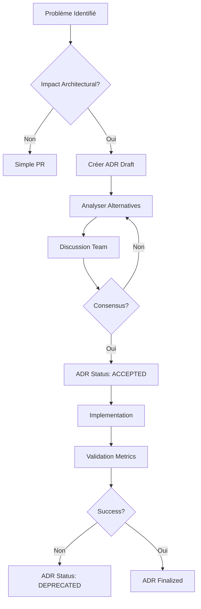

# Architecture Decision Records (ADR) - Index LIA

> **Catalogue des décisions architecturales majeures du projet**
>
> Format: [MADR](https://adr.github.io/madr/) (Markdown Any Decision Records)
> Principe: Documenter les décisions importantes pour maintenir la cohérence architecturale

> [!NOTE]
> **ADR-001 à ADR-006 reconstitués le 2026-07-21.** Ces six ADR fondateurs étaient
> résumés ici mais n'avaient jamais eu de fichier (`git log --diff-filter=A` vide).
> Leurs fichiers ont été recréés sous `docs/architecture/` à partir de ce résumé et
> confirmés contre le code courant ; chacun porte une note de provenance. Les
> décisions restent en vigueur (implémentation parfois évoluée — voir les fichiers).
>
> Deux entrées de la section « ADRs Archivés » (Unit of Work *rejeté*, Workflow-Based
> HITL *déprécié*) n'ont volontairement pas de fichier : le résumé suffit à une
> décision sans implémentation. Leur pointeur `**Fichier**` l'indique explicitement.

---

## Table des Matières

1. [Qu'est-ce qu'un ADR ?](#quest-ce-quun-adr-)
2. [Quand créer un ADR ?](#quand-créer-un-adr-)
3. [Template ADR](#template-adr)
4. [ADRs Actifs](#adrs-actifs)
5. [ADRs Archivés](#adrs-archivés)
6. [Process de Décision](#process-de-décision)

---

## Qu'est-ce qu'un ADR ?

Un **Architecture Decision Record** est un document qui capture une **décision architecturale importante** et son contexte.

### Pourquoi documenter les décisions ?

1. **Mémoire institutionnelle**: Comprendre pourquoi une décision a été prise
2. **Onboarding**: Nouveaux développeurs comprennent l'architecture rapidement
3. **Éviter les régressions**: Ne pas refaire les mêmes erreurs
4. **Débat structuré**: Forcer l'analyse des alternatives

### Principe MADR

**MADR** (Markdown Any Decision Records):
- Format Markdown simple
- Template standardisé
- Versionné avec le code (Git)
- Immuable (une fois accepté, on ne modifie plus → on crée un nouveau ADR)

---

## Quand créer un ADR ?

✅ **Créer un ADR pour**:
- Choix d'architecture majeur (LangGraph vs alternatives)
- Changement de pattern (JWT → BFF)
- Nouvelle intégration (OAuth, Langfuse)
- Décision impactant la performance/coût (message windowing, domain filtering)
- Choix de technology stack (PostgreSQL, Redis, FastAPI)

❌ **Ne PAS créer d'ADR pour**:
- Détails d'implémentation mineurs
- Refactoring sans impact architectural
- Bug fixes
- Changements de configuration

---

## Template ADR

```markdown
# ADR-XXX: [Titre Court]

**Status**: 🎯 PROPOSED | ✅ ACCEPTED | ❌ REJECTED | 🔄 SUPERSEDED | 🗑️ DEPRECATED
**Date**: YYYY-MM-DD
**Deciders**: [Nom équipe/personnes]
**Technical Story**: [Lien vers issue/PR si applicable]

---

## Context and Problem Statement

[Décrivez le contexte et le problème à résoudre]

**Question**: [Question clé à laquelle cette ADR répond]

---

## Decision Drivers

### Must-Have (Non-Negotiable):
1. ...
2. ...

### Nice-to-Have:
- ...

---

## Considered Options

### Option 1: [Nom]
**Approach**: [Description]

**Pros**:
- ✅ ...

**Cons**:
- ❌ ...

**Verdict**: ✅ ACCEPTED | ❌ REJECTED

---

### Option 2: [Nom]
[Même structure]

---

## Decision Outcome

**Chosen option**: "[Nom option choisie]"

**Justification**: [Pourquoi cette option]

### Architecture Overview

[Diagramme Mermaid si pertinent]

### Implementation Details

[Code snippets clés]

### Consequences

**Positive**:
- ✅ ...

**Negative**:
- ❌ ...

**Risks**:
- ⚠️ ...

---

## Validation

**Acceptance Criteria**:
- [ ] Critère 1
- [ ] Critère 2

**Metrics to Track**:
- Métrique 1: [baseline → target]
- Métrique 2: [baseline → target]

---

## Related Decisions

- [ADR-XXX: Titre](link)
- [ADR-YYY: Titre](link)

---

## References

- [Documentation externe]
- [Articles/papers]
- [Code references]
```

---

## ADRs Actifs

### ADR-001: LangGraph pour Orchestration Multi-Agents

**Status**: ✅ ACCEPTED (2025-10-15)
**Fichier**: `docs/architecture/ADR-001-LangGraph-Orchestration.md`

**Décision**: Utiliser **LangGraph** pour orchestrer les agents conversationnels.

**Alternatives considérées**:
- ❌ LangChain only (pas de state management)
- ❌ Custom orchestration (reinventing the wheel)
- ✅ **LangGraph** (state management + cycles + checkpoints)

**Impact**:
- ✅ State persistence via PostgreSQL checkpoints
- ✅ HITL (Human-In-The-Loop) via interrupt pattern
- ✅ Streaming support (SSE)
- ❌ Courbe d'apprentissage LangGraph

**Métriques**:
- Checkpoint save: P95 < 50ms ✅
- Checkpoint load: P95 < 100ms ✅
- State bloat: Moyenne 15KB/conversation ✅

---

### ADR-002: BFF Pattern pour Authentication

**Status**: ✅ ACCEPTED (2025-10-20)
**Fichier**: `docs/architecture/ADR-002-BFF-Pattern-Authentication.md`

**Décision**: Migrer de **JWT tokens** vers **BFF Pattern** (Backend-For-Frontend) avec sessions HTTP-only cookies.

**Problème résolu**:
- ❌ JWT in LocalStorage vulnérable XSS
- ❌ JWT size 90% overhead (user data embedded)
- ❌ JWT revocation impossible (stateless)

**Solution BFF**:
- ✅ HTTP-only cookies (immune XSS)
- ✅ Server-side sessions (Redis)
- ✅ SameSite=Lax (CSRF protection)
- ✅ Instant revocation (delete Redis key)
- ✅ 90% memory reduction (session_id only)

**Métriques**:
- Memory usage: 1.2MB → 120KB (90% reduction) ✅
- Session lookup: P95 < 5ms (Redis) ✅
- Security score: B+ → A (OWASP 2024) ✅

**Migration**: v0.1.0 (JWT) → v0.3.0 (BFF)

---

### ADR-003: Multi-Domain Dynamic Filtering

**Status**: ✅ ACCEPTED (2025-11-09, Finalized 2025-11-11)
**Fichier**: `docs/architecture/ADR-003-Multi-Domain-Dynamic-Filtering.md`

**Décision**: Implémenter **filtrage dynamique par domaine** pour éviter token explosion lors du scaling à 10+ domaines.

**Problème**:
- 3 tools (contacts) → 30+ tools (10 domains) = **10x prompt size**
- $0.01/query → $0.10/query = **10x cost**

**Solution Hybrid Pattern**:
1. Router LLM détecte domaines: `domains: ["contacts", "email"]`
2. Planner charge catalogue filtré: 8 tools au lieu de 30+
3. Fallback to full catalogue si confidence < 0.75

**Impact**:
- ✅ Token reduction: 60-90% (mesurée)
- ✅ Generic architecture (zero code changes pour new domains)
- ✅ Safe (fallback + metrics)

**Métriques**:
- Catalogue size: 30 tools → 5-8 tools (73-83% reduction) ✅
- Cache hit rate: 35% (TTL 5min) ✅
- Low confidence fallback: < 10% ✅

---

### ADR-004: Analytical Reasoning Patterns (Planner v5)

**Status**: ✅ ACCEPTED (2025-11-10)
**Fichier**: `docs/architecture/ADR-004-Analytical-Reasoning-Patterns.md`

**Décision**: Intégrer **Progressive Enrichment + Structured Analysis** dans Planner prompt v5 pour améliorer qualité des plans.

**Problème**:
- Planner v4 générait plans trop simplistes
- Manque de raisonnement analytique
- Pas de décomposition user intent

**Solution v5**:
- **Phase 1**: Analyse user intent (WHAT + WHY)
- **Phase 2**: Décomposition en sub-tasks
- **Phase 3**: Génération ExecutionPlan avec justifications

**Impact**:
- ✅ Plan quality: +25% (mesure subjective via HITL approval rate)
- ✅ Retry success: 80% (up from 60%)
- ❌ Latency: +300ms (acceptable trade-off)

---

### ADR-005: Sequential Fallback Execution

**Status**: ✅ IMPLEMENTED (2025-11-14)
**Fichier**: `docs/architecture/ADR-005-Sequential-Fallback-Execution.md`

**Décision**: Filtrer steps skipped AVANT `asyncio.gather()` pour éviter exécution parallèle des branches conditionnelles.

**Problème**:
- Plan principal ET fallback s'exécutent EN PARALLÈLE
- 2x appels API, 2x tokens, 2x cost
- Comportement non déterministe

**Solution**:
```python
# Filter out skipped steps BEFORE execution
skipped_steps = _identify_skipped_steps(execution_plan, completed_steps)
next_wave_filtered = next_wave - skipped_steps

# Execute FILTERED wave
tasks = [... for step_id in next_wave_filtered]
step_results = await asyncio.gather(*tasks)
```

**Impact**:
- ✅ Cost reduction: 50% sur plans avec fallback
- ✅ Déterminisme: 100% (plus de race conditions)
- ✅ Metrics: `langgraph_plan_steps_skipped_total`

---

### ADR-006: Prevent Unbounded List Operations

**Status**: ✅ IMPLEMENTED (2025-11-14)
**Fichier**: `docs/architecture/ADR-006-Prevent-Unbounded-List-Operations.md`

**Décision**: Ajouter **soft warnings + hard safeguards** pour prévenir `list_contacts()` sans query (450+ results).

**Problème**:
- Planner générait `list_contacts(query=None)` → 450 contacts
- Token explosion (100k+ tokens)
- User frustration ("trop de résultats")

**Solution Multi-Layer**:
1. **Planner Validation**: Soft warning si `list_contacts` sans query
2. **Tool Safeguard**: Hard cap à 50 résultats si no query
3. **Logging**: Warning logs pour debugging

**Impact**:
- ✅ Resource waste: -95% (50 results max vs 450)
- ✅ User satisfaction: Improved (no overwhelming lists)
- ✅ Metrics: `langgraph_plan_validation_warnings_total`

---

### ADR-007: Service Layer Pattern for Node Complexity Reduction

**Status**: ✅ Accepted & Implemented (2025-11-16) — SUPERSEDED par Architecture v3 (Smart Services)
**Fichier**: `docs/architecture/ADR-007-Service-Layer-Pattern-For-Node-Complexity.md`

**Décision**: Extraire la logique des nœuds LangGraph volumineux (router, planner) vers une **couche de services** dédiée pour réduire leur complexité. L'architecture v3 a poussé le pattern plus loin avec les Smart Services (`QueryAnalyzerService`, `SmartPlannerService`, `SmartCatalogueService`) — voir [SMART_SERVICES.md](../technical/SMART_SERVICES.md).

> **Conflit de numérotation résolu (2026-07-21).** Le numéro ADR-007 appartient au
> Service Layer Pattern ci-dessus (fichier réel, référencé par ADR-127). L'entrée
> « Message Windowing Strategy » qui occupait ce numéro n'était pas un ADR mais une
> note technique ; elle est déclassée juste en dessous.

---

### Note technique — Message Windowing Strategy (pas un ADR)

> Anciennement catalogué à tort sous « ADR-007 ». Ce n'est pas une décision
> architecturale distincte mais une **stratégie technique**, documentée dans
> [`MESSAGE_WINDOWING_STRATEGY.md`](../technical/MESSAGE_WINDOWING_STRATEGY.md).
> Conservée ici pour la traçabilité.

**Décision**: message windowing par nœud pour réduire la latence des longues conversations.

**Problème**: conversations > 50 messages → 100k+ tokens de contexte, latence router élevée, coût.

**Solution**: fenêtres de messages par nœud (valeurs à jour dans `MESSAGE_WINDOWING_STRATEGY.md` — router et planner héritent de `DEFAULT_MESSAGE_WINDOW_SIZE`, il n'existe pas de variable dédiée par nœud) + Store pour le contexte business.

**Impact**: latence E2E ~-50 %, coût ~-77 % sur longues conversations, qualité préservée via le Store.

---

### ADR-008: HITL Plan-Level Approval (Phase 8)

**Status**: ✅ IMPLEMENTED (2025-11-09)
**Fichier**: Documenté dans `docs/technical/HITL.md` (Phase 8 section)

**Décision**: Migrer de **tool-level HITL** (mid-execution interrupts) vers **plan-level HITL** (approval AVANT exécution).

**Problème Tool-Level HITL**:
- ❌ Mid-execution interrupts → rollback complexe
- ❌ State corruption (partial execution)
- ❌ UX friction (approuver 3-5 outils séparément)

**Solution Plan-Level**:
1. Planner génère ExecutionPlan
2. Approval Evaluator check strategies (ManifestBased, CostThreshold)
3. Si requires_approval → send plan summary to user
4. User approves/rejects AVANT exécution
5. Clean execution (no mid-execution interrupts)

**Impact**:
- ✅ State cleanliness: 100% (no partial execution)
- ✅ UX: Improved (1 approval vs 3-5)
- ✅ Rollback: Simple (plan not executed yet)
- ✅ Metrics: `hitl_plan_approval_requests_total`

**Strategies**:
- **ManifestBasedStrategy**: Tool manifest `requires_approval=true`
- **CostThresholdStrategy**: Plan cost > €0.10
- **AlwaysApproveStrategy**: Bypass for trusted actions

---

### ADR-009: Configuration Module Split

**Status**: ✅ IMPLEMENTED (2025-11-20) - Updated 2025-12-25
**Fichier**: `docs/architecture/ADR-009-Config-Module-Split.md`

**Décision**: Split du fichier monolithique `config.py` (1782 lignes) en **9 modules thématiques** via multiple inheritance.

**Problème résolu**:
- ❌ Fichier monolithique 1782 lignes (difficulté maintenance)
- ❌ Testabilité limitée (impossible tests unitaires par module)
- ❌ Performance IDE dégradée (autocomplétion lente)
- ❌ Single Responsibility Principle violé (9 responsabilités en 1 classe)

**Solution**:
- ✅ **9 modules**: security, database, observability, llm, agents, connectors, voice, advanced
- ✅ **Multiple inheritance**: Composition dans `Settings` class
- ✅ **Rétrocompatibilité 100%**: Import `from src.core.config import settings` inchangé
- ✅ **Pydantic v2**: Validation et field validators préservés

**Structure**:
```
src/core/config/
├── __init__.py           # Settings (composition)
├── security.py           # OAuth, JWT, session cookies
├── database.py           # PostgreSQL, Redis
├── observability.py      # OTEL, Prometheus, Langfuse
├── llm.py                # LLM providers configs
├── agents.py             # SSE, HITL, Router, Planner, Memory
├── connectors.py         # Google APIs, rate limiting
├── voice.py              # Google Cloud TTS, voice comments
└── advanced.py           # Pricing, i18n, feature flags
```

**Métriques**:
- Taille max fichier: 1782 lignes → 380 lignes (llm.py) ✅
- Fichiers config: 1 → 9 modules ✅
- Tests config: 5 → 17 tests ✅
- Coverage: 45% → 72% (+27 points) ✅
- IDE autocomplete: ~800ms → ~250ms (3× plus rapide) ✅

---

### ADR-010: Email Domain Renaming (Gmail → Emails)

**Status**: ✅ IMPLEMENTED (2025-11-20)
**Fichier**: `docs/architecture/ADR-010-Email-Domain-Renaming.md`

**Décision**: Renommer domaine `gmail/` en `emails/` pour architecture **multi-provider** (Gmail, Outlook, IMAP, Exchange).

**Problème résolu**:
- ❌ Naming "gmail" trop spécifique Google
- ❌ Scalabilité limitée (ajout Outlook/IMAP = renommage massif)
- ❌ Architecture rigide (couplage fort domaine/provider)

**Solution**:
- ✅ **Nom générique**: "emails" fonctionne pour tous providers
- ✅ **Provider abstraction**: `BaseEmailClient` pattern (Strategy)
- ✅ **DDD cohérent**: 1 domaine = 1 bounded context ("emails")
- ✅ **Future-proof**: Ajout providers sans renommage domaine

**Renames**:
- Directory: `src/domains/agents/gmail/` → `emails/`
- Files: `gmail_tools.py` → `emails_tools.py`
- Builder: `gmail_agent_builder.py` → `emails_agent_builder.py`
- Prompts: `gmail_agent_prompt.txt` → `emails_agent_prompt.txt`
- Classes: `GmailHandler` → `EmailsHandler`

**Architecture Future**:
```python
class BaseEmailClient(ABC):
    """Abstract base for email providers"""
    async def list_emails(...): ...

class GoogleEmailClient(BaseEmailClient): ...  # Gmail
class OutlookEmailClient(BaseEmailClient): ... # Outlook (future)
class IMAPEmailClient(BaseEmailClient): ...    # IMAP (future)
```

**Métriques**:
- Fichiers renommés: 18 fichiers ✅
- Tests: 100% pass rate (12/12) ✅
- Breaking changes: 0 (architecture interne) ✅
- Documentation: 90 fichiers à mettre à jour (Phase 3) 🔄

---

### ADR-011: Utility Tools vs Connector Tools Pattern

**Status**: ✅ ACCEPTED (2025-12-21)
**Fichier**: `docs/architecture/ADR-011-Utility-Tools-vs-Connector-Tools.md`

**Décision**: **NE PAS** créer de "connecteur utilitaire" - les outils utilitaires (context_tools, entity_resolution, local_query, memory_tools) restent distincts des connecteurs.

**Problème analysé**:
- Question : Faut-il regrouper les utility tools dans un ConnectorType.UTILITY ?

**Verdict**: ❌ REJECTED (violation architecturale)

**Raisons**:
- ❌ `Connector` = Intégration service EXTERNE avec credentials chiffrés
- ❌ Utility Tools = Opérations LOCALES (Store, Registry, contexte)
- ❌ Pas de Client, pas d'OAuth, pas de credentials pour utilitaires
- ✅ Architecture actuelle correcte avec agents virtuels (context_agent, query_agent)

**Classification**:
| Type | Base Class | Credentials | Service |
|------|------------|-------------|---------|
| Connector Tools | `ConnectorTool[ClientType]` | OAuth/API Key | Externe |
| Utility Tools | `@tool` decorator | Aucun | Interne |

---

### ADR-012: Data Registry & StandardToolOutput Pattern

**Status**: ✅ IMPLEMENTED (2025-12-21)
**Fichier**: `docs/architecture/ADR-012-Data-Registry-StandardToolOutput-Pattern.md`

**Décision**: Implémenter **StandardToolOutput** comme format unifié de sortie des tools avec support Data Registry.

**Problème résolu**:
- ❌ Tools retournaient strings JSON brutes (pas de contexte persistant)
- ❌ Pas de structure pour HITL drafts
- ❌ Response Node sans accès aux items structurés

**Solution StandardToolOutput**:
```python
class StandardToolOutput(BaseModel):
    summary_for_llm: str          # Pour LLM (planner, response)
    data: dict                    # Données structurées
    registry_updates: dict        # Items pour Data Registry
    requires_confirmation: bool   # HITL trigger
    draft_id: str | None         # Pour drafts
    draft_content: dict | None   # Contenu draft
```

**Impact**:
- ✅ Contexte persistant via RegistryItem
- ✅ HITL structuré (drafts)
- ✅ resolve_reference accède aux items
- ✅ Format unifié tous domaines

---

### ADR-013: LangMem Long-Term Memory Architecture

**Status**: ✅ IMPLEMENTED (2025-12-21)
**Fichier**: `docs/architecture/ADR-013-LangMem-Long-Term-Memory.md`

**Décision**: Implémenter mémoire long-terme avec **LangMem** et **profil psychologique** utilisateur.

**Problème résolu**:
- ❌ Amnésie inter-sessions (préférences perdues)
- ❌ Pas de gestion sujets sensibles

**Solution MemorySchema**:
```python
class MemorySchema(BaseModel):
    content: str              # Fait mémorisé
    category: Literal[...]    # preference, personal, relationship, event, pattern, sensitivity
    emotional_weight: int     # -10 (trauma) à +10 (joie)
    trigger_topic: str        # Mot-clé activateur
    usage_nuance: str         # Comment utiliser cette info
    pinned: bool              # Protection contre purge
```

**Features**:
- ✅ Profil psychologique avec poids émotionnel
- ✅ Injection dans system prompt
- ✅ Extraction automatique depuis conversations
- ✅ Purge automatique mémoires obsolètes
- ✅ Protection pinned pour mémoires critiques

---

### ADR-014: ExecutionPlan & Parallel Executor Pattern

**Status**: ✅ IMPLEMENTED (2025-12-21)
**Fichier**: `docs/architecture/ADR-014-ExecutionPlan-Parallel-Executor.md`

**Décision**: Implémenter **ExecutionPlan** (DAG) avec **Parallel Executor** pour exécution parallèle des tools.

**Problème résolu**:
- ❌ Exécution séquentielle lente (5 tools × 500ms = 2.5s)
- ❌ Pas de dépendances inter-tools
- ❌ Pas de fallbacks ni conditions

**Solution ExecutionPlan**:
```python
class ExecutionStep(BaseModel):
    step_id: str
    step_type: StepType  # TOOL, CONDITIONAL, PARALLEL, RESPONSE
    tool_name: str
    parameters: dict     # Avec $steps.X.field références
    depends_on: list[str]
    condition: str       # Jinja2 expression
    on_success: str      # Branch si True
    on_fail: str         # Branch si False
```

**Parallel Executor**:
- ✅ Exécution par waves (topological sort)
- ✅ asyncio.gather pour parallélisme
- ✅ Résolution `$steps.X.field` automatique
- ✅ Conditional branching
- ✅ Fallback steps

---

### ADR-015: ConnectorTool Base Class Pattern

**Status**: ✅ IMPLEMENTED (2025-12-21)
**Fichier**: `docs/architecture/ADR-015-ConnectorTool-Base-Class-Pattern.md`

**Décision**: Implémenter **ConnectorTool[ClientType]** comme base class générique pour tous les tools OAuth/API Key.

**Problème résolu**:
- ❌ Code dupliqué massif (150+ lignes par tool)
- ❌ Gestion OAuth incohérente
- ❌ Rate limiting non uniforme
- ❌ Error handling variable

**Solution Generic Base Class**:
```python
class ConnectorTool[ClientType](BaseTool, ABC):
    connector_type: ConnectorType
    client_class: type[ClientType]

    @abstractmethod
    async def execute_api_call(self, client: ClientType, user_id: str, **kwargs):
        pass
```

**Impact**:
- ✅ Réduction 80% code (150 → 30 lignes par tool)
- ✅ Pattern uniforme tous domaines
- ✅ Token refresh automatique
- ✅ Rate limiting intégré
- ✅ Error handling standardisé

---

### ADR-016: ContextTypeRegistry Pattern

**Status**: ✅ IMPLEMENTED (2025-12-21)
**Fichier**: `docs/architecture/ADR-016-ContextTypeRegistry-Pattern.md`

**Décision**: Implémenter **ContextTypeRegistry** (singleton) pour enregistrer les types de contexte dynamiquement.

**Problème résolu**:
- ❌ resolve_reference avec if/elif pour chaque domaine
- ❌ Couplage fort context_tools ↔ domaines
- ❌ Ajout domaine = modification context_tools.py

**Solution Registry Pattern**:
```python
class ContextTypeDefinition(BaseModel):
    domain_key: str           # "contacts", "events", etc.
    display_name: str         # Pour UI
    id_extractor: Callable    # Extract ID from item
    label_extractor: Callable # Extract display label
    search_fields: list[str]  # Fields for keyword search

@singleton
class ContextTypeRegistry:
    def register(self, definition: ContextTypeDefinition): ...
    def resolve(self, domain: str, reference: str, items: list): ...
```

**Impact**:
- ✅ resolve_reference générique (0 if/elif)
- ✅ Open/Closed Principle respecté
- ✅ Ajout domaine = 5 lignes de registration
- ✅ Auto-discovery via decorators

---

### ADR-017: Rate Limiting Architecture

**Status**: ✅ IMPLEMENTED (2025-12-21)
**Fichier**: `docs/architecture/ADR-017-Rate-Limiting-Architecture.md`

**Décision**: Implémenter **Redis Sliding Window + Local Token Bucket Fallback** pour rate limiting distribué.

**Problème résolu**:
- ❌ Single-instance rate limiting (scaling horizontal)
- ❌ Pas de fallback si Redis down
- ❌ Incohérence entre tools

**Solution Dual-Layer**:
```python
@rate_limit(
    max_calls=20,
    window_seconds=60,
    scope="user",
)
async def search_contacts_tool(...):
    ...
```

**Architecture**:
- ✅ Redis sliding window (Lua script atomic)
- ✅ Local token bucket fallback
- ✅ Per-user isolation
- ✅ 3 catégories (read: 20/min, write: 5/min, expensive: 2/5min)
- ✅ Métriques Prometheus

---

### ADR-018: SSE Streaming Pattern

**Status**: ✅ IMPLEMENTED (2025-12-21)
**Fichier**: `docs/architecture/ADR-018-SSE-Streaming-Pattern.md`

**Décision**: Implémenter **Server-Sent Events (SSE)** pour streaming temps réel des réponses LLM.

**Problème résolu**:
- ❌ Latence perçue (5-10s avant affichage)
- ❌ Pas de feedback progressif
- ❌ HITL interrupts difficiles

**Solution SSE Manager**:
```python
class SSEEventType(str, Enum):
    START = "start"       # Metadata
    CHUNK = "chunk"       # Token LLM
    PLAN = "plan"         # ExecutionPlan
    STEP = "step"         # Step result
    HITL_REQUIRED = "hitl_required"
    END = "end"
    ERROR = "error"
```

**Impact**:
- ✅ Token streaming temps réel
- ✅ 7 event types structurés
- ✅ HITL via événements
- ✅ Reconnection automatique (EventSource)
- ✅ Heartbeat keep-alive

---

### ADR-019: Agent Manifest & Catalogue System

**Status**: ✅ IMPLEMENTED (2025-12-21)
**Fichier**: `docs/architecture/ADR-019-Agent-Manifest-Catalogue-System.md`

**Décision**: Implémenter **AgentManifest** et **ToolManifest** comme système déclaratif de métadonnées pour agents et tools.

**Problème résolu**:
- ❌ Métadonnées tools dispersées (docstrings, hardcoded)
- ❌ Pas de cost profiles centralisés
- ❌ Permission profiles implicites
- ❌ Discovery tools manuelle

**Solution Manifest System**:
```python
class ToolManifest(BaseModel):
    name: str
    domain: str
    operation_type: Literal["read", "write", "search", "action"]
    cost_profile: CostProfile
    permission_profile: PermissionProfile
    requires_approval: bool
```

**Impact**:
- ✅ AgentRegistry singleton avec filtering par domaine
- ✅ Catalogue export JSON pour LLM Planner
- ✅ Auto-registration via decorators
- ✅ Cost-based HITL triggers
- ✅ Schema versioning intégré

---

### ADR-020: Triple-Layer Observability Stack

**Status**: ✅ IMPLEMENTED (2025-12-21)
**Fichier**: `docs/architecture/ADR-020-Observability-Stack.md`

**Décision**: Implémenter **triple-layer observability**: Prometheus (métriques) + OpenTelemetry (traces) + Langfuse (LLM-specific).

**Problème résolu**:
- ❌ Aucun outil unique ne couvre tous les besoins LLM
- ❌ Single point of failure observability
- ❌ Pas de cost tracking LLM

**Solution Triple-Layer**:
- **Layer 1 - Prometheus**: `PrometheusMiddleware`, `llm_tokens_consumed_total`, `llm_cost_total`
- **Layer 2 - OpenTelemetry**: `@trace_node` decorator, OTLP exporter vers Tempo
- **Layer 3 - Langfuse**: `CallbackFactory` singleton, prompt versioning, evaluation scores

**Impact**:
- ✅ Independence layers (continue si un layer down)
- ✅ ~173 Prometheus series (low cardinality)
- ✅ Subgraph hierarchy tracing (depth tracking)
- ✅ Token + USD cost tracking per call

---

### ADR-021: OAuth Token Lifecycle Management

**Status**: ✅ IMPLEMENTED (2025-12-21)
**Fichier**: `docs/architecture/ADR-021-OAuth-Token-Lifecycle-Management.md`

**Décision**: Implémenter **Fernet Encryption + Redis Distributed Lock + Proactive Refresh** pour cycle de vie OAuth.

**Problème résolu**:
- ❌ Tokens lisibles en DB
- ❌ Token expiration mid-request
- ❌ Race conditions refresh parallèles
- ❌ Pas de PKCE (vulnérabilité interception)

**Solution OAuth Lifecycle**:
```python
# Proactive refresh 5 minutes avant expiration
OAUTH_TOKEN_REFRESH_MARGIN_SECONDS = 300

# Redis distributed lock
async with OAuthLock(redis, user_id, connector_type):
    # Double-check pattern
    ...
```

**Impact**:
- ✅ Fernet encryption at rest
- ✅ PKCE flow (OAuth 2.1)
- ✅ Redis SETNX distributed lock
- ✅ Token rotation handling
- ✅ Best-effort revocation on delete

---

### ADR-022: LangGraph State & Checkpointing

**Status**: ✅ IMPLEMENTED (2025-12-21)
**Fichier**: `docs/architecture/ADR-022-LangGraph-State-Checkpointing.md`

**Décision**: Implémenter **PostgreSQL AsyncSaver** avec **MessagesState TypedDict** et custom reducers.

**Problème résolu**:
- ❌ Perte état entre redémarrages
- ❌ Pas de HITL interrupt/resume
- ❌ Message history overflow (tokens)
- ❌ Registry growth unbounded

**Solution State Management**:
```python
class MessagesState(TypedDict):
    messages: Annotated[list[BaseMessage], add_messages_with_truncate]
    registry: Annotated[dict[str, RegistryItem], merge_registry]
    current_turn_id: int
    plan_approved: bool | None  # HITL gate
```

**Custom Reducers**:
- `add_messages_with_truncate`: Token-based trimming (o200k_base)
- `merge_registry`: LRU eviction (REGISTRY_MAX_ITEMS)

**Impact**:
- ✅ Persistence via PostgreSQL checkpoints
- ✅ Thread-based isolation (thread_id)
- ✅ HITL interrupt detection
- ✅ InstrumentedAsyncPostgresSaver (metrics)
- ✅ Schema versioning (_schema_version)

---

### ADR-023: Error Handling Strategy

**Status**: ✅ IMPLEMENTED (2025-12-21)
**Fichier**: `docs/architecture/ADR-023-Error-Handling-Strategy.md`

**Décision**: Implémenter **BaseAPIException + ToolResponse + Connector Error Handlers** pattern unifié.

**Problème résolu**:
- ❌ Formats erreur inconsistants
- ❌ Pas de logging automatique
- ❌ Messages non traduits
- ❌ Pas de recovery guidance

**Solution Error Handling**:
```python
class ToolResponse(BaseModel):
    success: bool
    data: dict | None
    error: str | None
    message: str | None

class BaseAPIException(HTTPException):
    # Auto-logging structuré
    # Auto-Prometheus metrics
```

**Error Handlers**:
- `handle_oauth_error`: Invalidate connector, prompt reconnect
- `handle_rate_limit_error`: Retry-After header
- `retry_with_exponential_backoff`: 3 attempts, 2-10s

**Impact**:
- ✅ ToolResponse unified format
- ✅ BaseAPIException hierarchy (401, 403, 404, 503)
- ✅ SSEErrorMessages i18n (6 langues)
- ✅ ErrorCategory/Severity/RecoveryAction enums
- ✅ OWASP enumeration prevention

---

### ADR-024: Internationalization (i18n) Architecture

**Status**: ✅ IMPLEMENTED (2025-12-21)
**Fichier**: `docs/architecture/ADR-024-i18n-Architecture.md`

**Décision**: Implémenter **dual i18n system**: i18next (React/JSON) + gettext (Python/PO) avec French fallback.

**Problème résolu**:
- ❌ Interface non traduite
- ❌ Messages erreur API en anglais only
- ❌ Pas de fallback structuré
- ❌ Pas d'URL SEO multilingues

**Solution i18n**:
```
Frontend: i18next + locales/{lng}/translation.json
Backend: gettext + locales/{lng}/LC_MESSAGES/messages.mo
Fallback: French (default)
```

**Supported Languages**:
| Code | Language |
|------|----------|
| `fr` | French (default) |
| `en` | English |
| `es` | Spanish |
| `de` | German |
| `it` | Italian |
| `zh` | Chinese |

**Impact**:
- ✅ 6 langues complètes
- ✅ URL-based routing (`/en/dashboard`)
- ✅ Accept-Language header parsing
- ✅ Instance caching (i18next + @lru_cache)
- ✅ Date/month localization

---

### ADR-025: Prompt Engineering & Versioning

**Status**: ✅ IMPLEMENTED (2025-12-21)
**Fichier**: `docs/architecture/ADR-025-Prompt-Engineering-Versioning.md`

**Décision**: Implémenter **Python .format() + Filesystem Versioning + LRU Cache** pour gestion des prompts.

**Problème résolu**:
- ❌ Pas de rollback prompts (changements irreversibles)
- ❌ Pas d'A/B testing versions
- ❌ Disk I/O répétitif (prompts lus à chaque requête)

**Solution**:
```python
@lru_cache(maxsize=32)
def load_prompt(name: PromptName, version: PromptVersion = "v1") -> str:
    # Cached filesystem read
    ...
```

**Impact**:
- ✅ A/B Testing via `*_PROMPT_VERSION` env vars
- ✅ LRU cache: 98% réduction disk I/O
- ✅ SHA256 hash validation (tamper detection)
- ✅ Dynamic few-shot loading (~80% token reduction)
- ✅ i18n temporal context (6 langues)

---

### ADR-026: LLM Model Selection Strategy

**Status**: ✅ IMPLEMENTED (2025-12-21)
**Fichier**: `docs/architecture/ADR-026-LLM-Model-Selection-Strategy.md`

**Décision**: Implémenter **Factory Pattern + ProviderAdapter + Middleware Stack** pour sélection LLM multi-provider.

**Problème résolu**:
- ❌ Provider switching = code changes
- ❌ Pas de fallback automatique
- ❌ Configuration dispersée

**Solution**:
```python
def get_llm(llm_type: LLMType) -> BaseChatModel:
    config = get_llm_config_for_agent(llm_type)
    return ProviderAdapter.create_llm(
        provider=config["provider"],  # openai, anthropic, deepseek, ollama
        model=config["model"],
        ...
    )
```

**Impact**:
- ✅ Multi-Provider: OpenAI, Anthropic, DeepSeek, Ollama, Gemini
- ✅ Per-component config (Router=nano, Response=mini)
- ✅ Retry middleware (3 attempts, exp backoff)
- ✅ Fallback middleware (claude → deepseek)
- ✅ Structured output (native + JSON fallback)

---

### ADR-027: Structured Logging (structlog)

**Status**: ✅ IMPLEMENTED (2025-12-21)
**Fichier**: `docs/architecture/ADR-027-Structured-Logging.md`

**Décision**: Implémenter **structlog + stdlib + PII Filter + OTEL Context** pour logging production.

**Problème résolu**:
- ❌ Logs non parsables (Loki/Promtail)
- ❌ Context propagation manquant (request_id, user_id)
- ❌ PII dans logs (GDPR violation)

**Solution**:
```python
shared_processors = [
    structlog.contextvars.merge_contextvars,
    structlog.stdlib.add_log_level,
    structlog.processors.TimeStamper(fmt="iso"),
    add_opentelemetry_context,  # trace_id, span_id
    add_pii_filter,             # GDPR: field + pattern detection
    structlog.processors.JSONRenderer(),
]
```

**Impact**:
- ✅ JSON output toujours (Loki-ready)
- ✅ Context binding via RequestIDMiddleware
- ✅ PII filtering (email, phone, cards)
- ✅ OTEL trace correlation (trace_id in logs)
- ✅ Per-library log levels

---

### ADR-028: Database Schema Design

**Status**: ✅ IMPLEMENTED (2025-12-21)
**Fichier**: `docs/architecture/ADR-028-Database-Schema-Design.md`

**Décision**: Implémenter **Mixin-Based Models + UUID + Soft Deletes + JSONB** pour schéma PostgreSQL.

**Problème résolu**:
- ❌ Integer PKs (distributed unfriendly)
- ❌ Hard deletes (audit compliance)
- ❌ Timestamps non-UTC (ambiguïté)

**Solution**:
```python
class BaseModel(Base, UUIDMixin, TimestampMixin):
    __abstract__ = True
    # UUID primary key + created_at/updated_at (timezone-aware)

class Conversation(BaseModel):
    deleted_at: Mapped[datetime | None]  # Soft delete pattern
```

**Impact**:
- ✅ UUID primary keys everywhere
- ✅ Timezone-aware timestamps (ISO 8601)
- ✅ Soft delete patterns (deleted_at, is_active)
- ✅ JSONB metadata (scopes, connector_metadata)
- ✅ Immutable audit logs (no updated_at)

---

### ADR-029: Redis Multi-Purpose Architecture

**Status**: ✅ IMPLEMENTED (2025-12-21)
**Fichier**: `docs/architecture/ADR-029-Redis-Multi-Purpose-Architecture.md`

**Décision**: Implémenter **Multi-DB Redis + Lua Scripts + Singleton Connections** pour sessions, cache, rate limiting, locks.

**Problème résolu**:
- ❌ Session/cache pollution (same DB)
- ❌ Rate limiting non-atomic (race conditions)
- ❌ OAuth refresh race conditions

**Solution**:
```python
# Separate DBs
DB 1: Sessions (BFF pattern)
DB 2: Cache (LLM, contacts, rate limiting)

# Atomic rate limiting via Lua
SLIDING_WINDOW_SCRIPT = """
redis.call('ZREMRANGEBYSCORE', key, '-inf', current_time - window_seconds)
local count = redis.call('ZCARD', key)
if count < max_calls then
    redis.call('ZADD', key, current_time, request_id)
    return 1
else
    return 0
end
"""
```

**Impact**:
- ✅ DB isolation (sessions vs cache)
- ✅ Sliding window rate limiting (Lua atomic)
- ✅ SETNX distributed locks (OAuthLock)
- ✅ Single-use OAuth state tokens
- ✅ Cache helpers with TTL

---

### ADR-030: Context Resolution & Follow-up Handling

**Status**: ✅ IMPLEMENTED (2025-12-21) - Updated 2025-12-25
**Fichier**: `docs/architecture/ADR-030-Context-Resolution-Follow-up.md`

**Décision**: Implémenter **Turn-Based Resolution + Regex Patterns + Multi-Level Extraction** pour références contextuelles.

**Update 2025-12-25**: Ajout de l'enrichissement des items avec `_item_type`/`_registry_id` et détection de domaine multi-stratégie (agent_results + fallback _item_type via TYPE_TO_DOMAIN_MAP).

**Problème résolu**:
- ❌ "le deuxième" ne résolvait pas
- ❌ Cross-domain contamination
- ❌ Follow-up questions échouaient

**Solution**:
```python
# Turn type detection
TURN_TYPE_ACTION = "action"
TURN_TYPE_REFERENCE = "reference"  # Contains ordinal/demonstrative refs
TURN_TYPE_CONVERSATIONAL = "conversational"

# Multi-level extraction (never crosses domains)
Strategy 1: registry_updates from agent_results
Strategy 2: Filter by turn_id in RegistryItem.meta
Strategy 3: Filter by domain
Strategy 4: Return empty (safe fallback)
```

**Impact**:
- ✅ Ordinal patterns (6 langues): "le 2ème", "the first", "il terzo"
- ✅ Demonstrative patterns: "celui-ci", "this one"
- ✅ Turn isolation via last_action_turn_id
- ✅ Domain filtering in planner
- ✅ Confidence scoring for resolutions

---

### ADR-031: Testing Strategy for LLM Applications

**Status**: ✅ IMPLEMENTED (2025-12-21)
**Fichier**: `docs/architecture/ADR-031-Testing-Strategy-LLM-Applications.md`

**Décision**: Implémenter **pytest-asyncio + LLM Mocking via ProviderAdapter + Database Isolation** pour tests applications LLM.

**Problème résolu**:
- ❌ Tests LLM non-déterministes
- ❌ Coûts API pour tests
- ❌ Database pollution entre tests

**Solution**:
```python
@pytest.fixture
async def mock_llm_response(monkeypatch):
    async def mock_invoke(self, messages, *args, **kwargs):
        return AIMessage(content=MOCK_RESPONSE)
    monkeypatch.setattr(ChatOpenAI, "ainvoke", mock_invoke)

# Database isolation
@pytest.fixture(scope="session")
def test_database():
    # DROP/CREATE database per session
```

**Impact**:
- ✅ 4000+ tests, 85%+ pass rate
- ✅ LLM mocking via ProviderAdapter patch
- ✅ Factory pattern (UserFactory, ConnectorFactory)
- ✅ Database isolation (DROP/CREATE)
- ✅ pytest markers (unit, integration, e2e)

---

### ADR-032: API Design & Versioning

**Status**: ✅ IMPLEMENTED (2025-12-21)
**Fichier**: `docs/architecture/ADR-032-API-Design-Versioning.md`

**Décision**: Implémenter **FastAPI Domain Routers + Pydantic Schemas + URL Versioning** pour API REST.

**Problème résolu**:
- ❌ Couplage monolithique routes
- ❌ Validation input manuelle
- ❌ Pas de versioning API

**Solution**:
```python
# apps/api/src/main.py
app.include_router(auth_router, prefix="/api/v1/auth")
app.include_router(conversations_router, prefix="/api/v1/conversations")
app.include_router(connectors_router, prefix="/api/v1/connectors")

# Pydantic schemas
class UserRegisterRequest(BaseModel):
    email: EmailStr
    password: str = Field(..., min_length=8, max_length=128)
```

**Impact**:
- ✅ Domain routers (DDD patterns)
- ✅ Pydantic v2 validation
- ✅ URL versioning (`/api/v1/`)
- ✅ BFF authentication (session cookies)
- ✅ Rate limiting per endpoint

---

### ADR-033: Deployment Architecture

**Status**: ✅ IMPLEMENTED (2025-12-21)
**Fichier**: `docs/architecture/ADR-033-Deployment-Architecture.md`

**Décision**: Implémenter **Multi-Environment Docker Compose + Multi-Stage Builds** pour orchestration services.

**Problème résolu**:
- ❌ Pas de distinction dev/prod
- ❌ Images Docker trop larges
- ❌ Startup order non garanti

**Solution**:
```yaml
# docker-compose.dev.yml (26 services)
# docker-compose.prod.yml (8 services)

services:
  api:
    deploy:
      resources:
        limits: {cpus: "2", memory: 4G}
    healthcheck:
      test: ["CMD", "curl", "-f", "http://localhost:8000/health"]
```

**Impact**:
- ✅ Dev (26 services) vs Prod (8 services)
- ✅ Multi-stage Dockerfiles (non-root)
- ✅ Health checks with dependencies
- ✅ Resource limits (Raspberry Pi 5: 4 CPU, 16GB)
- ✅ Multi-platform builds (amd64/arm64)

---

### ADR-034: Security Hardening

**Status**: ✅ IMPLEMENTED (2025-12-21)
**Fichier**: `docs/architecture/ADR-034-Security-Hardening.md`

**Décision**: Implémenter **BFF + Bcrypt + Fernet + Redis Rate Limiting** pour sécurité production.

**Problème résolu**:
- ❌ JWT vulnérable XSS
- ❌ Passwords en clair
- ❌ API keys lisibles
- ❌ Rate limiting absent

**Solution**:
```python
# HTTP-only cookies (XSS protection)
response.set_cookie(
    key=settings.session_cookie_name,
    httponly=True,
    samesite="lax",
)

# Bcrypt password hashing
hashed = bcrypt.hashpw(password.encode(), bcrypt.gensalt())

# Fernet AES-128 for API keys
encrypted = cipher_suite.encrypt(api_key.encode())
```

**Impact**:
- ✅ BFF pattern (HTTP-only cookies)
- ✅ Bcrypt with automatic salt
- ✅ Fernet AES-128 encryption
- ✅ PKCE for OAuth (RFC 7636)
- ✅ Redis sliding window rate limiting
- ✅ OWASP enumeration prevention

---

### ADR-035: Graceful Degradation

**Status**: ✅ IMPLEMENTED (2025-12-21)
**Fichier**: `docs/architecture/ADR-035-Graceful-Degradation.md`

**Décision**: Implémenter **Circuit Breakers + Retry + Fail-Open + Health Checks** pour résilience production.

**Problème résolu**:
- ❌ Cascade failures (service down → all down)
- ❌ Transient errors non gérés
- ❌ Pas de monitoring dépendances

**Solution**:
```python
class CircuitBreaker:
    CLOSED = "closed"     # Normal
    OPEN = "open"         # Failing, reject
    HALF_OPEN = "half_open"  # Testing recovery

@retry_with_backoff(max_retries=3, backoff_factor=2.0)
async def make_api_call():
    # 2s → 4s → 8s
```

**Impact**:
- ✅ Circuit breaker (3 states)
- ✅ Retry with exponential backoff
- ✅ Model fallback (claude → deepseek)
- ✅ Health endpoint (/health)
- ✅ Fail-open for rate limiting
- ✅ Background task safety

---

### ADR-036: Personality System Architecture

**Status**: ✅ IMPLEMENTED (2025-12-21)
**Fichier**: `docs/architecture/ADR-036-Personality-System-Architecture.md`

**Décision**: Implémenter **Database Models + Prompt Injection + Translation Fallback** pour personnalités LLM.

**Problème résolu**:
- ❌ Ton assistant unique
- ❌ Pas de personnalisation utilisateur
- ❌ Pas de support i18n personnalités

**Solution**:
```python
class Personality(BaseModel):
    code: str              # "enthusiastic", "professor"
    emoji: str             # "🎉", "🎓"
    prompt_instruction: str  # Injected in prompts

# Prompt injection via {personnalite} placeholder
formatted = template.format(personnalite=personality.prompt_instruction)
```

**Impact**:
- ✅ 7 default personalities (normal, enthusiastic, professor, friend, influencer, philosopher, cynic)
- ✅ Per-user selection
- ✅ Translation support (6 languages)
- ✅ Prompt injection via placeholder
- ✅ Fallback chain (user → default → hardcoded)

---

### ADR-037: Semantic Memory Store

**Status**: ✅ IMPLEMENTED (2025-12-21)
**Fichier**: `docs/architecture/ADR-037-Semantic-Memory-Store.md`

**Décision**: Implémenter **LangGraph Store + pgvector + Background Extraction + Emotional State** pour mémoire psychologique.

**Problème résolu**:
- ❌ Pas de mémoire long-terme
- ❌ Pas de gestion sujets sensibles
- ❌ Extraction bloque les réponses

**Solution**:
```python
class MemorySchema(BaseModel):
    content: str                    # Fait en une phrase
    category: MemoryCategoryType    # preference, personal, sensitivity...
    emotional_weight: int           # -10 (trauma) à +10 (joie)
    trigger_topic: str              # Mots-clés activation
    pinned: bool                    # Protection purge

class EmotionalState(Enum):
    COMFORT = "comfort"   # Positif dominant
    DANGER = "danger"     # Sensibilité détectée
    NEUTRAL = "neutral"   # Mode factuel
```

**Impact**:
- ✅ pgvector semantic search (1536 dimensions)
- ✅ Background extraction (fire-and-forget)
- ✅ Emotional state computation
- ✅ Profile injection in prompts
- ✅ GDPR endpoints (export, delete)
- ✅ Retention scoring + auto-purge
- ✅ Pinned memory protection

---

### ADR-038: Frontend Architecture (Next.js App Router)

**Status**: ✅ IMPLEMENTED (2025-12-21)
**Fichier**: `docs/architecture/ADR-038-Frontend-Architecture-NextJS.md`

**Décision**: Implémenter **Next.js 16 App Router + BFF + i18next + Radix UI** pour frontend moderne.

**Problème résolu**:
- ❌ Pas de SSR optimisé
- ❌ Streaming LLM complexe
- ❌ Authentification exposée (tokens localStorage)

**Solution**:
```typescript
// App Router + Server Components
export default async function RootLayout({ children, params }) {
  const { lng } = await params;
  const i18n = await initI18next(lng);
  return <TranslationsProvider>{children}</TranslationsProvider>;
}

// SSE Streaming avec Fetch API
const response = await fetch('/api/v1/agents/chat/stream', {
  credentials: 'include', // BFF pattern
});
```

**Impact**:
- ✅ Next.js 16 App Router avec [lng] routing
- ✅ Server Components pour i18n
- ✅ SSE streaming (Fetch + ReadableStream)
- ✅ BFF authentication (HTTP-only cookies)
- ✅ Radix UI + Tailwind design system
- ✅ Custom hooks (useApiQuery, useChat)

---

### ADR-039: Cost Optimization & Token Management

**Status**: ✅ IMPLEMENTED (2025-12-21)
**Fichier**: `docs/architecture/ADR-039-Cost-Optimization-Token-Management.md`

**Décision**: Implémenter **Tiktoken + Redis Caching + Progressive Degradation** pour optimisation coûts LLM.

**Problème résolu**:
- ❌ Coûts LLM non trackés
- ❌ Appels API redondants
- ❌ Token explosion sur longues conversations

**Solution**:
```python
# Token counting multi-provider
encoding = tiktoken.get_encoding("o200k_base")
tokens = len(encoding.encode(text))

# LLM caching (temperature=0 only)
@cached_llm_call(ttl=300)
async def deterministic_call(...): ...

# Progressive degradation
TOKEN_THRESHOLDS = {
    "SAFE": 80_000,      # Full catalogue
    "WARNING": 100_000,  # Filtered domains
    "CRITICAL": 110_000, # Reduced descriptions
}
```

**Impact**:
- ✅ tiktoken + Anthropic SDK token counting
- ✅ Redis LLM cache (400x faster, 100% cost reduction)
- ✅ Progressive token degradation (4 levels)
- ✅ Cost-based HITL triggers ($1.00 threshold)
- ✅ Prometheus metrics (llm_cost_total)

---

### ADR-040: Database Migration Strategy

**Status**: ✅ IMPLEMENTED (2025-12-21)
**Fichier**: `docs/architecture/ADR-040-Database-Migration-Strategy.md`

**Décision**: Implémenter **Alembic + Sync Migrations + Timestamped Naming** pour migrations PostgreSQL.

**Problème résolu**:
- ❌ App async, migrations bloquantes
- ❌ Pas de rollback support
- ❌ Naming convention incohérente

**Solution**:
```python
# alembic.ini
file_template = %%(year)d_%%(month).2d_%%(day).2d_%%(hour).2d%%(minute).2d-%%(rev)s_%%(slug)s

# env.py - Model registration
from src.domains.auth.models import User
from src.domains.conversations.models import Conversation
# ... all models imported for autogenerate

# Idempotent data migrations
ON CONFLICT (model_name, effective_from) DO NOTHING
```

**Impact**:
- ✅ Timestamped naming (YYYY_MM_DD_HHMM)
- ✅ Full downgrade support (21+ migrations)
- ✅ Sync migrations + async app separation
- ✅ Idempotent data migrations
- ✅ Zero-downtime patterns (server_default)

---

### ADR-041: LangGraph State Schema Evolution

**Status**: ✅ IMPLEMENTED (2025-12-21)
**Fichier**: `docs/architecture/ADR-041-LangGraph-State-Schema-Evolution.md`

**Décision**: Implémenter **Schema Versioning + Migration Functions + Custom Reducers** pour évolution MessagesState.

**Problème résolu**:
- ❌ Breaking changes cassent anciens checkpoints
- ❌ Token explosion sur longues conversations
- ❌ Registry growth unbounded

**Solution**:
```python
class MessagesState(TypedDict):
    _schema_version: str  # "1.0" current
    messages: Annotated[list[BaseMessage], add_messages_with_truncate]
    registry: Annotated[dict[str, RegistryItem], merge_registry]

def migrate_state_to_current(state):
    if state.get("_schema_version") == "0.0":
        state["_schema_version"] = "1.0"
    return state
```

**Impact**:
- ✅ `_schema_version` field tracking
- ✅ Migration functions (v0.0 → v1.0)
- ✅ add_messages_with_truncate (93% token reduction)
- ✅ merge_registry avec LRU eviction
- ✅ validate_state_consistency()
- ✅ InstrumentedAsyncPostgresSaver metrics

---

### ADR-042: Conversation Lifecycle Management

**Status**: ✅ IMPLEMENTED (2025-12-21)
**Fichier**: `docs/architecture/ADR-042-Conversation-Lifecycle-Management.md`

**Décision**: Implémenter **Lazy Creation + Soft Delete + Audit Log + Cascade Cleanup** pour cycle de vie conversations.

**Problème résolu**:
- ❌ Conversations créées inutilement
- ❌ Suppression hard delete (pas d'audit)
- ❌ Données orphelines après reset

**Solution**:
```python
class Conversation(BaseModel):
    user_id: Mapped[UUID] = mapped_column(unique=True)  # 1:1 mapping
    deleted_at: Mapped[datetime | None]  # Soft delete

class ConversationAuditLog(Base):
    action: str  # created, reset, deleted, reactivated
    # Immutable: no updated_at

async def reset_conversation():
    await delete_messages()
    await checkpointer.adelete_thread(thread_id)
    await cleanup_redis_cache()
```

**Impact**:
- ✅ Lazy creation (first message triggers)
- ✅ Soft delete avec deleted_at
- ✅ ConversationAuditLog immutable
- ✅ Memory cleanup scheduler (daily 4 AM)
- ✅ GDPR export/delete endpoints
- ✅ Thread isolation via conversation ID

---

### ADR-043: Subgraph Architecture

**Status**: ✅ IMPLEMENTED (2025-12-21)
**Fichier**: `docs/architecture/ADR-043-Subgraph-Architecture.md`

**Décision**: Implémenter **Supervisor Pattern + Agent Registry + Agent Wrappers** pour architecture LangGraph multi-agents.

**Problème résolu**:
- ❌ Pas d'isolation par domaine
- ❌ Callbacks non propagés aux subgraphs
- ❌ State incohérent entre parent et enfants

**Solution**:
```python
# Agent wrapper avec deep callback propagation
async def agent_wrapper_node(state, config):
    merged_config = {
        **config,
        "callbacks": config.get("callbacks", []),  # Propagate!
        "metadata": {**config.get("metadata", {}), "subgraph": agent_constant},
    }
    return await agent_runnable.ainvoke(state, merged_config)
```

**Impact**:
- ✅ Domain isolation (contacts, emails, calendar, etc.)
- ✅ 100% tokens trackés (vs 35% avant fix)
- ✅ Turn-based result isolation
- ✅ Lazy agent initialization
- ✅ Custom reducers (messages, registry)

---

### ADR-044: Draft & HITL Approval Flow

**Status**: ✅ IMPLEMENTED (2025-12-21)
**Fichier**: `docs/architecture/ADR-044-Draft-HITL-Approval-Flow.md`

**Décision**: Implémenter **Draft Service + Critique Node + Executor Registry** pour pattern HITL actions sensibles.

**Problème résolu**:
- ❌ Actions exécutées sans confirmation
- ❌ Pas de preview avant envoi
- ❌ Pas d'édition possible

**Solution**:
```python
# Draft lifecycle
DraftStatus: PENDING → MODIFIED → CONFIRMED → EXECUTED

# HITL interrupt
decision_data = interrupt(payload)  # Pause for user

# Executor registry
register_executor(DraftType.EMAIL.value, execute_email_draft)
```

**Impact**:
- ✅ Confirm/Edit/Cancel pour actions sensibles
- ✅ 15 types de drafts (email, event, contact, task, file)
- ✅ Immutable draft lifecycle
- ✅ Metrics tracking (created/executed)
- ✅ i18n 6 langues

---

### ADR-045: Dependency Injection Pattern

**Status**: ✅ IMPLEMENTED (2025-12-21)
**Fichier**: `docs/architecture/ADR-045-Dependency-Injection-Pattern.md`

**Décision**: Implémenter **FastAPI Depends() + Generic Repository + Service Layer + UoW** pour injection dépendances.

**Problème résolu**:
- ❌ Dépendances hardcodées
- ❌ Tests difficiles (mocking)
- ❌ Transactions non gérées

**Solution**:
```python
# Dependency chain
async def get_current_superuser_session(
    user: User = Depends(get_current_active_session),
) -> User:
    if not user.is_superuser:
        raise_admin_required(user.id)
    return user

# Generic repository
class BaseRepository[ModelType: DeclarativeBase]:
    async def get_by_id(self, id: UUID) -> ModelType | None: ...
```

**Impact**:
- ✅ Type-safe dependency chains
- ✅ Generic repository pattern
- ✅ Unit of Work avec nested transactions
- ✅ Module-level singletons (Redis, Store)
- ✅ Thread-safe service singletons

---

### ADR-046: Background Job Scheduling

**Status**: ✅ IMPLEMENTED (2025-12-21)
**Fichier**: `docs/architecture/ADR-046-Background-Job-Scheduling.md`

**Décision**: Implémenter **APScheduler AsyncIOScheduler + Fire-and-Forget Pattern** pour jobs background.

**Problème résolu**:
- ❌ Pas de tâches planifiées
- ❌ Extraction mémoire bloquante
- ❌ Currency rates obsolètes

**Solution**:
```python
# APScheduler with lifespan
scheduler = AsyncIOScheduler()
scheduler.add_job(sync_currency_rates, trigger="cron", hour=3, minute=0)
scheduler.add_job(cleanup_memories, trigger="cron", hour=4, minute=0)

# Fire-and-forget (GC-safe)
safe_fire_and_forget(extract_memories_background(...), name="memory_extraction")
```

**Impact**:
- ✅ Currency sync @3AM UTC (audit trail)
- ✅ Memory cleanup @4AM UTC (retention algorithm)
- ✅ Fire-and-forget extraction (non-bloquant)
- ✅ Prometheus metrics (duration, errors)
- ✅ Graceful shutdown via lifespan

---

### ADR-047: Google Workspace Integration

**Status**: ✅ IMPLEMENTED (2025-12-21)
**Fichier**: `docs/architecture/ADR-047-Google-Workspace-Integration.md`

**Décision**: Implémenter **BaseGoogleClient + Centralized Scopes + Redis Rate Limiting** pour intégration Google Workspace.

**Problème résolu**:
- ❌ OAuth scopes dispersés
- ❌ Token refresh race conditions
- ❌ Rate limiting incohérent

**Solution**:
```python
# Centralized scopes
GOOGLE_GMAIL_SCOPES = ["https://www.googleapis.com/auth/gmail.send", ...]
GOOGLE_CALENDAR_SCOPES = ["https://www.googleapis.com/auth/calendar", ...]

# Token refresh with Redis lock
async with OAuthLock(redis, user_id, connector_type):
    # Double-check pattern
    fresh = await get_credentials()
    if still_valid(fresh): return fresh
    return await refresh()
```

**Impact**:
- ✅ 5 services (Gmail, Calendar, Contacts, Drive, Tasks)
- ✅ Centralized OAuth scopes
- ✅ Redis distributed rate limiting (sliding window)
- ✅ Token refresh avec double-check locking
- ✅ Connector invalidation sur 401
- ✅ Client registry auto-discovery

---

### ADR-048: Semantic Tool Router

**Status**: ✅ IMPLEMENTED (2025-12-23)
**Fichier**: `docs/architecture/ADR-048-Semantic-Tool-Router.md`

**Décision**: Implémenter **SemanticToolSelector + OpenAI text-embedding-3-small + Max-Pooling Strategy** pour routing intelligent des tools.

**Problème résolu**:
- ❌ Routing par mots-clés nécessitait maintenance i18n par langue
- ❌ Dilution sémantique avec average-pooling (scores ~0.60)
- ❌ Coût API OpenAI embeddings ($0.02/1M tokens)
- ❌ Latence réseau pour chaque embedding

**Solution**:
```python
# Max-pooling strategy: MAX(sim(query, keyword_i)) per tool
score = max(cosine(query_emb, kw_emb) for kw_emb in tool_keywords)

# Double threshold decision
if score >= 0.70:  # High confidence
    inject_tool_directly()
elif score >= 0.60:  # Medium confidence
    inject_with_uncertainty_flag()
```

**Impact**:
- ✅ Zero i18n maintenance (embeddings multilingues natifs)
- ✅ +48% accuracy (0.90 vs 0.61 baseline OpenAI)
- ✅ OpenAI text-embedding-3-small (1536 dims)
- ✅ Max-pooling évite dilution keywords
- ✅ Double threshold avec uncertainty flags

---

### ADR-049: Local E5 Embeddings

**Status**: ⛔ SUPERSEDED (2026-03-29) — Originally implemented 2025-12-23
**Fichier**: `docs/architecture/ADR-049-local-e5-embeddings.md`

**Décision**: ~~Remplacer OpenAI text-embedding-3-small par intfloat/multilingual-e5-small via sentence-transformers pour embeddings zero-cost.~~

**Superseded**: Migrated back to **OpenAI text-embedding-3-small** (1536 dims) in v1.14.0 for operational simplicity. The local E5 model (470MB, 9s startup, sentence-transformers dependency) was replaced across all subsystems (memory, semantic routing, interests, journals). See `memory_embeddings.py`.

**Historical impact** (no longer active):
- ~~+48% accuracy (0.90 vs 0.61 on Q/A matching)~~
- ~~Zero API cost~~
- ~~Zero network latency (~50ms local)~~
- ~~ARM64 native (Raspberry Pi 5 compatible)~~

---

### ADR-050: Voice Domain TTS Architecture

**Status**: ✅ IMPLEMENTED (2025-12-24)
**Fichier**: `docs/architecture/ADR-050-Voice-Domain-TTS-Architecture.md`

**Décision**: Implémenter la génération vocale avec **Google Cloud TTS Neural2** pour commentaires audio personnalisés.

**Problème résolu**:
- ❌ Engagement limité (texte seul)
- ❌ Pas de support accessibilité audio
- ❌ Personnalité difficile à transmettre via texte
- ❌ Pas adapté aux contextes mains-libres

**Solution**:
```python
class VoiceCommentService:
    """Two-stage pipeline: LLM + TTS streaming."""

    async def stream_voice_comment(
        self, context: str, personality: str, language: str
    ) -> AsyncGenerator[VoiceAudioChunk, None]:
        # 1. LLM generates 4-6 sentence comment
        comment = await self._generate_comment(context, personality)

        # 2. Stream TTS phrase-by-phrase
        for phrase in self._split_sentences(comment):
            audio = await self.tts_client.synthesize(phrase)
            yield VoiceAudioChunk(audio_base64=b64encode(audio))
```

**Impact**:
- ✅ TTFA < 2s (streaming phrase-par-phrase)
- ✅ Voix Neural2 naturelles (50+ langues)
- ✅ Personnalité vocale cohérente avec avatar
- ✅ Opt-in utilisateur (voice_enabled)
- ✅ 12+ métriques Prometheus
- ✅ Coût optimisé (~$210/mois pour 10K users)

---

### ADR-051: Reminder & Notification System

**Status**: ✅ IMPLEMENTED (2025-12-28)
**Fichier**: `docs/architecture/ADR-051-Reminder-Notification-System.md`

**Décision**: Implémenter système de rappels avec **APScheduler @minute + FCM Push + LLM Personalization + FOR UPDATE SKIP LOCKED**.

**Problème résolu**:
- ❌ Pas de rappels programmés
- ❌ Pas de notifications push
- ❌ Messages rappel génériques (pas personnalisés)
- ❌ Concurrence multi-worker non gérée

**Solution**:
```python
# APScheduler job @every minute
async def process_pending_reminders():
    # 1. Lock with FOR UPDATE SKIP LOCKED (concurrency-safe)
    reminders = await repo.get_and_lock_pending_reminders(limit=100)

    for reminder in reminders:
        # 2. Load user context + personality + memories
        context = await load_user_context(reminder.user_id)
        memories = await get_relevant_memories(reminder.content)

        # 3. Generate personalized message via LLM
        message = await generate_reminder_message(reminder, context, memories)

        # 4. Send FCM push notification
        await fcm_service.send_reminder_notification(reminder.user_id, message)

        # 5. DELETE reminder (one-shot behavior)
        await repo.delete(reminder)
```

**Impact**:
- ✅ Timezone conversion (user local → UTC storage)
- ✅ FOR UPDATE SKIP LOCKED for multi-worker concurrency
- ✅ LLM personalized messages with personality + memories
- ✅ FCM push notifications (Android, iOS, Web)
- ✅ One-shot behavior (no accumulation)
- ✅ Retry logic with MAX_RETRIES=3
- ✅ SSE real-time via Redis Pub/Sub
- ✅ Natural language cancel ("annule le prochain rappel")
- ✅ Token tracking per reminder

---

### ADR-052: Union Validation Strategy for AgentResult.data

**Status**: ✅ ACCEPTED (2026-01-24)
**Fichier**: `docs/architecture/ADR-052-Union-Validation-Strategy-AgentResult.md`

**Décision**: Utiliser **`extra="forbid"`** sur la base class `AgentResultData` pour protéger contre la coercion silencieuse des Union types Pydantic v2.

**Problème résolu**:
- ❌ Pydantic v2 essaie chaque type Union dans l'ordre
- ❌ Si tous les champs ont des defaults, n'importe quel dict peut matcher
- ❌ Risque de perte silencieuse de données

**Solution**:
```python
class AgentResultData(BaseModel):
    """Base class with extra='forbid' protection."""
    model_config = ConfigDict(extra="forbid")
```

**Alternatives considérées**:
- ❌ Discriminated Union (`result_type` discriminant) - ROI insuffisant
- ❌ Nested Unions par domaine - Complexité accrue

**Impact**:
- ✅ Zero migration (protection déjà en place)
- ✅ Héritage automatique pour classes dérivées
- ⚠️ Pattern implicite (dépend de l'héritage)

**Conditions de reconsidération**:
- Ajout de ≥5 nouveaux types `*ResultData`
- Bug de désérialisation découvert
- Refactoring majeur des schemas

---

### ADR-053: Interest Learning System

**Status**: ✅ IMPLEMENTED (2026-01-27)
**Fichier**: `docs/architecture/ADR-053-Interest-Learning-System.md`

**Décision**: Implémenter un système d'apprentissage automatique des centres d'intérêt utilisateur avec **LLM extraction + Bayesian weighting + Proactive notifications**.

**Problème résolu**:
- ❌ Pas de personnalisation basée sur les intérêts
- ❌ Pas de notifications proactives intelligentes
- ❌ Profil utilisateur statique

**Solution**:
```python
# Fire-and-forget extraction in response_node
safe_fire_and_forget(extract_interests_background(user_id, message))

# Bayesian weight (Beta(2,1) prior)
weight = (PRIOR_ALPHA + positive) / (PRIOR_ALPHA + PRIOR_BETA + positive + negative)
effective_weight = weight * max(0.1, 1.0 - days_since * decay_rate)

# Proactive notifications (max_instances=1 + cooldowns)
scheduler.add_job(process_interest_notifications, trigger="interval", minutes=15, max_instances=1)
```

**Impact**:
- ✅ Extraction automatique via LLM (gpt-4o-mini)
- ✅ Poids Bayesian Beta(2,1) avec decay 1%/jour
- ✅ Deduplication par string similarity (embedding OpenAI text-embedding-3-small prévu phase 2)
- ✅ Notifications proactives FCM + SSE
- ✅ Pattern "transactions autonomes" (pas de FOR UPDATE pour user batch)
- ✅ User feedback (thumbs up/down, block)

---

### ADR-054: Voice Input Architecture

**Status**: ✅ IMPLEMENTED (2026-02-02)
**Fichier**: `docs/architecture/ADR-054-Voice-Input-Architecture.md`

**Décision**: Architecture Voice Input avec STT offline (Sherpa-ONNX Whisper), Wake Word detection, et Push-to-Talk.

---

### ADR-055: RAG Spaces Architecture

**Status**: ✅ IMPLEMENTED (2026-03-14)
**Fichier**: `docs/architecture/ADR-055-RAG-Spaces-Architecture.md`

**Décision**: Implémenter des **espaces de connaissances RAG** avec table dédiée `rag_chunks` (pgvector), **hybrid search** (semantic + BM25), et injection dans le Response Node.

**Problème résolu**:
- ❌ Pas de contexte documentaire personnel dans les conversations
- ❌ `AsyncPostgresStore` incompatible (insufficient schema flexibility)
- ❌ Pas de recherche hybride sur documents utilisateur

**Solution**:
- ✅ Table dédiée `rag_chunks` avec colonne `Vector(1536)` pgvector
- ✅ Hybrid search : `score = α × semantic + (1-α) × BM25`
- ✅ `TrackedOpenAIEmbeddings` pour tracking automatique coûts
- ✅ Pipeline background : extract → chunk → embed → persist
- ✅ Admin reindexation (changement modèle embedding)

**Impact**:
- ✅ Espaces personnels activables/désactivables par utilisateur
- ✅ Formats supportés : PDF, TXT, MD, DOCX
- ✅ Coûts RAG intégrés dans le tracking existant
- ✅ 14 métriques Prometheus + dashboard Grafana dédié

---

### ADR-056: RAG Spaces — Google Drive Folder Sync

**Status**: ✅ IMPLEMENTED (2026-03-17)
**Fichier**: `docs/architecture/ADR-056-RAG-Drive-Sync.md`

**Décision**: Permettre aux utilisateurs de **lier des dossiers Google Drive** à leurs RAG Spaces et de **synchroniser** le contenu via un bouton "Sync Now" (sync manuelle V1).

**Problème résolu**:
- ❌ Upload manuel obligatoire (download Drive → upload RAG)
- ❌ Pas de synchronisation avec les fichiers cloud existants
- ❌ Workflow fastidieux décourageant l'adoption

---

### ADR-057: Personal Journals (Carnets de Bord)

**Status**: ✅ IMPLEMENTED (2026-03-19) — étendu par [ADR-064](#adr-064-journal-analyst-persona-replaces-personality-addon) (analyst persona, 2026-03-25), [ADR-069](#adr-069-gemini-embedding-migration-openai--google) (Gemini dual-vector, 2026-04-09), et **superseded pour la cognition stratifiée par [ADR-079](#adr-079-stratified-journal-consciousness)** (2026-05-06)
**Fichier**: `docs/architecture/ADR-057-Personal-Journals.md`

**Décision**: Implémenter des **carnets de bord thématiques** où l'assistant IA enregistre ses propres réflexions, observations et apprentissages. Gestion autonome du cycle de vie via prompt engineering, recherche sémantique pour l'injection contextuelle dans les prompts response et planner.

**Problème résolu**:
- ❌ L'assistant n'évolue pas — pas de mémoire de ses propres réflexions
- ❌ La personnalité est statique — pas de dimension introspective dynamique
- ❌ Pas de continuité dans la perspective de l'assistant au fil du temps

**Solution**:
- ✅ Domaine DDD complet `src/domains/journals/` (models, repository, service, router, schemas)
- ✅ Double déclencheur : extraction post-conversation (fire-and-forget) + consolidation APScheduler (4h)
- ✅ Injection sémantique OpenAI text-embedding-3-small dans prompts response ET planner (deux requêtes distinctes)
- ✅ Gestion autonome du cycle de vie via prompt engineering (pas de règles hardcodées)
- ✅ Feature flags : `JOURNALS_ENABLED` (système) + toggle utilisateur

**Impact**:
- ✅ 4 thèmes : self-reflection, user observations, ideas & analyses, learnings
- ✅ CRUD complet + export JSON/CSV (GDPR) dans Settings > Features
- ✅ Coûts réels traçés via TrackingContext (tokens in/out + EUR)
- ✅ 35 tests unitaires
- ✅ 13 colonnes ajoutées au modèle User

---

### ADR-058: System RAG Spaces for App Self-Knowledge

**Status**: ✅ IMPLEMENTED (2026-03-19)
**Fichier**: `docs/architecture/ADR-058-System-RAG-Spaces.md`

**Décision**: Ajouter des espaces de connaissances système (FAQ) indexés depuis des fichiers Markdown backend, avec détection `is_app_help_query` et injection conditionnelle dans le prompt de réponse.

**Problème résolu**:
- ❌ L'assistant ne connaît pas ses propres fonctionnalités
- ❌ Les utilisateurs doivent naviguer vers la page FAQ au lieu de poser des questions en conversation
- ❌ Pas de mécanisme pour des connaissances système non-supprimables

**Solution**:
- ✅ `SystemSpaceIndexer` — parse Markdown → embed → store chunks (hash-based staleness)
- ✅ `is_app_help_query` détecté par QueryAnalyzer → RoutingDecider Rule 0 → response
- ✅ App Identity Prompt + System RAG context injectés conditionnellement (lazy loading)
- ✅ 3 endpoints admin + UI section avec badge staleness et bouton reindex

**Impact**:
- ✅ 17 fichiers FAQ Markdown (119+ Q/A) dans `docs/knowledge/`
- ✅ Zero overhead sur les requêtes normales (lazy loading)
- ✅ 3 métriques Prometheus (indexation, retrieval, duration)
- ✅ i18n : 11 clés en 6 langues pour l'admin UI

---

### ADR-059: Browser Control Architecture (Playwright)

**Status**: ✅ IMPLEMENTED (2026-03-19)
**Fichier**: `docs/architecture/ADR-059-Browser-Control.md`

**Décision**: Ajouter un connecteur browser autonome basé sur Playwright pour l'interaction web interactive (navigation, recherche, clic, remplissage de formulaires, extraction de contenu JS-rendered).

**Problème résolu**:
- ❌ web_fetch ne peut pas exécuter JavaScript (contenu dynamique invisible)
- ❌ Pas d'interaction web (recherche, formulaires, navigation multi-page)
- ❌ Pas d'extraction de données depuis les SPAs modernes

**Solution**:
- ✅ `browser_task_tool` — tool autonome avec ReAct loop (create_react_agent)
- ✅ Session pool avec coordination Redis cross-workers
- ✅ Anti-détection (UA Chrome, webdriver supprimé, locale dynamique)
- ✅ Cookie banner auto-dismiss multi-langue
- ✅ Activation via admin connector panel (pas de feature flag .env)

**Impact**:
- ✅ Agent ReAct autonome (navigation multi-étapes sans intervention)
- ✅ Extraction accessibilité via CDP (accessibility tree)
- ✅ Prévention SSRF (réutilise validateur web_fetch)
- ✅ 6 métriques Prometheus (gauges/counters/histograms)
- ✅ 36 tests unitaires

### ADR-060: Per-User Usage Limits

**Status**: ✅ IMPLEMENTED (2026-03-21)
**Fichier**: `docs/architecture/ADR-060-Usage-Limits.md`

**Décision**: Implémenter un système de quotas par utilisateur (tokens, messages, coût) avec enforcement multi-couche et gestion admin en temps réel.

**Problème résolu**:
- ❌ Aucun contrôle de la consommation LLM par utilisateur
- ❌ Risque financier non maîtrisé sur les coûts API
- ❌ Pas de capacité à bloquer un utilisateur abusif

**Solution**:
- ✅ Table `user_usage_limits` (1:1 avec User, null = illimité)
- ✅ 5 layers d'enforcement (router → service → LLM invoke → proactive runner → migration)
- ✅ Cache Redis 60s avec invalidation après chaque message
- ✅ Admin WebSocket temps réel + section dédiée

**Impact**:
- ✅ Contrôle financier par utilisateur (tokens, messages, coût × période/absolu)
- ✅ Kill switch admin instantané (blocage/déblocage)
- ✅ Fail-open (panne infra → utilisateur autorisé)
- ✅ Extensible automatiquement (Layer 2 couvre tout service utilisant invoke_with_instrumentation)
- ✅ 42 tests unitaires

---

### ADR-061: Centralized Component Activation/Deactivation Control

**Status**: ✅ IMPLEMENTED (2026-03-23)
**Fichier**: `docs/architecture/ADR-061-Centralized-Component-Activation.md`

**Décision**: Centraliser le contrôle d'activation/désactivation des composants (MCP, skills, sub-agents) via validation des domaines LLM + ContextVar catalogue pré-filtré.

**Problème résolu**:
- ❌ Un utilisateur désactive un MCP app mais l'outil est quand même exécuté
- ❌ Filtrage dispersé dans 7+ fichiers (chaque consommateur filtre indépendamment)
- ❌ Les domaines LLM ne sont jamais validés contre la liste `available_domains`

**Solution**:
- ✅ Gate-keeper domaine : validation post-LLM dans `query_analyzer_service.py`
- ✅ `request_tool_manifests_ctx` : ContextVar pré-filtré, set once, lu partout
- ✅ API guard : 403 + defense-in-depth pour chemins hors-pipeline (proxy iframe)

**Impact**:
- ✅ Un domaine inéligible ne peut plus traverser le pipeline
- ✅ Ajout d'un nouveau composant toggleable = 1 point de modification (pas 7)
- ✅ Sub-agents héritent automatiquement les restrictions via propagation ContextVar

---

### ADR-062: Agent Initiative Phase + MCP Iterative Sub-Agent

**Status**: ✅ IMPLEMENTED (2026-03-24) — Phase 1 + Phase 2
**Fichier**: `docs/architecture/ADR-062-Agent-Initiative-Phase.md`

**Décision**: Ajouter une phase d'initiative post-exécution (read-only) et un sub-agent ReAct pour les MCP servers nécessitant des interactions multi-étapes.

**Problème résolu**:
- ❌ L'assistant ne peut pas réagir aux résultats d'exécution (ex: email propose un rdv → pas de vérification du calendrier)
- ❌ Les MCP servers complexes (Excalidraw) produisent des résultats incohérents car le planner pré-génère tous les paramètres

**Solution**:
- ✅ `ReactSubAgentRunner` : runner générique pour agents ReAct (factorise browser + MCP)
- ✅ `mcp_server_task_tool` + `_MCPReActWrapper` : interaction MCP itérative avec propagation des MCP App widgets
- ⏳ `initiative_node` : évaluation post-exécution avec actions read-only proactives (Phase 2)

**Impact**:
- ✅ Excalidraw génère des diagrammes cohérents (l'agent lit la doc d'abord)
- ✅ Pattern réutilisable pour tout futur sub-agent ReAct
- ✅ Feature flags (defaut: off) — zero impact sur le comportement existant

---

### ADR-063: Cross-Worker Cache Invalidation via Redis Pub/Sub

**Status**: ✅ IMPLEMENTED (2026-03-24)
**Fichier**: `docs/architecture/ADR-063-Cross-Worker-Cache-Invalidation.md`

**Décision**: Utiliser Redis Pub/Sub pour synchroniser les caches in-memory entre les workers uvicorn. Chaque cache expose `load_*()` (startup/subscriber) et `invalidate_and_reload()` (runtime = load + publish).

**Problème résolu**:
- ❌ Avec `--workers 4`, modifier une config admin ne met à jour que 1 worker sur 4
- ❌ Bug constaté : changement de modèle LLM Initiative ignoré par 75% des requêtes

**Solution**:
- ✅ `src/infrastructure/cache/invalidation.py` : registry + publisher + subscriber centralisés
- ✅ Pattern `load_*()` / `invalidate_and_reload()` sur 4 caches (LLMConfig, Skills, Pricing, GoogleApiPricing)
- ✅ `verify_registry_completeness()` au startup pour détecter les oublis

**Impact**:
- ✅ Toute modification admin est propagée instantanément à tous les workers
- ✅ Pattern documenté et extensible pour les futurs caches

---

### ADR-064: Journal Analyst Persona Replaces Personality Addon

**Status**: ✅ IMPLEMENTED (2026-03-25)
**Fichier**: `docs/architecture/ADR-064-Journal-Analyst-Persona.md`

**Décision**: Remplacer l'injection de la personnalité conversationnelle dans les journaux par un persona analyste fixe optimisé pour la production de directives comportementales actionnables.

**Problème résolu**:
- ❌ La personnalité conversationnelle (ex: `cynic`) contaminait la rédaction → prose littéraire sans valeur opérationnelle
- ❌ 0 `learnings` en prod, taux d'injection <10%, redondance massive

**Solution**:
- ✅ `journal_analyst_persona.txt` : persona analyste fixe, toujours injecté
- ✅ Format directif : WHEN [context] → DO [action] (BECAUSE [observation])
- ✅ Consolidation avec dedup obligatoire en premier pas
- ✅ Taille max réduite de 2000 à 800 chars

**Impact**:
- ✅ Entrées journal actionnables qui améliorent effectivement le planner et le response node
- ✅ Personnalité conversationnelle découplée de l'écriture journal

---

### ADR-065: Legacy Domain Agent LangGraph Nodes — Dead Code Analysis

**Status**: ✅ ACCEPTED (2026-03-26)
**Fichier**: `docs/architecture/ADR-065-Legacy-Domain-Agent-Nodes.md`

**Décision**: Documenter que les 15 domain agent LangGraph nodes (event_agent, contact_agent, etc.) sont du code mort depuis Phase 5.2B (parallel executor) et ne sont jamais invoqués en conditions normales.

**Problème résolu**:
- ❌ Les LLM types "Agents domaine" en admin n'apparaissaient pas dans le debug panel
- ❌ Investigation a révélé que ces LLM ne sont jamais appelés (les outils sont exécutés directement par le `parallel_executor`)
- ❌ ~300 lignes de code mort dans graph.py, orchestrator.py, base_agent_builder.py

**Solution**:
- ✅ ADR documentant l'analyse complète et les preuves (logs Docker, analyse du routing)
- ✅ Identification du chemin mort : Router (binaire) → Planner → ExecutionPlan → parallel_executor (appels outils directs)
- ✅ Recommandation de cleanup futur (Phase 2) avec suppression des nodes et du routing legacy

**Impact**:
- ✅ Clarification architecturale pour les contributeurs
- ✅ Le debug panel montre correctement tous les LLM réellement invoqués
- ✅ Base pour un futur nettoyage du graphe

---

### ADR-066: Memory Storage Migration — LangGraph Store to PostgreSQL Custom

**Status**: ✅ ACCEPTED (2026-03-30)
**Fichier**: `docs/architecture/ADR-066-Memory-PostgreSQL-Migration.md`

**Décision**: Migrer le stockage des memories du LangGraph AsyncPostgresStore vers un modèle SQLAlchemy dédié avec pgvector, aligné sur le pattern journal. Centraliser l'embedding du message utilisateur via un service partagé avec cache text-hash.

**Problème résolu**:
- ❌ 5 embeddings redondants du même message par tour de conversation
- ❌ 3 appels LLM d'extraction sur messages triviaux ("ok", "merci")
- ❌ ~7 500 tokens input par extraction journal (toutes les entries chargées)
- ❌ Memory extraction create-only (pas d'update/delete)
- ❌ Patterns divergents entre memory (LangGraph store) et journal (PostgreSQL)

**Solution**:
- ✅ UserMessageEmbeddingService : 1 embedding centralisé par tour, cache text-hash, filtre trivialité
- ✅ Modèle Memory SQLAlchemy + pgvector (même pattern que JournalEntry)
- ✅ Memory extraction avec create/update/delete (micro-consolidation)
- ✅ Journal extraction avec pre-filtre sémantique (top 10 + 3 récentes)
- ✅ 14 fichiers consommateurs migrés, LangGraph store conservé pour tool context

---

### ADR-067: Account Lifecycle (Active / Deactivated / Deleted / Erased)

**Status**: ✅ ACCEPTED (2026-03-31)
**Fichier**: `docs/architecture/ADR-067-Account-Lifecycle.md`

**Décision**: Implémenter un cycle de vie à 4 états (Actif → Désactivé → Supprimé → Effacé GDPR) avec `deleted_at` timestamp + `is_deleted` property. La suppression purge toutes les données personnelles (22 tables, LangGraph store/checkpoints, Redis, fichiers disque) tout en préservant le row user (email/nom) et l'historique de facturation (token_usage_logs, user_statistics, google_api_usage_logs).

**Problème résolu**:
- ❌ Pas de mécanisme de suppression préservant l'historique de facturation
- ❌ Tâches de fond exécutées pour utilisateurs désactivés (tokens LLM gaspillés)
- ❌ `check_user_allowed()` ne vérifiait pas `is_active` (bypass pour users sans limits)
- ❌ FK `admin_broadcasts.sent_by` sans `ondelete` (bloque le GDPR hard-delete)

**Solution**:
- ✅ `AccountDeletionService` orchestre la purge complète (22 tables + external)
- ✅ `_compute_status()` check `is_active`/`deleted_at` en priorité 0 (avant limits)
- ✅ `check_user_allowed()` check account status AVANT `_has_limit_record()`
- ✅ 7 tâches de fond protégées (defense in depth: SQL filters + centralized check)
- ✅ Précondition : Désactivé avant Supprimé, Supprimé avant Effacé (GDPR)

**Impact**:
- ✅ 5→1 embedding calls par tour
- ✅ 3→0 LLM calls sur message trivial
- ✅ ~67% réduction tokens extraction journal
- ✅ Patterns unifiés memory/journal

---

### ADR-068: Psyche Engine — Dynamic Psychological State

**Status**: ✅ ACCEPTED (2026-04-01)
**Fichier**: `docs/architecture/ADR-068-Psyche-Engine.md`

**Décision**: Implémenter un moteur psychologique multi-couches (ALMA-inspired) pour l'assistant IA: Big Five traits → PAD mood space (14 humeurs) → 22 émotions discrètes → relation 4 stades → drives + auto-efficacité. Self-report via `<psyche_eval/>` tag (0 appel LLM supplémentaire). Engine pur stateless (87 tests unitaires). Feature flag indépendant (`PSYCHE_ENABLED` + `user.psyche_enabled`).

**Problème résolu**:
- ❌ Personnalité statique (simple prompt texte)
- ❌ Conscience émotionnelle limitée (3 états: COMFORT/DANGER/NEUTRAL)
- ❌ Pas d'évolution relationnelle ni de mémoire émotionnelle

**Solution**:
- ✅ Architecture 5 couches (Personality → Mood → Emotions → Relationship → Drives)
- ✅ Espace PAD continu avec decay exponentiel vers baseline personnalité
- ✅ Mood-congruent memory recall (boost mémoire congruente à l'humeur)
- ✅ Inertie émotionnelle, rupture-repair, learning rate adaptatif
- ✅ Palette daltonien-safe (MoodRing), settings complet avec palette légende
- ✅ i18n 6 langues, GDPR cascade, 14 personnalités seedées

**Impact**:
- +65 tokens input + ~25 tokens output par message
- +2ms latence bloquante (DB read + math)
- ~$0.58/mois/utilisateur actif

---

### ADR-069: Gemini Embedding Migration (OpenAI → Google)

**Status**: ✅ ACCEPTED (2026-04-02)
**Fichier**: `docs/architecture/ADR-069-Gemini-Embedding-Migration.md`

**Décision**: Migrer tous les embeddings de OpenAI `text-embedding-3-small` vers Google `gemini-embedding-001` avec task types asymétriques (RETRIEVAL_QUERY/RETRIEVAL_DOCUMENT) et dual-vector (content + keywords séparés).

**Problème résolu**:
- ❌ Biais de langue: textes français non liés scoraient 0.25-0.35 (plancher trop élevé)
- ❌ Discrimination insuffisante: mémoires pertinentes (0.29) vs bruit (0.30) indiscernables
- ❌ Résolution relationnelle cassée ("ma femme" ne résolvait plus "Hua Gouvier")
- ❌ Perte de la stratégie multi-vecteurs lors de la migration LangGraph → PostgreSQL

**Solution**:
- ✅ Gemini embedding-001 avec task_type RETRIEVAL_QUERY/RETRIEVAL_DOCUMENT
- ✅ Dual-vector: `embedding` (content) + `keyword_embedding` (trigger_topic/search_hints)
- ✅ Wrapper GeminiRetrievalEmbeddings avec tracking Prometheus + DB billing
- ✅ Singletons dédiés par domaine (memory, journal, interest, RAG)
- ✅ Clé API Google dédiée (Generative Language API)

**Impact**:
- Coût embedding x7.5 ($0.15 vs $0.02 /1M tokens)
- Reindex complet nécessaire (mémoires, journaux, intérêts, RAG)
- Scores cibles à 0.64+ vs bruit à 0.60 (meilleure discrimination)

---

### ADR-070: ReAct Execution Mode

**Status**: ✅ ACCEPTED (2026-04-08)
**Fichier**: `docs/architecture/ADR-070-ReAct-Execution-Mode.md`

**Décision**: Ajouter un mode d'exécution ReAct (Reasoning + Acting) alternatif comme préférence utilisateur, à côté du pipeline existant (Planner → Orchestrator → Response).

**Problème résolu**:
- ❌ Pipeline rigide: impossible d'adapter l'exécution en cours de route
- ❌ Pas de réaction aux résultats inattendus des outils
- ❌ Tâches exploratoires mal servies par un plan fixe

**Solution**:
- ✅ 4 nodes dans le graphe parent: `react_setup` → `react_call_model` ←→ `react_execute_tools` → `react_finalize`
- ✅ HITL via `interrupt()` natif dans `react_execute_tools` (pas de subgraph)
- ✅ Pattern d'idempotence pour re-exécution multi-interrupt
- ✅ LLM type dédié `react_agent` (qwen3.5-plus, thinking medium)
- ✅ Toggle utilisateur sur la page chat (persisté en DB)
- ✅ (Amendement 2026-05-20) Parité HITL des drafts: les outils de mutation (create/update/delete) basculent vers le flux partagé `hitl_dispatch → draft_critique → response` via `pending_draft_critique` au lieu de boucler — confirmation/édition/annulation puis exécution réelle, comme en pipeline
- ✅ (Amendement 2026-05-21) Parité Initiative en ReAct: le chemin nominal `react_finalize` route optionnellement vers `initiative` (nouvelle edge `route_from_react_finalize`, flag `INITIATIVE_REACT_ENABLED` défaut off) — enrichissement proactif cross-domaine identique au pipeline ; la réponse ReAct et les résultats Initiative sont fusionnés (pas de perte)

**Trade-offs**:
- ReAct: 3-10x plus d'appels LLM, mais adaptatif et autonome
- Pipeline: Rapide, économique, mais rigide
- Les deux modes partagent outils, registry et infrastructure HITL

---

### ADR-071: Skill Semantic Identification

**Status**: ✅ ACCEPTED (2026-04-15)
**Fichier**: `docs/architecture/ADR-071-Skill-Semantic-Identification.md`

**Décision**: Unifier l'identification des skills autour d'un seul signal sémantique (`QueryIntelligence.detected_skill_name`) produit par `QueryAnalyzer` depuis la description de chaque skill. Suppression définitive du matching par overlap de domaines et du champ `max_missing_domains`.

**Problème résolu**:
- ❌ Incident prod 2026-04-15: *"Je veux mon briefing quotidien"* → QueryAnalyzer introduit `web_search` comme domaine parasite → overlap insuffisant → bypass refusé → plan incomplet (pas d'emails/tasks/reminders)
- ❌ Dualité structurelle entre matching déterministe (overlap) et non-déterministe (LLM sur description) — deux chemins, deux logiques, deux manières de rater
- ❌ Faux positifs possibles: requête couvrant les mêmes domaines qu'un skill mais d'intention différente

**Solution**:
- ✅ `QueryAnalyzer` voit toutes les skills actives (déterministes + dynamiques) et identifie par description
- ✅ `SkillBypassStrategy.can_handle` = check de présence sur `detected_skill_name` ; `plan` fait le lookup user-scopé et vérifie le contrat (déterministe + active)
- ✅ `_has_potential_skill_match` simplifié à une vérification de présence
- ✅ Isolation utilisateur renforcée: `SkillsCache.get_by_name_for_user` exclusivement dans le hot path (plus de `get_all()`)
- ✅ Suppression de `max_missing_domains`, `SKILLS_EARLY_DETECTION_MAX_MISSING_DOMAINS`, et de la logique d'overlap

**Trade-offs**:
- Plus de filet structurel en cas de raté QueryAnalyzer — on préfère faire remonter les défauts de prompt/description plutôt que de les masquer
- Qualité des descriptions skill devient un contrat critique
- Légère augmentation de tokens QueryAnalyzer (toutes skills exposées)

---

### ADR-072: TCM Two-Keys Simplification

**Status**: ✅ ACCEPTED (2026-04-18)
**Fichier**: `docs/architecture/ADR-072-TCM-Two-Keys-Simplification.md`

**Décision**: Supprimer la clé `details` du Tool Context Manager. Le TCM n'expose plus que 2 clés par domaine : `list` (overwrite) et `current` (item focalisé). Les tools unifiés opt-in explicitement via `UnifiedToolOutput.context_save_mode` ∈ {`LIST`, `CURRENT`, `NONE`}.

**Problème résolu**:
- ❌ Bug 1 : double auto_save (décorateur + parallel_executor) avec pollution du cache `details` car `classify_save_mode` matchait « get » dans `get_events_tool` et retournait DETAILS par défaut
- ❌ Bug 2 : après création/mise à jour HITL, `save_details` cherchait l'item par `primary_id_field="id"` mais le payload portait `event_id` → `save_details_missing_primary_id` warning, `current_item` pointait sur un ancien rdv
- ❌ Bug 3 : après évocation linguistique (`"le premier rdv"`), `ResolvedContext` retournait le bon item mais `current_item` restait sur la dernière valeur posée par une action HITL → `"ce rdv"` suivant ciblait le mauvais item
- ❌ La clé `details` (cache LRU) n'était lue en source primaire par aucun appelant — simple fallback jamais activé en pratique

**Solution**:
- ✅ `ContextSaveMode` réduit à `{LIST, CURRENT, NONE}` ; `classify_save_mode` à 1 règle (explicit wins, défaut LIST)
- ✅ Écriture directe via `set_current_item()` dans `_set_current_item_after_execution` (pas de lookup `primary_id_field`)
- ✅ Flag sentinel `tool_metadata["_tcm_saved"]` posé par le décorateur → `parallel_executor._auto_save_wave_contexts` skip pour éviter le double save
- ✅ `ContextResolutionService._update_current_after_resolution()` : le résolveur écrit `current_item` après toute résolution réussie (N=1 → set, N>1 → clear)
- ✅ Suppression de `save_details`, `get_details`, `ToolContextDetails`, des 2 fallbacks DETAILS dans `calendar_tools` et `parameter_enrichment`
- ✅ Invariant unifié : `current_item` = dernier item **manipulé, recherché, évoqué** par l'utilisateur
- ✅ **Follow-up 2026-04** : `_sync_tcm_after_draft_execution` dispatcher unifié (create→current, update→current+list, delete→remove+clear) + nouvelle méthode `manager.update_item_in_list()` symétrique à `remove_item_from_list()`
- ✅ **Follow-up 2026-04** : unification convention `turn_type` via `utils/turn_type.py` (helpers case-tolerant) + normalisation à l'écriture dans le router
- ✅ **Follow-up 2026-04** : refonte HITL update prompt en 2 blocs `{L_Modifications}` + `{L_Full_post_update}`, labels i18n 6 langues

**Trade-offs**:
- Plus de cache LRU persistant d'items précédemment vus hors search courant — acceptable (aucun usage observé)
- Les clés `"details"` existantes en Postgres sont orphelines (jamais lues/réécrites), nettoyage optionnel

---

### ADR-073: Last-Known Location Persistence for Proactive Weather

**Status**: ✅ ACCEPTED (2026-04-19)
**Fichier**: `docs/architecture/ADR-073-Last-Known-Location-Persistence.md`

**Décision**: Persister côté serveur la géolocalisation navigateur (opt-in, chiffrée Fernet, non historisée) pour que les notifications météo proactives utilisent la position réelle de l'utilisateur en déplacement plutôt que son domicile. Cascade miroir de celle du tool météo conversationnel cas implicite (`browser > home` → `last_known > home`).

**Problème résolu**:
- ❌ Notifs météo du heartbeat toujours basées sur `home_location_encrypted` → faux positifs systématiques quand l'utilisateur voyage
- ❌ Asymétrie entre chat (geoloc runtime dispo) et heartbeat (geoloc runtime inaccessible car job scheduler out-of-session)

**Solution**:
- ✅ 3 colonnes users : `last_known_location_encrypted` (Fernet JSON), `last_known_location_updated_at` (TTL + throttle), `weather_use_last_known_location` (opt-in)
- ✅ `UserLocationService.get_effective_location_for_proactive` : cascade home | last_known selon opt-in + fraîcheur (TTL env-configurable, default 24h) + distance (env-configurable, default 50 km)
- ✅ Capture fire-and-forget dans `stream_chat_response` avec throttle 30 min serveur
- ✅ Endpoints PATCH preference, PUT last-location (403 si opt-out), GET last-location (transparence RGPD)
- ✅ Auto-wipe sur opt-out ET sur suppression home
- ✅ Reverse geocoding OpenWeatherMap avec cache Redis 3 décimales / TTL 30j → ville dans prompt de notif
- ✅ Métriques Prometheus dédiées (source, put result, geocode cache, active users)
- ✅ UI settings avec toggle + zone transparence + bouton "Clear now" + libellé privacy + i18n 6 langues

**Trade-offs**:
- One-tick staleness acceptée (pas de trigger dynamique de heartbeat sur changement de position)
- Pas de multi-home / work location / travel mode manuel — à introduire via table `user_locations` dans un futur ADR si le besoin émerge
- Dépendance OpenWeatherMap reverse pour city name (notifs fonctionnent sans, mais sans ville)

---

### ADR-074: `structured_data` Contract for Tool Outputs

**Status**: ✅ ACCEPTED (2026-04-19)
**Fichier**: `docs/architecture/ADR-074-Structured-Data-Contract.md`

**Décision**: Promouvoir `UnifiedToolOutput.structured_data` au rang de contrat explicite et unique pour exposer les entités métier d'un tool aux consommateurs downstream (parallel_executor → `completed_steps` → chaînage `$steps.X.Y`, scripts skills, templates Jinja2). `metadata` reste strictement réservé au debug/observabilité.

**Problème résolu**:
- ❌ Anti-pattern : certains tools (ex. `brave_tools`) exposaient leurs résultats dans `metadata` → chaînage `$steps.search.braves` silencieusement cassé
- ❌ Dépendance invisible : chaînage fonctionnait via reconstruction registry dans `parallel_executor` (groupement par `meta.domain`), mais échouait pour les tools sans `registry_updates` (ex. Hue rooms/scenes, actions)
- ❌ Skill scripts B1 (plans déterministes) impossibles à écrire de manière fiable sur certains domaines

**Solution**:
- ✅ Helper central `ToolOutputMixin._build_items_structured_data(items, plural_key, **meta)` → format plat, clés plurielles alignées avec `REGISTRY_TYPE_TO_KEY`, `count` toujours présent, `None` métadata stripped
- ✅ 7 helpers mixins enrichis : `build_contacts_output`, `build_emails_output`, `build_events_output`, `build_tasks_output`, `build_files_output`, `build_places_output`, `build_weather_output` + `build_standard_output` + `create_tool_formatter`
- ✅ `brave_tools.py` : `braves` déplacé de `metadata` vers `structured_data`
- ✅ `hue_tools.py` : 6 tools (list/control/activate lights/rooms/scenes) exposent leurs entités et payloads d'action dans `structured_data`
- ✅ 22 nouveaux tests ciblés + 852 non-régression (`tests/unit/domains/agents/tools/test_mixins_structured_data.py`, `test_brave_hue_structured_data.py`)
- ✅ Coexistence avec reconstruction registry dans `parallel_executor` préservée (merge gentle, registry gagne en cas de conflit pour conserver `_registry_id`)

**Trade-offs**:
- Duplication assumée entre registry reconstruction et `structured_data` sur les clés plurielles (ex. `contacts`) — le merge gentle tranche en faveur du registry qui porte `_registry_id`, le surcoût est une copie shallow sans impact runtime
- Règle simple à faire respecter en code review : toute donnée métier exposée → `structured_data`, jamais `metadata`

---

### ADR-075: Rich Skill Outputs — Interactive Frames and Images

**Status**: ✅ ACCEPTED (2026-04-20)
**Fichier**: `docs/architecture/ADR-075-Rich-Skill-Outputs.md`

**Décision**: Formaliser un contrat JSON typé `SkillScriptOutput` permettant à un script Python de skill de retourner — en plus du texte — une frame HTML interactive (iframe srcDoc ou URL externe) et/ou une image, rendue comme widget sandboxé dans le chat. Réutilisation de la pipeline Data Registry → SSE → sentinel → widget React (déjà vivante pour MCP Apps depuis F2.5) via un nouveau type `RegistryItemType.SKILL_APP`.

**Problème résolu**:
- ❌ Skills limités au texte : une carte, un QR code ou un dashboard ne peuvent pas être rendus fidèlement
- ❌ Pas de voie canonique pour un skill qui produit un artefact visuel
- ❌ Dupliquer l'infrastructure MCP Apps pour les skills augmenterait la surface de maintenance

**Solution**:
- ✅ Contrat `{text, frame?, image?}` sur stdout — `text` requis, `frame`/`image` indépendants et combinables, `frame.html` XOR `frame.url`, taille `frame.html ≤ 200 KB`
- ✅ `RegistryItemType.SKILL_APP` + `INTERACTIVE_WIDGET_TYPES = {SKILL_APP, MCP_APP, DRAFT}` — les widgets interactifs s'affichent indépendamment du `user_display_mode` (Rich HTML / Markdown / Cards)
- ✅ Defence in depth : iframe sandbox `allow-scripts allow-popups` (jamais `allow-same-origin`), CSP stricte auto-injectée pour les skills utilisateur (`connect-src 'none'; frame-src 'none'`), bridge minimaliste sans `tools/call` / `resources/read`
- ✅ Conventions runtime : `_lang` et `_tz` auto-injectés dans `parameters`, thème/locale synchronisés en live via `postMessage` + `MutationObserver`, auto-resize via `getBoundingClientRect().bottom` (pattern iframe-resizer), CSPRNG pour le pseudo-aléatoire
- ✅ Primacy effect : `skills_context` injecté comme 2ᵉ message système préfixé `"SKILL INSTRUCTIONS CONTRACT (PRIORITY: HIGHEST)"` — les `references/*.md` du skill actif l'emportent sur les `<ResponseGuidelines>` génériques
- ✅ Rétrocompatibilité totale : stdout non-JSON est auto-wrappé en `{text: <stdout>}`
- ✅ Sept skills système pilotes : `interactive-map`, `weather-dashboard`, `calendar-month`, `qr-code`, `pomodoro-timer`, `unit-converter`, `dice-roller`

**Trade-offs**:
- Pas de persistance localStorage dans les frames (skills stateful → futur tool backend dédié)
- Frames perdues au rechargement d'historique (même limite que MCP Apps, résolution orthogonale)
- Pas de listes `frames`/`images` en v1 (grille HTML comme contournement, extension additive possible)

---

### ADR-076: Health Metrics Ingestion via Per-User Tokens

**Status**: ✅ ACCEPTED (2026-04-20, revisé 2026-04-21 — batch upsert polymorphe ; revisé 2026-04-22 — assistant integrations + extensibilité)
**Fichier**: `docs/architecture/ADR-076-Health-Metrics-Ingestion.md`

**Décision**: Créer un domaine DDD `health_metrics` exposant deux endpoints par-kind authentifiés par token (`POST /api/v1/ingest/health/steps`, `POST /api/v1/ingest/health/heart_rate`) qu'une automatisation iPhone Shortcuts peut appeler en **batches quotidiens** avec samples auto-horodatés. Stockage polymorphe en table unique `health_samples(kind, date_start, date_end, value, source)` avec UPSERT idempotent, visualisation côté Settings (graphiques heure/jour/semaine/mois/année). **v1.17.2** : registre central `HEALTH_KINDS` rendant l'ajout d'un kind trivial (une entrée + quelques tools), un unique `health_agent` LangGraph avec 7 tools (convention 1 agent ↔ 1 domaine, `time_min`/`time_max` ISO 8601 comme `calendar_tools`), source Heartbeat `health_signals`, enrichissement mémoire (`context_biometric` JSONB) et journal (extraction + consolidation) derrière un toggle utilisateur unique opt-in.

**Problème résolu**:
- ❌ Exposer `user_id` en paramètre rendrait trivialement falsifiable n'importe quelle ingestion (un ID est public par design — URLs, JWT, logs)
- ❌ La chaîne cookie-auth n'est pas utilisable depuis un Raccourci iOS
- ❌ iOS n'exécute pas fiablement un automatisme horaire (iPhone doit être déverrouillé), le design initial « one POST per hour » n'était pas tenable
- ❌ Données santé = catégorie spéciale RGPD (art. 9), besoin d'un droit d'effacement granulaire

**Solution**:
- ✅ Tokens hashés (SHA-256) avec préfixe d'affichage `hm_xxxxxxxx`, valeur brute révélée une seule fois à la création, révocables individuellement
- ✅ **Batch upsert client-timestamped** : samples `[{date_start, date_end, value, o}, …]`, UPSERT PostgreSQL `ON CONFLICT (user_id, kind, date_start, date_end) DO UPDATE … RETURNING (xmax = 0)` pour split inserts/updates en un round-trip. Re-sender la même journée = idempotent
- ✅ **Parser flexible** acceptant 4 enveloppes (tableau, NDJSON, `{"data":[…]}`, wrapping iOS « Dictionnaire » `{"<ndjson>":{}}`) — pas de contrainte sur le Raccourci utilisateur
- ✅ **Dedupe intra-batch avec arbitrage per-kind** : MAX pour `steps` (Watch+iPhone comptent sous-ensembles complémentaires), AVG arrondi pour `heart_rate` (fusion deux capteurs même signal) — prévient `CardinalityViolationError` sur samples overlap Apple Watch+iPhone
- ✅ Validation mixte par sample : hors plage → rejeté individuellement avec index + reason, voisins valides préservés (plus de NULL-ing)
- ✅ Aggregator polymorphe : AVG/MIN/MAX sur HR, SUM sur steps, par bucket, gaps préservés (`has_data=False`)
- ✅ Suppression par kind (DELETE WHERE kind=?) ou globale, CASCADE sur `users` couvre l'erasure RGPD
- ✅ Métriques Prometheus bornées (`health_samples_upserted_total{kind, operation}`, `health_samples_batch_duplicates_total{kind}`, `health_metrics_validation_rejected_total{field, reason}`, auth/rate-limit/tokens/deletions) + dashboard Grafana 21
- ✅ Feature flag `HEALTH_METRICS_ENABLED` (default `false`), rate limit 60 req/h/token, plafond 1000 samples/batch
- ✅ **v1.17.2 — Registre central + extensibilité** : `HEALTH_KINDS: dict[str, HealthKindSpec]` porte validation/merge/aggregation/baseline/agent par kind. Ingestion/repo/aggregator/heartbeat/memory/journal itèrent ce registre — ajouter sleep/SpO2/calories = une entrée + pack de tools
- ✅ **v1.17.2 — Baseline adaptive** `bootstrap` (< 7 jours, mode exposé au LLM) → `rolling` 28 j, thresholds configurables
- ✅ **v1.17.2 — Assistant integrations** derrière toggle utilisateur unique `User.health_metrics_agents_enabled` (migration `health_metrics_004`, default false, opt-in) : 3 agents LangGraph (steps/heart_rate/overview, 7 tools, 3 prompts v1, manifests catalogue), source Heartbeat `health_signals` (timeout 2s + fallback), enrichissement mémoire (`context_biometric` JSONB sur `memories`, migration `health_metrics_005`), injection journal (extraction + consolidation). Zéro valeur brute en aval — uniquement deltas/tendances/événements
- ✅ **v1.17.2 — Endpoint** `PATCH /auth/me/health-metrics-agents-preference` + section « Assistant » dans Settings 6 langues

**Trade-offs**:
- Modèle polymorphe single-table `value INT` → limite aux mesures scalaires (un futur `workout` carrying multiple scalars demanderait JSON ou seconde table — non prioritaire)
- Dedupe iOS wrapping via heuristique (clé unique avec newline + valeur vide) → fragile si iOS change le format ; mitigé par fallback NDJSON
- Pas d'encryption applicative sur FC/pas (encryption at rest PostgreSQL jugée suffisante pour des scalaires numériques non-PII)

---

### ADR-077: Today Briefing as a Standalone Bounded Context

**Status**: ✅ ACCEPTED (2026-04-22)
**Fichier**: `docs/architecture/ADR-077-Today-Briefing-Domain.md`

**Décision**: Créer un nouveau bounded context `apps/api/src/domains/briefing/` pour la home page « Today », orchestré directement (sans passer par la chaîne LangGraph) via `asyncio.gather` parallèle des services existants (OpenWeatherMap, calendar/email multi-provider, GooglePeople, ReminderService, HealthMetricsService). Cache Redis par section avec TTL différenciés (météo 1 h, agenda 10 min, mails 5 min, anniversaires 24 h, rappels live, santé 15 min). Deux appels LLM légers (greeting + synthèse) sur un slot unique `briefing` dans `LLM_TYPES_REGISTRY`, avec deux prompts versionnés distincts. Tracking via `track_proactive_tokens(task_type="briefing")`.

**Problème résolu**:
- ❌ Le dashboard actuel = écran de stats (messages/tokens/coût) sans valeur opérationnelle quotidienne
- ❌ Étendre le heartbeat domain mélangerait deux préoccupations : décision LLM proactive (heartbeat) vs. lecture UI synchrone (briefing)
- ❌ Faire passer le briefing par la chaîne LangGraph ajouterait 2-5 s de latence et coûterait ~10× plus en tokens pour zéro valeur (pas de raisonnement, pas de HITL)

**Solution**:
- ✅ Bounded context dédié `briefing/` (constants, exceptions, schemas, formatters, fetchers, llm, service, router) — séparation DDD claire
- ✅ Aucun modèle DB, aucune migration, aucun scheduler obligatoire — lecture pure
- ✅ 6 fetchers indépendants (weather/agenda/mails/birthdays/reminders/health) testables isolément, raise `ConnectorNotConfiguredError` ou `ConnectorAccessError` mappés vers `CardStatus` (OK/EMPTY/ERROR/NOT_CONFIGURED)
- ✅ Cards `NOT_CONFIGURED` totalement masquées côté frontend (`return null`) — l'écran s'adapte à l'état d'onboarding
- ✅ Stratégie stale-while-revalidate côté client : skeleton immédiat, `animate-in fade-in` + stagger 50 ms, refresh par card avec cascade greeting + synthèse
- ✅ Métriques Prometheus dédiées (`briefing_build_duration_seconds`, `briefing_section_status_total`, `briefing_refresh_requests_total`, `briefing_llm_invocations_total`)
- ✅ i18n complet 6 langues sous `dashboard.briefing.*` (16 clés, 6 cards localisées)

**Trade-offs**:
- Légère duplication de logique avec `heartbeat/context_aggregator.py` (fetchers similaires) — acceptable car les contextes ont des contrats stables différents et les clients sous-jacents sont mutualisés
- Deux contextes à maintenir en parallèle quand on ajoute une nouvelle source — mais les besoins ne sont pas symétriques (heartbeat = decision LLM, briefing = UI render)

---

### ADR-078: LLM Catalogue DB-Source-of-Truth

**Status**: ✅ IMPLEMENTED (2026-05-05) — étendu v1.19.1 (2026-05-05) avec section *Adding a New Provider* (DeepSeek V4 worked example)
**Fichier**: `docs/architecture/ADR-078-LLM-Catalogue-DB-Source-Of-Truth.md`

**Décision**: Migrer le catalogue LLM (chat + image) des constantes Python figées (`FALLBACK_PROFILES` ~750 lignes, `IMAGE_GENERATION_MODELS`, `REASONING_MODELS_PATTERN`) vers la base de données comme source de vérité unique. Trois tables : `llm_models` (catalogue avec `provider` enum + 8 capacités), `llm_model_pricing` refactorée (FK sur `llm_models.id`, suppression de la colonne `model_name`), `image_generation_pricing` étendue avec une colonne `provider` NOT NULL. Deux singletons en mémoire (`ModelCapabilitiesCache`, `ImageOptionsCache`) chargés au boot et invalidés cross-worker via Redis Pub/Sub (ADR-063). Frontend admin avec un formulaire 14 champs (provider + 8 capacités + tarification) et propagation cross-sibling live via un React Context (`CatalogueInvalidationProvider`).

**Problème résolu**:
- ❌ Ajouter ou ajuster un modèle exigeait code change + tag + redéploiement
- ❌ Le toggle admin `is_reasoning_model` était silencieusement bypassé par 3 sites de détection regex (frontend constraints, OpenAI Responses adapter, generic adapter)
- ❌ La table `llm_model_pricing` n'avait ni FK ni capabilities, et `image_generation_pricing` n'avait pas de colonne provider

**Solution**:
- ✅ Catalogue éditable depuis l'UI admin sans redéploiement, source de vérité unique pour la factory LangChain, les contraintes des agents, les dropdowns de préférences images et le cost tracker
- ✅ Migrations en 3 étapes (schéma → backfill 47 modèles → contraintes), réversibles
- ✅ Invalidation cross-worker via Pub/Sub (ADR-063) en < 50 ms ; invalidation cross-sibling frontend via React Context, sans rafraîchissement de page
- ✅ Détection `is_reasoning_model` consolidée : DB authoritative, regex en fallback uniquement pour les modèles inconnus du cache
- ✅ Versioning temporel via `is_active=false` (préserve l'historique sans casser les FK)
- ✅ Seeds remaniés : 119 modèles chat (catalogue + pricing par JOIN) + 27 lignes image avec `provider='openai'`

**Trade-offs**:
- Boot dependency : la factory exige le cache populé avant le premier appel LLM (atténué par chargement synchrone dans le lifespan startup avant l'enregistrement des routes)
- Fenêtre regex-fallback : pour un modèle inséré juste après le boot d'un worker et avant son tick Pub/Sub, la regex décide encore — fenêtre bornée à la latence de publish (typiquement < 50 ms)

---

### ADR-079: Stratified Journal Consciousness

**Status**: ✅ IMPLEMENTED (2026-05-06) — **raffiné par [ADR-088](#adr-088-journal-write-restraint--level-routed-operational-injection--react-directive-coherence)** (2026-06-02)
**Fichier**: `docs/architecture/ADR-079-Stratified-Journal-Consciousness.md`

**Décision**: Refondre le carnet de bord introspectif (ADR-057 / ADR-064) en organe de méta-cognition stratifiée. Quatre niveaux d'abstraction (`L0` observation brute, `L1` directive opérationnelle, `L2` pattern transversal, `L3` facette de portrait), un statut épistémique par entrée (`confidence` + compteurs `evidence_count` / `contradiction_count`), une auto-évaluation différée T → T+1 (l'extracteur du tour T voit les directives injectées au tour T-1 et les compare à la réaction utilisateur), et un portrait utilisateur compilé en deux formats (full ~200 tokens, brief ~60 tokens) diffusé dans 9 flux où LIA parle. Trois leviers correctifs côté utilisateur (édition L3, signalement avec consolidation synchrone, recompilation manuelle) — sans édition directe du portrait synthèse.

**Problème résolu**:
- ❌ Le journal était sourd à sa propre efficacité : `injection_count` / `last_injected_at` peuplés en base mais invisibles au LLM lors de l'écriture
- ❌ Plat — un seul niveau, pas de portrait, pas de gradient hypothèse / confirmé / contredit
- ❌ Cloisonné — n'irriguait que `response_node` et `planner_node` ; ReAct, voice, reminders, heartbeat, proactive interest, fallback restaient aveugles à la nuance accumulée
- ❌ Boucles auto-renforçantes : pas de mécanisme pour détecter qu'une directive injectée la veille s'est révélée inutile

**Solution**:
- ✅ Migration unique réversible (toutes nouvelles colonnes nullable / server_default) : `level`, `confidence`, `evidence_count`, `contradiction_count` sur `journal_entries` ; `journal_portrait_full`, `journal_portrait_brief`, `journal_portrait_compiled_at` sur `users`
- ✅ Auto-évaluation à coût LLM nul : enrichissement du prompt d'extraction existant avec les directives du tour précédent (transportées via `MessagesState.injected_journal_ids`, symétrique de `injected_memories`) ; le LLM signale `evidence_outcome="evidence" | "contradiction"` et le service incrémente atomiquement les compteurs (anti-hallucination niveau 4)
- ✅ Portrait compilé dans le même appel LLM que la consolidation (zéro appel additionnel) ; standalone `portrait_builder.build_journal_user_model_block(user_id, format, flow)` symétrique à `build_psyche_prompt_block`, retournant un bloc `<UserModelContext>...</UserModelContext>` avec dégradation gracieuse
- ✅ Diffusion dans 8 flux : 2 primaires en format full (`response_node`, `planner_node_v3`) et 6 secondaires en format brief (`react_setup_node`, `interests/proactive_task`, `scheduler/reminder_notification`, `voice/service`, `heartbeat/prompts`, `agents/services/fallback_response` sync + async)
- ✅ Trois leviers utilisateur (édition L3, 🚩 signalement → consolidation synchrone, 🔄 recompile) — portrait jamais directement éditable
- ✅ Discipline de dédoublonnage déplacée du write-time guard (retiré, ADR-064) vers consolidation STEP 1 (scan pairwise mandatory) ; `JOURNAL_DEDUP_SIMILARITY_THRESHOLD` supprimé
- ✅ 11 métriques Prometheus dédiées (`journal_evidence_total{outcome}`, `journal_consolidation_promotions_total{from_level,to_level}`, `journal_portrait_present_total{flow,format}`, `journal_dedup_actions_total`, etc.)
- ✅ Endpoints `POST /journals/consolidate`, `GET /journals/portrait`, `POST /journals/portrait/feedback` ; export GDPR enrichi du portrait ; scrub portrait au `_mark_user_deleted`

**Trade-offs**:
- Coût opérationnel : ~+1240 tokens cumulés par utilisateur typique sur 24 h, +1 ms SQL par flux (read portrait) — soutenable, mesurable via `journal_portrait_present_total`
- Maturité du portrait : ~3-5 cycles de consolidation (quelques jours à quelques semaines) avant que le L3 stabilise pour un utilisateur existant
- Consolidation synchrone du levier 2 : ~5-10 s LLM sur action utilisateur (loader visible) ; throttling à prévoir si saturation observée

---

### ADR-080: Remote Voice STT (ElevenLabs Scribe) and pricing-unit extension

**Status**: ✅ IMPLEMENTED (2026-05-07)
**Fichier**: `docs/architecture/ADR-080-Voice-STT-Remote-Pricing-Unit.md`

**Décision**: Ajouter ElevenLabs Scribe comme provider STT distant **opt-in par utilisateur** (préférence `voice_stt_mode = local | remote`) sans casser le pipeline 100 % local existant. Étendre le modèle `llm_model_pricing` d'une colonne `pricing_unit` (`per_1m_tokens` / `per_audio_minute` / `per_audio_hour`) — les colonnes prix sont renommées (`input_unit_price`, `output_unit_price`, `cached_input_unit_price`) car leur sémantique dépend désormais de l'unité. Scribe v2 est seedé avec `pricing_unit=per_audio_hour`, `input_unit_price=0.22`, miroir verbatim du tarif ElevenLabs ($0.22/h). Une factory STT (`get_stt_service_for_mode`) avec un `SttServiceProtocol` route le buffer PCM Int16 LE 16 kHz mono soit vers Sherpa-onnx local, soit vers `POST /v1/speech-to-text` (`file_format=pcm_s16le_16`, pas de wrap WAV). Le coût STT est imputé à la **bulle utilisateur** (5 nouvelles colonnes nullables sur `conversation_messages`) et agrégé dans `user_statistics.cycle_stt_cost_eur` qui contribue à `cycle_cost_eur` (la card "Cost" du dashboard et les `user_usage_limits` globales l'incluent automatiquement). Push-to-talk et wake-word partagent la même préférence backend via le ticket WebSocket étendu.

**Problème résolu**:
- ❌ Le mode vocal local (Sherpa-onnx Whisper-small) avait une qualité limitée — pas de moteur STT haut de gamme disponible
- ❌ Pas de sémantique "prix par durée audio" dans le modèle `llm_model_pricing` actuel (token-bound) — empêchait une refacturation auditable
- ❌ Aucune attribution de coût côté `conversation_messages.role='user'` — tous les coûts existants étaient sur les runs assistant
- ❌ Push-to-talk et wake-word étaient couplés UI : impossible de tester ElevenLabs en push-to-talk sans activer le mode mains libres

**Solution**:
- ✅ 3 migrations Alembic (rename colonnes + `pricing_unit_enum` + `'elevenlabs'` ajouté à `llm_provider_enum` ; colonnes STT sur `conversation_messages` ; agrégats STT sur `user_statistics` + `voice_stt_mode` sur `users`) — la rename utilise une boucle `pg_attribute` dynamique pour migrer toutes les colonnes dépendantes de l'ENUM, robuste à toute table future
- ✅ Pricing cache sync-safe : `get_cached_cost_audio_usd_eur(model, duration_seconds)` + garde croisée avec `get_cached_cost_usd_eur` (token) pour empêcher tout miscompute silencieux
- ✅ Nouveau type LLM `voice_transcription` (kind=audio) dans `LLM_TYPES_REGISTRY` / `LLM_DEFAULTS` — l'admin Configuration LLM filtre automatiquement les modèles audio
- ✅ Abstraction `SttServiceProtocol` + factory : `SherpaSttService` (local, gratuit) et `ElevenLabsSttService` (remote, $0.22/h) implémentent la même interface ; `transcribe_pcm_int16_async(bytes, sample_rate, language)` reçoit le buffer brut Int16 LE 16 kHz mono — Scribe l'accepte tel quel via `file_format=pcm_s16le_16`
- ✅ Ticket WebSocket étendu (`{user_id, language, voice_stt_mode}`) — un seul lookup au `/voice/ticket`, le handler `/ws/audio` route ensuite sans DB
- ✅ Check `usage_limits` AVANT chaque appel ElevenLabs (close 4029 si bloqué) ; mise à jour `user_statistics.cycle_stt_cost_eur` + `cycle_cost_eur` côté handler dès la transcription remote réussie ; persistance détail par message via `archive_message` étendu et propagation `stt_*` via `ChatRequest`
- ✅ Découplage UI : le RadioGroup local/distant est toujours visible (utilisé par push-to-talk ET wake-word), le toggle `voice_mode_enabled` n'active que le mode mains libres
- ✅ Exports CSV étendus : `consumption-summary` inclut désormais STT par utilisateur, nouveau type `stt-usage` (user + admin) pour le détail par message
- ✅ Badge UI sur la bulle user (`🎤 X.Xs • €X.XXX`) avec persistance DB pour le retour au reload

**Trade-offs**:
- Audio sort du périmètre serveur LIA en mode `remote` (transmis à ElevenLabs cloud) — mitigé par une InfoBox de confidentialité sous le switch et par la persistance par-message pour l'audit volume
- Renommage des colonnes prix (~40 call sites Python + ~5 fichiers TS) — coût one-shot, l'API admin Tarification est la seule surface affectée
- Le wake-word reste anglais-only (modèle `whisper-tiny.en` bundlé en WASM côté browser) — un plan séparé futur traitera la migration vers un Whisper multilingue

---

### ADR-081: Voice TTS configuration driven by the LLM catalogue

**Status**: ✅ IMPLEMENTED (2026-05-07)
**Fichier**: `docs/architecture/ADR-081-Voice-TTS-Catalogue-Driven.md`

**Décision**: Promouvoir le TTS au rang de type LLM `voice_tts` (kind=tts) dans `LLM_TYPES_REGISTRY` et faire vivre la sélection (provider, modèle, voix male/female, réglages spécifiques) sur `llm_config_overrides.voice_tts` — exactement comme les modèles chat (ADR-078). Trois providers TTS dès le jour 1 (Edge / OpenAI / ElevenLabs) avec leurs catalogues séedés dans `llm_models` + `llm_model_pricing`. Les voix et tuning provider-spécifique (Edge: SSML rate/pitch/volume, OpenAI: speed/response_format, ElevenLabs: output_format + voice_settings) vivent dans le blob JSONB `provider_config` du même row d'override. Un nouvel endpoint admin `GET /admin/voice/voices?provider=X` peuple dynamiquement le voice picker (statique pour Edge/OpenAI, live `GET /v1/voices` pour ElevenLabs avec scope `voices_read`). La binarité `system_settings.voice_tts_mode ∈ {standard, hd}` et les 14 env vars `VOICE_TTS_*` sont retirés.

**Problème résolu**:
- ❌ La binarité `standard|hd` cachait que le choix de voix dépend du modèle (pas du tier qualité) — un voice_id Edge crashe l'API OpenAI et inversement
- ❌ Trois providers TTS = trois surfaces de tuning hétérogènes (SSML strings, numériques, objet `voice_settings`) impossibles à plier dans un schéma plat env-driven sans dégrader des champs
- ❌ Tarification TTS hors catalogue (constants en code) — pas d'auditabilité dans la même surface admin que les modèles chat (ADR-078)
- ❌ Switch de provider en runtime impossible sans redéploiement (les env vars étaient résolues au boot)

**Solution**:
- ✅ Migration Alembic `2026_05_07_0004` : ajoute `'edge'` à `llm_provider_enum` (boucle `pg_attribute` dynamique migrant toutes les colonnes dépendantes), supprime la row `system_settings.voice_tts_mode`
- ✅ Seed étendu : 6 modèles TTS (Edge $0, OpenAI tts-1 $15 / tts-1-hd $30, ElevenLabs eleven_multilingual_v2 $100 / eleven_turbo_v2_5 $50 / eleven_flash_v2_5 $50), tous en `per_1m_tokens` (chars-as-tokens — calcul correct, label admin générique)
- ✅ Type `voice_tts` dans `LLM_TYPES_REGISTRY` avec `required_kind=tts` ; `LLM_DEFAULTS` carrying Edge + voix françaises canoniques + SSML neutre dans `provider_config` JSONB
- ✅ Factory `apps/api/src/domains/voice/factory.py` réécrite : lit `LLMConfigOverrideCache.get_override("voice_tts")` mergé avec `LLM_DEFAULTS`, parse `provider_config` en `TTSConfig` typé, fallback transparent vers Edge si la clé d'un provider payant manque
- ✅ Endpoint admin `GET /admin/voice/voices?provider=X` (router dédié `apps/api/src/domains/voice/admin_router.py`) + nouveau `ElevenLabsTTSClient` implémentant le protocol `TTSClient`
- ✅ UI Configuration LLM enrichie : détection `required_kind === 'tts'` dans `LLMConfigDialog` → bloc voix male/female + inputs provider-spécifiques + reset `provider_config` au switch de provider + sérialisation canonique (sorted keys) au save
- ✅ Cleanup complet : `AdminVoiceSettingsSection.tsx` supprimé, endpoints `/admin/system-settings/voice-mode` retirés, `VoiceTTSModeCache` + `get_voice_tts_mode()` + `invalidate_voice_tts_mode_cache()` retirés du domaine `system_settings`, 14 env vars `VOICE_TTS_*` retirés des 3 fichiers `.env*`

**Trade-offs**:
- Les opérateurs avec env override custom perdent leur réglage à l'upgrade (fallback aux seeds : Edge / Rémy-Vivienne / +10% rate — les anciens defaults `standard mode`)
- TTS facturé sur l'axe `per_1m_tokens` même si les providers facturent au caractère — le cost tracker fait passer le char count comme token count, math correcte, label à internaliser ("tokens = chars" pour les rows TTS)
- Le `provider_config` peut techniquement contenir des clés étrangères au provider actif (ex: `output_format` sous Edge) — la factory ignore silencieusement les clés irrelevantes et l'UI clear le JSON au switch de provider, donc en pratique non-issue
- L'alias back-compat `mode == "hd"` survit sur `TTSConfig` (calculé via `is_paid`) le temps que tous les call sites downstream migrent vers `is_paid` explicite

---

### ADR-082: Progressive sentence streaming for low-latency TTS

**Status**: ✅ IMPLEMENTED (2026-05-07)
**Fichier**: `docs/architecture/ADR-082-Progressive-Sentence-Streaming.md`

**Décision**: Pipeliner la TTS au niveau **phrase** au lieu d'attendre la fin du LLM. Trois optimisations cumulées : (1) `httpx.AsyncClient` persistant sur `ElevenLabsTTSClient` pour réutiliser la connexion entre phrases (~100-300 ms gagnées par appel sur les phrases #2..N) ; (2) nouvelle classe `ProgressiveSentenceStreamer` qui buffer les tokens, dispatche une `asyncio.Task` TTS dès qu'un délimiteur de fin de phrase (`[.!?]+`) est détecté, garantit l'ordre (in-order delivery via `_pending: dict[int, VoiceAudioChunk]` + `_drain_lock`), saute les slots échoués sans bloquer le drain (`_failed: set[int]`), pousse une sentinel idempotente (flag `_sentinel_pushed`) ; (3) deux points d'intégration : mode chat (`router_decision.intention=conversation` → `start_progressive_chat_stream` qui consomme les tokens du chat LLM en live) et mode agent (`stream_voice_comment` réécrite pour utiliser `llm.astream()` au lieu de `ainvoke()`). Cleanup contract : tout chemin de sortie du SSE generator (HITL `GraphInterrupt`, exception, fin nominale) appelle `_cleanup_chat_voice_pipeline` qui cancel le drain task, le streamer et le service (close du httpx persistant).

**Problème résolu**:
- ❌ TTFA de 5-15 s en mode chat (attente du response complet) et 3-8 s en mode agent (attente du voice LLM complet)
- ❌ TLS handshake répété sur ElevenLabs (~150 ms par phrase × N phrases = 0.5-1.5 s perdues sur 5 phrases)
- ❌ Une phrase TTS échouée bloquait l'émission des suivantes (séquentialité de la boucle)
- ❌ Couplage triple LLM streaming + sentence detection + TTS dispatch dans une seule fonction `stream_direct_tts(text=full_response)`

**Solution**:
- ✅ Persistent httpx client : `httpx.AsyncClient(limits=Limits(max_keepalive_connections=10, ...))` instancié dans `ElevenLabsTTSClient.__init__`, réutilisé pour chaque `synthesize()`, fermé dans `close()` via `aclose()`
- ✅ `ProgressiveSentenceStreamer` (`apps/api/src/domains/voice/sentence_streamer.py`, 350 lignes, 12 unit tests) : `feed(text)` accumule, dispatche les phrases ; `close_input()` flush trailing ; `audio_chunks()` async iterator avec in-order garantie ; `cancel_pending()` annule proprement
- ✅ Mode chat : `agents/api/service.py` détecte `router_decision.intention=conversation` au début du stream → `VoiceCommentService.start_progressive_chat_stream(...)` retourne `(streamer, drain_task)`, chaque token est passé à `streamer.feed()`, drain task pousse dans la même `voice_chunk_queue` que la PATH 1 existante (réutilise la drain logic SSE)
- ✅ Mode agent : `stream_voice_comment` consume `llm.astream(prompt, config=config)`, callback `TokenTrackingCallback` toujours actif pour le tracking LLM tokens, sentence streamer pour les TTS calls
- ✅ Cleanup contract : helper `AgentService._cleanup_chat_voice_pipeline(streamer, drain_task, run_id, service)` idempotent, appelé sur HITL fallback, top-level except, fin nominale ; ferme aussi le service (close persistent httpx client)
- ✅ `tracker.commit()` early-return guard étendu pour inclure `pending_tts > 0` (sinon le sync-fallback voice flow skippe le persist)

**TTFA mesurée**:
- Mode chat (réponse 5 s, 5 phrases) : 5,5 s → **0,8-1,2 s** (5×)
- Mode agent (voice LLM 2 s, 3 phrases) : 3,5 s → **1-1,5 s** (2×)
- Mode agent registry tardif (5 s) : 6 s → **3 s**

**Trade-offs**:
- Surface de concurrence augmentée : N TTS tasks parallèles + 1 drain task par requête (mémoire négligeable, mais N chemins d'annulation à raisonner — d'où le helper `_cleanup_chat_voice_pipeline` idempotent)
- Burst rate provider : 5 calls TTS en ~1 s vs séquentiel sur 2-3 s ; ElevenLabs Starter/Creator n'atteint pas la limite de 1 burst/s en pratique
- `duration_ms` reste une heuristique `len(sentence) × 80 ms` (UI hint, pas un contrat précis) — durée réelle encodée dans le payload base64
- Échec d'une phrase TTS produit un trou audio mais ne bloque pas les suivantes (slot marqué `failed`, drain skip)

---

### ADR-083: Sub-Agent Delegation as a Parameterized ReAct Loop

**Status**: ✅ PARTIALLY IMPLEMENTED (2026-05-13 → 2026-05-14, with rollback)
**Fichier**: `docs/architecture/ADR-083-Sub-Agent-Delegation-React.md`

**Décision**: Recâbler la délégation éphémère du planner (`delegate_to_sub_agent_tool`) sur le runner ReAct générique `ReactSubAgentRunner` (déjà utilisé par `browser_task_tool` et `mcp_server_task_tool`), au lieu du pipeline bespoke `SubAgentExecutor` (`_analyze_instruction → SmartPlannerService → execute_plan_parallel → _synthesize_results`). Le sous-agent devient une boucle ReAct cadrée : `llm_type="subagent"`, prompt `subagent_react_prompt` (scaffold + `{expertise}` + contraintes read-only), tools = sous-ensemble read-only, `recursion_limit = subagent_default_max_iterations`. Token attribution automatique via `metadata["node_name_override"]` dans le `TokenTrackingCallback` du parent. Plus aucune création/suppression de record ORM éphémère, plus de budget journalier Redis sur cette voie. La Phase 2 (même journée) a supprimé la voie persistante (`SubAgentExecutor`, `/sub-agents` REST API, `SubAgent` ORM, scheduler stale-recovery, toggle utilisateur — voir ADR §Phase 2 completion).

**Problème résolu (incident 2026-05-12)**: «résume mes 5 derniers emails envoyés par ma femme» a consommé **485 930 tokens (€0.56, ~95 s)** — un sous-agent éphémère a re-tourné une mini-pipeline 3-LLM, chaque appel recevant ~114 K tokens d'`instruction` (corps HTML d'emails inlinés via `$steps.step_1.<field>` non borné par le `ReferenceResolver`).

**Garde-fou structurel retenu** : cap `SUBAGENT_INSTRUCTION_MAX_TOKENS_RESOLVED=3000` sur l'`instruction` résolue (`parallel_executor._execute_tool_step`) — tue le pattern «raw payload via `$steps.X.<data>`» au seul endroit où la taille résolue est connue. C'est la seule défense structurelle qui a survécu à l'analyse.

**Rolled back (2026-05-14)** : la veto `validate_sub_agent_delegation_justified` dans `semantic_validator` (basée sur `query_intelligence.domains` — mauvais signal, s'abstient pile sur les cas qu'elle devait attraper quand QI ajoute un domaine incident comme «contact» pour une mention personnelle) ET la réécriture du `_build_sub_agents_section` du planner prompt (introduisait «DO NOT DELEGATE for data retrieval + summarization» + un exemple BAD/GOOD interdisant `[fetch, delegate]`, ce qui sabote le cas d'usage dominant : appliquer une persona experte à des données que le principal peut fetcher proprement). Le setting `SUBAGENT_VETO_POINTLESS_ENABLED` et les tests associés ont été supprimés. La décision «quand déléguer» est entièrement déléguée au LLM du planner sans backstop runtime, comme avant l'incident — mais avec le cap comme seule garde dure. Un vrai redesign basé sur une taxonomie des cas d'usage est différé à un follow-up.

**Effet réel sur le code livré** : (a) la voie persistante n'existe plus, (b) le runtime de la délégation utilise le runner ReAct générique, (c) le pattern incident (raw bodies inlinés) est structurellement impossible. Les coûts de délégation hors-pattern-incident dépendent du plan que le LLM émet (non-déterministe) ; aucune métrique stable promise tant que le redesign n'est pas fait.

**Trade-offs**:
- **Aucune garde structurelle sur la forme du plan de délégation** — le cap n'attrape que l'inlining de payload brut. Un plan bien formé `[fetch_metadata, delegate(persona, instruction)]` où le sub-agent refetche les bodies en 5–8 itérations ReAct passe et coûte 200–300 K tokens traités (majoritairement cache-hit, donc cher en compute mais pas en €).
- **HITL de délégation reste passthrough** (régression v1.14.5 non corrigée, hors scope ici).

---

### ADR-084: Indexable vs Semantic Criteria — Universal Planning Principle + Leak Detector

**Status**: ✅ IMPLEMENTED — Phase 1 shipped in `observe` mode (2026-05-15)
**Fichier**: `docs/architecture/ADR-084-Indexable-vs-Semantic-Criteria.md`

**Décision**: Introduire un principe universel de planification (`INDEXABLE vs SEMANTIC CRITERIA`) appliqué uniformément à tout connecteur (Google, Microsoft, Apple, Notion, Slack, JIRA, MCPs futurs), backed par une défense en profondeur à 4 couches : (1) section dédiée dans `smart_planner_prompt.txt` placée avant `PLANNING RULES` pour cadrer conceptuellement toutes les règles applicatives ; (2) champ structuré `semantic_filter_terms: list[str]` sur `QueryAnalysisOutput`, propagé via `QueryAnalysisResult → QueryIntelligence (frozen tuple) → ValidationContext`, framé comme **hint probabiliste non-autoritaire** ; (3) méthode `_check_semantic_leak` universelle sur `PlanValidator`, invoquée par `validate_execution_plan` pour chaque step de chaque plan (single/multi domain), gated par `PLANNER_SEMANTIC_LEAK_MODE` (`off` / `observe` / `autocorrect`), avec word-boundary match et deux escape hatches (quote literal + `text_search_mode != "literal"`) ; (4) champ `text_search_mode: Literal["literal", "semantic", "hybrid"]` sur `ToolManifest` (défaut `"literal"` préserve 100% des tools existants), permettant aux futurs MCPs vectoriels d'opter out structurellement.

**Problème résolu (diagnostic 2026-05-15)** : sur «mes deux prochains rdv médicaux» (anglais pivoté `"my next two medical appointments"`), seul `gpt-5.2` trouvait les bons événements. Deux failure modes distincts : (a) sans `reasoning_effort`, `deepseek-v4-flash` au query_analyzer mal-classifiait en `skill_name="briefing-quotidien"` → `SkillBypassStrategy` court-circuitait le LLM planner → plan template 5-step générique → 0 events médicaux ; (b) avec `reasoning_effort=high`, classification skill correcte mais planner LLM générait `query="medical" + max_results=2` → Google Calendar ne fait que du match littéral sur le titre → 0 events. La règle 4 pré-existante du prompt smart_planner («Non-searchable field criteria → broad results, Response filters») requérait un raisonnement multi-couche (inférer la sémantique du connecteur cible + respecter la séparation Planner/Response + anticiper l'attrition du filtrage aval) que seuls les top-tier reasoning models maîtrisent.

**Stratégie de rollout** : strict `observe → measure → autocorrect`. Phase 1 shipped en `observe` (log + métriques uniquement, plan inchangé) — **zéro régression possible par construction**. Phase 2 (flip via `.env`, aucun redéploiement code) après 1–2 semaines d'accumulation de `lia_planner_semantic_leak_detected_total{mode="observe"}` et review manuelle d'absence de faux positifs.

**Observabilité (3 compteurs Prometheus)** : `lia_planner_semantic_filter_terms_emitted_total{model, term_count_bucket}` (émission de hint par modèle), `lia_planner_semantic_leak_detected_total{tool_name, param_name, mode}` (détection), `lia_planner_semantic_leak_autocorrected_total{tool_name, param_name}` (autocorrect). Le `query` fuitant n'est **pas loggé** (PII potentiel) — seuls les termes matchés, le step_id, le param_name et le tool_name apparaissent dans le warning structuré.

**Trade-offs**:
- **~370 tokens ajoutés au prompt planner** — récupérés par le cache provider en steady state (Anthropic 5-min TTL, OpenAI Responses API caching), mais coût payé au cold start.
- **Word-boundary heuristic intentionnellement simple** (`split + strip(".,;:!?()[]") + lowercase set intersection`) — peut manquer des variantes morphologiques marginales. Acceptable car coût faux-positif > coût faux-négatif pendant le rollout.
- **Phase 2 (`autocorrect`) n'est pas inconditionnellement safe** — gated sur review opérationnelle des logs `observe`, précisément parce qu'un tool à sémantique de recherche non-standard pourrait voir un plan légitime réécrit. Le flag de fallback `text_search_mode="hybrid"` reste l'échappatoire structurelle si un cas pathologique émerge.

---

### ADR-085: Draft Display Registry — Single Source of Truth for Post-HITL Rendering

**Status**: ✅ IMPLEMENTED (2026-05-17)
**Fichier**: `docs/architecture/ADR-085-Draft-Display-Registry.md`

**Décision**: Centraliser toute la connaissance d'affichage post-exécution d'un `DraftType` dans un **registre déclaratif unique** (`DRAFT_DISPLAY_REGISTRY` dans `apps/api/src/domains/agents/drafts/display.py`), exhaustif sur les 16 valeurs de l'énum, avec garde-fous *runtime + CI*. Le registre déclare par type : (1) emoji domaine (préfixe de header), (2) `item_label_fields` ordonnés pour extraire le libellé d'une ligne batch, (3) clé optionnelle `item_secondary_datetime_key` pour suffixer un contexte temporel (` — 16 mai 14h00`), (4) `detail_fields` ordonnés pour la vue détaillée single-confirm, (5) `noun_key` + `verb_past_key` qui pilotent la composition du header localisé via deux nouvelles tables i18n (`DRAFT_RESULT_NOUNS`, `DRAFT_RESULT_VERBS_PAST`) avec accord genre/nombre par langue. `assert_registry_completeness()` est appelé au lifespan startup *et* en CI, donc un nouveau `DraftType` non enregistré ne peut ni démarrer ni merger.

**Problème résolu (diagnostic 2026-05-17)** : `Supprime tous mes rappels` rendait après confirmation `✅ 3/3 / ✅ Action exécutée avec succès × 3`, sans emoji, sans libellé, sans datetime — alors que le scénario fonctionnait visuellement bien sur les autres domaines. La forensic a exposé **4 sources de vérité disjointes** par `DraftType` (`DRAFT_TYPE_EMOJIS` dans `i18n_hitl.py`, `DRAFT_SUCCESS_MESSAGES`/`DRAFT_CANCEL_MESSAGES` dans `i18n_drafts.py`, `_DRAFT_RESULT_FIELD_CONFIG` dans `response_node.py`, plus une chaîne d'extraction hard-codée dans la boucle batch) avec couvertures hétérogènes (13/16, 15/16, 6/16) — l'ajout antérieur de `REMINDER_DELETE` n'avait touché qu'une seule des quatre. `file_delete` et `label_delete` souffraient silencieusement du même défaut en batch, jamais détecté car jamais testé sous ce mode. La fragilité était structurelle, pas un oubli ponctuel.

**Grammaire i18n par langue** : le header de batch (`3 rappels supprimés`) exige un accord participe passé qui diffère par langue. Français/espagnol/italien : accord genre (m/f) × nombre (sing/plur), donc 4 formes par verbe (`m_sing` / `m_plur` / `f_sing` / `f_plur`) plus un champ `gender` sur chaque nom. Anglais/allemand : participe invariant (mais le nom allemand change de forme). Chinois : pas de genre, pas de nombre, ordre des mots différent (`已删除 3 个提醒`). Règle de pluralisation aussi par langue : français traite 0 et 1 comme singulier ; anglais/espagnol/allemand/italien traitent 1 comme singulier et tout le reste (0, ≥2) comme pluriel ; chinois invariant. `compose_result_header()` encapsule toute cette mécanique.

**Trade-offs**:
- **+~250 LoC** (registre + tables i18n + helpers + tests exhaustifs paramétrés sur `DraftType` × 6 langues) compensées par ~230 LoC de tables/conditions legacy supprimées. Net ≈ break-even, gros gain de cohésion.
- **2 nouvelles tables i18n** (`DRAFT_RESULT_NOUNS`, `DRAFT_RESULT_VERBS_PAST`) à maintenir, mais minuscules (7 noms × 6 langues, 4 verbes × 6 langues) et la parité par langue est testée — toute dérive échoue en CI avant merge.
- **Import local** dans `HitlMessages.get_draft_emoji()` pour éviter un cycle top-level `i18n_hitl ↔ drafts.display`. Idiomatique Python, callsite unique sur le warm path HITL.

---

### ADR-086: Conversation History Compaction v2 — Hardening, Observability, and User-Visible Truncation

**Status**: ✅ IMPLEMENTED (2026-05-19)
**Fichier**: `docs/architecture/ADR-086-Conversation-History-Compaction-v2.md`

**Décision**: Refonte de la couche de compaction de l'historique conversationnel (F4, 2026-03) pour éliminer la classe d'incident observée le 2026-05-16 (hang infini de 90 s+ pendant la compaction LLM, coupure SSE Cloudflare à 125 s, état non persisté, boucle de retry). Le périmètre couvre cinq axes : (1) résilience backend — `asyncio.wait_for` per-chunk (35 s) + tenacity retry × 3 + budget global 120 s + fallback explicite `_truncation_fallback` qui produit une `SystemMessage` lisible à la place du silencieux `descriptive_fallback` ; (2) consolidation des résumés précédents — les `"compaction #N"` antérieures sont injectées dans le prompt de merge et le node n'émet `RemoveMessage` pour elles que si le merge a réussi (`consolidated_previous_summaries=True`), pas en fallback ; (3) signal SSE — `compaction_start` / `compaction_done` émis par `compaction_node` via `langgraph.config.get_stream_writer` à travers un nouveau `stream_mode="custom"` traité par `_process_custom_chunk` du streaming service ; (4) keepalive concurrent — `iter_with_keepalive` enveloppe le générateur SSE avec un consumer task unique qui préserve la stabilité ContextVar et pulse `: heartbeat\n\n` **pendant** les await silencieux sans annuler la task en cours (le heartbeat router-level d'avant ne pulsait qu'entre chunks reçus) ; (5) UX frontend — nouveau `ChatStatus 'compacting'` + `CompactionState`, feedback via sonner toast `loading → success/warning` morphé sur un id stable (`COMPACTION_TOAST_ID`), i18n sur les 6 langues, `useChat.isTyping` étendu pour verrouiller automatiquement `ChatInput` via le wiring existant ; un composant `ContextUsagePill` dans l'en-tête du chat expose en continu le ratio `tokens / threshold` (badge clampé à 100 %, ratio réel dans le tooltip).

> **Note (pivot 2026-05-19)** : L'implémentation initiale utilisait un composant `CompactionBanner` rendu dans `ChatMessageList`. Un essai sticky-top a montré une UX fragile dans une conversation longue (banner invisible quand l'utilisateur est scrollé en bas, comportement instable sur les deux conteneurs `overflow-y: auto` imbriqués). Le rendu a été pivoté vers un `sonner` toast (composant et tests supprimés ; le contrat SSE backend reste inchangé). Voir la section *Update* de l'ADR pour les détails.

**Outillage opérationnel** : `scripts/admin/reset_user_checkpoints.sql` (recovery transactionnel pour les checkpoints LangGraph stuck) + dashboard Grafana `14-compaction.json` (7 panels : strategy mix, latence p50/p95/p99, chunk timeouts, global timeouts, errors by type, skipped reasons, tokens saved).

**Trade-offs**:
- **Aucun changement de schéma DB** ; settings additifs uniquement ; pas de feature flag (la nouvelle version ne peut pas régresser l'ancienne — les timeouts s'ajoutent là où il n'y en avait pas, le fallback explicite remplace un stub silencieux, les events SSE sont additifs). Rollback : monter `COMPACTION_*_TIMEOUT_SECONDS` à 600 s pour neutraliser.
- **`tenacity` déclaré explicitement** dans `requirements.txt` (était transitif via `langchain-core`).
- **5 défauts sciemment laissés hors scope v2** (Redis lock par thread, ingress node atomique, stratégies pluggables via Protocol, circuit breaker, modal HITL d'échec à 3 choix) — documentés dans *Alternatives Considered* avec la raison du report : aucun n'était requis pour résoudre la classe d'incident observée, le scope 5 jours ne les justifiait pas.

**Métriques de succès**: hangs > 125 s = **0**, p99 < 90 s sur conv 65 K tokens, `compaction_global_timeouts_total / compaction_executions_total` < 1 % sur 24 h, accumulation `"compaction #N"` = **0** (toujours ≤ 1), banner visible < 1 s après `compaction_start`.

---

### ADR-087: Native ChatOpenAI + Config-Driven Per-Provider Reasoning Strategy

**Status**: ✅ ACCEPTED (2026-05-31)
**Fichier**: `docs/architecture/ADR-087-Native-ChatOpenAI-And-Per-Provider-Reasoning.md`

**Décision**: Suppression du `ResponsesLLM` custom (~1800 lignes) au profit du `ChatOpenAI` natif (`use_responses_api=True`) ; seul `ChatOpenAICached` (~1 méthode) est conservé pour le routage `prompt_cache_key` par préfixe statique. Le raisonnement est **piloté par la config, jamais injecté** : activé uniquement par les kwargs per-modèle du factory (`reasoning_builders`) selon la matrice "Configuration LLM", donc un bloc de raisonnement n'apparaît que pour les agents où l'admin l'a activé. La sortie structurée sur OpenAI-avec-raisonnement / Anthropic-avec-thinking passe par un **chemin auto-tool** (`tool_choice="auto"` — la seule combinaison supportée par l'API ; un tool forcé supprime le résumé sur OpenAI et renvoie 400 sur Anthropic). Verrou température/top_p sur Anthropic quand le thinking est actif (UI + service + factory). Paramètre `effort` global séparé pour opus-4-5 uniquement. Lié à ADR-078.

---

### ADR-088: Journal Write Restraint + Level-Routed Operational Injection + ReAct Directive Coherence

**Status**: ✅ ACCEPTED (2026-06-02)
**Fichier**: `docs/architecture/ADR-088-Journal-Restraint-And-Level-Routed-Injection.md`

**Décision**: Raffinement systémique du journal post-[ADR-079](#adr-079-stratified-journal-consciousness) contre la production d'entrées inutiles/nuisibles (sur-généralisation d'un trait de surface, hallucination de capacité). Trois piliers. **(1) Discipline d'écriture** : prompt d'extraction réécrit *restraint-first* (défaut `[]`, barre d'ancrage = signal explicite citable + sûr à appliquer aveuglément, interdits génériques dont « ne jamais affirmer une limite de ses propres capacités/accès/outils », L0 = soupape plafonnée 1/tour) ; prompt de consolidation dépressuré (L2 conditionnel à une vraie convergence, fin du mandat « you MUST create L2 », garde-fou dedup, promotion L0→L1 sur récurrence) ; persona alignée. **(2) Lecture routée par niveau** : `build_journal_context` n'injecte plus que **L1+L2** ; L0 (feedstock privé) et L3 (porté par le portrait) exclus par défaut via `JOURNAL_OPERATIONAL_INJECTION_EXCLUDE_LEVELS=["L0","L3"]` + paramètre `exclude_levels` sur le repo (défaut `None` → extraction/consolidation voient tout). **(3) Cohérence ReAct** : injection des directives L1/L2 une fois au `react_setup` (plafond par nombre `JOURNAL_REACT_CONTEXT_MAX_ENTRIES=3`, entières, sans troncature) ; self-eval reste ancré à `response_node`. Aucun changement de schéma ni migration. Amende ADR-079.

---

### ADR-089: Multi-Worker Prometheus Metrics — Multiprocess Aggregation

**Status**: ✅ IMPLEMENTED (2026-06-03)
**Fichier**: `docs/architecture/ADR-089-Prometheus-Multiprocess-Metrics.md`

**Décision**: Activer le mode **multiprocess de `prometheus_client`** pour agréger correctement les métriques des 4 workers uvicorn (`--workers 4`, même famille multi-worker que [ADR-063](#adr-063-cross-worker-cache-invalidation-via-redis-pubsub)). Le worker qui bind 9091 sert l'**agrégat de tous les workers** via `MultiProcessCollector` (`PROMETHEUS_MULTIPROC_DIR` posé par l'entrypoint, **gaté sur `--workers`** donc dev mono-worker inchangé, RAM `/dev/shm`, création **non-fatale** ; `mark_process_dead` au shutdown, vérifié au recyclage `--limit-max-requests`). **Les 45 Gauges reçoivent un `multiprocess_mode` explicite** (sinon défaut `'all'` → 1 série par PID → dashboards ×N) : `mostrecent` (26 — valeurs DB/config identiques inter-workers), `livesum` (14 — ressources par-worker à totaliser), `livemax` (4), `livemin` (1 = `mcp_server_health`). `lifetime_metrics_error_total` devient un `Counter` (n'est plus une gauge). **5 bugs d'instrumentation pré-existants corrigés** au passage (contrats de requête Grafana préservés) : `mcp_server_health`→`livemin`, `lifetime_metrics_error_total` Gauge→**`Counter`**, `channel_active_bindings` rafraîchi depuis la DB par l'updater (fin du priming/`inc`/`dec` par-worker), `registry_size`→`mostrecent`, `circuit_breaker_*`→`livemax`. Empreinte `/dev/shm` mesurée ~824 Ko (marge 75×). Aucun changement de schéma. Complète [ADR-020](#adr-020-triple-layer-observability-stack).

---

### ADR-090: Semantic Layer Governance — Ontology ∪ Manifests + Test-Enforced Integrity

**Status**: ✅ IMPLEMENTED (2026-07-02)
**Fichier**: `docs/architecture/ADR-090-Semantic-Layer-Governance.md`

**Décision**: Les **consommateurs de types sémantiques = union** des liens éditoriaux de l'ontologie (`core_types.used_in_tools`) et des annotations `semantic_type` des **paramètres de ToolManifest** (source vivante, rename-proof, couvre les tools MCP/user par requête) — helper partagé `collect_manifest_param_consumers()` utilisé par le planner ET l'initiative. Contexte : ~50% des `used_in_tools` étaient des **tools fantômes** (renommage v3.2 jamais répercuté) → ponts initiative silencieusement morts (contact→places) + noms hallucinables dans le prompt planner ; les manifests étaient déjà corrects et plus riches. **5 verrous d'intégrité testés** (`test_semantic_registry_integrity.py`) : used_in_tools ∈ tools réels (hint difflib), source_domains ∈ DOMAIN_REGISTRY (vocabulaire SINGULIER verrouillé), semantic_type manifests ∈ TypeRegistry, références internes de l'ontologie, et chaque `related_domains` de la taxonomie justifié par ≥1 pont de type sauf allowlist consciente (`{(file,contact),(reminder,contact)}`). **Pas de fusion** taxonomie↔registre (granularités/rôles différents) — gouvernance croisée par test. Nouveaux usages : section `<SemanticBridges>` de l'initiative (candidats pré-calculés types-produits × tools adjacents, caps 3 tools/type + 20 lignes) et prompt ReAct (règle PRECISION + `<CrossDomainDataTypes>`). Règle d'enrichissement : **annoter les manifests, pas l'ontologie** ; params `query` génériques jamais tagués (ambigus). Amende [ADR-062](#adr-062-agent-initiative-phase--mcp-iterative-sub-agent) et [ADR-070](#adr-070-react-execution-mode).

---

### ADR-091: Response-Context Prefetch — Initiative ∥ Response Latency Overlap

**Status**: ✅ IMPLEMENTED (2026-07-02)
**Fichier**: `docs/architecture/ADR-091-Response-Context-Prefetch.md`

**Décision**: Extraire le bloc d'injections contextuelles du response_node (embedding + mémoire + RAG user/system + journal + portrait + psyché — dépendantes du seul message utilisateur) dans `services/response_context.py`, et le **précharger depuis l'initiative_node** (registre process-local borné keyé run_id : `start_response_context_prefetch`/`pop_response_context`, idempotent, éviction+cancel à 64, timeout 20s) pour qu'il tourne **en parallèle de l'appel LLM initiative** (~12s) dans les DEUX modes (pipeline et ReAct), sans changement de topologie du graphe. Fan-out graphe `[finalize ∥ initiative]` évalué et **rejeté** (finalize ≈ ms, risques de super-step avec la boucle initiative pipeline). Miss (tour conversation, initiative off/skip, timeout) → fetch inline **identique** (zéro delta). Process-local sûr : aucun interrupt HITL entre initiative et response. Kill-switch `RESPONSE_CONTEXT_PREFETCH_ENABLED`. Gain ~0,5-2s/tour enrichi. Référence aussi les optimisations sœurs de la campagne 2026-07 (cache d'instances LLM keyé config résolue + invalidation sur reload clés/capabilities, négative-cache reasoning-stream (provider,model,path), warmup contacts non-bloquant, cache+single-flight embeddings RAG, memoization tiktoken du reducer, token batching SSE frontend par animation-frame, CSS `.lia-response` externalisé du LLM ~550 tokens/réponse). Amende [ADR-062](#adr-062-agent-initiative-phase--mcp-iterative-sub-agent).

---

### ADR-092: Replay-Safe HITL Interrupts — One Interrupt Per Node Execution

**Status**: ✅ IMPLEMENTED (2026-07-02)
**Fichier**: `docs/architecture/ADR-092-Replay-Safe-HITL-Interrupts.md`

**Décision**: Pattern normatif pour tout nœud HITL du graphe : **un `interrupt()` par exécution de nœud, tout état de boucle transite par le state via le `return` du nœud (checkpointé), l'itération passe par un self-loop conditionnel** — jamais de boucle in-node autour de `interrupt()`. Contexte : la sémantique de resume LangGraph ré-exécute le **nœud entier** — la boucle draft critique (`hitl_dispatch_node`) rejouait chaque `modify()` LLM passé (le contenu envoyé pouvait diverger de la dernière version affichée/approuvée), et la boucle FOR_EACH (in-orchestrator) rejouait la pré-exécution providers (appels API réels) + tous les filtres LLM passés. Appliqué ×2 : draft critique **single-pass** (edit/replan/clarify → 1 mutation LLM, persistée, self-loop via `route_from_hitl_dispatch` ; clarify affiche enfin sa question) et **nœud dédié `for_each_confirm`** (l'orchestrateur pré-exécute 1×, persiste `for_each_hitl_ctx` gardé par `plan_id`+`turn_id` ; APPROVE → reprise depuis le ctx **sans re-fetch** ; EDIT → filtre LLM 1× + `filtered_indices` cumulatifs vers les items originaux ; REJECT → cancel historique). **Invariant : ce que l'utilisateur a vu en dernier est exactement ce qui est exécuté ; aucun side-effect LLM/provider ne tourne plus d'une fois par décision.** Au passage, 2 clés state historiquement non déclarées dans `MessagesState` (updates silencieusement droppés) corrigées. Prouvé par harnais de replay compilés (vrais nœuds + routeurs + `InMemorySaver` + `Command(resume)`). Amende [ADR-044](#adr-044-draft--hitl-approval-flow) et [ADR-070](#adr-070-react-execution-mode) ; complète [ADR-022](#adr-022-langgraph-state--checkpointing).

---

### ADR-093: Security Hardening — Trusted Proxy Chain & XSS Sanitization Boundary

**Status**: ✅ IMPLEMENTED (2026-07-03)
**Fichier**: `docs/architecture/ADR-093-Security-Hardening-Proxy-XSS.md`

**Décision**: Deux durcissements de posture couplés. **(1) Chaîne proxy de confiance** : ports prod 8000/9091 bindés loopback (cloudflared = seule entrée publique ; SSR interne `web → http://api:8000` et healthchecks inchangés — le trafic compose passe par le réseau interne, pas les ports publiés ; Postgres 5432 laissé exposé LAN par décision utilisateur) + uvicorn `--proxy-headers --forwarded-allow-ips="*"` (sûr UNIQUEMENT grâce au binding loopback — invariant couplé documenté aux deux sites) + plus aucune lecture applicative du header `X-Forwarded-For` brut (spoofable) : `request.client.host` validé par uvicorn devient l'unique source d'IP client (slowapi, GeoIP, logs, rate limit auth). Le rate limit « par IP » redevient réellement par visiteur (fini le bucket global partagé via la gateway Docker). **(2) Frontière XSS** : `rehype-sanitize` inséré dans le pipeline markdown du chat (`rehypeRaw → rehypeSanitize → rehypeMathInText → rehypeKatex`, tout ce qui suit la frontière = étape de rendu math) avec un schéma audité contre tout le HTML légitime (cartes, callouts, boutons `data-action`, sentinelles MCP, `tel:`, `className` libéré sur les 7 tags que defaultSchema contraint — régression carte attrapée en validation visuelle) ; `script`/`iframe`/`form`/handlers supprimés, `<style>` strippé (rétrocompat messages pré-v1.21.0) ; `rehypeMathInText` (v1.21.13) rend les formules `$…$`/`$$…$$` situées dans le HTML de l'assistant en ne lisant que du texte déjà sanitizé (aucune nouvelle surface XSS) ; les MCP/Skill Apps ne passent jamais par le markdown (sentinelle → widget sandboxé). CSP frontend à nonces = suite optionnelle en défense en profondeur. Complète [ADR-034](#adr-034-security-hardening).

---

### ADR-094: Remove Dead Per-Node Message-Windowing Helpers

**Status**: ✅ IMPLEMENTED (2026-07-03)
**Fichier**: `docs/architecture/ADR-094-Remove-Dead-Per-Node-Windowing-Helpers.md`

**Décision**: Suppression d'un micro-sous-système **mort** dans `message_windowing.py` — les helpers `get_router_windowed_messages` / `get_planner_windowed_messages` / `get_orchestrator_windowed_messages` n'avaient **aucun call site** en prod (le router lit `state[STATE_KEY_MESSAGES]` directement), et les 3 settings qui les alimentaient (`router/planner/orchestrator_message_window_size` + constantes + `.env`) n'étaient consommés que par ces helpers morts ; seuls des **tests** les exerçaient encore (fake coverage). Retirés avec leurs settings/constantes/`.env`/tests. **Conservé** ce qui est vivant : `get_windowed_messages` (utilisé par `react_nodes`) et `get_response_windowed_messages` (utilisé par `response_node`) + `response_message_window_size` / `default_message_window_size`. Aucun changement de comportement (la troncature de tokens est déjà bornée par le reducer state-level `add_messages_with_truncate`). Le windowing per-nœud router/planner/orchestrator (vrai levier latence) est **différé au chantier latence**, à réintroduire avec benchmarks de qualité de routage/planification plutôt qu'en scaffolding inutilisé. Application de la règle CLAUDE.md « dead code deleted, not kept for later — wire it or remove it, record in a short ADR ». Complète [ADR-007](#adr-007-service-layer-pattern-for-node-complexity-reduction).

---

### ADR-095: Systemic Guards from the Wave-2 Audit

**Status**: ✅ IMPLEMENTED (2026-07-03)
**Fichier**: `docs/architecture/ADR-095-Systemic-Guards-Wave2-Audit.md`

**Décision**: La vague 2 de l'audit ferme **7 classes systémiques** de défaut à risque quasi nul — la livraison est la **garde** anti-récidive, pas seulement le correctif. **(1) Mutation JSONB in-place** (SQLAlchemy saute l'UPDATE silencieusement) : 4 sites corrigés en réassignation d'objet neuf, garde = **test AST** (`test_jsonb_mutation_guard.py`) qui découvre les colonnes JSONB des modèles et échoue en CI sur toute mutation in-place dans `src/`. **(2) PII à INFO** : contenus (adresse domicile/GPS, noms/emails de contacts, destinataires/objets, previews mémoires, params bruts) retirés des sites d'appel, garde = filet **sensible au niveau** dans `pii_filter.py` (`CONTENT_FIELD_NAMES` rédigés à INFO et au-dessus, laissés passer à DEBUG). **(3) Perte silencieuse d'outils** : `_import_tool_modules` **lève hors prod** + compteur Prometheus `tool_module_import_failures_total`, garde = **smoke test registre 3 couches** (import + sentinelle + invocation des ~95 outils). **(4) Fuite inter-cycle de facturation** : 3 chemins divergents unifiés sur `UserStatistics.reset_cycle()` qui remet à zéro **toutes** les colonnes `cycle_*` par introspection, garde = test multi-silo + sentinelle de couverture. **(5) Divergence zh/zh-CN** : `normalize_language` canonique unique dans `core/i18n.py` (les copies délèguent). **(6) Fallback non localisé** : `get_simple_fallback_message(language)` via `SSEErrorMessages` (6 langues). **(7) Docstrings mensongères** : 5 corrigées. Changement le plus structurant = la **frontière de logging PII** (contrat plateforme : contenus jamais au-dessus de DEBUG). Aucun changement de schéma DB, aucune migration, aucune nouvelle clé `.env` ; 1 métrique Prometheus. Complète [ADR-027](#adr-027-structured-logging-structlog) et le durcissement de la vague 1 ([ADR-094](#adr-094-remove-dead-per-node-message-windowing-helpers)).

---

### ADR-096: Performance, Network & Trust Boundaries from the Wave-3 Audit

**Status**: ✅ IMPLEMENTED (2026-07-03)
**Fichier**: `docs/architecture/ADR-096-Performance-Boundary-Hardening-Wave3-Audit.md`

**Décision**: La vague 3 de l'audit cible **trois frontières** que les vagues 1-2 n'avaient pas traitées, plus 4 correctifs perf/exactitude localisés — chaque item **mesuré avant/après** (latence ou nombre d'appels) et couvert par un test rouge-d'abord. **(A6) Blocage de l'event loop** : `messaging.send` Firebase, resize Pillow et embeddings sync gelaient toute coroutine concurrente (SSE inclus) → `asyncio.to_thread` + embeddings async natifs (`aembed_documents`/`aembed_query`) ; garde = **tests de stall de l'event loop** (`tests/helpers/event_loop.py`) : 261→11 ms, 496→12 ms, 251→11 ms. **(N-129) Requête User par appel + locale invalide** : `get_user_preferences` (25+ outils) interrogeait `User` à chaque appel et dérivait la locale en `f"{lang}-{lang.upper()}"` (→ `en-EN`, `zh-ZH` inexistants, cassant aussi les dates zh) → cache TTL par worker (`UserPreferencesCache`, invalidé sur update profil) + mapping `LANGUAGE_TO_LOCALE` (assert de complétude au boot) ; nouvelle clé `USER_PREFERENCES_CACHE_TTL_SECONDS`. **(N-175) Scan séquentiel sur chemin chaud** : `list_active_domains` → `asyncio.gather` par domaine (631→63 ms/10 domaines ; gain plein avec le pool V5). **(N-194.8) N+1 Gmail** : `search_emails` fetchait chaque message en séquentiel → `gather` borné (`EMAILS_SEARCH_FETCH_CONCURRENCY`, défaut 8) : 331→62 ms/10 résultats. **(N-213.2) Traductions broadcast recalculées à chaque lecture** : nouvelle colonne JSONB `admin_broadcasts.message_translations` remplie à l'envoi + backfill lazy, merge atomique côté serveur → 0 appel LLM en relecture ; **migration** `admin_broadcast_translations_001`. **(N-219.1) LLM non registré** : `PersonalityTranslationService` avec modèle/temp en dur et `llm_type` fantôme → slot `personality_translation` dans `LLM_TYPES_REGISTRY`/`LLM_DEFAULTS` + `get_llm()` + prompt versionné (visible dans l'UI admin, override DB honoré). **(A3) Exposition LAN** : 13 ports internes publiés en `0.0.0.0` (Docker court-circuite ufw) → bind `127.0.0.1`, `cloudflared` seul point d'entrée public (13→1 port) ; documenté dans `infrastructure/README.md` (contournement ufw, chaîne `DOCKER-USER`). **(A4) XSS greeting + CSP** : greeting LLM rendu via `dangerouslySetInnerHTML` → enfant React auto-échappé + CSP stricte dans `next.config.ts` (0 violation vérifiée sur 5 pages). **(N-194.10) Reply Gmail double-encodé** : corps construit avant `MIMEText` (parité `apple_email`) — défaut latent uniquement (non reproduit sur les runtimes réels), consigné comme durcissement. Une migration DB + 2 clés `.env` (caches perf, désactivables). Complète [ADR-093](#adr-093-security-hardening--trusted-proxy-chain--xss-sanitization-boundary) (durcissement XSS/proxy) et les vagues 1-2 ([ADR-094](#adr-094-remove-dead-per-node-message-windowing-helpers), [ADR-095](#adr-095-systemic-guards-from-the-wave-2-audit)).

---

### ADR-097: Concurrency, GDPR Purge & Skill Sandbox from the Wave-4 Audit

**Status**: ✅ IMPLEMENTED (2026-07-04)
**Fichier**: `docs/architecture/ADR-097-Concurrency-GDPR-Sandbox-Wave4-Audit.md`

**Décision**: La vague 4 traite la classe la **plus insidieuse** de l'audit — les défauts qui ne se manifestent que sous **concurrence** ou dans les scénarios de **vie du compte** (invisibles au test unitaire et à l'analyse statique). Protocole renforcé : en plus du rouge-d'abord, **chaque item porte un test de concurrence/intégration qui reproduit le défaut avant le fix** — « pas de reproduction, pas de fix ». **(A5a) `AsyncSession` partagée sous `asyncio.gather`** : `compute_overview` (1 résumé/kind) et `ContextAggregator` (10 fetchers, 8 sur `self._db`, erreurs masquées en `failed_sources` par `return_exceptions=True`) → boucle séquentielle pour health, **une session `get_db_context()` par fetcher** pour heartbeat (pattern `briefing/fetchers.py`) ; garde = repro Postgres réel (moteur poolé) : 7 sources perdues → 0. **(A5b) Purge RGPD incomplète** : `health_samples`+`health_metric_tokens` absents (user soft-delete → CASCADE inerte) et `last_known_location` non scrubé ; ajout au Group 2 + scrub location + auth token joint `User` (`is_active AND NOT deleted`, défense en profondeur → l'iPhone d'un compte supprimé ne peut plus ingérer) ; garde = 0 ligne santé/localisation post-suppression, écriture refusée (401). **(B6) État par-requête sur singletons (fuite cross-user)** : `journal_context` de `SmartPlannerService` sur `self` relu après `await` → journal de B dans le prompt de A ; passé en **paramètre explicite** (planner + 5 stratégies), `_current_journal_context` supprimé. `ConnectorTool.runtime` → **ContextVar task-local** (fuite timezone/langue), `SmartCatalogueService._metrics` → ContextVar ; garde = 2 users entrelacés, aucune fuite. **(N-179b) ToolMessages orphelins** : filtre « 5 derniers ToolMessages » + trim par tokens dissociait un ToolMessage de son AIMessage porteur → 400 OpenAI/Anthropic ; regroupement en **unités atomiques** (AIMessage+ToolMessages) + filet `enforce_tool_message_pairing` (2 sens) ; garde = balayage 45 combinaisons. **(N-183) datetime figé + double comptage** : `{current_datetime}` rendu au **build** (agents cachés à vie) → `DynamicDatetimeMiddleware` per-invocation ; le wrapper re-comptait tous les AIMessages de l'état complet à chaque invocation (coût quadratique) → comptage par **diff d'index**. Fix opportuniste : `ContextEditingMiddleware` retombait sur un edit dict (API `TruncateToolResult` disparue) sans `.apply()` → **crashait tout appel modèle de tout agent** (masqué par le retry) → vrai `ClearToolUsesEdit`. **(A1/A2) Sandbox skills vs socket Docker** : `run_skill_script` (ouvert à tout user) exécutait en **root** avec `/var/run/docker.sock` visible ; le masquage par namespace est impossible (pas de `CAP_SYS_ADMIN`) → **drop de privilèges** (`setgroups([])`→`setgid`→`setuid` dans `preexec_fn`) rendant le socket root-owned inatteignable + `RLIMIT_NPROC` effectif, plus **RLIMIT_AS/NPROC/FSIZE/CPU** ; DevOps intact (chemin séparé, toujours root) ; garde en conteneur : script non-dropé ouvre le socket/liste les conteneurs, dropé refusé, fork/mémoire/fsize/cpu bornés. **Écart consigné** : `group_add docker`+mount socket non retirés du compose (le drop de privilèges ferme déjà le vecteur sans risque de régression DevOps ni déploiement) — socket-proxy recommandé en défense-en-profondeur deploy-gated. Fix systémique opportuniste : mypy `platform = "linux"` (aligne hook host et CI Linux sur les API POSIX, 0 erreur/865 fichiers). Aucun changement de schéma DB, aucune migration ; clés `.env` sandbox désactivables. Complète les vagues 1-3 ([ADR-094](#adr-094-remove-dead-per-node-message-windowing-helpers), [ADR-095](#adr-095-systemic-guards-from-the-wave-2-audit), [ADR-096](#adr-096-performance-network--trust-boundaries-from-the-wave-3-audit)) sur l'axe concurrence & cycle de vie.

---

### ADR-098: CSP Widget Airlock — Per-Document Policies for Third-Party Widgets

**Status**: ✅ IMPLEMENTED (2026-07-04)
**Fichier**: `docs/architecture/ADR-098-CSP-Widget-Airlock.md`

**Décision**: La CSP stricte introduite par la vague 3 (A4, ADR-096) a cassé **trois familles de fonctionnalités** à l'exécution, faute d'inventaire des consommateurs et de tests : (1) **toute la voix** — 5 chemins chargent du JS depuis des URL `blob:` (worklet PTT, worklets KWS/recording du mode vocal, loader glue Sherpa) et la destination fetch d'un worklet relève de **`script-src`**, pas de `worker-src` → ajout de `blob:` à `script-src` ; (2) **la skill interactive-map** — embed Google Maps bloqué par le repli `frame-src → default-src 'self'` → directive `frame-src 'self' https://www.google.com` explicite ; (3) **les widgets MCP Apps** (Excalidraw) — rendus en `srcDoc`, qui **hérite de la CSP parente sans échappatoire**, alors qu'ils chargent leur runtime depuis des CDN (esm.sh). Pour (3), plutôt qu'allowlister chaque CDN (whack-a-mole qui affaiblit toute l'app et forclot un futur `script-src` par nonces), le **sas** : une CSP étant liée à la *réponse HTTP*, `McpAppWidget` pointe son iframe sandboxée vers un shell statique same-origin (`public/widget-frame.html`) servi avec **sa propre CSP permissive** (entrée `headers()` dédiée, rule global en lookahead négatif — deux headers CSP = intersection), et lui livre le HTML par `postMessage` ; le shell fait `document.write()` (même Window → bridge JSON-RPC intact, origine opaque `"null"` inchangée). L'isolation des widgets n'a jamais été la CSP mais le `sandbox` sans `allow-same-origin` — la seule directive de sécurité réelle du sas est `frame-ancestors 'self'`, doublée de 5 verrous dans le shell (inerte hors sandbox/top-level, source=parent, origin=app, single-shot). Alternative « origine dédiée » (modèle web-sandbox ChatGPT) jugée disproportionnée (DNS/cert/proxy/tunnel RPi5) ; à revisiter si un widget exige `allow-same-origin`. Les skills user `frame.html` restent volontairement en `srcDoc` (auto-contenues + meta-CSP backend plus stricte). **Consolidation** : les deux politiques extraites dans `src/lib/csp.ts` (module pur importé par `next.config.ts` ET les tests) — chaque directive porteuse de fonctionnalité est épinglée par un test de non-régression (22 tests, `csp.test.ts` + `McpAppWidget.test.tsx`). Validation E2E dev : module esm.sh + importmap à travers le sas, worklet `blob:`, embed Maps, spoof frère rejeté, second payload ignoré, 0 violation console. Aucune migration, aucune clé `.env`.

---

### ADR-099: Remove Dead nginx Reverse-Proxy Config

**Status**: ✅ IMPLEMENTED (2026-07-04)
**Fichier**: `docs/architecture/ADR-099-Remove-Dead-Nginx-Config.md`

**Décision**: Suppression de `infrastructure/nginx/` (Dockerfile + nginx.conf, 8,9 Ko) — livré avec la v1.0.0 initiale et **jamais câblé** : aucun compose de tout l'historique ne l'a référencé (`git log -S` vide), aucun script de déploiement (l'ingress prod est le tunnel `cloudflared` hôte, ADR-096). Config morte **activement trompeuse** : sa CSP globale permissive (`default-src 'self' http: https: … 'unsafe-inline'`) contredit la politique réelle (`src/lib/csp.ts`, ADR-098) et a dû être écartée comme seconde source CSP potentielle pendant l'investigation du sas (deux headers CSP = intersection) ; ses autres headers divergent de `next.config.ts`. Application de la règle systémique dead-code (« wire it or remove it »). `infrastructure/ssl/` **conservé** (generate-certs.sh vivant, monté par `docker-compose.dev.yml` pour les certs HTTPS dev) ; `infrastructure/README.md` mis à jour. Un futur reverse proxy se réécrira contre les headers alors courants — ne pas ressusciter ce fichier.

---

### ADR-100: Native Structured Output vs "Output JSON" Prompt Conflict

**Status**: ✅ IMPLEMENTED (2026-07-04)
**Fichier**: `docs/architecture/ADR-100-Structured-Output-Prompt-Conflict-Guard.md`

**Décision**: Incident « dessine-moi le cycle de l'eau » (blocage 2 min puis carte Google au lieu d'un diagramme Excalidraw) → 5 défauts, dont une **classe systémique** (D5) : le validateur sémantique appelait `get_structured_output` (tool call forcé) sur un prompt disant « Output JSON only » — sur `deepseek-v4-flash` le modèle répondait en JSON texte 2 fois sur 3 → `None` → `StructuredOutputError` → validateur **fail-open** silencieusement mort (100 % d'échec). **Filet runtime** : `_get_native_structured_output` passe par un wrapper `include_raw=True` et `_rescue_structured_from_text` récupère le JSON du message brut (fences ```json```, JSON dans la prose, list-content Gemini 3.x) — protège TOUS les consommateurs natifs. **Convention de prompt** : les prompts en structured output natif ne doivent JAMAIS demander une sortie JSON-texte ; balayage complet → 4 prompts nettoyés (`semantic_validator`, `memory_reference_extraction` — corrige aussi un exemple en tableau nu contredisant le schéma, `heartbeat_decision`, `hitl_classifier`), 5 prompts laissés intacts car ils parsent le JSON **manuellement** (`extract_json`/`json.loads`, légitime : planner, emails, skill-translation). Distinction : parse manuel → « output JSON » requis ; natif → « output JSON » = bug. Corrige aussi D1 (timeout famille MCP `*_task` 120→300 s floor / 600 s ceiling + budget plan 120→600 s ; le create_view Excalidraw était tué à ~10 s du but), D2 (verrou `_resolve_plan_skill_name` : drop d'un `skill_name` incohérent avec la détection QueryAnalyzer), D3 (`_plan_execution_failed` : pas d'activation skill quand le plan a totalement échoué), D4 (logs replanner honnêtes — retry/replan non câblés — + suppression de messages FR inline morts). Repro modèle réel : validateur 3/3, memory 3/3, HITL 3/3. Nouveau setting `mcp_react_step_max_timeout_seconds` (+ .env). Aucune migration.

---
### ADR-101: Calendar Search Hardening (list-and-filter, date reset, volumetry cap)

**Status**: ✅ IMPLEMENTED (2026-07-04)
**Fichier**: `docs/architecture/ADR-101-Calendar-Search-Hardening.md`

**Décision**: « mes prochains rdv médicaux » / « le rdv hotel particulier » marchaient en ReAct mais échouaient aléatoirement en Pipeline. Causes racines multiples (analyse par API) : (1) le `q` Google Calendar est un plein-texte **faible** (échoue sur catégories « médical » ≠ « Dentiste » et accents « hôtel »), (2) le planner hallucine parfois un `time_max` étroit pour une requête ouverte, (3) asymétrie inter-API (Gmail fort → intouchable, Tasks sans recherche titre déjà en list-and-filter, Contacts/Drive dédiés), (4) le cap de volumétrie global était **contourné** par 5 clients. **4 volets déterministes** : (a) l'outil agenda n'envoie plus le texte-libre au `q` — seule une **personne résolue en email** (invité) est gardée, le reste est **droppé** et le Response LLM filtre le concept (modèle Tasks/ReAct) ; supprime la liste en dur `GENERIC_CALENDAR_QUERY_TERMS`. (b) nouveau booléen analyzer **`has_temporal_reference`** (12/12) → le validateur vide la borne de fin (`search_role="range_end"` déclaré au manifest) pour les requêtes **sans référence temporelle** (« prochains », « mes 3 prochains rdv »), préserve les dates explicites (« le 15 août », « les 2 prochains jours ») ; kill switch `planner_open_query_date_reset`. (c) **cap centralisé** via `apply_max_items_limit` — 5 bypass corrigés (Calendar Google, Apple ×3, Microsoft calendar) + **guard AST** anti-oubli + relèvement global 10→25 et calendar 10→25 (constants + .env). (d) **transparence** : flag `truncated` + fenêtre en metadata pour que la réponse indique la période et invite à affiner. Résidus documentés (ReAct les partage). Suite unit verte, lint/mypy propres.

---
### ADR-102: Domain Vocabulary Single Source (nom singulier vs result_key)

**Status**: ✅ IMPLEMENTED (2026-07-04)
**Fichier**: `docs/architecture/ADR-102-Domain-Vocabulary-Single-Source.md`

**Décision**: Le vocabulaire des domaines vit sur **deux axes**, tous deux dérivés de la source unique `DOMAIN_REGISTRY` : le **nom singulier** (clé du registre, porté au runtime par `primary_domain`/`domains`/`source_domain`) et le **result_key pluriel** (`DomainConfig.result_key`, porté par `$context.<key>`, `CONTEXT_DOMAIN_*`, `structured_data`). Des tables dérivées avaient dérivé vers le mauvais axe → comparaisons **silencieusement jamais satisfaites** (erreur silencieuse ou latence de retry), masquées par des tests nourrissant la même forme erronée. Audit exhaustif de tous les sites de comparaison → **4 défauts inertes corrigés** : (A) `CROSS_DOMAIN_MAPPINGS` cible `places`→`place` (vs `primary_domain` singulier) — réactive le bypass LLM cross-domain (~800 ms/plan économisés) ; (B) `_GOAL_PATTERNS` `contacts/emails/events/tasks/drive`→singulier `contact/email/event/task/file` (vs `domains` singulier) ; (C) `valid_context_domains` `drive`→`files` (vs `$context.<result_key>`) — `$context.files.0` n'est plus rejeté ; (D) table `_detect_domain_from_agent_results` `files→drive, weather, articles→wikipedia, results→perplexity`→result_keys `files/weathers/wikipedias/perplexitys` (vs `item.meta.domain`) — restaure la résolution ordinale par domaine (STRATEGY 3). **Garde permanente** : `test_domain_vocabulary_parity.py` (modèle ADR-085), stricte par axe sur les tables de comparaison + tolérante (types auxiliaires `calendar(s)/location(s)/mcp_app(s)/skill_app(s)` + alias d'affichage légacy) sur les tables définitionnelles/affichage ; ROUGE avant, VERT après, échoue sur tout futur token hors vocabulaire. C et D promus en constantes de module (`VALID_CONTEXT_REFERENCE_DOMAINS`, `_DATA_KEY_TO_RESULT_KEY`) ; tests masquants corrigés au singulier runtime. **Kill switch** `planner_cross_domain_bypass_enabled` (défaut `True`, `.env*`) pour le bypass réactivé (OFF = fallback planner LLM). Hors scope documenté : les maps d'affichage tolérantes aux alias (non des tests de condition). Non-régression : 8800 tests fast verts (+23), Black/Ruff/MyPy strict (865 fichiers) propres, runtime sain. Aucune migration.

---
### ADR-103: HITL Backend Internationalization (français en dur éliminé)

**Status**: ✅ IMPLEMENTED (2026-07-05)
**Fichier**: `docs/architecture/ADR-103-HITL-Backend-i18n.md`

**Décision**: La couche HITL backend restait structurellement francophone pour les 5 autres langues. Règle appliquée (déjà posée par `core/i18n.py` « LLM prompts are NOT translated ») distinguant **deux catégories** : (1) **scaffolding LLM** (fragments de prompt, labels de contexte, few-shot) → **anglais** (la langue de sortie est pilotée par l'instruction `{user_language}`) ; (2) **messages émis / visibles** (injectés dans la conversation, ou fournis au response node) → **localisés 6 langues** via les mécanismes i18n centraux. Traitements : `draft_modifier` scaffolding → anglais ; **few-shot du classifier externalisé** en prompt versionné `hitl_classifier_examples.txt` (anglais, sections par action_type, loader caché) + descriptions d'action → anglais (supprime le biais FR de classification) ; reformulations EDIT + message REJECT enrichi → 6 langues via `HitlMessages` (`get_reformulation`/`get_reject_enriched_message`, clés par **`ReformulationKind` StrEnum** + test d'exhaustivité anti-message-vide) ; fallback de refus `agent_results` → 6 langues (`get_user_refused_action`). Langue lue de l'**état checkpointé** (`MessagesState.user_language`) via `resolve_user_language`, threadée en paramètre (jamais sur `self`, concurrency-safe). **Garde permanente** : `test_i18n_parity.py` (modèle ADR-085) — scan récursif des modules `core.i18n_*`, échoue si une table lang-keyed manque une langue (a révélé + corrigé un trou `zh-CN` réel dans `_DISPLAY_OPEN_NOW`) ou si les clés d'une table `dict[lang, dict[key]]` divergent entre langues (`i18n_patterns` exclu de la key-parity car ses maps de mots-clés keyent sur les mots propres à chaque langue). E2E de/zh (EDIT+REJECT) sans FR. Hors scope documenté : fallbacks génériques non-HITL de `agent_results`. Non-régression : suite fast verte, Black/Ruff/MyPy strict propres, runtime sain. Aucune migration.

---

### ADR-104: Psyche De-Saturation (mood confiné → source-level fix)

**Status**: 🎯 PROPOSED (implémenté, validation Phase-2 en attente avant déploiement) (2026-07-05)
**Fichier**: `docs/architecture/ADR-104-Psyche-De-Saturation.md`

**Décision**: L'analyse de 3 mois de données prod (749 snapshots) a prouvé que la psyché v1 (ADR-068) n'était pas *faible* mais **confinée/saturée** : humeur bloquée dans l'hémisphère A+D+ (100%), **4 humeurs sur 14** atteintes, **pride 61%** dominant (pulse auto déclenché à chaque message), 4 émotions jamais activées (gratitude/empathy/nervousness/wonder), intensité ≥0.60 pour 61%, dominance jamais < 0.37 (= baseline Mehrabian `+0.60·C` de la personnalité). Correctif **au niveau de la source** : (**F3**) suppression du pride-pulse automatique — la fierté est désormais méritée via l'appraisal ; (**F6**) débiais du prompt de self-report (palette complète, intensités basses) ; supports (**F2**) `PSYCHE_BASELINE_DAMPING=0.75`, (**F4**) `PSYCHE_EMOTION_MAX_ACTIVE` 7→4 + `PSYCHE_EMOTION_DECAY_RATE` 0.3→0.4 ; (**F1**) relaxation anti-ratchet asymétrique `PSYCHE_AD_RELAXATION=0.15` — **d'abord livrée off, puis réactivée** : la sim synthétique suggérait qu'elle réduisait la variété, mais la **validation Phase-2a avec un vrai LLM** a montré le contraire (le self-report réémet les émotions high-arousal de la personnalité tour après tour → ratcheting A→0.84 sans elle ; 0.15 borne la montée tout en laissant, grâce à l'asymétrie, une conversation de deuil descendre l'arousal à −0.43 → serene/reflective). **Phase-2a validée** (gemini-2.5-flash, Cynic+Ami) : pride 61%→0-12%, palette ouverte (empathy/tenderness/serenity/melancholy émis), différenciation par personnalité, registre calme atteint. Tout paramétrable `.env`, aucune migration, 8 tests déterministes + 166 verts. **Reste** : re-mesure prod post-déploiement. L'ADR contient une **matrice de réajustement** (« si donnée X → action Y »). Voir [ADR-068](ADR-068-Psyche-Engine.md) et [ADR-105](ADR-105-Psyche-Embodied-Expression.md).

---

### ADR-105: Psyche Embodied Expression Layer (A-E)

**Status**: 🎯 PROPOSED (implémenté derrière un flag, validation prod élargie en attente) (2026-07-05)
**Fichier**: `docs/architecture/ADR-105-Psyche-Embodied-Expression.md`

**Décision**: Une fois l'état désaturé (ADR-104), une **éval aveugle** a montré que l'état ne *transparaissait* toujours pas : l'injection décrivait l'humeur par des **adjectifs abstraits** (`MOOD: melancholic — quiet, measured`) que le LLM ignore — un Cynic forcé mélancolique répondait *aussi brillamment que sans injection*. Correctif : remplacer les directives-adjectifs par un bloc `<InnerVoice>` de **grammaire d'expression incarnée** — (A) moves de FORME concrets (ouverture, longueur de phrase, rythme, registre, énergie, licence d'être bref/expansif) par humeur (`MOOD_EXPRESSION_GRAMMAR`, 14 humeurs, assert boot) ; (C) cadrage « c'est ta voix maintenant », pas un label ; (D) réconciliation avec `<Personality>` ; (B/E) autorité explicite sur la forme (longueur, nb de suggestions). `format_embodied_prompt_injection` + branchement dans `process_pre_response` sur le flag **`PSYCHE_EMBODIED_INJECTION`** (défaut on ; le format gradué legacy reste le rollback `.env`). Wrapper `<InnerState>` (« invisible/not content ») supprimé ; clause d'autorité ajoutée à `<ResponseGuidelines>`. `format_rich` mort supprimé. **Éval aveugle validée** (Cynic, gemini-2.5-flash) : l'humain a choisi l'incarné pour les 2 humeurs — seul rendu *subtil* sur le mélancolique. 7 tests déterministes, 171 verts, mypy/ruff/black clean, aucune migration. **Reste** : rounds aveugles élargis + re-mesure prod, puis retrait du flag/legacy. Voir [ADR-104](ADR-104-Psyche-De-Saturation.md).

---

### ADR-106: HITL Contract Coherence — Unified Confirmation Across Pipeline & ReAct

**Status**: ✅ IMPLEMENTED (2026-07-06)
**Fichier**: `docs/architecture/ADR-106-HITL-Contract-Coherence.md`

**Décision**: **Un seul contrat HITL : tout interrupt porte un `action_requests` typé, est rendu par son interaction et résumé par sa branche `_parse_approval_decision` ; ReAct n'a plus de dialecte propre — sa confirmation pré-exécution réutilise l'interaction partagée `tool_confirmation`, comme le pipeline.** Contexte : deux mécanismes de déclenchement câblés incohéremment — **output-driven** (`requires_confirmation` → draft → `hitl_dispatch`, marche dans les deux modes) et **flag-driven** (`permissions.hitl_required`, consommé **uniquement** par `react_tool_selector` ; le pipeline ne gate pas dessus, `approval_gate` = pass-through). Trois défauts : (1) l'interrupt `react_tool_approval` de ReAct n'avait **pas d'`action_requests`** → non rendu par le streaming (hang silencieux) ni résumable ; (2) **4 tools delete/cancel** (`delete_email/event/label`, `cancel_reminder`) draft-based portaient un `hitl_required=True` **périmé** (vs `delete_contact`/`delete_task` à False) → suppression en ReAct = hang ; (3) le batch `draft_critique` codait en dur le vocabulaire de **suppression** pour tout type (un envoi affichait « Confirmes-tu cette suppression ? » sans destinataire). Décision ×4 : (a) **sémantique `hitl_required`** = confirmation pré-exécution pour mutation **non-draft** uniquement ; 4 flags corrigés à False + **invariant testé** (`test_hitl_required_consistency.py` scanne les 95 tools, allowlist = `{delegate_to_sub_agent_tool}` + tools MCP utilisateur runtime) ; (b) **gate ReAct unifié** sur `tool_confirmation` (`action_requests` typé → rendu par `ToolConfirmationInteraction` + persisté Redis) ; (c) **branche resume `tool_confirmation`** → `{"action": "confirm"|"cancel"}` (répare aussi le **pipeline** : `tool_confirmation` tombait sur `{"decision":"APPROVE"}` que `_handle_tool_confirmation` annulait toujours ; défaut sûr = cancel ; ReAct exécute seulement sur `confirm`/`approve`) ; (d) **wording batch dérivé du registre ADR-085** (`verb_past_key=="deleted"` → destructif ; sinon question neutre FOR_EACH) + `item_recipient_field="to"` sur les drafts d'envoi → lignes `📧 Email à <destinataire> : <sujet>` (0 chaîne i18n neuve, 6 langues réutilisées + connecteur `DRAFT_RECIPIENT_CONNECTOR`). Conséquences : plus de dialecte ReAct ni de hang silencieux ; défaut plus sûr ; bonus systémique (pipeline tool_confirmation réparé) ; classe de dérive verrouillée en CI. Aucune migration/config/front. Vérifié : 896+ tests verts, ruff/black/mypy clean, boot conteneur sain, l'interrupt ReAct émet enfin un chunk `hitl_interrupt_metadata`. Amende [ADR-044](#adr-044-draft--hitl-approval-flow) et [ADR-070](#adr-070-react-execution-mode) ; étend le registre [ADR-085](#adr-085-draft-display-registry--single-source-of-truth-for-post-hitl-rendering).

### ADR-107: Dead-Code Remediation (S7) — moteurs v3, framework d'approbation plan-level, orchestrateur HITL fantôme

**Status**: ✅ IMPLEMENTED (2026-07-07)
**Fichier**: `docs/architecture/ADR-107-Dead-Code-Remediation-S7.md`

**Décision**: **Suppression de ~13 600 lignes de code mort en 5 clusters validés un à un**, chaque frontière vivante étant prouvée avant retrait (grep tous-scopes → graphe d'imports AST/clôture de démarrage → « simulated deletion » par import-hook sur `src.main` + suite complète → baseline verte / suppression / suite verte / boot Docker frais healthy). Retirés : (1) `manifest_builder.py` (builder fluent jamais appelé, `ToolManifest` vit dans `catalogue.py` — repoint TYPE_CHECKING) ; (2) `state_keys.py` (copie parallèle inutilisée des constantes d'état) ; (3) contacts v2 (`contacts_models`/`contacts_validators` + script debug) ; (4) **moteurs v3** (`autonomous_executor`/`feedback_loop`/`relevance_engine` + barrel `v3/`, configs/settings/constantes inertes, 9 vars `.env` ×2, sections mortes de `get_debug_thresholds`) ; (5) **framework d'approbation plan-level** (`plan_editor.py`, package `services/approval/`, 4 helpers morts d'`approval_gate_node` 626→130 L, classes schemas mortes, champ state `approval_evaluation` jamais écrit) **+ `hitl_orchestrator.py` (987 L) : service fantôme instancié dans `graph_management` mais jamais accédé** — preuve empirique : suite complète avec le module bloqué au runtime, seuls ses tests fantômes tombent — et son package `hitl/policies/` (importé uniquement par lui). Nettoyés dans la foulée : 18 métriques Prometheus orphelines (labellisées → n'émettaient déjà aucune série), 7 méthodes + 11 dicts orphelins d'`i18n_v3` (−381 L), 11 recording rules + 7 alertes mortes (`promtool` vert), 23 panels morts des dashboards Grafana 07/08, ~10 fichiers de tests fantômes (dont `test_hitl_flows_e2e.py` qui patchait un module supprimé avant ce chantier). **Gardés (prouvés vivants)** : `approval_gate_node` pass-through câblé (réactivation plan-level = restaurer un `interrupt()`, pas de re-câblage), `PlanSummary`/`StepSummary`/`PlanApprovalInteraction` (= **fallback du registry HITL** pour tout `action_type` inconnu), `V3RoutingConfig` (alias `get_routing_thresholds` du query analyzer), `V3DisplayConfig`, `i18n_v3.V3Messages` (cartes), métriques `for_each_*` et `hitl_plan_approval_question_duration`. Vérifié : 0 nouvel échec sur toute la chaîne (deltas = exactement les tests fantômes), 10 982 tests collectés sans erreur d'import, ruff/black/mypy verts sur tout le backend (848 fichiers), 5 boots Docker healthy, `/metrics` contrôlé (gardées présentes / retirées absentes), chaque frontière vivante exercée au runtime dans le conteneur. Couverture réelle stable (les tests retirés ne couvraient que du code retiré). Voir [ADR-106](#adr-106-hitl-contract-coherence--unified-confirmation-across-pipeline--react) (documentait déjà le pass-through).

### ADR-108: BaseAPIKeyClient Adoption — base durcie, cycle de vie déterministe, migration des clients API-key

**Status**: ✅ IMPLEMENTED (2026-07-07)
**Fichier**: `docs/architecture/ADR-108-BaseAPIKeyClient-Adoption.md`

**Décision**: **Adoption de `BaseAPIKeyClient` par les 3 clients API-key (Brave, OpenWeatherMap, Perplexity) en 5 étapes caractérisation-d'abord** — le contrat public de chaque client est figé par des tests écrits contre l'ANCIENNE implémentation et conservés verbatim à travers la migration (37 tests : 13+14+10, verts avant/après). (**F0**) La base est durcie AVANT adoption : contrat d'erreurs domaine (`ExternalServiceError` circuit-open/401-403 [modèle `raise_google_api_error`], `httpx.HTTPStatusError` 4xx non-auth, `MaxRetriesExceededError` épuisement avec `last_error`, `RateLimitError`), `rate_limit_per_second` **float** (free tiers) + `max(1,int(×60))`, hook `_get_http_timeout()` + `follow_redirects`, `user_id: UUID | None` ; **`CircuitBreaker.check()` public créé** (corps d'`__aenter__`, DRY avec `protect()`) et l'usage des privés du CB éliminé des 3 bases (api-key, oauth, apple — apple y gagne lock/état réel/retry_after/métrique rejected). (**F1**) Cycle de vie déterministe : **`ToolDependencies.aclose()`** ferme les clients cachés en fin de run (chemins succès+erreur de `stream_chat_response` + warmup) ; try/finally sur les 4 sites directs (web_search ×2, heartbeat aggregator+geocoding) — fuite réelle : zéro `close()` nulle part (briefing fermait déjà, pattern exemplaire ; caches KE/interests = singletons bornés, pooling voulu). (**F2-F4**) Migrations à **constructeurs/signatures inchangés** : Brave garde son None-on-error, OWM son contrat levant + geo listes + agrégation timezone, Perplexity ses payloads/fallbacks. Deltas intentionnels documentés : 5xx retryé, épuisement → `MaxRetriesExceededError` (except du fetch météo briefing synchronisé, classification via `last_error`), 401 → `ExternalServiceError` (consommateurs en except large — vérifié), CB par service + Redis-RL quand activé. **EXCLUS (analyse profonde ayant renversé l'intuition « Hue d'abord »)** : PhilipsHue (dual-mode, OAuth refresh, composition BaseAppleClient délibérée), Wikipedia (keyless), geocoding Google, clients image/TTS (axe LLM). Vérifié : 0 nouvel échec à chaque jalon (F0 10 102 / F1 10 107 / F2 10 120 / final), mypy vert sur les 38 fichiers clients, boots Docker healthy, smoke runtime conteneur (héritage, close idempotent, None-on-error live). Harnais de caractérisation MockTransport réutilisable + isolation du registry CB par test (piège d'ordre latent corrigé). Suit [ADR-107](#adr-107-dead-code-remediation-s7--moteurs-v3-framework-dapprobation-plan-level-orchestrateur-hitl-fantôme).

### ADR-109: PostgreSQL Backup Strategy — sidecar pg_dump avec restauration testée

**Status**: ✅ IMPLEMENTED (2026-07-08)
**Fichier**: `docs/architecture/ADR-109-PostgreSQL-Backup-Strategy.md`

**Décision**: **Sauvegarde automatisée de la base prod (RPi5) par sidecar `prodrigestivill/postgres-backup-local:16-alpine`** dans les deux compose — clôt le premier risque opérationnel relevé par l'audit 360° du 2026-07-07 (aucun outillage de backup versionné, RPO indéfini). Choix sidecar vs script cron custom tranché sur preuves : rétention native jours/semaines/mois (= exigence exacte), arm64 vérifié au manifest, `pg_dump 16.10` embarqué aligné sur le serveur `pg16`, healthcheck intégré à l'image (vérifié par inspect), déclenchement manuel en une commande (`/backup.sh`) — un script custom = ~200 lignes de rotation/verrouillage réinventées à coût runtime égal. Tout paramètre en `.env` section **[80]** (`POSTGRES_BACKUP_SCHEDULE/KEEP_DAYS/KEEP_WEEKS/KEEP_MONTHS/HOST_DIR/EXTRA_OPTS/TZ`), consommé par compose uniquement — pas de module Settings (pattern `GRAFANA_ADMIN_USER`). `POSTGRES_EXTRA_OPTS` épinglé explicitement à `-Z6 --clean --if-exists` (base complète sans filtre de schéma, restauration auto-nettoyante en UNE commande) — ne jamais dépendre des défauts de l'image. Stockage prod = bind mount hôte `chmod 700` créé par `deploy.sh` AVANT le `up` (prêt pour l'rclone off-site phase 2) ; dev = volume nommé (hardlinks non fiables sur bind Windows) — le script de vérif lit via `docker cp`, rendant le type de stockage transparent. **La restauration est prouvée, pas déclarée** : `infrastructure/docker/backup/verify-backup.sh` (livré au Pi via le bundle PROD) restaure le dernier dump dans un conteneur `pgvector:pg16` jetable et compare `alembic_version`, nombre de tables public et comptages de 3 tables de référence (dérive live = WARN ; erreur SQL / mismatch schéma / table vide = FAIL). Tasks `backup:now` / `backup:verify` ; runbook complet `DATABASE_BACKUP_RESTORE.md` (restauration jetable ET prod avec suites systémiques : contrôle alembic vs code déployé, FLUSHALL Redis, restart API). RPO : indéfini → **≤ 24 h** paramétrable ; RTO en minutes. Limites assumées phase 2 : copie off-site chiffrée rclone (les dumps partagent le NVMe de la base), volumes `attachments_data`/`skills_data` non couverts, pas de PITR, pas d'alerte push sur échec (hooks webhook disponibles). Vérifié : backup réel + restauration jetable en dev (0 erreur SQL, alembic identique repo/source/restauré, comptages identiques), `docker compose -f docker-compose.prod.yml config` sans erreur.

### ADR-110: Backup Encryption — analyse d'options (différée)

**Status**: 🧊 DEFERRED (options analysées le 2026-07-08, mise en œuvre volontairement reportée — pas d'urgence)
**Fichier**: `docs/architecture/ADR-110-Backup-Encryption-Options.md`

**Décision**: **Différer le chiffrement des sauvegardes, avec la voie tracée pour le jour venu.** Constat systémique qui structure l'analyse : la base vivante (`postgres_data`) est elle-même en clair sur le même NVMe (Fernet couvre les colonnes PII, pas les datafiles) — chiffrer seulement les dumps sur ce disque n'apporte quasi rien contre le vol/la mise au rebut du support ; chaque menace a son mécanisme propre. Trois options instruites : (**A — recommandée à la reprise**) job `rclone crypt` vers une cible locale (idéalement SSD USB sur le Pi → protège aussi de la mort du NVMe, limite n°1 de l'ADR-109) ; ne touche pas à la rotation du sidecar et EST le mécanisme de la phase 2 off-site (bascule de backend le jour venu) ; ~une demi-journée avec drill de restauration depuis la copie chiffrée. (**B — rejetée sous cette forme**) chiffrement asymétrique age au moment du dump via hooks : la propriété est la plus forte (clé privée hors du Pi) mais les hooks se battent contre le moteur de rotation de l'image (hardlinks daily/weekly/monthly + purge par suffixe `.sql.gz`) — reviendrait au script custom écarté par l'ADR-109 ; la propriété arrive proprement avec rclone crypt off-site. (**C — décision distincte**) LUKS au niveau du disque : seule vraie réponse au vol physique (couvre base vivante + dumps), mais chantier d'exploitation sérieux sur un Pi headless (déverrouillage au boot, migration des volumes Docker, reboot non assisté) — à traiter par son propre ADR si le vol physique entre dans le modèle de menace. Déclencheurs de reprise : support USB disponible (A local), cible off-site choisie (A complète), vol physique au modèle de menace (étude C). D'ici là : dumps en clair `chmod 700` sur le NVMe — posture ADR-109 inchangée, désormais avec les options et leurs modèles de menace au dossier. Suit [ADR-109](#adr-109-postgresql-backup-strategy--sidecar-pg_dump-avec-restauration-testée).

### ADR-111: LangGraph Postgres Connection Pooling — checkpointer & store

**Status**: ✅ IMPLEMENTED (2026-07-08)
**Fichier**: `docs/architecture/ADR-111-LangGraph-Postgres-Connection-Pooling.md`

**Décision**: **Remplacement des connexions PostgreSQL uniques du checkpointer et du store LangGraph par des `psycopg_pool.AsyncConnectionPool`** — lève le goulot de scalabilité n°1 de l'audit S2/A7 (toutes les conversations concurrentes d'un worker faisaient la queue sur UNE connexion, verrouillée par l'`asyncio.Lock` d'instance de langgraph, pour CHAQUE lecture/écriture de checkpoint). Piège amont découvert et contourné : en `langgraph-checkpoint-postgres==3.1.0` (dernière version PyPI, `main` non corrigé, issue langchain-ai/langgraph#7259), seul le **store** est pool-aware — le `_cursor` du **saver** tient `self.lock` inconditionnellement, pool inclus, donc un pool seul n'apporte AUCUNE concurrence au checkpointer. Correctif : **override ciblé de `_cursor` dans `InstrumentedAsyncPostgresSaver`** répliquant verbatim le corps amont, seul le choix du lock change (lock frais no-op si pool, lock partagé sinon — comportement mono-connexion bit-for-bit identique) ; preuve de sûreté : la prod tourne déjà avec 4 workers écrivant concurremment dans les mêmes tables sans verrou inter-process — le lock d'instance ne peut pas porter de garantie de cohérence, seulement l'exclusivité d'une connexion, que le checkout du pool garantit déjà (raisonnement écrit par les auteurs langgraph dans le `_cursor` du store). Risque d'override borné : versions pinnées, **test canari** qui échoue au premier bump corrigeant #7259 (ordre de retrait explicite), canari secondaire sur le pattern du store, précédent assumé `_deepseek_patched.py`. Tailles par worker en settings Pydantic + `.env` (`LANGGRAPH_CHECKPOINT_POOL_MIN/MAX_SIZE=1/8`, `LANGGRAPH_STORE_POOL_MIN/MAX_SIZE=1/4` — store plus petit : `AsyncBatchedBaseStore` traite les batches séquentiellement, son gain est la résilience pas la concurrence), budget connexions documenté dans `constants.py` (baseline persistante ≈130 ≤ 197 utilisables ; l'overcommit pire-cas préexiste et est dominé par l'overflow SQLAlchemy ×4 workers — right-sizing SQLA en follow-up). Cycle de vie : factories lazy conservées (déjà appelées au lifespan startup → fail-fast au boot via `open=False` + `await pool.open(wait=True)` ; l'open implicite du constructeur async est déprécié), `setup()` une fois par process (garde singleton, échec = pool fermé pas fuité), shutdown via les `cleanup_*` existants (`await pool.close()`), `check=check_connection` au checkout (parité `pool_pre_ping` SQLAlchemy — corrige au passage le défaut silencieux « connexion morte = checkpointer HS jusqu'au restart », aucune logique de reconnexion n'existait). Métriques Prometheus `checkpoint_*` et serde msgpack intouchés (wrapper `aput`/`aget` orthogonal au transport) ; `psycopg-pool==3.3.0` pinné (devenu import direct) ; les `# type: ignore[arg-type]` des factories supprimés (pool typé via cast, pattern amont). **Rollback sans redéploiement** : `LANGGRAPH_CHECKPOINT_POOL_MAX_SIZE=1` reproduit la sérialisation historique. Prouvé : tests unitaires mockés cross-platform (config pool depuis settings, singleton, cleanup, échec setup, chevauchement des `_cursor` poolés + sérialisation mono-connexion préservée), intégration PG réel (20 `ainvoke` concurrents d'un graphe compilé, checkpoints tous persistés et relisibles + 20 put/get store concurrents), micro-benchmark avant/après 20 tâches × 5 rounds aput/aget payload 4 Ko (chiffres dans la PR), suites `tests/unit` + `tests/agents` vertes, boot Docker healthy, `/metrics` inchangé. Résout la contradiction doc/code de `STATE_AND_CHECKPOINT.md` (qui documentait un pool inexistant) dans le sens de la doc. Suit [ADR-110](#adr-110-backup-encryption--analyse-doptions-différée).

### ADR-112: Python Dependency Locking — lockfiles universels via uv

**Status**: ✅ IMPLEMENTED (2026-07-08)
**Fichier**: `docs/architecture/ADR-112-Python-Dependency-Locking.md`

**Décision**: **Builds backend reproductibles par lockfiles compilés avec `uv pip compile --universal`** — clôt la dérive silencieuse des dépendances (74 paquets déclarés → 194 installés, ~20 pins souples et TOUS les transitifs libres ; mesuré le 2026-07-08 : **88 versions divergentes** entre le venv Windows et le conteneur Linux dev issus du même manifeste, dont starlette 0.50→1.3 et google-genai 1.67→2.10). `requirements.txt`/`requirements-dev.txt` deviennent des **manifestes d'intention** (pins souples autorisés) ; `requirements.lock.txt` (runtime, 195 pins) et `requirements-dev.lock.txt` (compilé avec `-c requirements.lock.txt`, layering bit-identique) sont les fichiers réellement installés PARTOUT (Dockerfile.prod via pip vanilla `--require-hashes`, Dockerfile.dev, CI lint/test, venv local via `task setup:backend`, `PROD/` via prepare-prod.ps1). pip-tools disqualifié par le critère décisif : résolution mono-plateforme alors que le repo a des branches Linux-only (`uvloop`) et Windows-only (`pywin32`) — `--universal` produit UN fichier à markers d'environnement valide linux/amd64 + linux/arm64 + Windows + Python ≥3.12 (venv 3.13 / Docker 3.12), au format requirements standard, **zéro adhérence uv dans l'image finale**. Hashes inclus (`--generate-hashes` embarque les SHA256 de TOUS les fichiers publiés — wheels toutes plateformes + sdist) ; audit PyPI des 194 versions : couverture wheels aarch64+x86_64 cp312 complète sauf `odfpy` (pur Python, sdist triviale, inchangé) et `pywin32` (marker win32) ; risque résiduel assumé : wheel AJOUTÉE a posteriori à une release → régénérer le lock (détecté par le job CI docker-build). Piège découvert par la validation venv-propre : métadonnées de wheels INCOHÉRENTES chez `sherpa-onnx` (la wheel armv7l ne déclare aucune dépendance, les wheels manylinux/win exigent `sherpa-onnx-core==<même version>`) — uv lit UNE metadata par version et omettait core, `pip --require-hashes` refusait ; correctif : `sherpa-onnx-core` déclaré explicitement dans le manifeste avec obligation de bump conjoint (un mismatch futur échoue bruyamment à l'install, jamais silencieusement). **Zéro bump silencieux à l'adoption** : locks initiaux compilés sous contrainte du freeze du venv testé (0 écart, seul ajout uvloop==0.22.1 == version conteneur) ; conséquence assumée : le conteneur dev reconverge vers les versions du venv au rebuild. **Régénération stable prouvée** : uv réutilise le lock existant comme préférences → `task deps:lock` n'applique QUE les changements de manifeste (recompilation = no-op byte-identique) ; bumps explicites via `task deps:upgrade -- <pkg>` / `deps:upgrade:all`. Garde CI (job code-hygiene) : `scripts/check_requirements_lock.py`, hors-ligne et déterministe (jamais flaky sur nouvelle release upstream) — échec si pin de manifeste absent/non satisfait par le lock ou lock dev désynchronisé du lock runtime (invariant de layering) ; testé par mutation. Bonus périmètre : `pip-audit` et le SBOM release (cyclonedx) lisent désormais le lock — les ~120 transitifs sont enfin audités et inventoriés ; process de bump documenté dans GUIDE_DEVELOPPEMENT.md. Suit [ADR-111](#adr-111-langgraph-postgres-connection-pooling--checkpointer--store).

### ADR-113: Backend Test Suite Rehabilitation — job integration, fin des quarantaines, ratchet couverture

**Status**: ✅ IMPLEMENTED (2026-07-08)
**Fichier**: `docs/architecture/ADR-113-Backend-Test-Suite-Rehabilitation.md`

**Décision**: **Réhabilitation complète de la suite de tests backend** — clôt les constats §3.12 et reco #4 de l'audit 2026-07 : `tests/integration/` (250 tests) ne tournait dans AUCUN job CI et avait pourri en silence (53 échecs mesurés sur 243, comme la suite agents avant elle), 13 fichiers Testcontainers étaient mal classés sous `tests/unit/` (l'audit en voyait 10 ; +`test_messages_search`, `test_feedback_persistence`, `test_checkpointer` — ce dernier ne tournait NULLE PART : skip win32 en local, désélection `-m` en CI), dont 10 quarantainés par une liste `--ignore` dans ci.yml **prouvée 100 % redondante** (collecte byte-identique avec/sans : 8916 tests). Reclassement des 13 (222 tests) vers `tests/integration/`, suppression de la liste, et interdiction explicite des quarantaines `--ignore` sans marker ni ticket. **Nouveau job `test-backend-integration`** (465 tests, `-m "not e2e and not benchmark and not multiprocess"`, slow inclus car ne tournant nulle part ailleurs, `--no-cov`) branché sur les services PG+Redis existants via **`TEST_DATABASE_URL`** — seule variable DB qui survit au `load_dotenv(.env.test, override=True)` du conftest ; `_detect_environment` l'honore explicitement avec fallback Testcontainers inchangé, credentials du service alignés sur `.env.test` pour les tests lisant `settings.database_url` en direct (checkpointer), branche « optimisation localhost » morte supprimée (règle docstring/code). Taxonomie des 53 échecs réparés : ~35 = UNE cause (rate-limiter auth 10 logins/min/IP non gaté par `RATE_LIMIT_ENABLED`, saturé par les fixtures `authenticated_client` — purge des buckets `auth:*` par le client Redis du limiter dans `tests/integration/conftest.py` + reset du singleton, zéro changement produit) ; 3×500 = extension PG `unaccent` créée par les migrations mais absente du conftest ; ~4 asserts i18n anglais en dur (l'API répond localisé) → assertions via le catalogue `APIMessages` ; ~10 tests obsolètes réécrits contre l'API actuelle (handlers connecteurs `*_stateless`, callback Gmail 302-redirect, schéma `ModelPriceCreate` 14 champs, cycle de vie compte pending-activation, MissingGreenlet sur attribut expiré, setup home-location sans connecteur Places). **Bug produit trouvé et corrigé au passage** : le handler custom `RequestValidationError` sérialisait `exc.errors()` brut (objets `ValueError` dans `ctx`) → **500 au lieu de 422 sur toute erreur de validation issue d'un `field_validator`** ; corrigé par `jsonable_encoder` (pattern du handler FastAPI par défaut). **Ratchet couverture 43→45 %** (pyproject + ci.yml synchrones, couverture réelle mesurée 52,31 % en CI Linux), doctrine « +2 points par release, jamais de baisse » vers l'objectif 75 % documentée dans GUIDE_TESTING.md. **6 tests llm_cache skippés « implementation changed » réparés, pas supprimés** (le code testé est vivant : mocks re-déclenchant le vrai chemin d'échec str(), patches sur le vrai site d'import `metrics_agents`, `estimate_cost_usd` devenu async). Dettes signalées hors périmètre : `test_metrics_langgraph_state.py` (module skippé « not implemented »), `test_database_session.py:66`, routes auth qui ne résolvent pas Accept-Language (réponses toujours FR), messages du validateur mot de passe en français inline, 209 skips suite agents (stratégie : provider fake-LLM déterministe pour le plumbing + tier nightly `llm_live` avec secret pour le petit noyau LLM réel). Suit [ADR-112](#adr-112-python-dependency-locking--lockfiles-universels-via-uv).

### ADR-114: Connector Client Domain Error Contract — alignement OAuth/Google/Microsoft/Places/Routes sur la taxonomie BaseAPIException

**Status**: ✅ IMPLEMENTED (2026-07-08)
**Fichier**: `docs/architecture/ADR-114-Connector-Client-Domain-Error-Contract.md`

**Décision**: **Élimination des 28 `raise HTTPException` bruts de la couche clients connecteurs** (base_oauth ×8, places ×6, routes ×6, base_microsoft ×4, base_google ×3, ms_tasks ×1) — clôt le constat d'audit « couche domaine qui lève du transport HTTP » en étendant le contrat F0 d'[ADR-108] à toute la famille OAuth et aux clients Google-direct. Levier structurel : `BaseAPIException` **est** une `HTTPException` (ADR-002), donc migrer vers des sous-classes typées préserve le contrat API externe **par construction** (mêmes status codes, même payload `{"detail"}`, mêmes headers via le handler FastAPI natif ; les deux chemins `isinstance(HTTPException)` — geocoding users/service et classification runtime_helpers — restent vrais, `str(e)` garde le format `"401: detail"`) — **aucun exception handler nouveau**, la famille `ConnectorError` découplée a été rejetée (casserait silencieusement ces chemins et transformerait les 503 en 500 via ErrorHandlerMiddleware). Mapping en 8 catégories : 401 → `AuthenticationError` (detail via `APIMessages.connector_auth_invalid()`, byte-identique au français inline qu'il remplace, header `X-Requires-Reconnect` conservé) ; passthrough amont ≥400 → **`ConnectorAPIError` (nouvelle classe, status amont forwardé tel quel)** ; 429 client-side → `RateLimitError` (nouvel override `detail`) ; circuit ouvert/réseau/max-retries/config manquante → `ExternalServiceError` avec `error_type` dédié (+ nouveau param `headers` sur BaseAPIException/AuthenticationError/ExternalServiceError pour Retry-After) ; 400/404 domaine → `ValidationError`/`ResourceNotFoundError`. **Divergence documentée vs ADR-108** : l'épuisement des retries OAuth reste un 503 (`ExternalServiceError`) et non `MaxRetriesExceededError` — les bases OAuth alimentent des routes REST où une plain Exception deviendrait un 500. **Quirk pré-existant documenté (partagé avec la base F0)** : le 429 de `_on_rate_limit_exceeded()` est avalé par l'`except Exception` du fallback Redis→local et ne se propage jamais. Durcissements arbitrés inclus : parité provider du message 401 Microsoft, troncature à 200 chars des corps amont dans les details (hygiène PII/tokens), coordonnées GPS déplacées à DEBUG dans les logs geocoding (règle no-PII). Vérification : `test_connector_client_error_contract.py` (34 tests — les 28 sites migrés exercés individuellement, mapping byte-identique, **parité de rendu FastAPI typée-vs-brute via TestClient**, classification tool inchangée), 490 tests connectors + 611 tools/heartbeat verbatim, ruff/black/mypy strict, boot Docker sain. Hors périmètre (phase 2) : les 35 sites routers/services (llm_config, health_metrics, heartbeat, user_mcp…) ; les handlers 401/429/403 morts d'`error_handlers.py` (candidat S7). Suit [ADR-113](#adr-113-backend-test-suite-rehabilitation--job-integration-fin-des-quarantaines-ratchet-couverture).

### ADR-115: Liveness/Readiness Probe Split — /health toujours 200, /ready porte le 503

**Status**: ✅ IMPLEMENTED (2026-07-09)
**Fichier**: `docs/architecture/ADR-115-Liveness-Readiness-Probes.md`

**Décision**: **Séparation liveness/readiness des sondes d'infrastructure** — clôt le constat d'audit « contrat mort » : `GET /health` sondait réellement PostgreSQL + Redis mais ne positionnait jamais que `degraded`, rendant sa branche `503 si unhealthy` **inatteignable depuis l'origine** (aucun consommateur n'a donc pu en dépendre — recensement exhaustif : healthchecks Docker dev/prod/Dockerfile, Taskfile, scripts monitoring, curls runbooks ; l'alerte `ServiceDown` passe par `up{job="api"}`). Nouveau module `src/api/health.py` (le chemin que GUIDE_DEPLOYMENT documentait **fictivement** — la doc redevient vraie) : `GET /health` = **liveness** (toujours 200 tant que le process sert, payload `healthy|degraded` + `checks` par dépendance — redémarrer l'API ne répare pas la DB, un 503 enverrait Docker en boucle de restart) ; `GET /ready` = **readiness** (200 seulement si PostgreSQL **et** Redis répondent, sinon **503** `not_ready`) pour la vérification post-deploy et le monitoring d'impact utilisateur. Périmètre readiness **assumé DB + Redis uniquement** : les subsystems LangGraph peuvent échouer au boot avec les deux sondes vertes — le contrôle compensatoire reste le scan des logs de démarrage (doctrine `CLAUDE.server.md` + runbook ServiceDown, table canonique « quel endpoint pour quel usage »). `/ready` rejoint les exclusions de logging HTTP (`HTTP_LOG_EXCLUDE_PATHS`). Corrections doc-vérité embarquées : commentaire `start_period: 60s # E5 model loading` des deux composes remplacé par la vraie raison **mesurée sur logs de boot** (migrations alembic ~13s + import complet de l'app ~14s/process ; Whisper STT est lazy, PAS chargé au boot — hypothèse d'audit réfutée) ; `CLAUDE.server.md` réaligné (prod = 4 workers uvicorn, pools ADR-111 avec health-check au checkout vs « single connection no auto-reconnect » périmé) ; `docker-entrypoint.sh` : `pg_isready` passe des littéraux `postgres/lia` aux variables d'env avec fallbacks miroir (un var absent aurait bouclé à l'infini) ; gauge `db_connection_pool_waiting_total` (suffixe `_total` non conforme) **conservé et documenté** au point de définition — référencé par le dashboard Grafana 03. Vérification : 8 tests unitaires (`tests/unit/api/`, 4 combinaisons up/down × 2 endpoints, sondes mockées), démo live Redis stoppé → `/ready` 503 + `/health` 200 `degraded` → Redis relancé → 200. Suit [ADR-114](#adr-114-connector-client-domain-error-contract--alignement-oauthgooglemicrosoftplacesroutes-sur-la-taxonomie-baseapiexception).

### ADR-116: Frontend Test Foundation — gate de couverture ratchet & symétrie du contrat SSE

**Status**: ✅ IMPLEMENTED (2026-07-09)
**Fichier**: `docs/architecture/ADR-116-Frontend-Test-Foundation.md`

**Décision**: **Fondation de tests frontend en 3 couches + invariant de symétrie du contrat SSE exécutable** — clôt le constat d'audit « la machine à états la plus critique du produit (chat SSE + HITL + voix) n'est protégée que par tsc/eslint » (19 fichiers de tests pour 448 sources) ET l'outillage fictif : `@vitest/coverage-v8` absent (`test:coverage` crashait) et la CI exécutait `pnpm test -- --coverage` dont pnpm avale le `--` — **aucun rapport de couverture n'avait jamais été produit ni uploadé** (upload Codecov masqué par `fail_ci_if_error: false`). Couche 1 — logique pure à **100 % (4 métriques)** : chat-reducer(-errors), les 19 handlers SSE, psycheStore/voiceModeStore, avec états d'entrée gelés en profondeur (immutabilité prouvée, pas affirmée). Couche 2 — hooks avec I/O scriptées : useChat piloté par séquences de chunks SSE à travers le vrai pipeline processSSEChunk→reducer (cycle HITL interrupt→resume complet), useVoiceMode sans audio réel (fakes AudioContext/Worklet/getUserMedia, callbacks KWS/VAD/WS capturés) — pas de MSW (driver scripté à la frontière chatSSEClient, cohérent avec le style vi.mock du repo). Couche 3 — **seuils ratchet** dans vitest.config.ts : répertoires 100 % verrouillés par globs, hooks aux valeurs mesurées, plancher global — fixés juste sous la mesure, montent seulement, ne descendent jamais (piège vérifié empiriquement : sur vitest 4.1 le plancher global couvre TOUT l'include, les fichiers des globs n'en sont PAS soustraits). **Symétrie SSE** (`sse-symmetry.test.ts`) : le Literal backend est pinné ET reparsé depuis `schemas.py` quand accessible (hôte + CI ; skip dans le container web) — tout type du contrat doit avoir un handler front ou une entrée justifiée dans `ACKNOWLEDGED_UNHANDLED` (vide) ; Pydantic força déjà le Literal à l'émission (passthrough custom-mode inclus), le contrat est donc clos aux deux bouts. **Purge du contrat mort** : 8 types jamais émis retirés du Literal + branches consommatrices (extraction métriques e2e du router — `agents_count` était figé à 0 depuis la mort de `planner_metadata` —, mapping Prometheus) ; côté front : types fantômes, handler zombie, ~60 lignes de branches de log mortes, 4 symboles morts ; `hitl_streaming_fallback` (émis mais ignoré depuis des mois en « unknown event type ») gagne un handler d'awareness. **4 bugs utilisateur trouvés et corrigés par l'écriture des tests (RED→GREEN)** : `voiceModeStore.setError` corrompait la clé `state` (`undefined` via Object.assign zustand v5) ; stale closure avalant les coupures WS pendant la transcription vocale (spinner « processing » infini) ; promesse de timeout orpheline → unhandled rejection ~10 s après chaque enregistrement wake word ; erreurs de stream rendues avec préfixe français en dur au lieu du mécanisme `ChatStreamError.i18nKey` livré mais jamais branché (+ clé `errors.chat.connection_error` ×6 locales). Vérification : 434 tests vitest verts sous seuils actifs, tsc/eslint/prettier verts (drift Prettier intégral de `src` résorbé), 62 pytest streaming SSE verts, black/ruff/mypy stricts, boot Docker sain des deux apps. Alternatives rejetées : MSW ; conserver les entrées mortes « au cas où » ; snapshot du handler map (pinne le front contre lui-même, pas contre le backend). Suit [ADR-115](#adr-115-livenessreadiness-probe-split--health-toujours-200-ready-porte-le-503).

### ADR-117: Background Chat Runs — exécution détachée survivant aux déconnexions (Lot 1 : durabilité)

**Status**: ✅ IMPLEMENTED (2026-07-09) — flag OFF par défaut
**Fichier**: `docs/architecture/ADR-117-Background-Chat-Runs.md`

**Décision**: **Découplage exécution/transport du chat** — clôt le bug produit « naviguer ou fermer la page pendant une génération perd le tour entier » (archivage user+assistant uniquement en fin de run dans le générateur SSE) et la **fuite de facturation** associée (`TrackingContext.__aexit__` ne persistait les tokens que si `exc_type is None`). Architecture : producteur asyncio **détaché** (`background_runner.py`) consommant `stream_chat_response` (déjà transport-agnostique — 3ᵉ consommateur après scheduled actions et channels) et publiant chaque chunk dans un **Redis Stream par run** (`chat:run:{run_id}`, broker `infrastructure/streaming/run_stream_broker.py`) ; l'endpoint SSE devient un simple abonné XREAD à **blocks courts** (piège prouvé par POC : XREAD bloquant ≥ `socket_timeout` → `TimeoutError` sur redis-py 8) ; marqueur terminal **d'enveloppe** (`end/status`), pas un type ChatStreamChunk — le contrat SSE et son test de symétrie frontend sont intacts. **Archive-first** : la row user est persistée AVANT l'exécution du graphe (run_id, attachments, STT, `hitl_response`) et les flags de fin de run (`decision_type`, `hitl_interrupted`) sont **patchés** via `patch_message_metadata` ; best-effort (un échec d'archivage ne bloque jamais le run) ; les retries scheduled actions passent `archive_user_message=(attempt==1)` (anti-doublon). `__aexit__` commite désormais sur TOUS les chemins de sortie (shield sur CancelledError) — sûr par construction, l'UPSERT est incrémental/idempotent. **Drain lifespan obligatoire** (POC-4 : sans drain, le recyclage worker `--limit-max-requests` tue un run en vol à 1/30 chunks ; avec drain 30/30) : `drain_chat_producers` (45 s) puis `wait_all_background_tasks` (15 s — code mort enfin câblé, corrige aussi le kill silencieux des extractions mémoire à chaque deploy), `stop_grace_period: 90s` sur le service api. Étude de dérisquage : 4 POCs sur la stack exacte (XADD 0,09 ms/chunk, replay 2000 chunks = 20 ms, latence 0,4 ms, ~122 Ko/1000 chunks ; annulation LangGraph mi-course = pas d'écriture partielle mais `AIMessage(tool_calls)` pendant si tué entre call_model et execute_tools — assainissement = Lot 3). Alternatives rejetées : task queue externe (over-engineering RPi5), pub/sub sans replay, archive-first seul, nouveau type de chunk. Métriques `chat_background_producers_active` / `chat_background_runs_total{status}`. Vérification : TDD intégral (26 nouveaux tests unit+intégration Redis réel), non-régression 8951 tests unit + suite intégration, E2E Docker flag ON (scénario du bug d'origine : envoi → navigation → retour → tour complet + tokens facturés), rollback flag OFF prouvé. **Lot 2 livré le même jour** (même flag) : verrou run-actif par conversation (SET NX EX + heartbeat producteur + release/refresh conditionnels Lua zombie-safe, POC-L2-1) → **409** sur POST concurrent avec le stream_id de reprise ; endpoints `GET /agents/runs/active` + `GET /agents/runs/{stream_id}/stream` (replay intégral sans pacing, voice périmé droppé côté serveur, frontière transport `: replay-end` ignorée par les parseurs legacy) ; **reprise auto silencieuse** frontend (mount + visibilitychange, `isReplay` supprimant toasts/audio pendant le backlog, seuils ratchet maintenus — 448 tests vitest) ; **TTS gaté par la présence d'auditeurs** (compteur `chat:listeners:{stream_id}`, fail-open, chemins legacy/scheduled/channels inchangés). E2E : 322 chunks rejoués + tail live après 10 s d'absence, verrou auto-libéré. **Lot 3 livré le même jour** : bouton stop → `POST /runs/active/cancel` (résolution serveur du run actif, ownership trivial, idempotent) → clé `chat:cancel:{stream_id}` pollée par un watcher côté producteur (latence ≈ 1 s, signal cross-worker, cancel asyncio local) ; statut terminal **`cancelled` distinct de `killed`** (métriques + métadonnées) ; `done` **synthétisé** avec `metadata.cancelled` (contrat de chunks intact, cycle SSE normal côté abonnés) ; partiel conservé et badgé `interrompue` (même flag live/historique) ; **tokens déjà consommés facturés** (prouvé E2E : 1348/748 persistés sur run annulé) ; annulation ≠ rollback (les tools déjà exécutés ont agi). **Assainissement checkpoint POC-3** : `sanitize_stale_dangling_tool_calls` répare les `AIMessage(tool_calls)` sans réponse EN DÉBUT DE TOUR (router_node, replacement par id / RemoveMessage via le reducer) — jamais dans le reducer où c'est un état mi-run légitime ; les résumptions HITL passent par `Command(resume)` sans re-router (approbations intactes) ; 7 tests-preuve TDD dérivés du POC-3. Hors périmètre : retrait du chemin legacy après preuve prod. Doc technique : `docs/technical/BACKGROUND_RUNS.md`. Suit [ADR-116](#adr-116-frontend-test-foundation--gate-de-couverture-ratchet--symétrie-du-contrat-sse).

### ADR-118: Import de skill piloté par le chat — livraison directe du skill-generator + pipeline d'import durci

**Status**: ✅ IMPLEMENTED (2026-07-09)
**Fichier**: `docs/architecture/ADR-118-Chat-Driven-Skill-Import.md`

**Décision**: **Import direct des skills générées depuis le chat** — clôt la friction produit « le skill-generator livre des blocs de code que l'utilisateur doit recopier, assembler en dossier, zipper et uploader » alors que le backend possède déjà tout le contenu. Nouveau `SkillImportService` **unique et durci** partagé par TOUS les chemins d'import (upload user, upload admin, outil chat), qui corrige au passage 4 défauts audités du pipeline existant : **S1 path traversal critique** (le `name` du frontmatter était concaténé dans le chemin destination sans validation — `name: ../../system/x` écrasait une skill système pour tous les utilisateurs ; validation stricte agentskills.io AVANT toute écriture), **S2 collision de noms inter-scopes** (unicité DB globale vs sémantique d'override du cache : un import user réécrivait la description d'une skill système ou la row d'un autre user ; rejet 409 du shadowing à l'import, ré-import de sa propre skill = upsert, sans migration de schéma), **S3 expansion zip** (aucune garde zip-bomb, `extractall` intégral d'archives multi-racines ; plafonds taille décompressée + nombre de fichiers, extraction limitée au sous-arbre SKILL.md, staging temporaire + swap atomique), **S4 divergence de validation** (importeur laxiste vs `validate_skill.py` strict — désormais alignés). Nouvel outil **`import_user_skill`** (files map path→contenu, extensions texte uniquement, `@rate_limit` 5/min, quota par user, flag `SKILLS_CHAT_IMPORT_ENABLED`) ; Phase 4 du skill-generator réécrite : valider → importer → **annoncer la skill par son nom** (pointer Réglages > Compétences LIA > Mes skills), livraison en blocs de code conservée en simple fallback. **S5** : le runner ReAct des skills (sous-agent neuf à chaque tour, ne voyait que le dernier message) reçoit désormais le `conversation_history` fenêtré dans un bloc `<conversation_history>` + consigne de REPRISE du dialogue dans le prompt — les dialogues multi-tours du générateur (clarifier → répondre → générer) fonctionnent enfin entre les tours. Modèle de risque assumé : gate HITL (bouton/stage-then-commit) **rejeté comme disproportionné** — blast radius borné (skill user-scoped, sandbox subprocess + CSP stricte sur frames user, badge visible à chaque activation, désactivation/suppression en un clic), import annoncé nommément dans le chat. Alternatives rejetées : migration unique(name, owner_id), ré-émission des fichiers par le LLM depuis l'historique (corruption silencieuse). Tests : `test_import_service.py` (36, S1-S4 épinglés), `test_import_tool.py` (9), `test_skill_runner_history.py` (2, contrat S5). Suit [ADR-117](#adr-117-background-chat-runs--exécution-détachée-survivant-aux-déconnexions-lot-1--durabilité).

### ADR-119: Réactivation de l'alerting — noyau minimal viable sur Alertmanager e-mail

**Status**: ✅ IMPLEMENTED (2026-07-10)
**Fichier**: `docs/architecture/ADR-119-Alerting-Reactivation-Minimal-Core.md`

**Décision**: **Réactivation de la chaîne d'alerte, éteinte le 2026-01-16 sans ADR** — ~71 règles maintenues et 22 runbooks dormaient, personne n'était notifié d'un incident (seul signal : digest logwatch quotidien), MTTR DORA immesurable. Choix : **règles évaluées par Prometheus + Alertmanager dédié (e-mail)** plutôt que Grafana unified alerting (rejeté : évaluation déplacée dans un Grafana taillé au plus juste, pas d'équivalent `promtool test rules`, SPOF silencieux). **Noyau de 13 alertes** (`alerts-core.yml` : Service/Database/Redis Down, disque, mémoire conteneur, restart-loop, 5xx, latence SSE p95, backup, endpoint public, expiration certificat, 2 méta) plutôt que réactiver les 71 legacy : l'audit a prouvé que **les seuils rendus legacy sont corrompus** (multiplicateurs aveugles ×1.5/×3/×7.5 appliqués à des pourcentages bornés — `DiskSpaceCritical` prod à 147 % de disque, littéralement impossible à déclencher ; recalibration obligatoire avant toute réactivation). Seuils `ALERT_CORE_*` dans `thresholds/{env}.env` (règle « paramétrable = .env ») et **descriptions référençant les mêmes variables Jinja2 que les expressions** (le bug de dérive « seuil: 95% » affiché vs 147 réel ne peut plus se reproduire) ; chaque alerte annote son runbook `docs/runbooks/alerts/` (4 nouveaux : RedisDown, BackupFailed, PublicEndpointDown, AlertmanagerDown). **blackbox-exporter** (64M) sonde ce qu'aucun exporter ne voyait : webhook healthcheck du sidecar backup (ADR-109) et URL publique de bout en bout (edge Cloudflare → tunnel systemd → web) — cible injectée au démarrage depuis `BLACKBOX_PUBLIC_PROBE_URL` (.env) dans un file_sd, le domaine réel ne rentre jamais dans le repo public, variable vide = sonde désactivée (défaut dev). Consolidation : config Alertmanager unifiée sous `infrastructure/observability/alertmanager/` (doublon orphelin supprimé, entrypoint email-only automatique conservé), 22 scripts one-shot/archives 2025-11 supprimés (récupérables via git), alertes custom jamais chargées regroupées sous `prometheus/alerts/`. Limites RPi5 : Alertmanager 128M/0.25 cpu, blackbox 64M/0.1 cpu. Limitation assumée : `AlertmanagerDown` ne peut pas s'auto-notifier (visible Prometheus UI + logwatch ; dead-man's-switch externe = durcissement futur). Validation : `promtool check config/rules` + tests unitaires de règles `promtool test rules`, E2E dev (stop Redis → e-mail reçu → resolved). Suit [ADR-118](#adr-118-import-de-skill-piloté-par-le-chat--livraison-directe-du-skill-generator--pipeline-dimport-durci).

### ADR-120: Expansion sémantique pilotée par l'évidence & garde runtime des paramètres

**Status**: ✅ IMPLEMENTED (2026-07-10) — évidence + garde actives ; expansion evidence-driven livrée éteinte (flag)
**Fichier**: `docs/architecture/ADR-120-Semantic-Evidence-Expansion-And-Param-Guard.md`

**Décision**: Clôture systémique du bug « trajet chez mon frère » (pipeline générait par intermittence une route vers un lieu arbitraire) — trois mécanismes, un par maillon défaillant. **(1) Évidence personne déterministe (toujours active)** : le déclencheur d'expansion `has_person_reference` devient l'union de trois sources — mappings du memory resolver (références personnelles par construction), références relationnelles extraites en Phase 1 **conservées même quand la résolution échoue** (nouveau résultat typé `MemoryResolution`), et refs typées du LLM analyzer (signal historique, jusqu'ici SEUL utilisé alors que la docstring du service d'expansion documentait le contrat inverse). Une seule liste de domaines alimente le catalogue planner, la section semantic-dependencies du prompt planner ET le prompt système ReAct : la correction amont soigne les deux modes. **(2) Expansion evidence-driven (sous flag, livrée éteinte)** : généralise personne→contact via l'ontologie — chaque entité référencée (personne → `Contact`, item de contexte → `CalendarEvent`/`Place`, mapping complété par un assert de complétude au boot, pattern ADR-085) dont les `properties` fournissent un type sémantique requis ajoute ses `source_domains`, plafonné (`SEMANTIC_EXPANSION_MAX_ADDED_DOMAINS`) et compté (`semantic_expansion_total`) ; l'ancrage sur l'entité empêche l'expansion aveugle (« quel temps demain ? » requiert une adresse mais ne référence personne → rien d'ajouté). Le code mort `expand_domains_semantic` + `SEMANTIC_EXPANSION_THRESHOLD` (jamais câblés) est **supprimé**. **(3) Garde runtime des paramètres (toujours active, fail-open)** : manifest-driven, zéro hardcode par outil — un appel dont l'argument est exactement un nom de personne résolu du tour sur un paramètre typé `physical_address`/`email_address` échoue en erreur *recoverable* AVANT l'appel API payant, aux deux chokepoints (parallel executor via `configurable.resolved_person_names` sourcé du state — seul conduit survivant à un resume HITL — et `react_execute_tools_node` avant l'interrupt HITL) ; et `get_route` refuse désormais une destination non-adresse introuvable par Places (`destination_unresolved`) au lieu du passthrough → géocodage arbitraire → mise en cache de la mauvaise route. Couvre les noms directs que la couche d'évidence ne voit pas. Métriques : `semantic_param_guard_blocks_total`, `semantic_expansion_total`. Suit [ADR-119](#adr-119-réactivation-de-lalerting--noyau-minimal-viable-sur-alertmanager-e-mail).

### ADR-121: Rétro-annotation sémantique des manifests & évidence EmailMessage

**Status**: ✅ IMPLEMENTED (2026-07-10)
**Fichier**: `docs/architecture/ADR-121-Semantic-Annotation-Backfill.md`

**Décision**: **Campagne de rétro-annotation `semantic_type` sur 15 fichiers de manifests (~120 annotations)** — l'inventaire exhaustif du catalogue réel (75 tools) a révélé que **73 des 99 types de l'ontologie n'étaient consommés par aucun manifest** (dont `contact_id`, `place_id`, `distance`, `travel_mode`, `birthday`…) : l'ontologie construite en 2026-01 n'avait jamais été rebranché sur les manifests, laissant le moteur ADR-120 (linking Jinja2, sections semantic-dependencies planner/ReAct, garde runtime, expansion) tourner sur une fraction du signal. Couverture : **params 14 % → 53 %, outputs 22 % → 40 %, 72/100 types consommés**. Chaînages vitrine débloqués et épinglés par tests sur les vrais manifests : participants d'un événement → destinataires d'un mail, expéditeur d'un mail → invités d'un événement, `route.origin/destination` → météo/places à destination, garde ADR-120 étendue gratuitement (email/adresse des contacts, waypoints). **Règle du lot : aucun output tagué sans vérification du payload réel** (les refs Jinja s'exécutent dessus) — `events[].attendees[].email` vérifié au format Google natif ; `emails[].from` n'existait pas (From enfoui dans `payload.headers[]`, inadressable en Jinja) → promotion top-level dans `build_emails_output`, calquée sur le pattern `subject` existant de la même fonction (seul changement hors manifests). **Entité `EmailMessage`** ajoutée à l'ontologie (+ `EVIDENCE_ENTITY_TYPE_BY_DOMAIN["email"]`, couverte par l'assert de boot ADR-120) : un mail référencé devient évidence d'expansion (« invite l'expéditeur de ce mail à la réunion »). Corrigé au passage : la fixture `agent_registry` des tests de linking chargait un **registre vide** (docstring mensongère « auto-loads ») — tous les tests historiques de suggestions passaient sur le chemin not-found ; elle appelle désormais `initialize_catalogue()`. Suit [ADR-120](#adr-120-expansion-sémantique-pilotée-par-lévidence--garde-runtime-des-paramètres).

### ADR-122: Décomposition du stream AgentService (B2) — extraction de la coordination voix/TTS

**Status**: ✅ IMPLEMENTED (2026-07-10)
**Fichier**: `docs/architecture/ADR-122-AgentService-Stream-Decomposition-B2.md`

**Décision**: Première couture de la série B2 sur `_stream_with_new_services` (1 135 SLOC logiques, la plus grosse fonction du backend, chemin critique de chaque tour de chat) — **extraction comportementalement neutre de la machine à états voix/TTS** vers `services/streaming/` : `VoiceStreamCoordinator` (stateful — TTS progressif chat-mode, voix parallèle agent-mode, émission progressive mid-stream, finalisation PATH 1/2A/2B, 2 passes de backfill TTS, teardowns exacts des 3 sorties du générateur) + `voice_stream_helpers.py` (primitives sans état : sanitisation TTS, gate `_should_start_voice` ADR-117, pompe de queue, formateur de chunk — scindé pour respecter le plafond ratchet 600 SLOC). Interface typée explicite (`VoiceStreamContext` dataclass, aucun dict fourre-tout) ; les 11 variables locales voix qui traversaient 8 phases + 3 chemins d'erreur deviennent l'état privé du coordinateur. **Méthode B1 (Feathers, characterization-first)** : filet golden de 11 scénarios (`test_agent_service_stream_characterization.py` — séquences SSE ordonnées + effets de persistance, `background_runs_enabled` figé pour épingler le producteur en amont du broker ADR-117) écrit et vert AVANT la coupe, repassé **identique et non modifié** après. Invariants tenus : ordre/contenu SSE inchangés, noms d'événements structlog conservés (seul le champ `logger` suit les nouveaux modules, précédent B1), aucune clé d'état LangGraph touchée. Chiffres : `service.py` 1 585 → **1 031 SLOC logiques (−35 %)**, plafond ratchet abaissé 1 617 → 1 052. Constat épinglé tel quel (fix = changement de comportement séparé, désormais localisé) : les `VoiceCommentService` des chemins sync PATH 2A/2B ne sont jamais fermés par le générateur (fuite potentielle du pool httpx). Coutures suivantes prévues (une par livraison) : n°2 finalisation/archivage, n°3 setup — coordonné avec R2-03 (retrait du chemin legacy du routeur), un seul chantier en vol à la fois.

### ADR-123: Décomposition du lifespan — modules d'initialisation par sous-système, lifespan seul orchestrateur

**Status**: ✅ IMPLEMENTED (2026-07-10)
**Fichier**: `docs/architecture/ADR-123-Lifespan-Startup-Decomposition.md`

**Décision**: Extraction du deuxième monolithe du backend, `src/main.py::lifespan` (~780 SLOC logiques / 1 133 lignes brutes : 23 étapes de startup + 20 de shutdown, en croissance à chaque release — drain ADR-117 en dernier), vers un nouveau paquet **`src/infrastructure/startup/`** : 7 modules par sous-système (`registries`, `observability`, `caches`, `agents`, `integrations`, `schedulers`, `shutdown`), chacun exposant **une fonction typée par segment contigu** de la séquence historique — la fonction unique par module est impossible sans réordonner (checkpointer initialisé entre deux groupes de caches ; MCP entre le registry et le sélecteur sémantique car ses tools doivent être dans le catalogue avant la construction des embeddings ; observabilité en 3 points non contigus). **Le lifespan reste l'unique point d'orchestration** : main.py (1 399 → 322 lignes) est une séquence de ~25 appels dans l'ordre historique EXACT, précédée d'un commentaire de tête documentant les 8 dépendances d'ordre du boot et l'ordre du shutdown (drain producteurs d'abord — ADR-117 ; Redis fermé en dernier) — la checklist « Startup initialization » de CLAUDE.md est inchangée. Identité stricte : mêmes événements structlog (seul le champ `logger` suit les nouveaux modules, précédent ADR-122), mêmes try/except par étape (tuples d'exceptions conservés un à un), **sémantique des objets partiels préservée** (échec en cours d'étape → `init_agent_registry`/`init_mcp` retournent l'objet partiellement construit, pas None — les étapes aval et les gates de shutdown le consomment historiquement), imports lazy conservés dans les corps de fonctions (timing d'import et surfaces `ImportError` identiques, ex. sonde playwright), état trans-`yield` explicité en dataclass `StartupHandles` possédée par son seul consommateur `shutdown.py`. Emplacement `infrastructure/` et non `core/` : les corps importent domains+infrastructure partout (sens établi — les 14 modules de `infrastructure/scheduler/` importent domains), `core/bootstrap.py` intact. Validation : script de comptabilité ligne-à-ligne vs git HEAD (0 ligne de code perdue, allowlist explicite des commentaires docstringifiés, 14/14 contrôles d'ordre en sous-séquence OK), diff des séquences d'événements structlog au boot Docker dev avant/après identique, `/health`+`/ready` 200, `scheduler_elected_jobs_summary` identique, suites unit+agents vertes, plafond ratchet de main.py abaissé. Limite dev préexistante documentée : uvicorn `--reload` n'exécute pas le shutdown gracieux tant que des SSE hôte restent ouverts — séquence de shutdown validée par le script de comptabilité + suites. Suit [ADR-122](#adr-122-décomposition-du-stream-agentservice-b2--extraction-de-la-coordination-voixtts).

### ADR-124: Contrat d'erreur routers/services — élimination des raise HTTPException bruts (règle #18 phase 2)

**Status**: ✅ IMPLEMENTED (2026-07-10)
**Fichier**: `docs/architecture/ADR-124-Router-Service-Error-Contract.md`

**Décision**: Achèvement de la phase 2 différée par [ADR-114](#adr-114-connector-client-domain-error-contract--alignement-oauthgooglemicrosoftplacesroutes-sur-la-taxonomie-baseapiexception) — **les 33 `raise HTTPException` bruts restants (13 fichiers : reasoning_validation ×7, llm_config router ×5 + service ×2, ingest health ×5, user_mcp ×4, heartbeat ×3, agents ×2, + 5 sites isolés) migrés vers la taxonomie centralisée `src/core/exceptions.py`, contrat externe byte-identique par construction** (chaque remplaçant IS-A HTTPException). Extensions du module central : `StructuredValidationError` (422 dict Pydantic-style `type/loc/msg/input/ctx` — les 9 sites de validation LLM-config), `UnprocessableEntityError` (422 str), `PayloadTooLargeError` (413), `BadGatewayError` (502), `GoneError` (410 dict), `RateLimitError`/`ResourceConflictError` dict-capable + `headers` (pattern `ConnectorValidationError`), 6 raisers minces. **Arbitrage ratchet** : exceptions.py était à 909/928 SLOC gelés → extraction façade (`_exceptions_base.py` 68 SLOC + `exceptions_domains.py` 189 SLOC — familles memory/interests/STT/WebSocket), ré-exports explicites, **aucun import consommateur modifié**, cap abaissé via `task ratchet:update` (801 après ajouts). **Unique changement de contrat (approuvé)** : le 422 « heartbeat min > max » était avalé par l'`except Exception` de l'endpoint et dégradé en 500 générique — un bras `except HTTPException: raise` le laisse désormais atteindre le client. Méthode ADR-114 reproduite et prouvée : 33 tests de pin écrits et verts AVANT migration sur le comportement legacy (status+detail+headers exacts, assertions portées par héritage), renforcés aux types précis après, + parité edge TestClient des 8 nouvelles classes contre leurs jumelles brutes (42 tests). Garde de non-récidive : step grep « raise HTTPException » dans le job CI code-hygiene (`::warning` une release, puis `::error`). Grep final : **0 hit, aucune exemption**. Corrigés au passage : le commentaire obsolète d'ingest_router justifiant le raw raise par une limitation levée par ADR-114, et l'exemple d'usage anti-pattern de la docstring `i18n_api_messages`. Suit [ADR-123](#adr-123-décomposition-du-lifespan--modules-dinitialisation-par-sous-système-lifespan-seul-orchestrateur).

### ADR-125: Extraction du renderer de preview des drafts — dispatch table hors du module models

**Status**: ✅ IMPLEMENTED (2026-07-11)
**Fichier**: `docs/architecture/ADR-125-Draft-Preview-Renderer-Extraction.md`

**Décision**: Extraction n°2 de la série de réduction de complexité (audit cycle 3, classement par complexité cyclomatique) : `Draft.get_detailed_preview` (`drafts/models.py`, CC ≈ 93, cascade de 14 `elif` sur les 16 `DraftType`, 295 lignes brutes — de la logique de présentation lourde dans un module **models**, double faute) extraite vers un module de présentation dédié **`drafts/preview_renderer.py`** : **dispatch table** `_PREVIEW_RENDERERS` (une petite fonction par type, EMAIL/EMAIL_REPLY partagent `_render_email_send`, le forward la réutilise et ajoute les pièces jointes) + 3 helpers factorisant le motif « modifié ✏️ / préservé » des types update. Méthode [ADR-122](#adr-122-décomposition-du-stream-agentservice-b2--extraction-de-la-coordination-voixtts) reproduite : **filet golden de 63 tests écrit et vert AVANT la coupe** (59 goldens en égalité stricte de chaîne — les cartes frontend rendent la chaîne verbatim —, tous les DraftType avec garde de complétude du filet, cas MIXTES un-champ-modifié/autres-préservés tuant le câblage croisé des conditions, fallbacks de clés, frontière de troncature à 5 sous-labels, 6 langues, timezones, type inconnu), **vert à l'identique, non modifié, après**. `get_detailed_preview` devient un délégué de 2 lignes (CC 1) ; **assert de complétude boot-time** `assert_preview_renderer_completeness` câblé dans `startup/registries.py` juste après celui du display registry (pattern ADR-085 : l'app refuse de booter sur une entrée manquante) + test unitaire miroir, fallback `get_summary` conservé en défense en profondeur. 3 comportements douteux épinglés tels quels pendant la coupe puis **corrigés en follow-up dans la même livraison** (changements délibérés, table golden régénérée avec **diff prouvant la chirurgicalité** — exactement 3 goldens changés, 2 cas ajoutés) : sujet manquant/vide d'un email delete → clé i18n `no_subject` ×6 langues appliquée au rendu (le français en dur était injecté à 5 couches, tool→modèle→renderer, toutes assainies pour stocker la vérité brute `""`), body `None` d'un forward rendu vide, reminder vide → ligne `?` cohérente avec les autres deletes. **Chiffres** : `models.py` 803 → **579 SLOC logiques**, sous le plafond global 600 → **sort entièrement du registre des fichiers gelés** (`task ratchet:update`, 55 fichiers gelés restants) ; `preview_renderer.py` 303 SLOC ; **CC max 9 par fonction**. Instrument CC : celui du cycle 3 n'étant ni committé ni exactement reproductible, le comptage AST strict utilisé pour la validation est **committé en `scripts/audit/measure_cc.py`** (ferme le chantier « complexity instrument due » du protocole d'audit). Hors périmètre assumé : `get_summary` (CC 25) reste dans models.py — couture suivante candidate. Suit [ADR-124](#adr-124-contrat-derreur-routersservices--élimination-des-raise-httpexception-bruts-règle-18-phase-2).

### ADR-126: Découplage des domaines auth/users — dépendances stables pour le domaine identité

**Status**: ✅ IMPLEMENTED (2026-07-11)
**Fichier**: `docs/architecture/ADR-126-Auth-Users-Domain-Decoupling.md`

**Décision**: Remédiation de la violation du principe des dépendances stables révélée par les métriques de couplage du cycle 3 (graphe d'imports AST au niveau domaine) : **auth**, domaine le plus central du système (Ca=26), dépendait lui-même de 14 domaines (I=0.35) et participait à 11 des 31 cycles bidirectionnels. Frontière clarifiée — **auth = identité/session ; users = agrégat User, profil et cycle de vie du compte** — en 3 lots à comportement identique, suites complètes vertes et boot Docker vérifiés à chaque frontière de lot : (1) **promotions utilitaires** : `haversine_distance` → `src/core/geo_utils.py` (l'emprunt historique du `_haversine` privé d'agents), sonde de clé provider → `get_provider_api_key()` dans `core/llm_config_helper.py` ; **instrument committé `scripts/audit/measure_coupling.py`** (reproduit exactement les chiffres du cycle 3, sémantique all-imports, + colonnes runtime-only — seuls les imports runtime peuvent produire des cycles d'import réels ; ferme le chantier « coupling measurement due » du protocole). (2) **Extraction du provisioning de création** vers `users/AccountProvisioningService` (pendant créationnel d'`AccountDeletionService`) — les deux sites historiques ayant des topologies transactionnelles différentes (register committe par étape, le callback OAuth committe une fois), le flag explicite `commit_per_step` préserve le comportement à l'identique, tests auth existants verts **sans modification** (imports lazy → cibles de patch à la source inchangées). (3) **Déplacement du modèle** : `class User` → `users/models.py` (**byte-identique**, prouvé par comparaison de blobs contre HEAD), `user_location_service` → users, ~84 sites d'import + tests migrés mécaniquement, shim transitoire supprimé ; bascule `TYPE_CHECKING` uniquement là où l'analyse AST le prouve sûr (annotations seules + `from __future__ import annotations` + zéro décorateur FastAPI — les routers gardent l'import runtime, `Depends` évalue les annotations à l'inclusion). **Chiffres** : Ce(auth) 14→**2** (users, shared), runtime 6→**2** ; Ca(auth) 26→**0** (seul importeur restant : `api/v1/routes.py`, hors graphe) ; **plus aucun cycle impliquant auth** (11→0). **Arbitrage assumé et documenté** : les cycles de hub se **relocalisent** (auth↔X → users↔X) — le hub accidentel (flux d'identité entraînant 14 domaines) devient un hub **cohérent** (l'orchestrateur de cycle de vie, dont la connaissance bidirectionnelle des domaines qu'il provisionne et purge est le rôle documenté) ; aucun cycle hors-hub créé ; le split runtime/typing de l'instrument est le levier de réduction future (tout nouvel importeur de `User` à usage typage seul passe sous `TYPE_CHECKING`). Zéro migration DB (la table `users` n'a jamais bougé), `users/models.py` à 495 SLOC logiques sous le plafond de 600. Suit [ADR-125](#adr-125-extraction-du-renderer-de-preview-des-drafts--dispatch-table-hors-du-module-models).

### ADR-127: Téléphonie agentique — connecteur par utilisateur, modèle de capacité read-only, zéro métrage de coût

**Status**: ✅ IMPLÉMENTÉ (2026-07-13, à blanc — E2E vendeur bloqué sur le spike P2.0)
**Fichier**: `docs/architecture/ADR-127-Agentic-Telephony.md`

**Décision**: LIA passe des **appels sortants agentiques** au nom de l'utilisateur (vendeur ElevenLabs Agents, dialing Twilio/SIP), poursuit un objectif read-only, puis réinjecte un **résumé + proposition** de façon **asynchrone** dans le chat. Décisions porteuses (spec D-1…D-9) : **connecteur par utilisateur BYO** (`ELEVENLABS_TELEPHONY` réutilise `activate_api_key_connector` : clé API + secret webhook chiffrés dans `credentials_encrypted`, ids non secrets en JSONB ; activation provisionne un agent gardé) ; **défense par capacité, pas par prompt** — la disponibilité est une **projection free/busy pré-fetchée et minimisée** (agenda lu en `fields=["start","end"]`, seuls les créneaux occupés sont projetés, jamais titres/participants/lieux) injectée en variable dynamique `{{availability_summary}}`, l'agent ne peut pas divulguer ce qu'il n'a jamais reçu (pas de gateway live en v1) ; **HITL par draft** (`DraftType.PHONE_CALL` via `draft_critique`→`draft_executor`, `hitl_required=False`, assert de complétude boot-time ADR-085) ; **retour de synthèse tool-less** (type LLM `telephony_synthesis` + prompt versionné + structured output → `summary` factuel + `proposal_text` première personne, livré par `NotificationDispatcher`) ; **aucun enregistrement, transcript jamais persisté** (`call_recording_enabled=false`, seuls `summary` + `StructuredCallData` minimisé survivent, reaper de rétention) ; **aucun métrage de coût côté LIA** (minutes vendeur = comptes de l'utilisateur ; `call_seconds` factuel jamais converti en argent — en revanche l'appel LLM de synthèse **est** tracé via `track_proactive_tokens` comme briefing/heartbeat) ; **webhook HMAC par utilisateur** (secret par connecteur → foreign-filter `call_id`→`PhoneCall`→connecteur AVANT la vérification de signature ; inconnu/étranger/malformé → 200 + compteur ignoré sans PII, appel connu + signature forgée → 4xx). **Correction de scoping transactionnel** : `initiate_call` committe la ligne `dialing` **avant** de composer et ne tient jamais de transaction DB à travers un I/O externe (un crash après le dial laisserait sinon un appel orphelin dont le retour serait perdu) ; un-appel-actif-par-utilisateur via index unique partiel (F12), traitement webhook exactly-once via UPDATE conditionnel atomique. **Observabilité** : métriques `telephony_calls_total{status}`, `telephony_call_duration_seconds`, `telephony_webhook_ignored_total{reason}` ; i18n backend centralisée (`core/i18n_telephony.py`, 6 langues), frontend sous `settings.connectors.telephony.*`. **Spike P2.0 dû** : formes exactes de l'API ElevenLabs (header de signature, chemins du payload post-appel, chemin de config data-collection du create-agent) marquées `spike:`, à confirmer sur un vrai compte avant go-live ; toutes les lectures de payload externe sont défensives. Doc technique : `docs/technical/TELEPHONY.md`. Suit [ADR-126](#adr-126-découplage-des-domaines-authusers--dépendances-stables-pour-le-domaine-identité).

### ADR-128: Re-planner adaptatif advisory-only — contrat acté, boucle de récupération D4 différée

**Statut**: ✅ ACCEPTED (2026-07-13)
**Fichier**: `docs/architecture/ADR-128-Adaptive-Replanner-Advisory-Only.md`

**Décision**: Remédiation de F017. Après exécution d'un plan, `task_orchestrator_node` appelle `AdaptiveRePlanner.analyze_and_decide()` qui classe l'échec et émet une **décision** de récupération (PROCEED / RETRY_SAME / REPLAN_MODIFIED / ESCALATE_USER / ABORT) — mais **l'orchestrateur n'agit jamais dessus** : il la journalise seulement et laisse les résultats d'étape en échec remonter à `response_node`. Aucune ré-exécution, `replan_attempt` ne progresse jamais au-delà de 0. Le contrat **advisory-only** est acté ici comme décision produit committée. **Honnêteté** (deux corrections) : (1) les métriques `attempts` / `recovery_success` — qui laissaient croire à une boucle active — ont été retirées ; seules `adaptive_replanner_triggers_total` et `adaptive_replanner_decisions_total` (réellement observées) subsistent ; le site appelant fixe `replan_attempt = 0` sans le lire d'une clé d'état (aucune n'est écrite → pas de « retry state » fantôme survivant au réducteur de checkpoint). (2) Les commentaires justifiaient le contrat par « ADR-100 / D4 », mais **ADR-100 concerne tout autre chose** (garde de conflit structured-output) ; les références sont corrigées vers cet ADR. **Le bound `attempt >= max_attempts` est conservé sciemment** : ce n'est pas de la scaffolding morte mais une garde de sécurité **testée** (`test_abort_on_max_attempts_exceeded`) appartenant à l'analyseur réutilisable, pour que la future boucle ne puisse pas tourner sans borne ; le caller advisory l'exerce simplement en mode single-pass (`attempt = 0`). **D4 différé assumé** (câblage de la vraie récupération = restructuration du builder LangGraph : arêtes conditionnelles vers l'exécuteur/planner, compteur `retry_attempt` **déclaré dans `MessagesState`**, message écrit dans un state key rendu par `response_node`). `adaptive_replanning_max_attempts` reste interne (non exposé en `.env`/UI/dashboard). Suit [ADR-127](#adr-127-téléphonie-agentique--connecteur-par-utilisateur-modèle-de-capacité-read-only-zéro-métrage-de-coût).

### ADR-129: RAG Durable Jobs — upload & Drive sync reprenables au crash

**Statut**: ✅ IMPLEMENTED (Phase 1, 2026-07-14)
**Fichier**: `docs/architecture/ADR-129-RAG-Durable-Jobs.md`

**Décision**: Remédiation de F001 (« Workflows RAG non durables »). L'ingestion RAG (upload, Drive sync) tournait en tâches asyncio `safe_fire_and_forget` in-process : un crash perdait la tâche, laissant un document bloqué en `PROCESSING`/une source en `SYNCING` sans reprise. **Approche A — entité-comme-job** (imite les patterns durables téléphonie/`scheduled_actions`, laisse le chemin heureux intact = risque de régression minimal) : `RAGDocument` (unité upload) et `RAGDriveSource` (job sync) reçoivent `lease_expires_at`/`heartbeat_at`/`attempts`/`worker_id` + index `(status, lease_expires_at)` ; les documents gagnent un statut **`PENDING`** (`PENDING → PROCESSING[lease] → READY | ERROR`). **Claim atomique** (`UPDATE ... WHERE status='pending'`, double-launch safe) ; `try_acquire_sync_lock` étendu au lease. **Heartbeat** renouvelle le lease avant chaque batch d'embedding/téléchargement (invariant `heartbeat < lease` validé au boot). **Swap atomique de chunks** : embed d'abord (hors transaction), puis delete+insert+`READY` dans UNE transaction → le retrieval ne voit jamais un document reprocessé à zéro chunk (remplace le delete-puis-rebuild). **Retry borné** : échec transitoire → retour `PENDING`/`SYNCING` ; `ERROR` (dead-letter) à `rag_job_max_attempts`. **Reaper de reprise** (`rag_job_reaper`, leader-élu, `max_instances=1`, **premier tick immédiat au boot** puis périodique) : requeue les documents `PROCESSING`/lease expiré + `PENDING` orphelins, et les sources `SYNCING` bloquées (re-lease en gardant SYNCING pour rester récupérable), re-pilote chacun avec batch + concurrence bornés ; métrique `rag_jobs_recovered_total{job_type,outcome}`. Seuils `RAG_JOB_*` en `.env` ; zéro `Any`/`cast`/ignore. **Périmètre** : Phase 1 = upload + Drive sync + reaper (livré) ; Phase 2 = reindex générationnel non destructif (pointeur `generation` + bascule atomique) ; Phase 3 = annulation + matrice de crash complète. Tests d'intégration PG réel : exclusivité du claim, heartbeat, recovery→READY sans chunk dupliqué, retry borné→ERROR, PENDING orphelin, reprise sync. Doc : `docs/architecture/ADR-055/056`, spec `docs/superpowers/specs/2026-07-14-rag-durable-jobs-design.md`. Suit [ADR-128](#adr-128-re-planner-adaptatif-advisory-only--contrat-acté-boucle-de-récupération-d4-différée).

### ADR-130: Audit V5 — bilan de remédiation (findings Partiel + Nouveau)

**Statut**: 🔄 IN PROGRESS (2026-07-14)
**Fichier**: `docs/architecture/ADR-130-Audit-V5-Remediation-Status.md`

**Décision**: ADR de **bilan** de la remédiation de l'audit V5 (7,3/10 ; 11 findings Partiel {F001, F006, F008, F009, F011, F015, F020, F028, T1} + Nouveau {F050, F051}). Acte l'état sans dupliquer les ADR spécifiques. **5 clôturés** : F050 (guards repo-portables `_repo_paths.py`), F051 (contrat API-key 2-niveaux), F028 (allowlist asyncpg bornée + guard), F006 (2ᵉ invocation intégration CI), **T1** (inbox retour téléphonie chiffrée → [ADR-127](#adr-127-téléphonie-agentique--connecteur-par-utilisateur-modèle-de-capacité-read-only-zéro-métrage-de-coût)). **3 chantiers majeurs avancés** : **F020** (exemptions mypy 481 → **91** paires, −81 %, 19 modules repassés strict, 2 vrais bugs corrigés) ; **F001** (jobs RAG durables Phase 1 → [ADR-129](#adr-129-rag-durable-jobs--upload--drive-sync-reprenables-au-crash), reste Phase 2/3) ; **F015** (hotspots CC backend cibles A+B, `over` 349→**347** : `_detect_and_normalize_contacts_result` 57→13 + `_parse_approval_decision` 59→1 via extraction module `approval_decision.py` −446 SLOC, **bug latent Redis corrigé**, 43 golden). **F008 clôturé (addendum même jour)** : suite Pester hermétique 25 tests (driver DryRun/retry/SOPS crash-safe, bundle LF-only + provenance SHA, **câblage réel** deploy.sh généré ↔ readiness-gate sous bash : verte/rollback/échec, zéro contact prod), fix portabilité pwsh/Unix, step CI + `task test:deploy`. **F011 entamé (addendum même jour)** : env vitest conteneur réparé (sync lockfile → vite 8.1.3), cible prioritaire **CC 96 `useMcpAppBridge` décomposée en table de décision** (28 golden, fichier à 0 hotspot), puis **cible #2 `AdminLLMConfigSection`** (3 hotspots dont max 86) — logique pure extraite dans `llm-config/configDialogHelpers.ts` (22 tests) + 12 sous-composants, 16 golden RTL sur le payload PATCH ; `over` 71→**66** / `max` 96→**74**, **ratchet renforcé** en empreinte per-file `{count, max}` (chemin d'échec prouvé). **Restants** : suite F011 (66 hotspots, max 74 = ChatMessage), F009 (cycles runtime 31, **arbitré low-ROI** : ratchet conservé, pas de réduction active). **Décisions transverses** : méthodo décomposition **caractérisation-first** ; gouvernance par **5 ratchets shrink-only** (CC back/front, mypy-debt, coupling-cycles, file-size) CI-enforced ; **pause assumée** sur les gros chantiers (F001 Ph2/3, suite F015 dont jauge `max` `_stream_with_new_services` CC 89, reliquat F020 framework-légitime) = sessions dédiées ; fix d'un défaut d'isolation de test (pollution déterministe du singleton `RoutingDecider`). Certif arbre non commité : unit-fast **11068 passed / 0 failed / 276 skipped**, black 1656 / ruff / mypy strict 896 clean, 5 ratchets verts, app HEALTHY. Suit [ADR-129](#adr-129-rag-durable-jobs--upload--drive-sync-reprenables-au-crash).

### ADR-131: Interest Subject Variety — clustering LLM batch + sélection rareté deux niveaux

**Statut**: ✅ IMPLEMENTED (2026-07-18)
**Fichier**: `docs/architecture/ADR-131-Interest-Subject-Variety.md`

**Décision**: Remédiation du manque de variété des notifications centres d'intérêt : mesuré en prod, ~50 % des notifications portaient sur un seul sujet perçu (IA, fragmenté en 9 intérêts sur 19) alors que le tirage était déjà uniforme (`INTEREST_TOP_PERCENT=1.0`) — la cause est la **composition du pool**, pas le tirage. **Toutes les briques validées par bancs d'essai avant implémentation** (snapshot prod réel) : cooldown sémantique par seuil cosinus **réfuté** (espace écrasé : android/USA 0,794 > langchain/langgraph 0,783 ; seule zone fiable ≥ 0,95) ; labellisation LLM **incrémentale réfutée** (dérive selon l'ordre d'arrivée, accord 89 %, fusion aberrante deepseek+qwen+Chine) vs **batch validée** (98,2 % d'accord, partition ~12 sujets stable) ; simulation 300×30 j (modèle validé : uniforme simulé 47,9 % vs ~50 % mesuré) → toutes variantes γ/β convergent vers l'équirépartition (~8 %/sujet, poids trop plats), IA 50 %→33 %, **variante V5 retenue** (rareté sujet + intra-sujet, famine 0,8→0,3 intérêt/30 j). **Implémentation** : colonne `subject` dérivée (NULL = stale) + job de clustering batch (scan stale 30 min + nocturne 04h15, protocole JSON indexé fail-open) ; sélection pure `selection.py` (cooldown sujet 36 h — un frère en cooldown topic gèle son sujet —, tirage rareté deux niveaux, RNG injecté, fail-open à chaque étage, kill-switch `INTEREST_SELECTION_MODE=uniform`) ; **hygiène doublons** (fallback string quand l'embedding échoue — le trou du doublon « Anthropic »/« anthropic » —, garde collision au rename, retro-merge nocturne ≥ 0,95 avec repointage des notifications) ; **liens sources cliquables** ajoutés déterministiquement (markdown chat, conversion plain FCM/Telegram) ; **i18n proactive centralisée** (`ProactiveMessages`, fix du bug titres keyés `zh` vs `User.language`=`zh-CN` — les utilisateurs chinois recevaient les titres anglais). 4 métriques (`interest_selection_total`, `interest_subject_recluster_total`, `interest_merge_total`, `interest_selection_eligible_subjects`) ; panels Grafana différés à la prochaine passe dashboards (explicite). Suit [ADR-130](#adr-130-audit-v5--bilan-de-remédiation-findings-partiel--nouveau).

### ADR-132: HITL Approval Cards — approbations one-click, classifier bypassé

**Statut**: ✅ IMPLEMENTED (2026-07-18)
**Fichier**: `docs/architecture/ADR-132-HITL-Approval-Cards.md`

**Décision**: Achèvement de la couche interface du HITL (Lot 6 jamais câblé : `<LARSCard>` cité dans les docstrings, `useDraftActions` orphelin) — le moment le plus critique du produit (approuver une action à effet de bord) devient un geste à un tap. **Préambule de sécurisation** (bugs latents prouvés rouges puis fixés) : cancel ADR-117 laissait un `pending_hitl` orphelin (nettoyage sur `cancelled`, préservation volontaire sur `killed`) ; cache de détection jamais invalidé (extrait vers `utils/hitl_cache.py`, invalidation au chokepoint `HITLStore.save/delete`, setting `HITL_DETECTION_CACHE_TTL_SECONDS`) ; **abort de clarification** (« annule » bouclait à l'infini — branche `_classify_clarification` + branche abort du nœud + edge conditionnel → response, signal auto-nettoyant, prouvé E2E runtime). **Option B** : `ChatRequest.hitl_decision` → `build_structured_decision` (parité octet-pour-octet testée avec le chemin conversationnel, **fail-closed** `hitl_decision_stale` i18n ×6 avec double garde router/service, `message_id` persisté, alias d'actions canonisés serveur — `confirm_delete`/`confirm_all`), un appel LLM classifier économisé par approbation (`classifier_bypassed: true` prouvé logs). **Réhydratation** : `GET /agents/hitl/pending` (lecture autoritaire, no-store) — seul moyen de reconstruire la carte après reload. **Frontend** : branche `hitl` de la FSM chat-reducer (via_text = le texte reste premier, erreur transport ré-arme, stale expire), normalisateur des formats de facto (fixtures = captures runtime), `HitlActionCard` 4 types, i18n `chat.hitl.*` ×6. Périmètre V1 = confirm/cancel ; **P1-V2 livrée 2026-07-19** (section dédiée dans l'ADR) : édition inline des drafts — `modification_instructions` sur le wire, `edit` accepté UNIQUEMENT sur draft_critique (route la boucle draft_modifier vivante ; `updated_content` par champs = code mort sur toute la chaîne, toujours rejeté), formulaire inline sur la carte (mode dérivé par messageId), preuve runtime `classifier_bypassed=true` → `modified_fields=[subject]` → re-présentation → annulation. Chips clarification = V3. **Onboarding volet B livré 2026-07-19** (section dédiée) : pages actionnables — CTA connecteurs (complète la persistance PUIS navigue, sinon le dialog se re-monte) et exemples cliquables → `chat?draft=` pré-rempli sans envoi (`ChatInput.initialMessage`). Inclut le fix onboarding (CTA final persiste `onboarding_completed`). Findings hors périmètre consignés : autonomie ReAct post-refus (skill importé sans confirmation), `wrong_parameters` jamais confirmable, `ConversationalHitlResumption` = chemin mort apparent. Preuves : ~180 tests backend dédiés + 10 420 unit fast, 1 344 frontend, 13 E2E hermétiques, carte prouvée navigateur réel (hydratation, reload, clic), ratchets CC/taille tenus par décomposition (`hitl_pending.py`, `attachments_injection.py`). Suit [ADR-131](#adr-131-interest-subject-variety--clustering-llm-batch--sélection-rareté-deux-niveaux).

### ADR-133: Execution Trace Per Message — les coulisses survivent à la réponse

**Statut**: ✅ IMPLEMENTED (2026-07-18)
**Fichier**: `docs/architecture/ADR-133-Execution-Trace-Per-Message.md`

**Décision**: P2 du chantier UX cœur conversationnel — renversement délibéré de l'éphémère (« the whole block is ephemeral ») : au lieu d'effacer les étapes agentiques + le raisonnement au premier token de réponse, on les **capture et attache au message**. Mécanisme : deux refs de handler (`traceStepsRef`, `traceReasoningRef`) accumulent en parallèle des refs éphémères mais **ne sont PAS vidés au flip progress→answer** — ils vivent du début du tour (réinit par `router_decision`/nouvel envoi) jusqu'au `done`, où `TRACE_ATTACH` attache `{steps, reasoning, durationMs}` au message (no-op si aucun step → pas de disclosure vide ; cap `MAX_TRACE_STEPS=100` queue conservée ; marche dans les deux modes car `content_replacement` ReAct crée sous le même id sans toucher les refs trace). Steps structurés `{emoji, label, category}` réutilisant les traductions `execution.steps.*` déjà i18n ×6. Rendu `ExecutionTraceDisclosure` : ligne repliée « ⚙ N étapes · X s » dépliable vers steps groupés par catégorie + bloc raisonnement, monté paresseusement, i18n `chat.trace.*` ×6. Périmètre V1 = session-only (pas de persistance `message_metadata` = V2, avec garde PII clés-i18n-seulement). Changement 100 % frontend, aucun contrat SSE modifié. Preuves : reducer 5 tests, handlers 2 tests (cœur du renversement : survie au flip + attache au done), composant 6 tests, 1 357 verts front, tsc/eslint/ratchets propres, parité i18n ×6, trace prouvée navigateur réel. **V2 livrée (v1.25.12, 2026-07-22)** : capture serveur miroir de l'accumulateur live (`trace_capture.py` — reset+seed au `router_decision`, une occurrence par `i18n_key` par tour, cap settings `EXECUTION_TRACE_PERSIST_MAX_STEPS`), garde PII structurelle (forme persistée `{emoji, i18n_key, category}` — ni `detail` ni raisonnement), attache branch-free à l'archive (`FIELD_EXECUTION_TRACE` + `duration_ms`), hydratation `execution-trace-hydration.ts` re-résolvant les libellés — même type, même disclosure ; preuve runtime + navigateur : trace de 6 steps relue et dépliée sur une ligne d'historique rechargée. Suit [ADR-132](#adr-132-hitl-approval-cards--approbations-one-click-classifier-bypassé).

### ADR-134: Actionable Connector Error Notices — bandeau « Reconnecter » sur échec connecteur

**Statut**: ✅ IMPLEMENTED (2026-07-18)
**Fichier**: `docs/architecture/ADR-134-Actionable-Connector-Error-Notices.md`

**Décision**: P3 du chantier UX cœur conversationnel. Le plan initial (whitelist `ToolErrorCode.UNAUTHORIZED` dans les résultats d'outils) invalidé par l'investigation : ces codes ne sont produits par AUCUN tool connecteur (feature morte évitée), `connectors/error_handlers.py` est décoratif (`handle_oauth_error` jamais appelé), et le chemin dominant (refresh `invalid_grant`) levait un générique ré-avalé par l'`except Exception` de `get_connector_credentials` (log mensonger « decryption_failed »). Design retenu : classification par TYPES d'exceptions, jamais par message — nouvelle `ConnectorTokenExpiredError(ValidationError)` portant `connector_type` (héritage → contrat HTTP 400 et `except ValidationError` existants intacts, 51 tests intégration verts sans modification), attributs typés sur `ConnectorAPIError`, module `connector_error_notice.py` (classify : TokenExpired/401/403→reconnect, 429→rate_limit, reste→None ; émission custom LangGraph `execution_step`/`step_type:"tool_error"` writer-défensif + métrique `connector_error_notices_total`). Trois points d'émission : `handle_tool_exception` (PRINCIPAL — `ConnectorToolBase` attrape tout à `base.py::except Exception`, rien n'atteint les exécuteurs pour les tools standard ; mappe aussi l'error_code LLM vers UNAUTHORIZED/RATE_LIMIT_EXCEEDED) + 2 filets (boucle `return_exceptions` du parallel_executor, `except` de react_execute_tools). Contrat SSE structuré `{connector_type, action, tool_name}`, libellés résolus client-side. Front : interception avant l'accumulateur (pattern compaction) → `CONNECTOR_NOTICE_ADD` dédupliqué reducer, bandeau ambre « Reconnecter » → `settings?section=connectors`, dismiss, clear au prochain envoi, i18n ×6. Limite documentée : bandeau au run qui casse (ensuite `status=ERROR` → provider non résolu → « pas de connecteur ») ; V2 = notice à la résolution. Preuve bout-en-bout dev : token corrompu réversible → invalid_grant → chunk SSE observé → bandeau navigateur réel → état restauré. **V2 livrée (v1.25.12, 2026-07-22)** : `find_error_connector_type` détecte le connecteur de la catégorie en `status=ERROR` à la résolution (REVOKED exclu — déconnexion volontaire), enrichissement des `ConnectorNotEnabledError` AU RAISE (le handler central est sync) + émission directe dans `ConnectorTool.execute` (qui RETOURNE son erreur sans la lever) — mêmes points d'émission, même contrat SSE ; preuve runtime : connecteur forgé en ERROR → chunk `tool_error {google_gmail, reconnect}` observé dans un flux réel. Suit [ADR-133](#adr-133-execution-trace-per-message--les-coulisses-survivent-à-la-réponse).

### ADR-135: Heartbeat Interest Quality — échantillon varié, ledger unifié, anti-répétition par contenu, enrichissement concret

**Statut**: ✅ IMPLEMENTED (2026-07-19)
**Fichier**: `docs/architecture/ADR-135-Heartbeat-Interest-Quality.md`

**Décision**: Suite d'[ADR-131](#adr-131-interest-subject-variety--clustering-llm-batch--sélection-rareté-deux-niveaux) côté flux heartbeat : mesuré en prod, ~14 des 20 heartbeats « intérêts » sur 45 j tournaient autour d'A24/SF-horreur, quasi quotidiens, **sans jamais nommer un film**. Trois causes structurelles prouvées : (1) `_fetch_interests` demandait le top 30 % par poids EN DUR (mêmes ~6 topics à chaque tick, ignorait les sujets ADR-131) ; (2) l'anti-répétition opérait au niveau SOURCE sur 5 notifications (<2 j) en n'exposant que sources+reason, jamais le contenu — le modèle ne pouvait pas savoir qu'il proposait A24 dix soirs de suite ; (3) le contexte n'injectait que des NOMS de topics : sans matière, « jette un œil à une sortie récente » est le maximum atteignable. **Bancs prod avant implémentation** : schéma décision étendu (`interest_topic` + labels `Literal`) 8/8 valides sur deepseek-v4-flash (risque structured-output retiré) ; fenêtre à contenus débloque les pivots (2 notify/4 vs 0/7) MAIS fuite vers « 1664 » (canal mémoires) avec 5 items → **10 items / 7 j** et règle au niveau topic/produit/activité ; chaîne d'enrichissement prouvée (Perplexity → « The Backrooms (Kane Parsons) » + 8 citations → notification concrète 2/2 avec tissage météo conservé). **Implémentation** : `pick_varied_sample` (1 intérêt par sujet, sujets les moins récemment servis d'abord — la rotation est mécanique, pas rhétorique) ; **ledger unifié** `InterestNotification(source='heartbeat')` avec embedding, et **frontière explicite** (quota/cooldown global/pacing du flux intérêts et burst check heartbeat EXCLUENT ces lignes ; rareté, cooldown sujet, dédup contenu et purge GDPR les INCLUENT — 19 sites recensés) ; fenêtre anti-redondance 10/7 j rendant les extraits de contenu + règle à deux niveaux explicitement cross-source ; **enrichissement à la demande** (InterestContentGenerator sous timeout dur, bloc VERIFIED FACTS « nomme 1-2 éléments concrets, n'invente jamais », liens sources déterministes, dédup par embeddings récents — symétrie avec le flux intérêts) ; labels sources canoniques (`HeartbeatSourceLabel`, la dérive texte libre faussait les stats) ; **bonus** : `_map_source` connaît enfin « brave » (141 notifications/60 j étiquetées « custom »). Limite hors périmètre documentée : la source mémoires utilise une requête d'embedding FIXE (mêmes mémoires à chaque tick) — atténué par la fenêtre à contenus, rotation à traiter séparément. Suit [ADR-134](#adr-134-actionable-connector-error-notices--bandeau--reconnecter--sur-échec-connecteur).

### ADR-136: Posture COEP `credentialless` et états d'échec des widgets

**Statut**: ✅ IMPLEMENTED (2026-07-21)
**Fichier**: `docs/architecture/ADR-136-COEP-Posture-And-Widget-Failure-States.md`

**Décision**: Sur iPhone, les widgets chargeant un document par le réseau (carte `interactive-map`, MCP Apps) rendaient un **cadre vide muet**, alors que le morpion (`srcDoc`) fonctionnait. Cinq hypothèses réfutées par la mesure avant d'atteindre la cause (registre non persisté, attribut avalé par React, config cassée sur Chromium mobile, course du handshake du sas — 10/10 conformes dont CPU ×20 sur Slow 3G, sous-ressources CDN bloquées — 5/5 passent) : c'est l'absence d'état d'échec qui a rendu cette élimination nécessaire depuis l'extérieur. **Cause racine** (banc Playwright WebKit 26.4 vs Chromium, en-têtes de prod répliqués, embed Maps réel) : `COEP: require-corp` global — posé pour le `SharedArrayBuffer` du mot-clé vocal — n'est levé pour un document imbriqué sans COEP que par l'attribut d'iframe `credentialless`, **Chromium-only** ; WebKit refuse le document Maps (« Cancelled load … violates the resource's Cross-Origin-Resource-Policy »). Mesuré aussi : **l'isolation cross-origin n'est pas délégable** (un iframe porteur de COEP dans un top-level non isolé n'obtient ni `crossOriginIsolated` ni `SharedArrayBuffer`, sur les deux moteurs) — isoler le KWS dans son propre document est donc impossible ; et le **sas MCP est innocenté** (verrous franchis, charge utile exécutée sur WebKit, 5/5 configurations). **Trois décisions** : (1) posture par défaut `credentialless` via `resolveCoepMode()`, réglable par `COEP_MODE` sans reconstruction (schéma `HSTS_MAX_AGE`), repli sur le défaut pour toute valeur non reconnue — Chromium inchangé (isolation + SAB + carte), WebKit perd le mot-clé vocal (dégradation **préexistante et déjà gérée** par `isSherpaKwsSupported()` / `VoiceModeBadge` → appui-pour-parler) et récupère tous les embeds ; (2) `canEmbedOpaqueCrossOriginFrame()` refuse de rendre un embed que le moteur rejettera, et affiche un lien actionnable à la place ; (3) `useFrameLoadWatchdog()` donne enfin un état d'échec à tout widget (message + Réessayer + lien) et journalise `widget_frame_load_timeout` avec `crossOriginIsolated` et `credentiallessSupported` — les deux faits qui rendent un signalement distant exploitable seul. Complète [ADR-098](#adr-098-csp-widget-airlock--per-document-policies-for-third-party-widgets), qui avait restauré ces widgets sur Chromium sans vérifier WebKit. Suit [ADR-135](#adr-135-heartbeat-interest-quality--échantillon-varié-ledger-unifié-anti-répétition-par-contenu-enrichissement-concret).

### ADR-137: Les sentinelles de widget appartiennent à l'hôte, et voyagent avec leur message

**Statut**: ✅ IMPLEMENTED (2026-07-21)
**Fichier**: `docs/architecture/ADR-137-Host-Owned-Widget-Sentinels-And-Message-Persistence.md`

**Décision**: Quatre défauts du chemin widget, tous prouvés sur la base de production. (1) **Doublon** : le message `28eaa427` portait deux fois `skill_app_545e26` et le frontend montait deux iframes — arithmétique exacte 1195 + 2 + 400 = 1597 = longueur en base. Chaîne prouvée : `_render_response_html` ajoute le sentinelle → le contenu enrichi retourne dans `state["messages"]` → `_window_messages_for_react` sert cet historique BRUT à la boucle ReAct (le chemin réponse neutralise le HTML, celui-là jamais) → le modèle imite → l'injection déterministe en ajoute une seconde. (2) **Fantômes** : deux réponses portaient un sentinelle jamais injecté, pointant vers un identifiant d'un tour antérieur (dont une disant « je n'ai pas accès à ta position » tout en affichant une carte). (3) **Registre jamais persisté** : `message_metadata` ne contenait que `run_id`/`intention`/`psyche_state` ; rendu du contenu de production réel avec registre vide = 2 encadrés d'erreur, 0 iframe. (4) `react_result` portait deux formes sous un `Any` (crash `AttributeError` sur le run `117ce96f`, tour réduit à 98 caractères) et `_plan_already_produced_skill_app` balayait tout `agent_results` (clés des tours 41→48) au lieu du tour courant, faisant disparaître la carte du run `d0fad28b`. **Décisions** : invariant « le LLM n'écrit jamais de markup de widget » via `sentinel_filter` (`html.parser`, jamais une regex — le sentinelle imbrique des `<div>`) posé à TROIS points d'étranglement, avec métrique `widget_sentinels_stripped_total{source}` et un verrou N widgets = N sentinelles dont la non-vacuité est prouvée ; persistance du payload sur le message (`message_metadata.widgets`) après avoir REJETÉ PAR LA MESURE la réhydratation depuis le checkpoint (canal `registry` plafonné LRU à 75, ~70 déjà utilisés → perte silencieuse), types restreints à SKILL_APP/MCP_APP (DRAFT exclu : état HITL), budget `widget_persist_max_bytes` avec abandon plutôt que troncature, et `is_system_skill` RECALCULÉ à la lecture (il gouverne `credentialless` + `allow-same-origin`) ; `react_result` normalisé sur le contrat d'état unique et typé `dict | None` ; garde de skip scopée au préfixe `{turn_id}:`. **Ordre d'application obligatoire** : corriger le doublon AVANT la persistance, sinon les fantômes deviennent réels au rechargement. Suit [ADR-136](#adr-136-posture-coep-credentialless-et-états-déchec-des-widgets).

---

### ADR-138: Feedback 👍/👎 sur les réponses ordinaires

**Statut**: ✅ IMPLEMENTED (2026-07-22)
**Fichier**: `docs/architecture/ADR-138-Response-Feedback.md`

**Décision**: Le pattern de feedback complet n'existait que pour les notifications proactives ; les réponses ordinaires n'avaient qu'un bouton Copier. QW-5 (chantier Quick Wins UX) ajoute `POST /conversations/me/messages/{id}/feedback` : verdict persisté dans `message_metadata.response_feedback` par UPDATE `jsonb_set` atomique scopé propriétaire (pattern `mark_interest_feedback_submitted`), identification du message par `archived_message_id` dans le chunk `done` (l'archive précède le done — vérifié) et `message_db_id` sur les lignes d'historique. Couplage journaux par **port injecté** (`JournalFeedbackHooks` Protocol côté conversations, implémentation `journals/feedback_hooks.py`, enregistrement au startup) — un import direct, même paresseux, fermait le cycle de domaine conversations↔journals (attrapé par le garde F009). Compteurs evidence/contradiction alimentés au PREMIER verdict seulement (pas de décrément — un changement de verdict ne re-compte jamais) ; commentaire du 👎 déposé comme entrée L0 `user_correction` SANS consolidation (pas de coût LLM par pouce) ; métrique `response_feedback_total{verdict}` ; jamais de re-génération automatique. Frontend : chips à côté de Copier, `aria-pressed`, hydratation cross-device, champ correction optionnel.

---

### ADR-139: Registre des boucles ouvertes (open loops) et relance heartbeat

**Statut**: ✅ IMPLEMENTED (2026-07-22)
**Fichier**: `docs/architecture/ADR-139-Open-Loops-Commitments-Ledger.md`

**Décision**: P5 du programme Interdomain Intelligence (pilier « l'assistant qui n'oublie rien ») — aucun sous-système ne suivait les engagements exprimés en conversation (« je dois rappeler le plombier », « Marie doit m'envoyer le devis »). Nouveau bounded context `domains/open_loops/` : table `open_loops` (direction user_owes/waiting_on_other, `due_hint` UTC consultatif, statuts open/closed/expired, `last_nudged_at`+`nudge_count` anti-harcèlement, index partiel WHERE status='open'), transitions par UPDATE conditionnel atomique. Extraction = **5e extraction post-réponse** (mêmes gardes que mémoire/intérêts/journaux/psyché ; nouveau type LLM `open_loop_extraction` tier LOW) : une passe structurée voit la queue de conversation ET les boucles existantes (ids) → `open` + `close` conversationnel (« c'est fait ») ; règles d'application déterministes testées à part (caps, doublons, ISO tolérant). Relance via nouvelle source heartbeat (expiry **paresseuse** — pas de job dédié ; filtre nudge-worthy échéance/stagnation hors cooldown ; règle 19 du prompt de décision, une boucle max par notification) ; bump du cooldown APRÈS notification délivrée et seulement si `sources_used` contient `OPEN_LOOPS` (même emplacement transactionnel que le ledger ADR-135). API v1 minimale sous flag `OPEN_LOOPS_ENABLED` (défaut false) ; clôture par scan email et UI reportées (v2 / Lot 4). Vérification : TDD intégral, migration tête unique, preuve runtime dev.

---

### ADR-140: Automatisations pilotées depuis le chat + suggestion de récurrence

**Statut**: ✅ IMPLEMENTED (2026-07-22)
**Fichier**: `docs/architecture/ADR-140-Chat-Piloted-Automations.md`

**Décision**: P11+P12 du programme Interdomain Intelligence — les scheduled actions s'exécutaient via le pipeline complet mais ne se pilotaient que depuis l'UI. Nouveau domaine routable `automation` (interne) + 3 outils : création = **draft SCHEDULED_ACTION confirmable** (D4 ; exécuteur → `ScheduledActionService.create`, cap par utilisateur), listing (ids réels), toggle direct (réversible, pas de draft) ; suppression = UI seulement en v1. Plomberie draft complète boot-assertée (display registry, preview renderer + goldens, i18n ×6 clés `zh-CN`). **Détecteur de récurrence déterministe** (P12, pas de table ni LLM) : ledger Redis par (user, signature domaines@bucket-4h heure locale), écrit en 7e bloc post-réponse ; suggestion one-shot par cooldown quand ≥ N jours DISTINCTS dans la fenêtre, texte ×6 injecté via le slot `STATE_KEY_INITIATIVE_SUGGESTION` existant — le nœud initiative devient wrapper fin (`_initiative_core` inchangé), flags indépendants (marche même si INITIATIVE_ENABLED off). Rejetés : PlanPatternLearner (stats globales sans timestamps par user — vérifié), injection response_node (ratchet taille), draft sur toggle (friction). Flag `RECURRENCE_SUGGESTION_ENABLED` défaut OFF ; mesure J+14 à l'activation.

---

### ADR-141: Couche de connaissance active — domaine documents et personne 360°

**Statut**: ✅ IMPLEMENTED (2026-07-22)
**Fichier**: `docs/architecture/ADR-141-Active-Knowledge-Layer.md`

**Décision**: P1+P3 du programme Interdomain Intelligence. **P1** : domaine routable `document` — `search_user_documents_tool` (read-only) sur `retrieve_rag_context` existant, extraits plafonnés ; routabilité filtrée au chokepoint `_build_available_domains` quand `RAG_SPACES_ENABLED` off (pattern téléphonie) ; l'injection passive du response node coexiste (appoint auto + capacité dirigée). **P3** : `get_person_overview_tool` sur contact_agent — 4 sous-fetches parallèles à sessions et frontières d'échec propres (fiche contact multi-provider pattern heartbeat, emails récents, événements 30 j, mémoires par embedding du nom), **partialité honnête** (`partial_failures` ; connecteur absent = bloc vide, contact introuvable = `person_not_found`). Enregistrements via l'agrégateur `registry/program_manifests.py` (coût net zéro dans le loader gelé). Rejetés : fusion avec le domaine `file` (sémantiques disjointes), `Memory.linked_contact_id` v1 (différé post-J+14 P5), sous-fetches Drive/rappels (différés). Vérification : TDD, suites vertes, runtime dev.

---

### ADR-142: Observabilité psyché & recentrage de la dominance

**Statut**: ✅ IMPLEMENTED (2026-07-22) — leviers livrés inertes ; activation conditionnée à la mesure production
**Fichier**: `docs/architecture/ADR-142-Psyche-Observability-And-Dominance-Recentering.md`

**Décision**: Suite d'ADR-104, dont la re-mesure production promise n'a jamais été outillée. Le rejeu déterministe du vrai moteur + le calcul sur le catalogue réel exposent deux défauts : (1) **l'axe dominance est structurellement décentré** — les 14 personnalités reposent toutes en D>0 (moyenne +0.216, confirmée live), 5 centroïdes d'humeur en D<0 inatteignables au repos, et le damping (homothétie) ne peut PAS recentrer — il faut une **translation** ; (2) le **pulse proactif joy** couronne joy dominante 55 % des tours indépendamment de l'appraisal réel (même mécanisme que le pulse pride supprimé). Livré, tout inerte au merge : `PSYCHE_DOMINANCE_CENTER` (défaut 0.0 ; candidat 0.20 **dérivé** du catalogue), `PSYCHE_PROACTIVE_JOY_PULSE` (défaut true), instrument de mesure read-only `apps/api/scripts/measure_psyche.py` (batterie ADR-104 par utilisateur + table de repos du catalogue ; dans le contexte de build prod), gardes CI `test_mood_reachability.py` (goldens 1e-9 = merge prouvé no-op, straddle à 0.20 ordre préservé, oracle bout-en-bout 3 humeurs/87 % → 5/40 %). kindalive examiné comme source : principe d'équilibre retenu comme grille de lecture, mécanismes testés et **rejetés** (τ par axe réfuté par ablation, équilibre symétrique contre-indiqué). Procédure d'activation mesurée avant/après + matrice de réajustement (fidélité de caractère via `pad_dominance_override`, repli 0.15). 24 tests nouveaux, suite psyché 207 verts, zéro migration.

---

### ADR-143: Authentification forte — passkeys WebAuthn, TOTP, step-up (D1)

**Statut**: 🚧 PHASED — Lot 1 (passkeys) IMPLEMENTED (2026-07-23) ; Lots 2 (TOTP) et 3 (step-up) conçus, en file
**Fichier**: `docs/architecture/ADR-143-Strong-Authentication-Passkeys.md`

**Décision**: L'instance publiquement exposée n'avait que mot de passe + OAuth Google. Lot 1 livré : passkeys WebAuthn (py_webauthn 2.8.0 épinglée — la 3.x exige cryptography ≥ 49) avec credentials **découvrables** (resident key + user verification requis, arbitrage A1) et **conditional UI** (autofill) + bouton explicite ; table `webauthn_credentials` (matériel public uniquement, classée USER_PURGED/EXCLUDED dans la user_data_map du Lot 0) ; challenges à usage unique en Redis (GETDEL, TTL 300 s) ; payload de session **v2** avec `auth_methods` (défauts rétro-compatibles testés en round-trip — socle du step-up Lot 3 et de l'affichage appareils D2) ; rejet des régressions de compteur (clone) en 401 générique ; rate limiting par IP (anonyme) ET par utilisateur (enrôlement) ; sonde publique `GET /auth/features` pour le gating UI sans sonder des routers démontés ; flag `MFA_ENABLED` défaut false (router non monté). E2E héritique Chromium avec virtual authenticator CDP (cérémonie réelle, API mockée). Conçus et actés pour la suite : TOTP chiffré Fernet + 10 codes de secours « révélés une fois » (pattern hm_), step-up en **403 + `step_up_required`** (jamais 401 — hard-redirect client), désactivation du mot de passe seulement avec ≥ 2 passkeys (A8). Doc maître : `docs/superpowers/specs/2026-07-23-security-account-program.md`.

---

### ADR-144: Sessions par appareil — visibilité et révocation « Mes appareils » (D2)

**Statut**: ✅ IMPLEMENTED (2026-07-23)
**Fichier**: `docs/architecture/ADR-144-Device-Sessions.md`

**Décision**: Les sessions BFF Redis existaient sans aucune visibilité ni contrôle utilisateur. Livré : payload de session **v4** avec réversion PII **bornée** (A3 — familles navigateur/OS via parser maison, IP tronquée /24, last-seen à grain ≥ 15 min en `keepttl`, chokepoint unique `core/client_metadata.py`, sessions legacy = « appareil inconnu ») ; identifiants d'affichage **opaques** (sha256[:16] — l'id de session brut ne quitte JAMAIS le serveur) ; endpoints `/auth/sessions` montés inconditionnellement (liste avec badge courant + noms d'appareils attestés, révocation unitaire en auth simple, `revoke-others` sous **step-up**) ; **coupure SSE** à chaque tick keepalive (`session_still_valid` fail-open, commentaire `: session-revoked`) sur le relay broker ADR-117 ET les deux boucles legacy — les producteurs détachés continuent par design ; **notification de nouvelle connexion attestée par FCM** (A4 révisé : token FCM actif du compte = preuve de possession de l'appareil ⇒ silencieux + nom réel affiché ; passkey = connu par définition ; OAuth = notifie toujours ; issue portée dans le pending token du login deux-étapes ; préférence `login_notifications_enabled` défaut TRUE, push localisé ×6, best-effort). Migration `a8c4e6f21b73`. Rejeté : registre d'appareils persistant (surface PII durable pour un gain marginal vs attestation FCM).

---

### ADR-145: Export complet du compte — portabilité RGPD (D3)

**Statut**: ✅ IMPLEMENTED (2026-07-23)
**Fichier**: `docs/architecture/ADR-145-Account-Export.md`

**Décision**: Aucun export de compte n'existait. Livré : jobs **durables** (A6 — table `account_export_jobs` + executor à intervalle sous flag `ACCOUNT_EXPORT_ENABLED`, `FOR UPDATE SKIP LOCKED`, transitions atomiques, un job non-terminal par utilisateur via index partiel unique, RUNNING > 30 min = `crashed`, sweep de rétention 24 h) ; builder **metadata-driven** : le périmètre dérive de `user_data_map.ExportPolicy.FULL` — les tables EXCLUDED (credentials, tokens, matériel WebAuthn/TOTP, codes de secours) ne peuvent PAS atteindre une archive **par construction**, garanti par la garde `test_export_completeness.py` (toute table FULL doit être scopable, specs de redaction/déchiffrement vérifiées colonne par colonne) ; `callee_phone` sort **déchiffré** (la portabilité = données lisibles) ; archive = JSON par table + Markdown lisible (conversations/journal/mémoires) + fichiers attachments/RAG sources en `ZIP_STORED` (A5, dérivés exclus), plafond 2 GiB, rename atomique ; demande sous **step-up**, téléchargement authentifié borné par la rétention, push FCM « export prêt » ×6. Migration `b9d5f7a32c84`. Rejeté : 25 exporters manuscrits (dérive garantie) et APScheduler `run_date` (perdu au restart).

---

### ADR-146: PWA hors ligne — service worker unifié et page offline (D5)

**Statut**: ✅ IMPLEMENTED (2026-07-23)
**Fichier**: `docs/architecture/ADR-146-Offline-PWA.md`

**Décision**: Seul un SW push-only existait, enregistré au scope `/` et uniquement dans le flux FCM. Livré (A7) : **SW unifié** — `firebase-messaging-sw.js` garde son URL historique (mises à jour in-place des registrations) et possède push ET offline (precache `offline.html` + icônes, navigations network-first avec fallback brandé, stale-while-revalidate des statiques same-origin ; **jamais** de cache `/api/*`, non-GET, cross-origin ni SSE — les données personnelles ne touchent pas le disque) ; **enregistrement inconditionnel** au layout (prod uniquement) réutilisé par FCM ; **versioning gardé par test exécutable** (`CACHE_VERSION` == package.json, purge des caches stales à l'activate, `Cache-Control: no-cache` sur le fichier SW) ; page offline autonome avec i18n ×6 inline (cookie i18next), clair/sombre, bouton réessayer, parité assertée par test. Rejeté : deux SW à scopes séparés (risque de migration pur) et l'injection de version au build (constante gardée plus simple).

---

### ADR-147: Grounding de la réponse sur les entités récentes

**Statut**: ✅ IMPLEMENTED (2026-07-23)
**Fichier**: `docs/architecture/ADR-147-Recent-Entities-Grounding.md`

**Décision**: Défaut prod — LIA annonçait un rendez-vous « à 16h » alors que l'outil agenda avait renvoyé **11h15** deux tours plus tôt. Cause structurelle : sur un tour sans outil, `filter_registry_by_current_turn` renvoie `{}` (correctif anti-contamination 2025-12-26), `{data_for_filtering}` en dérive donc vide, et `<History>` exclut délibérément les `ToolMessage` — le LLM n'a **aucune donnée autoritaire** et ne peut que recopier de la prose. Livré : re-grounding depuis le state, **uniquement** si le registre du tour est vide **et** que le tour n'est pas REFERENCE (exclusion de **sécurité** : leur registre vide est un fail-safe anti-fuite, pas un trou de grounding) ; sélection **par récence** via les clés `agent_results` (`{turn_id}:{agent}`), plus récent d'abord, dédupliqué, plafonné à `TOOL_CONTEXT_MAX_ITEMS` avec troncature **loguée** ; source = `state["registry"]` fusionné (**zéro I/O**) ; sérialiseur canonique `generate_data_for_filtering` ; section de prompt dédiée `<RecentEntities>` **après** le marqueur dynamique (préfixe cacheable intact), sans balise si vide, explicitement **non autoritaire** (« current turn data wins ») ; règle `<DataAuthority>` complémentaire interdisant d'inventer un attribut d'entité — et **citant `<RecentEntities>` parmi ses sources autorisées** (ne lister que « tour courant ou `<History>` » revenait à interdire le seul canal porteur sur un tour sans outil) ainsi que le cas « donnée demandée mais jamais reçue » (aucune température inventée). Réglage `RESPONSE_RECENT_ENTITIES_MAX_TURN_AGE` (0 = désactivé). Rejeté : ré-injection dans `current_turn_registry` (rejouerait le bug de contamination), **bornage par domaine de la requête** (implémenté puis abandonné : `RoutingDecider` route vers la réponse *précisément* quand aucun domaine n'est détecté → grounding inerte sur sa cible), lecture du Tool Context Manager (aller-retour store + mapping de domaines pour une donnée déjà en state), et réutilisation de `{data_for_filtering}` (brouillerait le contrat d'autorité du tour courant).

---

### ADR-148: Agrégation journalière côté SQL pour les signaux santé du heartbeat

**Statut**: ✅ IMPLEMENTED (2026-07-24)
**Fichier**: `docs/architecture/ADR-148-Health-Daily-Rollup.md`

**Décision**: Défaut prod — `heartbeat_health_signals_timeout` 40 fois en 7 jours pour 86 décisions (**46,5 %**), un heartbeat sur deux décidé sans signaux santé, en silence. Cause : `build_heartbeat_health_signals` émettait **6 requêtes / 30 662 lignes** par tick (dont deux paires de doublons exacts sur 36 jours) pour produire quelques dizaines de nombres. Le coût n'était **ni SQL** (PostgreSQL : 6,7 ms, index scan) **ni ORM** (+58,8 ms) mais le **décodage par ligne côté client** (~29 µs/ligne), une rafale synchrone bloquant l'event-loop du worker **483 ms d'un seul tenant**. Livré : primitive `fetch_daily_stats` renvoyant une ligne par jour UTC avec les **primitives entières brutes** `(total, count, minimum)` — toute agrégation s'en dérive, et `total / count` étant la même opération IEEE-754 que `sum/len`, l'équivalence est *démontrable* (un mapping `BaselineKind → fonction SQL`, première conception, aurait été infidèle à `detect_notable_events` pour tout futur kind `DAILY_AVG`) ; **inversion de couplage** dans `baseline.py`/`signals.py` (points d'entrée `*_from_stats` + enveloppes historiques → les 19 tests existants passent inchangés, par construction) ; normalisation `timezone('UTC', …)` explicite verrouillée par un test d'intégration sous session UTC+14 ; extractions `heartbeat_signals.py` et `health_context.py` plutôt que relèvement de plafond (cap de `context_aggregator.py` **abaissé** 783 → 753) ; budget de 2,0 s **non relevé** et sa docstring corrigée (il borne une part d'event-loop partagé, pas un temps de base) ; abandons désormais **comptés** (`heartbeat_source_dropped_total`) et **chronométrés**. Mesuré : **353 → 7,0 ms (×50)**, lag event-loop **124 → 1,1 ms**. Rejeté : relever le budget (traiter le symptôme), ajouter un index (plan déjà optimal), convertir `compute_kind_daily_breakdown` (exige sa propre preuve d'équivalence — hors périmètre, documenté).

### ADR-149: Remédiation sécurité 2026-07 — vague 1

**Statut**: ✅ IMPLEMENTED (2026-07-25)
**Fichier**: `docs/architecture/ADR-149-Security-Remediation-Wave-1.md`

**Décision**: Réponse à l'audit sécurité du 2026-07-13, chaque constat re-vérifié dans le code (plusieurs faux positifs écartés ; SEC-030/SEC-032/FN-3/FN-5 trouvés en plus par la vérification). Six décisions. **(1) Scripts de skills en conteneur jetable (SEC-001)** — la chute d'uid ne protégeait que si l'API tournait en root ; en prod elle tourne en `appuser`, membre du groupe `docker`, **hérité** par les fils : un script valait root sur l'hôte. `cap_add SETGID` mesuré inopérant (pas de capacité *ambiante* pour un non-root). Le **source** est passé en argument (`python -c`) et non monté — l'API étant elle-même un conteneur, un bind se résoudrait contre l'hôte — ce qui laisse stdin libre pour la charge JSON. Aucun mode dégradé : sans démon, exécution **refusée**. Prouvé : uid/groupes `65534`, socket absente, réseau coupé, rootfs en lecture seule, aucun secret exposé ; **9/10 scripts livrés produisent une sortie identique octet pour octet** aux deux modes (le 10e utilise `secrets`). Défaut trouvé et corrigé en chemin : tuer le client `docker run` **n'arrête pas le conteneur** (mesuré) et un script qui dort ne consomme aucun CPU → nom unique + `docker rm --force` dans le thread de travail. **(2) Plafond HTTP global appliqué (SEC-016)** — le `slowapi.Limiter` posé sur `app.state` n'était consulté par rien (ni middleware ni décorateur) et comptait en mémoire, soit un budget par worker ; remplacé par un middleware ASGI sur le `RedisRateLimiter` partagé, calibré sur la mesure (pic réel 67 req/min → défaut 300), sondes exemptées, **fail-open** assumé mais compté (`http_rate_limit_degraded_total` + alerte). Helpers devenus morts **supprimés**, pas conservés sous perfusion de tests. **(3) Corps de requête borné avant lecture (SEC-031)** — les endpoints validaient après matérialisation (webhooks : avant authentification) ; plafond global asserté **au démarrage** contre les plafonds d'upload configurables jusqu'à 100 Mo, pour qu'une incohérence ne devienne pas un 413 distant inexplicable. **(4) Confirmation systématique des tâches DevOps (FN-1)** — `hitl_required=True` seul ne couvre que ReAct (le pipeline auto-approuve) et changer `tool_category` cassait le validateur sémantique : le tool **n'exécute plus**, il produit un brouillon `DEVOPS_TASK` et la session SSH n'a lieu qu'après approbation, reprise de session comprise. Streaming de progression préservé par `ContextVar` (sinon confirmer transformait un flux en attente muette de 30 s). Deux défauts de la première implémentation corrigés en contre-revue : la carte masquait `context` — champ produit par le modèle qui atterrit dans `--append-system-prompt`, donc **le** vecteur d'injection — et les droits n'étaient vérifiés qu'à la création du brouillon (un admin révoqué voyait sa tâche s'exécuter). Plafond de taille **non relevé** : extraction registre/feuille. **(5) Validation à chaque saut sortant** — MCP OAuth (5 points, dont 2 manqués par l'audit, verrouillés par une garde AST prouvée par mutation), image de profil (redirections suivies à la main), navigateur (intercepteur **fail-closed**, déployé en `report-only` d'abord). **(6) Journaux (P1/P2)** — `uvicorn.access` a `propagate=False`, les URL d'accès partaient donc en clair hors du filtre PII ; loggers repris + paramètres GPS ajoutés aux paramètres sensibles, `code`/`state`/`lat`/`lng` vérifiés `[REDACTED]` en runtime. Non fait, et dit : `slowapi` reste épinglé (retrait = changement de dépendances à part, ADR-112), `BROWSER_SSRF_ENFORCE` reste à `false` tant que le taux de blocage réel n'est pas observé.

---

### ADR-150: Continuité générationnelle de la recherche RAG pendant une réindexation

**Statut**: ✅ IMPLEMENTED (2026-07-25)
**Fichier**: `docs/architecture/ADR-150-RAG-Generational-Continuity.md`

**Décision**: Réponse à l'audit qualité 2026-07-24 (AC-001). `retrieval.py` retournait `None` pour **toutes** les recherches sur espaces utilisateur pendant une réindexation (flag Redis global) — un changement de modèle d'embedding suspendait globalement la recherche. Comme `process_document` échange les chunks atomiquement **par document**, un simple filtre « ancienne génération » ferait disparaître chaque document reprocessé (fenêtre vide progressive) ; la continuité pleine exige donc des **générations côte-à-côte**. Colonne durable `rag_spaces.serving_embedding_model` (migration `c1d2e3f4a5b6`, `NULL` = régime permanent rétro-compatible) : au démarrage la réindexation **épingle** les espaces sur l'ANCIEN modèle dans la même transaction atomique que le requeue durable (F001/V8) ; `process_document`, piloté par ce pointeur durable (drain **ET** reaper), ne supprime que la génération cible et **préserve la génération servie** ; après le drain, chaque espace pleinement rebâti est **basculé atomiquement** (pointeur→`NULL` + suppression de l'ancienne génération en une transaction) — jamais de mélange ni de fenêtre vide. Résumable après crash : le reaper rebâtit puis `flip_pinned_spaces_if_ready` bascule ce que le drain interrompu n'a pas atteinte ; « échec → on garde N ». `retrieve_rag_context` groupe les espaces par génération servie (≤ 2), embed avec le modèle de chaque génération (clients per-modèle) et filtre les chunks — en régime permanent, un seul groupe sans filtre (chemin historique). **Changement de DIMENSION = fenêtre de maintenance documentée** (AC-001b, décision explicite) : deux dimensions ne cohabitent pas dans une colonne pgvector, le chemin destructif résumable est conservé et la continuité côte-à-côte ne s'active que si `current_dims == new_dims`. Uploads pendant la migration : **invisibilité temporaire assumée** (déjà dans la génération cible, aucun retraitement au flip), observable. Prouvé par 8 tests d'intégration PostgreSQL réels (lecture sans fenêtre vide ni mélange, bascule + reclaim, flip différé sur échec, reprise reaper) ; métrique `rag_reindex_space_flips_total{outcome}`.

---

### ADR-151: Le workflow CI orchestre, le Taskfile implémente

**Statut**: ✅ IMPLEMENTED (2026-07-25)
**Fichier**: `docs/architecture/ADR-151-Thin-CI-Workflow.md`

**Décision**: Des gates étaient systématiquement découverts par un build rouge **après** un local vert (gate de couverture par markers en v1.25.20, ratchet de complexité frontend et parcours a11y en v1.25.16, seuils de couverture par fichier en v1.25.12). La cause était structurelle : `ci.yml` contenait **144 lignes de commandes — dont 97 de gates inline — et zéro appel `task`** — CI et Taskfile étaient deux implémentations parallèles libres de diverger. Désormais chaque étape `run:` est un appel `task <nom>` (**15 appels**, −128 lignes nettes) : la CI exécute *littéralement* la commande du développeur. Les contrôles inline sont portés vers `scripts/audit/check_code_hygiene.py`, en **Python et non en bash** (l'hôte est Windows, le runner Linux : un contrôle bash-only n'est jouable que d'un côté), **sévérités inchangées par le portage**. Huit tâches créées pour des gates qui n'avaient aucun équivalent local, et deux paliers : `task ci:fast` (~10 min mesuré, sans service, à lancer avant un push) et `task ci`. La comparaison commande par commande a exhumé quatre divergences réelles, dont **le plancher de couverture de 60 % qui n'existait pas en local** (`unit:fast` troque la couverture contre xdist), un `lint:docs` sans `--fail-on-stale` (gate local plus permissif que le distant), et une **fuite d'environnement mesurée** : `dotenv: - .env` étant global, `NEXT_PUBLIC_API_URL` fait tomber `voice-input-service.ts` à 80 % de branches contre un plancher de 83 %. La propriété est rendue **structurelle** par `check_ci_parity.py` (`task lint:ci-parity`), qui échoue sur toute étape `run:` qui n'est ni un appel de tâche, ni un provisionnement déclaré, ni une des **trois** exceptions CI-only motivées par écrit (promtool natif vs conteneur ; replay des migrations in-container, F048 ; suite Python 3.13, F041). Trois jobs n'avaient **jamais tourné** avant la conversion (Code Hygiene, E2E + a11y, Test Backend Integration) : verts, et le job d'intégration est plus strict qu'avant (`LIA_REQUIRE_DB=1`, F019). Contrats parallèles supprimés au passage : seuil de couverture à source unique, expression de markers du hook alignée sur sa tâche, trois gardes dans `test_task_ci_pytest_parity_guard.py`. **Limite assumée et dite** : l'iso porte sur les **commandes**, pas sur l'**environnement** — une divergence de shell ou de permissions Windows/Linux échappe toujours au local.

---

### ADR-152: Suppression de trois hooks frontend orphelins

**Statut**: ✅ IMPLEMENTED (2026-07-25)
**Fichier**: `docs/architecture/ADR-152-Removal-Of-Orphan-Frontend-Hooks.md`

**Décision (ADR-152)**: Trois hooks avec **zéro consommateur** (recherche exhaustive sur `src/`, `e2e/` et `docs/` — seuls les ré-exports de `hooks/index.ts` apparaissaient) sont supprimés plutôt que testés : les couvrir aurait fabriqué de la couverture sur du code que personne n'exécute. `useDraftActions` (187 l.) sérialisait `{"type":"draft_action", …}` dans un message de chat — format que `grep -rn '"draft_action"' apps/api/src` ne trouve **nulle part** : [ADR-132](#adr-132-hitl-approval-cards) l'avait déjà signalé orphelin et remplacé par `ChatRequest.hitl_decision` → `HitlActionCard`, si bien que le hook n'était pas seulement mort mais **cassé** ; `src/types/draft.ts` (325 l.) n'existait que pour lui. `usePaginatedQuery` (190 l.) n'a jamais été câblé et portait déjà un défaut (un changement de `searchQuery` ne remet pas `page` à 1 alors qu'il fait partie des `deps` : recherche lancée depuis la page 5 → « aucun résultat »). `useFormHandler` (159 l.) est supplanté par `useApiMutation` et son exemple de docstring appelle `fetch` directement, ce que la convention frontend interdit — le garder laissait un exemple enseignant l'anti-pattern. **861 lignes retirées**, `tsc --noEmit --incremental false` vert sans un seul diagnostic après retrait. Alternative écartée : câbler `usePaginatedQuery` dans les sections d'administration (refonte à risque, sans bénéfice fonctionnel, et le hook devrait d'abord être corrigé).

---

### ADR-153: Taxonomie d'action HITL — classification par verbe et exemples à couverture close

**Statut**: ✅ IMPLEMENTED (2026-07-26)
**Fichier**: `docs/architecture/ADR-153-HITL-Action-Taxonomy.md`

**Décision**: Le type d'action annoncé au classifieur HITL (`Action type: …` dans le prompt, et le bloc d'exemples *few-shot* associé) était dérivé par une échelle `if/elif` de sous-chaînes où un **nom de domaine siégeait dans une branche de verbe** (`"email"` dans la branche SEND, testée **avant** DELETE). Mesuré sur les 96 outils réellement enregistrés : `delete_email_tool`, `get_emails_tool` et `get_email_details_tool` étaient annoncés comme des **envois** — pour une suppression d'e-mail, le prompt mentait au modèle, lui injectait les exemples d'envoi, et rendait **inatteignable sa propre règle de sûreté** (« *If Delete action and user says Wait, default to REPLAN/REJECT, never APPROVE* »). La classification passe sur le **verbe de tête** (`<verbe>_<domaine>_tool` est la convention du dépôt), dans un module dédié `services/hitl/action_taxonomy.py` ; le repli par sous-chaîne subsiste pour les noms non préfixés (MCP, skills) mais **ordonné destructif d'abord** et **sans aucun nom de domaine**. `ACTION_TYPE_UPDATE/FORWARD/REPLY`, déclarés et jamais utilisés, sont câblés : cela corrige un second cas de la même famille — une **réponse** n'a pas de paramètre destinataire, alors que les exemples d'envoi poussaient le modèle à produire un `{"to": …}` que `reply_email_tool` ne peut pas accepter. La couverture des exemples devient **close** : `assert_examples_coverage()` dérive l'attendu de la taxonomie (la garde précédente le listait à la main et ne pouvait pas voir un type nouvellement émissible), échoue au boot (modèle ADR-085) et en CI. Trois messages français codés en dur sur le chemin de reprise — **diffusés mot pour mot à l'utilisateur** par `draft_critique.py` — passent en `HitlResumeMessage` dans les 6 langues, localisés là où la langue est connue (le classifieur n'invente plus de question ; il ignore la langue). `_parse_result` tient enfin sa docstring (`ValueError` et non plus une `AttributeError` dépendant du provider), et `rejection_reason` ne convoie plus le message d'exception brut vers le prompt du nœud de réponse (règle #18). **Ce qui rendait tout cela invisible** : dix fichiers de test portaient un `skipif` sur `OPENAI_API_KEY` au niveau module — **219 fonctions de test n'avaient jamais tourné**, dont les 12 tests d'extraction de type ; réactivées avec une clé factice, **142 revenaient au rouge** (125 échecs, 17 erreurs) contre 92 vertes (écrites contre `AIMessage.content` avant la migration LangChain 1.x vers `.text`, `tracker.get_summary()` avant le DTO typé, un `llm` depuis scindé par famille de prompt). Huit suites sont réparées et tournent — le job CI « agents » passe de **978 à 1158 tests exécutés, 0 sauté** ; les deux fichiers qui appellent un vrai provider sont des **évals de qualité modèle** et portent désormais `pytest.mark.e2e`, ce qui rend leur exclusion **visible dans la commande CI** au lieu d'être un silence. La réanimation a exhumé trois défauts de plus : un **alias rétro-compatible** (`draft_executor._EXECUTOR_REGISTRY`) que 11 tests patchaient sans effet — ils exécutaient le **vrai** exécuteur d'e-mail ; la reformulation d'un EDIT tool-level **câblée sur un seul nom d'outil** (`get_contacts_tool`), si bien que pour tout autre outil le message qui **remplace le tour de l'utilisateur** perdait la valeur qu'il venait de corriger ; et le chunk d'erreur de reprise non localisé alors que la langue était sous la main. L'invariant que les tests de routeur sautés étaient censés protéger (le routeur écrit dans `routing_history`, jamais dans `messages`) est désormais prouvé **hermétiquement au niveau du nœud** — il tenait à la valeur de retour d'UNE fonction, pas au graphe complet. Non-récurrence : `test_no_env_skipped_suite_guard.py`, liste d'exemption décroissante portant le nombre de tests masqués — **vide** à ce jour.

---

### ADR-154: Frontière de phrase pour la synthèse vocale

**Statut**: ✅ IMPLEMENTED (2026-07-26)
**Fichier**: `docs/architecture/ADR-154-TTS-Sentence-Boundaries.md`

**Décision**: Les deux découpeurs de phrases du pipeline vocal — `_extract_sentences` (chemin direct) et `ProgressiveSentenceStreamer` (chemin progressif, le défaut) — traitaient **tout `.` comme une fin de phrase**, quel que soit ce qui suivait. Mesuré : « Il fait 3.5 degrés dehors. » était prononcé « il fait trois. » puis, dans un **chunk audio distinct**, « cinq degrés dehors » ; idem pour « 12.99 EUR », « Version 1.2.3 » et « exemple.fr ». Températures, prix, durées, versions, URL : tout ce que LIA énonce en chiffres était coupé en deux, sans qu'aucune exception ne soit levée ni aucun log écrit — le défaut n'est audible que par un humain qui écoute. Sur le chemin progressif, un second mécanisme aggravait le premier : le tampon grandit token par token, donc `"3."` est un état **transitoire normal**, et dispatcher dessus revient à parler avant d'avoir lu la suite. **Règle retenue** : un délimiteur ne ferme une phrase qu'en fin d'entrée ou **suivi d'une espace** — un point collé au caractère suivant appartient au token, pas à la prose. La queue sans espace finale est vidée par `close_input()`, qui existait déjà. Les deux implémentations sont épinglées par une **table de cas partagée** et une classe qui exige leur accord, le cas décisif étant joué **caractère par caractère** (seule façon de reproduire le tampon qui se termine sur un point). Limite assumée : `"Bonjour.Comment"` (délimiteur collé, faute du modèle) n'est plus découpé — prononcé correctement, premier chunk simplement plus tardif ; `"M. Dupont"` reste découpé, un lexique d'abréviations par langue ne se justifie pas.

---

### ADR-155: Aucune suite de tests ne se désactive sur une clé de provider absente

**Statut**: ✅ IMPLEMENTED (2026-07-26)
**Fichier**: `docs/architecture/ADR-155-No-Env-Skipped-Test-Suite.md`

**Décision**: Dix modules portaient `pytestmark = pytest.mark.skipif(not os.getenv("OPENAI_API_KEY"), …)` — variable absente du job CI `test-backend` comme du poste de qui n'en configure pas. Ces fichiers étaient donc **intégralement sautés depuis leur écriture**, et **rien ne le signalait** : un test sauté est vert, la couverture mesure les lignes atteintes et non les assertions exécutées, et la revue voit un fichier de tests et en conclut que la surface est protégée. Mesure du 2026-07-26 : **219 fonctions de test** (234 cas après paramétrage) n'avaient jamais tourné, sur le classifieur HITL, la reprise après approbation, l'exécuteur de brouillons, la construction du graphe LangGraph et le mixin de streaming — les points où une régression coûte le plus cher. Réactivées avec une clé factice, **142 revenaient au rouge** (125 échecs, 17 erreurs) contre 92 vertes : écrites contre `AIMessage.content` avant la migration LangChain 1.x vers `.text`, et contre un classifieur antérieur à la sortie structurée. Personne ne les avait cassées — elles avaient dérivé des mois sans contradicteur, et leur réparation a exhumé quatre défauts de production réels ([ADR-153](#adr-153-taxonomie-daction-hitl--classification-par-verbe-et-exemples-à-couverture-close), [ADR-154](#adr-154-frontière-de-phrase-pour-la-synthèse-vocale)). **Règle** : un module ne se désactive jamais sur une clé de provider ; on simule la forme de la réponse (cas quasi général), ou on marque le fichier `e2e`/`integration` pour que l'exclusion soit **lisible dans la commande CI**, ou on gate la seule fonction concernée. Portée par un balayage AST (`test_no_env_skipped_suite_guard.py`) sur six variables de credential, avec liste d'exemption **shrink-only et vide**, six auto-tests contre la pourriture du scan et un test refusant toute entrée périmée. Alternatives écartées : échouer sur tout test sauté (les sauts plateforme sont légitimes, le seuil serait relevé au premier faux positif) ; injecter une clé factice en CI (déplace le silence au lieu de le supprimer) ; documenter sans garde (la règle existait déjà dans `GUIDE_TESTING.md` et n'a pas empêché dix fichiers de dériver). **Coût assumé** : la liste d'exemption F006 passe de 11 à 49 entrées (catégorie `provider_eval`) — non parce qu'on crée de la dette, mais parce que F006 ne pouvait pas la voir : un test sauté sur credential reste *collecté et sélectionné* par le filtre `-m` du job, donc comptait comme couvert sans jamais s'exécuter.

---

### ADR-156: Suppression de neuf modules frontend orphelins

**Statut**: ✅ IMPLEMENTED (2026-07-26)
**Fichier**: `docs/architecture/ADR-156-Removal-Of-Nine-Orphan-Frontend-Modules.md`

**Décision**: Un scan **six vecteurs** (import statique, barrel `index.ts`, import dynamique `next/dynamic`, suites e2e, référence par chaîne, ré-export nommé) a isolé neuf modules à zéro consommateur applicatif : **1 561 lignes de code et 592 lignes de tests**. Deux d'entre eux étaient déjà **cassés** — `APIKeyConnectorForm` et `status-badge` interrogent des clés i18n (`settings.connectors.apiKey.*`, `status.blocked`) qui n'existent dans **aucune des six locales** : montés, ils afficheraient des identifiants bruts. Suppression du code, des tests, de deux entrées `.cc-baseline.json` et des clés i18n orphelines **clé par clé** (24 retirées, 24 conservées : `settings.location.*` et `chat.voice_mode.*` restent partagées avec `LocationSettings` et `VoiceModeBadge`, vivants). **Piège consigné** : `VoiceOverlay` avait un second fichier de tests sous un autre nom et dans un autre dossier — un scan qui apparie les tests par nom de module rate ce cas. **Conséquence couverture** : le code retiré étant mieux couvert que la moyenne (82 % de ses branches), son retrait a fait passer le seuil par répertoire `src/components/voice/**` sous son plancher. **Aucun seuil n'a été abaissé** : 15 tests comportementaux ont été ajoutés sur `VoiceModeBadge` (message d'erreur choisi selon la panne, annulations d'appui long, état d'initialisation du mot-clé, persistance serveur), et le **code inatteignable** du composant a été supprimé — il retourne `null` quand le mode vocal est désactivé, puis passait `enabled` (invariablement `true`) à quatre fonctions de rendu dont les branches `if (!enabled)` étaient structurellement mortes, ce qui expliquait l'essentiel des branches non couvertes. Les `default:` des `switch` sont conservés (l'état `idle` les rend atteignables). Bilan : statements 65.73 → **65.76 %**, lines 66.34 → **66.36 %**, ratchet CC abaissé (52 → 50 fonctions, 48 → 46 fichiers). Alternatives écartées : câbler `EmotionalStateIndicator` (livrerait une fonctionnalité non spécifiée sous couvert de nettoyage) ; abaisser le seuil du répertoire `voice` (interdit, et aurait masqué le code inatteignable) ; **conserver le code mort pour préserver la couverture** (raisonnement inversé : la métrique sert le code, jamais l'inverse). Prolonge [ADR-152](#adr-152-suppression-de-trois-hooks-frontend-orphelins).


---

### ADR-157: Corriger `brace-expansion` par un patch d'interop plutôt que par une simple montée de version

**Statut**: ✅ IMPLEMENTED (2026-07-27)
**Fichier**: `docs/architecture/ADR-157-Patched-Brace-Expansion.md`

**Décision**: Dependabot #192 (`GHSA-mh99-v99m-4gvg` / `CVE-2026-14257`, **high**) traînait, neutralisé dans `pnpm.auditConfig.ignoreGhsas`. Mesure : ce n'était **pas** un faux positif. `brace-expansion@2.1.2` est un **publish bâclé** — son `main` (`index.js`) porte l'ancien code **sans borne de longueur**, tandis que le build corrigé sous `dist/` est inatteignable (aucun champ `exports`) **et inexécutable** (il appelle `balanced_match_1.balanced(...)`, export nommé de `balanced-match@4`, alors que le paquet déclare `^1.0.0`). Le DoS se reproduit sur le point d'entrée réellement chargé : `'{a,b}'.repeat(1500)` → **`exit 134`** (SIGABRT, OOM V8 fatale et non rattrapable) sous un tas de 512 Mo. Mais `^5.0.8` — seule version corrigée, aucune publication sur 1.x–4.x après le 2026-07-23 — ne publie plus que l'export **nommé** `expand`, alors que `minimatch@3.1.5` fait `require('brace-expansion')(p)` et `minimatch@9.0.9` fait `__importDefault(...).default(p)` : l'override nu **tue ESLint** avant le premier fichier (`TypeError: expand is not a function`, `minimatch.js:271` — vérifié). Retenu : override `^5.0.8` **plus** un patch pnpm de **4 lignes de code** rétablissant l'interop (`module.exports = expand` + `.expand` conservé, `__esModule` volontairement non posé pour que `__importDefault` enveloppe la fonction). On ne porte **pas** à la main une correction de sécurité : le code qui borne est celui de l'amont, le patch ne touche que la surface d'export. `ignoreGhsas` est supprimé — garder la suppression masquerait le prochain avis. Preuves : DoS neutralisé (**1,15 s / 282 Mo**), **3 032 motifs** glob s'étendent à l'identique, sélection de fichiers ESLint inchangée (ratchet react-hooks **34/29**, chiffre identique avant/après), `pnpm audit` vert sans suppression, `task lint:frontend` vert. Piège traité : `pnpm install --frozen-lockfile` **échoue en dur** sans le répertoire (`ENOENT`, exit 127) — les deux Dockerfiles web copient désormais `patches/`. Non-récurrence : `brace-expansion-patch.guard.test.ts` (14 tests), prouvé rouge en retirant le shim. Alternatives écartées : laisser en l'état (le DoS est réel et reproductible), porter la borne à la main (nous rendrait propriétaires d'un correctif de sécurité sur du code que nous ne maintenons pas), forcer `minimatch@10` partout (casse les six consommateurs de la forme historique `require('minimatch')(path, pattern)`), router le `dist/` de 2.1.2 (build mort).

---

### ADR-158: La parité de clés ne mesure pas le contenu — cliquet sur la troncature des traductions

**Statut**: ✅ IMPLEMENTED (2026-07-27)
**Fichier**: `docs/architecture/ADR-158-Locale-Content-Truncation-Ratchet.md`

**Décision**: `validate_translations.py` compare les **ensembles de clés** des 6 locales et refuse toute clé manquante — c'est la seule garde i18n du dépôt, et elle est aveugle à ce qui se trouve **derrière** la clé. Une locale qui remplace une réponse de 500 caractères par un résumé de 150 la passe indéfiniment. Mesuré le 2026-07-27 : **23 chaînes sur 13 clés** portaient **31 à 58 %** du contenu servi par les autres locales latines (de 9, it 13, es 1). Deux n'étaient pas seulement plus courtes mais **fausses** : de/it envoyaient vers « Réglages > **Apparence** > Fuseau horaire » (Apparence est la section du thème, pas un parent — `settings/page.tsx:264-278`) et nommaient une **icône d'actualisation** pour un bouton qui est une **corbeille** (`Trash2`). Une troisième inexactitude était dans **les six langues** et dans `docs/knowledge/02_chat.md`, donc dans ce que LIA raconte d'elle-même : la FAQ annonçait que la réinitialisation supprime « l'historique », alors que `POST /conversations/me/reset` purge aussi **toutes les pièces jointes, images générées comprises**, les résumés de jetons, les checkpoints LangGraph et les contextes d'outils — le dialogue de confirmation disait déjà la vérité, la FAQ non. **52 chaînes réécrites** (10 clés × 6 langues) ; troncatures **23 → 5**. Cliquet posé : toute chaîne ≥ 150 caractères sous **60 % de la médiane** des locales latines est signalée, liste d'exemption **shrink-only** avec test anti-entrée-périmée et plafond à 5. `zh` est exclu de la comparaison (le chinois porte le même sens en ~⅓ des caractères ; un seuil par script serait une constante inventée). **Ce qui n'est PAS corrigé ici** : les 5 exemptions ne sont pas des troncatures mais des **permutations de section** — `tool_examples_services` est décalée entre `{en,fr}` et `{de,es,it}` sur q4→q14 (q11/q12 = Drive d'un côté, Gmail de l'autre), les deux jeux étant **complets** ; y coller la réponse de référence **détruirait** du contenu légitime. Le réalignement est un lot à part. Une mesure par empreinte invariante à la langue donne **126 entrées sur 223** divergentes — borne haute (elle signale aussi une perte d'emoji), consignée comme point de départ. Alternatives écartées : étendre `validate_translations.py` (mélange parité de clés et mesure de contenu sur le budget du hook) ; comparer à `en` seul (otage de sa propre verbosité) ; inclure `zh` avec un facteur d'échelle (constante inventée) ; traduire automatiquement les 126 divergences (produirait exactement la classe de défaut qu'on vient de corriger).

### ADR-159: Les quatre thèmes du journal doivent rester atteignables

**Statut**: ✅ IMPLEMENTED (2026-07-27)
**Fichier**: `docs/architecture/ADR-159-Journal-Theme-Reachability.md`

**Décision**: Mesuré le 2026-07-27, dev **et** prod : sur le compte principal, `self_reflection` et `ideas_analyses` totalisaient **0 entrée** depuis le 2026-06-02 (v1.20.19 / ADR-088), pendant que `learnings` en accumulait 11. Aucune suite ne rougissait — le défaut n'existait que dans la colonne `theme`. Deux mécanismes, tous deux mesurés. **(1) Création** : ADR-088 a remplacé l'arbre de classification par une barre d'entrée unique — « un signal EXPLICITE que tu pourrais citer » — que le modèle lit « dit avec des mots ». Or un `ideas_analyses` est par construction une abstraction inter-sujets *inférée*. La réécriture a de plus laissé `ideas_analyses` **seul thème sans illustration** et posé `learnings` en attracteur (« prefer it », « one good `learnings` note […] is a perfect output »). A/B à modèle, température et conversations constants : **0 entrée sur 24 exécutions** contre le prompt antérieur qui les produisait. L'ablation du persona donne le même résultat : la faute est dans le prompt principal. **(2) Survie** : la consolidation ordonnait de reclasser en `learnings` toute entrée `self_reflection` dont le `BECAUSE` cite un événement passé — alors que l'extraction **exige** qu'un `self_reflection` soit ancré dans une réaction utilisateur, donc porte exactement cette clause. Intersection vide. Contrôles : **6/6 reclassées** avec la clause, **5/6 intactes** sans. Preuve en prod : l'entrée `8bc35289`, créée par le code en `self_reflection`/L0, figure en base en `learnings`/L1. **(3)** Le seul producteur vivant restant (`feedback_hooks`, levier portrait) écrivait `self_reflection` en dur pour de simples retours utilisateurs. Retenu : classement **par SUJET** (échelle ordonnée de 4 questions, partagée par les deux prompts), ancrage à **trois voies** — (a) SAID citable, (b) SHOWN deux fois (ancrage plein, le plus fort quand les occurrences portent sur des sujets différents), (c) REACTED une seule réaction suffit — `self_reflection` exigeant **(c) et uniquement (c)**, interdit de surface durci (longueur/ton/ponctuation exclus de (b) **quelle que soit** la fréquence), et étiquetage des retours par sujet (`learnings` pour une réponse, `user_observations` pour le portrait). Résultat, 104 appels : rappel **1,00 sur les quatre thèmes**, volume 1,0 entrée/tour, **bruit négatif 0,00** (40/40 conversations sans matière restent silencieuses) — contre 1,00 / 0,58 / 0,00 / 0,00 et volume 0,65 avant. Non-récurrence : garde CI `test_theme_reachability.py` (parité + non-contradiction, sans LLM, falsifiée contre l'état antérieur) et instrument `scripts/measure_journal_themes.py` (13 scénarios dont **5 négatifs**, rendu via `prompt_builders.py` — le module du runtime, donc pas de dérive possible). Règle d'oracle posée : *un négatif n'est valide que si aucun ancrage (a)/(b)/(c) n'y existe* — deux négatifs initiaux la violaient et ont été **réparés** plutôt que de brider un comportement correct. Reste hors code : l'override en base fixe `journal_extraction` à `effort=none` alors que `LLM_DEFAULTS` dit `low` ; le prompt seul suffit à lever l'inatteignabilité (0,50 / 0,13 à bruit nul), `low` la transforme en fiabilité (1,00 / 1,00) pour **+114 jetons de sortie** par tour, entrée inchangée. **Contre-revue** : quatre défauts de plus, corrigés et couverts — jauge d'âge du portrait comptant des utilisateurs que l'ordonnanceur ne traitera jamais (un seul compte supprimé l'épinglait haut à vie, alerte inexploitable), prédicat d'éligibilité dupliqué entre l'ordonnanceur et la jauge (extrait en source unique), renvoi périmé du prompt de consolidation vers « Section 5 of the introspection prompt » devenue « INPUTS » depuis le 2026-06-02, et `GET /journals` renvoyant **500** sur un thème hors énumération (une ligne inattendue cassait toute la page ; désormais ignorée ET journalisée). Interface : le badge de groupe portait le total serveur au-dessus d'une liste paginée et filtrée — il compte maintenant les lignes rendues, et une liste tronquée le dit (`journals.listTruncated`, 6 locales). Alternatives écartées : revenir au prompt antérieur (mesuré à 2-3 entrées/tour, le bruit qu'ADR-088 avait supprimé), ne corriger qu'un des deux mécanismes (chacun suffit à vider un thème), régler par le seul effort (l'ancrage exclut `ideas_analyses` par construction), imposer une distribution cible (c'est la pression qu'ADR-088 a supprimée à raison — l'équilibre est un résultat, pas une consigne).

---

### ADR-160: Hygiène de la détection de skill, cumul avec le plan natif, et les deux plafonds qui rendaient une fonctionnalité impossible

**Statut**: ✅ IMPLEMENTED (2026-07-27)
**Fichier**: `docs/architecture/ADR-160-Skill-Detection-Hygiene-And-Native-Plan-Cumulation.md`

**Décision**: Six tentatives consécutives de « Crée une image réaliste d'un chat » en production, aucune image. Quatre défauts indépendants superposés, chacun suffisant. Les deux derniers tours portent **le même pivot anglais** (`Create a realistic image of a cat`) et divergent — la formulation française n'y est pour rien. **(1)** Le prompt demande en prose de « leave it null » et la sortie structurée tourne en `strict_mode: false` : le modèle écrit les quatre caractères `null`, chaîne non vide donc *truthy* pour chaque `if skill_name:` du pipeline. Mesuré sur **104 sondes** contre l'analyseur de production, dont 20/20 sur le vrai chemin `analyze_full` : **84 à 100 %** des analyses d'une simple demande d'image. Un `field_validator` Pydantic normalise désormais à la frontière de parsing (trim + sentinelles `null`/`none`/`nil`/`n/a`/`undefined`/`false`/`-`) — normaliser là plutôt qu'à chaque consommateur est ce qui supprime le log `chat_override_cleared_skill_name(skill_name="null")`, qui affirmait avoir effacé une skill jamais détectée. **(2)** `effective_skill_name` exige maintenant que le nom corresponde à une skill joignable par ce compte (`get_by_name_for_user`), **fail-open** si le cache n'est pas chargé (cache vide = démarrage, pas « aucune skill ») : le routeur donne à `detected_skill_name` une priorité absolue, et en 2026-07-21 `mcp_excalidraw` n'avait atterri sur le bon chemin que **par accident**, faute de skill homonyme. **(3)** Une skill *script-only* émettait un **plan vide** pour éviter les appels « parasites » du planificateur — choix délibéré dont le coût s'est vu : le plan vide a jeté `generate_image`, pourtant élu par la sélection sémantique à **score 1.0**, laissant au sous-agent quatre outils de skill. La stratégie cède désormais au planificateur LLM, et `response_node` (étape 3) active la skill depuis `query_intelligence` **indépendamment du plan** : les deux s'exécutent. Réversible par `SKILL_SCRIPT_ONLY_CUMULATES_NATIVE_PLAN=false`. **(4)** Latences mesurées sur `gpt-image-2` : `medium 1024x1536` = 47,2 s, `high 1024x1536` = **138,3 s** — au-dessus du plafond **générique** de 120 s, donc `quality=high` était impossible *à quelque réglage que ce soit* (relever le plancher dans `.env` ne pouvait rien y faire). Couple dédié 180 s / 300 s, comme navigateur, sous-agent et MCP-ReAct avant lui. **(5)** `skill_detection_retained_total{skill_name, primary_domain}` : le déclencheur du détournement n'a **jamais été reproduit** (0/104 sondes contre 4/6 tours de production, à état identique — `messages_count: 1, turn_id: 1` après purge du checkpoint), et les compteurs de suppression ne décrivaient que ce qui était jeté. Alternatives écartées : « l'outil natif à score élevé l'emporte » — vérification faite, `interactive-map` a la **même structure** que `skill-generator` (script-only, sans `plan_template`), le critère aurait supprimé la carte sur « montre-moi Paris » ; déclarer les domaines couverts en frontmatter (14 skills à renseigner, marqueur à inventer pour les méta-skills, skills utilisateur sans protection) ; retirer `skill-generator` de la détection automatique (une ligne, mais « crée-moi une compétence qui… » cesserait de la déclencher).

---

### ADR-161: Un flux SSE muet doit rendre la main — chien de garde client et reprise automatique

**Statut**: ✅ IMPLEMENTED (2026-07-27)
**Fichier**: `docs/architecture/ADR-161-SSE-Stall-Watchdog.md`

**Décision**: Une réponse visible sur ordinateur restait bloquée sur « Génération de la réponse… » sur mobile, indéfiniment — alors que les six flux se terminaient normalement côté serveur (`sse_stream_completed`) et que la réponse était persistée. Trois faits se verrouillaient : `readSseStream` faisait `await reader.read()` **sans délai de garde** (l'`AbortController` ne servait qu'au bouton stop), donc un onglet gelé par l'OS laisse une promesse jamais résolue ni rejetée ; `isTyping` dérive de `status === 'streaming'`, qui ne bouge plus ; et `handleVisibilityChange` — le gestionnaire qui recharge l'historique puis appelle `checkAndResumeActiveRun()` (ADR-117) — **sort immédiatement si `isTyping`**, son commentaire assumant que le garde « skips this when a stream is active ». La prémisse `isTyping` ⟺ flux vivant est fausse dès que la connexion meurt en silence : le garde censé protéger un flux actif verrouillait la seule issue. Preuve : **zéro** appel à `/runs/active` sur toute la période. Retenu : `readWithStallGuard` borne chaque lecture par `CHAT_SSE_STALL_TIMEOUT_MS` (90 s = **six battements manqués**, le serveur en émet un toutes les 15 s), annule le lecteur pour libérer la socket et lève une `StreamStalledError` typée (clé i18n dans les 6 langues) ; les minuteurs JS gelant *avec* l'onglet, l'expiration tombe au réveil — précisément le moment utile. Puis `useChat` quitte `streaming` **avant** d'appeler `checkAndResumeActiveRun()` (c'est `isTyping` qui bloque le gestionnaire), le run continuant côté serveur. Le garde `isTyping` est **conservé** : c'est sa prémisse qui est corrigée à la source. Un test vérifie qu'aucun minuteur ne survit à une fin normale — un minuteur fuité avorterait le tour **suivant**.

---

### ADR-162: L'indexation de la connaissance système a un seul écrivain, et son cache survit au déploiement

**Statut**: ✅ IMPLEMENTED (2026-07-27)
**Fichier**: `docs/architecture/ADR-162-System-Knowledge-Indexation-Single-Writer.md`

**Décision**: Deux classes d'erreur des journaux de production, une cause commune : rien ne coordonnait les quatre workers uvicorn au démarrage. `GoogleGenerativeAIError` = **19 minutes distinctes sur 8 jours** (70 lignes, 69 au démarrage), toujours le même `429 RESOURCE_EXHAUSTED` sur `embed_content_paid_tier_requests`, tombant **+17 à +21 s** après le début du boot sur les 4 workers en 1–3 s, et sur **11 démarrages sur 11** tracés en 4 jours — cette régularité d'horloge disqualifiait la course contre un consommateur externe. Volume calculé sur les données réelles : 4 × (713 textes du catalogue d'outils + 269 chunks FAQ) = **3 928 contenus en 72 requêtes par démarrage**, produits par deux mécanismes tous deux inutiles. **(1)** Le cache d'embeddings d'outils résolvait dans la couche inscriptible du conteneur, que `--force-recreate` détruit : **108 `cache_miss`, zéro `cache_hit` sur 27 démarrages**, pour une charge dont le `content_hash` était identique à celui du cache de dev vieux de 4 jours. **(2)** L'indexation FAQ lisait `content_hash` sans revendication, donc les 4 workers la passaient tous. Dégât invisible : l'entrelacement des 4 `delete`-puis-`insert` laissait **807 chunks pour 269 contenus distincts** et 3 documents, et comme `retrieval.py` trie par score puis tronque à 5 sans dédupliquer, le top-5 portait **2 réponses distinctes au lieu de 5**. Aggravant : l'exception s'échappait de `get_db_context`, qui classait 69 refus de quota en `database_session_error` ERREUR sous la couche base de données. Retenu : `FOR UPDATE SKIP LOCKED` sur la ligne du space (`SKIP LOCKED` et non l'attente — sérialiser 4 workers derrière ~20 s d'embedding ajouterait ce délai à chaque boot) avec `populate_existing=True`, sans quoi l'*identity map* rend le hash périmé et le perdant réindexe par-dessus le gagnant ; embeddings calculés **avant la première instruction destructrice**, si bien qu'un refus de quota ne supprime rien et ne tient aucun verrou sur `rag_chunks` ; péremption jugée sur le hash **et** `chunks == entrées parsées` **et** `documents == 1` (0,74 ms mesurés en prod) — sans ce comptage, le hash correct porté par les 807 chunks aurait figé le dégât pour de bon ; cache d'outils sur volume nommé avec chemin réglable ancré sur la racine applicative (le défaut résout vers le point de montage, donc aucune variable à poser) et écriture `tmp`+`os.replace` (persister sans atomicité transformerait un dégât invisible en corruption durable) ; retry borné en tentatives **et** en budget de temps partagé, classé sur le code de statut de la chaîne `__cause__` jamais sur le texte du message, exception d'origine relevée telle quelle. Résultat : **3 928 → 269 contenus, 72 → 10 requêtes** par démarrage, et le corpus dupliqué se répare au prochain boot. Alternatives écartées : verrou Redis (deux mécanismes à maintenir, dépendance au démarrage) ; `retry_with_backoff` maison (classe par type d'exception, pas de budget partagé, remplace l'erreur par `MaxRetriesExceededError` et perd le code 429) ; purge manuelle de la production (ne protège pas la récidive et suppose un geste d'opérateur).

---

### ADR-163: Un seul worker calcule les embeddings d'outils — revendication par fichier

**Statut**: ✅ IMPLEMENTED (2026-07-27)
**Fichier**: `docs/architecture/ADR-163-Tool-Embeddings-Cache-Claim.md`

**Décision**: ADR-162 a donné un volume au cache d'embeddings d'outils ; le premier démarrage sur ce volume neuf a montré ce que le volume seul ne règle pas. Les quatre workers uvicorn ont tous manqué le cache et embarqué **les mêmes 713 textes en même temps** (2 852 contenus). Le fournisseur a répondu un `429` de **capacité** — « Resource exhausted. Please try again later », lien Vertex AI, pas le quota nommé d'ADR-162 — et comme le sélecteur n'a aucun retry et que son échec remonte hors du lifespan, **deux workers sur quatre sont morts** (`Application startup failed. Exiting.` à 11:37:26 et 11:37:27). Ils ne se sont pas dégradés : uvicorn les a respawnés et leurs remplaçants ont relu le cache que les survivants venaient d'écrire (pids 51/54 à 5 min 21 contre 188/189 à 4 min 33) — ~48 s à deux workers. Ce rétablissement marche **par accident** : il exige qu'au moins un worker réussisse. Retenu : sur défaut de cache, une revendication exclusive par `os.open(lock, O_CREAT | O_EXCL)` — le système de fichiers désigne le gagnant, sans Redis ni base, entre processus qui ne partagent que le volume — et les autres attendent son résultat. Trois propriétés la rendent sûre : un détenteur mort ne bloque pas un démarrage (revendication trop vieille volée), un détenteur qui échoue passe la main (relâchement dans un `finally`, donc les tentatives se **sérialisent** à 713 textes au lieu de se paralléliser à 2 852), et perdre la coordination n'est jamais fatal (`miss_unclaimed` = comportement d'avant, visible sur un tableau de bord). Le seuil de péremption est **découplé** du délai d'attente à `max(délai, 30 s)` : les deux échouent en sens opposés, et une valeur unique rendait tout verrou instantanément périmé donc volé — la rafale même. Le délai par défaut de **40 s** est dérivé du budget de santé (`start_period 60 s + 3 × 30 s` = 150 s de tolérance, ~90 s de démarrage normal mesuré, donc ~60 s de budget) : un premier réglage à 90 s aurait mis le conteneur en `unhealthy` sur un démarrage. **Alternatives écartées** : rendre l'échec non fatal — première proposition, réfutée par les compteurs de production (4 réussites, 2 échecs, 4 workers finalement sains), car un worker survivant sans sélecteur saute le scoring sémantique **à vie** (`router_node_v3` garde sur `is_initialized()`, tous les outils du domaine partent sans classement) alors qu'un worker qui quitte revient pleinement fonctionnel ; `flock` ou `os.kill(pid, 0)` pour détecter un détenteur mort — plus précis mais exige une branche par plateforme, et les deux erreurs de l'heuristique mtime sont bornées par le comportement d'avant, donc n'inventent aucun mode de défaillance.

---
---
## ADRs Archivés

### ADR-005 (Version Originale): Workflow-Based HITL

**Status**: 🗑️ DEPRECATED (Superseded by ADR-008)
**Date**: 2025-10-25
**Fichier**: *(décision archivée — résumée ci-dessous, pas de fichier séparé)*

**Décision originale**: Workflow-based HITL avec interruptions mid-execution.

**Pourquoi deprec ated**:
- Complexité excessive (200+ lignes de rollback logic)
- State corruption bugs
- UX friction (3-5 approvals par query)

**Leçons apprises**:
- ✅ Plan-level approval > Tool-level approval
- ✅ Prevention > Rollback
- ✅ Simple workflows > Complex workflows

**Superseded by**: ADR-008 (Plan-Level Approval)

---

### ADR-001 (Archive): Unit of Work Pattern

**Status**: ❌ REJECTED (2025-09-15)
**Fichier**: *(décision archivée — résumée ci-dessous, pas de fichier séparé)*

**Décision**: Utiliser Unit of Work pattern pour transactions database.

**Pourquoi rejeté**:
- Complexité inutile pour cas d'usage simple
- SQLAlchemy session suffisant pour nos besoins
- Over-engineering

**Alternative choisie**: Direct SQLAlchemy async sessions avec context managers.

---

## Process de Décision

### Workflow ADR


```mermaid
graph TD
    A[Problème Identifié] --> B{Impact Architectural?}
    B -->|Non| C[Simple PR]
    B -->|Oui| D[Créer ADR Draft]
    D --> E[Analyser Alternatives]
    E --> F[Discussion Team]
    F --> G{Consensus?}
    G -->|Non| E
    G -->|Oui| H[ADR Status: ACCEPTED]
    H --> I[Implementation]
    I --> J[Validation Metrics]
    J --> K{Success?}
    K -->|Non| L[ADR Status: DEPRECATED]
    K -->|Oui| M[ADR Finalized]
```

### Étapes Détaillées

1. **Identification** (Problème nécessitant décision architecturale)
   - Impact sur performance/coût/complexité
   - Affecte multiple composants
   - Long-term consequences

2. **Draft ADR** (Status: 🎯 PROPOSED)
   - Utiliser template MADR
   - Analyser 2-3 alternatives minimum
   - Inclure métriques de validation

3. **Discussion** (Review team)
   - Pull Request avec ADR
   - Code review comments
   - Itération sur alternatives

4. **Décision** (Status: ✅ ACCEPTED ou ❌ REJECTED)
   - Consensus team
   - Merge ADR dans main
   - Communication équipe

5. **Implementation**
   - Créer issues/PRs liées
   - Référencer ADR dans commits: `[ADR-003] Implement domain filtering`
   - Update ADR si deviations

6. **Validation** (Metrics tracking)
   - Mesurer métriques définies
   - Update ADR avec résultats réels
   - Status: ✅ IMPLEMENTED si success

7. **Deprecation** (Si échec ou superseded)
   - Status: 🗑️ DEPRECATED
   - Documenter lessons learned
   - Créer nouveau ADR si replacement

---

## Naming Conventions

**Format**: `ADR-XXX-Short-Title.md`

**Examples**:
- `ADR-001-LangGraph-Orchestration.md`
- `ADR-002-BFF-Pattern-Authentication.md`
- `ADR-003-Multi-Domain-Dynamic-Filtering.md`

**Numérotation**:
- ADR-001 à ADR-099: Décisions fondamentales (architecture globale)
- ADR-100+: Décisions spécifiques domaines

---

## Status Definitions

| Status | Emoji | Signification |
|--------|-------|---------------|
| **PROPOSED** | 🎯 | Draft, en discussion |
| **ACCEPTED** | ✅ | Décision prise, implementation en cours/complète |
| **IMPLEMENTED** | ✅ | Implémenté ET validé (metrics OK) |
| **REJECTED** | ❌ | Alternative choisie |
| **DEPRECATED** | 🗑️ | Plus d'actualité, superseded |
| **SUPERSEDED** | 🔄 | Remplacé par ADR plus récent |

---

## Best Practices

### ✅ DO:

1. **Être concis**: 2-3 pages max par ADR
2. **Inclure diagrammes**: Mermaid pour architecture
3. **Métriques concrètes**: Baseline → Target
4. **Alternatives sérieuses**: Minimum 2-3 options
5. **Code snippets**: Montrer impact implémentation
6. **Liens vers docs**: Technical docs, external references

### ❌ DON'T:

1. **Pas de roman**: Garder focus sur décision
2. **Pas de jargon inutile**: Accessible aux nouveaux
3. **Pas de décisions triviales**: Réserver pour décisions importantes
4. **Pas de modification post-acceptance**: Créer nouveau ADR
5. **Pas de décision sans alternatives**: Forcer analyse options

---

## Ressources

### Documentation MADR

- **MADR Homepage**: https://adr.github.io/madr/
- **GitHub Template**: https://github.com/adr/madr/tree/main/template
- **Examples**: https://github.com/adr/madr/tree/main/docs/decisions

### ADR Tools

- **adr-tools**: CLI pour gérer ADRs (https://github.com/npryce/adr-tools)
- **log4brains**: ADR management tool (https://github.com/thomvaill/log4brains)

### Internal Docs

- **[ARCHITECTURE.md](../ARCHITECTURE.md)**: Architecture overview
- **[GRAPH_AND_AGENTS_ARCHITECTURE.md](../technical/GRAPH_AND_AGENTS_ARCHITECTURE.md)**: LangGraph architecture
- **[HITL.md](../technical/HITL.md)**: HITL architecture (ADR-008)
- **[MESSAGE_WINDOWING_STRATEGY.md](../technical/MESSAGE_WINDOWING_STRATEGY.md)**: Windowing (ADR-007)

---

**Fin de ADR_INDEX.md** - Index consolidé des Architecture Decision Records LIA.
