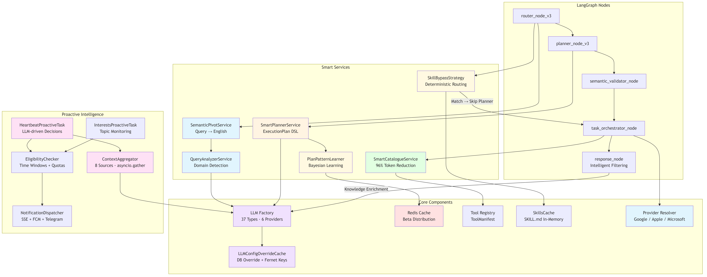
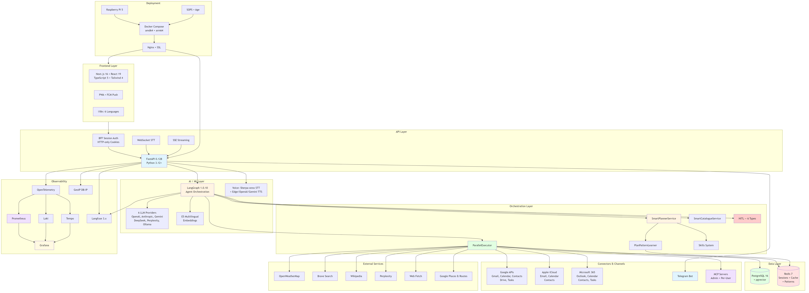
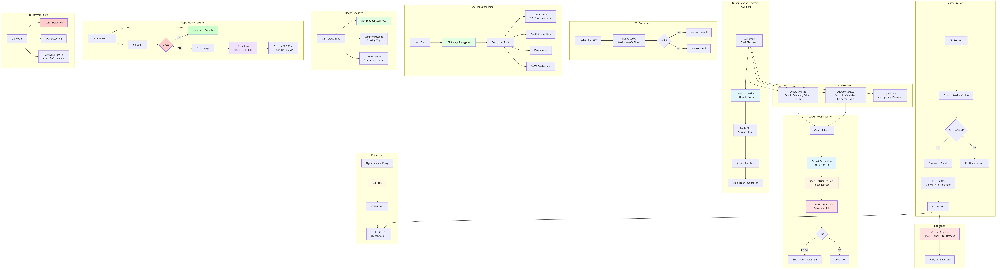

# Architecture Diagrams

> **Generated**: 2026-03-20
> **Status**: ✅ Validated against codebase
> **Sources**: `apps/api/src/domains/agents/`

---

## Diagrammes Architecture

### 1. LangGraph Flow Principal


**Fichier**: [langgraph-flow.mmd](langgraph-flow.mmd)

**Description**: Architecture complète du flux LangGraph v3.2 avec:
- Router binaire (actionable vs conversational)
- Smart Planner avec Pattern Learning (Bayesian Beta)
- Semantic Validator + Clarification Loop
- Approval Gate (HITL)
- Task Orchestrator avec exécution parallèle (asyncio.gather)
- 18+ Domain Agents (Contacts, Emails, Calendar, Tasks, Drive, Places, Routes, Weather, Wikipedia, Perplexity, Brave, Web Fetch, Browser, MCP, Sub-Agents, Context, Query, Reminders)
- HITL Dispatch pour Draft Critique

**Source Code**: [`apps/api/src/domains/agents/graph.py`](../../apps/api/src/domains/agents/graph.py)

**Nodes Implémentés**:
- `router_node_v3` (ligne 446)
- `planner_node_v3` (ligne 447)
- `semantic_validator_node` (ligne 449)
- `clarification_node` (ligne 451)
- `approval_gate_node` (ligne 452)
- `task_orchestrator_node` (ligne 453)
- `hitl_dispatch_node` (ligne 454)
- 11+ agents de domaine (lignes 464-552+)
- `response_node` (ligne 554)

---

### 2. Smart Services Layer


**Fichier**: [smart-services.mmd](smart-services.mmd)

**Description**: Architecture des services intelligents pour optimisation token (89% savings):
- QueryAnalyzerService - Analyse et expansion de domaines
- SmartPlannerService - Génération ExecutionPlan
- SmartCatalogueService - Filtrage outils (96% token reduction)
- PlanPatternLearner - Apprentissage Bayesian Beta(2,1)
- TextCompactionService - Compaction token (~97% reduction)

**Source Code**:
- [`apps/api/src/domains/agents/services/query_analyzer_service.py`](../../apps/api/src/domains/agents/services/query_analyzer_service.py)
- [`apps/api/src/domains/agents/services/smart_planner_service.py`](../../apps/api/src/domains/agents/services/smart_planner_service.py)
- [`apps/api/src/domains/agents/services/smart_catalogue_service.py`](../../apps/api/src/domains/agents/services/smart_catalogue_service.py)
- [`apps/api/src/domains/agents/services/plan_pattern_learner.py`](../../apps/api/src/domains/agents/services/plan_pattern_learner.py)
- [`apps/api/src/domains/agents/orchestration/text_compaction.py`](../../apps/api/src/domains/agents/orchestration/text_compaction.py)

---

### 3. HITL (Human-in-the-Loop) Flow


**Fichier**: [hitl-flow.mmd](hitl-flow.mmd)

**Description**: Flux complet Human-in-the-Loop avec:
- Approval Gate (analyse du plan)
- Draft Modifier (emails/events/contacts)
- Destructive Confirmation (delete ≥3 items)
- FOR_EACH Confirmation (bulk mutations)
- Severity Levels (INFO, WARNING, CRITICAL)
- User Decisions (Approve/Reject/Modify/Clarify)

**Source Code**:
- [`apps/api/src/domains/agents/nodes/approval_gate_node.py`](../../apps/api/src/domains/agents/nodes/approval_gate_node.py)
- [`apps/api/src/domains/agents/nodes/hitl_dispatch_node.py`](../../apps/api/src/domains/agents/nodes/hitl_dispatch_node.py)
- [`apps/api/src/domains/agents/services/hitl/draft_modifier.py`](../../apps/api/src/domains/agents/services/hitl/draft_modifier.py)
- [`apps/api/src/domains/agents/services/hitl/interactions/destructive_confirm.py`](../../apps/api/src/domains/agents/services/hitl/interactions/destructive_confirm.py)
- [`apps/api/src/domains/agents/services/hitl/interactions/for_each_confirmation.py`](../../apps/api/src/domains/agents/services/hitl/interactions/for_each_confirmation.py)

---

### 4. ExecutionPlan DSL & FOR_EACH


**Fichier**: [execution-plan-flow.mmd](execution-plan-flow.mmd)

**Description**: Flux d'exécution du DSL ExecutionPlan avec:
- Génération du plan par SmartPlannerService
- Expansion FOR_EACH (for_each_max=10)
- Exécution parallèle (asyncio.gather)
- Gestion dépendances ($steps.get_contacts.result)
- StandardToolOutput aggregation
- HITL pour bulk mutations

**Source Code**:
- [`apps/api/src/domains/agents/services/smart_planner_service.py`](../../apps/api/src/domains/agents/services/smart_planner_service.py)
- [`apps/api/src/domains/agents/orchestration/for_each_utils.py`](../../apps/api/src/domains/agents/orchestration/for_each_utils.py)
- [`apps/api/src/domains/agents/nodes/task_orchestrator_node.py`](../../apps/api/src/domains/agents/nodes/task_orchestrator_node.py)

**Schemas**:
- [`apps/api/src/domains/agents/models.py`](../../apps/api/src/domains/agents/models.py) - ExecutionPlan, ExecutionStep

---

### 5. System Architecture


**Fichier**: [system-architecture.mmd](system-architecture.mmd)

**Description**: Architecture système globale avec:
- **Frontend**: Next.js 16 + React 19 + TypeScript 5 + Tailwind 4
- **Backend**: FastAPI + Uvicorn (Python 3.12+)
- **AI/ML**: LangGraph 1.0+ + LLM Providers (OpenAI, Anthropic, DeepSeek, Gemini)
- **Data**: PostgreSQL 16 + pgvector, Redis 7
- **External APIs**: Google (Gmail, Calendar, Contacts, Drive, Tasks, Places, Routes), OpenWeatherMap, Wikipedia, Perplexity
- **Observability**: Prometheus, Grafana, Loki, Tempo, Langfuse, OpenTelemetry
- **Deployment**: Docker Compose, Nginx, Raspberry Pi

**Source Code**: Configuration dans [`apps/api/src/core/config/`](../../apps/api/src/core/config/)

---

### 6. Security Architecture


**Fichier**: [security-architecture.mmd](security-architecture.mmd)

**Description**: Architecture de sécurité complète avec:
- **Authentication**: JWT + Redis Session Store + Session Rotation
- **Authorization**: JTI Blacklist + Permission Check + Rate Limiting (SlowAPI)
- **OAuth Security**: Google OAuth + Health Check (every 5 min) + FCM Push Notifications
- **Secrets Management**: .env encrypted (SOPS) + Firebase/Google/LLM credentials
- **Docker Security**: .dockerignore exclusions + Non-root user + Security patches (apt-get upgrade)
- **Dependency Security**: pip-audit + Trivy image scan + CVE tracking
- **Production Security**: Nginx + SSL/TLS + HTTPS + Firewall

**Source Code**:
- [`apps/api/src/domains/auth/`](../../apps/api/src/domains/auth/)
- [`apps/api/src/domains/connectors/`](../../apps/api/src/domains/connectors/)
- [`apps/api/.dockerignore`](../../apps/api/.dockerignore)
- [`apps/api/Dockerfile.prod`](../../apps/api/Dockerfile.prod)

**Security Scan**: Voir [`Taskfile.yml`](../../Taskfile.yml) - `task security:scan`

---

## Génération des Diagrammes

Les diagrammes sont générés automatiquement depuis les fichiers `.mmd` (Mermaid) :

```bash
task docs:diagrams
```

Cette commande utilise `@mermaid-js/mermaid-cli` pour convertir chaque `.mmd` en `.png`.

---

## Validation Code

Tous les diagrammes ont été validés contre le code source en date du **2026-01-29**.

**Commandes de vérification** :
```bash
# Vérifier la structure du graph
grep -A 20 "def build_graph" apps/api/src/domains/agents/graph.py

# Vérifier les Smart Services
ls apps/api/src/domains/agents/services/*_service.py

# Vérifier les HITL services
ls apps/api/src/domains/agents/services/hitl/*.py
```

---

## Références Documentation

- [`CLAUDE.md`](../../CLAUDE.md) - Vue d'ensemble architecture
- [`docs/ARCHITECTURE.md`](../ARCHITECTURE.md) - Architecture globale
- [`docs/technical/`](../technical/) - Documentation technique détaillée
- [`docs/technical/SMART_SERVICES.md`](../technical/SMART_SERVICES.md) - Smart Services v3
- [`docs/technical/HITL.md`](../technical/HITL.md) - Human-in-the-Loop
- [`docs/technical/PLANNER.md`](../technical/PLANNER.md) - ExecutionPlan DSL
- [`docs/technical/SECURITY.md`](../technical/SECURITY.md) - Sécurité

---

**Dernière mise à jour**: 2026-01-29
**Validé contre**: `apps/api/src/domains/agents/` (main branch)
