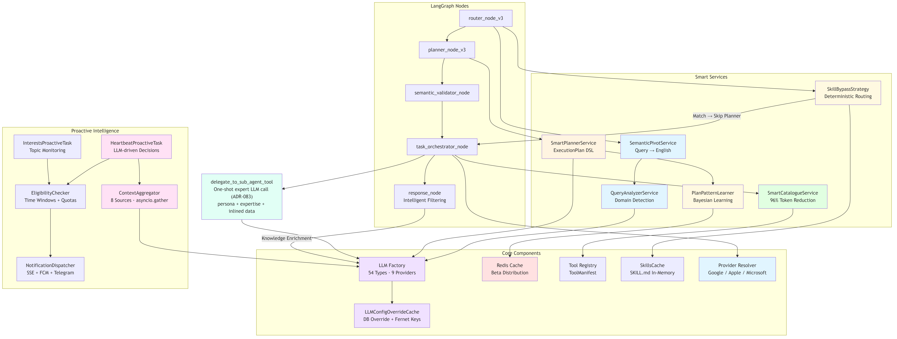
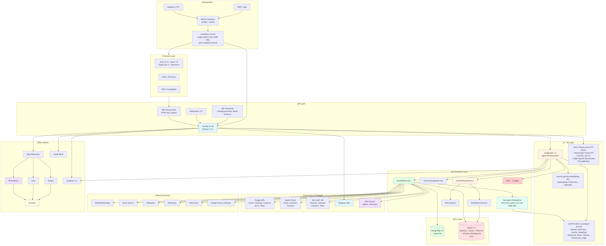
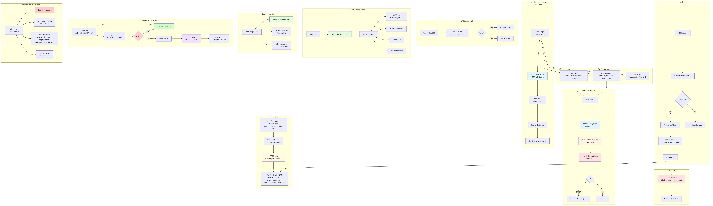

# Architecture Diagrams

> **Generated**: 2026-07-11 (PNG/SVG régénérés via `task docs:diagrams`)
> **Status**: ✅ Validated against codebase
> **Sources**: `apps/api/src/domains/agents/` — les fichiers `.mmd` sont la source de vérité

---

## Diagrammes Architecture

### 1. LangGraph Flow Principal


**Fichier**: [langgraph-flow.mmd](langgraph-flow.mmd)

**Description**: Architecture complète du flux LangGraph avec:
- Compaction node en entrée (F4, pass-through si rien à compacter)
- Router ternaire (conversation / actionable / mode ReAct — ADR-070)
- Smart Planner avec Pattern Learning (Bayesian Beta)
- Semantic Validator + Clarification Loop
- Approval Gate (plan_approval — actuellement pass-through auto-approve)
- Task Orchestrator avec exécution parallèle (asyncio.gather)
- Nodes agents de domaine (contact, email, event, file, task, weather, wikipedia, perplexity, place, route, hue, browser conditionnel)
- HITL Dispatch (draft critique, self-loop replay-safe ADR-092) + for_each_confirm node
- Initiative node (ADR-062) + boucle ReAct 4 nodes (setup → call_model ⇄ execute_tools → finalize)
- Délégation sub-agent one-shot (ADR-083)

**Source Code**: [`apps/api/src/domains/agents/graph.py`](../../apps/api/src/domains/agents/graph.py)

**Nodes Implémentés** (voir `build_graph()` dans `graph.py` — les numéros de ligne dérivent, ne pas s'y fier):
`compaction_node`, `router_node_v3`, `planner_node_v3`, `semantic_validator_node`,
`clarification_node`, `approval_gate_node`, `task_orchestrator_node`,
`hitl_dispatch_node`, `for_each_confirm_node`, `initiative_node`,
`react_setup/call_model/execute_tools/finalize`, 11–12 nodes agents de domaine,
`response_node`

---

### 2. Smart Services Layer


**Fichier**: [smart-services.mmd](smart-services.mmd)

**Description**: Architecture des services intelligents pour optimisation token (89% savings):
- QueryAnalyzerService - Analyse et expansion de domaines
- SmartPlannerService - Génération ExecutionPlan
- SmartCatalogueService - Filtrage outils (96% token reduction)
- PlanPatternLearner - Apprentissage Bayesian Beta(2,1)
- TextCompactionService - Compaction token (~97% reduction)

**Source Code**:
- [`apps/api/src/domains/agents/services/query_analyzer_service.py`](../../apps/api/src/domains/agents/services/query_analyzer_service.py)
- [`apps/api/src/domains/agents/services/smart_planner_service.py`](../../apps/api/src/domains/agents/services/smart_planner_service.py)
- [`apps/api/src/domains/agents/services/smart_catalogue_service.py`](../../apps/api/src/domains/agents/services/smart_catalogue_service.py)
- [`apps/api/src/domains/agents/services/plan_pattern_learner.py`](../../apps/api/src/domains/agents/services/plan_pattern_learner.py)
- [`apps/api/src/domains/agents/orchestration/text_compaction.py`](../../apps/api/src/domains/agents/orchestration/text_compaction.py)

---

### 3. HITL (Human-in-the-Loop) Flow


**Fichier**: [hitl-flow.mmd](hitl-flow.mmd)

**Description**: Flux Human-in-the-Loop conforme au contrat unifié ADR-106 :
- Deux mécanismes de déclenchement : output-driven (draft, post-exécution) et flag-driven (`hitl_required`, pré-exécution non-draft — gate ReAct `tool_confirmation`)
- `action_requests` typé (draft_critique · tool_confirmation · for_each_confirmation · entity_disambiguation · plan_approval · clarification)
- Plan approval = pass-through auto-approve (le tool-level HITL prime)
- Interrupts replay-safe (ADR-092) : un interrupt par exécution de node, self-loop après EDIT, providers FOR_EACH pré-exécutés une seule fois
- Classification LLM des réponses utilisateur (APPROVE/REJECT/EDIT/REPLAN/AMBIGUOUS)
- Livraison multi-canal (SSE, Telegram inline keyboard, FCM)

**Source Code**:
- [`apps/api/src/domains/agents/nodes/approval_gate_node.py`](../../apps/api/src/domains/agents/nodes/approval_gate_node.py)
- [`apps/api/src/domains/agents/nodes/hitl_dispatch_node.py`](../../apps/api/src/domains/agents/nodes/hitl_dispatch_node.py)
- [`apps/api/src/domains/agents/services/hitl/draft_modifier.py`](../../apps/api/src/domains/agents/services/hitl/draft_modifier.py)
- [`apps/api/src/domains/agents/services/hitl/interactions/destructive_confirm.py`](../../apps/api/src/domains/agents/services/hitl/interactions/destructive_confirm.py)
- [`apps/api/src/domains/agents/services/hitl/interactions/for_each_confirmation.py`](../../apps/api/src/domains/agents/services/hitl/interactions/for_each_confirmation.py)

---

### 4. ExecutionPlan DSL & FOR_EACH


**Fichier**: [execution-plan-flow.mmd](execution-plan-flow.mmd)

**Description**: Flux d'exécution du DSL ExecutionPlan avec:
- Génération du plan par SmartPlannerService
- Expansion FOR_EACH (for_each_max=10)
- Exécution parallèle (asyncio.gather)
- Gestion dépendances ($steps.get_contacts.result)
- StandardToolOutput aggregation
- HITL pour bulk mutations

**Source Code**:
- [`apps/api/src/domains/agents/services/smart_planner_service.py`](../../apps/api/src/domains/agents/services/smart_planner_service.py)
- [`apps/api/src/domains/agents/orchestration/for_each_utils.py`](../../apps/api/src/domains/agents/orchestration/for_each_utils.py)
- [`apps/api/src/domains/agents/nodes/task_orchestrator_node.py`](../../apps/api/src/domains/agents/nodes/task_orchestrator_node.py)

**Schemas**:
- [`apps/api/src/domains/agents/models.py`](../../apps/api/src/domains/agents/models.py) - ExecutionPlan, ExecutionStep

---

### 5. System Architecture


**Fichier**: [system-architecture.mmd](system-architecture.mmd)

**Description**: Architecture système globale avec:
- **Frontend**: Next.js 16 + React 19 + TypeScript 6 + Tailwind 4
- **Backend**: FastAPI + Uvicorn (Python 3.12+)
- **AI/ML**: LangGraph 1.2 + LLM Providers catalogue-driven (OpenAI, Anthropic, Gemini, DeepSeek, Perplexity, Qwen, Ollama, ElevenLabs, Edge) + embeddings Gemini (ADR-069)
- **Data**: PostgreSQL 16 + pgvector, Redis 7.4 (sessions, cache, patterns, Streams)
- **External APIs**: Google (Gmail, Calendar, Contacts, Drive, Tasks, Places, Routes), Apple iCloud, Microsoft 365, OpenWeatherMap, Wikipedia, Perplexity, Brave
- **Observability**: Prometheus, Grafana, Loki, Tempo, Langfuse, OpenTelemetry
- **Deployment**: Docker Compose, Cloudflare Tunnel (ADR-093), Raspberry Pi 5

**Source Code**: Configuration dans [`apps/api/src/core/config/`](../../apps/api/src/core/config/)

---

### 6. Security Architecture


**Fichier**: [security-architecture.mmd](security-architecture.mmd)

**Description**: Architecture de sécurité complète avec:
- **Authentication**: BFF sessions (HTTP-only cookies) + Redis Session Store + Session Rotation (ADR-002)
- **Authorization**: Session validation + Permission Check + Rate Limiting (SlowAPI + per-provider)
- **OAuth Security**: Fernet encryption at rest + distributed refresh lock + Health Check scheduler + notifications SSE/FCM/Telegram
- **Secrets Management**: .env encrypted (SOPS + Age) + Firebase/Google/LLM credentials
- **Docker Security**: .dockerignore exclusions + Non-root user + Security patches (apt-get upgrade)
- **Dependency Security**: hash-verified universal lockfiles (ADR-112) + pip-audit on the lockfile (transitives included) + Trivy image scan + CVE tracking
- **Production Security**: Cloudflare Tunnel (entrée publique unique, ADR-093) + ports loopback-bound + CSP stricte avec widget airlock (ADR-098)

**Source Code**:
- [`apps/api/src/domains/auth/`](../../apps/api/src/domains/auth/)
- [`apps/api/src/domains/connectors/`](../../apps/api/src/domains/connectors/)
- [`apps/api/.dockerignore`](../../apps/api/.dockerignore)
- [`apps/api/Dockerfile.prod`](../../apps/api/Dockerfile.prod)

**Security Scan**: Voir [`Taskfile.yml`](../../Taskfile.yml) - `task security:scan`

---

## Génération des Diagrammes

Les diagrammes sont générés automatiquement depuis les fichiers `.mmd` (Mermaid) :

```bash
task docs:diagrams
```

Cette commande utilise `@mermaid-js/mermaid-cli` pour convertir chaque `.mmd` en `.png`.

---

## Validation Code

Tous les diagrammes ont été validés contre le code source en date du **2026-07-11**.

**Commandes de vérification** :
```bash
# Vérifier la structure du graph
grep -A 20 "def build_graph" apps/api/src/domains/agents/graph.py

# Vérifier les Smart Services
ls apps/api/src/domains/agents/services/*_service.py

# Vérifier les HITL services
ls apps/api/src/domains/agents/services/hitl/*.py
```

---

## Références Documentation

- [`CLAUDE.md`](../../CLAUDE.md) - Vue d'ensemble architecture
- [`docs/ARCHITECTURE.md`](../ARCHITECTURE.md) - Architecture globale
- [`docs/technical/`](../technical/) - Documentation technique détaillée
- [`docs/technical/SMART_SERVICES.md`](../technical/SMART_SERVICES.md) - Smart Services v3
- [`docs/technical/HITL.md`](../technical/HITL.md) - Human-in-the-Loop
- [`docs/technical/PLANNER.md`](../technical/PLANNER.md) - ExecutionPlan DSL
- [`docs/technical/SECURITY.md`](../technical/SECURITY.md) - Sécurité

---

**Dernière mise à jour**: 2026-07-11
**Validé contre**: `apps/api/src/domains/agents/` (main branch, v1.23.12)
