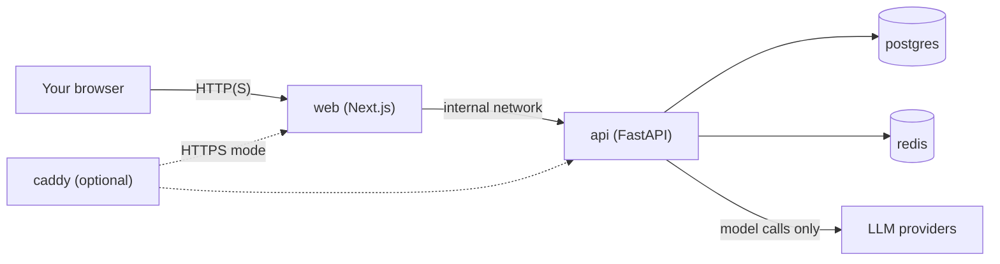

# Guide: Self-Hosting LIA — explain, configure, deploy

> **Audience:** anyone who wants to run LIA on their own machine or server.
> **Scope:** what you are installing, every setting you can choose, how the
> deployment runs, and what to do when a step fails.
>
> This guide describes the guided installer (ADR-215). The manual path in
> [GETTING_STARTED.md](../GETTING_STARTED.md) and
> [GUIDE_DEPLOYMENT.md](./GUIDE_DEPLOYMENT.md) remains fully supported and is
> the reference for anything this guide does not cover.

---

## Quick reference

```bash
git clone https://github.com/jgouviergmail/LIA-Assistant.git
cd LIA-Assistant
./install.sh
```

| I want to…                                | Command                                   |
| ----------------------------------------- | ----------------------------------------- |
| Check my machine without installing        | `./install.sh --check-only`                |
| Generate the config without starting it    | `./install.sh --dry-run`                   |
| Continue an interrupted install            | `./install.sh --resume`                    |
| Change routing/options later               | `./install.sh --reconfigure`               |
| Install unattended                         | `./install.sh --non-interactive --answers answers.env` |

---

## 1. What you are installing

LIA is a multi-agent conversational assistant. Self-hosted, it runs entirely
on your machine: your conversations, memory, documents, and provider keys stay
in **your** PostgreSQL, and only the model calls leave your host.

### The stack the installer starts

| Container       | Role                                                  | Published to the network?     |
| --------------- | ----------------------------------------------------- | ----------------------------- |
| `web`           | Next.js UI + server-side proxy to the API             | Yes (this is what you open)   |
| `api`           | FastAPI backend, LangGraph agents, schedulers         | No — loopback only            |
| `postgres`      | All application data (pgvector for embeddings)        | No                            |
| `redis`         | Cache, rate limiting, cross-worker coordination       | No                            |
| `postgres-backup` | Daily/weekly/monthly `pg_dump` rotation             | No                            |
| Observability (optional) | Prometheus, Grafana, Loki, Tempo, exporters, Portainer | Loopback only        |
| `caddy` (optional) | Managed HTTPS in front of `web` and `api`          | Yes — 80/443                  |

Your browser talks **only to the web container**. It calls the API on the same
origin (`/api/v1/...`), and the web server forwards those calls internally to
`http://api:8000`. That is why the API never needs a published port.



### What the installer does in one pass

1. Checks your machine (OS, architecture, Docker, disk).
2. Asks a short questionnaire — nothing else is ever asked later.
3. Generates a private `.env` and a Compose overlay; creates the host
   directories it needs.
4. Builds (or pulls) the images and validates the settings **before** starting
   anything.
5. Starts the stack, applies the database migrations, and loads the reference
   seed data atomically.
6. Creates your admin account and stores your provider keys **encrypted in the
   database** — they are read from standard input, never from the command line.
7. Restarts the API so every worker picks up the committed keys.
8. Runs a verifier that proves the installation actually works, then prints a
   report that contains no secrets.

### What it deliberately does not do

- **No upgrade path yet.** Moving an existing installation to a newer release
  is the documented manual procedure, not an installer feature.
- **No destructive reinstall.** There is no "wipe and start over" flag; your
  volumes are never removed by the installer.
- **No provider-key rotation.** Changing keys later is an authenticated
  operation in the Admin UI.

---

## 2. Before you start

### Host requirements

The installer refuses to continue if any of these is missing:

| Requirement       | Minimum                        | Why                                            |
| ----------------- | ------------------------------ | ---------------------------------------------- |
| Operating system  | Linux                          | The Compose stack and entrypoints target Linux |
| Architecture      | `x86_64` or `aarch64`          | Published images cover exactly these two       |
| Python            | 3.10+                          | Runs the installer itself (standard library only) |
| Docker            | Docker CLI + Compose v2        | Runs the stack                                 |
| Docker Compose    | **2.24.4+**                    | LAN port publication uses the `!override` tag  |
| Free disk space   | 10 GiB                         | Images, database, embeddings cache             |

The reference production platform is a Raspberry Pi 5 (arm64); an ordinary
x86 server or workstation works equally well.

### What to have ready

- **Two model provider keys** — one for **DeepSeek** and one for **OpenAI**.
  These two are required because the reference configuration shipped with LIA
  (the maintainer's own proven production setup) routes the chat pipeline to
  DeepSeek and the remaining slots to OpenAI. You can change every model
  afterwards in the Admin UI.
- **An administrator email address** — this becomes your login.
- **A password** meeting the backend policy: at least 10 characters, 2
  uppercase letters, 2 digits, and 2 special characters.
- **How people will reach LIA** — a LAN address, or a domain name if you want
  HTTPS (see §4.2).

Optional capabilities stay switched off until you add their key later in the
Admin UI, and LIA runs fine without them:

| Capability                | Provider   | Without its key                       |
| ------------------------- | ---------- | ------------------------------------- |
| Image/vision analysis     | Gemini     | Image understanding is unavailable    |
| Voice output (TTS)        | ElevenLabs | Spoken answers are unavailable        |
| MCP App interactive widgets | Anthropic | Widgets fall back to plain responses |

---

## 3. Installing

### The two modes

The installer never guesses. Its mode follows one rule, and that rule is true
both before and after a release has been qualified:

| Situation                                                        | Mode selected      |
| ---------------------------------------------------------------- | ------------------ |
| You cloned this repository (a complete source checkout)           | **local build**    |
| You extracted an official release whose adjacent manifest is qualified | **prebuilt digests** |
| You extracted a release whose manifest is absent or unqualified   | **local build**    |
| You pass `--local-build` in a release directory                   | **local build**, from the release's verified embedded source |
| Neither a complete checkout nor a valid embedded source exists     | It stops **before touching anything** and tells you which release asset to download |

In prebuilt mode the images are pinned to immutable digests
(`repository@sha256:...`) taken from the release manifest — never to a moving
tag such as `latest`. **Prebuilt mode stays locked until a release has passed
its clean-machine qualification**, so today a clone installs by building
locally. That takes longer on first run and is otherwise identical.

### Command-line flags

| Flag                          | Effect                                                                 |
| ----------------------------- | ---------------------------------------------------------------------- |
| *(none)*                      | Interactive install, mode resolved by the rule above                    |
| `--local-build`               | Force a local build (always wins over any manifest)                     |
| `--prebuilt`                  | Force prebuilt; fails if no qualified manifest sits next to the installer |
| `--manifest <path>`           | Point at the release manifest to use with `--prebuilt`                  |
| `--resume`                    | Continue an interrupted install                                         |
| `--reconfigure`               | Change routing/capability choices on a working installation             |
| `--non-interactive --answers <file>` | Read every answer from a file; never prompt                     |
| `--dry-run`                   | Generate and validate the configuration, start nothing                  |
| `--check-only`                | Run the prerequisite checks and exit                                    |

`--reconfigure` cannot be combined with install, resume, mode, or answers flags.

### Exit codes

| Code | Meaning                                                       |
| ---- | ------------------------------------------------------------- |
| `0`  | Success (or `--dry-run` / `--check-only` completed)           |
| `2`  | Bad usage or a rejected answer                                 |
| `3`  | A prerequisite or safety check failed — nothing was started    |
| `4`  | A deployment step failed — the rollback path already ran       |
| `130`| You interrupted it — resume with `./install.sh --resume`       |

---

## 4. Configuration reference

### 4.1 The questionnaire

Asked once, in this order. Secrets come last so you can abort before typing
anything sensitive. Each prompt is prefixed with its key (for example
`[admin_email]`), and that key is also the name to use in an answers file.

| Key                    | Asked when            | Values                                        | Default |
| ---------------------- | --------------------- | --------------------------------------------- | ------- |
| `wizard_language`      | always                | `en`, `fr`                                    | `en`    |
| `exposure`             | always                | `lan`, `proxy`, `caddy`                       | `lan`   |
| `server_host`          | exposure = `lan`      | hostname or IP your browsers will use          | —       |
| `web_domain`           | exposure = `proxy`/`caddy` | public web domain                        | —       |
| `api_domain`           | exposure = `proxy`/`caddy` | public API domain                        | —       |
| `caddy_email`          | exposure = `caddy`    | email for Let's Encrypt notifications          | —       |
| `admin_email`          | always                | your login address                             | —       |
| `admin_name`           | always                | display name                                   | `Admin` |
| `default_language`     | always                | `fr`, `en`, `es`, `de`, `it`, `zh-CN`          | `en`    |
| `observability`        | always                | `yes` / `no`                                   | `no`    |
| `skill_sandbox`        | always                | `yes` / `no`                                   | `no`    |
| `admin_password`       | always *(hidden)*     | 10+ chars, 2 uppercase, 2 digits, 2 specials   | —       |
| `provider_key_deepseek`| always *(hidden)*     | your DeepSeek API key                          | —       |
| `provider_key_openai`  | always *(hidden)*     | your OpenAI API key                            | —       |

Secrets are read through a hidden prompt, never echoed, and never written to
`.env`, to the installer state, or to the log.

### 4.2 Choosing an exposure

This is the one decision worth thinking about.

| Mode    | Choose it when                                          | What gets published        | URL your users open       | Session cookies |
| ------- | -------------------------------------------------------- | -------------------------- | ------------------------- | --------------- |
| `lan`   | Home or office network, no domain name                    | Web port `3000` on all interfaces | `http://<host>:3000` | Not marked secure (plain HTTP) |
| `proxy` | You already run nginx/Traefik/Caddy on this host          | Nothing new — ports stay on loopback | `https://<your-domain>` | Secure |
| `caddy` | You have domain names and want HTTPS handled for you      | `80` and `443` via a Caddy container | `https://<web-domain>` | Secure |

Notes that matter in practice:

- **`lan`** publishes the web port only. The API stays loopback-only; browsers
  reach it same-origin through the web container.
- **`proxy`** keeps every port bound to `127.0.0.1`, so **your reverse proxy
  must run on the same host** (the usual setup). If it runs elsewhere, publish
  the web port yourself in your own Compose override.
- **`caddy`** obtains and renews certificates automatically and serves two
  virtual hosts: your web domain in front of `web`, and your API domain in
  front of `api`. Point both DNS records at this machine before installing.

### 4.3 Secrets the installer generates for you

You are never asked for these; they are created with a CSPRNG and written to
your private `.env` (mode `0600`):

| Variable            | Purpose                                                    |
| ------------------- | ---------------------------------------------------------- |
| `SECRET_KEY`        | Session/JWT signing                                        |
| `FERNET_KEY`        | Encrypts provider keys and personal data **at rest**       |
| `POSTGRES_PASSWORD` | Database password                                          |
| `REDIS_PASSWORD`    | Redis password                                             |

> **Never rotate `FERNET_KEY` by hand.** Every encrypted row in your database
> was written with it; replacing it makes those rows unreadable. On
> `--reconfigure` the installer reloads the existing values and refuses to
> continue if any is missing, duplicated, or still a placeholder.

### 4.4 Values derived from your answers

| Variable                | Value                                                     |
| ----------------------- | --------------------------------------------------------- |
| `APP_URL_SERVER`        | `http://<server_host>:3000` (LAN) or `https://<web_domain>` |
| `FRONTEND_URL`, `API_URL`, `CORS_ORIGINS` | The same origin                         |
| `SESSION_COOKIE_SECURE` | `false` on LAN, `true` otherwise                           |
| `DEFAULT_LANGUAGE`      | Your chosen application language                           |
| `NEXT_PUBLIC_API_URL`, `NEXT_PUBLIC_APP_URL` | **Deliberately empty**                |
| `ENVIRONMENT`, `DEBUG`, `LOG_LEVEL` | `production`, `false`, `INFO`              |

The two empty `NEXT_PUBLIC_*` values are intentional: the web image is
host-neutral and same-origin, so the canonical address is resolved at request
time from `APP_URL_SERVER` rather than baked into the JavaScript bundle. That
is what lets one image serve any hostname.

### 4.5 What is never in `.env`

**Your provider keys.** They are sent to the API over standard input during
bootstrap and stored Fernet-encrypted in the `provider_api_keys` table. They
never appear in `.env`, in a command line, in the installer state, or in the
log. The same applies to your admin password.

### 4.6 Optional capabilities

**Observability** (`observability = yes`) adds twelve containers — Prometheus,
Grafana, Loki, Tempo, Alertmanager, the exporters and Portainer — all bound to
loopback. Their declared memory ceilings total about 3 GiB (roughly 850 MiB
reserved), so leave it off on a small machine. When you later run Compose by
hand, add the profile:

```bash
docker compose -f docker-compose.prod.yml -f docker-compose.install.yml \
  --profile observability ps
```

**Script-skill sandbox** (`skill_sandbox = yes`) lets skills execute Python in
a throwaway container. This **mounts the Docker socket into the API
container** — a deliberate privilege. Leave it off unless you need it.

> If you enable the sandbox, set your host's Docker group id in `.env`,
> otherwise the API cannot use the socket:
> ```bash
> echo "DOCKER_GID=$(getent group docker | cut -d: -f3)" >> .env
> ```

### 4.7 Unattended installs

Write an answers file using the question keys, one `key=value` per line:

```ini
wizard_language=en
exposure=lan
server_host=192.168.1.50
admin_email=admin@example.org
admin_name=Ops
default_language=fr
observability=no
skill_sandbox=no
admin_password=CHANGE_ME_Ab12!!cdEf
provider_key_deepseek=CHANGE_ME_DEEPSEEK_KEY
provider_key_openai=CHANGE_ME_OPENAI_KEY
```

```bash
chmod 600 answers.env
./install.sh --non-interactive --answers answers.env
```

The file must be mode `0600`; a group- or world-readable file is rejected
(`answers_file_not_private`). It is read once and never copied. A missing or
invalid entry fails immediately with `missing_answer:<key>` or
`invalid_answer:<key>` — nothing is prompted in this mode.

### 4.8 Changing things later

```bash
./install.sh --reconfigure
```

| Can be changed             | Is immutable                                        |
| -------------------------- | --------------------------------------------------- |
| Exposure (LAN/proxy/Caddy) | Install mode and release identity                   |
| Server host, web/API domains | Admin email and display name                      |
| Caddy ACME email           | Every generated secret (including `FERNET_KEY`)     |
| Observability on/off       | Database identity and seed data                     |
| Skill sandbox on/off       | Provider keys (Admin UI only)                       |

Reconfiguration validates the candidate files, backs up the current ones,
swaps them atomically, and recreates the containers **without rebuilding**. It
never re-seeds and never re-runs bootstrap. If anything fails, the previous
files are restored.

---

## 5. Deploying and verifying

### The exact sequence

The installer runs these steps in this order, and stops at the first failure:

1. **Capture a rollback point** — for an existing installation, the running
   image IDs are tagged aside *before* a build can overwrite them.
2. **Acquire images** — `build api web` (local) or `pull api web` (prebuilt,
   never builds).
3. **Validate settings** — a throwaway API container checks your `.env` before
   anything starts for real.
4. **Start the stack** with seeding armed.
5. **Wait for `/ready`** — this proves the entrypoint finished the blocking
   seed step and the API is up.
6. **Disarm seeding** immediately, so a later resume can never re-seed.
7. **Bootstrap** — admin account and encrypted provider keys, in one database
   transaction, fed over standard input.
8. **Recreate the API** without rebuilding, then wait for `/ready` again. This
   is the barrier that guarantees every worker loaded the committed keys.
9. **Run the verifier** (below).
10. **Write the state file and print the report.**

### The verifier

`/ready` proves the process serves; it does not prove the installation is
functional. The verifier does, and it is the last gate:

```bash
docker compose -f docker-compose.prod.yml -f docker-compose.install.yml \
  run --rm --no-deps -T --entrypoint "" api \
  python -m scripts.data.verify_installation \
  --admin-email you@example.org --seed-bundle-sha256 <digest-from-the-log>
```

| Check               | What it proves                                                     |
| ------------------- | ------------------------------------------------------------------ |
| `migrations`        | Exactly one migration head, and the database is on it               |
| `seed_marker`       | The reference data was applied under the **exact** expected digest  |
| `reference_data`    | Personalities, translations and pricing tables hold their contents  |
| `admin`             | Your account exists and is active, verified, and an administrator   |
| `provider_keys`     | Both required keys exist **and decrypt**                            |
| `provider_coverage` | Every core model slot resolves to a provider you actually keyed     |

Every check runs even after one fails, so you get a complete report. It prints
stable codes, never values, and exits `0` only when all six pass.

### Where your data lives

| What                | Location                                                    |
| ------------------- | ----------------------------------------------------------- |
| Database            | Docker volume `postgres_data`                               |
| Database dumps      | `../lia-data/postgres-backups` next to your install (mode `0700`) |
| Attachments, skills, caches | Named Docker volumes                                |
| Your private config | `.env` (mode `0600`), plus timestamped `.env.backup.*`      |

The backup directory sits **outside** the installation directory on purpose:
removing the checkout must never take your dumps with it. Restore procedure:
`docs/runbooks/DATABASE_BACKUP_RESTORE.md`.

### Files the installer generates

All are ignored by git and specific to your machine:

```text
.env                          your private configuration
.install-state.json           non-secret resume state + fingerprints
install.log                   redacted installation log
docker-compose.install.yml    your exposure/seeding overlay
docker-compose.images.yml     digest pins (prebuilt mode only)
infrastructure/caddy/Caddyfile  generated vhosts (Caddy mode only)
.env.backup.*                 timestamped backups of previous configs
```

### Your first login

1. Open the URL printed in the final report (`http://<host>:3000` on LAN, or
   your domain otherwise).
2. Sign in with the administrator email and password you chose.
3. Go to **Settings → Administration → LLM Configuration** to change any
   model, adjust its parameters, or add an optional provider key (Gemini for
   vision, ElevenLabs for voice, Anthropic for MCP App widgets).

The models LIA ships with are the maintainer's own production configuration.
They work as-is; treat them as a starting point, not a constraint.

### Day-2 commands

```bash
# Always pass the same file list the installer used
alias liac='docker compose -f docker-compose.prod.yml -f docker-compose.install.yml'

liac ps                 # status
liac logs -f api        # follow the API
liac restart api        # restart one service
liac stop               # stop everything (data is preserved)
liac up -d --no-build   # start it again
```

### Removing an installation

The installer will never do this for you — deleting data is always a
deliberate, manual act:

```bash
liac down                 # stop and remove containers, KEEP the volumes
liac down --volumes       # ⚠ also destroys the database and every attachment
```

Your database dumps live outside the installation directory and survive both
commands; delete them separately if you really mean to.

---

## 6. When something goes wrong

Every failure prints a stable code and, when relevant, the exact command to
continue. The installer never leaves a half-applied configuration: on failure
it restores the previous images and files, or — on a first install — simply
stops its own containers without touching volumes, `.env`, backups, or logs.

### Before anything started (exit `3`)

| Code                              | What it means                              | Do this                                     |
| --------------------------------- | ------------------------------------------ | ------------------------------------------- |
| `compose_version_too_old`         | Docker Compose is older than 2.24.4        | Upgrade Docker Compose                      |
| `prebuilt_requires_passed_manifest` | No qualified manifest next to the installer | Use `--local-build`, or download a qualified release |
| `unsupported_takeover_existing_env` | An `.env` exists but no installer state   | Move it aside, or keep using the manual path |
| `resume_without_state`            | `--resume` with nothing to resume          | Run `./install.sh` normally                 |
| `resume_stop_mismatch`            | The tree changed since the interrupted run | Start from a clean copy of the same release |
| `state_parse_error`, `state_schema_unsupported` | State file unreadable or from another version | Remove `.install-state.json` and reinstall |
| `host_path_type_mismatch:<path>`  | A required directory exists as a file      | Fix that path                               |
| `generated_secret_missing:<KEY>`, `generated_secret_placeholder:<KEY>` | `.env` lost a generated secret | Restore a `.env.backup.*` |

### While answering (exit `2`)

| Code                        | What it means                                      |
| --------------------------- | -------------------------------------------------- |
| `missing_answers_file`      | `--non-interactive` without `--answers`             |
| `answers_file_missing`      | The answers file path does not exist                |
| `answers_file_not_private`  | The answers file is not mode `0600`                 |
| `missing_answer:<key>`      | That key is absent from the answers file            |
| `invalid_answer:<key>`      | That value failed validation (email, host, password) |
| `reconfigure_flags_exclusive` | `--reconfigure` combined with an install flag     |

### During deployment (exit `4`)

| Code                    | What it means                                | Do this                                      |
| ----------------------- | -------------------------------------------- | -------------------------------------------- |
| `acquire_failed`        | Build or pull failed                          | Check disk space and network, then `--resume` |
| `settings_invalid`      | `.env` rejected before start                  | Read the message, fix `.env`, `--resume`      |
| `start_failed`          | Compose could not start the stack             | `liac logs` to see which service              |
| `readiness_timeout`     | The API never became ready                    | `liac logs api` — usually migrations or seeds |
| `bootstrap_input_error` | The admin/keys payload was rejected           | Check the password policy and both keys       |
| `bootstrap_failed`      | Admin/keys could not be committed             | `liac logs api`, then `--resume`              |
| `api_recreate_failed`   | The API could not be recreated after bootstrap | `--resume`                                   |
| `verify_failed`         | One of the six checks failed                  | Run the verifier manually to see which        |

`--resume` re-prompts **only** the ephemeral secrets (admin password and the
two provider keys) when bootstrap had not completed, and asks for nothing at
all once it had. It never repeats work that already succeeded.

---

## 7. Two related surfaces

These are separate from self-hosting and listed here so you do not confuse
them with your installation.

- **The guided showroom on `/demo`.** A client-only, fully synthetic mission
  used on the public website. It is a build-time Web setting
  (`NEXT_PUBLIC_PUBLIC_SHOWROOM_VARIANT=guided`) and contacts no account, no
  model, and no external service. Your installation does not need it — see
  [GUIDE_SHOWROOM.md](./GUIDE_SHOWROOM.md) if you maintain the public site.
- **The public demonstrator.** A completely separate, disposable deployment
  that hands a throwaway account to anonymous visitors: its own process,
  database, networks and nightly purge, documented in
  [DEMO_INSTANCE.md](../technical/DEMO_INSTANCE.md). It is **not** part of a
  self-hosted installation and must never share resources with one.

---

## 8. Verifying the installer itself

You can exercise the whole installer without deploying anything — no service
is started, nothing is pulled:

```bash
task test:install              # the wizard suite
task test:install:compose-matrix  # renders every exposure/mode combination and validates it
task lint:install              # Ruff + strict MyPy over the installer
task test:install:hermetic     # all of the above plus the backend contracts
```

`task test:install:compose-matrix` is the useful one if you customised
anything: it renders every combination of exposure, mode, observability and
sandbox, then asks Docker to validate the merged model.

---

## Current status, stated plainly

- The wizard, the generated artifacts, the full Compose matrix, and the
  backend contracts are covered by an automated gate that runs on every
  commit.
- The migration → seed → bootstrap → verify chain has been proven against a
  disposable PostgreSQL instance.
- The complete one-pass run on a clean Linux host is the qualification step
  that unlocks prebuilt (digest-pinned) installs. Until it passes, a clone
  installs by building locally, which is the supported default.

Architecture rationale and the full list of guarantees:
`docs/architecture/ADR-215-Self-Host-Installer.md`.
