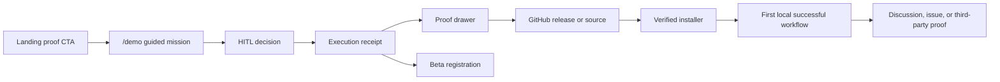
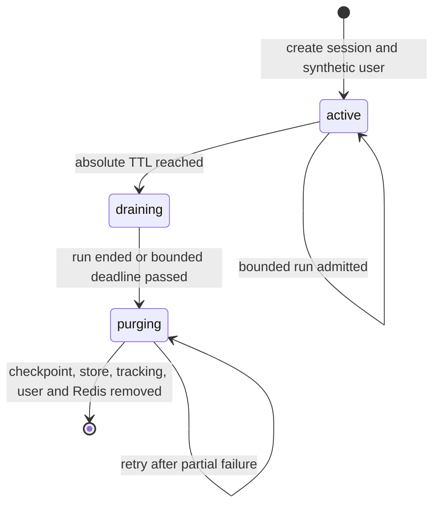

# LIA Public Web Showroom and GitHub Adoption Program

**Status:** Proposed — evidence-backed design, not implemented
**Date:** 2026-08-05
**Repository snapshot:** originally `1c1c5d6655cb4a8aa3d19905d58c8f2f14d8de0f` plus an unrelated in-progress Habits worktree. **Consolidation re-audit (2026-08-05, HEAD `c5955b73`, v1.28.0):** Habits has been committed and released (ADR-214); the worktree is clean apart from these program documents. Every observed fact in this program was re-verified on `c5955b73`; line references may drift by a few lines and remain content-accurate.
**Owner intent:** Let people experience LIA, understand what is real, then install it from GitHub
**Safety constraint:** This program must never reuse, connect to, query, migrate, restart, or otherwise touch the existing DEV or PROD instances

## 1. Executive decision

LIA should launch a **web showroom first**, not a Discord bot and not an unrestricted public agent.

The program has three deliberately separate stages:

1. **P0 — Guided interactive mission, entirely client-side.** Replace the passive `/demo` experience with a user-driven synthetic personal-assistant mission. It calls no agent API, LLM, connector, or provider. It exposes a synthetic execution storyboard rendered through LIA's sanitized trace schema, an interactive simulation of the HITL UI contract, a simulation receipt, and source links resolved to a full commit SHA. When campaign telemetry is enabled, the only network request the mission itself makes is a dedicated enum-bounded showroom collector in the existing product domain; that request omits credentials and mission behavior never depends on it. The surrounding public shell keeps its existing bounded telemetry (Web Vitals and PWA signals through the ordinary credentialed route, mounted in the `[lng]` layout) — it is disclosed, excluded from the showroom funnel, and its sample rate is zeroed in the hermetic contract build.
2. **P1 — Truthful self-host activation.** Repair the current installation claims, execute the already-designed installer program after its audit corrections, and expose a GitHub installation CTA only when a clean-machine proof is green.
3. **P2 — Live agentic showroom, gated by P0 evidence and installer proof.** Only if the quantitative P0 gate passes and installer E3 is green, add a separately deployed public-demo API with a bounded LangGraph state/plan/graph that follows LIA's router/planner/validator/parallel-agents/HITL pattern over an expiring synthetic workspace. It reuses only proven-pure helpers and is explicitly not the full local graph. It has no real connector, web, filesystem, MCP, browser, voice, attachment, or generic code-execution capability.

Discord is optional later for discussion, support, and release feedback. It is not the execution surface and is not a launch dependency.

This sequencing is intentional. It tests the acquisition promise before paying the architectural and operational cost of an internet-facing agent.

Binding execution documents:

- `docs/superpowers/plans/2026-08-05-public-web-showroom-lot0.md` — P0 guided showroom;
- `docs/superpowers/specs/2026-08-05-public-showroom-campaign-brief.md` — owned/earned launch and measurement;
- `docs/superpowers/plans/2026-08-05-public-web-showroom-runtime-boundary.md` — isolated P2 process/resource boundary;
- `docs/superpowers/plans/2026-08-05-public-web-showroom-live-mission.md` — bounded P2 identity, execution, admission, HITL, proxy, and purge;
- the installer addendum and activation plan named in section 15 — P1 conversion proof.

## 2. Direct verdict on the original proposal

The original four-phase proposal contains the right growth intuition but three unsafe or counterproductive assumptions:

- A single `DEMO_MODE=true` branch inside the normal API is not a sufficient isolation boundary. LIA's current chat path performs persistence, usage tracking, background extraction, connector warmup, product analytics, and global tool resolution through several independent seams.
- Publishing raw chain-of-thought is not acceptable. The public surface should show **structured execution facts** only: routing, planning, validation, tool names, approvals, result status, duration, and bounded cost. It must never publish hidden reasoning, prompts, tool arguments containing user text, secrets, or unrestricted errors.
- A repository-analysis flagship would attract the audience of a coding agent, while LIA is positioned as a personal assistant. LIA currently has no native repository clone/tree/diff/patch contract. Building one for acquisition would create a new product and a new sandbox boundary.

The corrected proposition is:

> **LIA turns a personal intention into controlled action, shows what it did, respects every refusal, and can be self-hosted.**

### 2.1 What is actually borrowed from OpenClaw

The useful pattern is not “put an unrestricted bot in Discord.” It is the combination of a concrete personal-assistant promise, visible execution, community inspectability, and guided self-host onboarding:

- OpenClaw's current README leads with a personal, single-user assistant running on the user's devices and recommends a guided onboarding command, not a generic infrastructure claim: <https://github.com/openclaw/openclaw/blob/main/README.md>.
- Peter Steinberger's public-showcase history supports the “show, do not merely tell” insight: <https://www.fastcompany.com/91550800/how-peter-steinberger-built-openclaw>.
- OpenClaw's current gateway documentation is fail-closed for unconfigured/local binding and its security guidance treats exposure and tool blast radius as linked risks: <https://github.com/openclaw/openclaw/blob/main/docs/cli/gateway.md> and <https://docs.openclaw.ai/gateway/security>.

LIA should copy the demonstrability, sharp personal use case, community feedback loop, and onboarding focus. It should not copy the historical absence of sandboxing, expose hidden reasoning, or make Discord the privileged execution boundary. This is an inference from the cited product and security material, not a claim that the two codebases have the same architecture.

## 3. Facts established from the current repository

These are observed facts, not design assumptions:

1. `/[lng]/demo` is already public, localized, shareable, and free of authentication redirects (`apps/web/src/app/[lng]/demo/page.tsx`).
2. The current demo is a deterministic four-act animation. Its inner application is exposed as a decorative `role="img"`; the visitor can select, pause, and replay scenes but cannot make a real HITL decision (`InteractiveChatMockup.tsx`, `MockupStage.tsx`).
3. The closing demo CTA points to `/register`, not GitHub (`InteractiveChatMockup.tsx`).
4. `demo_started` is emitted. `demo_completed` is declared by the telemetry contracts but is not emitted by the current demo.
5. The normal chat stream requires a database-backed active user and a one-to-one conversation. The conversation becomes the LangGraph thread and is checkpointed in PostgreSQL.
6. `AgentService.stream_chat_response()` currently performs more than graph execution: standard usage-limit checks, optional location persistence, conversation/message persistence, token/cost persistence, connector-scope discovery, contact warmup, user-MCP setup, optional attachments/voice/images, product-outcome scheduling, and post-response learning.
7. `archive_user_message=False` suppresses only the archive-first user row. It does not make a run ephemeral.
8. The current per-request catalogue filter is a discovery mechanism, not an authorization boundary. Pipeline and ReAct execution can resolve callable tools from global registries.
9. The existing persisted execution trace is structurally sanitized: it keeps only `emoji`, `i18n_key`, and bounded `category`; it excludes free-text detail, reasoning, and tool errors (`trace_capture.py`). This is the correct public disclosure primitive.
10. The existing skills-script sandbox is purpose-specific, has no network, and fails closed. It is not a general public code sandbox and must not be repurposed as one.
11. The repository already contains a detailed self-host installer specification and implementation plan, but none of the installer files described by that plan currently exists.
12. A bare root `docker compose up -d` is not a truthful installation instruction today: there is no root `docker-compose.yml`, and the published GHCR images are not yet a complete generic substitute for local builds.

## 4. Goals

### 4.1 Product goals

- Let a first-time visitor understand LIA's differentiated value in less than 90 seconds.
- Make approval, modification, and refusal visibly successful outcomes.
- Convert qualified curiosity into inspection of the source and then a reproducible self-host installation.
- Preserve LIA's personal-assistant positioning.
- Make every public claim traceable to versioned code, tests, or an explicitly labeled synthetic fixture.

### 4.2 Engineering goals

- Keep P0 independent of every runtime environment and paid provider.
- Reuse existing UI primitives and the current public visual identity.
- Keep the standard API behavior unchanged by default.
- For P2, reuse the same application image and only proven-pure helper/UI contracts while using a bounded public state/plan/graph, different ASGI entrypoint, resources, credentials, routes, policy, and lifecycle.
- Enforce public capabilities twice: at discovery and immediately before execution.
- Bound session lifetime, turns, concurrency, input, output, wall time, and maximum reserved spend.
- Make cleanup idempotent, retryable, observable, and demonstrably complete.

### 4.3 Growth goals

- Produce a canonical 60-second capture directly from the showroom.
- Give technical audiences a proof drawer with exact source/test links.
- Turn GitHub README, releases, Discussions, and reproducible third-party installs into the community loop.
- Avoid creating an empty Discord server before there is repeatable activation and support demand.

## 5. Non-goals

- Raw chain-of-thought or prompt disclosure.
- Access to a visitor's files, accounts, browser, machine, network, or private repositories.
- Arbitrary URLs, arbitrary repository analysis, shell access, or generic code execution.
- Real email, calendar, task, phone, smart-home, or messaging actions in the public showroom.
- Reusing DEV or PROD databases, Redis, networks, volumes, provider keys, secrets, domains, or containers.
- Making the normal application conditionally public through one permissive environment flag.
- Building Discord before the website funnel and installer are proven.
- Promising a one-command installation before a clean-machine acceptance run passes.

## 6. Target audiences and promised value

| Audience | Immediate question | Showroom answer | Conversion target |
|---|---|---|---|
| Self-hosters | Can I own the data and run this? | Proof drawer plus verified installer | Install guide / release |
| Personal-productivity users | Will this reduce coordination work? | Overloaded-morning mission | Beta registration |
| Agent engineers | Is the orchestration real and inspectable? | Structured trace, HITL, exact code/test links | Repository exploration |
| Open-source contributors | Is there a concrete place to help? | Scoped issues and reproducible acceptance gates | Discussion / issue / PR |

Stars, followers, and Discord joins are useful secondary indicators. The measurable P0 acquisition signal is a destination-specific outbound CTA attempt after mission completion. It is not called a GitHub visit or an installation. Post-install product value is measured only inside a defined, consenting beta cohort.

## 7. Flagship: the overloaded-morning mission

### 7.1 Why this mission

The flagship must prove LIA's actual product identity: cross-domain personal coordination under human control. It should not demonstrate a capability LIA does not own.

The canonical request is:

> Organize my morning tomorrow. I want to run, reply to Atlas, and send the quote. Prepare the changes, but do not touch anything without my approval.

The workspace is visibly labeled:

> Synthetic workspace. Fictional data. No account or external service is connected.

### 7.2 Canonical data

- Inbox: Emma from Atlas proposes 09:30.
- Calendar: run at 07:30; Atlas checkpoint at 09:00.
- Tasks: send the Atlas quote before 10:00.
- Weather: rain from 07:00 to 09:00, then dry.
- Contact and company names are fictional and versioned with the fixture.

### 7.3 Canonical interaction

1. The visitor starts the mission.
2. Four bounded tracks become visible: inbox, calendar, tasks, weather.
3. LIA proposes a dry running slot, an Atlas reply draft, and a protected quote-work block.
4. The visitor approves, edits, or cancels the email draft through the real `HitlActionCard` component running against synthetic client state.
5. The visitor separately accepts or refuses the synthetic calendar change.
6. The receipt reports reads, proposed actions, approved actions, refusals honored, duration, and the fact that no external action occurred.
7. The proof drawer links each visible capability to source, test, and ADR paths resolved through the full 40-character commit SHA of the released build.

The canonical filmed path should approve the email and refuse the calendar move. This makes the differentiator visible: a refusal is a respected outcome, not friction to hide.

### 7.4 Public trace contract

Allowed:

- bounded phase name;
- bounded domain/tool display name;
- state such as pending, completed, refused, or failed;
- duration;
- token and cost totals only when produced by a real captured run;
- synthetic-data badge;
- full 40-character commit SHA; a release tag is display metadata only after CI proves it resolves to that SHA.

Forbidden:

- raw reasoning or chain-of-thought;
- prompt text;
- model hidden states;
- unrestricted tool arguments or results;
- stack traces and provider error bodies;
- secret, cookie, session, IP, or visitor-input values.

P0 must not invent a provider cost. It either displays no cost, displays `No provider called in this guided mission`, or displays a number from a versioned canonical runtime capture with provenance.

## 8. User journey

The two post-demo CTAs are intentionally distinct:

1. **Inspect source and current setup on GitHub** — primary for technical visitors until the installer public-promotion gate passes; only then may the copy become **Install LIA**.
2. **Join the beta** — secondary for hosted-product visitors.

## 9. P0 architecture: guided client-only showroom

### 9.1 Decision

P0 introduces no agent endpoint, service, or runtime dependency. Its functional path is client-only. Measurement adds one optional `POST /api/v1/product/showroom-events` route inside the existing product domain because the ordinary telemetry route deliberately attributes authenticated callers and stores an IP-derived rate-limit key. The product router is mounted only when `product_analytics_enabled` is true (`src/api/v1/routes.py`); the showroom route follows the same flag, so the hosted release that enables campaign telemetry must also run with `product_analytics_enabled=true` — a launch-checklist item, not an assumption. With the flag off, the fire-and-forget client emitter receives 404s and mission behavior is unaffected. The showroom route has no session dependency, never reads cookies or client IP, uses only fixed global Redis quota keys, stores `user_id=NULL` and `run_id=NULL`, and returns `202` with bounded accepted/dropped counts. The client uses `credentials: "omit"`; disabling, exhausting, or losing telemetry cannot change the experience.

Here, **credential-less** and **non-attributed** describe the browser request and the application measurement rows; they do not mean that the network transport is anonymous. A CDN, hosting platform, load balancer, or reverse proxy can observe and may retain the source address under its own access-log policy. Before launch, the owner must audit and disclose that policy, disable or redact access logs for this route wherever the platform permits it, and prove that infrastructure access data cannot be joined to the showroom funnel.

The landing page keeps its current lightweight animation. `/[lng]/demo` becomes the richer showroom and composes:

- a new deterministic `ShowroomMission` reducer;
- a versioned, immutable synthetic fixture;
- the existing `HitlActionCard`;
- the existing `ExecutionTraceDisclosure` with `reasoning: ""`;
- a new simulation receipt;
- a new proof drawer;
- the current cosmic public primitives;
- the existing passive mockup as an explicit fallback or secondary guided tour.

### 9.2 Honesty rules

- The terms **guided**, **synthetic**, and **no external action** remain visible throughout the mission.
- Timer-driven steps are described as a demonstration sequence, not live inference.
- Proof URLs use a full commit SHA, never a mutable tag or `main`. Release CI resolves the display tag to that SHA and fails if the expected tag commit differs.
- The client makes at most one best-effort emission attempt for each bounded funnel event per mission run. The dedicated fire-and-forget showroom emitter does not guarantee delivery or server-side exactly-once semantics and never uses `sendBeacon`, whose same-origin credential behavior would violate the no-cookie contract.
- Email supports confirm, edit, or cancel. Calendar supports confirm or cancel because the reused `tool_confirmation` card has no inline editor. All six combinations advance to a valid receipt.

### 9.3 P0 launch gate

P0 may ship when all of these are proven without an agent backend or external service:

- six-locale key parity;
- keyboard-only completion;
- screen-reader names for mission, trace, approvals, receipt, drawer, and CTAs;
- no serious or critical axe findings;
- no overflow at 320, 375, 390, 768, 1024, and 1280 px;
- reduced-motion produces a complete static path;
- with telemetry disabled, one managed production build and hermetic Playwright catch-all prove zero `/api/v1/**` calls; a second clean managed build with telemetry enabled permits only bounded credential-less `POST /api/v1/product/showroom-events` payloads and a `202` response; both contract builds inject `NEXT_PUBLIC_WEB_VITALS_SAMPLE_RATE=0` so the layout-level `TelemetryBootstrap` (Web Vitals flush, PWA signals — mounted for every page including `/demo`) cannot make the oracle flaky or falsely green, and a unit test proves that `TelemetryBootstrap` is the only non-showroom emitter reachable from the demo page and is gated by `NEXT_PUBLIC_PRODUCT_TELEMETRY`;
- one client emission attempt is made for `demo_completed` per completed mission run, including a separately started restart; telemetry loss remains a reported limitation;
- every proof link uses and resolves the declared full SHA in the release gate, and any release tag is independently verified to resolve to that SHA;
- GitHub and beta CTAs remain usable if telemetry is disabled.

## 10. P2 architecture: live synthetic agent showroom

P2 is designed now. Technical preparation starts only after the P0 evidence gate in section 16, and no public P2 beta may start before the installer has produced the E3 clean-install proof defined by the installer addendum.

### 10.1 Selected deployment shape

Use the same repository and application images, but a **dedicated public-demo ASGI entrypoint** and a dedicated Compose project.

Do not branch the normal `src.main:app` startup or mount the normal API router under a demo flag. The standard entrypoint remains the standard entrypoint.

The public entrypoint must initialize only:

- a standalone `PublicDemoRuntimeSettings` loaded from process environment only (`env_file=None`), after a pure pre-import profile guard; it never imports the standard `settings` singleton;
- isolated PostgreSQL and Redis clients plus SQLAlchemy Core table reflection for an exact allowlist of base tables; it never initializes the standard ORM registry;
- a public credential/LLM resolver with the dedicated key, exact reachable-role map, explicit proxy, model capabilities, and versioned price envelope; it never loads the normal LLM override/key cache;
- `FencedCheckpointer` and `FencedStore` adapters over the isolated database, with generation-bearing namespaces and database-atomic write guards;
- a public-only `PublicDemoState`, `PublicDemoPlan`, and `PublicDemoRunKernel`; they reuse only utilities proven import-clean and do not import or modify the current side-effect-heavy `AgentService`, standard `MessagesState`, or standard `ExecutionPlan` modules;
- a fresh `PublicDemoAgentCatalogue` containing only the demo agents/manifests/tools and never constructing the standard/global registry;
- a `PublicDemoGraphFactory` that compiles bounded public nodes over those public state/plan contracts, catalogue, LLM resolver, persistence adapters, and execution policy;
- durable SQL admission/budget ledgers and Redis concurrency caches reconciled before readiness;
- the public-demo cleanup worker, not the normal scheduler;
- an OTLP metrics exporter to a dedicated isolated collector, never a metrics route on the public app;
- health, readiness, session, and demo-chat routes only.

It must not mount auth, users, connectors, admin, ordinary chat, ordinary conversation, metrics-publication, or any other standard domain route.

### 10.2 Website integration

The existing Next.js site talks to the isolated public API through these exact same-origin route handlers and no generic proxy:

| Browser route | Method | Upstream public-demo route |
|---|---|---|
| `/api/public-demo/session` | `POST` | `/api/public-demo/v1/sessions` |
| `/api/public-demo/run` | `POST` (SSE response) | `/api/public-demo/v1/runs` |
| `/api/public-demo/decision` | `POST` (`202 Accepted`) | `/api/public-demo/v1/decisions` |
| `/api/public-demo/session` | `DELETE` | `/api/public-demo/v1/sessions/current` |

The handler:

- accepts only the four method/path pairs above;
- streams the run SSE without buffering while decision requests remain bounded JSON/`202`;
- forwards only required headers and the demo cookie;
- never forwards ordinary LIA authentication cookies;
- never acts as a generic URL proxy;
- uses short connect/header/body timeouts for session, decision, and delete requests; the run SSE has a short connect timeout but may remain open only for the server-signed remaining immutable run deadline plus a small transport margin, never beyond the hosting platform's proven ceiling;
- renders the P0 mission when the live service is unavailable.

The server-only upstream variable avoids rerouting the site's normal `API_URL_SERVER` or `NEXT_PUBLIC_API_URL`.

The continuation contract is explicit. `POST /runs` reserves the whole mission budget once and keeps one bounded SSE response open for the same run/generation. When the graph durably commits an approval interrupt, the owning request worker persists `waiting_decision`, releases its global execution slot, emits `approval_required`, and waits. `POST /decisions` accepts only the server-issued approval ID plus `confirm | cancel`, atomically consumes it, signals the owning worker through a best-effort wake-up channel backed by authoritative SQL polling, and returns `202`. That same worker reacquires bounded concurrency and performs the only server-owned `Command(resume=...)`; it may emit the second approval and wait again, then streams the response receipt and `done`. Decision handling never consumes a second run count or budget reservation, and the immutable original run deadline bounds the open stream plus all continuations.

The run request emits bounded SSE comment heartbeats while waiting, without identifier/content fields. There is no client-visible resume endpoint, generic SSE reconnect, replay cursor, free-form resume payload, detached producer, or background completion. A disconnect cancels and fences the owning worker and atomically moves the run to a terminal state; later decisions are rejected. If the worker process dies or the visitor loses the stream, no other worker resumes it: the browser falls back to P0 and TTL cleanup remains authoritative.

### 10.3 Deployment isolation

The public Compose project must use:

- project name `lia-public-demo`;
- separate internal data, application, and observability networks;
- dedicated Postgres and Redis service names and credentials;
- no bind mount or named volume shared with any other LIA deployment;
- PostgreSQL data on `tmpfs` and no backup sidecar;
- no host-published Postgres or Redis port;
- a dedicated provider key with a provider-side hard spend cap;
- a dedicated egress proxy joined to the internal app network and acting as the only container attached to an outbound network; it permits the exact provider hostname/port only, while the API has no direct Internet route and uses an explicitly injected proxy-aware client;
- dedicated OTLP collector and Prometheus services on the observability network only, with no host-published port and no shared DEV/PROD backend;
- a dedicated application secret and demo-cookie HMAC key;
- no Docker socket;
- read-only application root filesystem and bounded writable tmpfs where needed;
- CPU, memory, PID, and restart limits;
- an explicit resource-identity marker checked at boot;
- disabled/sanitized access logs for edge, API, egress, and third-party SDKs, verified from the combined container log sink.

### 10.3.1 Migration isolation

The isolated database needs LIA's base schema plus public-demo lifecycle tables, but those objects must never join the standard Alembic head:

1. after resource-marker verification, the public entrypoint applies the existing base Alembic head to the isolated public-demo database;
2. a public-only pre-runtime command, using only the explicit public DSN, invokes the pinned LangGraph saver/Store schema setup so their mutable tables exist; it imports no LIA settings, ORM model, or global persistence singleton;
3. it then applies a separate `alembic_public_demo` version location with its own `alembic_version_public_demo` table;
4. the overlay creates `public_demo_sessions`, durable creation/run/budget/approval ledgers, and database fencing functions/triggers using explicit Alembic operations; the public runtime accesses base identity/conversation tables through SQLAlchemy Core reflection and imports no ordinary ORM registry;
5. before ASGI startup, an exact schema fingerprint proves every reflected base/public table and every mutable LangGraph persistence table has a purge/fencing classification;
6. the standard `alembic/env.py`, standard model registry, `src.main`, and normal entrypoint never import or apply the overlay;
7. static guards fail if a public-demo revision appears in the base versions directory or if the standard entrypoint references the overlay.

This is additive isolation, not a second copy of the base schema. It prevents a future LIA release from migrating DEV or PROD merely because public-demo code exists in the repository.

The public app refuses to boot unless all of the following hold:

- `LIA_RUNTIME_PROFILE=public_demo`;
- the database name and marker are the dedicated public-demo values;
- the Redis identity marker is the dedicated public-demo value;
- no standard public routers are mounted;
- the effective tool allowlist equals the code-owned demo set;
- ReAct, MCP, user MCP, browser, attachments, voice, telephony, channels, RAG, external connectors, and script execution are unavailable;
- the dedicated provider key, application secret, explicit egress configuration, fresh cap attestation, model/price envelope, and offline attestation verification key are present;
- the public settings/graph import closure contains neither the standard settings singleton, ordinary LLM factory/key cache, nor the standard ORM registry;
- durable budget/concurrency reconciliation and the private metrics exporter are healthy;
- all budget and lifetime bounds are valid and non-zero.

### 10.4 Why a second entrypoint is preferred

| Option | Isolation | Core reuse | Impact on standard runtime | Verdict |
|---|---:|---:|---:|---|
| One `DEMO_MODE` branch in `main.py` | Low | High | High-risk shared branches | Reject |
| Normal API behind a reverse-proxy path filter | Medium-low | High | Hidden routes/startup still exist | Reject |
| Separate repository/fork | High | Low | Drift and duplicated core | Reject |
| Same images, dedicated ASGI entrypoint/resources | High | High | Standard entrypoint unchanged | Select |

Small startup composition duplication is acceptable because it is an explicit security boundary. Only utilities proven import-clean plus the response trace/HITL visual contract are reused; the public state, plan, graph nodes, prompts, catalogue, persistence adapters, and provider resolver are intentionally bounded rather than importing their settings-coupled standard counterparts.

### 10.5 Minimal-impact change budget

“Minimal” means the smallest change surface that still creates an enforceable boundary, not the fewest lines at any cost:

| Existing surface | Maximum intended change | Standard behavior contract |
|---|---|---|
| `/demo` page | One bounded `legacy`, `guided`, or `live` content selection | Landing animation and other public pages unchanged |
| `src.main:app` | One early reciprocal profile guard | `standard` remains the default; normal lifespan/routes are otherwise unchanged |
| Settings composition | One standalone public settings class outside the standard config package, loaded with `env_file=None`; one pure early environment guard in `src.main` | Standard Settings/MRO and `.env` loading remain unchanged; the public process cannot read them |
| `User` model | No new demo discriminator or expiry column | Normal account lifecycle remains untouched |
| Normal API router and production Compose | No public-demo routes/resources | Public demo has separate entrypoint and standalone Compose file |
| Agent execution | Add a public-only `PublicDemoRunKernel`, state, and bounded plan; do not modify/import standard `AgentService`, `MessagesState`, or `ExecutionPlan` | Standard execution code remains untouched; public import graph denies standard singletons/caches and settings-coupled graph contracts |
| Tool discovery/resolution | Add a public-only catalogue plus per-agent discovery/invocation matrix; the decision mutation remains internal and undiscoverable | Standard tool discovery/resolution remains untouched |
| LangGraph graph, prompts, and response UI | Compile a bounded public graph with public nodes/prompts while reusing only proven-pure utilities and the visual trace/HITL contract | Normal graph/registry/nodes remain canonical and untouched; UI labels disclose that live mode is the bounded showroom graph, not the full local graph |
| Data lifecycle | Add public session/admission/budget/fencing objects through a separate Alembic overlay; use public SQLAlchemy Core repositories and a demo-specific purge service | Standard ORM metadata/head, account deletion, and retention semantics do not change |

P0 touches none of the backend agent seams. P2 is deliberately more than a flag, but it also avoids an unnecessary refactor of the normal agent core: the current `AgentService`, `MessagesState`, `ExecutionPlan`, graph nodes, LLM factory, provider adapter, and ORM registry close over standard singletons or broad domains. The smaller safe surface is a bounded public state/plan/graph plus explicit adapters. Pretending the standard modules were import-clean would minimize visible code while invalidating the boundary.

## 11. Ephemeral identity design

### 11.1 Options considered

| Option | Advantages | Blocking defect | Verdict |
|---|---|---|---|
| Redis-only visitor UUID | Minimal DB work | Current User/Conversation FKs and services require a real user | Reject |
| Add `account_kind` and `expires_at` to `users` | Easy downstream checks | Pollutes the central lifecycle and touches a high-conflict model | Reject |
| One shared demo user | Minimal rows | Cross-visitor state, checkpoint, HITL, and privacy collision | Reject |
| No User and no base identity/conversation rows | Pure ephemeral state | Rewrites identity, message, checkpoint, HITL, and usage contracts with no durable purge owner | Reject |
| Dedicated `public_demo_sessions` mapped 1:1 to a synthetic User plus a bounded public graph | Isolated lifecycle; compatible with base FK/conversation/persistence contracts; no central-user discriminator | Requires explicit public graph and purge of non-FK tracking tables | Select |

### 11.2 Session record

The overlay `public_demo_sessions` table owns:

- `id: UUID`;
- `user_id: UUID`, unique FK to `users.id` with `ondelete="CASCADE"`;
- `token_digest: bytes`, unique, never the raw cookie;
- `status: active | draining | purging`;
- `workspace: JSONB`, validated against the versioned synthetic-workspace schema;
- `fixture_version: str`;
- `expires_at: timezone-aware datetime`, fixed at creation;
- `active_run_id`, `run_lease_until`, and a monotonically increasing `run_generation` used as a write fence;
- `attempt_count`, `next_retry_at`, and a bounded `last_error_code` for retryable purge;
- standard UTC timestamps.

The raw 256-bit token exists only in the HttpOnly cookie. The database stores an HMAC digest under a dedicated key. The cookie is `Secure`, `HttpOnly`, `SameSite=Lax`, path-scoped to `/api/public-demo`, and has an absolute maximum age of 30 minutes. There is no `remember_me` and no sliding extension.

### 11.3 Synthetic User creation

The public service creates the internal user and one-to-one conversation through demo-specific SQLAlchemy Core repositories over reflected, allowlisted base tables, not through `/auth/register`, `AccountProvisioningService`, the ordinary Conversation repository, or ORM mapper configuration. A schema-completeness test fails if a required/non-null or relevant preference column changes without an explicit public value.

The user is inactive for every normal authentication path and marked verified only where the internal graph contract requires a resolved profile. It has:

- a random non-deliverable address of the form `demo-<random>@example.invalid`;
- no password, OAuth identity, connector, session in the normal SessionStore, or admin role;
- memory, journals, psyche, interests, habits, heartbeat, voice, debug, skills, channels, attachments, and proactive features explicitly disabled;
- pipeline execution mode and markdown/cards display as required by the showroom.

The public app exposes no route that can authenticate this User through the normal application.

## 12. Session lifecycle and complete purge

### 12.1 Admission and race rules

- A new run is denied when `now >= expires_at`, regardless of a Redis TTL.
- Each run owns a Redis lease and a durable SQL run/admission row bounded by `PUBLIC_DEMO_RUN_TIMEOUT_SECONDS + grace`.
- Cleanup claims expired rows with `FOR UPDATE SKIP LOCKED`.
- Cleanup first marks the row `draining`; this prevents new admissions.
- An in-flight run may finish only within the already-bounded run timeout. It cannot extend session expiry.
- Public LangGraph thread IDs use `public-demo:<session_uuid>:g:<generation>`. Store namespaces are tuples beginning `("public-demo", str(session_uuid), f"g-<generation>")`, whose PostgreSQL prefix begins `public-demo.<session_uuid>.g-<generation>`. The public Store uses `index=None`; it creates no semantic embedding/vector index. Overlay triggers atomically reject every checkpoint/blob/write/Store insert or update whose session is not active, whose run lease is not valid, or whose generation is stale; wrapper-only prechecks are insufficient.
- Lease expiry alone does not prove an old producer is dead. Cleanup transitions to `purging` only after confirmed termination or the immutable run deadline plus cancellation grace, increments the generation, relies on the database guards to reject every late write, then deletes every recorded generation namespace.
- A request that races with `purging` receives a typed expired-session response and never recreates state implicitly.

### 12.2 Idempotent purge order

The purge is public-demo-specific. The normal account-deletion flow is not suitable because it intentionally retains billing rows and swallows some external cleanup failures.

For one claimed session:

1. Invalidate the token, transition to `purging`, increment the generation fence, revoke the indexed Redis session keys, and stop or wait for the bounded run.
2. Delete every exact generation-bearing LangGraph thread recorded for the session through `FencedCheckpointer.adelete_thread`; failure is fatal for this pass, keeps `status=purging`, and retries.
3. Delete every exact generation-bearing Store namespace through `FencedStore`; failure is fatal for this pass and retryable.
4. Delete only the Redis keys indexed by this session. Global globs and approximate UUID matching are forbidden.
5. Through SQLAlchemy Core, delete every current temporary user-scoped row plus the non-FK or normally retained canary tables: `token_usage_logs`, `message_token_summary`, `user_statistics`, `google_api_usage_logs`, `product_outcomes`, and user-attributed `product_events`.
6. Remove exact UUID-scoped attachment/RAG directories if they exist, even though the public policy forbids their creation.
7. Hard-delete the synthetic User in the final database transaction. Database cascades remove conversation/messages and every correctly declared child, including `public_demo_sessions`.
8. Verify zero residual user/session/run rows, checkpoints, Store entries, indexed Redis keys, and exact files; then emit aggregate counters only. The daily ledger may retain only UTC date and aggregate creation count/reserved token/microusd totals until its bounded expiry; it contains no user, session, run, network, or content identifier. Never emit cookie, message, email, IP, user-agent, prompt, or workspace content.

If the process crashes before the final User deletion, the `purging` row remains and is retryable. If it crashes after that transaction commits, the session row has cascaded and the local operation is complete. Every preceding delete is safe to repeat.

### 12.3 Residual-data proof

A test-only subprocess may build the complete standard SQLAlchemy metadata after a fresh base migration; the running public app never imports it. The test inserts one row for every user-scoped or billing-retained table that the demo path can reach, runs the Core purge, and asserts:

- no row retains the demo `user_id`;
- no checkpoint exists for any recorded session generation and a deliberately late adapter/direct-SQL write is rejected;
- no Store prefix contains the demo session/generation namespace and a deliberately late adapter/direct-SQL write is rejected;
- no Redis key remains in the demo namespace;
- a second purge is a successful no-op;
- another session's rows remain byte-for-byte unchanged.

A metadata/schema guard must fail when a newly reachable table or mutable upstream persistence table is added without a public-demo purge/fencing classification.

## 13. Execution policy and side-effect boundary

### 13.1 Process profile and run profile

Two independent checks are required:

- `RuntimeProfile.PUBLIC_DEMO` is process-level and fixed at boot.
- `ExecutionProfile.PUBLIC_DEMO` is attached server-side by the public route to every graph run.

The public entrypoint refuses a standard run profile. The normal entrypoint never constructs a public-demo session.

### 13.2 Public execution policy

The immutable policy disables:

- standard usage-limit lookup in favor of demo admission;
- location capture;
- connector scope discovery and contact warmup;
- user/admin MCP setup;
- attachments, browser context, voice/TTS, screenshots, images, telephony, channels, RAG, skills, scripts, and sub-agent delegation;
- ReAct mode;
- long-term memory injection and extraction;
- interest, open-loop, journal, psyche, habit, recurrence, heartbeat, and other post-response learning;
- product-outcome persistence tied to the synthetic user;
- Langfuse and every cache that may retain prompt, message, semantic, or translated content;
- raw message/prompt/tool-argument logging;
- arbitrary capability directives.

It allows, temporarily and only in the isolated resources:

- conversation/message archive required by the current stream UI;
- LangGraph checkpoint and Store state;
- token/cost tracking required for a truthful receipt;
- the validated synthetic workspace;
- the exact demo tool set;
- sanitized execution-step SSE.

### 13.3 Tool authorization

The code-owned frozen allowlist is not configurable by environment. Environment variables may tighten numeric budgets but may not add a capability.

Authorization is enforced at both layers:

1. **Discovery:** the public catalogue exposes only the six allowed demo manifests and the current agent's fixed subset.
2. **Execution:** the public strict resolver rechecks runtime policy plus the agent/tool matrix immediately before returning a discoverable callable. No standard fallback, ReAct resolution, user-MCP lookup, or model-selected internal mutation path exists.

Public startup asserts that:

- every allowed manifest has a registered callable;
- every discoverable registered demo callable has an allowed manifest and agent mapping;
- the internal decision mutation has no manifest/name-resolution path and requires its private capability;
- no standard/native/MCP callable is allowed;
- the planner catalogue contains no denied name;
- the execution resolver rejects a known dangerous canary tool even if called directly.

HITL is a consent mechanism, not authorization. Approving a denied tool must still result in denial.

### 13.4 Demo tools

P2 exposes exactly six demo-specific tools backed only by the validated `public_demo_sessions.workspace` value:

- `demo_read_inbox`;
- `demo_read_calendar`;
- `demo_read_tasks`;
- `demo_read_weather`;
- `demo_prepare_email_reply`;
- `demo_prepare_calendar_change`;

The per-agent capability matrix is fixed: `email_agent` receives inbox/read-reply prepare; `event_agent` receives calendar read/change prepare; `task_agent` receives task read; `weather_agent` receives weather read. Both discovery and the last resolver before invocation enforce this matrix.

`demo_apply_approved_change` is a separate internal decision-worker callable, not a discoverable LangChain tool. It requires a consumed server decision plus a non-forgeable internal capability and is absent from planner prompts, manifests, catalogue lookup, and model-selected resolution.

No demo callable accepts a URL, path, command, provider identifier, raw SQL, or external credential. Prepare tools create only typed pending proposals; the internal apply callable conditionally updates only the validated JSONB workspace for the current fenced session/generation.

### 13.5 Public input and provider disclosure

The bounded P2 beta does not accept arbitrary visitor prompts. A run request carries only the code-owned mission identifier `overloaded_morning_v1`; the server supplies the versioned synthetic request and workspace. Visitors control the two approvals with confirm/cancel only. Unlike P0's browser-local edit simulation, P2 accepts no edit instruction, URL, attachment, free-form follow-up, tool name, or provider directive.

This keeps the provider request synthetic and reproducible. Free-form public prompting is a separate future product decision requiring explicit consent copy, provider-retention review, new abuse tests, and a revised data-lifecycle specification; it is not enabled by this program.

## 14. Abuse, cost, and availability controls

### 14.1 Bounds

Initial conservative defaults, adjustable only downward or through reviewed configuration:

- absolute session TTL: 30 minutes;
- turns per session: 3;
- server-owned serialized mission request: at most 2,000 UTF-8 bytes; visitor-supplied prompt bytes: 0;
- attachments: 0;
- concurrent runs per session: 1;
- global concurrent runs: 4;
- global active or reserved sessions: 100;
- global session-creation reservations: 1,000 per UTC day;
- immutable run wall time: 180 seconds from SQL reservation through both approval waits and final receipt; it never pauses or slides (raised from 90 in the 2026-08-05 consolidation review: both human approval reads sit inside this window and 90 seconds penalized slow readers; the ceiling remains adjustable only downward or through reviewed specification, and `waiting_decision` already releases the global execution slot, so a longer window does not starve execution capacity);
- output token cap: 2,048 tokens per admitted run;
- session creations per trusted client bucket: 3 per hour;
- initial maximum run envelope: 20,000 billable tokens and USD 0.20, with no hard-budget refund. Readiness must derive the exact reachable initial/structured-repair call count, explicit zero implicit-SDK retries/fallbacks, input/output ceilings, and integer `microusd_per_million_tokens` prices from the public graph/model manifest, using conservative ceiling arithmetic plus margin, and prove the result is no greater than USD 0.20; otherwise live remains disabled or the envelope changes through reviewed specification;
- initial aggregate admission caps: 2,000,000 reserved tokens and USD 10 per UTC day;
- provider-side hard spend cap no higher than USD 10/day and USD 100/month for the bounded beta.

### 14.2 Durable, conservative admission

Session creation and run admission are different operations:

1. Before any identity write, PostgreSQL atomically locks the current UTC hour/day quota rows, checks the trusted client-bucket hourly limit plus global creation/active-session limits, and commits a creation reservation nonce. The rotating HMAC bucket is retained only until the end of its hour; the daily ledger retains only aggregate counts. Quotas are not refunded after downstream failure. A second transaction may create the User, Conversation, and public session only while binding that nonce; an unbound reservation still counts and expires conservatively.
2. For a run, PostgreSQL locks the session and UTC budget-ledger row, verifies status/expiry/turn count, inserts an immutable run reservation, increments aggregate reserved tokens and integer microusd, and commits. This durable reservation is never refunded from the daily hard budget.
3. Only then does a Redis Lua operation atomically acquire session/global concurrency and a run lease for the committed generation. Redis failure records `aborted_before_start`, conditionally clears the session's active run, and rejects execution while leaving the conservative SQL budget/run count consumed.
4. The durable run state machine is `reserved → capacity_acquired → running ↔ waiting_decision → completed | cancelled | timed_out | failed`; `reserved → aborted_before_start` is the fail-closed capacity path. `waiting_decision` releases global execution capacity but retains the session's active-run fence. Completion records actual usage separately and releases only concurrency. It never lowers the durable daily reservation.

Redis is neither the creation-quota nor budget authority. On first boot or Redis restart, readiness remains false while a reconciler distinguishes reserved, capacity-acquired/running, waiting-decision, and terminal SQL rows, then rebuilds session/concurrency keys. It never recreates a creation count or daily budget at zero, and no replacement worker resumes a lost graph. Any mismatch takes the more restrictive value and emits a bounded alert.

If Redis, the offline provider-cap attestation validation, the resource marker, or the session database is unavailable, admission fails closed. The P0 guided mission remains available.

### 14.3 Provider-cap attestation

Health/startup never makes a paid provider call. Before deployment, a provider-specific gate must instead produce a signed, read-only attestation bound to the public resource ID, a fresh non-overridable database incarnation ID generated by initialization of the empty PostgreSQL tmpfs cluster, dedicated key fingerprint, account/project, UTC budget day/month, hard daily/monthly caps, provider spend-to-date and remaining integer microusd, evidence source, issue time, and an expiry no later than both 24 hours and the end of that UTC budget day:

- `source=provider_api` when a non-billable provider budget API verifies the cap;
- `source=operator` when no such API exists, backed by retained operator evidence and explicitly reported as an attestation rather than machine verification.

The signed object uses RFC 8785 canonical JSON and detached Ed25519 signature with a bounded `kid`. The signing private key remains offline and is never mounted into the runtime; the public app receives only one current and optional next public verification key. Rotation is overlap-then-remove, revocation removes the trusted `kid` or atomically replaces the read-only attestation, readiness revalidates at least every minute, and clock skew tolerance is at most 60 seconds. Local daily/monthly reservation ceilings must fit within the attested remaining amounts.

Readiness validates the signature, trusted key ID, resource/key binding, budget period, remaining limits, and freshness only. It never claims to have re-read provider state. Missing, revoked, stale, mismatched, or over-limit attestations keep live admission closed and the website on P0. The bounded beta should prefer a provider with an enforceable account/project budget API.

Here, “durable SQL budget” means authoritative across application/Redis restarts while the dedicated PostgreSQL incarnation still exists. PostgreSQL intentionally runs on `tmpfs`; database/container recreation destroys that ledger. Each empty-cluster initialization generates a fresh 256-bit incarnation ID inside PostgreSQL; it cannot be supplied or reused through configuration. Because the attestation binds that ID, the previous attestation fails after recreation and live remains closed until a new same-day attestation accounts for provider spend already incurred. Disposable acceptance proves two successive empty clusters have different incarnations and that the first attestation cannot open the second. The external provider hard cap remains the final ceiling and is never replaced by local persistence.

### 14.4 Privacy

- A trusted website/edge process derives a rotating keyed hash of a coarse client-address prefix; the public API accepts that bounded bucket only from its authenticated server-side proxy. The digest may exist only in the dedicated creation-reservation table until the end of its UTC hour and is then nulled/purged; it is forbidden from logs, metrics, run rows, event rows, and retained aggregate ledgers. Raw client addresses are never forwarded to the API.
- Raw IPs, User-Agent strings, prompts, cookie tokens, synthetic workspace contents, and user/session/run/thread/approval identifiers are absent from application-managed logs and metric labels. Caddy, Uvicorn, egress-proxy access logs are disabled; provider/HTTP SDK loggers use a bounded redacting handler. A disposable acceptance test scans combined container stdout/stderr with IP, UA, cookie, URL, identifier, and provider-error sentinels. Any upstream website-hosting access-log policy is disclosed separately rather than claimed away.
- Public telemetry uses bounded enums and aggregate counts.
- Provider requests use only the server-owned synthetic mission/workspace and a dedicated key; arbitrary visitor text is not accepted in the bounded beta.

## 15. Installer truth and activation

The self-host installer is a separate product workstream and remains essential to conversion. The existing specification and plan are valuable, but their current state is **design-only** and contains stale assumptions.

Until the installer clean-machine gate passes:

- README and release notes must not instruct a bare `docker compose up -d` from the repository root;
- `/demo` must label installation as "installer in progress" or link to the current manual guide;
- the GitHub CTA may point to the repository/release, but not promise one-command success;
- no metric may count a GitHub click as an installation.

The existing local-build decision remains the v1 default unless the owner explicitly reopens it. Prebuilt GHCR becomes viable only after:

- the Web image has a documented runtime/build-time configuration contract;
- release builds pass every required `NEXT_PUBLIC_*` value or remove domain-specific values from the bundle;
- Compose references versioned, published images consistently;
- image digests are captured and verified;
- multi-architecture smoke runs pass;
- provider-key, LLM-role, seed, migration, admin, and readiness bootstrap is proven from a clean host.

The binding installer documents are:

- `docs/superpowers/specs/2026-08-05-self-host-installer-audit-addendum.md`;
- `docs/superpowers/plans/2026-08-05-self-host-installer-activation.md`.

They remain separate because installer risk must not be hidden inside the showroom implementation. The baseline acceptance profile truthfully configures the current OpenAI+Qwen core. Public “zero-friction” copy additionally requires Gate G6: at least one named mono-provider profile must remap and qualify every required LLM role/capability. A remote OpenAI-compatible profile is the first target; a local Ollama path is advertised only for an explicitly tested model/hardware matrix, never for an arbitrary endpoint/model.

P2 technical preparation may be planned independently, but a public P2 beta is blocked until the installer has produced E3 clean-install evidence. A more expensive live showroom must not attract users into an unproven installation path.

## 16. Evidence gates and metrics

### 16.1 North stars

- **Acquisition north star:** destination-specific source/install CTA emission attempts per 100 `demo_completed` emission attempts. This measures first-party outbound intent, not an arrived GitHub visit or an installation.
- **Product north star after install:** within a named, consenting beta cohort, the percentage of installations that record at least one approved successful workflow during their first seven days. Instance-local analytics remain the source of truth; cross-instance aggregation is opt-in and its coverage is reported.

### 16.2 P0 funnel

Measure bounded event-attempt proxies only:

- `demo_viewed`: one client attempt when the page mounts;
- `demo_mission_started`: one client attempt when each mission run actually starts, including a separately started restart;
- `demo_first_hitl_decided`: one client attempt on the first accepted decision of a run;
- `demo_hitl_confirm | demo_hitl_edit | demo_hitl_cancel`: one attempt per decision, used only for the action mix and never as a run numerator;
- `demo_completed`: one client attempt when that run first reaches its receipt;
- `demo_first_proof_opened`: one client attempt for the first proof open after that run completes;
- `demo_source_clicked`, `demo_release_clicked`, and `demo_install_guide_clicked`: destination-specific attempts, at most once each per completed run;
- existing bounded signup events where applicable.

The client generates no persistent run identifier. The dedicated showroom route receives no browser credential, invokes no optional-session dependency, never reads `Request.client` or forwarding headers, and uses fixed global minute/day Redis keys rather than a visitor-derived rate key. Application event rows contain neither user/run identity nor network metadata. The emitter is fire-and-forget. Consequently these are non-attributed aggregate attempt-count proxies, not anonymous transport, unique people, guaranteed deliveries, or server-side exactly-once events. Every published dashboard states that limitation and reports raw counts beside ratios; global-quota exhaustion is reported as telemetry loss, not product failure. Hosting and edge access logs remain outside this application-event dataset and follow the separately audited and disclosed policy from section 9.1; they must never be joined to the funnel.

### 16.3 P0 → P2 go/no-go gate

After at least 500 `demo_mission_started` attempts or 14 full days, whichever is later:

- `demo_completed / demo_mission_started` ≥ 35%;
- `demo_first_hitl_decided / demo_mission_started` ≥ 30%;
- `demo_first_proof_opened / demo_completed` ≥ 20%;
- `(demo_source_clicked + demo_release_clicked + demo_install_guide_clicked) / demo_completed` ≥ 15%, with each destination also reported separately;
- serious/critical accessibility defects = 0;
- agent, provider, connector, tool, WebSocket, and SSE calls from P0 = 0; the optional credential-less bounded showroom-telemetry request is reported separately;
- material honesty complaints = 0 unresolved.

If the gate fails, iterate P0 copy, pacing, or mission before implementing P2. Do not interpret more traffic as proof of a better live-agent investment.

### 16.4 P2 continuation gate

During a bounded beta:

- `public_demo_runs_total{outcome="completed"} / public_demo_runs_total{outcome="admitted"}` ≥ 95%; client disconnects are reported separately and remain in the admitted denominator;
- sessions locally purged within five minutes of becoming purge-eligible / all purge-eligible sessions ≥ 99.9%; purge eligibility is the later of expiry and the immutable run deadline plus cancellation grace;
- residual-data probe failures = 0;
- denied-tool canary executions = 0;
- measured provider spend stays below the operator-verified hard cap;
- p95 from admission to first bounded trace step and p95 admission-to-completion are exported by internal histograms;
- every simulated live-bootstrap failure reaches the guided fallback in hermetic E2E, while the production P0 route has its own externally observed availability SLO; static architecture alone is not called 100% availability;
- a predeclared randomized guided/live allocation reports variant assignment, mission start, completion, fallback, and destination-specific CTA attempts. Its exact dimension-free event vocabulary is `demo_guided_assigned`, `demo_live_assigned`, `demo_guided_started`, `demo_live_started`, `demo_guided_completed`, `demo_live_completed`, `demo_live_fallback`, `demo_guided_source_click`, `demo_live_source_click`, `demo_guided_release_click`, `demo_live_release_click`, `demo_guided_install_click`, and `demo_live_install_click`. Assignment is a non-identifying enum cookie with bounded lifetime; analysis is intention-to-treat over aggregate attempts and discloses repeat visits/non-independence. Only that concurrent comparison may be called uplift; a sequential comparison is labeled pre/post delta.

The API-side P2 metric contract is code-owned and low-cardinality: `public_demo_runs_total`, `public_demo_run_duration_seconds`, `public_demo_first_step_seconds`, `public_demo_purge_total`, `public_demo_purge_lag_seconds`, `public_demo_residual_probe_failures_total`, `public_demo_tool_denials_total`, `public_demo_budget_reserved_usd_total`, and `public_demo_reconciliation_total`. A public-only OpenTelemetry SDK `MeterProvider`/periodic reader/exporter sends OTLP to the isolated collector; the collector exposes an internal Prometheus endpoint that only the isolated Prometheus service scrapes. Neither service has a host port, remote write, or shared backend, and the public process imports no standard/global Prometheus registry. No metrics route exists on the public app and no content label is allowed. Browser fallback is measured by the bounded first-party `demo_live_fallback` attempt because an unavailable API cannot increment its own counter.

## 17. Growth and community loop

### 17.1 Launch assets

- One canonical 60-second capture: request → parallel facts → HITL → refusal respected → receipt → proof drawer.
- One 15-second cut focused on the approval/refusal moment.
- One technical cut opening the code/test proof drawer.
- README hero media with captions and a text fallback.
- A release note explaining exactly what is synthetic, what is live, and what is not available.
- Three copy-pastable mission prompts for installed users to reproduce locally.

### 17.2 Distribution order

1. Existing website and blog.
2. GitHub README, release, Discussions, and curated starter issues.
3. Hacker News with an engineering-first title and limitations in the first paragraph.
4. Relevant Reddit communities with a reproducible mission, not generic promotion.
5. FastAPI, LangGraph, self-hosting, and local-AI communities where the architecture is relevant.
6. Short social clips that link to `/demo`, not directly to a signup wall.

Every post should answer:

- what happened;
- what the visitor controlled;
- what was synthetic or live;
- what it cost;
- where the exact code and tests live;
- how to reproduce it locally.

### 17.3 Third-party proof

The most valuable community asset is not a testimonial. It is an independent reproduction:

- a clean-host install log;
- exact version and architecture;
- time to first successful workflow;
- failures and fixes left visible;
- no incentive tied to a positive verdict.

### 17.4 When to add Discord

Add Discord only when at least one of these is true:

- GitHub Discussions cannot support the volume/latency of help requests;
- recurring community contributors want synchronous build sessions;
- there is a calendar of office hours or live demos;
- moderation ownership and response expectations are explicit.

If created, Discord links back to the website showroom and GitHub. It does not host a more privileged demo bot.

## 18. Prioritized requirements

### P0 — required before public promotion

- Interactive synthetic mission on `/demo`.
- Synthetic storyboard rendered through the structured trace schema, without reasoning.
- Interactive simulation of the real HITL component contract and a simulation receipt.
- Proof drawer with immutable links.
- GitHub-first CTA plus beta CTA.
- Coherent per-mission event-attempt semantics and explicit best-effort delivery limits.
- Six locales, responsive/a11y/reduced-motion coverage.
- Hermetic proof of zero application/API request when telemetry is disabled, plus a separate telemetry-enabled oracle permitting only the credential-less bounded showroom-event POST (both contract builds zero the shell's Web Vitals sample rate so the layout emitter cannot blur either oracle).
- Installation claims corrected to current reality.

### P1 — required for conversion to self-host

- Audited installer-plan corrections.
- Guided installer implementation.
- Clean Ubuntu amd64 and arm64 installation proof.
- Provider/LLM-role bootstrap proof.
- Migration/seed/admin/readiness proof.
- Recovery/resume proof without persisting secrets.
- Versioned release artifacts and truthful docs.
- Baseline current-core provider proof plus Gate G6 mono-provider proof before “zero-friction” public copy.

### P2 — gated live showroom

- E3 installer clean-install evidence before any public beta.
- Dedicated public ASGI app and Compose project.
- Public runtime/profile fail-fast validation.
- Dedicated Core lifecycle tables, synthetic User creation, and complete purge.
- Public-specific state/plan/graph/run kernel with standard agent code untouched.
- Durable SQL admission state, rebuildable Redis capacity, and provider hard cap/attestation.
- Immutable execution policy and two-layer tool authorization.
- Demo-only workspace tools and pipeline mode.
- Narrow Next.js proxy and P0 fallback.
- Integration, adversarial, load, cleanup, and residual-data proofs.

## 19. Delivery sequence

| Relative time | Deliverable | Exit condition |
|---|---|---|
| Week 1 | P0 mission shell, reducer, fixture, HITL | Unit/a11y green |
| Week 2 | Receipt, proof drawer, telemetry, responsive E2E | P0 launch gate green |
| Weeks 3–4 | Installer truth fixes and corrected installer foundation | Static and unit gates green |
| Weeks 5–6 | Clean-machine installer proof and launch assets | Installer acceptance green |
| Day 14 / 500 starts | P0 evidence review | Explicit P2 go/no-go |
| After both P0 go and installer E3, P2 weeks 1–3 | Isolated runtime, Core identity/lifecycle, persistence fencing | Import/schema/fencing gates green |
| P2 weeks 4–6 | Public graph/model/tools, durable admission, purge | Fake-provider/residual-data proof green |
| P2 weeks 7–8 | Live UI, multi-worker HITL, adversarial/load/log/OTLP tests | Bounded beta gate green |

Calendar estimates are planning ranges, not release promises. P2 does not start automatically because time passed.

## 20. Risks and mitigations

| Risk | Consequence | Mitigation |
|---|---|---|
| Guided demo perceived as fake | Trust loss | Persistent synthetic label, proof drawer, no invented cost |
| Live demo accidentally reaches standard resources | Data/operational incident | Dedicated entrypoint/project/credentials/markers; boot refusal |
| Catalogue filter mistaken for authorization | Denied tool executes | Resolver-level fail-closed allowlist plus canary tests |
| Cleanup silently leaves checkpoints/tracking | Retention breach | Fatal retryable purge, metadata guard, residual probe |
| Public agent consumes unbounded spend | Financial denial of service | Atomic worst-case reservations and provider hard cap |
| Chain-of-thought leaks sensitive detail | Privacy/IP exposure | Structured trace only; reasoning field empty/omitted |
| Repo X-Ray attracts wrong audience | Stars without adoption | Personal mission flagship; repo proof is editorial only |
| Installer CTA precedes installer truth | High bounce and reputational damage | Clean-machine release gate before claim |
| Discord becomes an empty support liability | Fragmented community | GitHub-first; Discord only after demand/ownership |
| Concurrent Habits work conflicts with implementation | Lost or mixed changes | Resolved 2026-08-05: Habits released in v1.28.0 (`c5955b73`); plans still require a clean worktree at execution time |

## 21. Required documentation at implementation

- One new ADR for the public showroom deployment boundary and session lifecycle, using the next free ADR number at implementation time.
- A technical public-demo runbook covering isolation markers, provider cap, emergency disable, purge failures, and fallback.
- Threat model for the public endpoints and tool boundary.
- Updated landing/demo technical documentation.
- Updated six-locale public copy.
- Updated README and getting-started instructions only after their acceptance gates pass.
- An installer ADR using a free number; the stale `ADR-179` references in the existing installer design/plan must be corrected because ADR-179 is already occupied.

## 22. Evidence index

Primary local evidence used for this design:

- `apps/web/src/app/[lng]/demo/page.tsx`
- `apps/web/src/components/landing/InteractiveChatMockup.tsx`
- `apps/web/src/components/landing/mockup/MockupStage.tsx`
- `apps/web/src/components/chat/HitlActionCard.tsx`
- `apps/web/src/components/chat/ExecutionTraceDisclosure.tsx`
- `apps/web/src/lib/product-telemetry.ts`
- `apps/web/e2e/fixtures/api-mock.ts`
- `apps/web/e2e/smoke/chat-hitl-card.spec.ts`
- `apps/api/src/domains/agents/api/service.py`
- `apps/api/src/domains/agents/api/stream_gates.py`
- `apps/api/src/domains/agents/nodes/post_response_extractions.py`
- `apps/api/src/domains/agents/services/conversation_orchestrator.py`
- `apps/api/src/domains/agents/services/streaming/trace_capture.py`
- `apps/api/src/core/context.py`
- `apps/api/src/domains/agents/orchestration/parallel_executor.py`
- `apps/api/src/domains/agents/nodes/react_nodes.py`
- `apps/api/src/domains/agents/tools/tool_resolution.py`
- `apps/api/src/domains/conversations/models.py`
- `apps/api/src/domains/conversations/service.py`
- `apps/api/src/domains/chat/models.py`
- `apps/api/src/domains/users/models.py`
- `apps/api/src/domains/users/account_provisioning_service.py`
- `apps/api/src/domains/users/account_deletion_service.py`
- `apps/api/src/domains/users/user_data_map.py`
- `apps/api/src/infrastructure/cache/session_store.py`
- `apps/api/src/infrastructure/scheduler/unverified_account_cleanup.py`
- `apps/api/src/main.py`
- `apps/api/src/api/v1/routes.py`
- `apps/api/src/infrastructure/startup/agents.py`
- `docs/architecture/ADR-133-Execution-Trace-Per-Message.md`
- `docs/architecture/ADR-178-Product-Value-Dashboard.md`
- `docs/architecture/ADR-181-LIA-Cosmos-Public-Identity.md`
- `docs/superpowers/specs/2026-07-29-self-host-installer-design.md`
- `docs/superpowers/plans/2026-07-29-self-host-installer.md`

## 23. Final decision record

The complete program is approved for planning as:

- website showroom before Discord;
- personal synthetic mission instead of a runtime Repo X-Ray; repository proof remains static/editorial;
- structured execution proof before chain-of-thought;
- client-only P0 before internet-facing P2;
- separate public entrypoint/resources before a shared demo flag;
- dedicated demo-session lifecycle before central User flags;
- hard-coded capability allowlist before configurable tool access;
- installer truth before installation promotion;
- evidence gates before each expansion.

No current DEV or PROD instance is required to implement or validate P0. P2 validation must occur only in a newly created disposable, isolated environment whose resource identity is proven before the first migration or request.
