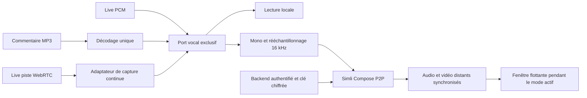

# Avatar parlant Simli — analyse fonctionnelle et technique

**Date :** 4 octobre 2026. **Statut :** analyse initiale conservée ; les décisions finales et leur implémentation sont décrites dans le guide et le plan actualisés.
**Arbitrage utilisateur intégré :** session et fenêtre persistantes pendant l'activation du mode vocal ; cette décision remplace l'ouverture par réponse et la rétention courte initialement proposées.
**Base examinée :** checkout courant de LIA, `main`, HEAD `10b4c022`, avec les modifications locales présentes. Les conclusions portent sur les fichiers effectivement lus, et non sur une version historique supposée. Les travaux concurrents sont à préserver.
**Exécution :** entièrement inline, sans sous-agent. Instructions de `CLAUDE.md`, de `apps/web/CLAUDE.md`, du corpus mémoire du projet, du Taskfile et des hooks examinées.
**Livraison :** [guide d’intégration](../../technical/SPEAKING_AVATAR.md), [qualification](2026-10-04-simli-media-qualification.md) et [plan TDD et lots d'exécution](../plans/2026-10-04-simli-speaking-avatar.md).

## 1. Synthèse d'alignement

Le besoin est de donner une présence visuelle crédible à **la voix déjà produite par LIA**, sans changer le fournisseur vocal, les outils, les autorisations ou le comportement conversationnel. L'utilisateur connecte son propre compte Simli, choisit un visage et autorise son affichage. La fenêtre flottante apparaît dès l'activation des commentaires vocaux ou du Live et reste visible entre les réponses. Elle se déplace et possède trois tailles : petit, moyen, grand.

Le premier périmètre comprend les **commentaires vocaux, Live et Live direct**, y compris le commentaire TTS issu du mode vocal classique. **La Radio est reportée**, conformément à la dernière instruction : sa distribution de voix et sa continuité éditoriale méritent une intégration distincte. Ni son lecteur, ni sa musique, ni ses préférences ne sont modifiés dans ce périmètre.

Une ouverture froide a pris environ **4,4 secondes** lors de la sonde. L'utilisateur écarte donc l'ouverture à chaque réponse et accepte le maintien pendant les silences : **la connexion démarre à l'activation du mode, puis reste ouverte**. Le démarrage initial et le réveil après veille conservent ce délai technique ; il n'est plus ajouté à chaque prise de parole. La fenêtre apparaît immédiatement avec un état de connexion, puis affiche le flux reçu dès qu'il est prêt. Le repli local reste réservé à un démarrage non terminé ou à une erreur ; il ne sert plus de stratégie normale de démarrage par réponse.

Cycle fonctionnel retenu, sous réserve de l'autorisation avatar et d'un connecteur utilisable : **commentaires vocaux activés → fenêtre et session maintenues jusqu'à désactivation** ; **Live / Live direct activé → fenêtre et session maintenues jusqu'à veille ou désactivation** ; **réveil Live → nouvelle ouverture immédiate**. Aucun timer de fin de phrase, d'inactivité conversationnelle ou de rétention courte ne ferme Simli. Les limites imposées par le fournisseur, la perte réseau, la sortie du shell authentifié et la révocation sont des interruptions techniques distinctes, traitées explicitement. Les silences et l'écoute font partie de la consommation personnelle Simli acceptée par cet arbitrage.

**Arbitrages retenus :**

| Décision | Justification |
|---|---|
| Connecteur Simli à clé utilisateur, indépendant du connecteur Live | Le visage accompagne une voix ; il ne constitue ni un fournisseur de conversation, ni un outil d'agent. |
| Avatar désactivé par défaut, activation explicite de compte | Une préférence locale de décoration ne doit pas autoriser une dépense sur le compte Simli. |
| Une seule destination vocale audible | L'audio de Simli et son image doivent provenir de la même restitution distante ; le doublage local provoque écho et désynchronisation. |
| Port de sortie commun, adaptateurs par transport | `AudioQueue` ne reçoit pas les flux natifs OpenAI et ElevenLabs WebRTC. |
| WebRTC P2P Simli natif, protocole Compose v2, une tentative explicite | La sonde l'a éprouvé ; le SDK actuel relance automatiquement et peut changer de transport. La maîtrise des tentatives et du coût prime sur ces relances implicites. |
| Connexion et affichage persistants dès activation du mode | Arbitrage explicite utilisateur pour éviter les ouvertures répétées ; consommation des silences acceptée. |
| Visage stable pour la session ; changement à une frontière vocale sûre | `faceId` est un paramètre de création ; aucun changement de visage en cours de session Compose n'est documenté. |
| Psyche facultative et locale, sans nouvelle inférence | Compose ne publie pas de commandes temps réel pour sourire, regard ou émotion. |
| Radio différée | Plusieurs voix et rôles, lecture avec position, interruptions et musique séparée ; un seul visage pour tous les rôles ne répondrait pas au besoin précisé. |

Les alternatives écartées sont une modification d'`AudioQueue` seule, insuffisante pour les transports natifs ; l'ouverture par réponse et la rétention courte, rejetées par l'utilisateur en raison du délai froid. Le maintien pendant le mode actif est désormais la décision de référence. L'utilisation directe du SDK Simli reste une alternative future si ses reprises, sa journalisation et ses transports sont rendus contrôlables et qualifiés. Le protocole natif impose en contrepartie un contrat figé, des tests de signalisation et un suivi de dérive fournisseur.

**Aucun arbitrage métier bloquant ne subsiste pour démarrer les lots de qualification et le socle.** Les inconnues restantes sont des portes de validation technique, détaillées en section 12 ; elles ne sont pas présentées comme des capacités déjà prouvées.

## 2. Faits, hypothèses corrigées et limites de preuve

### 2.1 Sonde réelle déjà effectuée

Une seule session payante a été ouverte et fermée sur Chromium sous Windows. Les résultats détaillés et la chronologie sont conservés dans le rapport jetable `.tmp/simli-feasibility-20261004/report.md` et son `result.json`, ignorés par Git. Aucun nouveau test payant n'est nécessaire à cette analyse et aucun n'a été lancé ici.

| Observation | Valeur | Ce qu'elle prouve / ne prouve pas |
|---|---:|---|
| Jeton demandé → première image affichée | 4 399 ms | Un établissement froid dans une seule configuration ; pas un p95. |
| Aller-retour HTTP du jeton | 235 ms | Sous-étape de la préparation, hors acquisition ICE. |
| Premier PCM envoyé → première énergie audio distante décodée | 290 ms | Transport chaud dans cette sonde ; pas délai physique des haut-parleurs, ni décalage lèvres/voix. |
| Tampon applicatif volontaire de 3 s → énergie distante | 3 295 ms | Le tampon ajoute réellement environ 3 s. |
| Jeton demandé → énergie distante, tampon compris | 7 694 ms | Hors temps de génération LIA. |
| Entrée PCM | 30 s | Inclut un marqueur sonore de 250 ms et les pauses naturelles. |
| Silence après vidange vocale | 60,007 s | Aucun nouveau PCM envoyé pendant cette période. |
| Durée dans l'historique fournisseur | 97 s | Durée de session, pas montant de facture. |
| Solde déclaré par l'utilisateur | 200 → 198 minutes | Débit incompatible avec une simple hypothèse de facturation limitée aux 30 s parlées ; arrondi et prix exacts non établis. |
| Sessions actives après fermeture | 0 | Fermeture vérifiée pour cette sonde. |

Les pertes audio/vidéo observées étaient nulles. Environ 20,9 Mo vidéo ont été reçus pendant cette session : la bande passante et l'énergie mobile font partie de la qualification. Le nombre de trames décodées ne prouve pas la cadence réellement affichée. Aucun alignement labial perceptif, aucun Android Simli et aucun iOS Simli n'ont été validés.

Le UUID transmis sous le nom « Impressed Tiger » a affiché une femme, cohérente avec le preset public Tina. Le produit doit utiliser le UUID comme identité technique et une prévisualisation vérifiée comme identité visuelle ; il ne doit pas intégrer ce nom comme une vérité. `GET /faces` a répondu avec une liste vide sur ce compte alors que le preset fonctionnait : « aucune face privée » ne signifie pas « aucune face disponible » ni « clé invalide ».

### 2.2 Vérification des hypothèses initiales

| Hypothèse | Résultat confronté aux sources et au code |
|---|---|
| Simli accepte PCM16 mono 16 kHz | Confirmé par le contrat audio et la sonde : PCM signé little endian brut, sans en-tête WAV. |
| Tout ElevenLabs sort à 24 kHz | Faux. Le TTS de LIA utilise un format MP3 44,1 kHz ; le Live WebSocket ElevenLabs lit sa fréquence dans les métadonnées `pcm_*`. Gemini Live utilise 24 kHz ; les transports WebRTC sont traités à leur fréquence effective. |
| Le MP3 décodé garde nécessairement sa fréquence encodée | Faux : `decodeAudioData` rééchantillonne selon le contexte du navigateur. Lire `AudioBuffer.sampleRate`. |
| Le SDK impose un tampon de 3 s | Faux : `audioBufferSize=3000` représente des échantillons, soit 187,5 ms à 16 kHz, pour ses aides de capture. `sendAudioData` n'applique pas ce tampon. La sonde avait ajouté volontairement 3 s. |
| Couper le son local suffit | Nécessaire, mais insuffisant : il faut aussi une capture continue, les interruptions, la vidange distante, l'autoplay et un propriétaire unique des ressources. |
| Un signal de fin TTS signifie fin de restitution | Faux : `voice_complete` indique la fin de production. `ACK` Simli indique réception ; `SPEAK`/`SILENT` ne donnent pas un horodatage de lecture. |
| Android WebRTC est validé pour cette intégration | Faux : les preuves mobiles existantes couvrent notamment offre RTC et chargement Worklet, pas le chemin complet Simli. |
| Tous les contrôles Simli améliorent la qualité | Non établi. Aucun réglage Compose de FPS, résolution, intensité émotionnelle ou regard n'est déclaré ; les paramètres d'autres produits Simli ne s'appliquent pas implicitement à Compose. |
| Les appels TTS existants transmettent tous la prosodie psyche | Faux : la boucle commune peut la résoudre, mais les callbacks progressifs inspectés ne transmettent pas ces paramètres. |

### 2.3 Cartographie des preuves dans LIA

Les chemins suivants sont existants et ont été inspectés. Les futurs fichiers du plan sont explicitement des créations prévues.

| Point de contrôle | Source existante | Conclusion et incidence |
|---|---|---|
| Instructions et gates | `CLAUDE.md`, `apps/web/CLAUDE.md`, `Taskfile.yml`, `.github/hooks/` | Respect des transactions courtes, typage, i18n, ratchets et absence de commit non demandé. |
| Connecteurs | `apps/api/src/domains/connectors/models.py`, `schemas.py`, `service.py`, `router.py`, `api_key_verifiers.py` | Clés chiffrées par propriétaire, métadonnées JSONB ; registre explicite de vérification fonctionnelle. |
| Sessions DB propres | `apps/api/src/domains/connectors/session_scope.py`, `active_client.py`, `api_key_use.py` | `DetachedConnectorService` et unité de travail existants ; aucune transaction empruntée ne doit être fermée par le client. |
| Catégories | `connectors/models.py`, `provider_resolver.py`, `tests/unit/domains/connectors/test_mutual_exclusivity.py` | Les catégories à un membre existent ; un commentaire ancien du resolver évoque deux membres, mais les fonctions et les tests acceptent explicitement les catégories à un membre. |
| Limites et coût | `domains/usage_limits/cost_bearers.py`, `domains/voice/elevenlabs_concurrency.py`, `infrastructure/rate_limiting/`, `infrastructure/cache/key_families.py` | Déclarer le porteur de coût ; réutiliser le pattern de bail Redis partagé plutôt qu'un verrou de processus. |
| Switches | `domains/feature_switches/registry.py`, `domains/capabilities/service.py`, `api/v1/routes.py`, `apps/web/src/hooks/useAppConfig.ts`, `useSettingsAvailability.ts` | Capability opérateur et capacité utilisateur effective à maintenir cohérentes ; consumers front des flags identifiés. |
| Préférences | `domains/users/models.py`, `schemas.py`, `user_column_map.py`, `live_preferences_columns.py` | Préférence compte typée et classée ; pas de réutilisation du stockage des yeux pour l'opt-in payant. |
| Commentaires | `apps/web/src/lib/audio-queue.ts`, `hooks/useVoicePlayback.ts`, `types/chat.ts` | FIFO et génération d'annulation existent ; `AudioQueue` possède actuellement la destination locale. |
| Contrat SSE | `lib/sse-handlers/handlers.ts`, `index.ts`, `apps/api/src/domains/agents/api/schemas.py`, `services/streaming/voice_coordinator.py`, `voice_stream_helpers.py` | Événements et garde anti-replay existants ; début progressif avec premier chunk. Aucun besoin d'événement anticipé pour une connexion maintenant liée au mode. |
| Live commun | `apps/web/src/lib/live/types.ts`, `transport.ts`, `session-controller.ts`, `pcm-player.ts` | Propriétés de sortie PCM/native/managed, player injectable, modes délégué/direct partagent la sortie. |
| Live fournisseurs | `lib/live/transports/gemini-ws.ts`, `elevenlabs-ws.ts`, `openai-webrtc.ts`, `elevenlabs-webrtc.ts`, `index.ts` | Deux chemins PCM, deux chemins propriétaires de piste distante ; aucune interception unique déjà disponible pour tous. |
| SDK ElevenLabs installé | `apps/web/package.json`, `node_modules/@elevenlabs/client/dist/internal.d.ts`, adaptateurs et connexion WebRTC de ce package | Interface exportée d'adaptateur audio, version installée 1.25.0 ; callback audio usuel filtré par amplitude, donc inadapté comme horloge PCM continue. |
| Fenêtre et ergonomie | `hooks/useFloatingDrag.ts`, `components/eyes/EyesWidget.tsx`, `stores/eyesWidgetStore.ts`, `app/[lng]/dashboard/layout.tsx` | Réutiliser gestes, clavier et shell ; compléter le recalage taille/viewport sans régression des yeux. |
| Réglages et stockage | `components/settings/settings-section-registry.tsx`, `components/settings/connectors/`, `constants/connectors.ts`, `stores/revisionStore.ts`, `lib/auth.tsx`, `lib/client-storage-purge.ts` | Déclaration de section, compte connecté, révisions et purge à traiter explicitement. |
| Sécurité navigateur | `apps/web/src/lib/csp.ts` | Ajouter l'origine WebSocket Simli exacte ; ne pas ouvrir une politique `wss:*` en production. |
| Psyche et voix | `apps/web/src/stores/psycheStore.ts`, `types/psyche.ts`, `components/eyes/rig/live-context.ts`, `apps/api/src/domains/voice/service.py`, `prosody.py`, `domains/live/service.py` | État local déjà disponible ; modulation arousal partielle, pas commande d'expression Simli. |
| Radio | `apps/web/src/lib/radio/player.ts`, `audio-element.ts`, `web-audio.ts`, `apps/api/src/domains/radio/formats.py`, `production.py`, `schemas.py` | Lecteur autonome, musique indépendante, rôles et offsets déjà présents. Hors réalisation initiale. |
| Mobile | `docs/guides/GUIDE_MOBILE_ANDROID.md`, `GUIDE_MOBILE_IOS.md`, tâches `mobile:probe:*` | Réutiliser le protocole de preuve, compléter par sessions réelles, pas assimiler WebKit automatisé à un iPhone. |

## 3. Architecture de bout en bout

Le schéma représente un choix exclusif entre lecture locale et Simli pour une prise de parole. Le backend crée un jeton et fournit ICE ; il ne relaie pas chaque paquet PCM. Le navigateur envoie **uniquement l'audio assistant**, jamais le microphone de la personne, à Simli. Le fournisseur Live garde son propre chemin d'entrée, ses outils et ses règles de consentement.

### 3.1 Contrats et responsabilités

Créer un petit domaine backend `avatars` pour configuration, catalogue de visages et admission de session ; garder la clé dans le domaine `connectors`. Le client HTTP Simli possède validation des réponses, timeouts et nettoyage réseau. Le domaine ne dépend pas du graphe des agents.

Côté front, le port vocal possède une source discriminée (`comment`, `live`, `live_direct`), un identifiant de prise de parole, une génération d'annulation, la fréquence et l'ordre des trames. Il distingue **entrée produite**, **entrée terminée**, **sortie audible**, **sortie vidée** et **annulation**. Aucun état de lecture ne se déduit du seul nombre de chunks ou de leur durée estimée.

`AudioQueue` conserve ses garanties de FIFO, de décodage et de `stop`. Sa destination devient injectable, avec la destination locale par défaut ; aucune nouvelle branche fournisseur dans chaque boucle. Le `LivePlayer` injectable devient le pont pour les chemins PCM. Les pistes WebRTC passent par un adaptateur distinct qui possède capture et routage audio. Le moteur Simli possède seul PC, WebSocket, pistes reçues de Simli, éléments audio/vidéo, graphe de restitution, timers et bail backend.

Les pistes du fournisseur Live et son microphone restent la propriété du transport ou SDK existant : l'adaptateur les emprunte, sans appeler leur `stop()` lorsque l'avatar se désactive. Fermer Simli n'arrête pas la conversation Live. L'élément vidéo Simli est toujours `muted`, même si sa `srcObject` contient une piste audio ; seule la restitution audio propriétaire est audible. Cette règle évite de doubler le son distant entre deux éléments. Le moteur et les Worklets avatar sont chargés/créés à la demande, après geste/warmup approprié ; feature off ne crée ni contexte avatar, ni capture, ni requête fournisseur.

Il n'y a ni hook géant supplémentaire dans `useChat`, ni logique réseau dans la fenêtre. Le shell authentifié monte un hôte unique. L'affichage ne remonte pas la connexion à chaque phrase, déplacement ou taille. Démonter le shell, changer de compte ou terminer le Live invalide toutes les opérations en vol.

### 3.2 Convertir l'audio sans dégrader la parole

Le traitement est : décodage éventuel → lecture de la fréquence effective → mélange mono → filtre anti-repliement et rééchantillonnage → saturation sûre → PCM16 LE → paquets cadencés.

Pour le MP3, réutiliser le décodage existant une seule fois. Pour le PCM et les pistes continues, employer un convertisseur à état conservant phase et mémoire du filtre entre les chunks. Le rééchantillonnage linéaire du player local n'est pas une preuve de filtrage correct pour descendre de 48 à 16 kHz. Le lot DSP choisit un FIR polyphasé à fenêtre, vérifié par signaux et spectre ; ses coefficients et sa taille sont figés après qualification de coût CPU et d'atténuation. L'absence de SharedArrayBuffer ne doit pas empêcher la capture ; messages Worklet et buffers transférables suffisent pour le premier périmètre.

Préserver les trames faibles et les silences internes à une réponse. Un seuil d'analyse peut renseigner l'UI ; il ne retire jamais de PCM du flux. Aucun accélérateur de débit, changement de hauteur, normalisation agressive ou suppression de pauses destiné à « animer davantage » le visage.

Commencer avec les paquets de 6 000 octets à 16 kHz, soit 187,5 ms, utilisés dans la sonde et recommandés dans la documentation. Accepter un dernier paquet partiel compatible avec le protocole. Conserver le reste entre callbacks plutôt que compléter chaque chunk avec du silence artificiel. Les limites de mémoire s'appliquent séparément aux données encodées et au PCM. Fixer une borne initiale de 5 s de PCM préparé, et de 2 MiB de données encodées en attente, puis mesurer ; ces valeurs sont des choix de conception, pas des exigences Simli.

Pas de tampon fixe de 3 s. Toute augmentation du tampon doit répondre à un sous-remplissage mesuré et respecter le SLO de latence. Une saturation entraîne arrêt contrôlé du chemin avatar et diagnostic borné, jamais accumulation jusqu'à épuisement mémoire ni suppression arbitraire de phonèmes.

### 3.3 Capturer et couper les sorties natives

OpenAI WebRTC attache aujourd'hui sa piste distante à un élément audio. Un graphe propriétaire de la `MediaStream` doit la capter continûment et choisir son gain de restitution locale ; éviter de dépendre d'`HTMLMediaElement.captureStream`, non fiable comme contrat iOS. Le microphone existant reste unique et son AEC doit être qualifié avec le son distant de Simli.

La capture continue n'autorise pas l'envoi accidentel d'une piste microphone ni l'injection de parole provenant d'un ancien tour. Le port admet l'audio assistant et conserve toutes ses pauses et trames faibles. Si le signal de début arrive après les premiers échantillons, un pré-roll local borné préserve ce début ; s'il ne permet pas de garantir cette continuité, la prise de parole reste locale. Aucun seuil d'amplitude ne remplace l'identité de réponse. L'absence de PCM entre les réponses ne déclenche plus une fermeture locale de Simli. La compatibilité de la politique idle fournisseur avec cette persistance doit être qualifiée ; aucun faux message de keepalive ni bruit audible n'est inventé.

ElevenLabs WebRTC confie lecture et microphone à son SDK. Le callback `onAudio` courant élimine les blocs d'amplitude faible : l'utiliser tel quel modifierait les pauses et les sons faibles. Le package installé expose `setWebRTCAudioAdapterFactory` via `@elevenlabs/client/internal`. La qualification doit prouver qu'un adaptateur propriétaire conserve les analyses et permissions du SDK, capte toutes les trames avant le filtrage, et coupe réellement le son local, y compris dans WKWebView. Enregistrer la factory après l'initialisation du module navigateur, la rendre stable et sans état global de compte ; chaque instance possède ses ressources. Ne pas rechercher des éléments audio privés du SDK dans le DOM, patcher `node_modules` ou imposer un autre transport à iOS.

L'interface `internal` n'est pas une garantie publique de stabilité : contrat de compatibilité testé sur la version verrouillée et lors de chaque mise à jour. Une qualification échouée laisse le mode vocal local opérationnel et interdit d'annoncer Simli disponible pour ce transport. Le périmètre Live complet n'est livré qu'après résolution de cette porte.

### 3.4 Cycle de vie et état

Deux machines coopèrent : connexion (`idle`, `preparing`, `ready`, `closing`, `failed`) et sortie (`idle`, `local`, `remote`, `draining`, `interrupted`). L'epoch de connexion change avec activation, fermeture ou remplacement technique ; l'epoch de prise de parole change avec interruption/nouveau tour. Annuler une phrase invalide ses chunks sans annuler la connexion persistante. L'affichage suit la demande de mode, pas l'état `remote` de la sortie.

| Événement | Règle |
|---|---|
| Autorisation avatar + activation commentaires / Live | Afficher immédiatement la fenêtre et lancer une tentative pour ce mode ; armer le délai d'établissement. |
| Consulter les visages / éditer un choix non enregistré | Aucun jeton ou essai additionnel ; une session déjà active continue. |
| Production vocale confirmée | Créer l'identité de prise de parole ; utiliser la connexion existante, sans jeton ni ouverture par réponse. |
| Début d'une prise de parole, Simli prêt | Affecter la sortie distante, suspendre la sortie locale, conserver cet engagement jusqu'à la frontière suivante. |
| Début d'une prise de parole, Simli non prêt | Lire localement immédiatement ; ne pas transférer un préfixe déjà entendu. |
| Première image et lecture distante prêtes | Remplacer l'état de connexion par la vidéo ; seule la restitution effective détermine l'état « parle ». |
| Pause interne / écoute / attente | Fenêtre et session conservées ; posture idle du flux Simli, sans lèvres animées artificiellement. |
| Fin de production | Passer en vidange ; ne pas annoncer « fini » tant que la sortie reste audible. |
| Fin distante effective | Revenir en sortie idle ; ni masquage, ni timer de fermeture, ni nouveau token au tour suivant. |
| Stop de lecture / interruption / nouvelle prise de parole | Annuler files locales et PCM, envoyer `SKIP` si nécessaire ; conserver la connexion. Une purge incertaine relève d'une panne technique. |
| Désactivation du mode propriétaire ou de l'autorisation avatar / Live standby | Fermer la demande concernée ; veille Live interdit la reprise automatique par les commentaires restés activés. |
| Logout / sortie du shell / révocation / session externe terminée | Nettoyage technique et invalidation ; ne pas laisser une ancienne session autonome. |
| Arrière-plan | Live applique sa veille existante, puis ferme Simli. Les commentaires ne reçoivent pas un nouveau timer hidden : les restrictions OS restent à qualifier. |
| Réseau/Simli indisponible avant toute restitution | Repli sur la réponse locale complète si aucune restitution n'a commencé. |
| Panne après début distant | Couper la restitution défaillante ; reprendre localement à la prochaine frontière sûre. Ne jamais rejouer automatiquement une portion déjà possiblement entendue. |

Les signaux Simli `SPEAK`/`SILENT` assistent la détection de parole, sans commander visibilité ou fermeture. `DONE` ferme après le dernier audio : réservé à la fin du mode ou au remplacement de transport, jamais à une fin de phrase. `SKIP` purge l'audio en attente et conserve la session ; son effet et le résidu audible restent à qualifier.

L'utilisateur peut interrompre une phrase sans désactiver le mode ni fermer l'avatar. Une désactivation explicite arrête effectivement la session payante. Enregistrer un nouveau visage pendant un mode actif exige un remplacement technique de session à une frontière vocale sûre ; pendant un mode inactif, ce changement ne crée aucun jeton. La fenêtre conserve position/taille et indique ce remplacement. L'interface garde le texte disponible et signale une panne sans promettre de rejouer exactement une portion déjà entendue.

### 3.5 Demande persistante, priorité des modes et renouvellement

La demande effective dépend de l'autorisation `speaking_avatar_enabled`, du connecteur et du mode actif. Hors Live, `voice_enabled` active la demande commentaires tant que le shell authentifié est chargé, y compris après restauration d'une préférence activée. Pour Live/direct, le démarrage du mode active immédiatement la demande, même si les commentaires sont désactivés. Basculer l'autorisation avatar on alors qu'un mode est actif démarre Simli ; off le ferme sans désactiver la voix.

Le Live possède la priorité sur les commentaires. Un Live en veille bloque toute demande Simli, même si `voice_enabled` reste true : pas de réouverture causée par cette préférence. Le réveil recrée la demande Live et réaffiche la fenêtre. Après fin du Live, les commentaires reprennent comme propriétaire s'ils restent activés ; sinon la session se ferme. Un transfert commentaires↔Live avec même clé/visage peut réutiliser l'unique connexion, après purge des anciennes prises de parole. Jamais deux sessions pour les deux modes simultanément.

Le SSE `voice_comment_start` peut déjà fournir le run ; il sert à l'identité de restitution, avec la génération locale du flux. **L'événement supplémentaire `voice_preparing` n'est plus nécessaire** : l'ouverture dépend du mode et non d'une réponse future. La reconnexion SSE ne crée ni jeton ni replay audio. Les guards Radio/réunion continuent d'interdire les commentaires audio, sans fermer une session commentaires autorisée ni l'utiliser pour animer les voix Radio.

Le délai initial de connexion proposé reste 6 s, avec état visible et repli local si une réponse commence avant readiness. Les anciens timers de rétention 10 s, idle local 30 s et plafond applicatif 600 s sont supprimés de la politique de mode. Le fournisseur expose `maxSessionLength` et `maxIdleTime`, mais ne documente pas une valeur assurant une session infinie. Proposition initiale : durée technique de session de 3 600 s et idle fournisseur aligné sur cette durée, à qualifier ; ne pas utiliser `0`/`-1` ou un keepalive non documenté pour prétendre supprimer une limite.

Une expiration fournisseur prévue peut nécessiter un renouvellement séquentiel autorisé par le maintien du mode actif. Préparer ce renouvellement à une frontière sûre, sans deux sessions concurrentes et sans replay ; la fenêtre reste présente avec un état de reconnexion. La latence de ce remplacement exceptionnel doit être mesurée, et aucune continuité sans trou n'est promise avant cette preuve. Une erreur réseau/401/429 n'autorise pas une boucle de retries payants : état dégradé visible et reprise bornée sur action de reconnexion ou événement de cycle de vie pertinent, jamais sur chaque chunk. Après désactivation/veille, aucun renouvellement déjà planifié ne doit partir. La persistance longue et la sémantique idle deviennent la porte Q7.

## 4. Connecteur, données, API et sécurité

### 4.1 Autorités de données

| Donnée | Autorité et conservation |
|---|---|
| Clé Simli | `Connector.credentials_encrypted`, propriétaire authentifié ; jamais retournée au navigateur, stockée en clair, placée dans `.env` public ou copiée dans ce document. |
| Type et disponibilité opérateur | `ConnectorType.SIMLI`, catégorie fonctionnelle `avatar`, configuration globale du connecteur et capability media dédiée. La catégorie ne désactive aucun fournisseur Live. |
| Activation utilisateur | Nouvelle préférence booléenne de compte `speaking_avatar_enabled`, défaut et défaut serveur `false`, réponse utilisateur et `user_column_map` cohérents. |
| Visage | Schéma typé dans `connector_metadata` : `face_id`, nom de présentation facultatif, provenance ; affectation JSONB par nouveau dictionnaire, champs de vérification préservés. |
| Tailles et position | Store local de présentation propre à l'avatar, sans clé, jeton, visage ou consentement. Sémantique de préférence de dispositif comme les yeux. |
| Session et PCM | Mémoire du moteur ; aucun checkpoint LangGraph, historique de conversation, registre de données ou IndexedDB. |
| Bail | Redis opérationnel avec TTL, propriétaire opaque et empreinte de credential ; pas un journal de coût. |

L'enum SQLAlchemy des connecteurs est stockée sans enum PostgreSQL native (`native_enum=False`). Ajouter le type n'exige donc pas un `ALTER TYPE` PostgreSQL imaginaire. Une migration est néanmoins nécessaire pour la préférence de compte et le seed de disponibilité/configuration ; vérifier le head Alembic réel au moment de créer la migration, et rejouer montée/descente selon le pattern du dépôt.

Reprendre les cartes et formulaires du connecteur API-key, avec section « Avatar parlant » dans le registre des réglages. Le template `NEW_CONNECTOR_CHECKLIST` sert pour chiffrement, tests, lifecycle et catalogue. Ses étapes OAuth, scopes, outils, agents et contexte ne s'appliquent pas à ce média ; ne pas créer de faux outil Simli pour satisfaire la checklist.

### 4.2 Contrats backend prévus

| Opération authentifiée | Contrat proposé |
|---|---|
| Activation/vérification du connecteur | Route API-key existante ; verifier fonctionnel enregistré, GET ICE autorisé et borné, jamais création de session comme validation. Une liste de visages vide ne rend pas la clé invalide. |
| `GET /avatars/config` | Disponibilité effective, préférence utilisateur, visage sélectionné, bornes techniques fournisseur et provenance de catalogue. Aucun secret ni estimation de solde. Disponible pour comprendre une désactivation opérateur. |
| `PUT /avatars/settings` | Seule voie d'écriture de la préférence et du visage ; payload fermé et borné, validation de propriété, réponse canonique, invalidation des caches/révisions concernées. |
| `GET /avatars/faces` | Presets publics vendored et faces du compte si accessibles. Erreur fournisseur conserve la galerie publique et signale la provenance dégradée. Pas de session vidéo. |
| `POST /avatars/sessions` | Mode propriétaire discriminé, identité de demande persistante et epoch de connexion. Vérifier compte, autorisation avatar, mode réellement autorisé (voice_enabled pour commentaires, session Live du propriétaire pour Live), capability, credential, admission et cadence ; fournir token/ICE/paramètres techniques/lease, `no-store`. Aucune dépendance au numéro de phrase. |
| Renouvellement/libération de bail | Routes propriétaires idempotentes, TTL borné ; fin ou fermeture navigateur libère au mieux. Aucun appel ne promet de révoquer un jeton Simli déjà délivré. |

Les réponses fournisseur non conformes passent par des modèles Pydantic fermés ou des parsers tolérants explicitement bornés aux champs attendus. Les variations déjà observées dans l'historique ne justifient pas `Any` partout. L'historique et le solde ne sont pas des dépendances nécessaires au runtime initial.

Lecture de credential dans une unité de travail courte, fermeture DB, attente HTTP, puis mise à jour éventuelle dans une autre unité propre avec contrôle de version de credential. La révocation/rotation concurrente invalide le résultat avant délivrance. Ne pas garder la session FastAPI ouverte pendant une attente réseau, ni terminer une transaction appartenant au caller. Ajouter les preuves PostgreSQL, pas seulement un mock de commit.

### 4.3 Admission et protection des crédits

Une instance du moteur par shell et un bail Redis partagé par credential actif limitent la concurrence à une session dans le premier périmètre. Inclure le compte et une identité de propriétaire dans le bail ; deux onglets ou deux comptes réutilisant la même clé ne doivent pas chacun ouvrir une session concurrente. Le second obtient une indisponibilité temporaire et garde la voix locale ; il ne ferme pas la session du premier. Réutiliser le pattern de bail partagé ElevenLabs, pas son compteur TTS tel quel.

Le claim précède la création du jeton ; un échec certain sans session libère dans `finally`. Le TTL ne doit pas libérer une capacité alors qu'une session distante peut encore exister : en cas de disparition du client ou d'issue POST inconnue, conserver une quarantaine jusqu'à la borne de session délivrée plus marge, ou jusqu'à fermeture fournisseur vérifiée. Un close navigateur ou une déclaration client de fin n'est pas à lui seul une preuve fournisseur : la libération doit rester conditionnelle, et une lecture d'absence de session peut lever la quarantaine sans ouvrir de vidéo. La heartbeat ne constitue pas un mécanisme de facturation. Une panne Redis refuse une nouvelle vidéo et conserve la voix locale. Un échec de validation ne lance aucun token.

Les plafonds serveur ne sont pas modifiables à l'infini par un payload client. Aucun `0 = illimité`. Les 429 respectent `Retry-After` lorsqu'il est valide ; le backoff des lectures et la temporisation d'admission sont bornés, sans relancer une session payante. Un coupe-circuit limité évite de refaire une tentative à chaque chunk. Les lectures de catalogue et ICE sont mises en cache par portée et durée utiles, jamais avec partage de credential ou TURN entre propriétaires.

Les APIs Compose examinées ne fournissent pas de révocation/arrêt serveur garantissant la fermeture immédiate d'une session navigateur perdue. La désactivation bloque les créations et provoque le close client ; le plafond fournisseur borne le résidu en cas de crash. Ne pas annoncer une garantie plus forte. Une diffusion de changement de réglage entre onglets peut accélérer le close ; elle ne remplace ni les contrôles serveur, ni ce plafond.

### 4.4 Confidentialité et navigateur

La clé longue durée reste au backend ; jetons et credentials TURN demeurent en mémoire et ne figurent ni dans les logs, ni dans les traces d'erreur, ni dans les métriques. Le protocole P2P place le jeton dans l'URL WS : filtrer aussi ces URLs dans les diagnostics, et désactiver toute journalisation fournisseur susceptible de les publier. Pas de secret en fixture. Les routes de mutation/session suivent les protections d'authentification et d'origine du dépôt, avec contrôle de propriété côté serveur ; un identifiant de source déclaré par le client n'accorde aucun droit supplémentaire. Logout et suppression de compte invalident le runtime et les caches de visages privés ; rotation de clé invalide aussi ICE en cache.

Ajouter seulement `wss://api.simli.ai` à la CSP de production requise par le transport retenu. Le fait que le développement autorise davantage d'origines ne prouve pas la production. Aucun wildcard LiveKit préventif. Récupérer les ICE temporaires depuis l'origine serveur fixe ; ne jamais accepter une URL fournisseur libre du navigateur. Les miniatures de catalogue sont des URLs HTTPS validées sur hôtes connus ; un UUID manuel est borné et ne devient jamais une URL à fetcher.

L'interface explique que la voix de l'assistant est envoyée à Simli et que la connexion maintenue pendant le mode actif consomme aussi les silences et l'écoute. L'horloge locale reste cohérente lors d'un renouvellement technique. Elle ne transmet ni transcription, ni document, ni historique relationnel, ni prompt psyche en plus de l'audio. Les logs techniques gardent raisons d'échec et latences agrégées, sans contenu, identité de visage ou métrique de minutes personnelles persistée.

## 5. Revue complète des contrôles Simli applicables

Sources primaires vérifiées : [contrat REST complet](https://api.simli.ai/openapi.yaml), [contrat WebSocket](https://api.simli.ai/asyncapi.yaml), [jeton Compose](https://docs.simli.com/api-reference/compose-session-token), [SDK JavaScript](https://docs.simli.com/api-reference/javascript), [source du SDK](https://raw.githubusercontent.com/simliai/simli-client/main/lib/client.ts).

### 5.1 Les huit champs de création Compose

| Paramètre | Choix / qualification |
|---|---|
| `faceId` | Visage utilisateur sélectionné et validé ; qualité jugée sur ce visage, pas sur le nom fourni. |
| `apiVersion` | `v2` explicite, contrat testé et figé. |
| `sessionAggregator` | Omettre initialement : aucun besoin de regroupement de facturation personnelle. Une future corrélation serait opaque, sans user ID. |
| `handleSilence` | `true` initial pour envoi explicite de chunks. Qualifier `false` pour capture continue, comme le recommande le guide SDK ; ne pas transposer cette recommandation automatiquement à toute source PCM. Choix à la création, pas mutation en cours de phrase. |
| `maxSessionLength` | Durée technique explicite proposée de 3 600 s, distincte de la durée du mode ; renouvellement séquentiel si le fournisseur impose l'expiration. Valeur et borne effectivement acceptées à qualifier. |
| `maxIdleTime` | Aligné initialement sur la durée technique pour conserver l'avatar pendant les silences du mode ; sémantique et acceptation à qualifier. Plus de fermeture locale à 30 s ni rétention de 10 s. |
| `startFrame` | `0`, défaut documenté ; pas d'utilisation d'une sémantique ou de bornes non publiées. |
| `audioInputFormat` | `pcm16` explicite ; mono, 16 kHz, signed LE brut. |

### 5.2 Transport, buffers et contrôles de lecture

| Surface | Décision |
|---|---|
| P2P / LiveKit | P2P natif initial. LiveKit réservé à un lot distinct si sa nécessité réseau est prouvée et les reprises maîtrisées. |
| ICE / TURN | Lecture authentifiée bornée ; support des réseaux restrictifs ; erreur ICE → voix locale, sans retry payant automatique. |
| `enableSFU` | `true`, comme le chemin du SDK et la sonde ; vérifier les réseaux cibles. |
| Signalisation / URL | WebSocket officiel fixe, messages texte/SDP/ICE et binaire selon AsyncAPI. Aucun proxy ad hoc ni URL utilisateur. |
| `audioBufferSize` | Contrôle d'aide de capture SDK, pas utilisé comme configuration native ; notre packetizer reprend initialement 3 000 échantillons. |
| Éléments audio/vidéo | Une paire et un graphe de lecture possédés ; `playsInline`, readiness réelle, traitement du rejet de `play()`, pas de volume HTML supposé fiable sur iOS. |
| `SKIP`, `DONE`, `SPEAK`, `SILENT`, `ACK`, `STOP`, erreurs | Parseurs explicites, transitions testées, aucune assimilation ACK = parole terminée. |
| LogLevel | Aucun SDK Simli en initial ; journaux LIA sobres et filtrés. Si SDK ajouté, niveau explicitement restreint. |
| Timeouts / retries SDK | Les sources actuelles montrent délais fixes, retries et bascule vers LiveKit. Ne pas les subir comme politique de coût LIA. |
| `model` SDK `fasttalk` / `artalk` | Présent dans des types/examples mais absent du schéma REST v2 ; ne pas l'envoyer ou le proposer comme réglage de réalisme sans preuve d'acceptation et d'effet. |
| FPS, bitrate, résolution, émotion, regard, gestes | Aucun paramètre runtime Compose documenté. Mesurer le rendu reçu, ne pas inventer ces champs. |
| Auto agents et Trinity | LLM/TTS/émotion des endpoints Auto anciens et paramètres de génération d'un visage hors périmètre ; ils ne sont pas des contrôles de l'avatar Compose en lecture. |

« Utiliser toutes les options » signifie examiner toutes celles applicables et retenir celles utiles et prises en charge. Ajouter des options incompatibles ou toutes les maximiser ne garantirait ni fluidité ni réalisme. La qualité dépend surtout de la fidélité audio, de la continuité, de la synchro distante, du visage source et du réseau.

## 6. Fenêtre, animation et accessibilité

Une fenêtre dans le shell dashboard, trois presets propres au dispositif et un visage conservant son ratio. Largeurs initiales proposées : **160 / 240 / 320 px CSS**, réduites si le viewport l'exige, avec `object-fit: contain`. La hauteur doit laisser le visage complet et la barre de commandes accessibles ; la taille reçue de la vidéo détermine le ratio. Agrandir en CSS ne crée pas de détail supplémentaire.

Réutiliser `useFloatingDrag`, ses exclusions des éléments interactifs, son seuil de démarrage, pointer capture et déplacement clavier. Compléter sa capacité de recalage sur changement de taille, ratio vidéo et viewport : `ResizeObserver`, `VisualViewport` lorsqu'il existe, orientation, clavier mobile et safe areas. Conserver les comportements actuels des yeux et du dock avec des tests de non-régression. Ajouter `pointercancel`/perte de capture et libération des handlers ; pas de seconde implémentation de drag isolée.

Règles de présentation :

- Barre de commandes accessible sur touch et au focus, cibles d'au moins 44 px, noms traduits pour les trois tailles et la désactivation ; déplacement clavier et commande de recentrage.
- Pas de vol de focus lors de l'apparition automatique. Si la fenêtre disparaît pendant le focus d'une commande, le focus revient vers une commande vocale stable du shell.
- Respect des couches existantes : sous les dialogs et overlays modaux, sans couvrir durablement le composer, la navigation ni l'enregistreur de réunion. Le drag borne la totalité de la fenêtre, pas seulement son centre.
- Persistance du dernier emplacement et de la taille, y compris lors de réapparition, rotation et erreur de localStorage. Aucun reconnect sur resize/drag.
- La fenêtre apparaît dès activation effective du mode : état de connexion puis vidéo prête. Elle reste visible pendant attente, écoute, outils et silences. L'état « parle » suit uniquement la restitution effective ; aucune animation labiale ne simule une voix absente. Veille Live et désactivation retirent la fenêtre.
- Les yeux animés existants sont temporairement occultés pendant la présentation Simli, sans modifier leur préférence persistée. Ils reviennent selon leur propre activation lorsque Simli disparaît.
- Réduction des animations périphériques avec `prefers-reduced-motion`. Le visage en vidéo reste le contenu essentiel demandé ; pas de zoom, wobble, shake, filtre facial ou bouche animée locale superposés.

La fermeture explicite porte le sens « désactiver l'avatar parlant » et arrête la connexion, avec préférence de compte canonique mise à jour. Les fonctionnalités vocales restent accessibles. Le toggle global et le sélecteur de visage vivent dans la section de réglages enregistrée, avec les composants et tokens visuels existants. Ne pas dupliquer le même formulaire de clé dans plusieurs sections ; réutiliser les cartes connecteur comme présentation.

Galerie : presets publics versionnés, complétés par faces privées du compte. Des réponses privées sans noms/miniatures deviennent des entrées identifiées sobrement et une saisie de UUID nommée reste possible. Aucun essai animé payant au survol, à la sélection en brouillon ou à la consultation. Enregistrer un autre visage pendant un mode actif remplace la session existante à une frontière sûre, dans le cadre de la demande persistante ; mode inactif, aucune session créée. Une prévisualisation statique prouve seulement l'apparence de la miniature, pas sa performance d'animation.

## 7. Psyche, prompts, tokens et registres

La psyche peut enrichir avec mesure **la présentation autour du visage**, pas commander une expression Simli inexistante. Utiliser un instantané local minimal de plaisir/arousal disponible au début de la prise de parole, lié à sa génération. L'indication éventuelle est un cadre ou halo discret compatible avec le thème, sans pulse permanent ; état désactivé, manquant ou trop ancien → neutre. Un changement tardif de mood n'ouvre, ne prolonge et ne relance aucune session.

La voix existante peut déjà porter une intention expressive. `voice/prosody.py` module style/stabilité ElevenLabs à partir d'arousal quand son flag l'autorise ; pleasure y reste sans effet. Les callbacks progressifs inspectés ne passent pas uniformément cette modulation. La mise en cohérence de toutes les synthèses serait une amélioration vocale séparée, avec tests de compatibilité du modèle et de coût ; elle n'est pas requise pour envoyer fidèlement le TTS actuel à Simli.

Le prompt de commentaire et certains chemins Live savent déjà recevoir le bloc psyche. N'ajouter aucun prompt Simli, tag parlé, modèle LLM émotionnel ou nouveau slot `llm_models` pour l'avatar. **Surcoût d'inférence et de tokens attendu : zéro** pour cette intégration de rendu. Ne pas générer une deuxième version TTS d'une même phrase pour l'animation. Les budgets des conversations déléguées, outils et réponses restent les autorités existantes ; aucune extension de contexte ni relaxation des limites pour cette fonction.

Registres à mettre à jour : type/catalogue de connecteur, vérificateurs API-key, catégorie/display names, feature switch, capability effective, schémas et classification des préférences, familles Redis, porteur de coût, révisions front et section de réglages, i18n. **Pas de nouvel agent, tool manifest, contexte de données, clé `MessagesState` ou mémoire conversationnelle.** Les instantanés d'animation sont jetables ; aucun objet custom à faire survivre à msgpack. Les compteurs par prise de parole se réinitialisent à sa génération, pas à la longueur de `messages`.

Le coût Simli appartient exclusivement à `CostBearer.USER`, sans colonne de quota plateforme associée. Ne pas enregistrer ses minutes, crédits ou coûts dans le ledger LIA, `user_statistics`, l'historique ou des métriques personnelles. L'admission opérationnelle Redis et les diagnostics techniques agrégés ne deviennent pas une comptabilité cachée. L'UI peut afficher une horloge éphémère de connexion, incluant silences et écoute, et un lien au dashboard fournisseur ; aucun solde inventé ni prix reconstitué à partir des deux minutes affichées. Le maintien facturable pendant l'activation est désormais un choix explicite utilisateur, sans limite locale de silence cachée qui annulerait ce choix.

Le TTS/STT/LLM financé par l'instance reste compté et attribué à l'utilisateur comme actuellement, y compris à l'intérieur d'une conversation Live déléguée. L'avatar ne détourne pas ces écritures. En mode plateforme **sans clé Simli utilisateur**, l'avatar est indisponible et la voix fonctionne normalement. Aucune clé plateforme de secours en phase 1. Un financement plateforme futur exigerait tarification vérifiée, réservations, ceiling, attribution des échecs et affichage ; il ne peut pas être activé par une simple variable d'environnement supplémentaire.

## 8. Impacts directs et indirects

| Couche | Impact direct | Effets indirects et prévention |
|---|---|---|
| Backend connecteurs | Nouveau type, verifier lecture, metadata typée, catalogue opérateur | Rotation/révocation concurrentes, caches, mutual exclusion et notices ; garder propriété et transactions courtes. |
| Backend avatars | Admission, jeton, ICE, config, faces et lease | Rate limits inter-workers et multi-onglets ; aucun relay PCM central ni job persistant inutile. |
| Base | Préférence booléenne et seed, metadata existante | Migration upgrade/downgrade, export/purge compte et classification des colonnes ; pas de table de consommation Simli. |
| SSE agents | Identité vocale via événements existants | Pas de nouvel événement de préconnexion ; replay, annulation et événements hors ordre indépendants de la connexion persistante. |
| DSP/front | Destination injectable, capture, resampling et FSM | Retard, CPU, pertes de trames, deux AudioContexts, fuite de pistes ; propriétaire unique et tests de durée/ordre. |
| Live | Adapters PCM/native/managed et état de restitution | Barge-in, AEC, wake word, standby, direct/delegated, permissions ; ne pas confondre idle provider et silence distant. |
| UI | Fenêtre, réglages, trois tailles, galerie | Mobile/clavier/safe-area, z-index, yeux, focus et navigation ; réutilisation et tests responsive. |
| Sécurité | Credentials, tokens mémoire et CSP exacte | Logs d'URL, payload malformé, accès cross-user, double session ; nettoyage à fin de demande et interruptions techniques, veille Live existante préservée. |
| Coûts | Famille personnelle déclarée et connexion persistante pendant mode actif | Silences/écoute inclus, durée technique fournisseur qualifiée ; ledger plateforme conservé pour TTS/LLM, aucun débit personnel persistant. |
| LLM et registres | Pas de nouvelle inférence ; déclarations techniques | Éviter de présenter le média comme un outil ou de polluer les prompts et checkpoints. |
| Radio/réunions | Aucun chemin avatar Radio ; guards existants conservés | Radio en écoute et capture de réunion doivent empêcher commentaires/Simli selon les arbitrages audio actuels. |
| Exploitation | Compteurs techniques, diagnostics filtrés, qualification mobile | Pas de cardinalité par clé/token/face ; chaque métrique ajoutée a un usage concret et une déclaration conforme. |

## 9. Matrice des risques et mesures concrètes

| ID | Gravité | Déclencheur / régression | Prévention vérifiable |
|---|---|---|---|
| R01 | Haute | Premier audio retenu pendant activation/réveil | Connexion lancée au mode, fenêtre de connexion immédiate ; repli local si réponse trop tôt ; aucun cold start par réponse. |
| R02 | Critique | Voix locale et distante simultanées | Propriétaire exclusif et gain maîtrisé ; test énergie des deux sorties, y compris iOS. |
| R03 | Haute | Pauses/trames faibles perdues dans SDK ElevenLabs | Adaptateur continu avant filtre ; corpus avec silences, chuchotement, consonnes et ratios 16/24/44,1/48 kHz. |
| R04 | Haute | Mot tronqué, aliasing ou dérive d'horloge | Resampler à état, anti-repliement, packetizer et tests de longueur/spectre/continuité. |
| R05 | Haute | Deux onglets ou retries consomment deux sessions | Bail partagé par credential, issue POST inconnue en quarantaine, une tentative ; tests Redis avec deux workers. |
| R06 | Haute | Session maintenue après désactivation ou veille | Demande persistante et owner unique ; silence ne ferme pas ; off/standby/logout ferment et invalident renouvellements. Durée fournisseur borne les sessions orphelines. |
| R07 | Critique | Clé/token divulgués | Chiffrement, `no-store`, filtre URL/erreurs, aucun secret fixture/storage/env public ; tests de réponses et logs. |
| R08 | Critique | Credential d'un autre compte ou TTL repris | Vérification propriétaire à chaque opération, epoch de rotation, release conditionnelle du bail. |
| R09 | Haute | Transaction DB maintenue pendant HTTP | UoW detached, tests PostgreSQL d'ownership et attente réseau ; aucune clôture de session empruntée. |
| R10 | Haute | Fin annoncée avant le dernier son distant | Production et restitution distinctes ; caractérisation longue pause/tail ; ACK jamais traité comme lecture finie. |
| R11 | Haute | Rejouer automatiquement après une panne | Repli intégral seulement si zéro restitution certain ; après démarrage, prochain boundary uniquement. |
| R12 | Haute | Avatar parle encore après interruption | Génération, purge de queues, SKIP puis close si incertain ; événements tardifs et réseau lent simulés. |
| R13 | Haute | Capture native/managed impossible sur iOS | Lot de qualification avant promesse fonctionnelle ; tests réels Safari/WKWebView, chemin local gardé disponible. |
| R14 | Haute | Autoplay bloqué ou volume HTML ignoré | Geste initial/warmup, promesse play traitée, graphe gain ; action accessible de reprise, aucune seconde piste clandestine. |
| R15 | Haute | Wake word/AEC réentendent l'avatar | Horloge de restitution distante et suppression/hold existants ; vraie session haut-parleur/casque et barge-in. |
| R16 | Moyenne | Fenêtre hors écran après taille/rotation/clavier | Bounds viewport/safe areas/ResizeObserver, pointercancel, tests géométriques et axe. |
| R17 | Haute | Replay SSE ouvre une session ou annulation de phrase ferme le mode | Séparer epochs connexion/prise de parole ; replay sans mint ; run/génération gardent les chunks obsolètes hors sortie. |
| R18 | Haute | Production CSP interdit la connexion | Origine exacte et E2E avec CSP de build ; ne pas déduire du succès dev. |
| R19 | Haute | Connecteur valide mais faces vides/nom faux | Catalogue public + provenance ; erreur privée dégradée ; consultation sans mint, remplacement uniquement sur sauvegarde active, validation UUID. |
| R20 | Haute | Avatar compte le coût personnel dans LIA | CostBearer USER, guard du ledger ; TTS/LLM INSTANCE toujours tracés sans doublons. |
| R21 | Moyenne | Graphes/worklets/track/timers fuient | Test répétition start-stop, composant monté une fois, cleanup idempotent et génération invalidée. |
| R22 | Moyenne | Psyche surcharge, incohérence ou expression inventée | Instantané minimal local/neutre, aucun appel supplémentaire, aucune commande fournisseur imaginaire. |
| R23 | Haute | Changement admin/clé pendant jeton en vol | Relecture avant délivrance, invalidation front, cap fournisseur ; ne pas promettre révocation de jeton externe. |
| R24 | Moyenne | CPU/chauffe/bande passante mobile | Capture mono, codec reçu respecté, pas de canvas vidéo permanent, mesures FPS/jitter/ressources ; hard gates de dispositif. |
| R25 | Haute | Tests Simli perturbent le compte ou la Radio du propriétaire | Suites hermétiques ; essais payants distincts et plafonnés, aucune Radio propriétaire relancée pour tester. |
| R26 | Haute | Timeout idle fournisseur ferme un avatar pourtant activé | Qualifier maxIdleTime et persistance silencieuse ; config compatible avec maintien, renouvellement technique sans boucle ni token inconnu. |
| R27 | Haute | Commentaires réouvrent Simli pendant veille Live | Sélecteur de demande prioritaire : standby supprime aussi la demande commentaires ; wake seul réactive le Live. |
| R28 | Haute | Fin de durée technique interrompt voix / crée doublon de session | Renouvellement séquentiel à frontière sûre, demande et credential relus, epoch distincte, pas de deux sessions concurrentes. |

## 10. Plan de test directeur

Le [plan séquencé](../plans/2026-10-04-simli-speaking-avatar.md) attribue ces familles à des fichiers et lots. Toutes les suites automatisées utilisent une frontière Simli simulée ; elles n'accèdent à aucune vraie clé et ne consomment pas de crédits.

| Famille | TU | Intégration | E2E / preuve réelle |
|---|---|---|---|
| Connecteur et settings | Schémas fermés, UUID, verifier, défaut off, JSONB préservé | API auth, PostgreSQL, activation/rotation/delete, caches | Six langues, liste vide, consultation sans mint ; on dans mode actif ouvre, visage sauvegardé remplace. |
| Admission | Bornes, TTL, issue inconnue, gates et 429 | Redis deux workers/comptes/onglets, DB hors attente | Deux onglets, crash, offline, capability off. |
| Audio DSP | Mono, endian, durée, filtre, chunks variables, silence, NaN | Réel AudioContext/Worklet avec fixtures synthétiques | Fréquences navigateur effectives, mobile sans SharedArrayBuffer. |
| Machine Simli | START/ACK/SPEAK/SILENT/SKIP/DONE/error/timeout et génération | Fake WS+PC+tracks et serveur contrat | Autoplay/CSP réelle, perte réseau/ICE. |
| Commentaires | Activation/restauration, FIFO, stop, replay, mauvaise base64 | SSE → queue → destination ; production vs drain | Deux réponses puis silence sans fermeture ni mint ; off ferme, Radio/meeting guards n'injectent aucune voix. |
| Live | PCM/native/managed, direct/delegated, interruption et standby | Factory ElevenLabs verrouillée, OpenAI piste, contrôleur et clocks | Chaque fournisseur × deux modes ; barge-in, AEC, background/reprise. |
| Fenêtre | Presets, bounds, stockage, focus, pointercancel | Store + hook + host + settings | Clavier/touch, 320 px, zoom, rotation, clavier virtuel, overlays, axe. |
| Coûts/registres | Bearer, enums/catégories/capabilities exhaustifs | Absence ledger Simli, TTS/LLM existants maintenus | Pas de token sur visite settings/historique/replay ; indicatif sans solde fictif. |
| Psyche | Off/missing/stale/neutral, snapshot et annulation | Pas de nouvelle inférence/session/synthèse | Inspection visuelle sobre ; state ne crée aucune demande ni fausse parole. |
| Nettoyage | Dispose répété, late callbacks, ressources libérées | Rotation/user change/unmount/Redis expire | Navigation, verrouillage appareil, casque/Bluetooth et réseau mobile. |
| Persistance | Mode/owner, double epoch, idle et renouvellement | Bail continu, deux modes simultanés, limites fournisseur simulées | Long silence visible sans fermeture ; veille Live ferme malgré commentaires on ; réveil ouvre une fois. |

Simulations obligatoires : délais token/ICE/SDP/frame/audio indépendants ; réussite HTTP sans média ; réponse token malformée ; 401/403/404/429/5xx et `Retry-After` invalide ; POST au résultat inconnu ; catalogue vide/partiel ; sample rate non pris en charge ; chunks vides, impairs, énormes ou hors ordre ; fin sans début ; interruption juste avant/pendant/après réception ; longue pause au milieu de parole ; drain qui tarde ; offline à chaque phase ; ancien lease release après nouvelle génération ; compte/clé/pref/admin changés pendant HTTP ; Worklet ou autoplay indisponible ; `pointercancel` ; storage refusé ; réduit motion ; shell doublé en StrictMode.

Ne pas affaiblir les floors/ratchets pour cette feature. Étendre les déclarations de coverage uniquement là où le pattern impose un scope nouveau ; inclure les nouveaux tests dans des markers CI réels (`test:markers`). Un test qui recopie les valeurs du code ne prouve pas le comportement ; l'assertion doit porter sur sorties, ordre, propriété, cleanup ou absence de dépense.

## 11. Extension Radio, explicitement hors phase 1

`CONFIGURABLE_ROLES` comprend host, anchor, expert et columnist. D'autres rôles de débat speaker_a/b/c sont distribués par la station. La future spécification devra donc faire correspondre les **voix effectives**, pas seulement quatre libellés de réglages, à des visages.

Les offsets et rôles de répliques existent dans `TranscriptLine` et dans la réponse API : pas besoin de les réinventer. En revanche, le MP3 compilé contient plusieurs répliques, et la position de programme actuelle appartient à l'élément audio local. Remplacer sa voix affecterait seek, flash, resume, ducking, fin de segment et synchronisation des sources. Le visage Compose étant choisi à la création, quatre sessions ouvertes à l'avance ne constituent pas une solution économique validée.

Le lot Radio futur doit qualifier les frontières de voix, l'avance disponible, le changement de session/visage, la lecture réelle distante et le rôle cast des débats, en gardant la musique locale séparée. Le premier périmètre conserve uniquement les guards existants de priorité audio Radio/réunion. Il ne revendique aucune compatibilité avatar Radio.

## 12. Qualification et auto-évaluation finale

### 12.1 Portes techniques avant disponibilité générale

| Porte | Preuve exigée | État actuel |
|---|---|---|
| Q1 | Capture/mute continue ElevenLabs SDK, cleanup et faible amplitude, deux modes | Interface trouvée dans le package ; comportement Simli non qualifié. |
| Q2 | Capture OpenAI RTC, frontières, AEC et interruption | Piste et ownership local identifiés ; détour Simli non qualifié. |
| Q3 | Fin distante, pauses internes, `handleSilence`, bounded buffering | Sonde transport positive ; pas de preuve de toutes les frontières ni meilleure valeur universelle. |
| Q4 | Android Chrome/WebView et iOS Safari/WKWebView sur appareils | Aucune session Simli mobile validée. |
| Q5 | CSP et autoplay avec build de production | Code CSP inspecté ; intégration absente. |
| Q6 | Fluidité et réalisme sur visages sélectionnés | Mesure perceptive/labiale absente ; jugement sur la vidéo nécessaire. |
| Q7 | Maintien silencieux et renouvellement technique compatible avec limites fournisseur | maxIdleTime/maxSessionLength existent ; valeurs acceptées et maintien de longue durée non prouvés. |

Objectifs de qualification **proposés**, pas résultats : latence additionnelle chaude médiane ≤ 500 ms, décalage audiovisuel absolu ≤ 100 ms dans les séquences de référence, son résiduel après interruption ≤ 200 ms, absence de gels visibles prolongés au-delà de 250 ms hors scénario réseau dégradé. Mesurer p50/p95 lorsque l'échantillon le permet ; publier nombre d'essais et limites, ne pas appeler un seul essai un percentile. Si ces seuils se révèlent incompatibles avec le fournisseur/dispositif, arbitrer l'acceptation sur les mesures, sans les modifier pour rendre le gate artificiellement vert.

Les essais réels futurs sont un lot séparé, avec budget de sessions dur et arrêt au premier échec pertinent ; les 198 minutes déclarées ne constituent ni un budget à consommer, ni une autorisation à une campagne répétée. La mesure exacte du tarif ou de l'arrondi resterait une question fournisseur, sans bloquer l'intégration à clé personnelle et durée bornée.

### 12.2 Grille de contrôle

| Critère demandé | Validation formelle |
|---|---|
| Conviction à 100 % sur complétude, robustesse et absence de flou | **Non pour la promesse de fluidité sur tous les appareils.** L'architecture est viable et les inconnues sont circonscrites ; les portes Q1–Q7 ne sont pas encore franchies. Une analyse seule ne remplace pas ces preuves physiques. |
| Hypothèses confrontées au code réel | **Oui pour les affirmations existantes retenues ici.** Les fonctions manquantes, contrats futurs et paramètres proposés sont explicitement qualifiés comme tels. Les faux positifs AudioQueue universelle, buffer 3 s, 24 kHz universel, prosodie uniforme et Android complet sont corrigés. |
| Tokens/coûts, registres et mémoire | **Cadrés.** Zéro nouvelle inférence ; coût personnel non persisté, dépenses plateforme conservées ; registres exhaustifs, état runtime jetable, bail non comptable. |
| Responsive et accessibilité | **Cadrés, à vérifier.** Trois tailles, ratio, déplacement multi-input, focus, safe areas, clavier mobile, faible motion et charte définis ; tests réels requis. |
| Plan prêt pour commencer | **Oui pour la qualification et les lots de socle TDD.** Le lot de capture native précède la promesse Live complète. Aucun choix métier supplémentaire requis aujourd'hui. |

### 12.3 Sources primaires complémentaires

- [Format audio Simli](https://docs.simli.com/api-reference/audio-info), [migration SDK et readiness](https://docs.simli.com/api-reference/javascript_upgrade_guide).
- [ICE](https://docs.simli.com/api-reference/get-ice-servers), [faces publiques](https://docs.simli.com/api-reference/preset-faces), [historique de sessions](https://docs.simli.com/api-reference/retrieve-session-history).
- [Conditions Simli : consommation liée au flux vidéo](https://www.simli.com/legal/terms-of-service). La sonde et les relevés utilisateur sont distincts de ces conditions et ne donnent pas un tarif universel.

Les avis tiers et les tarifs d'un autre fournisseur ne servent pas à conclure sur la facturation ou les contrôles Simli. Cette analyse ne prétend ni avoir livré l'intégration, ni avoir validé les appareils ou CI produit.
