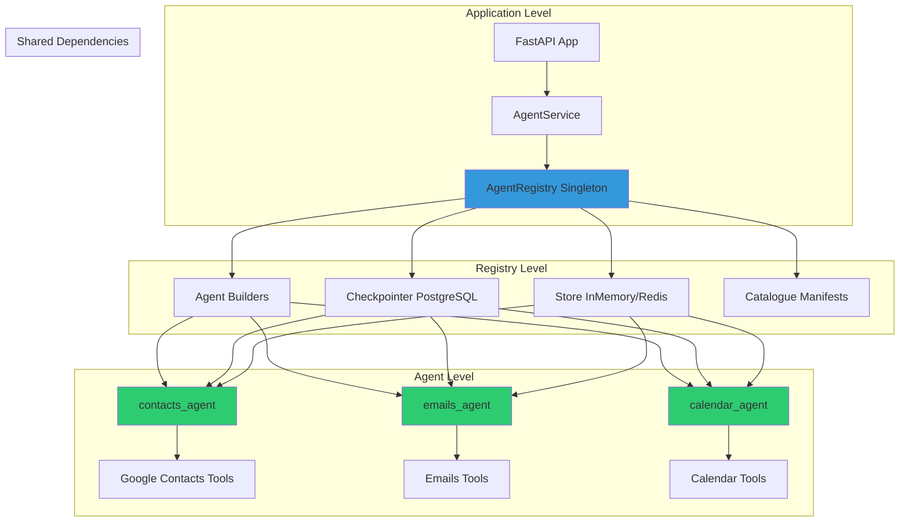
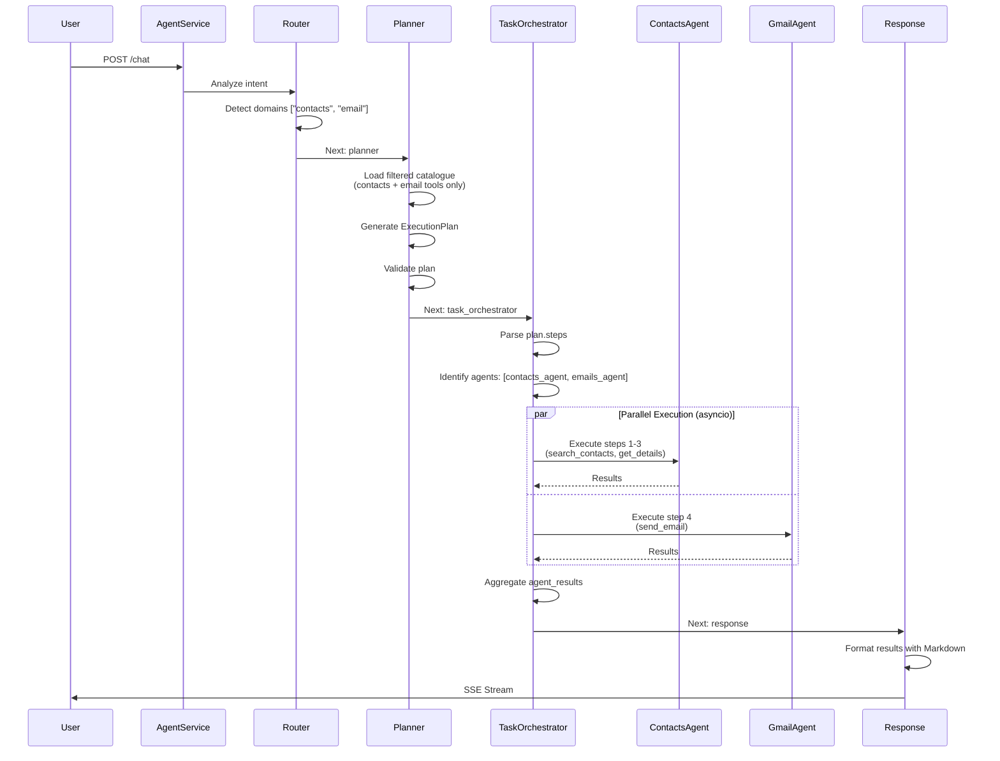
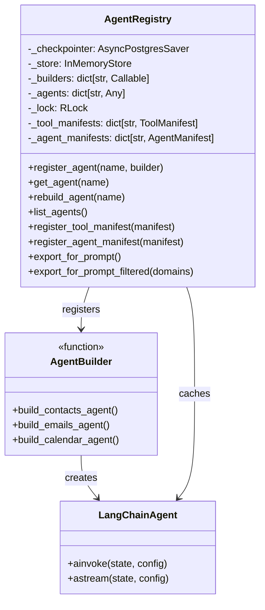
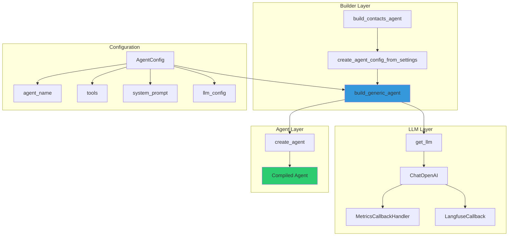
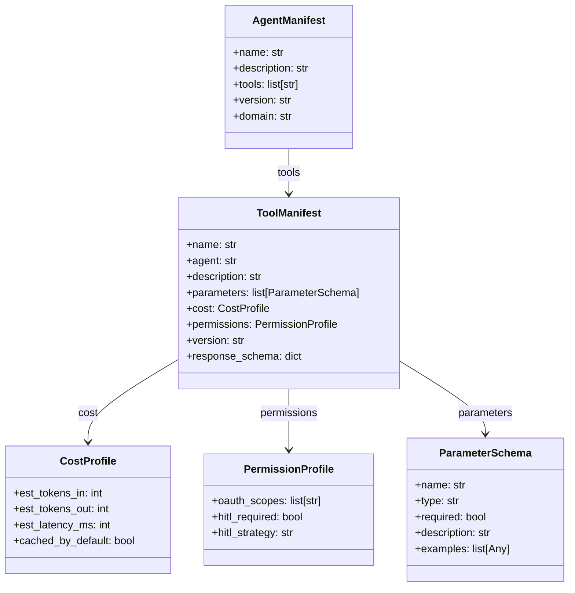
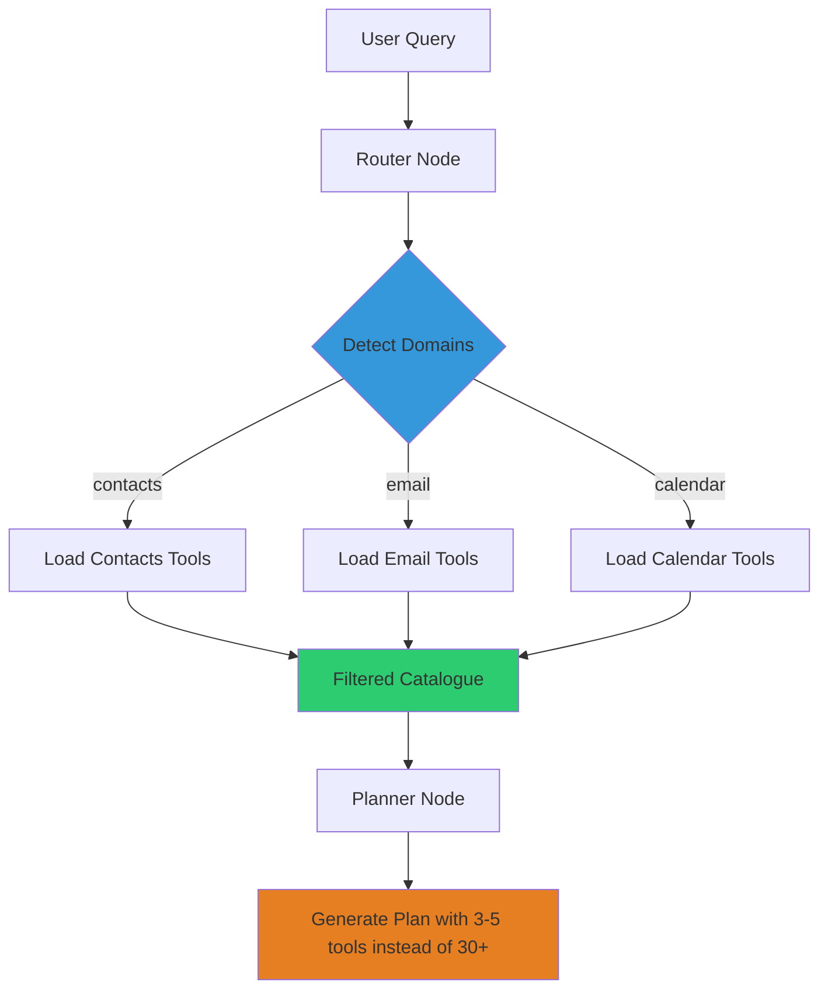

# AGENTS.md - Architecture Multi-Agent et Registry

**Version**: 1.4
**Date**: 2026-02-28
**Auteur**: Documentation Technique LIA
**Statut**: ✅ Complète et Validée

> **Nouveautés v1.4** : 14 agents actifs, ajout Web Fetch Agent (LOT 9/10), Semantic Tool Router (ADR-048) + Local E5 Embeddings (ADR-049).
> Voir [AGENT_MANIFEST.md](./AGENT_MANIFEST.md) pour le catalogue complet des 50+ tools.

---

## Table des Matières

1. [Vue d'Ensemble](#vue-densemble)
2. [Architecture Multi-Agent](#architecture-multi-agent)
3. [Agent Registry](#agent-registry)
4. [Agent Builder Pattern](#agent-builder-pattern)
5. [Lifecycle des Agents](#lifecycle-des-agents)
6. [Catalogue & Manifests](#catalogue--manifests)
7. [Domain Taxonomy](#domain-taxonomy)
8. [AgentService](#agentservice)
9. [Testing et Troubleshooting](#testing-et-troubleshooting)
10. [Exemples Pratiques](#exemples-pratiques)
11. [Best Practices](#best-practices)
12. [Ressources](#ressources)

---

## Vue d'Ensemble

### Objectifs de l'Architecture Multi-Agent

LIA utilise une **architecture multi-agent** pour gérer différents domaines fonctionnels (contacts, email, calendar, tasks, etc.) de manière modulaire et extensible.

**Standards utilisés** :
- LangGraph v1.1.2 multi-agent best practices
- LangChain v1.2 agent API (`create_agent`)
- Registry pattern (centralized dependency injection)
- Builder pattern (agent factory)
- Manifest-driven configuration

### Composants Principaux



**Architecture Pattern** : **Registry + Factory + Lazy Initialization**.

### Agents Actuels

| Agent | Domaine | Outils Principaux | Status |
|-------|---------|-------------------|--------|
| `contacts_agent` | Google Contacts | search_contacts, list_contacts, get_contact_details + context tools | ✅ Production |
| `emails_agent` | Gmail | search_emails, get_email_details, send_email, send_reply, trash_email | ✅ Production |
| `calendar_agent` | Google Calendar | search_events, get_event_details, create_event, update_event | ✅ Production |
| `drive_agent` | Google Drive | search_files, get_file_details, list_files, list_folder_contents | ✅ Production |
| `tasks_agent` | Google Tasks | search_tasks, list_task_lists, get_task_details, create_task, complete_task | ✅ Production |
| `places_agent` | Google Places API (New) | search_places, get_place_details | ✅ Production |
| `weather_agent` | OpenWeatherMap | get_weather | ✅ Production |
| `wikipedia_agent` | Wikipedia API | search_wikipedia | ✅ Production |
| `perplexity_agent` | Perplexity API | search_web | ✅ Production |
| `web_fetch_agent` | Web Fetch (URL → Markdown) | fetch_web_page | ✅ Production |
| `web_search_agent` | Brave + Perplexity | web_search | ✅ Production |
| `brave_agent` | Brave Search | brave_search, brave_news | ✅ Production |
| `routes_agent` | Google Routes | compute_routes | ✅ Production |
| `query_agent` | Context Resolution | resolve_reference, get_context_list, set_current_item | ✅ Production |

---

## Architecture Multi-Agent

### 1. Niveaux d'Architecture

L'architecture multi-agent de LIA est organisée en **3 niveaux** :

#### Niveau 1 : Application (AgentService)

**Fichier** : `apps/api/src/domains/agents/api/service.py`

```python
class AgentService(
    GraphManagementMixin,
    StreamingMixin,
):
    """
    Service for managing LangGraph agent executions.
    Handles graph building, streaming responses, and session management.

    Composed with mixins for:
    - GraphManagementMixin: Graph lifecycle and lazy initialization
    - StreamingMixin: SSE streaming and event conversion
    """

    def __init__(self) -> None:
        """Initialize service (lazy graph build via GraphManagementMixin)."""
        super().__init__()
        logger.info("agent_service_initialized")
```

> **Note (v1.5.2)**: `AgentService.__init__` delegates to `super().__init__()` which initializes
> all mixin attributes (`graph`, `_store`, `hitl_classifier`, etc.) via `GraphManagementMixin`.
> The previous pattern manually duplicated these attributes and is now removed.

**Responsabilités** :
- Gestion du LangGraph principal (router → planner → task_orchestrator → response)
- Streaming SSE des réponses
- HITL orchestration
- Token tracking

#### Niveau 2 : Registry (AgentRegistry)

**Fichier** : `apps/api/src/domains/agents/registry/agent_registry.py`

```python
class AgentRegistry:
    """
    Centralized registry for LangGraph agents with dependency injection.

    This class manages the lifecycle of agents in a multi-agent system,
    providing:
    - Centralized agent registration and retrieval
    - Automatic checkpointer injection (shared PostgreSQL persistence)
    - Automatic store injection (shared context store)
    - Lazy initialization (agents built on first access)
    - Thread-safe operations (for concurrent requests)

    Pattern: Registry + Factory with Dependency Injection
    """

    def __init__(self, checkpointer: Any | None = None, store: Any | None = None) -> None:
        """
        Initialize agent registry with shared dependencies.

        Args:
            checkpointer: Shared checkpointer for state persistence (PostgresCheckpointer).
            store: Shared store for context management (InMemoryStore, RedisStore).
        """
        self._checkpointer = checkpointer
        self._store = store
        self._builders: dict[str, Callable[[], Any]] = {}
        self._agents: dict[str, Any] = {}
        self._lock = threading.RLock()

        # Catalogue manifests (Phase 1 - Planner)
        self._tool_manifests: dict[str, ToolManifest] = {}
        self._agent_manifests: dict[str, AgentManifest] = {}
        self._catalogue_lock = threading.RLock()

        # Domain indexing for dynamic filtering (Phase 3)
        self._domain_to_agents: dict[str, list[str]] = {}
        self._domain_to_tools: dict[str, list[str]] = {}
        self._filtered_cache: dict[str, dict[str, Any]] = {}
```

**Responsabilités** :
- Enregistrement des agents (builder functions)
- Lazy initialization (build on first access)
- Dependency injection (checkpointer + store)
- Catalogue management (manifests)
- Domain indexing (filtering dynamique)

#### Niveau 3 : Agents (LangChain Agents)

**Fichier** : `apps/api/src/domains/agents/graphs/contacts_agent_builder.py`

```python
def build_contacts_agent() -> Any:
    """
    Build and compile the contacts agent using the generic agent builder template.

    This function creates a LangChain v1.0 agent with:
    - Google Contacts tools (search, list, get_details)
    - Context resolution tools (resolve_reference, set_current_item, etc.)
    - HITL middleware for tool approval
    - Pre-model hook for message history management
    - LLM configuration from settings

    Returns:
        Compiled LangChain agent ready to be wrapped in a parent graph node.
    """
    tools: list[BaseTool] = cast(
        list[BaseTool],
        [
            # Contacts tools
            search_contacts_tool,
            list_contacts_tool,
            get_contact_details_tool,
            # Context resolution tools
            resolve_reference,
            get_context_list,
            set_current_item,
            get_context_state,
            list_active_domains,
        ],
    )

    # Create agent config from settings
    config = create_agent_config_from_settings(
        agent_name="contacts_agent",
        tools=tools,
        system_prompt=system_prompt_template,
        datetime_generator=_get_current_datetime_formatted,
    )

    # Build agent using generic template
    agent = build_generic_agent(config)

    logger.info("contacts_agent_built_successfully")

    return agent
```

**Responsabilités** :
- Définir la liste des outils du domaine
- Configurer le prompt système
- Configurer le LLM (model, temperature, etc.)
- Retourner l'agent compilé

---

### 2. Flux d'Exécution Multi-Agent



**Nouveautés Phase 5.2B-asyncio** :
- ✅ **Parallel execution native** : `asyncio.gather()` au lieu de Map-Reduce
- ✅ **No Send() API** : Évite le bug Command+Send de LangGraph
- ✅ **Simplified routing** : task_orchestrator → response (always)

---

## Agent Registry

### Architecture du Registry

Le `AgentRegistry` utilise le **Registry Pattern** avec **Lazy Initialization** et **Dependency Injection**.



### Code Complet Annoté

**Fichier** : `apps/api/src/domains/agents/registry/agent_registry.py`

#### 1. Initialization

```python
class AgentRegistry:
    """Centralized registry for LangGraph agents with dependency injection."""

    def __init__(self, checkpointer: Any | None = None, store: Any | None = None) -> None:
        """
        Initialize agent registry with shared dependencies.

        Args:
            checkpointer: Shared checkpointer for state persistence.
            store: Shared store for context management.

        Note:
            Without checkpointer/store:
            - No state persistence (conversations lost on restart)
            - No context sharing between agents
            - HITL interrupts will not persist
        """
        self._checkpointer = checkpointer
        self._store = store

        # Builder registry (lazy initialization)
        self._builders: dict[str, Callable[[], Any]] = {}

        # Agent cache (built on first access)
        self._agents: dict[str, Any] = {}

        # Thread safety
        self._lock = threading.RLock()

        # Catalogue manifests
        self._tool_manifests: dict[str, ToolManifest] = {}
        self._agent_manifests: dict[str, AgentManifest] = {}
        self._catalogue_lock = threading.RLock()

        # Cache for export_for_prompt() (Performance optimization)
        self._prompt_export_cache: dict[str, Any] | None = None
        self._cache_timestamp: float | None = None
        self._cache_ttl_seconds: float = 3600.0  # 1 hour TTL

        # Domain indexing (Phase 3 - Multi-Domain Architecture)
        self._domain_to_agents: dict[str, list[str]] = {}
        self._domain_to_tools: dict[str, list[str]] = {}
        self._filtered_cache: dict[str, dict[str, Any]] = {}
        self._filtered_cache_ttl: float = 300.0  # 5 min TTL

        logger.info(
            "agent_registry_initialized",
            has_checkpointer=checkpointer is not None,
            has_store=store is not None,
        )
```

**Pattern** : **Registry with Lazy Initialization**.

#### 2. Agent Registration

```python
def register_agent(self, name: str, builder: Callable[[], Any], override: bool = False) -> None:
    """
    Register an agent builder function.

    The builder function will be called lazily on first access via get_agent().
    This allows for efficient startup (agents built only when needed).

    Args:
        name: Unique agent identifier (e.g., "contacts_agent").
        builder: Callable that returns a compiled agent (no arguments).
        override: If True, allows overriding existing registration.

    Raises:
        AgentAlreadyRegisteredError: If agent already registered and override=False.
        ValueError: If name or builder is invalid.

    Example:
        >>> from src.domains.agents.graphs import build_contacts_agent
        >>> registry.register_agent("contacts_agent", build_contacts_agent)
    """
    if not name or not isinstance(name, str):
        raise ValueError(f"Invalid agent name: {name} (must be non-empty string)")

    if not callable(builder):
        raise ValueError(f"Invalid builder for agent '{name}': must be callable")

    with self._lock:
        if name in self._builders and not override:
            raise AgentAlreadyRegisteredError(
                f"Agent '{name}' is already registered. "
                f"Use override=True to replace existing registration."
            )

        self._builders[name] = builder

        # Clear cached agent if overriding
        if override and name in self._agents:
            del self._agents[name]
            logger.info("agent_cache_cleared", agent_name=name, reason="override")

        logger.info(
            "agent_registered",
            agent_name=name,
            builder_name=builder.__name__ if hasattr(builder, "__name__") else "lambda",
            override=override,
        )
```

**Key Features** :
- ✅ **Lazy registration** : Builder stocké, agent PAS encore construit
- ✅ **Thread-safe** : RLock pour accès concurrent
- ✅ **Override support** : Permet replacement d'agents

#### 3. Agent Retrieval (Lazy Build)

```python
def get_agent(self, name: str) -> Any:
    """
    Retrieve a compiled agent by name (lazy initialization).

    On first access:
    1. Calls the registered builder function
    2. Injects checkpointer and store (if available)
    3. Caches the result for subsequent calls

    On subsequent access:
    - Returns cached agent (no rebuild)

    Args:
        name: Agent identifier (must be registered via register_agent()).

    Returns:
        Compiled agent ready for .ainvoke() / .astream().

    Raises:
        AgentNotFoundError: If agent not registered.

    Example:
        >>> agent = registry.get_agent("contacts_agent")
        >>> result = await agent.ainvoke(state, config)

    Note:
        The agent is built once and cached. If you need to rebuild
        (e.g., after config change), use rebuild_agent().
    """
    with self._lock:
        # Check if already built (cache hit)
        if name in self._agents:
            logger.debug("agent_cache_hit", agent_name=name)
            return self._agents[name]

        # Check if builder registered
        if name not in self._builders:
            available = list(self._builders.keys())
            raise AgentNotFoundError(
                f"Agent '{name}' not found in registry. "
                f"Available agents: {available}. "
                f"Did you forget to call register_agent()?"
            )

        # Build agent (lazy initialization)
        logger.info("agent_building", agent_name=name)

        try:
            builder = self._builders[name]
            agent = builder()

            # Cache the built agent
            self._agents[name] = agent

            logger.info(
                "agent_built_successfully",
                agent_name=name,
                agent_type=type(agent).__name__,
            )

            return agent

        except Exception as e:
            logger.error(
                "agent_build_failed",
                agent_name=name,
                error=str(e),
                error_type=type(e).__name__,
            )
            raise AgentRegistryError(
                f"Failed to build agent '{name}': {type(e).__name__}: {e}"
            ) from e
```

**Flow** :
1. **Cache check** → Si agent déjà construit, retourner immédiatement
2. **Builder check** → Si builder absent, lever `AgentNotFoundError`
3. **Build** → Appeler `builder()` (ex: `build_contacts_agent()`)
4. **Cache** → Stocker l'agent compilé
5. **Return** → Retourner l'agent

**Performance** :
- First access: ~100-300ms (agent build)
- Subsequent access: ~1ms (cache hit)

#### 4. Rebuild Agent

```python
def rebuild_agent(self, name: str) -> Any:
    """
    Force rebuild of an agent (clears cache and rebuilds).

    Use this when:
    - Agent configuration has changed
    - Need to refresh agent after code changes
    - Troubleshooting agent issues

    Args:
        name: Agent identifier (must be registered).

    Returns:
        Newly built agent.

    Raises:
        AgentNotFoundError: If agent not registered.

    Example:
        >>> # After changing agent config
        >>> agent = registry.rebuild_agent("contacts_agent")
    """
    with self._lock:
        # Clear cache
        if name in self._agents:
            del self._agents[name]
            logger.info("agent_cache_cleared", agent_name=name, reason="rebuild")

        # Rebuild via get_agent (lazy init)
        return self.get_agent(name)
```

**Use cases** :
- Settings change (ex: temperature, model)
- Tool list update
- Prompt update
- Testing

---

### Global Registry Singleton

```python
# ============================================================================
# Global Registry Singleton
# ============================================================================

_global_registry: AgentRegistry | None = None
_global_registry_lock = threading.Lock()


def get_global_registry() -> AgentRegistry:
    """
    Get the global agent registry singleton.

    This function ensures a single registry instance across the application.
    The registry is initialized lazily on first access.

    Returns:
        Global AgentRegistry instance.

    Example:
        >>> # In AgentService.__init__
        >>> registry = get_global_registry()
        >>> agent = registry.get_agent("contacts_agent")

    Note:
        The global registry is initialized without checkpointer/store.
        You should call set_global_registry() during app startup with
        the actual checkpointer and store instances.
    """
    global _global_registry

    if _global_registry is None:
        with _global_registry_lock:
            if _global_registry is None:
                logger.warning(
                    "global_registry_lazy_init",
                    message="Global registry not initialized, creating without deps. "
                    "Consider calling set_global_registry() at app startup.",
                )
                _global_registry = AgentRegistry()

    return _global_registry


def set_global_registry(registry: AgentRegistry) -> None:
    """
    Set the global agent registry singleton.

    Call this during application startup to configure the registry
    with checkpointer and store.

    Args:
        registry: Configured AgentRegistry instance.

    Example:
        >>> # In main.py or startup event
        >>> registry = AgentRegistry(
        ...     checkpointer=postgres_checkpointer,
        ...     store=in_memory_store
        ... )
        >>> registry.register_agent("contacts_agent", build_contacts_agent)
        >>> set_global_registry(registry)

    Note:
        This should be called once during app startup, before any
        agent access via get_global_registry().
    """
    global _global_registry

    with _global_registry_lock:
        _global_registry = registry
        logger.info("global_registry_set", stats=registry.get_stats())


def reset_global_registry() -> None:
    """
    Reset the global registry singleton (for testing).

    Example:
        >>> # In test teardown
        >>> reset_global_registry()
    """
    global _global_registry

    with _global_registry_lock:
        _global_registry = None
        logger.debug("global_registry_reset")
```

**Pattern** : **Double-Checked Locking Singleton**.

**Usage** :

```python
# main.py (startup)
registry = AgentRegistry(checkpointer=postgres_checkpointer, store=in_memory_store)
registry.register_agent("contacts_agent", build_contacts_agent)
set_global_registry(registry)

# AgentService (runtime)
registry = get_global_registry()
agent = registry.get_agent("contacts_agent")
```

---

## Agent Builder Pattern

### Architecture du Builder

Le **Agent Builder Pattern** utilise une fonction factory générique pour créer des agents LangChain avec configuration standardisée.



### Base Agent Builder (Generic Template)

**Fichier** : `apps/api/src/domains/agents/graphs/base_agent_builder.py`

```python
class LLMConfig(TypedDict, total=False):
    """
    LLM configuration for agent.

    Attributes:
        model: Model identifier (e.g., "gpt-4.1-nano").
        temperature: Sampling temperature (0.0-2.0).
        max_tokens: Maximum tokens for output.
        top_p: Nucleus sampling parameter (0.0-1.0).
        frequency_penalty: Frequency penalty (-2.0 to 2.0).
        presence_penalty: Presence penalty (-2.0 to 2.0).
    """
    model: str
    temperature: float
    max_tokens: int
    top_p: float
    frequency_penalty: float
    presence_penalty: float


class AgentConfig(TypedDict, total=False):
    """
    Complete configuration for building a generic agent.

    Required Fields:
        agent_name: Unique identifier (e.g., "contacts_agent").
        tools: List of LangChain tools.
        system_prompt: Formatted system prompt string.
        llm_config: LLM configuration dictionary.

    Optional Fields:
        enable_hitl: Enable HITL tool approval (default: settings.tool_approval_enabled).
        pre_model_hook: Custom pre-model hook for message filtering.
        max_history_messages: Max messages in agent history.
        max_history_tokens: Max tokens in agent history.
        metadata: Additional metadata for logging/tracing.
        datetime_generator: Callable for dynamic timestamp injection.
    """
    # Required
    agent_name: str
    tools: list[BaseTool]
    system_prompt: str
    llm_config: LLMConfig

    # Optional
    enable_hitl: bool
    pre_model_hook: Callable[[dict], dict] | None
    max_history_messages: int
    max_history_tokens: int
    metadata: dict[str, Any]
    datetime_generator: Callable[[], str] | None


def build_generic_agent(config: AgentConfig) -> Any:
    """
    Build a LangChain v1.0 agent with standardized configuration and best practices.

    This factory function creates agents with:
    - Automatic HITL middleware (if enabled)
    - Pre-model hook for message history management
    - ToolRuntime pattern for config/store access
    - Consistent logging and metrics
    - Generic, reusable architecture

    Args:
        config: AgentConfig dictionary with all agent configuration.

    Returns:
        Compiled LangChain agent ready to be wrapped in a parent graph node.

    Raises:
        ValueError: If required config fields are missing.
        TypeError: If tools list is empty or invalid.

    Example:
        >>> config = AgentConfig(
        ...     agent_name="contacts_agent",
        ...     tools=[search_contacts_tool, list_contacts_tool],
        ...     system_prompt=CONTACTS_AGENT_SYSTEM_PROMPT,
        ...     llm_config=LLMConfig(
        ...         model="gpt-4.1-nano",
        ...         temperature=0.5,
        ...         max_tokens=10000,
        ...     ),
        ... )
        >>> agent = build_generic_agent(config)
    """
    # Validate required fields
    agent_name = config.get("agent_name")
    tools = config.get("tools")
    system_prompt = config.get("system_prompt")
    llm_config = config.get("llm_config")

    if not agent_name:
        raise ValueError("AgentConfig.agent_name is required")
    if not tools:
        raise ValueError(f"AgentConfig.tools is required for agent '{agent_name}'")
    if not system_prompt:
        raise ValueError(f"AgentConfig.system_prompt is required for agent '{agent_name}'")
    if not llm_config:
        raise ValueError(f"AgentConfig.llm_config is required for agent '{agent_name}'")

    # Get LLM with factory-level callbacks
    llm = get_llm(
        llm_type=agent_name,
        model_name=llm_config["model"],
        temperature=llm_config.get("temperature", 0.5),
        max_tokens=llm_config.get("max_tokens", 10000),
    )

    # Create agent prompt template
    from langchain_core.prompts import ChatPromptTemplate

    # Support dynamic datetime injection if datetime_generator provided
    datetime_generator = config.get("datetime_generator")
    if datetime_generator:
        # Partial prompt with dynamic datetime
        prompt = ChatPromptTemplate.from_messages([
            ("system", system_prompt),
            ("placeholder", "{messages}"),
        ]).partial(current_datetime=datetime_generator)
    else:
        # Static prompt
        prompt = ChatPromptTemplate.from_messages([
            ("system", system_prompt),
            ("placeholder", "{messages}"),
        ])

    # Create agent using LangChain v1.0 API
    agent = create_agent(
        llm=llm,
        tools=tools,
        prompt=prompt,
    )

    logger.info(
        "generic_agent_built",
        agent_name=agent_name,
        tools_count=len(tools),
        model=llm_config["model"],
    )

    return agent
```

**Avantages** :
- ✅ **Generic** : Fonctionne pour tous les agents (contacts, gmail, calendar, etc.)
- ✅ **Standardized** : Configuration cohérente
- ✅ **Maintainable** : Un seul endroit pour les best practices
- ✅ **Extensible** : Facile d'ajouter de nouvelles options

---

### Contacts Agent Builder (Exemple)

**Fichier** : `apps/api/src/domains/agents/graphs/contacts_agent_builder.py`

```python
def build_contacts_agent() -> Any:
    """
    Build and compile the contacts agent using the generic agent builder template.

    This function creates a LangChain v1.0 agent with:
    - Google Contacts tools (search, list, get_details)
    - Context resolution tools (resolve_reference, set_current_item, etc.)
    - HITL middleware for tool approval
    - Pre-model hook for message history management
    - LLM configuration from settings

    Returns:
        Compiled LangChain agent ready to be wrapped in a parent graph node.
    """
    logger.info("building_contacts_agent_with_generic_template")

    # Import all tools
    from src.domains.agents.tools.context_tools import (
        get_context_list,
        get_context_state,
        list_active_domains,
        resolve_reference,
        set_current_item,
    )
    from src.domains.agents.tools.google_contacts_tools import (
        get_contact_details_tool,
        list_contacts_tool,
        search_contacts_tool,
    )

    tools: list[BaseTool] = cast(
        list[BaseTool],
        [
            # Contacts tools
            search_contacts_tool,
            list_contacts_tool,
            get_contact_details_tool,
            # Context resolution tools
            resolve_reference,
            get_context_list,
            set_current_item,
            get_context_state,
            list_active_domains,
        ],
    )

    # Generate system prompt with dynamic datetime
    def _get_current_datetime_formatted() -> str:
        """Generate formatted datetime using centralized settings."""
        tz = ZoneInfo(settings.prompt_timezone)
        return datetime.now(tz).strftime(settings.prompt_datetime_format)

    context_instructions = """
## 📋 Contexte Multi-Domaines (V1 - Contacts Only)

Actuellement, seul le domaine "contacts" est actif.
Les outils resolve_reference, get_context_state, set_current_item fonctionnent avec domain="contacts".
    """.strip()

    # Load versioned prompt template
    contacts_agent_prompt_template = load_prompt("contacts_agent_prompt", version="v1")

    # Build prompt template
    system_prompt_template = contacts_agent_prompt_template.format(
        current_datetime="{current_datetime}",  # Placeholder for partial
        context_instructions=context_instructions,
    )

    # Create agent config from settings
    config = create_agent_config_from_settings(
        agent_name="contacts_agent",
        tools=tools,
        system_prompt=system_prompt_template,
        datetime_generator=_get_current_datetime_formatted,
    )

    # Build agent using generic template
    agent = build_generic_agent(config)

    logger.info("contacts_agent_built_successfully")

    return agent
```

**Réduction boilerplate** : 150 lignes → 80 lignes (**47% reduction**).

---

## Lifecycle des Agents

### Startup (main.py)

```python
# apps/api/src/main.py

from src.domains.agents.registry import AgentRegistry, set_global_registry
from src.domains.agents.graphs import build_contacts_agent
from src.infrastructure.database.checkpointer import get_postgres_checkpointer
from src.domains.agents.context import get_tool_context_store

@asynccontextmanager
async def lifespan(app: FastAPI) -> AsyncGenerator[None, None]:
    """Application lifecycle manager."""

    # Initialize checkpointer
    postgres_checkpointer = get_postgres_checkpointer()

    # Initialize store
    in_memory_store = get_tool_context_store()

    # Create registry with shared dependencies
    registry = AgentRegistry(
        checkpointer=postgres_checkpointer,
        store=in_memory_store,
    )

    # Register agents (lazy - builders only)
    registry.register_agent("contacts_agent", build_contacts_agent)
    # registry.register_agent("emails_agent", build_emails_agent)  # Future
    # registry.register_agent("calendar_agent", build_calendar_agent)  # Future

    # Load catalogue manifests
    from src.domains.agents.registry import load_catalogue_manifests
    load_catalogue_manifests(registry)  # Loads tool/agent manifests from YAML

    # Build domain index (for filtering)
    registry._build_domain_index()

    # Set global registry
    set_global_registry(registry)

    logger.info(
        "agent_registry_configured",
        stats=registry.get_stats(),
    )

    yield

    # Cleanup
    await postgres_checkpointer.close()
    logger.info("application_shutdown_complete")
```

**Ordre d'initialisation** :
1. Checkpointer (PostgreSQL)
2. Store (InMemoryStore)
3. Registry (avec deps)
4. Register agents (builders only, NOT built yet)
5. Load manifests
6. Build domain index
7. Set global registry

---

### Runtime (AgentService)

```python
# apps/api/src/domains/agents/api/service.py

from src.domains.agents.registry import get_global_registry

class AgentService:
    """Service for managing LangGraph agent executions."""

    def _build_graph(self) -> CompiledStateGraph:
        """
        Build the main LangGraph orchestration graph.

        Lazy initialization: Called on first chat request.
        """
        registry = get_global_registry()

        # Get checkpointer and store from registry
        checkpointer = registry.get_checkpointer()
        store = registry.get_store()

        # Build graph
        builder = StateGraph(MessagesState)

        # Add core nodes
        builder.add_node(NODE_ROUTER, router_node)
        builder.add_node(NODE_PLANNER, planner_node)
        builder.add_node(NODE_APPROVAL_GATE, approval_gate_node)
        builder.add_node(NODE_TASK_ORCHESTRATOR, task_orchestrator_node)
        builder.add_node(NODE_RESPONSE, response_node)

        # Add agent nodes (lazy-loaded from registry)
        # Agent nodes are created as wrappers around agents from registry
        # Example: contacts_agent_node = create_agent_wrapper_node("contacts_agent")
        # The wrapper retrieves the agent via registry.get_agent("contacts_agent")
        # and calls agent.ainvoke(state, config)

        # Set entry point (F4: compaction before router)
        builder.set_entry_point(NODE_COMPACTION)
        builder.add_edge(NODE_COMPACTION, NODE_ROUTER)

        # Add conditional edges
        builder.add_conditional_edges(NODE_ROUTER, route_from_router)
        builder.add_conditional_edges(NODE_PLANNER, route_from_planner)
        builder.add_conditional_edges(NODE_APPROVAL_GATE, route_from_approval_gate)

        # Add edges
        builder.add_edge(NODE_TASK_ORCHESTRATOR, NODE_RESPONSE)
        builder.add_edge(NODE_RESPONSE, END)

        # Compile graph with checkpointer and store
        graph = builder.compile(
            checkpointer=checkpointer,
            store=store,
            interrupt_before=[NODE_APPROVAL_GATE],  # HITL plan approval
        )

        logger.info("langgraph_compiled", node_count=len(graph.nodes))

        return graph
```

**Key points** :
- Graph est compilé avec checkpointer et store du registry
- Agent nodes sont des wrappers qui appellent `registry.get_agent()`
- Lazy build : Graph construit seulement au premier `/chat` request

---

## Catalogue & Manifests

### Architecture du Catalogue

Le **catalogue de manifests** est une base de données déclarative de tous les agents et outils disponibles, utilisée par le planner pour générer des plans d'exécution.



### Tool Manifest (Exemple)

```python
@dataclass
class ToolManifest:
    """
    Declarative manifest for a tool (used by Planner LLM for catalogue).

    This manifest provides all metadata needed by the Planner to:
    - Understand tool capabilities
    - Estimate cost and latency
    - Check permissions and OAuth scopes
    - Determine HITL requirements
    - Validate parameters

    Attributes:
        name: Unique tool identifier (e.g., "search_contacts_tool").
        agent: Agent this tool belongs to (e.g., "contacts_agent").
        description: Brief tool description for LLM (1-2 sentences).
        parameters: List of parameter schemas (inputs).
        cost: Cost profile (token estimates, latency).
        permissions: Permission requirements (OAuth scopes, HITL).
        version: Tool version (semantic versioning).
        response_schema: Expected response structure (for LLM guidance).
        field_mappings: Parameter name normalization rules.
        outputs: Legacy output field schemas (deprecated).

    Example:
        >>> manifest = ToolManifest(
        ...     name="search_contacts_tool",
        ...     agent="contacts_agent",
        ...     description="Search Google Contacts by name, email, or phone",
        ...     parameters=[
        ...         ParameterSchema(
        ...             name="query",
        ...             type="string",
        ...             required=True,
        ...             description="Search query (name, email, or phone)",
        ...         ),
        ...         ParameterSchema(
        ...             name="limit",
        ...             type="integer",
        ...             required=False,
        ...             description="Max results (default: 10)",
        ...         ),
        ...     ],
        ...     cost=CostProfile(
        ...         est_tokens_in=150,
        ...         est_tokens_out=800,
        ...         est_latency_ms=800,
        ...     ),
        ...     permissions=PermissionProfile(
        ...         oauth_scopes=["https://www.googleapis.com/auth/contacts.readonly"],
        ...         hitl_required=False,
        ...     ),
        ...     version="1.0.0",
        ... )
    """
    name: str
    agent: str
    description: str
    parameters: list[ParameterSchema]
    cost: CostProfile
    permissions: PermissionProfile
    version: str
    response_schema: dict[str, Any] | None = None
    field_mappings: dict[str, str] | None = None
    outputs: list[OutputFieldSchema] | None = None  # Legacy
    semantic_keywords: list[str] | None = None  # For Semantic Tool Router
```

### Semantic Tool Router (ADR-048)

> **Nouveauté v1.1** : Sélection intelligente des tools via embeddings sémantiques.

Le **SemanticToolSelector** remplace le routing par mots-clés par une approche sémantique :

```python
# apps/api/src/domains/agents/services/tool_selector.py
class SemanticToolSelector:
    """
    Semantic tool selection using local E5 embeddings.

    Strategy: Max-Pooling
    - For each tool, compute MAX(cosine(query, keyword_i))
    - Avoids semantic dilution from averaging

    Thresholds:
    - >= 0.70: High confidence
    - >= 0.60: Medium confidence (uncertainty flag)
    """
```

**Semantic Keywords dans les Manifests** :

```python
# Exemple: emails/catalogue_manifests.py
search_emails_catalogue_manifest = ToolManifest(
    name="search_emails_tool",
    semantic_keywords=[
        "search emails", "find messages", "inbox",
        "chercher emails", "mes messages",  # FR
        "emails récents", "derniers emails",
    ],
    # ...
)
```

**Bénéfices** :
- ✅ Zero i18n maintenance (100+ langues via E5 multilingue)
- ✅ +48% accuracy vs keywords (0.90 vs 0.61)
- ✅ Zero API cost (inférence locale)

**Voir** : [SEMANTIC_ROUTER.md](SEMANTIC_ROUTER.md) | [ADR-048](../architecture/ADR-048-Semantic-Tool-Router.md)

### Export pour Planner Prompt

```python
def export_for_prompt(self) -> dict[str, Any]:
    """
    Export catalogue optimized for LLM planner prompt.

    Returns concise format suitable for prompt injection.
    Includes only essential info for plan generation.

    Performance: Cached for 1 hour to avoid rebuilding on every planner invocation.

    Returns:
        Dictionary optimized for planner LLM

    Example:
        >>> prompt_data = registry.export_for_prompt()
        >>> # Use in planner prompt:
        >>> prompt = f"Available tools: {json.dumps(prompt_data)}"
    """
    # Check cache first
    current_time = time.time()
    if (
        self._prompt_export_cache is not None
        and self._cache_timestamp is not None
        and (current_time - self._cache_timestamp) < self._cache_ttl_seconds
    ):
        logger.debug("catalogue_export_cache_hit")
        return self._prompt_export_cache

    # Cache miss - rebuild catalogue export
    with self._catalogue_lock:
        agents_data = []

        for agent_manifest in self._agent_manifests.values():
            tools_data = []

            for tool_name in agent_manifest.tools:
                if tool_name in self._tool_manifests:
                    tm = self._tool_manifests[tool_name]

                    # Format parameters for prompt
                    params_data = [
                        {
                            "name": p.name,
                            "type": p.type,
                            "required": p.required,
                            "description": p.description,
                        }
                        for p in tm.parameters
                    ]

                    tool_data = {
                        "name": tm.name,
                        "description": tm.description,
                        "parameters": params_data,
                        "cost_estimate": {
                            "tokens": tm.cost.est_tokens_in + tm.cost.est_tokens_out,
                            "latency_ms": tm.cost.est_latency_ms,
                        },
                        "requires_approval": tm.permissions.hitl_required,
                    }

                    tools_data.append(tool_data)

            agents_data.append(
                {
                    "agent": agent_manifest.name,
                    "description": agent_manifest.description,
                    "tools": tools_data,
                }
            )

        result = {
            "agents": agents_data,
            "max_plan_cost_usd": settings.planner_max_cost_usd,
            "max_plan_steps": settings.planner_max_steps,
        }

        # Update cache
        self._prompt_export_cache = result
        self._cache_timestamp = current_time

        return result
```

**Performance** :
- Cache HIT: ~1ms (dict lookup)
- Cache MISS: ~50-100ms (rebuild catalogue)
- TTL: 1 hour (invalidated on manifest registration)

---

## Domain Taxonomy

### Architecture du Domain Filtering

Le **domain filtering** permet de réduire drastiquement le nombre d'outils chargés dans le prompt du planner en ne chargeant que les outils des domaines détectés par le router.



### Domain Registry

**Fichier** : `apps/api/src/domains/agents/registry/domain_taxonomy.py`

```python
from dataclasses import dataclass


@dataclass
class DomainMetadata:
    """
    Metadata for a domain in the multi-agent system.

    Attributes:
        identifier: Unique domain identifier (e.g., "contacts", "email").
        display_name: Human-readable name (e.g., "Google Contacts").
        description: Brief description of domain capabilities.
        icon: Icon identifier (for UI).
        default_agent: Default agent for this domain (e.g., "contacts_agent").
        cross_domain: If True, domain tools are always included (e.g., "context").
    """
    identifier: str
    display_name: str
    description: str
    icon: str
    default_agent: str
    cross_domain: bool = False


# ============================================================================
# Domain Registry
# ============================================================================

DOMAIN_REGISTRY: dict[str, DomainMetadata] = {
    "contacts": DomainMetadata(
        identifier="contacts",
        display_name="Google Contacts",
        description="Manage Google Contacts (search, list, get details)",
        icon="users",
        default_agent="contacts_agent",
    ),
    "email": DomainMetadata(
        identifier="email",
        display_name="Gmail",
        description="Send and manage emails via Gmail",
        icon="mail",
        default_agent="emails_agent",
    ),
    "calendar": DomainMetadata(
        identifier="calendar",
        display_name="Google Calendar",
        description="Create and manage calendar events",
        icon="calendar",
        default_agent="calendar_agent",
    ),
    "tasks": DomainMetadata(
        identifier="tasks",
        display_name="Google Tasks",
        description="Manage tasks and to-do lists",
        icon="check-square",
        default_agent="tasks_agent",
    ),
    "context": DomainMetadata(
        identifier="context",
        display_name="Context Management",
        description="Cross-domain context utilities (resolve_reference, etc.)",
        icon="link",
        default_agent="context_agent",
        cross_domain=True,  # ✅ Always included
    ),
}
```

### Domain Index Building

```python
def _build_domain_index(self) -> None:
    """
    Build reverse index: domain -> agents -> tools.

    This index enables fast filtered lookups for dynamic domain loading.
    Called automatically after catalogue initialization.

    Example Index:
        _domain_to_agents = {
            "contacts": ["contacts_agent"],
            "email": ["emails_agent"],
        }
        _domain_to_tools = {
            "contacts": ["search_contacts_tool", "list_contacts_tool"],
            "email": ["send_email_tool", "search_emails_tool"],
        }
    """
    with self._catalogue_lock:
        # Clear existing index
        self._domain_to_agents.clear()
        self._domain_to_tools.clear()
        self._filtered_cache.clear()

        # Build agent index
        for agent_name, agent_manifest in self._agent_manifests.items():
            # Extract domain from agent name
            # Convention: "{domain}_agent" -> domain
            domain = self._extract_domain_from_agent_name(agent_name)

            # Validate against DOMAIN_REGISTRY
            if domain not in DOMAIN_REGISTRY:
                logger.warning(
                    "domain_index_agent_unknown_domain",
                    agent=agent_name,
                    extracted_domain=domain,
                    message=f"Agent domain '{domain}' not in DOMAIN_REGISTRY. "
                    f"Add to domain_taxonomy.py for proper filtering.",
                )

            # Add agent to domain mapping
            if domain not in self._domain_to_agents:
                self._domain_to_agents[domain] = []
            self._domain_to_agents[domain].append(agent_name)

            # Build tool index for this agent
            if domain not in self._domain_to_tools:
                self._domain_to_tools[domain] = []

            for tool_name in agent_manifest.tools:
                if tool_name in self._tool_manifests:
                    self._domain_to_tools[domain].append(tool_name)

        logger.info(
            "domain_index_built",
            domains=list(self._domain_to_agents.keys()),
            agents_count=sum(len(agents) for agents in self._domain_to_agents.values()),
            tools_count=sum(len(tools) for tools in self._domain_to_tools.values()),
        )
```

### Filtered Catalogue Export

```python
def export_for_prompt_filtered(
    self,
    domains: list[str] | None = None,
    max_tools_per_domain: int = 10,
) -> dict[str, Any]:
    """
    Export catalogue optimized for LLM planner prompt with domain filtering.

    This method enables dynamic loading of manifests based on detected domains,
    preventing prompt explosion in multi-domain systems (10+ domains).

    Token reduction: 90% (40K → 4K tokens for single-domain queries)

    Args:
        domains: List of domain identifiers (e.g., ["contacts", "email"]).
                If None, returns full catalogue (backward compatible).
        max_tools_per_domain: Maximum tools per domain (default: 10).

    Returns:
        Dictionary optimized for planner LLM with filtered catalogue.

    Example:
        >>> # Single domain (contacts)
        >>> filtered = registry.export_for_prompt_filtered(domains=["contacts"])
        >>> # Result: ~4K tokens (3 tools from contacts)
    """
    # Backward compatible: domains=None → full catalogue
    if domains is None:
        logger.debug("catalogue_export_filtered_none_fallback")
        return self.export_for_prompt()

    # Check filtered cache
    cache_key = "_".join(sorted(domains))
    current_time = time.time()

    if cache_key in self._filtered_cache:
        cached_entry = self._filtered_cache[cache_key]
        cache_time = cached_entry.get("_cache_timestamp", 0)

        if (current_time - cache_time) < self._filtered_cache_ttl:
            logger.debug("catalogue_filtered_cache_hit", domains=domains)
            result = {k: v for k, v in cached_entry.items() if not k.startswith("_")}
            return result

    logger.debug("catalogue_filtered_cache_miss", domains=domains)

    # Cache miss - build filtered catalogue
    with self._catalogue_lock:
        agents_data = []
        total_tools = 0

        # CRITICAL: Always include 'context' domain (cross-domain utilities)
        domains_to_load = list(domains)
        if "context" not in domains_to_load:
            domains_to_load.append("context")
            logger.debug(
                "catalogue_filtered_context_auto_included",
                requested_domains=domains,
                loaded_domains=domains_to_load,
            )

        for domain in domains_to_load:
            # Get agents for this domain
            agent_names = self._domain_to_agents.get(domain, [])

            if not agent_names:
                logger.warning(
                    "catalogue_filtered_domain_not_found",
                    domain=domain,
                    available_domains=list(self._domain_to_agents.keys()),
                )
                continue

            for agent_name in agent_names:
                if agent_name not in self._agent_manifests:
                    logger.warning("catalogue_filtered_agent_manifest_missing", agent=agent_name)
                    continue

                agent_manifest = self._agent_manifests[agent_name]
                tools_data = []

                # Get tools for this agent (with limit)
                tool_names = agent_manifest.tools[:max_tools_per_domain]

                for tool_name in tool_names:
                    if tool_name not in self._tool_manifests:
                        logger.warning("catalogue_filtered_tool_manifest_missing", tool=tool_name)
                        continue

                    tm = self._tool_manifests[tool_name]

                    # Format parameters for prompt
                    params_data = [
                        {
                            "name": p.name,
                            "type": p.type,
                            "required": p.required,
                            "description": p.description,
                        }
                        for p in tm.parameters
                    ]

                    tool_data = {
                        "name": tm.name,
                        "description": tm.description,
                        "parameters": params_data,
                        "cost_estimate": {
                            "tokens": tm.cost.est_tokens_in + tm.cost.est_tokens_out,
                            "latency_ms": tm.cost.est_latency_ms,
                        },
                        "requires_approval": tm.permissions.hitl_required,
                    }

                    tools_data.append(tool_data)
                    total_tools += 1

                agents_data.append(
                    {
                        "agent": agent_manifest.name,
                        "domain": domain,
                        "description": agent_manifest.description,
                        "tools": tools_data,
                    }
                )

        result = {
            "agents": agents_data,
            "domains_loaded": domains_to_load,
            "total_tools": total_tools,
            "filtering_applied": True,
            "max_plan_cost_usd": settings.planner_max_cost_usd,
            "max_plan_steps": settings.planner_max_steps,
        }

        # Cache result
        cache_entry = {**result, "_cache_timestamp": current_time}
        self._filtered_cache[cache_key] = cache_entry

        logger.info(
            "catalogue_filtered_built",
            domains=domains,
            agents_count=len(agents_data),
            tools_count=total_tools,
        )

        return result
```

**Token Savings** :
- Full catalogue: ~40,000 tokens (30+ tools)
- Filtered (1 domain): ~4,000 tokens (3-5 tools)
- **Reduction**: 90%

---

## AgentService

### Architecture du Service

Le `AgentService` orchestre le graph LangGraph principal et gère les interactions avec les agents.

```python
class AgentService(
    GraphManagementMixin,
    StreamingMixin,
):
    """
    Service for managing LangGraph agent executions.
    Handles graph building, streaming responses, and session management.

    Composed with mixins for:
    - GraphManagementMixin: Graph lifecycle and lazy initialization
    - StreamingMixin: SSE streaming and event conversion
    """

    def __init__(self) -> None:
        """Initialize service (lazy graph build via GraphManagementMixin)."""
        super().__init__()
        logger.info("agent_service_initialized")

    def _build_graph(self) -> CompiledStateGraph:
        """
        Build the main LangGraph orchestration graph.

        Lazy initialization: Called on first chat request.
        """
        registry = get_global_registry()
        checkpointer = registry.get_checkpointer()
        store = registry.get_store()

        # Build graph (omitted for brevity - see GRAPH_AND_AGENTS_ARCHITECTURE.md)
        builder = StateGraph(MessagesState)
        # ... add nodes, edges, conditional edges

        graph = builder.compile(
            checkpointer=checkpointer,
            store=store,
            interrupt_before=[NODE_APPROVAL_GATE],
        )

        return graph

    async def chat(
        self,
        message: str,
        conversation_id: uuid.UUID,
        user_id: uuid.UUID,
        db: AsyncSession,
    ) -> AsyncGenerator[ChatStreamChunk, None]:
        """
        Stream chat response via SSE.

        Args:
            message: User message
            conversation_id: Conversation UUID
            user_id: User UUID
            db: Database session

        Yields:
            ChatStreamChunk with SSE events
        """
        # Build graph lazily
        if self.graph is None:
            self.graph = self._build_graph()

        # Generate run_id
        run_id = generate_run_id()

        # Build config
        config = RunnableConfig(
            configurable={"thread_id": str(conversation_id)},
            metadata={"run_id": run_id, "user_id": str(user_id)},
        )

        # Stream graph execution
        async for chunk in self.graph.astream(input_state, config, stream_mode="updates"):
            # Convert to SSE chunks
            yield await self._convert_chunk_to_sse(chunk)
```

**Mixins** :
- `GraphManagementMixin` : Lifecycle du graph (build, rebuild)
- `StreamingMixin` : Conversion des événements LangGraph → SSE

---

## Testing et Troubleshooting

### Vérifier le Registry

```bash
# Ouvrir Python REPL
python

>>> from src.domains.agents.registry import get_global_registry
>>> registry = get_global_registry()
>>>
>>> # List registered agents
>>> registry.list_agents()
['contacts_agent']
>>>
>>> # Get agent stats
>>> registry.get_stats()
{
    'registered': 1,
    'built': 0,
    'has_checkpointer': True,
    'has_store': True,
    'agents': {
        'registered': ['contacts_agent'],
        'built': []
    },
    'catalogue': {
        'agent_manifests': 1,
        'tool_manifests': 8,
        'agents': ['contacts_agent'],
        'tools': ['search_contacts_tool', 'list_contacts_tool', ...]
    }
}
>>>
>>> # Get agent (triggers lazy build)
>>> agent = registry.get_agent("contacts_agent")
>>> # ... agent built ...
>>>
>>> # Check if built
>>> registry.is_built("contacts_agent")
True
```

### Vérifier les Manifests

```python
>>> from src.domains.agents.registry import get_global_registry
>>> registry = get_global_registry()
>>>
>>> # List agent manifests
>>> manifests = registry.list_agent_manifests()
>>> for m in manifests:
...     print(f"{m.name} v{m.version} - {len(m.tools)} tools")
contacts_agent v1.0.0 - 8 tools
>>>
>>> # Get tool manifest
>>> manifest = registry.get_tool_manifest("search_contacts_tool")
>>> print(f"Cost: {manifest.cost.est_tokens_in} in, {manifest.cost.est_tokens_out} out")
Cost: 150 in, 800 out
>>>
>>> # Export catalogue for planner
>>> catalogue = registry.export_for_prompt()
>>> print(f"Agents: {len(catalogue['agents'])}")
Agents: 1
>>> print(f"Tools: {sum(len(a['tools']) for a in catalogue['agents'])}")
Tools: 8
```

### Troubleshooting "Agent Not Found"

**Symptôme** :

```
AgentNotFoundError: Agent 'emails_agent' not found in registry.
Available agents: ['contacts_agent'].
Did you forget to call register_agent()?
```

**Cause** : Agent non enregistré dans le registry.

**Solution** :

```python
# In main.py
from src.domains.agents.graphs import build_emails_agent

registry.register_agent("emails_agent", build_emails_agent)
```

### Troubleshooting "Agent Build Failed"

**Symptôme** :

```
AgentRegistryError: Failed to build agent 'contacts_agent': ImportError: No module named 'google.auth'
```

**Cause** : Dépendance manquante ou erreur dans le builder.

**Solution** :

```bash
# Install missing dependency
poetry add google-auth

# Or check builder code for errors
# apps/api/src/domains/agents/graphs/contacts_agent_builder.py
```

---

## Exemples Pratiques

### Exemple 1 : Créer un Nouvel Agent (Emails)

> **Note**: Suite à ADR-010, le domaine email utilise le nom générique `emails` (multi-provider: Gmail, Outlook).

**Étape 1** : Créer le builder

```python
# apps/api/src/domains/agents/graphs/emails_agent_builder.py

def build_emails_agent() -> Any:
    """Build and compile the Emails agent."""
    logger.info("building_emails_agent")

    # Import tools
    from src.domains.agents.tools.emails_tools import (
        send_email_tool,
        search_emails_tool,
        get_email_details_tool,
    )

    tools: list[BaseTool] = cast(
        list[BaseTool],
        [
            send_email_tool,
            search_emails_tool,
            get_email_details_tool,
        ],
    )

    # Load prompt
    emails_prompt_template = load_prompt("emails_agent_prompt", version="v1")

    # Create config
    config = create_agent_config_from_settings(
        agent_name="emails_agent",
        tools=tools,
        system_prompt=emails_prompt_template,
    )

    # Build agent
    agent = build_generic_agent(config)

    logger.info("emails_agent_built_successfully")

    return agent
```

**Étape 2** : Enregistrer dans le registry

```python
# main.py

from src.domains.agents.graphs import build_emails_agent

registry.register_agent("emails_agent", build_emails_agent)
```

**Étape 3** : Créer les manifests

```yaml
# apps/api/src/domains/agents/emails/catalogue_manifests.py

agent:
  name: emails_agent
  description: Send and manage emails (Gmail, Outlook, etc.)
  version: 1.0.0
  domain: emails
  tools:
    - send_email_tool
    - search_emails_tool
    - get_email_details_tool
```

**Étape 4** : Tester

```bash
curl -X POST http://localhost:8000/api/v1/agents/chat \
  -H "Content-Type: application/json" \
  -d '{
    "message": "Send an email to john@example.com",
    "conversation_id": "...",
    "user_id": "..."
  }'
```

---

### Exemple 2 : Domain Filtering

**Scénario** : User query touches 2 domains (contacts + email).

```python
# Router detects domains
router_output = RouterOutput(
    intention="complex_multi_step",
    confidence=0.92,
    next_node="planner",
    domains=["contacts", "email"],  # ✅ Detected domains
)

# Planner loads filtered catalogue
detected_domains = router_output.domains
if detected_domains:
    catalogue = registry.export_for_prompt_filtered(
        domains=detected_domains
    )
else:
    catalogue = registry.export_for_prompt()  # Fallback

# Result: ~8K tokens instead of 40K
# catalogue = {
#     "agents": [
#         {
#             "agent": "contacts_agent",
#             "domain": "contacts",
#             "tools": [search_contacts, list_contacts, get_contact_details]
#         },
#         {
#             "agent": "emails_agent",
#             "domain": "email",
#             "tools": [send_email, search_emails]
#         },
#         {
#             "agent": "context_agent",
#             "domain": "context",
#             "tools": [resolve_reference, ...]  # ✅ Always included
#         }
#     ],
#     "domains_loaded": ["contacts", "email", "context"],
#     "total_tools": 8,
#     "filtering_applied": True
# }
```

**Token savings** : 40K → 8K (**80% reduction**).

---

## Best Practices

### 1. Agent Builder

**✅ DO** :
- Use `build_generic_agent()` template
- Extract config to `create_agent_config_from_settings()`
- Use versioned prompts (`load_prompt()`)
- Provide dynamic datetime via `datetime_generator`

**❌ DON'T** :
- Duplicate boilerplate code
- Hardcode model/temperature in builder
- Skip prompt versioning

### 2. Registry Management

**✅ DO** :
- Register agents at startup (lazy)
- Use global registry singleton
- Provide checkpointer + store
- Build domain index after manifest loading

**❌ DON'T** :
- Build agents eagerly (memory waste)
- Create multiple registries
- Forget to set global registry

### 3. Catalogue Manifests

**✅ DO** :
- Use YAML manifests for tools
- Provide accurate cost estimates
- Specify OAuth scopes
- Mark HITL requirements

**❌ DON'T** :
- Hardcode manifests in code
- Skip cost/permission metadata
- Forget to register manifests

### 4. Domain Filtering

**✅ DO** :
- Always include "context" domain
- Use filtered export when domains detected
- Fallback to full catalogue if confidence < 0.7
- Cache filtered catalogues

**❌ DON'T** :
- Load all tools for single-domain queries
- Skip domain detection in router
- Forget cross-domain utilities

---

## Ressources

### Documentation Externe

- [LangGraph Multi-Agent Best Practices](https://langchain-ai.github.io/langgraph/how-tos/multi-agent/)
- [LangChain Agent API v1.0](https://python.langchain.com/docs/modules/agents/)
- [Registry Pattern (Martin Fowler)](https://martinfowler.com/eaaCatalog/registry.html)
- [Builder Pattern (Gang of Four)](https://en.wikipedia.org/wiki/Builder_pattern)

### Documentation Interne

- [GRAPH_AND_AGENTS_ARCHITECTURE.md](./GRAPH_AND_AGENTS_ARCHITECTURE.md) - LangGraph global
- [TOOLS.md](./TOOLS.md) - Système d'outils
- [PLANNER.md](./PLANNER.md) - Planner Node
- [ROUTER.md](./ROUTER.md) - Router Node avec domain detection
- [AGENT_MANIFEST.md](./AGENT_MANIFEST.md) - Catalogue de manifests (à générer)
- [OBSERVABILITY_AGENTS.md](./OBSERVABILITY_AGENTS.md) - Observabilité

### Fichiers Source

- `apps/api/src/domains/agents/registry/agent_registry.py` - Registry complet (1,337 lignes)
- `apps/api/src/domains/agents/graphs/base_agent_builder.py` - Generic builder template
- `apps/api/src/domains/agents/graphs/contacts_agent_builder.py` - Exemple contacts agent
- `apps/api/src/domains/agents/registry/domain_taxonomy.py` - Domain registry
- `apps/api/src/domains/agents/registry/catalogue.py` - Manifest schemas
- `apps/api/src/domains/agents/api/service.py` - AgentService
- `apps/api/src/main.py` - Application startup (registry initialization)

---

**Document généré le** : 2025-12-27
**Auteur** : Documentation Technique LIA
**Phase** : LOT 9/10 - 10 agents actifs
**Statut** : ✅ Complète et Validée
