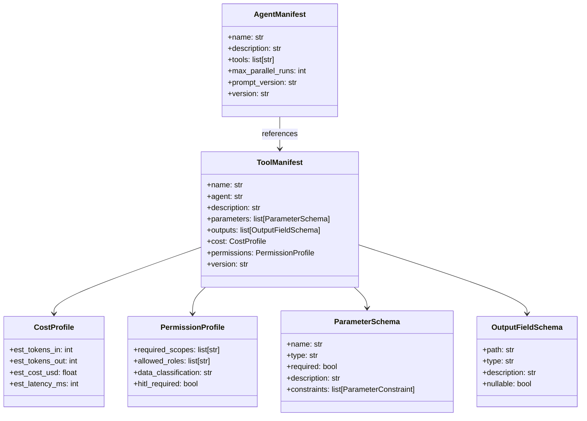
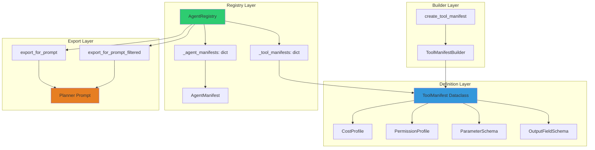
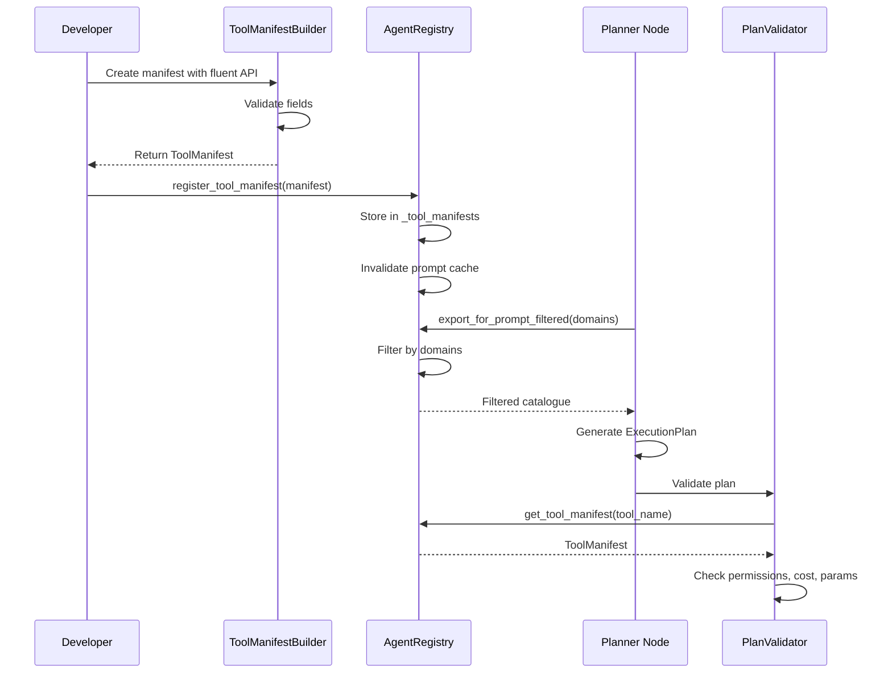

# AGENT_MANIFEST.md - Catalogue de Manifests et Builder Pattern

**Version**: 2.0
**Date**: 2025-12-27
**Auteur**: Documentation Technique LIA
**Statut**: ✅ Complète et Validée
**Updated**: LOT 9/10 agents, Voice domain, Philips Hue Smart Home, 11 agents total

---

## Table des Matières

1. [Vue d'Ensemble](#vue-densemble)
2. [Architecture du Catalogue](#architecture-du-catalogue)
3. [Tool Manifest](#tool-manifest)
4. [Agent Manifest](#agent-manifest)
5. [Manifest Builder Pattern](#manifest-builder-pattern)
6. [Catalogue Loader](#catalogue-loader)
7. [Export pour Planner](#export-pour-planner)
8. [Validation](#validation)
9. [Testing et Troubleshooting](#testing-et-troubleshooting)
10. [Exemples Pratiques](#exemples-pratiques)
11. [Best Practices](#best-practices)
12. [Ressources](#ressources)

---

## Vue d'Ensemble

### Objectifs du Catalogue de Manifests

Le **catalogue de manifests** est une base de données déclarative qui décrit de manière exhaustive tous les agents et outils disponibles dans LIA. Ce catalogue sert de **source unique de vérité** pour :

- **Planner LLM** : Génération de plans d'exécution (via `export_for_prompt()`)
- **Validator** : Validation des permissions, coûts, et paramètres
- **Orchestrateur** : Exécution de plans et context management
- **Documentation** : Génération automatique de l'inventaire des outils
- **Observabilité** : Tracking des coûts réels vs estimés

**Standards utilisés** :
- Dataclass-based schemas (Python 3.12+)
- Semantic versioning (SemVer)
- JSONPath pour les output schemas
- Builder pattern pour la construction
- Immutability pour la thread-safety

### Composants Principaux



**Architecture Pattern** : **Declarative Configuration + Builder Pattern**.

### Catalogue Actuel

**Agents enregistrés** : 11 agents routables + 1 utilitaire (context)

| Agent | Domaine | Tools | Description |
|-------|---------|-------|-------------|
| `contacts_agent` | Google Contacts | 6 | CRUD contacts Google People API |
| `context_agent` | Cross-domain (utilitaire) | 5 | Résolution références contextuelles |
| `emails_agent` | Gmail | 6 | Search, send, reply, forward, delete |
| `calendar_agent` | Google Calendar | 6 | CRUD events, list calendars |
| `drive_agent` | Google Drive | 3 | Search, list, get files |
| `tasks_agent` | Google Tasks | 7 | CRUD tasks, complete, list lists |
| `weather_agent` | OpenWeatherMap | 3 | Current, forecast, hourly |
| `wikipedia_agent` | Wikipedia API | 4 | Search, summary, article, related |
| `query_agent` | INTELLIA | 1 | Local query engine |
| `perplexity_agent` | Perplexity AI | 2 | Search, ask (web-augmented LLM) |
| `places_agent` | Google Places | 3 | Search, details, current location |
| `hue_agent` | Philips Hue | 6 | Control lights, rooms, scenes |

**Tools enregistrés** : 52+

| Domaine | Tools |
|---------|-------|
| **Google Contacts** | `search_contacts_tool`, `list_contacts_tool`, `get_contact_details_tool`, `create_contact_tool`, `update_contact_tool`, `delete_contact_tool` |
| **Context** | `resolve_reference`, `set_current_item`, `get_context_state`, `list_active_domains`, `get_context_list` |
| **Gmail** | `search_emails_tool`, `get_email_details_tool`, `send_email_tool`, `reply_email_tool`, `forward_email_tool`, `delete_email_tool` |
| **Calendar** | `list_calendars_tool`, `search_events_tool`, `get_event_details_tool`, `create_event_tool`, `update_event_tool`, `delete_event_tool` |
| **Drive** | `search_files_tool`, `list_files_tool`, `get_file_details_tool` |
| **Tasks** | `list_tasks_tool`, `get_task_details_tool`, `create_task_tool`, `update_task_tool`, `delete_task_tool`, `complete_task_tool`, `list_task_lists_tool` |
| **Weather** | `get_current_weather_tool`, `get_weather_forecast_tool`, `get_hourly_forecast_tool` |
| **Wikipedia** | `search_wikipedia_tool`, `get_wikipedia_summary_tool`, `get_wikipedia_article_tool`, `get_wikipedia_related_tool` |
| **Perplexity** | `perplexity_search_tool`, `perplexity_ask_tool` |
| **Places** | `search_places_tool`, `get_place_details_tool`, `get_current_location_tool` |
| **Query** | `local_query_engine_tool` |
| **Philips Hue** | `list_lights_tool`, `control_light_tool`, `list_rooms_tool`, `control_room_tool`, `list_scenes_tool`, `activate_scene_tool` |

---

## Architecture du Catalogue

### 1. Niveaux d'Architecture



### 2. Flux de Données



---

## Tool Manifest

### Structure Complète

**Fichier** : `apps/api/src/domains/agents/registry/catalogue.py`

```python
@dataclass
class ToolManifest:
    """
    Manifeste complet d'un tool.

    Source unique de vérité décrivant exhaustivement un tool :
    - Identité (nom, agent, version)
    - Documentation (description, exemples)
    - Contrat (paramètres, outputs)
    - Coût (tokens, latence)
    - Sécurité (permissions, HITL)
    - Comportement (iterations, dry-run, context)

    Attributes:
        name: Nom unique du tool (ex: "search_contacts_tool")
        agent: Nom de l'agent propriétaire
        description: Description complète pour LLM
        parameters: Liste des paramètres avec validation
        outputs: Documentation des champs de sortie
        cost: Profil de coût et performance
        permissions: Profil de permissions et sécurité
        max_iterations: Nombre max d'itérations (pour tools itératifs)
        supports_dry_run: Si True, tool supporte mode simulation
        reference_fields: Champs utilisables comme références contextuelles
        context_key: Clé pour auto-save dans Store (si applicable)
        field_mappings: Mapping noms user-friendly vers noms API
        examples: Exemples input/output pour documentation et tests
        version: Version semver du tool
        updated_at: Date dernière modification
        maintainer: Équipe responsable
    """

    # Identity
    name: str
    agent: str
    description: str

    # Contract
    parameters: list[ParameterSchema]
    outputs: list[OutputFieldSchema]

    # Cost & Performance
    cost: CostProfile

    # Security
    permissions: PermissionProfile

    # Behavior
    max_iterations: int = 1
    supports_dry_run: bool = False
    reference_fields: list[str] = field(default_factory=list)
    context_key: str | None = None
    field_mappings: dict[str, str] | None = None

    # Documentation
    examples: list[dict[str, Any]] = field(default_factory=list)
    examples_in_prompt: bool = True

    # Versioning
    version: str = "1.0.0"
    updated_at: datetime = field(default_factory=lambda: datetime.now(UTC))
    maintainer: str = "Team AI"

    # Display (optional - for UI rendering)
    display: DisplayMetadata | None = None

    def __post_init__(self) -> None:
        """Valide le manifeste"""
        if not self.name:
            raise ValueError("Tool name cannot be empty")
        if not self.agent:
            raise ValueError("Agent name cannot be empty")
        if not self.description:
            raise ValueError("Tool description cannot be empty")
        # Valider version semver (simple check)
        if not self.version or len(self.version.split(".")) != 3:
            raise ValueError(f"Invalid semver version: {self.version}")
```

### CostProfile (Détails)

```python
@dataclass(frozen=True)
class CostProfile:
    """
    Profil de coût et performance pour un tool.

    Utilisé pour :
    - Estimation coût total d'un plan (validation avant exécution)
    - Métriques d'observabilité (comparaison estimé vs réel)
    - Optimisation (identifier tools coûteux)

    Attributes:
        est_tokens_in: Nombre estimé de tokens en entrée (prompt + params)
        est_tokens_out: Nombre estimé de tokens en sortie (réponse)
        est_cost_usd: Coût estimé en USD (basé sur pricing modèle)
        est_latency_ms: Latence estimée en millisecondes
    """

    est_tokens_in: int = 0
    est_tokens_out: int = 0
    est_cost_usd: float = 0.0
    est_latency_ms: int = 0

    def __post_init__(self) -> None:
        """Valide les valeurs du profil"""
        if self.est_tokens_in < 0:
            raise ValueError("est_tokens_in must be >= 0")
        if self.est_tokens_out < 0:
            raise ValueError("est_tokens_out must be >= 0")
        if self.est_cost_usd < 0:
            raise ValueError("est_cost_usd must be >= 0")
        if self.est_latency_ms < 0:
            raise ValueError("est_latency_ms must be >= 0")
```

**Exemple** :

```python
cost = CostProfile(
    est_tokens_in=150,    # 150 tokens pour le prompt + params
    est_tokens_out=800,   # 800 tokens pour la réponse (liste de contacts)
    est_cost_usd=0.001,   # ~$0.001 par appel
    est_latency_ms=800,   # ~800ms latence API Google
)
```

### PermissionProfile (Détails)

```python
@dataclass(frozen=True)
class PermissionProfile:
    """
    Profil de permissions et sécurité pour un tool.

    Définit les exigences de sécurité :
    - Scopes OAuth requis (ex: google_contacts.read)
    - Roles utilisateurs autorisés (si restriction)
    - Classification des données (PUBLIC, CONFIDENTIAL, SENSITIVE)
    - Besoin d'approbation HITL (Human-In-The-Loop)

    Attributes:
        required_scopes: Liste des scopes OAuth nécessaires
        allowed_roles: Roles autorisés (vide = tous roles OK)
        data_classification: Niveau de sensibilité des données
        hitl_required: Si True, nécessite approbation utilisateur avant exécution
    """

    required_scopes: list[str] = field(default_factory=list)
    allowed_roles: list[str] = field(default_factory=list)
    data_classification: Literal[
        "PUBLIC", "INTERNAL", "CONFIDENTIAL", "SENSITIVE", "RESTRICTED"
    ] = "CONFIDENTIAL"
    hitl_required: bool = False
```

**Exemple** :

```python
permissions = PermissionProfile(
    required_scopes=["https://www.googleapis.com/auth/contacts.readonly"],
    allowed_roles=[],  # Tous les users autorisés
    data_classification="CONFIDENTIAL",  # Données personnelles
    hitl_required=False,  # Pas d'approbation pour search (lecture seule)
)
```

**Classification des données** :
- `PUBLIC` : Données publiques (ex: météo, taux de change)
- `INTERNAL` : Données internes non sensibles (ex: status système)
- `CONFIDENTIAL` : Données personnelles standards (ex: contacts, emails)
- `SENSITIVE` : Données sensibles (ex: données médicales, financières)
- `RESTRICTED` : Données ultra-sensibles (ex: mots de passe, clés API)

### ParameterSchema (Détails)

```python
@dataclass(frozen=True)
class ParameterSchema:
    """
    Schéma de validation pour un paramètre de tool.

    Décrit complètement un paramètre d'entrée :
    - Type (string, integer, boolean, array, object)
    - Requis ou optionnel
    - Description pour documentation
    - Contraintes de validation
    - Schéma JSON complet (optionnel, pour types complexes)

    Attributes:
        name: Nom du paramètre (ex: "query", "max_results")
        type: Type Pydantic (string, integer, boolean, array, object)
        required: Si True, paramètre obligatoire
        description: Description pour LLM et documentation
        constraints: Liste de contraintes de validation
        schema: Schéma JSON Schema complet (pour types complexes)
    """

    name: str
    type: str  # "string", "integer", "boolean", "array", "object", etc.
    required: bool
    description: str
    constraints: list[ParameterConstraint] = field(default_factory=list)
    schema: dict[str, Any] | None = None  # JSON Schema complet si nécessaire
```

**Contraintes supportées** :

```python
@dataclass(frozen=True)
class ParameterConstraint:
    """
    Contrainte de validation pour un paramètre.

    Supporte les contraintes Pydantic standards :
    - min_length / max_length (strings)
    - minimum / maximum (numbers)
    - pattern (regex)
    - enum (valeurs autorisées)
    """

    kind: Literal["min_length", "max_length", "minimum", "maximum", "pattern", "enum"]
    value: Any
```

**Exemple** :

```python
query_param = ParameterSchema(
    name="query",
    type="string",
    required=True,
    description="Texte de recherche (nom, email, ou téléphone)",
    constraints=[
        ParameterConstraint(kind="min_length", value=1),
        ParameterConstraint(kind="max_length", value=200),
    ],
)

limit_param = ParameterSchema(
    name="limit",
    type="integer",
    required=False,
    description="Nombre maximum de résultats (défaut: 10)",
    constraints=[
        ParameterConstraint(kind="minimum", value=1),
        ParameterConstraint(kind="maximum", value=100),
    ],
)

sort_order_param = ParameterSchema(
    name="sort_order",
    type="string",
    required=False,
    description="Ordre de tri des résultats",
    constraints=[
        ParameterConstraint(kind="enum", value=["ASC", "DESC"]),
    ],
)
```

### OutputFieldSchema (Détails)

```python
@dataclass(frozen=True)
class OutputFieldSchema:
    """
    Schéma d'un champ de sortie d'un tool.

    Documente la structure des données retournées.
    Utilise JSONPath pour décrire champs imbriqués.

    Attributes:
        path: Chemin JSONPath vers le champ (ex: "contacts[].name.display")
        type: Type du champ (string, integer, boolean, array, object)
        description: Description du champ
        nullable: Si True, champ peut être null
    """

    path: str
    type: str
    description: str
    nullable: bool = False
```

**Exemple** :

```python
outputs = [
    OutputFieldSchema(
        path="contacts",
        type="array",
        description="Liste des contacts trouvés",
        nullable=False,
    ),
    OutputFieldSchema(
        path="contacts[].resource_name",
        type="string",
        description="Identifiant Google du contact (ex: people/c12345)",
        nullable=False,
    ),
    OutputFieldSchema(
        path="contacts[].names",
        type="array",
        description="Noms du contact (peut contenir plusieurs entrées)",
        nullable=True,
    ),
    OutputFieldSchema(
        path="contacts[].names[].displayName",
        type="string",
        description="Nom complet formaté pour affichage",
        nullable=False,
    ),
    OutputFieldSchema(
        path="contacts[].emailAddresses",
        type="array",
        description="Adresses email du contact",
        nullable=True,
    ),
]
```

**JSONPath Convention** :
- `field` : Champ simple
- `field.nested` : Champ imbriqué
- `items[]` : Array
- `items[].field` : Champ dans array

---

## Agent Manifest

### Structure Complète

```python
@dataclass
class AgentManifest:
    """
    Manifeste d'un agent.

    Décrit un agent et ses capacités :
    - Identité (nom, description)
    - Tools disponibles
    - Contraintes d'exécution (parallelisme, timeout)
    - Version du prompt système

    Attributes:
        name: Nom unique de l'agent (ex: "contacts_agent")
        description: Description complète des capacités
        tools: Liste des noms de tools disponibles
        max_parallel_runs: Nombre max d'instances parallèles (1 = séquentiel)
        default_timeout_ms: Timeout par défaut en millisecondes
        prompt_version: Version du prompt système (ex: "v1", "v2")
        owner_team: Équipe propriétaire
        version: Version semver de l'agent
        updated_at: Date dernière modification
    """

    # Identity
    name: str
    description: str
    tools: list[str]  # Tool names

    # Execution constraints
    max_parallel_runs: int = 1
    default_timeout_ms: int = 30000

    # Prompt
    prompt_version: str = "v1"

    # Ownership
    owner_team: str = "Team AI"

    # Versioning
    version: str = "1.0.0"
    updated_at: datetime = field(default_factory=lambda: datetime.now(UTC))

    # Display (optional - for UI rendering)
    display: DisplayMetadata | None = None

    def __post_init__(self) -> None:
        """Valide le manifeste"""
        if not self.name:
            raise ValueError("Agent name cannot be empty")
        if not self.description:
            raise ValueError("Agent description cannot be empty")
        if not self.tools:
            raise ValueError("Agent must have at least one tool")
        if self.max_parallel_runs < 1:
            raise ValueError("max_parallel_runs must be >= 1")
        if self.default_timeout_ms < 1:
            raise ValueError("default_timeout_ms must be >= 1")
        # Valider version semver
        if not self.version or len(self.version.split(".")) != 3:
            raise ValueError(f"Invalid semver version: {self.version}")
```

### Exemple Complet

```python
contacts_agent_manifest = AgentManifest(
    name="contacts_agent",
    description="Agent spécialisé dans les opérations Google Contacts avec résolution contextuelle",
    tools=[
        "search_contacts_tool",
        "list_contacts_tool",
        "get_contact_details_tool",
    ],
    max_parallel_runs=1,  # Exécution séquentielle (évite rate limits Google)
    default_timeout_ms=30000,  # 30 secondes
    prompt_version="v1",
    owner_team="Team AI",
    version="1.0.0",
    updated_at=datetime.now(UTC),
)
```

---

## Manifest Builder Pattern

### Architecture du Builder

Le **ToolManifestBuilder** utilise le **Builder Pattern** avec API fluent pour construire des manifests de manière déclarative et type-safe.

```python
class ToolManifestBuilder:
    """
    Fluent builder for ToolManifest with generic presets.

    Design Principles:
    - Immutable: Each method returns new builder instance
    - Composable: Chain methods in any order
    - Validating: Errors raised at build() time (fail-fast)
    - Generic: Zero coupling to specific domains (contacts, gmail, etc.)
    """

    def __init__(self, name: str, agent: str, *, _manifest: ToolManifest | None = None) -> None:
        """Initialize builder with tool name and agent."""
        if _manifest is not None:
            self._manifest = _manifest
        else:
            self._manifest = ToolManifest(
                name=name,
                agent=agent,
                description="__BUILDER_PLACEHOLDER__",
                parameters=[],
                outputs=[],
                cost=CostProfile(),
                permissions=PermissionProfile(),
                version="1.0.0",
                maintainer="Team Agents",
            )

    def _clone(self, **updates: Any) -> Self:
        """Create new builder with updated manifest (immutability)."""
        new_manifest = replace(self._manifest, **updates)
        return self.__class__(
            name=self._manifest.name,
            agent=self._manifest.agent,
            _manifest=new_manifest,
        )
```

### Méthodes du Builder

#### Core Configuration

```python
def with_description(self, description: str) -> Self:
    """Set tool description."""
    return self._clone(description=description)

def with_version(self, version: str) -> Self:
    """Set semantic version."""
    return self._clone(version=version)

def with_maintainer(self, maintainer: str) -> Self:
    """Set maintainer identifier."""
    return self._clone(maintainer=maintainer)
```

#### Parameters Configuration

```python
def add_parameter(
    self,
    name: str,
    type: str,
    required: bool = False,
    description: str = "",
    **constraints: Any,
) -> Self:
    """
    Add parameter with automatic constraint detection.

    Args:
        name: Parameter name
        type: Parameter type ("string", "integer", "boolean", "array", "object")
        required: Whether parameter is required
        description: Parameter description
        **constraints: Constraint kwargs (min_length, maximum, enum, pattern, etc.)

    Returns:
        New builder instance

    Examples:
        >>> .add_parameter("query", "string", required=True, min_length=1)
        >>> .add_parameter("limit", "integer", min=1, max=100)
        >>> .add_parameter("status", "string", enum=["active", "inactive"])
    """
    # Parse constraints from kwargs
    constraint_list = self._parse_constraints(**constraints)

    param = ParameterSchema(
        name=name,
        type=type,
        required=required,
        description=description,
        constraints=constraint_list,
    )

    new_params = [*self._manifest.parameters, param]
    return self._clone(parameters=new_params)
```

#### Outputs Configuration

```python
def add_output(
    self,
    path: str,
    type: str,
    description: str = "",
    nullable: bool = False,
) -> Self:
    """
    Add output field schema.

    Args:
        path: JSONPath to output field (e.g., "items", "items[].id")
        type: Output type ("string", "integer", "array", "object", etc.)
        description: Field description
        nullable: Whether field can be null

    Returns:
        New builder instance

    Examples:
        >>> .add_output("items", "array", "List of items found")
        >>> .add_output("items[].id", "string", "Item unique identifier")
        >>> .add_output("total", "integer", "Total count")
    """
    output = OutputFieldSchema(
        path=path,
        type=type,
        description=description,
        nullable=nullable,
    )

    new_outputs = [*self._manifest.outputs, output]
    return self._clone(outputs=new_outputs)
```

#### Cost & Performance

```python
def with_cost_profile(
    self,
    est_tokens_in: int = 0,
    est_tokens_out: int = 0,
    est_cost_usd: float = 0.0,
    est_latency_ms: int = 0,
) -> Self:
    """Set cost and performance estimates."""
    cost = CostProfile(
        est_tokens_in=est_tokens_in,
        est_tokens_out=est_tokens_out,
        est_cost_usd=est_cost_usd,
        est_latency_ms=est_latency_ms,
    )
    return self._clone(cost=cost)
```

#### Security & Permissions

```python
def with_permissions(
    self,
    required_scopes: list[str] | None = None,
    allowed_roles: list[str] | None = None,
    hitl_required: bool = False,
    data_classification: Literal["PUBLIC", "INTERNAL", "CONFIDENTIAL", "SENSITIVE", "RESTRICTED"] | None = None,
) -> Self:
    """Set security and permission requirements."""
    permissions = PermissionProfile(
        required_scopes=required_scopes or [],
        allowed_roles=allowed_roles or [],
        hitl_required=hitl_required,
        data_classification=data_classification or "CONFIDENTIAL",
    )
    return self._clone(permissions=permissions)

def with_hitl(
    self,
    data_classification: Literal["PUBLIC", "INTERNAL", "CONFIDENTIAL", "RESTRICTED"] = "CONFIDENTIAL",
) -> Self:
    """Enable HITL (Human-in-the-Loop) with data classification."""
    existing_perms = self._manifest.permissions or PermissionProfile()

    new_perms = PermissionProfile(
        required_scopes=existing_perms.required_scopes or [],
        allowed_roles=existing_perms.allowed_roles or [],
        hitl_required=True,
        data_classification=data_classification,
    )

    return self._clone(permissions=new_perms)
```

#### Generic Presets

```python
def with_api_integration(
    self,
    provider: str,
    scopes: list[str],
    rate_limit: RateLimit | None = None,
    http2_enabled: bool = False,
) -> Self:
    """
    Generic preset for OAuth API integration.

    Works with ANY OAuth provider (Google, Microsoft, Salesforce, etc.).

    Args:
        provider: Provider name (for documentation/metrics)
        scopes: OAuth scopes required
        rate_limit: Optional rate limit configuration
        http2_enabled: Whether HTTP/2 should be used

    Returns:
        New builder instance

    Examples:
        >>> .with_api_integration(
        ...     provider="google",
        ...     scopes=["https://www.googleapis.com/auth/contacts.readonly"],
        ...     rate_limit=RateLimit(requests=10, period_seconds=1)
        ... )
    """
    # Set permissions with scopes
    builder = self.with_permissions(
        required_scopes=scopes,
        hitl_required=True,
        data_classification="CONFIDENTIAL",
    )

    # Set cost estimates (typical API call)
    builder = builder.with_cost_profile(
        est_tokens_in=150,
        est_tokens_out=400,
        est_cost_usd=0.001,
        est_latency_ms=500,
    )

    return builder
```

#### Validation & Build

```python
def validate(self, rules: list[ValidationRule] | None = None) -> list[str]:
    """
    Validate manifest against rules.

    Args:
        rules: Optional custom validation rules (extends defaults)

    Returns:
        List of error messages (empty if valid)
    """
    errors = []

    # Default validations
    if not self._manifest.description or self._manifest.description == "__BUILDER_PLACEHOLDER__":
        errors.append("Description is required (must call .with_description())")

    if not self._manifest.parameters and not self._manifest.outputs:
        errors.append("Tool must have at least parameters or outputs defined")

    # Check required parameters have descriptions
    for param in self._manifest.parameters:
        if param.required and not param.description:
            errors.append(f"Required parameter '{param.name}' must have description")

    # Custom rules
    if rules:
        for rule in rules:
            errors.extend(rule.validate(self._manifest))

    return errors

def build(self, validate: bool = True) -> ToolManifest:
    """
    Build and return ToolManifest.

    Args:
        validate: Whether to run validation before building

    Returns:
        Constructed ToolManifest

    Raises:
        ValueError: If validation fails
    """
    if validate:
        errors = self.validate()
        if errors:
            error_msg = "Manifest validation failed:\n" + "\n".join(f"  - {e}" for e in errors)
            raise ValueError(error_msg)

    return self._manifest
```

---

## Catalogue Loader

### Architecture du Loader

Le **catalogue loader** charge tous les manifests au démarrage de l'application et les enregistre dans le registry.

**Fichier** : `apps/api/src/domains/agents/registry/catalogue_loader.py`

```python
def initialize_catalogue(registry: AgentRegistry) -> None:
    """
    Initialise le catalogue avec les manifestes Phase 5 + LOT 9/10.

    Cette fonction charge et enregistre :
    - 11 agents routables + 1 utilitaire (context) :
      * contacts_agent (Google Contacts)
      * context_agent (Cross-domain utilities)
      * emails_agent (Gmail)
      * calendar_agent (Google Calendar) - LOT 9
      * drive_agent (Google Drive) - LOT 9
      * tasks_agent (Google Tasks) - LOT 9
      * weather_agent (OpenWeatherMap) - LOT 10
      * wikipedia_agent (Wikipedia) - LOT 10
      * query_agent (INTELLIA LocalQueryEngine) - LOT 10
      * perplexity_agent (Perplexity AI) - LOT 10
      * places_agent (Google Places) - LOT 10
      * hue_agent (Philips Hue Smart Home) - v1.8.0
    - 52+ tool manifests across all domains

    Args:
        registry: Instance d'AgentRegistry

    Example:
        >>> from .agent_registry import AgentRegistry
        >>> registry = AgentRegistry(...)
        >>> initialize_catalogue(registry)
    """
    # Import manifests from dedicated modules per domain
    from src.domains.agents.context.catalogue_manifests import (...)
    from src.domains.agents.google_contacts.catalogue_manifests import (...)
    from src.domains.agents.emails.catalogue_manifests import (...)
    from src.domains.agents.google_calendar.catalogue_manifests import (...)
    from src.domains.agents.google_drive.catalogue_manifests import (...)
    from src.domains.agents.google_tasks.catalogue_manifests import (...)
    from src.domains.agents.weather.catalogue_manifests import (...)
    from src.domains.agents.wikipedia.catalogue_manifests import (...)
    from src.domains.agents.perplexity.catalogue_manifests import (...)
    from src.domains.agents.places.catalogue_manifests import (...)
    from src.domains.agents.query.catalogue_manifests import (...)

    # Register all agents (11 routable + 1 utility)
    registry.register_agent_manifest(CONTACTS_AGENT_MANIFEST)
    registry.register_agent_manifest(CONTEXT_AGENT_MANIFEST)
    registry.register_agent_manifest(EMAILS_AGENT_MANIFEST)
    registry.register_agent_manifest(CALENDAR_AGENT_MANIFEST)
    registry.register_agent_manifest(DRIVE_AGENT_MANIFEST)
    registry.register_agent_manifest(TASKS_AGENT_MANIFEST)
    registry.register_agent_manifest(WEATHER_AGENT_MANIFEST)
    registry.register_agent_manifest(WIKIPEDIA_AGENT_MANIFEST)
    registry.register_agent_manifest(QUERY_AGENT_MANIFEST)
    registry.register_agent_manifest(PERPLEXITY_AGENT_MANIFEST)
    registry.register_agent_manifest(PLACES_AGENT_MANIFEST)
    registry.register_agent_manifest(HUE_AGENT_MANIFEST)

    # Register 52+ tool manifests (per domain)
    # Google Contacts (6 tools)
    # Emails (6 tools)
    # Context (5 tools)
    # Calendar (6 tools)
    # Drive (3 tools)
    # Tasks (7 tools)
    # Weather (3 tools)
    # Wikipedia (4 tools)
    # Perplexity (2 tools)
    # Places (3 tools)
    # Query (1 tool)
    # Philips Hue (6 tools)

    # Build domain index for dynamic filtering
    registry._build_domain_index()
```

### Agent Manifests (11 agents)

```python
# ============================================================================
# Google Workspace Agents (OAuth 2.0)
# ============================================================================

# Agent Manifest: contacts_agent (6 tools)
CONTACTS_AGENT_MANIFEST = AgentManifest(
    name="contacts_agent",
    description="Agent spécialisé dans les opérations Google Contacts (recherche, création, modification, suppression)",
    tools=[
        "search_contacts_tool",
        "list_contacts_tool",
        "get_contact_details_tool",
        "create_contact_tool",
        "update_contact_tool",
        "delete_contact_tool",
    ],
    max_parallel_runs=1,
    default_timeout_ms=30000,
    prompt_version="v1",
    owner_team="Team AI",
    version="1.0.0",
)

# Agent Manifest: emails_agent (6 tools)
EMAILS_AGENT_MANIFEST = AgentManifest(
    name="emails_agent",
    description="Agent spécialisé dans les opérations Gmail (recherche, lecture, envoi, réponse, transfert, suppression d'emails)",
    tools=[
        "search_emails_tool",
        "get_email_details_tool",
        "send_email_tool",
        "reply_email_tool",
        "forward_email_tool",
        "delete_email_tool",
    ],
    max_parallel_runs=1,
    default_timeout_ms=30000,
    prompt_version="v1",
)

# Agent Manifest: calendar_agent (6 tools) - LOT 9
CALENDAR_AGENT_MANIFEST = AgentManifest(
    name="calendar_agent",
    description="Agent spécialisé dans les opérations Google Calendar (événements, rendez-vous)",
    tools=[
        "list_calendars_tool",
        "search_events_tool",
        "get_event_details_tool",
        "create_event_tool",
        "update_event_tool",
        "delete_event_tool",
    ],
    max_parallel_runs=1,
    default_timeout_ms=30000,
    prompt_version="v1",
)

# Agent Manifest: drive_agent (3 tools) - LOT 9
DRIVE_AGENT_MANIFEST = AgentManifest(
    name="drive_agent",
    description="Agent spécialisé dans les opérations Google Drive (fichiers, dossiers)",
    tools=[
        "search_files_tool",
        "list_files_tool",
        "get_file_details_tool",
    ],
    max_parallel_runs=1,
    default_timeout_ms=30000,
    prompt_version="v1",
)

# Agent Manifest: tasks_agent (7 tools) - LOT 9
TASKS_AGENT_MANIFEST = AgentManifest(
    name="tasks_agent",
    description="Agent spécialisé dans les opérations Google Tasks (tâches, listes)",
    tools=[
        "list_tasks_tool",
        "get_task_details_tool",
        "create_task_tool",
        "update_task_tool",
        "delete_task_tool",
        "complete_task_tool",
        "list_task_lists_tool",
    ],
    max_parallel_runs=1,
    default_timeout_ms=30000,
    prompt_version="v1",
)

# Agent Manifest: places_agent (3 tools) - LOT 10
PLACES_AGENT_MANIFEST = AgentManifest(
    name="places_agent",
    description="Agent spécialisé dans les opérations Google Places (recherche lieux, détails, géolocalisation)",
    tools=[
        "search_places_tool",
        "get_place_details_tool",
        "get_current_location_tool",
    ],
    max_parallel_runs=1,
    default_timeout_ms=30000,
    prompt_version="v1",
)

# ============================================================================
# API Key Agents (External Services)
# ============================================================================

# Agent Manifest: weather_agent (3 tools) - LOT 10
WEATHER_AGENT_MANIFEST = AgentManifest(
    name="weather_agent",
    description="Agent spécialisé dans les informations météo (OpenWeatherMap API)",
    tools=[
        "get_current_weather_tool",
        "get_weather_forecast_tool",
        "get_hourly_forecast_tool",
    ],
    max_parallel_runs=3,  # Multiple parallel weather queries OK
    default_timeout_ms=10000,
    prompt_version="v1",
)

# Agent Manifest: wikipedia_agent (4 tools) - LOT 10
WIKIPEDIA_AGENT_MANIFEST = AgentManifest(
    name="wikipedia_agent",
    description="Agent spécialisé dans les recherches Wikipedia (articles, résumés)",
    tools=[
        "search_wikipedia_tool",
        "get_wikipedia_summary_tool",
        "get_wikipedia_article_tool",
        "get_wikipedia_related_tool",
    ],
    max_parallel_runs=3,
    default_timeout_ms=15000,
    prompt_version="v1",
)

# Agent Manifest: perplexity_agent (2 tools) - LOT 10
PERPLEXITY_AGENT_MANIFEST = AgentManifest(
    name="perplexity_agent",
    description="Agent spécialisé dans les recherches web augmentées par IA (Perplexity Sonar)",
    tools=[
        "perplexity_search_tool",
        "perplexity_ask_tool",
    ],
    max_parallel_runs=1,  # Rate limited API
    default_timeout_ms=30000,
    prompt_version="v1",
)

# ============================================================================
# Utility Agents (Local/Context)
# ============================================================================

# Agent Manifest: context_agent (5 tools)
CONTEXT_AGENT_MANIFEST = AgentManifest(
    name="context_agent",
    description=(
        "Agent générique pour la résolution de références contextuelles. "
        "Gère les références conversationnelles comme 'le premier', "
        "'la dernière', '2ème', etc. "
        "Supporte batch operations via get_context_list pour références plurielles. "
        "Compatible avec tous les domaines (contacts, emails, events)."
    ),
    tools=[
        "resolve_reference",
        "set_current_item",
        "get_context_state",
        "list_active_domains",
        "get_context_list",
    ],
    max_parallel_runs=5,  # Context operations are fast and local
    default_timeout_ms=5000,
    prompt_version="v1",
)

# Agent Manifest: query_agent (1 tool) - LOT 10
QUERY_AGENT_MANIFEST = AgentManifest(
    name="query_agent",
    description="Agent INTELLIA pour requêtes locales sur données stockées (mémoire sémantique)",
    tools=[
        "local_query_engine_tool",
    ],
    max_parallel_runs=3,
    default_timeout_ms=10000,
    prompt_version="v1",
)
```

---

## Export pour Planner

### export_for_prompt()

La méthode `export_for_prompt()` génère un dictionnaire optimisé pour injection dans le prompt du planner.

```python
def export_for_prompt(self) -> dict[str, Any]:
    """
    Export catalogue optimized for LLM planner prompt.

    Returns concise format suitable for prompt injection.
    Includes only essential info for plan generation.

    Performance: Cached for 1 hour to avoid rebuilding on every planner invocation.

    Returns:
        Dictionary optimized for planner LLM

    Example:
        >>> prompt_data = registry.export_for_prompt()
        >>> # Use in planner prompt:
        >>> prompt = f"Available tools: {json.dumps(prompt_data)}"
    """
    # Check cache first
    current_time = time.time()
    if (
        self._prompt_export_cache is not None
        and self._cache_timestamp is not None
        and (current_time - self._cache_timestamp) < self._cache_ttl_seconds
    ):
        logger.debug("catalogue_export_cache_hit")
        return self._prompt_export_cache

    # Cache miss - rebuild catalogue export
    with self._catalogue_lock:
        agents_data = []

        for agent_manifest in self._agent_manifests.values():
            tools_data = []

            for tool_name in agent_manifest.tools:
                if tool_name in self._tool_manifests:
                    tm = self._tool_manifests[tool_name]

                    # Format parameters for prompt
                    params_data = [
                        {
                            "name": p.name,
                            "type": p.type,
                            "required": p.required,
                            "description": p.description,
                        }
                        for p in tm.parameters
                    ]

                    tool_data = {
                        "name": tm.name,
                        "description": tm.description,
                        "parameters": params_data,
                        "cost_estimate": {
                            "tokens": tm.cost.est_tokens_in + tm.cost.est_tokens_out,
                            "latency_ms": tm.cost.est_latency_ms,
                        },
                        "requires_approval": tm.permissions.hitl_required,
                    }

                    tools_data.append(tool_data)

            agents_data.append(
                {
                    "agent": agent_manifest.name,
                    "description": agent_manifest.description,
                    "tools": tools_data,
                }
            )

        result = {
            "agents": agents_data,
            "max_plan_cost_usd": settings.planner_max_cost_usd,
            "max_plan_steps": settings.planner_max_steps,
        }

        # Update cache
        self._prompt_export_cache = result
        self._cache_timestamp = current_time

        return result
```

**Format de sortie** :

```json
{
  "agents": [
    {
      "agent": "contacts_agent",
      "description": "Agent spécialisé Google Contacts...",
      "tools": [
        {
          "name": "search_contacts_tool",
          "description": "Recherche contacts par nom, email, téléphone",
          "parameters": [
            {
              "name": "query",
              "type": "string",
              "required": true,
              "description": "Texte de recherche"
            },
            {
              "name": "limit",
              "type": "integer",
              "required": false,
              "description": "Nombre max de résultats"
            }
          ],
          "cost_estimate": {
            "tokens": 950,
            "latency_ms": 800
          },
          "requires_approval": false
        }
      ]
    }
  ],
  "max_plan_cost_usd": 10.0,
  "max_plan_steps": 20
}
```

**Performance** :
- Cache HIT: ~1ms
- Cache MISS: ~50-100ms
- TTL: 1 hour (invalidated on manifest registration)

---

## Validation

### Validation au Build

Le builder valide automatiquement le manifest lors de `build()` :

```python
def validate(self, rules: list[ValidationRule] | None = None) -> list[str]:
    """Validate manifest against rules."""
    errors = []

    # Check required fields
    if not self._manifest.description or self._manifest.description == "__BUILDER_PLACEHOLDER__":
        errors.append("Description is required (must call .with_description())")

    if not self._manifest.parameters and not self._manifest.outputs:
        errors.append("Tool must have at least parameters or outputs defined")

    # Check required parameters have descriptions
    for param in self._manifest.parameters:
        if param.required and not param.description:
            errors.append(f"Required parameter '{param.name}' must have description")

    # Custom rules
    if rules:
        for rule in rules:
            errors.extend(rule.validate(self._manifest))

    return errors
```

### Validation Runtime (PlanValidator)

Le `PlanValidator` valide les plans en utilisant les manifests :

```python
# In src/domains/agents/orchestration/validator.py

def validate_tool_exists(self, tool_name: str) -> ValidationResult:
    """Check if tool exists in catalogue."""
    try:
        registry = get_global_registry()
        manifest = registry.get_tool_manifest(tool_name)
        return ValidationResult(is_valid=True, tool_manifest=manifest)
    except ToolManifestNotFound:
        return ValidationResult(
            is_valid=False,
            errors=[f"Tool '{tool_name}' not found in catalogue"]
        )

def validate_permissions(self, tool_name: str, user_scopes: list[str]) -> ValidationResult:
    """Check if user has required OAuth scopes."""
    registry = get_global_registry()
    manifest = registry.get_tool_manifest(tool_name)

    required_scopes = manifest.permissions.required_scopes
    missing_scopes = set(required_scopes) - set(user_scopes)

    if missing_scopes:
        return ValidationResult(
            is_valid=False,
            errors=[f"Missing OAuth scopes: {missing_scopes}"]
        )

    return ValidationResult(is_valid=True)
```

---

## Testing et Troubleshooting

### Vérifier les Manifests

```python
# Python REPL
from src.domains.agents.registry import get_global_registry

registry = get_global_registry()

# List all tool manifests
manifests = registry.list_tool_manifests()
for m in manifests:
    print(f"{m.name} v{m.version}")
    print(f"  Agent: {m.agent}")
    print(f"  Cost: {m.cost.est_tokens_in} in, {m.cost.est_tokens_out} out")
    print(f"  HITL: {m.permissions.hitl_required}")
    print()

# Get specific manifest
manifest = registry.get_tool_manifest("search_contacts_tool")
print(f"Parameters: {len(manifest.parameters)}")
for p in manifest.parameters:
    print(f"  - {p.name} ({p.type}): {p.required}")
```

### Troubleshooting "Manifest Not Found"

**Symptôme** :

```
ToolManifestNotFound: Tool manifest not found: search_contacts_tool
```

**Cause** : Manifest non enregistré dans le registry.

**Solution** :

```python
# Vérifier que initialize_catalogue() a été appelé
from src.domains.agents.registry import initialize_catalogue

registry = get_global_registry()
initialize_catalogue(registry)
```

### Troubleshooting "Validation Failed"

**Symptôme** :

```
ValueError: Manifest validation failed:
  - Description is required (must call .with_description())
```

**Cause** : Builder incomplet.

**Solution** :

```python
# Ajouter la description manquante
builder = (
    ToolManifestBuilder("my_tool", "my_agent")
    .with_description("Tool description here")  # ✅ Ajouté
    .add_parameter("param1", "string", required=True)
    .build()
)
```

---

## Exemples Pratiques

### Exemple 1 : Créer un Tool Manifest avec Builder

```python
from src.domains.agents.registry.manifest_builder import ToolManifestBuilder

manifest = (
    ToolManifestBuilder("search_contacts_tool", "contacts_agent")
    .with_description("Recherche contacts Google par nom, email ou téléphone")
    .with_version("1.0.0")
    .with_maintainer("Team AI")
    # Parameters
    .add_parameter(
        "query",
        "string",
        required=True,
        description="Texte de recherche (nom, email, ou téléphone)",
        min_length=1,
        max_length=200,
    )
    .add_parameter(
        "limit",
        "integer",
        required=False,
        description="Nombre maximum de résultats (défaut: 10)",
        min=1,
        max=100,
    )
    # Outputs
    .add_output("contacts", "array", "Liste des contacts trouvés")
    .add_output("contacts[].resource_name", "string", "Identifiant Google")
    .add_output("contacts[].names", "array", "Noms du contact", nullable=True)
    # Cost
    .with_cost_profile(
        est_tokens_in=150,
        est_tokens_out=800,
        est_cost_usd=0.001,
        est_latency_ms=800,
    )
    # Permissions
    .with_api_integration(
        provider="google",
        scopes=["https://www.googleapis.com/auth/contacts.readonly"],
    )
    # Build
    .build()
)

# Register in registry
registry.register_tool_manifest(manifest)
```

### Exemple 2 : Créer un Manifest avec Preset Generic

```python
# Database tool
manifest = (
    ToolManifestBuilder("query_users", "database_agent")
    .with_description("Query users from PostgreSQL database")
    .add_parameter("sql", "string", required=True, description="SQL query")
    .add_parameter("limit", "integer", min=1, max=1000)
    .add_output("rows", "array", "Query results")
    .with_database_integration(
        db_type="postgresql",
        read_only=True,
        max_rows=1000,
    )
    .build()
)

# REST API tool
manifest = (
    ToolManifestBuilder("fetch_weather", "weather_agent")
    .with_description("Fetch weather data from OpenWeatherMap API")
    .add_parameter("city", "string", required=True)
    .add_parameter("units", "string", enum=["metric", "imperial"])
    .add_output("temperature", "number", "Current temperature")
    .add_output("description", "string", "Weather description")
    .with_rest_api_integration(
        base_url="https://api.openweathermap.org/data/2.5",
        auth_type="api_key",
    )
    .build()
)
```

---

## Best Practices

### 1. Manifest Design

**✅ DO** :
- Provide accurate cost estimates (measure in production)
- Document all parameters with clear descriptions
- Use JSONPath for output schemas
- Version manifests with SemVer
- Classify data appropriately (PUBLIC → RESTRICTED)

**❌ DON'T** :
- Skip parameter descriptions
- Underestimate costs (breaks budget validation)
- Hardcode manifests in code (use builder)
- Forget to update version on changes

### 2. Builder Usage

**✅ DO** :
- Use fluent API for readability
- Validate before build
- Use generic presets (`with_api_integration()`)
- Add constraints to parameters

**❌ DON'T** :
- Skip validation
- Duplicate manifest logic
- Forget to call `.build()`

### 3. Catalogue Management

**✅ DO** :
- Load all manifests at startup
- Build domain index after loading
- Cache export_for_prompt() results
- Invalidate cache on manifest changes

**❌ DON'T** :
- Register manifests at runtime
- Skip domain indexing
- Bypass cache without reason

---

## Ressources

### Documentation Externe

- [Semantic Versioning (SemVer)](https://semver.org/)
- [JSON Schema](https://json-schema.org/)
- [JSONPath](https://goessner.net/articles/JsonPath/)
- [Builder Pattern (Gang of Four)](https://en.wikipedia.org/wiki/Builder_pattern)

### Documentation Interne

- [AGENTS.md](./AGENTS.md) - Architecture multi-agent et registry
- [TOOLS.md](./TOOLS.md) - Système d'outils
- [PLANNER.md](./PLANNER.md) - Planner et validation
- [ROUTER.md](./ROUTER.md) - Router et domain detection

### Fichiers Source

**Core Registry:**
- `apps/api/src/domains/agents/registry/catalogue.py` - Manifest schemas + ToolCategory
- `apps/api/src/domains/agents/registry/manifest_builder.py` - Builder pattern fluent API
- `apps/api/src/domains/agents/registry/catalogue_loader.py` - Catalogue initialization (11 agents, 56+ tools)
- `apps/api/src/domains/agents/registry/agent_registry.py` - Registry avec export methods

**Domain Catalogue Manifests:**
- `apps/api/src/domains/agents/google_contacts/catalogue_manifests.py` - Contacts (6 tools)
- `apps/api/src/domains/agents/context/catalogue_manifests.py` - Context (5 tools)
- `apps/api/src/domains/agents/emails/catalogue_manifests.py` - Emails (6 tools)
- `apps/api/src/domains/agents/google_calendar/catalogue_manifests.py` - Calendar (6 tools)
- `apps/api/src/domains/agents/google_drive/catalogue_manifests.py` - Drive (3 tools)
- `apps/api/src/domains/agents/google_tasks/catalogue_manifests.py` - Tasks (7 tools)
- `apps/api/src/domains/agents/weather/catalogue_manifests.py` - Weather (3 tools)
- `apps/api/src/domains/agents/wikipedia/catalogue_manifests.py` - Wikipedia (4 tools)
- `apps/api/src/domains/agents/perplexity/catalogue_manifests.py` - Perplexity (2 tools)
- `apps/api/src/domains/agents/places/catalogue_manifests.py` - Places (3 tools)
- `apps/api/src/domains/agents/query/catalogue_manifests.py` - Query (1 tool)
- `apps/api/src/domains/agents/hue/catalogue_manifests.py` - Philips Hue (6 tools)

---

**Document généré le** : 2025-12-27
**Auteur** : Documentation Technique LIA
**Phase** : Phase 5 + LOT 9/10 + v1.8.0 - Production Manifests
**Statut** : ✅ Complète et Validée
**Stats** : 11 agents routables + 1 utilitaire, 56+ tools, 12 domaines
