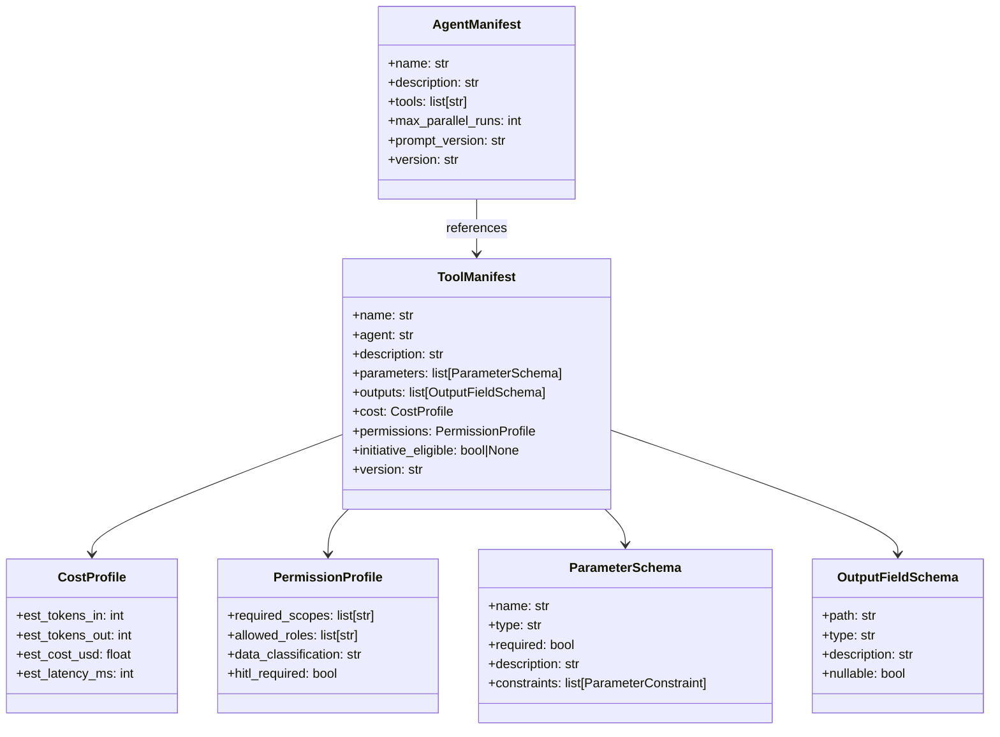
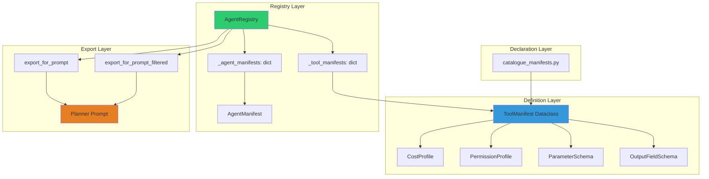
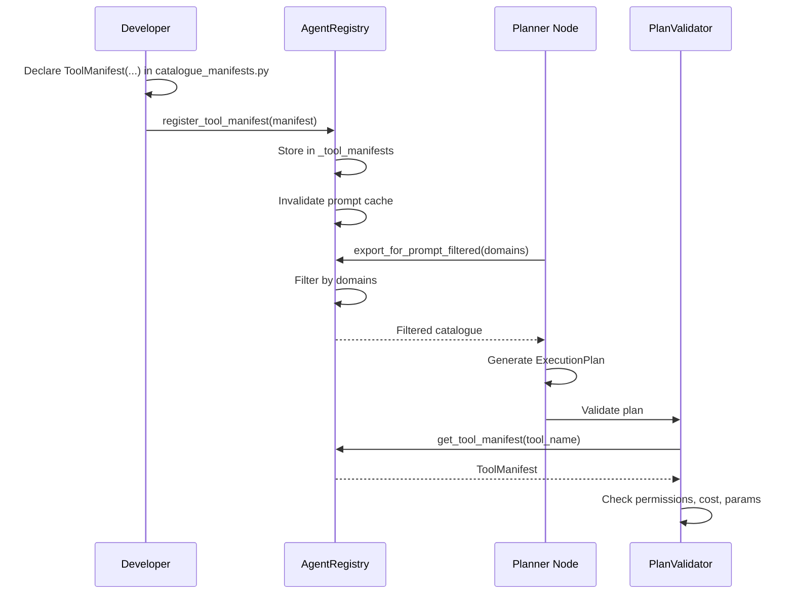

# AGENT_MANIFEST.md - Catalogue de Manifests

**Version**: 2.0
**Date**: 2025-12-27
**Auteur**: Documentation Technique LIA
**Statut**: ✅ Complète et Validée
**Updated**: 2026-04-08

---

## Table des Matières

1. [Vue d'Ensemble](#vue-densemble)
2. [Architecture du Catalogue](#architecture-du-catalogue)
3. [Per-Request Manifest Context](#per-request-manifest-context)
4. [Tool Manifest](#tool-manifest)
5. [Agent Manifest](#agent-manifest)
6. [Manifest Builder Pattern](#manifest-builder-pattern-removed-in-v12116)
7. [Catalogue Loader](#catalogue-loader)
8. [Export pour Planner](#export-pour-planner)
9. [Validation](#validation)
10. [Testing et Troubleshooting](#testing-et-troubleshooting)
11. [Exemples Pratiques](#exemples-pratiques)
12. [Best Practices](#best-practices)
13. [Ressources](#ressources)

---

## Vue d'Ensemble

### Objectifs du Catalogue de Manifests

Le **catalogue de manifests** est une base de données déclarative qui décrit de manière exhaustive tous les agents et outils disponibles dans LIA. Ce catalogue sert de **source unique de vérité** pour :

- **Planner LLM** : Génération de plans d'exécution (via `export_for_prompt()`)
- **Validator** : Validation des permissions, coûts, et paramètres
- **Orchestrateur** : Exécution de plans et context management
- **Documentation** : Génération automatique de l'inventaire des outils
- **Observabilité** : Tracking des coûts réels vs estimés

**Standards utilisés** :
- Dataclass-based schemas (Python 3.14)
- Semantic versioning (SemVer)
- JSONPath pour les output schemas
- Déclaration directe des dataclasses (le builder a été retiré en v1.21.16)
- Immutability pour la thread-safety

### Composants Principaux


```mermaid
classDiagram
    class ToolManifest {
        +name: str
        +agent: str
        +description: str
        +parameters: list[ParameterSchema]
        +outputs: list[OutputFieldSchema]
        +cost: CostProfile
        +permissions: PermissionProfile
        +initiative_eligible: bool|None
        +version: str
    }

    class AgentManifest {
        +name: str
        +description: str
        +tools: list[str]
        +max_parallel_runs: int
        +prompt_version: str
        +version: str
    }

    class CostProfile {
        +est_tokens_in: int
        +est_tokens_out: int
        +est_cost_usd: float
        +est_latency_ms: int
    }

    class PermissionProfile {
        +required_scopes: list[str]
        +allowed_roles: list[str]
        +data_classification: str
        +hitl_required: bool
    }

    class ParameterSchema {
        +name: str
        +type: str
        +required: bool
        +description: str
        +constraints: list[ParameterConstraint]
    }

    class OutputFieldSchema {
        +path: str
        +type: str
        +description: str
        +nullable: bool
    }

    ToolManifest --> CostProfile
    ToolManifest --> PermissionProfile
    ToolManifest --> ParameterSchema
    ToolManifest --> OutputFieldSchema
    AgentManifest --> ToolManifest : references
```

**Architecture Pattern** : **Declarative Configuration** — des dataclasses déclarées
directement (le builder fluent a été retiré en v1.21.16, ADR-107).

### Catalogue en service

Ce document ne recopie ni la liste des agents ni celle de leurs outils : une
copie cessait d'être vraie à chaque capacité ajoutée. Ils se lisent dans le code
(voir [Catalogue Loader](#catalogue-loader)) ou, à l'exécution, par
`export_catalogue()`.

---

## Architecture du Catalogue

### 1. Niveaux d'Architecture


```mermaid
graph TB
    subgraph "Definition Layer"
        A[ToolManifest Dataclass] --> B[CostProfile]
        A --> C[PermissionProfile]
        A --> D[ParameterSchema]
        A --> E[OutputFieldSchema]
    end

    subgraph "Declaration Layer"
        F[catalogue_manifests.py] --> A
    end

    subgraph "Registry Layer"
        H[AgentRegistry] --> I[_tool_manifests: dict]
        H --> J[_agent_manifests: dict]
        I --> A
        J --> K[AgentManifest]
    end

    subgraph "Export Layer"
        H --> L[export_for_prompt]
        H --> M[export_for_prompt_filtered]
        L --> N[Planner Prompt]
        M --> N
    end

    style A fill:#3498db
    style H fill:#2ecc71
    style N fill:#e67e22
```

### 2. Flux de Données


```mermaid
sequenceDiagram
    participant Dev as Developer
    participant Registry as AgentRegistry
    participant Planner as Planner Node
    participant Validator as PlanValidator

    Dev->>Dev: Declare ToolManifest(...) in catalogue_manifests.py

    Dev->>Registry: register_tool_manifest(manifest)
    Registry->>Registry: Store in _tool_manifests
    Registry->>Registry: Invalidate prompt cache

    Planner->>Registry: export_for_prompt_filtered(domains)
    Registry->>Registry: Filter by domains
    Registry-->>Planner: Filtered catalogue

    Planner->>Planner: Generate ExecutionPlan
    Planner->>Validator: Validate plan

    Validator->>Registry: get_tool_manifest(tool_name)
    Registry-->>Validator: ToolManifest
    Validator->>Validator: Check permissions, cost, params
```

---

## Per-Request Manifest Context

> See also: [ADR-061 — Centralized Component Activation/Deactivation Control](../architecture/ADR-061-Centralized-Component-Activation.md)

### Overview

At request start, a single pre-filtered snapshot of all available tool manifests is built once and stored in a per-request `ContextVar`. Every pipeline component reads from this snapshot instead of calling `registry.list_tool_manifests()` and applying its own filtering logic.

This follows the established `active_skills_ctx` pattern: set once, read everywhere, propagated automatically to sub-agents via Python's async context variable mechanism.

### ContextVar: `request_tool_manifests_ctx`

**File**: `apps/api/src/core/context.py`

```python
request_tool_manifests_ctx: ContextVar[list["ToolManifest"] | None] = ContextVar(
    "request_tool_manifests_ctx", default=None
)
```

The ContextVar holds the merged, filtered manifest list for the current request. It is:

- **Built once** at request start in `AgentService._stream_with_new_services()`, after `admin_mcp_disabled_ctx` and `user_mcp_tools_ctx` are already set.
- **Read everywhere** via `get_request_tool_manifests()` — router node, catalogue strategies (normal and panic), semantic expansion service, planner service, and any sub-agents.
- **Never written** by consumers. Consumers call `get_request_tool_manifests()` and treat the list as read-only.

### Builder: `build_request_tool_manifests()`

**File**: `apps/api/src/core/context.py`

```python
def build_request_tool_manifests(registry: "AgentRegistry") -> list["ToolManifest"]:
    """Build the per-request available tool manifests list."""
    from src.domains.agents.registry.domain_taxonomy import (
        filter_admin_mcp_disabled_manifests,
    )
    # 1. Global registry manifests minus admin MCP servers disabled by user
    manifests = filter_admin_mcp_disabled_manifests(registry.list_tool_manifests())
    # 2. Plus user MCP tools (already filtered at setup time)
    user_ctx = user_mcp_tools_ctx.get()
    if user_ctx and user_ctx.tool_manifests:
        manifests = list(manifests) + user_ctx.tool_manifests
    return manifests
```

The builder is the **single source of truth** for tool availability. It combines:

1. All globally registered manifests (native tools + admin MCP tools).
2. Minus any admin MCP servers the current user has disabled (`admin_mcp_disabled_ctx`).
3. Plus the user's own MCP tools (`user_mcp_tools_ctx`), already filtered by enabled/status at session setup.

### Accessor: `get_request_tool_manifests()`

**File**: `apps/api/src/core/context.py`

```python
def get_request_tool_manifests() -> list["ToolManifest"]:
    """Get the per-request available tool manifests."""
    result = request_tool_manifests_ctx.get()
    if result is None:
        # Warns and returns empty list if called outside request lifecycle
        ...
    return result
```

All pipeline consumers call this function. It logs a structured warning (`request_tool_manifests_ctx_not_set`) if invoked outside a request lifecycle (e.g., in tests or background tasks), and returns an empty list rather than raising.

### Helper: `filter_admin_mcp_disabled_manifests()`

**File**: `apps/api/src/domains/agents/registry/domain_taxonomy.py`

```python
def filter_admin_mcp_disabled_manifests(
    manifests: list["ToolManifest"],
    admin_disabled: set[str] | None = None,
) -> list["ToolManifest"]:
```

Extracts the server key from each manifest's `agent` field (e.g. `mcp_excalidraw_agent` → `excalidraw`) and removes entries whose key appears in the disabled set. If `admin_disabled` is `None`, the function reads from `admin_mcp_disabled_ctx` automatically.

**This function is called in exactly one place**: `build_request_tool_manifests()`. It is not scattered across individual consumers — each consumer that previously called `registry.list_tool_manifests()` and filtered independently has been migrated to `get_request_tool_manifests()`.

### Request Lifecycle

```
AgentService._stream_with_new_services()
  │
  ├─ set admin_mcp_disabled_ctx    (from User.admin_mcp_disabled_servers)
  ├─ set user_mcp_tools_ctx        (from user MCP session setup)
  │
  ├─ manifests = build_request_tool_manifests(registry)
  │     └─ filter_admin_mcp_disabled_manifests()  ← called once here only
  │
  └─ request_tool_manifests_ctx.set(manifests)
        │
        ├─ router_node_v3          ← get_request_tool_manifests()
        ├─ query_analyzer_service  ← get_request_tool_manifests()
        ├─ normal_filtering        ← get_request_tool_manifests()
        ├─ panic_filtering         ← get_request_tool_manifests()
        ├─ expansion_service       ← get_request_tool_manifests()
        ├─ smart_planner_service   ← get_request_tool_manifests()
        └─ sub-agents              ← inherited via async ContextVar propagation
```

### Comparison with `active_skills_ctx`

| Aspect | `active_skills_ctx` | `request_tool_manifests_ctx` |
|--------|--------------------|-----------------------------|
| Type | `set[str] \| None` | `list[ToolManifest] \| None` |
| Set by | `SkillPreferenceService` | `build_request_tool_manifests()` |
| Read by | `build_skills_catalog()`, response node, skill bypass | All catalogue consumers |
| Sub-agent propagation | Yes (async ContextVar) | Yes (async ContextVar) |
| ADR | — | ADR-061 |

Both follow the same principle: compute once at request entry, propagate implicitly, never recompute inside the pipeline.

---

## Tool Manifest

### Structure Complète

**Fichier** : `apps/api/src/domains/agents/registry/catalogue.py`

```python
@dataclass
class ToolManifest:
    """
    Manifeste complet d'un tool.

    Source unique de vérité décrivant exhaustivement un tool :
    - Identité (nom, agent, version)
    - Documentation (description, exemples)
    - Contrat (paramètres, outputs)
    - Coût (tokens, latence)
    - Sécurité (permissions, HITL)
    - Comportement (iterations, dry-run, context)

    Attributes:
        name: Nom unique du tool (ex: "get_contacts_tool")
        agent: Nom de l'agent propriétaire
        description: Description complète pour LLM
        parameters: Liste des paramètres avec validation
        outputs: Documentation des champs de sortie
        cost: Profil de coût et performance
        permissions: Profil de permissions et sécurité
        max_iterations: Nombre max d'itérations (pour tools itératifs)
        supports_dry_run: Si True, tool supporte mode simulation
        reference_fields: Champs utilisables comme références contextuelles
        context_key: Clé pour auto-save dans Store (si applicable)
        context_save_mode: Override LIST/CURRENT/NONE pour classify_save_mode (None = défaut LIST). Ignoré pour tools unifiés décorés (qui fixent le mode dans UnifiedToolOutput).
        field_mappings: Mapping noms user-friendly vers noms API
        examples: Exemples input/output pour documentation et tests
        version: Version semver du tool
        updated_at: Date dernière modification
        maintainer: Équipe responsable
        initiative_eligible: Whether the tool can be used during the initiative phase (None = auto-determined)
    """

    # Identity
    name: str
    agent: str
    description: str

    # Contract
    parameters: list[ParameterSchema]
    outputs: list[OutputFieldSchema]

    # Cost & Performance
    cost: CostProfile

    # Security
    permissions: PermissionProfile

    # Behavior
    max_iterations: int = 1
    supports_dry_run: bool = False
    reference_fields: list[str] = field(default_factory=list)
    context_key: str | None = None
    context_save_mode: ContextSaveMode | None = None  # LIST/CURRENT/NONE override
    field_mappings: dict[str, str] | None = None

    # Documentation
    examples: list[dict[str, Any]] = field(default_factory=list)
    examples_in_prompt: bool = True

    # Versioning
    version: str = "1.0.0"
    updated_at: datetime = field(default_factory=lambda: datetime.now(UTC))
    maintainer: str = "Team AI"

    # Initiative eligibility: whether this tool can be used during the initiative phase.
    # Default: None → auto-determined from category (search/readonly = True, system = False).
    # Set explicitly to False on tools not useful for proactive enrichment.
    initiative_eligible: bool | None = None

    # Display (optional - for UI rendering)
    display: DisplayMetadata | None = None

    def __post_init__(self) -> None:
        """Valide le manifeste"""
        if not self.name:
            raise ValueError("Tool name cannot be empty")
        if not self.agent:
            raise ValueError("Agent name cannot be empty")
        if not self.description:
            raise ValueError("Tool description cannot be empty")
        # Valider version semver (simple check)
        if not self.version or len(self.version.split(".")) != 3:
            raise ValueError(f"Invalid semver version: {self.version}")
```

### CostProfile (Détails)

```python
@dataclass(frozen=True)
class CostProfile:
    """
    Profil de coût et performance pour un tool.

    Utilisé pour :
    - Estimation coût total d'un plan (validation avant exécution)
    - Métriques d'observabilité (comparaison estimé vs réel)
    - Optimisation (identifier tools coûteux)

    Attributes:
        est_tokens_in: Nombre estimé de tokens en entrée (prompt + params)
        est_tokens_out: Nombre estimé de tokens en sortie (réponse)
        est_cost_usd: Coût estimé en USD (basé sur pricing modèle)
        est_latency_ms: Latence estimée en millisecondes
    """

    est_tokens_in: int = 0
    est_tokens_out: int = 0
    est_cost_usd: float = 0.0
    est_latency_ms: int = 0

    def __post_init__(self) -> None:
        """Valide les valeurs du profil"""
        if self.est_tokens_in < 0:
            raise ValueError("est_tokens_in must be >= 0")
        if self.est_tokens_out < 0:
            raise ValueError("est_tokens_out must be >= 0")
        if self.est_cost_usd < 0:
            raise ValueError("est_cost_usd must be >= 0")
        if self.est_latency_ms < 0:
            raise ValueError("est_latency_ms must be >= 0")
```

**Exemple** :

```python
cost = CostProfile(
    est_tokens_in=150,    # 150 tokens pour le prompt + params
    est_tokens_out=800,   # 800 tokens pour la réponse (liste de contacts)
    est_cost_usd=0.001,   # ~$0.001 par appel
    est_latency_ms=800,   # ~800ms latence API Google
)
```

### PermissionProfile (Détails)

```python
@dataclass(frozen=True)
class PermissionProfile:
    """
    Profil de permissions et sécurité pour un tool.

    Définit les exigences de sécurité :
    - Scopes OAuth requis (ex: google_contacts.read)
    - Roles utilisateurs autorisés (si restriction)
    - Classification des données (PUBLIC, CONFIDENTIAL, SENSITIVE)
    - Besoin d'approbation HITL (Human-In-The-Loop)

    Attributes:
        required_scopes: Liste des scopes OAuth nécessaires
        allowed_roles: Roles autorisés (vide = tous roles OK)
        data_classification: Niveau de sensibilité des données
        hitl_required: Si True, nécessite approbation utilisateur avant exécution
    """

    required_scopes: list[str] = field(default_factory=list)
    allowed_roles: list[str] = field(default_factory=list)
    data_classification: Literal[
        "PUBLIC", "INTERNAL", "CONFIDENTIAL", "SENSITIVE", "RESTRICTED"
    ] = "CONFIDENTIAL"
    hitl_required: bool = False
```

**Exemple** :

```python
permissions = PermissionProfile(
    required_scopes=["https://www.googleapis.com/auth/contacts.readonly"],
    allowed_roles=[],  # Tous les users autorisés
    data_classification="CONFIDENTIAL",  # Données personnelles
    hitl_required=False,  # Pas d'approbation pour search (lecture seule)
)
```

### `mutation_policy` — ce que l'outil DOIT à l'utilisateur (ADR-263)

`PermissionProfile.hitl_required` dit si le mode ReAct interrompt AVANT
l'exécution. Il ne dit pas ce qu'un outil doit à l'utilisateur : mesuré le
2026-09-03, 13 outils natifs classés « mutation » n'avaient aucune porte de
confirmation dans aucun des deux modes, et rien ne disait si c'était une
décision ou un oubli.

`ToolManifest.mutation_policy` le déclare, avec six valeurs :

| Valeur | Ce que l'utilisateur voit | Raison écrite exigée |
|---|---|---|
| `read` | rien : l'outil ne change rien | non |
| `draft` | le brouillon EST la confirmation (`draft_critique`) | non |
| `confirm` | une carte de confirmation avant exécution, dans les DEUX modes | non |
| `reversible` | rien : l'outil agit, un appel défait | **oui** |
| `artefact` | rien : produit un artefact local, aucun effet chez un tiers | **oui** |
| `sandboxed` | rien : s'exécute dans le conteneur jetable (SEC-001) | **oui** |

Règle propriétaire (2026-09-03) : une confirmation est due par une mutation qui
**modifie, supprime ou communique vers un tiers** ; jamais par une lecture ; et
jamais par excès de prudence — une carte inutile est une carte qu'on cesse de
lire.

`assert_mutation_policy_completeness` refuse le démarrage sur une omission. Seule
la catégorie `search` est exemptée : elle vient d'un nom explicite
(`get_`/`search_`/`list_`), alors que `readonly` est le **repli** de l'inférence
— et c'est là que se trouvaient `claude_server_task_tool`, `run_python_tool` et
`delegate_to_sub_agent_tool`. Un outil `readonly`/`system` qui ne lit vraiment
que déclare donc `read` : une affirmation vraie et bon marché, au lieu d'un
silence hérité.

Un outil MCP tiers ne déclare jamais sa politique : elle est **dérivée** de ce
que le serveur annonce (`derive_mcp_mutation_policy`), jamais plus permissive
que la déclaration (ADR-255).

**Classification des données** :
- `PUBLIC` : Données publiques (ex: météo, taux de change)
- `INTERNAL` : Données internes non sensibles (ex: status système)
- `CONFIDENTIAL` : Données personnelles standards (ex: contacts, emails)
- `SENSITIVE` : Données sensibles (ex: données médicales, financières)
- `RESTRICTED` : Données ultra-sensibles (ex: mots de passe, clés API)

### ParameterSchema (Détails)

```python
@dataclass(frozen=True)
class ParameterSchema:
    """
    Schéma de validation pour un paramètre de tool.

    Décrit complètement un paramètre d'entrée :
    - Type (string, integer, boolean, array, object)
    - Requis ou optionnel
    - Description pour documentation
    - Contraintes de validation
    - Schéma JSON complet (optionnel, pour types complexes)

    Attributes:
        name: Nom du paramètre (ex: "query", "max_results")
        type: Type Pydantic (string, integer, boolean, array, object)
        required: Si True, paramètre obligatoire
        description: Description pour LLM et documentation
        constraints: Liste de contraintes de validation
        schema: Schéma JSON Schema complet (pour types complexes)
    """

    name: str
    type: str  # "string", "integer", "boolean", "array", "object", etc.
    required: bool
    description: str
    constraints: list[ParameterConstraint] = field(default_factory=list)
    schema: dict[str, Any] | None = None  # JSON Schema complet si nécessaire
```

**`semantic_type` (ADR-120/ADR-121)** : tout paramètre ou output dont la valeur
correspond à un type de l'ontologie (`semantic/core_types.py` — `email_address`,
`physical_address`, `event_id`, `datetime`…) DOIT porter `semantic_type=...`.
C'est ce qui alimente le linking Jinja2 cross-domaine, les sections
semantic-dependencies des prompts planner/ReAct, le garde runtime des
paramètres (`param_guard.py`) et l'expansion evidence-driven. Règle pour les
**outputs** : ne jamais annoter un path sans l'avoir vérifié contre le payload
réel du tool — les références Jinja s'exécutent dessus, un path faux est un
échec silencieux de feature. Couverture mesurable via le script d'inventaire
(voir ADR-121).

> **Piège vérifié (2026-07-31)** : quand un tool renvoie ses données en
> `registry_updates` plutôt qu'en `structured_data`, l'exécuteur les expose sous
> **`meta.domain`**, pas sous le nom que suggère le tool. `list_hue_lights_tool`
> déclarait `lights[].name` alors que le chemin réel est `hues[].name`
> (`CONTEXT_DOMAIN_HUE`) — toute référence Jinja ne résolvait rien. Vérifier la
> chaîne de résolution (`parallel_executor`, section « registry → structured_data »)
> avant de conclure qu'un manifest ment : les manifests Wikipédia paraissaient
> faux pour la raison inverse et sont corrects.

**Paramètre `required` porteur d'un handle (ADR-183)** : si la valeur est un
identifiant que l'utilisateur ne peut pas prononcer **et** que le tool ne résout
pas depuis un libellé humain, l'outil de listing qui l'énumère DOIT déclarer la
sortie correspondante — sinon le catalogue peut arriver au planner sans aucune
source, l'espace des plans est vide, et le modèle invente un nom d'outil.
Réciproquement, ne PAS annoter un paramètre que le tool résout lui-même
(`peer_name` via `fold_name`, `*_name_or_id` Hue via `_find_resource_by_name`) :
cela gonflerait les catalogues sans rien corriger. Voir
`docs/technical/SMART_SERVICES.md` § Closure.

**Contraintes supportées** :

```python
@dataclass(frozen=True)
class ParameterConstraint:
    """
    Contrainte de validation pour un paramètre.

    Supporte les contraintes Pydantic standards :
    - min_length / max_length (strings)
    - minimum / maximum (numbers)
    - pattern (regex)
    - enum (valeurs autorisées)
    """

    kind: Literal["min_length", "max_length", "minimum", "maximum", "pattern", "enum"]
    value: Any
```

> **Une contrainte appliquée doit être publiée (ADR-184).** `minimum` /
> `maximum` sont transmis au planificateur dans l'entrée compacte du catalogue
> (`SmartCatalogueService._manifest_to_dict` → clés plates `min` / `max`, même
> forme que `pattern`), et toute valeur hors bornes est ramenée dans ses bornes
> avant validation (`planner/parameter_bounds.py`). Sans cette publication, le
> validateur refusait un plan pour une limite que le modèle n'avait aucun moyen
> de connaître — mesuré en production 2026-07-31 sur `max_results` : entrée
> `{"name": "max_results", "type": "integer", "required": false}` contre un
> manifeste plafonné à 10. Les contraintes non réparables sans inventer une
> intention (`pattern`, `enum`, longueurs, types) restent des erreurs que le
> validateur doit continuer à signaler.

**Exemple** :

```python
query_param = ParameterSchema(
    name="query",
    type="string",
    required=True,
    description="Texte de recherche (nom, email, ou téléphone)",
    constraints=[
        ParameterConstraint(kind="min_length", value=1),
        ParameterConstraint(kind="max_length", value=200),
    ],
)

limit_param = ParameterSchema(
    name="limit",
    type="integer",
    required=False,
    description="Nombre maximum de résultats (défaut: 10)",
    constraints=[
        ParameterConstraint(kind="minimum", value=1),
        ParameterConstraint(kind="maximum", value=100),
    ],
)

sort_order_param = ParameterSchema(
    name="sort_order",
    type="string",
    required=False,
    description="Ordre de tri des résultats",
    constraints=[
        ParameterConstraint(kind="enum", value=["ASC", "DESC"]),
    ],
)
```

### OutputFieldSchema (Détails)

```python
@dataclass(frozen=True)
class OutputFieldSchema:
    """
    Schéma d'un champ de sortie d'un tool.

    Documente la structure des données retournées.
    Utilise JSONPath pour décrire champs imbriqués.

    Attributes:
        path: Chemin JSONPath vers le champ (ex: "contacts[].name.display")
        type: Type du champ (string, integer, boolean, array, object)
        description: Description du champ
        nullable: Si True, champ peut être null
    """

    path: str
    type: str
    description: str
    nullable: bool = False
```

**Exemple** :

```python
outputs = [
    OutputFieldSchema(
        path="contacts",
        type="array",
        description="Liste des contacts trouvés",
        nullable=False,
    ),
    OutputFieldSchema(
        path="contacts[].resource_name",
        type="string",
        description="Identifiant Google du contact (ex: people/c12345)",
        nullable=False,
    ),
    OutputFieldSchema(
        path="contacts[].names",
        type="array",
        description="Noms du contact (peut contenir plusieurs entrées)",
        nullable=True,
    ),
    OutputFieldSchema(
        path="contacts[].names[].displayName",
        type="string",
        description="Nom complet formaté pour affichage",
        nullable=False,
    ),
    OutputFieldSchema(
        path="contacts[].emailAddresses",
        type="array",
        description="Adresses email du contact",
        nullable=True,
    ),
]
```

**JSONPath Convention** :
- `field` : Champ simple
- `field.nested` : Champ imbriqué
- `items[]` : Array
- `items[].field` : Champ dans array

---

## Agent Manifest

### Structure Complète

```python
@dataclass
class AgentManifest:
    """
    Manifeste d'un agent.

    Décrit un agent et ses capacités :
    - Identité (nom, description)
    - Tools disponibles
    - Contraintes d'exécution (parallelisme, timeout)
    - Version du prompt système

    Attributes:
        name: Nom unique de l'agent (ex: "contact_agent")
        description: Description complète des capacités
        tools: Liste des noms de tools disponibles
        max_parallel_runs: Nombre max d'instances parallèles (1 = séquentiel)
        default_timeout_ms: Timeout par défaut en millisecondes
        prompt_version: Version du prompt système (ex: "v1", "v2")
        owner_team: Équipe propriétaire
        version: Version semver de l'agent
        updated_at: Date dernière modification
    """

    # Identity
    name: str
    description: str
    tools: list[str]  # Tool names

    # Execution constraints
    max_parallel_runs: int = 1
    default_timeout_ms: int = 30000

    # Prompt
    prompt_version: str = "v1"

    # Ownership
    owner_team: str = "Team AI"

    # Versioning
    version: str = "1.0.0"
    updated_at: datetime = field(default_factory=lambda: datetime.now(UTC))

    # Display (optional - for UI rendering)
    display: DisplayMetadata | None = None

    def __post_init__(self) -> None:
        """Valide le manifeste"""
        if not self.name:
            raise ValueError("Agent name cannot be empty")
        if not self.description:
            raise ValueError("Agent description cannot be empty")
        if not self.tools:
            raise ValueError("Agent must have at least one tool")
        if self.max_parallel_runs < 1:
            raise ValueError("max_parallel_runs must be >= 1")
        if self.default_timeout_ms < 1:
            raise ValueError("default_timeout_ms must be >= 1")
        # Valider version semver
        if not self.version or len(self.version.split(".")) != 3:
            raise ValueError(f"Invalid semver version: {self.version}")
```

### Exemple Complet

```python
# apps/api/src/domains/agents/registry/agent_manifest_definitions.py
CONTACT_AGENT_MANIFEST = AgentManifest(
    name="contact_agent",
    description="Agent specialised in contact operations (search, creation, update, deletion).",
    tools=[
        "get_contacts_tool",  # Unified tool (v2.0 - replaces search + list + details)
        "get_person_overview_tool",  # Cross-domain person-360 (ADR-141)
        "create_contact_tool",
        "update_contact_tool",
        "delete_contact_tool",
    ],
    max_parallel_runs=1,
    default_timeout_ms=settings.default_tool_timeout_ms,
    prompt_version="v1",
    owner_team="Team AI",
    version="1.0.0",
    updated_at=datetime.now(UTC),
)
```

---

## Manifest Builder Pattern (removed in v1.21.16)

> **ADR-107**: the fluent `ToolManifestBuilder` / `create_tool_manifest`
> (`registry/manifest_builder.py`) were removed — production manifests were
> never built through them. Manifests are declared as direct
> `ToolManifest(...)` dataclass literals in each domain's
> `catalogue_manifests.py` (see the schema above), which keeps declarations
> greppable and type-checked without an intermediate API.

## Catalogue Loader

### Architecture du Loader

Le **catalogue loader** charge tous les manifests au démarrage de l'application et les enregistre dans le registry.

**Fichier** : `apps/api/src/domains/agents/registry/catalogue_loader.py`

`initialize_catalogue(registry)` importe le module `catalogue_manifests.py` de chaque
capacité, enregistre ses manifests d'agent et d'outil, puis construit l'index des
domaines (`registry._build_domain_index()`). La liste des agents, leurs fournisseurs
et le nombre d'outils ne sont pas recopiés ici — une copie de cette liste avait
cessé d'être vraie (onze agents, « 52+ » outils, la météo sur OpenWeatherMap seul) :
ils se lisent dans le code, ou à l'exécution par `export_catalogue()`.

### Agent Manifests

Les manifests d'agent sont déclarés à deux endroits, et ce document n'en recopie
aucun : `apps/api/src/domains/agents/registry/agent_manifest_definitions.py`, et le
module `catalogue_manifests.py` du paquet propre à une capacité
(`domains/agents/<capability>/`) — atteint par `registry/catalogue_loader.py`
directement, par `registry/program_manifests.py`, ou par le
`catalogue_registration.py` d'une capacité ; les serveurs MCP ajoutent les leurs à
l'exécution (`infrastructure/mcp/registration.py`). Une description d'agent est de
la documentation de code, en anglais technique : aucun prompt ni aucun embedding ne
la lit — l'export du planner porte le NOM de l'agent et ses outils, et seul
`export_catalogue()` la renvoie (ADR-323).

---

## Export pour Planner

### export_for_prompt()

La méthode `export_for_prompt()` génère un dictionnaire optimisé pour injection dans le prompt du planner.
L'extrait ci-dessous est abrégé : le code en service exporte aussi, par outil, le type
sémantique de chaque paramètre, ses champs et son schéma de réponse, et, pour tout le
catalogue, un guide de référence.

```python
def export_for_prompt(self) -> dict[str, Any]:
    """
    Export catalogue optimized for LLM planner prompt.

    Returns concise format suitable for prompt injection.
    Includes only essential info for plan generation.

    Performance: Cached for 1 hour to avoid rebuilding on every planner invocation.

    Returns:
        Dictionary optimized for planner LLM

    Example:
        >>> prompt_data = registry.export_for_prompt()
        >>> # Use in planner prompt:
        >>> prompt = f"Available tools: {json.dumps(prompt_data)}"
    """
    # Check cache first
    current_time = time.time()
    if (
        self._prompt_export_cache is not None
        and self._cache_timestamp is not None
        and (current_time - self._cache_timestamp) < self._cache_ttl_seconds
    ):
        logger.debug("catalogue_export_cache_hit")
        return self._prompt_export_cache

    # Cache miss - rebuild catalogue export
    with self._catalogue_lock:
        agents_data = []

        for agent_manifest in self._agent_manifests.values():
            tools_data = []

            for tool_name in agent_manifest.tools:
                if tool_name in self._tool_manifests:
                    tm = self._tool_manifests[tool_name]

                    # Format parameters for prompt
                    params_data = [
                        {
                            "name": p.name,
                            "type": p.type,
                            "required": p.required,
                            "description": p.description,
                        }
                        for p in tm.parameters
                    ]

                    tool_data = {
                        "name": tm.name,
                        "description": tm.description,
                        "parameters": params_data,
                        "cost_estimate": {
                            "tokens": tm.cost.est_tokens_in + tm.cost.est_tokens_out,
                            "latency_ms": tm.cost.est_latency_ms,
                        },
                        "requires_approval": requires_user_approval(tm),
                    }

                    tools_data.append(tool_data)

            agents_data.append(
                {
                    "agent": agent_manifest.name,
                    "tools": tools_data,
                }
            )

        result = {
            "agents": agents_data,
            "max_plan_cost_usd": settings.planner_max_cost_usd,
            "max_plan_steps": settings.planner_max_steps,
        }

        # Update cache
        self._prompt_export_cache = result
        self._cache_timestamp = current_time

        return result
```

**Format de sortie** :

```json
{
  "agents": [
    {
      "agent": "contact_agent",
      "tools": [
        {
          "name": "get_contacts_tool",
          "description": "**Tool: get_contacts_tool** - Get contacts with full details.",
          "parameters": [
            {
              "name": "query",
              "type": "string",
              "required": false,
              "description": "Query (name, email, phone). Optional - empty for all contacts."
            },
            {
              "name": "max_results",
              "type": "integer",
              "required": false,
              "description": "Max results (def: <CONTACTS_TOOL_DEFAULT_LIMIT>, max: <CONTACTS_TOOL_DEFAULT_MAX_RESULTS>)"
            }
          ],
          "cost_estimate": {
            "tokens": "<est_tokens_in + est_tokens_out>",
            "latency_ms": "<est_latency_ms>"
          },
          "requires_approval": false
        }
      ]
    }
  ],
  "max_plan_cost_usd": "<PLANNER_MAX_COST_USD>",
  "max_plan_steps": "<PLANNER_MAX_STEPS>"
}
```

Extrait abrégé : la description de l'outil est coupée après sa première ligne et
deux de ses quatre paramètres sont montrés (`resource_name` et `resource_names`
manquent) ; l'export porte aussi, non montrés ici, le `reference_guide` de premier
niveau et, par outil, `response_fields`, `field_mappings`, `reference_examples`
et `provides_semantic_types` (celui de `get_contacts_tool`).
`requires_approval` vient de `requires_user_approval(tm)`, pas du seul drapeau
`hitl_required` — un outil qui bâtit un brouillon demande sa confirmation au
brouillon. Un chevron nomme la source d'une valeur que le code ou les réglages
possèdent, au lieu de la recopier.

**Performance** :
- Cache HIT: ~1ms
- Cache MISS: ~50-100ms
- TTL: 1 hour (invalidated on manifest registration)

---

## Validation

### Validation à la construction

Un manifest se valide lui-même à sa construction, dans le `__post_init__` de sa
dataclass — le builder et sa méthode `validate()` ont été retirés en v1.21.16
(ADR-107) :

```python
# apps/api/src/domains/agents/registry/catalogue.py (ToolManifest)
def __post_init__(self) -> None:
    """Validate the manifest."""
    if not self.name:
        raise ValueError("Tool name cannot be empty")
    if not self.agent:
        raise ValueError("Agent name cannot be empty")
    if not self.description:
        raise ValueError("Tool description cannot be empty")
    # Validate semver version (simple check)
    if not self.version or len(self.version.split(".")) != 3:
        raise ValueError(f"Invalid semver version: {self.version}")
```

### Validation Runtime (PlanValidator)

Le `PlanValidator` (`apps/api/src/domains/agents/orchestration/validator.py`) valide
les plans contre les manifests. Le planificateur appelle `validate_execution_plan` :
chaque étape passe par `_validate_execution_step`, ses paramètres par
`_validate_step_parameters` (bornes et contraintes publiées, ADR-184) et ses droits
par `_validate_permissions` (les scopes OAuth et les rôles autorisés du manifest). `validate_plan` et son
`_validate_parameters` restent une porte publique qu'aucun code de production
n'appelle. Ce document ne recopie pas leur code.

---

## Testing et Troubleshooting

### Vérifier les Manifests

```python
# Python REPL
from src.domains.agents.registry import get_global_registry

registry = get_global_registry()

# List all tool manifests
manifests = registry.list_tool_manifests()
for m in manifests:
    print(f"{m.name} v{m.version}")
    print(f"  Agent: {m.agent}")
    print(f"  Cost: {m.cost.est_tokens_in} in, {m.cost.est_tokens_out} out")
    print(f"  HITL: {m.permissions.hitl_required}")
    print()

# Get specific manifest
manifest = registry.get_tool_manifest("get_contacts_tool")
print(f"Parameters: {len(manifest.parameters)}")
for p in manifest.parameters:
    print(f"  - {p.name} ({p.type}): {p.required}")
```

### Troubleshooting "Manifest Not Found"

**Symptôme** :

```
ToolManifestNotFound: Tool manifest not found: find_contacts_by_city_tool
```

**Cause** : Manifest non enregistré dans le registry.

**Solution** :

```python
# Vérifier que initialize_catalogue() a été appelé
from src.domains.agents.registry import initialize_catalogue

registry = get_global_registry()
initialize_catalogue(registry)
```

### Troubleshooting "Validation Failed"

**Symptôme** :

```
ValueError: Tool description cannot be empty
```

**Cause** : un champ obligatoire du manifest est vide — le `__post_init__` de
`ToolManifest` refuse un nom, un agent ou une description vides et une version
qui n'est pas SemVer.

**Solution** :

```python
# Ajouter la description manquante (déclaration directe, v1.21.16+)
manifest = ToolManifest(
    name="get_my_items_tool",  # a get_/search_/list_ name: the search category
    agent="my_agent",
    description="Tool description here",  # ✅ Ajouté
    parameters=[ParameterSchema(name="param1", type="string", required=True, description="...")],
    outputs=[],
    cost=CostProfile(),
    permissions=PermissionProfile(),
)
```

---

## Exemples Pratiques

### Exemple 1 : Déclarer un Tool Manifest

```python
# Déclaration directe (v1.21.16+ — le builder fluent a été retiré, ADR-107)
from src.domains.agents.registry.catalogue import (
    CostProfile, ParameterConstraint, ParameterSchema, PermissionProfile, ToolManifest,
)

SEARCH_CONTACTS_MANIFEST = ToolManifest(
    # A made-up tool. Its ``search_`` name gives it the ``search`` category, the
    # one category that declares no mutation_policy: any other category needs a
    # mutation_policy, and a name following no convention also declares its
    # tool_category — or the boot refuses the catalogue.
    name="search_contacts_example_tool",
    agent="contact_agent",
    description="Search contacts by name, e-mail or phone number",
    parameters=[
        ParameterSchema(name="query", type="string", required=True,
                        description="Search text (name, e-mail or phone number)"),
        ParameterSchema(name="max_results", type="integer", required=False,
                        description="Maximum number of results",
                        constraints=[ParameterConstraint(kind="maximum", value=50)]),
    ],
    outputs=[],
    cost=CostProfile(est_tokens_in=150, est_tokens_out=400,
                     est_cost_usd=0.0004, est_latency_ms=400),
    permissions=PermissionProfile(
        required_scopes=["https://www.googleapis.com/auth/contacts.readonly"],
        hitl_required=False,
        data_classification="CONFIDENTIAL",
    ),
    version="1.0.0",
    maintainer="Team AI",
)
```

### Exemple 2 : Presets d'intégration (supprimés en v1.21.16)

> **ADR-107**: les presets fluents (`with_database_integration`,
> `with_rest_api_integration`, `with_api_integration`…) ont disparu avec le
> `ToolManifestBuilder`. Déclarez les mêmes informations directement dans le
> dataclass `ToolManifest(...)` (voir Exemple 1) : scopes dans
> `PermissionProfile`, coûts dans `CostProfile`, contraintes dans
> `ParameterSchema`.

## Best Practices

### 1. Manifest Design

**✅ DO** :
- Provide accurate cost estimates (measure in production)
- Document all parameters with clear descriptions
- Use JSONPath for output schemas
- Version manifests with SemVer
- Classify data appropriately (PUBLIC → RESTRICTED)

**❌ DON'T** :
- Skip parameter descriptions
- Underestimate costs (breaks budget validation)
- Forget to update version on changes

### 2. Declaration

**✅ DO** :
- Declare each manifest as a `ToolManifest(...)` literal in its domain's `catalogue_manifests.py`
- Publish every bound the tool enforces as a `ParameterConstraint` (ADR-184)
- Declare the `mutation_policy` of any tool that acts (ADR-263)
- Write descriptions in technical English (ADR-323)

**❌ DON'T** :
- State a bound in a description's prose instead of a constraint
- Duplicate manifest logic

### 3. Catalogue Management

**✅ DO** :
- Load all manifests at startup
- Build domain index after loading
- Cache export_for_prompt() results
- Invalidate cache on manifest changes

**❌ DON'T** :
- Register manifests at runtime
- Skip domain indexing
- Bypass cache without reason

---

## Ressources

### Documentation Externe

- [Semantic Versioning (SemVer)](https://semver.org/)
- [JSON Schema](https://json-schema.org/)
- [JSONPath](https://goessner.net/articles/JsonPath/)

### Documentation Interne

- [AGENTS.md](./AGENTS.md) - Architecture multi-agent et registry
- [TOOLS.md](./TOOLS.md) - Système d'outils
- [PLANNER.md](./PLANNER.md) - Planner et validation
- [ROUTER.md](./ROUTER.md) - Router et domain detection

### Fichiers Source

**Core Registry:**
- `apps/api/src/domains/agents/registry/catalogue.py` - Manifest schemas (dataclasses) + ToolCategory
- `apps/api/src/domains/agents/registry/catalogue_loader.py` - Catalogue initialization
- `apps/api/src/domains/agents/registry/agent_registry.py` - Registry avec export methods
- `apps/api/src/domains/agents/registry/domain_taxonomy.py` - `filter_admin_mcp_disabled_manifests()` helper

**Per-Request Context:**
- `apps/api/src/core/context.py` - `request_tool_manifests_ctx`, `build_request_tool_manifests()`, `get_request_tool_manifests()`

**Domain Catalogue Manifests** (un extrait : chaque domaine d'agent porte son
`catalogue_manifests.py`) :
- `apps/api/src/domains/agents/google_contacts/catalogue_manifests.py` - Contacts
- `apps/api/src/domains/agents/context/catalogue_manifests.py` - Context
- `apps/api/src/domains/agents/emails/catalogue_manifests.py` - Emails
- `apps/api/src/domains/agents/calendar/catalogue_manifests.py` - Calendar
- `apps/api/src/domains/agents/drive/catalogue_manifests.py` - Drive
- `apps/api/src/domains/agents/tasks/catalogue_manifests.py` - Tasks
- `apps/api/src/domains/agents/weather/catalogue_manifests.py` - Weather
- `apps/api/src/domains/agents/wikipedia/catalogue_manifests.py` - Wikipedia
- `apps/api/src/domains/agents/perplexity/catalogue_manifests.py` - Perplexity
- `apps/api/src/domains/agents/places/catalogue_manifests.py` - Places
- `apps/api/src/domains/agents/query/catalogue_manifests.py` - Query
- `apps/api/src/domains/agents/hue/catalogue_manifests.py` - Philips Hue

---

**Document généré le** : 2025-12-27
**Auteur** : Documentation Technique LIA
**Phase** : Phase 5 + LOT 9/10 + v1.8.0 - Production Manifests
**Statut** : ✅ Complète et Validée
