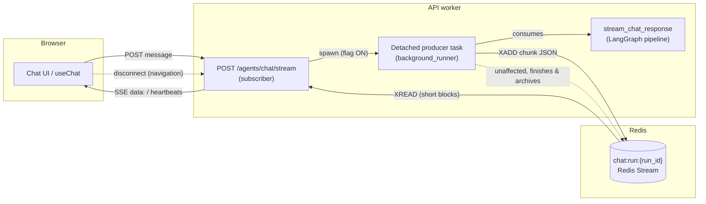

# Background Chat Runs — Detached Execution (ADR-117)

Chat generation decoupled from the HTTP connection: a detached producer
executes the run and publishes chunks to a per-run Redis Stream; the SSE
endpoint is a mere subscriber. Navigation, tab close, or a dropped mobile
connection no longer kill the generation — the turn (user message, assistant
response, token records) is always persisted.

**Feature flag**: `BACKGROUND_RUNS_ENABLED` (default `false`). Flag OFF, the
legacy inline SSE path runs unchanged — instant rollback without rebuild.

## Architecture

The producer, not the endpoint, owns the run: archiving, token tracking and
HITL bookkeeping all live inside the generator it consumes. The endpoint
only formats stream events as SSE lines. A client disconnect cancels the
subscriber generator; the producer keeps running to completion.

`stream_chat_response` keeps its three other consumers unchanged (legacy
SSE path flag OFF, scheduled actions executor, channels inbound handler).

## Broker protocol (transport-level, invisible to the SSE contract)

| Entry fields | Meaning |
|---|---|
| `{"d": <ChatStreamChunk JSON>}` | One chunk, relayed verbatim to SSE `data:` |
| `{"end": "1", "status": s}` | Terminal marker; `s ∈ completed \| error \| killed \| cancelled` |

- Stream key: `chat:run:{stream_id}` (`REDIS_KEY_RUN_STREAM_PREFIX`).
- **Two identifiers, deliberately distinct**: `stream_id` (transport — the
  stream key suffix, FRESH on every POST) vs `run_id` (billing/correlation —
  reused across HITL interrupt + resumption for token aggregation, passed
  down via the `run_id` kwarg of `stream_chat_response`). On a HITL
  resumption the interrupt phase already wrote a terminal marker on its own
  stream; reusing that stream would make a replay-from-0 subscriber stop at
  the stale marker and never see the resumption content (regression-guarded
  by `test_hitl_resumption_fresh_stream_avoids_stale_end_marker`).
- The stream ALWAYS terminates on every in-process exit path — the marker
  is written under `asyncio.shield` on abnormal producer death. The
  out-of-process death paths (hard kill) are covered by the subscriber-side
  orphan exit and the safety TTL (see *Hard-kill hardening* below).
- `XADD` uses `MAXLEN ~` (`BACKGROUND_RUNS_STREAM_MAXLEN`) and pipelines an
  `EXPIRE NX` in the same round-trip, so the key carries the safety TTL
  (`BACKGROUND_RUNS_STREAM_SAFETY_TTL_SECONDS`) from its first entry; the
  terminal marker overwrites it with the short post-terminal TTL
  (`BACKGROUND_RUNS_STREAM_TTL_SECONDS`).
- No new `ChatStreamChunk` type: the frontend SSE symmetry test is
  untouched.

## Run lifecycle

1. **Start** (flag ON): endpoint checks auth/usage-limits/pending-HITL as
   before, generates `run_id`, builds the chat generator, spawns the
   producer, subscribes.
2. **Archive-first**: inside the generator, the user message row is
   persisted BEFORE graph execution (metadata: `run_id`, attachments, STT
   costs, `hitl_response` on resumption). End-of-run HITL flags
   (`decision_type`, `hitl_interrupted`) are patched onto that row at
   finalization. An archive failure never blocks the run (best-effort,
   logged `archive_first_user_message_failed`).
3. **Streaming**: every chunk is XADDed; the subscriber relays them with
   the legacy pacing (`agent_stream_sleep_interval`) and emits `: heartbeat`
   on empty XREAD windows.
4. **End**:
   - `completed` — generator finished; assistant row archived by the
     service as before; e2e duration metric observed by the producer.
   - `error` — generator raised after emitting its own error/done chunks;
     marker written best-effort (if Redis itself died, subscribers error
     out on their own XREAD).
   - `killed` — producer task cancelled (shutdown drain timeout, loop
     teardown). Token records were already persisted by
     `TrackingContext.__aexit__` (which now commits on EVERY exit path —
     billing honesty); the accumulated partial assistant content is
     archived flagged `{"interrupted": true, "interrupt_reason": "killed"}`.

## Shutdown & worker recycling

Proven by POC (2026-07): without a drain, uvicorn worker recycling
(`--limit-max-requests`) kills in-flight producers (1/30 chunks survived);
with the lifespan drain, uvicorn waits (30/30). Wiring:

1. Lifespan shutdown FIRST drains chat producers
   (`BACKGROUND_RUNS_DRAIN_TIMEOUT_SECONDS`, 45 s), THEN generic
   fire-and-forget tasks (`SHUTDOWN_BACKGROUND_TASKS_TIMEOUT_SECONDS`,
   15 s) — before any infrastructure teardown (checkpointer, DB, Redis).
2. Compose `stop_grace_period: 90s` on the api service (dev + prod): the
   docker default 10 s would SIGKILL mid-drain.
3. Logs: `chat_producers_drain_started/finished`,
   `chat_producers_drain_incomplete` (pending > 0 → those runs end
   `killed`).

## Settings

| Env var | Default | Notes |
|---|---|---|
| `BACKGROUND_RUNS_ENABLED` | `false` | Master switch / instant rollback |
| `BACKGROUND_RUNS_STREAM_MAXLEN` | `10000` | ~122 KB per 1000 token chunks (measured) |
| `BACKGROUND_RUNS_STREAM_TTL_SECONDS` | `3600` | Post-terminal EXPIRE; bounds Redis memory; must cover the Lot 2 reattach window |
| `BACKGROUND_RUNS_STREAM_SAFETY_TTL_SECONDS` | `7200` | Mid-run EXPIRE NX armed at the first chunk (hard-kill leak bound); boot guard: ≥ `STREAM_TTL`; must exceed the longest run |
| `BACKGROUND_RUNS_ORPHAN_GRACE_SECONDS` | `20` | Subscriber orphan exit window (lock missing AND chunk-silent); boot guard: ≥ 2× `HEARTBEAT` |
| `BACKGROUND_RUNS_XREAD_BLOCK_MS` | `2000` | **Must stay well below `REDIS_SOCKET_TIMEOUT`×1000** — redis-py raises `TimeoutError` past it (POC-proven). Also the SSE keepalive cadence |
| `BACKGROUND_RUNS_DRAIN_TIMEOUT_SECONDS` | `45` | Drain + generic-task timeout must stay below `stop_grace_period` (90 s) with margin |
| `SHUTDOWN_BACKGROUND_TASKS_TIMEOUT_SECONDS` | `15` | Generic fire-and-forget drain (memory/interest extraction…) |

## Observability

- `chat_background_producers_active` (Gauge, per worker)
- `chat_background_runs_total{status="completed|error|killed"}` (Counter)
- Events: `chat_run_producer_started/completed/error/killed`,
  `run_stream_end_published`, `archive_first_user_message_failed`,
  `hitl_user_response_flag_patched`, `hitl_interrupted_flag_patched`.
- Redis inspection: `redis-cli --scan --pattern 'chat:run:*'`, `XLEN`,
  `XRANGE <key> - +`, `TTL`.

## Lot 2 — Live reattachment, concurrency lock, listener-gated voice

Delivered 2026-07-09 (same ADR). Everything below is flag-gated by the same
`BACKGROUND_RUNS_ENABLED`.

- **Active-run lock**: `chat:active_run:{conversation_id}` (SET NX EX
  `BACKGROUND_RUNS_ACTIVE_TTL_SECONDS`), value `{run_id, stream_id}`.
  Acquired by the POST endpoint BEFORE the SSE response starts (a second
  concurrent POST answers **HTTP 409** with the active run info); kept
  alive by a producer heartbeat (`BACKGROUND_RUNS_HEARTBEAT_SECONDS`,
  conditional-refresh Lua so a zombie can never touch a newer run's lock);
  released on every producer exit path. A killed producer frees the
  conversation in at most the lock TTL (POC-L2-1).
- **Reattach endpoints**: `GET /agents/runs/active` (is a run in flight?)
  and `GET /agents/runs/{stream_id}/stream` (full replay + live tail;
  ownership = the CURRENT active run of the caller's conversation, 404
  hide-existence otherwise — finished runs are reloaded via history).
- **Replay semantics**: the broker snapshots the stream tail at subscribe
  time; backlog entries are flagged `is_replay` → relayed without pacing,
  `voice_audio_chunk` payloads dropped server-side (stale audio), and the
  transport comment ``: replay-end`` marks the replay→live boundary
  (legacy SSE parsers ignore it; the chunk contract is untouched).
- **Frontend auto-resume** (product decision): at chat-page mount and on
  visibility return, `useChat.checkAndResumeActiveRun()` silently
  reattaches; the backlog replays through the normal handler pipeline with
  `SSEHandlerContext.isReplay = true` (reducer state rebuilds; toasts and
  voice playback suppressed until `: replay-end`). A 409 on send triggers
  the same resume (toast `chat.resume.in_progress`).
- **Listener-gated voice**: subscribers INCR/DECR
  `chat:listeners:{stream_id}` around their read AND re-arm the counter TTL
  every ~TTL/3 while attached (without the periodic touch, a subscriber
  attached longer than `BACKGROUND_RUNS_LISTENER_TTL_SECONDS` would silently
  drop out of the count and voice would be wrongly skipped mid-run —
  regression-guarded by `test_presence_ttl_survives_long_attachment`).
  Every voice-synthesis start point in the service consults the injected
  `has_listeners` probe — with nobody attached, TTS is skipped
  (`voice_skipped_no_listeners`); a listener attaching MID-run makes voice
  start for the remaining content. Fail-open on probe errors; paths without
  presence tracking (legacy, scheduled actions, channels) are unchanged.
  Boot-time guard: `BACKGROUND_RUNS_HEARTBEAT_SECONDS` must stay ≤
  `BACKGROUND_RUNS_ACTIVE_TTL_SECONDS / 2` (the app refuses to boot with a
  lock that would flap between heartbeats).

## Lot 3 — User cancellation (stop button)

Delivered 2026-07-09 (same ADR, same flag).

- **Signal path**: `POST /agents/runs/active/cancel` resolves the caller's
  own active run server-side (no stream id needed, ownership trivial) and
  sets `chat:cancel:{stream_id}` (TTL
  `BACKGROUND_RUNS_CANCEL_TTL_SECONDS`). A watcher task next to the
  producer polls it every `BACKGROUND_RUNS_CANCEL_POLL_SECONDS` (stop
  latency ≈ that period) and cancels the producer cooperatively — the
  signal may be set from ANY worker, the asyncio cancel stays local.
- **Terminal semantics**: status `cancelled` (distinct from `killed` in
  metrics and archive metadata); the producer synthesizes a standard
  `done` chunk with `metadata.cancelled` so subscribers close their normal
  SSE lifecycle and badge the partial bubble; the partial content is
  archived flagged `{interrupted, interrupt_reason: "cancelled"}`; already
  billed tokens stay billed (E2E-proven: 1348/748 tokens persisted for a
  cancelled run). **Cancellation is not a rollback** — tools that already
  ran have acted; it stops what remains.
- **Frontend**: the send button morphs into a stop button while streaming
  (`isGenerating` + `onStopGeneration` on ChatInput). Flag ON, the server
  cancels the detached run; with no detached run (flag OFF), the client
  falls back to the legacy local abort — pre-ADR-117 behavior. The
  `interrupted` badge renders on both live bubbles (synthesized done) and
  reloaded history rows (same metadata flag).
- **Checkpoint sanitation** (the POC-3 poisoning): a cancelled/killed run
  can leave an `AIMessage` with UNANSWERED `tool_calls` in the LangGraph
  checkpoint, which strict providers reject on the next turn.
  `sanitize_stale_dangling_tool_calls` repairs it AT TURN START in
  router_node (same-id replacement / RemoveMessage through the messages
  reducer) — never in the reducer itself, where dangling tool_calls are a
  legitimate mid-run state. HITL resumptions resume the interrupted node
  via `Command(resume)` and never re-enter the router: pending approvals
  are unaffected.

## Hard-kill hardening (2026-07 audit)

The end-marker invariant only covers **in-process** exits (the producer's
`except`/`finally` paths). A hard kill — `kill -9`, OOM-kill, power loss
(plausible on the RPi5) — runs no `finally`; and since prod Redis is
AOF-persisted, a leaked key even survives the reboot. Three guarantees
close that path:

1. **Stream safety TTL** — every chunk `XADD` pipelines an `EXPIRE NX`
   (same round-trip, zero extra latency): the key carries
   `BACKGROUND_RUNS_STREAM_SAFETY_TTL_SECONDS` from its first entry, and
   NX never overwrites an existing TTL, so the leak bound counts from
   stream *creation* (strictly tighter than a periodic re-arm, which would
   count from producer death). `publish_end` still overwrites it with the
   short post-terminal TTL. Self-repairing: if a pathological run outlives
   the safety TTL, the next XADD re-creates the key and NX re-arms it.
2. **Subscriber orphan exit** — the SSE relay (`stream_run_as_sse`)
   declares the run orphaned once the conversation's active-run lock has
   been observed missing (or owned by another stream) for a full
   `BACKGROUND_RUNS_ORPHAN_GRACE_SECONDS` AND no chunk arrived over the
   same window, then emits a synthetic `error` + `done` chunk pair (the
   exact sequence of the endpoint's exception fallback — standard types,
   contract untouched, `metadata.orphaned` for debuggability) and
   terminates. **The heartbeated lock is the liveness truth, not chunk
   silence**: a live-but-silent run (long LLM call) keeps its lock
   refreshed and is never killed; probe failures (transient Redis hiccups)
   are skipped, not treated as a missing lock. Worst-case exit latency
   after a crash ≈ `ACTIVE_TTL` + 2× grace (~70 s prod). Log
   `run_stream_orphan_exit`; metric
   `sse_streaming_errors_total{error_type="orphaned_run"}`.
3. **Atomic listener counter** — `listener_incr` runs INCR + EXPIRE as a
   single Lua eval (same style as the floor-guarded decrement): the crash
   window that could leave a TTL-less counter (→ `has_listeners()` true
   forever → paid TTS synthesized for nobody) no longer exists.

Accepted residual (documented, rare): if the lock expires while the
producer still lives (extreme CPU contention — already surfaced by
`active_run_lock_lost`) AND the run is chunk-silent beyond the grace, the
subscriber exits with the synthetic error while the run completes in the
background; archive-first puts the real response in history on reload.

## Known limits (by design)

- **First-ever message edge**: when no conversation exists yet at POST
  time, there is no lock (and no partial finalizer) for that first run —
  it is created during the run; subsequent messages are fully covered.
  The subscriber orphan exit is also disabled there (no lock to probe —
  its absence would be the normal state, not a death certificate).
- **409 optimistic bubble**: the rejected message's optimistic bubble stays
  visible until the next history reload reconciles it (rare multi-tab
  race; the input lock and auto-resume make it hard to hit).
- **A started TTS is not cut** when the last listener detaches mid-run —
  only the START of synthesis is gated.

## Rollback

Set `BACKGROUND_RUNS_ENABLED=false` and **recreate** the api service. The
legacy inline path is byte-identical to pre-ADR-117 behavior (it will be
removed in a follow-up release once the flag is proven in production).

⚠️ `docker restart` does NOT re-read compose `env_file` values — they are
baked into the container at creation. To toggle the flag, recreate the
container: `docker compose -f docker-compose.<env>.yml up -d api`
(verified during the 2026-07 E2E gate: a restart after editing `.env` left
the old value active).

Known dev-environment caveat (pre-existing, NOT caused by this feature):
the dev container runs uvicorn with `--reload`, whose reloader process
never executes the lifespan shutdown on SIGTERM — `application_shutdown`
has never been logged in dev and `docker stop` ends in SIGKILL after the
grace period. The shutdown drain is therefore only exercised on the prod
topology (exec-form uvicorn, no reload — where the de-risking POC proved
it: 30/30 chunks survive worker recycling with the drain vs 1/30 without).
