# Database Schema - LIA

> **Documentation technique complète du schéma de base de données PostgreSQL**
>
> **Version**: 1.6
> **Date**: 2026-03-03
> **Validated**: Structure vérifiée contre code actuel
>
> Architecture: PostgreSQL 15+ avec SQLAlchemy 2.0 ORM
> Migration: Alembic avec versioning temporel
> Compliance: GDPR, OWASP, Audit Trail immuable

---

## Table des Matières

1. [Vue d'Ensemble](#vue-densemble)
2. [Architecture Générale](#architecture-générale)
3. [Tables Core (7)](#tables-core)
4. [Tables Token Tracking (3)](#tables-token-tracking)
5. [Tables LLM Pricing (2)](#tables-llm-pricing)
6. [Tables Google API (2)](#tables-google-api-v61)
7. [Tables HITL (1)](#tables-hitl)
8. [Tables Personalities (2)](#tables-personalities)
9. [Tables Audit (2)](#tables-audit)
10. [Tables Interests (1)](#tables-interests)
11. [Tables MCP (1)](#tables-mcp)
12. [Indexes & Performance](#indexes--performance)
13. [Relations & Foreign Keys](#relations--foreign-keys)
14. [Migrations Alembic](#migrations-alembic)
15. [Best Practices](#best-practices)
16. [Troubleshooting](#troubleshooting)
17. [Ressources](#ressources)

---

## Vue d'Ensemble

### Statistiques Base de Données

| Métrique | Valeur |
|----------|--------|
| **PostgreSQL Version** | 15+ (recommandé 16) |
| **Total Tables** | 22 tables (+ 1 LangGraph checkpoints) |
| **Extensions** | pgvector (embeddings future), pg_trgm (full-text), unaccent |
| **ORM** | SQLAlchemy 2.0 (Mapped annotations) |
| **Migrations** | Alembic 29 migrations |
| **Total Indexes** | 58+ indexes (performance optimisée) |
| **Compliance** | GDPR (soft delete, audit), OWASP 2024 |

### Domaines DDD

Le schéma suit l'architecture Domain-Driven Design avec **13 domaines** (11 avec tables DB, 2 sans tables):

```
📁 domains/
├── auth/           → users (1 table)
├── connectors/     → connectors, connector_global_config (2 tables)
├── conversations/  → conversations, conversation_messages, conversation_audit_log (3 tables)
├── chat/           → token_usage_logs, message_token_summary, user_statistics (3 tables)
├── llm/            → llm_model_pricing, currency_exchange_rates (2 tables)
├── google_api/     → google_api_pricing, google_api_usage_logs (2 tables) [NEW v1.9]
├── agents/         → plan_approvals (1 table HITL Phase 8)
├── users/          → admin_audit_log (1 table)
├── personalities/  → personalities, personality_translations (2 tables)
├── user_mcp/       → user_mcp_servers (1 table MCP per-user) [NEW v6.2]
├── channels/       → user_channel_bindings (1 table multi-channel messaging) [NEW v6.2]
├── memories/       → (Langfuse semantic store, pas de table DB)
└── voice/          → (Google Cloud TTS, pas de table DB)
```

**Total**: 22 tables métier (incluant personalities, Google API, MCP, channels) + 1 table LangGraph (checkpoints)

---

## Architecture Générale

### Diagramme ER Simplifié

```mermaid
erDiagram
    %% Core Entities
    USERS ||--o{ CONNECTORS : "has many"
    USERS ||--o{ CONVERSATIONS : "has one active"
    USERS ||--o{ TOKEN_USAGE_LOGS : "generates"
    USERS ||--o{ ADMIN_AUDIT_LOG : "performs (admin)"
    USERS }o--|| PERSONALITIES : "has optional"
    USERS ||--o{ USER_MCP_SERVERS : "has many (per-user MCP)"
    USERS ||--o{ USER_CHANNEL_BINDINGS : "has many (Telegram, etc.)"

    %% Conversations
    CONVERSATIONS ||--o{ CONVERSATION_MESSAGES : "contains"
    CONVERSATIONS ||--o{ CONVERSATION_AUDIT_LOG : "tracked by"
    CONVERSATIONS ||--o{ MESSAGE_TOKEN_SUMMARY : "links to"
    CONVERSATIONS ||--o{ PLAN_APPROVALS : "requires (HITL)"

    %% Token Tracking
    MESSAGE_TOKEN_SUMMARY ||--o{ TOKEN_USAGE_LOGS : "aggregates (via run_id)"
    USERS ||--|| USER_STATISTICS : "has stats cache"

    %% Pricing
    LLM_MODEL_PRICING ||..o{ TOKEN_USAGE_LOGS : "prices"
    CURRENCY_EXCHANGE_RATES ||..o{ TOKEN_USAGE_LOGS : "converts"

    %% Connector Config
    CONNECTOR_GLOBAL_CONFIG ||..o{ CONNECTORS : "enables/disables"

    USERS {
        uuid id PK
        string email UK
        string hashed_password
        string timezone "Europe/Paris"
        string language "fr, en, es, de, it, zh-CN"
        uuid personality_id FK "SET NULL"
        text home_location_encrypted "Fernet"
        boolean memory_enabled "default true"
        boolean voice_enabled "default false"
        datetime last_login
        boolean is_active
        boolean is_verified
    }

    CONNECTORS {
        uuid id PK
        uuid user_id FK
        enum connector_type "google_*, openweathermap, etc."
        enum status "active, inactive, revoked, error"
        jsonb scopes
        text credentials_encrypted
        text preferences_encrypted "Fernet"
    }

    CONVERSATIONS {
        uuid id PK
        uuid user_id FK "unique (1:1)"
        string title
        int message_count
        bigint total_tokens
        datetime deleted_at "soft delete"
    }

    CONVERSATION_MESSAGES {
        uuid id PK
        uuid conversation_id FK
        string role "user, assistant, system"
        text content
        jsonb message_metadata
    }

    TOKEN_USAGE_LOGS {
        uuid id PK
        uuid user_id FK
        string run_id "LangGraph run"
        string node_name "router, planner, response"
        string model_name "gpt-4.1-mini"
        int prompt_tokens
        int completion_tokens
        int cached_tokens
        decimal cost_usd
        decimal cost_eur
    }

    MESSAGE_TOKEN_SUMMARY {
        uuid id PK
        uuid user_id FK
        string run_id UK "links to token_usage_logs"
        uuid conversation_id FK
        int total_prompt_tokens
        int total_completion_tokens
        int total_cached_tokens
        decimal total_cost_eur
    }

    USER_STATISTICS {
        uuid id PK
        uuid user_id UK
        bigint total_prompt_tokens "lifetime"
        bigint total_cost_eur "lifetime"
        datetime current_cycle_start
        bigint cycle_prompt_tokens "monthly"
        bigint cycle_cost_eur "monthly"
    }

    LLM_MODEL_PRICING {
        uuid id PK
        string model_name "gpt-4.1-mini, o1-mini"
        decimal input_price_per_1m_tokens
        decimal output_price_per_1m_tokens
        datetime effective_from
        boolean is_active
    }

    PLAN_APPROVALS {
        uuid id PK
        uuid plan_id "ExecutionPlan UUID"
        uuid user_id FK
        uuid conversation_id FK
        jsonb plan_summary
        array strategies_triggered
        string decision "APPROVE, REJECT, EDIT, REPLAN"
        float approval_latency_seconds
    }

    %% Google API Tracking (v6.1)
    USERS ||--o{ GOOGLE_API_USAGE_LOGS : "generates"
    GOOGLE_API_PRICING ||..o{ GOOGLE_API_USAGE_LOGS : "prices"
    MESSAGE_TOKEN_SUMMARY ||--o{ GOOGLE_API_USAGE_LOGS : "links via run_id"

    GOOGLE_API_PRICING {
        uuid id PK
        string api_name "places, routes, geocoding"
        string endpoint
        string sku_name
        decimal cost_per_1000_usd
        datetime effective_from
        boolean is_active
    }

    GOOGLE_API_USAGE_LOGS {
        uuid id PK
        uuid user_id FK
        string run_id "LangGraph run_id"
        string api_name
        string endpoint
        int request_count
        decimal cost_usd
        decimal cost_eur
        boolean cached
    }

    %% MCP Per-User (evolution F2.1)
    USER_MCP_SERVERS {
        uuid id PK
        uuid user_id FK
        string name "unique per user"
        string url "streamable_http only"
        text domain_description "LLM routing"
        string auth_type "none, api_key, bearer, oauth2"
        text credentials_encrypted "Fernet"
        jsonb oauth_metadata "RFC 8414/9728"
        string status "active, inactive, auth_required, error"
        boolean is_enabled
        smallint timeout_seconds "default 30"
        boolean hitl_required "NULL = inherit global"
        jsonb discovered_tools_cache
        jsonb tool_embeddings_cache "E5 384-dim"
        datetime last_connected_at
        text last_error
    }
```



### Principes de Design

1. **UUID Primary Keys**: Tous les IDs sont UUID v4 (128-bit, globally unique)
2. **Timestamps Automatiques**: `created_at`, `updated_at` via mixins SQLAlchemy
3. **Soft Delete**: `deleted_at IS NULL` pour conversations (GDPR Right to Erasure)
4. **Audit Trail Immuable**: `AdminAuditLog`, `ConversationAuditLog` sans `updated_at`
5. **JSONB Columns**: Métadonnées flexibles (scopes, metadata, plan_summary)
6. **Temporal Versioning**: LLM pricing avec `effective_from` + `is_active`
7. **Foreign Keys CASCADE**: Suppression en cascade (user → conversations → messages)

---

## Tables Core

### 1. users

**Table principale utilisateurs avec authentification et préférences.**

```sql
CREATE TABLE users (
    -- Primary Key
    id UUID PRIMARY KEY DEFAULT gen_random_uuid(),

    -- Authentication
    email VARCHAR(255) NOT NULL UNIQUE,
    hashed_password VARCHAR(255) NULL,  -- Nullable for OAuth-only users

    -- Profile
    full_name VARCHAR(255) NULL,
    picture_url VARCHAR(2048) NULL,  -- OAuth profile picture (extended to 2048 chars)

    -- Status Flags
    is_active BOOLEAN NOT NULL DEFAULT FALSE,      -- Requires email verification
    is_verified BOOLEAN NOT NULL DEFAULT FALSE,    -- Email verified
    is_superuser BOOLEAN NOT NULL DEFAULT FALSE,   -- Admin privileges

    -- OAuth Integration
    oauth_provider VARCHAR(50) NULL,       -- 'google', 'github', etc.
    oauth_provider_id VARCHAR(255) NULL,   -- Provider's user ID

    -- User Preferences (Phase 5.4 - Multilingual Support)
    timezone VARCHAR(50) NOT NULL DEFAULT 'Europe/Paris',  -- IANA timezone
    language VARCHAR(10) NOT NULL DEFAULT 'fr',            -- ISO 639-1 code

    -- Personality Preference (Phase 6 - Personalities)
    personality_id UUID NULL REFERENCES personalities(id) ON DELETE SET NULL,

    -- Location (Phase 7 - Places)
    home_location_encrypted TEXT NULL,  -- Fernet-encrypted {address, lat, lon, place_id}

    -- Feature Preferences (Phase 7+)
    memory_enabled BOOLEAN NOT NULL DEFAULT TRUE,   -- Long-term memory enabled
    voice_enabled BOOLEAN NOT NULL DEFAULT FALSE,   -- Voice/TTS enabled (opt-in)
    last_login TIMESTAMPTZ NULL,                    -- Last successful login

    -- Timestamps
    created_at TIMESTAMPTZ NOT NULL DEFAULT CURRENT_TIMESTAMP,
    updated_at TIMESTAMPTZ NOT NULL DEFAULT CURRENT_TIMESTAMP
);

-- Indexes
CREATE UNIQUE INDEX ix_users_email ON users(email);
CREATE INDEX ix_users_oauth_provider ON users(oauth_provider);
CREATE INDEX ix_users_personality_id ON users(personality_id);
```

**Modèle SQLAlchemy:**

```python
# apps/api/src/domains/auth/models.py
from sqlalchemy import DateTime, ForeignKey, String, Text
from sqlalchemy.dialects.postgresql import UUID
from sqlalchemy.orm import Mapped, mapped_column, relationship
from src.infrastructure.database.models import BaseModel

class User(BaseModel):
    """
    User model for authentication and profile.
    """
    __tablename__ = "users"

    email: Mapped[str] = mapped_column(
        String(255), unique=True, nullable=False, index=True
    )
    hashed_password: Mapped[str | None] = mapped_column(
        String(255), nullable=True
    )  # Nullable for OAuth-only users

    full_name: Mapped[str | None] = mapped_column(String(255), nullable=True)
    is_active: Mapped[bool] = mapped_column(default=False, nullable=False)
    is_verified: Mapped[bool] = mapped_column(default=False, nullable=False)
    is_superuser: Mapped[bool] = mapped_column(default=False, nullable=False)

    # OAuth fields
    oauth_provider: Mapped[str | None] = mapped_column(String(50), nullable=True)
    oauth_provider_id: Mapped[str | None] = mapped_column(String(255), nullable=True)
    picture_url: Mapped[str | None] = mapped_column(String(2048), nullable=True)

    # User preferences (Phase 5.4)
    timezone: Mapped[str] = mapped_column(
        String(50), nullable=False, server_default="Europe/Paris",
    )
    language: Mapped[str] = mapped_column(
        String(10), nullable=False, server_default="fr",
    )

    # Personality preference (Phase 6)
    personality_id: Mapped[uuid.UUID | None] = mapped_column(
        UUID(as_uuid=True),
        ForeignKey("personalities.id", ondelete="SET NULL"),
        nullable=True,
    )

    # Location (Phase 7 - Places)
    home_location_encrypted: Mapped[str | None] = mapped_column(
        Text, nullable=True,
        comment="Fernet-encrypted home location JSON: {address, lat, lon, place_id}",
    )

    # Feature preferences (Phase 7+)
    memory_enabled: Mapped[bool] = mapped_column(
        default=True, nullable=False, server_default="true",
    )
    voice_enabled: Mapped[bool] = mapped_column(
        default=False, nullable=False, server_default="false",
    )
    last_login: Mapped[datetime | None] = mapped_column(
        DateTime(timezone=True), nullable=True, default=None,
    )

    # Relationships
    personality: Mapped["Personality | None"] = relationship(back_populates="users")
    connectors: Mapped[list["Connector"]] = relationship(
        back_populates="user", cascade="all, delete-orphan"
    )
    conversations: Mapped[list["Conversation"]] = relationship(
        back_populates="user", cascade="all, delete-orphan"
    )
```

**Champs Importants:**

- **email**: Unique constraint pour authentification (index B-Tree)
- **hashed_password**: Bcrypt hash (rounds=12, OWASP 2024)
- **timezone**: IANA timezone (e.g., `Europe/Paris`, `America/New_York`)
- **language**: ISO 639-1 code pour i18n (fr, en, es, de, it, zh-CN)
- **picture_url**: Extended to 2048 chars (OAuth URLs avec paramètres longs)
- **personality_id**: FK vers `personalities` (SET NULL on delete)
- **home_location_encrypted**: Localisation Fernet-encrypted (GDPR compliance)
- **memory_enabled**: Préférence mémoire long-terme (default: true)
- **voice_enabled**: Préférence TTS/voice (default: false, opt-in)
- **last_login**: Timestamp dernière connexion (audit/analytics)

**Migration Clé:**

- **2025_10_19_1337**: Extension `picture_url` 500 → 2048 chars
- **2025_10_26_0000**: Ajout `timezone` (default: `Europe/Paris`)
- **2025_11_07_0000**: Ajout `language` (default: `fr`)
- **2025_12_03_0000**: Ajout `personality_id` FK
- **2025_12_12_0000**: Ajout `home_location_encrypted`
- **2025_12_21_0000**: Ajout `memory_enabled` + embedding pricing
- **2025_12_24_0001**: Ajout `voice_enabled`
- **2025_12_27_0001**: Ajout `last_login`

---

### 2. connectors

**Connexions utilisateur aux services externes (OAuth).**

```sql
CREATE TABLE connectors (
    -- Primary Key
    id UUID PRIMARY KEY DEFAULT gen_random_uuid(),

    -- Foreign Keys
    user_id UUID NOT NULL REFERENCES users(id) ON DELETE CASCADE,

    -- Connector Configuration
    connector_type VARCHAR(50) NOT NULL,  -- ENUM: google_gmail, google_contacts, etc.
    status VARCHAR(20) NOT NULL DEFAULT 'active',  -- ENUM: active, inactive, revoked, error

    -- OAuth/API Credentials (encrypted with Fernet)
    scopes JSONB NOT NULL DEFAULT '[]',          -- OAuth scopes granted
    credentials_encrypted TEXT NOT NULL,          -- Encrypted access_token, refresh_token

    -- Metadata
    metadata JSONB NULL,  -- Connector-specific metadata

    -- User Preferences (encrypted)
    preferences_encrypted TEXT NULL,  -- Fernet-encrypted user preferences (calendar names, etc.)

    -- Timestamps
    created_at TIMESTAMPTZ NOT NULL DEFAULT CURRENT_TIMESTAMP,
    updated_at TIMESTAMPTZ NOT NULL DEFAULT CURRENT_TIMESTAMP
);

-- Indexes
CREATE INDEX ix_connectors_user_id ON connectors(user_id);
CREATE INDEX ix_connectors_connector_type ON connectors(connector_type);
CREATE INDEX ix_connectors_status ON connectors(status);
```

**Modèle SQLAlchemy:**

```python
# apps/api/src/domains/connectors/models.py
import enum
from sqlalchemy import Enum, ForeignKey, Text
from sqlalchemy.dialects.postgresql import JSONB
from sqlalchemy.orm import Mapped, mapped_column, relationship

class ConnectorType(str, enum.Enum):
    """Connector type enum."""
    # Google services (OAuth)
    GOOGLE_GMAIL = "google_gmail"
    GOOGLE_CALENDAR = "google_calendar"
    GOOGLE_DRIVE = "google_drive"
    GOOGLE_CONTACTS = "google_contacts"
    GOOGLE_TASKS = "google_tasks"
    GOOGLE_PLACES = "google_places"

    # External API services (API Key)
    OPENWEATHERMAP = "openweathermap"
    WIKIPEDIA = "wikipedia"
    PERPLEXITY = "perplexity"

    # Legacy (deprecated)
    GMAIL = "gmail"

    # Future connectors
    SLACK = "slack"
    NOTION = "notion"
    GITHUB = "github"

class ConnectorStatus(str, enum.Enum):
    """Connector status enum."""
    ACTIVE = "active"
    INACTIVE = "inactive"
    REVOKED = "revoked"
    ERROR = "error"

class Connector(BaseModel):
    __tablename__ = "connectors"

    user_id: Mapped[uuid.UUID] = mapped_column(
        ForeignKey("users.id", ondelete="CASCADE"),
        nullable=False,
        index=True,
    )
    connector_type: Mapped[ConnectorType] = mapped_column(
        Enum(ConnectorType, native_enum=False),
        nullable=False,
        index=True,
    )
    status: Mapped[ConnectorStatus] = mapped_column(
        Enum(ConnectorStatus, native_enum=False),
        nullable=False,
        default=ConnectorStatus.ACTIVE,
    )
    scopes: Mapped[list[str]] = mapped_column(JSONB, nullable=False, default=list)
    credentials_encrypted: Mapped[str] = mapped_column(Text, nullable=False)
    connector_metadata: Mapped[dict[str, Any] | None] = mapped_column(
        "metadata", JSONB, nullable=True, default=dict
    )
    preferences_encrypted: Mapped[str | None] = mapped_column(
        Text, nullable=True, default=None
    )  # Encrypted user preferences (calendar names, task lists, etc.)

    # Relationships
    user: Mapped["User"] = relationship(back_populates="connectors")
```

**Sécurité:**

- **credentials_encrypted**: Fernet encryption (AES-128-CBC + HMAC-SHA256)
- **preferences_encrypted**: Fernet encryption pour préférences utilisateur
- **scopes**: OAuth scopes array (e.g., `["https://www.googleapis.com/auth/contacts.readonly"]`)
- **Status enum**: Track connector health (active, revoked, error)

**ConnectorType Categories:**

| Category | Types | Auth |
|----------|-------|------|
| **Google OAuth** | google_gmail, google_calendar, google_drive, google_contacts, google_tasks, google_places | OAuth 2.0 |
| **API Key** | openweathermap, wikipedia, perplexity | API Key |
| **Legacy** | gmail (deprecated → use google_gmail) | OAuth |
| **Future** | slack, notion, github | TBD |

---

### 3. conversations

**Conteneur conversation pour checkpoints LangGraph (1:1 avec user).**

```sql
CREATE TABLE conversations (
    -- Primary Key
    id UUID PRIMARY KEY DEFAULT gen_random_uuid(),

    -- Foreign Keys
    user_id UUID NOT NULL UNIQUE REFERENCES users(id) ON DELETE CASCADE,

    -- Metadata
    title VARCHAR(500) NULL,
    message_count INTEGER NOT NULL DEFAULT 0,
    total_tokens BIGINT NOT NULL DEFAULT 0,

    -- Soft Delete (GDPR Right to Erasure)
    deleted_at TIMESTAMPTZ NULL,

    -- Timestamps
    created_at TIMESTAMPTZ NOT NULL DEFAULT CURRENT_TIMESTAMP,
    updated_at TIMESTAMPTZ NOT NULL DEFAULT CURRENT_TIMESTAMP
);

-- Indexes
CREATE UNIQUE INDEX ix_conversations_user_id ON conversations(user_id);
CREATE INDEX ix_conversations_deleted_at ON conversations(deleted_at);
CREATE INDEX ix_conversations_user_created ON conversations(user_id, created_at);
```

**Modèle SQLAlchemy:**

```python
# apps/api/src/domains/conversations/models.py
class Conversation(BaseModel):
    """
    User conversation container for LangGraph checkpoints.

    One conversation per user (1:1 mapping via unique user_id).
    Stores conversation metadata and links to checkpoints via thread_id.

    Notes:
        - LangGraph checkpoints stored separately in checkpoints table
        - thread_id in LangGraph = conversation.id for checkpoint retrieval
        - Soft delete pattern: deleted_at IS NULL = active conversation
    """
    __tablename__ = "conversations"

    user_id: Mapped[UUID] = mapped_column(
        ForeignKey("users.id", ondelete="CASCADE"),
        unique=True,
        nullable=False,
        index=True,
    )
    title: Mapped[str | None] = mapped_column(String(500), nullable=True)
    message_count: Mapped[int] = mapped_column(Integer, default=0, nullable=False)
    total_tokens: Mapped[int] = mapped_column(BigInteger, default=0, nullable=False)
    deleted_at: Mapped[datetime | None] = mapped_column(
        DateTime(timezone=True), nullable=True, index=True
    )

    # Relationships
    user: Mapped["User"] = relationship(back_populates="conversations")
    messages: Mapped[list["ConversationMessage"]] = relationship(
        back_populates="conversation",
        cascade="all, delete-orphan",
        order_by="ConversationMessage.created_at.desc()",
    )
```

**Design Pattern:**

- **1:1 Mapping**: `user_id` unique constraint (un seul conversation active par user)
- **Soft Delete**: `deleted_at IS NULL` pour conversation active (GDPR compliance)
- **thread_id LangGraph**: `conversation.id` utilisé comme thread_id pour checkpoints

**Migration Clé:**

- **2025_10_24_1949**: Ajout table conversations (Phase 5 persistence)

---

### 4. conversation_messages

**Archive messages pour affichage UI rapide (séparé des checkpoints LangGraph).**

```sql
CREATE TABLE conversation_messages (
    -- Primary Key
    id UUID PRIMARY KEY DEFAULT gen_random_uuid(),

    -- Foreign Keys
    conversation_id UUID NOT NULL REFERENCES conversations(id) ON DELETE CASCADE,

    -- Message Data
    role VARCHAR(20) NOT NULL,  -- 'user', 'assistant', 'system'
    content TEXT NOT NULL,
    message_metadata JSONB NULL,  -- run_id, intention, etc.

    -- Timestamps
    created_at TIMESTAMPTZ NOT NULL DEFAULT CURRENT_TIMESTAMP,
    updated_at TIMESTAMPTZ NOT NULL DEFAULT CURRENT_TIMESTAMP
);

-- Indexes (optimized for pagination DESC)
CREATE INDEX ix_conversation_messages_conversation_id ON conversation_messages(conversation_id);
CREATE INDEX ix_conversation_messages_conv_created
    ON conversation_messages(conversation_id, created_at DESC);
```

**Modèle SQLAlchemy:**

```python
class ConversationMessage(BaseModel):
    """
    Message archival for fast UI display.

    Stores individual messages (user/assistant/system) for quick retrieval
    without deserializing LangGraph checkpoints.

    Notes:
        - Separate from LangGraph state for performance
        - Indexed by (conversation_id, created_at DESC) for pagination
        - Cascade delete: deleted when conversation is deleted
    """
    __tablename__ = "conversation_messages"

    conversation_id: Mapped[UUID] = mapped_column(
        ForeignKey("conversations.id", ondelete="CASCADE"),
        nullable=False,
        index=True,
    )
    role: Mapped[str] = mapped_column(String(20), nullable=False)
    content: Mapped[str] = mapped_column(Text, nullable=False)
    message_metadata: Mapped[dict[str, Any] | None] = mapped_column(JSONB, nullable=True)

    # Relationship
    conversation: Mapped["Conversation"] = relationship(back_populates="messages")

    __table_args__ = (
        Index(
            "ix_conversation_messages_conv_created",
            "conversation_id",
            "created_at",
            postgresql_ops={"created_at": "DESC"},
        ),
    )
```

**Performance:**

- **Composite Index**: `(conversation_id, created_at DESC)` pour pagination rapide
- **Separation of Concerns**: Messages UI séparés des checkpoints LangGraph (évite désérialisation)

---

### 5. connector_global_config

**Configuration globale pour activer/désactiver types de connecteurs (admin).**

```sql
CREATE TABLE connector_global_config (
    -- Primary Key
    id UUID PRIMARY KEY DEFAULT gen_random_uuid(),

    -- Configuration
    connector_type VARCHAR(50) NOT NULL UNIQUE,  -- ENUM: gmail, google_contacts, etc.
    is_enabled BOOLEAN NOT NULL DEFAULT TRUE,
    disabled_reason TEXT NULL,

    -- Timestamps
    created_at TIMESTAMPTZ NOT NULL DEFAULT CURRENT_TIMESTAMP,
    updated_at TIMESTAMPTZ NOT NULL DEFAULT CURRENT_TIMESTAMP
);

-- Indexes
CREATE UNIQUE INDEX ix_connector_global_config_type ON connector_global_config(connector_type);
```

**Modèle SQLAlchemy:**

```python
class ConnectorGlobalConfig(BaseModel):
    """
    Global configuration for connector types.
    Allows admins to enable/disable connector types for the entire application.
    """
    __tablename__ = "connector_global_config"

    connector_type: Mapped[ConnectorType] = mapped_column(
        Enum(ConnectorType, native_enum=False),
        unique=True,
        nullable=False,
        index=True,
    )
    is_enabled: Mapped[bool] = mapped_column(
        nullable=False,
        default=True,
        server_default="true",
    )
    disabled_reason: Mapped[str | None] = mapped_column(Text, nullable=True)
```

**Cas d'Usage:**

- Désactiver temporairement un connector (maintenance, quota API dépassé)
- Rollout progressif de nouveaux connectors
- Circuit breaker pour problèmes OAuth provider

**Migration Clé:**

- **2025_10_19_1920**: Ajout table connector_global_config (admin control)

---

## Tables Token Tracking

### 6. token_usage_logs

**Audit trail immuable pour token usage per LLM node call.**

```sql
CREATE TABLE token_usage_logs (
    -- Primary Key
    id UUID PRIMARY KEY DEFAULT gen_random_uuid(),

    -- Traceability
    user_id UUID NOT NULL,
    run_id VARCHAR(255) NOT NULL,  -- LangGraph run ID
    node_name VARCHAR(100) NOT NULL,  -- router, planner, response, contacts_agent
    model_name VARCHAR(100) NOT NULL,  -- gpt-4.1-mini, gpt-4-turbo, o1-mini

    -- Token Counts
    prompt_tokens INTEGER NOT NULL DEFAULT 0,
    completion_tokens INTEGER NOT NULL DEFAULT 0,
    cached_tokens INTEGER NOT NULL DEFAULT 0,  -- Prompt caching

    -- Cost Tracking (6 decimals for precision)
    cost_usd NUMERIC(10, 6) NOT NULL DEFAULT 0.0,
    cost_eur NUMERIC(10, 6) NOT NULL DEFAULT 0.0,
    usd_to_eur_rate NUMERIC(10, 6) NOT NULL DEFAULT 1.0,

    -- Timestamps
    created_at TIMESTAMPTZ NOT NULL DEFAULT CURRENT_TIMESTAMP,
    updated_at TIMESTAMPTZ NOT NULL DEFAULT CURRENT_TIMESTAMP
);

-- Indexes
CREATE INDEX ix_token_usage_logs_user_id ON token_usage_logs(user_id);
CREATE INDEX ix_token_usage_logs_run_id ON token_usage_logs(run_id);
CREATE INDEX ix_token_usage_logs_node_name ON token_usage_logs(node_name);
CREATE INDEX ix_token_usage_logs_user_created ON token_usage_logs(user_id, created_at);
```

**Modèle SQLAlchemy:**

```python
# apps/api/src/domains/chat/models.py
class TokenUsageLog(BaseModel):
    """
    Audit trail for token usage per LLM node call.

    Immutable logs for detailed tracking and billing verification.
    One record per LLM call (node execution).
    """
    __tablename__ = "token_usage_logs"

    user_id: Mapped[UUID] = mapped_column(index=True)
    run_id: Mapped[str] = mapped_column(String(255), index=True, nullable=False)
    node_name: Mapped[str] = mapped_column(String(100))
    model_name: Mapped[str] = mapped_column(String(100))

    # Token counts
    prompt_tokens: Mapped[int] = mapped_column(Integer, default=0)
    completion_tokens: Mapped[int] = mapped_column(Integer, default=0)
    cached_tokens: Mapped[int] = mapped_column(Integer, default=0)

    # Cost tracking (6 decimals)
    cost_usd: Mapped[Decimal] = mapped_column(Numeric(10, 6), default=Decimal("0.0"))
    cost_eur: Mapped[Decimal] = mapped_column(Numeric(10, 6), default=Decimal("0.0"))
    usd_to_eur_rate: Mapped[Decimal] = mapped_column(Numeric(10, 6), default=Decimal("1.0"))

    __table_args__ = (
        Index("ix_token_usage_logs_user_created", "user_id", "created_at"),
        Index("ix_token_usage_logs_node_name", "node_name"),
    )
```

**Champs Importants:**

- **run_id**: LangGraph run UUID (lien vers `message_token_summary`)
- **node_name**: Traçabilité par node (router, planner, response, contacts_agent)
- **cached_tokens**: OpenAI prompt caching (coût réduit 90%)
- **cost_usd/cost_eur**: Coût calculé au moment de l'appel (immuable, audit)
- **usd_to_eur_rate**: Exchange rate utilisé (pour vérification audit)

**Indexes Performance:**

- `(user_id, created_at)`: Analytics lifetime user
- `run_id`: Jointure avec `message_token_summary`
- `node_name`: Analytics par node type

**Migration Clé:**

- **2025_10_23_2308**: Création table `token_usage_logs`
- **2025_10_23_2320**: Increase cost precision to 6 decimals (0.000001 precision)
- **2025_10_25_0032**: Ajout `run_id` column (traceability)

---

### 7. message_token_summary

**Résumé tokens par message utilisateur (agrégation de tous les nodes).**

```sql
CREATE TABLE message_token_summary (
    -- Primary Key
    id UUID PRIMARY KEY DEFAULT gen_random_uuid(),

    -- Traceability
    user_id UUID NOT NULL,
    session_id VARCHAR(255) NOT NULL,
    run_id VARCHAR(255) NOT NULL UNIQUE,  -- Links to token_usage_logs
    conversation_id UUID NULL REFERENCES conversations(id) ON DELETE SET NULL,

    -- Aggregated Token Counts
    total_prompt_tokens INTEGER NOT NULL DEFAULT 0,
    total_completion_tokens INTEGER NOT NULL DEFAULT 0,
    total_cached_tokens INTEGER NOT NULL DEFAULT 0,

    -- Total Cost
    total_cost_eur NUMERIC(10, 6) NOT NULL DEFAULT 0.0,

    -- Timestamps
    created_at TIMESTAMPTZ NOT NULL DEFAULT CURRENT_TIMESTAMP,
    updated_at TIMESTAMPTZ NOT NULL DEFAULT CURRENT_TIMESTAMP
);

-- Indexes
CREATE UNIQUE INDEX ix_message_token_summary_run_id ON message_token_summary(run_id);
CREATE INDEX ix_message_token_summary_user_id ON message_token_summary(user_id);
CREATE INDEX ix_message_token_summary_session_id ON message_token_summary(session_id);
CREATE INDEX ix_message_token_summary_conversation_id ON message_token_summary(conversation_id);
CREATE INDEX ix_message_token_summary_user_created ON message_token_summary(user_id, created_at);
```

**Modèle SQLAlchemy:**

```python
class MessageTokenSummary(BaseModel):
    """
    Aggregated token usage per user message (SSE request).

    One record per chat message, aggregating all LLM nodes called.
    Links to user, session, conversation, and LangGraph run_id for traceability.

    For detailed per-node/per-model breakdown, JOIN with token_usage_logs via run_id.
    """
    __tablename__ = "message_token_summary"

    user_id: Mapped[UUID] = mapped_column(index=True)
    session_id: Mapped[str] = mapped_column(String(255), index=True)
    run_id: Mapped[str] = mapped_column(String(255), unique=True, index=True)
    conversation_id: Mapped[UUID | None] = mapped_column(
        ForeignKey("conversations.id", ondelete="SET NULL"),
        nullable=True,
        index=True,
    )

    # Aggregated token counts
    total_prompt_tokens: Mapped[int] = mapped_column(Integer, default=0)
    total_completion_tokens: Mapped[int] = mapped_column(Integer, default=0)
    total_cached_tokens: Mapped[int] = mapped_column(Integer, default=0)

    # Total cost
    total_cost_eur: Mapped[Decimal] = mapped_column(Numeric(10, 6), default=Decimal("0.0"))

    __table_args__ = (
        Index("ix_message_token_summary_user_created", "user_id", "created_at"),
    )
```

**Design Pattern:**

- **run_id UNIQUE**: Un seul summary par message (clé naturelle)
- **Aggregation**: SUM de tous les `token_usage_logs` avec même `run_id`
- **Drill-Down**: Jointure avec `token_usage_logs` pour breakdown par node/model

**Query Exemple:**

```sql
-- Get message summary with per-node breakdown
SELECT
    mts.run_id,
    mts.total_cost_eur,
    tul.node_name,
    tul.model_name,
    tul.prompt_tokens,
    tul.cost_eur
FROM message_token_summary mts
JOIN token_usage_logs tul ON tul.run_id = mts.run_id
WHERE mts.user_id = :user_id
ORDER BY mts.created_at DESC, tul.created_at;
```

---

### 8. user_statistics

**Cache pré-calculé pour statistiques utilisateur (évite SUM() sur millions de lignes).**

```sql
CREATE TABLE user_statistics (
    -- Primary Key
    id UUID PRIMARY KEY DEFAULT gen_random_uuid(),

    -- User Reference (unique)
    user_id UUID NOT NULL UNIQUE,

    -- Lifetime Totals
    total_prompt_tokens BIGINT NOT NULL DEFAULT 0,
    total_completion_tokens BIGINT NOT NULL DEFAULT 0,
    total_cached_tokens BIGINT NOT NULL DEFAULT 0,
    total_cost_eur NUMERIC(12, 6) NOT NULL DEFAULT 0.0,
    total_messages BIGINT NOT NULL DEFAULT 0,

    -- Current Billing Cycle (monthly from signup date)
    current_cycle_start TIMESTAMPTZ NOT NULL DEFAULT CURRENT_TIMESTAMP,
    cycle_prompt_tokens BIGINT NOT NULL DEFAULT 0,
    cycle_completion_tokens BIGINT NOT NULL DEFAULT 0,
    cycle_cached_tokens BIGINT NOT NULL DEFAULT 0,
    cycle_cost_eur NUMERIC(12, 6) NOT NULL DEFAULT 0.0,
    cycle_messages BIGINT NOT NULL DEFAULT 0,

    -- Timestamps
    last_updated_at TIMESTAMPTZ NOT NULL DEFAULT CURRENT_TIMESTAMP,
    created_at TIMESTAMPTZ NOT NULL DEFAULT CURRENT_TIMESTAMP,
    updated_at TIMESTAMPTZ NOT NULL DEFAULT CURRENT_TIMESTAMP
);

-- Indexes
CREATE UNIQUE INDEX ix_user_statistics_user_id ON user_statistics(user_id);
```

**Modèle SQLAlchemy:**

```python
class UserStatistics(BaseModel):
    """
    Pre-calculated user statistics cache for dashboard.

    Avoids expensive SUM() queries on millions of rows.
    Updated incrementally after each message.
    """
    __tablename__ = "user_statistics"

    user_id: Mapped[UUID] = mapped_column(unique=True, index=True)

    # Lifetime totals
    total_prompt_tokens: Mapped[int] = mapped_column(BigInteger, default=0)
    total_completion_tokens: Mapped[int] = mapped_column(BigInteger, default=0)
    total_cached_tokens: Mapped[int] = mapped_column(BigInteger, default=0)
    total_cost_eur: Mapped[Decimal] = mapped_column(Numeric(12, 6), default=Decimal("0.0"))
    total_messages: Mapped[int] = mapped_column(BigInteger, default=0)

    # Current billing cycle
    current_cycle_start: Mapped[datetime] = mapped_column(
        DateTime(timezone=True),
        default=lambda: datetime.now(UTC),
        nullable=False,
    )
    cycle_prompt_tokens: Mapped[int] = mapped_column(BigInteger, default=0)
    cycle_completion_tokens: Mapped[int] = mapped_column(BigInteger, default=0)
    cycle_cached_tokens: Mapped[int] = mapped_column(BigInteger, default=0)
    cycle_cost_eur: Mapped[Decimal] = mapped_column(Numeric(12, 6), default=Decimal("0.0"))
    cycle_messages: Mapped[int] = mapped_column(BigInteger, default=0)

    last_updated_at: Mapped[datetime] = mapped_column(
        DateTime(timezone=True),
        default=lambda: datetime.now(UTC),
        onupdate=lambda: datetime.now(UTC),
        nullable=False,
    )
```

**Performance Pattern:**

- **Incremental Update**: `UPDATE user_statistics SET total_cost_eur = total_cost_eur + :new_cost`
- **Évite Full Scan**: Pas de `SUM(cost_eur) FROM token_usage_logs WHERE user_id = :id`
- **Billing Cycle**: Reset automatique chaque mois (scheduler)

**Update Example:**

```python
# Incremental update after message
await session.execute(
    update(UserStatistics)
    .where(UserStatistics.user_id == user_id)
    .values(
        total_cost_eur=UserStatistics.total_cost_eur + new_cost,
        cycle_cost_eur=UserStatistics.cycle_cost_eur + new_cost,
        total_messages=UserStatistics.total_messages + 1,
        cycle_messages=UserStatistics.cycle_messages + 1,
    )
)
```

---

## Tables LLM Pricing

### 9. llm_model_pricing

**Pricing LLM avec temporal versioning (effective_from + is_active).**

```sql
CREATE TABLE llm_model_pricing (
    -- Primary Key
    id UUID PRIMARY KEY DEFAULT gen_random_uuid(),

    -- Model Configuration
    model_name VARCHAR(100) NOT NULL,  -- 'gpt-4.1-mini', 'o1-mini', 'gpt-4-turbo'

    -- Pricing (USD per 1 million tokens, 6 decimals precision)
    input_price_per_1m_tokens NUMERIC(10, 6) NOT NULL,
    cached_input_price_per_1m_tokens NUMERIC(10, 6) NULL,  -- NULL if not supported
    output_price_per_1m_tokens NUMERIC(10, 6) NOT NULL,

    -- Temporal Versioning
    effective_from TIMESTAMPTZ NOT NULL DEFAULT CURRENT_TIMESTAMP,
    is_active BOOLEAN NOT NULL DEFAULT TRUE,

    -- Timestamps
    created_at TIMESTAMPTZ NOT NULL DEFAULT CURRENT_TIMESTAMP,
    updated_at TIMESTAMPTZ NOT NULL DEFAULT CURRENT_TIMESTAMP,

    -- Constraints
    CONSTRAINT uq_model_effective_from UNIQUE (model_name, effective_from)
);

-- Indexes
CREATE INDEX ix_llm_model_pricing_model_name ON llm_model_pricing(model_name);
CREATE INDEX ix_llm_model_pricing_is_active ON llm_model_pricing(is_active);
CREATE INDEX ix_llm_model_pricing_active_lookup ON llm_model_pricing(model_name, is_active);
```

**Modèle SQLAlchemy:**

```python
# apps/api/src/domains/llm/models.py
class LLMModelPricing(Base, TimestampMixin):
    """
    LLM model pricing configuration with temporal versioning.

    Stores pricing per million tokens for input, cached input, and output.
    Supports versioning through effective_from and is_active flags.

    Example:
        gpt-4.1-mini:
            input_price_per_1m_tokens = 2.50 ($/1M tokens)
            cached_input_price_per_1m_tokens = 1.25 ($/1M tokens)
            output_price_per_1m_tokens = 10.00 ($/1M tokens)
    """
    __tablename__ = "llm_model_pricing"

    id: Mapped[uuid.UUID] = mapped_column(
        UUID(as_uuid=True),
        primary_key=True,
        default=uuid.uuid4,
        nullable=False,
    )

    model_name: Mapped[str] = mapped_column(
        String(100),
        nullable=False,
        index=True,
        comment="LLM model identifier (e.g., 'gpt-4.1-mini', 'o1-mini')",
    )

    input_price_per_1m_tokens: Mapped[Decimal] = mapped_column(
        DECIMAL(10, 6),
        nullable=False,
        comment="Price in USD per 1 million input tokens",
    )

    cached_input_price_per_1m_tokens: Mapped[Decimal | None] = mapped_column(
        DECIMAL(10, 6),
        nullable=True,
        comment="Price in USD per 1M cached input tokens (NULL if not supported)",
    )

    output_price_per_1m_tokens: Mapped[Decimal] = mapped_column(
        DECIMAL(10, 6),
        nullable=False,
        comment="Price in USD per 1 million output tokens",
    )

    effective_from: Mapped[datetime] = mapped_column(
        DateTime(timezone=True),
        nullable=False,
        default=lambda: datetime.now(UTC),
        comment="Date from which this pricing is effective",
    )

    is_active: Mapped[bool] = mapped_column(
        Boolean,
        nullable=False,
        default=True,
        index=True,
        comment="Whether this pricing entry is currently active",
    )

    __table_args__ = (
        UniqueConstraint(
            "model_name",
            "effective_from",
            name="uq_model_effective_from",
        ),
        Index(
            "ix_llm_model_pricing_active_lookup",
            "model_name",
            "is_active",
        ),
    )
```

**Temporal Versioning Pattern:**

```sql
-- Get current active pricing for gpt-4.1-mini
SELECT * FROM llm_model_pricing
WHERE model_name = 'gpt-4.1-mini'
  AND is_active = TRUE
  AND effective_from <= CURRENT_TIMESTAMP
ORDER BY effective_from DESC
LIMIT 1;

-- Historical pricing at specific date
SELECT * FROM llm_model_pricing
WHERE model_name = 'gpt-4.1-mini'
  AND effective_from <= '2025-10-01'
ORDER BY effective_from DESC
LIMIT 1;
```

**Migration Clé:**

- **2025_10_20_1808**: Création table `llm_model_pricing`
- **2025_11_04_0001**: Multi-provider support (ajout models Anthropic, etc.)
- **2025_11_05_1500**: Seed OpenAI pricing (gpt-4.1-mini, gpt-4-turbo, o1-mini, etc.)

---

### 10. currency_exchange_rates

**Taux de change pour conversion USD → EUR (avec temporal versioning).**

```sql
CREATE TABLE currency_exchange_rates (
    -- Primary Key
    id UUID PRIMARY KEY DEFAULT gen_random_uuid(),

    -- Currency Pair
    from_currency VARCHAR(3) NOT NULL,  -- ISO 4217 (e.g., 'USD')
    to_currency VARCHAR(3) NOT NULL,    -- ISO 4217 (e.g., 'EUR')

    -- Exchange Rate (6 decimals precision)
    rate NUMERIC(10, 6) NOT NULL,  -- 1 from_currency = rate to_currency

    -- Temporal Versioning
    effective_from TIMESTAMPTZ NOT NULL DEFAULT CURRENT_TIMESTAMP,
    is_active BOOLEAN NOT NULL DEFAULT TRUE,

    -- Timestamps
    created_at TIMESTAMPTZ NOT NULL DEFAULT CURRENT_TIMESTAMP,
    updated_at TIMESTAMPTZ NOT NULL DEFAULT CURRENT_TIMESTAMP,

    -- Constraints
    CONSTRAINT uq_currency_pair_effective_from
        UNIQUE (from_currency, to_currency, effective_from)
);

-- Indexes
CREATE INDEX ix_currency_exchange_rates_from_currency ON currency_exchange_rates(from_currency);
CREATE INDEX ix_currency_exchange_rates_to_currency ON currency_exchange_rates(to_currency);
CREATE INDEX ix_currency_exchange_rates_is_active ON currency_exchange_rates(is_active);
CREATE INDEX ix_currency_exchange_rates_active_lookup
    ON currency_exchange_rates(from_currency, to_currency, is_active);
```

**Modèle SQLAlchemy:**

```python
class CurrencyExchangeRate(Base, TimestampMixin):
    """
    Currency exchange rates for cost conversion.

    Supports temporal versioning through effective_from and is_active.

    Example:
        USD -> EUR: rate = 0.95 (1 USD = 0.95 EUR)
    """
    __tablename__ = "currency_exchange_rates"

    id: Mapped[uuid.UUID] = mapped_column(
        UUID(as_uuid=True),
        primary_key=True,
        default=uuid.uuid4,
        nullable=False,
    )

    from_currency: Mapped[str] = mapped_column(
        String(3),
        nullable=False,
        index=True,
        comment="Source currency code (ISO 4217, e.g., 'USD')",
    )

    to_currency: Mapped[str] = mapped_column(
        String(3),
        nullable=False,
        index=True,
        comment="Target currency code (ISO 4217, e.g., 'EUR')",
    )

    rate: Mapped[Decimal] = mapped_column(
        DECIMAL(10, 6),
        nullable=False,
        comment="Exchange rate (1 from_currency = rate to_currency)",
    )

    effective_from: Mapped[datetime] = mapped_column(
        DateTime(timezone=True),
        nullable=False,
        default=lambda: datetime.now(UTC),
        comment="Date from which this rate is effective",
    )

    is_active: Mapped[bool] = mapped_column(
        Boolean,
        nullable=False,
        default=True,
        index=True,
        comment="Whether this rate entry is currently active",
    )

    __table_args__ = (
        UniqueConstraint(
            "from_currency",
            "to_currency",
            "effective_from",
            name="uq_currency_pair_effective_from",
        ),
        Index(
            "ix_currency_exchange_rates_active_lookup",
            "from_currency",
            "to_currency",
            "is_active",
        ),
    )
```

**Update Pattern (Scheduler):**

```python
# Daily scheduler: Fetch USD/EUR from API and insert new rate
from src.infrastructure.external.currency_api import get_exchange_rate

async def update_currency_rates():
    """Daily scheduler job to update exchange rates."""
    rate = await get_exchange_rate("USD", "EUR")

    # Deactivate old rate
    await session.execute(
        update(CurrencyExchangeRate)
        .where(
            CurrencyExchangeRate.from_currency == "USD",
            CurrencyExchangeRate.to_currency == "EUR",
            CurrencyExchangeRate.is_active == True
        )
        .values(is_active=False)
    )

    # Insert new rate
    new_rate = CurrencyExchangeRate(
        from_currency="USD",
        to_currency="EUR",
        rate=Decimal(str(rate)),
        effective_from=datetime.now(UTC),
        is_active=True,
    )
    session.add(new_rate)
```

---

## Tables Google API (v6.1)

> **Nouveau domaine** ajouté en v6.1 pour le suivi des coûts Google Maps Platform.

### 11. google_api_pricing

**Tarification des endpoints Google Maps Platform avec temporal versioning.**

```sql
CREATE TABLE google_api_pricing (
    -- Primary Key
    id UUID PRIMARY KEY DEFAULT gen_random_uuid(),

    -- API Identification
    api_name VARCHAR(50) NOT NULL,     -- 'places', 'routes', 'geocoding', 'static_maps'
    endpoint VARCHAR(100) NOT NULL,     -- '/places:searchText', '/geocode/json', etc.
    sku_name VARCHAR(100) NOT NULL,     -- 'Text Search Pro', 'Geocoding', etc.

    -- Pricing (USD per 1000 requests, 4 decimals precision)
    cost_per_1000_usd NUMERIC(10, 4) NOT NULL,

    -- Temporal Versioning
    effective_from TIMESTAMPTZ NOT NULL DEFAULT CURRENT_TIMESTAMP,
    is_active BOOLEAN NOT NULL DEFAULT TRUE,

    -- Timestamps
    created_at TIMESTAMPTZ NOT NULL DEFAULT CURRENT_TIMESTAMP,
    updated_at TIMESTAMPTZ NOT NULL DEFAULT CURRENT_TIMESTAMP
);

-- Indexes
CREATE INDEX ix_google_api_pricing_api_name ON google_api_pricing(api_name);
CREATE INDEX ix_google_api_pricing_endpoint ON google_api_pricing(endpoint);
CREATE INDEX ix_google_api_pricing_is_active ON google_api_pricing(is_active);
CREATE INDEX ix_google_api_pricing_lookup ON google_api_pricing(api_name, endpoint, is_active);
```

**Modèle SQLAlchemy:**

```python
# apps/api/src/domains/google_api/models.py
class GoogleApiPricing(BaseModel):
    """
    Pricing configuration for Google API endpoints.

    Stores cost per 1000 requests for each Google Maps Platform API endpoint.
    Supports versioning through effective_from and is_active flags.

    Example:
        Places API - Text Search:
            api_name = 'places'
            endpoint = '/places:searchText'
            sku_name = 'Text Search Pro'
            cost_per_1000_usd = 32.0000
    """
    __tablename__ = "google_api_pricing"

    # API identification
    api_name: Mapped[str] = mapped_column(
        String(50),
        nullable=False,
        index=True,
    )
    endpoint: Mapped[str] = mapped_column(
        String(100),
        nullable=False,
        index=True,
    )
    sku_name: Mapped[str] = mapped_column(
        String(100),
        nullable=False,
    )

    # Pricing
    cost_per_1000_usd: Mapped[Decimal] = mapped_column(
        Numeric(10, 4),
        nullable=False,
    )

    # Validity
    effective_from: Mapped[datetime] = mapped_column(
        DateTime(timezone=True),
        nullable=False,
        default=lambda: datetime.now(UTC),
    )
    is_active: Mapped[bool] = mapped_column(
        Boolean,
        nullable=False,
        default=True,
        index=True,
    )

    __table_args__ = (
        Index(
            "ix_google_api_pricing_lookup",
            "api_name",
            "endpoint",
            "is_active",
        ),
    )
```

**Seed Data (2026 rates):**

| API | Endpoint | SKU | Cost/1000 USD |
|-----|----------|-----|---------------|
| places | /places:searchText | Text Search Pro | $32.00 |
| places | /places:searchNearby | Nearby Search Pro | $32.00 |
| places | /places/{id} | Place Details Pro | $17.00 |
| places | /places:autocomplete | Autocomplete | $2.83 |
| places | /{photo}/media | Place Photos | $7.00 |
| routes | /directions/v2:computeRoutes | Compute Routes | $5.00 |
| routes | /distanceMatrix/v2:computeRouteMatrix | Route Matrix | $5.00 |
| geocoding | /geocode/json | Geocoding | $5.00 |
| static_maps | /staticmap | Static Maps | $2.00 |

**Pricing Lookup Query:**

```sql
-- Get current active pricing for a specific endpoint
SELECT * FROM google_api_pricing
WHERE api_name = 'places'
  AND endpoint = '/places:searchText'
  AND is_active = TRUE
ORDER BY effective_from DESC
LIMIT 1;
```

---

### 12. google_api_usage_logs

**Audit trail des appels Google API (immutable, par pattern TokenUsageLog).**

```sql
CREATE TABLE google_api_usage_logs (
    -- Primary Key
    id UUID PRIMARY KEY DEFAULT gen_random_uuid(),

    -- Foreign Keys
    user_id UUID NOT NULL REFERENCES users(id) ON DELETE CASCADE,

    -- Tracking Linkage
    run_id VARCHAR(255) NOT NULL,  -- LangGraph run_id or synthetic ID

    -- API Identification
    api_name VARCHAR(50) NOT NULL,     -- 'places', 'routes', etc.
    endpoint VARCHAR(100) NOT NULL,     -- '/places:searchText', etc.

    -- Usage Metrics
    request_count INTEGER NOT NULL DEFAULT 1,

    -- Cost Tracking (6 decimals precision)
    cost_usd NUMERIC(10, 6) NOT NULL,
    cost_eur NUMERIC(10, 6) NOT NULL,
    usd_to_eur_rate NUMERIC(10, 6) NOT NULL,

    -- Cache Indicator
    cached BOOLEAN NOT NULL DEFAULT FALSE,

    -- Timestamps
    created_at TIMESTAMPTZ NOT NULL DEFAULT CURRENT_TIMESTAMP,
    updated_at TIMESTAMPTZ NOT NULL DEFAULT CURRENT_TIMESTAMP
);

-- Indexes
CREATE INDEX ix_google_api_usage_logs_user_id ON google_api_usage_logs(user_id);
CREATE INDEX ix_google_api_usage_logs_run_id ON google_api_usage_logs(run_id);
CREATE INDEX ix_google_api_usage_user_date ON google_api_usage_logs(user_id, created_at);
```

**Modèle SQLAlchemy:**

```python
# apps/api/src/domains/google_api/models.py
class GoogleApiUsageLog(BaseModel):
    """
    Audit trail for Google API calls.

    Records each billable Google API call for cost tracking and user billing.
    Follows TokenUsageLog pattern for consistency (immutable audit records).

    Attributes:
        user_id: User who made the API call
        run_id: LangGraph run ID (links to MessageTokenSummary), or synthetic ID
        api_name: API identifier (places, routes, geocoding, static_maps)
        endpoint: Endpoint called
        request_count: Number of requests (usually 1, can be batch)
        cost_usd: Cost in USD for this call
        cost_eur: Cost in EUR for this call
        usd_to_eur_rate: Exchange rate used for conversion (for audit)
        cached: Whether result was served from cache (no cost)
    """
    __tablename__ = "google_api_usage_logs"

    # Foreign keys
    user_id: Mapped[uuid.UUID] = mapped_column(
        UUID(as_uuid=True),
        ForeignKey("users.id", ondelete="CASCADE"),
        nullable=False,
        index=True,
    )

    # Tracking linkage
    run_id: Mapped[str] = mapped_column(
        String(255),
        nullable=False,
        index=True,
    )

    # API identification
    api_name: Mapped[str] = mapped_column(
        String(50),
        nullable=False,
    )
    endpoint: Mapped[str] = mapped_column(
        String(100),
        nullable=False,
    )

    # Usage metrics
    request_count: Mapped[int] = mapped_column(
        nullable=False,
        default=1,
    )

    # Cost tracking
    cost_usd: Mapped[Decimal] = mapped_column(
        Numeric(10, 6),
        nullable=False,
    )
    cost_eur: Mapped[Decimal] = mapped_column(
        Numeric(10, 6),
        nullable=False,
    )
    usd_to_eur_rate: Mapped[Decimal] = mapped_column(
        Numeric(10, 6),
        nullable=False,
    )

    # Cache indicator
    cached: Mapped[bool] = mapped_column(
        Boolean,
        nullable=False,
        default=False,
    )

    __table_args__ = (
        Index(
            "ix_google_api_usage_user_date",
            "user_id",
            "created_at",
        ),
    )
```

**Usage Query Examples:**

```sql
-- Get user's Google API costs for a date range
SELECT
    api_name,
    endpoint,
    SUM(request_count) as total_requests,
    SUM(cost_eur) as total_cost_eur
FROM google_api_usage_logs
WHERE user_id = :user_id
  AND created_at >= :start_date
  AND created_at <= :end_date
GROUP BY api_name, endpoint
ORDER BY total_cost_eur DESC;

-- Get costs for a specific LangGraph run
SELECT * FROM google_api_usage_logs
WHERE run_id = :run_id
ORDER BY created_at;
```

**Migration Clé:**

- **2026_02_04_0001**: Création tables `google_api_pricing` et `google_api_usage_logs`, colonnes `message_token_summary`, colonnes `user_statistics`, seed pricing data

---

## Tables HITL

### 13. plan_approvals

**Audit trail pour approbations plan-level HITL (Phase 8).**

```sql
CREATE TABLE plan_approvals (
    -- Primary Key
    id UUID PRIMARY KEY DEFAULT gen_random_uuid(),

    -- Plan Reference
    plan_id UUID NOT NULL,  -- ExecutionPlan UUID

    -- Foreign Keys
    user_id UUID NOT NULL REFERENCES users(id) ON DELETE CASCADE,
    conversation_id UUID NOT NULL REFERENCES conversations(id) ON DELETE CASCADE,

    -- Plan Metadata
    plan_summary JSONB NOT NULL,  -- Plan steps, costs, tools, classifications
    strategies_triggered VARCHAR[] NOT NULL DEFAULT '{}',  -- ['ManifestBased', 'CostThreshold']

    -- Decision
    decision VARCHAR(20) NOT NULL,  -- 'APPROVE', 'REJECT', 'EDIT', 'REPLAN'
    decision_timestamp TIMESTAMPTZ NOT NULL DEFAULT CURRENT_TIMESTAMP,
    modifications JSONB NULL,  -- Plan modifications (for EDIT decisions)
    rejection_reason TEXT NULL,  -- Rejection reason (for REJECT decisions)

    -- Metrics
    approval_latency_seconds FLOAT NULL,  -- Time from request to decision

    -- Timestamps
    created_at TIMESTAMPTZ NOT NULL DEFAULT CURRENT_TIMESTAMP
);

-- Indexes
CREATE INDEX ix_plan_approvals_user_id ON plan_approvals(user_id);
CREATE INDEX ix_plan_approvals_conversation_id ON plan_approvals(conversation_id);
CREATE INDEX ix_plan_approvals_decision ON plan_approvals(decision);
CREATE INDEX ix_plan_approvals_decision_timestamp ON plan_approvals(decision_timestamp);
CREATE INDEX ix_plan_approvals_user_decision_timestamp
    ON plan_approvals(user_id, decision, decision_timestamp);
```

**Contexte Phase 8:**

- **Migration Architecture**: Tool-level HITL → Plan-level HITL
- **Problème Résolu**: Mid-execution interrupts causaient rollback complexe
- **Nouvelle Approche**: Présentation plan AVANT exécution, validation préalable

**Modèle (Non-Explicit dans Code - Table Pure Audit):**

La table `plan_approvals` n'a pas de modèle SQLAlchemy explicite car elle est utilisée uniquement pour audit trail. Les insertions sont faites via raw SQL dans le service HITL.

**Insertion Exemple:**

```python
# apps/api/src/domains/agents/services/approval/evaluator.py
async def record_approval_decision(
    plan_id: UUID,
    user_id: UUID,
    conversation_id: UUID,
    plan_summary: dict,
    strategies: list[str],
    decision: str,
    approval_latency: float,
    modifications: dict | None = None,
    rejection_reason: str | None = None,
):
    """Record plan approval decision to audit trail."""
    await session.execute(
        text("""
            INSERT INTO plan_approvals (
                plan_id, user_id, conversation_id,
                plan_summary, strategies_triggered,
                decision, decision_timestamp,
                modifications, rejection_reason,
                approval_latency_seconds
            ) VALUES (
                :plan_id, :user_id, :conversation_id,
                :plan_summary::jsonb, :strategies::varchar[],
                :decision, CURRENT_TIMESTAMP,
                :modifications::jsonb, :rejection_reason,
                :approval_latency
            )
        """),
        {
            "plan_id": plan_id,
            "user_id": user_id,
            "conversation_id": conversation_id,
            "plan_summary": json.dumps(plan_summary),
            "strategies": strategies,
            "decision": decision,
            "modifications": json.dumps(modifications) if modifications else None,
            "rejection_reason": rejection_reason,
            "approval_latency": approval_latency,
        }
    )
```

**Analytics Queries:**

```sql
-- Approval rate by user
SELECT
    user_id,
    COUNT(*) as total_plans,
    SUM(CASE WHEN decision = 'APPROVE' THEN 1 ELSE 0 END) as approved,
    AVG(approval_latency_seconds) as avg_latency
FROM plan_approvals
GROUP BY user_id;

-- Most rejected strategies
SELECT
    unnest(strategies_triggered) as strategy,
    COUNT(*) as rejection_count
FROM plan_approvals
WHERE decision = 'REJECT'
GROUP BY strategy
ORDER BY rejection_count DESC;
```

**Migration Clé:**

- **2025_11_09_1600**: Création table `plan_approvals` (Phase 8 HITL)

---

## Tables Personalities

### 14. personalities

**Configuration personnalités LLM avec instructions prompt.**

```sql
CREATE TABLE personalities (
    -- Primary Key
    id UUID PRIMARY KEY DEFAULT gen_random_uuid(),

    -- Configuration
    code VARCHAR(50) NOT NULL UNIQUE,  -- 'enthusiastic', 'professor', 'concise'
    emoji VARCHAR(10) NOT NULL,         -- Display emoji (e.g., '🔥', '🎓')
    is_default BOOLEAN NOT NULL DEFAULT FALSE,
    is_active BOOLEAN NOT NULL DEFAULT TRUE,
    sort_order INTEGER NOT NULL DEFAULT 0,
    prompt_instruction TEXT NOT NULL,   -- Injected into {personnalite} placeholder

    -- Timestamps
    created_at TIMESTAMPTZ NOT NULL DEFAULT CURRENT_TIMESTAMP,
    updated_at TIMESTAMPTZ NOT NULL DEFAULT CURRENT_TIMESTAMP
);

-- Indexes
CREATE UNIQUE INDEX ix_personalities_code ON personalities(code);
CREATE INDEX ix_personalities_is_active ON personalities(is_active);
```

**Modèle SQLAlchemy:**

```python
# apps/api/src/domains/personalities/models.py
class Personality(BaseModel):
    """
    LLM personality configuration.

    Defines the behavior and tone of the LLM assistant through
    prompt instructions. Each personality has localized translations
    for user-facing title and description.
    """
    __tablename__ = "personalities"

    code: Mapped[str] = mapped_column(String(50), unique=True, nullable=False, index=True)
    emoji: Mapped[str] = mapped_column(String(10), nullable=False)
    is_default: Mapped[bool] = mapped_column(Boolean, default=False, nullable=False)
    is_active: Mapped[bool] = mapped_column(Boolean, default=True, nullable=False, index=True)
    sort_order: Mapped[int] = mapped_column(Integer, default=0, nullable=False)
    prompt_instruction: Mapped[str] = mapped_column(Text, nullable=False)

    # Relationships
    translations: Mapped[list["PersonalityTranslation"]] = relationship(
        back_populates="personality",
        cascade="all, delete-orphan",
        lazy="selectin",
    )
    users: Mapped[list["User"]] = relationship(
        back_populates="personality",
        foreign_keys="User.personality_id",
    )
```

**Champs Importants:**

- **code**: Identifiant unique (e.g., `enthusiastic`, `professor`, `concise`)
- **emoji**: Emoji affiché dans l'UI
- **is_default**: Une seule personnalité par défaut pour nouveaux utilisateurs
- **prompt_instruction**: Instructions LLM injectées dans le placeholder `{personnalite}`

---

### 15. personality_translations

**Traductions localisées pour les personnalités (i18n).**

```sql
CREATE TABLE personality_translations (
    -- Primary Key
    id UUID PRIMARY KEY DEFAULT gen_random_uuid(),

    -- Foreign Keys
    personality_id UUID NOT NULL REFERENCES personalities(id) ON DELETE CASCADE,

    -- Localization
    language_code VARCHAR(10) NOT NULL,  -- ISO 639-1 (fr, en, es, de, it, zh-CN)
    title VARCHAR(100) NOT NULL,          -- Localized personality name
    description TEXT NOT NULL,            -- Localized personality description
    is_auto_translated BOOLEAN NOT NULL DEFAULT FALSE,

    -- Timestamps
    created_at TIMESTAMPTZ NOT NULL DEFAULT CURRENT_TIMESTAMP,
    updated_at TIMESTAMPTZ NOT NULL DEFAULT CURRENT_TIMESTAMP,

    -- Constraints
    CONSTRAINT uq_personality_translation_lang UNIQUE (personality_id, language_code)
);

-- Indexes
CREATE INDEX ix_personality_translations_personality_id ON personality_translations(personality_id);
```

**Modèle SQLAlchemy:**

```python
class PersonalityTranslation(BaseModel):
    """
    Localized personality metadata (title and description).

    Each personality can have multiple translations, one per supported language.
    Translations can be manually created or auto-translated via GPT-4.1-nano.
    """
    __tablename__ = "personality_translations"

    personality_id: Mapped[uuid.UUID] = mapped_column(
        UUID(as_uuid=True),
        ForeignKey("personalities.id", ondelete="CASCADE"),
        nullable=False,
        index=True,
    )
    language_code: Mapped[str] = mapped_column(String(10), nullable=False)
    title: Mapped[str] = mapped_column(String(100), nullable=False)
    description: Mapped[str] = mapped_column(Text, nullable=False)
    is_auto_translated: Mapped[bool] = mapped_column(Boolean, default=False, nullable=False)

    # Relationships
    personality: Mapped["Personality"] = relationship(back_populates="translations")

    __table_args__ = (
        UniqueConstraint("personality_id", "language_code", name="uq_personality_translation_lang"),
    )
```

**Design Pattern - i18n:**

- **Langues supportées**: fr, en, es, de, it, zh-CN
- **Traduction automatique**: Flag `is_auto_translated` pour différencier traductions manuelles vs GPT
- **Fallback**: Priority requested → fr → en → first available

**Migration Clé:**

- **2025_12_03_0000**: Création tables `personalities` et `personality_translations`

---

## Tables Audit

### 16. conversation_audit_log

**Audit trail immuable pour lifecycle conversations (GDPR compliance).**

```sql
CREATE TABLE conversation_audit_log (
    -- Primary Key
    id UUID PRIMARY KEY DEFAULT gen_random_uuid(),

    -- Foreign Keys
    user_id UUID NOT NULL REFERENCES users(id) ON DELETE CASCADE,
    conversation_id UUID NULL,  -- Nullable (conversation may be deleted)

    -- Action Metadata
    action VARCHAR(50) NOT NULL,  -- 'created', 'reset', 'deleted'
    message_count_at_action INTEGER NULL,
    audit_metadata JSONB NULL,  -- total_tokens, reason, etc.

    -- Timestamps (immutable - no updated_at)
    created_at TIMESTAMPTZ NOT NULL DEFAULT CURRENT_TIMESTAMP
);

-- Indexes
CREATE INDEX ix_conversation_audit_log_user_id ON conversation_audit_log(user_id);
CREATE INDEX ix_conversation_audit_log_action ON conversation_audit_log(action);
CREATE INDEX ix_conversation_audit_log_created_at ON conversation_audit_log(created_at);
CREATE INDEX ix_conversation_audit_log_user_created
    ON conversation_audit_log(user_id, created_at);
```

**Modèle SQLAlchemy:**

```python
# apps/api/src/domains/conversations/models.py
class ConversationAuditLog(Base, UUIDMixin):
    """
    Immutable audit log for conversation lifecycle events.

    Tracks conversation creation, reset, and deletion for compliance
    and debugging. Follows AdminAuditLog pattern (no TimestampMixin).

    Notes:
        - Immutable: no updates after creation
        - No TimestampMixin: only created_at field
        - Useful for GDPR compliance and support debugging
    """
    __tablename__ = "conversation_audit_log"

    user_id: Mapped[UUID] = mapped_column(
        ForeignKey("users.id", ondelete="CASCADE"),
        nullable=False,
        index=True,
    )
    conversation_id: Mapped[UUID | None] = mapped_column(nullable=True)
    action: Mapped[str] = mapped_column(String(50), nullable=False, index=True)
    message_count_at_action: Mapped[int | None] = mapped_column(Integer, nullable=True)
    audit_metadata: Mapped[dict[str, Any] | None] = mapped_column(JSONB, nullable=True)

    # Timestamp - only created_at (audit logs are immutable)
    created_at: Mapped[datetime] = mapped_column(
        DateTime(timezone=True),
        default=lambda: datetime.now(UTC),
        nullable=False,
        index=True,
    )

    __table_args__ = (
        Index("ix_conversation_audit_log_user_created", "user_id", "created_at"),
    )
```

**Design Pattern - Immutable Audit:**

- **NO TimestampMixin**: Pas de `updated_at` (logs immuables)
- **Append-Only**: Aucune modification après insertion
- **GDPR Compliance**: Track Right to Erasure (conversation deletion)

**Usage Example:**

```python
# Record conversation reset
audit_log = ConversationAuditLog(
    user_id=user_id,
    conversation_id=conversation_id,
    action="reset",
    message_count_at_action=conversation.message_count,
    audit_metadata={
        "total_tokens": conversation.total_tokens,
        "reason": "user_requested",
    }
)
session.add(audit_log)
```

---

### 17. admin_audit_log

**Audit trail immuable pour actions admin (sécurité, compliance).**

```sql
CREATE TABLE admin_audit_log (
    -- Primary Key
    id UUID PRIMARY KEY DEFAULT gen_random_uuid(),

    -- Foreign Keys
    admin_user_id UUID NOT NULL REFERENCES users(id) ON DELETE CASCADE,

    -- Action Metadata
    action VARCHAR(100) NOT NULL,       -- 'disable_connector', 'grant_superuser', etc.
    resource_type VARCHAR(50) NOT NULL, -- 'connector_global_config', 'user', etc.
    resource_id UUID NULL,              -- ID of affected resource
    details JSONB NULL,                 -- Action details

    -- Request Context
    ip_address VARCHAR(45) NULL,  -- IPv4 or IPv6
    user_agent TEXT NULL,

    -- Timestamps (immutable - no updated_at)
    created_at TIMESTAMPTZ NOT NULL DEFAULT CURRENT_TIMESTAMP
);

-- Indexes
CREATE INDEX ix_admin_audit_log_admin_user_id ON admin_audit_log(admin_user_id);
CREATE INDEX ix_admin_audit_log_action ON admin_audit_log(action);
CREATE INDEX ix_admin_audit_log_resource_type ON admin_audit_log(resource_type);
CREATE INDEX ix_admin_audit_log_created_at ON admin_audit_log(created_at);
```

**Modèle SQLAlchemy:**

```python
# apps/api/src/domains/users/models.py
class AdminAuditLog(Base, UUIDMixin):
    """
    Audit log for admin actions.
    Tracks all administrative operations for compliance and security.

    Note: This model intentionally does NOT include TimestampMixin (no updated_at).
    Audit logs are immutable by design and should never be modified after creation.
    Only created_at is tracked to record when the action occurred.
    """
    __tablename__ = "admin_audit_log"

    admin_user_id: Mapped[uuid.UUID] = mapped_column(
        ForeignKey("users.id", ondelete="CASCADE"),
        nullable=False,
        index=True,
    )
    action: Mapped[str] = mapped_column(
        String(100),
        nullable=False,
        index=True,
    )
    resource_type: Mapped[str] = mapped_column(
        String(50),
        nullable=False,
        index=True,
    )
    resource_id: Mapped[uuid.UUID | None] = mapped_column(nullable=True)
    details: Mapped[dict[str, Any] | None] = mapped_column(JSONB, nullable=True)
    ip_address: Mapped[str | None] = mapped_column(String(45), nullable=True)
    user_agent: Mapped[str | None] = mapped_column(Text, nullable=True)

    # Timestamp - only created_at (audit logs are immutable)
    created_at: Mapped[datetime] = mapped_column(
        DateTime(timezone=True),
        default=lambda: datetime.now(UTC),
        nullable=False,
        index=True,
    )

    # Relationship
    admin_user: Mapped["User"] = relationship()
```

**Security Pattern:**

- **Immutable Logs**: Aucune modification après création
- **IP + User Agent**: Forensic analysis en cas de compromission
- **OWASP Compliance**: Audit logging pour A09:2021-Security Logging Failures

**Usage Example:**

```python
# Record admin action: disable connector globally
admin_audit = AdminAuditLog(
    admin_user_id=admin_user.id,
    action="disable_connector",
    resource_type="connector_global_config",
    resource_id=config.id,
    details={
        "connector_type": "google_contacts",
        "reason": "API quota exceeded",
        "disabled_until": "2025-11-20T00:00:00Z",
    },
    ip_address=request.client.host,
    user_agent=request.headers.get("User-Agent"),
)
session.add(admin_audit)
```

---

## Tables Interests

### 18. user_interests

**Centres d'interet appris automatiquement via analyse LLM des conversations.**

```sql
CREATE TABLE user_interests (
    -- Primary Key
    id UUID PRIMARY KEY DEFAULT gen_random_uuid(),

    -- Foreign Keys
    user_id UUID NOT NULL REFERENCES users(id) ON DELETE CASCADE,

    -- Interest Data
    topic VARCHAR(200) NOT NULL,           -- "IA, machine learning"
    category VARCHAR(50) NOT NULL,         -- 'technology', 'science', etc.
    positive_signals INTEGER NOT NULL DEFAULT 0,  -- Mentions, thumbs up
    negative_signals INTEGER NOT NULL DEFAULT 0,  -- Thumbs down

    -- Status & Lifecycle
    status VARCHAR(20) NOT NULL DEFAULT 'active',  -- 'active', 'blocked', 'dormant'
    last_mentioned_at TIMESTAMPTZ NULL,
    last_notified_at TIMESTAMPTZ NULL,
    dormant_since TIMESTAMPTZ NULL,

    -- Embedding for semantic dedup (E5-small, 384 dims)
    embedding FLOAT[] NULL,

    -- Timestamps
    created_at TIMESTAMPTZ NOT NULL DEFAULT CURRENT_TIMESTAMP,
    updated_at TIMESTAMPTZ NOT NULL DEFAULT CURRENT_TIMESTAMP,

    -- Constraints
    CONSTRAINT uq_user_interests_user_topic UNIQUE (user_id, topic)
);

-- Indexes
CREATE INDEX ix_user_interests_user_id ON user_interests(user_id);
CREATE INDEX ix_user_interests_status ON user_interests(status);
CREATE INDEX ix_user_interests_category ON user_interests(category);
CREATE INDEX ix_user_interests_user_status ON user_interests(user_id, status);
```

**Modele SQLAlchemy:**

```python
# apps/api/src/domains/interests/models.py
class UserInterest(Base, UUIDMixin, TimestampMixin):
    """
    User interest learned from conversations.

    Uses Bayesian weighting Beta(2,1) for confidence calculation
    with temporal decay for relevance.
    """
    __tablename__ = "user_interests"

    user_id: Mapped[UUID] = mapped_column(
        ForeignKey("users.id", ondelete="CASCADE"),
        nullable=False,
        index=True,
    )
    topic: Mapped[str] = mapped_column(String(200), nullable=False)
    category: Mapped[str] = mapped_column(String(50), nullable=False, index=True)
    positive_signals: Mapped[int] = mapped_column(Integer, default=0, nullable=False)
    negative_signals: Mapped[int] = mapped_column(Integer, default=0, nullable=False)
    status: Mapped[str] = mapped_column(String(20), default="active", nullable=False, index=True)
    last_mentioned_at: Mapped[datetime | None] = mapped_column(DateTime(timezone=True), nullable=True)
    last_notified_at: Mapped[datetime | None] = mapped_column(DateTime(timezone=True), nullable=True)
    dormant_since: Mapped[datetime | None] = mapped_column(DateTime(timezone=True), nullable=True)
    embedding: Mapped[list[float] | None] = mapped_column(ARRAY(Float()), nullable=True)

    __table_args__ = (
        UniqueConstraint("user_id", "topic", name="uq_user_interests_user_topic"),
        Index("ix_user_interests_user_status", "user_id", "status"),
    )
```

**Algorithme de Poids Bayesien:**

```python
PRIOR_ALPHA = 2  # Prior positif
PRIOR_BETA = 1   # Prior negatif

def calculate_effective_weight(interest: UserInterest, decay_rate: float) -> float:
    """Poids Bayesien avec decay temporel."""
    # Base weight
    alpha = PRIOR_ALPHA + interest.positive_signals
    beta = PRIOR_BETA + interest.negative_signals
    base_weight = alpha / (alpha + beta)

    # Temporal decay
    if interest.last_mentioned_at:
        days_since = (now() - interest.last_mentioned_at).days
        decay = max(0.1, 1.0 - (days_since * decay_rate))
    else:
        decay = 1.0

    return base_weight * decay
```

**Categories disponibles:**

| Category | Description |
|----------|-------------|
| `technology` | IA, programmation, gadgets, logiciels |
| `science` | physique, biologie, astronomie, recherche |
| `culture` | art, musique, cinema, litterature |
| `sports` | football, tennis, course, fitness |
| `finance` | investissement, cryptos, economie |
| `travel` | destinations, cultures, aventures |
| `nature` | environnement, animaux, jardinage |
| `health` | bien-etre, nutrition, meditation |
| `entertainment` | jeux, series, podcasts |
| `other` | tout ce qui ne rentre pas ailleurs |

**Documentation:** [docs/technical/INTERESTS.md](./INTERESTS.md)

---

### 19. scheduled_actions

> Table des actions planifiees recurrentes de chaque utilisateur.

```sql
CREATE TABLE scheduled_actions (
    -- Primary Key
    id UUID PRIMARY KEY DEFAULT gen_random_uuid(),

    -- Foreign Keys
    user_id UUID NOT NULL REFERENCES users(id) ON DELETE CASCADE,

    -- Action definition
    title VARCHAR(200) NOT NULL,
    action_prompt TEXT NOT NULL,
    days_of_week SMALLINT[] NOT NULL,         -- ISO: 1=Mon..7=Sun
    trigger_hour SMALLINT NOT NULL,            -- 0-23 (user timezone)
    trigger_minute SMALLINT NOT NULL,          -- 0-59
    user_timezone VARCHAR(50) NOT NULL DEFAULT 'Europe/Paris',

    -- Scheduling state
    next_trigger_at TIMESTAMPTZ NOT NULL,      -- Computed, UTC
    is_enabled BOOLEAN NOT NULL DEFAULT TRUE,
    status VARCHAR(20) NOT NULL DEFAULT 'active', -- active|executing|error

    -- Execution tracking
    last_executed_at TIMESTAMPTZ,
    execution_count INTEGER NOT NULL DEFAULT 0,
    consecutive_failures INTEGER NOT NULL DEFAULT 0,
    last_error TEXT,

    -- Timestamps
    created_at TIMESTAMPTZ NOT NULL DEFAULT now(),
    updated_at TIMESTAMPTZ NOT NULL DEFAULT now()
);

-- Indexes
CREATE INDEX ix_scheduled_actions_user_id ON scheduled_actions(user_id);
CREATE INDEX ix_scheduled_actions_due
    ON scheduled_actions(next_trigger_at)
    WHERE is_enabled = TRUE AND status = 'active';
```

**Status lifecycle:**

```
active -> executing (scheduler picks up) -> active (success, recalculate next_trigger_at)
active -> executing -> error (5 consecutive failures -> auto-disable)
```

**SQLAlchemy Model:** `src/domains/scheduled_actions/models.py`

```python
class ScheduledActionStatus(str, Enum):
    ACTIVE = "active"
    EXECUTING = "executing"
    ERROR = "error"

class ScheduledAction(BaseModel):
    __tablename__ = "scheduled_actions"

    user_id: Mapped[UUID]
    title: Mapped[str]
    action_prompt: Mapped[str]
    days_of_week: Mapped[list[int]]       # ARRAY(SmallInteger)
    trigger_hour: Mapped[int]
    trigger_minute: Mapped[int]
    user_timezone: Mapped[str]
    next_trigger_at: Mapped[datetime]     # UTC
    is_enabled: Mapped[bool]
    status: Mapped[str]
    last_executed_at: Mapped[datetime | None]
    execution_count: Mapped[int]
    consecutive_failures: Mapped[int]
    last_error: Mapped[str | None]
```

**Documentation:** [docs/technical/SCHEDULED_ACTIONS.md](./SCHEDULED_ACTIONS.md)

---

## Tables MCP

### 21. user_mcp_servers

> Serveurs MCP (Model Context Protocol) configurés par chaque utilisateur. Chaque entrée représente un serveur externe exposant des outils via le protocole MCP (streamable_http uniquement). Les credentials sont chiffrés en Fernet et ne sont **jamais** exposés via l'API.

**Phase**: evolution F2.1 — MCP Per-User

```sql
CREATE TABLE user_mcp_servers (
    -- Primary Key
    id UUID PRIMARY KEY DEFAULT gen_random_uuid(),

    -- Foreign Keys
    user_id UUID NOT NULL REFERENCES users(id) ON DELETE CASCADE,

    -- Server identity
    name VARCHAR(100) NOT NULL,                -- User-facing name (unique per user)
    url VARCHAR(2048) NOT NULL,                -- Streamable HTTP endpoint URL
    domain_description TEXT NULL,              -- Free-text for LLM domain routing

    -- Authentication
    auth_type VARCHAR(20) NOT NULL DEFAULT 'none',  -- none, api_key, bearer, oauth2
    credentials_encrypted TEXT NULL,           -- Fernet-encrypted JSON (NEVER in API response)
    oauth_metadata JSONB NULL,                -- Cached RFC 8414/9728 auth server metadata

    -- Status
    status VARCHAR(20) NOT NULL DEFAULT 'active',   -- active, inactive, auth_required, error
    is_enabled BOOLEAN NOT NULL DEFAULT TRUE,        -- User toggle

    -- Configuration
    timeout_seconds SMALLINT NOT NULL DEFAULT 30,    -- Per-server timeout
    hitl_required BOOLEAN NULL,               -- NULL = inherit global MCP_HITL_REQUIRED

    -- Tool discovery cache
    discovered_tools_cache JSONB NULL,        -- Cached list_tools() result
    tool_embeddings_cache JSONB NULL,         -- Pre-computed E5 embeddings (384-dim)

    -- Connection tracking
    last_connected_at TIMESTAMPTZ NULL,
    last_error TEXT NULL,

    -- Timestamps
    created_at TIMESTAMPTZ NOT NULL DEFAULT CURRENT_TIMESTAMP,
    updated_at TIMESTAMPTZ NOT NULL DEFAULT CURRENT_TIMESTAMP,

    -- Constraints
    CONSTRAINT uq_user_mcp_server_name UNIQUE (user_id, name)
);

-- Indexes
CREATE INDEX ix_user_mcp_servers_user_id ON user_mcp_servers(user_id);
CREATE INDEX ix_user_mcp_servers_user_enabled
    ON user_mcp_servers(user_id)
    WHERE is_enabled = TRUE AND status = 'active';
```

**Credential Formats (JSON chiffre dans `credentials_encrypted`):**

| auth_type | Format JSON |
|-----------|-------------|
| `api_key` | `{"header_name": "X-API-Key", "api_key": "sk-..."}` |
| `bearer` | `{"token": "eyJ..."}` |
| `oauth2` | `{"access_token": "...", "refresh_token": "...", "expires_at": "ISO8601", "token_type": "Bearer", "scope": "..."}` |

**Status lifecycle:**

```
active -> auth_required (OAuth token expired)
active -> error (connection failure)
active -> inactive (user toggles is_enabled = false)
auth_required -> active (user re-authenticates via OAuth)
error -> active (successful reconnection)
```

**Modele SQLAlchemy:**

```python
# apps/api/src/domains/user_mcp/models.py
class UserMCPAuthType(str, Enum):
    NONE = "none"
    API_KEY = "api_key"
    BEARER = "bearer"
    OAUTH2 = "oauth2"

class UserMCPServerStatus(str, Enum):
    ACTIVE = "active"
    INACTIVE = "inactive"
    AUTH_REQUIRED = "auth_required"
    ERROR = "error"

class UserMCPServer(BaseModel):
    __tablename__ = "user_mcp_servers"

    user_id: Mapped[UUID]
    name: Mapped[str]                              # String(100)
    url: Mapped[str]                               # String(2048)
    domain_description: Mapped[str | None]         # Text
    auth_type: Mapped[str]                         # String(20), default "none"
    credentials_encrypted: Mapped[str | None]      # Text (Fernet)
    oauth_metadata: Mapped[dict | None]            # JSONB
    status: Mapped[str]                            # String(20), default "active"
    is_enabled: Mapped[bool]                       # Boolean, default True
    timeout_seconds: Mapped[int]                   # SmallInteger, default 30
    hitl_required: Mapped[bool | None]             # Boolean, NULL = inherit global
    discovered_tools_cache: Mapped[dict | None]    # JSONB
    tool_embeddings_cache: Mapped[dict | None]     # JSONB (E5 384-dim)
    last_connected_at: Mapped[datetime | None]
    last_error: Mapped[str | None]

    __table_args__ = (
        UniqueConstraint("user_id", "name", name="uq_user_mcp_server_name"),
        Index("ix_user_mcp_servers_user_enabled", "user_id",
              postgresql_where="is_enabled = true AND status = 'active'"),
    )
```

**Design Notes:**
- **Pas de relation ORM vers User** — `user_id` FK suffit; evite les import-order dependencies
- **Partial index** `ix_user_mcp_servers_user_enabled` — hot path: seuls les serveurs enabled + active sont charges dans le pipeline chat
- **JSONB `tool_embeddings_cache`** — embeddings E5-small pre-calcules au moment de l'enregistrement, evite le recalcul a chaque requete

**Documentation:** [docs/technical/MCP_INTEGRATION.md](./MCP_INTEGRATION.md)

---

## Tables Channels (1)

### 22. user_channel_bindings

> Liaisons entre un compte LIA et un compte de messagerie externe (Telegram, etc.). Chaque utilisateur peut lier **un seul compte par type de canal**. Le modèle est générique pour supporter de futurs canaux (Discord, WhatsApp) avec un minimum de changements.

**Phase**: evolution F3 — Multi-Channel Telegram Integration

```sql
CREATE TABLE user_channel_bindings (
    -- Primary Key
    id UUID PRIMARY KEY DEFAULT gen_random_uuid(),

    -- Foreign Keys
    user_id UUID NOT NULL REFERENCES users(id) ON DELETE CASCADE,

    -- Channel identity
    channel_type VARCHAR(20) NOT NULL,              -- Discriminant canal ('telegram')
    channel_user_id VARCHAR(100) NOT NULL,          -- ID provider (Telegram chat_id)
    channel_username VARCHAR(255) NULL,             -- Display name (@username Telegram)

    -- Status
    is_active BOOLEAN NOT NULL DEFAULT TRUE,        -- Toggle utilisateur (pause/resume)

    -- Timestamps
    created_at TIMESTAMPTZ NOT NULL DEFAULT CURRENT_TIMESTAMP,
    updated_at TIMESTAMPTZ NOT NULL DEFAULT CURRENT_TIMESTAMP,

    -- Constraints
    CONSTRAINT uq_user_channel_binding_type UNIQUE (user_id, channel_type),
    CONSTRAINT uq_channel_type_user_id UNIQUE (channel_type, channel_user_id)
);

-- Indexes
CREATE INDEX ix_user_channel_bindings_user_id ON user_channel_bindings(user_id);
CREATE INDEX ix_channel_bindings_active_lookup
    ON user_channel_bindings(channel_type, channel_user_id)
    WHERE is_active = true;
```

**Contraintes clés :**

| Contrainte | Type | Colonnes | Objectif |
|-----------|------|----------|---------|
| `uq_user_channel_binding_type` | UNIQUE | user_id, channel_type | Un seul binding par canal par utilisateur |
| `uq_channel_type_user_id` | UNIQUE | channel_type, channel_user_id | Un seul utilisateur par compte externe |
| `ix_channel_bindings_active_lookup` | PARTIAL INDEX | channel_type, channel_user_id WHERE is_active | Hot path webhook lookup |

**Modèle SQLAlchemy:**

```python
# apps/api/src/domains/channels/models.py
class ChannelType(StrEnum):
    TELEGRAM = "telegram"

class UserChannelBinding(BaseModel):
    __tablename__ = "user_channel_bindings"

    user_id: Mapped[UUID]                          # FK → users.id, CASCADE
    channel_type: Mapped[str]                      # String(20)
    channel_user_id: Mapped[str]                   # String(100)
    channel_username: Mapped[str | None]            # String(255)
    is_active: Mapped[bool]                        # Boolean, default True

    __table_args__ = (
        UniqueConstraint("user_id", "channel_type", name="uq_user_channel_binding_type"),
        UniqueConstraint("channel_type", "channel_user_id", name="uq_channel_type_user_id"),
        Index("ix_channel_bindings_active_lookup", "channel_type", "channel_user_id",
              postgresql_where="is_active = true"),
    )
```

**Design Notes:**
- **Pas de relation ORM vers User** — `user_id` FK suffit ; même pattern que `UserMCPServer`
- **Partial index** `ix_channel_bindings_active_lookup` — hot path : lookup rapide lors de la réception d'un webhook Telegram (par `channel_type` + `channel_user_id`)
- **OTP linking flow** — le binding est créé uniquement après vérification OTP réussie (6 digits, single-use, TTL 5min, anti-brute-force Redis)
- **Extensible** — `channel_type` discriminant permet d'ajouter Discord, WhatsApp, etc. sans migration

**Documentation:** [docs/technical/CHANNELS_INTEGRATION.md](./CHANNELS_INTEGRATION.md)

---

## Indexes & Performance

### Index Strategy Overview

| Table | Index Type | Columns | Purpose |
|-------|-----------|---------|---------|
| **users** | B-Tree UNIQUE | email | Login lookup |
| **connectors** | B-Tree | user_id | User's connectors |
| **connectors** | B-Tree | connector_type | Global config lookup |
| **conversations** | B-Tree UNIQUE | user_id | 1:1 mapping |
| **conversations** | B-Tree | deleted_at | Active conversations |
| **conversation_messages** | B-Tree Composite | conversation_id, created_at DESC | Pagination DESC |
| **token_usage_logs** | B-Tree Composite | user_id, created_at | Lifetime analytics |
| **token_usage_logs** | B-Tree | run_id | JOIN with message_token_summary |
| **message_token_summary** | B-Tree UNIQUE | run_id | Natural key |
| **user_statistics** | B-Tree UNIQUE | user_id | Cache lookup |
| **llm_model_pricing** | B-Tree Composite | model_name, is_active | Active pricing lookup |
| **currency_exchange_rates** | B-Tree Composite | from_currency, to_currency, is_active | Active rate lookup |
| **google_api_pricing** | B-Tree Composite | api_name, endpoint, is_active | Active pricing lookup |
| **google_api_usage_logs** | B-Tree Composite | user_id, created_at | User cost analytics |
| **google_api_usage_logs** | B-Tree | run_id | JOIN with message_token_summary |
| **plan_approvals** | B-Tree Composite | user_id, decision, decision_timestamp | Analytics queries |
| **user_mcp_servers** | B-Tree | user_id | User's MCP servers |
| **user_mcp_servers** | B-Tree UNIQUE | user_id, name | One name per user |
| **user_mcp_servers** | B-Tree Partial | user_id WHERE enabled+active | Chat hot path (enabled servers) |
| **user_channel_bindings** | B-Tree | user_id | User's channel bindings |
| **user_channel_bindings** | B-Tree UNIQUE | user_id, channel_type | One binding per channel type |
| **user_channel_bindings** | B-Tree UNIQUE | channel_type, channel_user_id | One user per external account |
| **user_channel_bindings** | B-Tree Partial | channel_type, channel_user_id WHERE is_active | Webhook hot path |

### Critical Indexes for Performance

#### 1. Conversations Pagination (DESC Order)

```sql
-- Index definition
CREATE INDEX ix_conversation_messages_conv_created
    ON conversation_messages(conversation_id, created_at DESC);

-- Query optimized
SELECT * FROM conversation_messages
WHERE conversation_id = :conversation_id
ORDER BY created_at DESC
LIMIT 50 OFFSET 0;

-- EXPLAIN result: Index Only Scan (fast)
```

#### 2. Token Analytics (Composite Index)

```sql
-- Index definition
CREATE INDEX ix_token_usage_logs_user_created
    ON token_usage_logs(user_id, created_at);

-- Query optimized (lifetime user analytics)
SELECT
    DATE_TRUNC('day', created_at) as day,
    SUM(cost_eur) as daily_cost
FROM token_usage_logs
WHERE user_id = :user_id
  AND created_at >= :start_date
GROUP BY day
ORDER BY day DESC;

-- EXPLAIN result: Index Scan on ix_token_usage_logs_user_created
```

#### 3. Active Pricing Lookup (Multi-Column Index)

```sql
-- Index definition
CREATE INDEX ix_llm_model_pricing_active_lookup
    ON llm_model_pricing(model_name, is_active);

-- Query optimized
SELECT * FROM llm_model_pricing
WHERE model_name = 'gpt-4.1-mini'
  AND is_active = TRUE
ORDER BY effective_from DESC
LIMIT 1;

-- EXPLAIN result: Index Scan on ix_llm_model_pricing_active_lookup
```

### Index Maintenance Best Practices

```sql
-- 1. Monitor index bloat (monthly)
SELECT
    schemaname,
    tablename,
    indexname,
    pg_size_pretty(pg_relation_size(indexrelid)) as index_size
FROM pg_stat_user_indexes
ORDER BY pg_relation_size(indexrelid) DESC;

-- 2. Rebuild bloated indexes (if needed)
REINDEX INDEX CONCURRENTLY ix_token_usage_logs_user_created;

-- 3. Analyze tables after bulk inserts
ANALYZE token_usage_logs;
ANALYZE message_token_summary;
```

---

## Relations & Foreign Keys

### Foreign Key Cascade Rules

| Parent Table | Child Table | ON DELETE | Rationale |
|-------------|-------------|-----------|-----------|
| **users** | connectors | CASCADE | User deletion → revoke all connectors |
| **users** | conversations | CASCADE | User deletion → delete conversations (GDPR) |
| **users** | admin_audit_log | CASCADE | User deletion → clean admin logs |
| **users** | google_api_usage_logs | CASCADE | User deletion → delete API usage logs |
| **conversations** | conversation_messages | CASCADE | Conversation delete → delete messages |
| **conversations** | conversation_audit_log | CASCADE | Conversation delete → keep audit trail |
| **conversations** | message_token_summary | SET NULL | Conversation delete → keep token history |
| **conversations** | plan_approvals | CASCADE | Conversation delete → delete approvals |
| **users** | user_mcp_servers | CASCADE | User deletion → delete MCP server configs |

### Critical Cascade: User Deletion (GDPR Right to Erasure)

```sql
-- User deletion triggers CASCADE chain:
DELETE FROM users WHERE id = :user_id;

-- Automatic CASCADE deletions:
-- 1. connectors (OAuth tokens revoked)
-- 2. conversations (soft delete first, then hard delete)
-- 3. conversation_messages (cascade from conversations)
-- 4. conversation_audit_log (cascade from conversations)
-- 5. admin_audit_log (if user was admin)
-- 6. google_api_usage_logs (API usage audit trail)
-- 7. user_mcp_servers (MCP configs + encrypted credentials)

-- PRESERVED (SET NULL or independent):
-- 1. token_usage_logs (user_id preserved for analytics)
-- 2. message_token_summary (conversation_id SET NULL)
-- 3. user_statistics (deleted separately if needed)
-- 4. google_api_pricing (configuration table, independent)
```

### Orphan Prevention

Toutes les foreign keys utilisent `ON DELETE CASCADE` ou `SET NULL` pour éviter orphelins:

```python
# SQLAlchemy relationship cascade configuration
class User(BaseModel):
    connectors: Mapped[list["Connector"]] = relationship(
        back_populates="user",
        cascade="all, delete-orphan"  # Orphan prevention
    )
```

---

## Migrations Alembic

### Migration Timeline

| Date | Revision | Description |
|------|----------|-------------|
| 2025-01-15 | initial_001 | Users, connectors, embeddings (baseline) |
| 2025-10-19 | 090adf8517f4 | Increase picture_url to 2048 chars |
| 2025-10-19 | cd42ca544c43 | Add connector_global_config |
| 2025-10-20 | llm_pricing_001 | Add llm_model_pricing table |
| 2025-10-23 | f7d5f80a270e | Fix user_statistics timezone columns |
| 2025-10-23 | 62f067eda14d | Add token_usage_logs, message_token_summary |
| 2025-10-23 | 5421aa3ae914 | Increase cost precision to 6 decimals |
| 2025-10-24 | conversation_001 | Add conversation persistence (Phase 5) |
| 2025-10-25 | run_id_001 | Add run_id to token_usage_logs |
| 2025-10-26 | timezone_001 | Add user timezone field |
| 2025-11-03 | f557be2223e8 | Drop unused embeddings table |
| 2025-11-04 | multi_provider_001 | Multi-provider LLM pricing |
| 2025-11-05 | indexes_001 | Add token_usage indexes for lifetime metrics |
| 2025-11-05 | seed_pricing_001 | Seed OpenAI pricing data |
| 2025-11-07 | language_001 | Add user language field |
| 2025-11-09 | plan_approvals_001 | Add plan_approvals (Phase 8 HITL) |
| 2025-11-28 | connector_prefs_001 | Add connector preferences (encrypted) |
| 2025-11-29 | seed_gemini_001 | Seed Gemini pricing data |
| 2025-12-03 | personalities_001 | Add personalities + translations tables |
| 2025-12-12 | home_location_001 | Add user home_location_encrypted |
| 2025-12-21 | memory_pref_001 | Add user memory_enabled + embedding pricing |
| 2025-12-24 | voice_pref_001 | Add user voice_enabled |
| 2025-12-27 | last_login_001 | Add user last_login tracking |
| 2026-01-XX | user_interests_001 | Add user_interests table (Interest Learning) |
| 2026-02-04 | google_api_tracking_001 | Add google_api_pricing, google_api_usage_logs + stats columns |
| 2026-02-27 | scheduled_actions_001 | Add scheduled_actions table |
| 2026-02-28 | user_mcp_servers_001 | Add user_mcp_servers table (evolution F2.1 MCP Per-User) |
| 2026-03-01 | user_mcp_servers_002 | Add domain_description + tool_embeddings_cache to user_mcp_servers |

### Alembic Commands

```bash
# Generate new migration (auto-detect changes)
alembic revision --autogenerate -m "add_new_table"

# Apply migrations (upgrade to latest)
alembic upgrade head

# Rollback last migration
alembic downgrade -1

# Show current revision
alembic current

# Show migration history
alembic history --verbose

# Stamp database to specific revision (without running migrations)
alembic stamp head
```

### Migration Best Practices

1. **Always Review Auto-Generated Migrations:**

```bash
# Alembic autogenerate peut manquer certains changements
alembic revision --autogenerate -m "description"

# Toujours éditer le fichier généré avant upgrade
vim alembic/versions/xxx_description.py
```

2. **Test Migrations Locally First:**

```bash
# Test upgrade
alembic upgrade head

# Test downgrade (critical!)
alembic downgrade -1

# Re-test upgrade
alembic upgrade head
```

3. **Production Deployment (Zero-Downtime):**

```bash
# 1. Backup database
pg_dump -Fc lia_prod > backup_$(date +%Y%m%d).dump

# 2. Apply migration with timeout
alembic upgrade head --sql > migration.sql  # Generate SQL
psql -f migration.sql -v ON_ERROR_STOP=1   # Apply with rollback on error

# 3. Monitor application logs for errors
```

4. **Complex Migrations (Data Migration):**

```python
# alembic/versions/xxx_migrate_data.py
def upgrade():
    # 1. Add new column (nullable)
    op.add_column('users', sa.Column('new_field', sa.String(50), nullable=True))

    # 2. Migrate data
    connection = op.get_bind()
    connection.execute(
        text("UPDATE users SET new_field = old_field WHERE old_field IS NOT NULL")
    )

    # 3. Make column NOT NULL
    op.alter_column('users', 'new_field', nullable=False)

    # 4. Drop old column
    op.drop_column('users', 'old_field')
```

---

## Best Practices

### 1. Schema Design Principles

✅ **DO:**

- Use UUID primary keys (globally unique, secure)
- Add `created_at`, `updated_at` timestamps via mixins
- Use JSONB for flexible metadata (not core fields)
- Implement soft delete for GDPR compliance (`deleted_at`)
- Create composite indexes for common queries
- Use temporal versioning for pricing/rates (`effective_from`, `is_active`)
- Enforce foreign key constraints (data integrity)
- Use Enums for status fields (type safety)

❌ **DON'T:**

- Use auto-increment integers for public-facing IDs (security risk)
- Store sensitive data unencrypted (use Fernet for credentials)
- Create indexes without analyzing query patterns first (bloat)
- Update audit logs (immutable by design)
- Store computed values without incremental update strategy (performance)

### 2. Query Optimization

**Problème: N+1 Queries**

```python
# ❌ BAD: N+1 queries (1 + N lookups)
users = await session.execute(select(User))
for user in users.scalars():
    connectors = await session.execute(
        select(Connector).where(Connector.user_id == user.id)
    )  # N queries

# ✅ GOOD: Single query with JOIN
users = await session.execute(
    select(User)
    .options(selectinload(User.connectors))  # Eager loading
)
```

**Problème: Missing Index**

```sql
-- ❌ BAD: Full table scan on large table
EXPLAIN ANALYZE
SELECT * FROM token_usage_logs
WHERE node_name = 'planner';

-- EXPLAIN: Seq Scan on token_usage_logs (cost=0.00..1234.56 rows=5000)

-- ✅ GOOD: Index scan
CREATE INDEX ix_token_usage_logs_node_name ON token_usage_logs(node_name);

EXPLAIN ANALYZE
SELECT * FROM token_usage_logs
WHERE node_name = 'planner';

-- EXPLAIN: Index Scan using ix_token_usage_logs_node_name (cost=0.42..12.34 rows=5000)
```

### 3. Connection Pooling (SQLAlchemy)

```python
# apps/api/src/infrastructure/database/session.py
from sqlalchemy.ext.asyncio import create_async_engine, async_sessionmaker

# Production configuration
engine = create_async_engine(
    settings.database_url,
    echo=False,  # Disable SQL logging in production
    pool_size=20,  # Base pool size
    max_overflow=10,  # Additional connections under load
    pool_pre_ping=True,  # Health check before using connection
    pool_recycle=3600,  # Recycle connections after 1h
    connect_args={
        "server_settings": {
            "jit": "off",  # Disable JIT for faster simple queries
            "application_name": "lia_api",
        },
        "command_timeout": 30,  # 30s query timeout
    },
)

# Session factory
async_session_maker = async_sessionmaker(
    engine,
    class_=AsyncSession,
    expire_on_commit=False,
)
```

### 4. Database Backups

```bash
#!/bin/bash
# Production backup script (daily cron job)

BACKUP_DIR="/backups/postgres"
DATE=$(date +%Y%m%d_%H%M%S)
DB_NAME="lia_prod"

# Full backup (compressed)
pg_dump -Fc -h localhost -U postgres $DB_NAME \
    > "$BACKUP_DIR/${DB_NAME}_${DATE}.dump"

# Retention: Keep 30 days
find $BACKUP_DIR -name "${DB_NAME}_*.dump" -mtime +30 -delete

# Upload to S3 (optional)
aws s3 cp "$BACKUP_DIR/${DB_NAME}_${DATE}.dump" \
    s3://lia-backups/postgres/
```

### 5. GDPR Compliance Checklist

- ✅ **Right to Erasure**: `DELETE FROM users WHERE id = :user_id` (CASCADE)
- ✅ **Data Minimization**: SessionStore réduit données session (90% memory reduction)
- ✅ **Audit Trail**: `conversation_audit_log`, `admin_audit_log` (immutable)
- ✅ **Encryption at Rest**: PostgreSQL TLS + credentials_encrypted (Fernet)
- ✅ **Soft Delete**: `conversations.deleted_at` (recovery window)
- ✅ **Retention Policy**: Backup 30 days, logs 90 days

---

## Troubleshooting

### Problème 1: Slow Query on token_usage_logs

**Symptôme:**

```sql
-- Query takes 5+ seconds
SELECT SUM(cost_eur) FROM token_usage_logs WHERE user_id = :user_id;
```

**Diagnostic:**

```sql
EXPLAIN ANALYZE
SELECT SUM(cost_eur) FROM token_usage_logs WHERE user_id = :user_id;

-- Result: Seq Scan on token_usage_logs (cost=0.00..50000.00 rows=1000000)
```

**Solution:**

```sql
-- Option 1: Use user_statistics cache (recommended)
SELECT total_cost_eur FROM user_statistics WHERE user_id = :user_id;

-- Option 2: Add index (if cache not available)
CREATE INDEX ix_token_usage_logs_user_id_cost
    ON token_usage_logs(user_id, cost_eur);
```

---

### Problème 2: Foreign Key Constraint Violation

**Symptôme:**

```
sqlalchemy.exc.IntegrityError: (psycopg2.errors.ForeignKeyViolation)
insert or update on table "connectors" violates foreign key constraint
"connectors_user_id_fkey"
```

**Diagnostic:**

```python
# User doesn't exist in database
user_id = uuid.UUID("...")
connector = Connector(user_id=user_id, ...)
session.add(connector)
await session.commit()  # ERROR
```

**Solution:**

```python
# Check user exists first
user = await session.get(User, user_id)
if not user:
    raise ValueError(f"User {user_id} not found")

connector = Connector(user_id=user.id, ...)
session.add(connector)
await session.commit()
```

---

### Problème 3: Migration Failed (Alembic)

**Symptôme:**

```bash
alembic upgrade head
# ERROR: relation "new_table" already exists
```

**Diagnostic:**

```sql
-- Check current alembic version
SELECT version_num FROM alembic_version;

-- Check if table exists
SELECT table_name FROM information_schema.tables
WHERE table_schema = 'public' AND table_name = 'new_table';
```

**Solution:**

```bash
# Option 1: Stamp to correct version (if migration was partially applied)
alembic stamp <revision_id>

# Option 2: Manual rollback and retry
alembic downgrade -1
alembic upgrade head

# Option 3: Drop table manually and retry
psql -c "DROP TABLE IF EXISTS new_table CASCADE;"
alembic upgrade head
```

---

### Problème 4: Connection Pool Exhausted

**Symptôme:**

```
sqlalchemy.exc.TimeoutError: QueuePool limit of size 20 overflow 10 reached,
connection timed out, timeout 30.00
```

**Diagnostic:**

```python
# Check pool status
from sqlalchemy import inspect
inspector = inspect(engine)
pool = engine.pool
print(f"Pool size: {pool.size()}")
print(f"Checked out: {pool.checkedout()}")
```

**Solution:**

```python
# Option 1: Increase pool size (temporary)
engine = create_async_engine(
    url,
    pool_size=50,  # Increase from 20
    max_overflow=20,  # Increase from 10
)

# Option 2: Find connection leaks (recommended)
# Use async context managers properly
async with async_session_maker() as session:
    # Do work
    await session.commit()
# Connection automatically returned to pool

# ❌ BAD: Connection leak
session = async_session_maker()
# ... work ...
# FORGOT to close() or commit()
```

---

### Problème 5: Deadlock on user_statistics Update

**Symptôme:**

```
psycopg2.errors.DeadlockDetected: deadlock detected
DETAIL: Process 12345 waits for ShareLock on transaction 67890;
blocked by process 54321.
```

**Diagnostic:**

```sql
-- Check current locks
SELECT
    pid,
    usename,
    pg_blocking_pids(pid) as blocked_by,
    query
FROM pg_stat_activity
WHERE wait_event_type = 'Lock';
```

**Solution:**

```python
# Option 1: Use SELECT FOR UPDATE to acquire lock explicitly
async with session.begin():
    # Lock row first
    stats = await session.execute(
        select(UserStatistics)
        .where(UserStatistics.user_id == user_id)
        .with_for_update()  # Explicit lock
    )
    stats = stats.scalar_one()

    # Update
    stats.total_cost_eur += new_cost
    await session.commit()

# Option 2: Use atomic UPDATE (no SELECT)
await session.execute(
    update(UserStatistics)
    .where(UserStatistics.user_id == user_id)
    .values(total_cost_eur=UserStatistics.total_cost_eur + new_cost)
)
```

---

## Ressources

### Documentation Officielle

- **PostgreSQL 16**: https://www.postgresql.org/docs/16/
- **SQLAlchemy 2.0**: https://docs.sqlalchemy.org/en/20/
- **Alembic**: https://alembic.sqlalchemy.org/en/latest/
- **psycopg3**: https://www.psycopg.org/psycopg3/docs/

### Schema Design References

- **OWASP Database Security**: https://cheatsheetseries.owasp.org/cheatsheets/Database_Security_Cheat_Sheet.html
- **GDPR Technical Guidelines**: https://gdpr.eu/data-protection/
- **PostgreSQL Performance Tuning**: https://wiki.postgresql.org/wiki/Performance_Optimization

### LIA Internal Docs

- **[AUTHENTICATION.md](AUTHENTICATION.md)**: BFF Pattern avec sessions
- **[TOKEN_TRACKING_AND_COUNTING.md](TOKEN_TRACKING_AND_COUNTING.md)**: Token tracking architecture
- **[LLM_PRICING_MANAGEMENT.md](LLM_PRICING_MANAGEMENT.md)**: AsyncPricingService détails
- **[HITL.md](HITL.md)**: Plan-level HITL avec plan_approvals
- **[MCP_INTEGRATION.md](MCP_INTEGRATION.md)**: MCP per-user integration (user_mcp_servers)

### Migration Scripts

- **apps/api/alembic/versions/**: 25 migrations historiques
- **apps/api/alembic/env.py**: Configuration Alembic
- **apps/api/src/infrastructure/database/**: Base models et session

---

**Fin de DATABASE_SCHEMA.md** - Documentation complète du schéma PostgreSQL LIA (v1.5, 2026-03-02).
