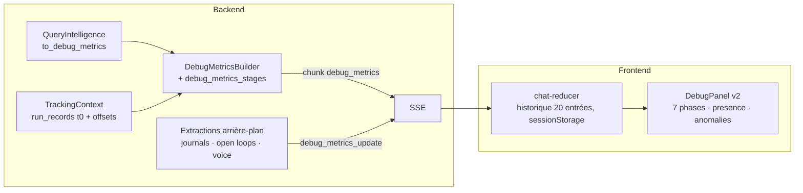

# Debug Panel — architecture et contrat

> Panneau latéral du chat (desktop ≥ 1024 px), activable par l'admin (et ouvrable aux utilisateurs via « user access »). Il trace **chaque étape d'un tour de conversation dans l'ordre où elle s'exécute**, pour comprendre, analyser et identifier les problèmes sans lire les logs serveur. Refondu en 2026-08 (ADR-209).

## Vue d'ensemble

## Flux de données

1. **Émission principale** : un unique chunk SSE `debug_metrics` en fin de stream (`streaming/service.py::_emit_debug_metrics`), après `await_run_id_tasks` (les LLM d'extraction mémoire/intérêts sont donc inclus dans `llm_calls`). Base : `query_intelligence.to_debug_metrics()` ; sections assemblées par `DebugMetricsBuilder` (une garde try/except **par section** — une section qui échoue n'emporte jamais les autres) et `debug_metrics_stages.py` (execution_mode, semantic_validation, react_execution, hitl, compaction, détections intérêts/mémoire).
2. **Émissions différées** : `debug_metrics_update` (un chunk par famille, `extraction_debug._families`) pour `journal_extraction`, `open_loop_extraction` et `voice` — la voix arrive après le backfill TTS pass 2, donc après le chunk principal. Le front fusionne dans l'entrée d'historique la plus récente.
3. **Historique** : reducer `DEBUG_METRICS_SET/ADD_TO_HISTORY/UPDATE`, 20 entrées en mémoire, persistées en sessionStorage (purge au logout, SEC-035).

## Chronologie ancrée au run (v3.4)

- `chat/run_records.py` détient le **t0 du run** (ancré par le premier TrackingContext, partagé pipeline + arrière-plan, nettoyé par `cleanup_run`, borné par la même éviction que les collecteurs).
- Chaque `TokenUsageRecord` porte `started_offset_ms` (start réel du callback quand disponible, sinon `now − durée`). `ImageGenerationRecord` aussi.
- `request_lifecycle` = nœuds ordonnés par **première apparition chronologique** ; `llm_pipeline` = appels triés par `(started_offset_ms, sequence)`. `sequence` reste un compteur par contexte : il départage, il n'ordonne plus seul (collision inter-contextes documentée dans ADR-209).

## Ordre de lecture : 7 phases

| Phase | Sections |
|---|---|
| 1 · Request | Query (badges langue + moteur) |
| 2 · Analysis (router) | Intent, Domain, Context Resolution, FOR_EACH, Intelligent Mechanisms, Routing Decision |
| 3 · Planning | Token Budget (stratégie catalogue), Tool Selection, Skills, Planner, Semantic Validator |
| 4 · Execution | Execution Waves (prévu), Execution Timeline (réel), ReAct Loop, Human in the Loop, Google API, Image Generation |
| 5 · Response context | Memory Injection, RAG Knowledge Spaces, Knowledge Enrichment, Personal Journals (sous-blocs Planner → Response) |
| 6 · Background extraction | Memory / Journal / Open Loop / Interest Extraction |
| 7 · Totals & pipeline | Execution Times, LLM Pipeline (+ **waterfall**), LLM Calls, Voice Synthesis, Context Compaction |

- **Repli des sections vides** : `sectionPresence` (`utils/presence.ts`) décide où une section vide s'affiche — derrière un disclosure « N idle sections » par phase. Les sections restent l'autorité sur *comment* leur état vide se rend (messages contextuels).
- **Anomalies** : `collectAnomalies` (`utils/anomalies.ts`) — règles pures (planner échoué/panic, étapes en échec, verdict rejeté, zone critical/emergency, plafond ReAct, erreurs d'extraction) **+ Zod en détecteur** (`SECTION_SCHEMAS`, `validateSectionSchemas`) : un payload dévié devient une anomalie « Payload mismatch », jamais une section masquée. Compteur sur l'en-tête d'entrée + point rouge sur les sections concernées.
- **Bandeau de synthèse** (`RequestEntryHeader`) : horloge (`formatClockTime`, 24 h déterministe), route, moteur, durée totale, tokens, coût total (somme LLM + Google + images + voix), compteur d'anomalies — comparaison inter-requêtes sans dépliage. `PipelineStrip` en tête d'entrée dépliée.

## Grammaire de présentation (front)

- **Couleur = `utils/tones.ts`, unique autorité.** Tons sémantiques → tokens du design system (chips via `Badge size="sm"`, donc garde de contraste 5 thèmes × clair/sombre) ; identités de nœuds → familles bi-thèmes (`nodeFamily`/`nodeChipClasses` : analysis, planning, hitl, execution, react, response, media, embedding, background, unknown — chaque teinte brute avec sa variante `dark:`).
- **Scores** : `ScoreBar` (remplit au ton du tiers, **seuil dessiné sur la barre**) + `ScoreLegend`, seuils par espace dans `SCORE_SPACES` (similarity 0.80/0.60, relevance 0.70/0.50, confidence 0.80/0.50).
- **Primitives** : `DebugSection` (icône lucide `text-primary` — doctrine des titres —, badge, point d'anomalie), `EmptySection` (badge **neutre** : une étape absente n'est pas un échec), `DebugChip`, `NodeChip`, `SubSectionHeader`, `MetricRow`/`ThresholdRow`/`InfoRow`, `ActionBadge` (action inconnue → chip neutre, jamais un repli silencieux sur CREATE).
- **Langue** : anglais uniquement (surface technique, arbitrage propriétaire 2026-08-05).

## Ajouter une donnée au panneau

1. **Backend** : section optionnelle dans `DebugMetricsBuilder` ou `debug_metrics_stages.py` (garde try/except par section ; toute clé d'état nouvelle **déclarée dans `MessagesState`**). Famille différée → une entrée dans `extraction_debug._families`.
2. **Front** : type dans `types/chat.ts`, schéma dans `SECTION_SCHEMAS`, composant de section sur les primitives partagées, entrée dans la table des phases de `DebugPanel` + prédicat dans `sectionPresence` (+ règle `collectAnomalies` si la donnée porte un signal d'échec).
3. **Tests** : section (nom accessible, état vide, tons), presence/anomalies, et côté backend un test du builder (`test_debug_metrics_builder_v2.py`).

## Pièges connus

- `AsyncSession`/état : voir Systemic Rules du CLAUDE.md racine (clés d'état non déclarées silencieusement perdues).
- Les entrées d'historique antérieures à v3.4 n'ont pas `started_offset_ms` : tri de repli par `sequence`, jamais de crash.
- `sequence: 9999` sur les entrées synthétiques image-gen n'est qu'un départage hérité : la position réelle vient de l'offset.
- Radix Accordion ne monte le contenu que déplié : tout test d'une section passe par `defaultValue=[value]`.
