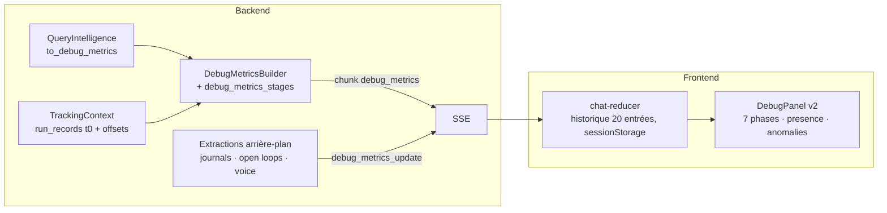

# Debug Panel — architecture et contrat

> Panneau latéral du chat (desktop ≥ 1024 px), activable par l'admin (et ouvrable aux utilisateurs via « user access »). Il trace **chaque étape d'un tour de conversation dans l'ordre où elle s'exécute**, pour comprendre, analyser et identifier les problèmes sans lire les logs serveur. Refondu en 2026-08 (ADR-209).

## Vue d'ensemble

## Flux de données

1. **Émission principale** : un unique chunk SSE `debug_metrics` en fin de stream (`streaming/service.py::_emit_debug_metrics`), après `await_run_id_tasks` (les LLM d'extraction mémoire/intérêts sont donc inclus dans `llm_calls`). Base : `query_intelligence.to_debug_metrics()` ; sections assemblées par `DebugMetricsBuilder` (une garde try/except **par section** — une section qui échoue n'emporte jamais les autres) et `debug_metrics_stages.py` (execution_mode, semantic_validation, react_execution, hitl, compaction, détections intérêts/mémoire).
2. **Émissions différées** : `debug_metrics_update` (un chunk par famille, `extraction_debug._families`) pour `journal_extraction`, `open_loop_extraction` et `voice` — la voix arrive après le backfill TTS pass 2, donc après le chunk principal. Le front fusionne dans l'entrée d'historique la plus récente.
3. **Historique** : reducer `DEBUG_METRICS_SET/ADD_TO_HISTORY/UPDATE`, 20 entrées en mémoire, persistées en sessionStorage (purge au logout, SEC-035).

## Chronologie ancrée au run (v3.4)

- `chat/run_records.py` détient le **t0 du run** (ancré par le premier TrackingContext, partagé pipeline + arrière-plan, nettoyé par `cleanup_run`, borné par la même éviction que les collecteurs).
- Chaque `TokenUsageRecord` porte `started_offset_ms` (start réel du callback quand disponible, sinon `now − durée`). `ImageGenerationRecord` aussi.
- `request_lifecycle` = nœuds ordonnés par **première apparition chronologique** ; `llm_pipeline` = appels triés par `(started_offset_ms, sequence)`. `sequence` reste un compteur par contexte : il départage, il n'ordonne plus seul (collision inter-contextes documentée dans ADR-209).

## Ordre de lecture : 7 phases

| Phase | Sections |
|---|---|
| 1 · Request | Query (badges langue + moteur) |
| 2 · Analysis (router) | Intent, Domain, Context Resolution, FOR_EACH, Intelligent Mechanisms, Routing Decision |
| 3 · Planning | Token Budget (stratégie catalogue), Tool Selection, Skills, Planner, Semantic Validator |
| 4 · Execution | Execution Waves (prévu), Execution Timeline (réel), ReAct Loop, Human in the Loop, Google API, Image Generation |
| 5 · Response context | Memory Injection, RAG Knowledge Spaces, Knowledge Enrichment, Personal Journals (sous-blocs Planner → Response) |
| 6 · Background extraction | Memory / Journal / Open Loop / Interest Extraction |
| 7 · Totals & pipeline | Execution Times, LLM Pipeline (+ **waterfall**), LLM Calls, Voice Synthesis, Context Compaction, Performed Effects, **Registers** (B8) |

- **Repli des sections vides** : `sectionPresence` (`utils/presence.ts`) décide où une section vide s'affiche — derrière un disclosure « N idle sections » par phase. Les sections restent l'autorité sur *comment* leur état vide se rend (messages contextuels).
- **Anomalies** : `collectAnomalies` (`utils/anomalies.ts`) — règles pures (planner échoué/panic, étapes en échec, verdict rejeté, zone critical/emergency, plafond ReAct, erreurs d'extraction) **+ Zod en détecteur** (`SECTION_SCHEMAS`, `validateSectionSchemas`) : un payload dévié devient une anomalie « Payload mismatch », jamais une section masquée. Compteur sur l'en-tête d'entrée + point rouge sur les sections concernées.
- **Bandeau de synthèse** (`RequestEntryHeader`) : horloge (`formatClockTime`, 24 h déterministe), route, moteur, durée totale, tokens, coût total (somme LLM + Google + images + voix), compteur d'anomalies — comparaison inter-requêtes sans dépliage. `PipelineStrip` en tête d'entrée dépliée.

## Ce que le panneau dit d'un échange (B8, 2026-09-10)

Le panneau montrait le déroulé d'un tour ; il ne montrait pas **ce que ce tour a
réellement demandé, subi et corrigé**. Cinq ajouts, tous lus depuis des données
qui existaient déjà — rien de nouveau n'est collecté.

### 1. Chaque appel modèle dit ce qui a été ENVOYÉ et ce qui est revenu

`TokenUsageRecord` porte depuis ADR-263 lot 7 les paramètres réellement transmis
(fournisseur, échantillonnage, plafond de sortie, intention de raisonnement,
empreinte) ainsi que le VERDICT de l'appel (`status`, `failure_kind`) et le
POSTE configuré (`llm_type`). `get_llm_calls_breakdown` n'en publiait aucun :
la carte montrait un nom de modèle et un prix.

Trois questions désormais lisibles : **qui a servi cet appel** (un nom de modèle
ne le dit pas — le même tag tourne en local et dans le cloud), **cet appel
a-t-il réussi** (un appel échoué et un appel réussi se rendaient à
l'identique, jetons facturés des deux côtés) et **que lui a-t-on demandé** (un
tour qui répond autrement qu'hier, c'est presque toujours un paramètre).

Un champ non observé reste `null` : un défaut affiché nomme une valeur que le
fournisseur n'a jamais vue.

### 2. La borne ReAct affichée est la borne IMPOSÉE

La section publiait `react_agent_max_iterations`, le **plafond dur**, alors que
la boucle s'arrête à `react_iteration_budget(state)` : l'allocation d'ADR-238
selon l'étendue des domaines, prolongée bloc par bloc tant que la boucle ramène
des résultats (ADR-248). Un tour ramené à quatre itérations se lisait « 4/25 »,
c'est-à-dire comme un modèle qui abandonne — le piège d'ADR-184 pointé sur le
panneau lui-même.

Sont publiés : le budget effectif, le plafond **quand il diffère**, l'allocation
de départ, les itérations productives qui ont acheté l'extension, la RAISON de
l'arrêt (`react_exit_reason`, l'unique prédicat, résolu une fois dans
`react_finalize_node`) et les **appels abandonnés** — les capacités que le tour
a demandées sans les obtenir, qui n'atteignaient qu'une ligne de journal. C'est
le signal qui dit si le budget est CALIBRÉ, pas seulement s'il a été atteint.

### 3. La place dont le tour disposait vraiment

Les quatre seuils de zone sont des réglages d'instance, **indépendants du modèle
configuré** : un tour pouvait se trouver dans une zone « safe » dont le plafond
dépassait toute la fenêtre de son modèle. `token_budget` porte maintenant la
fenêtre EFFECTIVE du poste `response` (ADR-278), **la source qui a répondu**
(`slot_override` | `catalogue` | `table` — une fenêtre venue de la table est un
DÉFAUT, pas une mesure : cette table est fausse sur 10 de ses 56 entrées), le
modèle concerné, la part consommée, et **l'instant où la compaction se
déclenche** — publié même quand elle ne s'est pas déclenchée, la section
« Compaction » n'existant qu'après coup.

La résolution a UNE implémentation : `resolve_context_window_for_slot` renvoie
la valeur, `get_effective_context_window_for_slot` renvoie son `.tokens`.

### 4. Les deux registres DIFFÉRÉS d'ADR-263

`agent_effects` avait sa section, relue en base après coup. Les deux autres —
ce que le tour a CONSULTÉ (`agent_treatments`) et le tour lui-même
(`agent_decisions`, la colonne vertébrale sur laquelle les deux autres se
raccrochent) — n'apparaissaient nulle part : un tour qui ouvrait neuf sources
et répondait à partir d'elles ressemblait, à l'écran, à un tour qui n'avait rien
fait.

**Ils sont lus À CHAUD, jamais en base.** Le bloc est émis DANS
`treatment_recorder` et `decision_recorder`, qui écrivent à la sortie : une
lecture des tables à cet instant répondrait « rien » — un faux négatif, pas un
tour vide. Deux conséquences énoncées plutôt que masquées : le résultat du tour
est « à cet instant » et non un verdict (`settled: false`), et une consultation
nomme la CAPACITÉ, jamais l'appel — aucun argument ne franchit cette frontière.

### 5. Les corrections silencieuses

Six choses arrivent régulièrement en cours de tour et changent ce qui en sort :
un niveau de raisonnement **contraint** (ADR-245), un paramètre de plan
**rogné** vers une borne publiée (ADR-184), un historique **réparé** de ses
appels sans réponse (ADR-248), une sortie structurée tronquée **refusée** plutôt
que rafistolée (ADR-275), une capacité **refusée** par la porte (ADR-263), un
quota qui **refuse** un appel (ADR-272 — un refus n'est pas un échec de
génération).

Chacune était déjà comptée dans Prometheus, où un exploitant lit un TAUX. Une
personne qui débogue UN échange a besoin de l'inverse : laquelle a eu lieu ICI.
`core/turn_verdicts.py` tient cette liste vivante — **dans `core` à dessein** :
les producteurs sont répartis entre `infrastructure/llm`, `domains/agents` et
`domains/usage_limits`, et un puits situé dans l'un d'eux inverserait une
frontière de couche pour les autres. Le vocabulaire est CLOS (un genre non
déclaré est écarté), la liste est PLAFONNÉE et **dit qu'elle l'est**, et
`note_verdict` est silencieux hors d'un tour : une correction ne doit jamais
être la raison d'un échec.

### 6. Le poste et le modèle d'un appel sont ceux de la CONFIGURATION (2026-09-24)

Signalé par le propriétaire : « les noms des modèles ne correspondent pas aux
modèles définis en base ». Mesuré sur dev, trois écarts de même cause — l'appel
ne savait pas de quelle configuration il venait :

- **Le poste valait `agent_graph` pour tous les appels d'un tour de chat.** Le
  service d'orchestration écrit cette valeur dans les métadonnées de la config
  du GRAPHE, tous les nœuds en héritent, et le callback la lisait comme poste de
  l'appel. La fabrique (`get_llm`) estampille désormais le poste et le
  fournisseur SUR le modèle (`FIELD_LLM_TYPE`, `FIELD_LLM_PROVIDER`) : LangChain
  fusionne les métadonnées propres d'un modèle PAR-DESSUS celles de l'appelant
  (sondé, y compris à travers `.bind()`), et le cache d'instances est indexé par
  poste — une instance n'est jamais partagée entre deux.
- **Le fournisseur était la famille de la CLASSE cliente** : `chat-deepseek`
  pour DeepSeek, `openai` pour Qwen servi par le client compatible OpenAI. Le
  fournisseur déclaré par la fabrique l'emporte (`capture_inference_params(…,
  declared_provider=…)`), et `chat-deepseek` rejoint la table des familles.
- **Le modèle affiché était celui que le fournisseur RAPPORTE** : un poste
  configuré sur un alias (`deepseek-v4-flash`) s'affichait sous le nom courant
  du fournisseur, un modèle que personne n'a configuré. Le callback lit aussi le
  modèle DEMANDÉ (`requested_model`, dans les paramètres d'invocation — ce que la
  base configure) ; le panneau l'affiche en tête et le nom servi seulement s'il
  diffère (`Served as:`, `utils/call-model.ts`). Le registre garde le nom servi,
  qui est ce qui est facturé. Un appel en ÉCHEC, qui ne rapporte aucun modèle,
  est enregistré sous le modèle demandé plutôt que `unknown` : ADR-244 juge un
  modèle sur ses échecs aussi.

### 7. La largeur se règle à la main (2026-09-24)

Une poignée sur le bord gauche du panneau, dans l'interstice : glissée, elle
élargit le panneau DANS la conversation, qui garde toujours
`DEBUG_PANEL_CHAT_MIN_WIDTH` (`utils/panel-width.ts`, une règle pure pour le
glisser, le clavier et une fenêtre plus étroite). C'est un séparateur de fenêtre
focalisable : les flèches déplacent (Maj : pas ×4), Début/Fin atteignent les
bornes, Entrée ou un double-clic rétablit la largeur par défaut. La largeur est
une préférence de l'APPAREIL (`debugPanelStore`, hors registre de purge comme
le dock et les yeux), bornée à l'affichage et conservée telle que choisie. Les
en-têtes de phase sont passés au-dessus des titres de section qu'ils regroupent
(encre pleine, 14 px, gras, pastille numérotée) : ils étaient en 10 px estompés
sous des titres en 14 px.

---

## Grammaire de présentation (front)

- **Couleur = `utils/tones.ts`, unique autorité.** Tons sémantiques → tokens du design system (chips via `Badge size="sm"`, donc garde de contraste 5 thèmes × clair/sombre) ; identités de nœuds → familles bi-thèmes (`nodeFamily`/`nodeChipClasses` : analysis, planning, hitl, execution, react, response, media, embedding, background, unknown — chaque teinte brute avec sa variante `dark:`).
- **Scores** : `ScoreBar` (remplit au ton du tiers, **seuil dessiné sur la barre**) + `ScoreLegend`, seuils par espace dans `SCORE_SPACES` (similarity 0.80/0.60, relevance 0.70/0.50, confidence 0.80/0.50).
- **Primitives** : `DebugSection` (icône lucide `text-primary` — doctrine des titres —, badge, point d'anomalie), `EmptySection` (badge **neutre** : une étape absente n'est pas un échec), `DebugChip`, `NodeChip`, `SubSectionHeader`, `MetricRow`/`ThresholdRow`/`InfoRow`, `ActionBadge` (action inconnue → chip neutre, jamais un repli silencieux sur CREATE).
- **Langue** : anglais uniquement (surface technique, arbitrage propriétaire 2026-08-05).

## Ajouter une donnée au panneau

1. **Backend** : section optionnelle dans `DebugMetricsBuilder` ou `debug_metrics_stages.py` (garde try/except par section ; toute clé d'état nouvelle **déclarée dans `MessagesState`**). Famille différée → une entrée dans `extraction_debug._families`.
2. **Front** : type dans `types/chat.ts`, schéma dans `SECTION_SCHEMAS`, composant de section sur les primitives partagées, entrée dans la table des phases de `DebugPanel` + prédicat dans `sectionPresence` (+ règle `collectAnomalies` si la donnée porte un signal d'échec).
3. **Tests** : section (nom accessible, état vide, tons), presence/anomalies, et côté backend un test du builder (`test_debug_metrics_builder_v2.py`).

## Pièges connus

- `AsyncSession`/état : voir Systemic Rules du CLAUDE.md racine (clés d'état non déclarées silencieusement perdues).
- Les entrées d'historique antérieures à v3.4 n'ont pas `started_offset_ms` : tri de repli par `sequence`, jamais de crash.
- `sequence: 9999` sur les entrées synthétiques image-gen n'est qu'un départage hérité : la position réelle vient de l'offset.
- Radix Accordion ne monte le contenu que déplié : tout test d'une section passe par `defaultValue=[value]`.
