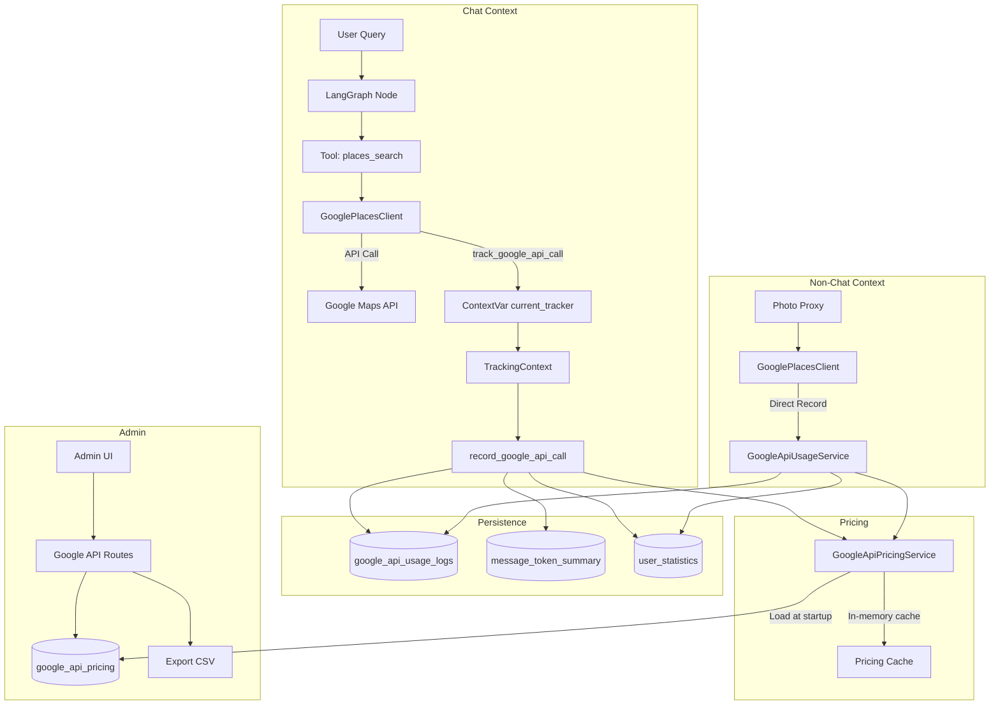

# GOOGLE_API_TRACKING - Suivi de Consommation Google Maps Platform

> **Documentation complète du système de tracking et pricing des APIs Google Maps Platform**
>
> **Version**: 1.0
> **Date**: 2026-02-04
> **Statut**: ✅ Complète

---

## 📋 Table des Matières

1. [Vue d'ensemble](#vue-densemble)
2. [Architecture](#architecture)
3. [Modèles de Données](#modèles-de-données)
4. [Services](#services)
5. [Tracking par ContextVar](#tracking-par-contextvar)
6. [API Admin](#api-admin)
7. [Export de Consommation](#export-de-consommation)
8. [Composants Frontend](#composants-frontend)
9. [Configuration](#configuration)
10. [Métriques & Observabilité](#métriques--observabilité)
11. [Annexes](#annexes)

---

## 📖 Vue d'ensemble

### Objectif

Le système de tracking Google API permet de :

- **Tracker les appels** aux APIs Google Maps Platform (Places, Routes, Geocoding)
- **Calculer les coûts** en temps réel (USD/EUR) par endpoint
- **Agréger par utilisateur** et par message (run_id)
- **Exporter les données** de consommation au format CSV
- **Gérer le pricing** dynamiquement via interface admin

### APIs Supportées

| API | Endpoints | SKU Name | Coût/1000 req |
|-----|-----------|----------|---------------|
| **Places API** | /places:searchText | Text Search Pro | $32.00 |
| | /places:searchNearby | Nearby Search Pro | $32.00 |
| | /places/{id} | Place Details Pro | $17.00 |
| | /places:autocomplete | Autocomplete | $2.83 |
| | /{photo}/media | Place Photos | $7.00 |
| **Routes API** | /directions/v2:computeRoutes | Compute Routes | $5.00 |
| | /distanceMatrix/v2:computeRouteMatrix | Route Matrix | $5.00 |
| **Geocoding API** | /geocode/json | Geocoding | $5.00 |
| **Static Maps API** | /staticmap | Static Maps | $2.00 |

---

## 🏗️ Architecture

### Diagramme de Flux



### Composants Clés

| Composant | Fichier | Rôle |
|-----------|---------|------|
| `GoogleApiPricing` | `domains/google_api/models.py` | Modèle pricing par endpoint |
| `GoogleApiUsageLog` | `domains/google_api/models.py` | Audit trail des appels |
| `GoogleApiPricingService` | `domains/google_api/pricing_service.py` | Cache pricing + calcul coûts |
| `GoogleApiUsageService` | `domains/google_api/service.py` | Recording direct (non-chat) |
| `track_google_api_call()` | `connectors/clients/google_api_tracker.py` | Helper ContextVar |
| `current_tracker` | `core/context.py` | ContextVar pour propagation |

---

## 🗄️ Modèles de Données

### Table: google_api_pricing

Configuration des prix par endpoint Google API.

```sql
CREATE TABLE google_api_pricing (
    id UUID PRIMARY KEY DEFAULT gen_random_uuid(),
    api_name VARCHAR(50) NOT NULL,           -- 'places', 'routes', 'geocoding', 'static_maps'
    endpoint VARCHAR(100) NOT NULL,           -- '/places:searchText'
    sku_name VARCHAR(100) NOT NULL,           -- 'Text Search Pro'
    cost_per_1000_usd DECIMAL(10, 4) NOT NULL, -- 32.0000
    effective_from TIMESTAMP WITH TIME ZONE NOT NULL DEFAULT NOW(),
    is_active BOOLEAN NOT NULL DEFAULT TRUE,
    created_at TIMESTAMP WITH TIME ZONE NOT NULL DEFAULT NOW(),
    updated_at TIMESTAMP WITH TIME ZONE NOT NULL DEFAULT NOW()
);

-- Index pour lookup rapide
CREATE INDEX ix_google_api_pricing_lookup
    ON google_api_pricing(api_name, endpoint, is_active);
```

### Table: google_api_usage_logs

Audit trail immutable des appels API.

```sql
CREATE TABLE google_api_usage_logs (
    id UUID PRIMARY KEY DEFAULT gen_random_uuid(),
    user_id UUID NOT NULL REFERENCES users(id) ON DELETE CASCADE,
    run_id VARCHAR(255) NOT NULL,            -- LangGraph run_id ou 'direct_xxx'
    api_name VARCHAR(50) NOT NULL,
    endpoint VARCHAR(100) NOT NULL,
    request_count INTEGER NOT NULL DEFAULT 1,
    cost_usd DECIMAL(10, 6) NOT NULL,
    cost_eur DECIMAL(10, 6) NOT NULL,
    usd_to_eur_rate DECIMAL(10, 6) NOT NULL, -- Pour audit
    cached BOOLEAN NOT NULL DEFAULT FALSE,    -- True = zero cost
    created_at TIMESTAMP WITH TIME ZONE NOT NULL DEFAULT NOW(),
    updated_at TIMESTAMP WITH TIME ZONE NOT NULL DEFAULT NOW()
);

-- Index pour requêtes par user + date
CREATE INDEX ix_google_api_usage_user_date
    ON google_api_usage_logs(user_id, created_at);
```

### Colonnes ajoutées à message_token_summary

```sql
ALTER TABLE message_token_summary ADD COLUMN
    google_api_requests INTEGER NOT NULL DEFAULT 0;
ALTER TABLE message_token_summary ADD COLUMN
    google_api_cost_eur DECIMAL(10, 6) NOT NULL DEFAULT 0;
```

### Colonnes ajoutées à user_statistics

```sql
-- Lifetime totals
ALTER TABLE user_statistics ADD COLUMN
    total_google_api_requests BIGINT NOT NULL DEFAULT 0;
ALTER TABLE user_statistics ADD COLUMN
    total_google_api_cost_eur DECIMAL(12, 6) NOT NULL DEFAULT 0;

-- Current billing cycle
ALTER TABLE user_statistics ADD COLUMN
    cycle_google_api_requests BIGINT NOT NULL DEFAULT 0;
ALTER TABLE user_statistics ADD COLUMN
    cycle_google_api_cost_eur DECIMAL(12, 6) NOT NULL DEFAULT 0;
```

---

## 🔧 Services

### GoogleApiPricingService

Service de calcul des coûts avec cache in-memory.

```python
class GoogleApiPricingService:
    """
    Calculate costs for Google API calls.

    Cache loaded at application startup from database.
    Synchronous lookups (no DB access during request).
    """

    _pricing_cache: dict[str, Decimal] = {}  # "api_name:endpoint" -> cost_per_1000
    _usd_eur_rate: Decimal = Decimal("0.94")

    @classmethod
    async def load_pricing_cache(cls, db: AsyncSession) -> None:
        """Load pricing from DB into memory (called at startup)."""
        repo = GoogleApiPricingRepository(db)
        pricing_entries = await repo.get_active_pricing()

        cls._pricing_cache = {
            f"{p.api_name}:{p.endpoint}": p.cost_per_1000_usd
            for p in pricing_entries
        }

        # Fetch current USD/EUR rate
        currency_service = CurrencyRateService()
        rate = await currency_service.get_rate("USD", "EUR")
        if rate:
            cls._usd_eur_rate = rate

    @classmethod
    def get_cost_per_request(
        cls,
        api_name: str,
        endpoint: str,
    ) -> tuple[Decimal, Decimal, Decimal]:
        """
        Get cost for a single request (synchronous).

        Returns:
            (cost_usd, cost_eur, usd_to_eur_rate)
        """
        key = f"{api_name}:{endpoint}"
        cost_per_1000 = cls._pricing_cache.get(key, Decimal("0"))

        cost_usd = cost_per_1000 / Decimal("1000")
        cost_eur = cost_usd * cls._usd_eur_rate

        return cost_usd, cost_eur, cls._usd_eur_rate
```

### GoogleApiUsageService

Service pour enregistrement direct (contexte non-chat).

```python
class GoogleApiUsageService:
    """
    Track Google API usage outside of chat context.

    Used for:
    - Photo proxy endpoint (places photos)
    - Home location geocoding (user settings)
    """

    @classmethod
    async def record_api_call(
        cls,
        db: AsyncSession,
        user_id: UUID,
        api_name: str,
        endpoint: str,
        run_id: str | None = None,
    ) -> None:
        """
        Record a Google API call directly to database.

        Args:
            db: Database session
            user_id: User who triggered the API call
            api_name: API identifier
            endpoint: Endpoint called
            run_id: Optional (defaults to synthetic 'direct_xxx')
        """
        # Get cost from pricing cache
        cost_usd, cost_eur, rate = GoogleApiPricingService.get_cost_per_request(
            api_name, endpoint
        )

        # Generate synthetic run_id for non-chat calls
        if run_id is None:
            run_id = f"direct_{uuid4().hex[:12]}"

        # Create usage log
        usage_repo = GoogleApiUsageRepository(db)
        await usage_repo.create_log(
            user_id=user_id,
            run_id=run_id,
            api_name=api_name,
            endpoint=endpoint,
            cost_usd=float(cost_usd),
            cost_eur=float(cost_eur),
            usd_to_eur_rate=float(rate),
            cached=False,
        )

        # Update user statistics
        await cls._increment_user_statistics(db, user_id, 1, cost_eur)
```

---

## 🔗 Tracking par ContextVar

### Pattern ContextVar

Le tracking utilise `contextvars` pour propagation implicite à travers la call stack async.

```python
# core/context.py
from contextvars import ContextVar
from typing import TYPE_CHECKING

if TYPE_CHECKING:
    from src.domains.chat.service import TrackingContext

current_tracker: ContextVar["TrackingContext | None"] = ContextVar(
    "current_tracker", default=None
)
```

### Helper Function

```python
# connectors/clients/google_api_tracker.py
from src.core.context import current_tracker

def track_google_api_call(
    api_name: str,
    endpoint: str,
    cached: bool = False
) -> None:
    """
    Track a Google API call if within a TrackingContext.

    Uses ContextVar - no explicit parameter passing needed.
    Safe to call from anywhere - does nothing if no tracker active.

    Args:
        api_name: API name (e.g., "places", "routes")
        endpoint: Endpoint path (e.g., "/places:searchText")
        cached: True if result was from cache (zero cost)
    """
    tracker = current_tracker.get()
    if tracker is not None:
        tracker.record_google_api_call(
            api_name=api_name,
            endpoint=endpoint,
            cached=cached,
        )
```

### Utilisation dans les Clients

```python
# connectors/clients/google_places_client.py
from src.domains.connectors.clients.google_api_tracker import track_google_api_call

class GooglePlacesClient:
    async def search_text(self, query: str, ...) -> list[Place]:
        """Search places by text query."""
        # Check cache first
        cache_key = self._make_cache_key("search_text", query)
        cached = await self.cache.get(cache_key)

        if cached:
            # Track as cached (zero cost)
            track_google_api_call("places", "/places:searchText", cached=True)
            return cached

        # Make API call
        response = await self.client.post(
            f"{BASE_URL}/places:searchText",
            json={"textQuery": query, ...}
        )

        # Track billable call
        track_google_api_call("places", "/places:searchText", cached=False)

        # Cache result
        await self.cache.set(cache_key, response.json(), ttl=3600)

        return response.json()
```

### TrackingContext Integration

```python
# domains/chat/service.py
class TrackingContext:
    """Context manager for tracking token and API usage."""

    def __init__(self, user_id: UUID, run_id: str, ...):
        self.user_id = user_id
        self.run_id = run_id
        self._google_api_calls: list[dict] = []
        self._context_token: contextvars.Token | None = None

    async def __aenter__(self):
        # Set ContextVar for implicit propagation
        self._context_token = current_tracker.set(self)
        return self

    async def __aexit__(self, exc_type, exc_val, exc_tb):
        # Clear ContextVar
        current_tracker.reset(self._context_token)
        # Persist all recorded calls
        await self._persist_google_api_usage()

    def record_google_api_call(
        self,
        api_name: str,
        endpoint: str,
        cached: bool = False
    ) -> None:
        """Record a Google API call for later persistence."""
        cost_usd, cost_eur, rate = GoogleApiPricingService.get_cost_per_request(
            api_name, endpoint
        )

        if cached:
            cost_usd = cost_eur = Decimal("0")

        self._google_api_calls.append({
            "user_id": self.user_id,
            "run_id": self.run_id,
            "api_name": api_name,
            "endpoint": endpoint,
            "cost_usd": float(cost_usd),
            "cost_eur": float(cost_eur),
            "usd_to_eur_rate": float(rate),
            "cached": cached,
        })

    async def _persist_google_api_usage(self) -> None:
        """Persist all recorded Google API calls to database."""
        if not self._google_api_calls:
            return

        # Bulk insert usage logs
        usage_repo = GoogleApiUsageRepository(self.db)
        await usage_repo.bulk_create_logs(self._google_api_calls)

        # Calculate totals for message_token_summary
        total_requests = len([c for c in self._google_api_calls if not c["cached"]])
        total_cost_eur = sum(c["cost_eur"] for c in self._google_api_calls)

        # Update message summary
        self.message_summary.google_api_requests = total_requests
        self.message_summary.google_api_cost_eur = total_cost_eur

        # Update user statistics
        await self._update_user_statistics_google_api(total_requests, total_cost_eur)
```

---

## 🔐 API Admin

### Endpoints de Gestion du Pricing

```
GET    /api/v1/admin/google-api/pricing
POST   /api/v1/admin/google-api/pricing
PUT    /api/v1/admin/google-api/pricing/{api_name}/{endpoint}
DELETE /api/v1/admin/google-api/pricing/{pricing_id}
POST   /api/v1/admin/google-api/pricing/reload-cache
```

#### GET /api/v1/admin/google-api/pricing

Liste paginée avec recherche et tri.

**Query Parameters**:

| Param | Type | Default | Description |
|-------|------|---------|-------------|
| `search` | string | null | Filtre sur api_name, endpoint, sku_name |
| `page` | int | 1 | Numéro de page |
| `page_size` | int | 20 | Items par page (max 100) |
| `sort_by` | string | "api_name" | Colonne de tri |
| `sort_order` | string | "asc" | Ordre (asc/desc) |

**Response**:

```json
{
  "total": 9,
  "page": 1,
  "page_size": 20,
  "total_pages": 1,
  "entries": [
    {
      "id": "uuid",
      "api_name": "places",
      "endpoint": "/places:searchText",
      "sku_name": "Text Search Pro",
      "cost_per_1000_usd": "32.0000",
      "effective_from": "2026-02-04T00:00:00Z",
      "is_active": true
    }
  ]
}
```

#### POST /api/v1/admin/google-api/pricing

Créer une nouvelle entrée de pricing.

**Request Body**:

```json
{
  "api_name": "places",
  "endpoint": "/places:newEndpoint",
  "sku_name": "New SKU Name",
  "cost_per_1000_usd": "25.0000"
}
```

#### PUT /api/v1/admin/google-api/pricing/{api_name}/{endpoint}

Mettre à jour le pricing (crée nouvelle version, désactive l'ancienne).

**Request Body**:

```json
{
  "sku_name": "Updated SKU Name",
  "cost_per_1000_usd": "28.0000"
}
```

#### POST /api/v1/admin/google-api/pricing/reload-cache

Recharger le cache pricing en mémoire après modifications.

**Response**:

```json
{
  "status": "success",
  "message": "Pricing cache reloaded",
  "cache_entries": 9
}
```

---

## 📤 Export de Consommation

### Architecture

The export logic is centralized in a shared service (`src/domains/google_api/export_service.py`) used by both admin and user endpoints, eliminating code duplication. Three reusable functions handle query building, date parsing, and CSV generation:

- `export_token_usage_csv()` — Detailed LLM call export
- `export_google_api_usage_csv()` — Detailed Google API call export
- `export_consumption_summary_csv()` — Aggregated per-user summary

### Admin Endpoints (Superuser Only)

```
GET /api/v1/admin/google-api/export/token-usage
GET /api/v1/admin/google-api/export/google-api-usage
GET /api/v1/admin/google-api/export/consumption-summary
```

**Auth**: Requires `get_current_superuser_session` (router-level dependency).

**Query Parameters**:

| Param | Type | Description |
|-------|------|-------------|
| `start_date` | string | Start date filter (YYYY-MM-DD) |
| `end_date` | string | End date filter (YYYY-MM-DD) |
| `user_id` | UUID | Filter by specific user (optional — omit for all users) |

### User Endpoints (v1.9.1)

```
GET /api/v1/usage/export/token-usage
GET /api/v1/usage/export/google-api-usage
GET /api/v1/usage/export/consumption-summary
```

**Auth**: Requires `get_current_active_session`. Security: `user_id` is forced server-side to `current_user.id` — no `user_id` parameter is exposed, preventing IDOR attacks.

**Query Parameters**:

| Param | Type | Description |
|-------|------|-------------|
| `start_date` | string | Start date filter (YYYY-MM-DD) |
| `end_date` | string | End date filter (YYYY-MM-DD) |

### CSV Formats

#### Token Usage

```csv
date,user_email,run_id,node_name,model_name,prompt_tokens,completion_tokens,cached_tokens,cost_usd,cost_eur
```

#### Google API Usage

```csv
date,user_email,run_id,api_name,endpoint,request_count,cost_usd,cost_eur,cached
```

#### Consumption Summary

```csv
user_email,total_prompt_tokens,total_completion_tokens,total_cached_tokens,total_llm_calls,total_llm_cost_eur,total_google_requests,total_google_cost_eur,total_cost_eur
```

---

## 🎨 Composants Frontend

### AdminGoogleApiPricingSection

Gestion du pricing Google API.

**Fichier**: `apps/web/src/components/settings/AdminGoogleApiPricingSection.tsx`

**Features**:

- Tableau paginé avec tri et recherche
- CRUD avec React 19 useOptimistic pour UX instantanée
- Modal création/édition
- Bouton rechargement cache

**Props**:

```typescript
interface Props {
  lng: Language;      // Langue i18n
  collapsible?: boolean;  // Section collapsible (default: true)
}
```

### ConsumptionExportSection (v1.9.1)

Shared dual-mode component for consumption data export.

**File**: `apps/web/src/components/settings/ConsumptionExportSection.tsx`

**Features**:

- Date presets (current month, last month, last 30 days, all time)
- Admin mode: user autocomplete with debounce, calls `/admin/google-api/export/*`
- User mode: no user filter, calls `/usage/export/*` (own data only)
- 3 export types (Token Usage, Google API, Summary)
- CSV download via blob

**Props**:

```typescript
interface ConsumptionExportSectionProps extends BaseSettingsProps {
  mode: 'admin' | 'user';
}
```

**Wrappers**:

- `AdminConsumptionExportSection` — Thin wrapper with `mode="admin"`, used in Settings > Administration
- Direct `<ConsumptionExportSection mode="user" />` in Settings > Features (both superuser and regular user tabs)

### Traductions i18n

Clés ajoutées dans `locales/{lang}/translation.json` :

```json
{
  "settings": {
    "admin": {
      "google_api": {
        "title": "Google API Pricing",
        "description": "Manage Google Maps Platform API pricing",
        "table": {
          "api_name": "API",
          "endpoint": "Endpoint",
          "sku_name": "SKU Name",
          "cost": "Cost ($/1K)"
        },
        "reload_cache": "Reload Cache",
        "add_entry": "Add Entry"
      },
      "export": {
        "title": "Consumption Export",
        "description": "Export usage data as CSV",
        "token_usage_title": "LLM Token Usage",
        "google_api_usage_title": "Google API Usage",
        "summary_title": "Consumption Summary"
      }
    },
    "user": {
      "export": {
        "title": "My Consumption Export",
        "description": "Export your personal consumption data as CSV",
        "token_usage_title": "LLM Token Usage",
        "google_api_usage_title": "Google API Usage",
        "summary_title": "My Summary"
      }
    }
  }
}
```

---

## ⚙️ Configuration

### Variables d'Environnement

```bash
# Currency API (pour taux USD/EUR)
CURRENCY_API_KEY=your_api_key
CURRENCY_API_URL=https://api.exchangerate-api.com/v4/latest/USD

# Taux par défaut si API indisponible
DEFAULT_USD_EUR_RATE=0.94
```

### Constantes

```python
# core/constants.py

# Google API Pricing
DEFAULT_USD_EUR_RATE = 0.94  # Fallback rate

# Admin pagination
ADMIN_GOOGLE_API_PRICING_PAGE_SIZE = 20
```

### Chargement au Démarrage

```python
# main.py
@asynccontextmanager
async def lifespan(app: FastAPI):
    """Application lifespan with pricing cache loading."""
    async with AsyncSessionLocal() as db:
        # Load Google API pricing cache
        await GoogleApiPricingService.load_pricing_cache(db)
        logger.info("google_api_pricing_loaded",
                   entries=len(GoogleApiPricingService._pricing_cache))

    yield
```

---

## 📊 Métriques & Observabilité

### Logs Structurés

```python
# Appel API enregistré
logger.info(
    "google_api_call_recorded",
    user_id=str(user_id),
    api_name=api_name,
    endpoint=endpoint,
    cost_eur=float(cost_eur),
    cached=cached,
    run_id=run_id,
)

# Cache pricing chargé
logger.info(
    "google_api_pricing_loaded",
    entries=len(cache),
    usd_eur_rate=float(rate),
)

# Export effectué
logger.info(
    "google_api_usage_exported",
    rows_count=len(data),
    start_date=start_date,
    end_date=end_date,
    admin_user_id=str(current_user.id),
)
```

### Métriques Prometheus (Future)

```python
# Métriques suggérées
google_api_requests_total = Counter(
    'google_api_requests_total',
    'Total Google API requests',
    ['api_name', 'endpoint', 'cached']
)

google_api_cost_eur_total = Counter(
    'google_api_cost_eur_total',
    'Total Google API cost in EUR',
    ['api_name', 'endpoint']
)
```

---

## 📚 Annexes

### Migration Alembic

**Fichier**: `alembic/versions/2026_02_04_0001-add_google_api_tracking.py`

```python
# Key operations:
# 1. Create google_api_pricing table
# 2. Create google_api_usage_logs table
# 3. Add columns to message_token_summary
# 4. Add columns to user_statistics
# 5. Seed pricing data (Google Maps Platform 2026 rates)
```

### Seed Data (Pricing 2026)

| API | Endpoint | SKU | $/1000 |
|-----|----------|-----|--------|
| places | /places:searchText | Text Search Pro | 32.00 |
| places | /places:searchNearby | Nearby Search Pro | 32.00 |
| places | /places/{id} | Place Details Pro | 17.00 |
| places | /places:autocomplete | Autocomplete | 2.83 |
| places | /{photo}/media | Place Photos | 7.00 |
| routes | /directions/v2:computeRoutes | Compute Routes | 5.00 |
| routes | /distanceMatrix/v2:computeRouteMatrix | Route Matrix | 5.00 |
| geocoding | /geocode/json | Geocoding | 5.00 |
| static_maps | /staticmap | Static Maps | 2.00 |

### Troubleshooting

**Problème**: Pricing not found pour un endpoint

```python
# Vérifier le cache
print(GoogleApiPricingService._pricing_cache.keys())

# Recharger le cache
await GoogleApiPricingService.load_pricing_cache(db)
```

**Problème**: Coûts à zéro

1. Vérifier que le pricing est seedé en DB
2. Vérifier que `load_pricing_cache()` est appelé au startup
3. Vérifier que l'endpoint correspond exactement (case-sensitive)

**Problème**: Tracking ne fonctionne pas

1. Vérifier que `TrackingContext` est actif (`current_tracker.get()` non None)
2. Pour contexte non-chat, utiliser `GoogleApiUsageService.record_api_call()`

---

## Références

| Document | Description |
|----------|-------------|
| [LLM_PRICING_MANAGEMENT.md](./LLM_PRICING_MANAGEMENT.md) | Système pricing LLM (pattern similaire) |
| [TOKEN_TRACKING_AND_COUNTING.md](./TOKEN_TRACKING_AND_COUNTING.md) | Token tracking architecture |
| [DATABASE_SCHEMA.md](./DATABASE_SCHEMA.md) | Schema complet PostgreSQL |

---

**Fin de GOOGLE_API_TRACKING.md**

*Document créé le 2026-02-04 - Commit "Suivi consommation Google + exports consommation"*
