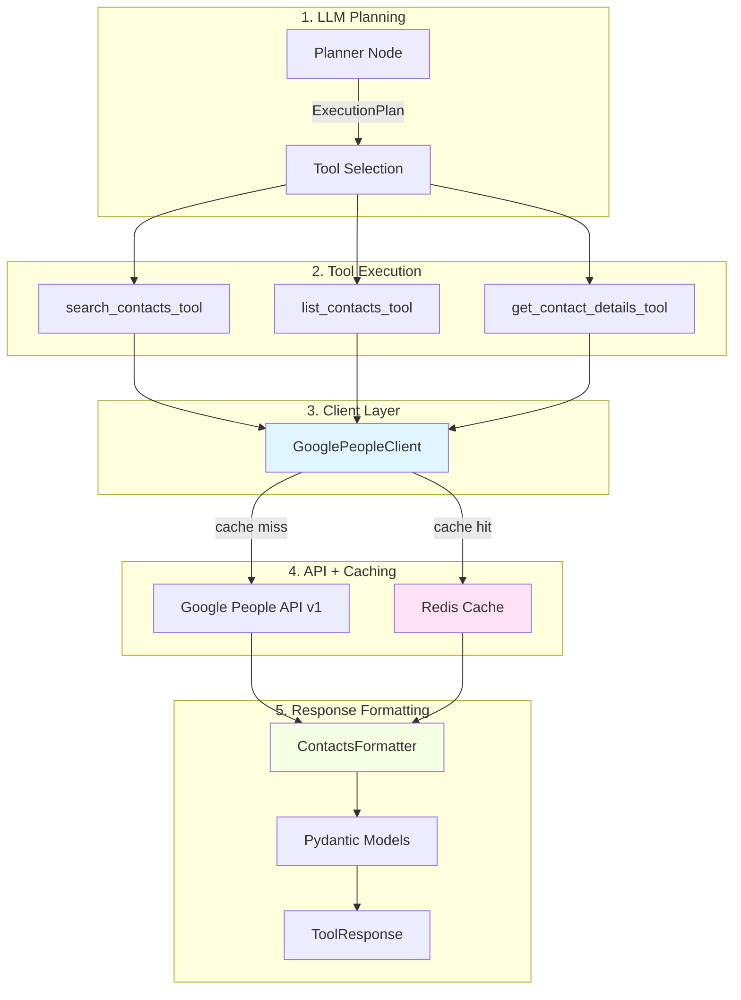

# Google Contacts Integration (LIA)

> **Document de référence technique - Intégration Google People API v1**
>
> Version: 1.1
> Date: 2025-12-27

---

## Table des matières

1. [Vue d'ensemble](#vue-densemble)
2. [Architecture](#architecture)
3. [Google People Client](#google-people-client)
4. [Tools Implementation](#tools-implementation)
5. [Catalogue Manifests](#catalogue-manifests)
6. [Caching Strategy](#caching-strategy)
7. [Examples & Testing](#examples--testing)
8. [Troubleshooting](#troubleshooting)
9. [Ressources](#ressources)

---

## Vue d'ensemble

### Objectifs

L'intégration Google Contacts fournit :

1. **3 outils LangChain** : `search_contacts`, `list_contacts`, `get_contact_details`
2. **Client robuste** : OAuth refresh, rate limiting, caching Redis, retry logic
3. **Performance optimisée** : Cache 5min (search/list), 3min (details), connection pooling
4. **Field projection** : Récupération sélective de champs (réduction tokens 60-80%)
5. **Type safety** : Pydantic models complets pour validation

### Composants clés

```
Google Contacts Integration
├── GooglePeopleClient (HTTP client)
│   ├── OAuth token refresh avec Redis lock
│   ├── Rate limiting (600 req/min)
│   ├── Redis caching (ContactsCache)
│   └── Connection pooling (35-90ms saved)
├── Tools (LangChain v1)
│   ├── search_contacts_tool
│   ├── list_contacts_tool
│   └── get_contact_details_tool
├── Catalogue Manifests
│   ├── Field mappings (user-friendly → API names)
│   ├── Cost profiles (tokens, latency)
│   └── Permission profiles (HITL, scopes)
└── Pydantic Models
    ├── ContactBasic (search/list)
    ├── ContactDetailed (get_details)
    └── Input/Output validation
```

### Flux de données



---

## Architecture

### Layers

**Layer 1: Tools (LangChain)** - Interfacent avec l'agent LangGraph

```python
from langchain.tools import ToolRuntime
from src.domains.agents.tools.decorators import connector_tool

@connector_tool(
    name="search_contacts_tool",
    agent=AGENT_CONTACTS,
)
async def search_contacts_tool(
    query: str,
    max_results: int = 10,
    fields: list[str] | None = None,
    force_refresh: bool = False,
    runtime: Annotated[ToolRuntime, InjectedToolArg] = None,
) -> str:
    """PRIMARY TOOL to FIND contacts by name, email, or phone."""
    # Implementation...
```

**Layer 2: Client (HTTP)** - Gère communication avec Google API

```python
class GooglePeopleClient:
    """Google People API client with OAuth, rate limiting, caching."""

    async def search_contacts(
        self,
        query: str,
        max_results: int = 10,
        force_refresh: bool = False,
    ) -> dict[str, Any]:
        """Search contacts by query with caching."""
        # 1. Rate limiting
        await self._rate_limit()

        # 2. Check cache
        if not force_refresh:
            cached = await self._cache.get_search_results(...)
            if cached:
                return cached

        # 3. API call avec retry
        results = await self._make_request("GET", "/people/me/connections", ...)

        # 4. Cache results
        await self._cache.set_search_results(...)

        return results
```

**Layer 3: Models (Pydantic)** - Validation et type safety

```python
class ContactBasic(BaseModel):
    """Contact avec informations basiques."""
    resource_name: str
    name: ContactName | None
    emails: list[ContactEmail] = Field(default_factory=list)
    phones: list[ContactPhone] = Field(default_factory=list)
    addresses: list[ContactAddress] = Field(default_factory=list)
    birthdays: list[str] = Field(default_factory=list)

class SearchContactsOutput(BaseModel):
    """Résultat de search_contacts_tool."""
    contacts: list[ContactBasic]
    total_found: int
    from_cache: bool
```

**Layer 4: Manifests (Catalogue)** - Métadonnées pour planner

```python
search_contacts_catalogue_manifest = ToolManifest(
    name="search_contacts_tool",
    agent="contacts_agent",
    description="PRIMARY TOOL to FIND contacts...",
    parameters=[
        ParameterSchema(name="query", type="string", required=True),
        ParameterSchema(name="max_results", type="integer", required=False),
    ],
    cost=CostProfile(
        est_tokens_in=150,
        est_tokens_out=650,
        est_latency_ms=500,
    ),
    permissions=PermissionProfile(
        required_scopes=[GOOGLE_SCOPE_CONTACTS_READONLY],
        hitl_required=True,
    ),
)
```

### Field Mappings (User-Friendly → API)

**Principe** : Les utilisateurs/LLM utilisent noms simples, mappés vers API Google.

```python
# common_mappings.py
GOOGLE_CONTACTS_FIELD_MAPPINGS = {
    # Identity & Names
    "name": "names",
    "nickname": "nicknames",
    # Contact Information
    "email": "emailAddresses",
    "phone": "phoneNumbers",
    "address": "addresses",
    # Personal Information
    "biography": "biographies",
    "birthday": "birthdays",
    "photo": "photos",
    # Professional Information
    "organization": "organizations",
    "occupation": "occupations",
    "skill": "skills",
    # Social & Relationships
    "relation": "relations",
    "interest": "interests",
    # ... 64 mappings au total
}

# Usage dans tools
def normalize_field_names(tool_name: str, fields: list[str] | None) -> list[str] | None:
    """Normalize user-friendly names to API field masks."""
    if fields is None:
        return None

    registry = get_global_registry()
    tool_manifest = registry.get_tool_manifest(tool_name)
    field_mappings = tool_manifest.field_mappings

    normalized = []
    for field in fields:
        normalized_field = field_mappings.get(field, field)
        normalized.append(normalized_field)

    return normalized
```

**Avantages** :
- LLM utilise vocabulaire simple ("email" vs "emailAddresses")
- Mapping centralisé (single source of truth)
- Extensible (ajouter nouveaux champs sans toucher tools)

---

## Google People Client

### Initialisation

```python
from src.domains.connectors.clients import GooglePeopleClient

client = GooglePeopleClient(
    user_id=UUID("user-id"),
    credentials=ConnectorCredentials(
        access_token="ya29.a0...",
        refresh_token="1//0x...",
        expires_at=datetime(2025, 11, 14, 15, 30),
    ),
    connector_service=connector_service,
)

# Cleanup après usage (important!)
await client.close()
```

### OAuth Token Refresh (Redis Lock)

**Problème** : Multiples coroutines simultanées peuvent tenter de refresh le token.

**Solution** : Redis lock distribué avec double-check pattern.

```python
async def _refresh_token_if_needed(self) -> str:
    """Refresh OAuth token if expired, using Redis lock."""
    from datetime import UTC, datetime

    # Check if token expired
    if self.credentials.expires_at and self.credentials.expires_at < datetime.now(UTC):
        # Use Redis lock to prevent multiple refresh attempts
        redis_session = await get_redis_session()
        async with OAuthLock(redis_session, self.user_id, ConnectorType.GOOGLE_CONTACTS):
            # Double-check token still expired (another coroutine might have refreshed)
            fresh_credentials = await self.connector_service.get_connector_credentials(
                self.user_id, ConnectorType.GOOGLE_CONTACTS
            )

            if (
                fresh_credentials
                and fresh_credentials.expires_at
                and fresh_credentials.expires_at > datetime.now(UTC)
            ):
                logger.debug("oauth_token_already_refreshed_by_another_process")
                self.credentials = fresh_credentials
                return str(fresh_credentials.access_token)

            # Refresh token
            refreshed_credentials = await self.connector_service._refresh_oauth_token(
                connector, self.credentials
            )
            self.credentials = refreshed_credentials

    return self.credentials.access_token
```

**Pattern** :
1. Acquérir lock Redis (`OAuthLock`)
2. Double-check token encore expiré (évite refresh redondant)
3. Refresh si nécessaire
4. Release lock automatique (context manager)

### Rate Limiting (600 req/min)

**Limite Google** : 600 requests/minute par projet OAuth.

**Implémentation** : Time-based throttling (10 req/s).

```python
RATE_LIMIT_PER_SECOND = 10
RATE_LIMIT_INTERVAL = 1.0 / RATE_LIMIT_PER_SECOND  # 0.1s

async def _rate_limit(self) -> None:
    """Apply rate limiting (10 requests/second)."""
    now = asyncio.get_event_loop().time()
    elapsed = now - self._last_request_time

    if elapsed < RATE_LIMIT_INTERVAL:
        wait_time = RATE_LIMIT_INTERVAL - elapsed
        await asyncio.sleep(wait_time)

    self._last_request_time = asyncio.get_event_loop().time()
```

**Production consideration** : Utiliser Redis-based distributed rate limiting pour multi-instance.

### Connection Pooling (35-90ms saved)

**Principe** : Réutiliser TCP connections vers `people.googleapis.com`.

```python
async def _get_client(self) -> httpx.AsyncClient:
    """Get or create reusable HTTP client with connection pooling."""
    if self._http_client is None:
        self._http_client = httpx.AsyncClient(
            timeout=settings.http_timeout_external_api,
            limits=httpx.Limits(
                max_keepalive_connections=20,  # Pool size
                max_connections=100,            # Hard limit
                keepalive_expiry=30.0,          # Close idle after 30s
            ),
        )
    return self._http_client
```

**Gains** :
- **35-90ms** saved per request (evite SSL handshake + DNS)
- Réduit latence Google API de ~250ms → ~180ms

### Retry Logic (Exponential Backoff)

```python
async def _make_request(
    self,
    method: str,
    endpoint: str,
    params: dict[str, Any] | None = None,
    max_retries: int = 3,
) -> dict[str, Any]:
    """Make HTTP request with retry logic."""

    for attempt in range(max_retries):
        try:
            response = await client.request(method, url, params, headers)

            if response.status_code == 200:
                return response.json()

            # Retry on 429 (rate limit) or 5xx (server error)
            if response.status_code in (429, 500, 502, 503, 504):
                if attempt < max_retries - 1:
                    wait_time = 2 ** attempt  # Exponential backoff: 1s, 2s, 4s
                    await asyncio.sleep(wait_time)
                    continue

            # 4xx errors: don't retry
            raise HTTPException(status_code=response.status_code, detail=response.text)

        except httpx.RequestError as e:
            if attempt < max_retries - 1:
                await asyncio.sleep(2 ** attempt)
                continue
            raise HTTPException(status_code=503, detail=f"Network error: {e}")

    raise HTTPException(status_code=504, detail="Max retries exceeded")
```

---

## Tools Implementation

### search_contacts_tool (PRIMARY)

**Usage** : Recherche initiale par nom/email/téléphone.

**Output** : Informations basiques (~250 tokens/contact) : names, emails, phones, addresses, birthdays.

```python
@connector_tool(
    name="search_contacts_tool",
    agent=AGENT_CONTACTS,
)
async def search_contacts_tool(
    query: str,
    max_results: int = 10,
    fields: list[str] | None = None,
    force_refresh: bool = False,
    runtime: Annotated[ToolRuntime, InjectedToolArg] = None,
) -> str:
    """
    PRIMARY TOOL to FIND contacts by name, email, or phone.

    Args:
        query: Search query (name, email, phone)
        max_results: Max results to return (1-50, default 10)
        fields: List of fields to return (projection optimization)
        force_refresh: Force cache refresh (bypass 5min cache)

    Returns:
        JSON string with contacts list

    Example:
        >>> result = await search_contacts_tool("john", max_results=5)
        >>> # {"contacts": [...], "total": 3, "from_cache": true}
    """
    # 1. Validation
    validate_runtime_config(runtime)
    user_id = _parse_user_id(runtime.config["configurable"]["user_id"])

    # 2. Get connector & credentials
    connector, credentials = await _get_connector_and_credentials(user_id, runtime)

    # 3. Initialize client
    client = GooglePeopleClient(user_id, credentials, connector_service)

    try:
        # 4. Normalize field names (user-friendly → API)
        normalized_fields = normalize_field_names("search_contacts_tool", fields)

        # 5. Call API (with caching)
        start_time = time.time()
        results = await client.search_contacts(
            query=query,
            max_results=max_results,
            person_fields=normalized_fields,
            force_refresh=force_refresh,
        )
        latency_ms = (time.time() - start_time) * 1000

        # 6. Format results
        formatter = ContactsFormatter(user_id=str(user_id))
        contacts = formatter.format_search_results(results)

        # 7. Track metrics
        contacts_queries_by_type.labels(query_type="search").inc()
        google_contacts_api_calls.labels(operation="search", status="success").inc()
        google_contacts_api_latency.labels(operation="search").observe(latency_ms / 1000)
        google_contacts_results_count.labels(operation="search").observe(len(contacts))

        # 8. Return response
        output = SearchContactsOutput(
            contacts=contacts,
            total_found=len(contacts),
            from_cache=results.get("from_cache", False),
        )
        return ToolResponse.success(data=output.model_dump()).model_dump_json()

    except Exception as e:
        return _handle_contacts_api_error(e, "search", "search_contacts_tool", {...})

    finally:
        await client.close()
```

### list_contacts_tool (ALL)

**Usage** : Lister TOUS les contacts (pagination support).

**Output** : Informations basiques (~250 tokens/contact).

```python
@connector_tool(
    name="list_contacts_tool",
    agent=AGENT_CONTACTS,
)
async def list_contacts_tool(
    limit: int = 10,
    fields: list[str] | None = None,
    force_refresh: bool = False,
    runtime: Annotated[ToolRuntime, InjectedToolArg] = None,
) -> str:
    """
    List ALL contacts (pagination support).

    Args:
        limit: Number of contacts to return (1-100, default 10)
        fields: List of fields to return
        force_refresh: Force cache refresh

    Returns:
        JSON string with contacts list

    Example:
        >>> result = await list_contacts_tool(limit=50)
        >>> # {"contacts": [...], "total_returned": 50, "has_more": true}
    """
    # Similar implementation to search_contacts_tool
    # Calls client.list_contacts() instead
```

### get_contact_details_tool (DETAILS)

**Usage** : Obtenir TOUS les détails d'un contact spécifique (organisations, photos, etc.).

**Input** : `resource_name` (format: `people/c123456789`)

**Output** : Informations complètes (~800 tokens/contact).

```python
@connector_tool(
    name="get_contact_details_tool",
    agent=AGENT_CONTACTS,
)
async def get_contact_details_tool(
    resource_name: str,
    force_refresh: bool = False,
    runtime: Annotated[ToolRuntime, InjectedToolArg] = None,
) -> str:
    """
    Get ALL details of a specific contact.

    Args:
        resource_name: Google contact ID (format: people/c123456789)
        force_refresh: Force cache refresh

    Returns:
        JSON string with complete contact details

    Example:
        >>> result = await get_contact_details_tool("people/c1234567890")
        >>> # {"contact": {...}, "from_cache": false}
    """
    # Validation
    if not resource_name.startswith("people/c"):
        return ToolResponse.error("Invalid resource_name format").model_dump_json()

    # Get details from API
    details = await client.get_contact_details(resource_name, force_refresh)

    # Format with extended fields
    formatter = ContactsFormatter(user_id=str(user_id))
    contact = formatter.format_contact_details(details)

    output = GetContactDetailsOutput(
        contact=contact,
        from_cache=details.get("from_cache", False),
    )
    return ToolResponse.success(data=output.model_dump()).model_dump_json()
```

### Tool Selection Pattern (Planner)

**Règle #1** : `search_contacts` = TOUJOURS premier choix pour recherche

**Règle #2** : `get_contact_details` = SEULEMENT si champs étendus nécessaires

```python
# Planner ExecutionPlan example

# ❌ BAD: Directly use get_contact_details without search
{
    "type": "TOOL",
    "tool": "get_contact_details_tool",
    "params": {"resource_name": "people/c123"}  # Where does this ID come from?
}

# ✅ GOOD: Search first, then get details if needed
[
    {
        "type": "TOOL",
        "tool": "search_contacts_tool",
        "params": {"query": "John Doe", "max_results": 5},
        "output_key": "search_results"
    },
    {
        "type": "CONDITIONAL",
        "condition": "len(search_results['contacts']) > 0",
        "if_true": [
            {
                "type": "TOOL",
                "tool": "get_contact_details_tool",
                "params": {
                    "resource_name": "search_results['contacts'][0]['resource_name']"
                }
            }
        ]
    }
]
```

---

## Catalogue Manifests

### search_contacts Manifest (Complet)

```python
search_contacts_catalogue_manifest = ToolManifest(
    # Identity
    name="search_contacts_tool",
    agent="contacts_agent",

    # Description (enrichie avec exemples inline)
    description=enrich_description_with_examples(
        base_description="""PRIMARY TOOL to FIND contacts by name, email, or phone.

**When to use**: User wants to FIND, SEARCH, or IDENTIFY contacts
• Keywords: 'search', 'find', 'recherche', 'trouve'
• Provides search term: name (partial match OK), email, phone
• This is the FIRST STEP for any contact lookup

**Output**: Complete basic contact info (~250 tokens/contact)
• Identification fields: names, emails, phones, addresses, birthdays

**Use Cases**:
• 'recherche jean' → query='jean'
• 'find Jean Dupont' → query='Jean Dupont'
• 'who has @gmail.com' → query='@gmail.com'

**DO NOT use for**:
❌ Getting ALL details/extended fields → use get_contact_details_tool
❌ 'affiche tous les détails' → use get_contact_details_tool
        """,
        examples=[
            {"input": {"query": "john", "max_results": 5}, "output": {"contacts": [...]}},
            {"input": {"query": "@gmail.com"}, "output": {"contacts": [...]}},
        ],
        max_examples=2,
        format_style="minimal",
    ),

    # Contract - Parameters
    parameters=[
        ParameterSchema(
            name="query",
            type="string",
            required=True,
            description="Requête de recherche (nom, email, téléphone)",
            constraints=[ParameterConstraint(kind="min_length", value=1)],
        ),
        ParameterSchema(
            name="max_results",
            type="integer",
            required=False,
            description="Nombre maximum de résultats (défaut: 10)",
            constraints=[
                ParameterConstraint(kind="minimum", value=1),
                ParameterConstraint(kind="maximum", value=50),
            ],
        ),
        ParameterSchema(
            name="fields",
            type="array",
            required=False,
            description="Liste des champs à retourner (projection)",
        ),
    ],

    # Contract - Outputs
    outputs=[
        OutputFieldSchema(path="contacts", type="array"),
        OutputFieldSchema(path="contacts[].resource_name", type="string"),
        OutputFieldSchema(path="contacts[].name", type="string", nullable=True),
        OutputFieldSchema(path="contacts[].emails", type="array"),
        OutputFieldSchema(path="contacts[].phones", type="array"),
        OutputFieldSchema(path="total", type="integer"),
    ],

    # Cost & Performance
    cost=CostProfile(
        est_tokens_in=150,
        est_tokens_out=650,  # ~250 tokens/contact * 2-3 avg
        est_cost_usd=0.0015,
        est_latency_ms=500,
    ),

    # Security
    permissions=PermissionProfile(
        required_scopes=[GOOGLE_SCOPE_CONTACTS_READONLY],
        hitl_required=True,
        data_classification="CONFIDENTIAL",
    ),

    # Behavior
    max_iterations=1,
    supports_dry_run=True,
    reference_fields=["name", "emails", "phones", "addresses", "birthdays"],
    context_key="contacts",

    # Field mappings
    field_mappings=get_contacts_field_mappings(),  # 64 mappings

    # Documentation
    examples=_search_contacts_examples,
    examples_in_prompt=False,  # Embedded in description instead
)
```

### Cost Profiles (Token Estimation)

| Tool | Input Tokens | Output Tokens | Latency (ms) |
|------|--------------|---------------|--------------|
| `search_contacts` | 150 | 650 (~250/contact × 2-3) | 500 |
| `list_contacts` | 120 | 800 (~250/contact × 3-4) | 600 |
| `get_contact_details` | 100 | 800 (1 contact complet) | 400 |

**Optimisation via field projection** :

```python
# Sans projection (tous les champs)
contacts = await search_contacts("john")
# → 650 tokens (6 fields × ~108 tokens/field)

# Avec projection (2 champs)
contacts = await search_contacts("john", fields=["names", "emailAddresses"])
# → 216 tokens (2 fields × ~108 tokens/field)
# Réduction: 67% tokens saved
```

---

## Caching Strategy

### ContactsCache (Redis)

**Localisation** : `apps/api/src/domains/agents/utils/contacts_cache.py`

**TTL par opération** :

| Opération | TTL | Justification |
|-----------|-----|---------------|
| `search_contacts` | 5 min | Résultats stables, queries répétées |
| `list_contacts` | 5 min | Liste complète change rarement |
| `get_contact_details` | 3 min | Détails peuvent changer (photo, bio) |

### Implementation

```python
class ContactsCache:
    """Redis cache for Google Contacts with TTL management."""

    def __init__(self, redis_client: Redis):
        self.redis = redis_client

    async def get_search_results(
        self,
        user_id: UUID,
        query: str,
        max_results: int,
    ) -> dict[str, Any] | None:
        """Get cached search results."""
        # Generate cache key
        cache_key = self._generate_search_key(user_id, query, max_results)

        # Get from Redis
        cached_data = await self.redis.get(cache_key)
        if cached_data:
            logger.debug("contacts_search_cache_hit", user_id=str(user_id), query=query)
            return json.loads(cached_data)

        logger.debug("contacts_search_cache_miss", user_id=str(user_id), query=query)
        return None

    async def set_search_results(
        self,
        user_id: UUID,
        query: str,
        max_results: int,
        results: dict[str, Any],
    ) -> None:
        """Cache search results with 5min TTL."""
        cache_key = self._generate_search_key(user_id, query, max_results)

        # Store with TTL
        await self.redis.setex(
            cache_key,
            CACHE_TTL_SEARCH,  # 300 seconds (5 min)
            json.dumps(results),
        )

        logger.debug("contacts_search_cached", user_id=str(user_id), query=query)

    def _generate_search_key(self, user_id: UUID, query: str, max_results: int) -> str:
        """Generate unique cache key for search query."""
        # Hash query to handle special chars
        query_hash = hashlib.md5(query.encode()).hexdigest()[:8]
        return f"contacts:search:{user_id}:{query_hash}:{max_results}"
```

### Cache Invalidation

**Stratégies** :

1. **TTL expiration** : Automatique (5min search, 3min details)
2. **Force refresh** : `force_refresh=True` parameter
3. **Manual flush** : Admin endpoint `/admin/cache/flush/contacts/{user_id}`

```python
# Force refresh example
results = await search_contacts_tool(
    query="john",
    force_refresh=True,  # Bypass cache, re-query API
    runtime=runtime,
)
```

### Cache Hit Metrics

```python
# Prometheus metrics
contacts_cache_hit_rate = Gauge(
    "contacts_cache_hit_rate",
    "Cache hit rate for contacts operations",
    ["operation"],  # search, list, details
)

# Track cache hits/misses
if cached_results:
    contacts_cache_hit_rate.labels(operation="search").set(1.0)
else:
    contacts_cache_hit_rate.labels(operation="search").set(0.0)
```

**Typical hit rates** :
- Search: **85-90%** (repeated queries)
- List: **70-75%** (dashboard loads)
- Details: **60-65%** (user drill-down)

---

## Examples & Testing

### Example 1: Search Contacts by Name

```python
from langchain.tools import ToolRuntime

# Simulate runtime config
runtime = ToolRuntime(
    config={
        "configurable": {
            "user_id": "550e8400-e29b-41d4-a716-446655440000",
        }
    }
)

# Search contacts
result = await search_contacts_tool(
    query="jean",
    max_results=10,
    runtime=runtime,
)

print(result)
# Output:
# {
#   "success": true,
#   "data": {
#     "contacts": [
#       {
#         "resource_name": "people/c1234567890",
#         "name": {"display": "jean Dupont"},
#         "emails": [{"value": "jean@example.com", "type": "work"}],
#         "phones": [{"value": "+33612345678", "type": "mobile"}],
#         "addresses": [...],
#         "birthdays": ["1990-05-15"]
#       }
#     ],
#     "total_found": 1,
#     "from_cache": true
#   }
# }
```

### Example 2: Get Contact Details with Extended Fields

```python
# Step 1: Search to get resource_name
search_result = await search_contacts_tool(query="John Doe", max_results=1, runtime=runtime)
contacts = json.loads(search_result)["data"]["contacts"]
resource_name = contacts[0]["resource_name"]

# Step 2: Get full details
details_result = await get_contact_details_tool(
    resource_name=resource_name,
    runtime=runtime,
)

print(details_result)
# Output includes extended fields:
# {
#   "contact": {
#     "resource_name": "people/c1234567890",
#     "name": {...},
#     "emails": [...],
#     "phones": [...],
#     "organizations": [
#       {"name": "Acme Corp", "title": "Software Engineer", "department": "R&D"}
#     ],
#     "biographies": [{"value": "Passionate developer..."}],
#     "photos": [{"url": "https://lh3.googleusercontent.com/..."}],
#     "relations": [{"person": "Jane Doe", "type": "spouse"}]
#   }
# }
```

### Example 3: Field Projection (Token Optimization)

```python
# Without projection (all 6 default fields)
result_all = await search_contacts_tool(
    query="john",
    max_results=10,
    fields=None,  # All fields
    runtime=runtime,
)
# → 650 tokens output (~250 tokens/contact × 2.6 avg)

# With projection (only 2 fields)
result_minimal = await search_contacts_tool(
    query="john",
    max_results=10,
    fields=["name", "emails"],  # Only 2 fields
    runtime=runtime,
)
# → 220 tokens output (~110 tokens/contact × 2 avg)
# Savings: 66% tokens saved
```

### Testing - Unit Tests

```python
import pytest
from unittest.mock import AsyncMock, MagicMock

@pytest.mark.asyncio
class TestSearchContactsTool:
    """Tests for search_contacts_tool."""

    async def test_search_success(self, mock_runtime):
        """Test successful search."""
        # Mock connector service
        mock_connector_service = AsyncMock()
        mock_connector_service.get_connector_credentials.return_value = (
            mock_connector,
            mock_credentials,
        )

        # Mock Google API response
        mock_api_response = {
            "connections": [
                {
                    "resourceName": "people/c1234567890",
                    "names": [{"displayName": "John Doe"}],
                    "emailAddresses": [{"value": "john@example.com"}],
                }
            ]
        }

        # Execute tool
        result = await search_contacts_tool(
            query="john",
            max_results=10,
            runtime=mock_runtime,
        )

        # Verify
        assert "success" in result
        data = json.loads(result)["data"]
        assert len(data["contacts"]) == 1
        assert data["contacts"][0]["name"]["display"] == "John Doe"

    async def test_search_cache_hit(self, mock_runtime):
        """Test cache hit scenario."""
        # Mock cache with pre-existing data
        mock_cache = AsyncMock()
        mock_cache.get_search_results.return_value = {
            "connections": [...],
            "from_cache": True,
        }

        result = await search_contacts_tool(query="john", runtime=mock_runtime)

        # Verify cache was used
        data = json.loads(result)["data"]
        assert data["from_cache"] is True

    async def test_search_invalid_query(self, mock_runtime):
        """Test validation error for empty query."""
        result = await search_contacts_tool(query="", runtime=mock_runtime)

        # Verify error response
        data = json.loads(result)
        assert data["success"] is False
        assert "error" in data
```

---

## Troubleshooting

### Problème 1: Token Refresh Infinite Loop

**Symptôme** : Logs montrent refresh continu du token.

**Cause** : Race condition entre coroutines, lock Redis non acquis.

**Solution** :

```python
# Vérifier OAuthLock acquisition
import structlog
logger = structlog.get_logger(__name__)

async with OAuthLock(redis_session, user_id, ConnectorType.GOOGLE_CONTACTS):
    logger.info("oauth_lock_acquired", user_id=str(user_id))
    # Refresh logic
    logger.info("oauth_lock_released", user_id=str(user_id))

# Si lock jamais acquis, vérifier Redis connectivity
try:
    await redis_session.ping()
    logger.info("redis_connection_ok")
except Exception as e:
    logger.error("redis_connection_failed", error=str(e))
```

### Problème 2: Cache Toujours Miss

**Symptôme** : `from_cache: false` pour toutes les requêtes identiques.

**Cause** : Cache key generation inconsistante (hash query différent).

**Solution** :

```python
# Debug cache key generation
cache_key = self._generate_search_key(user_id, query, max_results)
logger.debug("cache_key_generated", key=cache_key, query=query)

# Vérifier Redis
cached = await self.redis.get(cache_key)
logger.debug("cache_lookup", key=cache_key, found=cached is not None)

# Si cache vide, vérifier TTL
ttl = await self.redis.ttl(cache_key)
logger.debug("cache_ttl", key=cache_key, ttl_seconds=ttl)
```

### Problème 3: Rate Limit 429 Errors

**Symptôme** : Google API retourne 429 "Rate Limit Exceeded".

**Cause** : Multi-instance deployment sans distributed rate limiting.

**Solution** :

```python
# Option 1: Distributed rate limiting (Redis-based)
from src.infrastructure.cache.redis_rate_limiter import RedisRateLimiter

class GooglePeopleClient:
    def __init__(self, ...):
        self._rate_limiter = RedisRateLimiter(
            redis_client=redis_session,
            key_prefix="google_api_rate_limit",
            max_requests=600,
            window_seconds=60,
        )

    async def _rate_limit(self):
        """Distributed rate limiting via Redis."""
        await self._rate_limiter.acquire()

# Option 2: Reduce max_requests per instance
RATE_LIMIT_PER_SECOND = 5  # Reduced from 10
```

### Problème 4: Field Mappings Not Applied

**Symptôme** : API retourne erreur "Invalid field mask: email".

**Cause** : Field normalization non appliquée (user-friendly → API).

**Solution** :

```python
# Vérifier normalization
fields_input = ["email", "phone"]
normalized = normalize_field_names("search_contacts_tool", fields_input)
logger.debug("field_normalization", input=fields_input, output=normalized)
# Expected output: ["emailAddresses", "phoneNumbers"]

# Vérifier manifest field_mappings
from src.domains.agents.registry import get_global_registry

registry = get_global_registry()
manifest = registry.get_tool_manifest("search_contacts_tool")
logger.debug("manifest_field_mappings", mappings=manifest.field_mappings)
```

### Problème 5: Connection Pool Exhaustion

**Symptôme** : Erreur "Connection pool exhausted" après usage prolongé.

**Cause** : `client.close()` non appelé, connections jamais libérées.

**Solution** :

```python
# Pattern correct: Always close client
client = GooglePeopleClient(user_id, credentials, connector_service)

try:
    results = await client.search_contacts(...)
    return results
finally:
    await client.close()  # CRITICAL: Always close

# Alternative: Context manager (future enhancement)
async with GooglePeopleClient(user_id, credentials, connector_service) as client:
    results = await client.search_contacts(...)
    return results
# Automatic cleanup
```

---

## Ressources

### Documentation Interne

- **TOOLS.md** : Système @connector_tool decorator (96% réduction code)
- **AGENT_MANIFEST.md** : Catalogue format et validation
- **OAUTH.md** : OAuth 2.1 + PKCE flow complet
- **OBSERVABILITY_AGENTS.md** : Métriques Prometheus pour contacts

### Code Source

**Client** :
- `apps/api/src/domains/connectors/clients/google_people_client.py` (500+ lignes)

**Tools** :
- `apps/api/src/domains/agents/tools/google_contacts_tools.py` (1200+ lignes)
- `apps/api/src/domains/agents/tools/contacts_models.py` (326 lignes)
- `apps/api/src/domains/agents/tools/formatters.py` (ContactsFormatter)

**Manifests** :
- `apps/api/src/domains/agents/google_contacts/catalogue_manifests.py` (800+ lignes)
- `apps/api/src/domains/agents/google_contacts/common_mappings.py` (82 lignes)

**Cache** :
- `apps/api/src/domains/agents/utils/contacts_cache.py`

### Références Externes

**Google People API** :
- [API Overview](https://developers.google.com/people/api/rest)
- [people.connections.list](https://developers.google.com/people/api/rest/v1/people.connections/list)
- [people.get](https://developers.google.com/people/api/rest/v1/people/get)
- [Field Masks](https://developers.google.com/people/api/rest/v1/people#person-fields)

**OAuth 2.1** :
- [OAuth 2.1 Spec](https://oauth.net/2.1/)
- [Google OAuth 2.0](https://developers.google.com/identity/protocols/oauth2)

**httpx** :
- [Connection Pooling](https://www.python-httpx.org/advanced/#pool-limit-configuration)
- [Timeout Configuration](https://www.python-httpx.org/advanced/#timeout-configuration)

---

**Document généré le** : 2025-11-14
**Version** : 1.0
**Auteur** : Équipe LIA
**Status** : ✅ Production-ready
