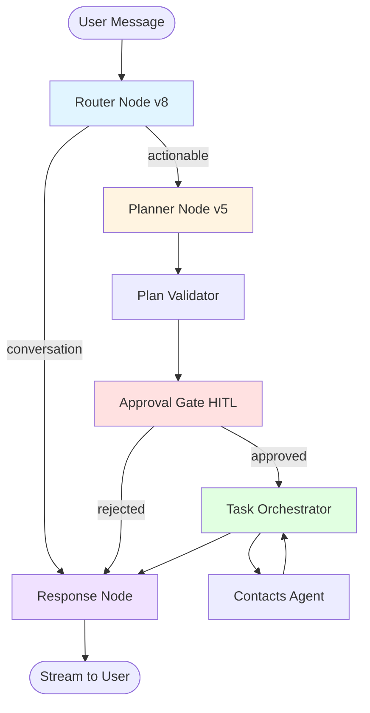

# Architecture Multi-Agents avec LangGraph

> Architecture complète du système d'orchestration multi-agents : graphes, nodes, routing, orchestration et exécution

## 📋 Table des Matières

- [Vue d'Ensemble](#vue-densemble)
- [LangGraph StateGraph](#langgraph-stategraph)
- [MessagesState Structure](#messagesstate-structure)
- [Nodes du Graphe](#nodes-du-graphe)
- [Routing & Flow](#routing--flow)
- [Orchestration & Plans](#orchestration--plans)
- [Registry & Catalogue](#registry--catalogue)
- [Context Management](#context-management)
- [Patterns d'Implémentation](#patterns-dimplémentation)
- [Performance & Optimisation](#performance--optimisation)

---

## 🎯 Vue d'Ensemble

L'architecture multi-agents de LIA repose sur **LangGraph 1.1.2**, un framework d'orchestration qui permet de construire des workflows d'agents complexes avec :

- **State Management** : État centralisé avec reducers immutables
- **Checkpointing** : Persistence automatique à chaque node
- **Streaming** : SSE streaming natif pour UX temps-réel
- **Human-in-the-Loop** : Interrupts pour approbation utilisateur
- **Parallel Execution** : Exécution asynchrone native

### Principes Clés

1. **Stateless Nodes** : Chaque node est une pure function `(state) → updates`
2. **Immutable State** : State updates via reducers, jamais de mutation in-place
3. **Checkpoint-Based Persistence** : PostgreSQL persistence automatique
4. **Event-Driven** : Communication via events (SSE, webhooks)
5. **Observability-First** : Métriques et logs à chaque étape

---

## 🔷 LangGraph StateGraph

### Construction du Graphe

```python
# apps/api/src/domains/agents/graph.py

from langgraph.graph import StateGraph, END
from langgraph.checkpoint.postgres.aio import AsyncPostgresSaver

async def build_graph(
    config: Settings | None = None,
    checkpointer: AsyncPostgresSaver | None = None
) -> tuple[CompiledStateGraph, BaseStore]:
    """
    Construit le graphe LangGraph avec tous les nodes et edges.

    Returns:
        - CompiledStateGraph : Graphe compilé prêt à l'exécution
        - BaseStore : Tool context store (InjectedStore pour tools)
    """
    # 1. Récupérer le store pour les tools
    store = await get_tool_context_store()

    # 2. Initialiser le graphe avec MessagesState
    graph = StateGraph(MessagesState)

    # 3. Ajouter les nodes
    graph.add_node(NODE_COMPACTION, compaction_node)  # F4: Context compaction
    graph.add_node(NODE_ROUTER, router_node)
    graph.add_node(NODE_PLANNER, planner_node)
    graph.add_node(NODE_APPROVAL_GATE, approval_gate_node)
    graph.add_node(NODE_TASK_ORCHESTRATOR, task_orchestrator_node)
    graph.add_node(AGENT_CONTACTS, contacts_agent_node)
    graph.add_node(NODE_RESPONSE, response_node)

    # 4. Définir l'entry point (F4: compaction before router)
    graph.set_entry_point(NODE_COMPACTION)
    graph.add_edge(NODE_COMPACTION, NODE_ROUTER)

    # 5. Ajouter les edges conditionnels
    graph.add_conditional_edges(
        NODE_ROUTER,
        route_from_router,
        {NODE_PLANNER: NODE_PLANNER, NODE_RESPONSE: NODE_RESPONSE},
    )

    graph.add_conditional_edges(
        NODE_APPROVAL_GATE,
        route_from_approval_gate,
        {
            NODE_TASK_ORCHESTRATOR: NODE_TASK_ORCHESTRATOR,
            NODE_RESPONSE: NODE_RESPONSE
        },
    )

    # 6. Ajouter les edges directs
    graph.add_edge(NODE_PLANNER, NODE_APPROVAL_GATE)
    graph.add_edge(NODE_TASK_ORCHESTRATOR, NODE_RESPONSE)
    graph.add_edge(AGENT_CONTACTS, NODE_RESPONSE)
    graph.add_edge(NODE_RESPONSE, END)

    # 7. Obtenir le checkpointer du registry
    if checkpointer is None:
        registry = get_global_registry()
        checkpointer = registry._checkpointer

    # 8. Compiler avec checkpointer ET store
    compiled_graph = graph.compile(
        checkpointer=checkpointer,
        store=store,
    )

    logger.info(
        "graph_built_successfully",
        nodes=7,
        checkpoint_enabled=checkpointer is not None
    )

    return compiled_graph, store
```

### Diagramme du Graphe



### Node Constants

```python
# apps/api/src/domains/agents/constants.py

# Node names (used in graph construction)
NODE_ROUTER = "router"
NODE_PLANNER = "planner"
NODE_APPROVAL_GATE = "approval_gate"
NODE_TASK_ORCHESTRATOR = "task_orchestrator"
NODE_RESPONSE = "response"

# Agent names
AGENT_CONTACTS = "contacts_agent"
AGENT_HUE = "hue_agent"

# Special nodes
END = "__end__"  # LangGraph built-in
```

---

## 📦 MessagesState Structure

### TypedDict Schema

```python
# apps/api/src/domains/agents/models.py

from typing import TypedDict, Annotated
from langchain_core.messages import BaseMessage
from langgraph.graph.message import add_messages

class MessagesState(TypedDict):
    """
    État central du graphe LangGraph.

    Chaque field est soit :
    - Un type simple : remplacé à chaque update
    - Annotated avec reducer : merged via la fonction reducer
    """

    # ============================================================
    # MESSAGE MANAGEMENT
    # ============================================================

    messages: Annotated[list[BaseMessage], add_messages_with_truncate]
    """
    Messages de conversation avec truncation automatique.
    Reducer : add_messages_with_truncate (4 étapes) :
        1. RemoveMessage handling (pour HITL)
        2. Token truncation (max 100k tokens)
        3. Message count limit (max 50 messages)
        4. Orphan tool messages removal
    """

    # ============================================================
    # ROUTING & ORCHESTRATION
    # ============================================================

    routing_history: list[RouterOutput]
    """Historique des décisions de routing (pour analytics)."""

    orchestration_plan: OrchestratorPlan | None
    """Plan séquentiel (Phase 3, deprecated en faveur de execution_plan)."""

    execution_plan: ExecutionPlan | None
    """Plan LLM-generated avec steps multi-étapes (Phase 5+)."""

    completed_steps: dict[str, Any]
    """
    Résultats des steps exécutés (Phase 5.2B).
    Format : {step_id: result}
    """

    # ============================================================
    # TURN-BASED RESULT ISOLATION
    # ============================================================

    current_turn_id: int
    """
    Compteur de tours de conversation (0-indexed).
    Incrémenté à chaque message utilisateur.
    Permet l'isolation des résultats par tour.
    """

    agent_results: dict[str, Any]
    """
    Résultats des agents, isolés par tour.
    Format clé : "turn_id:agent_name" (ex: "3:contacts_agent")

    Limité à max 30 entrées via cleanup_dict_by_turn_id().
    Raison : Évite de couper au milieu d'un tour d'exécution.

    Exemples :
        {
            "3:contacts_agent": {"contacts": [...]},
            "3:emails_agent": {"emails": [...]},
            "4:contacts_agent": {"contacts": [...]}
        }
    """

    # ============================================================
    # USER CONTEXT
    # ============================================================

    user_timezone: str
    """Timezone utilisateur (ex: "Europe/Paris") pour contexte temporal."""

    user_language: str
    """Langue utilisateur (ex: "fr", "en") pour réponses localisées."""

    oauth_scopes: list[str]
    """Scopes OAuth actifs des connecteurs (ex: ["contacts.readonly"])."""

    # ============================================================
    # HITL PHASE 8 (Plan-Level Approval)
    # ============================================================

    validation_result: ValidationResult | None
    """Résultat de validation du plan (errors, warnings)."""

    approval_evaluation: ApprovalEvaluation | None
    """Évaluation des stratégies d'approbation (requires_approval, reasons)."""

    plan_approved: bool | None
    """Décision utilisateur : True (APPROVE), False (REJECT), None (pending)."""

    plan_rejection_reason: str | None
    """Raison du rejet (si REJECT), utilisée dans response_node."""

    # ============================================================
    # METADATA
    # ============================================================

    metadata: dict[str, Any]
    """
    Métadonnées de session.
    Contient : user_id, session_id, run_id, timestamps, etc.
    """

    _schema_version: str
    """
    Version du schema pour migrations forward-compatible.
    Actuel : "1.0"
    """
```

### Reducers Personnalisés

#### add_messages_with_truncate (Principal)

```python
# apps/api/src/domains/agents/models.py

def add_messages_with_truncate(
    left: list[BaseMessage],
    right: list[BaseMessage] | BaseMessage,
) -> list[BaseMessage]:
    """
    Reducer personnalisé pour messages avec truncation multi-étapes.

    Pipeline :
        1. add_messages() - LangGraph built-in (handle RemoveMessage)
        2. trim_messages() - Token-based truncation (max 100k tokens)
        3. Fallback - Message count limit (max 50 messages)
        4. remove_orphan_tool_messages() - Validation OpenAI sequence

    Args:
        left : Messages existants dans state
        right : Nouveaux messages à ajouter

    Returns:
        Liste merged + truncated + validated

    Performance :
        - Sans truncation : 75,000 tokens (500 messages)
        - Avec truncation : 5,000 tokens (50 messages)
        - Reduction : 93%
    """
    # Étape 1 : Merge avec handling RemoveMessage
    merged = add_messages(left, right)

    # Étape 2 : Truncation par tokens
    truncated = trim_messages(
        merged,
        max_tokens=MAX_TOKENS_HISTORY,  # 100,000
        strategy="last",  # Keep most recent
        token_counter=token_counter,  # tiktoken o200k_base
        include_system=True,  # Always preserve SystemMessage
    )

    # Étape 3 : Fallback si toujours trop de messages
    if len(truncated) > MAX_MESSAGES_HISTORY:  # 50
        system_messages = [m for m in truncated if isinstance(m, SystemMessage)]
        conversational = [m for m in truncated if not isinstance(m, SystemMessage)]
        truncated = system_messages + conversational[-MAX_MESSAGES_HISTORY:]

    # Étape 4 : Validation OpenAI sequence
    validated = remove_orphan_tool_messages(truncated)

    return validated
```

#### cleanup_dict_by_turn_id (Agent Results)

```python
# apps/api/src/domains/agents/utils/state_cleanup.py

def cleanup_dict_by_turn_id(
    results: dict[str, Any],
    max_results: int = 30,
    label: str = "results",
) -> dict[str, Any]:
    """
    Nettoie dict avec clés "turn_id:agent_name" en gardant tours complets.

    Algorithm :
        1. Grouper résultats par turn_id
        2. Trier turns par ID (décroissant)
        3. Accumuler tours complets jusqu'à max_results
        4. Retourner dict nettoyé

    Raison : Ne pas couper au milieu d'un tour d'exécution.

    Example :
        Input (45 results) :
            {
                "3:contacts_agent": {...},
                "3:emails_agent": {...},
                "3:calendar_agent": {...},
                "4:contacts_agent": {...},
                ...
                "10:contacts_agent": {...}
            }

        Output (30 results, tours 6-10 complets) :
            {
                "6:contacts_agent": {...},
                "6:emails_agent": {...},
                ...
                "10:contacts_agent": {...}
            }
    """
    if not results or len(results) <= max_results:
        return results

    # Grouper par turn_id
    by_turn: dict[int, dict] = {}
    for key, value in results.items():
        try:
            turn_id_str, agent_name = key.split(":", 1)
            turn_id = int(turn_id_str)
            if turn_id not in by_turn:
                by_turn[turn_id] = {}
            by_turn[turn_id][key] = value
        except ValueError:
            continue  # Skip malformed keys

    # Trier turns (most recent first)
    sorted_turns = sorted(by_turn.keys(), reverse=True)

    # Accumuler tours complets
    cleaned = {}
    for turn_id in sorted_turns:
        turn_results = by_turn[turn_id]
        if len(cleaned) + len(turn_results) <= max_results:
            cleaned.update(turn_results)
        else:
            break  # Stop if adding next turn exceeds max

    removed = len(results) - len(cleaned)
    if removed > 0:
        logger.debug(
            f"{label}_cleanup_applied",
            original=len(results),
            cleaned=len(cleaned),
            removed=removed
        )

    return cleaned
```

---

## 🔷 Nodes du Graphe

### 1. Router Node (Architecture v3)

**Fichier** : `apps/api/src/domains/agents/nodes/router_node_v3.py`

**Role** : Query analysis et routing via QueryAnalyzerService.

**Décisions** :
- `conversation` → Direct vers Response (réponse conversationnelle)
- `actionable` → Vers Planner (requiert orchestration multi-étapes)

**Output Schema (v8)** :
```python
class RouterOutput(BaseModel):
    intention: Literal["conversation", "actionable", "unclear"]
    confidence: float  # 0.0 - 1.0
    context_label: Literal["general", "contact", "email", "calendar"]
    next_node: Literal["response", "planner"]
    domains: list[str]  # NEW in v8: ["contacts", "email"]
    reasoning: str  # 1-2 phrases
```

**Implémentation** :
```python
@node_with_metrics(node_name=NODE_ROUTER)
async def router_node(state: MessagesState) -> dict:
    """
    Router node v8 : Binary classification avec domain detection.

    Features :
        - Message windowing (5 turns) pour performance
        - Multi-provider support (OpenAI, Anthropic, DeepSeek)
        - Structured output via with_structured_output()
        - Token tracking automatique
        - Fallback rules si confiance < 0.6

    Flow :
        1. Window messages (derniers 5 tours)
        2. Build prompt avec contexte temporal
        3. Invoke LLM (router_llm)
        4. Parse structured output
        5. Apply fallback rules
        6. Record metrics
        7. Return routing decision
    """
    # 1. Message windowing (5 turns = ~10 messages = ~1500 tokens)
    windowed = get_router_windowed_messages(state["messages"])

    # 2. Contexte temporal
    datetime_context = get_current_datetime_context(
        user_timezone=state["user_timezone"],
        user_language=state["user_language"]
    )

    # 3. Load prompt
    router_prompt = load_prompt(
        "router_system_prompt",
        version=settings.router_prompt_version,  # v8 par défaut
    )

    # 4. Format avec contexte
    formatted_prompt = router_prompt.format(datetime_context=datetime_context)

    # 5. Create LLM avec structured output
    router_llm = create_llm(
        llm_type="router",
        provider=settings.router_llm_provider,  # openai, anthropic, etc.
    )

    structured_llm = router_llm.with_structured_output(RouterOutput)

    # 6. Invoke avec config (pour token tracking)
    config = enrich_config_with_node_metadata(
        RunnableConfig(
            configurable={"thread_id": state["metadata"].get("session_id")}
        ),
        node_name=NODE_ROUTER
    )

    messages = [
        SystemMessage(content=formatted_prompt),
        *windowed,
    ]

    response: RouterOutput = await structured_llm.ainvoke(messages, config=config)

    # 7. Fallback rules (Rule #1 du prompt v8)
    if response.confidence < 0.6:
        logger.warning(
            "router_low_confidence_fallback",
            original_intention=response.intention,
            confidence=response.confidence
        )
        response.intention = "conversation"
        response.next_node = "response"

    # 8. Record decision metrics
    router_decisions_total.labels(
        intention=response.intention,
        confidence_bucket=_confidence_bucket(response.confidence)
    ).inc()

    # 9. Return state updates
    return {
        "routing_history": [response],
        "metadata": {
            **state["metadata"],
            "router_decision": response.intention,
            "router_confidence": response.confidence,
            "domains_detected": response.domains,
        }
    }
```

**Prompt Key Rules (v8)** :
1. **Fallback basse confiance** : SI confidence < 0.6 → TOUJOURS `next_node="response"`
2. **Domain Detection** : Identifier domaines impliqués (contacts, email, calendar)
3. **Anti-hallucination** : Analyser syntaxe uniquement, PAS les données
4. **Verbes de recherche** : "recherche", "trouve", "cherche" → Nouvelle recherche
5. **Binary routing** : Simplification conversation OU actionable

### 2. Planner Node (Architecture v3)

**Fichier** : `apps/api/src/domains/agents/nodes/planner_node_v3.py`

**Role** : Smart planning avec SmartPlannerService et catalogue filtre (89% token savings).

**Output** : `ExecutionPlan` avec steps, dependencies, conditions

**Implémentation** :
```python
@node_with_metrics(node_name=NODE_PLANNER)
async def planner_node(state: MessagesState) -> dict:
    """
    Planner node v5 : Génère ExecutionPlan JSON avec optimization -70% tokens.

    Features :
        - Message windowing (10 turns)
        - Prompt caching optimization (v2)
        - Domain filtering (80% reduction catalogue)
        - Retry logic avec feedback (max 3 attempts)
        - Schema validation stricte
        - Cost estimation automatique

    ExecutionPlan DSL :
        - StepType : TOOL, CONDITIONAL, REPLAN, HUMAN
        - Dependencies : depends_on = [step_ids]
        - Parameters : Dict avec type coercion
        - Conditions : Python expressions eval-safe
    """
    # 1. Message windowing (10 turns = ~20 messages = ~3000 tokens)
    windowed = get_planner_windowed_messages(state["messages"])

    # 2. Domain filtering (use router domains if available)
    domains = state["metadata"].get("domains_detected", [])
    catalogue_json = get_filtered_catalogue(domains) if domains else get_full_catalogue()

    # 3. Load prompt v5
    planner_prompt = load_prompt(
        "planner_system_prompt",
        version=settings.planner_prompt_version,  # v5 par défaut
    )

    # 4. Format avec catalogue
    formatted_prompt = planner_prompt.replace("{catalogue_json}", catalogue_json)

    # 5. Create LLM
    planner_llm = create_llm(llm_type="planner")
    structured_llm = planner_llm.with_structured_output(ExecutionPlan)

    # 6. Retry loop avec feedback
    max_retries = 3
    validation_errors = []

    for attempt in range(max_retries):
        try:
            # Invoke LLM
            messages = [SystemMessage(content=formatted_prompt), *windowed]

            if validation_errors:
                # Add feedback from previous attempt
                feedback = format_validation_errors(validation_errors)
                messages.append(SystemMessage(content=f"ERREURS À CORRIGER:\n{feedback}"))

            plan: ExecutionPlan = await structured_llm.ainvoke(messages)

            # Validate plan
            validator = PlanValidator()
            validation_result = validator.validate(plan)

            if validation_result.is_valid:
                logger.info("planner_plan_generated", steps=len(plan.steps), attempt=attempt)
                return {
                    "execution_plan": plan,
                    "validation_result": validation_result,
                }

            # Invalid, retry avec feedback
            validation_errors = validation_result.errors
            planner_retries.labels(
                retry_attempt=attempt,
                validation_error_type=validation_errors[0].error_code if validation_errors else "unknown"
            ).inc()

        except Exception as e:
            logger.error("planner_error", error=str(e), attempt=attempt)
            if attempt == max_retries - 1:
                raise

    # Max retries exceeded
    raise PlannerMaxRetriesExceeded(f"Failed after {max_retries} attempts")
```

**ExecutionPlan Schema** :
```python
class ExecutionStep(BaseModel):
    step_id: str  # Unique identifier
    step_type: Literal["TOOL", "CONDITIONAL", "REPLAN", "HUMAN"]
    agent_name: str  # "contacts_agent", "emails_agent", "hue_agent"
    tool_name: str | None  # "search_contacts_tool"
    description: str  # Human-readable
    parameters: dict[str, Any]  # Tool parameters
    depends_on: list[str]  # step_ids prerequisites
    approvals_required: bool = False  # Step-level override

class ExecutionPlan(BaseModel):
    steps: list[ExecutionStep]
    execution_mode: Literal["sequential", "parallel"]
    estimated_cost_usd: float  # Based on tools cost profiles
    max_cost_usd: float = 1.0  # Budget limit
    metadata: dict[str, Any] = {}
```

### 3. Approval Gate Node (Phase 8)

**Fichier** : `apps/api/src/domains/agents/nodes/approval_gate_node.py`

**Rôle** : Human-in-the-Loop plan-level approval AVANT exécution.

**Features** :
- Évaluation 5 stratégies d'approbation
- Génération question LLM multilingue
- Interrupt user avec plan summary
- Process decisions : APPROVE / REJECT / EDIT / REPLAN

**Implémentation** :
```python
@node_with_metrics(node_name=NODE_APPROVAL_GATE)
async def approval_gate_node(state: MessagesState) -> dict:
    """
    Approval Gate : HITL plan-level approval (Phase 8).

    Flow :
        1. Evaluate approval strategies
        2. IF requires_approval:
            a. Build PlanSummary
            b. Generate LLM question
            c. Interrupt user
            d. Wait for decision
            e. Process decision (APPROVE/REJECT/EDIT)
        3. Return state with plan_approved flag

    Strategies :
        1. ManifestBasedStrategy (MAIN)
        2. CostThresholdStrategy
        3. DataSensitivityStrategy
        4. RoleBasedStrategy
        5. CompositeStrategy
    """
    plan = state["execution_plan"]

    if not plan:
        return {}  # No plan to approve

    # 1. Evaluate approval strategies
    evaluator = ApprovalEvaluator(strategies=[
        ManifestBasedStrategy(),
        CostThresholdStrategy(threshold=settings.approval_cost_threshold_usd),
    ])

    evaluation = evaluator.evaluate(plan, context={
        "user_id": state["metadata"]["user_id"],
        "user_timezone": state["user_timezone"],
        "user_language": state["user_language"],
    })

    # 2. Store evaluation in state
    state_updates = {"approval_evaluation": evaluation}

    # 3. Check if approval required
    if not evaluation.requires_approval:
        logger.info("approval_gate_auto_approved", reasons=evaluation.reasons)
        hitl_plan_decisions.labels(decision="AUTO_APPROVE").inc()
        return {**state_updates, "plan_approved": True}

    # 4. Build plan summary for user
    plan_summary = _build_plan_summary(plan, state)

    # 5. Generate LLM question
    question_or_error = await _build_approval_request(
        plan_summary,
        evaluation,
        state["user_language"]
    )

    if isinstance(question_or_error, str) and question_or_error.startswith("ERROR"):
        # Fallback question
        question = f"Je vais exécuter {len(plan.steps)} actions. Autorises-tu ?"
        hitl_plan_approval_question_fallback.labels(error_type="llm_failure").inc()
    else:
        question = question_or_error

    # 6. Interrupt user avec question
    logger.info("approval_gate_interrupt", question_length=len(question))

    # LangGraph interrupt pattern
    raise NodeInterrupt(
        value={
            "type": "plan_approval",
            "question": question,
            "plan_summary": plan_summary.dict(),
            "approval_reasons": evaluation.reasons,
        }
    )

    # 7. After resumption (user responded), process decision
    # This code runs when graph is resumed after interrupt
    decision = state.get("plan_approved")

    if decision is True:
        logger.info("approval_gate_approved")
        hitl_plan_decisions.labels(decision="APPROVE").inc()
        return state_updates

    elif decision is False:
        logger.info("approval_gate_rejected", reason=state.get("plan_rejection_reason"))
        hitl_plan_decisions.labels(decision="REJECT").inc()
        return {
            **state_updates,
            "plan_approved": False,
        }

    else:
        # EDIT case handled in service layer (plan_editor)
        logger.info("approval_gate_edited")
        hitl_plan_decisions.labels(decision="EDIT").inc()
        return state_updates
```

Pour les détails HITL complets, voir [HITL.md](./HITL.md)

### 4. Task Orchestrator Node

**Fichier** : `apps/api/src/domains/agents/nodes/task_orchestrator_node.py`

**Rôle** : Exécution parallèle du plan avec dependency graph.

**Features** :
- Dependency graph construction
- Wave-based execution (toutes les steps prêtes en parallèle)
- asyncio.gather() pour concurrence native
- Error handling avec retry
- Result aggregation par turn_id

**Implémentation** :
```python
@node_with_metrics(node_name=NODE_TASK_ORCHESTRATOR)
async def task_orchestrator_node(state: MessagesState) -> dict:
    """
    Task Orchestrator : Exécution parallèle du plan.

    Algorithm :
        1. Build dependency graph
        2. Identify waves (groups of independent steps)
        3. FOR each wave:
            a. Execute steps in parallel (asyncio.gather)
            b. Collect results
            c. Update context
        4. Aggregate results avec turn_id isolation
        5. Cleanup old results
    """
    plan = state["execution_plan"]

    if not plan or not plan.steps:
        return {}

    # 1. Increment turn_id
    turn_id = state.get("current_turn_id", 0) + 1

    # 2. Build dependency graph
    dep_graph = DependencyGraph.from_plan(plan)
    waves = dep_graph.compute_waves()

    logger.info(
        "orchestrator_execution_start",
        total_steps=len(plan.steps),
        waves=len(waves),
        turn_id=turn_id
    )

    # 3. Execute waves
    all_results = {}

    for wave_idx, wave_steps in enumerate(waves):
        logger.info(f"orchestrator_wave_{wave_idx}_start", steps=len(wave_steps))

        # Execute steps in parallel
        tasks = [
            _execute_step(step, state, all_results)
            for step in wave_steps
        ]

        wave_results = await asyncio.gather(*tasks, return_exceptions=True)

        # Collect results
        for step, result in zip(wave_steps, wave_results):
            if isinstance(result, Exception):
                logger.error("orchestrator_step_failed", step_id=step.step_id, error=str(result))
                all_results[step.step_id] = {"error": str(result)}
            else:
                all_results[step.step_id] = result

    # 4. Aggregate avec turn_id
    agent_results = state.get("agent_results", {})

    for step_id, result in all_results.items():
        step = next(s for s in plan.steps if s.step_id == step_id)
        key = f"{turn_id}:{step.agent_name}"
        agent_results[key] = result

    # 5. Cleanup old results (keep max 30)
    cleaned_results = cleanup_dict_by_turn_id(agent_results, max_results=30)

    # 6. Return state updates
    return {
        "current_turn_id": turn_id,
        "agent_results": cleaned_results,
        "completed_steps": all_results,
    }
```

### 5. Response Node

**Fichier** : `apps/api/src/domains/agents/nodes/response_node.py`

**Rôle** : Synthèse intelligente des résultats agents et streaming.

**Features** :
- Message windowing (20 turns)
- Anti-hallucination patterns
- Agent results injection AVANT history
- Rejection override handling
- SSE streaming natif
- Photo HTML post-processing

**Implémentation** :
```python
@node_with_metrics(node_name=NODE_RESPONSE)
async def response_node(state: MessagesState) -> dict:
    """
    Response Node : Synthèse créative et streaming.

    Critical Message Order :
        1. SystemMessage (prompt)
        2. SystemMessage (rejection_override) - HIGHEST priority
        3. SystemMessage (agent_results) - BEFORE history!
        4. MessagesPlaceholder (conversation history)

    Raison : Agent results DOIVENT primer sur conversation patterns.
    """
    # 1. Message windowing (20 turns = ~40 messages = ~6000 tokens)
    windowed = get_response_windowed_messages(state["messages"])

    # 2. Load response prompt
    response_prompt = load_prompt(
        "response_system_prompt",
        version=settings.response_prompt_version,  # v1
    )

    # 3. Format avec contexte
    datetime_context = get_current_datetime_context(
        state["user_timezone"],
        state["user_language"]
    )
    formatted_prompt = response_prompt.format(datetime_context=datetime_context)

    # 4. Build agent_results context
    turn_id = state["current_turn_id"]
    agent_results = state.get("agent_results", {})

    # Filter results for current turn
    current_results = {
        k: v for k, v in agent_results.items()
        if k.startswith(f"{turn_id}:")
    }

    agent_results_text = format_agent_results(current_results) if current_results else ""

    # 5. Rejection override (HITL REJECT)
    rejection_override = ""
    if state.get("plan_approved") is False:
        reason = state.get("plan_rejection_reason", "L'utilisateur a refusé l'exécution.")
        rejection_override = f"""
IMPORTANT : L'utilisateur a REFUSÉ le plan d'action.
Raison : {reason}

Tu DOIS expliquer que l'action n'a PAS été exécutée et proposer des alternatives.
"""

    # 6. Build messages avec ordre CRITIQUE
    messages = [
        SystemMessage(content=formatted_prompt),
        SystemMessage(content=rejection_override) if rejection_override else None,
        SystemMessage(content=f"RÉSULTATS AGENTS:\n{agent_results_text}") if agent_results_text else None,
        *windowed,
    ]
    messages = [m for m in messages if m is not None]

    # 7. Create LLM
    response_llm = create_llm(llm_type="response")

    # 8. Stream response
    config = enrich_config_with_node_metadata(
        RunnableConfig(callbacks=[...]),
        node_name=NODE_RESPONSE
    )

    full_response = ""
    async for chunk in response_llm.astream(messages, config=config):
        if hasattr(chunk, "content"):
            full_response += chunk.content

    # 9. Post-processing (photo HTML, etc.)
    processed_response = post_process_response(full_response, current_results)

    # 10. Return as AIMessage
    return {
        "messages": [AIMessage(content=processed_response)]
    }
```

**Anti-Hallucination Rule #1** :
```
SI résultats d'agents fournis → TU DOIS EXCLUSIVEMENT utiliser ces données

❌ DANGEREUX:
User: "Cherche Jean"
Agent: NO_RESULTS
Response: "Je n'ai pas trouvé Jean, peut-être tu pensais à Jeanne?"
→ HALLUCINATION! (inventing alternatives)

✅ CORRECT:
User: "Cherche Jean"
Agent: NO_RESULTS
Response: "Je n'ai pas trouvé de contact nommé Jean."
```

---

## 🔀 Routing & Flow

### Route Functions

**route_from_router** :
```python
def route_from_router(state: MessagesState) -> str:
    """
    Détermine le prochain node basé sur la décision du router.

    Returns:
        NODE_PLANNER si actionable
        NODE_RESPONSE si conversation
    """
    routing_history = state.get("routing_history", [])

    if not routing_history:
        return NODE_RESPONSE  # Fallback safe

    last_decision = routing_history[-1]

    return last_decision.next_node  # "planner" ou "response"
```

**route_from_approval_gate** :
```python
def route_from_approval_gate(state: MessagesState) -> str:
    """
    Route basé sur l'approbation du plan.

    Returns:
        NODE_TASK_ORCHESTRATOR si approved
        NODE_RESPONSE si rejected
    """
    if state.get("plan_approved") is True:
        return NODE_TASK_ORCHESTRATOR
    else:
        return NODE_RESPONSE
```

### Conditional Edges

```python
# Dans build_graph()
graph.add_conditional_edges(
    source=NODE_ROUTER,
    path=route_from_router,  # Function qui retourne le next node
    path_map={
        NODE_PLANNER: NODE_PLANNER,
        NODE_RESPONSE: NODE_RESPONSE,
    }
)
```

**LangGraph compile cette structure en** :
```
IF route_from_router(state) == "planner":
    next_node = NODE_PLANNER
ELIF route_from_router(state) == "response":
    next_node = NODE_RESPONSE
```

---

## 🎯 Orchestration & Plans

### ExecutionPlan DSL

**Step Types** :
1. **TOOL** : Invocation d'un tool (search_contacts_tool, etc.)
2. **CONDITIONAL** : Branchement conditionnel (if/else)
3. **REPLAN** : Régénérer le plan (si contexte change)
4. **HUMAN** : Demander input utilisateur

**Dependencies** :
```python
{
    "step_id": "check_results",
    "step_type": "CONDITIONAL",
    "condition": "len($steps.search.contacts) > 0",
    "on_success": "get_details",  # step_id
    "on_fail": "not_found",       # step_id
    "depends_on": ["search"]      # Prerequisites
}
```

**Validation Rules** :
- `on_success` et `on_fail` DOIVENT référencer step_ids existants
- Forbidden : "done", "error", "end", "success" (reserved keywords)
- Circular dependencies détectées et rejetées

### Parallel Execution

```python
# apps/api/src/domains/agents/orchestration/parallel_executor.py

class ParallelExecutor:
    """Exécute steps indépendantes en parallèle avec asyncio."""

    async def execute_wave(
        self,
        steps: list[ExecutionStep],
        context: dict
    ) -> dict[str, Any]:
        """
        Execute une wave de steps en parallèle.

        Args:
            steps : Steps sans dépendances mutuelles
            context : Context global (agent_results, etc.)

        Returns:
            Dict {step_id: result}
        """
        tasks = [self._execute_step(step, context) for step in steps]

        # asyncio.gather avec return_exceptions pour resilience
        results = await asyncio.gather(*tasks, return_exceptions=True)

        return {
            step.step_id: result
            for step, result in zip(steps, results)
        }
```

**Performance** :
- Sequential : 3 tools × 2s each = 6s total
- Parallel : max(2s, 2s, 2s) = 2s total
- **Speedup : 3x**

---

## 📚 Registry & Catalogue

### Agent Registry

**Fichier** : `apps/api/src/domains/agents/registry/agent_registry.py`

**Rôle** : Singleton centralisé pour accès aux agents, tools, checkpointer.

```python
class AgentRegistry:
    """
    Centralized registry (singleton pattern).

    Responsibilities :
        - Store compiled graph
        - Store checkpointer
        - Store tool context store
        - Manage agent builders
    """
    _instance: "AgentRegistry | None" = None

    def __init__(self):
        self._graph: CompiledStateGraph | None = None
        self._checkpointer: AsyncPostgresSaver | None = None
        self._store: BaseStore | None = None
        self._builders: dict[str, AgentBuilder] = {}

    @classmethod
    def get_instance(cls) -> "AgentRegistry":
        """Singleton access."""
        if cls._instance is None:
            cls._instance = cls()
        return cls._instance

    async def initialize(self):
        """Initialize graph, checkpointer, store."""
        self._checkpointer = await get_checkpointer()
        self._graph, self._store = await build_graph(checkpointer=self._checkpointer)
        logger.info("agent_registry_initialized")

    def get_graph(self) -> CompiledStateGraph:
        if not self._graph:
            raise RuntimeError("Registry not initialized")
        return self._graph

# Global access
def get_global_registry() -> AgentRegistry:
    return AgentRegistry.get_instance()
```

### Tool Catalogue

**Fichier** : `apps/api/src/domains/agents/registry/catalogue.py`

**Structure** :
```json
{
  "version": "1.0",
  "domains": [
    {
      "name": "contacts",
      "display_name": "Google Contacts",
      "agents": [
        {
          "agent_name": "contacts_agent",
          "tools": [
            {
              "tool_name": "search_contacts_tool",
              "description": "Recherche contacts par query",
              "parameters": {
                "query": {"type": "string", "required": true},
                "max_results": {"type": "integer", "default": 10}
              },
              "permissions": {
                "required_scopes": ["contacts.readonly"],
                "hitl_required": false
              },
              "cost_profile": {
                "estimated_tokens": 500,
                "estimated_latency_ms": 2000
              }
            }
          ]
        }
      ]
    }
  ]
}
```

**Domain Filtering (Phase 3)** :
- Router détecte domains : ["contacts"]
- Planner reçoit catalogue filtré (80% reduction)
- Tokens saved : 15,000 → 3,000 (80%)

---

## 🗂️ Context Management

### ToolContextManager

**Fichier** : `apps/api/src/domains/agents/context/manager.py`

**Rôle** : Gestion du contexte per-domain avec namespace isolation.

**Storage** : LangGraph Store (InMemoryStore ou PostgreSQL)

**Namespace Pattern** :
```
("user_id", "session_id", "context", "domain")

Examples :
  ("user_123", "session_abc", "context", "contacts")
  ("user_123", "session_abc", "context", "email")
```

**Operations** :
```python
class ToolContextManager:
    async def save_items(
        self,
        domain: str,
        items: list[dict],
        namespace: tuple[str, ...]
    ):
        """Save items to store avec auto-indexing."""
        for idx, item in enumerate(items):
            item_id = f"{domain}_{idx}"
            await self.store.aput(
                namespace=namespace + (domain,),
                key=item_id,
                value=item
            )

    async def get_by_reference(
        self,
        reference: str,  # "2", "premier", "Jean"
        domain: str,
        namespace: tuple[str, ...]
    ) -> dict | None:
        """Resolve reference avec fuzzy matching."""
        items = await self.list_items(domain, namespace)
        return resolve_reference(reference, items)

    async def set_current_item(
        self,
        item: dict,
        domain: str,
        namespace: tuple[str, ...]
    ):
        """Set current item (pour "ses détails", "ce contact")."""
        await self.store.aput(
            namespace=namespace + (domain,),
            key="current",
            value=item
        )
```

**Reference Resolution** :
- **Ordinal** : "premier", "2ème", "dernier" → Index-based
- **Numeric** : "2", "3" → Index-based
- **Name** : "Jean" → Fuzzy match sur name fields
- **Current** : "ce contact", "celui-ci" → Last set current

---

## 🎨 Patterns d'Implémentation

### 1. Node Decorator (Metrics)

```python
# apps/api/src/domains/agents/nodes/decorators.py

def node_with_metrics(node_name: str):
    """
    Decorator pour auto-instrumentation des nodes.

    Adds :
        - Execution time tracking
        - Success/error counters
        - Context size gauge
        - Structured logging
    """
    def decorator(func):
        @wraps(func)
        async def wrapper(state: MessagesState, config: RunnableConfig = None) -> dict:
            start_time = time.perf_counter()

            try:
                # Execute node
                result = await func(state, config)

                # Record success
                duration = time.perf_counter() - start_time
                agent_node_executions_total.labels(
                    node_name=node_name,
                    status="success"
                ).inc()

                agent_node_duration_seconds.labels(node_name=node_name).observe(duration)

                logger.info(
                    "node_execution_complete",
                    node=node_name,
                    duration_ms=round(duration * 1000),
                    state_updates=list(result.keys()) if result else []
                )

                return result

            except Exception as e:
                # Record error
                agent_node_executions_total.labels(
                    node_name=node_name,
                    status="error"
                ).inc()

                logger.error(
                    "node_execution_failed",
                    node=node_name,
                    error=str(e),
                    exc_info=True
                )

                raise

        return wrapper
    return decorator
```

### 2. Streaming Pattern (SSE)

```python
# apps/api/src/domains/agents/api/service.py

async def process_message(
    conversation_id: UUID,
    user_message: str,
    user_id: UUID,
) -> AsyncGenerator[ServerSentEvent, None]:
    """
    Stream graph execution via SSE.

    SSE Format :
        data: {"type": "metadata", ...}
        data: {"type": "token", "content": "Hello"}
        data: {"type": "complete", ...}
    """
    # Build config with thread_id for checkpoint loading
    config = RunnableConfig(
        configurable={"thread_id": str(conversation_id)},
        callbacks=[TokenTrackingCallback(), ...],
    )

    # Create input state
    input_state = MessagesState(
        messages=[HumanMessage(content=user_message)],
        metadata={"user_id": str(user_id), ...},
    )

    # Stream graph execution
    async for event in graph.astream(input_state, config=config):
        # event = {node_name: {state_updates}}
        for node_name, state_updates in event.items():
            if node_name == NODE_RESPONSE:
                # Extract AIMessage content
                messages = state_updates.get("messages", [])
                for msg in messages:
                    if isinstance(msg, AIMessage):
                        yield ServerSentEvent(
                            data=json.dumps({
                                "type": "token",
                                "content": msg.content
                            })
                        )

    # Send complete event
    yield ServerSentEvent(
        data=json.dumps({"type": "complete"})
    )
```

### 3. Checkpoint Loading Pattern

```python
# LangGraph automatic checkpoint loading

# First invocation (no checkpoint)
config = RunnableConfig(configurable={"thread_id": "conv_123"})
await graph.ainvoke(input_state, config=config)

# Checkpointer behavior :
# 1. Before each node: Load checkpoint for thread_id (or None if first)
# 2. Merge loaded state with input_state (input takes precedence)
# 3. Execute node with merged state
# 4. After node: Save checkpoint for thread_id
# 5. Next invocation: Repeat from step 1

# Second invocation (checkpoint exists)
await graph.ainvoke(new_input_state, config=config)
# Automatically loads previous state and merges
```

---

## ⚡ Performance & Optimisation

### Message Windowing Impact

| Node | Window Size | Token Reduction | Latency Improvement |
|------|-------------|-----------------|---------------------|
| **Router** | 5 turns | 93% | 68% faster (at 50 turns) |
| **Planner** | 10 turns | 85% | 42% faster |
| **Response** | 20 turns | 70% | 52% TTFT improvement |

### Domain Filtering Impact

```
Sans filtering :
  - Full catalogue : 20,000 tokens
  - Planner prompt : 23,000 tokens total
  - Cost : $0.058 per request

Avec filtering (contacts only) :
  - Filtered catalogue : 4,000 tokens (80% reduction)
  - Planner prompt : 7,000 tokens total
  - Cost : $0.018 per request
  - Savings : 69%
```

### Parallel Execution Gains

```
Sequential execution (3 tools) :
  - search_contacts : 2s
  - get_details : 2s
  - update_contact : 2s
  Total : 6s

Parallel execution (wave-based) :
  Wave 1 : [search_contacts] : 2s
  Wave 2 : [get_details, update_contact] : max(2s, 2s) = 2s
  Total : 4s
  Speedup : 1.5x

Best case (all independent) :
  Parallel : max(2s, 2s, 2s) = 2s
  Speedup : 3x
```

### Checkpoint Performance

```
Save (aput) : 5-20ms
  - Serialization (pickle) : 2-5ms
  - PostgreSQL INSERT : 3-15ms

Load (aget) : 5-15ms
  - PostgreSQL SELECT : 2-10ms
  - Deserialization : 3-5ms

Total overhead per node : 10-35ms
Percentage of total latency : 0.3-0.6%
```

---

## 📚 Références

### Documentation Interne
- [STATE_AND_CHECKPOINT.md](./STATE_AND_CHECKPOINT.md) - State management détaillé
- [HITL.md](./HITL.md) - Human-in-the-Loop architecture
- [PROMPTS.md](./PROMPTS.md) - Système de prompts versionnés
- [TOOLS.md](./TOOLS.md) - Architecture des tools

### LangGraph Documentation
- **LangGraph Concepts** : https://langchain-ai.github.io/langgraph/concepts/
- **StateGraph API** : https://langchain-ai.github.io/langgraph/reference/graphs/
- **Checkpointing** : https://langchain-ai.github.io/langgraph/concepts/persistence/
- **Human-in-the-Loop** : https://langchain-ai.github.io/langgraph/concepts/human_in_the_loop/

### Exemples de Code
- Voir `apps/api/src/domains/agents/` pour l'implémentation complète
- Voir `apps/api/tests/agents/` pour exemples de tests

---

---

## 🆕 Nodes Avancés (Phase 7+)

### HITL Dispatch Node (Phase 7)

**Fichier** : `apps/api/src/domains/agents/nodes/hitl_dispatch_node.py` (852 lignes)

**Rôle** : Dispatcher HITL générique avec priorité ordering.

**Gère 3 types d'interactions** :
1. **Draft Critique** (highest priority) - Review before send
2. **Entity Disambiguation** - Multiple matches resolution
3. **Tool Confirmation** - Sensitive operation approval

```python
@node_with_metrics(node_name="hitl_dispatch")
async def hitl_dispatch_node(state: MessagesState) -> dict:
    """
    Generic HITL dispatcher combining 3 interaction types.

    Priority Order:
        1. draft_critique (user reviews generated content)
        2. entity_disambiguation (user clarifies which entity)
        3. tool_confirmation (user confirms sensitive action)
    """
```

### Semantic Validator Node (Phase 7)

**Fichier** : `apps/api/src/domains/agents/nodes/semantic_validator_node.py` (299 lignes)

**Rôle** : Valide les plans contre l'intention utilisateur.

**Détecte** :
- Cardinality mismatches (demande 1, plan retourne 10)
- Missing dependencies (tool requires data not available)
- Scope overflow (plan exceeds request scope)

### Clarification Node

**Fichier** : `apps/api/src/domains/agents/nodes/clarification_node.py` (331 lignes)

**Rôle** : Gère les interrupts de clarification du semantic validator.

---

## 🔄 Adaptive Re-Planner (Phase E - INTELLIPLANNER)

**Fichier** : `apps/api/src/domains/agents/orchestration/adaptive_replanner.py` (939 lignes)

**Rôle** : Analyse post-exécution et récupération intelligente des échecs.

### Failure Patterns Detected

| Pattern | Example | Recovery Strategy |
|---------|---------|-------------------|
| **Empty Results** | No contacts found | Suggest broader search |
| **Partial Failure** | 2/3 steps succeeded | Retry failed steps |
| **Semantic Mismatch** | Asked for email, got contacts | Re-route to correct agent |
| **Rate Limit** | 429 from Google API | Exponential backoff |
| **Auth Failure** | OAuth token expired | Prompt re-authentication |
| **Timeout** | Step exceeded 30s | Retry with smaller scope |
| **Data Validation** | Invalid email format | Return validation error |

### Data-Driven Recovery

```python
class AdaptiveReplanner:
    async def analyze_and_recover(
        self,
        execution_results: dict[str, StepResult],
        original_plan: ExecutionPlan,
        state: MessagesState
    ) -> ReplanDecision:
        """
        Analyze execution results and decide recovery strategy.

        Returns:
            ReplanDecision with:
                - should_replan: bool
                - recovery_strategy: str
                - modified_plan: ExecutionPlan | None
                - user_message: str (explanation for user)
        """
```

---

## 🔐 Secure Plan Editor

**Fichier** : `apps/api/src/domains/agents/orchestration/plan_editor.py` (756 lignes)

**Architecture à 3 niveaux** :
1. **PlanEditor** (base) - Basic edit operations
2. **EnhancedPlanEditor** - Undo/redo history
3. **SecurePlanEditor** - Injection detection

### Injection Detection

```python
class SecurePlanEditor(EnhancedPlanEditor):
    """Plan editor with security validation."""

    INJECTION_PATTERNS = [
        r"\$\{.*\}",           # Template injection
        r"__.*__",             # Python dunder
        r"eval\s*\(",          # Eval calls
        r"exec\s*\(",          # Exec calls
        r"import\s+",          # Import statements
        r"subprocess",         # Subprocess calls
    ]

    def validate_edit(self, edit: PlanEdit) -> ValidationResult:
        """Check edit for injection attempts."""
        for pattern in self.INJECTION_PATTERNS:
            if re.search(pattern, str(edit.new_value)):
                return ValidationResult(
                    is_valid=False,
                    error="Potential injection detected"
                )
```

---

## 📊 Metrics Updated

### Node Line Counts (Current)

| Node | Lines | Status |
|------|-------|--------|
| router_node_v3 | ~270 | Production (Architecture v3) |
| planner_node_v3 | ~200 | Production (Architecture v3) |
| response_node | 2,932 | Production |
| approval_gate_node | 821 | Production |
| task_orchestrator_node | 848 | Production |
| hitl_dispatch_node | 852 | Production (Phase 8.1) |
| clarification_node | 331 | Production |
| semantic_validator_node | 299 | Production |
| **Total Nodes** | **~10,874** | |

### Service Line Counts

| Service | Lines | Purpose |
|---------|-------|---------|
| OrchestrationService | 1,209 | Graph execution |
| SmartPlannerService | ~1,100 | Single-call planning (Architecture v3) |
| QueryAnalyzerService | ~400 | LLM query analysis (Architecture v3) |
| SemanticIntentDetector | 448 | **New - E5 embeddings** |
| ContextResolutionService | 905 | Turn-based context |
| AdaptiveReplanner | 939 | **Phase E - Recovery** |
| HITLOrchestrator | 1,401 | HITL coordination |
| ResumptionStrategies | 1,437 | **Advanced HITL** |
| **Total Services** | **~11,949** | |

---

## 📚 Références Additionnelles

### Documentation Interne
- [SEMANTIC_INTENT_DETECTION.md](./SEMANTIC_INTENT_DETECTION.md) - Détection d'intention sémantique
- [PLANNER.md](./PLANNER.md) - Architecture du planner (Phase 7)
- [ROUTER.md](./ROUTER.md) - Architecture du router (Phase 7)

---

**GRAPH_AND_AGENTS_ARCHITECTURE.md** - Version 2.0 - Décembre 2025

*Architecture LangGraph Multi-Agents LIA - Phase 7 Update*
